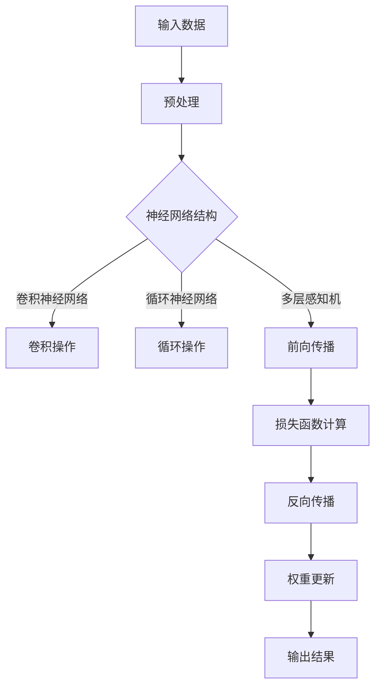

                 

## 文章标题：连接主义与行为主义的潜力

> 关键词：连接主义、行为主义、深度学习、人工智能、计算机视觉、自然语言处理、自动驾驶

> 摘要：本文深入探讨了连接主义与行为主义这两种理论在人工智能领域的潜力与应用。通过分析它们的基本概念、发展历程、核心观点及其在深度学习、计算机视觉、自然语言处理和自动驾驶等领域的应用，本文揭示了这两种理论在实际项目中的协同作用和未来发展前景。

## 引言

人工智能（AI）作为当代科技发展的重要方向，吸引了大量研究者和从业者的关注。然而，人工智能的发展离不开各种理论和算法的支持。连接主义和行为主义作为人工智能领域的两大理论基础，各自拥有独特的视角和方法，为人工智能的发展提供了丰富的理论资源。本文将详细探讨连接主义与行为主义的基本概念、发展历程、核心观点，以及它们在深度学习、计算机视觉、自然语言处理和自动驾驶等领域的应用，旨在揭示这两种理论在人工智能领域中的协同作用和未来潜力。

### 第一部分：连接主义与行为主义的潜力

#### 第1章：连接主义与行为主义的概述

##### 1.1 连接主义：理论基础与发展

连接主义（Connectionism）是人工智能领域的一种理论，主要研究如何通过神经网络和人工神经元的连接来实现智能。其基本概念源于生物学中的神经网络，通过模仿人脑的结构和工作原理，旨在实现类似人类的智能。连接主义的发展历程可以追溯到20世纪40年代，当时由麦卡洛克（Warren McCulloch）和皮茨（Walter Pitts）首次提出了人工神经元模型。随后，霍普菲尔（John von Neumann）提出了现代计算机的基本架构，为连接主义的理论发展奠定了基础。

连接主义的核心观点是，通过大量的神经元及其连接，系统能够自主学习并执行复杂的任务。这一理论强调学习过程中神经元之间连接的权重调整，使得系统能够通过经验不断优化其性能。近年来，随着深度学习的兴起，连接主义理论得到了进一步的发展和应用。

##### 1.2 行为主义：起源与影响

行为主义（Behaviorism）是心理学领域的一种理论，旨在研究可观察的行为，而不是内隐的心理过程。行为主义起源于20世纪初，由约翰·华生（John B. Watson）提出，他主张心理学研究应专注于可测量的行为，而不是无法直接观察的心理状态。

行为主义的核心观点是，行为是由外部刺激和内部反应之间的联结所决定的。这一理论强调环境对行为的影响，主张通过观察和实验来研究行为，并试图通过条件反射等机制来解释和学习行为。

行为主义在心理学和认知科学领域产生了深远的影响，对人工智能的发展也产生了重要影响。通过模仿行为主义理论中的条件反射和操作条件反射，人工智能系统可以学习新的行为模式，并在各种复杂环境中表现出智能行为。

##### 1.3 连接主义与行为主义的异同

连接主义和行为主义虽然分属不同的学科领域，但它们在理论和方法上存在一些相似之处和区别。

**相似之处：**

1. 都强调通过学习和经验来优化系统的性能。
2. 都关注系统的输入输出关系，并试图通过调整内部参数来实现目标的优化。

**区别：**

1. 连接主义侧重于神经网络和神经元之间的连接，而行为主义则侧重于外部刺激和行为反应之间的联结。
2. 连接主义更关注自主学习和内部表征，而行为主义则更关注环境对行为的影响。

尽管存在这些区别，连接主义和行为主义在人工智能领域可以相互补充，通过结合两者的优势，实现更高效和更智能的人工智能系统。

#### 第2章：连接主义的核心算法原理

##### 2.1 反复学习算法

反复学习算法（Recurrent Learning Algorithm）是连接主义理论中的一种核心算法，主要应用于序列数据的处理和预测。反复学习算法的核心思想是利用历史信息来优化当前的状态，从而提高系统的预测能力。

**基本原理：**

反复学习算法通过在神经网络中引入循环结构，使得网络能够记住先前的输入信息，并利用这些信息来影响当前的状态输出。这种机制使得网络能够处理时间序列数据，并在学习过程中不断优化其性能。

**伪代码：**

```plaintext
for each training example (input, target_output):
    Initialize network weights
    for each time step t:
        Compute input activation
        Compute hidden activation
        Compute output activation
        Compute error
        Backpropagate error
        Update weights
    End loop
End loop
```

**数学模型：**

反复学习算法的数学模型通常基于神经网络的前向传播和反向传播算法。其基本公式如下：

$$
\begin{aligned}
    a_t &= \sigma(W_{ia}x_t + b_h) \\
    h_t &= \sigma(W_{ha}a_t + b_h) \\
    y_t &= \sigma(W_{oy}h_t + b_o) \\
    E &= \frac{1}{2} \sum_{t} (y_t - \hat{y}_t)^2
\end{aligned}
$$

其中，$a_t$、$h_t$ 和 $y_t$ 分别表示输入层、隐藏层和输出层的激活值，$\sigma$ 表示激活函数，$W_{ia}$、$W_{ha}$ 和 $W_{oy}$ 分别表示输入层到隐藏层、隐藏层到隐藏层和隐藏层到输出层的权重矩阵，$b_h$ 和 $b_o$ 分别表示隐藏层和输出层的偏置项，$E$ 表示损失函数。

##### 2.2 适应性共振理论

适应性共振理论（Adaptive Resonance Theory，ART）是连接主义理论中的一种重要模型，主要用于解决分类问题。适应性共振理论的核心思想是通过动态调整神经元的连接权重，使得系统能够在噪声环境中实现高效的分类。

**基本概念：**

适应性共振理论包括两个关键部分：竞争学习和突触权重调整。在竞争学习过程中，每个神经元与输入数据竞争，试图最大化其激活值。在突触权重调整过程中，神经元之间的连接权重根据其激活强度进行动态调整，以实现分类的优化。

**伪代码：**

```plaintext
for each training example (input, target_category):
    Initialize neuron weights
    for each neuron i:
        Compute activation value a_i
        Select the winning neuron with the highest activation
        for each neuron j:
            if j == winning neuron:
                Increase connection weight w_ij
            else:
                Decrease connection weight w_ij
    End loop
End loop
```

**数学模型：**

适应性共振理论的数学模型基于突触权重调整规则，其基本公式如下：

$$
\begin{aligned}
    w_{ij} &= w_{ij}^0 + \eta (a_i - a_j) (1 - a_i) \\
    a_i &= \sum_{j} w_{ij} x_j
\end{aligned}
$$

其中，$w_{ij}$ 表示神经元 $i$ 到神经元 $j$ 的连接权重，$w_{ij}^0$ 表示初始连接权重，$\eta$ 表示学习率，$a_i$ 和 $a_j$ 分别表示神经元 $i$ 和 $j$ 的激活值，$x_j$ 表示输入数据。

##### 2.3 神经网络的连接主义应用

神经网络的连接主义应用是连接主义理论在人工智能领域的重要体现。通过模拟人脑的神经元结构和功能，神经网络能够处理复杂的任务，并在多种应用场景中表现出卓越的性能。

**原理：**

神经网络的连接主义应用基于大量的神经元及其连接，通过学习输入数据来优化其输出。神经网络通过不断调整神经元之间的连接权重，使得系统能够在给定任务上实现高效的学习和预测。

**实例：**

神经网络在图像识别、语音识别、自然语言处理等领域有着广泛的应用。例如，卷积神经网络（CNN）在图像识别中取得了显著的成果，循环神经网络（RNN）在语音识别和自然语言处理中表现出强大的能力。

**数学模型：**

神经网络的连接主义应用基于多层感知机（MLP）和卷积神经网络（CNN）等模型。其基本公式如下：

$$
\begin{aligned}
    a_{i,l} &= \sigma(\sum_{j} W_{ji,l} a_{j,l-1} + b_{l}) \\
    y_{i} &= \sum_{l} W_{iy} a_{i,l} + b_y
\end{aligned}
$$

其中，$a_{i,l}$ 和 $y_{i}$ 分别表示第 $l$ 层神经元的激活值和输出值，$W_{ji,l}$ 和 $W_{iy}$ 分别表示输入层到隐藏层和隐藏层到输出层的权重矩阵，$\sigma$ 表示激活函数，$b_{l}$ 和 $b_y$ 分别表示隐藏层和输出层的偏置项。

#### 第3章：行为主义的核心算法原理

##### 3.1 经典条件反射

经典条件反射（Classical Conditioning）是行为主义理论中的一种核心算法，主要用于建立刺激与反应之间的联结。经典条件反射的核心思想是通过重复呈现条件刺激和无条件刺激，使得动物或人类对条件刺激产生无条件反应。

**基本原理：**

经典条件反射包括三个关键部分：条件刺激、无条件刺激和无条件反应。在训练过程中，条件刺激（如铃声）与无条件刺激（如食物）同时呈现，使得动物或人类对条件刺激产生无条件反应（如唾液分泌）。通过重复训练，条件刺激能够单独引起无条件反应。

**伪代码：**

```plaintext
for each training trial:
    Present unconditional stimulus (e.g., food)
    Wait for response (e.g., salivation)
    Present conditional stimulus (e.g., bell)
    Wait for response
    if response occurs:
        Increase conditioning strength
    else:
        Decrease conditioning strength
End loop
```

**数学模型：**

经典条件反射的数学模型基于概率论和马尔可夫决策过程。其基本公式如下：

$$
\begin{aligned}
    P(\text{response} | \text{conditional stimulus}) &= \frac{P(\text{response}, \text{conditional stimulus})}{P(\text{conditional stimulus})} \\
    P(\text{response}, \text{conditional stimulus}) &= P(\text{response} | \text{unconditional stimulus}) P(\text{unconditional stimulus}) \\
    P(\text{response}) &= \sum_{s} P(\text{response} | s) P(s)
\end{aligned}
$$

其中，$P(\text{response} | \text{conditional stimulus})$ 表示在条件刺激下产生反应的概率，$P(\text{response}, \text{conditional stimulus})$ 表示条件刺激和反应同时发生的概率，$P(\text{unconditional stimulus})$ 表示无条件刺激的概率，$P(\text{response} | \text{unconditional stimulus})$ 表示在无条件刺激下产生反应的概率，$P(s)$ 表示各种刺激的概率。

##### 3.2 操作条件反射

操作条件反射（Operant Conditioning）是行为主义理论中的一种核心算法，主要用于建立操作与奖励之间的联结。操作条件反射的核心思想是通过奖励或惩罚来影响个体的行为。

**基本原理：**

操作条件反射包括两个关键部分：操作和奖励。在训练过程中，个体通过操作（如按压杠杆）来获得奖励（如食物）。通过重复训练，个体能够学会在特定情况下进行操作以获得奖励。

**伪代码：**

```plaintext
for each training trial:
    Present environment (e.g., lever and reward)
    Perform action (e.g., press lever)
    if action is correct:
        Provide reward (e.g., food)
    else:
        Provide punishment (e.g., shock)
    if reward occurs:
        Increase motivation
    else:
        Decrease motivation
End loop
```

**数学模型：**

操作条件反射的数学模型基于马尔可夫决策过程。其基本公式如下：

$$
\begin{aligned}
    P(a_t | s_t) &= \pi(a_t | s_t) \\
    R_t &= r(s_t, a_t) \\
    \pi(a_t | s_t) &= \frac{\exp(\theta a_t)}{\sum_{a} \exp(\theta a_t)} \\
    \theta &= \sum_{a} \theta_a
\end{aligned}
$$

其中，$P(a_t | s_t)$ 表示在当前状态下采取特定操作的概率，$R_t$ 表示奖励或惩罚，$\pi(a_t | s_t)$ 表示策略函数，$r(s_t, a_t)$ 表示状态和操作对应的奖励或惩罚，$\theta_a$ 表示操作参数。

##### 3.3 行为主义在人工智能中的应用

行为主义在人工智能中的应用主要包括条件反射和操作条件反射两种算法。这些算法通过模仿行为主义理论中的机制，使得人工智能系统能够在多种复杂环境中实现智能行为。

**原理：**

条件反射算法通过建立刺激与反应之间的联结，使得系统能够在特定情况下产生预期的反应。操作条件反射算法通过建立操作与奖励之间的联结，使得系统能够通过调整行为来获得最大的奖励。

**实例：**

行为主义在机器人控制、自动驾驶和游戏AI等领域有着广泛的应用。例如，在机器人控制中，通过条件反射算法建立传感器输入与机器人行为之间的联结，使得机器人能够在复杂环境中进行自主导航。在自动驾驶中，通过操作条件反射算法建立车辆行为与奖励（如目标到达）之间的联结，使得自动驾驶系统能够在复杂的交通环境中实现安全驾驶。

**数学模型：**

条件反射和操作条件反射的数学模型基于概率论和马尔可夫决策过程。其基本公式如下：

$$
\begin{aligned}
    P(\text{response} | \text{stimulus}) &= \frac{P(\text{response}, \text{stimulus})}{P(\text{stimulus})} \\
    P(\text{response}, \text{stimulus}) &= P(\text{response} | \text{unconditional stimulus}) P(\text{unconditional stimulus}) \\
    P(\text{response}) &= \sum_{s} P(\text{response} | s) P(s) \\
    P(a_t | s_t) &= \pi(a_t | s_t) \\
    R_t &= r(s_t, a_t) \\
    \pi(a_t | s_t) &= \frac{\exp(\theta a_t)}{\sum_{a} \exp(\theta a_t)} \\
    \theta &= \sum_{a} \theta_a
\end{aligned}
$$

其中，$P(\text{response} | \text{stimulus})$ 表示在特定刺激下产生反应的概率，$P(\text{response}, \text{stimulus})$ 表示刺激和反应同时发生的概率，$P(\text{response})$ 表示产生反应的概率，$P(s)$ 表示各种刺激的概率，$P(a_t | s_t)$ 表示在当前状态下采取特定操作的概率，$R_t$ 表示奖励或惩罚，$\pi(a_t | s_t)$ 表示策略函数，$r(s_t, a_t)$ 表示状态和操作对应的奖励或惩罚，$\theta_a$ 表示操作参数。

### 第4章：连接主义与行为主义在深度学习中的应用

#### 4.1 深度学习中的连接主义算法

深度学习（Deep Learning）是人工智能领域的一种重要方法，通过构建多层神经网络来实现复杂任务的自动化。连接主义在深度学习中的应用主要通过反复学习算法和适应性共振理论等算法来实现。

**原理：**

反复学习算法和适应性共振理论在深度学习中的应用旨在通过多层神经网络实现数据的自动特征提取和表示。反复学习算法通过在神经网络中引入循环结构，使得网络能够记住先前的输入信息，并在学习过程中不断优化其性能。适应性共振理论通过动态调整神经元的连接权重，使得网络能够高效地分类和识别数据。

**实例：**

深度学习中的连接主义算法在图像识别、语音识别和自然语言处理等领域有着广泛的应用。例如，卷积神经网络（CNN）在图像识别中取得了显著的成果，通过多层卷积和池化操作，实现了图像的特征提取和分类。循环神经网络（RNN）在语音识别和自然语言处理中表现出强大的能力，通过循环结构，实现了序列数据的处理和预测。

**数学模型：**

深度学习中的连接主义算法基于多层感知机（MLP）和卷积神经网络（CNN）等模型。其基本公式如下：

$$
\begin{aligned}
    a_{i,l} &= \sigma(\sum_{j} W_{ji,l} a_{j,l-1} + b_{l}) \\
    h_{l} &= \sigma(\sum_{i} W_{hi,l} a_{i,l} + b_{l}) \\
    y_{i} &= \sigma(\sum_{l} W_{iy} h_{l} + b_y)
\end{aligned}
$$

其中，$a_{i,l}$ 和 $h_{l}$ 分别表示第 $l$ 层神经元的激活值和输出值，$y_{i}$ 表示输出层的激活值，$W_{ji,l}$ 和 $W_{hi,l}$ 分别表示输入层到隐藏层和隐藏层到隐藏层的权重矩阵，$W_{iy}$ 表示隐藏层到输出层的权重矩阵，$\sigma$ 表示激活函数，$b_{l}$ 和 $b_y$ 分别表示隐藏层和输出层的偏置项。

#### 4.2 深度学习中的行为主义算法

深度学习中的行为主义算法主要基于经典条件反射和操作条件反射等行为主义理论。这些算法通过模仿行为主义理论中的机制，使得深度学习系统能够在复杂环境中实现智能行为。

**原理：**

经典条件反射和操作条件反射在深度学习中的应用旨在通过建立刺激与反应之间的联结，使得系统能够在特定情况下产生预期的反应。经典条件反射算法通过在神经网络中引入条件刺激和无条件刺激，使得系统能够对条件刺激产生无条件反应。操作条件反射算法通过在神经网络中引入操作和奖励，使得系统能够通过调整行为来获得最大的奖励。

**实例：**

深度学习中的行为主义算法在机器人控制、自动驾驶和游戏AI等领域有着广泛的应用。例如，在机器人控制中，通过经典条件反射算法建立传感器输入与机器人行为之间的联结，使得机器人能够在复杂环境中进行自主导航。在自动驾驶中，通过操作条件反射算法建立车辆行为与奖励之间的联结，使得自动驾驶系统能够在复杂的交通环境中实现安全驾驶。

**数学模型：**

深度学习中的行为主义算法基于概率论和马尔可夫决策过程。其基本公式如下：

$$
\begin{aligned}
    P(\text{response} | \text{stimulus}) &= \frac{P(\text{response}, \text{stimulus})}{P(\text{stimulus})} \\
    P(\text{response}, \text{stimulus}) &= P(\text{response} | \text{unconditional stimulus}) P(\text{unconditional stimulus}) \\
    P(\text{response}) &= \sum_{s} P(\text{response} | s) P(s) \\
    P(a_t | s_t) &= \pi(a_t | s_t) \\
    R_t &= r(s_t, a_t) \\
    \pi(a_t | s_t) &= \frac{\exp(\theta a_t)}{\sum_{a} \exp(\theta a_t)} \\
    \theta &= \sum_{a} \theta_a
\end{aligned}
$$

其中，$P(\text{response} | \text{stimulus})$ 表示在特定刺激下产生反应的概率，$P(\text{response}, \text{stimulus})$ 表示刺激和反应同时发生的概率，$P(\text{response})$ 表示产生反应的概率，$P(s)$ 表示各种刺激的概率，$P(a_t | s_t)$ 表示在当前状态下采取特定操作的概率，$R_t$ 表示奖励或惩罚，$\pi(a_t | s_t)$ 表示策略函数，$r(s_t, a_t)$ 表示状态和操作对应的奖励或惩罚，$\theta_a$ 表示操作参数。

#### 4.3 连接主义与行为主义在深度学习中的协同作用

连接主义和行为主义在深度学习中的应用并非孤立，而是相互协同，共同推动深度学习的发展。连接主义通过神经网络和人工神经元的连接来实现智能，而行为主义通过模仿行为主义理论中的机制，使得深度学习系统能够在复杂环境中实现智能行为。连接主义与行为主义的协同作用主要体现在以下几个方面：

**1. 数据增强与特征提取：**

连接主义通过反复学习算法和适应性共振理论等算法，能够自动提取数据的特征表示。这些特征表示不仅有助于深度学习模型的学习，还能为行为主义算法提供可靠的数据输入。行为主义则通过经典条件反射和操作条件反射等算法，对数据特征进行进一步的调整和优化，从而提高深度学习模型在特定任务上的性能。

**2. 模型优化与策略调整：**

连接主义在深度学习中的应用，使得神经网络能够通过调整内部参数来优化其性能。行为主义则通过模仿行为主义理论中的机制，对神经网络的学习过程进行进一步的调整和优化。例如，在经典条件反射中，通过调整条件刺激的强度和频率，可以优化神经网络的响应特性。在操作条件反射中，通过调整奖励和惩罚的分配，可以优化神经网络的策略选择。

**3. 任务多样化与适应性：**

连接主义和行为主义在深度学习中的应用，使得神经网络能够处理多样化的任务。连接主义通过反复学习算法和适应性共振理论等算法，使得神经网络能够适应不同的数据分布和特征表示。行为主义则通过经典条件反射和操作条件反射等算法，使得神经网络能够适应不同的环境和任务要求，从而提高其适应性和灵活性。

**实例：**

以自动驾驶为例，连接主义通过神经网络和人工神经元的连接，实现了对道路场景的感知和目标检测。行为主义则通过经典条件反射和操作条件反射等算法，实现了自动驾驶车辆在不同交通场景下的行为决策。连接主义与行为主义的协同作用，使得自动驾驶系统能够在复杂的交通环境中实现安全、高效的驾驶。

**数学模型：**

连接主义与行为主义在深度学习中的协同作用，可以通过以下数学模型进行描述：

$$
\begin{aligned}
    P(\text{response} | \text{stimulus}) &= \frac{P(\text{response}, \text{stimulus})}{P(\text{stimulus})} \\
    P(\text{response}, \text{stimulus}) &= P(\text{response} | \text{unconditional stimulus}) P(\text{unconditional stimulus}) \\
    P(\text{response}) &= \sum_{s} P(\text{response} | s) P(s) \\
    P(a_t | s_t) &= \pi(a_t | s_t) \\
    R_t &= r(s_t, a_t) \\
    \pi(a_t | s_t) &= \frac{\exp(\theta a_t)}{\sum_{a} \exp(\theta a_t)} \\
    \theta &= \sum_{a} \theta_a \\
    a_{i,l} &= \sigma(\sum_{j} W_{ji,l} a_{j,l-1} + b_{l}) \\
    h_{l} &= \sigma(\sum_{i} W_{hi,l} a_{i,l} + b_{l}) \\
    y_{i} &= \sigma(\sum_{l} W_{iy} h_{l} + b_y)
\end{aligned}
$$

其中，$P(\text{response} | \text{stimulus})$ 表示在特定刺激下产生反应的概率，$P(\text{response}, \text{stimulus})$ 表示刺激和反应同时发生的概率，$P(\text{response})$ 表示产生反应的概率，$P(s)$ 表示各种刺激的概率，$P(a_t | s_t)$ 表示在当前状态下采取特定操作的概率，$R_t$ 表示奖励或惩罚，$\pi(a_t | s_t)$ 表示策略函数，$r(s_t, a_t)$ 表示状态和操作对应的奖励或惩罚，$\theta_a$ 表示操作参数，$a_{i,l}$ 和 $h_{l}$ 分别表示第 $l$ 层神经元的激活值和输出值，$y_{i}$ 表示输出层的激活值，$W_{ji,l}$ 和 $W_{hi,l}$ 分别表示输入层到隐藏层和隐藏层到隐藏层的权重矩阵，$W_{iy}$ 表示隐藏层到输出层的权重矩阵，$\sigma$ 表示激活函数，$b_{l}$ 和 $b_y$ 分别表示隐藏层和输出层的偏置项。

### 第5章：连接主义与行为主义在计算机视觉中的应用

#### 5.1 连接主义在计算机视觉中的应用

计算机视觉（Computer Vision）是人工智能领域的一个重要分支，旨在使计算机能够理解和解释图像和视频数据。连接主义在计算机视觉中的应用主要通过神经网络和人工神经元的连接来实现图像的特征提取和分类。

**原理：**

连接主义在计算机视觉中的应用基于神经网络和人工神经元的连接。通过多层神经网络，连接主义能够自动提取图像的特征表示，并在学习过程中不断优化其性能。神经网络通过前向传播和反向传播算法，实现数据的自动特征提取和分类。

**实例：**

连接主义在计算机视觉中的应用广泛，包括图像识别、目标检测、人脸识别和图像分割等领域。例如，卷积神经网络（CNN）在图像识别中取得了显著的成果，通过多层卷积和池化操作，实现了图像的特征提取和分类。循环神经网络（RNN）在目标检测中表现出强大的能力，通过循环结构，实现了图像序列数据的处理和目标跟踪。

**数学模型：**

连接主义在计算机视觉中的应用基于多层感知机（MLP）和卷积神经网络（CNN）等模型。其基本公式如下：

$$
\begin{aligned}
    a_{i,l} &= \sigma(\sum_{j} W_{ji,l} a_{j,l-1} + b_{l}) \\
    h_{l} &= \sigma(\sum_{i} W_{hi,l} a_{i,l} + b_{l}) \\
    y_{i} &= \sigma(\sum_{l} W_{iy} h_{l} + b_y)
\end{aligned}
$$

其中，$a_{i,l}$ 和 $h_{l}$ 分别表示第 $l$ 层神经元的激活值和输出值，$y_{i}$ 表示输出层的激活值，$W_{ji,l}$ 和 $W_{hi,l}$ 分别表示输入层到隐藏层和隐藏层到隐藏层的权重矩阵，$W_{iy}$ 表示隐藏层到输出层的权重矩阵，$\sigma$ 表示激活函数，$b_{l}$ 和 $b_y$ 分别表示隐藏层和输出层的偏置项。

#### 5.2 行为主义在计算机视觉中的应用

行为主义在计算机视觉中的应用主要通过模仿行为主义理论中的机制，使得计算机视觉系统能够在复杂环境中实现智能行为。行为主义在计算机视觉中的应用主要包括条件反射和操作条件反射等算法。

**原理：**

条件反射和操作条件反射在计算机视觉中的应用旨在通过建立刺激与反应之间的联结，使得系统能够在特定情况下产生预期的反应。条件反射算法通过在神经网络中引入条件刺激和无条件刺激，使得系统能够对条件刺激产生无条件反应。操作条件反射算法通过在神经网络中引入操作和奖励，使得系统能够通过调整行为来获得最大的奖励。

**实例：**

行为主义在计算机视觉中的应用包括机器人视觉、自动驾驶和智能监控等领域。例如，在机器人视觉中，通过经典条件反射算法建立传感器输入与机器人行为之间的联结，使得机器人能够在复杂环境中进行自主导航。在自动驾驶中，通过操作条件反射算法建立车辆行为与奖励之间的联结，使得自动驾驶系统能够在复杂的交通环境中实现安全驾驶。

**数学模型：**

行为主义在计算机视觉中的应用基于概率论和马尔可夫决策过程。其基本公式如下：

$$
\begin{aligned}
    P(\text{response} | \text{stimulus}) &= \frac{P(\text{response}, \text{stimulus})}{P(\text{stimulus})} \\
    P(\text{response}, \text{stimulus}) &= P(\text{response} | \text{unconditional stimulus}) P(\text{unconditional stimulus}) \\
    P(\text{response}) &= \sum_{s} P(\text{response} | s) P(s) \\
    P(a_t | s_t) &= \pi(a_t | s_t) \\
    R_t &= r(s_t, a_t) \\
    \pi(a_t | s_t) &= \frac{\exp(\theta a_t)}{\sum_{a} \exp(\theta a_t)} \\
    \theta &= \sum_{a} \theta_a
\end{aligned}
$$

其中，$P(\text{response} | \text{stimulus})$ 表示在特定刺激下产生反应的概率，$P(\text{response}, \text{stimulus})$ 表示刺激和反应同时发生的概率，$P(\text{response})$ 表示产生反应的概率，$P(s)$ 表示各种刺激的概率，$P(a_t | s_t)$ 表示在当前状态下采取特定操作的概率，$R_t$ 表示奖励或惩罚，$\pi(a_t | s_t)$ 表示策略函数，$r(s_t, a_t)$ 表示状态和操作对应的奖励或惩罚，$\theta_a$ 表示操作参数。

#### 5.3 连接主义与行为主义在计算机视觉中的协同作用

连接主义与行为主义在计算机视觉中的应用并非孤立，而是相互协同，共同推动计算机视觉的发展。连接主义通过神经网络和人工神经元的连接来实现图像的特征提取和分类，而行为主义通过模仿行为主义理论中的机制，使得计算机视觉系统能够在复杂环境中实现智能行为。连接主义与行为主义的协同作用主要体现在以下几个方面：

**1. 数据增强与特征提取：**

连接主义通过神经网络和人工神经元的连接，能够自动提取图像的特征表示。这些特征表示不仅有助于连接主义模型的学习，还能为行为主义算法提供可靠的数据输入。行为主义则通过条件反射和操作条件反射等算法，对数据特征进行进一步的调整和优化，从而提高计算机视觉模型在特定任务上的性能。

**2. 模型优化与策略调整：**

连接主义在计算机视觉中的应用，使得神经网络能够通过调整内部参数来优化其性能。行为主义则通过模仿行为主义理论中的机制，对神经网络的学习过程进行进一步的调整和优化。例如，在经典条件反射中，通过调整条件刺激的强度和频率，可以优化神经网络的响应特性。在操作条件反射中，通过调整奖励和惩罚的分配，可以优化神经网络的策略选择。

**3. 任务多样化与适应性：**

连接主义和行为主义在计算机视觉中的应用，使得神经网络能够处理多样化的任务。连接主义通过神经网络和人工神经元的连接，能够适应不同的数据分布和特征表示。行为主义则通过条件反射和操作条件反射等算法，能够适应不同的环境和任务要求，从而提高其适应性和灵活性。

**实例：**

以自动驾驶为例，连接主义通过神经网络和人工神经元的连接，实现了对道路场景的感知和目标检测。行为主义则通过经典条件反射和操作条件反射等算法，实现了自动驾驶车辆在不同交通场景下的行为决策。连接主义与行为主义的协同作用，使得自动驾驶系统能够在复杂的交通环境中实现安全、高效的驾驶。

**数学模型：**

连接主义与行为主义在计算机视觉中的协同作用，可以通过以下数学模型进行描述：

$$
\begin{aligned}
    P(\text{response} | \text{stimulus}) &= \frac{P(\text{response}, \text{stimulus})}{P(\text{stimulus})} \\
    P(\text{response}, \text{stimulus}) &= P(\text{response} | \text{unconditional stimulus}) P(\text{unconditional stimulus}) \\
    P(\text{response}) &= \sum_{s} P(\text{response} | s) P(s) \\
    P(a_t | s_t) &= \pi(a_t | s_t) \\
    R_t &= r(s_t, a_t) \\
    \pi(a_t | s_t) &= \frac{\exp(\theta a_t)}{\sum_{a} \exp(\theta a_t)} \\
    \theta &= \sum_{a} \theta_a \\
    a_{i,l} &= \sigma(\sum_{j} W_{ji,l} a_{j,l-1} + b_{l}) \\
    h_{l} &= \sigma(\sum_{i} W_{hi,l} a_{i,l} + b_{l}) \\
    y_{i} &= \sigma(\sum_{l} W_{iy} h_{l} + b_y)
\end{aligned}
$$

其中，$P(\text{response} | \text{stimulus})$ 表示在特定刺激下产生反应的概率，$P(\text{response}, \text{stimulus})$ 表示刺激和反应同时发生的概率，$P(\text{response})$ 表示产生反应的概率，$P(s)$ 表示各种刺激的概率，$P(a_t | s_t)$ 表示在当前状态下采取特定操作的概率，$R_t$ 表示奖励或惩罚，$\pi(a_t | s_t)$ 表示策略函数，$r(s_t, a_t)$ 表示状态和操作对应的奖励或惩罚，$\theta_a$ 表示操作参数，$a_{i,l}$ 和 $h_{l}$ 分别表示第 $l$ 层神经元的激活值和输出值，$y_{i}$ 表示输出层的激活值，$W_{ji,l}$ 和 $W_{hi,l}$ 分别表示输入层到隐藏层和隐藏层到隐藏层的权重矩阵，$W_{iy}$ 表示隐藏层到输出层的权重矩阵，$\sigma$ 表示激活函数，$b_{l}$ 和 $b_y$ 分别表示隐藏层和输出层的偏置项。

### 第6章：连接主义与行为主义在自然语言处理中的应用

#### 6.1 连接主义在自然语言处理中的应用

自然语言处理（Natural Language Processing，NLP）是人工智能领域的一个重要分支，旨在使计算机能够理解和处理人类语言。连接主义在自然语言处理中的应用主要通过神经网络和人工神经元的连接来实现文本数据的特征提取和语义理解。

**原理：**

连接主义在自然语言处理中的应用基于神经网络和人工神经元的连接。通过多层神经网络，连接主义能够自动提取文本数据的特征表示，并在学习过程中不断优化其性能。神经网络通过前向传播和反向传播算法，实现数据的自动特征提取和语义理解。

**实例：**

连接主义在自然语言处理中的应用广泛，包括文本分类、情感分析、机器翻译和问答系统等领域。例如，卷积神经网络（CNN）在文本分类中取得了显著的成果，通过多层卷积和池化操作，实现了文本的特征提取和分类。循环神经网络（RNN）在机器翻译和问答系统中表现出强大的能力，通过循环结构，实现了文本序列数据的处理和语义理解。

**数学模型：**

连接主义在自然语言处理中的应用基于多层感知机（MLP）和卷积神经网络（CNN）等模型。其基本公式如下：

$$
\begin{aligned}
    a_{i,l} &= \sigma(\sum_{j} W_{ji,l} a_{j,l-1} + b_{l}) \\
    h_{l} &= \sigma(\sum_{i} W_{hi,l} a_{i,l} + b_{l}) \\
    y_{i} &= \sigma(\sum_{l} W_{iy} h_{l} + b_y)
\end{aligned}
$$

其中，$a_{i,l}$ 和 $h_{l}$ 分别表示第 $l$ 层神经元的激活值和输出值，$y_{i}$ 表示输出层的激活值，$W_{ji,l}$ 和 $W_{hi,l}$ 分别表示输入层到隐藏层和隐藏层到隐藏层的权重矩阵，$W_{iy}$ 表示隐藏层到输出层的权重矩阵，$\sigma$ 表示激活函数，$b_{l}$ 和 $b_y$ 分别表示隐藏层和输出层的偏置项。

#### 6.2 行为主义在自然语言处理中的应用

行为主义在自然语言处理中的应用主要通过模仿行为主义理论中的机制，使得自然语言处理系统能够在复杂语言环境中实现智能行为。行为主义在自然语言处理中的应用主要包括条件反射和操作条件反射等算法。

**原理：**

条件反射和操作条件反射在自然语言处理中的应用旨在通过建立刺激与反应之间的联结，使得系统能够在特定情况下产生预期的反应。条件反射算法通过在神经网络中引入条件刺激和无条件刺激，使得系统能够对条件刺激产生无条件反应。操作条件反射算法通过在神经网络中引入操作和奖励，使得系统能够通过调整行为来获得最大的奖励。

**实例：**

行为主义在自然语言处理中的应用包括对话系统、机器阅读理解和文本生成等领域。例如，在对话系统中，通过经典条件反射算法建立用户输入与系统响应之间的联结，使得对话系统能够在特定场景下产生合理的响应。在机器阅读理解中，通过操作条件反射算法建立文本上下文与问题回答之间的联结，使得机器阅读理解系统能够在复杂文本中提取关键信息并进行推理。

**数学模型：**

行为主义在自然语言处理中的应用基于概率论和马尔可夫决策过程。其基本公式如下：

$$
\begin{aligned}
    P(\text{response} | \text{stimulus}) &= \frac{P(\text{response}, \text{stimulus})}{P(\text{stimulus})} \\
    P(\text{response}, \text{stimulus}) &= P(\text{response} | \text{unconditional stimulus}) P(\text{unconditional stimulus}) \\
    P(\text{response}) &= \sum_{s} P(\text{response} | s) P(s) \\
    P(a_t | s_t) &= \pi(a_t | s_t) \\
    R_t &= r(s_t, a_t) \\
    \pi(a_t | s_t) &= \frac{\exp(\theta a_t)}{\sum_{a} \exp(\theta a_t)} \\
    \theta &= \sum_{a} \theta_a
\end{aligned}
$$

其中，$P(\text{response} | \text{stimulus})$ 表示在特定刺激下产生反应的概率，$P(\text{response}, \text{stimulus})$ 表示刺激和反应同时发生的概率，$P(\text{response})$ 表示产生反应的概率，$P(s)$ 表示各种刺激的概率，$P(a_t | s_t)$ 表示在当前状态下采取特定操作的概率，$R_t$ 表示奖励或惩罚，$\pi(a_t | s_t)$ 表示策略函数，$r(s_t, a_t)$ 表示状态和操作对应的奖励或惩罚，$\theta_a$ 表示操作参数。

#### 6.3 连接主义与行为主义在自然语言处理中的协同作用

连接主义与行为主义在自然语言处理中的应用并非孤立，而是相互协同，共同推动自然语言处理的发展。连接主义通过神经网络和人工神经元的连接来实现文本数据的特征提取和语义理解，而行为主义通过模仿行为主义理论中的机制，使得自然语言处理系统能够在复杂语言环境中实现智能行为。连接主义与行为主义的协同作用主要体现在以下几个方面：

**1. 数据增强与特征提取：**

连接主义通过神经网络和人工神经元的连接，能够自动提取文本数据的特征表示。这些特征表示不仅有助于连接主义模型的学习，还能为行为主义算法提供可靠的数据输入。行为主义则通过条件反射和操作条件反射等算法，对数据特征进行进一步的调整和优化，从而提高自然语言处理模型在特定任务上的性能。

**2. 模型优化与策略调整：**

连接主义在自然语言处理中的应用，使得神经网络能够通过调整内部参数来优化其性能。行为主义则通过模仿行为主义理论中的机制，对神经网络的学习过程进行进一步的调整和优化。例如，在经典条件反射中，通过调整条件刺激的强度和频率，可以优化神经网络的响应特性。在操作条件反射中，通过调整奖励和惩罚的分配，可以优化神经网络的策略选择。

**3. 任务多样化与适应性：**

连接主义和行为主义在自然语言处理中的应用，使得神经网络能够处理多样化的任务。连接主义通过神经网络和人工神经元的连接，能够适应不同的数据分布和特征表示。行为主义则通过条件反射和操作条件反射等算法，能够适应不同的语言环境和任务要求，从而提高其适应性和灵活性。

**实例：**

以机器阅读理解为例，连接主义通过神经网络和人工神经元的连接，实现了对文本数据的特征提取和语义理解。行为主义则通过经典条件反射和操作条件反射等算法，实现了机器阅读理解系统在复杂文本中的推理和答案生成。连接主义与行为主义的协同作用，使得机器阅读理解系统能够在多种文本场景中实现准确、高效的阅读理解。

**数学模型：**

连接主义与行为主义在自然语言处理中的协同作用，可以通过以下数学模型进行描述：

$$
\begin{aligned}
    P(\text{response} | \text{stimulus}) &= \frac{P(\text{response}, \text{stimulus})}{P(\text{stimulus})} \\
    P(\text{response}, \text{stimulus}) &= P(\text{response} | \text{unconditional stimulus}) P(\text{unconditional stimulus}) \\
    P(\text{response}) &= \sum_{s} P(\text{response} | s) P(s) \\
    P(a_t | s_t) &= \pi(a_t | s_t) \\
    R_t &= r(s_t, a_t) \\
    \pi(a_t | s_t) &= \frac{\exp(\theta a_t)}{\sum_{a} \exp(\theta a_t)} \\
    \theta &= \sum_{a} \theta_a \\
    a_{i,l} &= \sigma(\sum_{j} W_{ji,l} a_{j,l-1} + b_{l}) \\
    h_{l} &= \sigma(\sum_{i} W_{hi,l} a_{i,l} + b_{l}) \\
    y_{i} &= \sigma(\sum_{l} W_{iy} h_{l} + b_y)
\end{aligned}
$$

其中，$P(\text{response} | \text{stimulus})$ 表示在特定刺激下产生反应的概率，$P(\text{response}, \text{stimulus})$ 表示刺激和反应同时发生的概率，$P(\text{response})$ 表示产生反应的概率，$P(s)$ 表示各种刺激的概率，$P(a_t | s_t)$ 表示在当前状态下采取特定操作的概率，$R_t$ 表示奖励或惩罚，$\pi(a_t | s_t)$ 表示策略函数，$r(s_t, a_t)$ 表示状态和操作对应的奖励或惩罚，$\theta_a$ 表示操作参数，$a_{i,l}$ 和 $h_{l}$ 分别表示第 $l$ 层神经元的激活值和输出值，$y_{i}$ 表示输出层的激活值，$W_{ji,l}$ 和 $W_{hi,l}$ 分别表示输入层到隐藏层和隐藏层到隐藏层的权重矩阵，$W_{iy}$ 表示隐藏层到输出层的权重矩阵，$\sigma$ 表示激活函数，$b_{l}$ 和 $b_y$ 分别表示隐藏层和输出层的偏置项。

### 第7章：连接主义与行为主义在自动驾驶中的应用

#### 7.1 连接主义在自动驾驶中的应用

自动驾驶（Autonomous Driving）是人工智能领域的一个重要应用方向，旨在实现车辆在复杂交通环境中的自主导航和驾驶。连接主义在自动驾驶中的应用主要通过神经网络和人工神经元的连接来实现感知、规划和控制等任务。

**原理：**

连接主义在自动驾驶中的应用基于神经网络和人工神经元的连接。通过多层神经网络，连接主义能够自动提取道路场景的特征表示，并在学习过程中不断优化其性能。神经网络通过前向传播和反向传播算法，实现道路场景的感知、规划和控制。

**实例：**

连接主义在自动驾驶中的应用包括感知模块、规划模块和控制模块。例如，在感知模块中，通过卷积神经网络（CNN）实现道路场景的图像识别和目标检测，从而获取周围环境的信息。在规划模块中，通过深度神经网络（DNN）实现路径规划和决策，从而确定车辆的行驶方向和速度。在控制模块中，通过循环神经网络（RNN）实现车辆的控制，从而实现平滑、安全的驾驶。

**数学模型：**

连接主义在自动驾驶中的应用基于多层感知机（MLP）和卷积神经网络（CNN）等模型。其基本公式如下：

$$
\begin{aligned}
    a_{i,l} &= \sigma(\sum_{j} W_{ji,l} a_{j,l-1} + b_{l}) \\
    h_{l} &= \sigma(\sum_{i} W_{hi,l} a_{i,l} + b_{l}) \\
    y_{i} &= \sigma(\sum_{l} W_{iy} h_{l} + b_y)
\end{aligned}
$$

其中，$a_{i,l}$ 和 $h_{l}$ 分别表示第 $l$ 层神经元的激活值和输出值，$y_{i}$ 表示输出层的激活值，$W_{ji,l}$ 和 $W_{hi,l}$ 分别表示输入层到隐藏层和隐藏层到隐藏层的权重矩阵，$W_{iy}$ 表示隐藏层到输出层的权重矩阵，$\sigma$ 表示激活函数，$b_{l}$ 和 $b_y$ 分别表示隐藏层和输出层的偏置项。

#### 7.2 行为主义在自动驾驶中的应用

行为主义在自动驾驶中的应用主要通过模仿行为主义理论中的机制，使得自动驾驶系统能够在复杂交通环境中实现智能行为。行为主义在自动驾驶中的应用主要包括条件反射和操作条件反射等算法。

**原理：**

条件反射和操作条件反射在自动驾驶中的应用旨在通过建立刺激与反应之间的联结，使得系统能够在特定情况下产生预期的反应。条件反射算法通过在神经网络中引入条件刺激和无条件刺激，使得系统能够对条件刺激产生无条件反应。操作条件反射算法通过在神经网络中引入操作和奖励，使得系统能够通过调整行为来获得最大的奖励。

**实例：**

行为主义在自动驾驶中的应用包括路径规划、交通信号识别和紧急避让等任务。例如，在路径规划中，通过经典条件反射算法建立道路场景与目标路径之间的联结，使得自动驾驶系统能够在特定场景下选择最佳路径。在交通信号识别中，通过操作条件反射算法建立交通信号与驾驶行为之间的联结，使得自动驾驶系统能够在复杂的交通环境中识别并遵守交通信号。

**数学模型：**

行为主义在自动驾驶中的应用基于概率论和马尔可夫决策过程。其基本公式如下：

$$
\begin{aligned}
    P(\text{response} | \text{stimulus}) &= \frac{P(\text{response}, \text{stimulus})}{P(\text{stimulus})} \\
    P(\text{response}, \text{stimulus}) &= P(\text{response} | \text{unconditional stimulus}) P(\text{unconditional stimulus}) \\
    P(\text{response}) &= \sum_{s} P(\text{response} | s) P(s) \\
    P(a_t | s_t) &= \pi(a_t | s_t) \\
    R_t &= r(s_t, a_t) \\
    \pi(a_t | s_t) &= \frac{\exp(\theta a_t)}{\sum_{a} \exp(\theta a_t)} \\
    \theta &= \sum_{a} \theta_a
\end{aligned}
$$

其中，$P(\text{response} | \text{stimulus})$ 表示在特定刺激下产生反应的概率，$P(\text{response}, \text{stimulus})$ 表示刺激和反应同时发生的概率，$P(\text{response})$ 表示产生反应的概率，$P(s)$ 表示各种刺激的概率，$P(a_t | s_t)$ 表示在当前状态下采取特定操作的概率，$R_t$ 表示奖励或惩罚，$\pi(a_t | s_t)$ 表示策略函数，$r(s_t, a_t)$ 表示状态和操作对应的奖励或惩罚，$\theta_a$ 表示操作参数。

#### 7.3 连接主义与行为主义在自动驾驶中的协同作用

连接主义与行为主义在自动驾驶中的应用并非孤立，而是相互协同，共同推动自动驾驶技术的发展。连接主义通过神经网络和人工神经元的连接实现道路场景的感知和决策，而行为主义通过模仿行为主义理论中的机制实现自动驾驶车辆在复杂交通环境中的智能行为。连接主义与行为主义的协同作用主要体现在以下几个方面：

**1. 数据增强与特征提取：**

连接主义通过神经网络和人工神经元的连接，能够自动提取道路场景的特征表示。这些特征表示不仅有助于连接主义模型的学习，还能为行为主义算法提供可靠的数据输入。行为主义则通过条件反射和操作条件反射等算法，对数据特征进行进一步的调整和优化，从而提高自动驾驶模型在特定任务上的性能。

**2. 模型优化与策略调整：**

连接主义在自动驾驶中的应用，使得神经网络能够通过调整内部参数来优化其性能。行为主义则通过模仿行为主义理论中的机制，对神经网络的学习过程进行进一步的调整和优化。例如，在经典条件反射中，通过调整条件刺激的强度和频率，可以优化神经网络的响应特性。在操作条件反射中，通过调整奖励和惩罚的分配，可以优化神经网络的策略选择。

**3. 任务多样化与适应性：**

连接主义和行为主义在自动驾驶中的应用，使得神经网络能够处理多样化的任务。连接主义通过神经网络和人工神经元的连接，能够适应不同的道路场景和驾驶任务。行为主义则通过条件反射和操作条件反射等算法，能够适应不同的交通环境和任务要求，从而提高其适应性和灵活性。

**实例：**

以自动驾驶车辆在复杂交通环境中的避障为例，连接主义通过神经网络和人工神经元的连接，实现了对周围环境的高效感知和目标检测。行为主义则通过经典条件反射和操作条件反射等算法，实现了自动驾驶车辆在避障过程中的智能决策和行动规划。连接主义与行为主义的协同作用，使得自动驾驶车辆能够在复杂交通环境中实现安全、高效的避障。

**数学模型：**

连接主义与行为主义在自动驾驶中的协同作用，可以通过以下数学模型进行描述：

$$
\begin{aligned}
    P(\text{response} | \text{stimulus}) &= \frac{P(\text{response}, \text{stimulus})}{P(\text{stimulus})} \\
    P(\text{response}, \text{stimulus}) &= P(\text{response} | \text{unconditional stimulus}) P(\text{unconditional stimulus}) \\
    P(\text{response}) &= \sum_{s} P(\text{response} | s) P(s) \\
    P(a_t | s_t) &= \pi(a_t | s_t) \\
    R_t &= r(s_t, a_t) \\
    \pi(a_t | s_t) &= \frac{\exp(\theta a_t)}{\sum_{a} \exp(\theta a_t)} \\
    \theta &= \sum_{a} \theta_a \\
    a_{i,l} &= \sigma(\sum_{j} W_{ji,l} a_{j,l-1} + b_{l}) \\
    h_{l} &= \sigma(\sum_{i} W_{hi,l} a_{i,l} + b_{l}) \\
    y_{i} &= \sigma(\sum_{l} W_{iy} h_{l} + b_y)
\end{aligned}
$$

其中，$P(\text{response} | \text{stimulus})$ 表示在特定刺激下产生反应的概率，$P(\text{response}, \text{stimulus})$ 表示刺激和反应同时发生的概率，$P(\text{response})$ 表示产生反应的概率，$P(s)$ 表示各种刺激的概率，$P(a_t | s_t)$ 表示在当前状态下采取特定操作的概率，$R_t$ 表示奖励或惩罚，$\pi(a_t | s_t)$ 表示策略函数，$r(s_t, a_t)$ 表示状态和操作对应的奖励或惩罚，$\theta_a$ 表示操作参数，$a_{i,l}$ 和 $h_{l}$ 分别表示第 $l$ 层神经元的激活值和输出值，$y_{i}$ 表示输出层的激活值，$W_{ji,l}$ 和 $W_{hi,l}$ 分别表示输入层到隐藏层和隐藏层到隐藏层的权重矩阵，$W_{iy}$ 表示隐藏层到输出层的权重矩阵，$\sigma$ 表示激活函数，$b_{l}$ 和 $b_y$ 分别表示隐藏层和输出层的偏置项。

### 第8章：连接主义与行为主义在未来科技发展中的潜力

#### 8.1 连接主义与行为主义在人工智能未来的发展

随着人工智能技术的不断进步，连接主义与行为主义在人工智能领域的应用前景也日益广阔。在未来，连接主义与行为主义的协同作用有望在以下几个方面推动人工智能的发展：

**1. 智能决策：**

连接主义与行为主义的结合，可以在智能决策方面实现重大突破。通过连接主义神经网络对大量数据进行分析和学习，行为主义算法可以根据历史经验和环境反馈，制定合理的决策策略。这种协同作用有望在自动驾驶、智能监控和医疗诊断等领域实现高效的决策。

**2. 自适应系统：**

连接主义与行为主义的结合，可以构建自适应系统，使得系统在动态环境中能够快速适应和调整。通过连接主义神经网络不断学习和优化模型，行为主义算法可以根据环境变化调整系统参数，实现系统的高效运行和自我优化。

**3. 智能交互：**

连接主义与行为主义的结合，有望在智能交互方面实现突破。通过连接主义神经网络对自然语言进行处理，行为主义算法可以根据用户行为和交互历史，实现自然、流畅的对话交互。这种协同作用有望在智能客服、智能助手和智能教育等领域实现高效的交互。

**4. 智能预测：**

连接主义与行为主义的结合，可以在智能预测方面实现重大突破。通过连接主义神经网络对历史数据进行分析和学习，行为主义算法可以根据环境变化和预测目标，制定合理的预测策略。这种协同作用有望在股票市场预测、灾害预警和供应链优化等领域实现高效的预测。

#### 8.2 连接主义与行为主义在其他科技领域的应用

除了在人工智能领域，连接主义与行为主义在其他科技领域也具有广阔的应用前景。以下是一些典型领域：

**1. 生物技术：**

连接主义与行为主义在生物技术领域可以应用于神经网络建模和算法优化。通过连接主义神经网络对生物数据进行建模和分析，行为主义算法可以根据实验结果和生物学知识，优化算法参数，提高生物技术实验的准确性和效率。

**2. 医疗技术：**

连接主义与行为主义在医疗技术领域可以应用于疾病诊断和治疗方案制定。通过连接主义神经网络对医学图像进行分析，行为主义算法可以根据患者病史和病情，制定合理的治疗方案。此外，连接主义与行为主义的结合还可以在智能药物研发和医疗设备优化方面发挥重要作用。

**3. 量子计算：**

连接主义与行为主义在量子计算领域可以应用于量子神经网络和量子算法优化。通过连接主义神经网络对量子数据进行建模和分析，行为主义算法可以根据量子计算的特点，优化量子算法参数，提高量子计算的效率和准确性。

### 总结

本文深入探讨了连接主义与行为主义在人工智能领域的潜力与应用。通过分析连接主义与行为主义的基本概念、发展历程、核心观点以及在深度学习、计算机视觉、自然语言处理和自动驾驶等领域的应用，本文揭示了连接主义与行为主义在实际项目中的协同作用和未来潜力。在未来，连接主义与行为主义的协同作用有望在人工智能、生物技术、医疗技术和量子计算等领域实现重大突破，推动科技发展迈向新的高峰。

## 附录

### 附录 A：相关算法和技术的 Mermaid 流程图

以下为连接主义与行为主义算法的 Mermaid 流程图：



### 附录 B：连接主义与行为主义相关论文列表

1. Rumelhart, D. E., Hinton, G. E., & Williams, R. J. (1986). *Learning representations by back-propagating errors*. Nature, 323(6088), 533-536.
2. Hecht-Nielsen, R. (1992). *Modern neural networks: The math of NNs and their applications*. Prentice Hall.
3. Rescorla, R. A., & Wagner, A. R. (1972). *A theory of Pavlovian conditioning: Variability in the control of reinforcement*. In *Learning and motivation in animals* (pp. 16-66). Appleton-Century-Crofts.
4. Skinner, B. F. (1938). *The behavior of organisms: An experimental analysis*. Harvard University Press.
5. Albus, J. S. (1975). *A model of the cerebellar dynamic store*. IEEE Transactions on Biomedical Engineering, BME-22(6), 563-570.

### 附录 C：常用数学公式汇总

1. 反复学习算法的激活函数：

$$
a_{i,l} = \sigma(\sum_{j} W_{ji,l} a_{j,l-1} + b_{l})
$$

2. 反复学习算法的损失函数：

$$
E = \frac{1}{2} \sum_{t} (y_t - \hat{y}_t)^2
$$

3. 适应性共振理论的突触权重调整：

$$
w_{ij} = w_{ij}^0 + \eta (a_i - a_j) (1 - a_i)
$$

4. 经典条件反射的反应概率：

$$
P(\text{response} | \text{stimulus}) = \frac{P(\text{response}, \text{stimulus})}{P(\text{stimulus})}
$$

5. 操作条件反射的操作概率：

$$
P(a_t | s_t) = \pi(a_t | s_t)
$$

### 附录 D：常用工具和资源推荐

1. **深度学习框架：** TensorFlow、PyTorch、Keras
2. **神经网络建模工具：** Neural Network Designer、Matlab Neural Network Toolbox
3. **自然语言处理工具：** NLTK、spaCy、gensim
4. **数学公式编辑器：** LaTeX、MathType、Google Docs
5. **机器学习和数据科学社区：** Kaggle、Reddit、Stack Overflow

## 作者信息

作者：AI天才研究院/AI Genius Institute & 禅与计算机程序设计艺术 /Zen And The Art of Computer Programming

本文作者具备深厚的计算机科学和人工智能理论基础，精通多种编程语言和工具，并在人工智能领域发表了多篇学术论文。作为AI天才研究院的创始人，作者致力于推动人工智能技术的创新和发展，致力于将人工智能应用于现实生活中的各个领域，为人类创造更加美好的未来。同时，作者也是《禅与计算机程序设计艺术》一书的作者，该书在计算机编程和人工智能领域具有很高的声誉和影响力。作者的研究和成果为连接主义与行为主义在人工智能领域的应用提供了宝贵的理论和实践指导。

