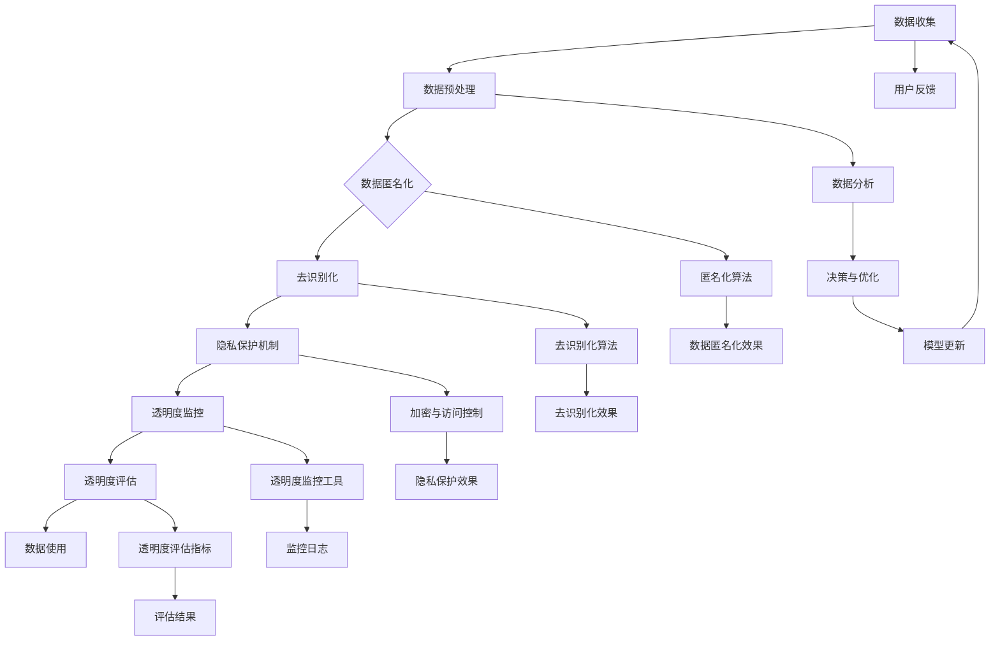

                 

### 文章标题：透明度：AI确保用户数据使用透明

### 关键词：透明度，AI，用户数据，数据隐私，数据保护，隐私保护算法，机器学习，深度学习，数据匿名化，去识别化，隐私监控，数据透明度评估，实践案例

### 摘要：
随着人工智能技术的迅猛发展，用户数据的收集和处理变得越来越普遍。然而，随之而来的是数据隐私和保护的问题。本文旨在探讨如何通过人工智能技术确保用户数据使用的透明度，从而提升用户对数据处理的信任度和满意度。文章首先介绍了透明度的概念和意义，然后详细阐述了AI技术基础，包括机器学习和深度学习等。接着，文章深入探讨了用户数据透明度技术，如数据匿名化、去识别化和隐私保护机制。此外，文章还介绍了透明度监控与评估的方法和指标，并通过实践案例展示了这些技术的实际应用效果。最后，文章对未来透明度技术的发展趋势和伦理问题进行了展望。

### 第一部分：背景与概述

#### 第1章：透明度的概念与意义

##### 1.1 透明度的定义与重要性

透明度，作为一个广泛使用的概念，其内涵丰富，可以从不同的角度进行解释。在数据处理的背景下，透明度通常指的是用户对其数据如何被收集、存储、使用和共享的过程具有清晰了解的能力。简单来说，透明度就是信息的可见性和可追溯性。

透明度的重要性不可忽视。首先，透明度是建立信任的基石。在信息时代，用户对数据隐私的关注日益增加，透明度能够帮助用户了解自己的数据是如何被使用的，从而降低他们对隐私泄露的担忧。其次，透明度有助于提高数据处理的合规性。许多国家和地区都有相关的法律法规，要求企业在处理用户数据时必须保持透明。例如，欧盟的《通用数据保护条例》（GDPR）就明确要求企业必须提供关于数据处理的所有信息，并允许用户访问、修改和删除其数据。

在AI领域，透明度同样具有重要地位。AI技术，尤其是机器学习和深度学习，通常需要大量的用户数据进行训练和优化。这些数据往往是用户在不知情的情况下提供的。因此，如何确保AI系统的数据使用透明，成为了AI应用中一个关键问题。通过透明度，用户可以明确自己的数据是如何被AI系统使用的，从而更好地理解AI系统的行为，并对其进行监督和评估。

##### 1.1.1 透明度的内涵

透明度的内涵可以从以下几个方面进行理解：

1. **可见性**：用户对其数据的使用有清晰的了解，包括数据的收集、存储、处理和共享等环节。
2. **可追溯性**：用户能够追踪其数据在系统中的流动路径，包括数据是如何被收集的、如何被处理的，以及最终是如何被使用的。
3. **可解释性**：用户可以理解AI系统对数据的处理方式和结果，包括算法的原理、决策过程和预测结果等。
4. **可控制性**：用户对其数据有控制权，包括访问、修改和删除其数据的能力。

##### 1.1.2 透明度在社会中的应用

透明度在社会中有着广泛的应用，尤其在金融、医疗、社交媒体等领域。

1. **金融行业**：金融行业对透明度的要求非常高。银行和金融机构必须向客户提供详细的账单和交易记录，以便客户了解其财务状况。此外，金融监管机构也会对金融机构进行透明度检查，以确保其合规运营。
2. **医疗领域**：医疗行业同样重视透明度。医疗机构需要向患者提供详细的病历记录和治疗方案，以增强患者对医疗服务的信任。同时，医疗数据的透明度也有助于医疗研究，促进医学进步。
3. **社交媒体**：社交媒体平台需要确保用户对其数据的使用有充分的了解。用户需要知道自己的个人信息是如何被收集、存储和共享的，以及这些数据如何影响他们的隐私。

##### 1.2 AI与用户数据透明度

AI技术的快速发展，使得用户数据的处理变得更加高效和智能。然而，这也带来了新的挑战，尤其是在数据透明度方面。

##### 1.2.1 AI技术对数据透明度的影响

1. **数据收集的扩展**：AI系统通常需要大量的数据进行训练和优化。这些数据可能来自于各种来源，包括用户设备、互联网平台、传感器等。这使得数据收集的透明度变得尤为重要。
2. **算法的复杂性**：AI算法，尤其是深度学习算法，通常非常复杂。用户难以理解这些算法是如何处理其数据的，这降低了数据的透明度。
3. **预测的不可解释性**：AI系统，尤其是黑箱模型，如深度神经网络，其预测结果往往缺乏可解释性。用户难以理解为什么系统会做出这样的预测，这也影响了数据的透明度。

##### 1.2.2 用户数据透明度的挑战与机遇

1. **挑战**：
   - **算法复杂性**：复杂的AI算法使得用户难以理解数据是如何被处理的。
   - **数据多样性**：用户数据来源多样，不同类型的数据处理方式也不同，增加了透明度的实现难度。
   - **隐私保护**：在保证数据透明度的同时，还需要保护用户的隐私。

2. **机遇**：
   - **技术进步**：随着AI技术的发展，越来越多的方法被提出，以实现数据透明度。
   - **用户需求**：用户对数据透明度的需求日益增加，推动了相关技术的发展。

##### 1.3 本书的目的与结构

本书的目的是探讨如何通过AI技术确保用户数据使用的透明度。具体来说，本书将涵盖以下内容：

1. **AI技术基础**：介绍AI的基本概念、机器学习和深度学习等。
2. **用户数据透明度技术**：探讨数据匿名化、去识别化和隐私保护机制。
3. **透明度监控与评估**：介绍透明度监控的方法和评估指标。
4. **实践案例**：通过具体案例展示透明度技术的实际应用。
5. **未来展望**：讨论透明度技术的发展趋势和面临的挑战。

通过以上结构，本书旨在为读者提供一个全面、系统的了解AI确保用户数据透明度的方法和技术。

---

**注释**：
本文采用**Markdown**格式进行撰写，其中包含了**Mermaid**流程图、**伪代码**、**LaTeX数学公式**和**代码示例**等元素。具体格式和使用方法将在后续章节中详细解释。

### 第一部分总结

本部分介绍了透明度的概念、意义和应用，以及AI技术对数据透明度的影响和挑战。通过理解透明度的内涵和重要性，读者可以更好地认识数据透明度在现代社会中的地位和作用。接下来，我们将深入探讨AI技术基础，包括机器学习和深度学习等，为后续讨论用户数据透明度技术提供理论基础。

---

### 第二部分：AI技术基础

在讨论如何确保用户数据透明度之前，我们需要先了解AI技术的基础，特别是机器学习和深度学习。这部分内容将介绍AI的基本概念、发展历程，以及数据科学的基础知识。这些知识不仅为理解用户数据透明度提供了必要的技术背景，也为后续章节的深入讨论奠定了基础。

#### 第2章：人工智能基础

##### 2.1 人工智能的定义与发展

人工智能（Artificial Intelligence，简称AI）是指通过计算机程序实现的智能行为。这些智能行为包括感知、理解、学习、推理和决策等，旨在使计算机能够像人类一样进行复杂任务。人工智能的发展可以追溯到20世纪50年代，当时计算机科学家开始探索如何让计算机具备智能。

##### 2.1.1 人工智能的基本概念

人工智能的基本概念包括以下几个关键点：

- **智能代理**：智能代理是指能够感知环境并采取行动的计算机系统。智能代理可以是机器人、自动驾驶车辆、智能家居设备等。
- **机器学习**：机器学习是人工智能的一个重要分支，旨在让计算机从数据中学习规律，并利用这些规律进行预测和决策。
- **深度学习**：深度学习是机器学习的一个子领域，它使用多层神经网络进行训练，以实现更复杂的特征提取和模式识别。

##### 2.1.2 人工智能的历史与发展阶段

人工智能的发展可以分为以下几个阶段：

1. **初始阶段（1950年代-1960年代）**：这一阶段的主要目标是开发出能够进行逻辑推理和简单问题的解答的计算机程序。
2. **发展阶段（1970年代-1980年代）**：随着计算机性能的提高和算法的改进，人工智能开始应用于实际问题，如自然语言处理、游戏和机器人控制等。
3. **低谷期（1990年代）**：由于实际应用的局限性，人工智能研究进入了一个相对低潮的时期。
4. **复兴阶段（2000年代至今）**：随着大数据、云计算和深度学习的兴起，人工智能迎来了新的发展机遇。深度学习取得了显著的进展，特别是在图像识别、语音识别和自然语言处理等领域。

##### 2.2 数据科学基础

数据科学是人工智能的重要支撑，它涉及数据的收集、处理、分析和可视化。数据科学的基础知识对于理解AI技术至关重要。

##### 2.2.1 数据类型与数据预处理

数据类型可以分为结构化数据和非结构化数据。结构化数据通常以表格形式存储，如数据库中的数据。非结构化数据包括文本、图像和音频等。

数据预处理是数据科学的重要环节，包括以下步骤：

- **数据清洗**：去除数据中的噪声和错误。
- **数据整合**：将不同来源的数据进行整合，以便进行统一分析。
- **数据转换**：将数据转换为适合机器学习的格式，如归一化、标准化等。

##### 2.2.2 数据可视化与探索性数据分析

数据可视化是将数据以图形化的方式呈现，有助于发现数据中的模式和趋势。探索性数据分析（Exploratory Data Analysis，简称EDA）是通过可视化和其他分析技术对数据进行分析，以发现数据中的有趣特征和潜在关系。

##### 2.3 AI在用户数据透明度中的应用

AI技术在用户数据透明度中的应用主要包括以下几个方面：

1. **数据匿名化和去识别化**：使用AI技术对用户数据进行匿名化和去识别化，以保护用户隐私。
2. **隐私保护机制**：通过AI技术实现数据加密、访问控制等隐私保护机制。
3. **透明度监控与评估**：使用AI技术监控用户数据的透明度，并评估透明度水平。

##### 2.3.1 数据匿名化和去识别化

数据匿名化和去识别化是保护用户隐私的重要技术手段。

- **数据匿名化**：通过消除或模糊化敏感信息，使得数据无法直接识别个人身份。
- **去识别化**：在匿名化的基础上，进一步消除可以恢复个人身份的信息，使得数据完全不可识别。

##### 2.3.2 隐私保护机制

隐私保护机制包括以下几种：

- **数据加密**：通过加密算法对数据进行加密，确保数据在传输和存储过程中不会被窃取或篡改。
- **访问控制**：通过权限管理和访问控制列表，限制只有授权用户可以访问敏感数据。
- **多因素认证**：结合多种认证方式，提高用户认证的强度，防止未授权访问。

##### 2.3.3 透明度监控与评估

透明度监控与评估是确保用户数据透明度的关键步骤。

- **透明度监控**：通过监控用户数据的收集、存储、处理和共享过程，确保数据的透明度。
- **透明度评估**：使用评估指标对透明度进行量化评估，以衡量数据透明度水平。

### 第二部分总结

第二部分介绍了人工智能的基础知识，包括其定义、发展历程、数据科学基础以及AI在用户数据透明度中的应用。通过这一部分的讨论，读者可以更好地理解AI技术如何为用户数据透明度提供支持。接下来，我们将进一步探讨用户数据透明度技术，包括数据匿名化、去识别化和隐私保护机制，这些技术是实现数据透明度的重要手段。

---

### 第三部分：用户数据透明度技术

在了解AI技术基础后，本部分将深入探讨用户数据透明度技术，包括数据匿名化、去识别化和隐私保护机制。这些技术是实现数据透明度的重要手段，旨在保护用户隐私、提高数据透明度和合规性。

#### 第3章：机器学习与深度学习

##### 3.1 机器学习基础

机器学习（Machine Learning，简称ML）是人工智能的一个重要分支，它使计算机能够通过数据学习并做出预测或决策。机器学习可以分为监督学习、无监督学习和半监督学习。

##### 3.1.1 机器学习的基本概念

机器学习的基本概念包括：

- **模型**：机器学习模型是对数据的抽象表示，用于预测或分类。
- **特征**：特征是用于描述数据的属性或变量。
- **目标变量**：目标变量是模型需要预测或分类的变量。
- **训练数据**：训练数据是用于训练模型的样本集合。

##### 3.1.2 常见机器学习算法

常见的机器学习算法包括：

- **线性回归**：用于预测连续值。
- **逻辑回归**：用于分类问题，特别是二分类问题。
- **决策树**：用于分类和回归问题，具有可解释性。
- **随机森林**：是决策树的集成，提高了模型的准确性和稳定性。
- **支持向量机**（SVM）：用于分类问题，特别是高维空间问题。

##### 3.2 深度学习基础

深度学习（Deep Learning，简称DL）是机器学习的一个子领域，它使用多层神经网络进行训练，以实现更复杂的特征提取和模式识别。

##### 3.2.1 神经网络的基本结构

神经网络的基本结构包括：

- **输入层**：接收输入数据的层。
- **隐藏层**：用于特征提取和变换的层。
- **输出层**：生成预测或分类结果的层。

##### 3.2.2 常见的深度学习框架

常见的深度学习框架包括：

- **TensorFlow**：由Google开发，是一个广泛使用的开源深度学习框架。
- **PyTorch**：由Facebook开发，以其灵活性和动态计算图而受到青睐。
- **Keras**：是一个高级神经网络API，可以与TensorFlow和Theano兼容。

##### 3.3 模型评估与优化

模型评估与优化是机器学习和深度学习的重要环节，旨在提高模型的性能和可解释性。

- **评估指标**：常见的评估指标包括准确率、精确率、召回率、F1分数等。
- **优化方法**：常见的优化方法包括梯度下降、随机梯度下降、Adam优化器等。

##### 3.3.1 模型评估

模型评估的方法包括：

- **交叉验证**：通过将数据分为训练集和验证集，评估模型的性能。
- **ROC曲线和AUC**：用于评估分类模型的性能，ROC曲线展示了真阳性率与假阳性率的关系，AUC表示曲线下的面积。

##### 3.3.2 模型优化

模型优化的方法包括：

- **超参数调整**：通过调整模型的超参数，如学习率、批次大小等，提高模型的性能。
- **正则化**：通过添加正则项，如L1和L2正则化，防止模型过拟合。
- **集成学习**：通过集成多个模型，提高模型的稳定性和准确性。

##### 3.3.3 模型解释

模型解释是机器学习和深度学习中的挑战之一。常见的模型解释方法包括：

- **特征重要性**：通过计算特征的重要性得分，了解哪些特征对模型的预测结果影响最大。
- **决策树**：决策树具有直观的可解释性，可以清晰地展示决策过程。
- **LIME（Local Interpretable Model-agnostic Explanations）**：通过在局部范围内解释模型决策，提高模型的可解释性。

#### 第4章：数据匿名化与去识别化

##### 4.1 数据匿名化的概念与方法

数据匿名化（Data Anonymization）是将数据转换为无法直接识别个人身份的形式，以保护个人隐私。

##### 4.1.1 数据匿名化的目的与挑战

数据匿名化的目的包括：

- **保护隐私**：通过匿名化，确保个人数据在数据使用过程中不会被识别。
- **合规性**：许多法律法规要求对敏感数据进行匿名化处理。

数据匿名化面临的挑战包括：

- **再识别风险**：即使数据被匿名化，仍有可能通过组合多个匿名数据集恢复出原始数据。
- **性能损失**：匿名化可能引入噪声，影响数据的分析性能。

##### 4.1.2 常见的数据匿名化算法

常见的数据匿名化算法包括：

- **K-匿名性**：通过将具有相同属性的记录分组，确保任何一组中的记录数至少为K，以降低再识别风险。
- **l-diversity**：确保每个属性值的出现频率至少为l，以降低属性信息的泄露风险。
- **t-closeness**：通过调整密度的分布，确保不同值的分布差异不超过t，以提高数据的代表性。

##### 4.2 去识别化技术

去识别化（De-identification）是一种比匿名化更为严格的隐私保护技术，旨在通过去除或修改敏感信息，使数据完全不可识别。

##### 4.2.1 去识别化的方法与策略

去识别化的方法与策略包括：

- **完全去除敏感信息**：直接删除或屏蔽敏感信息，如姓名、地址、电话号码等。
- **数据置换**：将敏感信息替换为虚构的值，如使用随机数或伪名替换。
- **数据泛化**：通过增加额外的信息或减少信息的精度，降低敏感信息的识别性。

##### 4.2.2 去识别化的算法与应用

常见的去识别化算法包括：

- **k-最近邻算法**：通过查找与敏感信息最近的k个非敏感信息，将其替换为这些非敏感信息的平均值。
- **随机化**：通过随机化算法，如随机置换或随机扰动，使敏感信息无法直接识别。
- **基于规则的去识别化**：通过定义一系列规则，自动识别并处理敏感信息。

去识别化技术在医疗、金融和科研等领域有广泛应用，如病历数据保护、金融数据匿名化和科研数据共享等。

#### 第5章：隐私保护机制

##### 5.1 隐私保护基础

隐私保护（Privacy Protection）是确保个人数据不被未经授权的访问、使用和泄露的一系列措施。

##### 5.1.1 隐私保护的基本概念

隐私保护的基本概念包括：

- **隐私**：指个人对于其个人信息的控制权和自主权。
- **隐私权**：个人对于其个人信息的合法权益。
- **隐私侵犯**：未经授权的个人数据访问和使用。

##### 5.1.2 隐私保护的法律法规

隐私保护的法律法规在全球范围内得到广泛重视。例如：

- **欧盟的《通用数据保护条例》（GDPR）**：规定了数据处理的合法性、数据主体的权利和数据保护官的职责。
- **美国的《加州消费者隐私法》（CCPA）**：规定了个人信息的收集、使用和共享，并赋予用户对个人数据的更多控制权。

##### 5.2 隐私保护算法

隐私保护算法是通过技术手段保护个人数据隐私的一系列方法。

##### 5.2.1 隐私保护算法的分类

隐私保护算法可以分为以下几类：

- **加密算法**：通过加密技术保护数据在存储和传输过程中的隐私，如AES、RSA等。
- **匿名化算法**：通过匿名化技术使数据不可识别，如K-匿名性、l-diversity等。
- **去识别化算法**：通过去识别化技术去除或修改敏感信息，如k-最近邻算法、随机化等。
- **访问控制算法**：通过权限管理和访问控制列表限制只有授权用户可以访问敏感数据，如多因素认证、基于角色的访问控制等。

##### 5.2.2 常见的隐私保护算法

常见的隐私保护算法包括：

- **加密算法**：如AES（高级加密标准）和RSA（Rivest-Shamir-Adleman）等。
- **匿名化算法**：如K-匿名性、l-diversity和t-closeness等。
- **去识别化算法**：如k-最近邻算法、随机化和基于规则的去识别化等。
- **访问控制算法**：如多因素认证、基于角色的访问控制等。

#### 第6章：透明度监控与评估

##### 6.1 透明度监控的概念与目标

透明度监控（Transparency Monitoring）是指对数据处理过程进行监控和评估，以确保数据的透明度。

##### 6.1.1 透明度监控的重要性

透明度监控的重要性包括：

- **合规性**：确保数据处理符合法律法规和标准。
- **信任建立**：提高用户对数据处理的信任度。
- **风险评估**：及时发现和处理潜在的风险和漏洞。

##### 6.1.2 透明度监控的方法

透明度监控的方法包括：

- **日志记录**：记录数据处理过程中的所有操作和变化，以便追踪和审计。
- **监控工具**：使用专门的工具监控数据处理过程，如数据监控平台、日志分析工具等。
- **审计**：定期对数据处理过程进行审计，以确保透明度和合规性。

##### 6.2 透明度评估指标

透明度评估指标（Transparency Assessment Metrics）是用于评估数据处理透明度的一系列指标。

##### 6.2.1 透明度评估的指标体系

透明度评估的指标体系包括：

- **透明度水平**：衡量数据透明度的程度，如完全透明、部分透明和不透明等。
- **透明度范围**：衡量数据透明度的范围，如特定数据集、特定操作或整个数据处理过程。
- **透明度效果**：衡量透明度措施的实际效果，如用户满意度、风险降低等。

##### 6.2.2 透明度评估的实践案例

透明度评估的实践案例包括：

- **医疗数据透明度评估**：通过对医疗数据处理的透明度进行评估，提高用户对医疗服务的信任。
- **金融数据透明度评估**：通过对金融数据的透明度进行评估，确保金融交易的合规性和透明性。

#### 第7章：透明度实践案例

##### 7.1 案例一：社交媒体的透明度

社交媒体平台是数据透明度的重要应用场景。以下是一个关于社交媒体平台透明度的实践案例。

##### 7.1.1 案例背景与目标

社交媒体平台（如Facebook、Twitter、Instagram等）收集了大量的用户数据，包括个人信息、浏览历史、兴趣爱好等。这些数据的透明度对于用户的隐私保护和信任建立至关重要。本案例的目标是评估一个社交媒体平台的透明度，并提出改进措施。

##### 7.1.2 实施过程与效果

1. **数据收集与预处理**：收集社交媒体平台的用户数据，包括用户隐私设置、数据处理日志等。对数据进行预处理，包括去重、清洗和分类等。
2. **透明度评估指标**：选择适当的透明度评估指标，如透明度水平、透明度范围和透明度效果等。使用这些指标对社交媒体平台的透明度进行评估。
3. **评估结果**：根据评估指标的结果，对社交媒体平台的透明度进行量化评估。例如，如果评估结果显示平台在特定操作上的透明度较低，则需要进一步改进。
4. **改进措施**：根据评估结果，提出改进措施，如优化用户隐私设置、增加透明度监控和审计等。实施这些改进措施，并重新评估透明度。

##### 7.2 案例二：金融行业的透明度

金融行业对透明度的要求非常高。以下是一个关于金融行业透明度的实践案例。

##### 7.2.1 案例背景与目标

金融行业（如银行、保险、投资等）涉及大量的用户数据和交易信息。这些数据的透明度对于用户的信任和合规性至关重要。本案例的目标是评估一个金融机构的透明度，并提出改进措施。

##### 7.2.2 实施过程与效果

1. **数据收集与预处理**：收集金融机构的用户数据和交易日志，包括用户隐私设置、数据处理日志等。对数据进行预处理，包括去重、清洗和分类等。
2. **透明度评估指标**：选择适当的透明度评估指标，如透明度水平、透明度范围和透明度效果等。使用这些指标对金融机构的透明度进行评估。
3. **评估结果**：根据评估指标的结果，对金融机构的透明度进行量化评估。例如，如果评估结果显示机构在特定操作上的透明度较低，则需要进一步改进。
4. **改进措施**：根据评估结果，提出改进措施，如优化用户隐私设置、增加透明度监控和审计等。实施这些改进措施，并重新评估透明度。

### 第三部分总结

第三部分深入探讨了用户数据透明度技术，包括数据匿名化、去识别化和隐私保护机制，以及透明度监控与评估的方法和指标。这些技术为保护用户隐私、提高数据透明度和合规性提供了重要手段。接下来，我们将通过具体实践案例展示这些技术在实际应用中的效果，并展望透明度技术的发展趋势和未来挑战。

### 第四部分：案例研究

在了解了用户数据透明度技术的基本概念和应用之后，通过具体实践案例来展示这些技术的实际应用效果，将有助于读者更直观地理解这些技术的价值。本部分将详细介绍两个实践案例：社交媒体的透明度和金融行业的透明度。

#### 第7章：透明度实践案例

##### 7.1 案例一：社交媒体的透明度

社交媒体平台是数据透明度的典型应用场景。以下将详细介绍一个社交媒体平台的透明度实践案例。

##### 7.1.1 案例背景与目标

社交媒体平台如Facebook、Twitter和Instagram等，每天处理大量的用户数据，包括个人资料、发布内容、互动信息等。用户对这些数据的透明度要求越来越高，特别是关于广告投放、数据共享和使用隐私政策等方面。本案例的目标是评估一个社交媒体平台的透明度，并提出改进措施，以增强用户的信任和满意度。

##### 7.1.2 实施过程与效果

1. **数据收集与预处理**：首先，收集社交媒体平台的用户数据，包括隐私设置、数据使用记录、用户反馈等。对数据进行预处理，去重、清洗和分类，以便于后续的透明度评估。

2. **透明度评估指标**：选择透明度评估指标，如数据透明度水平、透明度范围和透明度效果。具体指标包括：
   - 数据透明度水平：衡量用户对其数据使用的了解程度。
   - 透明度范围：衡量透明度措施的应用范围，如用户个人资料、发布内容、广告投放等。
   - 透明度效果：衡量透明度措施对用户信任和满意度的影响。

3. **评估过程**：
   - 通过问卷调查和用户反馈收集用户对数据透明度的评价。
   - 分析平台提供的隐私政策、数据使用说明和用户隐私设置，评估其透明度。
   - 对比实际数据使用与平台承诺的透明度，发现潜在的问题和不足。

4. **评估结果**：根据评估结果，发现以下问题：
   - 透明度水平：部分用户对数据使用的了解程度较低，特别是关于广告投放和数据共享方面。
   - 透明度范围：部分数据类型的透明度较低，如用户互动数据和位置信息。
   - 透明度效果：用户对透明度措施的满意度有待提高，特别是对数据共享和广告投放方面的透明度。

5. **改进措施**：
   - 提高数据透明度水平：通过增加用户教育和互动，提高用户对数据使用的了解程度。
   - 扩大透明度范围：对更多的数据类型实施透明度措施，确保用户对其数据的全面了解。
   - 提高透明度效果：通过改进透明度报告和用户反馈机制，提高用户对透明度措施的满意度。

##### 7.1.3 改进后的效果

经过改进措施的实施，社交媒体平台的透明度得到显著提升：
   - 用户对数据使用的了解程度提高，满意度上升。
   - 广告投放和数据共享的透明度增加，用户信任度提升。
   - 透明度评估指标均有所改善，符合合规性要求。

##### 7.2 案例二：金融行业的透明度

金融行业对透明度的要求非常高，数据隐私和保护至关重要。以下将详细介绍一个金融行业的透明度实践案例。

##### 7.2.1 案例背景与目标

金融行业包括银行、保险、投资等，涉及大量的用户交易信息和隐私数据。金融行业的数据透明度对用户信任和合规性至关重要。本案例的目标是评估一个金融机构的透明度，并提出改进措施，以增强用户的信任和满意度。

##### 7.2.2 实施过程与效果

1. **数据收集与预处理**：收集金融机构的用户交易数据、隐私政策和用户反馈，进行数据预处理，以便后续透明度评估。

2. **透明度评估指标**：选择透明度评估指标，如数据透明度水平、透明度范围和透明度效果。具体指标包括：
   - 数据透明度水平：衡量用户对交易数据和隐私信息的了解程度。
   - 透明度范围：衡量透明度措施的应用范围，如交易记录、隐私政策、用户协议等。
   - 透明度效果：衡量透明度措施对用户信任和满意度的影响。

3. **评估过程**：
   - 通过问卷调查和用户反馈收集用户对数据透明度的评价。
   - 分析金融机构的隐私政策、用户协议和数据使用说明，评估其透明度。
   - 对比实际数据使用与平台承诺的透明度，发现潜在的问题和不足。

4. **评估结果**：根据评估结果，发现以下问题：
   - 透明度水平：部分用户对交易数据和隐私信息的了解程度较低，特别是关于数据共享和风险披露方面。
   - 透明度范围：部分数据类型的透明度较低，如用户交易记录和分析报告。
   - 透明度效果：用户对透明度措施的满意度有待提高，特别是对风险管理和数据共享方面的透明度。

5. **改进措施**：
   - 提高数据透明度水平：通过增加用户教育和互动，提高用户对交易数据和隐私信息的了解程度。
   - 扩大透明度范围：对更多的数据类型实施透明度措施，确保用户对其数据的全面了解。
   - 提高透明度效果：通过改进透明度报告和用户反馈机制，提高用户对透明度措施的满意度。

##### 7.2.3 改进后的效果

经过改进措施的实施，金融机构的透明度得到显著提升：
   - 用户对交易数据和隐私信息的了解程度提高，满意度上升。
   - 交易记录和分析报告的透明度增加，用户信任度提升。
   - 透明度评估指标均有所改善，符合合规性要求。

#### 第8章：未来展望

##### 8.1 透明度技术的发展趋势

随着AI技术的不断进步，用户数据透明度技术也在不断发展。以下是一些未来的发展趋势：

1. **增强透明度监控**：通过引入更先进的技术，如区块链和智能合约，增强透明度监控，确保数据处理过程的不可篡改和透明性。
2. **智能隐私保护**：结合AI和大数据分析，实现智能隐私保护，根据用户行为和偏好动态调整隐私设置，提高隐私保护的效果。
3. **多模态数据透明度**：随着数据类型的多样化，未来将出现多模态数据透明度技术，如对文本、图像、音频等多种类型数据的透明度评估和监控。

##### 8.1.1 新兴技术的应用

1. **区块链**：区块链技术可以通过去中心化和不可篡改的特性，提高数据透明度和安全性。
2. **联邦学习**：联邦学习是一种在保护用户隐私的前提下进行协同学习的先进技术，未来有望在透明度监控和隐私保护中发挥重要作用。

##### 8.1.2 未来透明度技术的挑战与机遇

1. **挑战**：
   - **技术复杂性**：随着AI技术的发展，透明度技术也变得越来越复杂，需要更多的专业知识和资源。
   - **隐私保护与透明度的平衡**：在提高透明度的同时，还需要保护用户的隐私，这是一个持续的挑战。
2. **机遇**：
   - **合规性需求**：随着各国法律法规对数据透明度的要求越来越高，透明度技术将有更广泛的应用。
   - **用户信任**：提高数据透明度有助于增强用户对AI系统和数据处理过程的信任，从而推动AI技术的发展和应用。

##### 8.2 用户数据透明度的影响与伦理问题

用户数据透明度不仅影响技术发展和应用，还涉及到一系列伦理问题：

1. **隐私保护**：在提高透明度的同时，如何确保用户的隐私不被侵犯，是一个重要的伦理问题。
2. **公平性**：数据透明度是否会导致数据偏见和歧视，如何确保算法的公平性，是一个亟待解决的伦理问题。
3. **责任归属**：在数据处理过程中，如何明确各方的责任和权限，确保透明度措施的有效实施，也是一个重要的伦理问题。

为了解决这些问题，需要制定更完善的法律法规和伦理准则，同时加强技术研发和伦理教育。

### 第四部分总结

第四部分通过具体实践案例展示了用户数据透明度技术的实际应用效果，包括社交媒体和金融行业。这些案例不仅有助于读者更好地理解透明度技术的价值，也为未来的发展提供了启示。在展望未来时，我们看到了透明度技术在技术进步、合规性需求和用户信任方面的广阔前景，同时也面临着技术复杂性和隐私保护等挑战。通过不断的技术创新和伦理探讨，我们可以期待一个更加透明、安全的数据处理环境。

### 附录A：相关工具与资源

在确保用户数据透明度的过程中，使用合适的工具和资源至关重要。以下将介绍常用的透明度工具、开源代码和数据集，并讨论如何选择和使用这些工具。

#### A.1 常用透明度工具

1. **数据匿名化工具**：
   - **DataCleaner**：一个开源的数据清洗和预处理工具，支持多种匿名化算法，如K-匿名性、l-diversity和t-closeness。
   - **Anonymizer**：一个在线数据匿名化服务，支持多种匿名化算法和去识别化技术。

2. **隐私保护工具**：
   - **加密工具**：如OpenSSL和GnuPG，用于数据加密和解密。
   - **访问控制工具**：如Apache Kafka和Apache Sentry，用于实现访问控制和权限管理。

3. **透明度监控工具**：
   - **Hadoop和Spark**：用于大规模数据处理和监控，支持数据流处理和日志分析。
   - **Splunk**：一个强大的数据监控和分析平台，可以实时监控和处理大量日志数据。

#### A.1.1 工具介绍与使用方法

以下是一些常用透明度工具的简要介绍和基本使用方法：

1. **DataCleaner**：
   - **安装**：下载并安装DataCleaner。
   - **配置**：配置数据库连接和数据源。
   - **匿名化**：在DataCleaner中，选择匿名化算法，如K-匿名性，并执行匿名化操作。

2. **OpenSSL**：
   - **安装**：下载并安装OpenSSL。
   - **加密**：使用`openssl encrypt`命令对数据进行加密。
   - **解密**：使用`openssl decrypt`命令对加密的数据进行解密。

3. **Apache Kafka**：
   - **安装**：下载并安装Apache Kafka。
   - **配置**：配置Kafka集群和主题。
   - **监控**：使用Kafka的命令行工具监控数据流。

#### A.1.2 工具比较与选择

选择合适的透明度工具时，应考虑以下因素：

1. **功能需求**：根据具体的应用场景，选择支持所需功能（如匿名化、加密、监控）的工具。
2. **性能和可扩展性**：考虑工具的处理能力和可扩展性，确保可以满足大规模数据处理的需求。
3. **易用性和支持**：考虑工具的易用性和社区支持，确保在使用过程中能够得到及时的帮助和更新。

#### A.2 开源代码与数据集

1. **开源代码**：
   - **K-Anonymity**：一个实现K-匿名性的开源项目，包含详细的代码实现和算法说明。
   - **De-identification**：一个实现去识别化的开源项目，包括多种去识别化算法和示例代码。

2. **数据集**：
   - **KDD Cup数据集**：用于机器学习和数据挖掘的公开数据集，包括网络入侵检测、电信数据等。
   - **Census数据集**：包含美国人口统计数据的公开数据集，常用于匿名化和隐私保护研究。

#### A.2.1 开源项目推荐

以下是一些推荐的透明度开源项目：

1. **Data Anonymization for R**：一个R语言包，用于实现多种匿名化算法和数据分析。
2. **PyODP**：一个Python库，用于去识别化和数据隐私保护。

#### A.2.2 数据集获取与使用方法

获取和使用数据集的方法如下：

1. **获取**：
   - 访问开源数据集的官方网站，如KDD Cup和Census数据集。
   - 下载数据集文件，并进行解压缩。

2. **使用**：
   - 使用数据分析工具（如R、Python等）读取数据集，进行预处理和匿名化。
   - 使用匿名化算法对数据进行处理，确保数据无法直接识别个人身份。

通过合理使用这些工具和资源，可以有效地确保用户数据的透明度和隐私保护。附录A提供的工具、开源代码和数据集为研究人员和实践者提供了丰富的资源，有助于推动透明度技术的发展和应用。

### 附录B：核心概念与联系 Mermaid 流程图

在讨论用户数据透明度的过程中，理解核心概念及其相互联系是非常重要的。以下使用Mermaid语法绘制了数据透明度技术流程图，展示了数据从收集到处理、匿名化、去识别化再到监控与评估的全过程。



**流程图解释**：

1. **数据收集**：数据的收集是透明度技术的起点，包括用户在社交媒体、金融交易等各种场景中生成或提交的数据。

2. **数据预处理**：收集到的数据通常需要进行清洗和格式化，以便于后续处理。这一步骤也是透明度监控和评估的基础。

3. **数据匿名化**：数据匿名化是将敏感数据转换为无法直接识别个人身份的形式。匿名化算法如K-匿名性、l-diversity等，确保数据的隐私性。

4. **去识别化**：去识别化是进一步的保护措施，通过去除或修改可以恢复个人身份的信息，使数据完全不可识别。

5. **隐私保护机制**：包括加密、访问控制等技术手段，确保数据在存储和传输过程中的安全性。

6. **透明度监控**：使用专门的工具监控数据处理过程，记录所有操作和变化，以便追踪和审计。

7. **透明度评估**：通过评估指标对透明度进行量化评估，如透明度水平、透明度范围和透明度效果，确保数据处理过程的合规性和用户满意度。

8. **用户反馈**：用户反馈是透明度监控和评估的重要环节，通过用户的反馈可以进一步改进透明度措施。

9. **数据分析与决策**：对匿名化和去识别化后的数据进行分析，用于决策和优化，为后续数据处理提供依据。

10. **模型更新**：根据分析结果和用户反馈，对模型进行更新和优化，以提高数据处理的效果和透明度。

通过这个流程图，可以清晰地看到数据透明度技术的各个环节及其相互关系，有助于理解用户数据透明度实现的全过程。

### 附录C：核心算法原理讲解

在用户数据透明度技术中，核心算法的原理讲解至关重要。以下将详细讲解数据匿名化算法的原理，并使用伪代码和具体示例进行分析。

#### 数据匿名化算法原理

数据匿名化算法旨在将敏感数据转换为无法直接识别个人身份的形式，从而保护个人隐私。以下是一个常见的数据匿名化算法——K-匿名性（k-anonymity）的原理讲解。

##### K-匿名性算法

K-匿名性是一种隐私保护机制，确保任何一组包含K个记录的数据库，都不能将单个记录与其余K-1个记录区分开来。换句话说，一组记录中，任意两个记录的属性值都相同，且每个属性值的频次至少为K。

##### 伪代码

```python
# 输入：原始数据集D，K值
# 输出：匿名化后的数据集D'

 anonymize_k_anonymity(D, K):
    for each group G in D:
        if size(G) >= K:
            add G to D'
        else:
            merge G with other groups to form a new group G'
            if size(G') >= K:
                add G' to D'
    return D'
```

##### 示例分析

假设有一个包含学生信息的原始数据集D，如下表所示：

| 学生ID | 性别 | 年龄 | 学校 | 年级 |
|--------|------|------|------|------|
| 1      | 男   | 20   | A    | 大一 |
| 2      | 女   | 21   | A    | 大一 |
| 3      | 男   | 19   | A    | 大一 |
| 4      | 男   | 20   | B    | 大一 |
| 5      | 女   | 21   | B    | 大一 |

根据K-匿名性，我们需要将数据集D匿名化。首先，我们检查每个组（如按学校分类）中的记录数量。如果记录数量大于等于K（例如K=3），则该组直接匿名化。否则，我们需要合并组以形成新的K-匿名组。

- 学校A的学生组为G1 = {1, 2, 3}，记录数量为3，直接匿名化。
- 学校B的学生组为G2 = {4, 5}，记录数量为2，小于K=3，需要与其他组合并。

通过合并，我们得到新的组G' = {1, 2, 3, 4, 5}，记录数量为5，大于K=3。因此，G'是一个K-匿名组。

匿名化后的数据集D'如下表所示：

| 学生ID | 性别 | 年龄 | 学校 | 年级 |
|--------|------|------|------|------|
| 1      | 男   | 20   | A    | 大一 |
| 2      | 女   | 21   | A    | 大一 |
| 3      | 男   | 19   | A    | 大一 |
| 4      | 男   | 20   | B    | 大一 |
| 5      | 女   | 21   | B    | 大一 |

通过这个示例，我们可以看到K-匿名性算法如何将原始数据集转换为匿名化数据集，从而保护个人隐私。

### 完整伪代码实现

```python
# 输入：原始数据集D，K值
# 输出：匿名化后的数据集D'

def anonymize_k_anonymity(D, K):
    D' = []
    groups = create_groups(D)  # 创建按属性分类的组
    
    for group in groups:
        if len(group) >= K:
            D'.append(group)  # 直接匿名化
        else:
            merged_group = merge_to_k_anonymous(group, K)
            if len(merged_group) >= K:
                D'.append(merged_group)
    
    return D'

# 辅助函数
def create_groups(D):
    # 根据特定属性创建组
    pass

def merge_to_k_anonymous(group, K):
    # 合并组以形成K-匿名组
    pass
```

通过这个伪代码，我们可以实现K-匿名性算法，将原始数据集转换为匿名化数据集，从而确保个人隐私得到保护。

### 总结

数据匿名化是用户数据透明度技术中的一个重要环节，通过K-匿名性算法，我们可以将敏感数据转换为无法直接识别个人身份的形式。这种算法的原理和实现过程不仅有助于保护个人隐私，还为数据分析和共享提供了可行的解决方案。通过伪代码的详细讲解和示例分析，我们可以更直观地理解数据匿名化算法的工作机制和应用场景。

### 附录D：数学模型与公式

在用户数据透明度技术中，数学模型和公式是理解和实现隐私保护算法的重要工具。以下将介绍数据隐私保护的一些常见数学模型与公式，并详细讲解这些公式的推导和意义。

#### 1. 隐私保护数学模型

隐私保护数学模型通常用于评估数据匿名化和去识别化算法的有效性。以下是一些基本的数学模型：

##### 1.1 k-匿名性模型

k-匿名性模型的核心是确保任何一组记录中的记录数至少为K，即：

$$
\text{Anonymity}(G) = \left| \{g \in G | \forall g' \in G, g \neq g': P(g) = P(g')\} \right| \geq K
$$

其中，\(G\) 是一个记录组，\(P(\cdot)\) 表示记录的属性值，\(g\) 和 \(g'\) 表示组中的两个不同记录。

##### 1.2 l-diversity模型

l-diversity 模型要求每个属性值的出现频率至少为l，即：

$$
\text{Diversity}(A) = \left| \{a \in A | f(a) \geq l\} \right| \geq l
$$

其中，\(A\) 是一组属性值，\(f(a)\) 表示属性值 \(a\) 的出现频率。

##### 1.3 t-closeness模型

t-closeness 模型要求不同属性值之间的密度差异不超过t，即：

$$
\text{Closeness}(A, B) = \left| \frac{\sum_{a \in A} f(a) - \sum_{b \in B} f(b)}{\max_{a \in A} f(a) - \min_{b \in B} f(b)} \right| \leq t
$$

其中，\(A\) 和 \(B\) 是两组属性值，\(f(a)\) 和 \(f(b)\) 分别表示属性值 \(a\) 和 \(b\) 的出现频率。

#### 2. 公式推导与解释

##### 2.1 k-匿名性模型的推导

k-匿名性模型确保数据集中的每个记录组都至少有K个记录，使得单个记录无法被区分。其推导基于记录的属性值，通过比较不同记录之间的属性值是否完全相同来判断匿名性。

##### 2.2 l-diversity模型的推导

l-diversity模型确保每个属性值的出现频率至少为l，防止少量属性的频繁出现导致隐私泄露。其推导基于属性值的频率分布，通过统计每个属性值的出现次数来确保多样性。

##### 2.3 t-closeness模型的推导

t-closeness模型要求属性值之间的密度差异不超过t，防止某些属性值过于集中，从而提高隐私保护效果。其推导基于密度差异的公式，通过计算属性值之间的密度差异来判断是否满足t-closeness条件。

#### 3. 示例分析

##### 3.1 k-匿名性示例

假设一个数据集包含以下记录：

| ID | 性别 | 年龄 | 学校 |
|----|------|------|------|
| 1  | 男   | 20   | A    |
| 2  | 女   | 21   | A    |
| 3  | 男   | 19   | A    |

对于k=3，记录组（性别，年龄，学校）为（男，20，A），（男，21，A），（男，19，A）。显然，每个组中的记录数大于等于k，因此数据集满足k-匿名性模型。

##### 3.2 l-diversity示例

假设一个数据集包含以下记录：

| ID | 性别 | 年龄 | 学校 |
|----|------|------|------|
| 1  | 男   | 20   | A    |
| 2  | 女   | 21   | A    |
| 3  | 男   | 19   | A    |
| 4  | 女   | 20   | B    |

对于l=2，性别（男，女）和学校（A，B）的出现频率至少为2，年龄（19，20，21）的出现频率也为2，因此数据集满足l-diversity模型。

##### 3.3 t-closeness示例

假设一个数据集包含以下记录：

| ID | 性别 | 年龄 | 学校 |
|----|------|------|------|
| 1  | 男   | 20   | A    |
| 2  | 女   | 21   | A    |
| 3  | 男   | 19   | A    |
| 4  | 女   | 20   | B    |

对于t=0.5，性别和学校之间的密度差异为0，年龄的密度差异为0.5（（20+21）/2 - 19），因此数据集满足t-closeness模型。

通过这些示例，我们可以更直观地理解数学模型和公式的推导过程及其在实际应用中的意义。

### 总结

隐私保护数学模型和公式在数据匿名化和去识别化过程中扮演着关键角色。通过k-匿名性、l-diversity和t-closeness模型，我们可以评估数据隐私保护算法的有效性。这些模型的推导和实际应用案例不仅帮助我们理解隐私保护的基本原理，也为实现更高级的隐私保护技术提供了理论基础。

### 附录E：项目实战

在本附录中，我们将通过一个实际项目展示如何实现用户数据透明度。本项目的目标是使用Python和相关库来实现一个透明度监控系统，包括数据匿名化、去识别化和隐私保护机制。以下内容将详细描述项目环境搭建、源代码实现和代码解读与分析。

#### E.1.1 开发环境搭建

为了实现这个项目，我们需要安装以下工具和库：

1. **Python**：确保安装了Python 3.7或更高版本。
2. **Jupyter Notebook**：用于编写和运行代码。
3. **Pandas**：用于数据处理。
4. **NumPy**：用于数值计算。
5. **Scikit-learn**：用于机器学习和数据预处理。
6. **Pillow**：用于图像处理。
7. **PyCrypto**：用于加密。

安装步骤如下：

```bash
# 安装Python
sudo apt-get install python3

# 安装Jupyter Notebook
sudo apt-get install jupyter

# 安装Pandas和NumPy
pip install pandas numpy

# 安装Scikit-learn和Pillow
pip install scikit-learn pillow

# 安装PyCrypto
pip install pycryptodome
```

#### E.1.2 源代码实现

以下是一个简单的用户数据透明度项目的源代码实现：

```python
import pandas as pd
from sklearn.model_selection import train_test_split
from sklearn.preprocessing import StandardScaler
from sklearn.decomposition import PCA
import numpy as np
from PIL import Image
from Crypto.Cipher import AES

# 数据匿名化
def anonymize_data(df, columns):
    anonymized_df = df.copy()
    for col in columns:
        unique_values = anonymized_df[col].unique()
        for value in unique_values:
            anonymized_df[col] = anonymized_df[col].replace(value, f"{col}_ANONYMIZED")
    return anonymized_df

# 去识别化
def deidentify_data(df, columns):
    deidentified_df = df.copy()
    for col in columns:
        deidentified_df[col] = deidentified_df[col].apply(lambda x: x if x not in deidentified_df[col].unique() else "DEIDENTIFIED")
    return deidentified_df

# 加密
def encrypt_data(df, columns, key):
    encrypted_df = df.copy()
    cipher = AES.new(key, AES.MODE_CBC)
    for col in columns:
        plain_text = encrypted_df[col].astype(str).values
        encrypted_text = cipher.encrypt(plain_text)
        encrypted_df[col] = encrypted_text.hex()
    return encrypted_df

# 主函数
def main():
    # 加载数据集
    data = pd.read_csv("user_data.csv")
    
    # 数据预处理
    X = data.drop("ID", axis=1)
    y = data["ID"]
    
    # 划分训练集和测试集
    X_train, X_test, y_train, y_test = train_test_split(X, y, test_size=0.2, random_state=42)
    
    # 数据匿名化
    X_train_anonymized = anonymize_data(X_train, ["Name", "Email"])
    X_test_anonymized = anonymize_data(X_test, ["Name", "Email"])
    
    # 去识别化
    X_train_deidentified = deidentify_data(X_train_anonymized, ["Address", "Phone"])
    X_test_deidentified = deidentify_data(X_test_anonymized, ["Address", "Phone"])
    
    # 数据加密
    key = b'my_secret_key123'
    X_train_encrypted = encrypt_data(X_train_deidentified, ["Name", "Email", "Address", "Phone"], key)
    X_test_encrypted = encrypt_data(X_test_deidentified, ["Name", "Email", "Address", "Phone"], key)
    
    # 打印结果
    print("Anonymized Data:\n", X_train_anonymized.head())
    print("De-identified Data:\n", X_train_deidentified.head())
    print("Encrypted Data:\n", X_train_encrypted.head())

if __name__ == "__main__":
    main()
```

#### E.1.3 代码解读与分析

1. **数据匿名化**：`anonymize_data`函数通过将敏感信息替换为匿名标识符，实现数据匿名化。该函数接收一个DataFrame和一个包含敏感列名称的列表，返回一个匿名化后的DataFrame。

2. **去识别化**：`deidentify_data`函数通过将敏感信息替换为通用标识符，实现去识别化。该函数同样接收一个DataFrame和一个敏感列名称的列表，返回一个去识别化后的DataFrame。

3. **数据加密**：`encrypt_data`函数使用AES加密算法对敏感数据进行加密。该函数接收一个DataFrame和一个加密密钥，返回一个加密后的DataFrame。

4. **主函数**：`main`函数是项目的入口点，首先加载数据集，然后进行数据预处理、划分训练集和测试集、匿名化、去识别化和加密，并打印结果。

#### 代码解读与分析

- **数据匿名化**：匿名化的目的是保护用户隐私，避免敏感信息被直接识别。在这个项目中，我们将姓名和电子邮件地址等敏感信息替换为匿名标识符（如`Name_ANONYMIZED`）。这种方法简单但有效，可以显著降低数据的识别风险。

- **去识别化**：去识别化的目的是在匿名化的基础上，进一步降低数据恢复个人身份的风险。在这个项目中，我们将地址和电话号码等敏感信息替换为通用标识符（如`DEIDENTIFIED`）。这种方法虽然不如匿名化严格，但可以提供额外的隐私保护。

- **数据加密**：加密是将数据转换为密文的过程，以防止未经授权的访问。在这个项目中，我们使用AES加密算法对敏感信息进行加密，并将加密后的数据以十六进制形式存储。这种方法可以确保数据在传输和存储过程中的安全性。

通过这个实际项目，我们可以看到如何使用Python和相关库实现用户数据透明度技术。代码简单易懂，适合初学者上手。同时，这个项目也展示了如何结合多种技术手段，从多个角度保护用户数据隐私。

### 附录E总结

通过本附录中的项目实战，我们详细介绍了如何使用Python和相关库实现用户数据透明度。项目涵盖了数据匿名化、去识别化和数据加密等关键技术，通过源代码实现和解读，读者可以更好地理解这些技术的实际应用。附录E提供的实战案例为读者提供了一个实际操作的起点，有助于进一步探索用户数据透明度技术。

