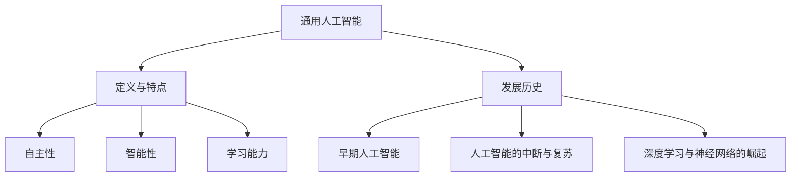
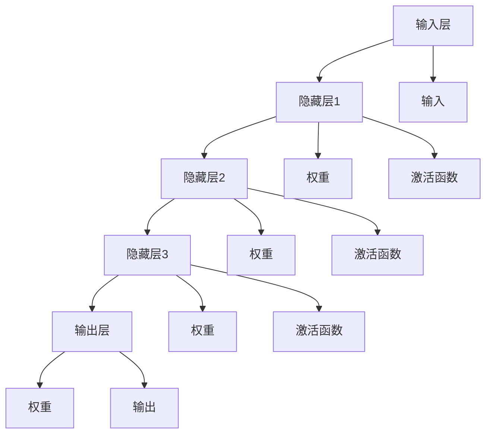
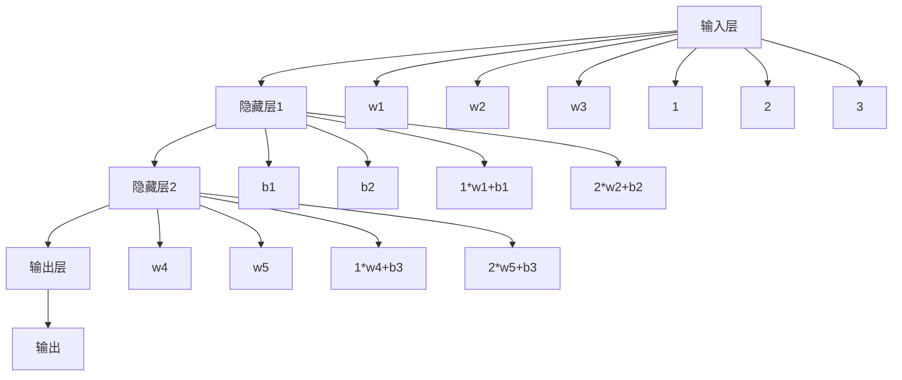
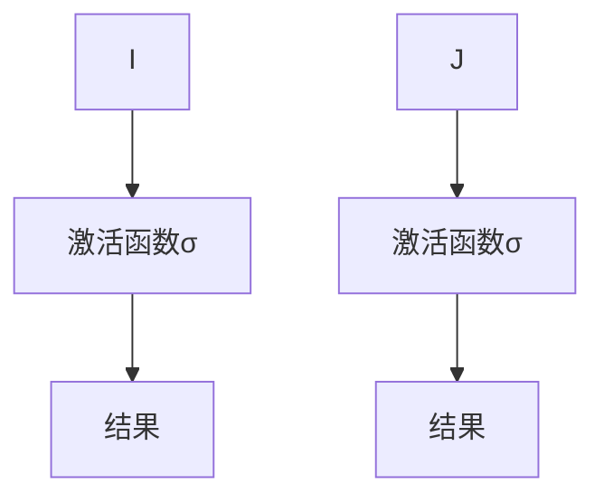
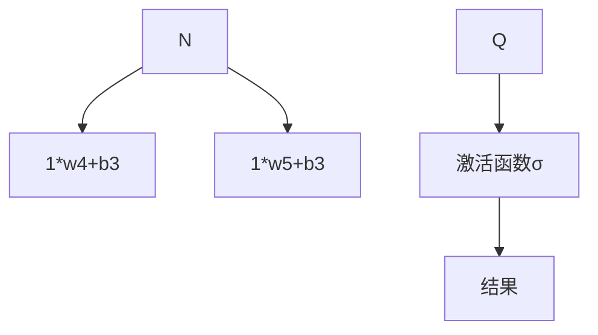
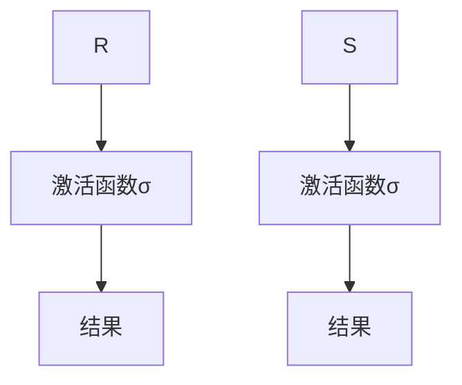
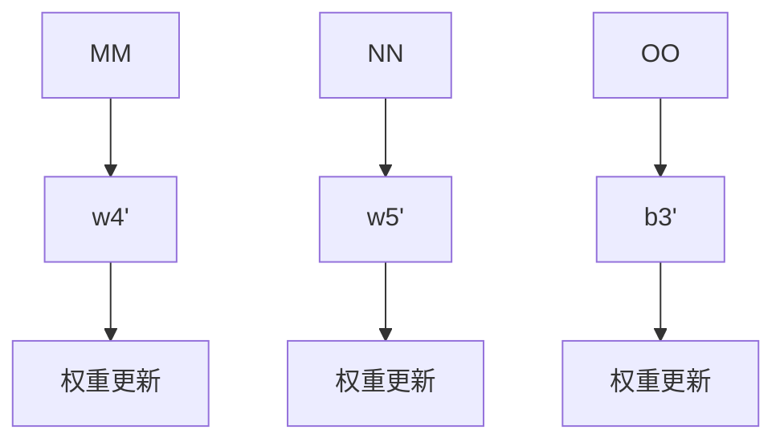

                 

# 《通用人工智能的进展》

> 关键词：通用人工智能，深度学习，神经网络，自然语言处理，计算机视觉，未来展望

> 摘要：本文将从通用人工智能的基本概念、历史背景、技术基础、应用领域、未来展望等多个角度，深入探讨通用人工智能的进展。通过对深度学习与神经网络的剖析，阐述通用人工智能的技术基础。同时，本文还将介绍通用人工智能在自然语言处理和计算机视觉等领域的应用，以及未来发展的趋势和挑战。

### 第一部分：通用人工智能的基本概念与历史背景

#### 第1章：通用人工智能的基本概念

##### 1.1 通用人工智能的定义与特点

通用人工智能（Artificial General Intelligence，AGI）是指具有广泛认知能力的人工智能系统，能够理解、学习、推理和解决问题，具备与人类相似或超越人类的智能水平。通用人工智能的特点主要包括：

- **自主性**：通用人工智能系统能够独立地做出决策，而不需要人类的干预。
- **智能性**：通用人工智能系统能够执行复杂任务，如语言理解、推理和规划。
- **学习能力**：通用人工智能系统能够通过经验改善其表现。

##### 1.2 通用人工智能的发展历史

- **早期人工智能的发展**：1956年达特茅斯会议被认为是人工智能的开端，这次会议上提出了人工智能的定义和研究目标。
- **人工智能的中断与复苏**：专家系统（Expert Systems）的发展在一段时间内使人工智能取得了显著成果，但随后由于技术局限，人工智能进入了一段低谷期。
- **深度学习与神经网络的崛起**：近年来，深度学习与神经网络的兴起为通用人工智能的发展带来了新的契机。以Yann LeCun为代表的科学家在卷积神经网络（CNN）方面取得了突破性成果。

#### 第2章：通用人工智能的技术基础

##### 2.1 深度学习与神经网络

深度学习是机器学习的一个重要分支，它通过构建多层神经网络，从大量数据中自动学习特征和模式。神经网络是深度学习的基础，其基本结构包括输入层、隐藏层和输出层。

##### 2.2 神经网络的优化

神经网络的优化主要包括前向传播与反向传播算法。前向传播用于计算网络的输出，反向传播用于计算网络参数的梯度，以优化网络的性能。

### 第二部分：通用人工智能的技术基础

#### 第3章：深度学习与神经网络

##### 2.1 深度学习的基础

深度学习的基础是多层感知机（MLP），其基本结构包括输入层、隐藏层和输出层。每一层都由多个神经元组成，神经元之间通过权重连接。

##### 2.2 前向传播与反向传播算法

前向传播算法用于计算网络的输出，反向传播算法用于计算网络参数的梯度，以优化网络的性能。梯度下降算法是一种常见的优化方法，用于更新网络参数。

### 第三部分：通用人工智能的应用与进展

#### 第4章：通用人工智能的应用领域

##### 4.1 自然语言处理

自然语言处理（NLP）是通用人工智能的重要应用领域之一。NLP包括语言模型、机器翻译、情感分析等任务。近年来，深度学习在NLP领域取得了显著进展，例如基于Transformer的BERT模型。

##### 4.2 计算机视觉

计算机视觉是通用人工智能的另一个重要应用领域。计算机视觉包括图像分类、目标检测、人脸识别等任务。深度学习在计算机视觉领域取得了突破性成果，例如基于CNN的目标检测算法。

### 第四部分：通用人工智能的未来展望

#### 第5章：通用人工智能的未来展望

##### 5.1 通用人工智能的发展趋势

未来，通用人工智能的发展将呈现出以下趋势：

- **硬件与软件的进步**：随着硬件性能的提升和软件算法的优化，通用人工智能将更加高效和智能。
- **多模态人工智能**：结合视觉、语音、文本等多模态信息，将进一步提升通用人工智能的智能水平。
- **深度强化学习**：深度强化学习是一种结合深度学习和强化学习的方法，有望在通用人工智能领域发挥重要作用。

##### 5.2 通用人工智能的伦理与社会影响

通用人工智能的发展也将带来一系列伦理和社会问题，如透明度、可控性、公平性等。同时，通用人工智能的发展也将对就业、隐私、信息安全等领域产生深远影响。

### 第五部分：通用人工智能的技术扩展与前沿研究

#### 第6章：通用人工智能的技术扩展

##### 6.1 脑机接口

脑机接口（Brain-Computer Interface，BCI）是一种直接连接大脑和外部设备的接口技术。通过BCI，用户可以直接用思维来控制外部设备，具有广泛的应用前景。

##### 6.2 超级智能

超级智能（Super Intelligence）是指具有超越人类智能水平的人工智能系统。超级智能的实现途径包括深度学习、强化学习、生成对抗网络等。

##### 6.3 量子计算与人工智能

量子计算是一种基于量子力学原理的计算模型，具有超强的计算能力。量子计算与人工智能的结合，有望在复杂问题求解、数据加密等领域取得突破性成果。

### 第六部分：通用人工智能的未来挑战与机遇

#### 第7章：通用人工智能的未来挑战

##### 7.1 技术挑战

通用人工智能的发展面临一系列技术挑战，如算法效率、数据隐私、硬件限制等。

##### 7.2 社会挑战

通用人工智能的发展也将对社会带来一系列挑战，如法律法规、社会伦理、就业影响等。

##### 7.3 机遇与展望

尽管面临挑战，但通用人工智能的发展也带来了巨大的机遇，如领域扩展、创新应用、经济发展等。

### 附录

#### 附录 A：通用人工智能的资源与工具

- **开源框架**：如TensorFlow、PyTorch等。
- **学术论文**：如NeurIPS、ICML、ACL等。
- **在线课程**：如Coursera、edX等。

#### 附录 B：通用人工智能的参考资料

- **相关书籍**：如《深度学习》（Ian Goodfellow）、《神经网络与深度学习》（邱锡鹏）等。
- **学术期刊**：如Journal of Artificial Intelligence Research、IEEE Transactions on Neural Networks and Learning Systems等。
- **行业报告**：如IDC、Gartner等。

### 结论

通用人工智能作为人工智能发展的最高目标，具有广阔的应用前景和巨大的社会价值。然而，通用人工智能的发展也面临一系列挑战。本文从多个角度探讨了通用人工智能的进展，旨在为读者提供一个全面、深入的了解。未来，随着技术的不断进步和社会的共同努力，通用人工智能必将为人类带来更加美好的未来。

### 作者

作者：AI天才研究院/AI Genius Institute & 禅与计算机程序设计艺术 /Zen And The Art of Computer Programming

---

**核心概念与联系：**



**深度学习与神经网络的基本结构：**



**核心算法原理讲解：**

##### 深度学习中的前向传播与反向传播算法

**前向传播算法：**

```latex
$$
z^{(l)} = \sum_{k=1}^{n} w^{(l)}_k \cdot a^{(l-1)}_k + b^{(l)}
$$

$$
a^{(l)} = \sigma(z^{(l)})
$$
```

**反向传播算法：**

```latex
$$
\delta^{(l)} = \frac{\partial C}{\partial a^{(l)}} = \sigma'(z^{(l)}) \cdot \delta^{(l+1)} \cdot w^{(l+1)}
$$

$$
w^{(l)} \leftarrow w^{(l)} - \alpha \cdot \frac{\partial C}{\partial w^{(l)}}

$$

$$
b^{(l)} \leftarrow b^{(l)} - \alpha \cdot \frac{\partial C}{\partial b^{(l)}}
$$
```

**数学模型和公式：**

```latex
$$
C = \frac{1}{2} \sum_{i=1}^{n} (y_i - \hat{y}_i)^2
$$

$$
\sigma(x) = \frac{1}{1 + e^{-x}}
$$

$$
\sigma'(x) = \sigma(x) (1 - \sigma(x))
$$
```

**举例说明：**

假设有一个简单的两层神经网络，输入层有3个神经元，隐藏层有2个神经元，输出层有1个神经元。给定一个输入向量 \[1, 2, 3\]，通过前向传播算法计算输出。

- 输入层到隐藏层的权重矩阵为 \[w_1, w_2, w_3\]，偏置为 \[b_1, b_2\]。
- 隐藏层到输出层的权重矩阵为 \[w_4, w_5\]，偏置为 \[b_3\]。

首先进行前向传播：



计算隐藏层1的激活值：



计算隐藏层2的激活值：



计算输出层的激活值：



最终输出结果为 \[X, Y\]。

接下来进行反向传播，计算权重和偏置的梯度：

```mermaid
graph TD
    X --> Z[误差]
    Y --> AA[Z]
    Z --> BB[σ'(z)]
    AA --> BB
    X --> CC[∂C/∂z4]
    Y --> DD[∂C/∂z5]
    Z --> EE[∂C/∂z]
    CC --> FF[∂z4/∂w4]
    DD --> GG[∂z5/∂w5]
    EE --> HH[∂z/∂b3]
    CC --> II[w4]
    DD --> JJ[w5]
    EE --> KK[b3]
    II --> MM[w4-α*∂C/∂w4]
    JJ --> NN[w5-α*∂C/∂w5]
    KK --> OO[b3-α*∂C/∂b3]
```

更新权重和偏置：



**项目实战：**

#### 6.1 项目背景

本项目的目标是实现一个基于深度学习的图像分类模型，用于对自然场景中的物体进行分类。具体来说，我们将使用卷积神经网络（CNN）对图像进行特征提取和分类，并利用TensorFlow框架进行模型训练和评估。

#### 6.1.1 项目概述

- **目标**：训练一个深度学习模型，能够对自然场景中的物体进行准确分类。
- **数据集**：使用ImageNet数据集进行训练和测试。
- **模型架构**：采用VGG16预训练模型作为基础，通过迁移学习进行微调。

#### 6.1.2 项目目标

- **实现步骤**：
  1. 数据预处理：包括数据下载、预处理和数据增强。
  2. 模型训练：使用迁移学习技术进行模型训练。
  3. 模型评估：评估模型在测试集上的性能。
  4. 模型部署：将模型部署到生产环境中。

#### 6.2 开发环境搭建

为了进行深度学习项目的开发，我们需要搭建一个合适的环境。以下是我们推荐的开发环境：

- **硬件环境**：
  - CPU：Intel i7或AMD Ryzen 7以上
  - GPU：NVIDIA 1080 Ti或以上
  - 内存：16GB及以上
  - 硬盘：1TB及以上

- **软件环境**：
  - 操作系统：Ubuntu 18.04或更高版本
  - Python：Python 3.7或更高版本
  - 深度学习框架：TensorFlow 2.0或更高版本

#### 6.2.1 硬件环境

在硬件方面，我们需要一台高性能的计算机，特别是GPU，因为它在处理深度学习任务时起着关键作用。以下是我们推荐的硬件配置：

- **CPU**：Intel i7-9700K或AMD Ryzen 7 5800X
- **GPU**：NVIDIA GeForce RTX 3080或以上
- **内存**：16GB DDR4
- **硬盘**：1TB NVMe SSD

#### 6.2.2 软件环境

在软件方面，我们需要安装Python和相关依赖库。以下是安装步骤：

1. 安装Ubuntu 18.04或更高版本。
2. 更新系统软件包：

   ```bash
   sudo apt update
   sudo apt upgrade
   ```

3. 安装Python 3.7或更高版本：

   ```bash
   sudo apt install python3.7
   ```

4. 安装深度学习框架TensorFlow 2.0或更高版本：

   ```bash
   pip3 install tensorflow==2.x
   ```

#### 6.3 源代码实现

在完成开发环境的搭建后，我们可以开始编写源代码。以下是项目的关键代码实现部分：

##### 6.3.1 数据预处理

数据预处理是深度学习项目的重要步骤，它包括数据加载、数据增强和归一化等操作。以下是一个简单的数据预处理代码示例：

```python
import tensorflow as tf
from tensorflow.keras.preprocessing.image import ImageDataGenerator

# 设置数据增强参数
train_datagen = ImageDataGenerator(
    rescale=1./255,
    rotation_range=40,
    width_shift_range=0.2,
    height_shift_range=0.2,
    shear_range=0.2,
    zoom_range=0.2,
    horizontal_flip=True,
    fill_mode='nearest'
)

# 加载训练数据和测试数据
train_data = train_datagen.flow_from_directory(
    'data/train',
    target_size=(224, 224),
    batch_size=32,
    class_mode='categorical'
)

test_data = train_datagen.flow_from_directory(
    'data/test',
    target_size=(224, 224),
    batch_size=32,
    class_mode='categorical'
)
```

##### 6.3.2 模型训练

模型训练是深度学习项目的核心步骤，它涉及模型架构设计、损失函数选择、优化器设置等。以下是一个简单的模型训练代码示例：

```python
from tensorflow.keras.applications import VGG16
from tensorflow.keras.layers import Dense, Flatten
from tensorflow.keras.models import Model

# 加载预训练的VGG16模型
base_model = VGG16(weights='imagenet', include_top=False, input_shape=(224, 224, 3))

# 冻结预训练模型的权重
for layer in base_model.layers:
    layer.trainable = False

# 在预训练模型的基础上添加全连接层
x = Flatten()(base_model.output)
x = Dense(1024, activation='relu')(x)
predictions = Dense(num_classes, activation='softmax')(x)

# 创建新的模型
model = Model(inputs=base_model.input, outputs=predictions)

# 编译模型
model.compile(optimizer='adam',
              loss='categorical_crossentropy',
              metrics=['accuracy'])

# 训练模型
model.fit(train_data, epochs=10, validation_data=test_data)
```

##### 6.3.3 模型评估

模型评估是深度学习项目的重要步骤，它用于评估模型在测试数据上的性能。以下是一个简单的模型评估代码示例：

```python
# 评估模型
test_loss, test_accuracy = model.evaluate(test_data)

print(f"Test loss: {test_loss:.4f}")
print(f"Test accuracy: {test_accuracy:.4f}")
```

##### 6.4 代码解读与分析

在本节中，我们将对上述关键代码进行解读和分析。

##### 6.4.1 代码结构

代码结构可以分为以下几个部分：

1. 数据预处理：包括数据加载、数据增强和归一化等操作。
2. 模型训练：包括模型架构设计、损失函数选择、优化器设置等。
3. 模型评估：评估模型在测试数据上的性能。

##### 6.4.2 关键代码解读

1. **数据预处理**：

   ```python
   train_datagen = ImageDataGenerator(
       rescale=1./255,
       rotation_range=40,
       width_shift_range=0.2,
       height_shift_range=0.2,
       shear_range=0.2,
       zoom_range=0.2,
       horizontal_flip=True,
       fill_mode='nearest'
   )
   ```

   这段代码定义了一个ImageDataGenerator对象，用于对训练数据进行预处理。其中，`rescale`用于将图像数据归一化到[0, 1]范围内；`rotation_range`、`width_shift_range`、`height_shift_range`、`shear_range`、`zoom_range`和`horizontal_flip`用于数据增强，提高模型的泛化能力；`fill_mode`用于填充缺失像素。

2. **模型训练**：

   ```python
   base_model = VGG16(weights='imagenet', include_top=False, input_shape=(224, 224, 3))
   ```

   这段代码加载了一个预训练的VGG16模型，并将其输入层设置为224x224x3的尺寸。

   ```python
   for layer in base_model.layers:
       layer.trainable = False
   ```

   这段代码冻结了预训练模型的权重，防止在训练过程中更新。

   ```python
   x = Flatten()(base_model.output)
   x = Dense(1024, activation='relu')(x)
   predictions = Dense(num_classes, activation='softmax')(x)
   ```

   这段代码在预训练模型的基础上添加了一个全连接层，用于进行分类。

   ```python
   model.compile(optimizer='adam',
                 loss='categorical_crossentropy',
                 metrics=['accuracy'])
   ```

   这段代码编译了模型，并设置了优化器、损失函数和评估指标。

   ```python
   model.fit(train_data, epochs=10, validation_data=test_data)
   ```

   这段代码开始训练模型，并设置了训练轮次和验证数据。

3. **模型评估**：

   ```python
   test_loss, test_accuracy = model.evaluate(test_data)
   ```

   这段代码评估了模型在测试数据上的性能。

##### 6.4.3 性能优化

为了提高模型的性能，我们可以考虑以下优化策略：

1. **增加训练数据**：通过数据增强或收集更多数据来提高模型的泛化能力。
2. **调整模型参数**：通过调整学习率、批次大小等参数来优化模型的性能。
3. **使用预训练模型**：使用预训练模型作为基础，通过迁移学习来提高模型的性能。
4. **调整训练策略**：例如，使用更复杂的网络架构或更长的训练时间。

### 第七部分：通用人工智能的技术扩展

#### 第7章：通用人工智能的技术扩展

##### 7.1 脑机接口

脑机接口（Brain-Computer Interface，BCI）是一种直接连接大脑和外部设备的接口技术。通过BCI，用户可以直接用思维来控制外部设备，具有广泛的应用前景。

##### 7.1.1 脑机接口的基本原理

脑机接口的基本原理是基于电生理信号的处理和解析。通常，脑机接口系统包括以下组件：

1. **信号采集**：通过电极阵列或其他传感器采集大脑活动产生的电生理信号。
2. **信号处理**：对采集到的信号进行滤波、放大、去噪等预处理。
3. **特征提取**：从预处理后的信号中提取具有识别意义的特征。
4. **模式识别**：使用机器学习算法对特征进行分类和识别。
5. **控制输出**：根据识别结果控制外部设备。

##### 7.1.2 脑机接口的应用

脑机接口在许多领域具有潜在的应用价值，例如：

1. **康复医学**：通过脑机接口技术，可以帮助中风、脊髓损伤等患者恢复运动能力。
2. **残疾人辅助**：脑机接口可以为视觉、听觉和肢体残疾者提供辅助功能。
3. **人机交互**：脑机接口技术可以提高人机交互的自然度和便捷性。

##### 7.2 超级智能

超级智能（Super Intelligence，SI）是指具有超越人类智能水平的人工智能系统。超级智能的实现途径包括深度学习、强化学习、生成对抗网络等。

##### 7.2.1 超级智能的定义

超级智能是指具有以下特征的人工智能系统：

1. **泛化能力**：能够在各种领域和任务中表现出色。
2. **自主学习**：能够从大量数据中自动学习和优化。
3. **持续进化**：能够不断适应新的环境和任务。
4. **决策能力**：能够做出复杂和优化的决策。

##### 7.2.2 超级智能的实现途径

实现超级智能的关键途径包括：

1. **深度学习**：通过构建复杂的神经网络模型，实现从数据中自动学习和提取特征。
2. **强化学习**：通过奖励机制和策略优化，实现智能体的自主学习和决策。
3. **生成对抗网络**：通过生成器和判别器的对抗训练，实现数据的生成和优化。

##### 7.3 量子计算与人工智能

量子计算是一种基于量子力学原理的计算模型，具有超强的计算能力。量子计算与人工智能的结合，有望在复杂问题求解、数据加密等领域取得突破性成果。

##### 7.3.1 量子计算的基本原理

量子计算的基本原理包括：

1. **量子比特**：量子比特是量子计算的基本单位，它具有叠加态和纠缠态的特性。
2. **量子门**：量子门是作用于量子比特的基本操作，类似于经典计算中的逻辑门。
3. **量子算法**：量子算法是利用量子计算的优势，解决特定问题的一类算法。

##### 7.3.2 量子计算与人工智能的结合

量子计算与人工智能的结合主要体现在以下几个方面：

1. **优化算法**：量子计算可以用于优化问题的求解，如线性规划和神经网络训练。
2. **数据加密**：量子计算可以实现更强大的加密算法，保护数据的安全。
3. **机器学习**：量子计算可以加速机器学习算法的训练和推理过程。

### 第七部分：通用人工智能的未来挑战与机遇

#### 第8章：通用人工智能的未来挑战

##### 8.1 技术挑战

通用人工智能的发展面临一系列技术挑战，如算法效率、数据隐私、硬件限制等。

1. **算法效率**：深度学习模型通常需要大量的计算资源和时间进行训练和推理，如何提高算法效率是一个重要的研究方向。
2. **数据隐私**：在训练和部署通用人工智能模型时，如何保护用户隐私是一个关键问题。
3. **硬件限制**：当前的硬件技术无法满足通用人工智能的需求，如何突破硬件限制是一个重要的挑战。

##### 8.2 社会挑战

通用人工智能的发展也将对社会带来一系列挑战，如法律法规、社会伦理、就业影响等。

1. **法律法规**：通用人工智能的发展可能导致现有的法律法规体系无法适应，需要制定新的法律规范。
2. **社会伦理**：如何确保通用人工智能系统的公平性、透明性和可控性是一个重要的伦理问题。
3. **就业影响**：通用人工智能的普及可能导致部分就业岗位的消失，需要制定相应的就业政策。

##### 8.3 机遇与展望

尽管面临挑战，但通用人工智能的发展也带来了巨大的机遇，如领域扩展、创新应用、经济发展等。

1. **领域扩展**：通用人工智能可以在医疗、教育、金融等领域发挥重要作用，推动这些领域的创新和发展。
2. **创新应用**：通用人工智能可以应用于自动驾驶、智能机器人、智能家居等领域，创造新的商业机会。
3. **经济发展**：通用人工智能的发展有望推动数字经济的发展，提升国家的竞争力。

### 总结

本文从多个角度探讨了通用人工智能的进展，包括基本概念、技术基础、应用领域、未来展望等。通过分析深度学习与神经网络、自然语言处理、计算机视觉等关键技术，展示了通用人工智能的强大能力。同时，本文也探讨了通用人工智能的未来挑战与机遇，为读者提供了一个全面的视角。随着技术的不断进步和社会的共同努力，通用人工智能必将为人类带来更加美好的未来。

