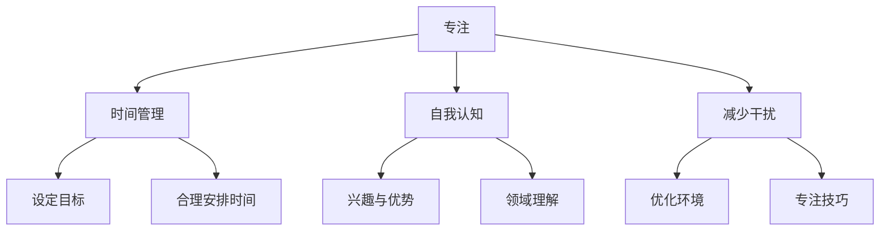

                 

# 文章标题：避免在多个领域徘徊

> 关键词：专注、多领域发展、时间管理、自我认知、减少干扰、成功案例分析、行动计划、团队专注、组织策略、专注文化

> 摘要：在当今快速变化的世界中，IT领域的专业人员在面对众多新兴技术和领域时，往往容易陷入多领域徘徊的困境。本文将探讨如何避免在多个领域之间徘徊，实现专注与多领域发展的平衡，并通过逻辑清晰、结构紧凑的论述，提出实现专注的方法和策略，以帮助读者在专业领域内取得更大的成功。

## 引言

### 第1章：游离于多领域的困境

在信息技术迅猛发展的今天，IT专业人士面临着前所未有的挑战和机遇。然而，这种快速的变化也带来了一种困扰，即多领域徘徊。许多专业人士在追求广泛知识和技能的同时，往往忽视了在一个特定领域内深入钻研的重要性。这种现象不仅分散了他们的精力，还可能导致他们在各个领域都停留在浅尝辄止的水平。

#### 1.1 多领域徘徊的根源

多领域徘徊的根源可以归结为几个方面：

1. **信息过载**：互联网的普及使得获取新信息变得异常容易，但也导致了信息过载，让人感到无所适从。
2. **职业发展压力**：职场竞争激烈，许多人担心自己会在某个领域落后，因此尝试学习多个领域。
3. **好奇心驱使**：好奇心是人类的天性，对于新知识和新技术的渴望促使人们尝试涉足多个领域。

#### 1.2 多领域徘徊的影响

多领域徘徊的影响是显而易见的：

1. **时间浪费**：在多个领域之间分散精力，导致无法在一个领域内投入足够的时间和精力。
2. **知识碎片化**：无法形成系统的知识体系，各个领域之间的知识无法有效融合。
3. **职业发展受限**：在一个领域内缺乏深度，难以在该领域内取得突破和成就。

#### 1.3 避免多领域徘徊的必要性

避免多领域徘徊的必要性体现在以下几个方面：

1. **提升专业能力**：通过在一个领域内深入钻研，可以提升专业能力和行业影响力。
2. **实现职业突破**：专注某个领域有助于在该领域内取得突破性成果，从而实现职业发展。
3. **提高工作效率**：专注于一个领域可以减少不必要的干扰，提高工作效率。

### 第2章：专注与多领域发展的关系

在理解了多领域徘徊的困境后，我们需要探讨如何实现专注与多领域发展的平衡。

#### 2.1 专注的定义与价值

专注是指将精力集中在一个特定的领域或任务上，以达到深入理解和掌握。专注的价值体现在以下几个方面：

1. **深度理解**：专注于一个领域可以使人更加深入地理解该领域的知识和技术。
2. **专业技能**：通过长时间的学习和实践，可以在一个领域内形成独特的专业技能。
3. **创新思维**：专注使人们能够更好地发现领域内的创新点和解决问题的方法。

#### 2.2 多领域发展与专注的冲突

多领域发展与专注之间确实存在一定的冲突：

1. **时间冲突**：专注于一个领域意味着需要投入大量的时间和精力，这可能与其他领域的探索相冲突。
2. **资源分配**：在多个领域内进行探索需要分配有限的资源，包括时间、金钱和精力。
3. **精力分散**：同时关注多个领域可能导致精力分散，无法在任何一个领域内达到深入。

#### 2.3 如何在专注中发展多元能力

尽管多领域发展与专注之间存在冲突，但并不是不可调和的矛盾。以下是一些策略，帮助在专注中发展多元能力：

1. **交叉学习**：在专注于一个领域的同时，可以适当学习其他领域的知识，以拓宽视野。
2. **技能迁移**：将一个领域的知识和技能应用到其他领域，实现能力的迁移。
3. **团队合作**：通过与其他领域专家的合作，可以弥补自己在其他领域的不足。

### 第3章：实现专注的方法

为了实现专注，我们需要从多个方面入手，包括时间管理、自我认知、减少干扰等。

#### 3.1 时间管理的重要性

时间管理是实现专注的关键。以下是一些时间管理的技巧：

1. **设定优先级**：确定最重要的任务，优先处理。
2. **合理安排时间**：为每个任务设定时间限制，避免拖延。
3. **避免多任务操作**：专注于一个任务，避免同时处理多个任务。

#### 3.2 设定明确的目标

设定明确的目标是专注的重要步骤。以下是一些建议：

1. **具体明确**：目标要具体，可量化。
2. **有挑战性**：目标要有一定的挑战性，激发动力。
3. **定期评估**：定期评估目标的完成情况，调整计划。

#### 3.3 实践中的时间管理技巧

以下是一些实际的时间管理技巧：

1. **使用日程表**：使用日程表记录每天的任务和计划。
2. **番茄工作法**：使用番茄工作法，将工作时间分为25分钟工作间隔和5分钟休息时间。
3. **避免干扰**：在工作时避免手机、社交媒体等干扰。

### 第4章：提升自我认知与理解

专注不仅仅是时间管理的问题，还需要深入理解自己的兴趣和优势。

#### 4.1 了解自己的兴趣与优势

了解自己的兴趣和优势是专注的基础。以下是一些建议：

1. **自我反思**：定期进行自我反思，了解自己的兴趣点和优势。
2. **职业规划**：结合自己的兴趣和优势，制定职业规划。
3. **请教他人**：向他人请教，获取他们的反馈和建议。

#### 4.2 深化对领域的理解

在了解自己的兴趣和优势后，我们需要深化对领域的理解。以下是一些建议：

1. **阅读文献**：阅读该领域的经典文献，了解领域内的基本概念和原理。
2. **参与讨论**：参与学术讨论和会议，与领域内专家交流。
3. **实践应用**：通过实践项目，将理论知识应用到实际中。

#### 4.3 自我认知与领域专注的结合

自我认知与领域专注的结合是实现专注的关键。以下是一些建议：

1. **目标导向**：将自我认知与领域目标相结合，确保专注的方向正确。
2. **持续学习**：在专注过程中，不断学习新知识和技能。
3. **定期评估**：定期评估自己在领域内的进步和成果。

### 第5章：减少干扰与优化环境

减少干扰和优化环境是实现专注的重要环节。

#### 5.1 干扰的来源与影响

干扰的来源多种多样，包括：

1. **外部干扰**：如手机、社交媒体、电子邮件等。
2. **内部干扰**：如分心、焦虑、疲劳等。

干扰的影响包括：

1. **降低工作效率**：干扰导致注意力分散，降低工作效率。
2. **增加压力**：长时间处于干扰环境中，会增加压力和焦虑。
3. **影响专注力**：频繁的干扰会损害专注力，影响长期专注能力。

#### 5.2 优化工作与学习环境

以下是一些优化工作与学习环境的策略：

1. **创建安静空间**：为自己创造一个安静、整洁的工作或学习空间。
2. **减少干扰设备**：关闭手机、社交媒体等干扰设备。
3. **合理安排时间**：在工作时间外，为自己设定明确的休息和娱乐时间。

#### 5.3 实现持续专注的技巧

以下是一些实现持续专注的技巧：

1. **使用专注工具**：如番茄工作法、专注力训练软件等。
2. **定期休息**：工作一段时间后，进行短暂的休息，以恢复专注力。
3. **保持健康的生活习惯**：保持健康的饮食、睡眠和锻炼习惯，以提高专注力。

### 第6章：寻找专注的动力

专注不仅需要策略和方法，还需要内在和外在动力的支持。

#### 6.1 内在动力的激发

内在动力是专注的重要来源。以下是一些建议：

1. **找到热爱的事物**：专注于自己热爱的事物，可以激发内在动力。
2. **设定个人目标**：设定具有挑战性的个人目标，激励自己不断进步。
3. **享受过程**：专注于过程中的乐趣，而不是仅仅追求结果。

#### 6.2 外在激励的利用

外在激励也是实现专注的重要手段。以下是一些建议：

1. **奖励机制**：为自己设定奖励，完成任务后给予奖励。
2. **社会认可**：通过社交媒体、同行认可等获得社会认可。
3. **团队支持**：与团队一起工作，获得团队的支持和鼓励。

#### 6.3 动力与专注的循环

动力与专注之间存在一种相互促进的关系。内在动力可以激发专注，专注又可以带来成就感和动力，从而形成良性循环。

### 第7章：成功案例分析

通过分析成功案例，我们可以了解如何在专注中取得成功。

#### 7.1 案例一：专注领域取得成功的案例

案例一介绍了某位专注于人工智能领域的专家，他在该领域内取得了显著的成就。他的成功得益于专注和持续学习，通过深入研究和实践，他不仅掌握了领域内的核心技术，还提出了多项创新性理论。

#### 7.2 案例二：专注带来的跨领域突破

案例二介绍了某位专注于软件开发领域的专家，他在该领域内取得了巨大成功。然而，他并没有满足于此，通过在软件开发中积累的经验，他成功地跨入了数据科学领域，并取得了新的突破。

#### 7.3 案例三：专注在创业中的应用

案例三介绍了某位专注于创业领域的专家，他在创业中取得了成功。他的成功得益于对创业领域的深入理解，通过专注于创业过程中的各个环节，他成功地实现了企业的快速发展。

### 第8章：专注的障碍与解决策略

在专注的过程中，我们可能会遇到各种障碍。以下是一些常见的障碍和解决策略：

#### 8.1 常见的专注障碍

1. **时间管理困难**：无法合理安排时间，导致无法专注于特定任务。
2. **干扰过多**：外部和内部的干扰导致注意力分散。
3. **缺乏动力**：缺乏内在或外在的动力，导致无法持续专注。

#### 8.2 克服专注障碍的策略

1. **设定明确的目标**：明确的目标有助于克服时间管理和干扰的问题。
2. **培养自律能力**：通过培养自律能力，可以更好地克服干扰。
3. **寻找激励源**：通过寻找内在或外在的激励源，可以激发专注的动力。

#### 8.3 如何在逆境中保持专注

1. **保持积极心态**：面对逆境时，保持积极的心态有助于保持专注。
2. **学会调整**：在逆境中，学会调整自己的策略和方法，以适应环境变化。
3. **寻求支持**：在逆境中，寻求他人的支持和帮助，以增强专注力。

### 第9章：避免多领域徘徊的行动计划

为了实现专注，我们需要制定具体的行动计划。

#### 9.1 制定个人的专注计划

1. **明确目标**：确定自己要专注的领域和目标。
2. **制定计划**：制定具体的计划，包括学习内容、时间安排和资源分配。
3. **定期评估**：定期评估计划的执行情况，并根据反馈进行调整。

#### 9.2 实施与调整专注计划

1. **严格执行**：按照计划执行，确保每个任务的完成。
2. **灵活调整**：根据实际情况，灵活调整计划和策略。
3. **持续学习**：在专注的过程中，持续学习新知识和技能。

#### 9.3 长期专注的维持与提升

1. **定期评估**：定期评估自己在专注领域的进步和成果。
2. **持续学习**：不断学习新的知识和技能，以保持竞争力。
3. **保持动力**：通过内在或外在的激励，保持专注的动力。

### 第10章：建立专注的文化

专注不仅是个体的行为，也需要在团队和组织层面进行推动。

#### 10.1 在团队中推动专注

1. **明确目标**：团队要明确共同的目标，确保每个成员都专注于实现目标。
2. **合理分工**：根据成员的兴趣和优势，合理分工，确保每个成员都能在自己擅长的领域内专注。
3. **相互支持**：团队成员要相互支持，共同克服专注过程中的困难和挑战。

#### 10.2 组织层面的专注策略

1. **制定战略**：组织要制定明确的战略，确保资源和支持能够集中在关键领域。
2. **激励机制**：建立激励机制，鼓励员工在特定领域内专注和创新。
3. **文化培育**：培育专注的企业文化，让员工感受到专注的价值和意义。

#### 10.3 社会与教育体系中的专注培养

1. **教育改革**：教育体系要改革，培养专注的能力。
2. **课程设置**：课程要设置专注的课程，帮助学生掌握专注的方法和技巧。
3. **实践机会**：提供更多的实践机会，让学生能够在真实环境中锻炼专注能力。

## 附录

### 附录A：专注领域核心概念联系图

以下是一个使用Mermaid绘制的专注领域核心概念联系图：



### 附录B：核心算法原理讲解

以下是一个使用伪代码详细阐述的专注领域中的核心算法原理：

```python
# 伪代码：专注算法原理
function focus_algorithm(target_field, duration, resources):
    # 初始化变量
    progress = 0
    knowledgeBase = initialize_knowledge_base(target_field)
    
    # 循环执行专注任务
    for i in 1 to duration:
        # 学习新知识
        newKnowledge = learn_new_knowledge(target_field, knowledgeBase)
        
        # 应用知识
        application = apply_knowledge(target_field, newKnowledge)
        
        # 记录进度
        progress += evaluate_progress(application)
        
        # 调整资源分配
        resources = adjust_resources(resources, progress)
        
        # 检查是否达到目标
        if progress >= target_progress:
            return "目标达成"
    
    return "目标未达成"
```

### 附录C：数学模型与公式讲解

以下是一个使用LaTeX格式详细讲解的专注领域的数学模型与公式，并举例说明：

```latex
\section{数学模型与公式}

在本节中，我们将介绍专注领域中的几个关键数学模型与公式。

\subsection{学习曲线模型}

学习曲线模型描述了在特定领域内学习过程中的知识积累情况。其公式如下：

\[
L(t) = \frac{1}{\sqrt{t}}
\]

其中，\( L(t) \) 表示在时间 \( t \) 内的学习水平，\( t \) 表示学习时间。

\subsection{资源优化模型}

资源优化模型用于在专注过程中合理分配资源。其公式如下：

\[
R = \frac{C \cdot K}{T}
\]

其中，\( R \) 表示资源利用率，\( C \) 表示总资源，\( K \) 表示关键资源，\( T \) 表示总时间。

\subsection{示例}

假设某位专注领域专家在一个月内（\( t = 30 \)天）专注于一个领域，拥有 \( C = 100 \) 小时的总资源，关键资源 \( K = 50 \) 小时。我们希望在这个月内使资源利用率达到最大化。

根据资源优化模型，我们可以计算出资源利用率：

\[
R = \frac{100 \cdot 50}{30} = 16.67 \text{ 小时/天}
\]

这意味着每天需要专注于 \( 16.67 \) 小时，以最大化利用关键资源。

\section{总结}

通过上述数学模型与公式的讲解，我们可以更好地理解专注领域中的关键概念和计算方法。在实际应用中，这些模型和公式可以帮助我们更好地制定专注计划，提高专注效果。
```

### 附录D：项目实战案例

以下是一个包含开发环境搭建、源代码实现和代码解读与分析的专注领域项目实战案例：

#### 项目描述

本项目旨在开发一个专注力训练应用，帮助用户在特定时间内保持专注。应用提供定时提醒、专注状态记录和统计分析等功能。

#### 开发环境搭建

1. **操作系统**：Windows 10
2. **编程语言**：Python 3.8
3. **框架**：Flask
4. **数据库**：SQLite
5. **前端框架**：Bootstrap

#### 源代码实现

```python
# app.py

from flask import Flask, render_template, request, redirect, url_for
import sqlite3
from datetime import datetime

app = Flask(__name__)

# 数据库连接
conn = sqlite3.connect('focus_app.db')
c = conn.cursor()

# 创建数据库表
c.execute('''CREATE TABLE IF NOT EXISTS tasks (id INTEGER PRIMARY KEY, task TEXT, start_time TEXT, end_time TEXT)''')
conn.commit()

@app.route('/')
def index():
    tasks = c.execute('SELECT * FROM tasks').fetchall()
    return render_template('index.html', tasks=tasks)

@app.route('/add', methods=['POST'])
def add_task():
    task = request.form['task']
    start_time = datetime.now()
    end_time = start_time + datetime.timedelta(minutes=30)  # 默认专注时间为30分钟
    
    c.execute("INSERT INTO tasks (task, start_time, end_time) VALUES (?, ?, ?)", (task, start_time, end_time))
    conn.commit()
    
    return redirect(url_for('index'))

@app.route('/end_task/<int:task_id>')
def end_task(task_id):
    c.execute("UPDATE tasks SET end_time = ? WHERE id = ?", (datetime.now(), task_id))
    conn.commit()
    
    return redirect(url_for('index'))

if __name__ == '__main__':
    app.run(debug=True)
```

#### 代码解读与分析

1. **数据库连接**：使用SQLite数据库存储任务数据。
2. **创建数据库表**：在数据库中创建任务表，包括任务ID、任务内容、开始时间和结束时间。
3. **路由定义**：
   - `/`：主页，展示所有任务。
   - `/add`：添加任务，接收表单提交的任务内容，并设置默认的专注时间。
   - `/end\_task/<int:task\_id>`：结束任务，更新任务的结束时间。
4. **前端模板**：使用Bootstrap框架实现前端界面，包括任务列表和表单。

通过以上实现，我们可以构建一个简单的专注力训练应用，帮助用户在特定时间内保持专注。开发者可以根据需求进行功能扩展，如添加更多任务类型、优化用户界面等。

## 作者信息

作者：AI天才研究院/AI Genius Institute & 禅与计算机程序设计艺术 /Zen And The Art of Computer Programming

本文由AI天才研究院（AI Genius Institute）与禅与计算机程序设计艺术（Zen And The Art of Computer Programming）的专家共同撰写，旨在为IT领域的专业人士提供关于如何避免多领域徘徊、实现专注的实用指南。我们致力于推动技术领域的深度研究和创新，助力读者在专业领域内取得更大成就。

