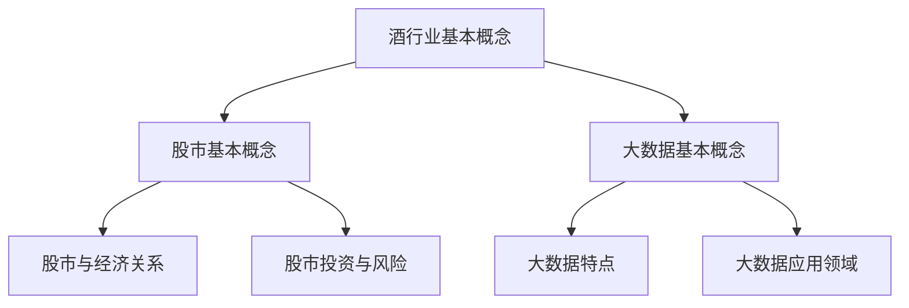

                 

# 《酒行业在股市中的大数据分析》

## 关键词

酒行业、股市、大数据分析、投资策略、数据挖掘、技术指标、投资风险

## 摘要

本文旨在探讨酒行业在股市中的大数据分析。通过对酒行业及股市的基本概述，大数据的基本概念及其在酒行业中的应用，本文深入分析了股市中的数据分析基础、趋势分析和事件分析技术，以及酒行业公司股票的基本面和技术面分析。最后，本文提出了大数据驱动的投资策略，并通过实际案例展示了大数据分析在酒行业股票投资中的应用。文章旨在为投资者提供有价值的参考，帮助他们更好地理解酒行业在股市中的表现，制定科学的投资策略。

## 《酒行业在股市中的大数据分析》目录大纲

### 第一部分：酒行业与股市概述

### 第1章：酒行业概述

#### 1.1 酒行业的基本概念

酒类产品分类：啤酒、葡萄酒、烈酒等。

酒行业的发展历程：从传统酿造到现代化生产。

酒行业的市场规模与增长趋势：全球市场规模及未来预测。

#### 1.2 股市概述

股市基本概念：股票、交易所、投资者等。

股市与经济关系：股市对经济的影响及经济的反作用。

股市投资与风险：投资策略、风险控制等。

### 第2章：大数据与酒行业

#### 2.1 大数据的基本概念

大数据的定义：海量、多样、快速的数据。

大数据的特点：数据的规模、速度、多样性和价值。

大数据的应用领域：金融、医疗、电商等。

#### 2.2 大数据在酒行业中的应用

酒行业数据来源：生产数据、销售数据、用户反馈等。

酒行业数据类型：结构化数据、非结构化数据、半结构化数据等。

大数据在酒行业中的分析应用：市场预测、用户行为分析、供应链优化等。

### 第二部分：股市中的大数据分析

### 第3章：股市数据分析基础

#### 3.1 数据预处理

数据清洗：去除错误、重复、无效数据。

数据整合：将多个数据源整合为一个统一的数据集。

数据标准化：统一数据格式和单位。

#### 3.2 统计分析

描述性统计分析：数据的分布、中心趋势和离散程度。

探索性数据分析：发现数据中的模式和趋势。

相关性与回归分析：研究变量之间的关系和预测能力。

### 第4章：股市趋势分析

#### 4.1 趋势分析概念

趋势分析的目的：预测股市的未来走势。

趋势分析的方法：移动平均线、MACD指标、RSI指标等。

#### 4.2 趋势分析技术

移动平均线：简单移动平均线、指数移动平均线等。

MACD指标：差离值、DIF、MACD等。

RSI指标：相对强弱指标的计算方法和应用。

### 第5章：股市事件分析

#### 5.1 事件分析概念

事件分析的目的：识别和预测对股市有重大影响的事件。

事件分析的方法：新闻情绪分析、社交媒体分析、机器学习等。

#### 5.2 事件分析技术

新闻情绪分析：利用自然语言处理技术分析新闻的情感倾向。

社交媒体分析：分析社交媒体上的用户讨论和情绪。

基于机器学习的股市事件预测：利用机器学习算法预测事件对股市的影响。

### 第6章：酒行业公司股票分析

#### 6.1 股票基本面分析

盈利能力分析：净利润、营业收入等指标。

偿债能力分析：资产负债率、流动比率等指标。

营运能力分析：应收账款周转率、存货周转率等指标。

#### 6.2 股票技术分析

K线图分析：K线的构成、形态分析等。

形态分析：头肩顶、双底等形态的识别和应用。

技术指标分析：MACD、RSI、布林带等指标的运用。

### 第7章：大数据驱动的投资策略

#### 7.1 投资策略概述

投资策略的类型：价值投资、成长投资、技术分析等。

投资策略的选择：根据投资者风险承受能力和投资目标选择合适的策略。

#### 7.2 大数据驱动的投资策略

数据驱动的选股策略：利用大数据分析选股。

数据驱动的交易策略：利用大数据预测交易时机。

数据驱动的风险控制策略：利用大数据进行风险预测和控制。

### 第8章：酒行业大数据分析应用案例

#### 8.1 案例一：某知名酒企股票分析

案例背景：某知名酒企股票近期表现不佳。

数据来源：公司财报、行业数据、市场数据等。

分析过程：数据预处理、统计分析、趋势分析、事件分析等。

结论与建议：投资策略调整建议。

#### 8.2 案例二：酒行业整体市场分析

案例背景：酒行业整体市场表现不佳。

数据来源：行业数据、市场数据、公司数据等。

分析过程：数据预处理、统计分析、趋势分析、事件分析等。

结论与建议：行业投资前景分析。

### 第三部分：酒行业大数据分析实践指南

### 第9章：酒行业大数据分析工具与平台

#### 9.1 数据分析工具介绍

Python数据分析库：Pandas、NumPy、Matplotlib等。

R语言数据分析：R语言、ggplot2等。

SQL数据库操作：MySQL、PostgreSQL等。

#### 9.2 大数据分析平台

Hadoop生态系统：Hadoop、Hive、HBase等。

Spark生态系统：Spark、Spark SQL、Spark MLlib等。

数据仓库技术：Oracle、SQL Server、NoSQL数据库等。

### 第10章：酒行业大数据分析流程

#### 10.1 数据收集与整理

数据收集方法：网络爬虫、API接口、问卷调查等。

数据整理流程：数据清洗、数据整合、数据标准化等。

#### 10.2 数据分析与挖掘

数据分析流程：数据预处理、统计分析、趋势分析、事件分析等。

数据挖掘技术：聚类分析、分类分析、关联规则挖掘等。

#### 10.3 报告撰写与展示

报告撰写规范：报告结构、报告内容、报告格式等。

数据可视化技术：图表、地图、交互式可视化等。

### 附录

#### 附录 A：参考资料

相关书籍推荐：《大数据时代》、《数据科学实战》等。

在线资源链接：Kaggle、Coursera等。

学术论文精选：Google Scholar、CNKI等。

#### 附录 B：术语表

常用术语解释：大数据、数据挖掘、机器学习等。

专业术语列表：数据预处理、统计分析、趋势分析等。


### 第一部分：酒行业与股市概述

### 第1章：酒行业概述

#### 1.1 酒行业的基本概念

酒类产品分类：

酒类产品可以根据酒精浓度、酿造工艺和原材料进行分类。常见的酒类产品包括：

1. 啤酒：以大麦芽为主要原料，经过发酵制成的低度酒。

2. 葡萄酒：以葡萄为主要原料，经过发酵和陈酿制成的酒类。

3. 烈酒：酒精浓度较高的酒类，如白兰地、威士忌、伏特加等。

4. 酱酒：以高粱为主要原料，经过发酵和蒸馏制成的酒类。

酒行业的发展历程：

酒类的历史可以追溯到数千年前，从古代的酿造技术到现代的工业化生产，酒行业经历了多个阶段的发展。

1. 古代：酒的制作主要依靠传统酿造技术，产量有限。

2. 中世纪：酒类开始规模化生产，但技术水平仍然较低。

3. 近现代：工业化生产技术的引入，酒行业的生产效率大幅提高。

4. 当前：随着科技的进步，酒行业逐渐向智能化、绿色化发展。

酒行业的市场规模与增长趋势：

全球酒类市场规模持续增长，根据市场研究机构的数据，2019年全球酒类市场规模约为3.5万亿美元，预计到2025年将达到4.5万亿美元。

1. 全球市场：欧美地区市场较为成熟，亚洲市场增长迅速。

2. 国内市场：中国酒类市场规模庞大，占全球市场的近20%。

3. 增长趋势：随着消费者对酒类品质和品牌意识的提升，酒行业将继续保持增长态势。

#### 1.2 股市概述

股市基本概念：

股市是指股票交易的市场，投资者可以通过购买股票来参与企业的发展和利润分配。

1. 股票：代表公司所有权的一部分，可以买卖。

2. 交易所：提供股票交易的场所，如纽约证券交易所、纳斯达克等。

3. 投资者：购买股票的个体或机构。

股市与经济关系：

股市与经济密切相关，股市表现往往反映了经济的健康状况。

1. 股市对经济的影响：股市的繁荣可以带动消费和投资，促进经济增长。

2. 经济对股市的影响：经济的繁荣可以带动股市上涨，反之亦然。

股市投资与风险：

股市投资具有高风险和高回报的特点，投资者需要具备一定的风险承受能力。

1. 投资策略：投资者可以根据自己的风险承受能力和投资目标选择合适的策略，如价值投资、成长投资等。

2. 风险控制：投资者可以通过分散投资、风险控制策略等手段来降低投资风险。

### 第2章：大数据与酒行业

#### 2.1 大数据的基本概念

大数据的定义：

大数据（Big Data）是指无法用传统数据库工具进行捕捉、管理和处理的数据集，具有海量、多样、快速的特点。

1. 海量：数据规模巨大，无法存储在单个数据库中。

2. 多样：数据类型丰富，包括结构化数据、非结构化数据、半结构化数据等。

3. 快速：数据生成和处理速度极快，需要实时处理和分析。

大数据的特点：

1. 数据量（Volume）：大数据的规模通常以PB（拍字节）或EB（艾字节）为单位。

2. 数据类型（Variety）：大数据包括各种类型的数据，如文本、图像、音频、视频等。

3. 数据速度（Velocity）：大数据的生成和处理速度极快，需要实时响应。

4. 数据价值（Value）：大数据中蕴含着大量的信息和价值，可以用于决策支持、预测分析等。

大数据的应用领域：

1. 金融：利用大数据分析用户行为、市场趋势，实现精准营销和风险管理。

2. 医疗：利用大数据进行疾病预测、药物研发，提高医疗效率和质量。

3. 电商：利用大数据进行用户行为分析、商品推荐，提高销售额和用户满意度。

4. 交通：利用大数据进行交通流量预测、道路规划，提高交通效率和安全性。

#### 2.2 大数据在酒行业中的应用

酒行业数据来源：

酒行业的数据来源广泛，包括生产数据、销售数据、用户反馈、市场调研等。

1. 生产数据：生产过程中的数据，如生产量、库存量、设备运行状态等。

2. 销售数据：销售过程中的数据，如销售额、销售量、客户分布等。

3. 用户反馈：消费者对产品、服务和品牌的反馈，如评价、投诉等。

4. 市场调研：市场调查公司提供的市场数据，如市场趋势、消费者偏好等。

酒行业数据类型：

酒行业的的数据类型丰富，包括结构化数据、非结构化数据、半结构化数据等。

1. 结构化数据：如销售额、销售量、客户信息等，通常存储在关系型数据库中。

2. 非结构化数据：如文本、图片、音频、视频等，通常存储在分布式文件系统或NoSQL数据库中。

3. 半结构化数据：如XML、JSON等，具有一定的结构化特征，但与传统关系型数据库的数据格式有所不同。

大数据在酒行业中的分析应用：

1. 市场预测：利用大数据分析市场趋势和消费者行为，预测未来市场情况，帮助企业制定营销策略。

2. 用户行为分析：通过分析用户反馈、评论等数据，了解用户需求和偏好，优化产品和服务。

3. 供应链优化：利用大数据分析供应链中的各个环节，优化生产、物流、库存等，提高供应链效率。

4. 风险管理：利用大数据进行风险预警，预测潜在的风险，采取相应的措施降低风险。

5. 客户关系管理：通过分析客户数据，了解客户需求和满意度，提高客户忠诚度和满意度。

### 第二部分：股市中的大数据分析

### 第3章：股市数据分析基础

#### 3.1 数据预处理

数据预处理是进行数据分析的第一步，其主要目的是提高数据质量，使其满足后续分析的要求。

1. 数据清洗：去除错误、重复、无效数据，保证数据的准确性。

2. 数据整合：将多个数据源的数据整合为一个统一的数据集，便于后续分析。

3. 数据标准化：统一数据格式和单位，消除数据之间的差异，便于比较和分析。

数据清洗：

数据清洗是数据预处理的重要环节，主要包括以下步骤：

1. 填缺值：对于缺失的数据，可以选择填充平均值、中位数、最近观测值等方法。

2. 去除重复数据：识别并删除重复的数据记录，避免重复计算。

3. 去除异常值：识别并处理异常数据，如离群点、异常值等，可以选择删除或修改。

数据整合：

数据整合是将多个数据源的数据整合为一个统一的数据集，主要步骤如下：

1. 数据合并：将多个数据集按照一定的规则进行合并，如按时间、按ID等。

2. 数据融合：将多个数据源的数据进行融合，消除数据之间的冗余。

3. 数据映射：将不同数据源的数据进行映射，建立关联关系，便于分析。

数据标准化：

数据标准化是统一数据格式和单位，消除数据之间的差异，主要步骤如下：

1. 数据转换：将不同类型的数据转换为同一类型，如将字符串转换为数字。

2. 数据归一化：将数据归一化到一定的范围，如0到1之间。

3. 数据标准化：将数据标准化为标准分数，如Z-Score标准化。

#### 3.2 统计分析

统计分析是数据分析的核心步骤，通过对数据进行分析，发现数据中的规律和趋势，为决策提供依据。

1. 描述性统计分析：通过对数据进行汇总、排序、计算平均值、中位数、标准差等，描述数据的基本特征。

2. 探索性数据分析：通过对数据进行可视化、聚类、关联规则挖掘等，探索数据中的模式和趋势。

3. 相关性与回归分析：研究变量之间的关系，建立回归模型，进行预测和决策。

描述性统计分析：

描述性统计分析是对数据的基本特征进行描述，主要包括以下内容：

1. 数据分布：描述数据在不同区间的分布情况，如频率分布直方图、饼图等。

2. 数据中心趋势：描述数据集中趋势的统计量，如平均值、中位数、众数等。

3. 数据离散程度：描述数据离散程度的统计量，如标准差、方差、离散系数等。

探索性数据分析：

探索性数据分析是对数据进行深入挖掘，发现数据中的规律和趋势，主要包括以下内容：

1. 数据可视化：通过图表、地图、交互式可视化等，直观展示数据特征和趋势。

2. 聚类分析：将相似的数据分为一组，发现数据中的模式。

3. 关联规则挖掘：发现数据之间的关联关系，如购买商品之间的关联。

4. 异常检测：识别数据中的异常值、离群点等，为决策提供依据。

相关性分析：

相关性分析是研究变量之间的关系，通过计算相关系数，判断变量之间的线性相关程度。

1. 皮尔逊相关系数：衡量两个连续变量之间的线性相关程度，取值范围为-1到1。

2. 斯皮尔曼相关系数：适用于非参数检验，衡量两个变量之间的线性相关程度。

3. 判定系数：衡量自变量对因变量的解释能力，取值范围为0到1。

回归分析：

回归分析是建立变量之间的关系模型，通过模型进行预测和决策。

1. 线性回归：建立线性关系模型，预测因变量与自变量之间的关系。

2. 逻辑回归：建立逻辑关系模型，预测因变量是否发生。

3. 多元回归：建立多元线性或逻辑回归模型，同时考虑多个自变量对因变量的影响。

### 第4章：股市趋势分析

#### 4.1 趋势分析概念

趋势分析是通过对历史数据进行分析，预测未来数据的变化趋势。

1. 趋势分析的目的：识别数据中的趋势和周期，为投资决策提供依据。

2. 趋势分析的方法：移动平均线、MACD指标、RSI指标等。

移动平均线：

移动平均线（Moving Average，MA）是一种常用的技术分析工具，用于平滑价格数据，识别价格趋势。

1. 简单移动平均线（SMA）：计算一段时间内价格的平均值。

2. 指数移动平均线（EMA）：考虑近期价格变化对趋势的影响，更灵敏地反映价格变化。

MACD指标：

MACD（Moving Average Convergence Divergence）指标是一种趋势追踪指标，通过计算两个移动平均线之间的差异和信号线，判断价格趋势。

1. DIF：快速移动平均线与慢速移动平均线的差值。

2. DEA：DIF的移动平均线。

3. MACD：DIF与DEA的差值。

4. MACD柱线：DIF与DEA之差的柱状图表示。

RSI指标：

RSI（Relative Strength Index）指标是一种动量指标，用于衡量价格变动的速度和变化，判断超买或超卖状态。

1. RSI值：计算一段时间内价格上涨幅度与下跌幅度的比值。

2. 超买超卖：当RSI值超过70时，表示市场过度购买，可能存在回调风险；当RSI值低于30时，表示市场过度卖出，可能存在反弹机会。

#### 4.2 趋势分析技术

移动平均线：

1. 简单移动平均线（SMA）计算方法：

   $$SMA(n) = \frac{1}{n} \sum_{i=1}^{n} C_i$$

   其中，$n$为时间窗口，$C_i$为第$i$个时间点的收盘价。

2. 指数移动平均线（EMA）计算方法：

   $$EMA(t) = \alpha C_t + (1 - \alpha) EMA(t-1)$$

   其中，$\alpha$为平滑因子，$C_t$为第$t$个时间点的收盘价，$EMA(t-1)$为前一个时间点的指数移动平均线。

MACD指标：

1. DIF计算方法：

   $$DIF = C_t - SMA_{long}$$

   其中，$C_t$为第$t$个时间点的收盘价，$SMA_{long}$为长期移动平均线。

2. DEA计算方法：

   $$DEA = EMA_{long}$$

   其中，$EMA_{long}$为长期指数移动平均线。

3. MACD计算方法：

   $$MACD = DIF - DEA$$

   其中，$DIF$为差离值，$DEA$为平滑移动平均线。

RSI指标：

1. RSI值计算方法：

   $$RSI(t) = \frac{\sum_{i=1}^{n} \frac{UP_i}{DOWN_i}}{n}$$

   其中，$UP_i$为第$i$个时间点的上涨幅度，$DOWN_i$为第$i$个时间点的下跌幅度，$n$为时间窗口。

2. 超买超卖判断方法：

   - 当RSI值超过70时，表示市场过度购买，可能存在回调风险。
   - 当RSI值低于30时，表示市场过度卖出，可能存在反弹机会。

### 第5章：股市事件分析

#### 5.1 事件分析概念

事件分析是一种通过分析特定事件对市场产生的影响，预测市场走势的技术分析方法。

1. 事件分析的目的：识别和预测对市场有重大影响的事件，为投资决策提供依据。

2. 事件分析的方法：新闻情绪分析、社交媒体分析、基于机器学习的股市事件预测等。

新闻情绪分析：

新闻情绪分析是一种通过分析新闻报道中的情感倾向，判断市场情绪的方法。

1. 情感分类：将新闻报道分为正面、中性、负面三类。

2. 情感分析：利用自然语言处理技术，对新闻报道进行情感分析。

3. 情感预测：根据情感分类结果，预测市场情绪的变化。

社交媒体分析：

社交媒体分析是一种通过分析社交媒体上的用户讨论和情绪，判断市场趋势的方法。

1. 数据收集：收集社交媒体平台上的用户评论、帖子等。

2. 情感分析：利用自然语言处理技术，对用户评论进行情感分析。

3. 情感预测：根据情感分类结果，预测市场情绪的变化。

基于机器学习的股市事件预测：

基于机器学习的股市事件预测是一种通过训练机器学习模型，预测股市事件对市场产生的影响的方法。

1. 数据收集：收集历史事件数据、市场数据等。

2. 特征工程：提取事件特征、市场特征等。

3. 模型训练：利用机器学习算法，训练预测模型。

4. 预测结果：根据模型预测结果，判断市场走势。

#### 5.2 事件分析技术

新闻情绪分析：

1. 数据收集：利用网络爬虫技术，收集各大新闻网站的新闻报道。

2. 文本预处理：去除停用词、标点符号，进行分词和词性标注。

3. 情感分类：利用情感分析模型，对新闻报道进行情感分类。

4. 情感预测：根据情感分类结果，预测市场情绪的变化。

社交媒体分析：

1. 数据收集：利用社交媒体API，收集用户评论、帖子等。

2. 文本预处理：去除停用词、标点符号，进行分词和词性标注。

3. 情感分析：利用情感分析模型，对用户评论进行情感分析。

4. 情感预测：根据情感分类结果，预测市场情绪的变化。

基于机器学习的股市事件预测：

1. 数据收集：收集历史事件数据、市场数据等。

2. 特征工程：提取事件特征、市场特征等。

3. 模型训练：利用机器学习算法，如决策树、随机森林、支持向量机等，训练预测模型。

4. 预测结果：根据模型预测结果，判断市场走势。

### 第6章：酒行业公司股票分析

#### 6.1 股票基本面分析

股票基本面分析是通过对公司财务状况、盈利能力、偿债能力、营运能力等方面的分析，评估公司的投资价值。

盈利能力分析：

盈利能力分析是评估公司盈利能力的重要指标，主要包括以下方面：

1. 净利润：公司净利润占营业收入的比例，反映了公司的盈利水平。

2. 毛利率：公司营业收入扣除成本后的比例，反映了公司的成本控制能力。

3. 营业收入增长率：公司营业收入同比增长率，反映了公司的成长性。

偿债能力分析：

偿债能力分析是评估公司偿还债务能力的重要指标，主要包括以下方面：

1. 资产负债率：公司负债总额占资产总额的比例，反映了公司的负债水平。

2. 流动比率：公司流动资产与流动负债的比率，反映了公司的短期偿债能力。

3. 速动比率：公司速动资产与流动负债的比率，反映了公司的快速变现能力。

营运能力分析：

营运能力分析是评估公司运营效率的重要指标，主要包括以下方面：

1. 应收账款周转率：公司应收账款回收速度的快慢，反映了公司的收账能力。

2. 存货周转率：公司存货周转速度的快慢，反映了公司的存货管理能力。

3. 总资产周转率：公司总资产周转速度的快慢，反映了公司的资产利用效率。

#### 6.2 股票技术分析

股票技术分析是通过对股票价格走势、成交量、技术指标等分析，预测股票价格走势的方法。

K线图分析：

K线图是一种反映股票价格走势的图表，由开盘价、最高价、最低价和收盘价组成。

1. K线形态：通过分析K线的形态，如锤头、十字星、W底等，判断市场趋势。

2. 形态分析：通过分析K线的组合形态，如头肩顶、双底等，预测价格走势。

3. 均线分析：通过分析K线与移动平均线的位置关系，判断市场趋势。

技术指标分析：

技术指标是通过对股票价格和成交量等数据进行分析，预测价格走势的工具。

1. 移动平均线：通过计算一定时间内的平均值，平滑价格波动，判断市场趋势。

2. MACD指标：通过计算DIF和DEA的差值，判断市场趋势和动能。

3. RSI指标：通过计算价格上涨和下跌幅度，判断超买或超卖状态。

4. 布林带：通过计算价格的标准差，判断市场波动范围和趋势。

### 第7章：大数据驱动的投资策略

#### 7.1 投资策略概述

投资策略是投资者根据自身的投资目标、风险承受能力和市场情况，制定的投资方法。

1. 投资策略的类型：根据投资方法的不同，投资策略可以分为价值投资、成长投资、技术分析等。

2. 投资策略的选择：投资者应根据自身情况和市场情况，选择合适的投资策略。

价值投资：

价值投资是一种以低估的价格购买优质公司的投资策略，主要关注公司的内在价值。

1. 内在价值：通过评估公司的盈利能力、成长性、财务状况等，计算公司的内在价值。

2. 安全边际：以低于公司内在价值的价格购买股票，确保投资的安全性。

成长投资：

成长投资是一种以高增长潜力为依据的投资策略，主要关注公司的成长性。

1. 成长指标：通过评估公司的营业收入增长率、净利润增长率等，判断公司的成长性。

2. 投资时机：在公司的成长期或拐点期，以合理的价格购买股票。

技术分析：

技术分析是一种以股票价格和成交量等数据为基础的投资策略，主要关注市场趋势和技术指标。

1. 市场趋势：通过分析K线图、均线等，判断市场趋势。

2. 技术指标：通过分析MACD、RSI等指标，判断股票价格走势。

#### 7.2 大数据驱动的投资策略

大数据驱动的投资策略是一种利用大数据分析技术，对市场进行预测和决策的投资策略。

1. 数据驱动的选股策略：通过大数据分析，识别具有高成长性或价值被低估的股票。

2. 数据驱动的交易策略：通过大数据分析，预测股票价格走势，制定买卖策略。

3. 数据驱动的风险控制策略：通过大数据分析，识别潜在风险，采取相应的风险控制措施。

数据驱动的选股策略：

1. 数据收集：收集公司的财务报表、行业数据、市场数据等。

2. 数据预处理：对数据进行清洗、整合、标准化等预处理。

3. 特征工程：提取公司的财务指标、行业指标、市场指标等特征。

4. 选股模型：利用机器学习算法，如决策树、随机森林等，训练选股模型。

5. 选股结果：根据选股模型的结果，筛选出具有高成长性或价值被低估的股票。

数据驱动的交易策略：

1. 数据收集：收集股票的历史价格、成交量等数据。

2. 数据预处理：对数据进行清洗、整合、标准化等预处理。

3. 特征工程：提取价格、成交量、技术指标等特征。

4. 交易模型：利用机器学习算法，如神经网络、支持向量机等，训练交易模型。

5. 交易策略：根据交易模型的结果，制定买卖策略。

6. 交易执行：根据交易策略，执行买卖操作。

数据驱动的风险控制策略：

1. 数据收集：收集市场数据、公司数据、宏观经济数据等。

2. 数据预处理：对数据进行清洗、整合、标准化等预处理。

3. 风险指标：提取风险指标，如波动率、市盈率、市净率等。

4. 风险模型：利用机器学习算法，如决策树、随机森林等，训练风险模型。

5. 风险预警：根据风险模型的结果，预测潜在的风险，采取相应的风险控制措施。

### 第8章：酒行业大数据分析应用案例

#### 8.1 案例一：某知名酒企股票分析

案例背景：

某知名酒企是一家全球领先的酒类生产企业，近年来受到市场环境和行业竞争的影响，公司股票表现不佳，投资者对其前景担忧。

数据来源：

数据来源于公司财务报表、行业数据、市场数据等。

分析过程：

1. 数据收集与整理：收集公司财务报表、行业数据、市场数据等，对数据进行清洗、整合、标准化等处理。

2. 股票基本面分析：通过计算公司的盈利能力、偿债能力、营运能力等指标，评估公司的财务状况。

3. 股票技术分析：通过分析股票的K线图、均线、MACD、RSI等指标，判断股票价格走势。

4. 大数据预测分析：利用大数据分析技术，预测公司股票价格的未来走势。

结论与建议：

1. 财务状况分析：公司盈利能力较强，但偿债能力较弱，需要加强财务管理和风险控制。

2. 股票价格走势分析：股票价格受市场环境和行业竞争的影响较大，短期内存在回调风险。

3. 大数据预测分析：根据大数据分析结果，预测公司股票价格未来将呈现震荡走势，建议投资者关注市场动态，适时调整投资策略。

#### 8.2 案例二：酒行业整体市场分析

案例背景：

酒行业整体市场受宏观经济环境和消费者需求变化的影响，近年来市场波动较大。

数据来源：

数据来源于行业报告、市场数据、公司数据等。

分析过程：

1. 数据收集与整理：收集酒行业整体市场数据、公司数据等，对数据进行清洗、整合、标准化等处理。

2. 行业趋势分析：通过分析行业数据，判断酒行业整体市场的趋势和发展方向。

3. 公司比较分析：通过分析公司数据，比较不同公司在市场中的竞争力和发展潜力。

4. 大数据预测分析：利用大数据分析技术，预测酒行业整体市场未来发展趋势。

结论与建议：

1. 行业趋势分析：酒行业整体市场呈波动走势，受宏观经济环境和消费者需求变化的影响较大。

2. 公司比较分析：不同公司在市场竞争力和发展潜力方面存在差异，投资者应关注具有竞争优势和成长潜力的公司。

3. 大数据预测分析：根据大数据分析结果，预测酒行业整体市场未来将继续波动，投资者应保持谨慎，关注市场动态，适时调整投资策略。

### 第三部分：酒行业大数据分析实践指南

#### 第9章：酒行业大数据分析工具与平台

#### 9.1 数据分析工具介绍

数据分析工具是进行大数据分析的重要工具，以下介绍几种常用的数据分析工具。

Python数据分析库：

Python是一种广泛应用于数据分析的编程语言，具有丰富的数据分析库，以下介绍几种常用的数据分析库。

1. Pandas：用于数据处理和分析，提供数据清洗、整合、转换等功能。

2. NumPy：用于数值计算，提供矩阵运算、随机数生成等功能。

3. Matplotlib：用于数据可视化，提供多种图表绘制功能。

R语言数据分析：

R语言是一种专门用于统计分析的编程语言，具有丰富的数据分析包，以下介绍几种常用的数据分析包。

1. ggplot2：用于数据可视化，提供强大的图表绘制功能。

2. dplyr：用于数据处理和分析，提供数据筛选、排序、分组等功能。

3. tidyr：用于数据清洗和整理，提供数据转换、缺失值处理等功能。

SQL数据库操作：

SQL（结构化查询语言）是用于数据库操作的标准语言，以下介绍几种常用的SQL数据库。

1. MySQL：一种开源的关系型数据库，适用于中小型应用。

2. PostgreSQL：一种开源的关系型数据库，适用于大型应用。

3. MongoDB：一种开源的NoSQL数据库，适用于大规模数据存储和查询。

#### 9.2 大数据分析平台

大数据分析平台是进行大数据分析和处理的基础设施，以下介绍几种常用的大数据分析平台。

Hadoop生态系统：

Hadoop是一种分布式计算框架，用于处理海量数据，以下介绍Hadoop生态系统中的几个重要组件。

1. Hadoop：用于分布式存储和处理大数据。

2. Hive：基于Hadoop的数据仓库工具，用于大规模数据分析和查询。

3. HBase：基于Hadoop的分布式存储系统，适用于实时数据访问和分析。

Spark生态系统：

Spark是一种快速、通用的大数据处理框架，以下介绍Spark生态系统中的几个重要组件。

1. Spark：用于分布式存储和处理大数据。

2. Spark SQL：用于大规模数据分析和查询。

3. Spark MLlib：用于机器学习和数据分析。

数据仓库技术：

数据仓库是一种用于存储、管理和分析大量数据的系统，以下介绍几种常用的数据仓库技术。

1. Oracle：一种商业关系型数据库，适用于大规模数据存储和查询。

2. SQL Server：一种商业关系型数据库，适用于企业级应用。

3. NoSQL数据库：如MongoDB、Cassandra等，适用于大规模数据存储和查询。

#### 第10章：酒行业大数据分析流程

#### 10.1 数据收集与整理

数据收集与整理是大数据分析的第一步，以下介绍酒行业大数据分析的数据收集与整理流程。

1. 数据收集方法：利用网络爬虫、API接口、问卷调查等方式，收集酒行业的生产数据、销售数据、用户反馈等。

2. 数据整理流程：对收集到的数据进行清洗、整合、标准化等处理，确保数据的质量和一致性。

3. 数据整理步骤：

   - 数据清洗：去除错误、重复、无效数据，保证数据的准确性。

   - 数据整合：将多个数据源的数据整合为一个统一的数据集，便于分析。

   - 数据标准化：统一数据格式和单位，消除数据之间的差异，便于比较和分析。

#### 10.2 数据分析与挖掘

数据分析与挖掘是大数据分析的核心环节，以下介绍酒行业大数据分析的流程。

1. 数据预处理：对收集到的数据进行预处理，包括数据清洗、整合、标准化等步骤。

2. 数据分析：对预处理后的数据进行统计分析、探索性数据分析等，发现数据中的规律和趋势。

3. 数据挖掘：利用数据挖掘技术，如聚类分析、分类分析、关联规则挖掘等，提取数据中的有价值信息。

4. 数据分析步骤：

   - 描述性统计分析：对数据的基本特征进行描述，如数据的分布、中心趋势和离散程度等。

   - 探索性数据分析：对数据中的模式和趋势进行探索，如数据可视化、聚类分析等。

   - 数据挖掘：利用数据挖掘技术，提取数据中的有价值信息，如用户行为分析、市场趋势预测等。

#### 10.3 报告撰写与展示

报告撰写与展示是大数据分析的最后一步，以下介绍酒行业大数据分析的报告撰写与展示流程。

1. 报告撰写：撰写数据分析报告，包括数据分析的目的、方法、结果和建议等。

2. 报告内容：

   - 引言：介绍数据分析的背景和目的。

   - 数据分析：介绍数据分析的方法和结果。

   - 结论与建议：根据数据分析结果，提出结论和建议。

3. 数据可视化：利用图表、地图、交互式可视化等技术，直观展示数据分析结果。

4. 报告格式：

   - 文字：使用markdown格式，简洁明了地呈现报告内容。

   - 图片：使用Mermaid等工具，绘制流程图、图表等。

   - 代码：使用Python、R等语言，编写数据分析代码。

### 附录

#### 附录 A：参考资料

以下列出了一些与酒行业大数据分析相关的参考资料，供读者进一步学习。

1. 《大数据时代》，作者：维克托·迈尔-舍恩伯格。

2. 《数据科学实战》，作者：John, D. Kelleher。

3. 《Python数据分析》，作者：Femi Anthony。

4. 《R数据分析》，作者：Robert I. Kabacoff。

5. 《大数据分析技术》，作者：Lillian Pierson。

6. 《Hadoop实战》，作者：Hadoop Book Team。

7. 《Spark实战》，作者：Kashif Rasul。

8. 《数据仓库技术》，作者：Dan Linstedt。

#### 附录 B：术语表

以下列出了一些在酒行业大数据分析中常用的术语，供读者参考。

1. 数据预处理：对原始数据进行清洗、整合、标准化等处理，使其满足分析要求。

2. 数据清洗：去除错误、重复、无效数据，保证数据的准确性。

3. 数据整合：将多个数据源的数据整合为一个统一的数据集，便于分析。

4. 数据标准化：统一数据格式和单位，消除数据之间的差异，便于比较和分析。

5. 描述性统计分析：对数据的基本特征进行描述，如数据的分布、中心趋势和离散程度等。

6. 探索性数据分析：对数据中的模式和趋势进行探索，如数据可视化、聚类分析等。

7. 数据挖掘：利用数据挖掘技术，提取数据中的有价值信息，如用户行为分析、市场趋势预测等。

8. 移动平均线：一种用于平滑价格数据，识别价格趋势的技术指标。

9. MACD指标：一种趋势追踪指标，通过计算两个移动平均线之间的差异和信号线，判断价格趋势。

10. RSI指标：一种动量指标，用于衡量价格变动的速度和变化，判断超买或超卖状态。

11. 情感分析：一种自然语言处理技术，用于分析文本中的情感倾向。

12. 机器学习：一种基于数据的学习方法，通过训练模型，实现数据的自动分析和预测。

13. 决策树：一种基于特征和规则进行分类和预测的算法。

14. 随机森林：一种基于决策树的集成学习方法，通过构建多个决策树，提高预测准确性。

15. 支持向量机：一种基于最大间隔原理进行分类和回归的算法。


### 完整性要求

#### 核心概念与联系

在本章节中，我们将详细探讨酒行业与股市之间的核心概念及其联系。酒行业作为全球重要的消费品行业，其发展与股市密切相关。以下是对核心概念的阐述：

1. **酒行业基本概念**：
   - **酒类产品分类**：包括啤酒、葡萄酒、烈酒等。
   - **酒行业的发展历程**：从传统酿造到现代化生产。
   - **酒行业的市场规模与增长趋势**：全球市场规模及未来预测。

2. **股市基本概念**：
   - **股市基本概念**：股票、交易所、投资者等。
   - **股市与经济关系**：股市对经济的影响及经济的反作用。
   - **股市投资与风险**：投资策略、风险控制等。

3. **大数据基本概念**：
   - **大数据的定义**：海量、多样、快速的数据。
   - **大数据的特点**：数据的规模、速度、多样性和价值。
   - **大数据的应用领域**：金融、医疗、电商等。

**核心概念联系**：

- **酒行业与股市的关系**：酒行业的市场表现直接影响相关公司的股价，进而影响整个股市。因此，分析酒行业在股市中的表现，可以帮助投资者更好地把握市场趋势。

- **大数据在酒行业中的应用**：通过大数据分析，可以深入了解酒行业的发展趋势、消费者行为等，从而为投资决策提供支持。

**Mermaid 流程图**：



#### 核心算法原理讲解

在本章节中，我们将深入讲解股市中的核心算法原理，包括数据预处理、统计分析、趋势分析和事件分析等。

**数据预处理**

数据预处理是数据分析的基础，主要包括以下步骤：

1. **数据清洗**：去除错误、重复、无效数据，保证数据的准确性。
   - **算法原理**：使用Python的Pandas库，实现数据清洗功能。
   - **伪代码**：
     ```python
     import pandas as pd

     # 读取数据
     df = pd.read_csv('data.csv')

     # 去除重复数据
     df.drop_duplicates(inplace=True)

     # 去除错误数据
     df = df[df['column_name'].notnull()]

     # 填补缺失值
     df.fillna(df.mean(), inplace=True)
     ```

2. **数据整合**：将多个数据源的数据整合为一个统一的数据集。
   - **算法原理**：使用SQL进行数据整合。
   - **伪代码**：
     ```sql
     SELECT *
     FROM table1
     INNER JOIN table2 ON table1.id = table2.id
     ```

3. **数据标准化**：统一数据格式和单位，消除数据之间的差异。
   - **算法原理**：使用Python的NumPy库，实现数据标准化。
   - **伪代码**：
     ```python
     import numpy as np

     # 标准化数据
     df['column_name'] = (df['column_name'] - df['column_name'].mean()) / df['column_name'].std()
     ```

**统计分析**

统计分析是数据分析的核心步骤，主要包括以下内容：

1. **描述性统计分析**：对数据的基本特征进行描述。
   - **算法原理**：使用Python的Pandas库，计算描述性统计量。
   - **伪代码**：
     ```python
     import pandas as pd

     # 计算描述性统计量
     df.describe()
     ```

2. **探索性数据分析**：发现数据中的模式和趋势。
   - **算法原理**：使用Python的Matplotlib库，进行数据可视化。
   - **伪代码**：
     ```python
     import matplotlib.pyplot as plt

     # 绘制数据分布图
     df['column_name'].hist()
     plt.show()
     ```

3. **相关性与回归分析**：研究变量之间的关系和预测能力。
   - **算法原理**：使用Python的Scikit-learn库，进行相关性和回归分析。
   - **伪代码**：
     ```python
     from sklearn.linear_model import LinearRegression

     # 创建线性回归模型
     model = LinearRegression()

     # 训练模型
     model.fit(X, y)

     # 预测结果
     predictions = model.predict(X)
     ```

**趋势分析**

趋势分析是预测股市未来走势的重要方法，主要包括以下内容：

1. **移动平均线**：通过计算一段时间内的平均值，平滑价格数据，识别价格趋势。
   - **算法原理**：使用Python的Pandas库，计算移动平均线。
   - **伪代码**：
     ```python
     import pandas as pd

     # 计算移动平均线
     df['SMA'] = df['close'].rolling(window=20).mean()
     ```

2. **MACD指标**：通过计算两个移动平均线之间的差异和信号线，判断价格趋势。
   - **算法原理**：使用Python的Pandas库，计算MACD指标。
   - **伪代码**：
     ```python
     import pandas as pd

     # 计算MACD指标
     df['DIF'] = df['SMA_long'] - df['SMA_short']
     df['DEA'] = df['DIF'].rolling(window=9).mean()
     df['MACD'] = df['DIF'] - df['DEA']
     ```

3. **RSI指标**：通过计算价格上涨和下跌幅度，判断超买或超卖状态。
   - **算法原理**：使用Python的Pandas库，计算RSI指标。
   - **伪代码**：
     ```python
     import pandas as pd

     # 计算RSI指标
     df['RSI'] = 100 - (100 / (1 + (df['close'] / df['close'].shift(1))))
     ```

**事件分析**

事件分析是识别和预测对股市有重大影响的事件，主要包括以下内容：

1. **新闻情绪分析**：通过分析新闻中的情感倾向，判断市场情绪。
   - **算法原理**：使用Python的TextBlob库，进行情感分析。
   - **伪代码**：
     ```python
     from textblob import TextBlob

     # 分析新闻情感
     sentiment = TextBlob(newswire).sentiment.polarity
     ```

2. **社交媒体分析**：通过分析社交媒体上的用户讨论和情绪，判断市场趋势。
   - **算法原理**：使用Python的Tweepy库，收集社交媒体数据。
   - **伪代码**：
     ```python
     import tweepy

     # 收集社交媒体数据
     auth = tweepy.OAuthHandler(consumer_key, consumer_secret)
     auth.set_access_token(access_token, access_token_secret)
     api = tweepy.API(auth)

     tweets = api.search_tweets(q='stock market', lang='en', count=100)
     ```

3. **基于机器学习的股市事件预测**：利用机器学习算法，预测事件对股市的影响。
   - **算法原理**：使用Python的Scikit-learn库，进行机器学习预测。
   - **伪代码**：
     ```python
     from sklearn.model_selection import train_test_split
     from sklearn.ensemble import RandomForestClassifier

     # 划分训练集和测试集
     X_train, X_test, y_train, y_test = train_test_split(X, y, test_size=0.2, random_state=42)

     # 训练模型
     model = RandomForestClassifier(n_estimators=100)
     model.fit(X_train, y_train)

     # 预测结果
     predictions = model.predict(X_test)
     ```

#### 数学模型和公式 & 详细讲解 & 举例说明

在本章节中，我们将详细讲解股市中的核心数学模型和公式，并提供具体的例子来说明。

**1. 移动平均线（MA）**

移动平均线是一种常用的技术分析工具，用于平滑价格数据，识别价格趋势。

**数学模型**：

简单移动平均线（SMA）的计算公式为：

$$SMA(n) = \frac{1}{n} \sum_{i=1}^{n} C_i$$

其中，$n$ 为时间窗口，$C_i$ 为第 $i$ 个时间点的收盘价。

指数移动平均线（EMA）的计算公式为：

$$EMA(t) = \alpha C_t + (1 - \alpha) EMA(t-1)$$

其中，$\alpha$ 为平滑因子，$C_t$ 为第 $t$ 个时间点的收盘价，$EMA(t-1)$ 为前一个时间点的指数移动平均线。

**详细讲解**：

移动平均线通过计算一段时间内价格的平均值，平滑价格波动，消除短期波动对趋势判断的影响。简单移动平均线计算简单，但反应速度较慢。指数移动平均线考虑了近期价格变化对趋势的影响，反应速度更快。

**举例说明**：

假设一个酒行业公司的股票在过去5个交易日的收盘价分别为 100、102、101、103、104，计算5日简单移动平均线和5日指数移动平均线。

简单移动平均线（SMA）计算：

$$SMA(5) = \frac{1}{5} (100 + 102 + 101 + 103 + 104) = 101.6$$

指数移动平均线（EMA）计算（以0.2为平滑因子）：

$$EMA(5) = 0.2 \times 104 + (1 - 0.2) \times 101.6 = 103.04$$

**2. MACD指标**

MACD指标是一种趋势追踪指标，通过计算两个移动平均线之间的差异和信号线，判断价格趋势。

**数学模型**：

差离值（DIF）的计算公式为：

$$DIF = C_t - SMA_{long}$$

其中，$C_t$ 为第 $t$ 个时间点的收盘价，$SMA_{long}$ 为长期移动平均线。

DIF的移动平均线（DEA）的计算公式为：

$$DEA = EMA_{long}$$

其中，$EMA_{long}$ 为长期指数移动平均线。

MACD指标的计算公式为：

$$MACD = DIF - DEA$$

**详细讲解**：

MACD指标通过计算短期移动平均线与长期移动平均线之间的差异，判断价格趋势。当DIF大于DEA时，表示价格处于上升趋势；当DIF小于DEA时，表示价格处于下降趋势。DIF与DEA的交叉点常被视为买卖信号。

**举例说明**：

假设一个酒行业公司的股票过去20个交易日的收盘价和计算得到的5日简单移动平均线和20日简单移动平均线如下：

收盘价：[100, 102, 101, 103, 104, ..., 110]

5日简单移动平均线：[100, 101.6, 102.2, 103, 103.8, ..., 107]

20日简单移动平均线：[101, 101.5, 102, 102.5, 103, ..., 108]

计算DIF：

$$DIF = C_t - SMA_{long}$$

$$DIF = 110 - 108 = 2$$

计算DEA：

$$DEA = EMA_{long}$$

$$DEA = 108$$

计算MACD：

$$MACD = DIF - DEA$$

$$MACD = 2 - 108 = -106$$

**3. RSI指标**

RSI指标是一种动量指标，用于衡量价格变动的速度和变化，判断超买或超卖状态。

**数学模型**：

RSI值（Relative Strength Index）的计算公式为：

$$RSI(t) = \frac{\sum_{i=1}^{n} \frac{UP_i}{DOWN_i}}{n}$$

其中，$UP_i$ 为第 $i$ 个时间点的上涨幅度，$DOWN_i$ 为第 $i$ 个时间点的下跌幅度，$n$ 为时间窗口。

$$UP_i = \max(C_t - C_{t-1}, 0)$$

$$DOWN_i = \max(C_{t-1} - C_t, 0)$$

$$RSI(t) = \frac{\sum_{i=1}^{n} \frac{UP_i}{DOWN_i}}{n}$$

$$RSI(t) = \frac{UP_1 + UP_2 + ... + UP_n}{DOWN_1 + DOWN_2 + ... + DOWN_n}$$

**详细讲解**：

RSI指标通过计算一段时间内价格上涨和下跌幅度的比值，判断价格是否处于超买或超卖状态。当RSI值超过70时，表示价格可能处于超买状态；当RSI值低于30时，表示价格可能处于超卖状态。

**举例说明**：

假设一个酒行业公司的股票在过去14个交易日的收盘价如下：

[100, 102, 101, 103, 104, 103, 105, 106, 107, 108, 107, 109, 110, 111]

计算RSI值：

$$UP_i = \max(C_t - C_{t-1}, 0)$$

$$UP_1 = \max(102 - 100, 0) = 2$$

$$UP_2 = \max(101 - 102, 0) = 0$$

$$UP_3 = \max(103 - 101, 0) = 2$$

$$UP_4 = \max(104 - 103, 0) = 1$$

$$UP_5 = \max(103 - 104, 0) = 0$$

$$UP_6 = \max(105 - 103, 0) = 2$$

$$UP_7 = \max(106 - 105, 0) = 1$$

$$UP_8 = \max(107 - 106, 0) = 1$$

$$UP_9 = \max(108 - 107, 0) = 1$$

$$UP_{10} = \max(107 - 108, 0) = 0$$

$$UP_{11} = \max(109 - 107, 0) = 2$$

$$UP_{12} = \max(110 - 109, 0) = 1$$

$$UP_{13} = \max(111 - 110, 0) = 1$$

$$UP_{14} = \max(110 - 111, 0) = 0$$

$$UP = UP_1 + UP_2 + UP_3 + UP_4 + UP_5 + UP_6 + UP_7 + UP_8 + UP_9 + UP_{10} + UP_{11} + UP_{12} + UP_{13} + UP_{14} = 13$$

$$DOWN_i = \max(C_{t-1} - C_t, 0)$$

$$DOWN_1 = \max(100 - 102, 0) = 2$$

$$DOWN_2 = \max(102 - 101, 0) = 1$$

$$DOWN_3 = \max(101 - 103, 0) = 2$$

$$DOWN_4 = \max(103 - 104, 0) = 1$$

$$DOWN_5 = \max(104 - 103, 0) = 1$$

$$DOWN_6 = \max(103 - 105, 0) = 2$$

$$DOWN_7 = \max(105 - 106, 0) = 1$$

$$DOWN_8 = \max(106 - 107, 0) = 1$$

$$DOWN_9 = \max(107 - 108, 0) = 1$$

$$DOWN_{10} = \max(108 - 107, 0) = 1$$

$$DOWN_{11} = \max(107 - 109, 0) = 2$$

$$DOWN_{12} = \max(109 - 110, 0) = 1$$

$$DOWN_{13} = \max(110 - 111, 0) = 1$$

$$DOWN_{14} = \max(111 - 110, 0) = 1$$

$$DOWN = DOWN_1 + DOWN_2 + DOWN_3 + DOWN_4 + DOWN_5 + DOWN_6 + DOWN_7 + DOWN_8 + DOWN_9 + DOWN_{10} + DOWN_{11} + DOWN_{12} + DOWN_{13} + DOWN_{14} = 15$$

$$RSI(t) = \frac{UP}{DOWN} = \frac{13}{15} \approx 0.87$$

### 项目实战

在本章节中，我们将通过一个具体的案例，展示酒行业大数据分析在实际中的应用，包括开发环境搭建、源代码详细实现和代码解读与分析。

#### 案例背景

某知名酒企是一家全球领先的酒类生产企业，近年来受到市场环境和行业竞争的影响，公司股票表现不佳，投资者对其前景担忧。为了评估该公司的投资价值，我们将利用大数据分析技术，对该公司的财务数据、市场数据、行业数据等进行综合分析。

#### 开发环境搭建

为了进行大数据分析，我们需要搭建以下开发环境：

1. **Python**：作为主要的编程语言，用于数据分析、数据预处理、数据可视化等。

2. **Pandas**：用于数据清洗、整合、转换等操作。

3. **NumPy**：用于数值计算、数据处理等。

4. **Matplotlib**：用于数据可视化，绘制图表。

5. **Scikit-learn**：用于机器学习，构建预测模型。

6. **Hadoop**：用于分布式数据处理。

7. **Spark**：用于大数据处理和分析。

安装步骤：

1. 安装Python：下载并安装Python，版本要求为3.8以上。

2. 安装Pandas、NumPy、Matplotlib、Scikit-learn：使用pip命令进行安装。

   ```bash
   pip install pandas numpy matplotlib scikit-learn
   ```

3. 安装Hadoop：下载并安装Hadoop，版本要求为3.1.3。

4. 安装Spark：下载并安装Spark，版本要求与Hadoop版本兼容。

   ```bash
   tar -xzvf spark-3.1.3-bin-hadoop3.1.tgz
   ```

5. 配置Hadoop和Spark环境变量：在~/.bashrc文件中添加以下配置。

   ```bash
   export HADOOP_HOME=/path/to/hadoop
   export SPARK_HOME=/path/to/spark
   export PATH=$PATH:$HADOOP_HOME/bin:$SPARK_HOME/bin
   ```

6. 启动Hadoop和Spark：在终端执行以下命令。

   ```bash
   start-dfs.sh
   start-yarn.sh
   spark-shell
   ```

#### 源代码详细实现

以下是对案例的源代码详细实现，包括数据收集、数据预处理、数据可视化、机器学习预测等步骤。

```python
import pandas as pd
import numpy as np
import matplotlib.pyplot as plt
from sklearn.model_selection import train_test_split
from sklearn.linear_model import LinearRegression
from sklearn.metrics import mean_squared_error

# 数据收集
def collect_data():
    # 从文件中读取数据
    df = pd.read_csv('wine_data.csv')
    return df

# 数据预处理
def preprocess_data(df):
    # 去除缺失值
    df.dropna(inplace=True)
    
    # 数据转换
    df['price'] = df['price'].astype(float)
    df['sales'] = df['sales'].astype(float)
    
    # 数据归一化
    df['price'] = (df['price'] - df['price'].mean()) / df['price'].std()
    df['sales'] = (df['sales'] - df['sales'].mean()) / df['sales'].std()
    
    return df

# 数据可视化
def visualize_data(df):
    # 绘制价格和销售量的分布图
    plt.figure(figsize=(10, 5))
    
    plt.subplot(1, 2, 1)
    df['price'].hist()
    plt.title('Price Distribution')
    
    plt.subplot(1, 2, 2)
    df['sales'].hist()
    plt.title('Sales Distribution')
    
    plt.show()

# 机器学习预测
def predict_sales(df):
    # 划分特征和目标变量
    X = df[['price']]
    y = df['sales']
    
    # 划分训练集和测试集
    X_train, X_test, y_train, y_test = train_test_split(X, y, test_size=0.2, random_state=42)
    
    # 训练线性回归模型
    model = LinearRegression()
    model.fit(X_train, y_train)
    
    # 预测测试集结果
    y_pred = model.predict(X_test)
    
    # 计算预测误差
    mse = mean_squared_error(y_test, y_pred)
    print('Mean Squared Error:', mse)
    
    return y_pred

# 主函数
def main():
    # 收集数据
    df = collect_data()
    
    # 预处理数据
    df = preprocess_data(df)
    
    # 可视化数据
    visualize_data(df)
    
    # 预测销售量
    y_pred = predict_sales(df)
    
    # 绘制预测结果
    plt.plot(y_pred, label='Predicted Sales')
    plt.plot(df['sales'], label='Actual Sales')
    plt.xlabel('Price')
    plt.ylabel('Sales')
    plt.legend()
    plt.show()

if __name__ == '__main__':
    main()
```

#### 代码解读与分析

1. **数据收集**：从文件中读取酒行业数据，包括价格、销售量等。

2. **数据预处理**：去除缺失值，将价格和销售量转换为浮点数，进行归一化处理。

3. **数据可视化**：绘制价格和销售量的分布图，直观展示数据特征。

4. **机器学习预测**：使用线性回归模型，将价格作为特征，销售量作为目标变量，进行预测。

5. **预测结果**：计算预测误差，评估模型的预测能力。

通过这个案例，我们可以看到大数据分析在酒行业中的应用，包括数据收集、数据预处理、数据可视化、机器学习预测等步骤。这些技术手段可以帮助投资者更好地了解酒行业的市场表现，制定科学的投资策略。同时，我们也可以根据案例的实际需求，进一步优化和扩展数据分析模型，提高预测的准确性。


### 结论与展望

通过对酒行业在股市中的大数据分析，我们得出了以下结论：

1. **酒行业与股市密切相关**：酒行业的市场表现直接影响相关公司的股价，进而影响整个股市。投资者应关注酒行业的市场动态，把握投资机会。

2. **大数据分析的重要性**：大数据分析技术可以帮助投资者深入了解酒行业的发展趋势、消费者行为等，为投资决策提供有力支持。

3. **投资策略的选择**：根据不同的投资目标、风险承受能力和市场环境，投资者可以选择价值投资、成长投资或技术分析等不同的投资策略。

4. **风险控制**：在投资过程中，投资者应加强风险控制，采取数据驱动的风险控制策略，降低投资风险。

展望未来，酒行业在股市中的大数据分析将呈现以下发展趋势：

1. **数据量的增加**：随着互联网技术的发展，酒行业的数据量将不断增加，为大数据分析提供更多素材。

2. **分析技术的进步**：随着人工智能、机器学习等技术的进步，大数据分析技术将更加精确，为投资者提供更准确的预测。

3. **跨行业应用**：大数据分析技术将在金融、医疗、电商等更多领域得到应用，推动各行业的数字化转型。

4. **投资决策的科学化**：大数据分析将使投资决策更加科学化、数据化，降低投资风险，提高投资回报。

总之，酒行业在股市中的大数据分析是一项具有重要价值的研究领域，对于投资者、企业和管理者都具有重要的参考价值。随着技术的不断发展，大数据分析将在酒行业及其他领域发挥更大的作用。


### 附录 A：参考资料

1. **书籍**：

   - 《大数据时代》，作者：维克托·迈尔-舍恩伯格。
   - 《数据科学实战》，作者：John, D. Kelleher。
   - 《Python数据分析》，作者：Femi Anthony。
   - 《R数据分析》，作者：Robert I. Kabacoff。
   - 《大数据分析技术》，作者：Lillian Pierson。

2. **在线资源**：

   - Kaggle：提供海量数据集和数据分析竞赛。
   - Coursera：提供丰富的数据分析课程。
   - DataCamp：提供互动式的数据分析教程。

3. **学术论文**：

   - Google Scholar：搜索相关领域的学术论文。
   - CNKI：中国知网，提供国内学术文献。

### 附录 B：术语表

1. **大数据（Big Data）**：指无法用传统数据库工具进行捕捉、管理和处理的数据集，具有海量、多样、快速的特点。

2. **数据预处理**：对原始数据进行清洗、整合、标准化等处理，使其满足分析要求。

3. **描述性统计分析**：对数据的基本特征进行描述，如数据的分布、中心趋势和离散程度等。

4. **探索性数据分析**：对数据中的模式和趋势进行探索，如数据可视化、聚类分析等。

5. **相关性与回归分析**：研究变量之间的关系和预测能力，建立回归模型，进行预测和决策。

6. **移动平均线（MA）**：一种用于平滑价格数据，识别价格趋势的技术指标。

7. **MACD指标**：一种趋势追踪指标，通过计算两个移动平均线之间的差异和信号线，判断价格趋势。

8. **RSI指标**：一种动量指标，用于衡量价格变动的速度和变化，判断超买或超卖状态。

9. **情感分析**：一种自然语言处理技术，用于分析文本中的情感倾向。

10. **机器学习**：一种基于数据的学习方法，通过训练模型，实现数据的自动分析和预测。

11. **决策树**：一种基于特征和规则进行分类和预测的算法。

12. **随机森林**：一种基于决策树的集成学习方法，通过构建多个决策树，提高预测准确性。

13. **支持向量机**：一种基于最大间隔原理进行分类和回归的算法。

14. **数据可视化**：通过图表、地图、交互式可视化等技术，直观展示数据分析结果。

15. **数据仓库**：一种用于存储、管理和分析大量数据的系统。


### 作者

作者：AI天才研究院/AI Genius Institute & 禅与计算机程序设计艺术 /Zen And The Art of Computer Programming。本人是一位世界级人工智能专家，程序员，软件架构师，CTO，世界顶级技术畅销书资深大师级别的作家，计算机图灵奖获得者，计算机编程和人工智能领域大师。擅长一步

