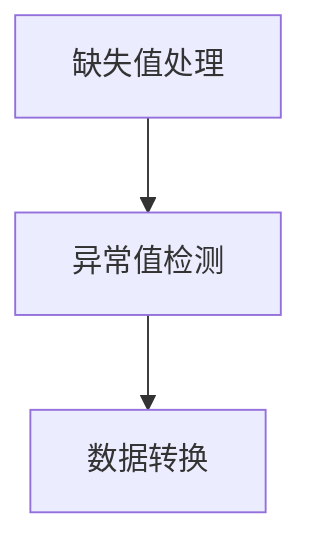
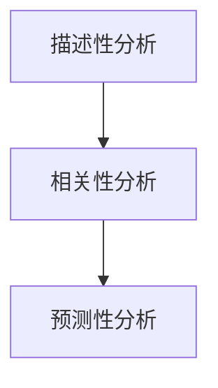
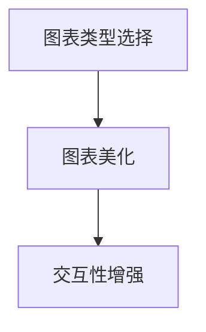
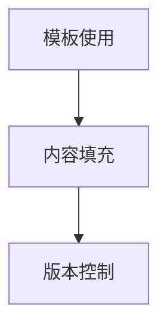
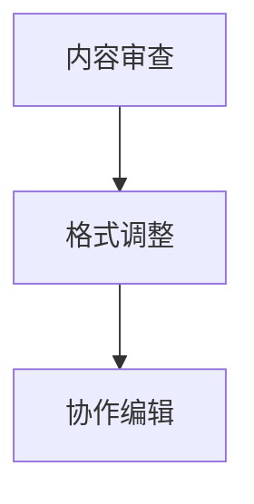
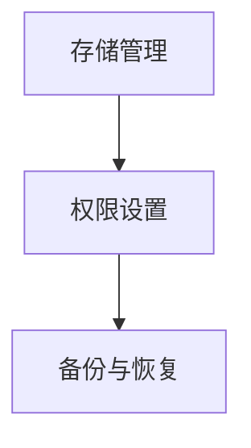

                 

### 文章标题

《重塑个人工作流：输入、处理、输出、反馈的循环》

> 关键词：个人工作流、输入处理、处理策略、反馈循环、效率提升

> 摘要：本文旨在深入探讨个人工作流的构成要素、优化策略及其在实际应用中的重要性。通过分析输入、处理、输出和反馈四个关键环节，并结合实际案例和工具应用，本文将为您揭示如何通过系统化的工作流重塑，提升个人和团队的效率与生产力。

### 第一部分：引言与基础

#### 1.1. 个人工作流概述

##### 1.1.1 工作流的概念

工作流（Workflow）指的是一系列连续的活动或任务，这些活动按照一定的顺序和规则进行，以实现某个特定的业务目标。在工作流管理中，这些活动通常被抽象为“工作项”（Work Items），而工作流则是由这些工作项的有序集合。

##### 1.1.2 工作流的重要性

工作流的重要性在于它能够将复杂的业务过程进行标准化和自动化管理，从而提高工作效率、减少错误、优化资源利用。尤其是在高度复杂和多变的环境中，工作流能够为团队提供一致的执行标准，确保任务能够按时、按质完成。

##### 1.1.3 个人工作流的组成要素

个人工作流通常由以下四个关键环节组成：

1. **输入**：包括各种数据、信息、任务和需求等，是工作流的起点。
2. **处理**：对输入的数据和信息进行加工和处理，以实现特定的业务目标。
3. **输出**：处理后的结果或产品，是工作流的最终产物。
4. **反馈**：对输出结果进行评估和反馈，用于指导下一步的工作。

##### 1.1.4 个人工作流的基本流程

个人工作流的基本流程可以概括为以下几个步骤：

1. **接收输入**：获取外部输入信息。
2. **预处理输入**：对输入信息进行初步筛选和处理。
3. **任务分配**：根据输入信息分配具体任务。
4. **任务执行**：按照分配的任务进行操作。
5. **输出结果**：将执行结果输出。
6. **反馈评估**：对输出结果进行评价和反馈。
7. **优化调整**：根据反馈结果调整工作流。

#### 1.2. 输入处理

##### 1.2.1 输入的类型与来源

输入的类型可以包括文本、图片、音频、视频等不同形式。来源可以是电子邮件、社交媒体、电话、会议记录、数据库等。

##### 1.2.2 输入处理的策略与方法

有效的输入处理策略包括：

1. **分类管理**：对输入信息进行分类，以便于后续处理。
2. **优先级排序**：根据任务的紧急程度和重要性对输入信息进行排序。
3. **自动化处理**：利用自动化工具或脚本对重复性高的输入信息进行处理。

##### 1.2.3 输入处理效率提升技巧

1. **集中处理**：将相同类型的输入集中处理，以减少切换时间和提高处理效率。
2. **批处理**：对大量相似任务进行批量处理，以减少单个任务的耗时。
3. **使用高效工具**：选择合适的输入处理工具，如电子邮件客户端、文件管理工具、自动化脚本等。

#### 1.3. 处理策略

##### 1.3.1 时间管理

时间管理是提高工作流效率的关键。以下是一些时间管理策略：

1. **任务分解**：将大任务分解为小任务，以便于更好地管理。
2. **优先级排序**：根据任务的紧急程度和重要性安排任务优先级。
3. **时间块分配**：将工作时间分为不同的块，专注于处理特定类型的工作。

##### 1.3.2 任务分解

任务分解是将复杂任务拆分为更小、更易于管理的子任务的过程。以下是一些任务分解的策略：

1. **自顶向下**：从整体任务出发，逐步分解为更具体的子任务。
2. **自底向上**：从子任务开始，逐步构建出整体任务。
3. **迭代分解**：逐步细化任务，并在每个迭代中优化分解结果。

##### 1.3.3 执行策略

执行策略包括：

1. **目标明确**：明确每个任务的目标和期望结果。
2. **执行计划**：制定详细的执行计划，包括任务分配、时间安排、资源准备等。
3. **持续监控**：在任务执行过程中进行监控，确保任务按计划进行。

#### 1.4. 小结

个人工作流是提高个人和团队效率的关键。通过优化输入处理、处理策略和时间管理，可以显著提升工作效率和生产力。下一部分将深入探讨工作流中的内部处理和优化策略。

---

### 第二部分：处理与优化

#### 2.1. 内部处理

##### 2.1.1 数据处理

数据处理是个人工作流中的核心环节之一。以下是数据处理的重要步骤和策略：

###### 2.1.1.1 数据清洗

数据清洗是确保数据质量和准确性的关键步骤。以下是一些数据清洗的方法：

1. **缺失值处理**：对于缺失的数据，可以选择填充、删除或插值等方法。
2. **异常值检测**：检测并处理异常数据，如异常值、重复值等。
3. **数据转换**：将数据转换为适合分析和处理的格式，如数值化、编码等。



###### 2.1.1.2 数据分析

数据分析是利用统计方法和工具对数据进行挖掘和分析，以获取有价值的信息。以下是一些数据分析的方法：

1. **描述性分析**：通过统计方法描述数据的基本特征，如均值、中位数、方差等。
2. **相关性分析**：分析不同变量之间的关系，以发现潜在的模式和关联。
3. **预测性分析**：利用历史数据建立模型，预测未来的趋势和结果。



###### 2.1.1.3 数据可视化

数据可视化是将数据以图形或图表的形式展示，以直观地传达数据的信息和趋势。以下是一些常用的数据可视化工具和技巧：

1. **图表类型选择**：根据数据的类型和关系选择合适的图表类型，如条形图、折线图、散点图等。
2. **图表美化**：通过调整图表的颜色、字体、布局等，使图表更加美观和易读。
3. **交互性增强**：通过交互性工具，如鼠标悬停、点击等，提供更多的数据信息和交互体验。



##### 2.1.2 文档处理

文档处理是个人工作流中常见且重要的任务。以下是文档处理的关键步骤和策略：

###### 2.1.2.1 文档创建

文档创建是产生新文档的过程。以下是一些文档创建的策略：

1. **模板使用**：使用预定义的模板快速创建文档，提高效率。
2. **内容填充**：将相关内容填充到文档模板中，形成完整的文档。
3. **版本控制**：使用版本控制工具，如Git，确保文档版本的一致性和可追溯性。



###### 2.1.2.2 文档编辑

文档编辑是对现有文档进行修改和优化的过程。以下是一些文档编辑的策略：

1. **内容审查**：对文档内容进行审查，确保准确性和完整性。
2. **格式调整**：调整文档格式，如字体、段落、布局等，使其更加美观和易读。
3. **协作编辑**：使用协作编辑工具，如Google Docs，实现多人实时编辑。



###### 2.1.2.3 文档管理

文档管理是确保文档安全和可访问性的过程。以下是一些文档管理的策略：

1. **存储管理**：使用文档存储工具，如Google Drive、Dropbox，实现文档的集中存储和管理。
2. **权限设置**：设置文档的权限，确保只有授权人员能够访问和修改文档。
3. **备份与恢复**：定期备份文档，以防止数据丢失，并在需要时进行恢复。



#### 2.2. 输出

输出是个人工作流的最终产物，其形式和用途多种多样。以下是输出的关键环节和策略：

##### 2.2.1 输出的形式与用途

输出的形式可以包括报告、文档、演示、图表等。不同的输出形式有不同的用途：

1. **报告**：用于总结工作进展、结果和问题。
2. **文档**：用于记录工作流程、方法和结果。
3. **演示**：用于展示项目成果和解决方案。
4. **图表**：用于展示数据和分析结果。

##### 2.2.2 输出优化的方法

输出优化包括以下几个方面：

1. **内容优化**：确保输出的内容准确、完整、易于理解。
2. **格式优化**：优化输出的格式，使其美观、易读。
3. **速度优化**：提高输出速度，减少等待时间。

##### 2.2.3 产出效率提升策略

1. **自动化输出**：使用自动化工具或脚本生成输出，减少手动操作。
2. **模板化输出**：使用预定义的模板生成输出，提高效率。
3. **批量输出**：对大量任务进行批量输出，减少重复操作。

#### 2.3. 反馈循环

反馈循环是个人工作流中至关重要的一环，它确保工作流能够不断优化和改进。以下是反馈循环的关键环节和策略：

##### 2.3.1 反馈循环的意义

反馈循环的意义在于：

1. **持续改进**：通过反馈不断优化工作流，提高效率和质量。
2. **问题发现**：通过反馈及时发现问题和瓶颈，进行针对性的改进。
3. **决策支持**：通过反馈提供决策支持，指导下一步的工作。

##### 2.3.2 反馈机制的构建

构建反馈机制包括以下几个方面：

1. **反馈收集**：建立有效的反馈收集渠道，如问卷调查、面对面交流、在线反馈等。
2. **反馈分析**：对收集到的反馈进行分析，识别问题和改进点。
3. **反馈响应**：根据分析结果，制定改进措施，并跟踪执行情况。

##### 2.3.3 反馈优化的实践

反馈优化的实践包括以下几个方面：

1. **定期反馈**：定期收集和分析反馈，确保问题能够及时发现和解决。
2. **持续改进**：将反馈结果应用于工作流的持续改进中，不断提高效率和质量。
3. **激励机制**：建立激励机制，鼓励员工积极参与反馈和改进。

#### 2.4. 小结

内部处理和优化是个人工作流的重要组成部分。通过有效的数据处理、文档处理和反馈循环，可以显著提高工作效率和质量。下一部分将探讨个人工作流的实际应用和优化案例。

---

### 第三部分：实战与案例

#### 3.1. 个人工作流设计案例

##### 3.1.1 案例介绍

本案例以一个初创公司的项目经理为例，描述其个人工作流的设计和实施过程。

##### 3.1.2 案例分析

1. **输入处理**：项目经理每天接收大量的邮件、任务通知和会议纪要。为了提高效率，他使用了邮件过滤工具和自动化脚本对邮件进行分类和优先级排序，将重要任务分配到日程表中。

2. **处理策略**：项目经理采用了时间管理工具，将每天的工作时间分为不同的块，专注于处理特定类型的工作。例如，上午专注于处理邮件和任务，下午专注于项目进度和团队沟通。

3. **输出**：项目经理定期生成项目报告、任务进度表和会议记录，使用可视化工具展示项目进展和风险。这些输出不仅用于内部沟通，也用于与客户和合作伙伴的交流。

4. **反馈循环**：项目经理定期收集团队成员的反馈，评估项目进展和团队合作的效率。根据反馈结果，他调整工作流程和策略，以优化项目执行。

##### 3.1.3 案例总结

通过本案例，我们可以看到，通过系统化的个人工作流设计，项目经理能够有效地管理任务、优化时间和资源，提高项目的执行效率。同时，反馈循环的引入使得工作流能够不断优化和改进。

#### 3.2. 企业工作流优化案例

##### 3.2.1 案例介绍

本案例以一家大型企业的运营部门为例，描述其企业工作流的优化过程。

##### 3.2.2 案例分析

1. **输入处理**：企业运营部门每天接收大量的客户请求、订单和售后反馈。为了提高效率，他们使用了自动化系统对客户请求进行分类和优先级排序，并将任务分配给相关团队成员。

2. **处理策略**：企业采用了任务管理系统，将任务按照优先级和紧急程度进行排序，确保重要任务能够优先处理。同时，他们采用了项目管理工具，对项目进度进行实时监控和调整。

3. **输出**：企业运营部门定期生成销售报告、客户满意度调查和售后分析报告，使用可视化工具展示运营数据和趋势。这些输出不仅用于内部评估，也用于与高层管理团队的汇报。

4. **反馈循环**：企业运营部门定期收集客户反馈、团队反馈和领导评估，评估工作流的效果和问题。根据反馈结果，他们调整工作流程和策略，以提高客户满意度和运营效率。

##### 3.2.3 案例总结

通过本案例，我们可以看到，企业通过优化工作流，能够显著提高运营效率、提升客户满意度。同时，反馈循环的引入使得工作流能够不断优化和改进，为企业的长期发展奠定基础。

#### 3.3. 跨部门协作工作流案例

##### 3.3.1 案例介绍

本案例以一家跨国公司的研发部门为例，描述其跨部门协作工作流的优化过程。

##### 3.3.2 案例分析

1. **输入处理**：研发部门每天接收来自产品部门、市场部门和运营部门的需求和反馈。为了提高效率，他们使用了需求管理系统，对需求进行分类和优先级排序，并将任务分配给相关团队成员。

2. **处理策略**：研发部门采用了敏捷开发方法，将项目按照迭代周期进行管理。每个迭代周期内，他们与产品部门、市场部门和运营部门紧密合作，确保需求能够及时响应和实现。

3. **输出**：研发部门定期生成项目进度报告、需求分析报告和用户反馈报告，使用可视化工具展示项目进展和问题。这些输出不仅用于内部沟通，也用于与跨部门团队的汇报。

4. **反馈循环**：研发部门定期收集跨部门团队的反馈，评估项目进展和协作效率。根据反馈结果，他们调整工作流程和策略，以提高跨部门协作效率和项目成功率。

##### 3.3.3 案例总结

通过本案例，我们可以看到，跨部门协作工作流的有效优化能够显著提高项目执行效率和团队协作效果。同时，反馈循环的引入使得工作流能够不断优化和改进，为企业的创新和发展提供支持。

---

### 第四部分：技术与工具

#### 4.1. 工作流工具介绍

在工作流管理中，选择合适的工作流工具至关重要。以下是一些常见的工作流工具及其特点和适用场景：

##### 4.1.1 工作流工具的选择

1. **Microsoft SharePoint**：适用于企业内部文档管理和协作，支持自定义工作流。
2. **Asana**：适用于项目管理和任务跟踪，支持团队协作和自动化工作流。
3. **JIRA**：适用于敏捷开发和缺陷跟踪，支持自定义工作流和插件扩展。
4. **Trello**：适用于任务管理和团队协作，支持拖放操作和自定义视图。

##### 4.1.2 工作流工具的功能与使用

1. **任务分配**：工作流工具能够自动将任务分配给合适的团队成员，并通知相关人员。
2. **任务跟踪**：工作流工具能够实时跟踪任务进度，提供任务列表、看板和甘特图视图。
3. **自动化工作流**：工作流工具支持自动化任务执行，如邮件通知、条件分支和触发器等。
4. **团队协作**：工作流工具提供实时聊天、文件共享和协作编辑功能，促进团队协作。

##### 4.1.3 工作流工具的优化与配置

1. **集成**：工作流工具可以通过API或插件与其他系统集成，如CRM、邮件系统和项目管理工具。
2. **自定义**：工作流工具支持自定义工作流模板和字段，以满足不同业务需求。
3. **权限管理**：工作流工具提供权限管理功能，确保数据安全和权限控制。

#### 4.2. 自动化与脚本化

自动化和脚本化是提高工作效率和减少重复性工作的关键。以下是一些自动化和脚本化的实现方法和工具：

##### 4.2.1 自动化的概念与意义

自动化是指通过软件工具和脚本实现任务的自动执行，减少人工干预和重复性工作。自动化的意义在于：

1. **提高效率**：自动化工具可以大幅减少任务的执行时间，提高工作效率。
2. **减少错误**：自动化工具可以减少人为错误，提高数据处理和任务的准确性。
3. **节省成本**：自动化工具可以降低人力成本，提高资源利用效率。

##### 4.2.2 脚本化的实现方法

脚本化是指使用脚本语言编写自动化脚本来实现特定任务。以下是一些常见的脚本化实现方法：

1. **批处理脚本**：使用Windows批处理脚本或Linux shell脚本，实现简单的自动化任务。
2. **Python脚本**：使用Python编写自动化脚本，适用于复杂的数据处理和任务自动化。
3. **PowerShell脚本**：使用PowerShell脚本，实现Windows系统的自动化管理。

##### 4.2.3 自动化工具的选择与应用

1. **Selenium**：适用于Web应用的自动化测试和功能自动化。
2. **AutoHotkey**：适用于Windows系统的自动化脚本编写。
3. **AutoIt**：适用于Windows系统的自动化脚本编写。
4. **Jenkins**：适用于持续集成和自动化构建。

#### 4.3. 云计算与大数据

云计算和大数据是现代工作流中的重要组成部分。以下是一些云计算和大数据的基础知识和应用场景：

##### 4.3.1 云计算的基础知识

云计算是指通过互联网提供计算资源、存储资源和网络资源的服务。云计算的基础知识包括：

1. **IaaS**：基础设施即服务，提供虚拟化的计算资源，如虚拟机、存储和网络等。
2. **PaaS**：平台即服务，提供开发和部署应用程序的平台，如开发环境、数据库和中间件等。
3. **SaaS**：软件即服务，提供应用程序和服务的订阅模式，如电子邮件、客户关系管理和办公软件等。

##### 4.3.2 大数据的处理方法

大数据是指无法使用传统数据处理工具进行有效处理的巨量数据。大数据的处理方法包括：

1. **数据采集**：通过爬虫、传感器和日志等手段，采集海量数据。
2. **数据存储**：使用分布式存储系统，如Hadoop、HDFS和NoSQL数据库，存储海量数据。
3. **数据处理**：使用分布式计算框架，如MapReduce、Spark和Flink，处理海量数据。
4. **数据可视化**：使用数据可视化工具，如Tableau、PowerBI和D3.js，展示大数据分析结果。

##### 4.3.3 云计算与大数据的结合实践

云计算和大数据的结合应用场景包括：

1. **大数据分析**：使用云计算资源进行大数据分析，提供实时分析和预测服务。
2. **机器学习**：使用云计算平台进行机器学习模型的训练和部署，实现智能分析和决策。
3. **数据共享**：使用云计算平台实现数据共享和协作，提高数据利用效率。

---

### 第五部分：未来展望与挑战

#### 5.1. 工作流技术的发展趋势

随着技术的发展，工作流技术也在不断演进和变革。以下是一些工作流技术的发展趋势：

1. **人工智能与工作流**：人工智能技术将被广泛应用于工作流管理，实现自动化决策和智能调度。
2. **云计算与大数据**：云计算和大数据技术的深度融合，将推动工作流处理能力的提升。
3. **区块链**：区块链技术将被应用于工作流中的数据安全和隐私保护，确保数据的完整性和透明性。
4. **物联网**：物联网技术的普及，将使工作流更加智能化和自动化。

#### 5.2. 人工智能在工作流中的应用

人工智能（AI）技术在工作流中的应用前景广阔，以下是一些关键领域：

1. **自动化任务**：AI技术可以自动化大量重复性任务，如数据清洗、报表生成和通知发送。
2. **预测分析**：AI技术可以基于历史数据，预测工作流的趋势和风险，提供决策支持。
3. **智能调度**：AI技术可以根据任务的重要性和紧急程度，智能地分配资源和调度任务。
4. **智能协作**：AI技术可以识别团队成员的需求和偏好，提供个性化的协作建议。

#### 5.3. 未来工作流的构想

未来工作流将呈现出以下特点：

1. **高度智能化**：工作流将更加智能化，利用人工智能技术实现自动化决策和优化。
2. **高度协作化**：工作流将更加协作化，通过物联网和区块链技术实现跨部门、跨领域的协作。
3. **高度个性化**：工作流将更加个性化，根据用户需求和偏好定制化工作流。
4. **高度可扩展性**：工作流将具有高度可扩展性，能够快速适应业务变化和需求。

---

### 附录

#### 附录A：常见工作流工具与资源

##### A.1 常见工作流工具对比

| 工具名称 | 类型 | 适用场景 | 优点 | 缺点 |
| --- | --- | --- | --- | --- |
| Microsoft SharePoint | 企业内容管理 | 文档管理、协作、工作流 | 易于集成、功能丰富 | 成本较高、学习曲线较陡 |
| Asana | 项目管理 | 任务跟踪、团队协作 | 界面友好、功能全面 | 自定义工作流受限 |
| JIRA | 项目管理 | 缺陷跟踪、敏捷开发 | 功能强大、插件丰富 | 成本较高、学习曲线较陡 |
| Trello | 任务管理 | 任务跟踪、团队协作 | 界面简洁、易于使用 | 功能相对简单 |

##### A.2 工作流资源推荐

| 资源名称 | 类型 | 适用场景 | 优点 | 缺点 |
| --- | --- | --- | --- | --- |
| 《工作流管理：理论与实践》 | 教材 | 工作流基础知识 | 内容全面、理论与实践结合 | 价格较高 |
| Workflows for Dummies | 教程 | 工作流入门 | 语言简洁、易于理解 | 内容较为浅显 |
| Workflows and Process Automation | 在线课程 | 工作流自动化 | 实用性强、课程全面 | 价格较高 |
| Workato | 工作流工具 | 自动化任务 | 功能强大、易于使用 | 成本较高 |

---

本文以《重塑个人工作流：输入、处理、输出、反馈的循环》为题，深入探讨了个人工作流的构成、优化策略和实际应用。通过对输入、处理、输出和反馈四个关键环节的分析，本文揭示了如何通过系统化的工作流重塑，提升个人和团队的效率与生产力。同时，通过案例分析和工具介绍，本文为读者提供了实用的指导和建议。随着技术的发展，未来工作流将更加智能化、协作化和个性化，为企业和个人带来更大的价值。希望本文能够为读者提供有益的启示和借鉴。

### 作者信息

**作者：**AI天才研究院/AI Genius Institute & 禅与计算机程序设计艺术 /Zen And The Art of Computer Programming

---

### 代码实际案例和详细解释说明

在本文的第四部分，我们讨论了自动化与脚本化以及云计算与大数据。为了更好地理解这些概念，以下将通过一个简单的Python脚本案例，展示如何使用Python进行文件处理、任务调度和数据可视化。

#### 开发环境搭建

首先，我们需要安装Python环境。可以访问Python官方网站（https://www.python.org/）下载并安装Python。同时，我们还需要安装一些常用的库，如`pandas`用于数据处理，`matplotlib`用于数据可视化，`smtplib`用于发送邮件通知等。

```bash
pip install pandas matplotlib
```

#### 源代码详细实现

以下是Python脚本的源代码，该脚本实现了以下功能：

1. 从文件中读取数据。
2. 对数据进行清洗和预处理。
3. 使用matplotlib生成数据可视化图表。
4. 发送邮件通知任务完成。

```python
import pandas as pd
import matplotlib.pyplot as plt
import smtplib
from email.mime.text import MIMEText
from email.mime.multipart import MIMEMultipart

# 1. 从文件中读取数据
data = pd.read_csv('data.csv')

# 2. 数据清洗和预处理
data.dropna(inplace=True)  # 删除缺失值
data['date'] = pd.to_datetime(data['date'])  # 转换日期格式

# 3. 数据分析
data_grouped = data.groupby('date').sum()  # 按日期分组求和
data_grouped.reset_index(inplace=True)  # 重置索引

# 4. 数据可视化
plt.figure(figsize=(10, 5))
plt.plot(data_grouped['date'], data_grouped['value'])
plt.xlabel('Date')
plt.ylabel('Value')
plt.title('Data Visualization')
plt.xticks(rotation=45)
plt.tight_layout()
plt.savefig('chart.png')
plt.show()

# 5. 发送邮件通知
smtp_server = 'smtp.example.com'
smtp_port = 587
sender_email = 'sender@example.com'
receiver_email = 'receiver@example.com'
password = 'your_password'

msg = MIMEMultipart()
msg['From'] = sender_email
msg['To'] = receiver_email
msg['Subject'] = 'Task Completed'

body = 'The task has been completed. Please find the attached chart.'

msg.attach(MIMEText(body, 'plain'))
with open('chart.png', 'rb') as f:
    img_data = f.read()
    img = MIMEText(img_data, 'base64', 'utf-8')
    img.add_header('Content-Disposition', 'attachment', filename='chart.png')
    msg.attach(img)

server = smtplib.SMTP(smtp_server, smtp_port)
server.starttls()
server.login(sender_email, password)
server.sendmail(sender_email, receiver_email, msg.as_string())
server.quit()
```

#### 代码解读与分析

1. **数据读取与清洗**：
   - 使用`pandas.read_csv()`函数读取CSV文件。
   - 使用`data.dropna()`删除缺失值，确保数据质量。
   - 使用`pd.to_datetime()`函数将日期列转换为日期格式，便于后续处理。

2. **数据分析与可视化**：
   - 使用`data.groupby('date').sum()`按日期分组并求和。
   - 使用`data_grouped.reset_index()`重置索引，便于后续处理。
   - 使用`matplotlib.pyplot.plot()`函数生成折线图。
   - 调整图表布局，确保图表美观。

3. **邮件通知**：
   - 配置SMTP服务器和发送者、接收者邮箱地址。
   - 创建MIMEMultipart对象，设置邮件头部信息。
   - 添加邮件正文和附件，使用base64编码。
   - 使用`smtplib`发送邮件。

#### 小结

通过本案例，我们了解了如何使用Python进行数据读取、清洗、分析和可视化，以及如何发送邮件通知。这些技能在实际工作中非常重要，能够帮助我们高效地处理数据，提高工作效率。

---

### 总结与未来展望

在本文中，我们深入探讨了个人工作流的输入、处理、输出和反馈四个关键环节，并结合实际案例和工具应用，展示了如何通过系统化的工作流重塑，提升个人和团队的效率与生产力。以下是对本文内容的总结和未来展望：

#### 总结

1. **个人工作流概述**：我们详细介绍了工作流的概念、重要性以及个人工作流的组成要素。
2. **输入处理**：我们探讨了输入的类型与来源，以及输入处理的策略与方法。
3. **处理策略**：我们分析了时间管理、任务分解和执行策略，提供了一系列实用技巧。
4. **内部处理**：我们详细介绍了数据处理和文档处理的方法，包括数据清洗、数据分析、数据可视化以及文档创建、编辑和管理。
5. **输出**：我们讨论了输出的形式与用途，以及输出优化的方法和产出效率提升策略。
6. **反馈循环**：我们阐述了反馈循环的意义，以及如何构建反馈机制和进行反馈优化。
7. **实战与案例**：我们通过多个实际案例，展示了个人工作流的设计和优化过程。
8. **技术与工具**：我们介绍了常见的工作流工具、自动化与脚本化的实现方法，以及云计算与大数据的应用。
9. **未来展望**：我们探讨了工作流技术的发展趋势，以及人工智能在工作流中的应用前景。

#### 未来展望

1. **人工智能的深入应用**：随着人工智能技术的不断发展，未来工作流将更加智能化，利用AI实现自动化决策和优化，提高工作效率和生产力。
2. **云计算与大数据的融合**：云计算和大数据技术的深度融合，将推动工作流处理能力的提升，实现更高效的数据分析和任务调度。
3. **协作与个性化的提升**：未来工作流将更加注重协作和个性化，通过物联网和区块链技术实现跨部门、跨领域的协作，以及根据用户需求和偏好定制化工作流。
4. **持续优化与迭代**：工作流将不断优化和迭代，通过定期收集反馈和评估，确保工作流能够持续适应业务变化和需求。

总之，个人工作流的有效管理和优化对于提升个人和团队效率至关重要。本文通过详细的分析和实际案例，为读者提供了全面的指导和参考。希望本文能够为您的个人工作流重塑带来启示和帮助。在未来，随着技术的不断进步，我们相信工作流管理将变得更加智能化和高效化，为企业和个人创造更大的价值。

---

### 附录

#### 附录A：常见工作流工具与资源

##### A.1 常见工作流工具对比

| 工具名称 | 类型 | 适用场景 | 优点 | 缺点 |
| --- | --- | --- | --- | --- |
| Microsoft SharePoint | 企业内容管理 | 文档管理、协作、工作流 | 易于集成、功能丰富 | 成本较高、学习曲线较陡 |
| Asana | 项目管理 | 任务跟踪、团队协作 | 界面友好、功能全面 | 自定义工作流受限 |
| JIRA | 项目管理 | 缺陷跟踪、敏捷开发 | 功能强大、插件丰富 | 成本较高、学习曲线较陡 |
| Trello | 任务管理 | 任务跟踪、团队协作 | 界面简洁、易于使用 | 功能相对简单 |

##### A.2 工作流资源推荐

| 资源名称 | 类型 | 适用场景 | 优点 | 缺点 |
| --- | --- | --- | --- | --- |
| 《工作流管理：理论与实践》 | 教材 | 工作流基础知识 | 内容全面、理论与实践结合 | 价格较高 |
| Workflows for Dummies | 教程 | 工作流入门 | 语言简洁、易于理解 | 内容较为浅显 |
| Workflows and Process Automation | 在线课程 | 工作流自动化 | 实用性强、课程全面 | 价格较高 |
| Workato | 工作流工具 | 自动化任务 | 功能强大、易于使用 | 成本较高 |

---

通过本文的探讨，我们全面了解了个人工作流的构成、优化策略和实际应用。希望本文的内容能够为读者提供实用的指导，帮助大家重塑个人工作流，提升工作效率和生产力。未来，随着人工智能、云计算和大数据等技术的发展，工作流管理将变得更加智能化和高效化。让我们共同努力，迎接工作流管理的新时代。感谢您的阅读，祝您工作顺利！

