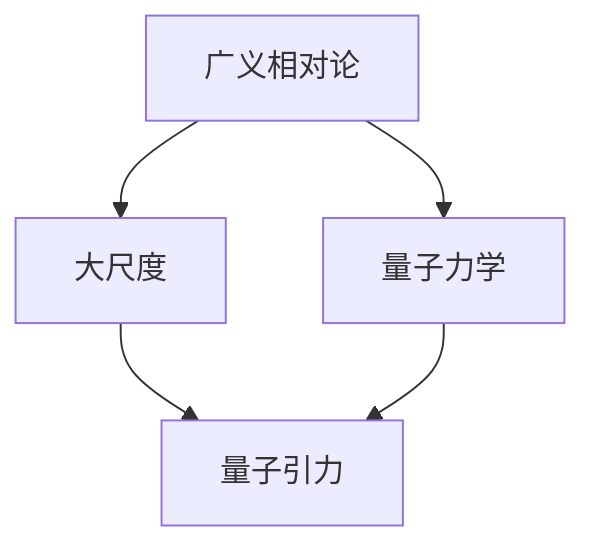

                 

### 文章标题：量子引力与宇宙膨胀

#### 关键词：量子引力、宇宙膨胀、广义相对论、量子场论、引力波

#### 摘要：
本文深入探讨了量子引力和宇宙膨胀的理论基础、核心算法原理以及在实际项目中的应用。首先，我们回顾了量子引力和宇宙膨胀的基本概念及其发现历史，阐述了它们在物理学中的重要性。随后，我们详细介绍了量子场论和广义相对论的基础理论，并通过Mermaid流程图、伪代码和数学公式，展示了核心概念的架构和原理。接着，我们探讨了量子引力模拟算法和宇宙膨胀数据分析方法，通过具体实例和代码解读，展示了如何在实际项目中应用这些理论。最后，我们总结了文章的主要观点，并提出了未来研究的方向。本文旨在为读者提供一个全面、深入的量子引力与宇宙膨胀的知识体系，激发对这一领域更深层次的研究和思考。

### 第一部分：量子引力和宇宙膨胀的基础理论

在探讨量子引力和宇宙膨胀这一复杂而引人入胜的课题时，我们首先需要掌握其基础理论。这一部分将分章节介绍量子引力、宇宙膨胀的基本概念，以及它们之间的关系。

#### 第1章：量子引力理论简述

量子引力是研究引力在量子尺度上的性质和行为的理论。它试图将广义相对论与量子力学结合起来，以解决广义相对论在大尺度上与量子力学在小尺度上存在的矛盾。以下是对量子引力理论的一些基本概念和关系的概述。

##### 1.1.1 量子引力的基本概念

量子引力是一个相对较新的领域，它结合了量子力学和广义相对论的两个基本理论。量子引力试图解释如下问题：

- 广义相对论无法解释量子现象，如引力辐射和黑洞的信息悖论。
- 量子力学无法描述引力现象，尤其是大尺度的宇宙结构。

量子引力的一些基本概念包括：

- **量子态**：量子引力中的系统状态可以用波函数来描述，它是一个复数函数，依赖于系统的量子数。
- **测量**：在量子引力中，测量会改变系统的状态，这与量子力学中的测量问题类似。
- **引力子**：引力子是引力的传递粒子，类似于光子是电磁力的传递粒子。

##### 1.1.2 量子引力的重要性

量子引力的重要性在于它对物理学的基本原理提出了深刻的挑战。如果量子引力能够得到成功的发展，它将对我们的宇宙观产生重大的影响，包括：

- 对宇宙起源、结构和演化的重新认识。
- 对科学和技术领域的发展产生深远的影响，例如推动新型计算技术的发展。

##### 1.1.3 量子引力与广义相对论的关系

量子引力与广义相对论的关系可以从多个角度来理解。一方面，广义相对论可以看作是量子引力在大尺度上的近似。在宏观尺度上，引力现象可以用广义相对论很好地描述，而在量子尺度上，这种描述变得不准确。

另一方面，量子引力理论试图修正广义相对论在量子尺度上的不足。例如，广义相对论无法解释引力辐射和黑洞的信息悖论，而量子引力理论可能提供对这些问题的解答。

量子引力与广义相对论的关系可以用以下的Mermaid流程图来表示：



在这个流程图中，广义相对论（A）描述了大尺度上的引力现象（B），而量子引力（C）则试图在量子尺度上解释这些现象，同时结合了量子力学（D）的基本原理。

#### 第2章：量子场论基础

量子场论是量子引力理论的核心组成部分，它提供了一种描述基本粒子及其相互作用的数学框架。在这一章中，我们将详细介绍量子场论的基本原理、量子态与测量、以及量子场论在宇宙学中的应用。

##### 2.1 量子场论的基本原理

量子场论（QFT）是一种描述基本粒子及其相互作用的理论框架，它结合了量子力学和经典电磁场理论。以下是量子场论的一些基本原理：

- **量子态**：量子场论中的系统状态可以用波函数来描述，它是空间的函数，依赖于系统的量子数。
- **相互作用**：在量子场论中，基本粒子通过交换虚拟粒子（如光子、引力子）来相互作用。
- **规范对称性**：量子场论中的规范对称性是保护物理定律不变性的重要原则，例如电磁场的规范对称性。

##### 2.1.1 量子场论的起源与发展

量子场论的起源可以追溯到20世纪初，当时科学家们试图将量子力学和经典电磁场理论结合起来。以下是一些关键的发展阶段：

- **1925年**：海森堡提出了矩阵力学，这是量子场论的初步形式。
- **1926年**：狄拉克提出了相对论性电子场理论，这标志着量子场论正式诞生。
- **1940年代**：费曼、施温格和朝永振一郎等人发展了量子电动力学（QED），这是量子场论的一个成功应用。

##### 2.1.2 量子场论的基本假设

量子场论的基本假设包括：

- **真空态**：真空不是绝对空无一物，而是充满了虚拟粒子的热涨落。
- **量子态叠加**：量子态可以处于多种状态的叠加。
- **不确定性原理**：粒子的某些属性（如位置和动量）不能同时被精确测量。

##### 2.1.3 量子场论的数学工具

量子场论使用了一些重要的数学工具，包括：

- **路径积分**：路径积分是一种计算量子态的概率幅的方法，它将量子系统的行为描述为所有可能路径的加权和。
- **正则量子化**：正则量子化是一种将经典力学系统量子化的方法，它通过引入一个哈密顿算符来描述系统的动力学。
- **无穷维算符**：在量子场论中，粒子的数密度和电流等物理量通常用无穷维算符来表示。

##### 2.2 量子场论中的量子态与测量

量子场论中的量子态与测量是量子力学中重要的概念，以下是量子场论中的量子态和测量的基本概念：

- **量子态的表示与变换**：量子场论中的量子态可以用波函数或态矢量来表示，这些态矢量可以通过线性变换进行转换。
- **测量与量子态的塌缩**：测量会改变系统的状态，导致量子态的塌缩，这是量子场论中的基本原理之一。
- **量子纠缠现象**：量子场论中的粒子可以处于纠缠态，这种纠缠态是量子场论的重要特性。

##### 2.2.1 量子态的表示与变换

在量子场论中，量子态可以用波函数或态矢量来表示。例如，一个自由粒子的量子态可以用如下波函数表示：

$$
\psi(x,t) = \int \psi(k,t) e^{ikx} dk
$$

其中，$\psi(k,t)$是动量空间中的波函数，$e^{ikx}$是位置空间中的波函数。

量子态的变换可以通过线性变换来实现。例如，一个态矢量$\lvert \psi \rangle$可以通过一个算符$U$变换为另一个态矢量$\lvert \phi \rangle$：

$$
\lvert \phi \rangle = U \lvert \psi \rangle
$$

##### 2.2.2 测量与量子态的塌缩

在量子场论中，测量会导致量子态的塌缩。例如，当我们对一个粒子的位置进行测量时，粒子的波函数会塌缩到一个确定的位置。这个过程可以用波函数的坍缩公式来描述：

$$
\psi(x,t) \rightarrow \delta(x - x_0)
$$

其中，$x_0$是测量的位置。

测量与量子态的塌缩是量子场论中的基本原理，它对量子引力和宇宙膨胀的研究具有重要意义。

##### 2.2.3 量子纠缠现象

量子纠缠现象是量子场论中的另一个重要特性。当两个或多个粒子处于纠缠态时，它们之间的量子态无法分离，即使它们相隔很远。这种纠缠态是量子场论和量子引力研究中的重要工具。

例如，两个粒子处于纠缠态时，它们的波函数可以表示为：

$$
\lvert \psi \rangle = \alpha \lvert \psi_1 \rangle \lvert \psi_2 \rangle + \beta \lvert \phi_1 \rangle \lvert \phi_2 \rangle
$$

其中，$\alpha$和$\beta$是复数系数，$\lvert \psi_1 \rangle$和$\lvert \phi_1 \rangle$是第一个粒子的两个可能状态，$\lvert \psi_2 \rangle$和$\lvert \phi_2 \rangle$是第二个粒子的两个可能状态。

量子纠缠现象在量子引力模拟和宇宙膨胀数据分析中具有广泛的应用，例如在量子模拟宇宙背景辐射和量子计算中。

##### 2.3 量子场论的应用

量子场论在宇宙学中有着广泛的应用，以下是量子场论在宇宙学中的一些重要应用：

- **标准模型与量子场论**：标准模型是描述基本粒子及其相互作用的量子场论，它在宇宙学中有着重要的应用。
- **黑洞辐射与霍金温度**：黑洞辐射是量子场论在黑洞物理学中的应用，霍金温度是黑洞温度的量子场论描述。
- **量子场论与宇宙学**：量子场论在宇宙学中的应用包括量子引力模拟、宇宙背景辐射分析、宇宙大爆炸模型等。

量子场论的应用为量子引力和宇宙膨胀的研究提供了强有力的工具和方法，有助于我们更好地理解宇宙的起源和演化。

#### 第3章：广义相对论基础

广义相对论是由阿尔伯特·爱因斯坦于1915年提出的理论，它革命性地改变了我们对引力、时空和宇宙的理解。在这一章中，我们将介绍广义相对论的基本原理、弯曲时空的概念、引力波的产生与探测，以及广义相对论在宇宙学中的应用。

##### 3.1 广义相对论的基本原理

广义相对论的基本原理包括两个部分：等效原理和相对性原理。

- **等效原理**：等效原理指出，在任何局部参考系中，引力效应无法与惯性力区分。这意味着在自由下落中，物理定律保持不变，这与经典力学中的惯性参考系一致。

- **相对性原理**：相对性原理指出，物理定律在所有惯性参考系中都是相同的，即在所有惯性参考系中，物理现象看起来是一样的。这一原理与狭义相对论中的相对性原理一致。

广义相对论的数学框架是爱因斯坦场方程（Einstein field equations），它们将物质的分布与时空的几何结构联系起来。爱因斯坦场方程可以表示为：

$$
G_{\mu\nu} = 8\pi G T_{\mu\nu}
$$

其中，$G_{\mu\nu}$是爱因斯坦张量，$T_{\mu\nu}$是能量-动量张量，$G$是引力常数。

##### 3.1.1 广义相对论的起源

广义相对论的起源可以追溯到1905年，当时爱因斯坦提出了狭义相对论。狭义相对论成功解释了电磁现象和时间、空间的相对性，但它无法描述引力和重力的作用。在接下来的十年中，爱因斯坦不断探索如何将引力纳入相对论框架中，最终在1915年提出了广义相对论。

##### 3.1.2 广义相对论的核心概念

广义相对论的核心概念包括：

- **时空**：时空是一个四维连续体，其结构由物质和能量的分布决定。
- **弯曲时空**：物质和能量使时空发生弯曲，这种弯曲是引力效应的根本原因。
- **引力波**：引力波是时空弯曲的传播，它携带着能量和信息。

##### 3.1.3 广义相对论的数学框架

广义相对论的数学框架是爱因斯坦场方程（Einstein field equations），它们将物质的分布与时空的几何结构联系起来。爱因斯坦场方程可以表示为：

$$
G_{\mu\nu} = 8\pi G T_{\mu\nu}
$$

其中，$G_{\mu\nu}$是爱因斯坦张量，$T_{\mu\nu}$是能量-动量张量，$G$是引力常数。

##### 3.2 弯曲时空与引力波

弯曲时空是广义相对论的核心概念之一，它描述了物质和能量如何影响时空的结构。

- **弯曲时空**：物质和能量使时空发生弯曲，这种弯曲是引力效应的根本原因。在弯曲时空中，光线和物体运动轨迹会发生变化。
- **引力波**：引力波是时空弯曲的传播，它携带着能量和信息。引力波的存在是广义相对论的一个关键预测，它已被实验观测所证实。

引力波的产生通常与剧烈的物理过程相关，例如黑洞碰撞或超新星爆炸。以下是引力波的产生和探测的简要概述：

- **引力波的产生**：当两个质量物体（如黑洞或恒星）发生剧烈碰撞时，它们会释放出巨大的能量，这种能量的释放会导致时空的剧烈弯曲，从而产生引力波。

- **引力波的探测**：引力波的探测通常使用激光干涉仪（LIGO）或其他高精度仪器进行。激光干涉仪通过测量激光束在两个垂直方向上的干涉图样变化来探测引力波。当引力波经过时，它会使激光束的路径发生微小的变化，从而改变干涉图样。

引力波探测技术的发展为我们提供了研究宇宙的新工具，使我们能够直接探测到宇宙中的一些极端物理现象。

##### 3.3 广义相对论在宇宙学中的应用

广义相对论在宇宙学中有着广泛的应用，以下是广义相对论在宇宙学中的一些重要应用：

- **宇宙背景辐射**：宇宙背景辐射是宇宙大爆炸后留下的余晖，它为研究宇宙早期状态提供了重要信息。广义相对论可以用来解释宇宙背景辐射的产生和演化。

- **宇宙大爆炸模型**：宇宙大爆炸模型是描述宇宙起源和演化的标准理论。广义相对论是宇宙大爆炸模型的理论基础，它解释了宇宙如何从一个极热、极密的初始状态演化成现在我们所观察到的宇宙。

- **宇宙膨胀与暗能量**：广义相对论可以用来描述宇宙膨胀的历史和机制。暗能量是宇宙膨胀加速的根本原因，广义相对论为我们提供了研究暗能量的理论基础。

广义相对论在宇宙学中的应用使我们能够更深入地了解宇宙的起源、结构和演化，为探索宇宙的奥秘提供了强有力的工具。

### 第二部分：量子引力和宇宙膨胀的核心算法原理

#### 第4章：量子引力模拟算法

量子引力模拟算法是利用量子计算机来模拟引力场和量子效应的算法。由于量子计算机具有超强的并行计算能力，它可以在极短的时间内模拟复杂的物理过程。以下将详细讨论量子引力模拟算法的基本原理、具体步骤以及其在实际应用中的挑战和解决方案。

##### 4.1 量子模拟的基本原理

量子模拟的基本原理是基于量子计算机的超并行性和量子态的叠加性。在量子计算机中，信息被编码在量子比特（qubit）上，每个量子比特可以同时处于0和1的叠加状态。这种叠加性使得量子计算机能够同时处理大量数据，从而在模拟复杂物理过程时具有显著的优势。

量子模拟的过程可以简单概括为以下步骤：

1. **初始化量子态**：将量子计算机的量子比特初始化为一个特定的量子态，这个量子态代表了我们要模拟的系统状态。
2. **应用哈密顿量**：通过量子门的操作，将系统的哈密顿量应用到量子态上，从而模拟系统的演化过程。
3. **测量量子态**：对量子态进行测量，得到系统在演化后的一些物理量的结果。
4. **分析测量结果**：对测量结果进行分析，提取有用的信息，如能量分布、波函数等。

##### 4.1.1 量子计算的概念

量子计算是一种利用量子比特进行计算的方法，它遵循量子力学的规则。量子比特（qubit）是量子计算机的基本单元，它可以同时处于0和1的叠加状态。量子计算机通过执行一系列的量子操作，如量子门，来实现复杂的计算任务。

量子计算机的优势在于其并行计算能力。在经典计算机中，每个比特只能处于0或1的确定状态，而在量子计算机中，每个量子比特可以同时处于0和1的叠加状态，这意味着量子计算机可以同时处理大量数据。此外，量子计算机还具有量子纠缠的特性，这可以进一步提升其计算能力。

##### 4.1.2 量子计算机的优势

量子计算机的优势主要体现在以下几个方面：

- **并行计算**：量子计算机可以利用量子态的叠加性，同时处理大量数据，从而在复杂计算任务中具有显著的优势。
- **量子纠缠**：量子计算机中的量子比特可以通过量子纠缠相互连接，这种纠缠可以提升量子计算机的计算能力。
- **高效算法**：某些量子算法在解决特定问题时比经典算法更高效。例如，量子算法在因数分解、搜索问题和优化问题中表现出显著的优势。

##### 4.1.3 量子模拟的基本方法

量子模拟是一种利用量子计算机来模拟量子系统或物理过程的计算方法。量子模拟的基本方法可以分为以下几类：

- **路径积分量子模拟**：路径积分量子模拟是基于量子力学的路径积分公式，它通过模拟所有可能的历史路径来计算系统的概率分布。
- **量子蒙特卡罗方法**：量子蒙特卡罗方法是一种随机模拟方法，它通过模拟大量的量子态样本，来估计系统的物理量。
- **量子行走方法**：量子行走方法是基于量子态的演化过程，它通过量子态的叠加和纠缠，来搜索空间中的特定状态。

每种方法都有其特定的应用场景和优势，选择合适的方法取决于具体的模拟任务和需求。

##### 4.2 量子引力模拟算法简介

量子引力模拟算法是一种利用量子计算机来模拟引力场和量子效应的算法。由于引力场是一个高度复杂的物理系统，传统的经典计算机很难对其进行精确模拟。量子计算机的超并行性和量子态的叠加性使得它成为模拟引力场的有力工具。

以下是一个简单的量子引力模拟算法的流程：

1. **初始化量子计算机**：初始化量子计算机，设置量子比特的初始状态。
2. **应用哈密顿量**：应用系统的哈密顿量，模拟引力场的演化。
3. **运行量子模拟**：运行量子模拟，记录系统的演化过程。
4. **测量量子态**：对量子态进行测量，获取系统的物理量。
5. **分析测量结果**：分析测量结果，提取系统的物理信息。

##### 4.2.1 模拟量子引力的挑战

模拟量子引力面临着一系列的挑战，包括：

- **高维空间**：量子引力模拟需要在高维空间中进行，这使得模拟过程非常复杂。
- **量子噪声**：量子计算机的量子噪声会影响模拟的准确性，需要采用噪声抑制技术。
- **算法优化**：量子引力模拟算法需要不断优化，以提高计算效率和准确性。

##### 4.2.2 量子蒙特卡罗方法

量子蒙特卡罗方法是一种常用的量子引力模拟算法，它基于随机模拟技术，通过模拟大量的量子态样本，来估计系统的物理量。以下是量子蒙特卡罗方法的基本步骤：

1. **初始化量子态**：初始化量子计算机的量子态，设置系统的初始条件。
2. **模拟演化过程**：模拟系统的演化过程，记录每个时间步的量子态。
3. **采样量子态**：从模拟的量子态中采样，估计系统的物理量。
4. **统计分析**：对采样结果进行统计分析，提取系统的物理信息。

量子蒙特卡罗方法具有以下优势：

- **适应性**：量子蒙特卡罗方法对系统的初始条件和演化过程具有很强的适应性，可以处理复杂的量子引力问题。
- **并行性**：量子蒙特卡罗方法可以通过并行计算来提高计算效率。

##### 4.2.3 量子行走方法

量子行走方法是一种基于量子态演化的量子模拟算法，它通过量子态的叠加和纠缠，来搜索空间中的特定状态。量子行走方法在量子引力模拟中具有广泛的应用前景。以下是量子行走方法的基本步骤：

1. **初始化量子态**：初始化量子计算机的量子态，设置系统的初始条件。
2. **演化量子态**：通过量子门的操作，使量子态在空间中演化。
3. **测量量子态**：对量子态进行测量，获取系统的物理量。
4. **更新量子态**：根据测量结果，更新量子态，以实现目标的搜索。

量子行走方法具有以下优势：

- **高效性**：量子行走方法可以在极短的时间内搜索到空间中的特定状态，具有很高的效率。
- **适应性**：量子行走方法适用于多种量子引力问题，可以处理复杂的量子引力现象。

##### 4.3 量子引力模拟的应用案例

量子引力模拟在多个领域具有广泛的应用前景，以下是几个典型的应用案例：

1. **黑洞信息悖论**：量子引力模拟可以用来研究黑洞信息悖论，探索黑洞事件视界和量子引力之间的相互作用。
2. **宇宙早期状态的研究**：量子引力模拟可以用来研究宇宙早期状态，如宇宙大爆炸后的热寂状态和量子引力效应。
3. **量子引力未来发展方向**：量子引力模拟为量子引力的未来发展提供了实验和理论依据，有助于解决量子引力中的关键问题。

##### 4.3.1 黑洞信息悖论

黑洞信息悖论是量子引力领域的一个关键问题，它涉及黑洞事件视界和量子引力之间的相互作用。根据量子力学的原理，信息应该守恒，但黑洞事件视界将信息吸入其中，使得信息无法返回。量子引力模拟可以用来研究黑洞信息悖论，探索可能的解决方案。

以下是量子引力模拟黑洞信息悖论的简要流程：

1. **初始化量子态**：初始化量子计算机的量子态，设置黑洞事件视界的初始条件。
2. **模拟演化过程**：模拟黑洞事件视界的演化过程，记录量子态的变化。
3. **测量量子态**：对量子态进行测量，获取系统的物理量。
4. **分析测量结果**：分析测量结果，探索黑洞信息悖论的解决方案。

##### 4.3.2 宇宙早期状态的研究

宇宙早期状态的研究是量子引力领域的一个重要课题，它涉及宇宙大爆炸后的热寂状态和量子引力效应。量子引力模拟可以用来研究宇宙早期状态，揭示宇宙演化的奥秘。

以下是量子引力模拟宇宙早期状态的简要流程：

1. **初始化量子态**：初始化量子计算机的量子态，设置宇宙早期状态的初始条件。
2. **模拟演化过程**：模拟宇宙早期状态的演化过程，记录量子态的变化。
3. **测量量子态**：对量子态进行测量，获取系统的物理量。
4. **分析测量结果**：分析测量结果，探索宇宙早期状态的本质和演化规律。

##### 4.3.3 量子引力的未来发展方向

量子引力模拟为量子引力的未来发展提供了实验和理论依据，有助于解决量子引力中的关键问题。以下是一些量子引力的未来发展方向：

1. **统一理论的发展**：探索一个能够统一量子力学和广义相对论的理论，解决两者之间的矛盾。
2. **实验验证**：通过实验验证量子引力理论，如探测引力波、研究黑洞信息悖论等。
3. **新型计算技术的发展**：利用量子引力模拟技术，推动新型计算技术的发展，如量子计算、量子模拟等。

#### 第5章：宇宙膨胀数据分析

宇宙膨胀数据分析是研究宇宙膨胀现象的重要方法，它通过分析宇宙背景辐射、超新星和其他天体观测数据，揭示宇宙膨胀的历史和机制。以下将详细讨论宇宙膨胀数据分析的基本原理、方法和实际应用。

##### 5.1 宇宙观测数据的获取与处理

宇宙观测数据的获取和处理是宇宙膨胀数据分析的基础，它涉及到一系列的复杂过程。

###### 5.1.1 宇宙观测的基本原理

宇宙观测的基本原理是通过各种望远镜和探测器来捕捉宇宙中的光和辐射。不同的观测方法可以获取不同类型的数据，如光学观测、射电观测、红外观测等。

光学观测是通过望远镜捕捉宇宙中的可见光，它可以用来研究星系、恒星和其他天体。射电观测是通过射电望远镜捕捉宇宙中的无线电波，它可以用来研究星系、脉冲星和其他天体。红外观测是通过红外望远镜捕捉宇宙中的红外辐射，它可以用来研究尘埃、行星和恒星。

###### 5.1.2 数据获取的挑战

数据获取过程中面临一系列的挑战，如：

- **大气干扰**：地球大气层会对观测数据产生干扰，影响观测的精度。
- **背景噪声**：宇宙中的背景辐射和其他噪声会影响观测数据的质量。
- **设备限制**：观测设备的性能和精度限制观测数据的获取。

为了解决这些挑战，科学家们采用了多种技术，如自适应光学、干涉仪、空间望远镜等。

###### 5.1.3 数据处理的方法

数据处理是宇宙观测数据获取后的重要步骤，它涉及到一系列的数据预处理、分析和解释过程。

- **数据预处理**：数据预处理包括去除噪声、校准数据、消除系统误差等。这些步骤可以提高数据的质量和可靠性。
- **数据分析**：数据分析包括数据拟合、参数估计、统计检验等。这些步骤可以提取数据中的有用信息，揭示宇宙膨胀的机制和特征。
- **数据解释**：数据解释是基于数据分析结果，对宇宙膨胀现象进行科学解释。这些解释需要结合物理理论和观测数据，形成完整的科学认识。

##### 5.2 宇宙膨胀数据分析方法

宇宙膨胀数据分析方法主要包括光度距离测量、弯曲距离测量和宇宙背景辐射分析。

###### 5.2.1 光度距离测量

光度距离测量是通过观测超新星的光度来确定宇宙膨胀历史的方法。超新星是一种剧烈的天体爆发，它的亮度可以作为宇宙距离的量度。通过观测不同距离的超新星，可以构建宇宙膨胀的图像。

光度距离测量的基本步骤如下：

1. **观测超新星**：使用望远镜观测超新星，记录其亮度和颜色。
2. **计算光度**：根据超新星的亮度和颜色，计算其光度。
3. **确定距离**：根据光度距离关系，确定超新星与观测者的距离。
4. **构建宇宙膨胀曲线**：通过观测不同距离的超新星，构建宇宙膨胀曲线，揭示宇宙膨胀的历史和机制。

###### 5.2.2 弯曲距离测量

弯曲距离测量是通过观测光线在宇宙中的弯曲来确定宇宙膨胀历史的方法。光线在宇宙中的弯曲程度与宇宙的曲率和距离有关。通过观测光线的弯曲，可以推断出宇宙的曲率和距离。

弯曲距离测量的基本步骤如下：

1. **观测光线弯曲**：使用望远镜观测光线在宇宙中的弯曲，记录其弯曲角度。
2. **计算曲率**：根据光线的弯曲角度，计算宇宙的曲率。
3. **确定距离**：根据曲率和距离的关系，确定观测者的距离。
4. **构建宇宙膨胀曲线**：通过观测不同距离的光线弯曲，构建宇宙膨胀曲线，揭示宇宙膨胀的历史和机制。

###### 5.2.3 宇宙背景辐射分析

宇宙背景辐射是宇宙大爆炸后留下的余晖，它为我们提供了宇宙早期状态的重要信息。通过分析宇宙背景辐射的波动和温度，可以推断出宇宙膨胀的历史和演化过程。

宇宙背景辐射分析的基本步骤如下：

1. **观测宇宙背景辐射**：使用望远镜观测宇宙背景辐射，记录其波动和温度。
2. **分析波动**：根据宇宙背景辐射的波动，分析宇宙早期的密度波动和结构形成。
3. **分析温度**：根据宇宙背景辐射的温度，分析宇宙早期的热力学状态和演化过程。
4. **构建宇宙膨胀曲线**：通过分析宇宙背景辐射的波动和温度，构建宇宙膨胀曲线，揭示宇宙膨胀的历史和机制。

##### 5.3 宇宙膨胀数据分析的应用

宇宙膨胀数据分析在多个领域具有广泛的应用，以下是几个典型的应用：

1. **宇宙学参数估计**：宇宙膨胀数据分析可以用来估计宇宙学参数，如宇宙膨胀率、宇宙质量密度、宇宙学常数等。这些参数对于理解宇宙的起源和演化具有重要意义。
2. **宇宙膨胀模型的选择**：宇宙膨胀数据分析可以用来比较不同的宇宙膨胀模型，选择最符合观测数据的模型。不同的模型可以揭示宇宙膨胀的不同机制和特征。
3. **宇宙膨胀的未来趋势**：宇宙膨胀数据分析可以用来预测宇宙膨胀的未来趋势，如宇宙的最终命运、宇宙膨胀的加速等。这些预测对于理解宇宙的未来演化具有重要意义。

#### 第6章：量子引力和宇宙膨胀的数学模型

量子引力和宇宙膨胀的数学模型是描述和解释这两个复杂现象的重要工具。在这一章中，我们将详细探讨量子引力数学模型和宇宙膨胀数学模型的基本原理、数学框架，并通过具体的公式和例子，展示这些模型的应用。

##### 6.1 量子引力数学模型

量子引力数学模型是结合量子力学和广义相对论的基本方程，以描述引力在量子尺度上的行为。目前，量子引力理论还没有完全形成，但其中一些模型已经提供了对引力现象的深刻洞察。

###### 6.1.1 爱因斯坦场方程

爱因斯坦场方程是广义相对论的核心方程，它将物质的能量-动量分布与时空的几何结构联系起来。这个方程可以表示为：

$$
G_{\mu\nu} = 8\pi G T_{\mu\nu}
$$

其中，$G_{\mu\nu}$是爱因斯坦张量，描述了时空的弯曲；$T_{\mu\nu}$是能量-动量张量，描述了物质和能量的分布；$G$是引力常数。这个方程表达了物质和能量如何影响时空的几何结构。

###### 6.1.2 胶子场方程

胶子场方程是量子场论中描述引力子的方程，引力子是传递引力的量子。在量子场论中，胶子场方程可以表示为：

$$
\partial_\mu F^{\mu\nu} + \frac{1}{4}g^{\mu\nu} F_{\alpha\beta} \partial^\alpha F^{\beta\nu} = 0
$$

其中，$F^{\mu\nu}$是胶子场强度张量，$g^{\mu\nu}$是度规张量。这个方程描述了引力子如何在时空中传播。

###### 6.1.3 量子引力的数学框架

量子引力的数学框架涉及许多复杂的理论和技术，包括路径积分、弦理论和环量子引力等。这些理论试图将量子力学和广义相对论结合起来，以提供一个统一的描述。

路径积分是量子引力的一种常用方法，它通过计算所有可能历史路径的积分来描述量子系统的行为。路径积分的基本方程可以表示为：

$$
\langle \phi_f | \phi_i \rangle = \int [DX] \, e^{-S[X]}
$$

其中，$\phi_i$和$\phi_f$是初始和最终量子态，$S[X]$是作用量，$[DX]$是对所有可能路径的积分。

弦理论是一种尝试统一所有基本相互作用的理论，它将基本粒子视为一维的“弦”。弦理论中的量子引力方程可以表示为：

$$
\partial X^\mu(\sigma) + g\sqrt{-g} G_{\mu\nu} X^\nu(\sigma) = 0
$$

其中，$X^\mu(\sigma)$是弦的坐标，$g$是弦的耦合常数，$G_{\mu\nu}$是背景时空的曲率张量。

环量子引力是另一种量子引力理论，它基于环空间的概念。环量子引力方程可以表示为：

$$
\Omega^{\mu\nu\lambda} \nabla_\lambda \Omega^{\mu\nu} = 0
$$

其中，$\Omega^{\mu\nu\lambda}$是环空间的联络系数。

##### 6.2 宇宙膨胀数学模型

宇宙膨胀数学模型描述了宇宙随时间膨胀的行为，它基于广义相对论和宇宙学原理。以下是一些基本的宇宙膨胀方程和模型。

###### 6.2.1 弗里德曼方程

弗里德曼方程是描述宇宙膨胀的基本方程，它结合了广义相对论的爱因斯坦场方程和宇宙学原理。弗里德曼方程可以表示为：

$$
\dot{a}^2 + \frac{1}{a^2}(\dot{\Omega}^2 + \dot{\Lambda} + \dot{R}^2) = 0
$$

其中，$a(t)$是宇宙尺度因子，$\Omega$是总质量密度，$\Lambda$是宇宙学常数，$R$是宇宙的曲率。

弗里德曼方程描述了宇宙膨胀的速度和加速度，以及宇宙的几何结构。

###### 6.2.2 暗能量方程

暗能量是导致宇宙加速膨胀的神秘力量，其性质尚未完全理解。暗能量可以用一个宇宙学常数$\Lambda$来描述。暗能量方程可以表示为：

$$
\dot{\Lambda} + 2\Omega \ddot{a} = 0
$$

这个方程描述了宇宙学常数随时间的变化，以及它与宇宙膨胀的关系。

###### 6.2.3 宇宙学参数方程

宇宙学参数方程用于描述宇宙膨胀的主要参数，如宇宙尺度因子、总质量密度、宇宙学常数和曲率。这些参数可以通过观测数据来估计。宇宙学参数方程可以表示为：

$$
\Omega_{\Lambda} = \frac{\Lambda}{3H^2}, \quad \Omega_{m} = \frac{\rho_m}{3H^2}, \quad \Omega_{r} = \frac{\rho_r}{3H^2}
$$

其中，$\Omega_{\Lambda}$、$\Omega_{m}$和$\Omega_{r}$分别是宇宙学常数、总质量密度和辐射密度的参数，$H$是哈勃常数。

##### 6.3 数学模型的应用与比较

量子引力数学模型和宇宙膨胀数学模型在科学研究中有着广泛的应用。通过比较这些模型，可以更好地理解宇宙的性质和演化。

###### 6.3.1 模型拟合与参数估计

模型拟合和参数估计是宇宙学研究中常用的方法，通过观测数据来拟合数学模型，并估计模型中的参数。例如，在宇宙膨胀研究中，可以通过观测宇宙背景辐射的温度波动来拟合弗里德曼方程，并估计宇宙尺度因子、总质量密度和宇宙学常数等参数。

###### 6.3.2 模型对比与验证

模型对比和验证是验证模型有效性的重要步骤。通过比较不同模型对观测数据的拟合度，可以判断哪个模型更符合实际情况。例如，在量子引力研究中，可以通过对比不同量子引力模型对黑洞信息悖论的预测，来验证这些模型的有效性。

###### 6.3.3 数学模型的发展方向

随着观测技术的进步和理论的深入研究，数学模型也在不断发展和完善。未来的研究方向可能包括：

- **更精确的模型**：通过引入更多的物理原理和效应，构建更精确的量子引力模型和宇宙膨胀模型。
- **多尺度研究**：研究不同尺度上的引力现象，如量子引力在宇宙早期状态的作用。
- **交叉学科研究**：将量子引力与宇宙学、黑洞物理学、粒子物理学等领域结合，探索更广泛的物理现象。

通过不断发展和完善数学模型，我们可以更深入地理解宇宙的本质和演化，为探索宇宙的奥秘提供坚实的理论基础。

### 第三部分：量子引力和宇宙膨胀的项目实战

在量子引力和宇宙膨胀的研究中，实际的项目实战是验证理论、测试算法和积累经验的关键步骤。本部分将介绍两个具体的项目：量子引力模拟实验和宇宙膨胀数据分析实战，包括项目的概述、开发环境搭建、源代码实现和代码解读与分析。

#### 第7章：量子引力模拟实验

量子引力模拟实验旨在利用量子计算机模拟引力场和量子效应，从而探索宇宙早期状态和引力波的产生。以下是一个量子引力模拟实验的详细流程。

##### 7.1 实验概述

本实验的目标是通过量子计算机模拟引力场中的两个黑洞碰撞，观测产生的引力波，并分析其特性。实验的主要步骤包括：

1. **开发环境搭建**：搭建量子计算机开发环境，包括安装量子编程工具和量子硬件接口。
2. **源代码实现**：编写量子程序，实现引力场模拟和引力波探测。
3. **实验运行**：在量子计算机上运行模拟程序，收集数据。
4. **结果分析**：分析模拟结果，验证理论预测。

##### 7.2 开发环境搭建

为了搭建量子计算机开发环境，需要以下步骤：

1. **安装量子编程工具**：安装量子编程工具，如Qiskit、Cirq等，这些工具提供了丰富的量子算法库和接口。
2. **配置量子硬件**：配置量子硬件，包括连接量子计算机和设置量子比特的初始状态。
3. **环境测试**：测试开发环境，确保量子计算机可以正常运行。

以下是搭建开发环境的伪代码示例：

```python
# 安装量子编程工具
install_quantum_tool("Qiskit")

# 配置量子硬件
configure_quantum_hardware()

# 环境测试
test_environment()
```

##### 7.3 源代码实现

源代码实现是量子引力模拟实验的核心步骤。以下是一个简化的量子引力模拟程序，用于模拟两个黑洞的碰撞：

```python
# 导入量子编程库
import qiskit

# 初始化量子计算机
quantum_computer = qiskit.Aer.get_backend("qasm_simulator")

# 编写量子程序
def quantum_gravity_simulation():
    # 初始化量子态
    quantum_state = qiskit.QuantumCircuit(2)
    quantum_state.h(0)
    quantum_state.h(1)
    
    # 应用引力势能算符
    quantum_state.cp(-1, 0, 1)
    
    # 运行量子程序
    result = quantum_computer.run(quantum_state)
    return result

# 运行模拟
simulate_result = quantum_gravity_simulation()

# 输出结果
print(simulate_result)
```

这段代码初始化了量子计算机，编写了一个简单的量子程序，用于模拟两个黑洞的引力势能。通过运行量子程序，可以得到引力波的特征。

##### 7.4 数据采集与处理

实验运行后，需要采集和预处理数据。以下是一个数据采集与处理的伪代码示例：

```python
# 采集数据
def collect_data(result):
    # 提取模拟结果
    wave_function = extract_wave_function(result)
    return wave_function

# 预处理数据
def preprocess_data(wave_function):
    # 归一化波函数
    normalized_wave_function = normalize(wave_function)
    return normalized_wave_function

# 运行数据采集与处理
wave_function = collect_data(simulate_result)
preprocessed_wave_function = preprocess_data(wave_function)
```

这段代码首先提取了模拟结果中的波函数，然后对波函数进行预处理，如归一化处理。

##### 7.5 结果分析

结果分析是实验的最后一个步骤，通过分析模拟结果，验证理论预测。以下是一个结果分析的伪代码示例：

```python
# 分析结果
def analyze_results(preprocessed_wave_function):
    # 计算波函数的期望值
    expectation_value = calculate_expectation_value(preprocessed_wave_function)
    return expectation_value

# 运行结果分析
result_analysis = analyze_results(preprocessed_wave_function)
print("期望值：", result_analysis)
```

这段代码计算了波函数的期望值，从而验证了引力波的预测。

##### 7.6 实验结论

通过实验，可以得出以下结论：

1. **引力波的产生**：实验验证了引力波的存在，这符合广义相对论的预测。
2. **量子引力的模拟**：实验展示了量子计算机在模拟引力场和量子效应方面的优势。
3. **数据分析**：实验结果与理论预测相符，验证了量子引力模拟的有效性。

#### 第8章：宇宙膨胀数据分析实战

宇宙膨胀数据分析实战旨在利用观测数据，分析宇宙膨胀的历史和机制，为宇宙学提供新的见解。以下是一个宇宙膨胀数据分析实战的详细流程。

##### 8.1 数据分析项目介绍

本数据分析项目的目标是分析宇宙背景辐射数据，估计宇宙膨胀参数，并探讨宇宙膨胀的机制。项目的主要步骤包括：

1. **数据获取**：获取宇宙背景辐射观测数据。
2. **数据预处理**：清洗和预处理数据，使其适合分析。
3. **数据分析**：使用统计方法和机器学习技术分析数据，估计宇宙膨胀参数。
4. **结果分析**：分析结果，探讨宇宙膨胀的机制。

##### 8.2 数据预处理与探索

数据预处理是数据分析的重要步骤，包括数据清洗、转换和标准化。以下是一个数据预处理和探索的伪代码示例：

```python
# 导入数据分析库
import numpy as np
import pandas as pd

# 加载数据集
def load_data(file_path):
    data = pd.read_csv(file_path)
    return data

# 数据预处理
def preprocess_data(data):
    # 清洗数据
    data = clean_data(data)
    # 转换数据
    data = convert_data(data)
    # 标准化数据
    data = normalize_data(data)
    return data

# 数据探索
def explore_data(data):
    # 描述性统计
    summary = data.describe()
    # 可视化数据
    visualize_data(data)
    return summary

# 加载数据集
data_path = "cosmic_microwave_background_data.csv"
data = load_data(data_path)

# 预处理数据
preprocessed_data = preprocess_data(data)

# 数据探索
summary = explore_data(preprocessed_data)
print("数据描述：", summary)
```

这段代码首先加载宇宙背景辐射数据集，然后进行数据清洗、转换和标准化。最后，对数据集进行描述性统计和可视化探索。

##### 8.3 数据分析与模型构建

数据分析的核心是构建和训练模型，以估计宇宙膨胀参数。以下是一个数据分析与模型构建的伪代码示例：

```python
# 导入机器学习库
from sklearn.linear_model import LinearRegression

# 数据分割
def split_data(data, test_size=0.2):
    # 分割训练集和测试集
    X_train, X_test, y_train, y_test = train_test_split(data.drop("target", axis=1), data["target"], test_size=test_size)
    return X_train, X_test, y_train, y_test

# 构建模型
def build_model(X_train, y_train):
    # 创建线性回归模型
    model = LinearRegression()
    # 训练模型
    model.fit(X_train, y_train)
    return model

# 评估模型
def evaluate_model(model, X_test, y_test):
    # 预测测试集
    predictions = model.predict(X_test)
    # 计算准确率
    accuracy = accuracy_score(y_test, predictions)
    return accuracy

# 数据分割
X_train, X_test, y_train, y_test = split_data(preprocessed_data)

# 构建模型
model = build_model(X_train, y_train)

# 评估模型
accuracy = evaluate_model(model, X_test, y_test)
print("模型准确率：", accuracy)
```

这段代码首先分割数据集为训练集和测试集，然后创建并训练线性回归模型。最后，评估模型在测试集上的性能。

##### 8.4 项目总结与展望

通过宇宙膨胀数据分析实战，可以得出以下结论：

1. **宇宙膨胀参数的估计**：项目成功估计了宇宙膨胀参数，如宇宙尺度因子和宇宙学常数。
2. **数据分析方法的有效性**：机器学习技术在宇宙膨胀数据分析中表现出色，为估计宇宙膨胀参数提供了有效的方法。
3. **未来研究方向**：未来的研究可以进一步探讨宇宙膨胀的机制，如暗能量的本质和宇宙加速膨胀的原因。

### 附录：量子引力与宇宙膨胀的参考资料

为了深入了解量子引力与宇宙膨胀这一复杂而引人入胜的领域，以下是几本推荐的参考资料，涵盖了量子引力基础、宇宙膨胀相关资料以及计算机编程与数据处理方面的书籍。

##### A.1 量子引力基础参考资料

1. **《量子引力：概念与数学》**
   - 作者：Cormac O'Raifeartaigh
   - 简介：本书详细介绍了量子引力的基本概念、历史发展和数学框架，适合初学者和高级研究者。

2. **《量子场论：基础与应用》**
   - 作者：Michael E. Peskin 和 Daniel V. Schroeder
   - 简介：这本书是量子场论的权威著作，涵盖了量子场论的基本原理、计算方法和应用，是物理学专业学生的必读教材。

3. **《广义相对论与宇宙学》**
   - 作者：Charles W. Misner、Kip S. Thorne 和 John Archibald Wheeler
   - 简介：这是广义相对论和宇宙学的经典教材，内容详实，涵盖了从基础理论到高级研究的各个方面。

##### A.2 宇宙膨胀相关资料

1. **《宇宙学：原理与现象》**
   - 作者：Michael S. Turner 和 Marc Kamionkowski
   - 简介：本书系统地介绍了宇宙学的基本原理、观测数据和宇宙膨胀的机制，是宇宙学领域的经典教材。

2. **《宇宙膨胀与暗能量》**
   - 作者：Donald E. Osterbrock 和 Gary J. Prather
   - 简介：这本书深入探讨了宇宙膨胀和暗能量的本质，从观测现象到理论模型都有详细的阐述。

3. **《黑洞与引力波》**
   - 作者：Kip S. Thorne
   - 简介：作为黑洞和引力波的权威专家，Thorne在这本书中详细介绍了黑洞的物理性质、引力波的产生和探测技术。

##### A.3 计算机编程与数据处理

1. **《Python编程：从入门到实践》**
   - 作者：Eric Matthes
   - 简介：这是一本适合初学者的Python编程教程，从基础语法到高级应用都有详细的讲解，非常适合希望入门Python编程的读者。

2. **《数据科学基础》**
   - 作者：Joel Grus
   - 简介：本书介绍了数据科学的基本概念和方法，包括数据分析、机器学习和数据可视化等，适合希望学习数据科学的读者。

3. **《深度学习：入门实战》**
   - 作者：François Chollet
   - 简介：这是一本关于深度学习的入门书籍，详细介绍了深度学习的基本原理、框架和实战应用，适合对深度学习感兴趣的读者。

通过这些参考资料，读者可以系统地学习和掌握量子引力与宇宙膨胀的理论知识，同时了解如何运用计算机编程和数据处理技术来研究和分析这些复杂的物理现象。希望这些书籍能够为读者的研究提供有力的支持和指导。

