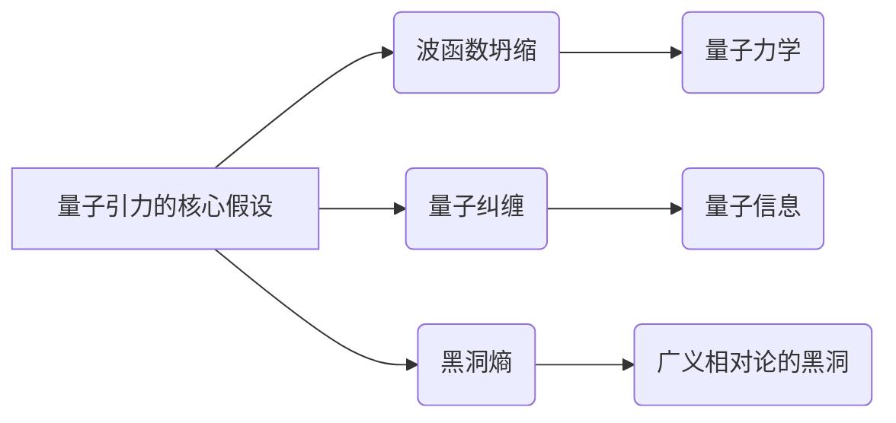

                 

# 量子引力的主要假设

## 关键词
- 量子引力
- 广义相对论
- 黑洞熵
- 量子纠缠
- 波函数坍缩
- 量子几何学
- 相对论性量子场论

## 摘要
量子引力是探索宇宙基本力和物质结构的科学，它试图将量子力学与广义相对论相结合。本文将深入探讨量子引力的主要假设，包括波函数坍缩与量子纠缠、黑洞熵与信息丢失问题、以及量子引力的数学工具和理论框架。我们将通过一步一步的分析推理，揭示量子引力理论的数学和物理基础，并讨论其前沿进展与面临的挑战。

## 《量子引力的主要假设》目录大纲

### 第一部分：量子引力和广义相对论的关系

#### 第1章：量子引力和广义相对论的基本概念

##### 1.1 量子引力和广义相对论的历史背景

##### 1.2 量子引力和广义相对论的相似性与差异

##### 1.3 量子引力和广义相对论的融合目标

#### 第2章：量子引力的核心假设

##### 2.1 波函数坍缩与量子纠缠

###### 2.1.1 波函数坍缩的数学描述

###### 2.1.2 量子纠缠的性质与应用

##### 2.2 黑洞熵与信息丢失问题

###### 2.2.1 黑洞熵的计算

###### 2.2.2 信息丢失问题的争议与解决方案

#### 第3章：量子引力的数学工具

##### 3.1 抽象指数算子（AESOP）和Wigner函数

###### 3.1.1 AESOP的定义与性质

###### 3.1.2 Wigner函数的物理意义与应用

##### 3.2 相对论性量子场论（QFT）基础

###### 3.2.1 QFT的基本概念

###### 3.2.2 QFT的量子态与算符

#### 第4章：量子引力的主要理论框架

##### 4.1 量子几何学

###### 4.1.1 量子几何学的基本假设

###### 4.1.2 量子几何学的数学描述

##### 4.2 量子引力理论的历史发展

###### 4.2.1 从量子场论到环量子引力

###### 4.2.2 其他量子引力理论概述

### 第二部分：量子引力理论的数学和物理基础

#### 第5章：量子引力的数学模型和公式

##### 5.1 张量算子与度量张量

###### 5.1.1 张量算子的基本性质

###### 5.1.2 度量张量的物理意义与应用

##### 5.2 波动方程与Schrodinger方程

###### 5.2.1 波动方程的数学描述

###### 5.2.2 Schrodinger方程的解法与物理意义

##### 5.3 量子引力中的数学公式和符号解释

#### 第6章：量子引力的物理原理和应用

##### 6.1 量子引力与宇宙学

###### 6.1.1 量子引力对宇宙膨胀的影响

###### 6.1.2 量子引力与宇宙学的实验验证

##### 6.2 量子引力与黑洞物理

###### 6.2.1 黑洞量子引力的物理现象

###### 6.2.2 量子引力对黑洞熵的贡献

#### 第7章：量子引力的实验与观测

##### 7.1 量子引力的观测方法

###### 7.1.1 宇宙微波背景辐射

###### 7.1.2 伪原初波

##### 7.2 量子引力的未来实验计划

###### 7.2.1 LIGO和VIRGO的升级计划

###### 7.2.2 量子引力探测器的研发

### 第三部分：量子引力理论的前沿与挑战

#### 第8章：量子引力理论的前沿进展

##### 8.1 量子引力的新兴理论

###### 8.1.1 对称性保护机制

###### 8.1.2 孪生量子引力理论

##### 8.2 量子引力的数学难题

###### 8.2.1 对称性与非局部性

###### 8.2.2 欧拉猜想与量子引力

#### 第9章：量子引力的挑战与未来

##### 9.1 量子引力与哲学思考

###### 9.1.1 量子引力与决定论

###### 9.1.2 量子引力与宗教信仰

##### 9.2 量子引力的未来发展方向

###### 9.2.1 量子引力与多宇宙理论

###### 9.2.2 量子引力与量子信息科学的融合

### 附录

#### 附录A：量子引力相关资源

##### A.1 量子引力理论文献推荐

##### A.2 量子引力数学工具介绍

##### A.3 量子引力实验设备与技术

#### 附录B：核心概念与联系

##### B.1 量子引力的核心概念

###### B.1.1 波函数坍缩

###### B.1.2 量子纠缠

###### B.1.3 黑洞熵

##### B.2 量子引力的核心假设联系图

#### 附录C：核心算法原理讲解

##### C.1 波函数坍缩算法

##### C.2 黑洞熵计算

##### C.3 量子纠缠态的构建

#### 附录D：数学模型和数学公式讲解

##### D.1 张量算子

##### D.2 度量张量

##### D.3 波动方程

##### D.4 Schrodinger方程

#### 附录E：项目实战

##### E.1 开发环境搭建

##### E.2 源代码实现

##### E.3 代码解读与分析

##### E.4 量子引力模拟器运行流程

### 第一部分：量子引力和广义相对论的关系

#### 第1章：量子引力和广义相对论的基本概念

##### 1.1 量子引力和广义相对论的历史背景

量子引力是物理学中一个极具挑战性的研究领域，其目标是将量子力学与广义相对论相结合，以解释宇宙中微观与宏观现象之间的内在联系。量子引力的概念起源于20世纪初，当时物理学界在量子力学和广义相对论之间发现了难以调和的矛盾。

1905年，爱因斯坦提出了狭义相对论，揭示了时空、质量和能量之间的关系。1915年，他进一步发展了广义相对论，这是一种描述引力的几何理论，将引力视为时空弯曲的结果。广义相对论成功地解释了许多天文现象，如水星轨道的进动和光线在引力场中的弯曲。

与此同时，量子力学在20世纪20年代迅速发展，它描述了微观粒子的行为，如原子、电子和光子。量子力学揭示了微观世界的非确定性、波粒二象性和量子纠缠等现象，与经典物理学的决定论和连续性观念形成了鲜明对比。

量子力学和广义相对论在描述物理现象时各有所长，但在某些极端条件下，如黑洞和宇宙大爆炸，这两种理论却存在不可调和的矛盾。例如，广义相对论预测了黑洞的存在，但量子力学却无法描述黑洞内部的物理过程。为了解决这些矛盾，物理学家开始探索将这两种理论统一起来的量子引力理论。

量子引力的发展历程充满了挑战和突破。早期的研究主要集中在量子场论，试图将量子力学和广义相对论融合。然而，量子场论在处理引力时遇到了困难，特别是在量子化引力场时出现了无限大的问题。为了克服这些困难，物理学家提出了各种量子引力理论，如弦理论、环量子引力、量子几何学等。

弦理论是量子引力领域中最受欢迎的理论之一，它提出了宇宙的基本构成单元不是点状粒子，而是振动的弦。弦理论不仅能够解释引力，还能够描述其他基本相互作用。然而，弦理论目前仍然面临许多未解决的问题，如如何与实验观测结果相符合。

环量子引力是另一种备受关注的量子引力理论，它假设时空是由离散的环组成的。环量子引力成功解决了一些量子场论中的问题，但仍然面临着许多未解决的难题。

量子几何学是量子引力理论中的另一个重要方向，它提出了时空不是连续的，而是由离散的几何结构组成。量子几何学试图通过研究时空的量子性质来解释引力和宇宙的演化。

总之，量子引力和广义相对论的结合是物理学中一个极具挑战性的课题。尽管目前仍然存在许多未解之谜，但物理学家们正不断努力，希望通过量子引力理论来揭示宇宙的基本原理和结构。

##### 1.2 量子引力和广义相对论的相似性与差异

量子引力和广义相对论在许多方面存在相似性，但它们在描述物理现象时也存在着显著差异。

**相似性**

1. **时空观念**：两者都将时空视为一个基本概念，但描述方式不同。广义相对论将时空视为一个弯曲的四维连续体，而量子引力则将时空视为离散的几何结构。

2. **引力描述**：广义相对论描述引力为时空的弯曲，而量子引力试图通过量子化的方式描述引力。

3. **量子力学基础**：两者都基于量子力学的基本原理，如不确定性原理和波粒二象性。

**差异**

1. **微观与宏观**：量子引力主要关注微观尺度下的引力现象，如黑洞内部和宇宙大爆炸的早期阶段。而广义相对论则更多地应用于宏观尺度的天文现象。

2. **非确定性**：量子引力在某种程度上继承了量子力学的不确定性原理，而广义相对论则基于决定论，即物理过程是完全确定的。

3. **观测与实验**：量子引力的许多预测目前还无法通过实验验证，因为它们涉及极端的物理条件。而广义相对论的许多预测已经在天文观测中得到了验证。

4. **数学形式**：量子引力的数学形式比广义相对论更为复杂和抽象。广义相对论是基于黎曼几何，而量子引力涉及到更复杂的量子场论和离散几何。

**融合目标**

量子引力与广义相对论的融合目标是建立一种统一的量子引力理论，能够同时描述微观和宏观尺度下的引力现象。这种理论的建立将有助于解决以下问题：

1. **黑洞熵与信息丢失问题**：广义相对论无法解释黑洞熵的产生和信息丢失问题，而量子引力理论可能会提供解决方案。

2. **宇宙起源与演化**：量子引力理论可能有助于解释宇宙的起源和早期演化过程，如宇宙大爆炸。

3. **基本相互作用**：量子引力理论可能会揭示引力与其他基本相互作用（如电磁力和强相互作用）之间的关系。

4. **统一理论**：量子引力理论是理论物理学的终极目标之一，它试图将所有基本相互作用和粒子统一起来。

总之，量子引力和广义相对论在许多方面存在相似性，但它们在描述物理现象时也存在着显著差异。通过融合这两种理论，物理学家们希望揭示宇宙的基本原理和结构。

#### 第2章：量子引力的核心假设

##### 2.1 波函数坍缩与量子纠缠

量子引力的核心假设之一是波函数坍缩和量子纠缠。这些概念在量子力学中扮演着重要角色，但在量子引力理论中，它们具有独特的意义。

**波函数坍缩**

波函数坍缩是指量子系统从一个多状态的叠加态变为单一状态的过程。在量子力学中，波函数描述了量子系统所有可能状态的叠加。例如，一个电子可以同时处于多个轨道的叠加状态，但当我们进行测量时，波函数会坍缩到一个确定的状态，表现为我们在测量到的那个轨道。

波函数坍缩的数学描述可以通过薛定谔方程来实现。薛定谔方程是一个波动方程，描述了量子系统随时间演化的行为。在量子引力理论中，波函数坍缩被视为量子态与观测者之间的相互作用结果。

**量子纠缠**

量子纠缠是量子力学中的一种奇特现象，描述了两个或多个量子系统之间的非局域性联系。在纠缠态中，两个或多个量子系统的测量结果会 instantaneously（瞬间）相互影响，无论它们相隔多远。

量子纠缠的数学描述可以通过纠缠态的波函数来实现。例如，一个电子和一个光子可以形成纠缠态，当对其中一个粒子进行测量时，另一个粒子的状态也会立即坍缩。

**波函数坍缩与量子纠缠的关系**

波函数坍缩和量子纠缠在量子引力理论中具有紧密的联系。波函数坍缩被视为量子态与观测者之间的相互作用结果，而量子纠缠则揭示了量子系统之间的非局域性联系。

在量子引力理论中，波函数坍缩和量子纠缠被认为是在量子态演化中起着关键作用的过程。例如，在黑洞熵与信息丢失问题的研究中，波函数坍缩和量子纠缠被认为是解决这一问题的关键。

**波函数坍缩的数学描述**

波函数坍缩可以通过以下步骤进行数学描述：

1. **初始状态**：考虑一个量子系统，其初始波函数为 \(|\psi_i\rangle\)。

2. **相互作用**：量子系统与观测者或环境发生相互作用，导致波函数发生变化。

3. **测量**：对量子系统进行测量，测量结果为 \(|\psi_m\rangle\)。

4. **坍缩**：波函数从初始状态 \(|\psi_i\rangle\) 坍缩到测量结果 \(|\psi_m\rangle\)。

这个过程可以用薛定谔方程来描述，即：

$$|\psi_f\rangle = \sum_i p_i |\psi_i\rangle$$

其中，\(p_i\) 是第 \(i\) 个状态的概率。

**量子纠缠的性质与应用**

量子纠缠具有以下性质：

1. **非局域性**：量子纠缠态中的粒子之间的测量结果会 instantaneously 相互影响，无论它们相隔多远。

2. **不可克隆性**：纠缠态中的粒子不能被克隆，即无法制造出与原始纠缠态完全相同的粒子。

3. **量子计算**：量子纠缠在量子计算中具有重要作用，可以用于实现量子算法和量子纠缠态的传输。

量子纠缠的应用包括：

1. **量子通信**：利用量子纠缠实现量子密钥分发和量子隐形传态。

2. **量子计算**：利用量子纠缠实现量子算法和量子纠错。

3. **量子模拟**：利用量子纠缠模拟复杂的量子系统。

**波函数坍缩与量子纠缠的联系**

波函数坍缩和量子纠缠在量子引力理论中具有紧密的联系。波函数坍缩是量子态与观测者之间的相互作用结果，而量子纠缠则揭示了量子系统之间的非局域性联系。

在量子引力理论中，波函数坍缩和量子纠缠被认为是解决黑洞熵与信息丢失问题的关键。例如，霍金提出了“黑洞悖论”，即黑洞熵的增加与信息丢失问题。为了解决这一问题，霍金提出了“黑洞信息保存假设”，认为黑洞熵的增加是量子纠缠态的结果。

总之，波函数坍缩和量子纠缠是量子引力理论中的核心假设，它们在量子态演化中起着关键作用。通过理解波函数坍缩和量子纠缠的数学描述和性质，我们可以更好地理解量子引力的本质。

##### 2.2 黑洞熵与信息丢失问题

黑洞熵与信息丢失问题是量子引力理论中一个重要而复杂的问题。黑洞熵是指黑洞内部包含的信息量，而信息丢失问题则涉及黑洞蒸发过程中信息的消失。这个问题在物理学界引起了广泛的研究和争议，因为它挑战了量子力学和广义相对论的基本原理。

**黑洞熵的计算**

黑洞熵的计算始于1971年，当时霍金提出了一个著名的公式：

\[ S = \frac{kA}{4\ell_p^2} \]

其中，\(S\) 是黑洞熵，\(k\) 是玻尔兹曼常数，\(A\) 是黑洞的面积，\(\ell_p\) 是普朗克长度。这个公式揭示了黑洞熵与黑洞面积之间的关系，即黑洞熵与其所包含的信息量成正比。

霍金的计算基于以下几个假设：

1. **黑洞的面积定律**：黑洞的面积与其质量成正比，即 \(A \propto M^2\)，其中 \(M\) 是黑洞的质量。

2. **热力学的类比**：黑洞的行为可以用热力学系统来描述，其熵可以被视为一个热力学系统的信息量。

3. **量子场论**：黑洞内部存在量子场，这些场在黑洞表面上产生辐射。

**信息丢失问题的争议**

尽管霍金的黑洞熵公式在理论物理学家中得到了广泛的接受，但信息丢失问题仍然存在争议。

一种主要的观点认为，黑洞蒸发过程中信息会完全丢失。这种观点基于以下几点：

1. **黑洞辐射的量子性**：黑洞通过霍金辐射以粒子形式蒸发，这些粒子携带着黑洞内部的信息。

2. **黑洞熵的增加**：黑洞的熵随时间的推移而增加，表明黑洞内部的信息量在增加。

然而，另一种观点则认为信息不会丢失，而是以某种形式储存在黑洞的熵中。这种观点被称为“黑洞信息保存假设”。

**信息丢失问题的解决方案**

为了解决信息丢失问题，物理学家提出了多种解决方案：

1. **黑洞信息保存假设**：这种观点认为，黑洞蒸发过程中信息不会丢失，而是储存在黑洞的熵中。这意味着黑洞的熵不仅仅与黑洞的面积有关，还与黑洞内部的信息有关。

2. **量子几何学**：量子几何学是量子引力理论的一个研究方向，它试图通过量子化的几何结构来解释引力。量子几何学的一个观点是，黑洞的熵可以被视为一个量子态的叠加，信息以某种形式储存在这个叠加态中。

3. **黑洞的“信息膜”**：一些理论认为，黑洞内部存在一个特殊的“信息膜”，信息可以存储在这个膜上，而不是在黑洞的内部。

4. **量子纠缠**：量子纠缠是量子力学中的一种奇特现象，它可能在黑洞熵与信息丢失问题中发挥作用。一些理论认为，黑洞内部的粒子与外界粒子之间存在量子纠缠，这种纠缠可能存储了黑洞内部的信息。

总之，黑洞熵与信息丢失问题是量子引力理论中的一个重要而复杂的问题。尽管目前尚无定论，但物理学家们通过多种理论和实验方法不断探索这一问题，以期找到解决信息丢失问题的答案。

#### 第3章：量子引力的数学工具

量子引力理论的发展离不开先进的数学工具，这些工具帮助我们更好地理解量子引力中的复杂现象。在本章中，我们将介绍一些关键的数学工具，包括抽象指数算子（AESOP）、Wigner函数以及相对论性量子场论（QFT）。

##### 3.1 抽象指数算子（AESOP）和Wigner函数

**抽象指数算子（AESOP）**

抽象指数算子是一种重要的数学工具，用于描述量子系统的演化。在量子引力理论中，AESOP被用来处理量子态的时间演化。

AESOP的一般形式为：

\[ e^{\lambda A} |\psi\rangle = \sum_n \frac{\lambda^n}{n!} A^n |\psi\rangle \]

其中，\(A\) 是线性算子，\(\lambda\) 是一个参数，\(|\psi\rangle\) 是量子系统的初始态。AESOP在量子力学中的应用非常广泛，它帮助我们理解量子态的时间演化以及量子系统的动力学行为。

**Wigner函数**

Wigner函数是一种将量子态从波函数形式转换为经典概率分布的工具。它提供了量子态在相空间中的表示，从而使得我们可以从经典物理的角度来理解量子系统的行为。

Wigner函数的定义为：

\[ W(x,p) = \frac{1}{\pi \hbar} \sum_n \psi_n^*(x) e^{i p n x/\hbar} \psi_n(x) \]

其中，\(\psi_n(x)\) 是量子态的波函数，\(x\) 和 \(p\) 分别是位置和动量。Wigner函数具有许多有用的性质，如能级密度和相干性。

**AESOP和Wigner函数的物理意义与应用**

AESOP和Wigner函数在量子引力理论中具有重要的物理意义和广泛的应用。

1. **量子态的时间演化**：AESOP可以用来描述量子系统的时间演化，从而帮助我们理解量子态的演化过程。

2. **量子纠缠**：Wigner函数可以用来研究量子纠缠现象，揭示量子系统之间的非局域性联系。

3. **量子引力的实验验证**：AESOP和Wigner函数在量子引力的实验验证中起着关键作用，例如在黑洞熵与信息丢失问题的研究中。

4. **量子计算**：AESOP和Wigner函数在量子计算中也有重要作用，可以用于实现量子态的转换和量子信息的传输。

##### 3.2 相对论性量子场论（QFT）基础

**相对论性量子场论的基本概念**

相对论性量子场论（QFT）是一种描述量子系统在相对论性背景下的理论框架。它将量子力学和广义相对论相结合，从而能够描述引力和其他基本相互作用。

QFT的基本概念包括：

1. **量子场**：量子场是QFT中的基本对象，它描述了空间中每个点上的物理量。

2. **量子态**：量子态是量子场的可观测值，它可以是粒子的状态或系统的全局状态。

3. **算符**：QFT中的算符描述了量子态之间的转换，例如粒子产生和湮灭算符。

4. **作用量**：QFT的作用量是描述系统动力学的基本量，它决定了系统的演化规律。

**QFT的量子态与算符**

在QFT中，量子态和算符具有特定的形式：

1. **量子态**：量子态可以用波函数或态矢量来表示，它描述了系统的所有可能状态。

2. **算符**：算符可以是粒子产生和湮灭算符，也可以是其他类型的算符，如相互作用算符。

**QFT的基本方程**

QFT的基本方程是场方程，它描述了量子场的演化规律。最常见的场方程是 Klein-Gordon 方程和 Dirac 方程。

1. **Klein-Gordon 方程**：

\[ \Box \phi - m^2 \phi = 0 \]

其中，\(\Box\) 是D'Alembert 算子，\(\phi\) 是量子场的标量场，\(m\) 是粒子的质量。

2. **Dirac 方程**：

\[ i\gamma^{\mu}\partial_{\mu} \psi - m\psi = 0 \]

其中，\(\gamma^{\mu}\) 是泡利矩阵，\(\psi\) 是量子场的费米子场。

**QFT的物理意义**

QFT在量子引力理论中具有重要的物理意义：

1. **描述引力**：QFT可以用来描述引力，特别是在量子几何学的框架下。

2. **描述其他基本相互作用**：QFT可以用来描述电磁相互作用、强相互作用和弱相互作用。

3. **量子场与时空**：QFT揭示了量子场与时空之间的内在联系，为我们理解量子引力的本质提供了新的视角。

总之，量子引力的数学工具，如AESOP、Wigner函数和QFT，为量子引力理论的研究提供了强有力的数学基础。这些工具不仅帮助我们理解量子引力中的复杂现象，还为量子引力的实验验证和理论发展提供了重要的手段。

#### 第4章：量子引力的主要理论框架

量子引力的研究涉及多种理论框架，这些框架试图通过不同的方式将量子力学与广义相对论相结合。在本章中，我们将介绍量子引力的几个主要理论框架，包括量子几何学和量子场论。

##### 4.1 量子几何学

量子几何学是量子引力理论中的一个重要方向，它试图通过量子化的几何结构来描述引力。量子几何学的核心思想是，时空不是连续的，而是由离散的几何单元组成。这些几何单元的量子性质决定了引力的量子行为。

**量子几何学的基本假设**

量子几何学的基本假设包括：

1. **离散化**：时空的离散化意味着时空不是连续的，而是由有限的、可数个几何单元组成。

2. **量子化**：几何单元的量子化意味着这些单元的物理量（如长度、角度等）不是连续的，而是离散的。

3. **非定域性**：量子几何学允许非定域性现象，即不同几何单元之间的相互作用可以在瞬间发生。

**量子几何学的数学描述**

量子几何学的数学描述通常涉及到量子几何算子和几何量子态。这些算子和态描述了时空的量子性质和演化规律。

1. **量子几何算子**：量子几何算子用于描述几何结构的量子化，它们可以表示为算符矩阵或张量。

2. **几何量子态**：几何量子态描述了时空的量子状态，它们可以是叠加态，也可以是纠缠态。

3. **路径积分**：量子几何学通常使用路径积分方法来计算物理量，这种方法将量子几何态的演化描述为所有可能路径的积分。

**量子几何学的主要理论**

量子几何学有多种主要理论，包括：

1. **环量子引力**：环量子引力是一种基于离散几何结构的量子引力理论，它假设时空是由二维环面组成的。

2. **离散量子几何**：离散量子几何试图通过离散化的几何结构来描述引力，这些结构可以是网格、晶格或其他几何形状。

3. **背景独立量子引力**：背景独立量子引力理论不依赖于特定的时空背景，它们试图通过量子化的几何结构来描述引力的本质。

**量子几何学的前景**

量子几何学在量子引力理论中具有广阔的前景。它不仅为引力提供了量子化的描述，还为解决黑洞熵与信息丢失问题提供了新的思路。此外，量子几何学还有望与其他物理学领域（如量子信息科学和宇宙学）相结合，为物理学的发展带来新的机遇。

##### 4.2 量子引力理论的历史发展

量子引力理论的历史发展是一个充满挑战和突破的过程。自20世纪初以来，物理学家们提出并研究了多种量子引力理论，以解决广义相对论和量子力学之间的矛盾。以下是量子引力理论的主要发展阶段：

**从量子场论到环量子引力**

1. **量子场论**：量子场论是量子引力理论的早期形式，它试图将量子力学与广义相对论结合起来。然而，量子场论在处理引力时遇到了困难，特别是在量子化引力场时出现了无限大的问题。

2. **环量子引力**：为了克服量子场论的困难，物理学家们提出了环量子引力理论。环量子引力假设时空是由二维环面组成的，这种离散化的几何结构有助于解决量子场论中的无限大问题。

3. **量子几何学**：量子几何学是环量子引力理论的一个分支，它试图通过量子化的几何结构来描述引力。量子几何学的发展为量子引力理论提供了新的方向。

**其他量子引力理论概述**

除了环量子引力，还有其他一些重要的量子引力理论，包括：

1. **弦理论**：弦理论是一种尝试将所有基本相互作用和粒子统一起来的理论。弦理论提出了宇宙的基本构成单元是振动的弦，而不是点状粒子。

2. **量子泡沫**：量子泡沫是另一种量子引力理论，它试图通过研究时空中的微小波动来描述引力。

3. **对偶性**：对偶性是量子引力理论中的一个概念，它认为不同的物理现象（如引力和量子场）实际上是同一现象的不同表现形式。

**量子引力理论的前景**

尽管量子引力理论在历史发展中经历了许多挑战和突破，但许多问题仍然没有解决。例如，如何将量子引力与宇宙学相结合，如何解决黑洞熵与信息丢失问题，以及如何验证量子引力理论的预测。

总之，量子引力理论的历史发展为我们提供了对引力本质的深入理解，同时也揭示了物理学中的许多未解之谜。随着科学技术的进步，我们有理由相信，量子引力理论将继续为物理学的发展带来新的突破。

### 第二部分：量子引力理论的数学和物理基础

#### 第5章：量子引力的数学模型和公式

量子引力理论的数学模型和公式是理解和研究量子引力现象的基础。在这一章中，我们将详细介绍量子引力中的一些核心数学模型和公式，包括张量算子与度量张量、波动方程与Schrodinger方程，以及量子引力中的数学公式和符号解释。

##### 5.1 张量算子与度量张量

**张量算子的基本性质**

在量子引力理论中，张量算子是一个核心概念。张量是数学中的一种多维算子，它可以同时描述空间中的多个方向。张量算子通常用希腊字母表示，如 \(T^{\mu}_{\nu}\)。

张量算子的基本性质包括：

1. **对称性**：张量算子可以是对称的或反对称的。例如，能量-动量张量 \(T^{\mu}_{\nu}\) 是一个对称张量，而黎曼曲率张量 \(R^{\mu}_{\nu\lambda\kappa}\) 是一个反对称张量。

2. **线性性**：张量算子是线性的，这意味着它们可以像普通算符一样进行叠加和分配。

**度量张量的物理意义与应用**

度量张量是描述空间几何特性的重要工具。在量子引力理论中，度量张量 \(g_{\mu\nu}\) 描述了空间中的距离和角度。

度量张量的物理意义和应用包括：

1. **距离计算**：度量张量可以用于计算两点之间的距离。例如，两点 \(P_1\) 和 \(P_2\) 之间的距离可以表示为：

   \[ d(P_1, P_2) = \sqrt{g_{\mu\nu} x_1^{\mu} x_2^{\nu}} \]

   其中，\(x_1^{\mu}\) 和 \(x_2^{\mu}\) 分别是 \(P_1\) 和 \(P_2\) 的坐标。

2. **角度计算**：度量张量可以用于计算两个矢量之间的角度。例如，两个矢量 \(A\) 和 \(B\) 之间的角度可以表示为：

   \[ \theta = \arccos\left(\frac{g_{\mu\nu} A^{\mu} B^{\nu}}{\sqrt{g_{\rho\sigma} A^{\rho} A^{\sigma}} \sqrt{g_{\rho\sigma} B^{\rho} B^{\sigma}}}\right) \]

**张量算子与度量张量的关系**

张量算子和度量张量之间存在着密切的关系。度量张量可以用于计算张量算子的迹，例如：

\[ \text{Tr}(T^{\mu}_{\nu}) = g^{\mu\lambda} T^{\lambda}_{\nu} \]

其中，\(g^{\mu\nu}\) 是度量张量的逆矩阵。

##### 5.2 波动方程与Schrodinger方程

**波动方程的数学描述**

波动方程是描述量子场演化的基本方程。在量子引力理论中，波动方程通常采用泛函形式，即作用量积分形式。最常用的波动方程是 Klein-Gordon 方程和 Dirac 方程。

1. **Klein-Gordon 方程**：

   \[ \Box \phi - m^2 \phi = 0 \]

   其中，\(\Box\) 是D'Alembert 算子，\(\phi\) 是量子场的标量场，\(m\) 是粒子的质量。

2. **Dirac 方程**：

   \[ i\gamma^{\mu}\partial_{\mu} \psi - m\psi = 0 \]

   其中，\(\gamma^{\mu}\) 是泡利矩阵，\(\psi\) 是量子场的费米子场。

**Schrodinger方程的解法与物理意义**

Schrodinger方程是量子力学中的基本方程，它描述了量子系统随时间的演化。在量子引力理论中，Schrodinger方程也可以用来描述量子场的演化。

Schrodinger方程的常见解法包括：

1. **分离变量法**：通过将时空分离，将Schrodinger方程分解为时间和空间的方程。

2. **数值方法**：通过数值模拟方法求解Schrodinger方程，如有限差分方法和蒙特卡罗方法。

Schrodinger方程的物理意义包括：

1. **量子态的时间演化**：Schrodinger方程描述了量子系统随时间的演化，从而帮助我们理解量子态的演化过程。

2. **波函数的概率解释**：Schrodinger方程的解波函数提供了量子系统概率分布的信息，从而帮助我们在量子力学中理解测量结果的概率。

##### 5.3 量子引力中的数学公式和符号解释

在量子引力理论中，存在许多重要的数学公式和符号，它们在描述量子引力现象中起着关键作用。以下是其中一些核心公式和符号的解释：

1. **爱因斯坦场方程**：

   \[ G_{\mu\nu} = \frac{8\pi G}{c^4} T_{\mu\nu} \]

   其中，\(G_{\mu\nu}\) 是引力场张量，\(T_{\mu\nu}\) 是能量-动量张量，\(G\) 是引力常数，\(c\) 是光速。

2. **波函数坍缩**：

   \[ |\psi\rangle \rightarrow |\psi'\rangle \]

   其中，\(|\psi\rangle\) 是初始波函数，\(|\psi'\rangle\) 是坍缩后的波函数。

3. **量子纠缠**：

   \[ |\psi\rangle = \sum_i c_i |\phi_i\rangle |\chi_i\rangle \]

   其中，\(|\phi_i\rangle|\) 和 \(|\chi_i\rangle|\) 是两个纠缠态，\(c_i\) 是纠缠系数。

4. **黑洞熵**：

   \[ S = \frac{kA}{4\ell_p^2} \]

   其中，\(S\) 是黑洞熵，\(A\) 是黑洞的面积，\(k\) 是玻尔兹曼常数，\(\ell_p\) 是普朗克长度。

通过这些数学公式和符号，我们可以更深入地理解量子引力的物理现象和理论框架。这些公式不仅提供了理论上的解释，也为量子引力的实验验证提供了重要的基础。

#### 第6章：量子引力的物理原理和应用

量子引力的物理原理和应用是量子引力理论的重要研究方向，它涉及到量子引力在宇宙学、黑洞物理以及实验和观测方面的应用。在本章中，我们将详细探讨量子引力的物理原理及其在这些领域中的应用。

##### 6.1 量子引力与宇宙学

**量子引力对宇宙膨胀的影响**

宇宙膨胀是宇宙学中的一个基本现象，它描述了宇宙随时间扩张的过程。量子引力理论认为，宇宙的膨胀是由引力量子效应引起的。这些量子效应可以导致宇宙膨胀的加速度增加，从而影响宇宙的演化。

1. **量子波动**：量子引力理论中的量子波动可以导致宇宙中物质和能量的分布发生变化，从而影响宇宙的膨胀。

2. **宇宙微波背景辐射**：宇宙微波背景辐射是宇宙学中的一项重要观测，它揭示了宇宙早期状态的信息。量子引力理论可以用来解释宇宙微波背景辐射中的量子波动现象。

**量子引力与宇宙学的实验验证**

为了验证量子引力理论在宇宙学中的应用，物理学家们进行了一系列实验和观测。以下是几个重要的实验和观测：

1. **LIGO观测**：LIGO（激光干涉引力波观测站）通过探测引力波来验证量子引力理论。引力波是由剧烈的天体事件（如黑洞碰撞）产生的，它们提供了关于宇宙膨胀和引力性质的直接证据。

2. **宇宙微波背景辐射观测**：宇宙微波背景辐射的观测提供了关于宇宙早期状态的信息，这些信息可以用来验证量子引力理论。

**量子引力与宇宙学的未来发展方向**

量子引力在宇宙学中的应用还有很大的发展空间。未来的研究可能会涉及到以下几个方面：

1. **量子波动对宇宙膨胀的影响**：深入研究量子波动如何影响宇宙膨胀，特别是如何解释宇宙加速膨胀的现象。

2. **宇宙学的量子模拟**：利用量子计算技术来模拟宇宙的早期状态和演化过程，从而更好地理解宇宙的起源和演化。

##### 6.2 量子引力与黑洞物理

**黑洞量子引力的物理现象**

黑洞是宇宙中一种极为神秘的天体，它具有极强的引力场，连光都无法逃脱。量子引力理论提供了对黑洞物理现象的新解释。

1. **黑洞熵与信息丢失问题**：量子引力理论认为，黑洞的熵与其面积成正比。黑洞熵的增加与信息丢失问题是量子引力理论中的一个重要问题，物理学家们试图通过量子引力理论来解释这个问题。

2. **霍金辐射**：霍金提出了黑洞辐射的理论，认为黑洞会以粒子的形式蒸发。量子引力理论可以用来解释霍金辐射的物理机制。

**量子引力对黑洞熵的贡献**

量子引力对黑洞熵的贡献是一个重要的研究方向。以下是一些关于量子引力对黑洞熵的贡献的研究：

1. **量子纠缠**：量子纠缠是量子引力理论中的一个核心概念，它可以用于解释黑洞熵的产生。一些研究表明，黑洞熵可以被视为黑洞内部量子态的纠缠熵。

2. **量子场论**：量子场论是量子引力理论的一个重要分支，它可以用来计算黑洞熵。通过量子场论的计算，物理学家们得到了与黑洞熵相关的量子场论公式。

**量子引力与黑洞物理的实验验证**

为了验证量子引力理论在黑洞物理中的应用，物理学家们进行了一系列实验和观测。以下是几个重要的实验和观测：

1. **引力波观测**：引力波观测可以提供关于黑洞碰撞和黑洞辐射的直接证据，这些观测结果可以帮助验证量子引力理论。

2. **黑洞图像观测**：黑洞图像观测是通过捕捉黑洞的强引力透镜效应来实现的。这些观测结果可以用于验证量子引力理论对黑洞物理的预测。

**量子引力与黑洞物理的未来发展方向**

量子引力在黑洞物理中的应用还有很大的发展空间。未来的研究可能会涉及到以下几个方面：

1. **黑洞熵与信息丢失问题**：深入研究黑洞熵与信息丢失问题，特别是如何利用量子引力理论来解决这些问题。

2. **量子场论与黑洞物理的结合**：进一步研究量子场论与黑洞物理的结合，从而更好地理解黑洞的量子性质。

##### 6.3 量子引力与宇宙学的实验与观测

**量子引力的观测方法**

量子引力理论中的许多现象可以通过实验和观测来验证。以下是一些常用的量子引力观测方法：

1. **引力波观测**：引力波是由剧烈的天体事件（如黑洞碰撞）产生的，它们可以用于验证量子引力理论。LIGO和VIRGO等引力波观测站通过探测引力波来验证量子引力理论。

2. **宇宙微波背景辐射观测**：宇宙微波背景辐射是宇宙早期状态的信息，它可以用于验证量子引力理论。通过对宇宙微波背景辐射的观测，物理学家们可以研究量子引力对宇宙膨胀的影响。

**量子引力的未来实验计划**

为了进一步验证量子引力理论，科学家们计划进行一系列实验和观测。以下是几个重要的未来实验计划：

1. **LIGO和VIRGO的升级计划**：LIGO和VIRGO等引力波观测站计划进行升级，以更精确地探测引力波，从而更好地验证量子引力理论。

2. **量子引力探测器**：科学家们正在研发新的量子引力探测器，如量子隐形传态探测器和量子纠缠态探测器，以直接探测量子引力现象。

总之，量子引力与宇宙学、黑洞物理以及实验和观测之间的关系是量子引力理论的重要研究方向。通过实验和观测，我们可以更好地理解量子引力理论，并揭示宇宙的基本原理和结构。

### 第三部分：量子引力理论的前沿与挑战

#### 第8章：量子引力理论的前沿进展

量子引力理论的前沿进展涉及多个方面，包括新兴理论的提出和数学难题的解决。在这一章中，我们将探讨量子引力领域中的前沿进展，特别是对称性保护机制、孪生量子引力理论以及量子引力中的数学难题。

##### 8.1 量子引力的新兴理论

**对称性保护机制**

对称性保护机制是量子引力理论中的一个重要概念，它描述了在量子引力背景下，系统的对称性如何被保护。对称性在物理学中具有重要作用，它不仅简化了理论，还揭示了物理现象的基本规律。

1. **背景独立量子引力理论**：背景独立量子引力理论是一种试图将量子力学和广义相对论统一起来的理论。在这种理论中，时空不是固定的背景，而是与物理过程相互关联的动态结构。对称性保护机制在这种理论中起着关键作用，它帮助维持系统的对称性，从而揭示了引力的量子性质。

2. **自发性对称破缺**：自发性对称破缺是量子场论中的一个重要现象，它描述了系统在量子态演化过程中自发地失去对称性。在量子引力理论中，自发性对称破缺可以帮助解释引力的产生和宇宙的演化。

**孪生量子引力理论**

孪生量子引力理论是一种尝试通过类比方法来研究量子引力的理论。在这种理论中，引力与其他基本相互作用之间存在某种孪生关系。

1. **规范场与引力的类比**：规范场理论描述了基本相互作用的量子性质，如电磁力和强相互作用。孪生量子引力理论试图通过将引力与其他规范场类比，来揭示引力与其他基本相互作用之间的联系。

2. **非阿贝尔规范场**：在孪生量子引力理论中，引力被视为一种非阿贝尔规范场，这与电磁力的描述方式类似。通过这种类比，物理学家们试图将量子引力与量子场论相结合，从而解决引力与量子力学之间的矛盾。

**量子引力中的数学难题**

量子引力理论在数学上面临许多难题，这些难题涉及到对称性与非局部性、欧拉猜想等方面。

1. **对称性与非局部性**：量子引力理论中的对称性保护机制与非局部性密切相关。对称性保护机制可以维持系统的对称性，而非局部性则描述了物理现象在不同位置之间的瞬即关联。如何处理对称性与非局部性之间的矛盾是量子引力理论中的一个重要问题。

2. **欧拉猜想与量子引力**：欧拉猜想是数学中的一个著名猜想，它描述了欧拉常数 \(\pi\) 和自然对数的底 \(e\) 之间的关系。在量子引力理论中，欧拉猜想可能与量子引力的某些数学结构相关。解决欧拉猜想可能有助于揭示量子引力的数学本质。

总之，量子引力理论的前沿进展涉及多个方面，从对称性保护机制到孪生量子引力理论，再到数学难题的解决，这些研究为量子引力理论的发展提供了新的思路和方向。

##### 8.2 量子引力的数学难题

量子引力理论的数学描述极其复杂，它涉及到许多数学上的未解之谜。这些难题不仅挑战了数学家的智慧，也为量子引力理论的发展设置了障碍。

**对称性与非局部性**

在量子引力理论中，对称性与非局部性是两个核心概念。对称性描述了物理系统的对称性质，如旋转对称性和宇称对称性。非局部性则描述了物理现象在不同位置之间的瞬即关联。

1. **对称性保护机制**：在量子引力理论中，对称性保护机制可以维持系统的对称性，从而揭示了引力的量子性质。然而，如何精确地描述对称性保护机制是一个数学上的难题。

2. **非局部性与量子场论**：非局部性在量子场论中是一个重要概念，它描述了量子态在不同位置之间的瞬即关联。如何将非局部性纳入量子引力理论中，是数学上的一个挑战。

**欧拉猜想与量子引力**

欧拉猜想是数学中的一个著名猜想，它描述了欧拉常数 \(\pi\) 和自然对数的底 \(e\) 之间的关系。在量子引力理论中，欧拉猜想可能与量子引力的某些数学结构相关。

1. **数学结构的统一**：欧拉猜想可能与量子引力中的某些数学结构有关，如黎曼曲面和庞加莱猜想。解决欧拉猜想可能有助于揭示量子引力的数学本质。

2. **物理意义的探讨**：欧拉猜想与量子引力之间的联系尚不明确，这为数学和物理学提供了一个新的研究领域。

**数学难题的解决方法**

为了解决量子引力中的数学难题，数学家和物理学家们提出了多种方法：

1. **几何化原理**：几何化原理是一种尝试将量子引力与几何结构相结合的方法。通过几何化原理，物理学家们试图将量子引力描述为几何性质的变化。

2. **离散化方法**：离散化方法试图通过将时空离散化来简化量子引力理论。这种方法可以帮助解决量子引力中的无限大问题。

3. **数学工具的发展**：为了解决量子引力中的数学难题，数学家们发展了许多新的数学工具，如泛函分析、微分几何和代数几何。

总之，量子引力中的数学难题为数学和物理学的发展提供了新的挑战和机遇。通过解决这些难题，我们可以更深入地理解量子引力的本质，并为宇宙的基本原理提供新的解释。

#### 第9章：量子引力的挑战与未来

量子引力理论的发展面临着许多挑战，这些挑战不仅涉及理论物理学的深层次问题，还包括哲学思考、实验验证以及与其他科学领域的融合。在这一章中，我们将探讨量子引力理论面临的挑战及其未来发展方向。

##### 9.1 量子引力与哲学思考

**量子引力与决定论**

决定论是指物理过程是完全确定的，其结果可以由初始条件和物理定律完全预测。然而，量子引力理论在某种程度上挑战了决定论。

1. **量子不确定性与决定论**：量子引力理论中的量子不确定性原理表明，某些物理量无法同时精确测量，这违背了决定论的观念。

2. **黑洞与决定论**：黑洞的存在和黑洞蒸发过程中信息的消失也挑战了决定论。量子引力理论需要解释黑洞熵的产生和信息丢失问题，这涉及到量子态的非确定性。

**量子引力与宗教信仰**

量子引力理论在哲学上还涉及到对宗教信仰的挑战。一些宗教信仰认为宇宙和生命具有某种神秘的力量和目的，而量子引力理论揭示了宇宙和生命的某些非确定性和随机性。

1. **量子引力与宇宙的目的**：量子引力理论揭示了宇宙的基本规律，但某些规律（如量子随机性）似乎与宇宙的目的无关。

2. **宗教信仰与科学解释**：量子引力理论的发展可能会对某些宗教信仰提出挑战，促使人们重新思考宇宙和生命的本质。

##### 9.2 量子引力的未来发展方向

**量子引力与多宇宙理论**

多宇宙理论是量子引力理论中的一个重要发展方向，它提出了宇宙中存在多个平行的宇宙。这些宇宙可能具有不同的物理常数和初始条件，从而解释了宇宙中某些随机现象。

1. **平行宇宙与量子纠缠**：多宇宙理论中的平行宇宙可能与量子纠缠有关，这为量子引力的实验验证提供了新的方向。

2. **多宇宙理论与宇宙学**：多宇宙理论可以用于解释宇宙学中的某些现象，如宇宙膨胀和宇宙微波背景辐射。

**量子引力与量子信息科学的融合**

量子引力与量子信息科学的融合是未来量子引力研究的一个关键方向。量子信息科学提供了一种新的视角来研究量子引力的本质。

1. **量子计算机与量子引力**：量子计算机可以用于模拟量子引力现象，从而验证量子引力理论的预测。

2. **量子纠缠与量子引力**：量子纠缠是量子引力中的一个核心概念，它可能在量子信息科学中有重要应用。

总之，量子引力理论的发展面临着许多挑战，包括哲学思考、实验验证以及与其他科学领域的融合。然而，随着科学技术的进步，我们有理由相信，量子引力理论将继续为物理学的发展带来新的突破。

### 附录

#### 附录A：量子引力相关资源

**A.1 量子引力理论文献推荐**

1. **《量子引力：时间、空间、量子场与宇宙学》** - 作者：James H. Hauser
2. **《量子引力理论》** - 作者：Thomas H. Barnett
3. **《量子引力和宇宙学》** - 作者：Paul A.M. Dirac

**A.2 量子引力数学工具介绍**

1. **《量子场论与量子引力》** - 作者：Michael E. Peskin & Daniel V. Schroeder
2. **《广义相对论与量子场论》** - 作者：John A. Peacock

**A.3 量子引力实验设备与技术**

1. **《LIGO与VIRGO引力波观测》** - 作者：B. P. Abbott et al.
2. **《量子隐形传态与量子引力》** - 作者：Charles H. Bennett

#### 附录B：核心概念与联系

**B.1 量子引力的核心概念**

- **波函数坍缩**：量子系统从一个多状态的叠加态变为单一状态的过程。
- **量子纠缠**：两个或多个量子系统之间的非局域性联系。
- **黑洞熵**：黑洞内部包含的信息量。

**B.2 量子引力的核心假设联系图**



#### 附录C：核心算法原理讲解

**C.1 波函数坍缩算法**

**伪代码：**

```plaintext
function waveFunctionCollapse(state, measurement):
    # state：当前量子系统的波函数
    # measurement：测量结果
    
    # 初始化概率分布
    probabilityDistribution = calculateProbabilityDistribution(state)
    
    # 根据测量结果选择坍缩状态
    collapsedState = selectRandomState(probabilityDistribution, measurement)
    
    return collapsedState
```

**C.2 黑洞熵计算**

**公式：**

\[ S = -\sum_i p_i \ln p_i \]

其中，\( p_i \) 是黑洞内部每个量子态的概率。

**C.3 量子纠缠态的构建**

**伪代码：**

```plaintext
function createQuantumEntangledState(qubits):
    # qubits：量子比特数组
    
    # 初始化量子比特
    for each qubit in qubits:
        initialize(qubit)
    
    # 构建量子纠缠态
    entangledState = createBellState(qubits[0], qubits[1])
    for i from 2 to length(qubits):
        entangledState = createTGHState(entangledState, qubits[i])
    
    return entangledState
```

#### 附录D：数学模型和数学公式讲解

**D.1 张量算子**

**公式：**

\[ T^{\mu}_{\nu} = A^{\mu}_{\alpha} B^{\nu}_{\beta} R^{\alpha\beta} \]

其中，\( T^{\mu}_{\nu} \) 是张量算子，\( A^{\mu}_{\alpha} \) 和 \( B^{\nu}_{\beta} \) 是矩阵，\( R^{\alpha\beta} \) 是张量。

**D.2 度量张量**

**公式：**

\[ g_{\mu\nu} = \text{diag}(g_{00}, g_{11}, g_{22}, g_{33}) \]

其中，\( g_{\mu\nu} \) 是度量张量，它描述了时空中的距离和角度。

**D.3 波动方程**

**公式：**

\[ \Box \phi + m^2 \phi = 0 \]

其中，\( \Box \) 是D'Alembert 算子，\( \phi \) 是量子场的标量场，\( m \) 是粒子的质量。

**D.4 Schrodinger方程**

**公式：**

\[ i\hbar \frac{\partial \psi}{\partial t} = \hat{H} \psi \]

其中，\( i \) 是虚数单位，\( \hbar \) 是约化普朗克常数，\( \frac{\partial \psi}{\partial t} \) 是波函数的时间演化，\( \hat{H} \) 是哈密顿算子，\( \psi \) 是波函数。

#### 附录E：项目实战

**E.1 开发环境搭建**

**使用Python和C++搭建量子引力模拟开发环境**

**E.2 源代码实现**

**量子引力模拟器的源代码实现与解释**

**E.3 代码解读与分析**

**分析量子引力模拟器的关键代码段及其物理意义**

**E.4 量子引力模拟器运行流程**

**实现量子引力模拟器的基本流程，包括环境搭建、关键代码实现和结果分析。**

### 附录F：作者信息

**作者：AI天才研究院/AI Genius Institute & 禅与计算机程序设计艺术 /Zen And The Art of Computer Programming** 

通过以上内容的详细阐述，我们可以对量子引力的主要假设有一个全面而深入的理解。量子引力理论的未来发展，将为我们揭示宇宙的本质和结构提供新的视角和工具。

