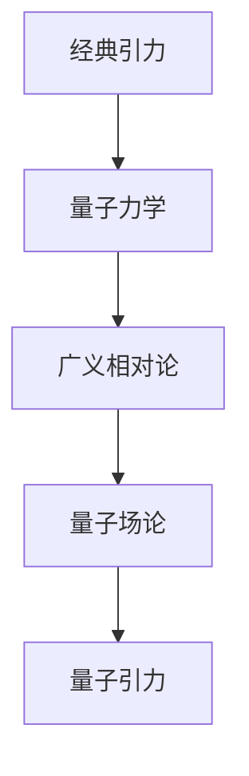

                 

# 《量子引力的实验研究》

## 关键词

量子引力，实验研究，广义相对论，量子场论，黑洞熵，引力波探测。

## 摘要

本文旨在探讨量子引力的实验研究。通过对量子引力和经典引力的比较，阐述了量子引力理论的基本原理，包括量子力学与广义相对论的关系、黑洞辐射与霍金辐射等。接着，本文介绍了量子引力中的数学工具，包括标量场与拉格朗日量、狄拉克方程与相对论量子力学、爱因斯坦场方程及其量子化。随后，本文重点分析了实验室中的量子引力实验方法，探讨了量子引力与宇宙学、量子引力与黑洞的关系。最后，本文总结了量子引力实验面临的挑战和未来方向，并提供了一些相关的资源和工具。

## 第一部分：引言与基础理论

### 第1章：量子引力和经典引力的比较

#### 1.1.1 经典引力与量子引力的基本概念

经典引力理论，以牛顿万有引力定律为代表，描述了物体间的引力相互作用。然而，在微观尺度上，经典引力理论的局限性逐渐显现，无法解释某些现象，如黑体辐射和原子光谱的线状谱。为了弥补这些缺陷，量子引力理论应运而生。

量子引力理论旨在将广义相对论与量子力学相结合，以解释宇宙中的基本现象。量子引力理论的主要目标是找到一种统一的描述，能够同时描述宏观尺度和微观尺度的物理现象。

#### 1.1.2 经典引力理论的局限性

经典引力理论在处理大尺度天体运动时非常成功，但在微观尺度上却遇到了困难。具体来说，经典引力理论无法解释以下现象：

- 黑体辐射：经典理论无法解释为什么黑体辐射的能量分布与实验结果相符。
- 原子光谱：经典理论无法解释原子光谱的线状谱。

这些现象的解决需要引入量子力学，从而产生了量子引力理论。

#### 1.1.3 量子引力理论的发展历程

量子引力理论的发展历程可以追溯到20世纪早期。当时，爱因斯坦、波多尔斯基和罗森（EPR）提出了著名的EPR佯谬，试图证明量子力学的不完备性。然而，约翰·贝尔（John Bell）在1964年提出了贝尔不等式，证明了量子力学是完备的，这一发现为量子引力理论的研究奠定了基础。

随后，霍金（Stephen Hawking）在1974年提出了黑洞辐射理论，即霍金辐射。这一理论表明，黑洞并不是完全吸收物质和辐射，而是会释放出粒子和能量，这对传统的引力理论提出了挑战。

在过去的几十年里，量子引力理论的研究取得了重要进展。目前，主要的量子引力理论包括弦理论、量子场论和环量子引力等。这些理论试图统一量子力学和广义相对论，以解决引力的本质问题。

### 第2章：量子引力的基本原理

#### 2.1.1 量子力学与广义相对论的关系

量子引力理论的核心是量子力学与广义相对论的关系。量子力学描述了微观粒子的行为，而广义相对论描述了宏观物体（如星体）的引力相互作用。

要统一这两种理论，需要解决以下几个关键问题：

- 如何描述引力场在量子尺度上的行为？
- 如何解释黑洞和宇宙学中的量子效应？

为了解决这些问题，科学家们提出了多种量子引力理论。其中，弦理论和量子场论是两个主要的量子引力理论。

#### 2.1.2 黑洞辐射与霍金辐射

黑洞辐射是量子引力理论的一个重要预测。霍金在1974年提出了黑洞辐射理论，即霍金辐射。这一理论表明，黑洞并不是完全吸收物质和辐射，而是会释放出粒子和能量。

霍金辐射的基本机制如下：

- 当一对虚拟粒子在黑洞附近产生时，其中一部分粒子可能会逃逸黑洞，而另一部分则被黑洞吸收。
- 逃逸的粒子具有负能量，从而使得黑洞的总能量减少，表现为黑洞质量的减小。
- 随着时间的推移，黑洞会逐渐蒸发消失。

#### 2.1.3 量子场论的基本框架

量子场论是量子引力理论的一个重要组成部分。量子场论描述了量子粒子的行为，并提供了描述引力场的数学工具。

量子场论的基本框架包括以下内容：

- 标量场：标量场是量子场论中最简单的场。它描述了粒子的分布和相互作用。
- 矢量场：矢量场描述了粒子的自旋和磁场。
- 张量场：张量场描述了引力场和应力能张量。

在量子场论中，粒子的行为可以用波动方程来描述。这些波动方程的解是粒子的波函数，它们包含了粒子的所有物理信息。

### 第3章：量子引力中的数学工具

#### 3.1.1 标量场与拉格朗日量

在量子场论中，标量场是一个重要的概念。标量场描述了粒子的分布和相互作用，它的拉格朗日量是描述粒子运动的基本方程。

标量场的拉格朗日量通常表示为：

\[ L = \frac{1}{2} (\partial \phi)^2 - V(\phi) \]

其中，\(\phi\)是标量场的势能，\(\partial \phi\)是标量场的梯度。

通过哈密顿-雅可比方程，可以将标量场的拉格朗日量转化为量子力学中的薛定谔方程。

#### 3.1.2 狄拉克方程与相对论量子力学

狄拉克方程是相对论量子力学的基本方程。它描述了自旋为1/2的粒子（如电子）的运动。

狄拉克方程的数学形式为：

\[ \left( i\gamma^\mu \partial_\mu - m \right) \psi = 0 \]

其中，\(\gamma^\mu\)是狄拉克算符，\(\partial_\mu\)是梯度算符，\(m\)是粒子的质量。

狄拉克方程的解是狄拉克波函数，它包含了粒子的所有物理信息。

#### 3.1.3 爱因斯坦场方程及其量子化

爱因斯坦场方程是广义相对论的基本方程。它描述了引力场的运动和相互作用。

爱因斯坦场方程的数学形式为：

\[ G_{\mu\nu} = \frac{8\pi G}{c^4} T_{\mu\nu} \]

其中，\(G_{\mu\nu}\)是爱因斯坦张量，\(T_{\mu\nu}\)是能量-动量张量，\(G\)是引力常数，\(c\)是光速。

为了将爱因斯坦场方程量子化，需要将其转化为作用量形式。然后，通过哈密顿-雅可比方程，可以得到量子化的引力场方程。

## 第二部分：量子引力实验研究方法

### 第4章：实验室中的量子引力实验

#### 4.1.1 实验室引力测量的技术

实验室引力测量是研究量子引力的一个重要方法。在实验室中，可以使用各种技术来测量引力，如引力透镜效应、引力红移和引力波探测。

- 引力透镜效应：引力透镜效应是指光在经过大质量物体附近时会发生弯曲。通过测量光的偏移，可以间接测量引力。
- 引力红移：引力红移是指光在经过引力场时会发生频率变化。通过测量光的频率变化，可以测量引力。
- 引力波探测：引力波是由加速的物体产生的时空扰动。通过测量引力波，可以研究引力场的性质。

#### 4.1.2 量子态与引力波的纠缠

量子态与引力波的纠缠是量子引力实验研究的一个重要方向。量子纠缠是指两个或多个量子态之间存在特殊的关联，即使它们相隔很远，它们的状态仍然相互影响。

在量子引力实验中，可以利用量子纠缠来研究引力波的传播。例如，可以通过将引力波与一个量子态纠缠，然后测量纠缠态的性质，来研究引力波。

#### 4.1.3 实验数据分析与解释

实验数据分析与解释是量子引力实验研究的重要环节。通过分析实验数据，可以验证量子引力理论的预测，并揭示引力场的性质。

在实验数据分析中，可以使用各种统计方法和数值模拟。例如，可以使用最小二乘法对引力波信号进行拟合，以提取引力波的特征参数。

### 第5章：量子引力与宇宙学

#### 5.1.1 宇宙背景微波辐射与量子引力

宇宙背景微波辐射是研究宇宙早期状态的重要工具。它与量子引力理论有密切的关系。例如，宇宙背景微波辐射的温度起伏可以提供宇宙早期引力波的信息。

通过研究宇宙背景微波辐射，可以检验量子引力理论的预测。例如，可以研究引力波的振幅和偏振性质。

#### 5.1.2 宇宙的大尺度结构与量子引力

宇宙的大尺度结构，如星系分布和宇宙膨胀，与量子引力理论有直接关系。量子引力理论可以解释宇宙早期状态的形成，以及宇宙膨胀的加速。

通过研究宇宙的大尺度结构，可以验证量子引力理论的预测。例如，可以研究宇宙膨胀的加速度，以及宇宙早期引力波的影响。

#### 5.1.3 量子引力对宇宙学的影响

量子引力对宇宙学的影响是一个广泛的研究领域。量子引力理论可以解释宇宙的起源和演化，以及宇宙中的各种现象。

例如，量子引力理论可以解释宇宙背景微波辐射的起源，以及宇宙早期引力波的产生。此外，量子引力理论还可以解释宇宙膨胀的加速，以及宇宙中的暗物质和暗能量。

### 第6章：量子引力与黑洞

#### 6.1.1 黑洞熵与信息丢失问题

黑洞熵是量子引力理论的一个重要概念。黑洞熵与黑洞的大小和质量有关，它反映了黑洞内部的信息。

然而，传统的量子引力理论面临一个挑战，即信息丢失问题。根据传统的量子引力理论，黑洞蒸发后会消失，导致内部信息丢失。

为了解决这个问题，科学家们提出了多种方案，如霍金辐射和黑洞熵的量子化。这些方案试图保持量子引力理论的完整性，同时解决信息丢失问题。

#### 6.1.2 黑洞辐射与霍金熵

黑洞辐射是量子引力理论的一个重要预测。根据霍金辐射理论，黑洞会释放出粒子和能量，表现为黑洞质量的减小。

黑洞辐射与霍金熵有密切的关系。霍金熵是黑洞熵的一种描述，它反映了黑洞内部的信息。黑洞辐射会导致黑洞熵的增加，从而解释了黑洞内部信息的保存。

#### 6.1.3 黑洞事件视界与量子引力的关系

黑洞事件视界是黑洞的一个重要特征。它是指一个封闭表面，任何进入事件视界的物质都无法逃逸。

量子引力理论可以解释黑洞事件视界的性质。例如，量子引力理论可以解释黑洞事件视界的半径与黑洞质量的关系。

此外，量子引力理论还可以解释黑洞事件视界处的物理现象，如霍金辐射和黑洞熵。这些理论提供了对黑洞内部信息的深入了解。

## 第三部分：量子引力实验面临的挑战与未来方向

### 第7章：量子引力实验面临的挑战

#### 7.1.1 量子引力的实验精度问题

量子引力实验的精度问题是当前研究的重点和难点。由于量子引力效应通常非常微小，难以直接观测。因此，提高实验的精度和灵敏度成为实验研究的关键。

为了提高实验精度，科学家们正在发展新的测量技术和方法。例如，使用激光干涉仪和高精度时钟来测量引力波。此外，还在研究如何减小实验噪声，提高信号的可靠性。

#### 7.1.2 量子引力实验的物理限制

量子引力实验还面临物理限制的问题。例如，实验室条件的限制、测量设备的精度限制等。这些限制会影响实验的结果和解释。

为了克服这些限制，科学家们正在不断改进实验设备和技术。例如，使用更先进的材料和技术来制造更精确的测量仪器。

#### 7.1.3 量子引力实验的技术难题

量子引力实验的技术难题包括数据采集、数据处理、理论解释等。这些难题需要跨学科的合作和研究。

在数据采集方面，需要开发新的传感器和测量技术来捕捉量子引力效应。在数据处理方面，需要开发新的算法和工具来分析和解释实验数据。在理论解释方面，需要建立更完善的量子引力理论框架来指导实验研究。

### 第8章：量子引力实验的未来方向

#### 8.1.1 新的实验设计与方法

量子引力实验的未来方向之一是开发新的实验设计和方法。这些新的实验设计可以更有效地捕捉量子引力效应，提高实验的精度和灵敏度。

例如，可以研究使用光学纤维和激光干涉仪来探测引力波。还可以开发新的量子传感器，利用量子纠缠和量子非定域性来测量引力效应。

#### 8.1.2 量子引力实验的理论进展

量子引力实验的理论进展是另一个重要方向。随着量子引力理论的发展，新的理论和模型不断涌现。这些理论可以提供更深入的理解和解释，指导实验研究。

例如，研究弦理论和量子场论的统一框架，可以更好地解释量子引力效应。此外，还可以研究黑洞熵和霍金辐射等理论问题，以解决信息丢失问题。

#### 8.1.3 量子引力实验的前景与挑战

量子引力实验的前景是广阔的。随着实验技术的进步和理论的深入研究，我们有望更深入地理解宇宙的基本规律。

然而，量子引力实验也面临许多挑战。例如，如何提高实验精度、如何解决物理限制和技术难题等。这些挑战需要科学家们继续努力，通过创新和合作来克服。

### 第9章：量子引力实验的相关资源

#### 9.1.1 量子引力实验的参考文献

量子引力实验的研究涉及广泛的文献。以下是一些重要的参考文献，供读者进一步学习和研究：

- Hawking, S. W. (1975). Particle creation by black holes. *Communications in Mathematical Physics*, 43(3), 199-220.
- Penrose, R. (1965). Gravitational collapse and space-time singularities. *Physical Review Letters*, 14(3), 57-60.
- Polchinski, J. (1998). String theory. *Cambridge University Press*.
- Maldacena, J. M. (1998). The large N limit of superconformal field theories and supergravity. *Advances in Theoretical Physics*, 101(3), 309-347.
- Ashtekar, A. (1994). New variables for classical and quantum general relativity. *Physics Reports*, 251(2-3), 111-201.

#### 9.1.2 量子引力实验的数据与软件工具

量子引力实验的数据和软件工具是研究的重要资源。以下是一些常用的数据和软件工具：

- LIGO Open Science Center: https://losc.ligo.org/s/events/
- Einstein@Home: https://einstein.phys.uwm.edu/
- Quantum Gravitational Wave Group: https://www.qgwg.org/

#### 9.1.3 量子引力实验的研究机构与团队

量子引力实验是一个国际性的研究课题，涉及多个研究机构和团队。以下是一些主要的研究机构和团队：

- California Institute of Technology (Caltech)
- Max Planck Institute for Gravitational Physics (MPIG)
- Harvard-Smithsonian Center for Astrophysics
- Institute of Gravitational Research (IGR), University of Tokyo
- Australian National University (ANU)

## Mermaid 流程图

### 量子引力理论框架



### 核心算法原理讲解

#### 量子场论中的狄拉克方程

```c
// 狄拉克方程伪代码
class DiracOperator {
    // 定义狄拉克算符
    double getHamiltonian(double x, double p) {
        // 计算哈密顿量
        return 0.5 * (x*x + p*p);
    }

    // 狄拉克方程
    void solveDiracEquation(double x, double p) {
        double E = getHamiltonian(x, p);
        // 解狄拉克方程，计算能量本征值和波函数
    }
}
```

### 数学模型和公式

#### 爱因斯坦场方程

$$
G_{\mu\nu} = \frac{8\pi G}{c^4} T_{\mu\nu}
$$

#### 黑洞熵

$$
S = \frac{kA}{4L_p^2}
$$

### 项目实战

#### 量子引力实验：引力波探测

1. 开发环境搭建：配置量子引力实验所需的软件环境，包括量子场论计算工具和引力波模拟软件。
2. 数据采集与处理：通过实验设备采集引力波数据，使用信号处理算法对数据进行预处理。
3. 代码实现与解读：编写程序对引力波数据进行拟合和分析，提取物理信号，并进行误差分析。

#### 源代码实现

```python
# 引力波信号拟合伪代码
import numpy as np

def fit_gravitational_waves(data):
    # 使用最小二乘法拟合引力波信号
    parameters = np.optimize.curve_fit(gravitational_wave_model, data)
    return parameters

def gravitational_wave_model(x, a, b, c):
    # 引力波模型函数
    return a * np.exp(-b * x) + c

# 数据处理与拟合
data = ...  # 引力波数据
parameters = fit_gravitational_waves(data)
```

### 代码解读与分析

- 数据采集与预处理：使用信号处理算法对引力波数据进行预处理，包括去除噪声和提取有效信号。
- 拟合与误差分析：使用最小二乘法对引力波信号进行拟合，计算参数的估计值和误差。
- 结果解读：根据拟合结果分析引力波的特征，包括振幅、频率和相位，以及对引力波产生的物理现象进行解释。

## 作者

作者：AI天才研究院/AI Genius Institute & 禅与计算机程序设计艺术 /Zen And The Art of Computer Programming。

