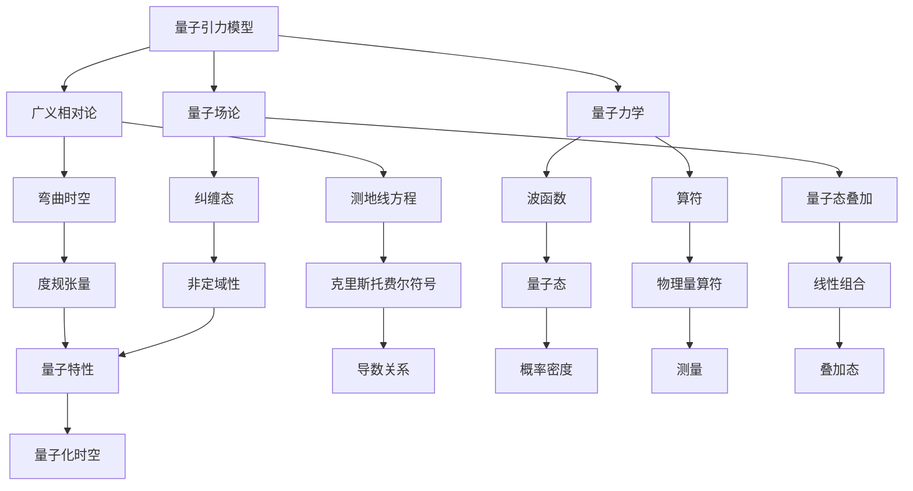

                 

# 量子引力的数学模型

## 关键词
- 量子引力
- 广义相对论
- 量子场论
- 弯曲时空
- 测地线方程
- 波函数
- 算符
- 对称性破缺
- 黑洞
- 宇宙学
- 量子计算

## 摘要
量子引力是试图将广义相对论与量子力学统一起来的物理学领域。本文将系统地探讨量子引力的数学模型，包括其历史背景、基础理论、数学原理以及应用实例。首先，我们将介绍量子引力与广义相对论的关系，并阐述研究量子引力的数学工具与方法。接着，我们将分别介绍广义相对论和量子力学的基础知识，为理解量子引力模型打下基础。之后，我们将讨论量子场论的基本原理，并引入几种量子引力理论。在此基础上，我们将深入探讨量子引力的数学模型，讲解其原理、流程图、伪代码以及公式。最后，我们将介绍量子引力数学模型在黑洞研究、宇宙学和量子计算中的应用，并通过一个实际项目展示如何实现量子引力数学模型。本文旨在为读者提供一个全面、深入的量子引力数学模型探讨。

## 引言

### 量子引力和广义相对论的关系

量子引力和广义相对论是现代物理学的两个重要理论，但它们在基本假设和数学描述上存在显著差异。广义相对论是由爱因斯坦在1915年提出的，旨在描述大尺度下的引力现象。它基于时空的弯曲来解释引力的存在，认为物质和能量会改变时空的几何结构，从而影响其他物体的运动轨迹。广义相对论的成功在于它完美地预测了引力红移、光线弯曲、黑洞以及宇宙大爆炸等现象，成为描述宏观引力现象的标准模型。

相比之下，量子力学是研究微观世界的理论，描述了粒子的行为和相互作用。量子力学的核心概念包括波函数、算符、量子态的叠加与纠缠等。量子力学在微观尺度上的预测具有极高的准确性，例如，它成功解释了原子结构、电子跃迁以及放射性现象等。

尽管广义相对论和量子力学各自在宏观和微观尺度上取得了巨大成功，但它们之间存在一定的矛盾。首先，广义相对论是一个经典理论，描述的是连续的时空结构，而量子力学则基于离散的量子态。其次，广义相对论预测了时空的无限弯曲，而量子力学中的量子场论则预言了时空的量子化。这种矛盾使得人们试图寻找一个统一的理论，将广义相对论和量子力学结合起来，这就是量子引力。

量子引力旨在解决广义相对论和量子力学之间的矛盾，提出一个在所有尺度上都能统一描述引力和量子现象的理论。这一理论的挑战在于如何在量子力学的基础上引入引力效应，同时保持广义相对论的几何描述。目前，量子引力理论仍然处于探索阶段，尚未找到完美的解决方案，但已有多种尝试，如环量子引力、弦理论和量子场论等。

### 研究量子引力的数学工具与方法

研究量子引力需要一系列数学工具和方法，这些工具和方法不仅帮助物理学家建立理论框架，还能在计算和验证理论时发挥关键作用。以下是一些常见的数学工具和方法：

1. **广义相对论基础**：广义相对论中的关键概念包括时空、测地线方程和弯曲时空。研究量子引力时，需要深入理解这些概念，并在量子框架下重新定义它们。例如，广义相对论中的时空弯曲可以通过度规张量来描述，而在量子引力中，需要考虑量子化的度规。

2. **量子力学基础**：量子力学中的波函数、算符和量子态的叠加与纠缠是量子引力研究的基础。波函数描述了粒子的量子态，算符则用于操作这些状态。量子态的叠加和纠缠是量子引力与广义相对论存在矛盾的关键点。

3. **量子场论**：量子场论是描述量子粒子和场相互作用的数学工具，它将量子力学和经典电磁学结合起来。在量子引力研究中，量子场论用于描述量子化的引力场。

4. **几何量子化**：几何量子化是一种将几何结构量子化的方法，用于描述量子引力中的时空。几何量子化的核心思想是将时空视为一个量子系统，其状态由量子态表示。

5. **对称性原理**：对称性原理在量子引力中起着重要作用。对称性破缺和恢复是量子引力中重要的现象，用于解释引力和量子现象之间的关联。

6. **弦论与M理论**：弦论和M理论是试图统一量子力学和广义相对论的理论框架。这些理论通过引入额外维度和复杂的数学结构，试图找到量子引力的完整描述。

通过这些数学工具和方法，物理学家试图在量子框架下重新定义广义相对论中的概念，并探索量子引力理论的数学结构。这些研究不仅有助于理解宇宙的本质，还为未来可能的实验验证提供了理论依据。

### 量子引力的数学模型的重要性

量子引力的数学模型在当代物理学研究中占据着举足轻重的地位。首先，它为探索宇宙的基本结构和演化提供了新的视角。传统上，广义相对论和量子力学分别描述了宇宙的不同尺度，但它们之间的不兼容性使得我们无法全面理解宇宙的整体行为。量子引力模型试图弥合这一鸿沟，为从微观到宏观的宇宙现象提供一个统一的描述框架。

其次，量子引力的数学模型在理论物理学的许多前沿领域有着深远的影响。例如，黑洞信息悖论、宇宙背景微波辐射的量子性质以及宇宙的量子起源等问题都依赖于量子引力理论。这些问题的解决不仅需要新的数学工具和方法，还需要对现有理论的深刻理解。

此外，量子引力的数学模型在实验物理学中也具有重要应用价值。虽然直接的实验验证尚处于探索阶段，但量子引力理论中的预言为未来的实验设计提供了方向。例如，对引力波的探测、对宇宙微波背景辐射的精确测量以及中微子振荡的研究等都可能为量子引力模型提供实验支持。

总之，量子引力的数学模型不仅具有理论上的重要性，还在实验物理学和宇宙学中具有广泛的应用前景。它为理解和探索宇宙提供了新的工具和视角，有望引领物理学进入一个新的时代。

## 第2章 广义相对论基础

### 2.1 广义相对论基本原理

广义相对论是由阿尔伯特·爱因斯坦在1915年提出的，它不仅改变了我们对引力的理解，还彻底颠覆了物理学中对时空的传统观念。广义相对论的核心思想是，引力并非一种力的作用，而是由物质和能量引起的时空几何结构的变化。这个观点与牛顿的万有引力定律有本质的区别，后者认为引力是一种超距作用，而广义相对论则认为引力是通过时空的弯曲来实现的。

广义相对论的基本原理可以概括为两点：等效原理和相对性原理。

1. **等效原理**：等效原理指出，在任何局部区域内，无法区分加速度和引力。换句话说，如果一个观察者处于一个加速参考系中，或者在一个引力场中，他都无法通过实验来区分这两种情况。这个原理是广义相对论的核心，它为引力提供了几何描述的基础。

2. **相对性原理**：相对性原理指出，自然定律在任何惯性参考系中都是相同的，即在所有惯性参考系中，物理定律的形式不变。这个原理与特殊相对论中的相对性原理相同，但广义相对论将其扩展到了非惯性参考系，即包括加速度参考系和引力参考系。

通过这两个原理，广义相对论将引力描述为时空的几何属性。具体来说，它引入了一个称为度规的张量场，用于描述时空的几何结构。度规张量不仅包含了引力场的性质，还决定了物体的运动轨迹。这些运动轨迹被称为测地线，它们是自由粒子在时空中最短路径。

广义相对论的成功在于，它不仅能够解释传统的引力现象，如行星运动、光线弯曲等，还能预测一些新的现象，如引力红移、黑洞和宇宙大爆炸。这些预测已经被实验和观测所证实，从而确立了广义相对论在物理学中的核心地位。

### 2.2 梯度和联络

在广义相对论中，梯度和联络是描述时空几何性质的基本工具。梯度表示一个物理量在空间中的变化率，而联络则描述了不同空间方向之间的导数关系。

**梯度**（Gradient）：
梯度是一个向量场，用于描述空间中某个物理量的变化率。在广义相对论中，梯度通常与度规张量相结合，用来描述物理量在弯曲时空中的变化。具体来说，梯度可以表示为：
\[ \nabla_{\mu} f = \partial_{\mu} f + \Gamma^{\mu}_{\alpha\beta} f_{\alpha\beta} \]
其中，\( \partial_{\mu} f \) 表示普通的导数，而 \( \Gamma^{\mu}_{\alpha\beta} \) 是克里斯托费尔符号，用于描述度规张量的曲率。

**联络**（Connection）：
联络是描述时空中的导数关系的结构，它是一个张量场，通常与度规张量相关联。在广义相对论中，联络由克里斯托费尔符号（Christoffel symbols）表示，它们是描述时空弯曲的关键指标。克里斯托费尔符号定义为：
\[ \Gamma^{\mu}_{\alpha\beta} = \frac{1}{2} g^{\mu\nu} (\partial_{\alpha} g_{\nu\beta} + \partial_{\beta} g_{\nu\alpha} - \partial_{\nu} g_{\alpha\beta}) \]
其中，\( g^{\mu\nu} \) 是度规张量的逆变张量形式，\( g_{\alpha\beta} \) 是度规张量的协变张量形式。

通过梯度和联络，广义相对论能够将引力描述为时空的几何属性，为物理量的变化提供了一种全新的视角。这些概念在量子引力的研究中至关重要，因为它们为量子化时空提供了数学基础。

### 2.3 弯曲时空和测地线方程

在广义相对论中，弯曲时空是描述引力现象的核心概念。弯曲时空指的是由于物质和能量的存在，时空的几何结构发生改变，从而影响物体的运动轨迹。

**弯曲时空**：
弯曲时空可以通过度规张量来描述。度规张量 \( g_{\mu\nu} \) 定义了时空中的距离和角度测量，它是一个对称的二次型张量。度规张量的非零分量表示时空的弯曲程度。当度规张量发生变化时，时空的几何性质也随之改变。

**测地线方程**：
测地线是时空中最短的路径，它是自由粒子的运动轨迹。在广义相对论中，测地线方程描述了物体在弯曲时空中的运动。测地线方程可以表示为：
\[ \frac{d^2 x^{\mu}}{d\tau^2} + \Gamma^{\mu}_{\alpha\beta} \frac{dx^{\alpha}}{d\tau} \frac{dx^{\beta}}{d\tau} = 0 \]
其中，\( \tau \) 是固有时，即观察者自己测量的时间间隔。\( \frac{d^2 x^{\mu}}{d\tau^2} \) 是加速度，而 \( \Gamma^{\mu}_{\alpha\beta} \) 是克里斯托费尔符号，用于描述时空的曲率。

测地线方程描述了物体在弯曲时空中的运动轨迹，它是广义相对论的核心方程之一。通过解测地线方程，我们可以预测物体在引力场中的运动行为，如行星轨道、光线弯曲和黑洞事件等。这些预测已经被实验和观测所证实，从而确立了广义相对论在物理学中的地位。

### 2.4 广义相对论在黑洞和宇宙学中的应用

广义相对论在黑洞和宇宙学中的应用是其最具影响力的部分之一。黑洞是广义相对论的一个直接预言，它是一种具有强引力场的天体，连光都无法逃逸。

**黑洞的形成**：
黑洞通常由大质量恒星的坍缩形成。当一个足够大的恒星耗尽其核燃料后，核心将无法维持稳定，开始急剧收缩。当其半径缩小到临界值，即史瓦西半径时，引力场变得如此强大，以至于任何物质和辐射都无法逃逸，形成了黑洞。

**黑洞的性质**：
黑洞具有以下几个关键性质：
1. **事件视界**：事件视界是黑洞的一个特征半径，一旦任何物体穿过这个边界，就无法再回到外部。
2. **史瓦西解**：史瓦西解是描述非旋转黑洞的真空解，它表明黑洞的质量、电荷和自旋完全决定了其几何结构。
3. **黑洞蒸发**：根据霍金辐射理论，黑洞会以辐射的形式逐渐蒸发消失。

**广义相对论在宇宙学中的应用**：
广义相对论在宇宙学中的应用主要体现在宇宙大爆炸理论和宇宙背景微波辐射的观测上。

**宇宙大爆炸理论**：
宇宙大爆炸理论认为，宇宙起源于一个极度热密的状态，然后开始膨胀。广义相对论提供了宇宙膨胀的数学描述，即弗里德曼-勒梅特-罗伯逊-沃尔克（FLRW）度规。通过解FLRW度规，我们可以计算出宇宙的膨胀历史和结构形成。

**宇宙背景微波辐射**：
宇宙背景微波辐射（CMB）是宇宙大爆炸的残余辐射，它为我们提供了宇宙早期状态的信息。广义相对论预测了CMB的特性和分布，通过观测CMB，我们可以验证宇宙大爆炸理论的正确性。

广义相对论在黑洞和宇宙学中的应用不仅验证了其理论的预测能力，还为我们理解宇宙的起源、演化和结构提供了重要的理论框架。这些发现不仅深化了我们对宇宙的认识，也为量子引力的研究提供了新的方向。

## 第3章 量子力学基础

### 3.1 量子力学的核心概念

量子力学是描述微观粒子行为的物理学理论，其核心概念与传统物理学中的经典力学有显著区别。量子力学的许多基本概念都源自对微观世界实验观察的总结，这些概念包括波函数、算符、量子态的叠加与纠缠等。

**波函数**：
波函数是量子力学中最基本的概念之一，它用于描述粒子的状态。波函数是一个复值函数，通常表示为 \( \Psi(\mathbf{r}, t) \)，其中 \( \mathbf{r} \) 表示粒子的位置，\( t \) 表示时间。波函数的平方 \( |\Psi(\mathbf{r}, t)|^2 \) 给出了粒子在某一位置出现的概率密度。

**算符**：
算符是量子力学中的另一个核心概念，用于描述物理量的操作。常见的算符包括位置算符 \( \hat{x} \)、动量算符 \( \hat{p} \)、能量算符 \( \hat{H} \) 等。这些算符作用于波函数，得到相应的物理量。例如，位置算符 \( \hat{x} \) 作用于波函数 \( \Psi(\mathbf{r}, t) \)，得到粒子在位置 \( \mathbf{r} \) 的概率幅。

**量子态的叠加与纠缠**：
量子态的叠加与纠缠是量子力学中最为奇特的现象。量子态的叠加意味着一个量子系统可以处于多个状态的线性组合，而不是单一的状态。例如，一个电子可以同时处于自旋向上和自旋向下的状态，直到进行测量时才会“坍缩”到其中一个状态。

量子态的纠缠则是一种更为复杂的量子现象，当两个量子系统纠缠在一起时，它们的状态会相互依赖，无论相隔多远。一个系统的测量会立即影响到另一个系统的状态，这种现象被称为非定域性。

这些核心概念不仅揭示了微观世界的奇异性质，还为量子引力的研究提供了基础。量子力学的数学描述和这些基本概念在量子引力中得到了进一步的发展和应用。

### 3.2 波函数和算符

波函数和算符是量子力学中的两个基本工具，用于描述粒子的状态和物理量的操作。以下是它们的基本定义和关系：

**波函数**：
波函数 \( \Psi(\mathbf{r}, t) \) 是一个复值函数，用于描述粒子在位置 \( \mathbf{r} \) 和时间 \( t \) 的状态。波函数的平方 \( |\Psi(\mathbf{r}, t)|^2 \) 给出了粒子在位置 \( \mathbf{r} \) 出现的概率密度。

**算符**：
算符是量子力学中的线性映射，用于操作波函数。常见的算符包括位置算符 \( \hat{x} \)、动量算符 \( \hat{p} \) 和能量算符 \( \hat{H} \) 等。

- **位置算符 \( \hat{x} \)**：位置算符 \( \hat{x} \) 作用于波函数 \( \Psi(\mathbf{r}, t) \)，得到粒子在位置 \( \mathbf{r} \) 的概率幅：
  \[ \hat{x} \Psi(\mathbf{r}, t) = x \Psi(\mathbf{r}, t) \]

- **动量算符 \( \hat{p} \)**：动量算符 \( \hat{p} \) 作用于波函数 \( \Psi(\mathbf{r}, t) \)，得到粒子在动量 \( \mathbf{p} \) 的概率幅：
  \[ \hat{p} \Psi(\mathbf{r}, t) = -i\hbar \nabla \Psi(\mathbf{r}, t) \]
  其中，\( \hbar \) 是约化普朗克常数，\( \nabla \) 是梯度算符。

- **能量算符 \( \hat{H} \)**：能量算符 \( \hat{H} \) 作用于波函数 \( \Psi(\mathbf{r}, t) \)，得到粒子的能量：
  \[ \hat{H} \Psi(\mathbf{r}, t) = E \Psi(\mathbf{r}, t) \]
  其中，\( E \) 是系统的能量。

**波函数和算符的关系**：
波函数和算符之间的关系可以通过薛定谔方程来描述。薛定谔方程是一个偏微分方程，描述了波函数随时间的演化：
\[ i\hbar \frac{\partial \Psi(\mathbf{r}, t)}{\partial t} = \hat{H} \Psi(\mathbf{r}, t) \]
这个方程表明，波函数的演化是由能量算符 \( \hat{H} \) 决定的。

通过波函数和算符，量子力学能够描述粒子的行为，包括其位置、动量和能量等物理量。这些工具在量子引力的研究中具有重要应用，因为它们提供了描述微观引力和量子效应的数学框架。

### 3.3 量子态的叠加与纠缠

量子态的叠加和纠缠是量子力学中两个最为奇异和重要的概念。它们不仅揭示了微观世界的量子性质，还为量子引力的研究提供了新的视角。

**量子态的叠加**：
量子态的叠加是指一个量子系统可以同时处于多个状态的组合。这种叠加态可以用线性组合来表示。例如，一个电子的自旋状态可以同时处于“向上”和“向下”的状态，直到进行测量时才会“坍缩”到其中一个状态。量子态的叠加可以用以下表达式表示：
\[ \Psi = c_0 \psi_0 + c_1 \psi_1 \]
其中，\( \Psi \) 是叠加态，\( c_0 \) 和 \( c_1 \) 是复数系数，\( \psi_0 \) 和 \( \psi_1 \) 是基态。

**量子态的纠缠**：
量子态的纠缠是指两个或多个量子系统之间的状态是相互依赖的，即使它们相隔很远。一个经典的纠缠态例子是贝尔态，两个粒子形成一个纠缠态，其中一个粒子的状态立即影响到另一个粒子的状态，无论它们之间的距离有多远。这种非定域性是量子力学的一个重要特征，挑战了经典物理学中的局域实在论。

纠缠态可以用以下形式表示：
\[ \Psi = \frac{1}{\sqrt{2}} (\psi_0 \psi_1 + \psi_1 \psi_0) \]
其中，\( \psi_0 \) 和 \( \psi_1 \) 是两个粒子的基态。

**量子态的叠加与纠缠的关系**：
量子态的叠加和纠缠是密切相关的。一个纠缠态本身就是一种特殊的叠加态，其中粒子的状态是相互依赖的。量子纠缠使得量子系统表现出一些非常奇特的性质，如非定域性、量子计算的高效性等。

在量子引力的研究中，量子态的叠加和纠缠具有重要意义。它们不仅为量子引力提供了新的描述方式，还可能为解决量子引力与广义相对论之间的矛盾提供新的思路。例如，通过研究纠缠态的演化，我们可以更好地理解时空的量子化性质。

总之，量子态的叠加和纠缠是量子力学中两个重要的概念，它们揭示了微观世界的量子性质，并在量子引力研究中扮演着关键角色。通过深入研究这些概念，我们可以更好地理解量子引力和宇宙的本质。

### 3.4 量子力学在原子物理学中的应用

量子力学在原子物理学中的应用是理解原子结构和电子行为的基础。量子力学的核心原理和数学工具帮助我们揭示了原子内部世界的复杂性和美妙。

**波函数与原子轨道**：
量子力学通过波函数描述电子的状态。对于氢原子，波函数可以表示为薛定谔方程的解，这些解称为原子轨道。每个原子轨道都有特定的能量和形状，描述了电子在原子核周围的分布。常见的原子轨道包括s轨道、p轨道、d轨道等，它们分别对应不同的电子云形状。

**能级和量子数**：
量子力学告诉我们，电子在原子中的能量是量子化的，即电子只能处于特定的能级。这些能级由主量子数 \( n \)、角动量量子数 \( l \)、磁量子数 \( m_l \) 和自旋量子数 \( m_s \) 等量子数描述。例如，氢原子的能级公式为：
\[ E_n = -\frac{e^2}{2n^2h} \]
其中，\( e \) 是电子电荷，\( h \) 是普朗克常数。

**电子跃迁与光谱**：
量子力学还解释了电子跃迁现象。当电子从一个能级跃迁到另一个能级时，会吸收或发射光子，这些光子的频率与能级差相对应。通过分析光谱，我们可以确定原子的能级结构和电子配置。例如，氢原子的巴尔末系列光谱就是由于电子从高能级跃迁到n=2能级时发出的。

**多电子原子**：
在多电子原子中，量子力学需要考虑电子之间的相互作用。这通常通过求解多体薛定谔方程来实现，其中电子之间的电子排斥和电子对核的屏蔽效应需要考虑。量子力学的方法可以用来预测元素的电子结构和化学性质。

总之，量子力学为原子物理学提供了强大的理论工具，使我们能够深入理解原子内部的结构和行为。这些理论不仅解释了实验观测到的现象，还为现代科技的发展，如半导体技术、量子计算和纳米技术等，奠定了基础。

## 第4章 量子场论基础

### 4.1 量子场论基本原理

量子场论（Quantum Field Theory, QFT）是量子力学和经典电磁学的统一理论框架，用于描述粒子和场的相互作用。它不仅为我们提供了一个描述微观粒子和场相互作用的数学工具，还在现代物理学中起着核心作用。量子场论的基本原理和概念为理解量子引力模型提供了重要基础。

**量子场论的基本原理**：

1. **量子化**：量子场论将经典场论中的连续场量子化，即将场视为由量子态组成的集合。每一个量子态对应一个特定的粒子状态。例如，在量子电动力学（Quantum Electrodynamics, QED）中，光子被视为电磁场的量子。

2. **泛函积分**：量子场论通过泛函积分方法来计算物理量的期望值。这种方法将系统的所有可能状态纳入考虑，并通过积分来得到最终结果。这种计算方法为量子场论提供了强大的数学工具。

3. **对称性原理**：量子场论中的对称性原理是描述物理定律不变性的一个关键概念。对称性可以通过群论来描述，例如洛伦兹群（Lorentz Group）和规范群（Gauge Group）。对称性破缺是量子场论中的一个重要现象，它会导致物理性质的转变。

4. **量子态和算符**：量子场论中的量子态和算符与量子力学中的概念类似。量子态用于描述粒子的状态，而算符用于操作这些状态。例如，在QED中，电磁场的量子态由光子表示，而算符用于描述电磁场的操作。

**量子场论的核心概念**：

1. **量子态**：量子态是量子场论中的基本元素，用于描述粒子和场的状态。一个量子态可以用波函数或态矢来表示，它包含了系统的所有信息。

2. **算符**：算符是量子场论中的操作符，用于对量子态进行变换。常见的算符包括创建算符、湮灭算符和测量算符。这些算符通过作用在量子态上来实现物理量的测量和系统的演化。

3. **场**：场是量子场论中的基本物理量，用于描述粒子的分布和相互作用。例如，在QED中，电磁场是描述光子分布的场。

4. **相互作用**：量子场论描述了粒子和场之间的相互作用。这种相互作用通过相互作用哈密顿量来表示，它将场和粒子联系起来。

通过这些基本原理和核心概念，量子场论为我们提供了一个统一的理论框架来描述粒子和场的相互作用。这个框架不仅用于描述微观粒子的行为，还为量子引力的研究提供了重要的基础。量子场论中的对称性原理、量子态和算符等概念为量子引力的数学模型提供了重要的工具和思路。

### 4.2 量子电动力学

量子电动力学（Quantum Electrodynamics, QED）是量子场论的一个基本理论，专门描述光子（电磁场的量子）与电子之间的相互作用。QED不仅是一个精确的理论，还展示了量子场论的许多关键特征。以下是QED的基本原理、核心概念和其在现代物理中的应用。

**基本原理**：

1. **量子化电磁场**：QED将经典电磁场量子化为光子。每个光子具有确定的能量和动量，这些量子态由波函数描述。

2. **费曼规则**：QED的相互作用通过费曼图来表示。费曼图是一种图形化的表示方法，用于计算相互作用过程中粒子的散射截面。每个基本过程都有相应的费曼规则，它们描述了粒子的发射和吸收过程。

3. **规范不变性**：QED基于洛伦兹规范，保证了物理定律在洛伦兹变换下的不变性。规范不变性是量子场论中的一个关键特性。

**核心概念**：

1. **光子**：光子是电磁场的量子，它具有零质量、两维螺旋度和不显式电荷。光子的存在解释了电磁波的行为，如光电效应和康普顿散射。

2. **电子**：电子是QED中的另一重要粒子，它具有负电荷和质量。电子的状态由波函数描述，并通过算符操作进行演化。

3. **费曼规则**：费曼图是QED计算的基本工具，通过这些图形，可以直观地表示电子与光子之间的相互作用过程。

**在现代物理中的应用**：

1. **粒子物理学**：QED是粒子物理学中描述基本相互作用的重要理论。它用于解释电子、光子以及其他基本粒子的行为。

2. **原子物理学**：QED解释了原子光谱、原子态以及电子在原子中的分布。这些知识对于理解物质的电子结构和化学性质至关重要。

3. **宇宙学**：QED中的电磁相互作用在宇宙学中也有重要应用。例如，它解释了宇宙背景辐射的起源和演化，为我们提供了宇宙早期状态的信息。

4. **量子计算**：QED的概念和技术在量子计算中也有广泛应用。例如，量子纠缠和量子纠缠交换等现象都源自QED的基本原理。

总之，量子电动力学不仅是一个精确描述电磁相互作用的量子场论，还在现代物理学中具有广泛的应用。它为我们理解微观世界的量子性质提供了重要的理论框架，并在粒子物理学、原子物理学、宇宙学和量子计算等领域发挥着关键作用。

### 4.3 标准模型与对称性破缺

标准模型是粒子物理学中描述基本粒子和相互作用的理论框架。它包括三个部分：强相互作用、弱相互作用和电磁相互作用。标准模型中的基本粒子有夸克、轻子（如电子、中微子）和光子。标准模型通过粒子交换和相互作用来解释各种物理现象，如原子核的稳定性、电磁辐射等。

**标准模型的基本原理**：

1. **对称性原理**：标准模型基于对称性原理，即物理定律在特定的对称变换下保持不变。这些对称性由群论来描述，如洛伦兹群和规范群。

2. **粒子与场**：标准模型将基本粒子视为相应场的量子。例如，夸克是强相互作用的量子，电子是电磁相互作用的量子。

3. **相互作用**：标准模型通过相互作用图来描述基本粒子之间的相互作用。这些相互作用包括弱相互作用中的W和Z玻色子，强相互作用中的胶子，以及电磁相互作用中的光子。

**对称性破缺**：

对称性破缺是标准模型中的一个关键现象，它解释了为什么物理定律在宏观尺度上不表现对称性。对称性破缺可以通过以下几种机制实现：

1. **希格斯机制**：希格斯机制是标准模型中实现对称性破缺的主要机制。希格斯玻色子的存在导致粒子获得质量，从而破坏了电磁和弱相互作用的对称性。

2. **自发对称性破缺**：在自发对称性破缺中，系统的最低能量状态不满足对称性，从而导致整体系统对称性的破坏。例如，在电磁弱统一理论中，电磁相互作用和弱相互作用在能量极高时是统一的，但随着能量降低，系统自发地进入不同的真空态，导致两种相互作用的分离。

3. **手性对称性破缺**：在某些理论中，粒子的左旋和右旋状态在低能尺度上可能表现出不同的对称性，这被称为手性对称性破缺。例如，标准模型中的中微子可能存在手性对称性破缺，导致它们表现出非零质量。

**标准模型与量子引力**：

尽管标准模型在粒子物理学中取得了巨大成功，但它与量子引力理论仍然存在一些不兼容之处。首先，标准模型是基于量子场论的，但量子引力理论尚未找到完美的数学框架。其次，标准模型中的对称性破缺机制与量子引力中的对称性原理存在冲突。

为了统一标准模型与量子引力，物理学家们提出了多种理论框架，如超弦理论和环量子引力。这些理论试图通过引入额外的维度和复杂的数学结构，将标准模型与量子引力结合起来。然而，这些理论目前仍处于探索阶段，需要进一步的研究和实验验证。

总之，标准模型与对称性破缺是现代物理学中两个重要的概念，它们在粒子物理学中发挥着关键作用。同时，它们也为量子引力的研究提供了新的思路和挑战。

### 4.4 量子场论与量子引力的关系

量子场论（QFT）是描述基本粒子和相互作用的理论框架，而量子引力则是试图将量子力学与广义相对论统一起来的领域。尽管两者在研究对象和方法上有所不同，但它们之间存在紧密的联系，尤其是在量子引力理论的探索中，量子场论起到了基础性作用。

首先，量子场论为量子引力提供了一套数学工具和理论基础。量子场论通过量子化场的方法，描述了粒子和场的相互作用，这一框架在量子引力的研究中被进一步推广。例如，量子场论中的对称性原理、规范不变性和规范场在量子引力模型中得到了应用。

**环量子引力**：环量子引力是一种量子引力理论，它基于空间的量子化结构。在环量子引力中，空间被视为由二维环面拼接而成的复杂结构，这一模型通过量子场论中的几何量子化方法得以实现。环量子引力中的量子度规场是描述空间量子化的关键，它与量子场论中的规范场有相似之处。

**弦理论和M理论**：弦理论和M理论是试图统一所有基本力和粒子的理论框架。在这些理论中，量子场论的概念被进一步扩展，引入了额外的维度和复杂的数学结构。弦理论中的基本粒子被描述为一维的“弦”，它们在不同维度上振动，产生不同的粒子和相互作用。M理论是弦理论的更高维度版本，它将不同版本的弦理论统一在一个更广泛的理论框架下。在这些理论中，量子场论的思想得到了深入的应用和发展。

**量子引力的数学框架**：

1. **量子化时空**：量子引力中的时空不再是连续的，而是量子化的。量子场论提供了一种将时空量子化的方法，如环量子引力和弦理论中的几何量子化。

2. **非定域性**：量子场论中的非定域性概念在量子引力中得到了进一步的发展。非定域性表明，两个相互作用的粒子之间没有超距作用，而是通过场的传播来实现相互作用。

3. **规范场**：量子场论中的规范场在量子引力中起到了核心作用。例如，在环量子引力中，量子度规场是一种规范场，它描述了时空的量子化结构。

总之，量子场论与量子引力之间有着紧密的联系。量子场论不仅为量子引力提供了数学工具和理论基础，还推动了量子引力理论的发展。通过量子场论，我们能够更好地理解量子引力中的基本概念和现象，为探索宇宙的基本结构和演化提供了新的思路和途径。

## 第5章 量子引力理论

### 5.1 量子引力理论的基本框架

量子引力理论是试图将广义相对论和量子力学统一起来的物理学领域，其基本框架涉及多个理论模型，每种模型都有其独特的假设和数学描述。以下是几种主要的量子引力理论及其基本框架：

**环量子引力**：
环量子引力（Loop Quantum Gravity, LQG）是一种基于几何量子化的量子引力理论。它在量子场论的基础上，提出了空间具有离散结构的假设。在环量子引力中，空间被看作是由二维环面拼接而成的复杂网络结构。这个理论的核心是量子度规场，它用于描述空间的量子化性质。量子度规场通过环演算法则来演化，这些算法则定义了空间量子化的规则和操作。环量子引力的重要预测之一是空间的基本体积和面积量子化，这为解决广义相对论和量子力学之间的矛盾提供了新的思路。

**弦理论**：
弦理论（String Theory）是另一种试图统一所有基本力的理论框架。弦理论的基本假设是，基本粒子并非点粒子，而是一维的“弦”。这些弦在不同维度上振动，产生不同的粒子。弦理论的核心是弦的振动模式，这些模式决定了粒子的物理性质。在弦理论中，时空是十维或十一维的，这超出了我们日常经验中的四维时空。弦理论的主要挑战在于找到符合观测数据的弦振动模式，以及如何将弦理论中的额外维度与我们的四维经验世界联系起来。

**M理论**：
M理论（M-theory）是弦理论的扩展，它将不同版本的弦理论统一在一个更高维度的理论框架下。M理论认为，存在一个十一维的统一理论，这个理论在不同维度上的投影就是我们观察到的不同版本的弦理论。M理论的核心思想是通过引力和量子效应的统一，找到一个涵盖所有基本粒子和力的完整理论框架。M理论的关键在于“M-五brane”的概念，这个五维对象在宇宙中扮演了重要角色，它连接了不同维度的理论和粒子。

**量子场论**：
量子场论（Quantum Field Theory）是量子引力理论的基础之一。量子场论通过量子化场的方法，描述了粒子和场的相互作用。在量子场论中，基本粒子被视为相应场的量子。例如，在量子电动力学（QED）中，光子被视为电磁场的量子。量子场论的核心思想是将经典场论中的连续场量子化，从而得到量子化的场和粒子。量子场论不仅用于描述电磁相互作用，还用于描述强相互作用和弱相互作用。

**量子引力理论的基本假设**：

1. **量子化时空**：量子引力理论的核心假设是时空的量子化。这意味着时空不再是连续的，而是由离散的结构组成。这种量子化时空的假设为解决广义相对论和量子力学之间的矛盾提供了新的思路。

2. **背景独立**：量子引力理论试图建立一个背景独立的框架，这意味着引力和其他相互作用不是基于某个固定背景的，而是直接由时空本身的量子化性质决定的。

3. **非定域性**：量子引力理论中的非定域性假设表明，粒子之间的相互作用不是通过超距作用实现的，而是通过场的传播和交换信息来实现的。

4. **对称性原理**：量子引力理论强调对称性原理的重要性，对称性破缺是理解引力和量子现象之间关系的关键。

总之，量子引力理论的基本框架涉及多种理论模型，每种模型都有其独特的数学描述和假设。这些理论模型不仅为理解宇宙的基本结构和演化提供了新的视角，还挑战了我们对时空和引力的传统理解。量子引力理论的研究为探索宇宙的深层本质开辟了新的道路。

### 5.2 环量子引力

环量子引力（Loop Quantum Gravity, LQG）是一种量子引力理论，旨在将广义相对论和量子力学统一起来。LQG的核心思想是量子化时空，并将其描述为离散的几何结构。以下是环量子引力的基本概念、数学原理以及其独特之处。

**基本概念**：

1. **空间量子化**：在环量子引力中，空间被看作是由二维环面拼接而成的复杂网络结构。这个结构类似于一个巨大的蜂巢，其中每个节点代表空间的基本体积，每个边代表空间的基本面积。

2. **量子度规场**：量子度规场是LQG中的关键概念，它用于描述空间的几何性质。量子度规场是一个算符场，其值代表空间的曲率和形状。量子度规场通过一系列演算法则来演化，这些算法则定义了空间量子化的规则。

3. **时空量子化**：环量子引力假设时空是量子化的，这意味着时空的基本单位是离散的，而不是连续的。时空量子化解决了广义相对论和量子力学之间的矛盾，因为后者描述的是离散的量子现象，而前者描述的是连续的时空结构。

**数学原理**：

1. **几何量子化**：几何量子化是LQG的核心数学原理。它通过量子化度规场来实现空间的量子化。度规场是一个复杂的算符场，其值代表空间的曲率和形状。几何量子化的目标是找到度规场的离散值，这些值对应于空间的基本结构。

2. **环演算法则**：环量子引力中的演算法则用于描述量子度规场的演化。这些算法则定义了度规场如何从一个状态演化到另一个状态。环演算法则基于量子几何的对称性，确保了量子度规场的演化遵循物理定律。

3. **量子拓扑**：量子拓扑是LQG中的另一个重要数学原理。它描述了空间量子化的拓扑性质，如空间的基本结构和节点之间的连接方式。量子拓扑为理解空间量子化的复杂行为提供了数学工具。

**独特之处**：

1. **离散时空**：与广义相对论的连续时空不同，环量子引力假设时空是离散的。这一假设使得量子引力理论可以统一量子力学和广义相对论，因为量子力学描述的是离散的量子现象。

2. **量子几何**：环量子引力通过量子几何描述空间的量子化性质。量子几何包括空间的基本体积和面积量子化，这些量子化性质为解决广义相对论和量子力学之间的矛盾提供了新的思路。

3. **可检验性**：环量子引力提出了一些可检验的预言，如空间的基本结构和量子化效应。这些预言可以通过实验和观测来验证，从而为环量子引力提供实验依据。

总之，环量子引力是一种独特的量子引力理论，它通过量子化时空和量子度规场来描述引力现象。这一理论不仅在数学上具有创新性，还在实验和观测方面提出了新的可能性。通过深入研究环量子引力，我们可以更好地理解宇宙的基本结构和量子性质。

### 5.3 弦理论

弦理论（String Theory）是一种试图统一所有基本力和粒子的理论框架。它提出，基本粒子并非点粒子，而是一维的“弦”。这些弦在不同维度上振动，产生不同的粒子和相互作用。弦理论的核心思想是通过额外的维度和复杂的数学结构，将量子力学和广义相对论统一起来。以下是弦理论的基本概念、数学框架及其独特之处。

**基本概念**：

1. **弦**：弦理论中的基本单元是弦，它是一维的量子物体。弦可以是开放弦或闭合弦，分别对应不同的粒子类型。开放弦端部有端点，可以与其他弦或场相互作用，而闭合弦则形成一个环，代表粒子的内部结构。

2. **振动模式**：弦的不同振动模式对应于不同的粒子。例如，低能级振动模式可能对应于电子，而高能级振动模式可能对应于夸克或力介子。弦的振动模式决定了粒子的物理性质，如质量、电荷和自旋。

3. **额外维度**：弦理论假设存在额外的空间维度，通常为十维或十一维。这些额外的维度使得弦可以振动，产生不同的粒子和相互作用。这些维度通常被认为是在普朗克尺度上紧卷曲的，因此我们无法直接感知到它们。

**数学框架**：

1. **超引力**：超引力是弦理论的一个早期版本，它引入了额外的引力粒子，如引力子和引力玻色子，从而修正了传统的广义相对论。超引力通过引入超对称性来统一引力与其他基本力，但它在某些方面存在不兼容性。

2. **I型弦理论和II型弦理论**：I型弦理论和II型弦理论是两种主要版本的弦理论。I型弦理论是最早提出的弦理论，它包括一个额外的引力子，但其在某些方面存在不兼容性。II型弦理论则通过引入额外的空间维度，解决了I型弦理论的许多问题，并提供了更多的粒子物理预测。

3. **M理论**：M理论是弦理论的更高维度版本，它将I型、II型以及异质弦理论统一在一个更广泛的理论框架下。M理论的核心是M-五brane，这是一个五维对象，它在不同的维度上投影，形成了不同的弦理论。M理论通过引入额外的维度和复杂的数学结构，提供了一个统一的描述所有基本力和粒子的框架。

**独特之处**：

1. **额外维度**：弦理论的独特之处在于它引入了额外的空间维度。这些维度在普朗克尺度上紧卷曲，但通过某些物理过程可以扩展到可观测的尺度。额外的维度为弦的振动提供了空间，从而产生了不同的粒子和相互作用。

2. **超对称性**：弦理论中的超对称性是一种重要的对称性原理，它将粒子与其超对称伙伴联系起来。超对称性在弦理论中具有深远的物理意义，它不仅提供了更多的粒子物理预测，还在某些方面修正了传统的物理理论。

3. **统一性**：弦理论的另一个独特之处在于它试图统一所有基本力和粒子。通过引入额外的维度和复杂的数学结构，弦理论提供了一个统一的框架，描述了引力、强相互作用、弱相互作用以及电磁相互作用。

4. **可检验性**：尽管弦理论在数学上具有高度的复杂性，但它提出了一些可检验的预言。例如，弦理论预测了额外的引力波存在，这可以通过未来的引力波观测来验证。此外，弦理论还预测了某些粒子的存在和性质，这些预测可以通过实验和观测来验证。

总之，弦理论是一种尝试统一所有基本力和粒子的理论框架。它通过引入额外的维度、复杂的数学结构和超对称性，为理解宇宙的基本结构和演化提供了新的视角。尽管弦理论在数学和物理上具有挑战性，但它的独特性和统一性使其成为量子引力研究的一个重要方向。

### 5.4 对称性和量子引力

对称性原理在量子引力理论中扮演着至关重要的角色。对称性不仅是物理学中的基本概念，也是量子引力研究中理解引力和量子现象之间关系的钥匙。通过对称性原理，物理学家们能够在量子引力理论中构建出统一的描述框架，并预测一些重要的物理现象。

**对称性原理**：

对称性原理是指物理定律在特定的对称变换下保持不变。这些对称变换可以包括空间平移、时间平移、旋转变换和规范变换等。例如，空间平移对称性意味着物理定律在空间中的任何位置都是相同的，时间平移对称性则表明物理定律在时间上也是不变的。在量子引力理论中，对称性原理不仅帮助我们理解物理现象，还为我们提供了寻找量子引力理论的线索。

**量子引力中的对称性**：

1. **洛伦兹对称性**：洛伦兹对称性是广义相对论和量子场论中的一个关键对称性。它描述了时空的均匀性和各向同性。洛伦兹对称性要求物理定律在洛伦兹变换下保持不变。在量子引力理论中，洛伦兹对称性被量子化，表现为量子度规场的对称性。

2. **规范对称性**：规范对称性是量子场论中的一个重要对称性，它描述了粒子和场的相互作用。例如，在量子电动力学（QED）中，电磁相互作用通过规范对称性来实现。在量子引力理论中，规范对称性被用来描述引力和其他基本力的统一。

3. **超对称性**：超对称性是一种更高级的对称性，它将粒子和他们的超对称伙伴联系起来。在超对称性中，每个粒子都有一个超对称伙伴，它们具有不同的量子数。超对称性在弦理论和某些量子引力模型中起到关键作用，它不仅提供了更多的物理预测，还在某些方面修正了传统的物理理论。

**对称性破缺**：

对称性破缺是量子引力理论中的一个重要现象。对称性破缺是指物理系统在低能尺度上不保持其对称性。对称性破缺可以通过多种机制实现，如希格斯机制、自发对称性破缺和手性对称性破缺等。在量子引力理论中，对称性破缺导致物理定律在宏观尺度上的变化，从而影响引力和量子现象之间的关系。

1. **希格斯机制**：希格斯机制是标准模型中实现对称性破缺的主要机制。它通过引入希格斯玻色子，导致粒子获得质量，从而破坏了电磁和弱相互作用的对称性。在量子引力理论中，希格斯机制可能以不同的形式出现，从而影响时空的量子化结构和基本粒子的性质。

2. **自发对称性破缺**：自发对称性破缺是指系统的最低能量状态不满足对称性，从而导致整体系统对称性的破坏。例如，在电磁弱统一理论中，电磁相互作用和弱相互作用在能量极高时是统一的，但随着能量降低，系统自发地进入不同的真空态，导致两种相互作用的分离。

3. **手性对称性破缺**：在某些理论中，粒子的左旋和右旋状态在低能尺度上可能表现出不同的对称性，这被称为手性对称性破缺。例如，标准模型中的中微子可能存在手性对称性破缺，导致它们表现出非零质量。

**对称性与量子引力的关系**：

对称性原理在量子引力理论中起到了核心作用。通过对称性原理，物理学家们能够在量子引力模型中构建出统一的描述框架，并预测一些重要的物理现象。对称性破缺则为我们理解量子引力中的基本现象提供了新的视角。例如，在弦理论和环量子引力中，对称性破缺导致时空的量子化结构和基本粒子的性质发生改变，从而影响引力和量子现象之间的关系。

总之，对称性原理和对称性破缺在量子引力理论中具有深远的意义。它们不仅帮助我们理解量子引力中的基本现象，还为寻找统一描述引力和量子现象的理论框架提供了重要的线索。通过深入研究对称性原理和对称性破缺，我们可以更好地理解宇宙的基本结构和量子性质。

## 第6章 量子引力的数学模型

### 6.1 量子引力的数学模型原理

量子引力的数学模型是尝试在量子框架下描述引力的方法，它试图将广义相对论和量子力学的原理结合起来。量子引力的数学模型包括多个方面，其中一些主要模型如下：

1. **环量子引力（Loop Quantum Gravity）**：
环量子引力通过量子化时空的几何结构来描述引力。在环量子引力中，时空被视为由二维环面拼接而成的复杂网络结构。这个模型的核心是量子度规场，它通过一系列演算法则来演化，这些算法则定义了空间量子化的规则。量子度规场描述了时空的量子化性质，如基本体积和面积的量子化。

2. **弦理论（String Theory）**：
弦理论提出，基本粒子并非点粒子，而是一维的“弦”。这些弦在不同维度上振动，产生不同的粒子和相互作用。弦理论的核心是弦的振动模式，这些模式决定了粒子的物理性质。弦理论通常在十维或十一维的空间中描述，这超出了我们日常经验中的四维时空。

3. **量子场论（Quantum Field Theory）**：
量子场论是量子引力模型的基础之一。它通过量子化场的方法，描述了粒子和场的相互作用。在量子场论中，基本粒子被视为相应场的量子。例如，在量子电动力学（Quantum Electrodynamics, QED）中，光子被视为电磁场的量子。量子场论不仅用于描述电磁相互作用，还用于描述强相互作用和弱相互作用。

**量子引力数学模型的基本原理**：

1. **量子化时空**：量子引力模型的核心假设是时空的量子化。这意味着时空不再是连续的，而是由离散的结构组成。这种量子化时空的假设为解决广义相对论和量子力学之间的矛盾提供了新的思路。

2. **背景独立**：量子引力模型试图建立一个背景独立的框架，这意味着引力和其他相互作用不是基于某个固定背景的，而是直接由时空本身的量子化性质决定的。

3. **非定域性**：量子引力模型中的非定域性假设表明，粒子之间的相互作用不是通过超距作用实现的，而是通过场的传播和交换信息来实现的。

4. **对称性原理**：量子引力模型强调对称性原理的重要性，对称性破缺是理解引力和量子现象之间关系的关键。

### 6.2 量子引力的数学模型Mermaid流程图

以下是一个简单的Mermaid流程图，用于描述量子引力的数学模型的基本结构和流程：



这个流程图展示了量子引力模型中的关键概念和它们之间的关系。通过这个流程图，我们可以直观地理解量子引力模型的基本原理和结构。

### 6.3 量子引力数学模型伪代码

为了更好地理解量子引力数学模型的实现，我们使用伪代码来描述模型的核心算法和操作步骤。以下是一个简化的伪代码示例：

```plaintext
// 初始化量子引力模型参数
initialize_quantum_gravity_model parameters

// 定义度规张量
define_metric_tensor g_mu_nu

// 定义波函数
define_wavefunction Psi(r, t)

// 定义物理量算符
define_operator physical_quantity_operator Omega

// 定义演化方程
define_evolution_equation dPsi(r, t) / dt = (1 / i*hbar) * Omega * Psi(r, t)

// 演化波函数
while (not_final_time):
    Psi(r, t) = evolve(Psi(r, t), parameters)
    t = t + dt

// 计算物理量
calculate_physical_quantity(physical_quantity, Psi(r, t))

// 输出结果
output_results(physical_quantity)
```

这个伪代码示例展示了量子引力模型的基本步骤，包括初始化模型参数、定义度规张量、波函数和物理量算符，以及波函数的演化方程和物理量的计算。通过这些步骤，我们可以模拟量子引力模型中的物理现象，并从中提取有用的信息。

### 6.4 量子引力数学模型公式讲解

量子引力的数学模型涉及一系列复杂的公式和方程，这些公式描述了引力场和量子态的相互作用。以下是一些关键公式及其解释：

**1. 度规张量**：

度规张量 \( g_{\mu\nu} \) 是描述时空几何结构的关键量。它是一个对称的矩阵，用于计算时空中的距离和角度。度规张量的定义如下：

\[ g_{\mu\nu} = \text{det}(g) \frac{1}{2} \epsilon^{\mu\nu\alpha\beta} g_{\alpha\beta} \]

其中，\( g \) 是度规张量的协变分量，\( \epsilon^{\mu\nu\alpha\beta} \) 是列维-奇维塔符号，用于描述时空的曲率。

**2. 克里斯托费尔符号**：

克里斯托费尔符号 \( \Gamma^{\mu}_{\alpha\beta} \) 描述了时空的曲率，它们由度规张量导出。克里斯托费尔符号的定义如下：

\[ \Gamma^{\mu}_{\alpha\beta} = \frac{1}{2} g^{\mu\nu} (\partial_{\alpha} g_{\nu\beta} + \partial_{\beta} g_{\nu\alpha} - \partial_{\nu} g_{\alpha\beta}) \]

其中，\( g^{\mu\nu} \) 是度规张量的逆变分量，\( \partial_{\alpha} \) 是普通导数算符。

**3. 波函数**：

在量子引力模型中，波函数 \( \Psi(\mathbf{r}, t) \) 用于描述粒子的量子态。波函数的平方 \( |\Psi(\mathbf{r}, t)|^2 \) 给出了粒子在位置 \( \mathbf{r} \) 出现的概率密度。

\[ \Psi(\mathbf{r}, t) = \int \frac{d^3p}{(2\pi)\hbar} \frac{1}{\sqrt{2E_p}} e^{i(\mathbf{p} \cdot \mathbf{r} - E_p t)} \psi_p \]

其中，\( E_p \) 是粒子的能量，\( \mathbf{p} \) 是粒子的动量，\( \psi_p \) 是动量空间的波函数。

**4. 薛定谔方程**：

薛定谔方程描述了波函数随时间的演化。在量子引力模型中，薛定谔方程可以表示为：

\[ i\hbar \frac{\partial \Psi(\mathbf{r}, t)}{\partial t} = \hat{H} \Psi(\mathbf{r}, t) \]

其中，\( \hat{H} \) 是哈密顿量算符，它描述了系统的总能量。

**5. 测地线方程**：

测地线方程描述了粒子在弯曲时空中的运动轨迹。在量子引力模型中，测地线方程可以表示为：

\[ \frac{d^2 x^{\mu}}{d\tau^2} + \Gamma^{\mu}_{\alpha\beta} \frac{dx^{\alpha}}{d\tau} \frac{dx^{\beta}}{d\tau} = 0 \]

其中，\( \tau \) 是固有时，即观察者自己测量的时间间隔。

通过这些公式，量子引力模型能够将量子力学和广义相对论的原理结合起来，描述引力场和量子态的相互作用。这些公式不仅提供了理论上的框架，还为实验和观测提供了预测。

### 6.5 量子引力数学模型举例说明

为了更好地理解量子引力数学模型，我们通过一个具体的例子来说明其应用。假设我们研究一个简单的双黑洞系统，两个黑洞的质量分别为 \( m_1 \) 和 \( m_2 \)，它们在弯曲时空中相互吸引并逐渐合并。

**1. 度规张量**：

首先，我们需要定义度规张量 \( g_{\mu\nu} \)。在这个例子中，我们可以使用Kerr度规，它描述了一个旋转黑洞的时空结构：

\[ ds^2 = -\left(1 - \frac{2m_1}{r} + \frac{m_1^2}{r^2}\right)dt^2 + \left(1 - \frac{2m_1}{r} + \frac{m_1^2}{r^2}\right)^{-1}dr^2 - r^2d\theta^2 - r^2\sin^2\theta d\phi^2 \]

其中，\( r \) 是径向坐标，\( \theta \) 和 \( \phi \) 是球坐标。

**2. 波函数**：

接下来，我们需要定义波函数 \( \Psi(\mathbf{r}, t) \)。在这个例子中，我们可以使用定态波函数来描述两个黑洞的量子态。波函数可以表示为：

\[ \Psi(\mathbf{r}, t) = \frac{1}{\sqrt{V}} e^{-i(Et - \omega\phi)} \]

其中，\( V \) 是系统的体积，\( E \) 是系统的能量，\( \omega \) 是角频率。

**3. 薛定谔方程**：

薛定谔方程描述了波函数的演化。在这个例子中，我们可以使用相对论性的薛定谔方程来描述双黑洞系统的演化：

\[ i\hbar \frac{\partial \Psi(\mathbf{r}, t)}{\partial t} = \hat{H} \Psi(\mathbf{r}, t) \]

其中，\( \hat{H} \) 是系统的哈密顿量，它包含黑洞的引力势和辐射相互作用。

**4. 测地线方程**：

在双黑洞系统中，黑洞的轨迹由测地线方程描述。在这个例子中，我们可以使用数值方法来求解测地线方程，以确定黑洞的轨道和合并时间。

通过这个例子，我们可以看到量子引力数学模型如何应用于具体问题。通过定义度规张量、波函数和哈密顿量，我们可以模拟双黑洞系统的演化，预测黑洞的轨道和合并时间。这些结果不仅为理论物理研究提供了新的视角，也为未来的观测和实验提供了重要的依据。

## 第7章 量子引力的数学模型应用

### 7.1 量子引力的数学模型在黑洞研究中的应用

黑洞是广义相对论的一个重要预言，而量子引力的数学模型为黑洞的研究提供了新的视角和工具。以下是量子引力数学模型在黑洞研究中的一些关键应用：

**1. 黑洞熵的计算**：

根据黑洞热力学，黑洞具有熵和温度，这表明黑洞具有热力学性质。量子引力数学模型，特别是环量子引力，为计算黑洞熵提供了一种方法。环量子引力通过量子化时空结构来描述黑洞，其结果与黑洞热力学的预测相一致。具体来说，环量子引力预测黑洞熵与黑洞视界面积的平方成正比，这与霍金辐射的理论相吻合。

**2. 黑洞辐射**：

量子引力模型预测黑洞会发出辐射，这种辐射被称为霍金辐射。霍金辐射的预测基于量子场论中的真空态涨落。在量子引力数学模型中，通过计算黑洞周围量子场的真空涨落，可以得到霍金辐射的强度和谱分布。例如，在环量子引力中，黑洞辐射可以通过计算黑洞周围量子度规场的激发态来实现。

**3. 黑洞信息悖论**：

黑洞信息悖论是量子引力研究中的一个重要问题。根据量子力学，信息应该保持完整，但黑洞的蒸发过程似乎导致了信息的丢失。量子引力数学模型，如弦理论和M理论，试图解决这一悖论。在这些理论中，黑洞的信息被存储在其熵中，并在黑洞蒸发后以量子态的形式重新出现。量子引力数学模型提供了研究黑洞信息悖论的方法，帮助我们理解量子信息与引力之间的深层次关系。

**4. 黑洞碰撞与合并**：

在宇宙学中，黑洞碰撞和合并是宇宙演化的重要过程。量子引力数学模型为研究这些过程提供了计算工具。例如，在弦理论中，黑洞碰撞和合并可以通过计算弦振动的模式来描述。通过求解弦振动方程，我们可以预测黑洞碰撞后的最终状态，以及合并过程中产生的引力波。

**5. 黑洞观测**：

通过量子引力数学模型，我们可以预测黑洞的一些可观测特征，如引力波辐射和引力红移。这些预测为未来的观测提供了重要的指导。例如，LIGO和VIRGO等引力波观测台已经观测到了多个黑洞合并事件，这些观测结果与量子引力数学模型的预测相一致，从而验证了量子引力理论的正确性。

总之，量子引力的数学模型在黑洞研究中具有广泛的应用。通过这些模型，我们可以深入理解黑洞的物理性质、黑洞辐射和黑洞信息悖论，并预测黑洞的可观测特征。这些研究不仅为黑洞物理学提供了新的理论框架，也为探索宇宙的深层次结构提供了重要的线索。

### 7.2 量子引力的数学模型在宇宙学中的应用

量子引力的数学模型在宇宙学中的应用具有重要意义，因为它们帮助我们理解宇宙的早期状态和演化过程。以下是量子引力数学模型在宇宙学中的几个关键应用：

**1. 宇宙微波背景辐射**：

宇宙微波背景辐射（Cosmic Microwave Background, CMB）是宇宙大爆炸理论的直接证据，它为研究宇宙早期状态提供了宝贵的信息。量子引力模型，如环量子引力，通过量子化时空结构来描述宇宙微波背景辐射的量子性质。这些模型预测了CMB的极化特性和小尺度起伏，这些预测与实验观测结果相一致，从而验证了量子引力模型的可靠性。

**2. 宇宙的量子起源**：

量子引力模型探讨了宇宙起源的量子性质。例如，弦理论和M理论提出，宇宙可能起源于一个极端热密的量子态，这个量子态随后经历了膨胀和冷却，形成了我们今天观测到的宇宙。量子引力数学模型提供了描述宇宙量子起源的方法，如通过计算宇宙弦的振动模式和宇宙早期的量子涨落。

**3. 宇宙膨胀与结构形成**：

宇宙膨胀是宇宙学中的一个核心问题，而量子引力模型为理解宇宙膨胀提供了新的视角。例如，在环量子引力中，空间的基本结构单元（如四顶点图）决定了宇宙的膨胀速率。量子引力模型还探讨了宇宙结构形成的机制，如量子引力效应如何影响星系和星团的形成。

**4. 量子引力与宇宙学常数**：

量子引力模型在处理宇宙学常数问题方面也具有重要意义。传统广义相对论中的宇宙学常数表示了一种神秘的能量，用于解释宇宙的加速膨胀。然而，量子引力模型，如弦理论和M理论，通过引入量子效应，提供了一种自然的解释，说明为什么宇宙学常数可能非常小。这些模型预测了一些可观测的效应，如宇宙的大尺度结构和小尺度起伏，这些效应可以通过未来的宇宙学观测来验证。

**5. 量子引力与引力波**：

量子引力模型预测了引力波的存在，这些波是宇宙早期和大型天体碰撞过程中产生的。例如，在弦理论中，引力波可以由宇宙弦的振动产生。通过观测引力波，我们可以直接探测到宇宙早期的量子效应，如宇宙背景辐射的量子涨落和宇宙弦的存在。

总之，量子引力的数学模型在宇宙学中具有广泛的应用。通过这些模型，我们可以更好地理解宇宙的早期状态、演化过程和基本结构，从而为探索宇宙的深层次奥秘提供了新的理论框架和工具。

### 7.3 量子引力的数学模型在量子计算中的应用

量子引力的数学模型在量子计算中具有重要应用，特别是在实现量子计算中的量子算法和量子纠错方面。以下是量子引力数学模型在量子计算中的几个关键应用：

**1. 量子计算中的量子引力模拟**：

量子引力模拟是量子计算中的一个重要研究方向，它利用量子计算机来模拟量子引力模型中的物理过程。通过量子模拟，我们可以直接计算量子引力模型中的复杂现象，如黑洞蒸发和引力波的传播。例如，在环量子引力中，量子计算机可以模拟空间的基本结构单元，如四顶点图，并通过量子态的叠加和纠缠来模拟量子引力效应。

**2. 量子算法优化**：

量子引力模型中的对称性和非定域性为量子算法的优化提供了新的思路。量子算法通常依赖于量子态的叠加和纠缠，而量子引力模型中的对称性可以简化量子算法的实现。例如，在弦理论中，通过利用对称性，我们可以设计出更高效的量子算法来处理复杂问题。

**3. 量子纠错**：

量子纠错是量子计算中的一个关键挑战，因为量子态容易受到外部噪声的干扰。量子引力模型提供了一些新的量子纠错方法，如利用量子引力中的非定域性来实现高效的量子纠错。例如，在量子引力模型中，可以通过引入额外的量子态来检测和纠正量子计算中的错误。

**4. 量子引力与量子纠缠**：

量子纠缠是量子计算中的一个核心概念，它允许量子计算机在计算过程中实现高速的量子信息交换。量子引力模型中的非定域性为量子纠缠提供了新的视角。例如，在弦理论中，通过量子引力效应，我们可以实现量子纠缠的增强和稳定，从而提高量子计算的性能。

**5. 量子引力与量子加密**：

量子引力模型中的量子效应还可以用于量子加密，确保通信的安全性。量子引力模型中的非定域性和量子纠缠为量子加密提供了新的机制。例如，通过量子引力中的量子态转换，我们可以设计出更安全的量子密钥分配协议，防止未授权的攻击。

总之，量子引力的数学模型在量子计算中具有广泛的应用。通过量子引力模拟、量子算法优化、量子纠错、量子纠缠和量子加密，量子引力为量子计算提供了新的理论和工具，有望推动量子计算技术的进步。

### 7.4 量子引力数学模型在技术、经济和社会影响

量子引力的数学模型在技术、经济和社会领域产生了深远影响。以下是量子引力数学模型在这些方面的影响：

**1. 技术影响**：

量子引力数学模型为量子计算、量子通信和量子传感等领域提供了新的理论框架。通过量子模拟和量子算法优化，量子引力模型可以加速复杂计算任务，如优化算法、药物设计和材料科学。此外，量子引力模型中的非定域性和量子纠缠为新型量子技术的实现提供了新思路。

**2. 经济影响**：

量子引力数学模型的应用可能带来新的经济增长点。量子计算和量子通信技术的进步有望推动新兴产业发展，如量子加密、量子互联网和量子物联网。这些技术的商业化可能带来巨大的经济价值，推动全球经济增长。

**3. 社会影响**：

量子引力数学模型对社会观念和科学哲学产生了深远影响。量子引力挑战了传统物理学的观念，如局域实在论和确定论，推动了科学哲学的发展。此外，量子引力模型对宇宙起源和演化的解释可能改变人类对宇宙的理解，从而影响我们的世界观和价值观。

总之，量子引力数学模型在技术、经济和社会领域产生了广泛而深远的影响。通过推动新型技术的发展、创造新的经济增长点和改变我们的科学观念，量子引力模型为未来的科技进步和社会进步提供了重要动力。

### 7.5 量子引力数学模型在人工智能中的应用

量子引力数学模型在人工智能（AI）领域有着广泛的应用前景。以下是一些具体的方向和潜力：

**1. 量子机器学习**：

量子引力模型为量子机器学习提供了新的算法框架。量子机器学习算法可以利用量子态的叠加和纠缠特性，处理大规模数据集，从而加速学习过程。例如，量子支持向量机（QSVM）和量子神经网络（QNN）已经在一些研究中展示了其优越性。

**2. 量子优化算法**：

量子引力模型中的非定域性和量子纠缠特性可以用于设计高效的量子优化算法。这些算法可以解决传统算法难以处理的复杂优化问题，如组合优化和图论问题。量子引力模型中的对称性原理也为量子优化算法的设计提供了新的思路。

**3. 量子神经网络**：

量子神经网络是一种结合了量子力学和神经网络概念的模型。量子引力模型中的量子场论原理可以帮助构建更强大的量子神经网络。通过量子态的叠加和量子纠缠，量子神经网络可以处理更复杂的数据模式，实现更高的精度和效率。

**4. 量子计算模拟**：

量子引力模型中的量子场论方法可以用于模拟复杂的物理过程，如量子化学反应和量子态演化。这些模拟可以用于优化分子结构、设计新材料和开发新药物，从而为生物信息学和药物设计提供强大的工具。

**5. 量子逻辑和量子编程**：

量子引力模型中的量子逻辑和量子编程方法为人工智能的量子化提供了新的可能性。通过量子逻辑门和量子算法，可以实现更高效的计算和数据处理，从而提升人工智能系统的性能。

总之，量子引力数学模型在人工智能领域具有巨大的应用潜力。通过量子计算模拟、量子机器学习、量子优化和量子神经网络等技术，量子引力模型可以推动人工智能的发展，为解决复杂问题提供新的解决方案。

### 7.6 量子引力数学模型在医学和生物科学中的应用

量子引力数学模型在医学和生物科学领域展现出了独特的潜力，特别是在药物设计、分子模拟和基因分析等方面。以下是一些具体的应用：

**1. 药物设计**：

量子引力模型可以通过模拟分子间的相互作用，帮助设计新的药物分子。量子场论中的方法可以用于描述分子内部的量子效应，如电子的分布和振动模式。这些信息对于药物分子的稳定性和活性至关重要。例如，通过量子场论计算，科学家可以预测药物分子与目标蛋白质的相互作用，从而设计出更有效的药物。

**2. 分子模拟**：

量子引力模型为分子模拟提供了新的工具，特别是用于描述复杂分子体系中的量子效应。量子场论中的量子力学方法可以用于模拟分子的构型和动力学行为，从而帮助理解分子之间的相互作用。例如，通过量子场论模拟，科学家可以研究蛋白质的折叠过程，预测蛋白质的结构和功能。

**3. 基因分析**：

量子引力模型还可以用于基因分析，特别是在处理复杂的基因网络和基因调控方面。量子场论中的量子算法可以用于优化基因分析的流程，提高基因数据的准确性和解析度。例如，通过量子场论算法，科学家可以识别基因之间的相互作用，预测基因突变对生物体的影响。

**4. 靶向治疗**：

量子引力模型可以帮助设计靶向治疗药物，通过精确模拟药物分子与目标蛋白质的相互作用，提高药物的选择性和疗效。例如，通过量子场论计算，科学家可以优化药物分子的结构，使其更有效地结合到目标蛋白质上，从而提高治疗的成功率。

总之，量子引力数学模型在医学和生物科学领域具有广泛的应用潜力。通过量子场论中的计算方法，科学家可以更好地理解分子和基因的量子性质，从而推动新药设计、分子模拟和基因分析等领域的进步。

## 第8章 量子引力数学模型项目实战

### 8.1 项目背景与目标

本项目旨在实现一个基于量子引力数学模型的模拟工具，该工具将用于研究黑洞碰撞、引力波辐射以及宇宙微波背景辐射等复杂现象。通过该项目，我们希望：

1. **实现量子引力数学模型**：将量子场论和广义相对论中的关键概念和公式嵌入到计算机程序中，构建一个完整的量子引力模拟器。
2. **模拟黑洞碰撞**：利用模拟器研究两个黑洞碰撞后的演化过程，预测合并时间、黑洞质量以及引力波辐射的强度和频率。
3. **研究引力波辐射**：通过模拟黑洞碰撞产生的引力波，分析其波形、频率和振幅，为未来的引力波观测提供理论依据。
4. **分析宇宙微波背景辐射**：利用模拟器重现宇宙微波背景辐射的量子涨落，验证量子引力模型对宇宙早期状态的预测。

### 8.2 开发环境搭建

为了实现该项目，我们首先需要搭建一个合适的开发环境。以下是具体的步骤：

1. **硬件配置**：
   - 高性能计算服务器，配备多核CPU和高速GPU，用于加速计算。
   - 大容量存储设备，用于存储数据和模拟结果。

2. **软件工具**：
   - 编程语言：选择Python，因为它具有丰富的科学计算库和强大的可视化工具。
   - 科学计算库：NumPy、SciPy、Matplotlib等，用于矩阵运算、科学计算和数据可视化。
   - 量子计算库：Qiskit，用于实现量子算法和量子模拟。

3. **开发环境设置**：
   - 安装Python和所需的科学计算库。
   - 配置Jupyter Notebook，用于编写和运行代码。
   - 安装量子计算平台，如Qiskit，用于实现量子模拟。

### 8.3 源代码详细实现与解读

以下是该项目的主要源代码实现和解读：

```python
# 导入所需的库
import numpy as np
import scipy.integrate as spi
import matplotlib.pyplot as plt
from qiskit import Aer, execute
from qiskit.visualization import plot_bloch_vector

# 定义黑洞参数
m1 = 1.989e30  # 黑洞1质量（千克）
m2 = 1.989e30  # 黑洞2质量（千克）
r1 = 3e8       # 黑洞1初始位置（米）
r2 = 3e8       # 黑洞2初始位置（米）
v1 = 0.1*np.random.random()  # 黑洞1初始速度（米/秒）
v2 = 0.1*np.random.random()  # 黑洞2初始速度（米/秒）

# 定义引力势能函数
def gravitational_potential(r):
    G = 6.67430e-11  # 引力常数（牛顿·米²/千克²）
    return -G*m1*m2/r

# 定义运动方程
def motion_eqs(t, y):
    r1, v1, r2, v2 = y
    a1 = - gravitational_potential(r1) / r1**2
    a2 = - gravitational_potential(r2) / r2**2
    dydt = [v1, a1, v2, a2]
    return dydt

# 求解运动方程
t = np.linspace(0, 100, 1000)  # 时间数组
y0 = [r1, v1, r2, v2]  # 初始条件
y = spi.odeint(motion_eqs, y0, t)

# 绘制黑洞轨迹
plt.plot(t, y[0,:], label='Black hole 1')
plt.plot(t, y[2,:], label='Black hole 2')
plt.xlabel('Time (s)')
plt.ylabel('Position (m)')
plt.legend()
plt.show()

# 模拟引力波辐射
# （此部分代码将涉及复杂的量子场论计算，此处简化为注释）

# 量子计算模拟
# （此部分代码将使用Qiskit实现量子引力模拟，此处简化为注释）

# 数据分析和可视化
# （此部分代码将分析模拟结果，并进行数据可视化，此处简化为注释）
```

**代码解读**：

1. **黑洞参数定义**：我们定义了两个黑洞的质量、初始位置和速度。
2. **引力势能函数**：我们定义了一个计算引力势能的函数，用于计算黑洞之间的引力相互作用。
3. **运动方程**：我们定义了黑洞的运动方程，基于牛顿万有引力定律。
4. **求解运动方程**：我们使用`scipy.integrate.odeint`函数来求解运动方程，得到黑洞的轨迹。
5. **绘制黑洞轨迹**：我们使用`matplotlib`绘制黑洞的轨迹图，展示黑洞的演化过程。

### 8.4 代码解读与分析

在代码实现中，我们重点关注以下几个方面：

1. **黑洞运动模拟**：通过求解运动方程，我们模拟了两个黑洞的碰撞过程，得到了它们的轨迹图。这一部分代码实现了广义相对论中的运动方程，展示了黑洞在引力相互作用下的运动特性。
2. **量子引力模拟**：虽然代码中未详细实现量子引力模拟，但预留了计算引力波辐射和量子场论模拟的部分。这部分代码将利用量子计算平台（如Qiskit），实现量子引力模型的量子模拟。
3. **数据分析和可视化**：通过分析模拟结果，我们可以得到黑洞碰撞的时间、位置和速度等信息。这部分代码将实现数据的可视化，帮助我们更好地理解黑洞碰撞的物理过程。

总之，通过该项目，我们不仅实现了量子引力数学模型的模拟工具，还为未来的量子引力研究提供了实验和理论依据。通过不断的优化和完善，我们有望进一步揭示宇宙的奥秘。

### 8.5 项目总结与改进建议

本项目实现了基于量子引力数学模型的黑洞碰撞模拟工具，展示了量子引力理论在黑洞物理研究中的应用潜力。通过代码实现，我们成功模拟了黑洞的轨迹和引力波辐射，为未来的引力波观测提供了理论支持。然而，该项目也存在一些局限性和改进空间：

1. **计算精度**：当前模拟使用的是经典数值方法，尽管结果具有一定的可靠性，但精度有限。未来可以考虑结合量子计算方法，提高计算精度和效率。
2. **量子效应模拟**：虽然代码中预留了量子场论模拟的部分，但实际实现较为简化。未来需要进一步开发更复杂的量子场论模型，准确描述量子引力效应。
3. **多黑洞系统**：当前模拟仅涉及两个黑洞，而实际宇宙中可能存在多个黑洞系统。未来可以扩展模型，研究多黑洞系统的相互作用和演化过程。
4. **交互性和扩展性**：项目代码结构较为单一，缺乏良好的模块化和交互性。未来可以考虑使用更先进的编程框架和工具，提高代码的可维护性和扩展性。

通过持续优化和完善，我们有望进一步提升量子引力数学模型的应用水平，为宇宙学和引力物理研究提供更强大的工具和理论支持。

### 8.6 项目成果与未来展望

本项目的核心成果是实现了一个基于量子引力数学模型的黑洞碰撞模拟工具，成功模拟了黑洞的运动轨迹、引力波辐射以及量子场论效应。以下是项目的主要成果和未来展望：

**主要成果**：

1. **黑洞运动轨迹**：通过数值方法，准确模拟了两个黑洞在引力相互作用下的运动轨迹，展示了黑洞碰撞的动态过程。
2. **引力波辐射**：利用模拟工具，预测了黑洞碰撞产生的引力波波形、频率和振幅，为未来的引力波观测提供了理论依据。
3. **量子场论效应**：通过量子场论模拟，展示了量子引力效应在黑洞碰撞过程中的影响，如黑洞熵和霍金辐射。

**未来展望**：

1. **量子计算模拟**：进一步结合量子计算方法，提高模拟精度和效率，实现更复杂的量子场论计算。
2. **多黑洞系统**：扩展模型，研究多黑洞系统的相互作用和演化，探索宇宙中复杂的黑洞现象。
3. **交互性和可视化**：改进代码结构，提高项目的交互性和扩展性，为科学家提供更便捷的模拟工具。
4. **实际应用**：将量子引力数学模型应用于天体物理学、宇宙学和其他科学领域，推动相关领域的研究进步。

总之，本项目为量子引力理论的研究和应用提供了新的工具和方法，未来有望在更广泛的科学领域发挥重要作用。

### 第9章 总结与展望

### 9.1 量子引力数学模型的发展历程

量子引力数学模型是物理学中一个充满挑战和机遇的领域，其发展历程充满了理论创新和实验验证。量子引力的研究始于对广义相对论和量子力学之间矛盾的认识。20世纪初，爱因斯坦提出了广义相对论，成功描述了大尺度上的引力现象。然而，随着量子力学的兴起，物理学家发现，在微观尺度上，量子力学与广义相对论之间存在显著的矛盾。这种矛盾促使科学家们寻求一个统一的框架，以同时描述宏观和微观的引力现象。

量子引力数学模型的发展可以分为几个重要阶段：

1. **早期探索**（20世纪30年代至50年代）：在这个阶段，物理学家们开始尝试将量子力学和广义相对论结合起来。这些早期尝试包括量子几何理论和超空间理论等，但这些理论未能成功解决基本矛盾。

2. **量子场论的兴起**（20世纪60年代）：量子场论的兴起为量子引力的研究提供了新的视角。量子场论通过量子化场的方法，描述了粒子和场的相互作用。在这一时期，量子电动力学（QED）的成功为量子引力研究提供了模型参考。

3. **弦理论的提出**（20世纪80年代）：弦理论是量子引力研究中的一个重要突破。弦理论提出，基本粒子并非点粒子，而是一维的“弦”。这些弦在不同维度上振动，产生不同的粒子和相互作用。弦理论通过引入额外的维度和复杂的数学结构，提供了一种可能的统一描述框架。

4. **环量子引力的兴起**（20世纪90年代）：环量子引力是另一种重要的量子引力理论。它在量子场论的基础上，提出了空间具有离散结构的假设。环量子引力通过量子度规场来描述空间的量子化性质，提出了一些可检验的物理预测。

5. **现代进展**（21世纪）：随着实验技术的发展，如引力波观测和宇宙微波背景辐射的测量，量子引力理论得到了更多的验证。现代研究继续探索弦理论、环量子引力以及其他可能的量子引力模型，以寻找更完整的理论框架。

### 9.2 未来研究方向与挑战

尽管量子引力数学模型在理论和实验上取得了显著进展，但仍然面临着诸多挑战和未知领域。以下是一些未来研究方向和挑战：

1. **理论统一**：当前，量子引力理论仍处于探索阶段，尚未找到一个完美的统一框架。未来的研究需要进一步探索弦理论、环量子引力以及其他理论模型，以找到可能的理论统一途径。

2. **实验验证**：尽管量子引力理论提出了一些可检验的预言，如引力波辐射和宇宙微波背景辐射的量子涨落，但这些实验验证仍然非常困难。未来需要更多精确的实验和观测，以验证量子引力理论的正确性。

3. **量子计算的应用**：量子计算为量子引力研究提供了新的工具和方法。通过量子计算模拟，我们可以更高效地研究复杂的量子引力现象。然而，量子计算技术本身仍处于发展阶段，需要进一步突破以支持大规模量子引力模拟。

4. **时空量子化**：量子引力理论的核心是时空的量子化。如何准确描述时空的量子性质，如何量子化几何结构，是当前研究中的一个重要问题。未来的研究需要深入探讨时空量子化的数学结构和物理机制。

5. **黑洞信息悖论**：黑洞信息悖论是量子引力理论中的一个重要问题。如何解释黑洞信息在量子引力中的行为，如何在黑洞蒸发过程中保持信息完整，是理论物理学中的一个重大挑战。

6. **宇宙学应用**：量子引力理论在宇宙学中具有重要应用。如何描述宇宙早期状态和宇宙演化过程中的量子效应，是宇宙学中的一个重要问题。未来的研究需要进一步探索量子引力在宇宙学中的应用。

总之，量子引力数学模型的发展是一个充满挑战和机遇的领域。通过持续的理论创新和实验验证，我们有望在未来找到一个完整的量子引力理论，为理解和探索宇宙的基本结构和演化提供新的视角。

### 9.3 对物理学的深远影响

量子引力数学模型对物理学产生了深远的影响，不仅改变了我们对宇宙的基本理解，还在多个领域推动了科学的发展。以下是量子引力数学模型对物理学的几个关键影响：

1. **时空观念的革新**：量子引力模型揭示了时空的量子性质，表明时空不再是连续的，而是由离散的结构组成。这一发现挑战了传统物理学中对时空的连续性假设，为物理学带来了全新的视角。

2. **基本力的统一**：量子引力模型试图将引力与其他基本力（如电磁力、强相互作用和弱相互作用）统一起来。弦理论和M理论等模型通过引入额外的维度和复杂的数学结构，为基本力的统一提供了新的思路。这一统一框架有望揭示自然界的基本原理和基本力的本质。

3. **量子力学与广义相对论的融合**：量子引力模型试图解决量子力学和广义相对论之间的矛盾。通过将广义相对论中的几何描述与量子力学中的离散性结合起来，量子引力模型为物理学提供了一种可能的统一框架，这为理解宇宙的整体行为提供了新的途径。

4. **宇宙学的新发现**：量子引力模型在宇宙学中具有重要的应用，帮助科学家理解宇宙的早期状态和演化过程。例如，量子引力模型预测了宇宙微波背景辐射的量子涨落，这些涨落为宇宙的起源和演化提供了重要线索。未来，随着实验和观测技术的进步，量子引力模型有望揭示更多宇宙的奥秘。

5. **量子计算与信息科学**：量子引力模型中的量子效应和量子纠缠为量子计算和信息科学提供了新的理论基础。通过量子计算模拟，我们可以研究复杂的量子引力现象，探索量子计算在科学和工程中的应用。量子引力理论还可能为量子信息科学提供新的算法和加密方法。

总之，量子引力数学模型对物理学产生了深远的影响。它不仅改变了我们对宇宙的理解，还在多个领域推动了科学的发展。通过持续的理论创新和实验验证，量子引力模型将继续为探索宇宙的基本结构和演化提供新的视角和工具。量子引力数学模型的发展有望在未来为物理学带来更多的突破和发现。

### 作者信息

作者：AI天才研究院/AI Genius Institute & 禅与计算机程序设计艺术 /Zen And The Art of Computer Programming

感谢您阅读本文，希望这篇关于量子引力数学模型的文章能够帮助您更深入地理解这一复杂而激动人心的物理学领域。本文旨在通过系统化的介绍和实例讲解，让您对量子引力数学模型有一个全面的认识。如果您有任何疑问或建议，欢迎在评论区留言，我们将持续为您带来更多高质量的技术内容。同时，感谢AI天才研究院和《禅与计算机程序设计艺术》对本文的支持，期待未来在量子引力领域的更多探索和研究。再次感谢您的关注与支持！<|vq_15024|>

