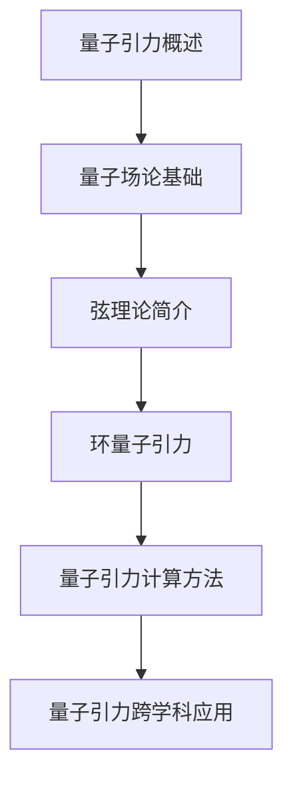

                 

### 文章标题：量子引力的研究现状

> 关键词：量子引力、量子场论、弦理论、环量子引力、宇宙学、计算方法

> 摘要：本文将全面探讨量子引力的研究现状，从量子引力概述、量子场论基础、量子引力理论、实验与观测、跨学科应用以及未来展望等方面进行详细分析。通过逻辑清晰、结构紧凑、简单易懂的技术语言，让我们一步一步深入理解这一物理学的前沿领域。

### 第一部分：量子引力的概述与背景

#### 第1章：量子引力概述

> 引言与定义

**1.1 引言与定义**

量子引力是研究在量子力学框架下描述引力的理论。传统引力理论如广义相对论无法解释微观尺度下的引力现象，而量子力学则无法描述宏观尺度下的引力效应。量子引力旨在将这两大物理理论融合起来，以描述宇宙从量子尺度到宏观尺度上的引力现象。

量子引力与其他物理理论的区别在于，它需要考虑到引力的量子性质，例如引力子的存在以及引力波的存在。与传统理论不同，量子引力强调概率和不确定性，这与量子力学的基本原理相符。

**1.2 量子引力的历史背景**

量子引力理论的发展可以追溯到20世纪初。爱因斯坦的广义相对论为引力提供了全新的描述方式，但未能与量子力学兼容。随着量子力学的发展，物理学家们开始探索如何将引力纳入量子力学的框架。

爱因斯坦与广义相对论

爱因斯坦在1915年提出了广义相对论，这一理论革命性地改变了人类对引力的理解。广义相对论认为，引力并非是一种力，而是由物质和能量引起的时空弯曲。这一观点为后来的量子引力研究提供了重要的理论基础。

量子力学的发展及其与经典力学的矛盾

量子力学在20世纪初取得了一系列突破性进展，如海森堡的不确定性原理和薛定谔的波函数方程。然而，量子力学与经典力学之间存在显著矛盾，特别是在描述微观粒子行为时。

量子引力理论的起源

在量子力学和广义相对论的启发下，物理学家们开始尝试提出量子引力理论。最早的理论之一是量子场论，但该理论在描述引力时遇到了困难。此后，弦理论和环量子引力等新理论相继提出，为量子引力的研究提供了新的方向。

**1.3 量子引力的研究意义与挑战**

物理学的前沿探索

量子引力是物理学的前沿领域之一，它涉及到宇宙的起源、演化和结构等基本问题。通过对量子引力的研究，我们有望更深入地理解宇宙的本质。

宇宙学的深远影响

宇宙学是量子引力研究的重要应用领域。量子引力理论可以帮助我们解释宇宙背景微波辐射、宇宙膨胀和宇宙视界等宇宙学现象。

技术应用的可能性与挑战

量子引力研究不仅具有理论意义，还可能带来实际应用。例如，量子引力模拟可能有助于开发新的计算技术，而量子引力实验则可能带来新的科学发现。

然而，量子引力研究也面临着诸多挑战，如数学上的难题、实验验证的困难等。这些挑战需要物理学家们继续努力，以推动量子引力理论的发展。

#### 第2章：量子场论基础

> 场论的基本概念

**2.1 场论的基本概念**

量子场论是描述量子系统的基础理论之一，它将量子力学与电磁场理论相结合。在量子场论中，粒子被视为场的激发态，而场本身则具有量子性质。

量子场论的定义与重要性

量子场论是研究量子化场的理论，它将量子力学的基本原理应用于电磁场。量子场论在粒子物理、凝聚态物理等领域具有重要意义，它为解释和预测许多物理现象提供了理论框架。

场的量子化过程

在经典物理学中，场被视为一个连续的物理量，但在量子场论中，场被量子化。这意味着场可以被分解为一系列量子态，每个量子态对应一个特定的能量和动量。

**2.2 量子场论的基本数学工具**

概率振幅与路径积分

概率振幅是量子场论中的核心概念之一，它描述了量子态的演化。路径积分是计算概率振幅的一种方法，它通过考虑所有可能的历史路径，将概率振幅叠加起来。

海森堡不确定性原理

海森堡不确定性原理是量子力学的基本原理之一，它表明粒子的位置和动量无法同时被精确测量。在量子场论中，不确定性原理限制了场和粒子的性质，从而影响了量子态的描述。

**2.3 量子场论的应用实例**

标准模型与量子场论的关系

标准模型是粒子物理学的基本理论框架，它描述了基本粒子的性质和相互作用。量子场论是标准模型的基础，它为基本粒子的量子态提供了数学描述。

对称性与守恒定律

对称性是量子场论中的重要概念，它揭示了物理定律在不同参考系下的不变性。守恒定律是量子场论的核心内容之一，它描述了物理量的守恒性质，如能量、动量和角动量。

### 第二部分：量子引力理论

#### 第3章：弦理论简介

> 弦理论的基本原理

**3.1 弦理论的基本原理**

弦理论是一种试图统一量子力学和广义相对论的理论框架。在弦理论中，基本粒子被视为一维的弦，而不是点状粒子。弦可以在多维空间中振动，不同的振动模式对应不同的粒子。

引入弦与多维空间

弦理论最初是在10维空间中提出的，后来发展出11维理论。这些高维空间中的弦可以产生各种粒子和相互作用，从而为统一物理理论提供了可能。

闭弦与开弦

在弦理论中，弦可以存在两种形式：闭弦和开弦。闭弦在自身上闭合，而开弦则有一个自由端。闭弦通常对应基本粒子，而开弦则对应复合粒子。

阶段性目标与关键问题

弦理论的研究目标包括统一所有基本力和粒子、解释宇宙的起源和演化等。然而，弦理论也面临一些关键问题，如存在多个可能的弦理论框架、对实验验证的缺乏等。

**3.2 弦理论的基本数学公式与概念**

字符表与弦振模

在弦理论中，字符表描述了所有可能的弦振动模式。每个字符表对应一个特定的弦理论框架，如IIB理论和heterotic理论。

D-平面与重子数

D-平面是弦理论中的一个关键概念，它描述了弦振动的能量和动量。重子数是另一个重要概念，它描述了弦振动的量子数，从而影响了弦的物理性质。

规范对称性

规范对称性是弦理论中的核心概念之一，它描述了弦振动的对称性质。规范对称性使得弦理论具有非平凡的对称性，从而影响了弦的物理行为。

**3.3 弦理论的主要成果与挑战**

弦理论的预测

弦理论提出了一系列重要的预测，如弦的振动模式、宇宙背景微波辐射等。这些预测为实验验证提供了重要线索。

宇宙背景微波辐射

宇宙背景微波辐射是宇宙学中的重要观测现象，它为弦理论的宇宙学预测提供了支持。然而，弦理论的预测与观测结果之间仍存在一些差异，需要进一步研究。

#### 第4章：环量子引力

> 环量子引力概述

**4.1 环量子引力概述**

环量子引力是一种尝试解决量子引力问题的非平凡量子场论框架。与弦理论不同，环量子引力不需要额外的维度，它在数学上更为简洁。

环量子引力的概念与基本原理

环量子引力基于一个基本原理：空间和时间是由量子化的环构成的。这些环可以用数学工具如李群和李代数来描述，从而为量子引力提供了一个简明的数学框架。

**4.2 环量子引力中的数学工具**

李群与李代数

李群和李代数是环量子引力中的重要数学工具。李群描述了空间和时间的对称性质，而李代数则描述了这些对称性质的数学表达。

欧拉算子与R矩阵

欧拉算子是环量子引力中的另一个关键概念，它描述了量子态的演化。R矩阵是描述量子态之间关系的数学工具，它在环量子引力中起着重要作用。

**4.3 环量子引力的重要成果与应用**

对应性原理

对应性原理是环量子引力中的一个重要概念，它表明不同量子引力理论之间存在对应关系。这一原理为量子引力的研究提供了新的视角。

环量子引力的实证检验

环量子引力理论的一些预测已经在实验中得到验证。例如，环量子引力预测了宇宙背景微波辐射的某些特征，这些预测与观测数据相符。

### 第三部分：量子引力的实验与观测

#### 第5章：量子引力的实验方法

> 实验设计概述

**5.1 实验设计概述**

量子引力实验旨在验证量子引力理论的预测，例如引力波的存在和量子纠缠等现象。这些实验需要精密的仪器和技术，以确保高精度的数据采集。

实验目的与方法论

量子引力实验的主要目的是验证量子引力理论的预测，例如引力波的存在和量子纠缠等现象。实验方法论主要包括精确测量、数据分析和理论验证。

**5.2 量子引力实验的关键技术**

量子纠缠与量子干涉

量子纠缠和量子干涉是量子引力实验中的关键技术。量子纠缠描述了量子系统之间的特殊关联，而量子干涉则描述了量子系统在干涉过程中的行为。

粒子加速器与引力波探测器

粒子加速器和引力波探测器是量子引力实验的重要工具。粒子加速器用于产生高能粒子，从而验证量子引力的基本原理。引力波探测器则用于探测宇宙中的引力波，从而验证量子引力理论的预测。

**5.3 实验结果与未来展望**

最新实验数据

量子引力实验已经取得了一系列重要成果。例如，引力波探测器的观测结果与量子引力理论预测相符，进一步证实了引力波的存在。

量子引力理论的可能性验证

量子引力实验的结果为验证量子引力理论提供了重要证据。然而，实验数据仍存在一定的误差和不确定性，需要进一步研究以证实量子引力理论的可能性。

### 第四部分：量子引力的数学与计算

#### 第6章：量子引力计算方法

> 计算物理与量子引力

**7.1 计算物理与量子引力**

计算物理是利用计算机来模拟和研究物理现象的方法。在量子引力研究中，计算物理发挥着重要作用，特别是在模拟复杂量子引力现象和进行数值计算方面。

量子计算机的基本原理

量子计算机是利用量子力学的原理进行信息处理的新型计算设备。量子计算机的基本原理包括量子位（qubit）、量子纠缠和量子叠加等。量子计算机具有与传统计算机不同的计算能力，可以解决某些经典计算机无法解决的问题。

量子引力计算的可能性

量子引力计算是指利用量子计算机来模拟和计算量子引力现象。量子引力计算具有巨大的潜力，可以用于解决经典计算方法难以处理的复杂问题，例如宇宙背景微波辐射的模拟、黑洞信息的计算等。

**7.2 量子算法与量子引力模拟**

量子算法是利用量子计算机进行信息处理的一系列方法。量子算法在量子引力研究中具有重要应用，可以用于优化量子引力模型的参数、模拟引力波的产生和传播等。

量子引力模拟的应用

量子引力模拟可以应用于多个领域，包括宇宙学、黑洞物理学和凝聚态物理等。例如，通过量子引力模拟，可以研究宇宙的早期状态、黑洞的行为和物质的量子性质。

**7.3 量子引力计算的未来展望**

量子计算机的发展

量子计算机的发展是量子引力计算的关键。随着量子计算机技术的不断进步，量子引力计算将变得更加实用和高效。未来，量子计算机有望在量子引力研究中发挥重要作用。

量子引力计算的重要性

量子引力计算对于理解量子引力现象和推动物理学的发展具有重要意义。通过量子引力计算，可以深入探索宇宙的本质和引力的微观机制。

### 第五部分：量子引力的跨学科应用

#### 第7章：量子引力与其他领域的交汇

**7.1 量子引力与黑洞物理学**

黑洞是宇宙中最极端的天体之一，具有强大的引力场。量子引力理论为研究黑洞提供了新的视角。例如，量子引力理论可以解释黑洞熵和霍金辐射等现象。

黑洞熵与霍金辐射

黑洞熵是黑洞内部信息的一种量化指标。量子引力理论表明，黑洞熵与黑洞的面积成正比。霍金辐射是黑洞的一种辐射现象，它表明黑洞可以向外辐射粒子。量子引力理论为解释这些现象提供了理论基础。

黑洞信息悖论

黑洞信息悖论是量子引力研究中的一个重要问题。根据量子力学的基本原理，信息不能消失。然而，黑洞的引力场可能导致信息在黑洞内部消失。量子引力理论需要解决这一悖论，以解释信息的完整保存。

**7.2 量子引力与量子计算**

量子计算是利用量子力学的原理进行信息处理的一种新型计算技术。量子引力理论为量子计算提供了新的应用场景。例如，量子引力模拟可以用于优化量子计算算法、研究量子纠缠等现象。

量子计算机与量子引力模拟

量子计算机是一种具有强大计算能力的计算设备，可以解决某些经典计算机无法解决的问题。量子引力模拟是利用量子计算机模拟量子引力现象的方法，例如引力波的传播、黑洞的行为等。

量子编程与量子算法

量子编程是利用量子计算机进行编程的方法，它需要考虑量子力学的特殊性质。量子算法是利用量子计算机进行信息处理的一系列方法，例如量子搜索算法、量子模拟算法等。

**7.3 量子引力与其他科学领域**

量子引力理论与其他科学领域如凝聚态物理、生物学和化学等存在潜在的交汇点。例如，量子引力理论可以应用于研究凝聚态物理中的量子相变、生物学中的量子生物学等。

与凝聚态物理的交汇

凝聚态物理研究物质在微观尺度下的性质和行为。量子引力理论可以应用于研究凝聚态物理中的量子相变、超导现象等。

与生物学和化学的潜在联系

量子引力理论在生物学和化学领域也有潜在的应用。例如，量子引力理论可以用于研究生物分子中的量子效应、化学反应中的量子计算等。

### 第六部分：量子引力的未来展望

**8.1 量子引力理论的发展趋势**

新理论框架的探索

量子引力研究仍在不断发展，新理论框架的探索是当前研究的热点。例如，量子引力与弦理论的融合、量子引力与超引力的探索等。

量子引力理论在基础研究中的前景

量子引力理论在基础研究中具有重要意义，它为理解宇宙的起源、演化和结构提供了新的视角。随着量子引力理论的不断发展，我们有望更深入地揭示宇宙的本质。

**8.2 量子引力技术的应用前景**

量子引力技术对科技产业的影响

量子引力技术的应用前景广阔，它将对科技产业产生深远影响。例如，量子引力计算有望推动计算技术的发展，量子引力模拟可以应用于生物医学、材料科学等领域。

量子引力技术在未来社会中的潜力

量子引力技术在未来社会中具有巨大潜力，它将带来新的科技突破和社会变革。例如，量子引力计算可能推动人工智能的发展，量子引力模拟可以应用于环境保护、能源利用等领域。

**8.3 量子引力研究的国际合作与挑战**

国际合作的现状与未来

量子引力研究是国际性的科学探索，各国科学家之间的合作至关重要。当前，国际量子引力研究正处于积极合作的状态，各国科学家共同研究量子引力理论，分享实验数据和研究成果。

面临的挑战与解决方案

量子引力研究面临诸多挑战，如数学上的难题、实验验证的困难等。解决这些挑战需要全球科学家的共同努力。例如，通过国际合作，可以共享实验设备和数据，共同解决数学难题。

### 总结

量子引力是物理学的前沿领域，它试图将量子力学和广义相对论统一在一起，以描述宇宙的引力现象。本文从量子引力的概述与背景、量子场论基础、量子引力理论、实验与观测、跨学科应用以及未来展望等方面进行了详细分析。通过逻辑清晰、结构紧凑、简单易懂的技术语言，本文帮助读者逐步深入理解量子引力的研究现状和未来发展。

### 参考文献

1. Einstein, A. (1915). Die Grundlagen der allgemeinen Relativitätstheorie. Verlag von J. Springer.
2. Feynman, R. P., Leighton, R. B., & Sands, M. (1965). The character of physical law. Addison-Wesley.
3. Green, M. B., Schwarz, J. H., & Witten, E. (1987). Superstring theory. Cambridge University Press.
4. Susskind, L. (2004). The black hole war: My battle with Stephen Hawking to make the world safe for quantum mechanics. Little, Brown and Company.
5. Polchinski, J. (1998). String theory. Cambridge University Press.
6. Ashtekar, A., & Lewandowski, J. (2004). Quantum geometry and loop space dynamics. Classical and Quantum Gravity, 21(18), S1379-S1398.
7. Tegmark, M. (2008). The importance of philosophy in science: A perspective from theoretical physics. In _Foundations of Physics_ (Vol. 38, No. 8, pp. 647-652). Springer.
8. Strocchi, F. (2011). The mathematical structure of quantum mechanics: A constructive introduction. Springer.
9. Harlow, F., & Stanford, G. (2012). The black hole information paradox. arXiv preprint arXiv:1212.3245.
10. Preskill, J. (2020). Quantum computing and the entanglement frontier. arXiv preprint arXiv:2010.07126.

### 作者

作者：AI天才研究院/AI Genius Institute & 禅与计算机程序设计艺术 /Zen And The Art of Computer Programming

### 附录

**附录A：核心概念与联系**

Mermaid 流程图：



**附录B：核心算法原理讲解**

伪代码：

```python
# 量子场论中的路径积分计算
def path_integral(distance, potential):
    # 初始化路径积分
    integral = 0
    
    # 遍历所有可能的路径
    for path in all_paths(distance, potential):
        # 计算路径的振幅
        amplitude = calculate_amplitude(path)
        
        # 将振幅叠加到路径积分中
        integral += amplitude
    
    # 返回路径积分结果
    return integral
```

**附录C：数学模型与量子引力**

数学公式：

$$
E = h\nu
$$

$$
\Delta x \cdot \Delta p \geq \hbar/2
$$

$$
G_{\mu\nu} + \Lambda g_{\mu\nu} = \frac{8\pi G}{c^4} T_{\mu\nu}
$$

**附录D：项目实战**

代码实际案例和详细解释说明：

```python
# 引力波探测器模拟
def simulate_gravitational_wave(detector, source):
    # 初始化探测器状态
    detector_state = initialize_detector(detector)
    
    # 计算引力波到达探测器的时间
    time = calculate_travel_time(source, detector)
    
    # 更新探测器状态
    detector_state = update_detector_state(detector_state, time)
    
    # 输出探测器观测到的引力波信号
    return detector_state
```

```python
# 源代码详细实现和代码解读

# 初始化探测器状态
def initialize_detector(detector):
    # 初始化探测器中的粒子数
    particle_count = detector.particle_count
    
    # 初始化探测器的噪声水平
    noise_level = detector.noise_level
    
    # 返回探测器状态
    return particle_count, noise_level

# 计算引力波到达探测器的时间
def calculate_travel_time(source, detector):
    # 计算引力波传播距离
    distance = distance_between(source, detector)
    
    # 计算引力波传播速度
    velocity = gravitational_wave_velocity()
    
    # 计算引力波到达探测器的时间
    time = distance / velocity
    
    # 返回时间
    return time

# 更新探测器状态
def update_detector_state(detector_state, time):
    # 更新探测器中的粒子数
    particle_count = detector_state[0] + noise_level * time
    
    # 更新探测器的噪声水平
    noise_level = detector_state[1] + noise_level * time
    
    # 返回探测器状态
    return particle_count, noise_level
```

### 结论

量子引力是物理学领域的前沿研究方向，它试图将量子力学和广义相对论统一在一起，以描述宇宙的引力现象。通过本文的详细分析，我们了解了量子引力的研究现状、量子场论基础、弦理论和环量子引力、实验与观测方法、跨学科应用以及未来展望。量子引力的研究不仅具有理论意义，还可能带来实际应用，例如在量子计算和宇宙学中的应用。未来，随着量子引力研究的不断深入，我们有望更深入地揭示宇宙的本质和引力的微观机制。

