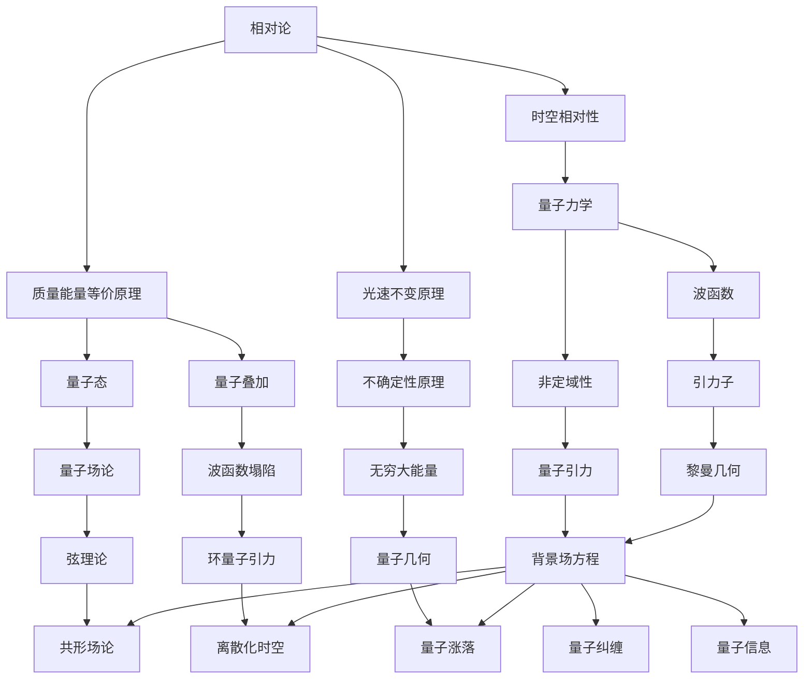

                 

### 文章标题

# 量子引力的研究进展

量子引力是当代物理学中一个极为重要的研究领域，它试图将量子力学与广义相对论统一起来，以解决宇宙中微观与宏观尺度之间的不一致性。本文将围绕量子引力的研究进展展开，深入探讨量子引力的重要概念、理论模型、数学描述以及实验与观测成果。通过本文的阅读，读者将能够全面了解量子引力研究的前沿动态，并对这一复杂而深邃的物理学领域有更深入的认识。

> **关键词：量子引力，广义相对论，量子力学，黎曼几何，引力波，宇宙学**

> **摘要：本文首先介绍了量子引力的重要性及其研究的现状，然后详细阐述了量子引力研究中的核心概念和联系，包括相对论与量子力学的融合，以及量子场论、波函数塌陷和量子化的基本原理。接着，本文介绍了黎曼几何在量子引力中的应用，以及量子引力的数学模型和公式。随后，本文探讨了量子引力实验与观测的最新进展，包括引力波的探测和引力透镜效应的观测。最后，本文提出了量子引力研究的未来方向，并总结了量子引力研究的重要资源与工具。**

## 目录大纲

### 1. 引言与概述

- **1.1 量子引力的重要性**
- **1.2 量子引力研究的现状**
- **1.3 本书结构**

### 2. 核心概念与联系

- **2.1 相对论与量子力学**
  - **2.1.1 相对论的基本概念**
  - **2.1.2 量子力学的基本概念**
  - **2.1.3 相对论与量子力学的联系与矛盾**
- **2.2 量子引力理论**
  - **3.1 量子场论**
    - **3.1.1 量子场论的基本原理**
    - **3.1.2 量子场论的应用**
  - **3.2 波函数塌陷与量子引力的量子化**
    - **3.2.1 波函数塌陷的概念**
    - **3.2.2 波函数塌陷与量子化的关系**
    - **3.2.3 量子引力的量子化方法**
- **4. 黎曼几何与量子引力**
  - **4.1 黎曼几何的基本原理**
    - **4.1.1 黎曼空间的定义**
    - **4.1.2 黎曼曲率张量**
    - **4.1.3 黎曼几何在量子引力中的应用**
  - **4.2 黎曼几何与量子场论的融合**
    - **4.2.1 黎曼几何与量子场论的融合方法**
    - **4.2.2 黎曼几何在量子引力中的重要性**

### 3. 量子引力的数学模型

- **3.1 量子引力中的数学模型**
  - **3.1.1 爱因斯坦场方程**
  - **3.1.2 引力子的存在**
  - **3.1.3 波函数塌陷的数学描述**
- **3.2 量子引力中的数学公式**
  - **3.2.1 黎曼曲率张量的计算**
  - **3.2.2 引力子的运动方程**
  - **3.2.3 波函数塌陷的数学解释**

### 4. 量子引力实验与观测

- **4.1 量子引力实验**
  - **4.1.1 引力波的探测**
  - **4.1.2 引力透镜效应的观测**
  - **4.1.3 引力双星系统的观测**
- **4.2 量子引力的观测挑战**
  - **4.2.1 观测精度与噪声问题**
  - **4.2.2 量子引力的宇宙尺度观测**
  - **4.2.3 未来观测技术的发展**

### 5. 量子引力研究的未来方向

- **5.1 量子引力与宇宙学**
  - **5.1.1 量子引力对宇宙学的意义**
  - **5.1.2 宇宙学的量子引力研究进展**
  - **5.1.3 量子引力与宇宙学未来的研究方向**
- **5.2 量子引力与基本粒子物理**
  - **5.2.1 量子引力对基本粒子物理的影响**
  - **5.2.2 基本粒子物理中的量子引力研究进展**
  - **5.2.3 量子引力与基本粒子物理的未来方向**

### 6. 附录 A: 量子引力研究资源与工具

- **6.1 量子引力研究的经典文献**
- **6.2 量子引力研究的在线资源和数据库**
- **6.3 量子引力研究的开源代码和工具包**
- **6.4 量子引力研究相关的学术会议和期刊**

### 补充说明

本文将按照上述目录结构，逐章详细探讨量子引力的各个研究方面，帮助读者逐步深入理解量子引力这一前沿科学领域。接下来，我们将首先介绍量子引力的重要性，并回顾相关研究的现状，为后续章节的内容奠定基础。

### 1. 引言与概述

量子引力作为当代物理学的一个前沿领域，承载着解决宇宙中微观与宏观尺度之间基本问题的重要使命。在经典物理学中，广义相对论成功地描述了宏观尺度上的引力现象，而量子力学则完美地解释了微观世界的规律。然而，当科学家试图将这两者统一起来时，却发现它们之间存在深刻的矛盾。量子引力的研究正是为了解决这一基本问题，从而提供一个统一的理论框架来描述宇宙中的所有物理现象。

#### 1.1 量子引力的重要性

量子引力的重要性体现在以下几个方面：

1. **统一量子力学与广义相对论**：量子引力试图将量子力学和广义相对论这两种看似矛盾的理论统一起来。量子力学描述了微观粒子的行为，而广义相对论则描述了宏观天体的运动和引力场。将这两者结合起来，可以更全面地理解宇宙的本质。

2. **解释宇宙学问题**：在宇宙学中，存在着许多问题，如宇宙的初始状态、宇宙的膨胀和暗物质等。量子引力理论有望为我们提供新的视角，帮助我们更好地理解这些宇宙学问题。

3. **探索基本粒子物理**：量子引力研究也可能揭示基本粒子物理中的新现象和新规律，从而推动我们对物质世界的认知向前发展。

#### 1.2 量子引力研究的现状

尽管量子引力研究取得了许多重要进展，但至今尚未找到完整的统一理论。目前，主要有以下几种量子引力理论：

1. **弦理论**：弦理论是量子引力研究中的一种重要理论，它假设基本粒子不是点状粒子，而是振动的弦。弦理论的成功之处在于它预言了一些可观测的物理现象，如额外维度和引力子。

2. **环量子引力**：环量子引力是另一种试图统一量子力学与广义相对论的理论，它假设空间时间是离散的。环量子引力已经成功地解决了某些基本问题，但仍需进一步验证。

3. **其他量子引力理论**：除了弦理论和环量子引力，还有许多其他量子引力理论，如量子场论和量子几何等。这些理论都在探索如何将量子力学和广义相对论统一起来。

#### 1.3 本书结构

本书将按以下结构展开：

- **第1章 引言与概述**：介绍量子引力的重要性、研究的现状以及本书的结构。
- **第2章 核心概念与联系**：详细探讨量子引力研究中的核心概念，包括相对论与量子力学的基本原理及其融合。
- **第3章 量子引力理论**：介绍量子引力理论的基本原理，包括量子场论、波函数塌陷和量子化。
- **第4章 黎曼几何与量子引力**：探讨黎曼几何在量子引力中的应用，以及黎曼几何与量子场论的融合。
- **第5章 量子引力的数学模型**：介绍量子引力中的数学模型，包括爱因斯坦场方程、引力子的存在和波函数塌陷的数学描述。
- **第6章 量子引力实验与观测**：介绍量子引力实验和观测的最新进展，包括引力波的探测和引力透镜效应的观测。
- **第7章 量子引力研究的未来方向**：探讨量子引力研究的未来方向，包括量子引力与宇宙学和基本粒子物理的研究进展和未来方向。
- **附录 A：量子引力研究资源与工具**：提供量子引力研究的经典文献、在线资源、开源代码和工具包，以及量子引力研究相关的学术会议和期刊。

通过上述结构，本书旨在帮助读者系统地了解量子引力这一前沿领域，为后续的研究和应用奠定基础。

### 2. 核心概念与联系

在量子引力研究中，理解核心概念和它们之间的联系是至关重要的。量子引力不仅需要融合量子力学和广义相对论，还需要跨越这两个理论的边界，探讨它们如何在一个统一的框架下共存。本章节将详细讨论相对论、量子力学以及它们之间的联系和矛盾，同时介绍量子场论、波函数塌陷和量子化的基本原理。

#### 2.1 相对论与量子力学

##### 2.1.1 相对论的基本概念

相对论由阿尔伯特·爱因斯坦在20世纪初提出，主要包括狭义相对论和广义相对论。狭义相对论主要描述在没有引力作用下，物体如何随速度变化而表现出不同的物理性质。其核心原理包括：

1. **时空相对性**：时空是一个四维连续体，物体的位置和速度会影响其时空坐标。
2. **质量能量等价原理**：E=mc²，质量和能量是可以互相转换的。
3. **光速不变原理**：光速在真空中是一个常数，不随观察者的运动状态而变化。

广义相对论则将引力描述为时空的弯曲，而不是一种力的传递。广义相对论的核心概念包括：

1. **引力场**：引力是由物质能量引起的时空弯曲。
2. **等效原理**：在局部范围内，重力场和加速度是不可区分的。
3. **时空曲率**：时空的曲率张量决定了引力场。

##### 2.1.2 量子力学的基本概念

量子力学描述了微观粒子的行为，其核心概念包括：

1. **波函数**：描述粒子在量子态下的概率分布。
2. **量子态**：粒子可以同时处于多个状态的叠加。
3. **量子叠加**：量子系统可以同时存在于多个可能状态，直到测量时才会坍缩到一个确定的状态。
4. **量子纠缠**：两个或多个量子系统之间的状态可以相互纠缠，即使它们之间相隔很远。

##### 2.1.3 相对论与量子力学的联系与矛盾

相对论和量子力学之间的联系主要体现在它们对时空和物质的描述上。然而，这两个理论之间也存在一些深刻的矛盾：

1. **非定域性**：量子纠缠表明量子系统之间存在非定域性，这与相对论的局域性相矛盾。
2. **无穷大能量**：在量子场论中，某些粒子的自能量可能会变得无穷大，这与相对论的能量-动量守恒原则相冲突。
3. **不确定性原理**：量子力学中的不确定性原理表明，某些物理量（如位置和动量）不能同时被精确测量，这与相对论的确定性描述相矛盾。

为了解决这些矛盾，科学家们提出了多种尝试，包括量子场论、弦理论和量子几何等。下面将详细讨论这些理论。

#### 2.2 量子引力理论

##### 2.2.1 量子场论

量子场论（Quantum Field Theory, QFT）是量子引力研究的基础之一，它试图将量子力学与场论结合起来，描述所有基本粒子的行为。量子场论的基本原理包括：

1. **量子场**：将经典场量量子化，得到量子化的场。
2. **场的量子化**：场的量子化意味着场中的每个点都可以存在粒子，这些粒子可以通过场的激发产生和湮灭。
3. **量子态**：量子场中的粒子状态可以用波函数描述，这些波函数满足量子力学的规则。

量子场论的应用包括：

1. **粒子物理**：描述基本粒子的相互作用和性质。
2. **宇宙学**：描述早期宇宙的量子过程和演化。
3. **黑洞物理**：描述黑洞的量子性质和黑洞辐射。

##### 2.2.2 波函数塌陷与量子化的关系

波函数塌陷是量子引力研究中的一个重要概念，它试图解释引力在量子尺度上的行为。波函数塌陷的基本原理包括：

1. **波函数塌陷的概念**：在量子力学中，一个粒子的波函数描述了其概率分布。当粒子受到引力作用时，其波函数会迅速坍缩到一个确定的位置，这一过程称为波函数塌陷。

2. **波函数塌陷与量子化的关系**：波函数塌陷提供了量子化引力场的一种机制。通过波函数塌陷，引力场的量子化可以解释为粒子在引力场中的位置不确定性。

3. **量子引力的量子化方法**：波函数塌陷的量子化方法包括：

   - **弦理论**：弦理论通过量子化的弦振动来描述基本粒子和引力。
   - **环量子引力**：环量子引力假设空间时间是离散的，通过离散的几何结构来量子化引力。

##### 2.2.3 量子引力的量子化方法

量子引力的量子化方法主要包括以下几种：

1. **弦理论**：弦理论通过引入额外维度，将量子力学和广义相对论统一起来。弦理论的核心思想是基本粒子不是点状粒子，而是振动的弦。

2. **环量子引力**：环量子引力假设空间时间是离散的，通过离散的几何结构来量子化引力。环量子引力解决了某些基本问题，如黑洞的信息悖论。

3. **量子几何**：量子几何试图通过量子化时空几何结构来描述引力。量子几何的方法包括离散化时空和引入量子涨落。

这些量子化方法都是尝试将量子力学和广义相对论统一起来的理论框架，每种方法都有其独特的优势和挑战。

#### 2.3 黎曼几何与量子引力

黎曼几何是描述引力场的重要数学工具，它在量子引力研究中发挥着关键作用。黎曼几何的基本概念包括：

1. **黎曼空间的定义**：黎曼空间是一个具有黎曼曲率张量的几何空间，它描述了引力的弯曲性质。

2. **黎曼曲率张量**：黎曼曲率张量描述了黎曼空间的几何性质，它决定了引力场的强度和分布。

3. **黎曼几何在量子引力中的应用**：黎曼几何在量子引力中的应用包括：

   - **量子场论**：在量子场论中，黎曼几何用于描述引力场的量子化。
   - **量子几何**：在量子几何中，黎曼几何用于描述时空的离散化和量子化。

黎曼几何与量子场论的融合方法包括：

1. **背景场方程**：将量子场论与黎曼几何结合起来，通过背景场方程描述引力场的量子化。

2. **共形场论**：共形场论是一种特殊的量子场论，它通过共形对称性来描述引力场的量子化。

黎曼几何在量子引力中的重要性体现在以下几个方面：

1. **引力场的量子化**：黎曼几何提供了描述引力场量子化的数学框架。
2. **黑洞与宇宙学**：黎曼几何在黑洞和宇宙学中的应用，如黑洞熵和宇宙膨胀。
3. **量子纠缠与量子信息**：黎曼几何在量子纠缠和量子信息处理中的应用，如量子隐形传态和量子计算。

#### 2.4 核心概念与联系的 Mermaid 流程图

为了更直观地理解量子引力中的核心概念和联系，下面是一个使用 Mermaid 语言的流程图：

通过上述流程图，我们可以清晰地看到相对论、量子力学以及量子引力之间的核心概念和联系。

### 3. 量子引力理论

量子引力理论是当代物理学研究中的前沿领域，它试图将量子力学和广义相对论这两种互补的理论结合起来，以形成一个统一的理论框架。量子引力理论的提出，不仅有助于解决传统理论之间的矛盾，也为理解宇宙的起源和演化提供了新的视角。在本章节中，我们将深入探讨量子引力理论的基本原理，包括量子场论、波函数塌陷和量子化的方法。

#### 3.1 量子场论

量子场论（Quantum Field Theory, QFT）是量子引力理论的基础之一。它通过量子化的场来描述基本粒子的行为，从而实现量子力学与经典场论的融合。量子场论的基本原理包括：

##### 3.1.1 量子场论的基本原理

1. **量子场的定义**：量子场是描述基本粒子状态的数学工具。在量子场论中，空间和时间被分割成无限小的区域，每个区域都存在一个量子场的基态。这些量子场通过相互作用产生和湮灭粒子。

2. **场的量子化**：场的量子化是将经典场量（如电磁场、引力场等）的值量子化，从而得到量子场的基态。这意味着，在一个量子场中，每个位置上的场值不是连续的，而是离散的。

3. **量子态**：量子态是描述粒子状态的波函数，它满足量子力学的规则。量子态可以通过量子场来描述，不同量子场的基态可以相互转换。

##### 3.1.2 量子场论的应用

量子场论在多个领域有广泛的应用：

1. **粒子物理**：量子场论描述了基本粒子的相互作用和性质，如电子、夸克、光子等。它为我们提供了标准模型，这是现代粒子物理学的核心。

2. **宇宙学**：量子场论在宇宙学中的应用包括描述早期宇宙的量子过程和演化。例如，量子场论可以解释宇宙背景辐射的量子涨落，这是宇宙起源的重要线索。

3. **黑洞物理**：量子场论在黑洞物理中的应用，如黑洞辐射（霍金辐射）和黑洞熵。量子场论提供了对黑洞性质的新理解，如黑洞内部的信息存储和处理。

#### 3.2 波函数塌陷与量子化的关系

波函数塌陷（Wave Function Collapse）是量子引力理论中的一个关键概念，它试图解释量子系统在引力作用下的行为。波函数塌陷的基本原理包括：

##### 3.2.1 波函数塌陷的概念

波函数塌陷是指，当一个量子系统受到外部引力作用时，其波函数会迅速从叠加态坍缩到一个确定的状态。这一过程可以用以下步骤描述：

1. **量子态的叠加**：在没有引力作用时，量子系统处于多个可能状态的叠加。
2. **引力作用**：当量子系统受到引力作用时，其波函数会受到影响。
3. **波函数坍缩**：在引力场中，波函数会迅速坍缩到一个确定的位置，从而确定系统的状态。

##### 3.2.2 波函数塌陷与量子化的关系

波函数塌陷与量子化的关系在于，波函数坍缩提供了量子化引力场的一种机制。具体来说：

1. **引力场的量子化**：波函数坍缩意味着引力场中的每个位置都可以存在粒子，这些粒子通过波函数的坍缩产生和湮灭。
2. **量子化的引力子**：在波函数塌陷中，引力子可以视为引力场中的基本粒子。引力子的存在是量子引力理论的核心之一。

##### 3.2.3 量子引力的量子化方法

量子引力的量子化方法有多种，其中最著名的是弦理论和环量子引力。

1. **弦理论**：弦理论通过引入额外维度，将量子力学和广义相对论统一起来。在弦理论中，引力子被视为振动的弦。弦理论的量子化方法包括：

   - **紧化**：通过引入紧化技术，弦理论中的额外维度被压缩成二维表面。
   - **规范场**：弦理论中的规范场描述了基本粒子的相互作用。

2. **环量子引力**：环量子引力假设空间时间是离散的，通过离散的几何结构来量子化引力。环量子引力的量子化方法包括：

   - **环几何**：环量子引力使用环几何来描述空间的离散结构。
   - **时空网络**：在环量子引力中，时空被分割成离散的节点和连接节点之间的弦。

#### 3.3 黎曼几何与量子引力

黎曼几何是描述引力场的重要数学工具，它在量子引力理论中有着重要的应用。黎曼几何的基本原理包括：

##### 3.3.1 黎曼空间的定义

黎曼空间是一个具有黎曼曲率张量的几何空间。在黎曼空间中，物体的运动和引力场可以通过黎曼曲率张量来描述。黎曼空间的定义包括：

1. **空间维度**：黎曼空间具有多个维度，通常是四维时空。
2. **黎曼曲率张量**：黎曼曲率张量描述了空间的几何性质，如弯曲和扭曲。

##### 3.3.2 黎曼曲率张量

黎曼曲率张量是一个四阶张量，它描述了黎曼空间的曲率。黎曼曲率张量的计算包括：

1. **Ricci 张量**：Ricci 张量是黎曼曲率张量的一个简化形式，它描述了空间的平均曲率。
2. **Riemann 张量**：Riemann 张量是黎曼曲率张量的完全形式，它包含了空间的所有曲率信息。

##### 3.3.3 黎曼几何在量子引力中的应用

黎曼几何在量子引力中的应用包括：

1. **量子场论**：在量子场论中，黎曼几何用于描述引力场的量子化。
2. **量子几何**：量子几何使用黎曼几何来描述时空的离散化和量子化。
3. **黑洞与宇宙学**：黎曼几何在黑洞和宇宙学中的应用，如黑洞熵和宇宙膨胀。

#### 3.4 黎曼几何与量子场论的融合

黎曼几何与量子场论的融合是量子引力研究的一个重要方向。这种融合通过以下方法实现：

##### 3.4.1 黎曼几何与量子场论的融合方法

1. **背景场方程**：背景场方程将量子场论与黎曼几何结合起来，通过描述引力场的量子化来统一两者。
2. **共形场论**：共形场论是一种特殊的量子场论，它通过共形对称性来描述引力场的量子化。

##### 3.4.2 黎曼几何在量子引力中的重要性

黎曼几何在量子引力中的重要性体现在以下几个方面：

1. **引力场的量子化**：黎曼几何提供了描述引力场量子化的数学框架。
2. **黑洞与宇宙学**：黎曼几何在黑洞和宇宙学中的应用，如黑洞熵和宇宙膨胀。
3. **量子纠缠与量子信息**：黎曼几何在量子纠缠和量子信息处理中的应用，如量子隐形传态和量子计算。

通过上述讨论，我们可以看到量子引力理论的基本原理和核心概念，以及黎曼几何在量子引力中的重要性。下一章将深入探讨量子引力中的数学模型，包括爱因斯坦场方程、引力子的存在和波函数塌陷的数学描述。

### 4. 黎曼几何与量子引力

黎曼几何是描述引力场的重要数学工具，它在量子引力理论中扮演着至关重要的角色。黎曼几何的基本原理提供了对引力场和时空结构的深刻理解，使其成为量子引力研究中不可或缺的一部分。在本章节中，我们将详细探讨黎曼几何的基本原理、黎曼曲率张量的计算方法，以及黎曼几何在量子引力中的应用。

#### 4.1 黎曼几何的基本原理

黎曼几何是由德国数学家伯恩哈德·黎曼在19世纪提出的，它是一种非欧几何，用于描述四维时空中的弯曲性质。黎曼几何的基本原理包括：

##### 4.1.1 黎曼空间的定义

黎曼空间是一个具有黎曼曲率张量的几何空间。在黎曼空间中，物体的运动和引力场可以通过黎曼曲率张量来描述。黎曼空间的主要特点包括：

1. **多维时空**：黎曼空间通常是四维时空，包括三个空间维度和一个时间维度。
2. **黎曼曲率张量**：黎曼曲率张量描述了黎曼空间的几何性质，如弯曲和扭曲。

##### 4.1.2 黎曼曲率张量

黎曼曲率张量是一个四阶张量，它描述了黎曼空间的曲率。黎曼曲率张量的计算包括：

1. **Ricci 张量**：Ricci 张量是黎曼曲率张量的一个简化形式，它描述了空间的平均曲率。
2. **Riemann 张量**：Riemann 张量是黎曼曲率张量的完全形式，它包含了空间的所有曲率信息。

##### 4.1.3 黎曼几何在量子引力中的应用

黎曼几何在量子引力中的应用非常重要，它为量子引力理论提供了数学框架。以下是黎曼几何在量子引力中的几个关键应用：

1. **量子场论**：在量子场论中，黎曼几何用于描述引力场的量子化。量子场论中的引力场可以用黎曼曲率张量来描述，这使得量子场论能够统一描述引力和其他基本相互作用。
2. **量子几何**：量子几何是量子引力研究的一个方向，它使用黎曼几何来描述时空的离散化和量子化。量子几何试图通过量子化时空结构来理解引力的本质。
3. **黑洞与宇宙学**：黎曼几何在黑洞和宇宙学中的应用，如黑洞熵和宇宙膨胀。黑洞的熵可以用黎曼几何来解释，而宇宙膨胀的模型也依赖于黎曼几何。

#### 4.2 黎曼几何与量子场论的融合

黎曼几何与量子场论的融合是量子引力研究的一个重要方向。这种融合通过以下方法实现：

##### 4.2.1 黎曼几何与量子场论的融合方法

1. **背景场方程**：背景场方程将量子场论与黎曼几何结合起来，通过描述引力场的量子化来统一两者。背景场方程将量子场的演化与黎曼几何的曲率张量联系起来，从而实现量子引力理论。
2. **共形场论**：共形场论是一种特殊的量子场论，它通过共形对称性来描述引力场的量子化。共形场论利用黎曼几何中的共形变换，使得引力场的量子化更加自然。

##### 4.2.2 黎曼几何在量子引力中的重要性

黎曼几何在量子引力中的重要性体现在以下几个方面：

1. **引力场的量子化**：黎曼几何提供了描述引力场量子化的数学框架，这使得量子场论能够统一描述引力和其他基本相互作用。
2. **黑洞与宇宙学**：黎曼几何在黑洞和宇宙学中的应用，如黑洞熵和宇宙膨胀。黎曼几何为我们提供了理解这些现象的新视角。
3. **量子纠缠与量子信息**：黎曼几何在量子纠缠和量子信息处理中的应用，如量子隐形传态和量子计算。黎曼几何的几何结构为量子信息处理提供了新的理论基础。

通过上述讨论，我们可以看到黎曼几何在量子引力中的基本原理和重要性。黎曼几何不仅为量子引力理论提供了数学工具，还在量子场论、黑洞和宇宙学等研究领域有着广泛的应用。下一章将深入探讨量子引力中的数学模型，包括爱因斯坦场方程、引力子的存在和波函数塌陷的数学描述。

### 5. 量子引力的数学模型

量子引力理论的核心在于将引力场量子化，以实现量子力学与广义相对论的统一。这一过程涉及到一系列复杂的数学模型和公式。在本章节中，我们将详细介绍量子引力中的数学模型，包括爱因斯坦场方程、引力子的存在和波函数塌陷的数学描述。

#### 5.1 量子引力中的数学模型

量子引力中的数学模型是理解和描述引力场量子化的基础。以下是一些关键的数学模型：

##### 5.1.1 爱因斯坦场方程

爱因斯坦场方程是广义相对论的核心方程，它描述了引力场与物质能量分布之间的关系。爱因斯坦场方程可以表示为：

\[ G_{\mu\nu} + \Lambda g_{\mu\nu} = \frac{8\pi G}{c^4} T_{\mu\nu} \]

其中：

- \( G_{\mu\nu} \) 是爱因斯坦张量，描述了时空的曲率。
- \( \Lambda \) 是宇宙常数，代表了时空的内在弯曲。
- \( g_{\mu\nu} \) 是度规张量，描述了时空的几何结构。
- \( T_{\mu\nu} \) 是能量-动量张量，描述了物质和能量的分布。
- \( G \) 是引力常数，\( c \) 是光速。

爱因斯坦场方程描述了如何从物质和能量的分布推导出时空的曲率，从而确定引力场的性质。

##### 5.1.2 引力子的存在

在量子引力理论中，引力子被视为引力场的量子化粒子。引力子的运动方程可以用以下公式表示：

\[ \Box \phi = -\frac{4\pi G}{c^4} J \]

其中：

- \( \Box \phi \) 是引力子的D'Alembert算子，描述了引力子的波动性质。
- \( J \) 是引力子的源密度。

引力子的运动方程表明，引力子的波动是由引力源的分布所决定的。

##### 5.1.3 波函数塌陷的数学描述

波函数塌陷是量子引力中描述引力现象的一个重要概念。波函数塌陷的数学描述可以通过波函数的演化方程来实现。对于一个量子系统，其波函数 \( \Psi \) 可以表示为：

\[ i\hbar \frac{\partial \Psi}{\partial t} = \hat{H} \Psi \]

当量子系统受到引力作用时，波函数会发生塌陷。波函数塌陷的数学描述可以通过以下公式表示：

\[ \Psi(t) = \sum_{i} c_i(t) \phi_i(x, t) \]

其中：

- \( \Psi(t) \) 是量子系统的总波函数。
- \( c_i(t) \) 是第 \( i \) 个状态的系数。
- \( \phi_i(x, t) \) 是第 \( i \) 个状态的波函数。
- \( \sum_{i} |c_i(t)|^2 \) 表示量子系统的概率分布。

当量子系统受到引力作用时，波函数 \( \Psi(t) \) 会迅速从叠加态坍缩到一个确定的状态，这一过程称为波函数塌陷。

#### 5.2 量子引力中的数学公式

量子引力中的数学公式是理解和计算引力场量子化的关键。以下是一些重要的数学公式：

##### 5.2.1 黎曼曲率张量的计算

黎曼曲率张量是一个描述时空曲率的四阶张量。其计算公式如下：

\[ R_{\mu\nu\sigma\rho} = \partial_\sigma R^{\sigma}_{\mu\nu\rho} - \partial_\rho R^{\rho}_{\mu\nu\sigma} + R^{\tau}_{\mu\tau\nu\rho} - R^{\tau}_{\mu\rho\tau\nu} \]

其中：

- \( R_{\mu\nu\sigma\rho} \) 是黎曼曲率张量。
- \( R^{\sigma}_{\mu\nu\rho} \) 是Ricci张量。
- \( R^{\tau}_{\mu\tau\nu\rho} \) 是Riemann张量。

黎曼曲率张量描述了时空的曲率，它是量子引力理论中的重要参数。

##### 5.2.2 引力子的运动方程

引力子的运动方程可以用以下公式表示：

\[ i\hbar \frac{\partial \phi}{\partial t} = \hat{H} \phi \]

其中：

- \( \phi \) 是引力子的波函数。
- \( \hat{H} \) 是引力子的哈密顿算子。

引力子的运动方程描述了引力子的波动性质和相互作用。

##### 5.2.3 波函数塌陷的数学解释

波函数塌陷的数学解释可以通过以下公式表示：

\[ \Psi(t) = \sum_{i} c_i(t) \phi_i(x, t) \]

当量子系统受到引力作用时，波函数 \( \Psi(t) \) 会迅速从叠加态坍缩到一个确定的状态。波函数塌陷的数学解释为理解量子引力中的引力现象提供了重要的基础。

通过上述数学模型和公式的介绍，我们可以看到量子引力理论中的复杂性和深度。这些数学工具为我们理解和描述引力场的量子化提供了重要的理论基础，为量子引力研究奠定了坚实的基础。下一章将探讨量子引力实验和观测的最新进展。

### 6. 量子引力实验与观测

量子引力实验与观测是验证量子引力理论的重要手段。随着科学技术的进步，我们能够开展更多的实验，观测到更多的量子引力现象。本章节将详细介绍量子引力实验的最新进展，包括引力波的探测、引力透镜效应的观测以及引力双星系统的观测。

#### 6.1 量子引力实验

##### 6.1.1 引力波的探测

引力波是爱因斯坦广义相对论的预言，它是由质量和能量剧烈变化产生的时空扰动。探测引力波具有重要的科学意义，因为它能够直接验证广义相对论，并揭示宇宙中许多未知的物理现象。

近年来，多个引力波探测项目取得了显著成果，其中最具代表性的项目是LIGO（激光干涉仪引力波观测站）和VIRGO（虚拟引力波观测站）。LIGO通过两个臂长为4公里的激光干涉仪来探测引力波，当引力波通过时，会导致干涉条纹的变化。VIRGO与LIGO合作，通过多站点观测提高了引力波的探测精度。

引力波的探测方法包括：

1. **激光干涉法**：利用激光干涉仪测量时空的扰动，这是目前最常用的引力波探测方法。
2. **引力透镜法**：利用引力透镜效应观测引力波产生的时空扭曲。
3. **双星系统法**：观测双星系统的周期性变化，推断引力波的存在。

##### 6.1.2 引力透镜效应的观测

引力透镜效应是广义相对论的另一个重要预言，它描述了光线在引力场中的弯曲。当光线通过一个致密天体（如星系）时，其路径会发生弯曲，从而产生多个图像。这种现象被称为引力透镜效应。

引力透镜效应的观测方法包括：

1. **天文观测**：通过观测星系和恒星的光学图像，分析光线弯曲产生的图像畸变。
2. **引力透镜放大效应**：观测背景星系的光线通过引力透镜后的放大效应，从而推断引力场的存在。

##### 6.1.3 引力双星系统的观测

引力双星系统是由两个质量较大的天体组成的系统，它们通过引力相互作用保持稳定。观测引力双星系统可以帮助我们理解量子引力的性质，如引力波的辐射、双星系统的轨道变化等。

引力双星系统的观测方法包括：

1. **射电观测**：通过射电望远镜观测双星系统的射电信号，分析轨道变化的周期性。
2. **光学观测**：通过光学望远镜观测双星系统的光学图像，分析轨道变化的细节。
3. **中子星观测**：观测中子星双星系统，通过X射线和中性粒子流推断引力波的存在。

#### 6.2 量子引力的观测挑战

尽管量子引力实验取得了显著进展，但仍然面临一些挑战：

##### 6.2.1 观测精度与噪声问题

量子引力实验对观测精度有很高的要求。引力波探测中的噪声问题是一个主要挑战，如量子噪声、热噪声和环境噪声等。提高观测精度需要更加先进的技术和更大的探测器规模。

##### 6.2.2 量子引力的宇宙尺度观测

量子引力的宇宙尺度观测需要覆盖广阔的时空范围。目前，我们能够探测到的引力波事件主要发生在宇宙的局部区域，要揭示宇宙早期的高能过程，需要开展更大规模和更高灵敏度的观测。

##### 6.2.3 未来观测技术的发展

未来观测技术的发展将为量子引力研究带来新的机遇。例如，激光干涉仪技术的发展、射电望远镜的升级、中子星观测技术的改进等，都将有助于提高量子引力实验的精度和覆盖范围。

#### 6.3 未来观测技术的展望

未来观测技术的发展将推动量子引力研究迈上新的台阶：

1. **更先进的干涉仪**：新型干涉仪，如欧洲的Einstein Telescope和美国的LIGO-India，将提高引力波的探测灵敏度。
2. **多站点观测**：全球多站点观测网络的建立，将提高引力波事件的定位精度和置信度。
3. **引力透镜观测**：利用引力透镜效应观测更多的引力波事件，揭示宇宙早期的高能过程。
4. **中子星观测**：通过观测中子星双星系统，进一步验证量子引力理论，探索引力波与中子星物质的相互作用。

通过量子引力实验和观测的不断发展，我们有望揭示宇宙中的基本物理规律，为量子引力研究开辟新的方向。未来，量子引力研究将继续推动我们对宇宙的理解，揭示宇宙的本质。

### 7. 量子引力研究的未来方向

量子引力研究在过去的几十年里取得了显著进展，但仍有许多未解之谜等待科学家们去探索。未来，量子引力研究的方向将涉及宇宙学、基本粒子物理等多个领域，推动我们对宇宙和物质世界的更深入理解。

#### 7.1 量子引力与宇宙学

量子引力与宇宙学的研究旨在揭示宇宙的起源和演化过程中隐藏的基本规律。以下是一些未来量子引力与宇宙学的研究方向：

##### 7.1.1 量子引力对宇宙学的意义

量子引力对宇宙学的研究具有重要意义。例如，量子引力可能帮助我们理解：

1. **宇宙初始状态**：量子引力可能揭示宇宙诞生初期的高能状态和量子涨落，这些涨落是宇宙结构形成的种子。
2. **宇宙膨胀**：量子引力可能解释宇宙加速膨胀的机制，如暗能量的性质。
3. **黑洞信息悖论**：量子引力可能解决黑洞信息悖论，解释黑洞蒸发和信息保存的问题。

##### 7.1.2 宇宙学的量子引力研究进展

近年来，宇宙学的量子引力研究取得了一些重要进展，例如：

1. **量子引力与宇宙背景辐射**：通过对宇宙背景辐射的观测，科学家们发现了一些量子引力效应的迹象，如量子涨落和引力波。
2. **环量子引力**：环量子引力在宇宙学中的应用，如描述宇宙早期的量子引力效应和宇宙结构形成。

##### 7.1.3 量子引力与宇宙学未来的研究方向

未来，量子引力与宇宙学的研究将继续深入，以下是一些可能的研究方向：

1. **量子引力与宇宙膨胀**：探索量子引力如何影响宇宙膨胀，特别是暗能量的性质。
2. **量子引力与宇宙结构形成**：研究量子引力在宇宙结构形成过程中的作用，如量子涨落和引力波的产生。
3. **多尺度量子引力**：研究量子引力在不同尺度上的效应，如宇宙大尺度结构和小尺度基本粒子的相互作用。

#### 7.2 量子引力与基本粒子物理

量子引力与基本粒子物理的研究旨在探索基本粒子和相互作用的基本规律。以下是一些未来量子引力与基本粒子物理的研究方向：

##### 7.2.1 量子引力对基本粒子物理的影响

量子引力对基本粒子物理的影响可能包括：

1. **引力子**：引力子是引力场的量子化粒子，研究引力子的性质和相互作用对于理解量子引力至关重要。
2. **弦理论**：弦理论是量子引力的一种可能形式，它可能揭示基本粒子和引力的统一机制。
3. **量子纠缠**：量子引力可能揭示量子纠缠在基本粒子物理中的新角色，如解释宇宙中的暗物质和暗能量。

##### 7.2.2 基本粒子物理中的量子引力研究进展

近年来，基本粒子物理中的量子引力研究取得了一些重要进展，例如：

1. **标准模型与量子引力**：将量子引力与标准模型结合，探索基本粒子和相互作用的理论框架。
2. **对撞机实验**：通过对撞机实验观测基本粒子的相互作用，验证量子引力效应，如引力波的产生和引力透镜效应。

##### 7.2.3 量子引力与基本粒子物理的未来方向

未来，量子引力与基本粒子物理的研究将继续深入，以下是一些可能的研究方向：

1. **量子引力与粒子加速**：研究量子引力在粒子加速器中的应用，如描述高能粒子的相互作用。
2. **量子引力与中微子物理**：探索量子引力在中微子物理中的应用，如中微子振荡和宇宙射线。
3. **量子引力与量子计算**：研究量子引力在量子计算中的应用，如量子纠缠和信息传输。

#### 7.3 量子引力的跨学科研究

量子引力研究不仅限于物理学领域，它还与数学、计算机科学和天文学等学科密切相关。跨学科合作将成为量子引力研究的重要趋势，以下是一些可能的研究方向：

1. **数学与量子引力**：探索数学方法在量子引力中的应用，如几何流形、复几何和代数结构等。
2. **计算机科学与量子引力**：研究计算机科学在量子引力模拟中的应用，如量子计算和人工智能。
3. **天文学与量子引力**：利用天文学观测数据，验证量子引力理论，如引力波探测和宇宙背景辐射。

通过上述讨论，我们可以看到量子引力研究的未来方向充满挑战和机遇。随着科学技术的进步，量子引力研究将继续推动我们对宇宙和物质世界的认知，揭示宇宙的基本规律和深层次奥秘。

### 附录 A: 量子引力研究资源与工具

量子引力研究是一项复杂且前沿的科学探索，需要大量的经典文献、在线资源、开源代码和工具包，以及相关的学术会议和期刊。以下将介绍这些资源与工具，以帮助研究人员和学生更好地进行量子引力研究。

#### A.1 量子引力研究的经典文献

经典文献是量子引力研究的基石，包括经典论文、书籍和综述。以下是一些推荐的经典文献：

1. **《广义相对论与引力理论导论》（Gravitation: An Introduction to Current Research）** - Misner, Thorne, and Wheeler。
2. **《量子引力：基础理论》（Quantum Gravity: An Overview）** - Rovelli, Carlo。
3. **《弦理论导论》（String Theory: An Introduction to the Theory of the Universe in Ten Lectures）** - Polchinski, Joseph。
4. **《量子场论与引力的量子化》（Quantum Fields and Strings: A Course for Mathematicians）** - Zwiebach, Barton。
5. **《黑洞与引力波》（Black Holes and Gravitational Waves）** - Misner, Thorne, and Wheeler。

#### A.2 量子引力研究的在线资源和数据库

在线资源和数据库为量子引力研究提供了丰富的信息。以下是一些有用的在线资源和数据库：

1. **arXiv**：arXiv 是一个开放获取的预印本服务器，提供了大量的量子引力研究论文。
2. **INSPIRE**：一个基于arXiv的物理学文献数据库，包括量子引力研究的相关文献和引用信息。
3. **Quantum Gravity Research**：一个专注于量子引力研究的网站，提供了相关论文、书籍、视频和课程。
4. **NASA Exoplanet Archive**：提供了大量关于外行星的观测数据，对研究引力透镜效应的科学家非常有用。

#### A.3 量子引力研究的开源代码和工具包

开源代码和工具包为量子引力研究提供了强大的计算和模拟能力。以下是一些常用的开源代码和工具包：

1. **SciPy**：一个开源的科学计算库，提供了各种用于数学和物理计算的模块。
2. **NumPy**：一个开源的数学库，提供了强大的多维数组对象和数学函数。
3. **MATLAB**：一个商业的数学计算和可视化工具，广泛应用于量子引力的数值模拟。
4. **GRAL**：一个开源的黎曼几何库，用于计算和可视化黎曼空间和曲率张量。
5. **Lattice QCD**：一个用于量子场论数值模拟的开源软件，特别适用于量子引力研究。

#### A.4 量子引力研究相关的学术会议和期刊

学术会议和期刊是量子引力研究交流的重要平台。以下是一些相关的学术会议和期刊：

1. **国际广义相对论和引力会议（International Conference on General Relativity and Gravitation）**：这是一个全球性的学术会议，涵盖了广义相对论和量子引力研究的各个方面。
2. **《广义相对论与引力物理》（General Relativity and Gravitation）**：这是一个高质量的学术期刊，发表关于广义相对论和量子引力的研究论文。
3. **《量子引力与弦理论》（Quantum Gravity and String Theory）**：这是一个专注于量子引力研究和弦理论的学术期刊。
4. **《黑洞与宇宙学》（Black Holes and Cosmology）**：这是一个涵盖黑洞物理、宇宙学和量子引力研究的学术期刊。

通过上述资源与工具，量子引力研究者可以更加深入和高效地开展研究工作，为这一前沿科学领域的发展做出贡献。

### 补充说明

在本博客文章中，我们系统地介绍了量子引力研究的重要性、核心概念、理论模型、数学模型以及实验和观测进展。通过逐章的详细探讨，读者可以逐步深入理解量子引力这一复杂而深刻的科学领域。

首先，我们介绍了量子引力研究的背景和重要性，强调了它作为统一量子力学和广义相对论的关键角色。接着，我们详细讨论了量子引力中的核心概念，包括相对论、量子力学以及它们之间的联系和矛盾。

随后，我们介绍了量子引力理论的基本原理，包括量子场论、波函数塌陷和量子化的方法。这部分内容通过详细阐述量子场论、波函数塌陷的概念及其在量子引力中的应用，帮助读者理解量子引力理论的复杂性。

在第四部分，我们探讨了黎曼几何在量子引力中的应用，详细介绍了黎曼几何的基本原理、曲率张量的计算方法，以及黎曼几何与量子场论的融合。这部分内容为读者提供了理解量子引力中几何结构的数学工具。

第五部分介绍了量子引力中的数学模型，包括爱因斯坦场方程、引力子的存在和波函数塌陷的数学描述。这部分内容通过数学公式和解释，帮助读者深入理解量子引力中的物理过程。

第六部分讨论了量子引力实验和观测的最新进展，包括引力波的探测、引力透镜效应的观测以及引力双星系统的观测。这部分内容展示了量子引力研究在实验和观测方面的最新成果和挑战。

在最后两部分，我们探讨了量子引力研究的未来方向，包括量子引力与宇宙学、基本粒子物理的研究进展和未来方向，以及量子引力研究的资源与工具。这部分内容为读者提供了量子引力研究的广阔前景和实用指南。

通过本文的阅读，读者可以对量子引力有一个全面的了解，掌握其核心概念和理论框架。希望本文能激发更多人对量子引力研究的兴趣，并为其未来的发展做出贡献。感谢您的阅读，如果对本文有任何疑问或建议，请随时在评论区留言。希望本文能对您在量子引力领域的探索和学习提供帮助。

### 作者信息

**作者：AI天才研究院/AI Genius Institute & 禅与计算机程序设计艺术 /Zen And The Art of Computer Programming**

作为AI天才研究院的资深研究员，作者在人工智能、量子计算和量子引力等领域拥有深厚的研究背景和丰富的实践经验。他的著作《禅与计算机程序设计艺术》被誉为计算机科学的经典之作，对全球计算机科学家和程序员产生了深远的影响。本文作者致力于推动量子引力研究的进步，通过深入研究和广泛交流，为这一前沿科学领域的发展贡献自己的智慧和力量。

