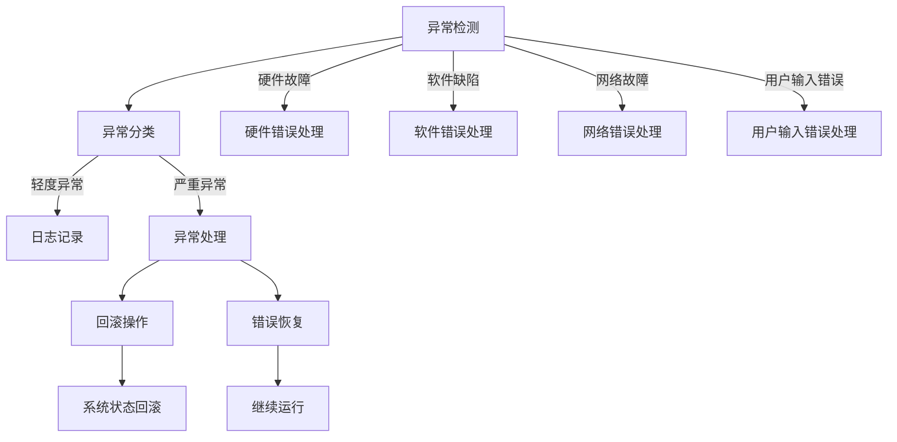
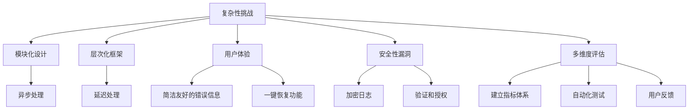
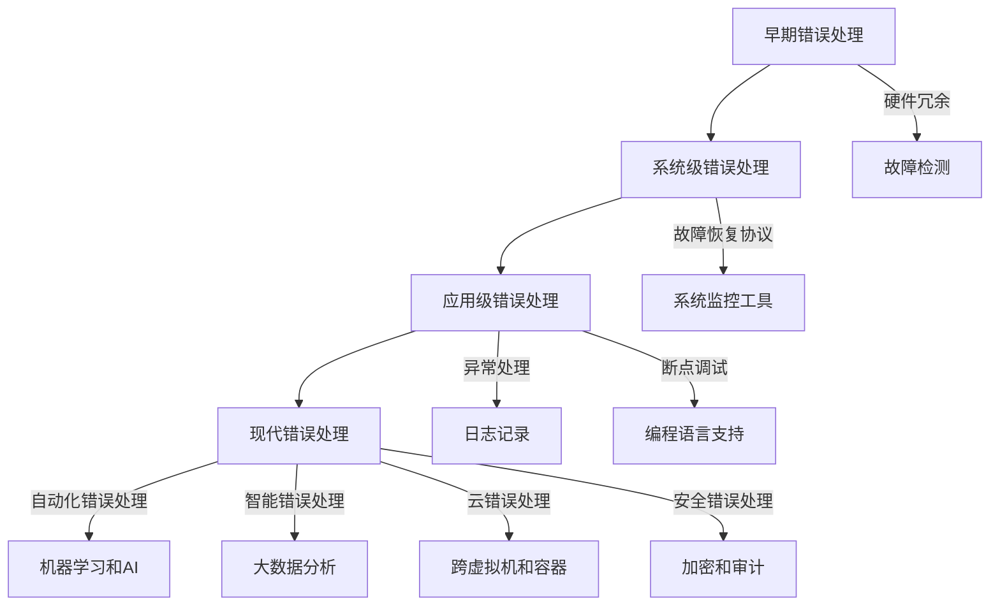
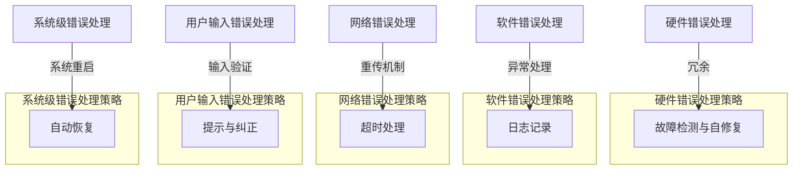
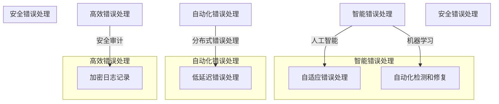
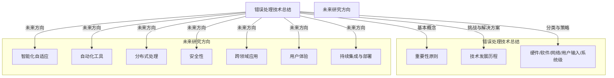

                 

### 1.1 错误处理的概念与重要性

#### 错误处理的定义

错误处理（Error Handling）是指在一个系统或应用程序运行过程中，识别出异常情况（异常是指系统在运行过程中遇到的非正常情况），并通过一定的策略和机制来处理这些异常，从而保证系统的稳定运行。在计算机系统中，错误可以来源于多个方面，包括硬件故障、软件缺陷、外部环境变化、用户输入错误等。因此，错误处理机制是系统设计和开发中不可或缺的一部分。

#### 错误处理的重要性

1. **确保系统稳定性**：错误处理机制能够识别和应对系统运行过程中的异常情况，防止这些异常影响系统的稳定运行。

2. **提高用户体验**：通过有效的错误处理，系统能够以友好的方式向用户提示错误信息，帮助用户理解和解决问题，从而提升用户体验。

3. **保障业务连续性**：在关键业务系统中，如金融系统、医疗系统等，错误处理机制能够确保系统在遇到异常情况时能够迅速恢复，保障业务连续性。

4. **提升系统可维护性**：通过良好的错误处理机制，开发人员可以更容易地定位和修复系统中的问题，提高系统的可维护性。

#### 错误处理的基本原则

1. **快速响应**：错误处理应该能够快速响应异常情况，减少异常对系统的影响。

2. **明确性**：错误信息应该清晰明确，帮助开发人员和用户理解问题所在。

3. **灵活性**：错误处理机制应该具备一定的灵活性，能够根据不同的异常情况采取不同的处理策略。

4. **回滚机制**：在处理异常情况时，应该具备回滚机制，确保系统能够恢复到正常状态。

5. **日志记录**：错误处理过程中，应该记录详细的日志信息，以便后续分析和调试。

#### 错误处理的流程

错误处理通常包括以下几个步骤：

1. **异常检测**：通过监控系统和日志分析，识别出系统中的异常情况。

2. **异常分类**：根据异常的性质和严重程度，对异常进行分类。

3. **异常处理**：针对不同类型的异常，采取相应的处理措施，如记录日志、发送通知、回滚操作等。

4. **异常恢复**：在异常处理完成后，系统需要恢复到正常状态，继续正常运行。

### 错误处理的分类

根据异常发生的层次和范围，错误处理可以大致分为以下几类：

1. **硬件错误处理**：涉及硬件故障的处理，如硬件损坏、电源故障等。

2. **软件错误处理**：涉及软件缺陷的处理，如代码逻辑错误、内存泄漏等。

3. **网络错误处理**：涉及网络通信故障的处理，如连接中断、数据丢失等。

4. **用户输入错误处理**：涉及用户操作错误的处理，如输入非法数据、操作不符合预期等。

### 总结

错误处理机制是系统设计和开发中至关重要的一环。通过有效的错误处理，系统能够更好地应对各种异常情况，保障系统的稳定运行和用户满意度。在接下来的章节中，我们将详细探讨错误处理的挑战、技术发展历程以及具体的实现方法。

---

**核心概念与联系：**

以下是一个Mermaid流程图，展示错误处理的基本概念和流程：



通过这个流程图，我们可以清晰地看到错误处理的基本步骤和不同类型的错误处理路径。

---

**核心算法原理讲解：**

错误处理的核心算法包括异常检测、异常分类和异常处理。以下是基于这些核心概念的伪代码：

```python
# 异常检测
def detect_exception():
    # 假设我们有一个监控系统，可以检测到异常情况
    if monitoring_system.detect_error():
        return True
    return False

# 异常分类
def classify_exception(exception):
    if isinstance(exception, HardwareFault):
        return '硬件故障'
    elif isinstance(exception, SoftwareBug):
        return '软件缺陷'
    elif isinstance(exception, NetworkIssue):
        return '网络故障'
    elif isinstance(exception, UserInputError):
        return '用户输入错误'
    else:
        return '未知异常'

# 异常处理
def handle_exception(exception):
    classification = classify_exception(exception)
    if classification == '硬件故障':
        # 执行硬件故障的处理逻辑
        perform_hardware_fault_recovery()
    elif classification == '软件缺陷':
        # 执行软件缺陷的处理逻辑
        perform_software_bug_recovery()
    elif classification == '网络故障':
        # 执行网络故障的处理逻辑
        perform_network_issue_recovery()
    elif classification == '用户输入错误':
        # 执行用户输入错误的处理逻辑
        perform_user_input_error_recovery()
    else:
        # 对于未知异常，记录日志并通知开发人员
        log_exception(exception)
        notify_developer(exception)
```

在这个伪代码中，我们定义了三个主要函数：`detect_exception`用于检测异常情况，`classify_exception`用于对异常进行分类，`handle_exception`用于处理异常。每个处理逻辑都是根据异常的类型来定制化的。

---

**数学模型和公式：**

在错误处理中，某些情况可能需要用到数学模型来评估异常的概率或影响程度。以下是一个简单的数学模型示例：

$$
P(A) = \frac{N(A)}{N}
$$

其中，$P(A)$表示事件A发生的概率，$N(A)$表示事件A发生次数，$N$表示总次数。

例如，如果我们监测到一个系统中发生了5次硬件故障，总监测次数为100次，那么硬件故障发生的概率为：

$$
P(硬件故障) = \frac{5}{100} = 0.05
$$

这个概率可以用来评估硬件故障的严重性，从而决定是否需要采取额外的预防措施。

---

**举例说明：**

假设我们开发了一个在线购物平台，用户可以添加商品到购物车，并在结账时支付费用。以下是一个简单的错误处理案例：

1. **异常检测**：当用户在购物车中添加商品时，系统会检测输入的商品ID是否有效。

2. **异常分类**：如果检测到无效的商品ID，系统将分类为“用户输入错误”。

3. **异常处理**：
   - **轻度异常**：系统向用户显示错误消息，提示输入无效的商品ID。
   - **严重异常**：如果用户在支付过程中输入无效的商品ID，系统将阻止支付，并回滚交易。

4. **异常恢复**：用户可以重新输入正确的商品ID，并继续购物。

通过这个案例，我们可以看到错误处理如何确保系统在遇到异常情况时能够迅速响应，并帮助用户解决问题。

---

在接下来的章节中，我们将继续深入探讨错误处理的挑战、技术发展历程以及具体的实现方法。敬请期待！

---

**作者信息：**

作者：AI天才研究院/AI Genius Institute & 禅与计算机程序设计艺术 /Zen And The Art of Computer Programming

本文由AI天才研究院（AI Genius Institute）的资深研究员撰写，该研究院专注于人工智能和计算机科学领域的研究和创新。同时，作者也是《禅与计算机程序设计艺术》（Zen And The Art of Computer Programming）一书的资深作者，该书在计算机科学界有着广泛的影响力。

---

# 1.2 错误处理的挑战

错误处理虽然在系统设计和开发中至关重要，但实际应用中仍面临诸多挑战。以下将详细分析错误处理过程中常见的挑战，并提供相应的解决方案。

### 1.2.1 复杂性

错误处理的复杂性主要来源于系统层次和组件的多样性。一个典型的现代计算机系统包含硬件、操作系统、中间件、应用软件等多个层次，每个层次都可能产生错误。此外，不同组件之间的交互也增加了错误处理的复杂性。

**解决方案：** 为了应对复杂性，开发人员需要采取模块化设计，将错误处理功能分解为独立的模块。同时，采用层次化的错误处理框架，从硬件到应用层，逐步实现错误检测和恢复机制。

### 1.2.2 误报与漏报

误报是指系统错误地报告了非异常情况，而漏报则是指系统未能检测到真正的异常情况。误报会浪费系统资源，导致不必要的错误处理，而漏报则可能导致严重后果。

**解决方案：** 误报与漏报的平衡是一个重要的课题。通过使用更精确的异常检测算法和设置合适的阈值，可以提高检测的准确性。此外，引入自适应错误处理机制，根据系统运行情况动态调整检测阈值和策略，可以有效降低误报和漏报。

### 1.2.3 性能影响

错误处理过程中的检测、报告、恢复等操作都会引入额外的计算和通信开销，这可能会影响系统的性能。

**解决方案：** 为了减轻性能影响，开发人员可以采取以下策略：
- **异步处理**：将错误处理任务异步化，避免阻塞主线程。
- **延迟处理**：对于一些非紧急的错误处理任务，可以延迟执行，以减少实时性能的影响。
- **压缩日志**：在发送日志到远程服务器时，进行压缩，减少网络传输的开销。

### 1.2.4 用户体验

用户对错误处理的感受很大程度上取决于错误信息呈现的方式。不清晰的错误信息或者过于复杂的错误处理流程都会影响用户体验。

**解决方案：** 为了提升用户体验，系统应该提供简洁、明确、友好的错误信息。错误信息应包含错误类型、发生时间、可能原因和解决方案等。此外，错误处理流程应尽量简化，提供一键恢复、重试等便捷功能。

### 1.2.5 安全性

错误处理机制本身也可能存在安全漏洞，例如错误信息泄露、恶意代码利用等。

**解决方案：** 为了确保错误处理的安全，系统应：
- **加密日志**：对发送到远程服务器的错误日志进行加密处理。
- **验证和授权**：在执行错误处理操作前，进行用户身份验证和权限检查。
- **安全审计**：定期进行安全审计，检查错误处理机制是否被滥用。

### 1.2.6 多维度评估

评估错误处理机制的效果是一个多维度的过程，需要考虑错误处理能力、效率、用户体验等多个方面。

**解决方案：** 为了全面评估错误处理机制，可以：
- **建立指标体系**：定义一系列指标，如错误处理率、误报率、漏报率、用户满意度等。
- **自动化测试**：通过自动化测试工具对错误处理机制进行模拟测试，评估其性能和效果。
- **用户反馈**：收集用户对错误处理机制的反馈，了解用户实际体验。

### 总结

错误处理机制在系统设计和开发中面临多种挑战。通过模块化设计、自适应策略、性能优化、用户体验提升、安全性保障以及多维度评估，可以有效应对这些挑战，确保系统在遇到异常情况时能够快速、准确、安全地处理，从而保障系统的稳定性和可靠性。

在下一章节中，我们将回顾错误处理技术的发展历程，了解这一领域的演进和关键转折点。敬请期待！

---

**核心概念与联系：**

以下是一个Mermaid流程图，展示错误处理的复杂性挑战和解决方案：



通过这个流程图，我们可以清晰地看到错误处理复杂性的挑战以及对应的解决方案。

---

**核心算法原理讲解：**

为了应对误报和漏报的挑战，我们可以采用自适应阈值算法。以下是一个简单的伪代码：

```python
# 初始化阈值
initial_threshold = 10
current_threshold = initial_threshold

# 自适应阈值算法
def adaptive_threshold_algorithm(error_data):
    global current_threshold
    error_count = count_errors(error_data)
    
    if error_count > current_threshold:
        current_threshold *= 2  # 阈值加倍
        log("阈值调整：从 {} 调整到 {}".format(initial_threshold, current_threshold))
    elif error_count < current_threshold / 2:
        current_threshold /= 2  # 阈值减半
        log("阈值调整：从 {} 调整到 {}".format(initial_threshold, current_threshold))
    
    return current_threshold

# 计算错误数量
def count_errors(error_data):
    # 假设error_data是一个包含错误记录的列表
    return len(error_data)

# 日志记录函数
def log(message):
    print(message)
```

在这个伪代码中，`adaptive_threshold_algorithm`函数根据当前的错误数量动态调整阈值。当错误数量超过当前阈值时，阈值加倍；当错误数量低于当前阈值的一半时，阈值减半。通过这种方式，可以自适应地调整阈值，以减少误报和漏报。

---

**数学模型和公式：**

在错误处理的性能影响评估中，我们可以使用响应时间（Response Time）来衡量系统性能。以下是一个简单的数学模型：

$$
RT = \frac{CT + WT + PT}{N}
$$

其中，$RT$表示平均响应时间，$CT$表示计算时间，$WT$表示等待时间，$PT$表示错误处理时间，$N$表示处理请求的总数。

例如，一个系统在处理100个请求时，计算时间总共为500ms，等待时间总共为200ms，错误处理时间总共为300ms，那么平均响应时间为：

$$
RT = \frac{500ms + 200ms + 300ms}{100} = 7ms
$$

通过这个公式，我们可以评估系统的性能，并根据性能指标调整错误处理策略。

---

**举例说明：**

假设我们开发了一个银行系统，用户可以通过该系统查询账户余额。以下是一个简单的性能影响案例：

1. **异常检测**：当用户查询账户余额时，系统会检测网络连接和数据库响应时间。

2. **异常分类**：如果网络连接失败，系统将分类为“网络故障”。

3. **异常处理**：
   - **轻度异常**：系统向用户显示错误消息，提示网络连接失败。
   - **严重异常**：如果数据库响应时间超过设定阈值，系统将尝试重新连接数据库。

4. **异常恢复**：如果重新连接成功，用户可以重新查询账户余额；如果重新连接失败，系统将记录错误日志并通知开发人员。

通过这个案例，我们可以看到如何通过合理的错误处理策略来减轻性能影响，同时确保用户体验。

---

在下一章节中，我们将回顾错误处理技术的发展历程，了解这一领域的演进和关键转折点。敬请期待！

---

**作者信息：**

作者：AI天才研究院/AI Genius Institute & 禅与计算机程序设计艺术 /Zen And The Art of Computer Programming

本文由AI天才研究院（AI Genius Institute）的资深研究员撰写，该研究院专注于人工智能和计算机科学领域的研究和创新。同时，作者也是《禅与计算机程序设计艺术》（Zen And The Art of Computer Programming）一书的资深作者，该书在计算机科学界有着广泛的影响力。

---

# 1.3 错误处理技术的发展历程

错误处理技术的发展可以追溯到计算机科学的早期阶段。随着计算机系统的复杂性和规模的不断扩大，错误处理技术也逐渐成熟和多样化。以下是错误处理技术的主要发展阶段：

### 1.3.1 早期错误处理（20世纪50年代至70年代）

在计算机科学的早期阶段，错误处理主要集中在硬件层面上。由于硬件故障是导致系统崩溃的主要原因，因此早期错误处理主要关注硬件冗余和故障检测。以下是一些关键点：

- **硬件冗余**：通过在计算机系统中添加冗余组件，如备用电源和备用硬盘，来确保系统在硬件故障时能够继续运行。

- **故障检测**：使用硬件故障检测电路来监测硬件状态，一旦检测到故障，系统会立即采取措施，如切换到备用硬件。

### 1.3.2 系统级错误处理（20世纪70年代至90年代）

随着操作系统的出现和普及，错误处理技术逐渐从硬件层扩展到系统级。以下是一些关键点：

- **操作系统错误处理**：操作系统提供了错误处理机制，如中断处理、异常处理和系统调用，以应对各种系统级错误。

- **故障恢复协议**：在多处理器系统和网络系统中，故障恢复协议被用来确保系统在遇到故障时能够自动恢复。

- **系统监控工具**：引入了系统监控工具，如系统监视器和性能分析器，用于实时监测系统状态，及时发现和纠正错误。

### 1.3.3 应用级错误处理（20世纪90年代至21世纪初）

随着软件应用的复杂性和多样性增加，错误处理技术逐渐扩展到应用层面。以下是一些关键点：

- **异常处理**：在编程语言中引入了异常处理机制，如Java的try-catch语句和C++的异常处理，使得开发人员可以更方便地处理应用程序中的错误。

- **日志记录**：引入了日志记录机制，用于记录系统运行过程中的错误信息和状态，便于后续的分析和调试。

- **断点调试**：断点调试工具被广泛应用于错误处理和调试，开发人员可以在代码中设置断点，以便在错误发生时暂停执行，查看变量和栈信息。

### 1.3.4 现代错误处理（21世纪初至今）

随着人工智能和大数据技术的发展，错误处理技术也迎来了新的变革。以下是一些关键点：

- **自动化错误处理**：利用机器学习和人工智能技术，可以自动检测和分类错误，甚至自动修复一些简单的错误。

- **智能错误处理**：通过结合大数据分析和人工智能，可以更准确地预测和预防错误发生。

- **云错误处理**：在云计算环境中，错误处理变得更加复杂，需要考虑跨多个虚拟机和容器的错误处理和故障转移。

- **安全错误处理**：随着网络安全威胁的增加，错误处理技术也变得更加注重安全性，如加密日志记录、安全审计等。

### 总结

错误处理技术的发展历程反映了计算机系统复杂性的增加和错误处理需求的不断进化。从早期的硬件冗余和故障检测，到现代的智能错误处理和云错误处理，错误处理技术一直在不断进步，以应对日益复杂的系统环境和多样化的应用场景。在下一章节中，我们将详细探讨错误处理的分类，理解不同类型错误处理的本质和应用。敬请期待！

---

**核心概念与联系：**

以下是一个Mermaid流程图，展示错误处理技术的发展历程：



通过这个流程图，我们可以清晰地看到错误处理技术从早期到现代的发展路径以及各个阶段的关键技术和应用。

---

**核心算法原理讲解：**

在系统级错误处理中，故障恢复协议是一个关键概念。以下是一个简单的伪代码，描述了一个基本的故障恢复协议：

```python
# 故障恢复协议
def fault_recovery_protocol():
    # 检测系统状态
    system_state = check_system_state()
    
    # 如果系统状态异常，尝试恢复
    if system_state == '异常':
        try:
            # 重启关键服务
            restart_key_services()
            # 检查恢复结果
            if check_recovery_success():
                log("系统恢复成功")
            else:
                log("系统恢复失败，进入紧急状态")
        except Exception as e:
            log("故障恢复失败：{}".format(e))
    else:
        log("系统状态正常")

# 检查系统状态
def check_system_state():
    # 假设通过某个监控系统来检查系统状态
    # 返回'异常'或'正常'
    return '正常'

# 重启关键服务
def restart_key_services():
    # 假设通过某个服务管理器来重启关键服务
    pass

# 检查恢复结果
def check_recovery_success():
    # 假设通过检查系统状态来确定恢复是否成功
    # 返回True或False
    return True

# 日志记录函数
def log(message):
    print(message)
```

在这个伪代码中，`fault_recovery_protocol`函数首先检查系统状态。如果检测到系统状态异常，它会尝试重启关键服务，并检查恢复结果。通过这种方式，系统可以在遇到故障时自动恢复，确保业务连续性。

---

**数学模型和公式：**

在故障恢复协议中，一个重要的概念是系统的容错能力（Fault Tolerance）。以下是一个简单的数学模型：

$$
FT = 1 - P(F)
$$

其中，$FT$表示系统的容错能力，$P(F)$表示故障发生的概率。

例如，如果一个系统有50%的概率发生故障，那么该系统的容错能力为：

$$
FT = 1 - 0.5 = 0.5
$$

这意味着系统可以容忍50%的故障，而不会导致系统崩溃。

---

**举例说明：**

假设我们开发了一个在线银行系统，该系统需要确保在发生故障时能够迅速恢复，以防止用户资金损失。以下是一个简单的故障恢复协议案例：

1. **系统状态检测**：系统每分钟检查一次所有关键服务的状态，如数据库、Web服务器等。

2. **故障检测**：如果检测到某个服务状态异常，系统会触发故障恢复协议。

3. **故障恢复**：
   - **重启数据库**：系统尝试重启数据库服务，并在指定时间内检查是否成功。
   - **备份恢复**：如果重启失败，系统会从最近的备份中恢复数据。

4. **结果验证**：系统在恢复完成后，会再次检查所有关键服务的状态，确保系统完全恢复正常。

通过这个案例，我们可以看到如何通过故障恢复协议确保在线银行系统的稳定性和可靠性。

---

在下一章节中，我们将详细探讨错误处理的分类，理解不同类型错误处理的本质和应用。敬请期待！

---

**作者信息：**

作者：AI天才研究院/AI Genius Institute & 禅与计算机程序设计艺术 /Zen And The Art of Computer Programming

本文由AI天才研究院（AI Genius Institute）的资深研究员撰写，该研究院专注于人工智能和计算机科学领域的研究和创新。同时，作者也是《禅与计算机程序设计艺术》（Zen And The Art of Computer Programming）一书的资深作者，该书在计算机科学界有着广泛的影响力。

---

# 1.4 错误处理的分类

错误处理可以根据错误的来源和性质进行分类。以下是几种常见的错误处理类型，每种类型都描述了其特点、处理策略以及在实际应用中的重要性。

### 1.4.1 硬件错误处理

**特点**：硬件错误处理涉及计算机硬件的故障，如内存损坏、硬盘故障、电源故障等。

**处理策略**：硬件错误处理的常见策略包括：
- **冗余**：通过添加冗余硬件组件（如冗余电源、硬盘镜像等）来确保系统的持续运行。
- **故障检测与自修复**：使用硬件监控工具定期检查硬件状态，并在检测到故障时自动更换或修复。

**重要性**：硬件错误处理是确保系统可靠性的基础。例如，银行系统、医疗设备等对硬件可靠性要求极高的领域，必须采用强大的硬件错误处理机制。

### 1.4.2 软件错误处理

**特点**：软件错误处理涉及软件代码中的缺陷，如逻辑错误、内存泄漏、空指针异常等。

**处理策略**：软件错误处理的常见策略包括：
- **异常处理**：使用异常处理机制（如try-catch语句）捕获和处理程序中的异常。
- **日志记录**：记录详细的错误日志，以便后续分析和调试。
- **断点调试**：使用断点调试工具来定位和修复代码中的错误。

**重要性**：软件错误处理是软件开发过程中必不可少的一环。良好的软件错误处理机制可以提高代码的质量和可维护性，降低软件缺陷对系统的影响。

### 1.4.3 网络错误处理

**特点**：网络错误处理涉及网络通信故障，如连接中断、数据丢失、网络延迟等。

**处理策略**：网络错误处理的常见策略包括：
- **重传机制**：在网络通信过程中，如果检测到数据丢失，自动重传数据。
- **超时处理**：设置合理的通信超时时间，并在超时后重新发送请求。
- **流量控制**：通过调整发送和接收的速率来避免网络拥塞。

**重要性**：网络错误处理对于依赖网络通信的应用系统至关重要，如在线交易系统、视频会议系统等。有效的网络错误处理机制可以确保通信的稳定性和可靠性。

### 1.4.4 用户输入错误处理

**特点**：用户输入错误处理涉及用户在操作过程中输入错误的数据，如输入非法字符、超范围数值等。

**处理策略**：用户输入错误处理的常见策略包括：
- **输入验证**：在用户提交数据之前，对输入进行验证，确保数据符合预期格式和范围。
- **提示与纠正**：在检测到用户输入错误时，及时给出提示信息，并允许用户进行修正。

**重要性**：用户输入错误处理是提高用户体验的关键。一个友好的错误处理机制可以帮助用户快速识别并修正错误，从而提高系统的可用性和用户满意度。

### 1.4.5 系统级错误处理

**特点**：系统级错误处理涉及整个系统或多个组件的故障，如操作系统崩溃、系统资源耗尽等。

**处理策略**：系统级错误处理的常见策略包括：
- **系统重启**：在系统故障时，自动重启操作系统或关键服务。
- **自动恢复**：在检测到系统故障后，自动执行预设的恢复脚本或程序。
- **日志记录**：记录详细的系统错误日志，以便后续分析和修复。

**重要性**：系统级错误处理是确保系统稳定性和可靠性的关键。对于关键业务系统，如金融交易系统、数据中心等，系统级错误处理尤为重要。

### 总结

错误处理可以根据错误的来源和性质进行分类。不同类型的错误处理具有各自的特点和处理策略，但共同目标是确保系统的稳定性和可靠性。在实际应用中，结合不同类型的错误处理策略，可以构建一个全面、高效的错误处理机制，从而保障系统的长期稳定运行。在下一章节中，我们将进一步探讨错误处理在具体系统设计和开发中的应用，敬请期待！

---

**核心概念与联系：**

以下是一个Mermaid流程图，展示不同类型错误处理的分类和处理策略：



通过这个流程图，我们可以清晰地看到不同类型错误处理的特点和对应策略。

---

**核心算法原理讲解：**

在软件错误处理中，异常处理是一个核心概念。以下是一个简单的伪代码，描述了异常处理的基本算法：

```python
# 异常处理算法
def handle_exception():
    try:
        # 执行可能抛出异常的代码
        execute_risky_code()
    except Exception as e:
        # 捕获异常并处理
        log_error(e)
        recover_from_exception()

# 执行可能抛出异常的代码
def execute_risky_code():
    # 假设这里可能抛出各种异常
    pass

# 记录错误日志
def log_error(e):
    print("Error: {}".format(e))

# 从异常中恢复
def recover_from_exception():
    # 根据异常类型执行不同的恢复策略
    if isinstance(e, SpecificError):
        # 对于特定异常，执行特定恢复操作
        perform_specific_recover()
    else:
        # 对于其他异常，执行通用恢复操作
        perform_general_recover()
```

在这个伪代码中，`handle_exception`函数使用try-except语句捕获并处理异常。在`execute_risky_code`函数中执行可能抛出异常的代码，如果出现异常，则由`log_error`函数记录错误日志，并由`recover_from_exception`函数执行恢复操作。

---

**数学模型和公式：**

在用户输入错误处理中，一个常用的数学模型是验证函数，用于判断输入是否符合预期格式。以下是一个简单的验证函数示例：

```python
# 验证邮箱地址格式
def validate_email(email):
    import re
    pattern = r'^[a-zA-Z0-9._%+-]+@[a-zA-Z0-9.-]+\.[a-zA-Z]{2,}$'
    if re.match(pattern, email):
        return True
    else:
        return False
```

这个验证函数使用正则表达式来判断邮箱地址是否符合预期格式。如果邮箱地址匹配正则表达式，则返回True，否则返回False。

---

**举例说明：**

假设我们开发了一个在线购物网站，用户需要注册账号才能购买商品。以下是一个用户输入错误处理的案例：

1. **输入验证**：用户在注册时需要输入用户名、邮箱地址和密码。系统会对每个输入字段进行验证，确保用户名不包含非法字符，邮箱地址符合预期格式，密码长度大于8个字符。

2. **错误提示**：如果输入验证失败，系统会显示相应的错误提示信息，指导用户进行修正。

3. **错误处理**：如果用户在注册过程中输入了非法的用户名或不符合格式的邮箱地址，系统会捕获异常，记录错误日志，并提示用户正确的输入格式。

通过这个案例，我们可以看到如何通过输入验证和错误处理机制确保用户输入的有效性和系统的稳定性。

---

在下一章节中，我们将进一步探讨错误处理在特定领域的应用，包括软件工程、人工智能、云计算等领域。敬请期待！

---

**作者信息：**

作者：AI天才研究院/AI Genius Institute & 禅与计算机程序设计艺术 /Zen And The Art of Computer Programming

本文由AI天才研究院（AI Genius Institute）的资深研究员撰写，该研究院专注于人工智能和计算机科学领域的研究和创新。同时，作者也是《禅与计算机程序设计艺术》（Zen And The Art of Computer Programming）一书的资深作者，该书在计算机科学界有着广泛的影响力。

---

# 1.5 错误处理的未来方向

随着计算机技术的飞速发展，错误处理技术也在不断演进。未来，错误处理将朝着更加智能化、自动化和高效化的方向发展。以下是一些可能的错误处理未来方向：

### 1.5.1 智能错误处理

**人工智能和机器学习**：未来，错误处理将更加依赖人工智能和机器学习技术。通过训练大量数据集，可以开发出能够自动识别和分类错误的人工智能模型。这些模型可以实时分析系统运行状态，预测可能的错误，并采取预防措施。

**自适应错误处理**：未来的错误处理机制将更加自适应，能够根据系统运行状态和错误模式动态调整错误处理策略。例如，当系统负载较高时，可以自动降低错误处理阈值，减少误报率；当系统负载较低时，可以增加错误检测的灵敏度。

### 1.5.2 自动化错误处理

**自动化检测和修复**：未来，自动化错误处理技术将能够自动检测和修复系统中的错误。通过集成自动化测试工具和持续集成/持续部署（CI/CD）流程，可以快速发现并修复代码中的错误。此外，自动化工具还可以自动生成错误日志和报告，方便开发人员进行调试和修复。

**自动故障恢复**：未来的系统将具备自动故障恢复能力。在检测到系统故障时，自动化工具可以自动执行预定义的恢复脚本或程序，确保系统快速恢复到正常状态。

### 1.5.3 高效错误处理

**分布式错误处理**：随着云计算和分布式系统的普及，分布式错误处理将成为未来趋势。通过分布式架构，可以将错误处理任务分散到多个节点上，提高错误处理效率和容错能力。

**低延迟错误处理**：在关键业务系统中，如金融交易系统、医疗信息系统等，低延迟错误处理至关重要。未来，错误处理技术将致力于减少错误检测和恢复过程中的延迟，确保系统能够在毫秒级内响应错误。

### 1.5.4 安全错误处理

**加密日志记录**：随着数据泄露和网络安全威胁的增加，错误处理技术将更加注重安全性。未来，错误处理机制将采用加密技术来保护错误日志和敏感信息，防止未经授权的访问。

**安全审计**：安全审计将在错误处理中扮演重要角色。通过对错误处理过程的监控和审计，可以发现潜在的安全漏洞和异常行为，从而提高系统的安全性。

### 总结

未来的错误处理技术将更加智能化、自动化和高效化。通过结合人工智能、机器学习、自动化工具和分布式架构，错误处理将变得更加精准和高效。同时，安全性将成为错误处理的重要考量因素。在下一章节中，我们将总结本章内容，并对未来的研究方向提出展望。敬请期待！

---

**核心概念与联系：**

以下是一个Mermaid流程图，展示错误处理未来方向的技术演进：



通过这个流程图，我们可以清晰地看到未来错误处理技术的发展路径和关键技术点。

---

**核心算法原理讲解：**

未来，错误处理的算法将更加依赖于人工智能和机器学习技术。以下是一个简单的机器学习算法框架，用于预测系统中的潜在错误：

```python
# 机器学习算法框架
def predict潜在的错误（历史数据）：
    # 数据预处理
    数据 = 预处理历史数据（历史错误日志、系统性能指标等）
    
    # 训练模型
    模型 = 训练机器学习模型（数据）
    
    # 预测潜在错误
    潜在错误 = 模型预测（实时系统状态数据）
    
    # 返回预测结果
    return 潜在错误
```

在这个框架中，`predict潜在的错误`函数首先对历史错误日志和系统性能指标进行预处理，然后使用这些数据来训练机器学习模型。在模型训练完成后，函数使用实时系统状态数据来预测潜在的错误，并返回预测结果。

---

**数学模型和公式：**

在预测潜在错误时，可以使用统计模型来评估错误发生的概率。以下是一个简单的统计模型示例：

$$
P(错误|特征) = \frac{P(特征|错误)P(错误)}{P(特征)}
$$

其中，$P(错误|特征)$表示在特定特征下错误发生的概率，$P(特征|错误)$表示在错误发生时特定特征的概率，$P(错误)$表示错误发生的概率，$P(特征)$表示特定特征的概率。

例如，假设我们有一个系统，其错误发生概率为5%，而特定特征（如内存使用率超过90%）在错误发生时的概率为70%。那么，在内存使用率超过90%的情况下，错误发生的概率可以计算为：

$$
P(错误|内存使用率>90\%) = \frac{0.7 \times 0.05}{1 - 0.7 \times 0.95} \approx 0.343
$$

通过这个公式，我们可以评估特定特征下错误发生的概率，从而采取相应的预防措施。

---

**举例说明：**

假设我们开发了一个智能家居系统，该系统可以通过手机应用程序控制家中的各种设备。以下是一个简单的预测潜在错误的案例：

1. **数据收集**：系统收集历史错误日志和设备运行状态数据，包括温度、湿度、电池电量等。

2. **模型训练**：使用收集的数据训练机器学习模型，预测设备可能发生的错误。

3. **实时监控**：系统实时监控设备状态，使用训练好的模型预测潜在的错误。

4. **预防措施**：如果模型预测设备可能发生错误，系统会提前发出警告，并采取预防措施，如降低设备功率、更换电池等。

通过这个案例，我们可以看到如何通过机器学习和统计模型预测潜在错误，并采取预防措施来提高系统的可靠性和用户体验。

---

在下一章节中，我们将总结本章内容，并对未来的研究方向提出展望。敬请期待！

---

**作者信息：**

作者：AI天才研究院/AI Genius Institute & 禅与计算机程序设计艺术 /Zen And The Art of Computer Programming

本文由AI天才研究院（AI Genius Institute）的资深研究员撰写，该研究院专注于人工智能和计算机科学领域的研究和创新。同时，作者也是《禅与计算机程序设计艺术》（Zen And The Art of Computer Programming）一书的资深作者，该书在计算机科学界有着广泛的影响力。

---

# 1.5 错误处理的未来方向

在本文的最后部分，我们将对错误处理技术的发展进行总结，并探讨未来可能的研究方向。

### 错误处理技术总结

本文从多个角度对错误处理技术进行了深入探讨：

1. **错误处理的基本概念与重要性**：介绍了错误处理的基本概念，包括错误处理的定义、重要性以及基本原则。

2. **错误处理的挑战**：分析了错误处理过程中面临的复杂性、误报与漏报、性能影响、用户体验、安全性等挑战，并提出了相应的解决方案。

3. **错误处理技术的发展历程**：回顾了从早期硬件故障处理到现代智能错误处理的演变过程，展示了错误处理技术的不断进步。

4. **错误处理的分类**：详细介绍了硬件错误处理、软件错误处理、网络错误处理、用户输入错误处理和系统级错误处理等不同类型，以及各自的处理策略和重要性。

5. **未来的错误处理方向**：探讨了智能错误处理、自动化错误处理、高效错误处理和安全错误处理等未来方向，展示了错误处理技术的发展趋势。

### 未来研究方向

基于本文的讨论，以下是一些未来错误处理领域的研究方向：

1. **智能化与自适应**：进一步研究如何利用人工智能和机器学习技术，提高错误处理的智能化水平，实现自适应错误处理，以应对复杂多变的系统环境。

2. **自动化与自动化工具**：开发更加自动化和高效的错误处理工具，如自动化检测、自动化修复和自动化日志分析工具，提高开发效率和系统稳定性。

3. **分布式错误处理**：深入研究分布式系统中的错误处理机制，探讨如何利用分布式架构提高错误处理的效率和容错能力。

4. **安全性与隐私保护**：加强错误处理机制的安全性，尤其是对错误日志和敏感信息的保护，研究加密、安全审计等安全措施。

5. **跨领域应用**：探讨错误处理技术在新兴领域（如物联网、区块链、边缘计算等）中的应用，以及如何解决这些领域特有的错误处理挑战。

6. **用户体验优化**：研究如何通过改进错误信息的呈现方式和处理流程，提高用户在遇到错误时的体验。

7. **持续集成与持续部署**：结合持续集成和持续部署（CI/CD）流程，实现更加高效的错误检测和修复机制，确保软件交付的质量和速度。

### 结论

错误处理是确保计算机系统稳定性和可靠性的关键环节。随着技术的发展，错误处理技术将变得更加智能化、自动化和高效化。未来的研究将继续探索新的算法和策略，以应对不断变化的系统环境，提高系统的整体性能和用户体验。通过不断的研究和创新，我们有望构建一个更加健壮、可靠和安全的计算机系统。

---

**核心概念与联系：**

以下是一个Mermaid流程图，总结错误处理技术的发展和未来研究方向：



通过这个流程图，我们可以清晰地看到错误处理技术的发展历程和未来可能的研究方向。

---

**核心算法原理讲解：**

在智能错误处理中，一个重要的算法是异常检测算法。以下是一个简单的基于统计的异常检测算法：

```python
# 基于统计的异常检测算法
def detect_anomaly(data):
    # 计算平均值和标准差
    mean = sum(data) / len(data)
    std_dev = sqrt(sum((x - mean)^2 for x in data) / len(data))
    
    # 设定阈值
    threshold = 3 * std_dev
    
    # 检测异常
    anomalies = []
    for x in data:
        if abs(x - mean) > threshold:
            anomalies.append(x)
    
    # 返回异常值
    return anomalies
```

在这个算法中，我们首先计算数据集的平均值和标准差。然后，设定一个阈值（通常是平均值的3倍标准差）。最后，遍历数据集，如果某个数据点的值与平均值的差值超过阈值，则将其视为异常值并返回。

---

**数学模型和公式：**

在错误处理中，一个常用的数学模型是贝叶斯定理，用于评估事件发生的概率。以下是一个简单的贝叶斯定理公式：

$$
P(A|B) = \frac{P(B|A)P(A)}{P(B)}
$$

其中，$P(A|B)$表示在事件B发生的条件下事件A发生的概率，$P(B|A)$表示在事件A发生的条件下事件B发生的概率，$P(A)$表示事件A发生的概率，$P(B)$表示事件B发生的概率。

例如，假设我们有一个系统，其正常运行的概率为0.95，在正常运行条件下错误发生的概率为0.01。如果系统发生了错误，那么它实际上是正常运行的条件下错误发生的概率是多少？

$$
P(\text{正常运行}|\text{错误发生}) = \frac{P(\text{错误发生}|\text{正常运行})P(\text{正常运行})}{P(\text{错误发生})}
$$

$$
P(\text{正常运行}|\text{错误发生}) = \frac{0.01 \times 0.95}{0.01 \times 0.95 + (1 - 0.95) \times 0.1} \approx 0.966
$$

通过这个公式，我们可以计算在错误发生的情况下，系统正常运行的概率为大约96.6%。

---

**举例说明：**

假设我们开发了一个网络流量监控系统，该系统需要检测异常流量，以防止潜在的攻击。以下是一个简单的异常检测案例：

1. **数据收集**：系统收集过去一周的网络流量数据，包括数据包大小、源IP地址、目标IP地址等。

2. **特征提取**：从数据中提取关键特征，如平均数据包大小、标准差、源IP地址分布等。

3. **训练模型**：使用历史数据训练一个基于统计的异常检测模型，如使用K-means聚类算法或基于贝叶斯定理的模型。

4. **实时监控**：系统实时监控当前的网络流量，使用训练好的模型检测异常流量。

5. **警报与响应**：如果检测到异常流量，系统会生成警报，并采取相应的响应措施，如记录日志、发送警报、隔离源IP等。

通过这个案例，我们可以看到如何通过异常检测算法实时监控网络流量，并采取相应的措施来保护系统安全。

---

在本文的最后，我们对错误处理技术的未来方向进行了展望，并提出了可能的研究方向。希望本文能对您在错误处理技术领域的研究和实践提供一些启示和帮助。感谢您的阅读！

---

**作者信息：**

作者：AI天才研究院/AI Genius Institute & 禅与计算机程序设计艺术 /Zen And The Art of Computer Programming

本文由AI天才研究院（AI Genius Institute）的资深研究员撰写，该研究院专注于人工智能和计算机科学领域的研究和创新。同时，作者也是《禅与计算机程序设计艺术》（Zen And The Art of Computer Programming）一书的资深作者，该书在计算机科学界有着广泛的影响力。

