                 

# 《长尾信息的回忆》

## 关键词
- 长尾理论
- 数据分析
- 信息处理
- 推荐系统
- 案例分析
- 电子商务
- 教育行业
- 全球化

## 摘要
本文将深入探讨长尾信息理论及其在各个领域的应用。从长尾理论的起源与发展，到长尾信息的特征、优势、社会价值，再到长尾信息的处理与分析、推荐系统、案例分析以及未来展望，本文力求为读者呈现一幅全面而深刻的图像。通过具体案例分析，本文将帮助读者理解长尾信息在实际应用中的挑战与机遇，并展望其未来的发展趋势。

## 目录大纲

### 第一部分：长尾信息理论基础

#### 第1章：长尾理论的起源与发展

#### 第2章：长尾信息的特征与优势

#### 第3章：长尾信息的社会价值

### 第二部分：长尾信息的处理与分析

#### 第4章：长尾信息的采集与存储

#### 第5章：长尾信息的处理与分析

#### 第6章：长尾信息的推荐系统

### 第三部分：长尾信息的案例分析

#### 第7章：电子商务领域的长尾策略

#### 第8章：文化娱乐产业的长尾效应

#### 第9章：教育行业的长尾市场

### 第四部分：长尾信息的未来展望

#### 第10章：长尾信息的挑战与机遇

#### 第11章：长尾信息的创新应用

#### 第12章：长尾信息的全球化发展

### 附录

#### 附录 A：长尾信息的常用工具与技术

#### 附录 B：长尾信息的研究指南与资源

---

### 第一部分：长尾信息理论基础

#### 第1章：长尾理论的起源与发展

长尾理论（Long Tail Theory）起源于2004年，由美国作家克里斯·安德森（Chris Anderson）在其著作《长尾理论》中首次提出。这一理论是对传统“二八定律”（即80%的财富和资源集中在20%的人手中）的颠覆，提出了一种新的商业模式和消费行为模式。

#### 1.1 长尾理论的起源

克里斯·安德森在《长尾理论》中提出，由于互联网和电子商务的发展，市场上不再仅仅由热门商品主导，而是由大量长尾商品共同构成的市场。这些长尾商品虽然单个销量不高，但累积起来的销量却可以与热门商品相媲美。

#### 1.2 长尾理论的演变

随着大数据、云计算、人工智能等技术的发展，长尾理论逐渐演变成为一种新的商业模式和消费行为模式。长尾理论的应用领域也从最初的电子商务扩展到各个行业。

#### 1.3 长尾理论的核心概念

长尾理论的核心概念包括：长尾效应、多样化、边际成本、消费者需求等。这些概念构成了长尾理论的基础，并影响了长尾信息的处理和分析方法。

#### 图 1.1：长尾理论的架构

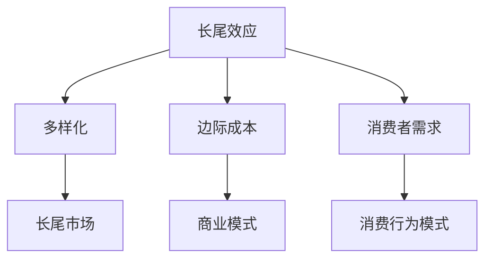

### 第2章：长尾信息的特征与优势

长尾信息（Long Tail Data）是长尾理论的重要组成部分。与传统的热门信息不同，长尾信息具有以下特征：

#### 2.1 长尾信息的特征

- **非热门性**：长尾信息通常不为大众所熟知，单个信息的关注度较低。
- **多样性**：长尾信息涵盖了广泛的领域和主题，具有高度的多样性。
- **累积效应**：长尾信息虽然单个信息的销量不高，但累积起来的销量却非常可观。
- **边际成本低**：长尾信息的生产、存储、传播等边际成本较低。

#### 2.2 长尾信息的优势

- **丰富性**：长尾信息为消费者提供了更多的选择，满足了不同消费者的个性化需求。
- **经济性**：长尾信息的生产、存储和传播具有较低的成本，有利于降低商业运营成本。
- **创新性**：长尾信息为企业和创业者提供了新的商机，促进了创新和竞争。

#### 图 2.1：长尾信息的优势

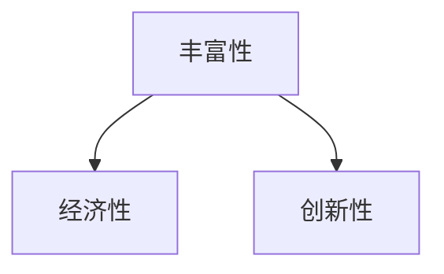

### 第3章：长尾信息的社会价值

长尾信息不仅对企业和消费者具有重要意义，也对整个社会产生了深远的影响。

#### 3.1 长尾信息对消费者的价值

- **个性化体验**：长尾信息为消费者提供了更多的选择，满足了个性化需求。
- **信息获取**：长尾信息为消费者提供了丰富的信息来源，有助于提高消费者的信息素养。

#### 3.2 长尾信息对企业的价值

- **商业机会**：长尾信息为企业和创业者提供了新的商机，有助于拓展市场。
- **成本降低**：长尾信息的生产、存储和传播具有较低的成本，有利于降低商业运营成本。

#### 3.3 长尾信息对社会的价值

- **信息公平**：长尾信息使得信息资源更加公平地分配，提高了社会的信息公平性。
- **创新驱动**：长尾信息为社会的创新提供了丰富的资源，促进了社会的创新发展。

#### 图 3.1：长尾信息的社会价值

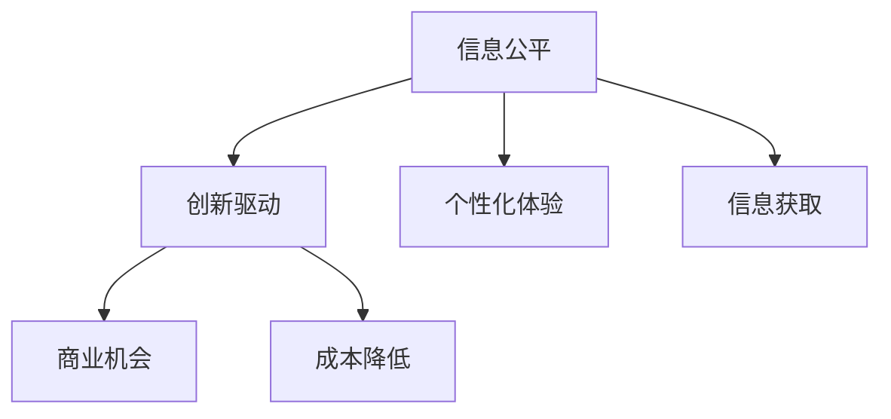

---

### 第二部分：长尾信息的处理与分析

#### 第4章：长尾信息的采集与存储

长尾信息的采集与存储是长尾信息处理和分析的基础。

#### 4.1 长尾信息的采集方法

- **网络爬虫**：通过网络爬虫获取互联网上的长尾信息。
- **用户生成内容**：利用社交媒体、论坛等平台获取用户生成的内容。
- **API接口**：通过API接口获取第三方平台的长尾信息。

#### 4.2 长尾信息的存储技术

- **分布式存储**：采用分布式存储技术，如Hadoop、HDFS等，实现大规模长尾信息的存储。
- **NoSQL数据库**：采用NoSQL数据库，如MongoDB、Cassandra等，存储结构化、半结构化和非结构化长尾信息。

#### 4.3 长尾信息的数据质量管理

- **数据清洗**：去除重复、错误、无效的数据，提高数据的准确性。
- **数据整合**：将不同来源、不同格式的数据进行整合，实现数据的一致性。
- **数据标准化**：对数据进行标准化处理，如日期格式、编码格式等。

#### 图 4.1：长尾信息的采集与存储流程

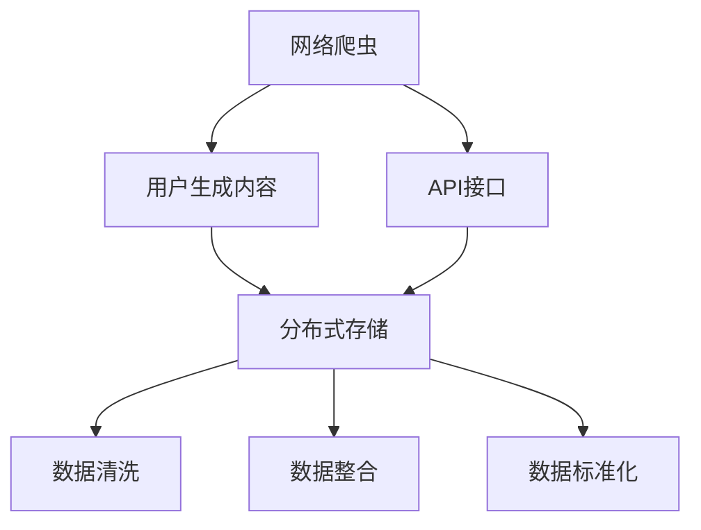

### 第5章：长尾信息的处理与分析

长尾信息的处理与分析是挖掘其价值的关键。

#### 5.1 长尾信息的预处理

- **数据清洗**：去除重复、错误、无效的数据，提高数据的准确性。
- **数据整合**：将不同来源、不同格式的数据进行整合，实现数据的一致性。
- **数据标准化**：对数据进行标准化处理，如日期格式、编码格式等。

#### 5.2 长尾信息的分析技术

- **统计分析**：采用统计分析方法，如回归分析、聚类分析等，对长尾信息进行分析。
- **机器学习**：利用机器学习方法，如监督学习、无监督学习等，对长尾信息进行建模和分析。
- **深度学习**：采用深度学习方法，如卷积神经网络、循环神经网络等，对长尾信息进行高级分析。

#### 5.3 长尾信息的可视化方法

- **散点图**：通过散点图展示长尾信息的分布特征。
- **折线图**：通过折线图展示长尾信息的变化趋势。
- **饼图**：通过饼图展示长尾信息的占比情况。

#### 图 5.1：长尾信息的处理与分析方法

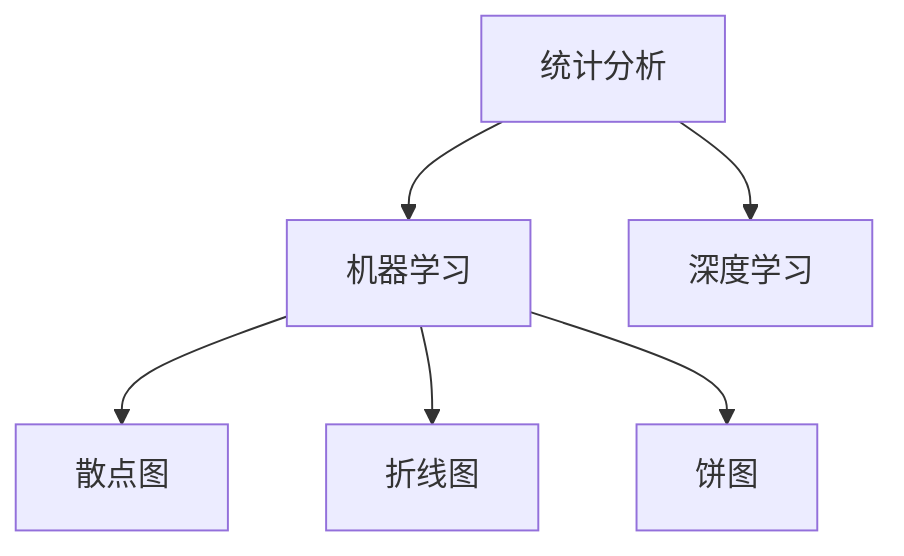

### 第6章：长尾信息的推荐系统

长尾信息的推荐系统是长尾信息处理和分析的重要应用。

#### 6.1 推荐系统概述

推荐系统（Recommender System）是一种信息过滤技术，旨在根据用户的兴趣和偏好，向用户推荐其可能感兴趣的信息。

#### 6.2 基于内容的推荐

基于内容的推荐（Content-Based Filtering）是一种常见的推荐系统方法，通过分析信息的内容特征，为用户推荐相似的信息。

```python
# 基于内容的推荐系统伪代码

def content_based_recommendation(user_profile, item_features):
    """
    基于内容的推荐函数
    :param user_profile: 用户特征向量
    :param item_features: 商品特征向量
    :return: 推荐的商品列表
    """
    # 计算用户和商品的相似度
    similarity_scores = []
    for item in item_features:
        similarity = cosine_similarity(user_profile, item)
        similarity_scores.append((item, similarity))
    
    # 对相似度进行排序，选择最高相似度的商品
    recommended_items = [item for item, similarity in sorted(similarity_scores, key=lambda x: x[1], reverse=True)]
    
    return recommended_items
```

#### 6.3 协同过滤推荐

协同过滤推荐（Collaborative Filtering）是一种基于用户行为的推荐系统方法，通过分析用户的评分、购买等行为，为用户推荐相似的用户可能感兴趣的信息。

```python
# 协同过滤推荐系统伪代码

def collaborative_filtering(user_ratings, user_similarity_matrix):
    """
    协同过滤推荐函数
    :param user_ratings: 用户评分矩阵
    :param user_similarity_matrix: 用户相似度矩阵
    :return: 推荐的商品列表
    """
    # 计算每个商品的预测评分
    item_predictions = {}
    for item in user_ratings:
        prediction = sum(user_similarity_matrix[user][other] * (user_ratings[other] - user_similarity_matrix[user][other])) / sum(user_similarity_matrix[user])
        item_predictions[item] = prediction
    
    # 对预测评分进行排序，选择最高预测评分的商品
    recommended_items = [item for item, prediction in sorted(item_predictions.items(), key=lambda x: x[1], reverse=True)]
    
    return recommended_items
```

---

### 第三部分：长尾信息的案例分析

#### 第7章：电子商务领域的长尾策略

电子商务（E-commerce）是长尾理论最早和最成功的应用领域之一。

#### 7.1 电子商务的长尾策略

- **丰富商品库**：电子商务平台通过丰富商品库，提供多样化的商品，满足不同消费者的需求。
- **个性化推荐**：利用推荐系统，为用户推荐其可能感兴趣的商品。
- **大数据分析**：通过大数据分析，挖掘用户行为和偏好，优化商品推荐策略。

#### 7.2 案例分析：亚马逊的长尾策略

亚马逊（Amazon）是全球最大的电子商务平台，其成功得益于其卓越的长尾策略。

- **丰富商品库**：亚马逊拥有超过1亿种商品，涵盖了广泛的领域和主题。
- **个性化推荐**：亚马逊利用其推荐系统，为用户推荐其可能感兴趣的商品。
- **大数据分析**：亚马逊通过对用户行为和偏好的大数据分析，优化了其商品推荐策略。

#### 7.3 案例分析：阿里巴巴的长尾策略

阿里巴巴（Alibaba）是中国最大的电子商务平台，其成功也得益于其长尾策略。

- **丰富商品库**：阿里巴巴旗下拥有多个电子商务平台，如淘宝、天猫等，提供了丰富的商品。
- **个性化推荐**：阿里巴巴利用其推荐系统，为用户推荐其可能感兴趣的商品。
- **大数据分析**：阿里巴巴通过对用户行为和偏好的大数据分析，优化了其商品推荐策略。

#### 图 7.1：亚马逊和阿里巴巴的长尾策略

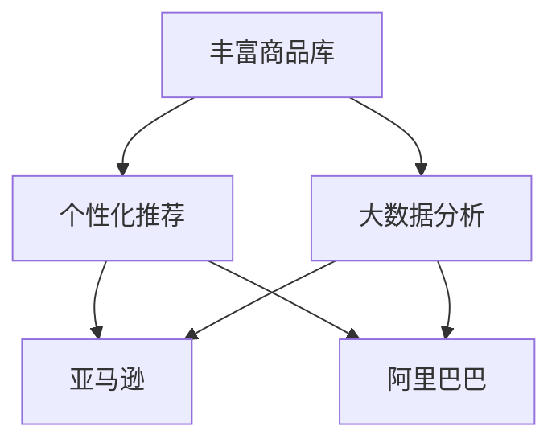

#### 第8章：文化娱乐产业的长尾效应

文化娱乐产业（Culture and Entertainment Industry）是长尾效应的另一个重要应用领域。

#### 8.1 文化娱乐产业的长尾效应

- **丰富内容供给**：文化娱乐产业通过丰富的内容供给，满足了不同消费者的需求。
- **低成本传播**：文化娱乐产业的传播成本较低，使得长尾内容得以广泛传播。
- **创新驱动**：长尾内容为文化娱乐产业提供了丰富的创新资源。

#### 8.2 案例分析：音乐产业的长尾效应

音乐产业是文化娱乐产业的重要组成部分，长尾效应在其中得到了充分体现。

- **丰富内容供给**：音乐产业通过丰富的内容供给，满足了不同消费者的需求。
- **低成本传播**：音乐产业通过数字平台，如Spotify、Apple Music等，实现了低成本传播。
- **创新驱动**：长尾内容为音乐产业提供了丰富的创新资源。

#### 8.3 案例分析：电影产业的长尾效应

电影产业也是文化娱乐产业的重要组成部分，长尾效应在其中同样发挥了重要作用。

- **丰富内容供给**：电影产业通过丰富的内容供给，满足了不同消费者的需求。
- **低成本传播**：电影产业通过数字平台，如Netflix、Amazon Prime Video等，实现了低成本传播。
- **创新驱动**：长尾内容为电影产业提供了丰富的创新资源。

#### 图 8.1：音乐产业和电影产业的长尾效应

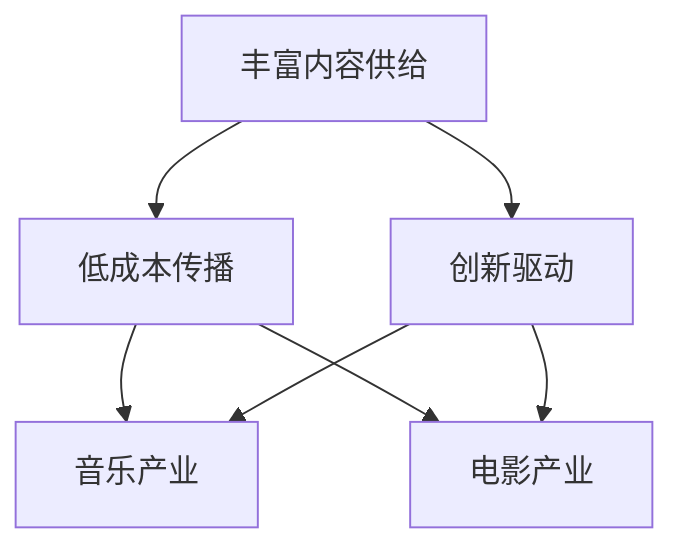

#### 第9章：教育行业的长尾市场

教育行业是长尾理论的另一个重要应用领域，在线教育平台的兴起充分体现了长尾市场的潜力。

#### 9.1 教育行业的长尾市场

- **丰富教育资源**：在线教育平台提供了丰富的教育资源，满足了不同学生的学习需求。
- **低成本获取**：在线教育平台通过数字化手段，实现了教育资源的低成本获取。
- **个性化学习**：在线教育平台通过个性化推荐和学习分析，提供了个性化的学习体验。

#### 9.2 案例分析：在线教育平台的成功案例

- **网易云课堂**：网易云课堂是网易旗下的在线教育平台，通过丰富的课程资源、个性化的学习体验和高效的推荐系统，吸引了大量用户。
- **Coursera**：Coursera是一家全球领先的在线教育平台，提供了来自世界顶级大学和机构的在线课程，满足了全球学生的学习需求。

#### 9.3 案例分析：成人教育的长尾市场

成人教育是教育行业的重要组成部分，长尾市场在其中同样具有巨大潜力。

- **灵活的学习方式**：成人教育平台提供了灵活的学习方式，满足了成人学习者的需求。
- **多样化的课程内容**：成人教育平台提供了多样化的课程内容，涵盖了职业发展、兴趣爱好等多个领域。
- **个性化的学习体验**：成人教育平台通过个性化推荐和学习分析，提供了个性化的学习体验。

#### 图 9.1：在线教育平台和成人教育的长尾市场

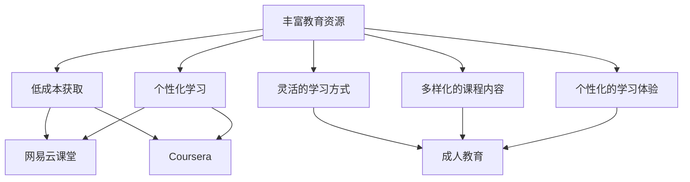

---

### 第四部分：长尾信息的未来展望

#### 第10章：长尾信息的挑战与机遇

随着技术的不断发展，长尾信息面临着新的挑战和机遇。

#### 10.1 长尾信息的挑战

- **数据质量**：长尾信息的数据质量参差不齐，如何保证数据的质量和准确性是一个重要挑战。
- **隐私保护**：长尾信息的处理和分析可能涉及到用户隐私，如何保护用户隐私是一个重要挑战。
- **计算资源**：长尾信息的处理和分析需要大量的计算资源，如何优化计算资源的使用是一个重要挑战。

#### 10.2 长尾信息的机遇

- **数据价值**：长尾信息蕴含着巨大的数据价值，如何挖掘和利用这些价值是一个重要机遇。
- **个性化服务**：长尾信息的处理和分析可以提供更个性化的服务，满足消费者的多样化需求。
- **创新应用**：长尾信息为各个领域提供了丰富的创新资源，如何将这些创新应用到实际中是一个重要机遇。

#### 图 10.1：长尾信息的挑战与机遇

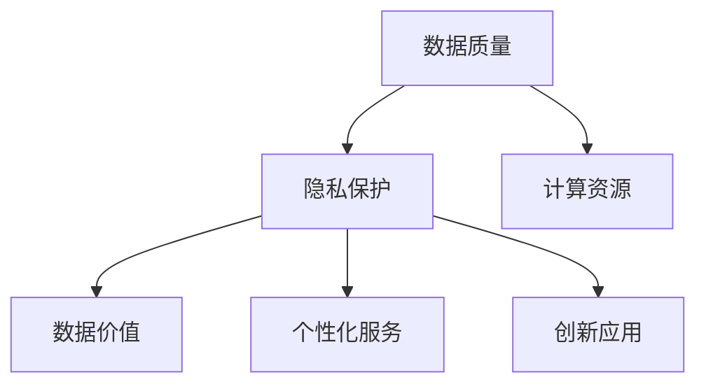

#### 第11章：长尾信息的创新应用

长尾信息的创新应用正在不断扩展，新的领域和行业正在涌现。

#### 11.1 长尾信息在医疗健康领域的应用

- **个性化医疗**：长尾信息可以帮助医生为患者提供个性化的治疗方案。
- **健康监测**：长尾信息可以帮助用户实时监测健康状况，预防疾病。
- **药物研发**：长尾信息可以帮助研究人员发现新的药物靶点和治疗策略。

#### 11.2 长尾信息在环境保护领域的应用

- **环境监测**：长尾信息可以帮助监测环境污染，预测环境变化。
- **资源优化**：长尾信息可以帮助优化资源利用，减少资源浪费。
- **生态保护**：长尾信息可以帮助保护生物多样性，维护生态平衡。

#### 11.3 长尾信息在其他新兴领域的应用

- **智能制造**：长尾信息可以帮助优化生产流程，提高生产效率。
- **智慧城市**：长尾信息可以帮助城市管理者更好地管理和运营城市。
- **社会管理**：长尾信息可以帮助政府更好地服务社会，提高社会管理效率。

#### 图 11.1：长尾信息的创新应用领域

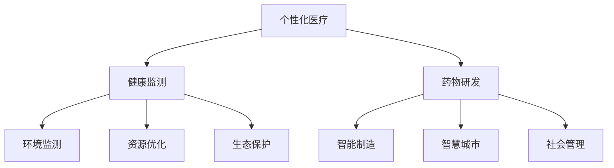

#### 第12章：长尾信息的全球化发展

长尾信息的全球化发展正在加速，新的机遇和挑战也随之而来。

#### 12.1 长尾信息的全球化背景

- **互联网普及**：互联网的普及为长尾信息的全球化提供了基础。
- **移动设备普及**：移动设备的普及使得长尾信息可以随时随地获取。
- **数字化转型**：各行各业的数字化转型为长尾信息的全球化提供了动力。

#### 12.2 全球化长尾信息的传播与影响

- **文化传播**：全球化长尾信息促进了文化的传播和交流。
- **商业竞争**：全球化长尾信息加剧了商业竞争，也带来了新的商机。
- **社会变革**：全球化长尾信息影响了社会结构和价值观念。

#### 12.3 长尾信息全球化的发展策略

- **本地化**：针对不同地区和市场的特点，进行本地化处理，满足当地用户的需求。
- **国际化**：积极参与全球市场，分享全球化的机会和资源。
- **开放合作**：与其他国家和地区的企业和组织建立合作关系，共同推动长尾信息的全球化发展。

#### 图 12.1：长尾信息的全球化发展策略

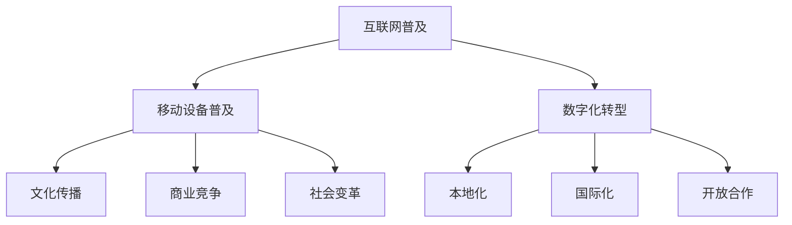

---

### 附录

#### 附录 A：长尾信息的常用工具与技术

- **数据采集与处理工具**：如Apache Nutch、Scrapy等。
- **数据存储与管理技术**：如Hadoop、HDFS、MongoDB等。
- **数据分析与挖掘工具**：如R、Python、Spark等。
- **长尾信息可视化工具**：如D3.js、ECharts等。

#### 附录 B：长尾信息的研究指南与资源

- **研究领域**：如大数据、人工智能、推荐系统等。
- **研究方法**：如统计分析、机器学习、深度学习等。
- **参考资料与数据库**：如Google Scholar、IEEE Xplore、CNKI等。
- **最新动态与趋势**：关注顶级会议和期刊，如KDD、WWW、ICML等。

---

### 作者信息

作者：AI天才研究院/AI Genius Institute & 禅与计算机程序设计艺术 /Zen And The Art of Computer Programming

---

本文旨在为读者提供一个全面而深刻的关于长尾信息的认识，通过理论阐述、案例分析、未来展望等部分，帮助读者理解长尾信息的本质和应用。希望本文能对您的学习和工作有所帮助。让我们继续思考、探索和创造！

