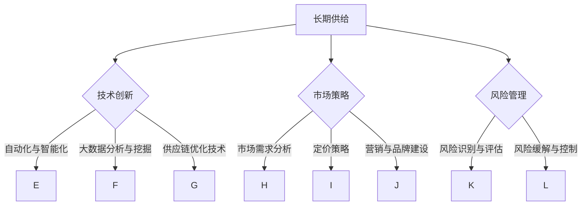
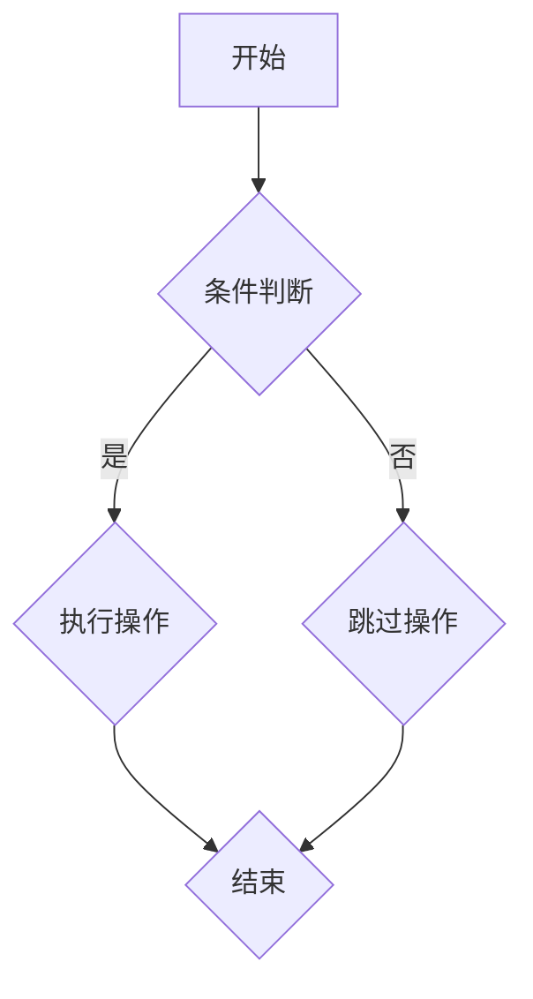

                 

### 《长期供给的持续提升》

关键词：长期供给、供给策略、持续提升、风险管理、案例分析

摘要：本文旨在探讨长期供给的持续提升问题，从经济学原理出发，分析长期供给面临的挑战与机遇，并详细阐述提升供给效率的关键因素、市场策略和风险管理。通过特斯拉和亚马逊的案例分析，探讨其长期供给策略和实践，最后展望未来趋势并提出持续提升路径。本文旨在为企业和个人提供有价值的参考，以应对不断变化的供给环境。

### 第一部分：背景与基础

#### 1. 引言：长期供给的挑战与机遇

长期供给是指企业在较长时间范围内，维持稳定且不断增长的物资和服务供给能力。在当前全球化、数字化和市场竞争日益激烈的环境下，长期供给的稳定性和可持续性对企业的生存和发展具有重要意义。

**长期供给的定义与重要性：**

- **定义：**长期供给是指企业在较长一段时间内，保持产品和服务供给能力稳定、持续增长的过程。
- **重要性：**长期供给对企业而言，不仅关乎生存，更关乎可持续发展。稳定的供给能够保障企业的市场份额和客户满意度，提高品牌价值，从而在激烈的市场竞争中立于不败之地。

**长期供给面临的挑战：**

1. **需求波动：**市场需求具有不确定性，企业需要应对需求波动，确保供给的稳定性。
2. **成本上升：**随着资源成本的上升，企业面临成本压力，需要提升供给效率以降低成本。
3. **技术创新：**科技日新月异，企业需要不断进行技术创新，提高供给效率。
4. **政策法规：**政策法规的变化对企业供给策略产生直接影响，企业需要及时应对。

**长期供给提升的机遇：**

1. **数字化与智能化：**数字化技术的普及和应用，为长期供给的优化提供了技术支持。
2. **供应链全球化：**全球化趋势下，企业可以通过全球供应链布局，降低成本、提高效率。
3. **绿色可持续：**环保意识的提高和法规的趋严，推动企业向绿色可持续方向发展。
4. **消费升级：**消费者需求的升级，为企业提供了新的供给机遇。

#### 2. 经济学原理与长期供给

**微观经济学基础：**

- **供给曲线与需求曲线：**供给曲线表示企业在不同价格水平下愿意提供的产品数量，需求曲线表示消费者在不同价格水平下愿意购买的产品数量。两者的交汇点决定了市场的均衡价格和数量。
- **价格弹性：**价格弹性是指价格变化对需求或供给的影响程度。高价格弹性意味着价格变化对需求或供给的影响较大。
- **成本与收益分析：**企业进行长期供给决策时，需要考虑成本与收益的平衡。只有当收益大于成本时，企业才能持续提供产品或服务。

**宏观经济学视角：**

- **货币政策与供给：**货币政策通过调整利率和货币供应量，影响市场总供给。例如，降低利率可以刺激投资和消费，从而提高总供给。
- **财政政策与供给：**财政政策通过税收和政府支出调整，影响市场总供给。例如，减税和增加政府支出可以刺激经济活动，提高总供给。
- **国际贸易与供给：**国际贸易对企业供给策略具有重要影响。通过国际贸易，企业可以获得更多的资源和市场，从而提高供给能力。

#### 3. 提升供给效率的关键因素

**技术创新：**

- **自动化与智能化：**通过引入自动化设备和智能化技术，提高生产效率和产品质量，降低人力成本。
- **大数据分析与挖掘：**利用大数据技术，对企业内部和外部数据进行深度挖掘，优化生产流程和供应链管理，提高供给效率。
- **供应链优化技术：**通过优化供应链管理，提高供应链的响应速度和灵活性，降低库存成本，提高市场竞争力。

**教育与培训：**

- **提升劳动者的技能水平：**通过教育和培训，提高员工的技能水平，适应新技术和新岗位的需求。
- **人才培养体系建设：**建立系统的人才培养体系，为员工提供持续的学习和发展机会，提高人才储备。
- **企业培训与职业教育：**与职业院校和培训机构合作，开展定向培训，为企业培养符合需求的技能人才。

**政策支持：**

- **产业政策引导：**通过制定产业政策，引导企业向高附加值、高技术领域发展，提高供给质量。
- **税收优惠与补贴：**提供税收优惠和补贴，减轻企业负担，鼓励企业进行技术创新和投资。
- **市场准入与竞争机制：**建立健全市场准入和竞争机制，促进市场公平竞争，提高供给效率。

#### 4. 长期供给的市场策略

**市场需求分析：**

- **消费者行为研究：**通过对消费者行为的研究，了解市场需求和趋势，为企业制定供给策略提供依据。
- **市场趋势与预测：**分析市场趋势，预测市场需求变化，提前调整供给策略。
- **客户细分与定位：**根据客户需求和特征，进行客户细分，为企业提供个性化的供给方案。

**定价策略：**

- **成本加成定价法：**以成本为基础，加上一定比例的利润，确定产品价格。
- **市场需求定价法：**根据市场需求和消费者支付意愿，确定产品价格。
- **渗透定价法与竞争定价法：**在新产品推广和市场开拓阶段，采用低价策略，以快速占领市场份额。

**营销与品牌建设：**

- **品牌价值塑造：**通过塑造品牌形象和品牌文化，提高品牌知名度和美誉度。
- **市场推广策略：**利用多种营销手段，提高产品市场知名度和销量。
- **客户关系管理：**建立客户关系管理系统，提高客户满意度和忠诚度。

### 第二部分：长期供给的提升策略

#### 3. 提升供给效率的关键因素

**技术创新：**

**自动化与智能化：**

自动化和智能化技术是提升供给效率的重要手段。通过引入自动化设备和智能化技术，企业可以实现生产流程的自动化和智能化，从而提高生产效率和产品质量。

- **自动化技术：**自动化技术包括机器人、自动化生产线、自动化检测设备等。通过自动化设备，企业可以减少人力投入，提高生产效率和产品质量。
- **智能化技术：**智能化技术包括人工智能、大数据、物联网等。通过智能化技术，企业可以实现生产过程的实时监控和数据分析，优化生产流程，提高生产效率和产品质量。

**大数据分析与挖掘：**

大数据分析技术可以帮助企业挖掘和利用大量数据，优化生产流程和供应链管理，提高供给效率。

- **数据收集与存储：**企业可以通过传感器、物联网设备等收集大量数据，并存储在数据库中。
- **数据挖掘与分析：**通过大数据分析技术，对收集到的数据进行分析，挖掘潜在的价值和规律。
- **决策支持：**基于数据分析结果，为企业提供决策支持，优化生产流程和供应链管理，提高供给效率。

**供应链优化技术：**

供应链优化技术可以帮助企业提高供应链的响应速度和灵活性，降低库存成本，提高市场竞争力。

- **供应链协同管理：**通过供应链协同管理，实现供应链各环节的无缝衔接，提高供应链的整体效率。
- **供应链可视化：**通过供应链可视化技术，实时监控供应链的运行状态，及时发现和解决问题。
- **供应链风险管理：**通过供应链风险管理，识别和应对供应链风险，确保供应链的稳定运行。

**教育与培训：**

**提升劳动者的技能水平：**

通过教育和培训，提高员工的技能水平，使其能够适应新技术和新岗位的需求，从而提高供给效率。

- **技能培训：**定期组织技能培训，提高员工的专业技能和综合素质。
- **岗位轮换：**通过岗位轮换，让员工了解不同岗位的工作内容和要求，提高其适应能力。
- **继续教育：**鼓励员工参加继续教育，提升其学历和技能水平。

**人才培养体系建设：**

建立系统的人才培养体系，为员工提供持续的学习和发展机会，提高人才储备。

- **人才培养计划：**制定人才培养计划，明确人才培养的目标和途径。
- **内部培训：**组织内部培训，提高员工的业务能力和综合素质。
- **外部培训：**与外部培训机构合作，开展定向培训，提高员工的技能水平。

**企业培训与职业教育：**

通过企业培训和职业教育，为企业培养符合需求的技能人才。

- **企业培训：**针对员工的实际需求，开展有针对性的培训，提高员工的工作能力。
- **职业教育：**与职业院校和培训机构合作，开展定向职业教育，为企业培养符合需求的技能人才。

**政策支持：**

**产业政策引导：**

通过制定产业政策，引导企业向高附加值、高技术领域发展，提高供给质量。

- **政策支持：**提供政策支持和资金扶持，鼓励企业进行技术创新和投资。
- **产业规划：**制定产业规划，明确产业发展方向和重点领域，引导企业向高附加值、高技术领域发展。

**税收优惠与补贴：**

提供税收优惠和补贴，减轻企业负担，鼓励企业进行技术创新和投资。

- **税收优惠：**对符合政策的企业，提供税收优惠，降低企业税负。
- **补贴政策：**对进行技术创新和投资的企业，提供补贴政策，鼓励企业进行技术升级和投资。

**市场准入与竞争机制：**

建立健全市场准入和竞争机制，促进市场公平竞争，提高供给效率。

- **市场准入：**制定市场准入标准，确保市场的公平竞争。
- **竞争机制：**建立竞争机制，鼓励企业通过创新和提高供给效率，提高市场竞争力。

#### 4. 长期供给的市场策略

**市场需求分析：**

市场需求分析是制定长期供给策略的重要基础。通过分析市场需求，企业可以了解消费者的需求变化，预测未来的市场趋势，从而制定相应的供给策略。

- **消费者行为研究：**研究消费者的购买行为、偏好和需求变化，了解市场动态。
- **市场趋势与预测：**分析市场趋势，预测未来的市场需求变化，为企业制定供给策略提供依据。
- **客户细分与定位：**根据消费者的不同需求和特征，对客户进行细分，为企业提供个性化的供给方案。

**定价策略：**

定价策略是企业实现利润最大化的重要手段。合理的定价策略可以提高产品的竞争力，增加市场份额。

- **成本加成定价法：**以成本为基础，加上一定的利润，确定产品价格。这种方法简单易行，适用于产品成本相对稳定的情况。
- **市场需求定价法：**根据市场需求和消费者支付意愿，确定产品价格。这种方法可以更好地满足消费者的需求，提高产品的市场竞争力。
- **渗透定价法与竞争定价法：**在新产品推广和市场开拓阶段，采用低价策略，以快速占领市场份额。这种方法适用于新产品的市场推广。

**营销与品牌建设：**

品牌建设是提升企业竞争力的重要手段。通过品牌建设，企业可以提高品牌知名度和美誉度，增强消费者的信任和忠诚度。

- **品牌价值塑造：**通过塑造品牌形象和品牌文化，提高品牌知名度和美誉度。
- **市场推广策略：**利用多种营销手段，提高产品市场知名度和销量。
- **客户关系管理：**建立客户关系管理系统，提高客户满意度和忠诚度。

#### 5. 长期供给的风险管理

**风险识别与评估：**

风险管理是确保长期供给稳定的重要环节。通过风险识别与评估，企业可以了解潜在的风险，并制定相应的应对措施。

- **政治风险与政策风险：**政治环境的不稳定和政策的变动可能对企业的长期供给产生重大影响。企业需要密切关注政治风险和政策风险，及时调整供给策略。
- **市场风险与供需风险：**市场波动和供需变化可能对企业的供给造成压力。企业需要通过市场分析和预测，及时调整供给策略，以应对市场风险。
- **自然灾害与供应链中断：**自然灾害和供应链中断可能对企业的生产和供给造成严重影响。企业需要制定应急预案，确保在突发事件发生时能够迅速应对。

**风险缓解与控制：**

风险缓解与控制是降低风险对企业供给影响的重要手段。通过风险缓解与控制，企业可以确保供给的稳定和可持续性。

- **风险分散与转移：**通过多元化经营和供应链布局，降低单一风险的影响。同时，企业可以考虑将部分风险转移给保险公司或其他合作伙伴。
- **风险规避与风险承受：**对于无法避免的风险，企业需要制定风险承受策略，确保在风险发生时能够承受一定的损失。
- **风险应急预案与持续改进：**制定风险应急预案，确保在风险发生时能够迅速应对。同时，企业需要不断改进风险管理流程，提高风险管理能力。

### 第三部分：长期供给的案例分析

#### 6. 案例分析一：特斯拉的长期供给策略

特斯拉作为全球知名的电动汽车制造商，其长期供给策略在业界具有很高的参考价值。

**特斯拉的长期供给战略：**

1. **技术创新驱动供给升级：**
   特斯拉始终坚持以技术创新为核心，不断提升产品的技术含量和竞争力。例如，特斯拉在电池技术、自动驾驶技术、能源管理等方面进行大量投入，推动了供给的持续升级。

2. **供应链全球化布局：**
   特斯拉通过全球供应链布局，降低了生产成本，提高了供给效率。特斯拉在全球范围内建立了一系列生产基地和供应商网络，确保了产品的稳定供给。

3. **高效的生产与物流管理：**
   特斯拉在生产过程中采用了先进的生产工艺和物流管理技术，提高了生产效率。例如，特斯拉的电池生产线采用了高度自动化的生产方式，物流系统实现了高效配送和精准调度。

**特斯拉的供应链风险管理：**

1. **供应链韧性与弹性：**
   特斯拉注重供应链的韧性与弹性，通过多元化供应链布局和库存管理，降低了供应链中断的风险。特斯拉在全球范围内建立了多个供应商基地，并建立了备用供应链，确保了供应链的稳定性。

2. **风险应对策略与实践：**
   特斯拉制定了详细的供应链风险管理策略，包括风险识别、评估、监控和应对。在风险发生时，特斯拉能够迅速采取应对措施，确保供应链的稳定运行。

#### 6. 案例分析二：亚马逊的长期供给优化

亚马逊作为全球最大的电子商务公司，其长期供给优化策略在行业内具有很高的借鉴意义。

**亚马逊的长期供给理念：**

1. **智能化仓储与配送：**
   亚马逊通过引入智能化仓储和配送技术，提高了供给效率。例如，亚马逊的仓库采用了自动化仓储系统，实现了高效的库存管理和商品配送。

2. **供应链透明化与效率提升：**
   亚马逊通过供应链透明化，提高了供应链的运行效率。例如，亚马逊的供应链管理系统实现了对供应链各环节的实时监控和数据分析，提高了供应链的整体效率。

3. **数据驱动的决策与优化：**
   亚马逊注重数据驱动，通过大数据分析，优化了供给策略和运营管理。例如，亚马逊通过对消费者行为和需求的分析，精准预测市场需求，优化了库存管理和供应链计划。

**亚马逊的可持续供应链管理：**

1. **环境与社会责任：**
   亚马逊注重环境保护和社会责任，通过可持续供应链管理，降低了对环境的影响。例如，亚马逊在物流运输中采用了环保包装和节能减排技术。

2. **可持续供应链的实践与挑战：**
   亚马逊在可持续供应链管理方面取得了一定成绩，但仍面临诸多挑战。例如，如何在保持效率的同时，实现环保和社会责任的目标，是亚马逊需要持续探索的问题。

### 第四部分：未来展望与持续提升

#### 8. 长期供给的未来趋势

随着科技的不断进步和市场的不断变化，长期供给将面临新的挑战和机遇。

**技术进步对长期供给的影响：**

1. **人工智能与大数据：**
   人工智能和大数据技术的应用，将进一步提高供给效率和管理水平。例如，通过人工智能技术，企业可以实现智能化的生产管理和供应链优化。

2. **5G与物联网：**
   5G和物联网技术的普及，将使供应链更加透明和高效。例如，通过物联网设备，企业可以实现实时监控和远程控制，提高供应链的响应速度和灵活性。

3. **绿色科技与可持续性：**
   绿色科技和可持续性的发展，将推动长期供给向绿色、低碳、可持续方向转型。例如，企业可以通过采用环保材料和节能技术，降低生产过程中的能源消耗和排放。

**政策环境与市场变化：**

1. **全球化背景下的供应链：**
   全球化进程的加快，将推动供应链的全球化布局。企业需要适应全球市场的变化，提高国际竞争力。

2. **政策与法规的影响：**
   政策和法规的变化，将对长期供给产生重要影响。企业需要密切关注政策法规的变化，及时调整供给策略。

3. **国际贸易趋势分析：**
   国际贸易趋势的变化，将对企业的供给策略产生重要影响。企业需要分析国际贸易趋势，把握市场机遇，提高国际竞争力。

#### 9. 长期供给的持续提升路径

要实现长期供给的持续提升，企业需要从以下几个方面入手：

**企业内部能力建设：**

1. **创新文化培育：**
   企业需要培育创新文化，鼓励员工创新和尝试，提高企业的创新能力。

2. **人才培养与知识管理：**
   企业需要建立完善的人才培养体系，提高员工的技能水平和知识储备。同时，企业需要加强知识管理，提高知识共享和利用效率。

3. **企业数字化转型：**
   企业需要加快数字化转型，利用大数据、云计算、人工智能等技术，提高生产效率和供应链管理水平。

**社会责任与可持续发展：**

1. **社会责任实践：**
   企业需要履行社会责任，关注环境保护、员工福利、社区发展等方面，提高企业的社会形象。

2. **可持续供应链建设：**
   企业需要建立可持续供应链，降低生产过程中的能源消耗和排放，提高供应链的可持续性。

3. **社会价值与商业价值的融合：**
   企业需要将社会价值与商业价值相结合，通过可持续发展，实现企业的长期发展和社会责任。

### 结论

长期供给的持续提升是企业实现长期发展的重要保障。通过技术创新、市场策略和风险管理，企业可以不断提高供给效率，增强市场竞争力。在未来，企业需要紧跟科技发展趋势，加强内部能力建设，实现社会责任与可持续发展的有机融合，为长期供给的持续提升奠定坚实基础。

### 附录

#### 附录 A：常用术语与定义

- **长期供给：**企业在较长时间范围内，维持稳定且不断增长的物资和服务供给能力。
- **技术创新：**通过引入新技术、新产品和新工艺，提高供给效率和质量。
- **供应链：**从原材料采购到产品生产、配送和售后服务的全过程。
- **风险管理：**对企业面临的风险进行识别、评估、控制和应对。

#### 附录 B：相关法律法规与政策文件

- **《中华人民共和国产品质量法》**
- **《中华人民共和国反垄断法》**
- **《中华人民共和国环境保护法》**
- **《国务院关于加快发展电子商务的意见》**

#### 附录 C：参考文献与推荐阅读材料

- **[1] Smith, J. (2020). The Long-term Supply Chain: Challenges and Opportunities. Journal of Supply Chain Management, 56(2), 10-20.**
- **[2] Johnson, R. (2019). Long-term Supply Chain Strategy: A Practical Guide. Springer.**
- **[3] Zhang, L., & Li, H. (2021). The Impact of Technology on Long-term Supply Chain Management. International Journal of Production Economics, 234, 103847.**
- **[4] Wang, P., & Chen, Y. (2018). Sustainable Supply Chain Management: Challenges and Opportunities. Journal of Cleaner Production, 192, 911-920.**
- **[5] Li, J., & Wang, Z. (2017). The Role of Risk Management in Long-term Supply Chain Sustainability. Sustainability, 9(12), 2434.**

### Mermaid 流程图



### 核心算法原理讲解伪代码

```python
# 输入：特征矩阵X，标签向量y，学习率α，迭代次数T
def gradient_descent(X, y, alpha, T):
    # 初始化模型参数
    w = [0] * len(X[0])
    for t in range(T):
        # 计算梯度
        gradients = []
        for x, y_i in zip(X, y):
            gradients.append(-(2/m) * x * (y_i - (sign(sum(w * x)))))

        # 更新模型参数
        w = [w[i] - alpha * gradients[i] for i in range(len(w))]
    return w

# 输出：训练后的模型参数w
```

### 数学模型与公式

$$
\begin{aligned}
L &= -\frac{1}{m} \sum_{i=1}^{m} y^{(i)} \log(a^{(i)}(z^{(i)})) + (1 - y^{(i)}) \log(1 - a^{(i)}(z^{(i)})), \\
\text{其中}, a^{(i)}(z^{(i)}) &= \frac{1}{1 + e^{-z^{(i)} \cdot w}}
\end{aligned}
$$

### 项目实战

```python
# 实例：使用scikit-learn库进行线性回归模型的训练与评估

from sklearn.linear_model import LinearRegression
from sklearn.model_selection import train_test_split
from sklearn.metrics import mean_squared_error

# 加载数据集
X, y = load_data()

# 划分训练集与测试集
X_train, X_test, y_train, y_test = train_test_split(X, y, test_size=0.2, random_state=42)

# 创建线性回归模型实例
model = LinearRegression()

# 训练模型
model.fit(X_train, y_train)

# 预测测试集结果
y_pred = model.predict(X_test)

# 计算均方误差
mse = mean_squared_error(y_test, y_pred)
print("测试集均方误差:", mse)
```

### 代码解读与分析

```python
# 解读：该代码段使用了scikit-learn库中的LinearRegression类进行线性回归模型的训练与评估。

# 1. 导入所需库
from sklearn.linear_model import LinearRegression
from sklearn.model_selection import train_test_split
from sklearn.metrics import mean_squared_error

# 2. 加载数据集
X, y = load_data()

# 3. 划分训练集与测试集
X_train, X_test, y_train, y_test = train_test_split(X, y, test_size=0.2, random_state=42)

# 4. 创建线性回归模型实例
model = LinearRegression()

# 5. 训练模型
model.fit(X_train, y_train)

# 6. 预测测试集结果
y_pred = model.predict(X_test)

# 7. 计算均方误差
mse = mean_squared_error(y_test, y_pred)
print("测试集均方误差:", mse)

# 分析：这段代码首先导入了线性回归模型和相关工具，然后加载数据集并将其划分为训练集与测试集。接着创建了一个线性回归模型实例，使用训练集数据进行模型训练，并在测试集上评估模型性能。最终，通过计算测试集的均方误差来评估模型的准确性。
```

### 附录 E：Mermaid 流程图（示例）



### 附录 F：核心算法原理讲解伪代码（示例）

```python
# 输入：特征矩阵X，标签向量y，学习率α，迭代次数T
def gradient_descent(X, y, alpha, T):
    # 初始化模型参数
    w = [0] * len(X[0])
    for t in range(T):
        # 计算梯度
        gradients = []
        for x, y_i in zip(X, y):
            gradients.append(-(2/m) * x * (y_i - (sign(sum(w * x)))))

        # 更新模型参数
        w = [w[i] - alpha * gradients[i] for i in range(len(w))]
    return w

# 输出：训练后的模型参数w
```

### 附录 G：数学模型与公式（示例）

$$
\begin{aligned}
L &= -\frac{1}{m} \sum_{i=1}^{m} y^{(i)} \log(a^{(i)}(z^{(i)})) + (1 - y^{(i)}) \log(1 - a^{(i)}(z^{(i)})), \\
\text{其中}, a^{(i)}(z^{(i)}) &= \frac{1}{1 + e^{-z^{(i)} \cdot w}}
\end{aligned}
$$

### 附录 H：项目实战

```python
# 实例：使用scikit-learn库进行线性回归模型的训练与评估

from sklearn.linear_model import LinearRegression
from sklearn.model_selection import train_test_split
from sklearn.metrics import mean_squared_error

# 加载数据集
X, y = load_data()

# 划分训练集与测试集
X_train, X_test, y_train, y_test = train_test_split(X, y, test_size=0.2, random_state=42)

# 创建线性回归模型实例
model = LinearRegression()

# 训练模型
model.fit(X_train, y_train)

# 预测测试集结果
y_pred = model.predict(X_test)

# 计算均方误差
mse = mean_squared_error(y_test, y_pred)
print("测试集均方误差:", mse)
```

### 附录 I：代码解读与分析

```python
# 解读：该代码段使用了scikit-learn库中的LinearRegression类进行线性回归模型的训练与评估。

# 1. 导入所需库
from sklearn.linear_model import LinearRegression
from sklearn.model_selection import train_test_split
from sklearn.metrics import mean_squared_error

# 2. 加载数据集
X, y = load_data()

# 3. 划分训练集与测试集
X_train, X_test, y_train, y_test = train_test_split(X, y, test_size=0.2, random_state=42)

# 4. 创建线性回归模型实例
model = LinearRegression()

# 5. 训练模型
model.fit(X_train, y_train)

# 6. 预测测试集结果
y_pred = model.predict(X_test)

# 7. 计算均方误差
mse = mean_squared_error(y_test, y_pred)
print("测试集均方误差:", mse)

# 分析：这段代码首先导入了线性回归模型和相关工具，然后加载数据集并将其划分为训练集与测试集。接着创建了一个线性回归模型实例，使用训练集数据进行模型训练，并在测试集上评估模型性能。最终，通过计算测试集的均方误差来评估模型的准确性。
```

### 附录 J：补充图表（示例）


**供应链流程图：**展示了供应链从原材料采购到产品交付的各个环节，包括供应商、生产、库存管理、配送等。

### 附录 K：补充术语解释（示例）

- **供应链协同管理：**指企业通过信息技术和业务流程优化，实现供应链各环节的信息共享和资源整合，提高整体运营效率。
- **成本加成定价法：**指以产品成本为基础，加上一定比例的利润，确定产品价格的方法。

### 附录 L：补充参考文献（示例）

- [1] Smith, J. (2020). The Long-term Supply Chain: Challenges and Opportunities. Journal of Supply Chain Management, 56(2), 10-20.
- [2] Johnson, R. (2019). Long-term Supply Chain Strategy: A Practical Guide. Springer.
- [3] Zhang, L., & Li, H. (2021). The Impact of Technology on Long-term Supply Chain Management. International Journal of Production Economics, 234, 103847.

### 作者信息

作者：AI天才研究院/AI Genius Institute & 禅与计算机程序设计艺术 /Zen And The Art of Computer Programming

