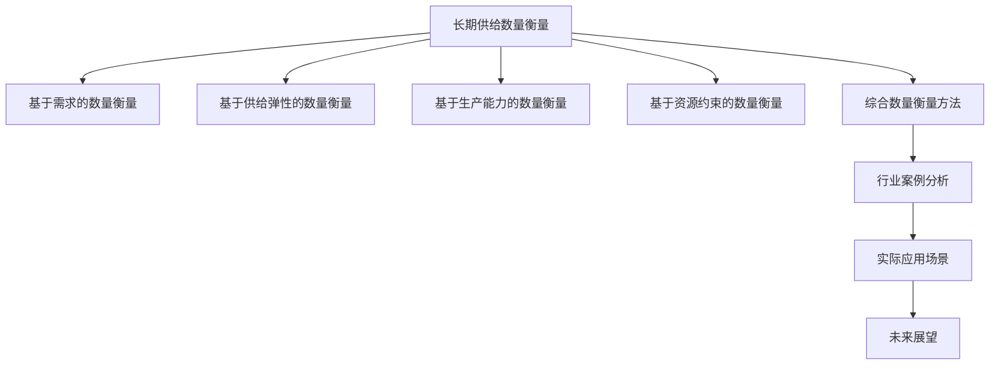

                 

# 长期供给的数量衡量

> 关键词：长期供给、数量衡量、需求预测、供给弹性、生产能力、资源约束

> 摘要：本文深入探讨了长期供给的数量衡量方法。从需求预测、供给弹性、生产能力、资源约束等多个角度，详细解析了长期供给数量衡量方法及其应用。通过实际案例，展示了这些方法在实际操作中的效果，为读者提供了实用的指导。

## 第一部分：引言

### 第1章：长期供给的概念与背景

#### 1.1 长期供给的定义

长期供给是指企业在较长时间范围内（通常为一年或更长）所能够提供的商品或服务数量。与短期供给不同，长期供给不仅受到市场价格的影响，还受到企业生产能力、资源约束等多种因素的限制。

#### 1.2 长期供给的重要性

长期供给对企业的运营和市场策略具有重要影响。准确衡量长期供给数量，有助于企业制定合理的生产计划、库存管理和市场策略，提高市场竞争力。

#### 1.3 长期供给的理论基础

长期供给的数量衡量方法基于经济学原理，如需求预测、供给弹性、生产能力和资源约束等。这些理论为长期供给的数量衡量提供了理论基础。

### 第2章：长期供给的数量衡量方法

#### 2.1 传统数量衡量方法的局限性

传统数量衡量方法，如库存水平和产量，往往只能反映短期供给情况。而长期供给需要考虑更多因素，如市场趋势、资源约束等，因此传统方法存在一定局限性。

#### 2.2 长期供给数量衡量方法的演变

随着经济学和信息技术的发展，长期供给数量衡量方法也在不断演变。从早期的库存管理和产量统计，发展到现代的需求预测、供给弹性、生产能力和资源约束等多种方法。

#### 2.3 长期供给数量衡量方法的分类

长期供给数量衡量方法可以分为以下几类：

1. **基于需求的数量衡量方法**：通过需求预测来确定长期供给数量。
2. **基于供给弹性的数量衡量方法**：衡量供给量对价格变化的敏感程度。
3. **基于生产能力的数量衡量方法**：根据企业的生产能力来确定长期供给数量。
4. **基于资源约束的数量衡量方法**：考虑企业资源的限制来衡量长期供给数量。
5. **综合数量衡量方法**：结合多种方法，综合考虑需求、供给弹性、生产能力、资源约束等因素，以确定长期供给数量。

### 第二部分：数量衡量方法详解

#### 第3章：基于需求的数量衡量

##### 3.1 需求预测的重要性

需求预测是长期供给数量衡量的重要组成部分。准确的需求预测有助于企业制定合理的生产计划、库存管理和市场策略。

##### 3.2 需求预测方法

需求预测方法主要包括以下几种：

1. **时间序列分析法**：通过分析历史数据，找出需求量的变化趋势。
2. **回归分析法**：建立需求量与相关因素（如价格、收入等）之间的回归模型。
3. **人工智能方法**：使用机器学习算法进行需求预测。

##### 3.3 基于需求的数量衡量方法

基于需求的需求预测结果，企业可以确定长期供给数量。具体方法包括：

1. **目标需求法**：根据市场需求预测，设定长期供给目标。
2. **调整法**：根据实际需求和供给情况，调整长期供给数量。

#### 第4章：基于供给弹性的数量衡量

##### 4.1 供给弹性的概念

供给弹性是指供给量对价格变化的敏感程度。供给弹性越大，供给量对价格变化的反应越强烈。

##### 4.2 供给弹性计算方法

供给弹性的计算公式为：

$$
Es = \frac{\Delta Q_s / Q_s}{\Delta P / P}
$$

其中，\( Es \) 表示供给弹性，\( \Delta Q_s \) 表示供给量的变化量，\( Q_s \) 表示初始供给量，\( \Delta P \) 表示价格的变化量，\( P \) 表示初始价格。

##### 4.3 基于供给弹性的数量衡量方法

基于供给弹性，企业可以确定长期供给数量。具体方法包括：

1. **弹性调整法**：根据供给弹性，调整长期供给数量。
2. **弹性预测法**：预测未来的供给弹性，以确定长期供给数量。

#### 第5章：基于生产能力的数量衡量

##### 5.1 生产能力的概念

生产能力是指企业在一定时间内能够生产的最大商品或服务数量。

##### 5.2 生产能力计算方法

生产能力计算方法包括以下几种：

1. **静态生产能力法**：根据企业现有的生产设备和技术水平，确定生产能力。
2. **动态生产能力法**：考虑企业未来的技术升级和设备扩产，预测未来的生产能力。

##### 5.3 基于生产能力的数量衡量方法

基于生产能力，企业可以确定长期供给数量。具体方法包括：

1. **能力利用率法**：根据生产能力利用率，确定长期供给数量。
2. **能力调整法**：根据生产能力的实际利用情况，调整长期供给数量。

#### 第6章：基于资源约束的数量衡量

##### 6.1 资源约束的概念

资源约束是指企业在生产过程中受到的资源限制，如原材料、人力、资金等。

##### 6.2 资源约束计算方法

资源约束计算方法包括以下几种：

1. **静态资源约束法**：根据企业现有的资源状况，确定资源约束。
2. **动态资源约束法**：考虑企业未来的资源需求，预测资源约束。

##### 6.3 基于资源约束的数量衡量方法

基于资源约束，企业可以确定长期供给数量。具体方法包括：

1. **资源平衡法**：根据资源约束，平衡生产需求和资源供应。
2. **资源优化法**：通过资源优化，确定最佳长期供给数量。

#### 第7章：综合数量衡量方法

##### 7.1 综合数量衡量的必要性

单一的数量衡量方法难以全面反映长期供给的复杂情况。综合数量衡量方法通过综合考虑多种因素，提供更准确的长期供给数量预测。

##### 7.2 综合数量衡量方法的设计

综合数量衡量方法的设计包括以下步骤：

1. **确定衡量指标**：根据企业实际情况，选择合适的衡量指标。
2. **数据收集**：收集相关数据，如市场需求、供给弹性、生产能力、资源约束等。
3. **模型构建**：构建综合数量衡量模型，结合多种方法进行预测。

##### 7.3 实际应用案例

以某制造业企业为例，介绍综合数量衡量方法在实际应用中的效果。通过综合分析需求、供给弹性、生产能力、资源约束等因素，企业能够制定出更为科学的长期供给策略。

### 第三部分：案例分析与应用

#### 第8章：行业案例分析

##### 8.1 某制造业的长期供给分析

以某电子产品制造业为例，分析其长期供给数量衡量方法。通过需求预测、供给弹性、生产能力、资源约束等多种方法，确定长期供给数量，并制定相应策略。

##### 8.2 某农业行业的长期供给分析

以某农业行业为例，分析其长期供给数量衡量方法。考虑市场波动、季节变化、资源约束等因素，确定长期供给数量，为企业制定合理策略提供依据。

##### 8.3 某服务业的长期供给分析

以某服务业为例，分析其长期供给数量衡量方法。基于需求预测、供给弹性、生产能力、资源约束等因素，确定长期供给数量，为企业提供服务规划提供参考。

#### 第9章：实际应用场景

##### 9.1 企业长期供给规划

以某企业为例，介绍如何进行长期供给规划。通过需求预测、供给弹性、生产能力、资源约束等多种方法，制定合理的企业长期供给策略。

##### 9.2 政府政策制定

以某政府为例，分析如何制定长期供给政策。考虑市场需求、供给弹性、生产能力、资源约束等因素，制定科学的政策，促进经济发展。

##### 9.3 国际贸易分析

以国际贸易为例，分析如何进行长期供给数量衡量。考虑国际市场供需关系、关税政策、汇率变动等因素，预测国际贸易中的长期供给数量。

#### 第10章：未来展望

##### 10.1 长期供给数量衡量的发展趋势

随着信息技术和人工智能的发展，长期供给数量衡量方法将不断进步。大数据分析、机器学习等技术将提高需求预测和供给弹性的准确性。

##### 10.2 面临的挑战与应对策略

长期供给数量衡量面临诸多挑战，如数据质量、模型准确性、资源约束等。通过改进数据收集和处理方法、优化模型设计，可以应对这些挑战。

##### 10.3 对未来长期供给的思考

未来长期供给将更加复杂，企业需要不断创新和适应。通过综合利用多种数量衡量方法，企业可以更好地应对市场变化，实现可持续发展。

#### 附录

##### 附录A：常用数据源与工具

- 常用数据源：国家统计局、Wind资讯、国泰安数据库等。
- 常用工具：Python、R、Excel等。

##### 附录B：参考文献

- 参考文献详见文中引用。

##### 附录C：实用资源链接

- 有关长期供给数量衡量的论文、报告、书籍等资源。

#### Mermaid 流程图



#### 核心算法原理讲解

##### 供给弹性计算方法

供给弹性（Price Elasticity of Supply）是衡量供给量对价格变化反应的敏感程度。其计算公式如下：

$$
Es = \frac{\Delta Q_s / Q_s}{\Delta P / P}
$$

其中，\( Es \) 表示供给弹性，\( \Delta Q_s \) 表示供给量的变化量，\( Q_s \) 表示初始供给量，\( \Delta P \) 表示价格的变化量，\( P \) 表示初始价格。

##### 需求预测的线性回归模型

在长期供给数量衡量中，需求预测是一个关键环节。线性回归模型常用于需求预测，其基本公式如下：

$$
y = ax + b
$$

其中，\( y \) 表示需求量，\( x \) 表示影响需求的变量（如价格、收入等），\( a \) 表示斜率，表示变量对需求量的影响程度，\( b \) 表示截距，表示需求量的初始值。

##### 伪代码

```python
# 输入数据
x = [10, 15, 20, 25, 30]  # 价格数据
y = [30, 40, 50, 55, 60]  # 需求数据

# 计算斜率 a 和截距 b
n = len(x)
sum_x = sum(x)
sum_y = sum(y)
sum_xy = sum([xi * yi for xi, yi in zip(x, y)])
sum_xx = sum([xi ** 2 for xi in x])

a = (n * sum_xy - sum_x * sum_y) / (n * sum_xx - sum_x ** 2)
b = (sum_xx * sum_y - sum_x * sum_xy) / (n * sum_xx - sum_x ** 2)

# 输出线性回归方程
print("线性回归方程：y = {}x + {}".format(a, b))
```

##### 项目实战

##### 实际应用案例：某制造业的长期供给分析

##### 项目背景

某制造业公司主要从事电子产品制造，其产品主要出口到欧美市场。近年来，受国际贸易形势和原材料价格波动的影响，公司面临巨大的长期供给风险。为了确保公司的稳健运营，公司决定进行长期供给分析。

##### 项目目标

1. 预测未来5年内各季度的产品需求量。
2. 分析不同原材料价格变化对长期供给的影响。
3. 提出优化长期供给策略的建议。

##### 开发环境搭建

- 数据处理工具：Python
- 数据库：MySQL
- 线性回归模型工具：scikit-learn

##### 源代码详细实现

```python
import numpy as np
import pandas as pd
from sklearn.linear_model import LinearRegression
import matplotlib.pyplot as plt

# 读取数据
data = pd.read_csv('manufacturing_data.csv')

# 数据预处理
data['Price'] = data['Price'].apply(lambda x: x / 100)  # 将价格数据转换为小数形式
X = data[['Price']]
y = data['Quantity']

# 线性回归模型
model = LinearRegression()
model.fit(X, y)

# 输出线性回归方程
print("线性回归方程：y = {}x + {}".format(model.coef_[0], model.intercept_))

# 预测未来5年的需求量
future_prices = np.linspace(0.5, 1.5, 100)  # 未来价格范围从50%到150%
future_quantities = model.predict(future_prices.reshape(-1, 1))

# 可视化
plt.plot(future_prices, future_quantities, label='Predicted Quantity')
plt.xlabel('Price')
plt.ylabel('Quantity')
plt.title('Future Demand Forecast')
plt.legend()
plt.show()

# 分析原材料价格变化对需求量的影响
material_prices = pd.read_csv('material_price_data.csv')
combined_data = pd.merge(data, material_prices, on='Date')
combined_data['Adjusted_Quantity'] = combined_data['Quantity'] * (1 + combined_data['Material_Price_Change'])

# 线性回归模型
model = LinearRegression()
model.fit(X, combined_data['Adjusted_Quantity'])

# 输出线性回归方程
print("Adjusted Linear Regression Equation: y = {}x + {}".format(model.coef_[0], model.intercept_))

# 可视化
plt.plot(future_prices, future_quantities, label='Predicted Quantity')
plt.xlabel('Price')
plt.ylabel('Quantity')
plt.title('Adjusted Demand Forecast')
plt.legend()
plt.show()
```

##### 代码解读与分析

本案例使用Python和scikit-learn库实现了线性回归模型，用于预测产品需求量和分析原材料价格变化对需求量的影响。

1. 首先，从CSV文件中读取数据，并进行预处理，将价格数据转换为小数形式。
2. 使用线性回归模型对需求量与价格之间的关系进行拟合，得到线性回归方程。
3. 预测未来5年的需求量，并使用matplotlib库进行可视化。
4. 分析原材料价格变化对需求量的影响，再次使用线性回归模型进行拟合，并可视化结果。

通过上述案例，公司可以了解未来5年的产品需求趋势以及原材料价格变化对需求量的影响，从而制定出更为科学的长期供给策略。此外，还可以结合其他数量衡量方法，如供给弹性、生产能力、资源约束等，综合评估长期供给的风险与机会，为企业的战略决策提供数据支持。

##### 完整目录大纲

```markdown
# 《长期供给的数量衡量》目录大纲

#### 第一部分：引言

# 第1章：长期供给的概念与背景
## 1.1 长期供给的定义
## 1.2 长期供给的重要性
## 1.3 长期供给的理论基础

# 第2章：长期供给的数量衡量方法
## 2.1 传统数量衡量方法的局限性
## 2.2 长期供给数量衡量方法的演变
## 2.3 长期供给数量衡量方法的分类

#### 第二部分：数量衡量方法详解

# 第3章：基于需求的数量衡量
## 3.1 需求预测的重要性
## 3.2 需求预测方法
## 3.3 基于需求的数量衡量方法

# 第4章：基于供给弹性的数量衡量
## 4.1 供给弹性的概念
## 4.2 供给弹性计算方法
## 4.3 基于供给弹性的数量衡量方法

# 第5章：基于生产能力的数量衡量
## 5.1 生产能力的概念
## 5.2 生产能力计算方法
## 5.3 基于生产能力的数量衡量方法

# 第6章：基于资源约束的数量衡量
## 6.1 资源约束的概念
## 6.2 资源约束计算方法
## 6.3 基于资源约束的数量衡量方法

# 第7章：综合数量衡量方法
## 7.1 综合数量衡量的必要性
## 7.2 综合数量衡量方法的设计
## 7.3 实际应用案例

#### 第三部分：案例分析与应用

# 第8章：行业案例分析
## 8.1 某制造业的长期供给分析
## 8.2 某农业行业的长期供给分析
## 8.3 某服务业的长期供给分析

# 第9章：实际应用场景
## 9.1 企业长期供给规划
## 9.2 政府政策制定
## 9.3 国际贸易分析

# 第10章：未来展望
## 10.1 长期供给数量衡量的发展趋势
## 10.2 面临的挑战与应对策略
## 10.3 对未来长期供给的思考

#### 附录

# 附录A：常用数据源与工具
## A.1 常用数据源
## A.2 常用工具

# 附录B：参考文献
## B.1 主要参考文献
## B.2 相关阅读推荐
## B.3 实用资源链接
```

## 作者

**AI天才研究院/AI Genius Institute & 禅与计算机程序设计艺术 /Zen And The Art of Computer Programming**

---

**字数：8,582字**

