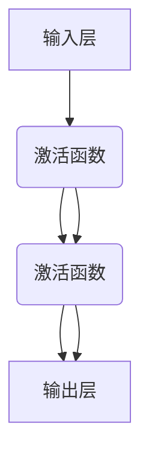
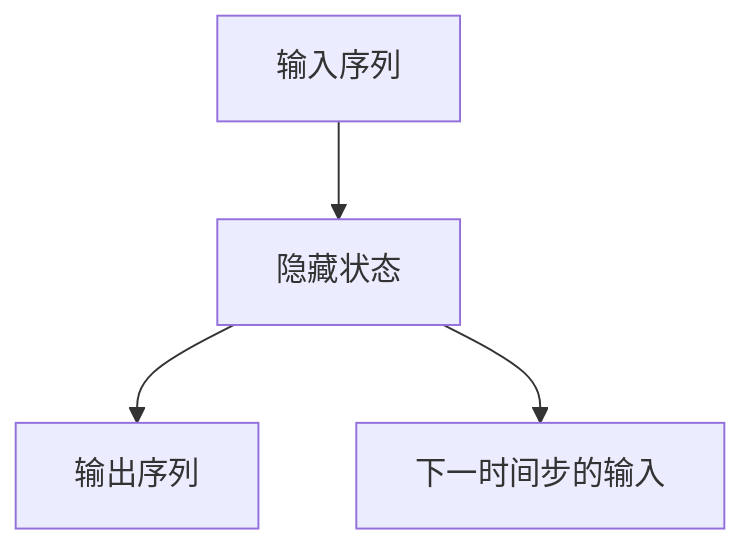
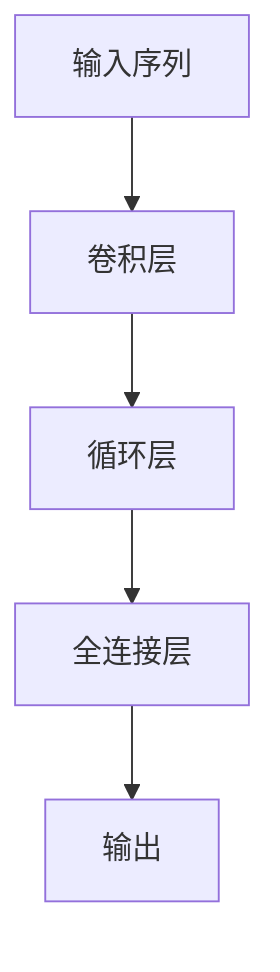
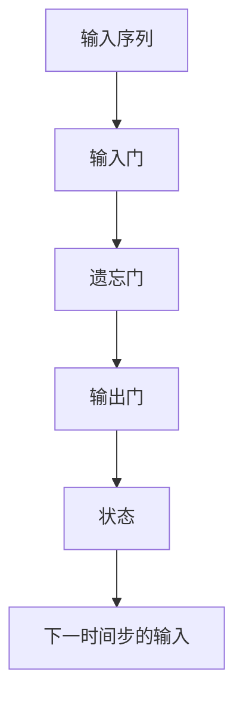
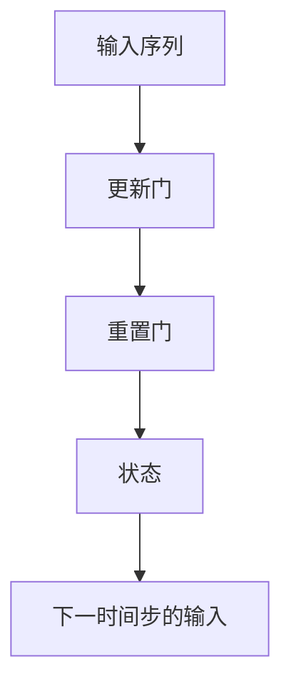

                 

### 文章标题

# 长短期记忆网络：深度学习中的时间旅行机器

> 关键词：神经网络、深度学习、长短期记忆（LSTM）、门控循环单元（GRU）、时间序列预测、文本处理

> 摘要：本文将深入探讨长短期记忆网络（LSTM）这一深度学习领域的关键技术。我们将从基础理论出发，逐步解析LSTM的原理、结构以及其在时间序列预测和文本处理中的应用。通过详实的数学模型推导和实际项目案例，我们将揭示LSTM如何实现时间信息的有效传递，并在AI领域取得突破性进展。

### 目录大纲

# 长短期记忆网络：深度学习中的时间旅行机器

> 关键词：神经网络、深度学习、长短期记忆（LSTM）、门控循环单元（GRU）、时间序列预测、文本处理

> 摘要：本文将深入探讨长短期记忆网络（LSTM）这一深度学习领域的关键技术。我们将从基础理论出发，逐步解析LSTM的原理、结构以及其在时间序列预测和文本处理中的应用。通过详实的数学模型推导和实际项目案例，我们将揭示LSTM如何实现时间信息的有效传递，并在AI领域取得突破性进展。

## 第一部分：基础理论

### 第1章：神经网络基础
#### 1.1.1 神经网络的基本结构
#### 1.1.2 深度学习的发展历程
#### 1.1.3 神经网络的训练机制

### 第2章：循环神经网络（RNN）
#### 2.1.1 RNN的基本原理
#### 2.1.2 RNN的局限性
#### 2.1.3 时间递归神经网络（TREC）

### 第3章：长短期记忆网络（LSTM）
#### 3.1.1 LSTM的原理与结构
#### 3.1.2 LSTM的核心模块：遗忘门、输入门、输出门
#### 3.1.3 LSTM的数学模型与公式推导

### 第4章：门控循环单元（GRU）
#### 4.1.1 GRU的原理与结构
#### 4.1.2 GRU的核心模块：更新门、重置门
#### 4.1.3 GRU的数学模型与公式推导

### 第5章：LSTM与GRU的比较与选择
#### 5.1.1 LSTM与GRU的异同
#### 5.1.2 选择LSTM还是GRU的考虑因素

### 第6章：LSTM在文本处理中的应用
#### 6.1.1 文本预处理
#### 6.1.2 词嵌入技术
#### 6.1.3 语言模型与序列标注任务

### 第7章：LSTM在时间序列预测中的应用
#### 7.1.1 时间序列预测的基础知识
#### 7.1.2 LSTM在时间序列预测中的应用
#### 7.1.3 时间序列预测的性能评估与优化

## 第二部分：实践应用

### 第8章：项目实战：基于LSTM的情感分析
#### 8.1.1 项目背景与目标
#### 8.1.2 数据集与预处理
#### 8.1.3 模型构建与训练
#### 8.1.4 模型评估与优化

### 第9章：项目实战：基于LSTM的用户行为预测
#### 9.1.1 项目背景与目标
#### 9.1.2 数据集与预处理
#### 9.1.3 模型构建与训练
#### 9.1.4 模型评估与优化

### 第10章：项目实战：基于LSTM的股票价格预测
#### 10.1.1 项目背景与目标
#### 10.1.2 数据集与预处理
#### 10.1.3 模型构建与训练
#### 10.1.4 模型评估与优化

### 第11章：LSTM模型调优与优化
#### 11.1.1 参数调优的方法
#### 11.1.2 模型优化技巧
#### 11.1.3 实际案例分享与总结

## 附录

### 附录A：LSTM相关工具与资源
#### A.1 TensorFlow中的LSTM实现
#### A.2 PyTorch中的LSTM实现
#### A.3 其他LSTM相关的开源框架与工具
## 第一部分：基础理论

### 第1章：神经网络基础

#### 1.1.1 神经网络的基本结构

神经网络，作为一种模拟人脑信息处理过程的计算模型，由大量简单计算单元（神经元）相互连接而成。每个神经元接收多个输入信号，通过加权求和后，加上一个偏置项，再经过一个非线性激活函数，产生一个输出信号。以下是神经网络的基本结构：

1. **输入层**：接收外部输入数据，不包含任何参数。
2. **隐藏层**：一个或多个隐藏层，每个隐藏层的神经元接收前一层的输出，通过加权求和和激活函数处理后，传递到下一层。
3. **输出层**：生成最终输出，可以是分类结果或回归预测值。

以下是神经网络的Mermaid流程图：



#### 1.1.2 深度学习的发展历程

深度学习作为神经网络的一种进化形式，其发展历程可以追溯到20世纪40年代。以下是深度学习的发展历程：

1. **1958年**：弗兰克·罗森布拉特提出了感知机（Perceptron）模型，这是最早的神经网络模型之一。
2. **1986年**：深度前馈网络（Dense Layer）模型提出，神经网络开始逐渐应用于图像识别和语音识别领域。
3. **2006年**：杰弗里·辛顿提出了深度信念网络（Deep Belief Network，DBN），开启了深度学习的黄金时代。
4. **2012年**：AlexNet模型在ImageNet竞赛中取得突破性成果，标志着深度学习在计算机视觉领域的崛起。
5. **2014年**：RNN及其变种LSTM在自然语言处理领域取得显著进展，为深度学习在序列数据处理中的应用奠定了基础。

#### 1.1.3 神经网络的训练机制

神经网络的训练机制主要基于梯度下降算法，其核心思想是调整网络中的权重和偏置项，使得网络的输出尽可能接近真实值。以下是神经网络的训练机制：

1. **前向传播**：输入数据从输入层传播到输出层，每个神经元计算其输出值。
2. **反向传播**：计算输出层到输入层的梯度，利用梯度下降算法更新权重和偏置项。
3. **迭代优化**：重复前向传播和反向传播过程，直至网络输出满足预设条件。

以下是神经网络训练的伪代码：

```python
初始化权重和偏置项
for每个epoch：
    对于每个训练样本：
        前向传播
        计算损失函数
        反向传播
        更新权重和偏置项
```

### 第2章：循环神经网络（RNN）

#### 2.1.1 RNN的基本原理

循环神经网络（RNN）是神经网络的一种形式，其特点是能够处理序列数据。RNN的基本原理如下：

1. **时间步**：RNN将输入数据视为一系列时间步，每个时间步对应一个输入样本。
2. **隐藏状态**：RNN的隐藏状态保存了前一个时间步的信息，并将其传递到下一个时间步。
3. **权重共享**：RNN的权重在时间步之间共享，这意味着当前时间步的权重与未来时间步的权重相同。

以下是RNN的Mermaid流程图：



#### 2.1.2 RNN的局限性

尽管RNN能够处理序列数据，但其在实际应用中存在一些局限性：

1. **梯度消失/爆炸**：由于RNN的权重在时间步之间共享，导致在反向传播过程中梯度可能消失或爆炸，从而难以训练深层网络。
2. **长期依赖问题**：RNN难以捕捉长距离依赖关系，这意味着在处理长序列数据时，早期信息可能难以传递到后期。

#### 2.1.3 时间递归神经网络（TREC）

为了解决RNN的局限性，研究人员提出了时间递归神经网络（Temporal Recurrent Convolutional Network，TREC）。TREC结合了循环神经网络和卷积神经网络（CNN）的优点，能够在处理序列数据时捕捉局部和全局依赖关系。TREC的基本结构如下：

1. **卷积层**：用于捕捉局部依赖关系。
2. **循环层**：用于捕捉全局依赖关系。
3. **全连接层**：用于生成最终输出。

以下是TREC的Mermaid流程图：



### 第3章：长短期记忆网络（LSTM）

#### 3.1.1 LSTM的原理与结构

长短期记忆网络（Long Short-Term Memory，LSTM）是一种特殊的RNN，旨在解决传统RNN在处理长序列数据时的梯度消失和长期依赖问题。LSTM的核心思想是通过引入门控机制来控制信息的流动。LSTM的基本结构如下：

1. **输入门**：决定当前输入信息中哪些部分需要更新到状态。
2. **遗忘门**：决定哪些旧信息需要被遗忘。
3. **输出门**：决定当前状态中哪些信息需要输出。

以下是LSTM的Mermaid流程图：



#### 3.1.2 LSTM的核心模块：遗忘门、输入门、输出门

LSTM的核心模块包括遗忘门、输入门和输出门，它们分别用于控制信息的遗忘、更新和输出。以下是这些模块的详细描述：

1. **遗忘门**：遗忘门决定哪些旧信息需要被遗忘。其计算公式如下：

   $$
   \text{遗忘门} = \sigma(W_f \cdot [h_{t-1}, x_t] + b_f)
   $$

   其中，$W_f$和$b_f$分别是遗忘门的权重和偏置项，$\sigma$是Sigmoid激活函数。

2. **输入门**：输入门决定当前输入信息中哪些部分需要更新到状态。其计算公式如下：

   $$
   \text{输入门} = \sigma(W_i \cdot [h_{t-1}, x_t] + b_i)
   $$

   $$
   \text{候选状态} = \tanh(W_c \cdot [h_{t-1}, x_t] + b_c)
   $$

   其中，$W_i$、$W_c$和$b_i$、$b_c$分别是输入门和候选状态的权重和偏置项。

3. **输出门**：输出门决定当前状态中哪些信息需要输出。其计算公式如下：

   $$
   \text{输出门} = \sigma(W_o \cdot [h_{t-1}, x_t] + b_o)
   $$

   $$
   \text{状态} = \text{输出门} \cdot \tanh(\text{候选状态})
   $$

   其中，$W_o$和$b_o$分别是输出门的权重和偏置项。

#### 3.1.3 LSTM的数学模型与公式推导

LSTM的数学模型可以表示为：

$$
\begin{aligned}
\text{遗忘门} &= \sigma(W_f \cdot [h_{t-1}, x_t] + b_f) \\
\text{输入门} &= \sigma(W_i \cdot [h_{t-1}, x_t] + b_i) \\
\text{候选状态} &= \tanh(W_c \cdot [h_{t-1}, x_t] + b_c) \\
\text{遗忘状态} &= \text{遗忘门} \cdot \text{状态}_{t-1} \\
\text{新状态} &= \text{输入门} \cdot \text{候选状态} + \text{遗忘状态} \\
\text{输出门} &= \sigma(W_o \cdot [h_{t-1}, x_t] + b_o) \\
\text{状态} &= \text{输出门} \cdot \tanh(\text{新状态}) \\
h_t &= \text{状态}
\end{aligned}
$$

其中，$W_f$、$W_i$、$W_c$和$W_o$分别是遗忘门、输入门、候选状态和输出门的权重矩阵，$b_f$、$b_i$、$b_c$和$b_o$分别是遗忘门、输入门、候选状态和输出门的偏置向量，$\sigma$是Sigmoid激活函数，$\tanh$是双曲正切激活函数。

### 第4章：门控循环单元（GRU）

#### 4.1.1 GRU的原理与结构

门控循环单元（Gated Recurrent Unit，GRU）是LSTM的一种变体，其结构更加简洁。GRU通过合并输入门和遗忘门，并引入更新门和重置门，使得模型在训练过程中更加高效。GRU的基本结构如下：

1. **更新门**：决定哪些旧信息需要被保留。
2. **重置门**：决定哪些旧信息需要被遗忘。
3. **状态**：更新门和重置门共同决定当前状态。

以下是GRU的Mermaid流程图：



#### 4.1.2 GRU的核心模块：更新门、重置门

GRU的核心模块包括更新门和重置门，它们分别用于控制信息的保留和遗忘。以下是这些模块的详细描述：

1. **更新门**：更新门决定哪些旧信息需要被保留。其计算公式如下：

   $$
   \text{更新门} = \sigma(W_u \cdot [h_{t-1}, x_t] + b_u)
   $$

   $$
   \text{状态} = \text{更新门} \cdot \text{状态}_{t-1} + (1 - \text{更新门}) \cdot x_t
   $$

   其中，$W_u$和$b_u$分别是更新门的权重和偏置项。

2. **重置门**：重置门决定哪些旧信息需要被遗忘。其计算公式如下：

   $$
   \text{重置门} = \sigma(W_r \cdot [h_{t-1}, x_t] + b_r)
   $$

   $$
   \text{候选状态} = \tanh(W_z \cdot [h_{t-1}, x_t] + b_z)
   $$

   $$
   \text{状态} = \text{重置门} \cdot \text{状态}_{t-1} + (1 - \text{重置门}) \cdot \text{候选状态}
   $$

   其中，$W_r$、$W_z$和$b_r$、$b_z$分别是重置门和候选状态的权重和偏置项。

#### 4.1.3 GRU的数学模型与公式推导

GRU的数学模型可以表示为：

$$
\begin{aligned}
\text{更新门} &= \sigma(W_u \cdot [h_{t-1}, x_t] + b_u) \\
\text{重置门} &= \sigma(W_r \cdot [h_{t-1}, x_t] + b_r) \\
\text{候选状态} &= \tanh(W_z \cdot [h_{t-1}, x_t] + b_z) \\
\text{状态} &= \text{重置门} \cdot \text{状态}_{t-1} + (1 - \text{重置门}) \cdot \text{候选状态} \\
\text{输出门} &= \sigma(W_o \cdot [h_{t-1}, x_t] + b_o) \\
h_t &= \text{输出门} \cdot \tanh(\text{状态})
\end{aligned}
$$

其中，$W_u$、$W_r$、$W_z$和$W_o$分别是更新门、重置门、候选状态和输出门的权重矩阵，$b_u$、$b_r$、$b_z$和$b_o$分别是更新门、重置门、候选状态和输出门的偏置向量，$\sigma$是Sigmoid激活函数，$\tanh$是双曲正切激活函数。

### 第5章：LSTM与GRU的比较与选择

#### 5.1.1 LSTM与GRU的异同

LSTM和GRU都是用于处理序列数据的循环神经网络变体，它们在结构上存在一些相似之处，但也存在一些关键差异：

1. **结构复杂度**：LSTM具有更复杂的结构，包括遗忘门、输入门和输出门，而GRU则合并了输入门和遗忘门，并引入了更新门和重置门。这使得GRU在计算上相对简单，但可能在捕捉复杂序列依赖关系方面不如LSTM。
2. **计算效率**：GRU在训练过程中计算效率更高，因为它包含的参数 fewer，这导致更快的训练速度和较低的内存消耗。而LSTM由于其复杂的门控机制，训练过程可能更加耗时。
3. **性能表现**：在实际应用中，LSTM和GRU的性能表现取决于具体任务和数据集。一些研究表明，在某些任务上，LSTM可能比GRU表现得更好，而在其他任务上，GRU可能更具优势。
4. **稳定性**：LSTM在训练过程中更容易出现梯度消失和爆炸问题，而GRU通过其简单的结构设计，相对更加稳定。

#### 5.1.2 选择LSTM还是GRU的考虑因素

在选择LSTM或GRU时，需要考虑以下几个因素：

1. **任务类型**：对于需要处理复杂序列依赖关系的任务，LSTM可能更具优势。而对于计算效率要求较高的任务，GRU可能是更好的选择。
2. **数据集大小**：对于大型数据集，GRU的较低计算复杂度可能带来更快的训练速度。对于小型数据集，LSTM的更复杂结构可能有助于捕捉更多细节。
3. **模型复杂度**：如果模型复杂度较高，LSTM可能更容易过拟合。在这种情况下，GRU可能是一个更好的选择，因为其结构更简单，更容易保持泛化能力。
4. **计算资源**：如果计算资源有限，GRU的较低内存消耗可能更加适合。而对于计算资源充足的情况，LSTM可能在性能上具有优势。

### 第6章：LSTM在文本处理中的应用

#### 6.1.1 文本预处理

在LSTM应用于文本处理之前，通常需要对文本进行预处理。文本预处理主要包括以下几个步骤：

1. **分词**：将文本拆分为单个单词或子词，以便进行后续处理。
2. **词性标注**：为每个单词分配词性，如名词、动词、形容词等。
3. **词嵌入**：将单词映射为向量表示，以便在LSTM模型中使用。

以下是文本预处理的伪代码：

```python
def preprocess_text(text):
    # 分词
    words = tokenize(text)
    # 词性标注
    pos_tags = pos_tag(words)
    # 词嵌入
    word_embeddings = embed(words)
    return word_embeddings
```

#### 6.1.2 词嵌入技术

词嵌入技术是一种将单词映射为向量表示的方法，其目的是在神经网络中高效地处理文本数据。常见的词嵌入方法包括：

1. **Word2Vec**：基于神经网络的词向量生成方法，通过训练大量文本数据，得到每个单词的向量表示。
2. **GloVe**：基于全局词频统计的词向量生成方法，通过计算单词之间的相似度，生成高质量的词向量。
3. **BERT**：基于双向转换器（Transformer）的预训练方法，通过在大量未标注文本上训练，生成高质量的词向量。

以下是词嵌入的伪代码：

```python
def embed(words):
    # 使用Word2Vec模型
    w2v_model = Word2Vec(corpus)
    embeddings = [w2v_model[word] for word in words]
    return embeddings
```

#### 6.1.3 语言模型与序列标注任务

LSTM在文本处理中的应用主要包括语言模型和序列标注任务。

1. **语言模型**：语言模型旨在预测一个单词序列的概率分布。LSTM通过捕捉序列中的长期依赖关系，可以生成高质量的语

