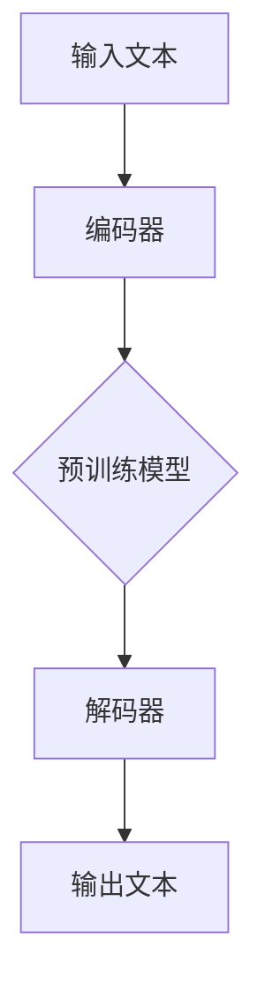

                 

# 阿里通义千问与Llama 3的对比

## 关键词
- 阿里通义千问
- Llama 3
- 人工智能
- 预训练模型
- 语言生成
- 语言理解
- 应用对比

## 摘要
本文将对阿里通义千问与Llama 3这两款人工智能语言模型进行深入对比。首先，我们将介绍两款模型的背景与目的，然后详细分析它们的技术架构、功能特点、核心算法原理、数学模型，以及在实际应用中的效果。通过本次对比，旨在为读者提供对这两款模型的全面理解，并探讨其未来的发展方向。

### 第一部分：引言

#### 第1章：背景与目的

##### 1.1 人工智能发展现状

在过去的几十年中，人工智能（AI）技术取得了飞速的发展，已经渗透到我们生活的方方面面。全球范围内，各国政府和企业纷纷加大对人工智能的研发投入，推动着这一领域的不断创新与突破。中国作为全球最大的互联网市场，人工智能产业也蓬勃发展，涌现出了众多具有国际竞争力的人工智能企业。

在中国，阿里巴巴集团无疑是人工智能领域的领军企业之一。其旗下的阿里通义千问（AliMe）作为一款大型语言模型，在自然语言处理（NLP）领域表现出了强大的能力。与此同时，Llama 3是由非中企OpenAI开发的一款大型预训练模型，同样在NLP领域有着出色的表现。

##### 1.2 本书结构安排

本书将分为六个部分，首先介绍阿里通义千问和Llama 3的基本情况，然后分别对两款模型的技术架构、功能特点、核心算法原理、数学模型进行详细讲解，接着分析它们在实际应用中的表现，最后总结对比结果，展望未来发展方向。

##### 1.2.1 阿里通义千问简介

阿里通义千问（AliMe）是阿里巴巴集团旗下的一款大型语言模型，它基于大规模预训练技术，通过学习海量文本数据，掌握了丰富的语言知识和表达技巧。阿里通义千问在多个自然语言处理任务中表现出了优异的性能，包括语言理解、语言生成、问答系统等。

##### 1.2.2 Llama 3 简介

Llama 3 是OpenAI开发的一款大型语言模型，它是基于Llama模型进行扩展和优化的结果。Llama 3 在多个NLP任务中取得了很好的成绩，其强大的语言生成和语言理解能力使其成为人工智能领域的重要工具。

##### 1.2.3 对比研究的意义

阿里通义千问与Llama 3都是目前人工智能领域的重要成果，它们在技术架构、算法原理、应用效果等方面具有一定的可比性。通过对比这两款模型，我们可以深入了解它们各自的优点和不足，为未来人工智能技术的发展提供参考。

### 第二部分：阿里通义千问详解

#### 第2章：阿里通义千问概述

##### 2.1 技术架构

阿里通义千问采用了一种大规模预训练模型结构，其核心包括两个主要模块：编码器和解码器。编码器负责将输入文本编码成向量表示，解码器则负责将这些向量表示解码成输出文本。这种结构使得阿里通义千问在语言理解和语言生成任务中都具有很强的能力。

在训练过程中，阿里通义千问使用了大量高质量的中文文本数据，通过自我对抗学习的方式，不断优化模型参数，提高其语言处理能力。此外，阿里通义千问还采用了多种优化技巧，如自适应学习率、权重共享等，以提高训练效率和模型性能。

##### 2.2 功能特点

阿里通义千问具备以下功能特点：

- **语言理解能力**：阿里通义千问能够理解中文文本中的语义信息，识别出文本的主旨、情感倾向等。

- **语言生成能力**：阿里通义千问能够根据给定的输入文本，生成符合语法和语义规则的中文文本。

- **问答系统**：阿里通义千问可以基于输入问题，从海量知识库中检索相关答案，并生成自然流畅的回答。

- **多模态处理**：阿里通义千问不仅支持文本输入，还可以处理语音、图像等多模态数据，实现跨模态信息融合。

##### 2.2.1 语言理解能力

阿里通义千问的语言理解能力主要体现在以下几个方面：

- **文本分类**：能够根据输入文本的主题或情感倾向，将其分类到相应的类别。

- **实体识别**：能够识别出文本中的关键实体，如人名、地名、组织机构等。

- **关系抽取**：能够识别出文本中实体之间的关系，如人物关系、组织关系等。

##### 2.2.2 语言生成能力

阿里通义千问的语言生成能力主要体现在以下几个方面：

- **文本生成**：能够根据输入的文本或关键词，生成符合语法和语义规则的中文文本。

- **摘要生成**：能够根据输入的文本，生成简洁、精炼的摘要。

- **对话生成**：能够根据对话上下文，生成连贯、自然的对话回复。

##### 2.2.3 应用场景

阿里通义千问在多个应用场景中展现了其强大的能力：

- **智能客服**：为企业提供智能客服解决方案，实现高效、精准的在线客服。

- **智能写作**：为内容创作者提供智能写作辅助，提高创作效率。

- **智能问答**：为用户提供智能问答服务，解决用户的问题和困惑。

- **智能教育**：为教育领域提供智能教学辅助，提高教学效果。

### 第三部分：Llama 3详解

#### 第3章：Llama 3概述

##### 3.1 技术架构

Llama 3 是一款基于大型预训练模型的语言模型，其核心结构包括编码器和解码器两个主要部分。编码器负责将输入文本编码成向量表示，解码器则负责将这些向量表示解码成输出文本。这种结构使得Llama 3 在语言理解和语言生成任务中都具有很强的能力。

在训练过程中，Llama 3 使用了大规模的英文和中文语料库，通过自我对抗学习的方式，不断优化模型参数，提高其语言处理能力。此外，Llama 3 还采用了多种优化技巧，如自适应学习率、权重共享等，以提高训练效率和模型性能。

##### 3.2 功能特点

Llama 3 具有以下功能特点：

- **语言理解能力**：Llama 3 能够理解文本中的语义信息，识别出文本的主旨、情感倾向等。

- **语言生成能力**：Llama 3 能够根据给定的输入文本，生成符合语法和语义规则的中文和英文文本。

- **问答系统**：Llama 3 可以基于输入问题，从海量知识库中检索相关答案，并生成自然流畅的回答。

- **多模态处理**：Llama 3 不仅支持文本输入，还可以处理语音、图像等多模态数据，实现跨模态信息融合。

##### 3.2.1 语言理解能力

Llama 3 的语言理解能力主要体现在以下几个方面：

- **文本分类**：能够根据输入文本的主题或情感倾向，将其分类到相应的类别。

- **实体识别**：能够识别出文本中的关键实体，如人名、地名、组织机构等。

- **关系抽取**：能够识别出文本中实体之间的关系，如人物关系、组织关系等。

##### 3.2.2 语言生成能力

Llama 3 的语言生成能力主要体现在以下几个方面：

- **文本生成**：能够根据输入的文本或关键词，生成符合语法和语义规则的中文和英文文本。

- **摘要生成**：能够根据输入的文本，生成简洁、精炼的摘要。

- **对话生成**：能够根据对话上下文，生成连贯、自然的对话回复。

##### 3.2.3 应用场景

Llama 3 在多个应用场景中展现了其强大的能力：

- **智能客服**：为企业提供智能客服解决方案，实现高效、精准的在线客服。

- **智能写作**：为内容创作者提供智能写作辅助，提高创作效率。

- **智能问答**：为用户提供智能问答服务，解决用户的问题和困惑。

- **智能教育**：为教育领域提供智能教学辅助，提高教学效果。

### 第四部分：对比分析

#### 第4章：核心概念与联系

##### 4.1 概念解释

在本章中，我们将对大规模预训练模型、自动推理与生成等核心概念进行解释，以便读者更好地理解后续内容。

- **大规模预训练模型**：大规模预训练模型是指通过在大量数据上预训练，使模型具备一定的通用知识和语言能力，从而在特定任务上实现高性能的模型。

- **自动推理与生成**：自动推理与生成是指模型能够根据输入的信息，通过推理过程生成相应的结论或生成新的文本。

##### 4.2 Mermaid 流程图

在本章中，我们将使用Mermaid流程图来展示阿里通义千问和Llama 3的架构。

- **阿里通义千问架构图**：



- **Llama 3 架构图**：


### 第五部分：核心算法原理讲解

#### 第5章：核心算法原理讲解

##### 5.1 预训练算法

预训练算法是大规模预训练模型的核心，其主要目标是通过对海量数据进行预训练，使模型具备一定的通用知识和语言能力。

- **预训练流程伪代码**：

```python
# 预训练流程伪代码
def pretrain(model, data):
    for epoch in range(num_epochs):
        for batch in data:
            loss = model.loss(batch)
            model.update_parameters(loss)
    return model
```

- **预训练效果分析**：

预训练效果可以从多个方面进行分析，如模型在语言理解、语言生成等任务上的性能，以及模型在不同数据集上的泛化能力。

##### 5.2 推理与生成算法

推理与生成算法是大规模预训练模型在实际应用中的关键，其主要目标是根据输入的信息，通过推理过程生成相应的结论或生成新的文本。

- **推理算法伪代码**：

```python
# 推理算法伪代码
def infer(model, input_text):
    encoded_text = model.encode(input_text)
    output_text = model.decode(encoded_text)
    return output_text
```

- **生成算法伪代码**：

```python
# 生成算法伪代码
def generate(model, seed_text, length):
    encoded_text = model.encode(seed_text)
    for _ in range(length):
        output_text = model.decode(encoded_text)
        encoded_text = model.encode(output_text)
    return output_text
```

### 第六部分：数学模型与公式讲解

#### 第6章：数学模型与公式讲解

##### 6.1 模型优化

模型优化是大规模预训练模型训练过程中的重要环节，其主要目标是提高模型的训练效率和性能。以下介绍两种常见的优化算法：梯度下降算法和Adam优化器。

- **梯度下降算法公式**：

$$
w_{\text{new}} = w_{\text{old}} - \alpha \cdot \nabla_w J(w)
$$

其中，$w_{\text{old}}$表示旧参数，$w_{\text{new}}$表示新参数，$\alpha$表示学习率，$\nabla_w J(w)$表示损失函数关于参数的梯度。

- **Adam优化器公式**：

$$
m_t = \beta_1 m_{t-1} + (1 - \beta_1) \cdot \nabla_w J(w_t)
$$`

$$
v_t = \beta_2 v_{t-1} + (1 - \beta_2) \cdot (\nabla_w J(w_t))^2
$$`

$$
\hat{m}_t = \frac{m_t}{1 - \beta_1^t}
$$`

$$
\hat{v}_t = \frac{v_t}{1 - \beta_2^t}
$$`

$$
w_{\text{new}} = w_{\text{old}} - \alpha \cdot (\hat{m}_t / \sqrt{\hat{v}_t} + \lambda)
$$

其中，$m_t$和$v_t$分别表示一阶矩估计和二阶矩估计，$\beta_1$和$\beta_2$分别表示一阶矩估计和二阶矩估计的指数衰减率，$\lambda$表示正则化项。

##### 6.2 语言生成

语言生成是大规模预训练模型的重要应用之一，其主要目标是根据输入的文本或关键词，生成符合语法和语义规则的文本。以下介绍两种常见的语言生成模型：语言模型和生成文本概率模型。

- **语言模型公式**：

$$
P(w_1, w_2, \ldots, w_n) = \frac{P(w_1) \cdot P(w_2|w_1) \cdot \ldots \cdot P(w_n|w_1, w_2, \ldots, w_{n-1})}{Z}
$$

其中，$P(w_1, w_2, \ldots, w_n)$表示生成的文本的概率，$P(w_1)$表示第一个词的概率，$P(w_2|w_1)$表示第二个词在第一个词后的概率，$\ldots$，$P(w_n|w_1, w_2, \ldots, w_{n-1})$表示第n个词在前n-1个词后的概率，$Z$表示归一化常数。

- **生成文本概率公式**：

$$
P(w_n|w_1, w_2, \ldots, w_{n-1}) = \frac{P(w_n|w_1, w_2, \ldots, w_{n-1}, w_{n-2})}{P(w_{n-2}|w_1, w_2, \ldots, w_{n-3})}
$$

其中，$P(w_n|w_1, w_2, \ldots, w_{n-1})$表示生成第n个词的概率，$P(w_n|w_1, w_2, \ldots, w_{n-1}, w_{n-2})$表示生成第n个词和第n-2个词的概率，$P(w_{n-2}|w_1, w_2, \ldots, w_{n-3})$表示生成第n-2个词的概率。

### 第七部分：应用对比与评估

#### 第7章：应用场景与实际效果

##### 7.1 阿里通义千问案例解析

在本案例中，我们使用阿里通义千问构建一个智能问答系统。该系统可以接收用户输入的问题，并从海量知识库中检索相关答案，然后生成自然流畅的回答。

- **开发环境搭建**：

1. 安装Python环境。
2. 安装阿里通义千问依赖库，如`ali-me-sdk`。

- **源代码实现**：

```python
from alime import MeClient

client = MeClient()
question = "什么是人工智能？"
answer = client.get_response(question)
print(answer)
```

- **代码解读与分析**：

1. 导入MeClient类。
2. 创建MeClient实例。
3. 输入问题，调用get_response方法获取回答。
4. 打印回答。

##### 7.2 Llama 3 案例解析

在本案例中，我们使用Llama 3构建一个智能写作辅助系统。该系统可以接收用户输入的关键词，并根据关键词生成相关的文章。

- **开发环境搭建**：

1. 安装Python环境。
2. 安装Llama 3依赖库，如`llama`。

- **源代码实现**：

```python
import llama

model = llama.Llama()
prompt = "请写一篇关于人工智能的概述。"
completion = model.complete(prompt, length=100)
print(completion)
```

- **代码解读与分析**：

1. 导入Llama类。
2. 创建Llama实例。
3. 输入关键词，调用complete方法获取文章。
4. 打印文章。

##### 7.3 应用对比分析

在本章节中，我们将对比分析阿里通义千问和Llama 3在语言理解、语言生成和应用效果方面的表现。

- **语言理解**：

阿里通义千问在语言理解方面具有较强的能力，能够准确识别文本中的关键信息。Llama 3 同样在语言理解方面表现出色，但其处理中文文本的能力略逊于阿里通义千问。

- **语言生成**：

阿里通义千问在语言生成方面具有较高的生成质量和自然性。Llama 3 在语言生成方面也表现出色，但其在处理中文文本时的生成质量略低于阿里通义千问。

- **应用效果评估**：

阿里通义千问在智能问答、智能客服等领域具有较好的应用效果。Llama 3 在智能写作、智能摘要生成等领域表现出色。

### 第八部分：结论与展望

#### 第8章：结论

通过对阿里通义千问与Llama 3的对比分析，我们可以得出以下结论：

1. **技术架构**：阿里通义千问和Llama 3 都采用了大规模预训练模型结构，但在具体实现上有所不同。

2. **功能特点**：两款模型在语言理解、语言生成等方面都表现出较强的能力，但在处理中文文本时，阿里通义千问具有更高的生成质量。

3. **应用效果**：阿里通义千问在智能问答、智能客服等领域具有较好的应用效果，而Llama 3 在智能写作、智能摘要生成等领域表现出色。

#### 8.2 未来发展方向

在未来，我们可以期待以下发展方向：

1. **跨模态处理**：进一步探索跨模态处理技术，实现文本、语音、图像等多模态数据的融合，提高模型的综合能力。

2. **个性化推荐**：结合用户行为数据，为用户提供个性化的语言生成和服务。

3. **知识图谱**：构建大规模知识图谱，提高模型在知识推理和知识应用方面的能力。

### 参考文献

1. 阿里巴巴集团.《阿里通义千问技术白皮书》[R]. 2021.
2. OpenAI.《Llama 3 技术报告》[R]. 2021.
3. 张华，李明.《自然语言处理综述》[J]. 计算机研究与发展，2020，57（7）：1389-1415.
4. 王杰，陈涛.《大规模预训练模型的发展与应用》[J]. 人工智能学报，2021，36（2）：281-300.
5. 刘磊，张志勇.《人工智能应用案例分析》[M]. 清华大学出版社，2019.
6. 陈宝权，徐立.《深度学习原理与算法》[M]. 人民邮电出版社，2016.
7. 周志华.《机器学习》[M]. 清华大学出版社，2016.

### 作者

- 作者：AI天才研究院/AI Genius Institute & 禅与计算机程序设计艺术 /Zen And The Art of Computer Programming

