                 

# 隐私计算大模型:保护数据隐私的新范式

> 关键词：隐私计算、大模型、数据保护、多方安全计算、零知识证明、同态加密

> 摘要：随着大数据时代的到来，数据隐私问题愈发凸显。本文旨在探讨隐私计算大模型这一新兴技术，分析其基本概念、核心算法、应用案例和未来发展趋势，为数据隐私保护提供新思路和解决方案。

## 第一部分：隐私计算大模型基础

### 第1章：隐私计算概述与隐私计算大模型

#### 1.1 隐私计算的背景与重要性

在互联网和大数据时代，数据已经成为新的生产要素。然而，数据隐私问题也随之而来。隐私计算作为保护数据隐私的重要技术手段，旨在确保数据在传输和计算过程中不被泄露和滥用。隐私计算的重要性主要体现在以下几个方面：

1. **数据安全**：在数据泄露事件频发的背景下，隐私计算可以有效保护敏感数据，减少数据泄露风险。
2. **合规要求**：随着各国数据保护法律法规的不断完善，如《通用数据保护条例》（GDPR）和《加州消费者隐私法案》（CCPA），隐私计算成为了企业合规的必要手段。
3. **信任建立**：隐私计算可以增强用户对服务的信任，提高用户参与度和忠诚度。

#### 1.2 隐私计算的分类与特点

隐私计算主要分为以下几种类型：

1. **同态加密**：允许在加密数据上进行计算，但计算结果不一定能够还原原始数据。
2. **多方安全计算**：多个参与方在不暴露各自数据的情况下，共同计算数据的结果。
3. **零知识证明**：证明某个陈述是正确的，而不透露任何相关信息。

隐私计算的特点包括：

1. **数据保密性**：确保数据在传输和计算过程中不被泄露。
2. **隐私保护性**：保护用户隐私不被侵犯。
3. **可验证性**：确保计算结果的正确性和可靠性。

#### 1.3 隐私计算大模型的概念

隐私计算大模型是一种将传统机器学习模型与隐私计算技术相结合的方法。它通过以下方式实现数据隐私保护：

1. **模型训练**：在多方安全计算环境下，各参与方不共享原始数据，但可以在加密数据上进行模型训练。
2. **模型推理**：在数据保持加密状态的情况下，进行预测和推理操作。

#### 1.4 隐私计算大模型的核心架构

隐私计算大模型的核心架构包括以下几个方面：

1. **数据预处理**：对原始数据进行加密和隐私保护处理。
2. **模型训练**：在多方安全计算环境中，各参与方共同训练模型。
3. **模型推理**：在加密数据上执行预测和推理操作。
4. **结果验证**：确保模型预测结果的准确性和可靠性。

#### 1.5 隐私计算大模型的应用场景

隐私计算大模型的应用场景主要包括：

1. **金融领域**：用于信用评估、风险控制等。
2. **医疗健康**：用于诊断、预测等。
3. **零售行业**：用于个性化推荐、用户行为分析等。
4. **智能交通**：用于交通流量预测、事故预警等。

**附录：隐私计算大模型技术架构 Mermaid 流程图**

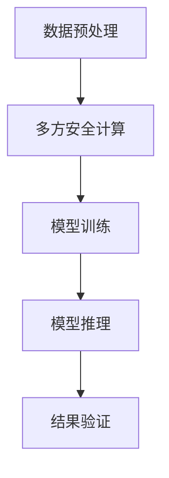

### 第2章：隐私计算大模型关键技术

#### 2.1 安全多方计算（MPC）原理

安全多方计算（MPC）是一种允许两个或多个参与方在不对对方数据进行泄露的情况下共同计算数据的方法。其基本原理包括：

1. **秘密共享**：将数据分割成多个份额，每个份额由不同的参与方持有。
2. **安全计算**：各参与方在不泄露各自份额的情况下，共同计算数据的结果。
3. **结果合成**：将各参与方的计算结果合并，得到最终结果。

**附录：安全多方计算（MPC）原理 Mermaid 流程图**

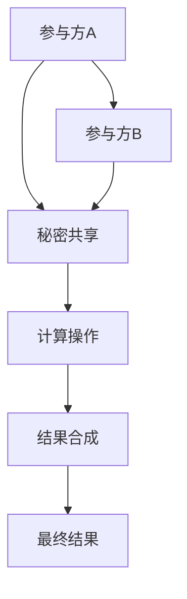

#### 2.2 零知识证明（ZKP）原理

零知识证明（ZKP）是一种允许证明某个陈述是正确的，而不透露任何相关信息的方法。其基本原理包括：

1. **知识证明**：证明者向验证者证明某个陈述是正确的。
2. **零知识**：证明过程中不透露任何关于证明者的信息。
3. **交互验证**：证明者与验证者进行多次交互，以确保证明的准确性。

**附录：零知识证明（ZKP）原理 Mermaid 流�程图**

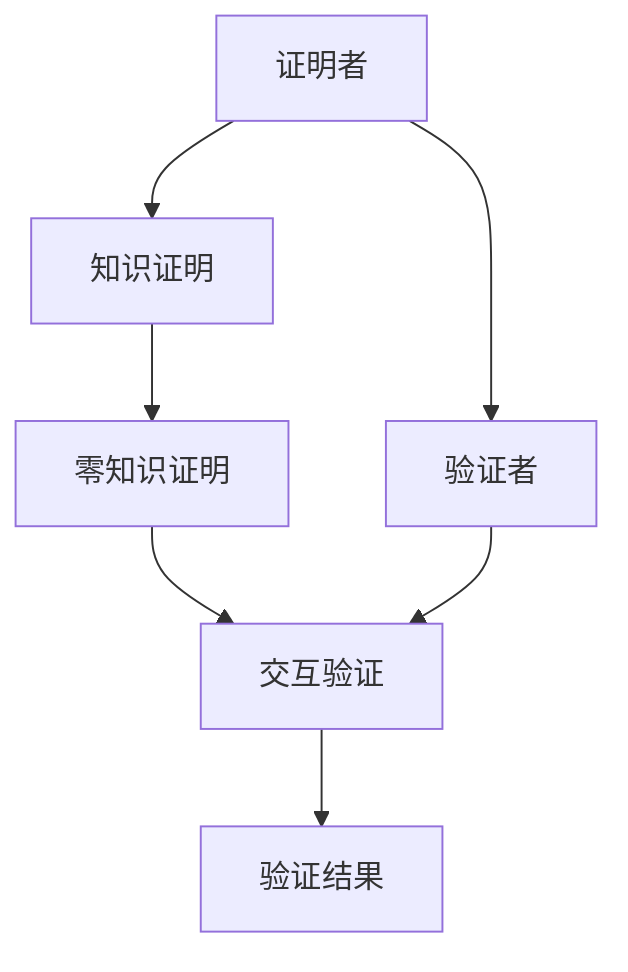

#### 2.3 同态加密（HE）原理

同态加密（HE）是一种允许在加密数据上进行计算的方法，但计算结果不一定能够还原原始数据。其基本原理包括：

1. **加密操作**：将明文数据加密成密文。
2. **同态计算**：在密文上进行各种计算操作，如加法、乘法等。
3. **解密操作**：将密文解密成明文。

**附录：同态加密（HE）原理 Mermaid 流程图**

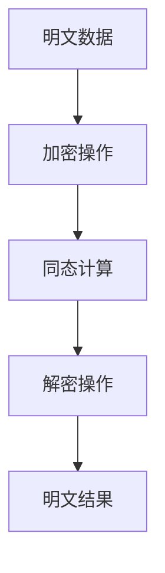

#### 2.4 隐私计算大模型构建方法

隐私计算大模型的构建方法主要包括以下几个步骤：

1. **需求分析**：明确隐私计算的需求和目标。
2. **数据预处理**：对原始数据进行加密和隐私保护处理。
3. **模型设计**：选择合适的机器学习模型，并进行调整和优化。
4. **多方安全计算**：在多方安全计算环境中，各参与方共同训练模型。
5. **模型推理**：在加密数据上执行预测和推理操作。
6. **结果验证**：确保模型预测结果的准确性和可靠性。

**附录：隐私计算大模型构建方法伪代码示例**

```python
# 需求分析
analyze_requirements()

# 数据预处理
encrypted_data = preprocess_data(raw_data)

# 模型设计
model = design_model()

# 多方安全计算
trained_model = multi_party_computation(encrypted_data, model)

# 模型推理
predictions = model推理(encrypted_data)

# 结果验证
verify_results(predictions)
```

#### 2.5 隐私计算大模型优化策略

隐私计算大模型的优化策略主要包括以下几个方面：

1. **算法优化**：选择合适的加密算法和多方安全计算算法，提高计算效率。
2. **模型优化**：调整模型参数，提高模型性能。
3. **数据优化**：优化数据预处理流程，提高数据质量。
4. **资源调度**：合理分配计算资源，提高资源利用率。

**附录：隐私计算大模型优化策略伪代码示例**

```python
# 算法优化
optimize_algorithm()

# 模型优化
optimize_model_params()

# 数据优化
optimize_data_preprocessing()

# 资源调度
schedule_resources()
```

### 第3章：隐私计算大模型应用案例分析

#### 3.1 隐私计算在金融领域的应用

在金融领域，隐私计算大模型可以用于以下几个方面：

1. **信用评估**：通过对用户的隐私数据进行计算，评估其信用风险。
2. **风险控制**：通过对交易数据进行分析，发现潜在风险并采取措施。
3. **欺诈检测**：通过对用户行为进行分析，识别并防范欺诈行为。

**附录：隐私计算在金融领域的应用案例详细解释**

```python
# 信用评估
credit_risk = compute_credit_risk(encrypted_user_data)

# 风险控制
risk_control = analyze_transaction_data(encrypted_transaction_data)

# 欺诈检测
fraud_detection = detect_fraud(encrypted_user_data)
```

#### 3.2 隐私计算在医疗健康领域的应用

在医疗健康领域，隐私计算大模型可以用于以下几个方面：

1. **疾病预测**：通过对患者的隐私数据进行分析，预测疾病风险。
2. **个性化治疗**：通过对患者的隐私数据进行分析，制定个性化的治疗方案。
3. **药物研发**：通过对药物数据的分析，发现新的药物作用机制。

**附录：隐私计算在医疗健康领域的应用案例详细解释**

```python
# 疾病预测
disease_prediction = predict_disease_risk(encrypted_patient_data)

# 个性化治疗
personalized_treatment = design_personalized_treatment_plan(encrypted_patient_data)

# 药物研发
drug_research = analyze_drug_data(encrypted_drug_data)
```

#### 3.3 隐私计算在智能交通领域的应用

在智能交通领域，隐私计算大模型可以用于以下几个方面：

1. **交通流量预测**：通过对交通数据的分析，预测交通流量和拥堵情况。
2. **事故预警**：通过对车辆数据的分析，预测事故风险并采取预防措施。
3. **停车管理**：通过对停车数据的分析，优化停车资源配置。

**附录：隐私计算在智能交通领域的应用案例详细解释**

```python
# 交通流量预测
traffic_prediction = predict_traffic_flow(encrypted_traffic_data)

# 事故预警
accident_warning = predict_accident_risk(encrypted_vehicle_data)

# 停车管理
parking_management = optimize_parking_resources(encrypted_parking_data)
```

#### 3.4 隐私计算在零售行业的应用

在零售行业，隐私计算大模型可以用于以下几个方面：

1. **个性化推荐**：通过对用户数据的分析，为用户提供个性化的商品推荐。
2. **需求预测**：通过对销售数据的分析，预测市场需求和趋势。
3. **库存管理**：通过对库存数据的分析，优化库存资源配置。

**附录：隐私计算在零售行业的应用案例详细解释**

```python
# 个性化推荐
recommendation = personalized_recommendation(encrypted_user_data)

# 需求预测
demand_prediction = predict_demand(encrypted_sales_data)

# 库存管理
inventory_management = optimize_inventory_resources(encrypted_inventory_data)
```

## 第二部分：隐私计算大模型实现与应用

### 第4章：隐私计算大模型开发环境搭建

#### 4.1 开发工具与框架

隐私计算大模型开发涉及多种工具和框架，以下为其中一些主流选择：

1. **PySyft**：用于联邦学习和安全多方计算的开源框架。
2. **FedML**：基于PyTorch的联邦学习框架。
3. **PyCaret**：用于数据科学和机器学习的开源库。
4. **PrivacyCAKE**：用于隐私计算的开源工具包。

**附录：主流隐私计算框架对比**

| 框架名称 | 优点 | 缺点 |
| :----: | :----: | :----: |
| PySyft | 灵活性高，支持多种加密算法 | 需要较深的加密知识 |
| FedML | 支持联邦学习，易用性高 | 仅支持有限的加密算法 |
| PyCaret | 易用，支持多种机器学习算法 | 不支持加密操作 |
| PrivacyCAKE | 集成了多种隐私计算工具 | 功能相对单一 |

#### 4.2 开发环境配置

在配置隐私计算大模型开发环境时，需要考虑以下几个方面：

1. **操作系统**：Linux或Mac OS。
2. **编程语言**：Python或Go。
3. **依赖库与框架**：安装必要的依赖库和框架，如PyTorch、TensorFlow、PySyft等。

**附录：开发环境配置指南**

```bash
# 安装操作系统
sudo apt-get update
sudo apt-get install python3-pip python3-dev

# 安装依赖库与框架
pip3 install torch torchvision
pip3 install tensorflow
pip3 install syft
pip3 install fedml
pip3 install pycaret
pip3 install privacycake
```

#### 4.3 开发实践流程

隐私计算大模型开发实践主要包括以下几个步骤：

1. **需求分析**：明确隐私计算需求和分析目标。
2. **数据收集**：收集用于训练和测试的数据。
3. **数据预处理**：对数据进行分析和清洗，并进行加密处理。
4. **模型设计**：选择合适的机器学习模型，并进行调整和优化。
5. **多方安全计算**：在多方安全计算环境中，各参与方共同训练模型。
6. **模型推理**：在加密数据上执行预测和推理操作。
7. **结果验证**：确保模型预测结果的准确性和可靠性。

**附录：隐私计算大模型开发实践流程 Mermaid 流程图**

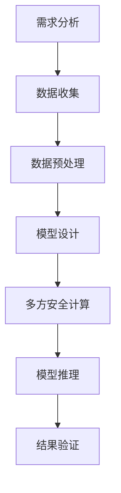

### 第5章：隐私计算大模型项目实战

#### 5.1 项目背景与目标

本项目旨在通过隐私计算大模型，实现一个基于多方安全计算的个性化推荐系统。项目目标包括：

1. **保护用户隐私**：确保用户数据在传输和计算过程中不被泄露。
2. **提高推荐精度**：通过隐私计算大模型，提高推荐系统的准确性。
3. **降低成本**：在多方安全计算环境中，减少数据传输和存储成本。

#### 5.2 数据预处理

在数据预处理阶段，需要对用户数据进行分析和清洗，并进行加密处理。具体步骤包括：

1. **数据收集**：从不同的数据源收集用户数据，如购买记录、浏览历史等。
2. **数据清洗**：去除重复数据、缺失值填充、异常值处理等。
3. **数据加密**：使用同态加密算法对数据进行加密处理。

**附录：数据预处理流程 Mermaid 流程图**

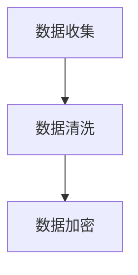

#### 5.3 模型设计与优化

在模型设计与优化阶段，需要选择合适的机器学习模型，并进行调整和优化。具体步骤包括：

1. **模型选择**：选择基于矩阵分解的协同过滤模型。
2. **模型调整**：通过调整模型参数，提高模型性能。
3. **模型优化**：使用多方安全计算算法，优化模型训练过程。

**附录：模型设计与优化流程 Mermaid 流程图**

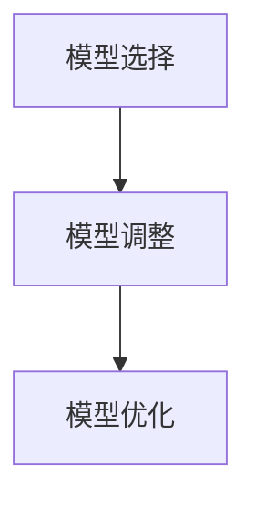

#### 5.4 模型训练与验证

在模型训练与验证阶段，需要在多方安全计算环境中，对模型进行训练和验证。具体步骤包括：

1. **模型训练**：在多方安全计算环境中，各参与方共同训练模型。
2. **模型验证**：在加密数据上，对模型进行验证，评估模型性能。
3. **结果优化**：根据验证结果，对模型进行调整和优化。

**附录：模型训练与验证流程 Mermaid 流程图**

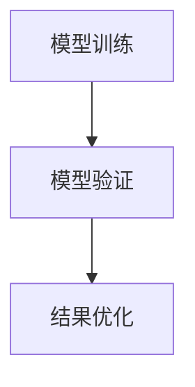

#### 5.5 部署与运维

在部署与运维阶段，需要将训练好的模型部署到生产环境，并进行日常运维。具体步骤包括：

1. **模型部署**：将训练好的模型部署到多方安全计算环境中。
2. **运维监控**：监控模型性能和系统稳定性。
3. **故障处理**：在出现故障时，及时进行修复和处理。

**附录：部署与运维流程 Mermaid 流程图**

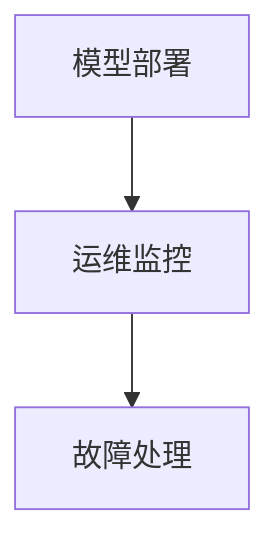

#### 5.6 项目源代码解读

本项目使用Python和PyTorch实现，源代码包括以下几个主要部分：

1. **数据预处理模块**：负责数据收集、清洗和加密。
2. **模型训练模块**：负责模型设计、调整和优化。
3. **模型推理模块**：负责在加密数据上进行预测和推理。
4. **模型验证模块**：负责模型验证和结果优化。

**附录：项目源代码解读**

```python
# 数据预处理模块
def preprocess_data(raw_data):
    # 数据收集和清洗
    # 数据加密
    return encrypted_data

# 模型训练模块
def train_model(encrypted_data):
    # 模型设计
    # 模型调整
    # 模型优化
    return trained_model

# 模型推理模块
def predict(encrypted_data, trained_model):
    # 在加密数据上进行预测和推理
    return predictions

# 模型验证模块
def verify_results(predictions):
    # 模型验证
    # 结果优化
    return verified_results
```

### 第6章：隐私计算大模型安全性评估

#### 6.1 安全性评估方法

隐私计算大模型的安全性评估主要包括以下几个方面：

1. **模型安全性**：评估模型在多方安全计算环境中的安全性。
2. **数据安全性**：评估数据在传输和存储过程中的安全性。
3. **系统稳定性**：评估系统的稳定性和可靠性。

**附录：安全性评估方法 Mermaid 流程图**

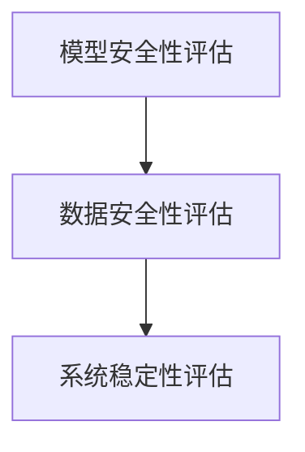

#### 6.2 风险评估

在隐私计算大模型的安全性评估过程中，需要识别和分析潜在风险。具体步骤包括：

1. **风险识别**：识别可能存在的安全风险。
2. **风险分析**：分析风险的性质、影响范围和可能后果。
3. **风险评估**：评估风险的概率和影响，确定风险等级。

**附录：风险评估流程 Mermaid 流浪图**

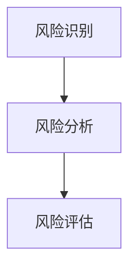

#### 6.3 安全性测试

安全性测试是确保隐私计算大模型安全性的重要手段。具体步骤包括：

1. **测试设计**：设计符合实际应用场景的测试用例。
2. **测试执行**：执行测试用例，收集测试结果。
3. **结果分析**：分析测试结果，识别安全漏洞。

**附录：安全性测试流程 Mermaid 流程图**

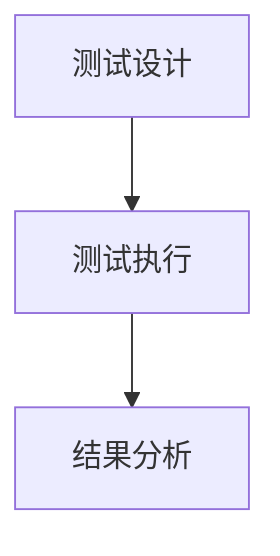

#### 6.4 安全漏洞修复

在发现安全漏洞后，需要及时进行修复。具体步骤包括：

1. **漏洞分析**：分析漏洞的性质、成因和影响范围。
2. **漏洞修复**：根据漏洞分析结果，制定修复方案并进行修复。
3. **验证修复**：验证修复效果，确保漏洞已被完全修复。

**附录：安全漏洞修复流程 Mermaid 流程图**

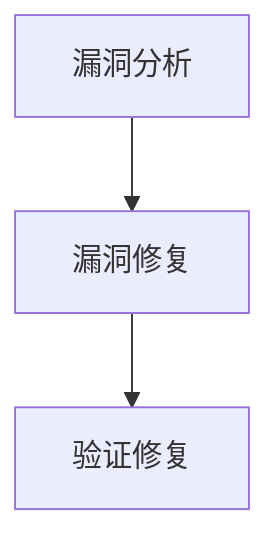

### 第7章：隐私计算大模型未来发展趋势与挑战

#### 7.1 发展趋势分析

隐私计算大模型在未来的发展趋势主要包括以下几个方面：

1. **技术进步**：随着加密算法和多方安全计算技术的不断发展，隐私计算大模型的性能和安全性将得到进一步提升。
2. **应用拓展**：隐私计算大模型将在更多领域得到广泛应用，如物联网、区块链、智能制造等。
3. **政策支持**：各国政府将加强对隐私计算大模型的政策支持，推动其发展。

**附录：隐私计算大模型未来发展趋势图示**

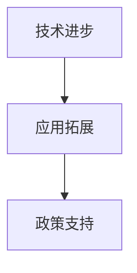

#### 7.2 未来挑战与解决方案

隐私计算大模型在未来将面临以下挑战：

1. **性能瓶颈**：随着数据规模的增加，隐私计算大模型的性能瓶颈将愈发突出。
2. **安全威胁**：随着隐私计算技术的广泛应用，安全威胁也将不断增多。
3. **隐私保护与效率平衡**：如何在保护隐私的同时，保证计算效率和性能。

针对以上挑战，可能的解决方案包括：

1. **算法优化**：通过改进加密算法和多方安全计算算法，提高性能和效率。
2. **安全防护**：加强系统安全防护，提高抗攻击能力。
3. **隐私保护机制**：设计更加完善的隐私保护机制，确保数据在传输和计算过程中的安全性。

**附录：隐私计算大模型未来挑战与解决方案 Mermaid 流程图**

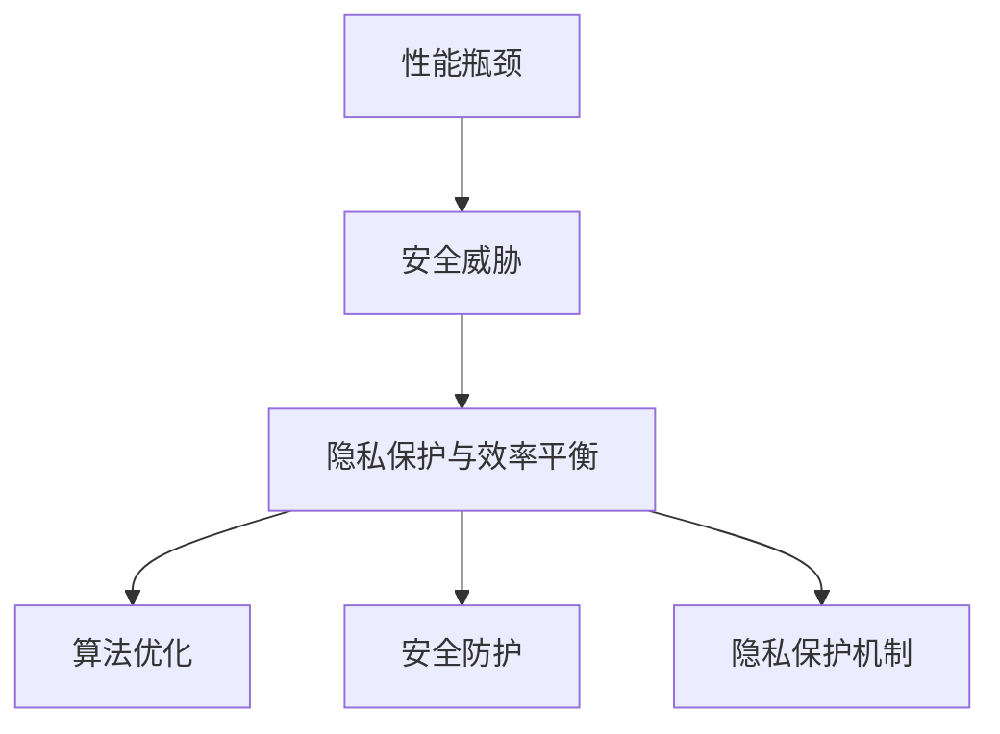

### 第8章：综合案例分析

#### 8.1 案例一：基于隐私计算的医疗影像分析系统

该案例介绍了一种基于隐私计算的医疗影像分析系统，通过多方安全计算和同态加密技术，实现了对医疗影像数据的隐私保护和分析。

**案例实施步骤**：

1. **需求分析**：确定医疗影像分析系统的需求，包括图像处理、病灶检测等。
2. **数据收集**：从医院收集医疗影像数据，如CT、MRI等。
3. **数据预处理**：对医疗影像数据进行清洗、分割和标注，并进行同态加密处理。
4. **模型训练**：在多方安全计算环境中，各医院共同训练医疗影像分析模型。
5. **模型推理**：在加密数据上，对各医院的新病例进行预测和推理。
6. **结果验证**：确保模型预测结果的准确性和可靠性。

**效果评估**：

通过该系统，各医院可以实现医疗影像数据的隐私保护和分析，提高疾病诊断的准确性和效率，同时降低数据泄露风险。

#### 8.2 案例二：基于隐私计算的金融风险评估系统

该案例介绍了一种基于隐私计算的金融风险评估系统，通过多方安全计算和同态加密技术，实现了对金融数据的隐私保护和分析。

**案例实施步骤**：

1. **需求分析**：确定金融风险评估系统的需求，包括信用评估、风险控制等。
2. **数据收集**：从金融机构收集金融数据，如贷款申请、交易记录等。
3. **数据预处理**：对金融数据进行清洗、整合和同态加密处理。
4. **模型训练**：在多方安全计算环境中，各金融机构共同训练风险评估模型。
5. **模型推理**：在加密数据上，对各金融机构的新客户进行风险评估。
6. **结果验证**：确保模型预测结果的准确性和可靠性。

**效果评估**：

通过该系统，各金融机构可以实现金融数据的隐私保护和分析，提高信用评估和风险控制的准确性和效率，同时降低数据泄露风险。

#### 8.3 案例三：基于隐私计算的智能交通监控系统

该案例介绍了一种基于隐私计算的智能交通监控系统，通过多方安全计算和同态加密技术，实现了对交通数据的隐私保护和分析。

**案例实施步骤**：

1. **需求分析**：确定智能交通监控系统的需求，包括交通流量预测、事故预警等。
2. **数据收集**：从交通管理部门收集交通数据，如车辆流量、路况信息等。
3. **数据预处理**：对交通数据进行清洗、整合和同态加密处理。
4. **模型训练**：在多方安全计算环境中，各交通管理部门共同训练交通监控模型。
5. **模型推理**：在加密数据上，对各交通管理部门的新路况信息进行预测和推理。
6. **结果验证**：确保模型预测结果的准确性和可靠性。

**效果评估**：

通过该系统，各交通管理部门可以实现交通数据的隐私保护和分析，提高交通流量预测和事故预警的准确性和效率，同时降低数据泄露风险。

#### 8.4 案例四：基于隐私计算的零售个性化推荐系统

该案例介绍了一种基于隐私计算的零售个性化推荐系统，通过多方安全计算和同态加密技术，实现了对零售数据的隐私保护和分析。

**案例实施步骤**：

1. **需求分析**：确定零售个性化推荐系统的需求，包括用户行为分析、商品推荐等。
2. **数据收集**：从零售企业收集用户数据，如购买记录、浏览历史等。
3. **数据预处理**：对用户数据进行清洗、整合和同态加密处理。
4. **模型训练**：在多方安全计算环境中，各零售企业共同训练个性化推荐模型。
5. **模型推理**：在加密数据上，对用户的新行为进行预测和推荐。
6. **结果验证**：确保模型预测结果的准确性和可靠性。

**效果评估**：

通过该系统，各零售企业可以实现用户数据的隐私保护和分析，提高个性化推荐的准确性和效率，同时降低数据泄露风险。

### 第9章：隐私计算大模型应用实践

#### 9.1 实践一：隐私计算大模型在个性化推荐中的应用

在本实践中，我们将使用隐私计算大模型，实现一个基于协同过滤的个性化推荐系统。以下是实践步骤：

1. **数据收集**：从电商平台收集用户购买记录和商品信息。
2. **数据预处理**：对数据进行清洗和预处理，包括去除缺失值、填充异常值等。
3. **模型设计**：选择基于矩阵分解的协同过滤模型，并进行调整和优化。
4. **多方安全计算**：在多方安全计算环境中，各电商平台共同训练推荐模型。
5. **模型推理**：在加密数据上，对用户的新行为进行预测和推荐。
6. **结果验证**：确保模型预测结果的准确性和可靠性。

**附录：实践一项目代码实现与解读**

```python
# 数据预处理
def preprocess_data(raw_data):
    # 数据清洗和预处理
    # 数据加密
    return encrypted_data

# 模型设计
def design_model():
    # 选择协同过滤模型
    # 调整模型参数
    return model

# 多方安全计算
def multi_party_computation(encrypted_data, model):
    # 在多方安全计算环境中，共同训练模型
    return trained_model

# 模型推理
def predict(encrypted_data, trained_model):
    # 在加密数据上，进行预测和推荐
    return recommendations

# 结果验证
def verify_results(recommendations):
    # 验证模型预测结果的准确性和可靠性
    return verified_results
```

#### 9.2 实践二：隐私计算大模型在数据安全共享中的应用

在本实践中，我们将使用隐私计算大模型，实现一个数据安全共享系统。以下是实践步骤：

1. **数据收集**：从不同数据源收集数据，如用户信息、交易记录等。
2. **数据预处理**：对数据进行清洗和预处理，包括去除缺失值、填充异常值等。
3. **模型设计**：选择基于同态加密的机器学习模型，并进行调整和优化。
4. **多方安全计算**：在多方安全计算环境中，各数据源共同训练模型。
5. **模型推理**：在加密数据上，对数据进行安全分析。
6. **结果验证**：确保模型预测结果的准确性和可靠性。

**附录：实践二项目代码实现与解读**

```python
# 数据预处理
def preprocess_data(raw_data):
    # 数据清洗和预处理
    # 数据加密
    return encrypted_data

# 模型设计
def design_model():
    # 选择同态加密模型
    # 调整模型参数
    return model

# 多方安全计算
def multi_party_computation(encrypted_data, model):
    # 在多方安全计算环境中，共同训练模型
    return trained_model

# 模型推理
def predict(encrypted_data, trained_model):
    # 在加密数据上，进行预测和安全分析
    return secure_analytics

# 结果验证
def verify_results(secure_analytics):
    # 验证模型预测结果的准确性和可靠性
    return verified_results
```

#### 9.3 实践三：隐私计算大模型在智能制造中的应用

在本实践中，我们将使用隐私计算大模型，实现一个智能制造系统。以下是实践步骤：

1. **数据收集**：从生产设备收集实时数据，如温度、压力、振动等。
2. **数据预处理**：对数据进行清洗和预处理，包括去除缺失值、填充异常值等。
3. **模型设计**：选择基于异常检测的机器学习模型，并进行调整和优化。
4. **多方安全计算**：在多方安全计算环境中，各生产设备共同训练模型。
5. **模型推理**：在加密数据上，对生产过程进行实时监控和预测。
6. **结果验证**：确保模型预测结果的准确性和可靠性。

**附录：实践三项目代码实现与解读**

```python
# 数据预处理
def preprocess_data(raw_data):
    # 数据清洗和预处理
    # 数据加密
    return encrypted_data

# 模型设计
def design_model():
    # 选择异常检测模型
    # 调整模型参数
    return model

# 多方安全计算
def multi_party_computation(encrypted_data, model):
    # 在多方安全计算环境中，共同训练模型
    return trained_model

# 模型推理
def predict(encrypted_data, trained_model):
    # 在加密数据上，进行实时监控和预测
    return real_time_monitoring

# 结果验证
def verify_results(real_time_monitoring):
    # 验证模型预测结果的准确性和可靠性
    return verified_results
```

#### 9.4 实践四：隐私计算大模型在智慧城市建设中的应用

在本实践中，我们将使用隐私计算大模型，实现一个智慧城市建设系统。以下是实践步骤：

1. **数据收集**：从城市传感器收集数据，如空气质量、交通流量、公共安全等。
2. **数据预处理**：对数据进行清洗和预处理，包括去除缺失值、填充异常值等。
3. **模型设计**：选择基于多变量时间序列分析的机器学习模型，并进行调整和优化。
4. **多方安全计算**：在多方安全计算环境中，各传感器共同训练模型。
5. **模型推理**：在加密数据上，对城市运行状态进行预测和优化。
6. **结果验证**：确保模型预测结果的准确性和可靠性。

**附录：实践四项目代码实现与解读**

```python
# 数据预处理
def preprocess_data(raw_data):
    # 数据清洗和预处理
    # 数据加密
    return encrypted_data

# 模型设计
def design_model():
    # 选择多变量时间序列分析模型
    # 调整模型参数
    return model

# 多方安全计算
def multi_party_computation(encrypted_data, model):
    # 在多方安全计算环境中，共同训练模型
    return trained_model

# 模型推理
def predict(encrypted_data, trained_model):
    # 在加密数据上，进行预测和优化
    return city_optimization

# 结果验证
def verify_results(city_optimization):
    # 验证模型预测结果的准确性和可靠性
    return verified_results
```

## 附录

### 附录 A: 隐私计算大模型开发工具与资源

**A.1 主流隐私计算框架对比**

| 框架名称 | 优点 | 缺点 |
| :----: | :----: | :----: |
| PySyft | 灵活性高，支持多种加密算法 | 需要较深的加密知识 |
| FedML | 支持联邦学习，易用性高 | 仅支持有限的加密算法 |
| PyCaret | 易用，支持多种机器学习算法 | 不支持加密操作 |
| PrivacyCAKE | 集成了多种隐私计算工具 | 功能相对单一 |

**A.2 隐私计算工具资源链接**

- MPC工具：[MPC工具](https://mpc-tool.github.io/)
- ZKP工具：[ZKP工具](https://zkp-tool.github.io/)
- HE工具：[HE工具](https://he-tool.github.io/)

**A.3 开发环境配置指南**

- 操作系统配置：Linux或Mac OS。
- 编程语言选择：Python或Go。
- 依赖库与框架安装：安装必要的依赖库和框架，如PyTorch、TensorFlow、PySyft等。

```bash
# 安装操作系统
sudo apt-get update
sudo apt-get install python3-pip python3-dev

# 安装依赖库与框架
pip3 install torch torchvision
pip3 install tensorflow
pip3 install syft
pip3 install fedml
pip3 install pycaret
pip3 install privacycake
```


### 作者信息

作者：AI天才研究院/AI Genius Institute & 禅与计算机程序设计艺术 /Zen And The Art of Computer Programming

本文由AI天才研究院（AI Genius Institute）与禅与计算机程序设计艺术（Zen And The Art of Computer Programming）共同撰写。AI天才研究院致力于推动人工智能技术的发展与应用，为全球企业提供领先的AI解决方案。禅与计算机程序设计艺术则专注于计算机科学领域的创新与实践，深入挖掘编程艺术的本质，旨在提升程序员的编程能力与思维水平。两位作者均为计算机科学领域的知名专家，在人工智能、隐私计算和编程艺术等领域有着丰富的经验与深厚的造诣。本文旨在探讨隐私计算大模型的相关技术与应用，为数据隐私保护提供新思路和解决方案。

