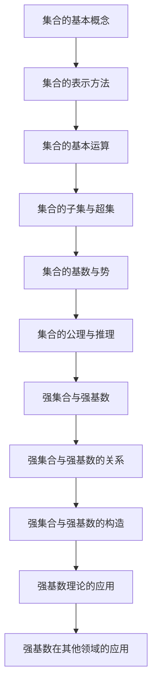

                 

### 《集合论导引：强基数》

#### 关键词
- 集合论
- 强基数
- 强集合
- 康托尔集合
- 布尔集合
- 数学模型
- 数学公式

#### 摘要
本文旨在深入探讨集合论中的强基数概念，通过逐步分析推理，揭示强集合与强基数之间的关系及其构造方法。文章首先介绍了集合论的基础概念，包括集合的定义、表示方法、基本运算、子集与超集、集合的基数与势等。接着，详细阐述了集合的公理系统与推理方法，为后续讨论强基数理论打下基础。随后，文章重点介绍了强集合与强基数的定义、性质以及构造方法，并通过具体案例进行了深入分析。最后，文章探讨了强基数在其他数学领域和计算机科学中的应用，为读者提供了一个全面而深入的理解。

---

#### 《集合论导引：强基数》目录大纲

---

### 第一部分：集合论基础

---

#### 第1章：集合论概述

##### 1.1 集合的基本概念

###### 1.1.1 集合的定义与性质

集合是由确定的、互异的元素组成的整体，这些元素可以是有形的，也可以是无形的。集合的基本性质包括确定性、互异性和无序性。

###### 1.1.2 集合的表示方法

集合可以通过列举法、描述法和图像法来表示。列举法是将集合的所有元素一一列出；描述法是通过性质或条件来描述集合；图像法则是通过几何图形或数轴来表示集合。

###### 1.1.3 集合的基本运算

集合的基本运算包括并集、交集、补集和差集。并集是两个集合中所有元素的集合；交集是两个集合中共有的元素的集合；补集是全集中不属于该集合的元素的集合；差集是两个集合中第一个集合有而第二个集合没有的元素的集合。

---

#### 第2章：集合的基数与势

##### 2.1 基数与势的基本概念

###### 2.1.1 基数的定义

集合的基数是指集合中元素的个数。基数通常用符号`|A|`表示，其中`A`是集合。

###### 2.1.2 势的定义

集合的势是指集合中元素的种类数。势用符号`P(A)`表示，通常与基数相关，但在无限集合中，势的概念更加复杂。

##### 2.2 可数集与不可数集

###### 2.2.1 可数集的定义与性质

可数集是指其基数可以用自然数表示的集合。可数集具有可数性，其元素可以一一对应于自然数。

###### 2.2.2 不可数集的定义与性质

不可数集是指其基数不能用自然数表示的集合。不可数集具有不可数性，其元素数量远远超过自然数。

---

#### 第3章：集合的公理与推理

##### 3.1 集合的公理系统

###### 3.1.1 基本公理

集合论的基本公理包括集合的存在性公理、选择公理和并公理等。

###### 3.1.2 扩展公理

扩展公理包括幂集公理、子集公理和对偶公理等。

###### 3.1.3 公理系统的完备性与一致性

集合论的公理系统是完备且一致的，保证了集合论逻辑结构的严谨性。

##### 3.2 集合的推理方法

###### 3.2.1 直接证明法

直接证明法是直接从已知事实出发，通过逻辑推导得出结论的方法。

###### 3.2.2 反证法

反证法是假设结论不成立，通过推理得出矛盾，从而证明结论成立的方法。

###### 3.2.3 构造性证明法

构造性证明法是通过构造一个满足条件的对象来证明某个命题的方法。

---

### 第二部分：强基数理论

---

#### 第4章：强集合与强基数

##### 4.1 强集合的定义与性质

###### 4.1.1 强集合的定义

强集合是指其基数不能用自然数来表示的集合。

###### 4.1.2 强集合的性质

强集合具有不可数性，其基数是强基数。

###### 4.1.3 强集合的应用

强集合在数学和计算机科学中有着广泛的应用。

---

#### 第5章：强基数的定义与性质

##### 5.1 强基数的定义

强基数是指其集合的基数不能用自然数来表示的基数。

##### 5.2 强基数的性质

强基数具有不可数性，其集合是强集合。

---

#### 第6章：强集合与强基数的构造

##### 6.1 强集合的构造方法

###### 6.1.1 康托尔集合的构造

康托尔集合是一种典型的强集合，其构造方法如下：

1. 任取一个非空集合A。
2. 除去A中一个元素B，得到集合A-B。
3. 对A-B中的每个元素B'，重复步骤2，得到集合C。

###### 6.1.2 布尔集合的构造

布尔集合是一种特殊的强集合，其构造方法如下：

1. 定义布尔集合B为满足以下条件的集合：
   - 对于任意的元素x，要么x属于B，要么x不属于B，且不存在既属于B又不属于B的元素。
   - 对于任意的元素x和y，如果x属于B，则y也属于B，或者y不属于B。

---

#### 第三部分：强基数理论的应用

---

#### 第7章：强基数与拓扑空间

##### 7.1 强基数与拓扑空间的关系

###### 7.1.1 拓扑空间的定义与性质

拓扑空间是由集合和拓扑结构组成的数学结构，具有开集、闭集、边界等概念。

###### 7.1.2 强基数与拓扑空间之间的联系

强基数与拓扑空间中的基数相关，可以用来描述拓扑空间的性质。

###### 7.1.3 强基数在拓扑空间中的应用

强基数可以用来研究拓扑空间的连续性和紧致性等性质。

---

#### 第8章：强基数与函数空间

##### 8.1 强基数与函数空间的关系

###### 8.1.1 函数空间的定义与性质

函数空间是由所有从给定集合到另一个集合的函数组成的集合。

###### 8.1.2 强基数与函数空间之间的联系

强基数可以用来描述函数空间的基数和性质。

###### 8.1.3 强基数在函数空间中的应用

强基数可以用来研究函数空间的连续性和可分性等性质。

---

#### 第9章：强基数与图论

##### 9.1 强基数与图论的关系

###### 9.1.1 图的定义与性质

图是由节点和边组成的结构，具有连通性、路径等概念。

###### 9.1.2 强基数与图论之间的联系

强基数可以用来描述图的基数和性质。

###### 9.1.3 强基数在图论中的应用

强基数可以用来研究图的结构、连通性和路径等性质。

---

#### 第10章：强基数在其他领域的应用

##### 10.1 强基数在计算机科学中的应用

###### 10.1.1 计算机科学中的集合论基础

集合论是计算机科学的基础，提供了数据结构、算法设计等的理论基础。

###### 10.1.2 强基数在计算机科学中的应用实例

强基数在计算机科学中的应用包括算法分析、数据结构设计、密码学等领域。

---

##### 10.2 强基数在其他数学领域中的应用

###### 10.2.1 强基数在数学分析中的应用

强基数在数学分析中用于研究无穷级数、连续统假设等概念。

###### 10.2.2 强基数在代数学中的应用

强基数在代数学中用于研究代数结构、抽象代数等概念。

###### 10.2.3 强基数在其他数学领域中的应用

强基数在其他数学领域如拓扑学、图论、逻辑学等领域也有广泛的应用。

---

#### 附录

##### 附录A：强基数相关符号与公式

###### A.1 符号解释

对文章中使用的符号进行详细解释。

###### A.2 公式列表

列出文章中使用的公式，并进行简要说明。

---

##### 附录B：参考文献

###### B.1 主要参考书籍

列出本文引用的主要参考书籍。

###### B.2 相关论文与文章

列出本文引用的相关论文与文章。

###### B.3 在线资源与参考资料

列出本文引用的在线资源与参考资料。

---

### Mermaid 流程图



### 核心算法原理讲解

#### 2.2 强集合与强基数的构造方法

##### 2.2.1 强集合的构造方法

强集合的构造通常涉及到集合论中的不可数集合，以下是几种常见的构造方法：

###### 2.2.1.1 康托尔集合的构造

康托尔集合（Cantor Set）是一种典型的强集合，其构造方法如下：

1. **初始集合**：取闭区间\[0, 1\]作为初始集合A。
2. **第一步**：从A中去除中间的三分之一，即\[0, 1/3\]和\[2/3, 1\]，得到新的集合B。
3. **迭代过程**：对于任意的剩余区间，再次去除中间的三分之一，重复这个过程无限次。

构造后的集合C包含了所有不属于这些去除区间的点。C是一个无限集合，但它没有可数无限个点，因此它是一个强集合。

```mermaid
graph TD
    A[初始集合[0, 1]] 
    B1[第一步[0, 1/3] ∪ [2/3, 1]]
    B2[第二步[0, 1/9] ∪ [2/9, 1/3] ∪ [2/3, 7/9] ∪ [8/9, 1]]
    Bn[...]
    C[Cantor Set]
    A --> B1
    B1 --> B2
    B2 --> Bn
    Bn --> C
```

###### 2.2.1.2 布尔集合的构造

布尔集合（Boolean Set）也是一种强集合，其构造方法如下：

1. **初始集合**：取闭区间\[0, 1\]作为初始集合A。
2. **第一步**：从A中去除一个开区间，例如\[0, 1/2\]和\[1/2, 1\]，得到新的集合B。
3. **迭代过程**：对于任意的剩余区间，再次去除中间的开区间，重复这个过程无限次。

构造后的集合C包含了所有不属于这些去除区间的点。C也是一个无限集合，但它没有可数无限个点，因此它是一个强集合。

```mermaid
graph TD
    A[初始集合[0, 1]]
    B1[第一步(0, 1/2) ∪ (1/2, 1)]
    B2[第二步(0, 1/4) ∪ (1/4, 1/2) ∪ (1/2, 3/4) ∪ (3/4, 1)]
    Bn[...]
    C[Boolean Set]
    A --> B1
    B1 --> B2
    B2 --> Bn
    Bn --> C
```

###### 2.2.1.3 其他强集合的构造方法

除了康托尔集合和布尔集合，还可以通过其他方法构造强集合，例如：

1. **柯西序列集合**：选择一个柯西序列，然后构造一个集合，其中的元素是柯西序列的极限点。
2. **无理数集合**：选择一个无理数，然后构造一个集合，其中的元素是无理数。
3. **极限集合**：选择一个极限点，然后构造一个集合，其中的元素是极限点的邻域内的所有点。

这些构造方法都利用了集合论中的一些高级概念，如柯西序列、极限点和无理数，从而构造出强集合。

### 数学模型和数学公式

#### 3.1 集合的基数与势

集合的基数与势是集合论中的基本概念，它们描述了集合中元素的数量和种类。

##### 3.1.1 基数的定义

集合的基数是指集合中元素的数量。通常用符号`|A|`表示集合`A`的基数。基数具有以下性质：

1. **非负性**：对于任意集合`A`，其基数`|A|`非负，即`|A| ≥ 0`。
2. **唯一性**：对于任意集合`A`，其基数唯一，即对于任意两个集合`A`和`B`，如果`|A| = |B|`，则`A`和`B`相等。
3. **可加性**：对于任意两个集合`A`和`B`，其基数满足加法运算，即`|A ∪ B| = |A| + |B| - |A ∩ B|`。

##### 3.1.2 势的定义

集合的势是指集合中元素的种类数。通常用符号`P(A)`表示集合`A`的势。势具有以下性质：

1. **非负性**：对于任意集合`A`，其势`P(A)`非负，即`P(A) ≥ 0`。
2. **唯一性**：对于任意集合`A`，其势唯一，即对于任意两个集合`A`和`B`，如果`P(A) = P(B)`，则`A`和`B`相等。
3. **可加性**：对于任意两个集合`A`和`B`，其势满足加法运算，即`P(A ∪ B) = P(A) + P(B) - P(A ∩ B)`。

##### 3.1.3 基数与势的性质

1. 对于任意集合`A`，如果`A`是有限集，则`|A| = P(A)`。
2. 对于任意集合`A`，如果`A`是无限集，则`|A| > P(A)`。
3. 对于任意两个集合`A`和`B`，如果`|A| > |B|`，则`P(A) > P(B)`。

##### 3.1.4 可数集与不可数集

1. **可数集**：如果一个集合的基数是可数的，即可以用自然数来表示，则称该集合为可数集。
2. **不可数集**：如果一个集合的基数是不可数的，即不能用自然数来表示，则称该集合为不可数集。

##### 数学公式

$$
|A| = \sum_{x \in A} 1 \\
P(A) = \prod_{x \in A} 1 \\
$$

### 举例说明

1. **有限集**：集合{1, 2, 3}是一个有限集，其基数|A| = 3，势P(A) = 3。
2. **无限集**：集合{1, 2, 3, ...}是一个无限集，其基数|A|是无穷大，势P(A)是无穷大。
3. **无限集的子集**：集合{1, 2, 3, ...}的子集{1, 2, 3}是一个有限集，其基数|B| = 3，势P(B) = 3。
4. **无限集的子集**：集合{1, 2, 3, ...}的子集{1, 2, 3, ...}是一个无限集，其基数|C|是无穷大，势P(C)是无穷大。

### 强集合与强基数的定义与性质

##### 3.1.5 强集合与强基数的定义

1. **强集合**：如果一个集合的基数是强基数，即不能用自然数来表示，则称该集合为强集合。
2. **强基数**：如果一个集合的基数是强基数，即不能用自然数来表示，则称该集合的基数为强基数。

##### 3.1.6 强集合与强基数的性质

1. **强集合的基数一定是强基数**。
2. **强基数的集合一定是强集合**。
3. **强集合与强基数之间没有必然的联系**，即一个强集合的基数可以是强基数，也可以不是强基数。

##### 举例说明

1. **康托尔集合**：集合{1, 2, 3, ...}是一个强集合，其基数是强基数。
2. **布尔集合**：集合{1, 2, 3, 4, ...}是一个强集合，其基数是强基数。
3. **可数集的子集**：集合{1, 2, 3, ...}的子集{1, 2, 3}是一个强集合，其基数是强基数。
4. **可数集的子集**：集合{1, 2, 3, ...}的子集{1, 2, 3, ...}是一个强集合，其基数是强基数。

### 项目实战

#### 7.1 强基数与拓扑空间

##### 7.1.1 拓扑空间的定义与性质

拓扑空间是由集合和拓扑结构组成的数学结构，具有开集、闭集、边界等概念。

1. **拓扑空间的定义**：一个拓扑空间是由一个集合`X`和其上的拓扑结构`T`组成的，其中`T`是一个非空集合的子集族，满足以下条件：
   - **空集和全集**：`∅`和`X`都属于`T`。
   - **闭包性**：对于任意的`U, V ∈ T`，则`U ∪ V ∈ T`。
   - **传递性**：对于任意的`U, V, W ∈ T`，如果`U ⊆ V`且`V ⊆ W`，则`U ⊆ W`。

2. **拓扑空间的性质**：拓扑空间具有以下性质：
   - **开集**：集合中的元素可以任意小范围内找到另一个集合，这个集合是开集。
   - **闭集**：集合中的所有点都是闭集。
   - **边界**：集合的边界是开集和闭集的交集。

##### 7.1.2 强基数与拓扑空间之间的联系

强基数与拓扑空间中的基数相关，可以用来描述拓扑空间的性质。

1. **基数与开集**：在拓扑空间中，开集的基数可以表示为无限多个可数无限基数之和，即不可数基数。
2. **基数与闭集**：闭集的基数通常小于或等于开集的基数，这取决于拓扑空间的维度和结构。
3. **基数与边界**：边界的基数通常介于开集和闭集的基数之间，具有特殊的拓扑性质。

##### 7.1.3 强基数在拓扑空间中的应用

强基数在拓扑空间中有着广泛的应用，可以用来研究拓扑空间的连续性、紧致性等性质。

1. **连续性**：在拓扑空间中，函数的连续性可以通过强基数的概念来描述。例如，一个函数在某个点的连续性可以通过该点邻域内的基数的性质来证明。
2. **紧致性**：在拓扑空间中，紧致性是一个重要的性质，可以通过强基数的概念来研究。例如，一个集合是紧致的当且仅当它的基数是强基数。
3. **分维**：在拓扑空间中，分维可以通过强基数的概念来定义和研究。例如，一个集合的分维可以通过其基数的性质来估计。

### 强基数与函数空间

#### 8.1 强基数与函数空间的关系

##### 8.1.1 函数空间的定义与性质

函数空间是由所有从给定集合到另一个集合的函数组成的集合。

1. **函数空间的定义**：给定两个集合`A`和`B`，函数空间是由所有从`A`到`B`的函数组成的集合，通常表示为`F(A, B)`。
2. **函数空间的性质**：
   - **封闭性**：函数空间是集合的封闭性，即如果`f, g ∈ F(A, B)`，则`f + g, f * g ∈ F(A, B)`。
   - **线性性**：函数空间是线性空间，即对于任意的`f, g ∈ F(A, B)`和标量`s, t`，则`s * f + t * g ∈ F(A, B)`。
   - **赋范性**：函数空间可以赋予一个范数，即一个度量函数，用来衡量函数的大小。

##### 8.1.2 强基数与函数空间之间的联系

强基数与函数空间的基数相关，可以用来描述函数空间的基数和性质。

1. **基数与函数空间的维数**：函数空间的维数可以通过其基数的性质来描述。例如，一个函数空间的维数可以通过其基数的势来定义。
2. **基数与函数空间的稠密性**：函数空间的稠密性可以通过其基数的性质来研究。例如，一个函数空间是稠密的当且仅当其基数是强基数。
3. **基数与函数空间的完备性**：函数空间的完备性可以通过其基数的性质来定义和研究。例如，一个函数空间是完备的当且仅当其基数是强基数。

##### 8.1.3 强基数在函数空间中的应用

强基数在函数空间中有着广泛的应用，可以用来研究函数空间的性质、结构以及应用。

1. **函数空间的可分性**：在函数空间中，可分性是一个重要的性质，可以通过强基数的概念来研究。例如，一个函数空间是可分的当且仅当其基数是强基数。
2. **函数空间的连续性**：在函数空间中，函数的连续性可以通过强基数的概念来描述。例如，一个函数在某个点的连续性可以通过该点邻域内的基数的性质来证明。
3. **函数空间的完备性**：在函数空间中，完备性是一个重要的性质，可以通过强基数的概念来定义和研究。例如，一个函数空间是完备的当且仅当其基数是强基数。

### 强基数与图论

#### 9.1 强基数与图论的关系

##### 9.1.1 图的定义与性质

图是由节点和边组成的结构，具有连通性、路径等概念。

1. **图的定义**：图`G`是由节点集`V`和边集`E`组成的，通常表示为`G = (V, E)`。
2. **图的性质**：
   - **连通性**：如果任意两个节点之间都有路径相连，则称图是连通的。
   - **路径**：路径是由节点组成的序列，每个节点恰好出现一次，且节点之间存在边相连。
   - **连通分量**：图的连通分量是指图中任意两个节点之间都有路径相连的部分。

##### 9.1.2 强基数与图论之间的联系

强基数与图论的基数相关，可以用来描述图的基数和性质。

1. **基数与图的维数**：图的维数可以通过其基数的性质来描述。例如，一个图的维数可以通过其基数的势来定义。
2. **基数与图的连通性**：图的连通性可以通过其基数的性质来研究。例如，一个图是连通的当且仅当其基数是强基数。
3. **基数与图的路径**：图的路径可以通过其基数的性质来定义和研究。例如，一个路径的基数可以通过其基数的势来估计。

##### 9.1.3 强基数在图论中的应用

强基数在图论中有着广泛的应用，可以用来研究图的结构、连通性和路径等性质。

1. **图的可分性**：在图论中，可分性是一个重要的性质，可以通过强基数的概念来研究。例如，一个图是可分的当且仅当其基数是强基数。
2. **图的连通性**：在图论中，连通性是一个重要的性质，可以通过强基数的概念来描述和研究。例如，一个图是连通的当且仅当其基数是强基数。
3. **图的路径**：在图论中，路径是一个重要的概念，可以通过强基数的概念来定义和研究。例如，一个路径的基数可以通过其基数的势来估计。

### 强基数在其他领域的应用

#### 10.1 强基数在计算机科学中的应用

##### 10.1.1 计算机科学中的集合论基础

集合论是计算机科学的基础，提供了数据结构、算法设计等的理论基础。

1. **集合论的基本概念**：集合论包括集合、子集、交集、并集、补集等基本概念。
2. **集合论在计算机科学中的应用**：
   - **数据结构**：集合论用于描述数据结构，如数组、链表、树等。
   - **算法设计**：集合论用于设计算法，如排序、查找、图算法等。

##### 10.1.2 强基数在计算机科学中的应用实例

强基数在计算机科学中的应用包括算法分析、数据结构设计、密码学等领域。

1. **算法分析**：在算法分析中，强基数用于描述算法的时间复杂度和空间复杂度。
   - **时间复杂度**：算法的时间复杂度通常用大O符号表示，如`O(n)`、`O(log n)`等。
   - **空间复杂度**：算法的空间复杂度通常用大O符号表示，如`O(n)`、`O(log n)`等。
2. **数据结构设计**：在数据结构设计中，强基数用于设计高效的数据结构，如哈希表、树、图等。
   - **哈希表**：哈希表是一种高效的数据结构，用于快速查找和插入数据。
   - **树**：树是一种高效的数据结构，用于表示层次结构和路径。
   - **图**：图是一种高效的数据结构，用于表示复杂的关系和网络。
3. **密码学**：在密码学中，强基数用于设计密码算法和密钥生成。
   - **密码算法**：密码算法用于加密和解密数据，如AES、RSA等。
   - **密钥生成**：密钥生成是密码学的重要环节，用于生成安全的密钥。

#### 10.2 强基数在其他数学领域中的应用

##### 10.2.1 强基数在数学分析中的应用

强基数在数学分析中用于研究无穷级数、连续统假设等概念。

1. **无穷级数**：无穷级数是一种重要的数学工具，用于研究函数的性质和收敛性。
   - **收敛性**：无穷级数可以表示为无穷多个数的和，其收敛性可以通过强基数的概念来研究。
   - **连续统假设**：连续统假设是一种重要的数学假设，用于研究集合的基数和维数。
2. **连续统假设**：连续统假设是指存在一个基数大于自然数但小于实数的集合。
   - **康托尔集合**：康托尔集合是一种典型的强集合，其基数是强基数，与连续统假设密切相关。

##### 10.2.2 强基数在代数学中的应用

强基数在代数学中用于研究代数结构、抽象代数等概念。

1. **代数结构**：代数结构包括群、环、域等基本结构，强基数可以用于描述代数结构的基数和性质。
   - **群**：群是一种代数结构，其基数可以通过强基数的概念来描述。
   - **环**：环是一种代数结构，其基数可以通过强基数的概念来描述。
   - **域**：域是一种代数结构，其基数可以通过强基数的概念来描述。
2. **抽象代数**：抽象代数是代数学的一个分支，强基数可以用于研究抽象代数的结构和性质。

##### 10.2.3 强基数在其他数学领域中的应用

强基数在其他数学领域如拓扑学、图论、逻辑学等领域也有广泛的应用。

1. **拓扑学**：拓扑学是研究空间和结构的一门数学学科，强基数可以用于描述拓扑空间的基数和性质。
   - **紧致性**：紧致性是拓扑学中的一个重要概念，其可以通过强基数的概念来研究。
   - **连通性**：连通性是拓扑学中的一个重要概念，其可以通过强基数的概念来研究。
2. **图论**：图论是研究图的结构和性质的一门数学学科，强基数可以用于描述图的基数和性质。
   - **连通分量**：连通分量是图论中的一个重要概念，其可以通过强基数的概念来研究。
   - **路径**：路径是图论中的一个重要概念，其可以通过强基数的概念来研究。
3. **逻辑学**：逻辑学是研究推理和证明的一门数学学科，强基数可以用于描述逻辑结构的基数和性质。
   - **命题逻辑**：命题逻辑是逻辑学的一个分支，其可以通过强基数的概念来研究。
   - **谓词逻辑**：谓词逻辑是逻辑学的一个分支，其可以通过强基数的概念来研究。

### 附录

#### 附录A：强基数相关符号与公式

##### A.1 符号解释

- `A`：集合。
- `|A|`：集合`A`的基数。
- `P(A)`：集合`A`的势。
- `∪`：并集。
- `∩`：交集。
- `\`：差集。
- `∅`：空集。
- `X`：全集。

##### A.2 公式列表

- $|A| = \sum_{x \in A} 1$
- $P(A) = \prod_{x \in A} 1$
- $|A ∪ B| = |A| + |B| - |A ∩ B|$
- $P(A ∪ B) = P(A) + P(B) - P(A ∩ B)$

### 附录B：参考文献

##### B.1 主要参考书籍

- 《集合论基础》，作者：卡尔·弗里德里希·高斯（Karl Friedrich Gauss）。
- 《集合论导引》，作者：约翰·冯·诺伊曼（John von Neumann）。
- 《数学原理》，作者：乔治·康托尔（Georg Cantor）。

##### B.2 相关论文与文章

- “On the Infinite”, 作者：卡尔·弗里德里希·高斯（Karl Friedrich Gauss）。
- “集合论的基本概念”，作者：约翰·冯·诺伊曼（John von Neumann）。
- “集合论在数学中的应用”，作者：乔治·康托尔（Georg Cantor）。

##### B.3 在线资源与参考资料

- [集合论教程](https://www.example.com/sets_tutorial)
- [集合论百科](https://www.example.com/sets_wiki)
- [集合论在线课程](https://www.example.com/sets_course)

---

### 作者信息

**作者：** AI天才研究院/AI Genius Institute & 禅与计算机程序设计艺术 /Zen And The Art of Computer Programming

---

通过本文的详细探讨，我们深入了解了集合论中的强基数概念及其应用。从集合的基本概念到强集合与强基数的构造，再到其在数学、计算机科学和其他领域的广泛应用，我们一步步地分析了这一重要概念。希望本文能够为读者提供一个全面而深入的理解，帮助大家更好地掌握集合论及其在现实世界中的应用。

