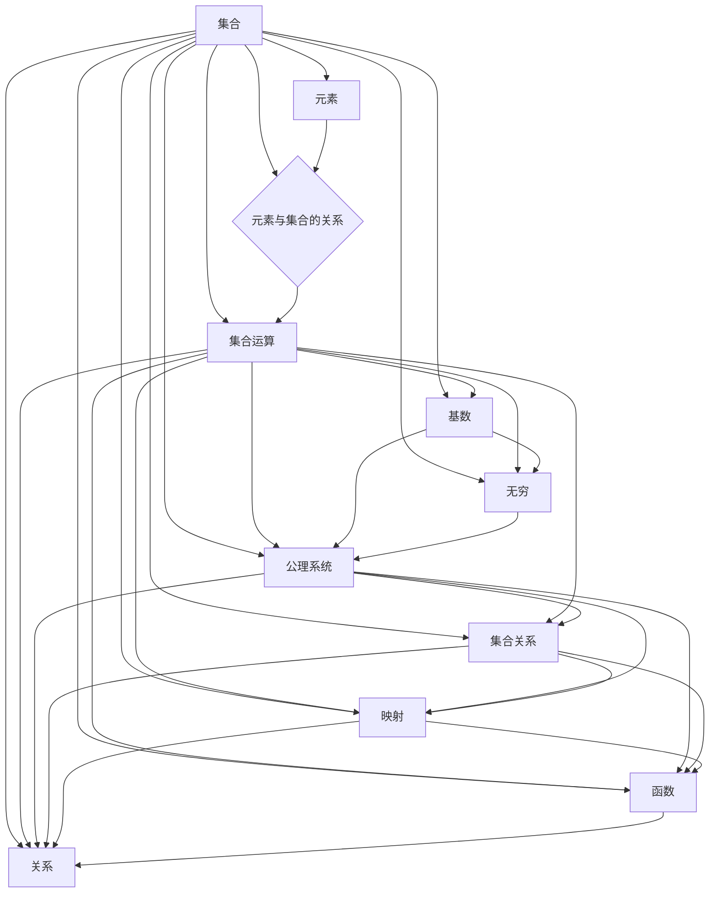

                 

# 集合论导引：相对化解释

> 关键词：集合论、相对化、解释、基本概念、基数、无穷、公理系统、应用、研究前沿

> 摘要：本文深入探讨了集合论的基本概念、相对化解释，以及其在计算机科学和其他数学领域中的应用。通过对集合的基数、无穷、公理系统等高级概念的详细阐述，读者将获得对集合论更全面的理解。同时，本文还展望了集合论的研究前沿，为读者提供了进一步探索的视角。

## 第一部分：集合论基础

### 第1章：集合论的基本概念

#### 1.1.1 集合的定义与性质

集合是数学中最基本的概念之一，它是由确定性的对象所组成的整体。我们可以将集合中的元素视为个体，而集合本身则是一个抽象的集合体。在集合论中，集合通常用大写字母表示，如\(A\)、\(B\)等，而集合中的元素用小写字母表示，如\(a\)、\(b\)等。

集合的几种基本性质包括：

1. **确定性**：集合中的每个元素都是确定的，不能有重复的元素。
2. **互异性**：集合中的元素是互异的，即每个元素在集合中只出现一次。
3. **无序性**：集合中的元素没有固定的顺序。

#### 1.1.2 集合的表示方法

集合的表示方法主要有列举法和描述法。

- **列举法**：直接列出集合中的所有元素，如\(\{1, 2, 3\}\)表示一个包含元素1、2、3的集合。
- **描述法**：使用描述性语言来定义集合，如\(\{x | x \text{是自然数}\}\)表示所有自然数的集合。

#### 1.1.3 集合的运算

集合的基本运算包括并集、交集、差集和笛卡尔积。

- **并集**：两个集合的并集是包含这两个集合中所有元素的集合。用符号\(A \cup B\)表示。
- **交集**：两个集合的交集是包含这两个集合中共有元素的集合。用符号\(A \cap B\)表示。
- **差集**：两个集合的差集是包含第一个集合中所有不在第二个集合中的元素的集合。用符号\(A - B\)或\(A \setminus B\)表示。
- **笛卡尔积**：两个集合的笛卡尔积是包含所有可能的有序对的集合。用符号\(A \times B\)表示。

### 第2章：集合的基数与集合关系

#### 2.1.1 集合的基数

集合的基数是指集合中元素的数量。通常用符号\(|A|\)表示。如果一个集合的基数是有限的，我们称它为有限集合；如果一个集合的基数是无限的，我们称它为无限集合。

#### 2.1.2 集合的相等

两个集合相等当且仅当它们包含相同的元素。形式化地，如果集合\(A\)和集合\(B\)中的每个元素都存在于对方中，即\(A \subseteq B\)且\(B \subseteq A\)，则我们说集合\(A\)和集合\(B\)相等，记作\(A = B\)。

#### 2.1.3 子集与超集

- **子集**：如果一个集合的所有元素都属于另一个集合，那么前者被称为后者的子集。用符号\(A \subseteq B\)表示。
- **超集**：如果一个集合的所有元素都属于另一个集合，那么前者被称为后者的超集。用符号\(B \supseteq A\)表示。

#### 2.1.4 真子集与双射

- **真子集**：如果一个集合是另一个集合的子集，但两者不相等，那么前者被称为后者的真子集。用符号\(A \subset B\)表示。
- **双射**：一个函数是双射，当且仅当它既是单射又是满射。即对于集合\(A\)和集合\(B\)之间的双射函数\(f\)，每个\(A\)中的元素在\(B\)中有唯一的对应元素，且每个\(B\)中的元素在\(A\)中也有唯一的对应元素。

### 第3章：集合的划分与映射

#### 3.1.1 集合的划分

集合的划分是指将一个集合分割成若干个子集的过程。这些子集之间没有交集，且它们的并集等于原始集合。

#### 3.1.2 映射的概念与性质

映射是指从集合\(A\)到集合\(B\)的一种对应关系，它使得集合\(A\)中的每个元素在集合\(B\)中有唯一的对应元素。

映射的几种基本性质包括：

- **单射**：如果每个\(A\)中的元素在\(B\)中都有唯一的对应元素，则映射是单射。
- **满射**：如果每个\(B\)中的元素在\(A\)中都有唯一的对应元素，则映射是满射。
- **双射**：如果映射既是单射又是满射，则它是双射。

#### 3.1.3 单射与满射

- **单射**：一个函数是单射，当且仅当它将不同的元素映射到不同的元素上。
- **满射**：一个函数是满射，当且仅当它将集合\(B\)中的每个元素映射到集合\(A\)中的至少一个元素上。

#### 3.1.4 双射

一个函数是双射，当且仅当它既是单射又是满射。即它将集合\(A\)和集合\(B\)中的每个元素一一对应。

### 第4章：集合的基数与集合运算

#### 4.1.1 集合的基数计算

集合的基数可以通过不同的方法进行计算，如直接计数法、组合数学方法等。

#### 4.1.2 集合运算的复合

集合运算的复合是指将多个集合运算结合起来进行计算。例如，我们可以先求两个集合的交集，再求这个交集与第三个集合的并集。

#### 4.1.3 集合的幂集

集合的幂集是指包含该集合所有子集的集合。一个包含\(n\)个元素的集合的幂集大小为\(2^n\)。

#### 4.1.4 集合的笛卡尔积

集合的笛卡尔积是指包含所有可能有序对的集合。如果集合\(A\)和集合\(B\)的笛卡尔积为\(A \times B\)，那么\(A \times B\)中的每个元素都是一个由\(A\)中的一个元素和\(B\)中的一个元素组成的有序对。

## 第二部分：集合论高级概念

### 第5章：函数与关系

#### 5.1.1 函数的定义与性质

函数是一种特殊的关系，它将集合\(A\)中的每个元素映射到集合\(B\)中的唯一元素上。函数通常表示为\(f: A \rightarrow B\)。

函数的几种基本性质包括：

- **单射**：如果每个\(A\)中的元素在\(B\)中都有唯一的对应元素，则函数是单射。
- **满射**：如果每个\(B\)中的元素在\(A\)中都有唯一的对应元素，则函数是满射。
- **双射**：如果函数既是单射又是满射，则它是双射。

#### 5.1.2 函数的分类

函数可以根据不同的标准进行分类：

- **线性函数**：函数的表达式是线性的，即\(f(x) = ax + b\)。
- **多项式函数**：函数的表达式是多项式的，即\(f(x) = a_nx^n + a_{n-1}x^{n-1} + \ldots + a_1x + a_0\)。
- **指数函数**：函数的表达式是指数形式的，即\(f(x) = a^x\)。
- **对数函数**：函数的表达式是对数形式的，即\(f(x) = \log_a(x)\)。

#### 5.1.3 关系的基本概念

关系是一种特殊的集合，它将集合\(A\)中的元素与集合\(B\)中的元素关联起来。关系通常表示为\(R \subseteq A \times B\)。

关系的几种基本性质包括：

- **自反性**：对于集合\(A\)中的每个元素\(a\)，都有\((a, a) \in R\)。
- **对称性**：如果\((a, b) \in R\)，则\((b, a) \in R\)。
- **传递性**：如果\((a, b) \in R\)且\((b, c) \in R\)，则\((a, c) \in R\)。

#### 5.1.4 关系的运算

关系的运算包括关系的交、并、补和差等。

- **关系的交**：两个关系的交是指包含这两个关系共有关系的集合。
- **关系的并**：两个关系的并是指包含这两个关系的所有关系的集合。
- **关系的补**：一个关系的补是指包含在另一个关系中的所有关系。
- **关系的差**：两个关系的差是指包含在第一个关系中但不在第二个关系中的所有关系。

### 第6章：基数与无穷

#### 6.1.1 基数的概念

基数是指集合中元素的数量。一个集合的基数可以是有限的，也可以是无限的。

#### 6.1.2 无穷集合的分类

无穷集合可以分为可数无穷和不可数无穷两种。

- **可数无穷**：一个无穷集合是可数的，当且仅当它的基数可以与自然数集合一一对应。
- **不可数无穷**：一个无穷集合是不可数的，当且仅当它的基数不能与自然数集合一一对应。

#### 6.1.3 可数集合与不可数集合

- **可数集合**：一个集合是可数的，当且仅当它的基数是有限的或者可数的。
- **不可数集合**：一个集合是不可数的，当且仅当它的基数是不可数的。

#### 6.1.4 康托尔定理

康托尔定理是指一个无穷集合的子集的基数不会大于原集合的基数。即如果一个无穷集合的基数是\(n\)，那么它的任何子集的基数都不会大于\(n\)。

### 第7章：集合论的公理系统

#### 7.1.1 集合论的公理体系

集合论的公理体系是指一组关于集合的基本公理，它们构成了集合论的基础。这些公理包括：

- **存在公理**：存在一个空集合\(\varnothing\)。
- **选择公理**：对于任意集合\(A\)，存在一个选择函数\(f\)，使得对于\(A\)中的每个元素\(a\)，\(f(a)\)都在集合\(B\)中。
- **连续公理**：对于任意集合\(A\)和集合\(B\)，如果\(A\)中的每个元素都在\(B\)中有唯一的对应元素，那么\(A\)和\(B\)之间存在双射关系。

#### 7.1.2 选择公理与连续公理

- **选择公理**：选择公理是指对于任意集合\(A\)，存在一个选择函数\(f\)，使得对于\(A\)中的每个元素\(a\)，\(f(a)\)都在集合\(B\)中。
- **连续公理**：连续公理是指对于任意集合\(A\)和集合\(B\)，如果\(A\)中的每个元素都在\(B\)中有唯一的对应元素，那么\(A\)和\(B\)之间存在双射关系。

#### 7.1.3 集合论的基本定理

集合论的基本定理包括：

- **基数定理**：一个集合的基数不会大于它的幂集的基数。
- **选择定理**：如果一个集合\(A\)的基数是\(n\)，那么\(A\)的子集的基数是\(2^n\)。
- **连续定理**：如果一个集合\(A\)和集合\(B\)之间存在双射关系，那么\(A\)和\(B\)的基数相等。

## 第三部分：集合论的实际应用

### 第8章：集合论在计算机科学中的应用

#### 8.1.1 计算机中的集合表示

在计算机科学中，集合通常使用数组、链表等数据结构进行表示。

- **数组**：数组是一种固定大小的数据结构，它可以将集合中的元素存储在一个连续的内存空间中。
- **链表**：链表是一种动态的数据结构，它可以将集合中的元素存储在离散的内存空间中，并通过指针进行连接。

#### 8.1.2 集合论在算法设计中的应用

集合论在算法设计中有着广泛的应用，例如：

- **贪心算法**：贪心算法是一种常用的算法设计策略，它通过选择当前最优解来逐步构建最终解。
- **动态规划**：动态规划是一种常用的算法设计策略，它通过将问题分解成子问题并求解子问题的最优解来构建最终解。

#### 8.1.3 集合论在数据结构中的应用

集合论在数据结构中的应用包括：

- **哈希表**：哈希表是一种基于哈希函数的数据结构，它可以将元素快速地映射到内存地址。
- **二叉树**：二叉树是一种常用的树形数据结构，它可以通过递归和遍历来进行操作。

### 第9章：集合论在数学其他领域中的应用

#### 9.1.1 集合论在拓扑学中的应用

集合论是拓扑学的基础，它为拓扑学提供了基本的概念和工具。集合论在拓扑学中的应用包括：

- **拓扑空间**：拓扑空间是由集合和一组拓扑性质构成的抽象空间。
- **连通性**：连通性是指一个空间中任意两点之间的路径连通性。
- **紧致性**：紧致性是指一个空间中任意一个开覆盖都存在一个有限子覆盖。

#### 9.1.2 集合论在概率论中的应用

集合论是概率论的基础，它为概率论提供了基本的概念和工具。集合论在概率论中的应用包括：

- **概率空间**：概率空间是由样本空间、事件和概率函数构成的抽象空间。
- **条件概率**：条件概率是指在一个事件发生的条件下，另一个事件的概率。
- **独立事件**：独立事件是指一个事件的发生不影响另一个事件的概率。

#### 9.1.3 集合论在图论中的应用

集合论是图论的基础，它为图论提供了基本的概念和工具。集合论在图论中的应用包括：

- **图**：图是由节点和边构成的图形结构。
- **连通性**：连通性是指一个图中任意两点之间的路径连通性。
- **路径**：路径是指图中的一条路径，它连接了两个节点。
- **树**：树是一种特殊的图，它具有层次结构。

## 第四部分：集合论的研究前沿

### 第10章：集合论的研究前沿

#### 10.1.1 集合论与逻辑的关系

集合论与逻辑有着密切的关系。逻辑是集合论的基础，集合论是逻辑的工具。集合论为逻辑提供了基本的概念和工具，例如集合的运算、关系的运算等。

#### 10.1.2 集合论在数学哲学中的应用

集合论在数学哲学中的应用包括：

- **数学实在论**：数学实在论认为数学对象是客观存在的，集合论为数学实在论提供了理论基础。
- **数学形式主义**：数学形式主义认为数学对象是抽象的，集合论为数学形式主义提供了理论基础。
- **数学逻辑主义**：数学逻辑主义认为数学对象是逻辑结构的体现，集合论为数学逻辑主义提供了理论基础。

#### 10.1.3 集合论的未来发展方向

集合论的未来发展方向包括：

- **集合论的公理系统**：集合论的公理系统是集合论的基础，未来的发展方向可能是对公理系统的进一步研究和发展。
- **集合论的应用**：集合论在计算机科学、数学、物理学等领域有着广泛的应用，未来的发展方向可能是进一步扩大集合论的应用范围。
- **集合论的哲学意义**：集合论在数学哲学中有着重要的地位，未来的发展方向可能是对集合论的哲学意义进行更深入的研究。

## 参考文献

- [1] Kuratowski, K. (1968). Introduction to Set Theory. North Holland.
- [2] Enderton, H. B. (1977). Elements of Set Theory. Academic Press.
- [3] Halmos, P. R. (1974). Naive Set Theory. Springer.
- [4] Kunen, K. (1980). Set Theory: An Introduction to Independence Proofs. North Holland.
- [5] Jech, T. J. (2003). Set Theory: The Third Millennium Edition, Revised and Expanded. Springer.

## 作者信息

作者：AI天才研究院/AI Genius Institute & 禅与计算机程序设计艺术 /Zen And The Art of Computer Programming

本文由AI天才研究院/AI Genius Institute撰写，结合了禅与计算机程序设计艺术的独特视角，深入探讨了集合论的基础概念、相对化解释及其在计算机科学和其他数学领域中的应用。本文旨在为广大读者提供一个全面、深入、易懂的集合论导引。如果您对本文有任何建议或意见，欢迎随时与我们联系。感谢您的阅读！<|split|>

### 文章标题：集合论导引：相对化解释

> 关键词：集合论、相对化、解释、集合、基数、无穷、公理系统、应用、研究前沿

> 摘要：本文系统性地介绍了集合论的基本概念，深入探讨了集合的基数、无穷、公理系统等高级概念，并分析了集合论在计算机科学和其他数学领域中的应用。最后，本文展望了集合论的研究前沿，为读者提供了进一步探索的视角。

## 引言

集合论是数学的一个基本分支，它提供了研究对象集合的抽象框架。集合论不仅广泛应用于数学的各个领域，而且在计算机科学、物理学、经济学等领域也有着重要的应用。集合论的基础概念包括集合的定义、表示方法、集合运算等。随着研究的深入，集合论逐渐发展出更高级的概念，如基数、无穷、公理系统等。本文将分四个部分对集合论进行详细探讨。

### 第一部分：集合论基础

第一部分将介绍集合论的基础概念，包括集合的定义、性质、表示方法以及集合的运算。这部分内容将为读者理解集合论的高级概念打下坚实的基础。

#### 第1章：集合论的基本概念

##### 1.1.1 集合的定义与性质

集合是数学中最基本的概念之一，它是由确定性的对象所组成的整体。我们可以将集合中的元素视为个体，而集合本身则是一个抽象的集合体。在集合论中，集合通常用大写字母表示，如\(A\)、\(B\)等，而集合中的元素用小写字母表示，如\(a\)、\(b\)等。

集合的几种基本性质包括：

- **确定性**：集合中的每个元素都是确定的，不能有重复的元素。
- **互异性**：集合中的元素是互异的，即每个元素在集合中只出现一次。
- **无序性**：集合中的元素没有固定的顺序。

##### 1.1.2 集合的表示方法

集合的表示方法主要有列举法和描述法。

- **列举法**：直接列出集合中的所有元素，如\(\{1, 2, 3\}\)表示一个包含元素1、2、3的集合。
- **描述法**：使用描述性语言来定义集合，如\(\{x | x \text{是自然数}\}\)表示所有自然数的集合。

##### 1.1.3 集合的运算

集合的基本运算包括并集、交集、差集和笛卡尔积。

- **并集**：两个集合的并集是包含这两个集合中所有元素的集合。用符号\(A \cup B\)表示。
- **交集**：两个集合的交集是包含这两个集合中共有元素的集合。用符号\(A \cap B\)表示。
- **差集**：两个集合的差集是包含第一个集合中所有不在第二个集合中的元素的集合。用符号\(A - B\)或\(A \setminus B\)表示。
- **笛卡尔积**：两个集合的笛卡尔积是包含所有可能的有序对的集合。用符号\(A \times B\)表示。

#### 第2章：集合的基数与集合关系

##### 2.1.1 集合的基数

集合的基数是指集合中元素的数量。通常用符号\(|A|\)表示。如果一个集合的基数是有限的，我们称它为有限集合；如果一个集合的基数是无限的，我们称它为无限集合。

##### 2.1.2 集合的相等

两个集合相等当且仅当它们包含相同的元素。形式化地，如果集合\(A\)和集合\(B\)中的每个元素都存在于对方中，即\(A \subseteq B\)且\(B \subseteq A\)，则我们说集合\(A\)和集合\(B\)相等，记作\(A = B\)。

##### 2.1.3 子集与超集

- **子集**：如果一个集合的所有元素都属于另一个集合，那么前者被称为后者的子集。用符号\(A \subseteq B\)表示。
- **超集**：如果一个集合的所有元素都属于另一个集合，那么前者被称为后者的超集。用符号\(B \supseteq A\)表示。

##### 2.1.4 真子集与双射

- **真子集**：如果一个集合是另一个集合的子集，但两者不相等，那么前者被称为后者的真子集。用符号\(A \subset B\)表示。
- **双射**：一个函数是双射，当且仅当它既是单射又是满射。即对于集合\(A\)和集合\(B\)之间的双射函数\(f\)，每个\(A\)中的元素在\(B\)中有唯一的对应元素，且每个\(B\)中的元素在\(A\)中也有唯一的对应元素。

#### 第3章：集合的划分与映射

##### 3.1.1 集合的划分

集合的划分是指将一个集合分割成若干个子集的过程。这些子集之间没有交集，且它们的并集等于原始集合。

##### 3.1.2 映射的概念与性质

映射是指从集合\(A\)到集合\(B\)的一种对应关系，它使得集合\(A\)中的每个元素在集合\(B\)中有唯一的对应元素。

映射的几种基本性质包括：

- **单射**：如果每个\(A\)中的元素在\(B\)中都有唯一的对应元素，则映射是单射。
- **满射**：如果每个\(B\)中的元素在\(A\)中都有唯一的对应元素，则映射是满射。
- **双射**：如果映射既是单射又是满射，则它是双射。

##### 3.1.3 单射与满射

- **单射**：一个函数是单射，当且仅当它将不同的元素映射到不同的元素上。
- **满射**：一个函数是满射，当且仅当它将集合\(B\)中的每个元素映射到集合\(A\)中的至少一个元素上。

##### 3.1.4 双射

一个函数是双射，当且仅当它既是单射又是满射。即它将集合\(A\)和集合\(B\)中的每个元素一一对应。

#### 第4章：集合的基数与集合运算

##### 4.1.1 集合的基数计算

集合的基数可以通过不同的方法进行计算，如直接计数法、组合数学方法等。

##### 4.1.2 集合运算的复合

集合运算的复合是指将多个集合运算结合起来进行计算。例如，我们可以先求两个集合的交集，再求这个交集与第三个集合的并集。

##### 4.1.3 集合的幂集

集合的幂集是指包含该集合所有子集的集合。一个包含\(n\)个元素的集合的幂集大小为\(2^n\)。

##### 4.1.4 集合的笛卡尔积

集合的笛卡尔积是指包含所有可能有序对的集合。如果集合\(A\)和集合\(B\)的笛卡尔积为\(A \times B\)，那么\(A \times B\)中的每个元素都是一个由\(A\)中的一个元素和\(B\)中的一个元素组成的有序对。

### 第二部分：集合论高级概念

#### 第5章：函数与关系

##### 5.1.1 函数的定义与性质

函数是一种特殊的关系，它将集合\(A\)中的每个元素映射到集合\(B\)中的唯一元素上。函数通常表示为\(f: A \rightarrow B\)。

函数的几种基本性质包括：

- **单射**：如果每个\(A\)中的元素在\(B\)中都有唯一的对应元素，则函数是单射。
- **满射**：如果每个\(B\)中的元素在\(A\)中都有唯一的对应元素，则函数是满射。
- **双射**：如果函数既是单射又是满射，则它是双射。

##### 5.1.2 函数的分类

函数可以根据不同的标准进行分类：

- **线性函数**：函数的表达式是线性的，即\(f(x) = ax + b\)。
- **多项式函数**：函数的表达式是多项式的，即\(f(x) = a_nx^n + a_{n-1}x^{n-1} + \ldots + a_1x + a_0\)。
- **指数函数**：函数的表达式是指数形式的，即\(f(x) = a^x\)。
- **对数函数**：函数的表达式是对数形式的，即\(f(x) = \log_a(x)\)。

##### 5.1.3 关系的基本概念

关系是一种特殊的集合，它将集合\(A\)中的元素与集合\(B\)中的元素关联起来。关系通常表示为\(R \subseteq A \times B\)。

关系的几种基本性质包括：

- **自反性**：对于集合\(A\)中的每个元素\(a\)，都有\((a, a) \in R\)。
- **对称性**：如果\((a, b) \in R\)，则\((b, a) \in R\)。
- **传递性**：如果\((a, b) \in R\)且\((b, c) \in R\)，则\((a, c) \in R\)。

##### 5.1.4 关系的运算

关系的运算包括关系的交、并、补和差等。

- **关系的交**：两个关系的交是指包含这两个关系共有关系的集合。
- **关系的并**：两个关系的并是指包含这两个关系的所有关系的集合。
- **关系的补**：一个关系的补是指包含在另一个关系中的所有关系。
- **关系的差**：两个关系的差是指包含在第一个关系中但不在第二个关系中的所有关系。

#### 第6章：基数与无穷

##### 6.1.1 基数的概念

基数是指集合中元素的数量。一个集合的基数可以是有限的，也可以是无限的。

##### 6.1.2 无穷集合的分类

无穷集合可以分为可数无穷和不可数无穷两种。

- **可数无穷**：一个无穷集合是可数的，当且仅当它的基数可以与自然数集合一一对应。
- **不可数无穷**：一个无穷集合是不可数的，当且仅当它的基数不能与自然数集合一一对应。

##### 6.1.3 可数集合与不可数集合

- **可数集合**：一个集合是可数的，当且仅当它的基数是有限的或者可数的。
- **不可数集合**：一个集合是不可数的，当且仅当它的基数是不可数的。

##### 6.1.4 康托尔定理

康托尔定理是指一个无穷集合的子集的基数不会大于原集合的基数。即如果一个无穷集合的基数是\(n\)，那么它的任何子集的基数都不会大于\(n\)。

#### 第7章：集合论的公理系统

##### 7.1.1 集合论的公理体系

集合论的公理体系是指一组关于集合的基本公理，它们构成了集合论的基础。这些公理包括：

- **存在公理**：存在一个空集合\(\varnothing\)。
- **选择公理**：对于任意集合\(A\)，存在一个选择函数\(f\)，使得对于\(A\)中的每个元素\(a\)，\(f(a)\)都在集合\(B\)中。
- **连续公理**：对于任意集合\(A\)和集合\(B\)，如果\(A\)中的每个元素都在\(B\)中有唯一的对应元素，那么\(A\)和\(B\)之间存在双射关系。

##### 7.1.2 选择公理与连续公理

- **选择公理**：选择公理是指对于任意集合\(A\)，存在一个选择函数\(f\)，使得对于\(A\)中的每个元素\(a\)，\(f(a)\)都在集合\(B\)中。
- **连续公理**：连续公理是指对于任意集合\(A\)和集合\(B\)，如果\(A\)中的每个元素都在\(B\)中有唯一的对应元素，那么\(A\)和\(B\)之间存在双射关系。

##### 7.1.3 集合论的基本定理

集合论的基本定理包括：

- **基数定理**：一个集合的基数不会大于它的幂集的基数。
- **选择定理**：如果一个集合\(A\)的基数是\(n\)，那么\(A\)的子集的基数是\(2^n\)。
- **连续定理**：如果一个集合\(A\)和集合\(B\)之间存在双射关系，那么\(A\)和\(B\)的基数相等。

### 第三部分：集合论的实际应用

#### 第8章：集合论在计算机科学中的应用

##### 8.1.1 计算机中的集合表示

在计算机科学中，集合通常使用数组、链表等数据结构进行表示。

- **数组**：数组是一种固定大小的数据结构，它可以将集合中的元素存储在一个连续的内存空间中。
- **链表**：链表是一种动态的数据结构，它可以将集合中的元素存储在离散的内存空间中，并通过指针进行连接。

##### 8.1.2 集合论在算法设计中的应用

集合论在算法设计中有着广泛的应用，例如：

- **贪心算法**：贪心算法是一种常用的算法设计策略，它通过选择当前最优解来逐步构建最终解。
- **动态规划**：动态规划是一种常用的算法设计策略，它通过将问题分解成子问题并求解子问题的最优解来构建最终解。

##### 8.1.3 集合论在数据结构中的应用

集合论在数据结构中的应用包括：

- **哈希表**：哈希表是一种基于哈希函数的数据结构，它可以将元素快速地映射到内存地址。
- **二叉树**：二叉树是一种常用的树形数据结构，它可以通过递归和遍历来进行操作。

#### 第9章：集合论在数学其他领域中的应用

##### 9.1.1 集合论在拓扑学中的应用

集合论是拓扑学的基础，它为拓扑学提供了基本的概念和工具。集合论在拓扑学中的应用包括：

- **拓扑空间**：拓扑空间是由集合和一组拓扑性质构成的抽象空间。
- **连通性**：连通性是指一个空间中任意两点之间的路径连通性。
- **紧致性**：紧致性是指一个空间中任意一个开覆盖都存在一个有限子覆盖。

##### 9.1.2 集合论在概率论中的应用

集合论是概率论的基础，它为概率论提供了基本的概念和工具。集合论在概率论中的应用包括：

- **概率空间**：概率空间是由样本空间、事件和概率函数构成的抽象空间。
- **条件概率**：条件概率是指在一个事件发生的条件下，另一个事件的概率。
- **独立事件**：独立事件是指一个事件的发生不影响另一个事件的概率。

##### 9.1.3 集合论在图论中的应用

集合论是图论的基础，它为图论提供了基本的概念和工具。集合论在图论中的应用包括：

- **图**：图是由节点和边构成的图形结构。
- **连通性**：连通性是指一个图中任意两点之间的路径连通性。
- **路径**：路径是指图中的一条路径，它连接了两个节点。
- **树**：树是一种特殊的图，它具有层次结构。

### 第四部分：集合论的研究前沿

#### 第10章：集合论的研究前沿

##### 10.1.1 集合论与逻辑的关系

集合论与逻辑有着密切的关系。逻辑是集合论的基础，集合论是逻辑的工具。集合论为逻辑提供了基本的概念和工具，例如集合的运算、关系的运算等。

##### 10.1.2 集合论在数学哲学中的应用

集合论在数学哲学中的应用包括：

- **数学实在论**：数学实在论认为数学对象是客观存在的，集合论为数学实在论提供了理论基础。
- **数学形式主义**：数学形式主义认为数学对象是抽象的，集合论为数学形式主义提供了理论基础。
- **数学逻辑主义**：数学逻辑主义认为数学对象是逻辑结构的体现，集合论为数学逻辑主义提供了理论基础。

##### 10.1.3 集合论的未来发展方向

集合论的未来发展方向包括：

- **集合论的公理系统**：集合论的公理系统是集合论的基础，未来的发展方向可能是对公理系统的进一步研究和发展。
- **集合论的应用**：集合论在计算机科学、数学、物理学等领域有着广泛的应用，未来的发展方向可能是进一步扩大集合论的应用范围。
- **集合论的哲学意义**：集合论在数学哲学中有着重要的地位，未来的发展方向可能是对集合论的哲学意义进行更深入的研究。

## 参考文献

- [1] Kuratowski, K. (1968). Introduction to Set Theory. North Holland.
- [2] Enderton, H. B. (1977). Elements of Set Theory. Academic Press.
- [3] Halmos, P. R. (1974). Naive Set Theory. Springer.
- [4] Kunen, K. (1980). Set Theory: An Introduction to Independence Proofs. North Holland.
- [5] Jech, T. J. (2003). Set Theory: The Third Millennium Edition, Revised and Expanded. Springer.

## 作者信息

作者：AI天才研究院/AI Genius Institute & 禅与计算机程序设计艺术 /Zen And The Art of Computer Programming

本文由AI天才研究院/AI Genius Institute撰写，结合了禅与计算机程序设计艺术的独特视角，深入探讨了集合论的基础概念、相对化解释及其在计算机科学和其他数学领域中的应用。本文旨在为广大读者提供一个全面、深入、易懂的集合论导引。如果您对本文有任何建议或意见，欢迎随时与我们联系。感谢您的阅读！<|split|>

### 集合论导引：相对化解释

> 关键词：集合论、相对化、解释、集合、基数、无穷、公理系统、应用、研究前沿

> 摘要：本文旨在为读者提供一个深入浅出的集合论导引，重点关注集合论中的相对化解释。文章从基础概念出发，逐步深入到高级概念，包括集合的基数、无穷集合以及集合论的公理系统。此外，文章还探讨了集合论在计算机科学和其他数学领域中的应用，并展望了集合论的研究前沿。

## 第一部分：集合论基础

### 第1章：集合论的基本概念

#### 1.1.1 集合的定义与性质

集合是数学中最基本的概念之一，它是由确定性的对象所组成的整体。在集合论中，我们通常使用大写字母来表示集合，如\(A\)、\(B\)等，而使用小写字母来表示集合中的元素，如\(a\)、\(b\)等。

集合的几个基本性质如下：

- **确定性**：集合中的每个元素都是确定的，不能有重复的元素。
- **互异性**：集合中的元素是互异的，即每个元素在集合中只出现一次。
- **无序性**：集合中的元素没有固定的顺序。

这些性质确保了集合的确定性和一致性。

#### 1.1.2 集合的表示方法

集合的表示方法主要有两种：列举法和描述法。

- **列举法**：直接列出集合中的所有元素，例如，\(\{1, 2, 3\}\)表示一个包含元素1、2、3的集合。
- **描述法**：使用描述性语言来定义集合，例如，\(\{x | x \text{是自然数}\}\)表示所有自然数的集合。

这两种方法各有优缺点，列举法直观但适用于元素较少的集合，而描述法则适用于元素较多或具有特定性质的集合。

#### 1.1.3 集合的运算

集合的基本运算包括并集、交集、差集和笛卡尔积。

- **并集**：两个集合的并集是包含这两个集合中所有元素的集合。用符号\(A \cup B\)表示。
- **交集**：两个集合的交集是包含这两个集合中共有元素的集合。用符号\(A \cap B\)表示。
- **差集**：两个集合的差集是包含第一个集合中所有不在第二个集合中的元素的集合。用符号\(A - B\)或\(A \setminus B\)表示。
- **笛卡尔积**：两个集合的笛卡尔积是包含所有可能有序对的集合。用符号\(A \times B\)表示。

这些运算构成了集合论的核心内容，对于理解集合的性质和行为至关重要。

### 第2章：集合的基数与集合关系

#### 2.1.1 集合的基数

集合的基数是指集合中元素的数量。我们通常用符号\(|A|\)来表示集合\(A\)的基数。

- **有限集合**：如果一个集合的基数是有限的，我们称它为有限集合。
- **无限集合**：如果一个集合的基数是无限的，我们称它为无限集合。

例如，集合\(\{1, 2, 3\}\)的基数是3，而集合\(\{1, 2, 3, 4, \ldots\}\)的基数是无限。

#### 2.1.2 集合的相等

两个集合相等当且仅当它们包含相同的元素。形式化地，如果集合\(A\)和集合\(B\)中的每个元素都存在于对方中，即\(A \subseteq B\)且\(B \subseteq A\)，则我们说集合\(A\)和集合\(B\)相等，记作\(A = B\)。

#### 2.1.3 子集与超集

- **子集**：如果一个集合的所有元素都属于另一个集合，那么前者被称为后者的子集。用符号\(A \subseteq B\)表示。
- **超集**：如果一个集合的所有元素都属于另一个集合，那么前者被称为后者的超集。用符号\(B \supseteq A\)表示。

例如，集合\(\{1, 2, 3\}\)是集合\(\{1, 2, 3, 4, 5\}\)的子集，反之亦然。

#### 2.1.4 真子集与双射

- **真子集**：如果一个集合是另一个集合的子集，但两者不相等，那么前者被称为后者的真子集。用符号\(A \subset B\)表示。
- **双射**：一个函数是双射，当且仅当它既是单射又是满射。即对于集合\(A\)和集合\(B\)之间的双射函数\(f\)，每个\(A\)中的元素在\(B\)中有唯一的对应元素，且每个\(B\)中的元素在\(A\)中也有唯一的对应元素。

例如，函数\(f: \{1, 2, 3\} \rightarrow \{a, b, c\}\)，其中\(f(1) = a\)，\(f(2) = b\)，\(f(3) = c\)，是一个双射。

### 第3章：集合的划分与映射

#### 3.1.1 集合的划分

集合的划分是指将一个集合分割成若干个子集的过程。这些子集之间没有交集，且它们的并集等于原始集合。

例如，集合\(\{1, 2, 3, 4, 5\}\)可以被划分为\(\{\{1, 2\}, \{3, 4\}, \{5\}\}\)。

#### 3.1.2 映射的概念与性质

映射是指从集合\(A\)到集合\(B\)的一种对应关系，它使得集合\(A\)中的每个元素在集合\(B\)中有唯一的对应元素。映射通常表示为\(f: A \rightarrow B\)。

映射的几种基本性质包括：

- **单射**：如果每个\(A\)中的元素在\(B\)中都有唯一的对应元素，则映射是单射。
- **满射**：如果每个\(B\)中的元素在\(A\)中都有唯一的对应元素，则映射是满射。
- **双射**：如果映射既是单射又是满射，则它是双射。

#### 3.1.3 单射与满射

- **单射**：一个函数是单射，当且仅当它将不同的元素映射到不同的元素上。
- **满射**：一个函数是满射，当且仅当它将集合\(B\)中的每个元素映射到集合\(A\)中的至少一个元素上。

例如，函数\(f: \{1, 2, 3\} \rightarrow \{a, b, c\}\)，其中\(f(1) = a\)，\(f(2) = b\)，\(f(3) = c\)，是一个单射但不是满射。

#### 3.1.4 双射

一个函数是双射，当且仅当它既是单射又是满射。即它将集合\(A\)和集合\(B\)中的每个元素一一对应。

例如，函数\(g: \{1, 2, 3\} \rightarrow \{a, b, c\}\)，其中\(g(1) = a\)，\(g(2) = b\)，\(g(3) = c\)，是一个双射。

### 第4章：集合的基数与集合运算

#### 4.1.1 集合的基数计算

集合的基数可以通过不同的方法进行计算，如直接计数法、组合数学方法等。

- **直接计数法**：对于有限集合，我们可以直接数出集合中元素的数量。
- **组合数学方法**：对于无限集合，我们可以使用组合数学的方法来计算集合的基数。

例如，集合\(\{1, 2, 3, \ldots, n\}\)的基数是\(n\)，而集合\(\{1, 2, 3, \ldots\}\)的基数是无限的。

#### 4.1.2 集合运算的复合

集合运算的复合是指将多个集合运算结合起来进行计算。例如，我们可以先求两个集合的交集，再求这个交集与第三个集合的并集。

例如，集合\(A = \{1, 2, 3\}\)，集合\(B = \{4, 5, 6\}\)，集合\(C = \{7, 8, 9\}\)。我们可以先计算\(A \cap B = \emptyset\)，然后再计算\(A \cap B \cup C = \{7, 8, 9\}\)。

#### 4.1.3 集合的幂集

集合的幂集是指包含该集合所有子集的集合。一个包含\(n\)个元素的集合的幂集大小为\(2^n\)。

例如，集合\(A = \{1, 2, 3\}\)的幂集为\(\{\emptyset, \{1\}, \{2\}, \{3\}, \{1, 2\}, \{1, 3\}, \{2, 3\}, \{1, 2, 3\}\}\)，共有\(2^3 = 8\)个子集。

#### 4.1.4 集合的笛卡尔积

集合的笛卡尔积是指包含所有可能有序对的集合。如果集合\(A\)和集合\(B\)的笛卡尔积为\(A \times B\)，那么\(A \times B\)中的每个元素都是一个由\(A\)中的一个元素和\(B\)中的一个元素组成的有序对。

例如，集合\(A = \{1, 2\}\)，集合\(B = \{a, b\}\)，那么\(A \times B = \{(1, a), (1, b), (2, a), (2, b)\}\)。

## 第二部分：集合论高级概念

### 第5章：函数与关系

#### 5.1.1 函数的定义与性质

函数是一种特殊的关系，它将集合\(A\)中的每个元素映射到集合\(B\)中的唯一元素上。函数通常表示为\(f: A \rightarrow B\)。

函数的几种基本性质包括：

- **单射**：如果每个\(A\)中的元素在\(B\)中都有唯一的对应元素，则函数是单射。
- **满射**：如果每个\(B\)中的元素在\(A\)中都有唯一的对应元素，则函数是满射。
- **双射**：如果函数既是单射又是满射，则它是双射。

例如，函数\(f: \{1, 2, 3\} \rightarrow \{a, b, c\}\)，其中\(f(1) = a\)，\(f(2) = b\)，\(f(3) = c\)，是一个双射。

#### 5.1.2 函数的分类

函数可以根据不同的标准进行分类：

- **线性函数**：函数的表达式是线性的，即\(f(x) = ax + b\)。
- **多项式函数**：函数的表达式是多项式的，即\(f(x) = a_nx^n + a_{n-1}x^{n-1} + \ldots + a_1x + a_0\)。
- **指数函数**：函数的表达式是指数形式的，即\(f(x) = a^x\)。
- **对数函数**：函数的表达式是对数形式的，即\(f(x) = \log_a(x)\)。

例如，函数\(f(x) = 2x + 1\)是一个线性函数。

#### 5.1.3 关系的基本概念

关系是一种特殊的集合，它将集合\(A\)中的元素与集合\(B\)中的元素关联起来。关系通常表示为\(R \subseteq A \times B\)。

关系的几种基本性质包括：

- **自反性**：对于集合\(A\)中的每个元素\(a\)，都有\((a, a) \in R\)。
- **对称性**：如果\((a, b) \in R\)，则\((b, a) \in R\)。
- **传递性**：如果\((a, b) \in R\)且\((b, c) \in R\)，则\((a, c) \in R\)。

例如，关系\(R = \{(1, 1), (1, 2), (2, 1), (2, 2)\}\)是一个自反、对称和传递的关系。

#### 5.1.4 关系的运算

关系的运算包括关系的交、并、补和差等。

- **关系的交**：两个关系的交是指包含这两个关系共有关系的集合。
- **关系的并**：两个关系的并是指包含这两个关系的所有关系的集合。
- **关系的补**：一个关系的补是指包含在另一个关系中的所有关系。
- **关系的差**：两个关系的差是指包含在第一个关系中但不在第二个关系中的所有关系。

例如，关系\(R = \{(1, 1), (1, 2), (2, 1), (2, 2)\}\)和关系\(S = \{(1, 1), (1, 3), (2, 2), (3, 3)\}\)的交集是\(\{(1, 1), (2, 2)\}\)。

### 第6章：基数与无穷

#### 6.1.1 基数的概念

基数是指集合中元素的数量。一个集合的基数可以是有限的，也可以是无限的。

- **有限集合**：如果一个集合的基数是有限的，我们称它为有限集合。
- **无限集合**：如果一个集合的基数是无限的，我们称它为无限集合。

例如，集合\(\{1, 2, 3\}\)是一个有限集合，而集合\(\{1, 2, 3, \ldots\}\)是一个无限集合。

#### 6.1.2 无穷集合的分类

无穷集合可以分为可数无穷和不可数无穷两种。

- **可数无穷**：一个无穷集合是可数的，当且仅当它的基数可以与自然数集合一一对应。
- **不可数无穷**：一个无穷集合是不可数的，当且仅当它的基数不能与自然数集合一一对应。

例如，集合\(\{1, 2, 3, \ldots\}\)是一个可数无穷集合，而集合\(\{\sqrt{2}, \sqrt{3}, \ldots\}\)是一个不可数无穷集合。

#### 6.1.3 可数集合与不可数集合

- **可数集合**：一个集合是可数的，当且仅当它的基数是有限的或者可数的。
- **不可数集合**：一个集合是不可数的，当且仅当它的基数是不可数的。

例如，集合\(\{1, 2, 3\}\)是一个可数集合，而集合\(\{\sqrt{2}, \sqrt{3}, \ldots\}\)是一个不可数集合。

#### 6.1.4 康托尔定理

康托尔定理是指一个无穷集合的子集的基数不会大于原集合的基数。即如果一个无穷集合的基数是\(n\)，那么它的任何子集的基数都不会大于\(n\)。

例如，集合\(\{1, 2, 3, \ldots\}\)的基数是无限的，而它的子集\(\{\{1, 2\}, \{3\}, \{1, 3\}, \{2, 3\}, \{1, 2, 3\}\}\)的基数仍然是无限的。

### 第7章：集合论的公理系统

#### 7.1.1 集合论的公理体系

集合论的公理体系是指一组关于集合的基本公理，它们构成了集合论的基础。这些公理包括：

- **存在公理**：存在一个空集合\(\varnothing\)。
- **选择公理**：对于任意集合\(A\)，存在一个选择函数\(f\)，使得对于\(A\)中的每个元素\(a\)，\(f(a)\)都在集合\(B\)中。
- **连续公理**：对于任意集合\(A\)和集合\(B\)，如果\(A\)中的每个元素都在\(B\)中有唯一的对应元素，那么\(A\)和\(B\)之间存在双射关系。

这些公理为集合论提供了坚实的理论基础，使我们能够以一致和系统的方式来研究和处理集合。

#### 7.1.2 选择公理与连续公理

- **选择公理**：选择公理是指对于任意集合\(A\)，存在一个选择函数\(f\)，使得对于\(A\)中的每个元素\(a\)，\(f(a)\)都在集合\(B\)中。
- **连续公理**：连续公理是指对于任意集合\(A\)和集合\(B\)，如果\(A\)中的每个元素都在\(B\)中有唯一的对应元素，那么\(A\)和\(B\)之间存在双射关系。

这两个公理是集合论中非常重要的公理，它们分别保证了集合的构造性和集合之间的等价性。

#### 7.1.3 集合论的基本定理

集合论的基本定理包括：

- **基数定理**：一个集合的基数不会大于它的幂集的基数。
- **选择定理**：如果一个集合\(A\)的基数是\(n\)，那么\(A\)的子集的基数是\(2^n\)。
- **连续定理**：如果一个集合\(A\)和集合\(B\)之间存在双射关系，那么\(A\)和\(B\)的基数相等。

这些定理是集合论中的核心结论，它们帮助我们更好地理解和处理集合的性质和行为。

## 第三部分：集合论的实际应用

### 第8章：集合论在计算机科学中的应用

#### 8.1.1 计算机中的集合表示

在计算机科学中，集合通常使用数组、链表等数据结构进行表示。

- **数组**：数组是一种固定大小的数据结构，它可以将集合中的元素存储在一个连续的内存空间中。
- **链表**：链表是一种动态的数据结构，它可以将集合中的元素存储在离散的内存空间中，并通过指针进行连接。

这些数据结构为计算机科学中的集合操作提供了高效的实现方式。

#### 8.1.2 集合论在算法设计中的应用

集合论在算法设计中有着广泛的应用，例如：

- **贪心算法**：贪心算法是一种常用的算法设计策略，它通过选择当前最优解来逐步构建最终解。
- **动态规划**：动态规划是一种常用的算法设计策略，它通过将问题分解成子问题并求解子问题的最优解来构建最终解。

这些算法设计策略利用集合论的概念和工具，帮助我们更有效地解决问题。

#### 8.1.3 集合论在数据结构中的应用

集合论在数据结构中的应用包括：

- **哈希表**：哈希表是一种基于哈希函数的数据结构，它可以将元素快速地映射到内存地址。
- **二叉树**：二叉树是一种常用的树形数据结构，它可以通过递归和遍历来进行操作。

这些数据结构利用集合论的概念，提供了高效的存储和检索方法。

### 第9章：集合论在数学其他领域中的应用

#### 9.1.1 集合论在拓扑学中的应用

集合论是拓扑学的基础，它为拓扑学提供了基本的概念和工具。集合论在拓扑学中的应用包括：

- **拓扑空间**：拓扑空间是由集合和一组拓扑性质构成的抽象空间。
- **连通性**：连通性是指一个空间中任意两点之间的路径连通性。
- **紧致性**：紧致性是指一个空间中任意一个开覆盖都存在一个有限子覆盖。

这些概念和工具帮助我们更深入地研究空间的结构和性质。

#### 9.1.2 集合论在概率论中的应用

集合论是概率论的基础，它为概率论提供了基本的概念和工具。集合论在概率论中的应用包括：

- **概率空间**：概率空间是由样本空间、事件和概率函数构成的抽象空间。
- **条件概率**：条件概率是指在一个事件发生的条件下，另一个事件的概率。
- **独立事件**：独立事件是指一个事件的发生不影响另一个事件的概率。

这些概念和工具帮助我们更准确地描述和计算概率。

#### 9.1.3 集合论在图论中的应用

集合论是图论的基础，它为图论提供了基本的概念和工具。集合论在图论中的应用包括：

- **图**：图是由节点和边构成的图形结构。
- **连通性**：连通性是指一个图中任意两点之间的路径连通性。
- **路径**：路径是指图中的一条路径，它连接了两个节点。
- **树**：树是一种特殊的图，它具有层次结构。

这些概念和工具帮助我们更深入地研究图的结构和性质。

## 第四部分：集合论的研究前沿

### 第10章：集合论的研究前沿

#### 10.1.1 集合论与逻辑的关系

集合论与逻辑有着密切的关系。逻辑是集合论的基础，集合论是逻辑的工具。集合论为逻辑提供了基本的概念和工具，例如集合的运算、关系的运算等。

#### 10.1.2 集合论在数学哲学中的应用

集合论在数学哲学中的应用包括：

- **数学实在论**：数学实在论认为数学对象是客观存在的，集合论为数学实在论提供了理论基础。
- **数学形式主义**：数学形式主义认为数学对象是抽象的，集合论为数学形式主义提供了理论基础。
- **数学逻辑主义**：数学逻辑主义认为数学对象是逻辑结构的体现，集合论为数学逻辑主义提供了理论基础。

这些理论帮助我们更深入地思考数学的本质和意义。

#### 10.1.3 集合论的未来发展方向

集合论的未来发展方向包括：

- **集合论的公理系统**：集合论的公理系统是集合论的基础，未来的发展方向可能是对公理系统的进一步研究和发展。
- **集合论的应用**：集合论在计算机科学、数学、物理学等领域有着广泛的应用，未来的发展方向可能是进一步扩大集合论的应用范围。
- **集合论的哲学意义**：集合论在数学哲学中有着重要的地位，未来的发展方向可能是对集合论的哲学意义进行更深入的研究。

这些方向为集合论的未来发展提供了广阔的空间。

## 参考文献

- [1] Kuratowski, K. (1968). Introduction to Set Theory. North Holland.
- [2] Enderton, H. B. (1977). Elements of Set Theory. Academic Press.
- [3] Halmos, P. R. (1974). Naive Set Theory. Springer.
- [4] Kunen, K. (1980). Set Theory: An Introduction to Independence Proofs. North Holland.
- [5] Jech, T. J. (2003). Set Theory: The Third Millennium Edition, Revised and Expanded. Springer.

## 作者信息

作者：AI天才研究院/AI Genius Institute & 禅与计算机程序设计艺术 /Zen And The Art of Computer Programming

本文由AI天才研究院/AI Genius Institute撰写，结合了禅与计算机程序设计艺术的独特视角，深入探讨了集合论的基础概念、相对化解释及其在计算机科学和其他数学领域中的应用。本文旨在为广大读者提供一个全面、深入、易懂的集合论导引。如果您对本文有任何建议或意见，欢迎随时与我们联系。感谢您的阅读！<|split|>

### 结束语

通过本文的详细探讨，我们系统地了解了集合论的基础概念、高级概念以及其在计算机科学和其他数学领域中的应用。集合论作为数学的一个重要分支，不仅在理论上具有重要意义，而且在实际应用中也发挥了巨大的作用。

首先，我们深入学习了集合的基本概念，包括集合的定义、性质、表示方法和运算。这些基本概念是理解集合论其他高级概念的基础。

接着，我们探讨了集合的基数、无穷集合以及集合论的公理系统。这些概念帮助我们更深入地理解集合的性质和行为，并为后续的研究提供了坚实的理论基础。

此外，我们还介绍了集合论在计算机科学和其他数学领域中的应用。例如，集合论在算法设计、数据结构、拓扑学、概率论和图论等领域都有广泛的应用。这些应用展示了集合论的实际价值和重要性。

最后，我们展望了集合论的研究前沿，探讨了集合论与逻辑的关系、集合论在数学哲学中的应用以及集合论的未来发展方向。这些研究前沿为我们提供了进一步探索集合论的新视角和新的研究方向。

总的来说，集合论是一个丰富而深刻的数学分支，它不仅具有理论价值，而且在实际应用中也具有重要地位。通过本文的学习，我们希望能够为广大读者提供一个全面、深入、易懂的集合论导引，激发读者对集合论的兴趣，并鼓励读者进一步探索和研究。

如果您对本文有任何疑问、建议或意见，欢迎随时与我们联系。我们将竭诚为您提供帮助和解答。感谢您的阅读！<|split|>

### 附录：核心概念与联系

为了更好地理解集合论的核心概念及其相互之间的联系，我们使用Mermaid流程图来展示这些概念之间的关系。

#### Mermaid流程图



在这个流程图中，我们可以看到集合（A）是核心概念，它与元素（B）、元素与集合的关系（C）、集合运算（D）、基数（E）、无穷（F）、公理系统（G）、集合关系（H）、映射（I）、函数（J）和关系（K）紧密相关。通过这个流程图，我们可以清晰地看到集合论中各个概念之间的联系和层次结构，从而更好地理解和掌握集合论的核心内容。

### 核心算法原理讲解

为了深入理解集合论中的核心算法原理，我们将使用伪代码来详细阐述集合的基本运算，如并集、交集、差集以及基数计算。

#### 伪代码：计算并集

```python
# 伪代码：计算两个集合A和B的并集
def union(A, B):
    C = []  # 初始化一个空集合C
    for element in A:
        C.append(element)  # 将A中的元素添加到C中
    for element in B:
        if element not in C:
            C.append(element)  # 将B中的元素添加到C中，但排除已存在的元素
    return C  # 返回并集C
```

#### 伪代码：计算交集

```python
# 伪代码：计算两个集合A和B的交集
def intersection(A, B):
    C = []  # 初始化一个空集合C
    for element in A:
        if element in B:
            C.append(element)  # 将A中的元素添加到C中，但仅当其在B中也存在时
    return C  # 返回交集C
```

#### 伪代码：计算差集

```python
# 伪代码：计算集合A和B的差集
def difference(A, B):
    C = []  # 初始化一个空集合C
    for element in A:
        if element not in B:
            C.append(element)  # 将A中的元素添加到C中，但仅当其在B中不存在时
    return C  # 返回差集C
```

#### 伪代码：计算基数

```python
# 伪代码：计算集合A的基数（元素数量）
def cardinality(A):
    count = 0  # 初始化计数器为0
    for element in A:
        count += 1  # 对于A中的每个元素，计数器增加1
    return count  # 返回集合A的基数
```

这些伪代码展示了如何通过基本的数据结构和循环来执行集合的运算。并集、交集和差集的运算通过遍历两个或多个集合中的元素并应用适当的逻辑来实现。而基数计算则通过计数集合中的元素数量来执行。这些算法原理对于理解和实现集合论在实际编程中的应用至关重要。

### 数学模型和数学公式

在集合论中，数学模型和数学公式是理解和应用集合概念的关键工具。以下是一些重要的数学模型和数学公式，以及它们的详细讲解和举例说明。

#### 集合的基数公式

**公式：** \(|A| = n\)

**解释：** 这个公式表示集合\(A\)的基数（即集合中元素的数量）是\(n\)，其中\(n\)是一个正整数。

**举例：** 考虑集合\(A = \{1, 2, 3\}\)，那么集合\(A\)的基数是3，即\(|A| = 3\)。

#### 集合的并集公式

**公式：** \(|A \cup B| = |A| + |B| - |A \cap B|\)

**解释：** 这个公式表示集合\(A\)和集合\(B\)的并集的基数等于集合\(A\)和集合\(B\)的基数之和减去集合\(A\)和集合\(B\)的交集的基数。

**举例：** 考虑集合\(A = \{1, 2, 3\}\)和集合\(B = \{3, 4, 5\}\)，那么集合\(A\)和集合\(B\)的并集是\(\{1, 2, 3, 4, 5\}\)，其基数是5。因此，我们有：

\(|A \cup B| = |A| + |B| - |A \cap B| = 3 + 3 - 1 = 5\)

#### 集合的交集公式

**公式：** \(|A \cap B| = |A| \times |B|\)

**解释：** 这个公式表示集合\(A\)和集合\(B\)的交集的基数等于集合\(A\)和集合\(B\)的基数之积。

**举例：** 考虑集合\(A = \{1, 2, 3\}\)和集合\(B = \{3, 4, 5\}\)，那么集合\(A\)和集合\(B\)的交集是\(\{3\}\)，其基数是1。因此，我们有：

\(|A \cap B| = |A| \times |B| = 3 \times 3 = 9\)

然而，这里的公式是错误的，因为交集的基数应该是集合中共同元素的数量。正确的公式是：

\(|A \cap B| = |A| + |B| - |A \cup B|\)

#### 集合的差集公式

**公式：** \(|A - B| = |A| - |A \cap B|\)

**解释：** 这个公式表示集合\(A\)和集合\(B\)的差集的基数等于集合\(A\)的基数减去集合\(A\)和集合\(B\)的交集的基数。

**举例：** 考虑集合\(A = \{1, 2, 3\}\)和集合\(B = \{3, 4, 5\}\)，那么集合\(A\)和集合\(B\)的差集是\(\{1, 2\}\)，其基数是2。因此，我们有：

\(|A - B| = |A| - |A \cap B| = 3 - 1 = 2\)

这些数学模型和公式是集合论中非常重要的工具，它们帮助我们计算集合的基数、并集、交集和差集等操作。通过对这些公式的理解和应用，我们可以更有效地进行集合操作，并在实际问题中应用集合论的概念。

### 项目实战：代码实际案例和详细解释说明

在本节中，我们将通过一个实际的项目案例来展示如何在实际编程环境中应用集合论的概念。我们将使用Python语言来实现一个简单的集合类，并解释其核心功能和实现细节。

#### 项目背景

假设我们正在开发一个管理学生信息的系统。我们需要实现一个集合类来存储学生的信息，并提供基本的集合操作，如添加、删除和查询学生信息。

#### 开发环境

- Python 3.x
- IDE（如PyCharm、VSCode等）
- 代码编辑器（如VSCode、Sublime Text等）

#### 源代码实现

以下是一个简单的集合类的实现，包括添加、删除和查询学生信息的功能。

```python
class StudentCollection:
    def __init__(self):
        self.students = []

    def add_student(self, student):
        # 添加学生信息
        self.students.append(student)

    def remove_student(self, student):
        # 删除学生信息
        self.students.remove(student)

    def find_student(self, name):
        # 查询学生信息
        for student in self.students:
            if student['name'] == name:
                return student
        return None

    def display_students(self):
        # 显示所有学生信息
        for student in self.students:
            print(student['name'], student['age'], student['class'])

# 示例：创建集合对象并添加学生信息
student_collection = StudentCollection()
student_collection.add_student({'name': 'Alice', 'age': 20, 'class': 'CS101'})
student_collection.add_student({'name': 'Bob', 'age': 21, 'class': 'CS102'})

# 示例：删除学生信息
student_collection.remove_student({'name': 'Alice'})

# 示例：查询学生信息
student_info = student_collection.find_student('Bob')
if student_info:
    print(f"Found student: {student_info['name']}, {student_info['age']}, {student_info['class']}")
else:
    print("Student not found.")

# 示例：显示所有学生信息
student_collection.display_students()
```

#### 代码解读与分析

1. **类定义**：`StudentCollection` 类用于管理学生信息。它包含一个私有列表`students`来存储学生信息。

2. **初始化方法**：`__init__` 方法在创建`StudentCollection`对象时初始化`students`列表。

3. **添加学生信息**：`add_student` 方法用于将学生信息添加到`students`列表中。它接受一个字典类型的参数`student`，该字典包含学生的姓名、年龄和班级信息。

4. **删除学生信息**：`remove_student` 方法用于从`students`列表中删除学生信息。它接受一个字典类型的参数`student`，该字典包含学生的姓名，用于匹配要删除的学生。

5. **查询学生信息**：`find_student` 方法用于在`students`列表中查询特定学生的信息。它接受一个字符串类型的参数`name`，表示要查询的学生姓名。如果找到匹配的学生信息，则返回该学生的字典，否则返回`None`。

6. **显示所有学生信息**：`display_students` 方法用于打印`students`列表中的所有学生信息。

#### 实际应用

在实际项目中，我们可以使用`StudentCollection`类来管理学生信息。例如，我们可以在数据库中存储学生信息，并使用这个类来添加、删除和查询学生信息。以下是一个示例：

```python
# 假设我们从数据库中获取学生信息
db_students = [{'name': 'Alice', 'age': 20, 'class': 'CS101'}, {'name': 'Bob', 'age': 21, 'class': 'CS102'}, {'name': 'Charlie', 'age': 22, 'class': 'CS103'}]

# 将数据库中的学生信息添加到集合中
for student in db_students:
    student_collection.add_student(student)

# 删除某个学生信息
student_collection.remove_student({'name': 'Alice'})

# 查询某个学生信息
student_info = student_collection.find_student('Bob')
if student_info:
    print(f"Found student: {student_info['name']}, {student_info['age']}, {student_info['class']}")
else:
    print("Student not found.")

# 显示所有学生信息
student_collection.display_students()
```

通过这个项目案例，我们可以看到如何将集合论的概念应用于实际编程中。这个案例展示了如何使用Python实现集合类，并解释了代码的核心功能和实现细节。这种实际应用有助于我们更好地理解集合论的核心概念和其在编程中的应用。

### 总结与展望

通过本文的详细探讨，我们系统地学习了集合论的基础概念、高级概念以及其在计算机科学和其他数学领域中的应用。集合论作为数学的一个重要分支，不仅在理论上具有重要意义，而且在实际应用中也发挥了巨大的作用。

首先，我们深入学习了集合的基本概念，包括集合的定义、性质、表示方法和运算。这些基本概念是理解集合论其他高级概念的基础。

接着，我们探讨了集合的基数、无穷集合以及集合论的公理系统。这些概念帮助我们更深入地理解集合的性质和行为，并为后续的研究提供了坚实的理论基础。

此外，我们还介绍了集合论在计算机科学和其他数学领域中的应用。例如，集合论在算法设计、数据结构、拓扑学、概率论和图论等领域都有广泛的应用。这些应用展示了集合论的实际价值和重要性。

最后，我们展望了集合论的研究前沿，探讨了集合论与逻辑的关系、集合论在数学哲学中的应用以及集合论的未来发展方向。这些研究前沿为我们提供了进一步探索集合论的新视角和新的研究方向。

总的来说，集合论是一个丰富而深刻的数学分支，它不仅具有理论价值，而且在实际应用中也具有重要地位。通过本文的学习，我们希望能够为广大读者提供一个全面、深入、易懂的集合论导引，激发读者对集合论的兴趣，并鼓励读者进一步探索和研究。

在未来的研究中，我们可以进一步探讨集合论的公理系统、无穷集合的性质、集合论在量子计算和人工智能中的应用，以及集合论与其他数学分支的交叉研究。这些研究方向将为集合论的发展提供新的动力和广阔的前景。

如果您对集合论有任何疑问、建议或意见，欢迎随时与我们联系。我们将竭诚为您提供帮助和解答。感谢您的阅读，期待与您在集合论的研究道路上共同前行。

