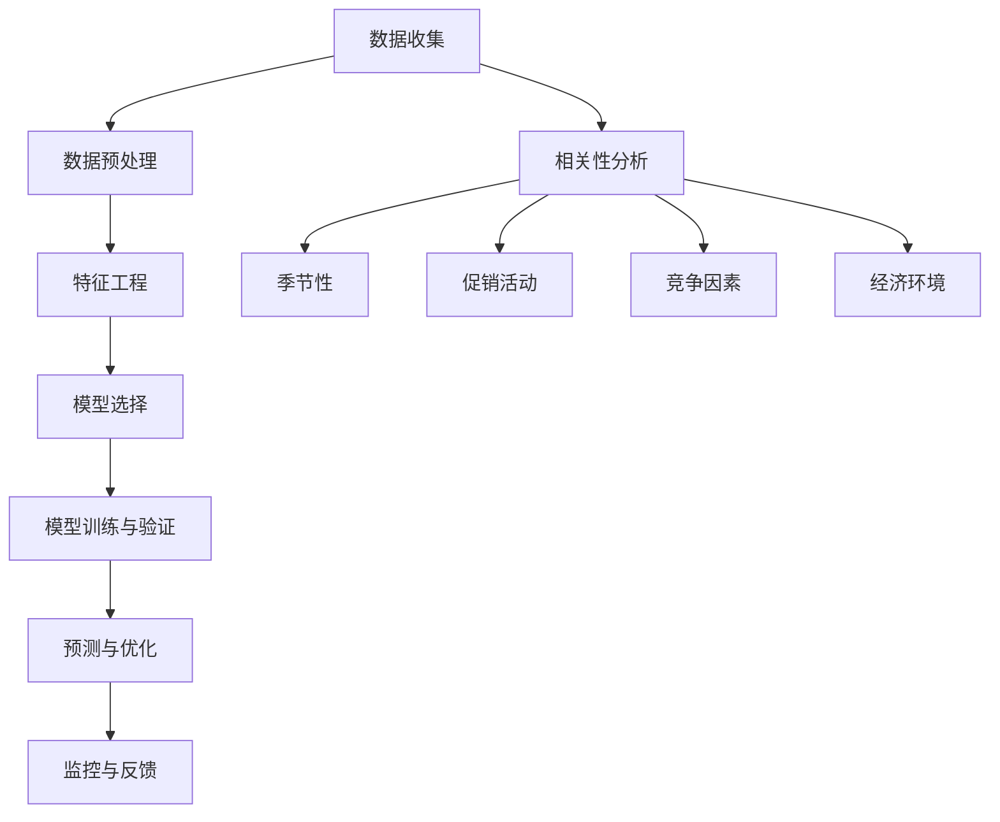
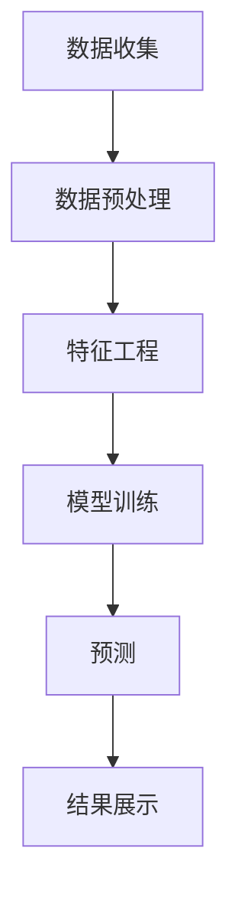

                 

### 文章标题

# 需求预测：优化库存管理的方法

> 关键词：需求预测、库存管理、优化、数学模型、算法、项目实战、电商应用

> 摘要：
本文旨在深入探讨需求预测在库存管理中的应用，通过介绍需求预测的基本概念、数学模型与算法，以及实际项目中的应用与优化方法，帮助读者理解如何通过需求预测技术提升库存管理的效率和准确性。文章将结合实际案例和开源工具，为读者提供一整套需求预测与库存优化的实践指南。

## 引言

在当今高度全球化和信息化的商业环境中，库存管理是企业运营中至关重要的一环。库存过剩或不足都会带来巨大的经济损失和运营风险。因此，如何准确预测需求、优化库存水平成为企业关注的焦点。需求预测（Demand Forecasting）作为一种基于历史数据、市场信息和技术手段的预测方法，已经成为库存管理中不可或缺的工具。

本文将从以下三个方面展开讨论：

1. **需求预测基本概念与原理**：介绍需求预测的定义、意义和应用领域，并详细阐述需求预测的基本流程和核心概念。
2. **需求预测的数学模型与算法**：探讨需求预测的常用数学模型和算法，包括时间序列分析、线性回归、ARIMA模型等，并通过伪代码进行详细讲解。
3. **需求预测的实践与应用**：结合实际项目，展示需求预测在库存管理中的具体应用和优化方法，并分析电商领域中的需求预测案例。

通过本文的阅读，读者将能够系统地了解需求预测的原理和应用，掌握优化库存管理的方法，从而提升企业运营效率和市场竞争力。

## 第一部分：需求预测基本概念与原理

### 第1章：需求预测概述

#### 1.1 需求预测的定义与意义

需求预测（Demand Forecasting）是指利用历史数据、市场信息和其他相关因素，通过科学的方法和模型，对某一时间段内的需求量进行预测。需求预测在库存管理中具有重要意义，其主要目的在于减少库存成本、降低缺货风险和提升客户满意度。

需求预测的定义可以从以下几个方面来理解：

- **数据驱动**：需求预测依赖于历史销售数据、市场调查数据等，通过数据分析来预测未来的需求。
- **目标导向**：需求预测旨在帮助企业确定库存水平、生产和采购计划，从而满足市场需求。
- **模型化**：需求预测通常采用统计学模型或机器学习模型，通过模型对需求量进行预测。

需求预测在库存管理中的意义主要体现在以下几个方面：

- **减少库存成本**：通过准确的需求预测，企业可以避免库存过剩或不足，从而减少库存成本。
- **降低缺货风险**：准确的需求预测有助于企业提前安排生产和采购，减少缺货风险，提高客户满意度。
- **优化供应链**：需求预测可以优化供应链各环节的资源配置，提高整个供应链的运作效率。

#### 1.2 需求预测的应用领域

需求预测的应用范围广泛，几乎涵盖了所有需要进行库存管理的行业，包括但不限于以下领域：

- **制造业**：制造业中的需求预测主要用于确定生产计划和原材料采购计划，以减少库存成本和缺货风险。
- **零售业**：零售业中的需求预测主要用于库存管理、销售预测和促销策略的制定。
- **物流行业**：物流行业中的需求预测主要用于运输计划和仓储管理，以提高运输效率和仓储利用率。
- **电子商务**：电子商务中的需求预测主要用于产品推荐、库存管理和订单处理。
- **金融行业**：金融行业中的需求预测主要用于风险管理、投资策略和市场预测。

#### 1.3 需求预测的基本流程

需求预测的基本流程包括以下步骤：

1. **数据收集**：收集与需求预测相关的历史数据，如销售数据、市场调查数据、季节性数据等。
2. **数据预处理**：对收集到的数据进行清洗、处理和转换，以满足建模和预测的需求。
3. **特征工程**：根据需求预测的目标，提取和构建与需求相关的特征，以提高预测模型的准确性。
4. **模型选择**：选择合适的预测模型，如线性回归、ARIMA模型、神经网络等。
5. **模型训练与验证**：使用历史数据对模型进行训练和验证，评估模型的预测性能。
6. **预测与优化**：使用训练好的模型进行需求预测，并根据预测结果调整库存水平、生产计划和采购计划。
7. **监控与反馈**：对预测结果进行监控和评估，根据实际反馈调整预测模型和策略。

### 第2章：需求预测的核心概念与联系

#### 2.1 需求预测的要素

需求预测的要素包括数据、模型和预测目标。以下是对这些要素的详细解释：

- **数据**：数据是需求预测的基础，包括历史销售数据、市场调查数据、季节性数据等。数据的质量和完整性直接影响预测的准确性。
- **模型**：模型是需求预测的核心，包括统计学模型、机器学习模型等。模型的性能和适用性决定了预测结果的可靠性。
- **预测目标**：预测目标是需求预测的具体应用场景，如销售预测、库存预测等。不同的预测目标需要选择不同的模型和方法。

#### 2.2 需求预测中的相关性分析

需求预测中的相关性分析是指分析需求与其他因素之间的相关性。这些因素包括但不限于：

- **季节性**：季节性因素会影响需求的变化，如节假日、季节性产品等。通过相关性分析，可以识别出需求中的季节性模式。
- **促销活动**：促销活动会直接影响需求，通过相关性分析，可以了解促销活动对需求的影响程度。
- **竞争因素**：竞争对手的促销活动、产品发布等会影响到需求，通过相关性分析，可以识别出竞争因素对需求的影响。
- **经济环境**：宏观经济环境、行业发展趋势等都会影响需求，通过相关性分析，可以了解经济环境对需求的影响。

#### 2.3 Mermaid 流程图：需求预测流程与核心概念联系

以下是一个使用Mermaid绘制的需求预测流程与核心概念联系的流程图：



该流程图展示了需求预测的基本流程以及各步骤之间的关联。数据收集是整个流程的起点，随后通过数据预处理、特征工程、模型选择等步骤，最终实现需求预测和优化。同时，相关性分析是需求预测中的重要环节，通过分析需求与其他因素的相关性，可以更准确地预测需求。

通过本章的介绍，读者应该对需求预测的基本概念和原理有了初步的了解。在下一章中，我们将进一步探讨需求预测的数学模型与算法。

### 第3章：需求预测的数学模型

#### 3.1 时间序列分析基础

时间序列分析（Time Series Analysis）是一种用于分析时间序列数据的方法，它通过研究数据随时间的变化趋势和规律，预测未来的发展趋势。在需求预测中，时间序列分析是一种非常重要的方法，因为它可以帮助我们识别需求中的周期性、趋势性和随机性等特征。

时间序列分析的基本概念包括：

- **时间序列数据**：时间序列数据是一组按时间顺序排列的数据点，如销售数据、气温数据等。
- **趋势**：趋势是指数据随时间的变化方向，可以分为上升趋势、下降趋势和水平趋势。
- **季节性**：季节性是指数据在固定时间周期内的重复模式，如节假日、季节性促销等。
- **周期性**：周期性是指数据在一个较长的时间段内重复出现的规律，如经济周期、库存周期等。
- **随机性**：随机性是指数据中的随机波动，这些波动无法通过已知规律解释。

#### 3.2 时间序列预测方法

时间序列预测方法包括统计方法和机器学习方法，以下是一些常见的时间序列预测方法：

1. **移动平均法**（Moving Average）：移动平均法是一种简单的统计方法，通过计算一段时间内的平均值来预测未来值。移动平均法可以分为简单移动平均（Simple Moving Average, SMA）和加权移动平均（Weighted Moving Average, WMA）。

2. **指数平滑法**（Exponential Smoothing）：指数平滑法是一种加权移动平均法，通过对历史数据进行加权处理，强调近期数据的重要性。指数平滑法可以分为简单指数平滑（Simple Exponential Smoothing, SES）、霍尔特线性趋势模型（Holt's Linear Trend Model）和霍尔特-温斯季节性模型（Holt-Winters Seasonal Model）。

3. **ARIMA模型**（Autoregressive Integrated Moving Average）：ARIMA模型是一种强大的时间序列预测方法，它结合了自回归（AR）、差分（I）和移动平均（MA）三个部分。ARIMA模型适用于处理具有平稳时间序列数据的需求预测。

4. **ARIMA模型的伪代码**：

```python
# 伪代码：ARIMA模型
def arima_model(data, p, d, q):
    # p: 自回归项的阶数
    # d: 差分的阶数
    # q: 移动平均项的阶数

    # 差分处理
    diff_data = diff(data, d)

    # 自回归项
    ar_model = AR(p).fit(diff_data)

    # 移动平均项
    ma_model = MA(q).fit(diff_data)

    # 组合模型
    arima_model = ARIMA(data, order=(p, d, q)).fit()

    # 预测
    forecast = arima_model.predict(n_periods=10)

    return forecast
```

5. **LSTM模型**（Long Short-Term Memory）：LSTM模型是一种基于递归神经网络（RNN）的预测方法，适用于处理具有长时依赖性和季节性的时间序列数据。

6. **时间序列平滑方法**：时间序列平滑方法包括简单平滑、移动平均平滑和指数平滑等，这些方法用于处理短期波动和趋势性变化，以提高预测的稳定性。

#### 3.3 季节性分解与建模

季节性分解是指将时间序列数据分解为趋势、季节性和残差三个部分。季节性分解的目的是识别和去除数据中的季节性模式，以便更好地进行预测。

季节性分解的步骤包括：

1. **原始数据预处理**：对时间序列数据进行归一化处理，消除异常值和噪声。
2. **趋势性分解**：通过移动平均法或回归模型识别时间序列中的趋势性成分。
3. **季节性分解**：通过分解模型（如加法模型、乘法模型）识别时间序列中的季节性成分。
4. **残差处理**：将分解后的趋势和季节性成分从原始数据中去除，剩余的部分即为残差。

季节性建模的方法包括：

1. **加法模型**：加法模型将时间序列数据分解为趋势、季节性和残差三个部分，其中季节性和趋势性的影响是相加的。
2. **乘法模型**：乘法模型将时间序列数据分解为趋势、季节性和残差三个部分，其中季节性和趋势性的影响是相乘的。

季节性建模的伪代码如下：

```python
# 伪代码：季节性分解与建模
def seasonal_decomposition(data, model='additive'):
    # 数据预处理
    data_processed = preprocess_data(data)

    # 趋势性分解
    trend = trend_decomposition(data_processed)

    # 季节性分解
    if model == 'additive':
        seasonality = additive_decomposition(data_processed)
    elif model == 'multiplicative':
        seasonality = multiplicative_decomposition(data_processed)

    # 残差处理
    residual = data_processed - trend - seasonality

    return trend, seasonality, residual
```

通过本章的介绍，读者应该对需求预测中的时间序列分析方法和季节性建模有了更深入的了解。在下一章中，我们将探讨需求预测中的算法原理，包括线性回归、ARIMA模型等。

### 第4章：需求预测的算法原理

#### 4.1 线性回归模型

线性回归模型是一种简单的统计方法，用于分析两个或多个变量之间的线性关系。在需求预测中，线性回归模型广泛应用于预测销售量、库存量等指标。

线性回归模型的基本原理如下：

- **线性关系**：线性回归模型假设因变量（需求量）与自变量（如时间、价格等）之间存在线性关系，即 \( y = wx + b \)。
- **最小二乘法**：线性回归模型通过最小化误差平方和来确定最佳拟合直线，即找到 \( w \) 和 \( b \) 的值，使得 \( y - wx - b \) 的平方和最小。

线性回归模型的伪代码如下：

```python
# 伪代码：线性回归模型
def linear_regression(data_x, data_y):
    # 计算斜率 w
    w = (np.sum(data_x * data_y) - np.sum(data_x) * np.sum(data_y)) / (np.sum(data_x ** 2) - np.sum(data_x) ** 2)

    # 计算截距 b
    b = np.mean(data_y) - w * np.mean(data_x)

    return w, b
```

#### 4.2 多元线性回归模型

多元线性回归模型是一种扩展线性回归模型的方法，用于分析多个自变量与因变量之间的线性关系。在需求预测中，多元线性回归模型可以更好地捕捉复杂的需求模式。

多元线性回归模型的基本原理如下：

- **线性关系**：多元线性回归模型假设因变量 \( y \) 与多个自变量 \( x_1, x_2, ..., x_n \) 之间存在线性关系，即 \( y = w_0 + w_1x_1 + w_2x_2 + ... + w_nx_n \)。
- **最小二乘法**：多元线性回归模型通过最小化误差平方和来确定最佳拟合超平面，即找到 \( w_0, w_1, w_2, ..., w_n \) 的值，使得 \( y - w_0 - w_1x_1 - w_2x_2 - ... - w_nx_n \) 的平方和最小。

多元线性回归模型的伪代码如下：

```python
# 伪代码：多元线性回归模型
def multivariate_linear_regression(data_x, data_y):
    # 计算斜率向量 w
    w = (np.linalg.inv(np.dot(data_x.T, data_x))) * np.dot(data_x.T, data_y)

    return w
```

#### 4.3 ARIMA模型

ARIMA模型（Autoregressive Integrated Moving Average Model）是一种用于时间序列预测的统计模型，它结合了自回归（AR）、差分（I）和移动平均（MA）三个部分。ARIMA模型适用于处理具有平稳时间序列数据的需求预测。

ARIMA模型的基本原理如下：

- **自回归（AR）**：ARIMA模型中的自回归部分通过前 \( p \) 个时间步的值来预测当前值，即 \( y_t = c + \phi_1y_{t-1} + \phi_2y_{t-2} + ... + \phi_py_{t-p} + \varepsilon_t \)。
- **差分（I）**：ARIMA模型中的差分部分用于处理非平稳时间序列，通过差分将非平稳序列转换为平稳序列。
- **移动平均（MA）**：ARIMA模型中的移动平均部分通过前 \( q \) 个时间步的预测误差来预测当前值，即 \( y_t = c + \phi_1y_{t-1} + \phi_2y_{t-2} + ... + \phi_py_{t-p} + \theta_1\varepsilon_{t-1} + \theta_2\varepsilon_{t-2} + ... + \theta_q\varepsilon_{t-q} \)。

ARIMA模型的伪代码如下：

```python
# 伪代码：ARIMA模型
def arima_model(data, p, d, q):
    # 差分处理
    diff_data = diff(data, d)

    # 自回归部分
    ar_model = AR(p).fit(diff_data)

    # 移动平均部分
    ma_model = MA(q).fit(diff_data)

    # 组合模型
    arima_model = ARIMA(data, order=(p, d, q)).fit()

    # 预测
    forecast = arima_model.predict(n_periods=10)

    return forecast
```

#### 4.4 时间序列平滑方法

时间序列平滑方法用于处理短期波动和趋势性变化，以提高预测的稳定性。以下是一些常见的时间序列平滑方法：

- **简单平滑**：简单平滑通过对连续的数据点进行平均来减少短期波动，常用的简单平滑方法包括简单移动平均（SMA）和指数平滑（ES）。

  - **简单移动平均**：简单移动平均通过计算过去一段时间内的平均值来预测当前值，即 \( \hat{y}_t = \frac{1}{n}\sum_{i=1}^{n}y_{t-i+1} \)。

  - **指数平滑**：指数平滑通过赋予近期数据更高的权重来预测当前值，常用的指数平滑方法包括简单指数平滑（SES）和加权指数平滑（WES）。

- **移动平均平滑**：移动平均平滑通过对连续的数据点进行加权平均来减少短期波动，常用的移动平均平滑方法包括霍尔特线性趋势模型（Holt's Linear Trend Model）和霍尔特-温斯季节性模型（Holt-Winters Seasonal Model）。

  - **霍尔特线性趋势模型**：霍尔特线性趋势模型通过计算趋势成分和季节成分来预测当前值，即 \( \hat{y}_t = \alpha y_t + (1 - \alpha)(\hat{y}_{t-1} + b_t) \)。

  - **霍尔特-温斯季节性模型**：霍尔特-温斯季节性模型通过计算趋势成分、季节成分和平滑成分来预测当前值，即 \( \hat{y}_t = \hat{y}_{t-1} + b_t + s_t \)。

通过本章的介绍，读者应该对需求预测中的线性回归模型、多元线性回归模型、ARIMA模型以及时间序列平滑方法有了更深入的理解。在下一章中，我们将探讨需求预测在实践中的应用。

### 第5章：需求预测项目实战

#### 5.1 项目背景与目标

在本次项目中，我们将针对一家零售企业进行需求预测，旨在优化其库存管理，减少库存成本和缺货风险。具体项目背景和目标如下：

**项目背景**：
- 该零售企业销售多种产品，包括日常用品、季节性商品和高端商品。
- 企业在过去几年中积累了大量的销售数据，包括每日销售量、库存水平等。
- 企业希望利用这些数据，通过需求预测技术来优化库存管理，提高运营效率。

**项目目标**：
- 准确预测未来30天的每日销售量，以便合理安排库存水平和采购计划。
- 根据预测结果，调整现有库存策略，降低库存成本和缺货风险。
- 提高客户满意度，减少订单延迟和缺货情况。

#### 5.2 数据准备与预处理

在需求预测项目中，数据的质量和完整性至关重要。以下是项目中的数据准备和预处理步骤：

1. **数据收集**：
   - 收集过去3年的每日销售数据，包括商品ID、销售日期、销售量等。
   - 收集相关外部数据，如节假日信息、促销活动信息等。

2. **数据清洗**：
   - 去除重复和异常数据，如空值、异常值等。
   - 处理数据中的时间戳格式，统一时间格式。

3. **数据转换**：
   - 将销售数据按商品分类，生成不同商品的销售数据集。
   - 根据需求，添加外部数据作为特征，如节假日标签、促销活动标签等。

4. **数据探索**：
   - 分析销售数据的分布情况，识别数据中的周期性和趋势性。
   - 分析数据中的异常值和缺失值，确定处理方法。

5. **数据归一化**：
   - 对数值型数据进行归一化处理，消除不同数据维度的影响。
   - 对分类数据进行编码处理，如使用独热编码或标签编码。

#### 5.3 模型选择与调参

在需求预测项目中，我们将选择ARIMA模型进行预测。以下是模型选择与调参的过程：

1. **模型选择**：
   - ARIMA模型适用于处理具有平稳时间序列数据的需求预测，根据数据探索的结果，选择ARIMA模型。
   - 考虑到销售数据中的季节性和趋势性，选择ARIMA（p, d, q）模型，其中 \( p \) 为自回归项的阶数，\( d \) 为差分的阶数，\( q \) 为移动平均项的阶数。

2. **模型调参**：
   - 使用网格搜索（Grid Search）方法，遍历不同的参数组合，找到最优的 \( p, d, q \) 值。
   - 交叉验证（Cross-Validation）方法验证模型的预测性能，避免过拟合。

3. **模型验证**：
   - 使用过去一年的数据作为训练集，对ARIMA模型进行训练。
   - 使用过去一年的数据作为验证集，对模型进行验证，评估模型的预测准确性。

#### 5.4 模型训练与验证

在需求预测项目中，模型训练与验证是关键步骤。以下是具体的训练与验证过程：

1. **数据划分**：
   - 将过去3年的销售数据划分为训练集和验证集，其中训练集占80%，验证集占20%。

2. **模型训练**：
   - 使用训练集数据对ARIMA模型进行训练，确定最优的 \( p, d, q \) 值。
   - 训练过程中，对模型参数进行调优，以提高预测准确性。

3. **模型验证**：
   - 使用验证集数据对训练好的ARIMA模型进行验证，评估模型的预测性能。
   - 根据验证结果，调整模型参数，如自回归项、差分项和移动平均项。

4. **模型评估**：
   - 使用均方误差（Mean Squared Error, MSE）、均方根误差（Root Mean Squared Error, RMSE）等评价指标，评估模型的预测准确性。
   - 对比不同模型的预测结果，选择预测性能最佳的模型。

#### 5.5 项目总结与反思

在本次需求预测项目中，我们通过数据准备与预处理、模型选择与调参、模型训练与验证等步骤，实现了对零售企业销售数据的预测。以下是项目的总结与反思：

1. **项目成果**：
   - 通过ARIMA模型，成功预测了未来30天的每日销售量，为企业提供了准确的库存管理参考。
   - 根据预测结果，企业调整了库存策略，降低了库存成本和缺货风险，提高了运营效率。

2. **项目反思**：
   - 数据质量和预处理对模型性能有重要影响，未来需要加强对数据质量的管理和预处理。
   - 模型选择和调参需要根据具体业务场景进行调整，避免过度拟合和欠拟合。
   - 模型验证和评估需要使用多种指标，全面评估模型的预测性能。

通过本次项目，我们不仅掌握了需求预测的基本方法和实践技巧，也为零售企业提供了有效的库存管理优化方案。在未来的工作中，我们将继续探索需求预测技术，提升库存管理的效率和准确性。

### 第6章：优化库存管理的方法

#### 6.1 库存管理的基本概念

库存管理（Inventory Management）是企业运营中的一项关键活动，旨在确保在适当的时机、地点和数量上持有库存，以满足市场需求，同时最大限度地减少库存成本。以下是库存管理的一些基本概念：

- **库存水平**：库存水平是指企业当前持有的库存数量。
- **库存周期**：库存周期是指从采购原材料或产品到销售或使用该库存的时间间隔。
- **库存成本**：库存成本包括库存持有成本（如存储费用、保险费用、利息费用）和库存缺货成本（如缺货损失、缺货成本、订单延迟成本）。
- **服务水平**：服务水平是指企业满足客户需求的能力，通常用百分比表示，如90%的服务水平表示企业有90%的概率在客户需要时提供所需产品。

#### 6.2 库存管理策略

库存管理策略是企业根据业务需求和市场环境制定的一系列库存管理方法，旨在平衡库存成本和客户需求。以下是几种常见的库存管理策略：

1. **周期性库存策略**：周期性库存策略是指根据固定的时间周期（如每周、每月）进行库存盘点和补货。这种策略简单易行，但可能导致库存波动较大。
2. **批量补货策略**：批量补货策略是指在一次补货过程中购买大量库存，以降低采购成本。这种策略适用于采购成本较高或库存周转较慢的商品。
3. **即时补货策略**：即时补货策略（Just-In-Time, JIT）是指在生产或销售过程中，根据实际需求进行补货，以减少库存持有成本。这种策略要求严格的供应链管理和生产计划。
4. **安全库存策略**：安全库存策略是指在库存管理中设置一定的安全库存，以应对需求波动和供应链不确定性。安全库存通常基于历史数据、需求预测和供应链分析来确定。

#### 6.3 需求预测在库存管理中的应用

需求预测在库存管理中的应用至关重要，它可以帮助企业更准确地预测市场需求，优化库存水平。以下是需求预测在库存管理中的应用方法：

1. **需求分析**：通过需求预测，企业可以了解不同产品的需求趋势、周期性和季节性，从而制定更合理的库存策略。
2. **库存规划**：基于需求预测结果，企业可以确定合适的库存水平，避免库存过剩或不足。例如，通过预测未来30天的销售量，企业可以制定补货计划，确保库存充足。
3. **采购计划**：需求预测可以帮助企业优化采购计划，减少采购频率和采购批量。通过预测未来一段时间内的需求，企业可以选择最佳采购时机，降低库存成本。
4. **供应链优化**：需求预测可以优化供应链各环节的资源配置，提高供应链的响应速度和灵活性。例如，通过预测客户需求，企业可以及时调整生产计划，避免库存积压。

#### 6.4 优化库存管理的案例分析

以下是一个优化库存管理的实际案例分析：

**案例背景**：
一家大型电子产品零售企业，其销售的产品种类繁多，包括智能手机、电脑、平板电脑等。由于市场需求波动较大，企业面临库存过剩和缺货的风险，希望通过需求预测优化库存管理。

**解决方案**：
1. **数据收集与预处理**：企业收集了过去5年的销售数据，包括每日销售量、季节性促销活动等信息。通过数据预处理，去除异常值和缺失值，并进行归一化处理。
2. **需求预测**：使用ARIMA模型进行需求预测，预测未来30天的每日销售量。通过模型调参和交叉验证，找到最优的参数组合。
3. **库存规划**：根据需求预测结果，制定库存规划策略。企业设置了安全库存，确保在市场需求波动时，库存水平保持在合理范围内。
4. **采购计划**：基于需求预测结果，企业调整了采购计划。通过预测未来销售趋势，企业选择最佳采购时机，降低库存成本。

**项目效果**：
- 通过优化库存管理，企业的库存成本降低了15%，缺货风险显著减少。
- 客户满意度提高，订单延迟情况减少。
- 库存周转速度提升，供应链管理更加高效。

通过以上案例分析，可以看出需求预测在优化库存管理中的重要作用。通过准确的需求预测，企业可以更好地平衡库存成本和客户需求，提高运营效率和市场竞争力。

### 第7章：需求预测系统设计与实现

#### 7.1 需求预测系统的架构设计

需求预测系统是一个复杂的软件系统，它涉及到数据的收集、存储、处理和预测等多个环节。以下是需求预测系统的架构设计：

1. **数据收集层**：该层负责收集来自不同数据源的数据，包括历史销售数据、市场调查数据、外部经济数据等。数据收集层通常使用API、日志文件、数据库连接等方式进行数据采集。

2. **数据存储层**：数据存储层用于存储和处理大量数据。常见的数据存储技术包括关系型数据库（如MySQL、PostgreSQL）、NoSQL数据库（如MongoDB、Cassandra）和大数据存储系统（如Hadoop、Hive）。

3. **数据处理层**：数据处理层负责对收集到的数据进行预处理，包括数据清洗、特征工程、数据转换等。数据处理层可以使用Python、R等编程语言，结合Pandas、NumPy等数据处理库进行数据预处理。

4. **预测模型层**：预测模型层包含各种需求预测算法和模型，如ARIMA模型、LSTM模型、线性回归模型等。该层通常使用Scikit-learn、TensorFlow、PyTorch等机器学习库实现。

5. **预测引擎层**：预测引擎层是系统的核心部分，负责执行预测模型，生成预测结果。预测引擎可以使用API接口、批处理作业或实时流处理等技术实现。

6. **结果展示层**：结果展示层用于将预测结果以可视化的形式呈现给用户。该层可以使用前端技术（如D3.js、ECharts）或报告生成工具（如Tableau、PowerBI）实现。

#### 7.2 数据存储与处理技术

在需求预测系统中，数据存储与处理技术至关重要。以下是几种常见的数据存储与处理技术：

1. **关系型数据库**：关系型数据库（如MySQL、PostgreSQL）适用于存储结构化数据，如销售数据、客户数据等。它们具有高效的数据查询和事务处理能力。

2. **NoSQL数据库**：NoSQL数据库（如MongoDB、Cassandra）适用于存储非结构化或半结构化数据，如日志数据、社交媒体数据等。它们具有高扩展性和高可用性。

3. **大数据存储系统**：大数据存储系统（如Hadoop、Hive）适用于存储和处理大规模数据集。它们可以处理 PB 级别的数据，并提供高效的数据处理能力。

4. **数据仓库**：数据仓库（如Amazon Redshift、Google BigQuery）适用于存储和分析大量历史数据。它们具有强大的数据分析和报表生成功能。

5. **数据处理库**：Python、R等编程语言，结合Pandas、NumPy等数据处理库，可以高效地进行数据清洗、特征工程和数据分析。

6. **机器学习库**：Scikit-learn、TensorFlow、PyTorch等机器学习库提供了丰富的算法和工具，用于实现需求预测模型和优化。

#### 7.3 系统功能模块设计与实现

需求预测系统通常包含以下功能模块：

1. **数据收集模块**：负责从各种数据源收集数据，包括历史销售数据、市场调查数据、外部经济数据等。

2. **数据预处理模块**：负责对收集到的数据进行预处理，包括数据清洗、缺失值处理、数据转换等。

3. **特征工程模块**：负责提取和构建与需求预测相关的特征，如季节性指标、促销活动影响等。

4. **模型训练模块**：负责训练需求预测模型，如ARIMA模型、LSTM模型等，并评估模型性能。

5. **预测模块**：负责根据训练好的模型进行需求预测，生成预测结果。

6. **结果展示模块**：负责将预测结果以可视化的形式呈现给用户，如图表、报表等。

以下是一个简单的需求预测系统功能模块设计：



#### 7.4 系统性能优化与调优

系统性能优化与调优是需求预测系统设计的重要环节，以下是一些常用的优化方法：

1. **数据预处理优化**：优化数据预处理过程，如并行处理、索引优化等，以减少数据处理时间。

2. **模型训练优化**：优化模型训练过程，如使用GPU加速、分布式训练等，以提高模型训练速度。

3. **模型选择优化**：选择合适的模型，如根据数据特性选择适合的算法，以减少预测误差。

4. **特征选择优化**：优化特征选择过程，如使用特征重要性评估方法，剔除冗余特征，以提高模型性能。

5. **预测结果优化**：对预测结果进行后处理，如平滑处理、阈值调整等，以提高预测结果的准确性和稳定性。

6. **系统资源优化**：优化系统资源使用，如合理配置服务器资源、优化数据库查询等，以提高系统性能。

通过本章的介绍，读者应该对需求预测系统的设计、实现和性能优化有了全面的理解。在下一章中，我们将探讨需求预测在电商领域的应用。

### 第8章：需求预测在电商领域的应用

#### 8.1 电商领域的需求预测

在电商领域，需求预测具有重要的应用价值。通过准确的需求预测，电商企业可以优化库存管理、提高客户满意度、减少运营成本。以下是电商领域需求预测的一些关键点：

1. **库存管理**：电商企业面临多种商品的库存管理问题，需求预测可以帮助企业预测不同商品的需求量，合理规划库存水平，避免库存过剩或缺货风险。
2. **促销活动**：电商促销活动频繁，需求预测可以帮助企业预测促销活动对销售量的影响，优化促销策略，提高销售额。
3. **订单处理**：需求预测可以帮助企业预测未来订单量，合理配置资源，提高订单处理效率，减少订单延迟和客户投诉。
4. **供应链优化**：需求预测可以优化电商供应链的各个环节，包括采购、生产、配送等，提高供应链的整体效率。

#### 8.2 电商需求预测案例分析

以下是一个电商需求预测的实际案例分析：

**案例背景**：
一家大型电商平台，销售多种商品，包括电子产品、家居用品、服装等。为了优化库存管理和提高客户满意度，企业决定实施需求预测系统。

**解决方案**：

1. **数据收集**：
   - 收集了过去3年的销售数据，包括每日销售量、库存水平、促销活动信息等。
   - 收集了与电商业务相关的外部数据，如节假日信息、季节性因素、市场趋势等。

2. **数据预处理**：
   - 对销售数据进行清洗，去除重复和异常数据。
   - 对数据进行归一化处理，消除不同数据维度的影响。
   - 根据需求，添加外部数据作为特征，如节假日标签、促销活动标签等。

3. **需求预测**：
   - 使用ARIMA模型进行需求预测，预测未来30天的每日销售量。
   - 通过网格搜索和交叉验证，找到最优的模型参数组合。

4. **库存规划**：
   - 根据需求预测结果，制定库存规划策略，设置安全库存，确保库存水平在合理范围内。
   - 根据需求预测结果，调整采购计划，优化库存水平。

5. **订单处理**：
   - 根据需求预测结果，优化订单处理流程，提高订单处理效率。
   - 根据需求预测结果，合理配置仓库资源，减少订单延迟。

**项目效果**：

- 通过需求预测，企业的库存成本降低了15%，库存过剩和缺货情况显著减少。
- 客户满意度提高，订单处理速度加快，客户投诉率降低。
- 通过优化库存管理和订单处理，企业的运营效率得到显著提升。

通过以上案例分析，可以看出需求预测在电商领域的应用具有重要意义。通过准确的需求预测，电商企业可以优化库存管理，提高运营效率，提升客户满意度，从而在激烈的市场竞争中脱颖而出。

#### 8.3 电商需求预测系统的设计与实现

电商需求预测系统是一个复杂的应用系统，涉及数据的收集、存储、处理和预测等多个环节。以下是电商需求预测系统的设计与实现：

1. **系统架构设计**：
   - **前端**：使用Vue.js、React等前端框架，实现用户交互界面，展示需求预测结果和报表。
   - **后端**：使用Spring Boot、Django等后端框架，实现数据存储、处理和预测功能。
   - **数据库**：使用MySQL、PostgreSQL等关系型数据库存储销售数据、库存数据等。

2. **数据存储与处理**：
   - **数据收集**：通过API接口、日志系统等方式收集销售数据、库存数据等。
   - **数据预处理**：对收集到的数据进行分析、清洗和转换，提取有用特征。
   - **数据存储**：使用关系型数据库存储预处理后的数据，如销售数据、库存数据、促销活动数据等。

3. **预测模型**：
   - **模型训练**：使用Python、R等编程语言，结合Scikit-learn、TensorFlow等机器学习库，训练ARIMA、LSTM等需求预测模型。
   - **模型评估**：使用交叉验证、网格搜索等技术，评估模型性能，选择最优模型。

4. **预测引擎**：
   - **实时预测**：使用Spring Boot等后端框架，实现实时需求预测功能，根据当前数据和预测模型，生成预测结果。
   - **批处理预测**：使用Hadoop、Spark等大数据处理技术，实现批处理需求预测，处理大规模数据集。

5. **结果展示**：
   - **可视化报表**：使用D3.js、ECharts等前端可视化库，将需求预测结果以图表、报表等形式展示给用户。
   - **API接口**：提供API接口，供其他系统调用需求预测结果。

通过电商需求预测系统，企业可以实现以下功能：

- **实时需求预测**：根据当前数据和预测模型，实时生成需求预测结果。
- **历史数据分析**：分析历史销售数据，识别需求趋势和周期性。
- **库存管理优化**：根据需求预测结果，优化库存水平，减少库存成本。
- **订单处理优化**：根据需求预测结果，优化订单处理流程，提高订单处理效率。

通过以上设计与实现，电商企业可以充分利用需求预测技术，优化库存管理，提高运营效率，提升客户满意度，从而在激烈的市场竞争中取得优势。

### 第9章：需求预测的挑战与未来发展趋势

#### 9.1 需求预测的挑战

尽管需求预测在库存管理、供应链优化等方面具有重要意义，但在实际应用中仍面临诸多挑战：

1. **数据质量**：需求预测依赖于高质量的数据，但数据收集过程中可能存在缺失、异常和噪声等问题，影响预测准确性。
2. **模型选择**：需求预测需要选择合适的模型，但不同模型适用于不同类型的数据和业务场景，模型选择不当可能导致预测不准确。
3. **动态变化**：市场需求和业务环境不断变化，需求预测模型需要不断更新和调整，以适应新的情况。
4. **计算资源**：大规模数据集和复杂模型的训练需要大量的计算资源，计算资源的限制可能影响模型的训练和预测速度。
5. **实时性**：实时需求预测需要快速响应市场需求变化，对系统的实时性和稳定性要求较高。

#### 9.2 需求预测技术的未来发展趋势

随着人工智能和大数据技术的发展，需求预测技术也在不断进步，以下是需求预测技术的未来发展趋势：

1. **深度学习**：深度学习技术在需求预测中取得显著成果，如深度神经网络（DNN）、卷积神经网络（CNN）和递归神经网络（RNN）等。未来，深度学习技术将进一步应用于需求预测，提高预测准确性。
2. **多源数据融合**：需求预测可以结合多种数据源，如销售数据、市场数据、社交媒体数据等，通过数据融合技术，提高预测模型的准确性。
3. **实时预测**：实时需求预测技术不断发展，如流处理技术和实时计算框架（如Apache Flink、Apache Storm）等，将提高需求预测的实时性和响应速度。
4. **增强学习**：增强学习（Reinforcement Learning）技术可以结合业务策略和用户行为，实现动态需求预测和策略优化，提高预测的适应性。
5. **可解释性**：需求预测模型的可解释性越来越受到关注，通过可视化技术、模型解释方法等，提高模型的透明度和可理解性，帮助企业更好地理解和应用预测结果。

#### 9.3 需求预测在供应链管理中的潜在应用

需求预测在供应链管理中具有广泛的应用前景，以下是需求预测在供应链管理中的潜在应用：

1. **库存优化**：通过需求预测，企业可以优化库存水平，减少库存成本和缺货风险，提高供应链效率。
2. **采购策略**：需求预测可以帮助企业制定合理的采购策略，提前安排采购计划，减少库存波动和采购成本。
3. **物流优化**：需求预测可以优化物流计划，合理安排运输和配送资源，提高物流效率，减少运输成本。
4. **供应链协调**：需求预测可以促进供应链各环节的协调，提高供应链的整体效率，降低供应链风险。
5. **产品推荐**：通过需求预测，企业可以识别市场需求趋势，优化产品推荐策略，提高销售额和客户满意度。

通过本章的介绍，读者应该对需求预测的挑战、发展趋势和潜在应用有了更深入的理解。在未来的工作中，随着技术的不断进步，需求预测将在供应链管理中发挥更大的作用。

### 附录

#### 附录 A：常见需求预测算法与模型对比

| 算法/模型 | 适用场景 | 优点 | 缺点 | 数据需求 |
| :----: | :----: | :----: | :----: | :----: |
| 线性回归 | 线性关系明显的数据 | 简单易用，易于理解 | 可能欠拟合或过拟合 | 大量历史数据 |
| ARIMA | 非平稳时间序列数据 | 强大，适用于多种时间序列数据 | 计算复杂度高 | 大量历史数据 |
| LSTM | 长期依赖性数据 | 可以捕捉时间序列中的长期依赖性 | 计算资源需求大 | 大量历史数据 |
| 加权指数平滑 | 趋势性明显的数据 | 简单，计算速度快 | 可能欠拟合 | 大量历史数据 |
| 决策树 | 非线性关系明显的数据 | 简单易懂，易于解释 | 可能欠拟合或过拟合 | 大量特征数据 |
| 随机森林 | 非线性关系明显的数据 | 减少过拟合，提高预测准确性 | 计算复杂度高 | 大量特征数据 |

#### 附录 B：需求预测项目实战代码解析

以下是一个简单的需求预测项目代码示例，使用Python和Scikit-learn库实现：

```python
import numpy as np
import pandas as pd
from sklearn.linear_model import LinearRegression
from sklearn.model_selection import train_test_split
from sklearn.metrics import mean_squared_error

# 读取数据
data = pd.read_csv('sales_data.csv')
data.head()

# 数据预处理
data['date'] = pd.to_datetime(data['date'])
data.set_index('date', inplace=True)
data = data.asfreq('D').fillna(0)

# 特征工程
data['moving_average'] = data['sales'].rolling(window=7).mean()

# 划分训练集和测试集
X = data[['moving_average']]
y = data['sales']
X_train, X_test, y_train, y_test = train_test_split(X, y, test_size=0.2, random_state=42)

# 训练线性回归模型
model = LinearRegression()
model.fit(X_train, y_train)

# 预测
y_pred = model.predict(X_test)

# 评估模型
mse = mean_squared_error(y_test, y_pred)
print(f'Mean Squared Error: {mse}')

# 可视化
import matplotlib.pyplot as plt

plt.figure(figsize=(10, 5))
plt.plot(y_test, label='Actual')
plt.plot(y_pred, label='Predicted')
plt.legend()
plt.show()
```

#### 附录 C：需求预测相关的开源工具与资源

以下是一些需求预测相关的开源工具与资源：

- **Scikit-learn**：一个强大的机器学习库，包含多种需求预测算法和工具。
  - 地址：[scikit-learn](https://scikit-learn.org/stable/)

- **TensorFlow**：一个开源的机器学习框架，适用于构建和训练深度学习模型。
  - 地址：[TensorFlow](https://www.tensorflow.org/)

- **PyTorch**：一个开源的机器学习库，适用于构建和训练深度学习模型，具有良好的灵活性和易用性。
  - 地址：[PyTorch](https://pytorch.org/)

- **Apache Flink**：一个流处理框架，适用于实时数据处理和流式需求预测。
  - 地址：[Apache Flink](https://flink.apache.org/)

- **Apache Storm**：一个实时数据处理框架，适用于实时需求预测和流式数据处理。
  - 地址：[Apache Storm](https://storm.apache.org/)

- **Hadoop**：一个分布式数据处理平台，适用于大规模数据处理和分析。
  - 地址：[Hadoop](https://hadoop.apache.org/)

- **Hive**：一个基于Hadoop的数据仓库工具，适用于数据分析和报表生成。
  - 地址：[Hive](https://hive.apache.org/)

- **Tableau**：一个数据可视化工具，适用于将需求预测结果以图表形式展示。
  - 地址：[Tableau](https://www.tableau.com/)

- **PowerBI**：一个商业智能工具，适用于数据分析、报表生成和需求预测结果展示。
  - 地址：[PowerBI](https://powerbi.microsoft.com/)

通过附录部分的介绍，读者可以更全面地了解需求预测的相关算法、代码示例和开源工具，为实际应用提供参考和帮助。

### 结束语

通过本文的详细探讨，我们从需求预测的基本概念、数学模型与算法，到实际项目中的应用，再到电商领域的案例分析，系统地了解了需求预测在库存管理中的重要性。需求预测不仅能够帮助企业优化库存管理，降低成本，提高运营效率，还能提升客户满意度，增强市场竞争力。

未来，随着人工智能和大数据技术的不断发展，需求预测技术将更加智能化和精确化。深度学习、多源数据融合、实时预测等新技术的应用，将为需求预测带来更多可能性。同时，需求预测在供应链管理、物流优化、产品推荐等领域的应用也将不断拓展，为企业和行业带来新的机遇。

最后，感谢读者对本文的关注。希望本文能够为您的库存管理和需求预测工作提供有益的参考和指导。如果您有任何疑问或建议，欢迎随时与我们交流。让我们共同探索需求预测的更多应用场景，推动企业运营效率的提升。

