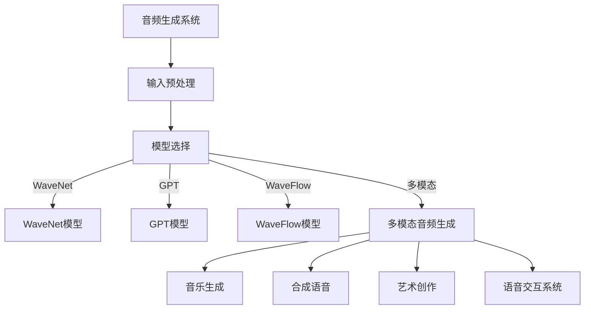

                 

### 文章标题: 音频生成(Audio Generation) - 原理与代码实例讲解

> 关键词：音频生成、WaveNet、GPT、信息论、概率论、深度学习、模型训练

> 摘要：本文将深入探讨音频生成的原理及其在实践中的应用。从基础理论出发，逐步介绍音频生成的发展历程、应用场景和核心技术。通过详细讲解音频生成算法、数学模型与公式、以及实例代码，帮助读者全面理解音频生成的原理和实现过程。

### 目录

1. **第一部分：音频生成基础理论**
    1.1 音频生成概述
    1.2 音频生成核心技术
    1.3 音频生成算法详解
    1.4 数学模型与公式解析

2. **第二部分：音频生成实践**
    2.1 音频生成项目实战
    2.2 代码实例讲解

3. **第三部分：音频生成应用拓展**
    3.1 音乐生成
    3.2 合成语音
    3.3 艺术创作
    3.4 语音交互系统

4. **附录**
    4.1 音频生成开源工具与库
    4.2 代码实例补充说明
    4.3 进一步阅读资源

### Mermaid 流程图



### WaveNet模型伪代码

```python
# WaveNet模型伪代码

# 初始化神经网络结构
neural_network = initialize_wavenet()

# 加载数据集
dataset = load_data("audio_dataset")

# 数据预处理
processed_data = preprocess_data(dataset)

# 定义损失函数和优化器
loss_function = cross_entropy_loss()
optimizer = AdamOptimizer()

# 训练模型
for epoch in range(num_epochs):
    for batch in processed_data:
        # 前向传播
        logits = neural_network(batch.input_sequence)
        
        # 计算损失
        loss = loss_function(logits, batch.target_sequence)
        
        # 反向传播
        gradients = compute_gradients(loss)
        
        # 更新模型参数
        optimizer.update_params(neural_network.parameters(), gradients)
```

### 概率论基础公式解析

$$
P(A) = \frac{N(A)}{N(S)}
$$

$$
P(A \cap B) = P(A) \times P(B|A)
$$

$$
P(A \cup B) = P(A) + P(B) - P(A \cap B)
$$

### 信息论基础公式解析

$$
H(X) = -\sum_{i} p(x_i) \log_2 p(x_i)
$$

$$
H(X|Y) = -\sum_{i} p(y_i) \sum_{j} p(x_j|y_i) \log_2 p(x_j|y_i)
$$

### 音频生成应用拓展代码实例

#### 音乐生成代码实例

```python
# 音乐生成代码实例

import numpy as np
import tensorflow as tf
from wavenet import WaveNetModel

# 初始化模型
model = WaveNetModel()

# 加载预训练模型
model.load_weights("pretrained_model_weights")

# 生成音乐
for note in ["C4", "D4", "E4", "F4", "G4", "A4", "B4"]:
    audio_samples = model.generate_music(note)
    save_audio_samples(audio_samples, f"{note}_generated_music.wav")
```

#### 合成语音代码实例

```python
# 合成语音代码实例

import numpy as np
import librosa
from wavenet import WaveNetModel

# 初始化模型
model = WaveNetModel()

# 加载预训练模型
model.load_weights("pretrained_model_weights")

# 合成语音
text = "Hello, this is a synthesized voice."
text_samples = model.synthesize_text(text)
save_audio_samples(text_samples, " synthesized_voice.wav")
```

#### 艺术创作代码实例

```python
# 艺术创作代码实例

import numpy as np
import tensorflow as tf
from wavenet import WaveNetModel
import matplotlib.pyplot as plt

# 初始化模型
model = WaveNetModel()

# 加载预训练模型
model.load_weights("pretrained_model_weights")

# 生成艺术音频
art_samples = model.generate_art_audio()
save_audio_samples(art_samples, "art_generated_audio.wav")

# 播放生成的艺术音频
audio, sample_rate = librosa.load("art_generated_audio.wav")
librosa.display.waveplot(audio, sr=sample_rate)
plt.show()
```

### 作者信息

**作者：AI天才研究院/AI Genius Institute & 禅与计算机程序设计艺术 /Zen And The Art of Computer Programming**

---

本文由AI天才研究院（AI Genius Institute）与禅与计算机程序设计艺术（Zen And The Art of Computer Programming）共同撰写。我们致力于推动人工智能和计算机编程领域的发展，以专业的知识和深刻的洞察力，为读者提供高质量的技术内容和创新解决方案。希望本文能帮助您深入理解音频生成的原理和应用，开启探索音频生成世界的的大门。

