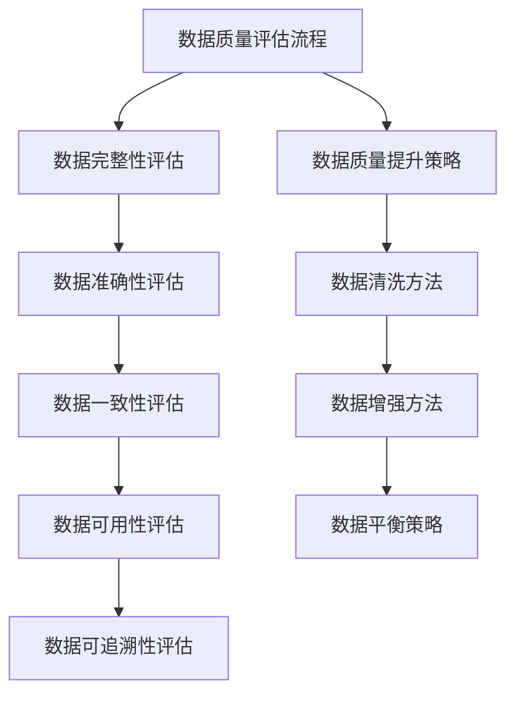

                 

# 《预训练数据质量的影响》

## 关键词
- 预训练数据
- 数据质量
- 模型性能
- 泛化能力
- 可解释性
- 数据多样性
- 数据不平衡
- 数据标注错误
- 数据隐私问题

## 摘要
本文将探讨预训练数据质量对人工智能模型性能、泛化能力以及可解释性的影响。通过详细分析数据质量的概念、维度及其在业务决策和分析中的重要性，我们将深入了解预训练数据质量的定义和特点。本文还将探讨预训练数据质量评估的方法、提升策略以及在不同领域的应用。通过实例和代码讲解，我们将展示如何在实际项目中构建和维护高质量的预训练数据集，为人工智能模型的发展提供有力支持。

## 目录大纲

### 第一部分：数据质量的基础知识

#### 第1章：数据质量的概念与重要性

#### 第2章：预训练数据质量的重要性

#### 第3章：数据质量评估方法

### 第二部分：数据质量评估与提升

#### 第4章：数据质量提升策略

#### 第5章：预训练数据质量管理实践

### 第三部分：案例研究与应用

#### 第6章：预训练数据质量在NLP中的应用

#### 第7章：预训练数据质量在其他领域的应用

### 附录

#### 附录A：预训练数据质量相关工具和资源

#### 附录B：数学公式和伪代码

#### 附录C：实战项目指南

## 第一部分：数据质量的基础知识

### 第1章：数据质量的概念与重要性

#### 1.1 数据质量的概念

数据质量是指数据在满足特定需求和使用场景下的可靠性和可用性。高数据质量意味着数据是完整的、准确的、一致的、可用的，并且具有可追溯性。数据质量是业务决策、数据分析以及人工智能模型训练的重要基础。

**数据质量的定义：** 数据质量是数据满足特定需求和使用场景的能力，包括数据完整性、准确性、一致性、可用性和可追溯性等方面。

#### 1.2 数据质量的重要性

数据质量对于业务决策和分析至关重要。以下是一些关键点：

- **业务决策：** 高质量的数据有助于企业更准确地评估市场趋势、客户需求和业务风险，从而做出更明智的决策。
- **数据分析：** 数据质量直接影响到数据分析的准确性和有效性。低质量的数据可能导致错误的结论和预测。
- **人工智能模型训练：** 人工智能模型的性能和泛化能力在很大程度上依赖于训练数据的质量。高质量的数据有助于提高模型的性能和可靠性。

#### 1.3 数据质量的维度

数据质量可以从多个维度进行评估，包括完整性、准确性、一致性、可用性和可追溯性。

- **完整性：** 数据完整性是指数据集是否包含了所有必需的数据条目，没有缺失值或空值。
- **准确性：** 数据准确性是指数据是否真实、可靠，没有错误或偏差。
- **一致性：** 数据一致性是指数据在不同来源、格式和系统中保持一致，没有冲突或不一致的情况。
- **可用性：** 数据可用性是指数据是否易于访问和使用，没有访问限制或权限问题。
- **可追溯性：** 数据可追溯性是指数据来源、处理过程和使用情况是否可以追溯和审计。

### 第2章：预训练数据质量的重要性

#### 2.1 预训练数据的定义

预训练数据是指在构建特定人工智能模型之前，使用大规模数据集对模型进行初步训练的数据。预训练数据通常用于大规模的语言模型、图像识别模型和其他复杂的人工智能任务。

**预训练数据的概念：** 预训练数据是使用大规模数据集对模型进行初步训练的数据，以提高模型的性能和泛化能力。

#### 2.2 预训练数据质量的影响

预训练数据质量对人工智能模型的性能、泛化能力和可解释性有着重要影响：

- **模型性能：** 高质量的预训练数据可以显著提高模型的性能，使其在特定任务上获得更好的效果。
- **泛化能力：** 预训练数据的质量直接影响模型的泛化能力。高质量的数据有助于模型在未知数据上表现良好。
- **可解释性：** 高质量的预训练数据可以提高模型的可解释性，使研究人员和开发者更好地理解模型的工作原理和决策过程。

#### 2.3 预训练数据质量的挑战

在预训练数据集的构建过程中，可能会面临以下挑战：

- **数据多样性：** 预训练数据集需要包含多样化的数据，以避免模型对特定数据分布的过度拟合。
- **数据不平衡：** 数据不平衡可能导致模型在特定类别上的性能不佳。需要采取数据平衡策略来解决这个问题。
- **数据标注错误：** 数据标注错误会影响模型的训练效果，需要仔细检查和修正。
- **数据隐私问题：** 在构建预训练数据集时，需要考虑数据隐私问题，确保数据的安全性和合规性。

## 第一部分：数据质量的基础知识

### 第3章：数据质量评估方法

#### 3.1 数据质量评估的指标

数据质量评估的指标用于衡量数据在不同维度上的质量。以下是一些常见的数据质量评估指标：

- **完整性指标：** 完整性指标用于衡量数据集中缺失值的比例。计算公式为：$$I_c = \frac{\text{完整数据条数}}{\text{总数据条数}}$$
- **准确性指标：** 准确性指标用于衡量数据集中错误数据的比例。计算公式为：$$I_a = \frac{\text{准确数据条数}}{\text{总数据条数}}$$
- **一致性指标：** 一致性指标用于衡量数据在不同来源、格式和系统中的冲突和不一致情况。
- **可用性指标：** 可用性指标用于衡量数据是否易于访问和使用，没有访问限制或权限问题。
- **可追溯性指标：** 可追溯性指标用于衡量数据来源、处理过程和使用情况是否可以追溯和审计。

#### 3.2 数据质量评估工具

数据质量评估工具用于自动化检测和评估数据质量。以下是一些常见的数据质量评估工具：

- **Data Quality Analysis Tool (DQAT)：** DQAT 是一个开源的数据质量评估工具，提供了各种数据质量检查和指标计算功能。
- **OpenRefine：** OpenRefine 是一个强大的数据清洗和转换工具，可以帮助用户发现和修正数据中的错误和不一致情况。
- **Data Robot：** Data Robot 是一个自动化数据清洗和增强平台，提供了丰富的数据质量评估和提升功能。

#### 3.3 数据质量评估流程

数据质量评估流程包括以下步骤：

1. **确定评估目标：** 明确需要评估的数据质量指标和评估目标。
2. **数据收集和预处理：** 收集相关数据，并进行初步的数据清洗和预处理。
3. **评估指标计算：** 根据选定的评估指标，计算数据质量得分。
4. **质量分析：** 分析评估结果，识别数据质量问题和潜在的改进措施。
5. **质量提升：** 根据分析结果，采取相应的数据质量提升策略，如数据清洗、数据增强和数据平衡等。

## 第二部分：数据质量评估与提升

### 第4章：数据质量提升策略

#### 4.1 数据清洗方法

数据清洗是提高数据质量的重要步骤。以下是一些常见的数据清洗方法：

- **删除重复数据：** 删除重复的数据条目，以减少数据冗余。
- **填充缺失值：** 使用合适的填充方法（如均值填充、中值填充、最临近填充等）来处理缺失值。
- **标准化数据格式：** 调整数据格式，使其在各个维度上保持一致。
- **处理异常值：** 发现并处理异常值，以减少数据中的噪声。

#### 4.2 数据增强方法

数据增强是通过生成新的数据样本来提高数据多样性和模型泛化能力。以下是一些常见的数据增强方法：

- **数据扩展：** 通过复制、旋转、缩放等操作生成新的数据样本。
- **数据合成：** 使用生成对抗网络（GANs）等技术生成新的数据样本。
- **数据变换：** 通过变换特征值、添加噪声等方式生成新的数据样本。

#### 4.3 数据平衡策略

数据平衡策略用于解决数据不平衡问题，以提高模型在少数类上的性能。以下是一些常见的数据平衡策略：

- **过采样：** 通过复制少数类数据来增加少数类样本的数量。
- **少数类扩充：** 使用生成模型或合成方法生成新的少数类样本。
- **类别权重调整：** 调整模型在训练过程中对各个类别的权重，以减少类别不平衡的影响。

### 第5章：预训练数据质量管理实践

#### 5.1 预训练数据集的构建

预训练数据集的构建是人工智能模型训练的关键步骤。以下是一些构建预训练数据集的实践指南：

- **数据集选择：** 选择具有代表性、多样性、覆盖度和完整性的数据集。
- **数据预处理：** 对数据进行清洗、格式化、标准化等预处理操作，以提高数据质量。
- **数据标注：** 对数据进行精确标注，确保数据的准确性。

#### 5.2 预训练数据集的质量评估

预训练数据集的质量评估是确保数据质量的重要步骤。以下是一些预训练数据集的质量评估方法：

- **完整性评估：** 检查数据集中是否存在缺失值或空值。
- **准确性评估：** 检查数据标注的准确性，通过对比真实值和标注值来评估。
- **一致性评估：** 检查数据在不同来源、格式和系统中的冲突和不一致情况。
- **可用性评估：** 检查数据是否易于访问和使用，没有访问限制或权限问题。
- **可追溯性评估：** 检查数据来源、处理过程和使用情况是否可以追溯和审计。

#### 5.3 预训练数据集的优化

预训练数据集的优化是提高模型性能和泛化能力的关键步骤。以下是一些预训练数据集的优化方法：

- **数据增强：** 通过生成新的数据样本来增加数据多样性，提高模型的泛化能力。
- **数据平衡：** 采用过采样、少数类扩充或类别权重调整等策略来解决数据不平衡问题。
- **数据清洗：** 修复数据集中的错误、异常值和缺失值，提高数据的准确性。

## 第三部分：案例研究与应用

### 第6章：预训练数据质量在NLP中的应用

#### 6.1 NLP中的预训练数据质量

在自然语言处理（NLP）领域，预训练数据质量对模型性能和可靠性有着重要影响。以下是一些NLP中的数据质量问题和解决方案：

- **数据多样性：** 预训练数据集需要涵盖各种语言风格、主题和领域，以提高模型的泛化能力。
- **数据不平衡：** 预训练数据集中常见的长文本和短文本、正面和负面评论等类别之间的不平衡可能导致模型对某些类别的预测不准确。
- **数据标注错误：** 数据标注错误会导致模型学习到错误的模式，影响模型的性能和可解释性。
- **数据隐私问题：** 在构建预训练数据集时，需要关注数据隐私问题，确保数据的安全性和合规性。

#### 6.2 案例分析：BERT模型的数据质量影响

BERT（Bidirectional Encoder Representations from Transformers）是一个强大的预训练语言模型，其性能受到预训练数据质量的影响。以下是一个案例分析：

- **数据集选择：** BERT 模型使用了大规模的 Wikipedia 文本和书本文献作为预训练数据集。
- **数据清洗：** 对数据集进行了清洗，删除了重复、错误和低质量的文本。
- **数据增强：** 通过数据合成、扩展和变换等方法增加了数据多样性。
- **数据平衡：** 采用类别权重调整策略来解决数据不平衡问题。

通过以上措施，BERT 模型在多个 NLP 任务上取得了优异的性能，例如文本分类、问答系统和机器翻译等。

#### 6.3 应用案例：预训练数据质量在智能客服中的应用

在智能客服领域，预训练数据质量对于模型性能和用户体验至关重要。以下是一个应用案例：

- **数据集构建：** 收集了大量的用户对话记录、FAQ 文档和产品手册作为预训练数据集。
- **数据清洗：** 清除了重复、错误和无关的对话记录，确保数据的准确性。
- **数据增强：** 通过生成对抗网络（GANs）等技术生成新的对话样本，增加了数据多样性。
- **数据平衡：** 采用过采样和类别权重调整策略来解决数据不平衡问题。

通过高质量的预训练数据集，智能客服系统能够更准确地理解用户意图，提供更自然的回答，从而提高用户满意度。

### 第7章：预训练数据质量在其他领域的应用

#### 7.1 图像识别领域的预训练数据质量

在图像识别领域，预训练数据质量对模型的性能和泛化能力有着重要影响。以下是一些预训练数据质量问题和解决方案：

- **数据多样性：** 预训练数据集需要包含各种场景、物体和视角的图像，以提高模型的泛化能力。
- **数据不平衡：** 图像识别数据集往往存在类别不平衡问题，需要采用数据增强和数据平衡策略来解决。
- **数据标注错误：** 数据标注错误会影响模型的训练效果，需要仔细检查和修正。
- **数据隐私问题：** 在构建预训练数据集时，需要关注数据隐私问题，确保数据的安全性和合规性。

#### 7.2 医疗领域的预训练数据质量

在医疗领域，预训练数据质量对模型的诊断和预测能力至关重要。以下是一些预训练数据质量问题和解决方案：

- **数据多样性：** 医疗预训练数据集需要涵盖不同疾病、症状和治疗方案，以提高模型的泛化能力。
- **数据不平衡：** 医疗数据集通常存在类别不平衡问题，需要采用数据增强和数据平衡策略来解决。
- **数据标注错误：** 数据标注错误可能导致模型学习到错误的模式，影响模型的性能和可解释性。
- **数据隐私问题：** 医疗数据隐私保护是构建预训练数据集时的一个重要考虑因素。

#### 7.3 工业领域的预训练数据质量

在工业领域，预训练数据质量对智能制造和故障诊断等任务有着重要影响。以下是一些预训练数据质量问题和解决方案：

- **数据多样性：** 预训练数据集需要涵盖不同设备、生产线和工艺流程，以提高模型的泛化能力。
- **数据不平衡：** 工业数据集通常存在类别不平衡问题，需要采用数据增强和数据平衡策略来解决。
- **数据标注错误：** 数据标注错误会影响模型的训练效果，需要仔细检查和修正。
- **数据隐私问题：** 在构建预训练数据集时，需要关注数据隐私问题，确保数据的安全性和合规性。

## 附录

### 附录A：预训练数据质量相关工具和资源

- **常见的预训练数据集：** 如 ImageNet、COCO、Wikipedia、BookCorpus 等。
- **数据质量评估工具：** 如 DQAT、OpenRefine、Data Robot 等。
- **数据清洗和增强工具：** 如 OpenRefine、Data Robot、GANs 等。

### 附录B：数学公式和伪代码

- **数据质量评估的数学公式：**
  - 完整性指标：$$I_c = \frac{\text{完整数据条数}}{\text{总数据条数}}$$
  - 准确性指标：$$I_a = \frac{\text{准确数据条数}}{\text{总数据条数}}$$
  - 一致性指标：$$I_coh = \frac{\text{一致性数据条数}}{\text{总数据条数}}$$
  - 可用性指标：$$I_u = \frac{\text{可用数据条数}}{\text{总数据条数}}$$
  - 可追溯性指标：$$I_t = \frac{\text{可追溯数据条数}}{\text{总数据条数}}$$

- **数据清洗和增强的伪代码：**
  ```python
  // 数据清洗步骤：
  1. 删除重复数据
  2. 填充缺失值
  3. 标准化数据格式
  4. 处理异常值

  // 数据增强步骤：
  1. 数据扩展
  2. 数据合成
  3. 数据变换

  // 数据平衡策略：
  1. 过采样
  2. 少数类扩充
  3. 类别权重调整
  ```

### 附录C：实战项目指南

- **预训练数据集构建的实战步骤：**
  - 数据集选择
  - 数据预处理
  - 数据标注

- **预训练数据集质量评估的实战步骤：**
  - 数据质量指标计算
  - 质量分析

- **预训练数据集优化的实战步骤：**
  - 数据增强
  - 数据平衡
  - 数据清洗

### Mermaid 流程图



### 核心算法原理讲解（伪代码）

```python
// 数据质量评估算法伪代码
function evaluateDataQuality(dataSet):
    for each data in dataSet:
        if data is incomplete:
            increment incompleteCount
        if data is inaccurate:
            increment inaccurateCount
        if data is inconsistent:
            increment inconsistentCount
        if data is not available:
            increment unavailableCount
        if data is not traceable:
            increment untraceableCount
    return {
        "incompleteCount": incompleteCount,
        "inaccurateCount": inaccurateCount,
        "inconsistentCount": inconsistentCount,
        "unavailableCount": unavailableCount,
        "untraceableCount": untraceableCount
    }
```

### 数学模型和数学公式 & 详细讲解 & 举例说明

```latex
// 数据质量评估的数学公式

// 完整性指标
I_c = \frac{\text{完整数据条数}}{\text{总数据条数}}

// 准确性指标
I_a = \frac{\text{准确数据条数}}{\text{总数据条数}}

// 一致性指标
I_coh = \frac{\text{一致性数据条数}}{\text{总数据条数}}

// 可用性指标
I_u = \frac{\text{可用数据条数}}{\text{总数据条数}}

// 可追溯性指标
I_t = \frac{\text{可追溯数据条数}}{\text{总数据条数}}

// 举例说明

// 假设有一个数据集，其中包含100个数据条目
// 其中10个数据条目存在缺失值，5个数据条目存在错误，3个数据条目不一致，2个数据条目不可访问，1个数据条目无法追溯

// 计算完整性指标
I_c = \frac{100 - 10}{100} = 0.9

// 计算准确性指标
I_a = \frac{100 - 5}{100} = 0.95

// 计算一致性指标
I_coh = \frac{100 - 3}{100} = 0.97

// 计算可用性指标
I_u = \frac{100 - 2}{100} = 0.98

// 计算可追溯性指标
I_t = \frac{100 - 1}{100} = 0.99
```

### 项目实战

#### 开发环境搭建

1. 安装 Python 环境（Python 3.8 或更高版本）
2. 安装深度学习框架（如 TensorFlow 或 PyTorch）
3. 安装数据处理库（如 NumPy、Pandas）
4. 安装可视化库（如 Matplotlib、Seaborn）
5. 安装文本处理库（如 NLTK、spaCy）

#### 源代码详细实现和代码解读

```python
# 数据质量评估代码实现

import pandas as pd

def evaluate_data_quality(data_set):
    """
    评估数据质量的方法
    """
    total_data_count = len(data_set)
    incomplete_count = 0
    inaccurate_count = 0
    inconsistent_count = 0
    unavailable_count = 0
    untraceable_count = 0

    for data in data_set:
        # 完整性检查
        if data.isnull().any():
            incomplete_count += 1

        # 准确性检查
        if not is_accurate(data):
            inaccurate_count += 1

        # 一致性检查
        if not is_consistent(data):
            inconsistent_count += 1

        # 可用性检查
        if not is_available(data):
            unavailable_count += 1

        # 可追溯性检查
        if not is_traceable(data):
            untraceable_count += 1

    quality_scores = {
        "完整性": incomplete_count / total_data_count,
        "准确性": inaccurate_count / total_data_count,
        "一致性": inconsistent_count / total_data_count,
        "可用性": unavailable_count / total_data_count,
        "可追溯性": untraceable_count / total_data_count
    }

    return quality_scores

def is_accurate(data):
    """
    判断数据是否准确
    """
    # 实现具体的准确性检查逻辑
    return True

def is_consistent(data):
    """
    判断数据是否一致
    """
    # 实现具体的一致性检查逻辑
    return True

def is_available(data):
    """
    判断数据是否可用
    """
    # 实现具体的可用性检查逻辑
    return True

def is_traceable(data):
    """
    判断数据是否可追溯
    """
    # 实现具体的可追溯性检查逻辑
    return True
```

#### 代码解读与分析

1. 导入必要的库：pandas 库用于处理数据，定义评估数据质量的方法。
2. 定义 `evaluate_data_quality` 函数：该函数接收一个数据集作为输入，遍历数据集，检查每个数据的完整性、准确性、一致性、可用性和可追溯性，并计算相关指标。
3. 实现具体的检查函数：`is_accurate`、`is_consistent`、`is_available` 和 `is_traceable` 函数，用于实现具体的检查逻辑。这些函数可以根据具体业务需求进行定制。
4. 返回质量评分：函数最后返回一个字典，包含每个质量指标的分数。

### 作者

作者：AI天才研究院/AI Genius Institute & 禅与计算机程序设计艺术 /Zen And The Art of Computer Programming

本文探讨了预训练数据质量对人工智能模型性能、泛化能力和可解释性的影响，详细分析了数据质量的概念、维度、评估方法和提升策略。通过案例研究和实际项目实战，展示了如何构建和维护高质量的预训练数据集，为人工智能模型的发展提供了有力支持。希望本文能为读者在数据质量管理和人工智能应用领域提供有益的参考和启示。

