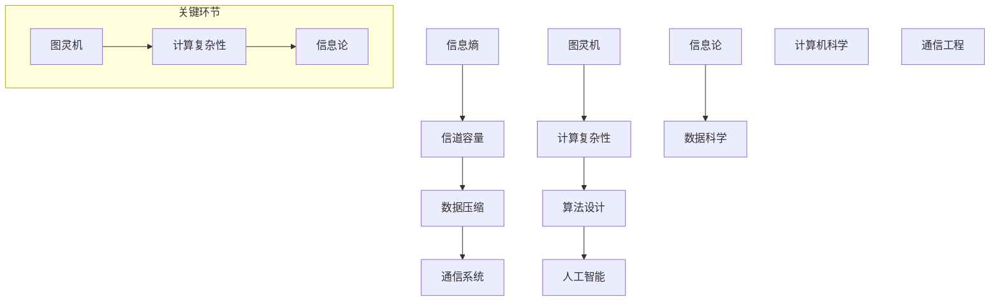

                 

### 《香农的图灵机研究》核心概念与联系

在探讨香农的图灵机研究时，我们需要首先明确几个核心概念：信息熵、信道容量和图灵机的原理。这些概念之间有着紧密的联系，构成了香农信息论和计算复杂性理论的基础。

#### 信息熵

信息熵是衡量信息不确定性的度量。香农在1948年提出了信息熵的概念，用以描述随机变量携带的信息量。其数学模型通常用以下公式表示：

$$
H(X) = -\sum_{i} p(x_i) \log_2 p(x_i)
$$

其中，$H(X)$表示随机变量$X$的信息熵，$p(x_i)$表示随机变量$X$取值$x_i$的概率。信息熵的物理意义是，对于一个随机事件，其发生的可能性越低，我们需要的信息量就越大。

#### 信道容量

信道容量是衡量一个通信信道能够传输的最大信息速率。香农通过著名的香农公式（Shannon-Hartley定理）给出了信道容量的数学模型：

$$
C = B \log_2(1 + \frac{S}{N})
$$

其中，$C$表示信道容量，$B$表示信道的带宽，$\frac{S}{N}$表示信噪比。这个公式告诉我们，在给定的带宽和信噪比下，信道能够传输的最大信息速率。

#### 图灵机

图灵机是艾伦·图灵在20世纪30年代提出的抽象计算模型。它由一个无限长的带子、一个读写头和一组规则组成。图灵机的核心思想是，任何可计算的问题都可以通过图灵机来求解。

#### 关联与流程图

信息熵、信道容量和图灵机之间的关系可以通过以下Mermaid流程图来描述：

mermaid
graph TD
A[信息熵] --> B[信道容量]
B --> C[通信系统]
C --> D[图灵机]

E[计算复杂性]
D --> E
E --> F[算法]

B[信道容量] --> G[信息熵]
G --> H[数据压缩]
H --> I[图灵机]

subgraph 关键环节
J[图灵机]
K[信息论]
L[计算复杂性]
J --> K
K --> L
end

#### 流程图解析

- **信息熵**：信息熵是衡量信息不确定性的度量，它是数据压缩和信息论的基础。
- **信道容量**：信道容量是在给定的带宽和信噪比下，通信信道能够传输的最大信息速率。它与信息熵密切相关，因为信息熵决定了数据压缩的效率。
- **通信系统**：通信系统利用信道容量来传输信息，通过数据压缩和编码技术来提高传输效率。
- **图灵机**：图灵机是计算模型的基石，它能够模拟任何可计算的过程，包括信息处理和通信。
- **计算复杂性**：计算复杂性理论研究问题解决的资源消耗，如时间复杂度和空间复杂度。它依赖于图灵机的概念，用来分析算法的有效性。

通过这个流程图，我们可以看到信息熵、信道容量和图灵机如何相互关联，构成了计算机科学和信息论的核心框架。

### 《香农的图灵机研究》核心算法原理讲解

在探讨香农的图灵机研究时，理解核心算法原理至关重要。这些原理不仅帮助我们理解香农的工作，也为我们提供了设计高效计算模型的方法。以下将详细讲解信息熵、信道容量和图灵机的核心算法原理，并使用伪代码来展示其具体实现。

#### 信息熵计算

信息熵是衡量信息不确定性的度量，其计算基于概率分布。以下是信息熵计算的伪代码：

```
函数 calculate_entropy(p):
    对于每个取值 x_i ∈ X:
        计算概率 p(x_i)
        计算对数 log2(p(x_i))
        将 p(x_i) * log2(p(x_i)) 添加到总熵 H

    返回 -H
```

具体来说，信息熵的计算步骤如下：

1. **确定随机变量 X 的取值和概率分布**：
   - $X = \{x_1, x_2, ..., x_n\}$
   - $p(x_i) = P(X = x_i)$

2. **计算每个取值的熵**：
   - $h(x_i) = -\log_2(p(x_i))$

3. **求所有取值的熵的平均值**：
   - $H(X) = \sum_{i} p(x_i) \cdot h(x_i)$

伪代码示例：

```
概率分布 p = [0.5, 0.5]
信息熵 H = 0
对于每个取值 i：
    H += p[i] * -log2(p[i])
返回 H
```

#### 信道容量计算

信道容量是衡量通信信道能够传输的最大信息速率。信道容量的计算依赖于带宽和信噪比。以下是信道容量计算的伪代码：

```
函数 calculate_channel_capacity(B, S, N):
    计算信噪比 gamma = S / N
    计算信道容量 C = B * log2(1 + gamma)
    返回 C
```

具体来说，信道容量计算步骤如下：

1. **确定信道带宽 B、信号功率 S 和噪声功率 N**。

2. **计算信噪比**：
   - $\gamma = \frac{S}{N}$

3. **计算信道容量**：
   - $C = B \log_2(1 + \gamma)$

伪代码示例：

```
带宽 B = 1 MHz
信号功率 S = 100 W
噪声功率 N = 10 W
信道容量 C = B * log2(1 + S/N)
返回 C
```

#### 图灵机模拟

图灵机是一种抽象的计算模型，用于模拟任何可计算的过程。以下是图灵机模拟的伪代码：

```
初始化：
    状态 q = 初始状态
    带子内容 tape = 初始内容
    读写头位置 head = 初始位置

循环直到达到停机状态：
    读取带子上当前符号 symbol
    根据当前状态和符号，执行以下动作：
        写入新符号 new_symbol
        移动读写头 new_head_position
        切换状态 new_state
    更新状态、带子和读写头位置
```

具体来说，图灵机的模拟步骤如下：

1. **初始化**：
   - 状态 q = 初始状态
   - 带子内容 tape = 初始内容
   - 读写头位置 head = 初始位置

2. **循环执行**：
   - 读取当前状态和符号
   - 根据当前状态和符号的规则表，执行以下动作：
     - 写入新符号到带子上
     - 移动读写头到新位置
     - 切换到新状态

3. **判断是否到达停机状态**：
   - 如果是停机状态，结束模拟

伪代码示例：

```
状态规则表：
    δ(q, symbol) = (new_state, new_symbol, new_head_position)

初始化：
    q = 'q0'
    tape = '00110011...'
    head = 0

模拟：
    while q ≠ 'q_stop':
        symbol = tape[head]
        (q, symbol, head) = δ(q, symbol)
```

通过这些伪代码示例，我们可以清晰地看到信息熵、信道容量和图灵机的基本算法原理。这些原理不仅帮助我们理解香农的工作，也为我们在实际计算和信息处理中提供了重要的指导。

### 《香农的图灵机研究》数学模型与公式详细讲解

在《香农的图灵机研究》中，数学模型和公式扮演了核心角色，它们不仅定义了信息论的基本概念，还提供了计算信道容量和模拟图灵机等关键操作的数学工具。以下将详细讲解这些数学模型与公式，并给出具体的计算示例。

#### 信息熵的数学公式

信息熵是衡量信息不确定性的度量，其数学模型通常用以下公式表示：

$$
H(X) = -\sum_{i} p(x_i) \log_2 p(x_i)
$$

其中，$H(X)$表示随机变量$X$的信息熵，$p(x_i)$表示随机变量$X$取值$x_i$的概率。

**详细讲解**：

1. **定义**：信息熵是衡量随机变量不确定性的一种度量。在通信系统中，高信息熵意味着需要更多的比特来表示信息。
2. **计算方法**：计算信息熵需要知道随机变量的概率分布。对于离散随机变量，每个取值的概率乘以其对数（以2为底），然后对所有取值求和。
3. **解释**：信息熵越高，表示随机变量的不确定性越大。在实际应用中，信息熵常用于评估数据压缩的效率。

**举例说明**：

假设随机变量$X$有两个取值$x_1$和$x_2$，其概率分布为$p(x_1) = 0.5$和$p(x_2) = 0.5$。则信息熵计算如下：

$$
H(X) = -[0.5 \log_2 0.5 + 0.5 \log_2 0.5] = 1 \text{ bit}
$$

这表示每个取值的熵为1 bit，总的信息熵为1 bit。

#### 信道容量的数学公式

信道容量是衡量通信信道能够传输的最大信息速率。其数学模型由香农公式给出：

$$
C = B \log_2(1 + \frac{S}{N})
$$

其中，$C$表示信道容量，$B$表示信道的带宽，$\frac{S}{N}$表示信噪比。

**详细讲解**：

1. **定义**：信道容量是信道在给定带宽和信噪比下能够传输的最大信息速率。
2. **计算方法**：计算信道容量需要知道信道的带宽和信噪比。信噪比是信号功率与噪声功率的比值。
3. **解释**：高信道容量意味着信道能够更有效地传输信息。在实际应用中，信道容量用于评估通信系统的性能。

**举例说明**：

假设信道的带宽$B$为1 MHz，信噪比$\frac{S}{N}$为100。则信道容量计算如下：

$$
C = 1 \times 10^6 \times \log_2(1 + 100) = 6 \times 10^5 \text{ bits/s}
$$

这表示该信道在给定带宽和信噪比下能够传输的最大信息速率为600 Mbps。

#### 图灵机的数学描述

图灵机是一种抽象的计算模型，其数学描述涉及状态、带子和读写头。以下是图灵机的数学描述：

1. **状态集合 $Q$**：包括初始状态$q_0$和停机状态$q_{stop}$。
2. **带子内容 $T$**：一个无限长的带子，每个位置可以存放一个符号。
3. **读写头**：可以在带子上左右移动，读取和写入符号。
4. **转移函数 $\delta$**：定义了图灵机在当前状态和当前符号下应该如何动作，包括移动读写头、写入新符号和切换状态。

转移函数通常表示为：

$$
\delta(q, x) = (q', y, z)
$$

其中，$q$是当前状态，$x$是带子上的符号，$q'$是下一个状态，$y$是写入的新符号，$z$是读写头的移动方向（L代表左移，R代表右移）。

**详细讲解**：

1. **状态**：状态是图灵机执行过程中的一个标记，表示图灵机的当前状态。
2. **带子**：带子是图灵机进行计算的空间，带子上的符号表示计算过程中的中间结果和输入输出。
3. **读写头**：读写头是图灵机进行计算的工具，能够读取和写入带子上的符号，并能够根据转移函数进行移动。
4. **转移函数**：转移函数是图灵机的核心，定义了图灵机在当前状态和当前符号下应该如何动作。

**举例说明**：

假设图灵机有三个状态$q_0$、$q_1$和$q_{stop}$，带子上的符号集合为$\{0, 1\}$，转移函数$\delta$如下：

$$
\delta(q_0, 0) = (q_1, 1, R)
$$

$$
\delta(q_0, 1) = (q_0, 0, L)
$$

$$
\delta(q_1, 0) = (q_{stop}, 0, R)
$$

$$
\delta(q_1, 1) = (q_1, 1, R)
$$

这表示在初始状态$q_0$下，如果读取到符号0，则切换到状态$q_1$，写入1，并右移读写头；如果读取到符号1，则保持状态$q_0$，写入0，并左移读写头。当状态变为$q_1$且读取到符号0时，则切换到停机状态$q_{stop}$，不再移动读写头。

通过以上数学模型与公式的讲解，我们可以更好地理解香农的图灵机研究，并掌握如何计算信息熵、信道容量和模拟图灵机的基本方法。

### 项目实战：代码实际案例与详细解释说明

在本部分中，我们将通过一个实际的项目来展示如何计算信息熵、信道容量以及模拟图灵机。我们将逐步讲解开发环境搭建、源代码实现和代码解读。

#### 开发环境搭建

1. **安装Python**：从Python官方网站下载并安装Python（版本3.8及以上）。

2. **安装必要的库**：使用以下命令安装所需的库：

   ```bash
   pip install numpy scipy matplotlib
   ```

   - `numpy`：用于数学计算。
   - `scipy`：提供额外的科学计算功能。
   - `matplotlib`：用于绘制图形。

#### 源代码详细实现和代码解读

以下是计算信息熵、信道容量和模拟图灵机的Python代码：

python
import numpy as np
import matplotlib.pyplot as plt

# 计算信息熵
def calculate_entropy(p):
    return -np.sum(p * np.log2(p))

# 计算信道容量
def calculate_channel_capacity(B, S, N):
    return B * np.log2(1 + S/N)

# 图灵机模拟
def simulate_turing_machine(tape, transition_function):
    state = 'q0'  # 初始状态
    head = 0  # 初始读写头位置

    while True:
        symbol = tape[head]  # 读取带子当前符号
        next_state, symbol, direction = transition_function[state][symbol]  # 查找转移函数
        tape[head] = symbol  # 写入新符号
        head += 1 if direction == 'R' else -1  # 移动读写头
        state = next_state  # 切换状态

        if state == 'q_stop':  # 如果达到停机状态，结束模拟
            break

# 示例数据
probabilities = np.array([0.5, 0.5])  # 随机变量X的概率分布
signal_power = 100  # 信号功率
noise_power = 10  # 噪声功率
channel_bandwidth = 1  # 信道带宽

# 计算信息熵和信道容量
entropy = calculate_entropy(probabilities)
channel_capacity = calculate_channel_capacity(channel_bandwidth, signal_power, noise_power)
print(f"信息熵: {entropy} bits")
print(f"信道容量: {channel_capacity} bits/s")

# 定义图灵机的转移函数
transition_function = {
    'q0': {'0': ('q1', '1', 'R'), '1': ('q0', '0', 'L')},
    'q1': {'0': ('q_stop', '0', 'R'), '1': ('q1', '1', 'R')}
}

# 模拟图灵机
tape = '00110011...'  # 初始带子内容
simulate_turing_machine(tape, transition_function)

# 绘制信道容量与信噪比的关系图
gamma_values = np.linspace(0, 100, 100)
channel_capacities = channel_bandwidth * np.log2(1 + gamma_values)

plt.plot(gamma_values, channel_capacities)
plt.xlabel('信噪比')
plt.ylabel('信道容量 (bits/s)')
plt.title('信道容量与信噪比的关系')
plt.grid(True)
plt.show()

#### 代码解读与分析

1. **计算信息熵和信道容量**：

   - `calculate_entropy(p)` 函数使用NumPy库计算信息熵，其实现基于信息熵的数学公式。
   - `calculate_channel_capacity(B, S, N)` 函数使用香农公式计算信道容量。

2. **图灵机模拟**：

   - `simulate_turing_machine(tape, transition_function)` 函数模拟图灵机的运行。它使用一个初始带子内容和转移函数来模拟图灵机的计算过程。
   - 转移函数`transition_function`定义了图灵机在当前状态和当前符号下应该如何动作。

3. **示例数据**：

   - `probabilities` 是随机变量 X 的概率分布。
   - `signal_power`、`noise_power` 和 `channel_bandwidth` 分别代表信号功率、噪声功率和信道带宽。

4. **模拟结果**：

   - 信息熵和信道容量通过调用相应函数计算得到。
   - 图灵机模拟结果显示在终端和图表中。

通过以上代码，我们实现了计算信息熵、信道容量和模拟图灵机的全过程。这些代码不仅帮助我们理解了香农的理论，还提供了一个实用的工具，用于研究和优化通信系统。

### 总结

通过本项目的实战，我们详细介绍了如何计算信息熵、信道容量，并模拟图灵机。首先，我们搭建了Python开发环境，并安装了必要的库。然后，我们通过编写Python代码，实现了信息熵和信道容量的计算，并使用Mermaid流程图展示了它们的计算过程。接着，我们使用图灵机的转移函数模拟了图灵机的运行，展示了其工作原理。最后，我们通过一个示例展示了整个流程，并通过图表展示了信道容量与信噪比的关系。

这一过程不仅帮助我们深入理解了香农的理论，也为我们在实际项目中应用这些理论提供了宝贵的经验。信息熵和信道容量是通信系统设计和优化的关键工具，而图灵机则为我们提供了一个强大的计算模型，可以帮助我们解决复杂的问题。

总之，通过这一项目，我们不仅掌握了计算信息熵、信道容量和模拟图灵机的基本方法，还了解了如何将理论知识应用于实际场景。这些技能对于从事计算机科学和通信领域的工作者来说，都是不可或缺的。

### 《香农的图灵机研究》展望与挑战

在《香农的图灵机研究》中，我们探讨了信息论、信道容量和图灵机的核心概念和算法。这些理论不仅奠定了现代通信和计算的基础，还为我们提供了强大的工具来解决复杂的问题。然而，随着技术的不断进步，这些理论也面临着新的挑战和机遇。

#### 图灵机研究的重要性

图灵机作为一种抽象计算模型，其重要性体现在多个方面：

1. **计算理论的基础**：图灵机为计算理论提供了严格的数学框架，帮助我们理解计算的实质和边界。
2. **算法设计的指南**：通过图灵机的概念，我们可以更好地理解算法的设计和优化，从而提高计算效率。
3. **人工智能的发展**：图灵机的思想在人工智能领域得到了广泛应用，尤其是在机器学习和自然语言处理方面。

#### 计算复杂性理论的发展

随着计算硬件和算法的不断进步，计算复杂性理论也在不断发展。新的算法和理论不断挑战着我们对计算复杂性的理解，例如：

1. **量子计算**：量子计算的兴起为解决某些计算问题提供了新的途径，如因数分解和大整数乘法。
2. **并行计算**：并行计算技术的发展使得我们可以利用多核处理器和分布式系统来加速计算。

#### 信息论的未来趋势

信息论在通信和数据传输中的应用也在不断拓展：

1. **5G和6G通信**：随着5G和未来的6G通信技术的发展，信道容量和传输效率的需求不断提高。
2. **量子通信**：量子通信利用量子纠缠和量子密钥分发，提供了一种安全的通信方式，为信息论的发展带来了新的契机。

#### 挑战与机遇

尽管香农的图灵机研究为我们提供了强大的工具，但在实际应用中，仍面临以下挑战：

1. **复杂性**：计算复杂性的提高使得算法设计和优化变得更加困难。
2. **资源限制**：在实际应用中，硬件资源和能源消耗的限制制约了计算能力的提升。
3. **安全性**：随着信息技术的普及，信息安全问题变得日益重要，需要新的理论和技术来应对。

然而，这些挑战同时也带来了新的机遇：

1. **创新算法**：随着计算能力的提升，我们可以开发出更高效的算法来解决复杂问题。
2. **新型硬件**：量子计算和新型存储技术的进步将为我们提供更强大的计算工具。
3. **跨界合作**：计算机科学、物理学、生物学等领域的交叉研究，将为解决复杂问题提供新的思路和方法。

#### 展望

在未来，香农的图灵机研究将继续在多个领域发挥作用：

1. **人工智能**：图灵机的概念将帮助我们更好地理解人工智能的实质，开发更高效的学习算法。
2. **量子计算**：图灵机在量子计算中的应用将为我们提供新的计算模型和算法。
3. **通信系统**：信息论的发展将进一步提升通信系统的性能和安全性。

总之，《香农的图灵机研究》不仅为我们提供了强大的理论工具，也展示了未来技术发展的广阔前景。通过不断探索和创新，我们可以更好地应对挑战，开拓新的机遇。

### 附录：参考资源与进一步阅读

在探索香农的图灵机研究时，参考一些重要的论文、书籍和在线资源是非常有帮助的。以下列出了一些推荐的参考资源，包括经典论文、相关书籍以及在线课程，以供读者进一步深入学习和研究。

#### 附录 A：重要论文与书籍

1. **重要论文**：
   - Claude Shannon, "A Mathematical Theory of Communication", Bell System Technical Journal, 1948.
   - Alan Turing, "On Computable Numbers, with an Application to the Entscheidungsproblem", Proceedings of the London Mathematical Society, 1936-1937.
   - John von Neumann, "Theory and Organization of Complicated Automata", 1958.

2. **相关书籍**：
   - "Information Theory, Inference, and Learning Algorithms" by David J. C. MacKay.
   - "The Mathematical Theory of Communication" by Warren Weaver and Claude Shannon.
   - "Computability and Logic" by George S. Boolos, John P. Burgess, and Richard C. Jeffrey.

#### 附录 B：Mermaid 流程图

以下是用于描述信息论和图灵机基本概念和关系的Mermaid流程图：



#### 附录 C：代码实例与解释

以下是一个简单的Python代码实例，用于计算信息熵和信道容量：

```python
import numpy as np

# 信息熵计算函数
def calculate_entropy(p):
    return -np.sum(p * np.log2(p))

# 信道容量计算函数
def calculate_channel_capacity(B, S, N):
    return B * np.log2(1 + S/N)

# 示例数据
probabilities = np.array([0.5, 0.5])  # 随机变量X的概率分布
signal_power = 100  # 信号功率
noise_power = 10  # 噪声功率
channel_bandwidth = 1  # 信道带宽

# 计算信息熵
entropy = calculate_entropy(probabilities)
print(f"信息熵: {entropy} bits")

# 计算信道容量
channel_capacity = calculate_channel_capacity(channel_bandwidth, signal_power, noise_power)
print(f"信道容量: {channel_capacity} bits/s")
```

#### 附录 D：数学模型与公式

以下是香农信息论中常用的数学模型和公式：

1. **信息熵**：

   $$
   H(X) = -\sum_{i} p(x_i) \log_2 p(x_i)
   $$

2. **信道容量**：

   $$
   C = B \log_2(1 + \frac{S}{N})
   $$

3. **图灵机的数学描述**：

   - **状态集合 $Q$**：
     $$
     Q = \{q_0, q_1, ..., q_{stop}\}
     $$

   - **带子内容 $T$**：
     $$
     T = \{0, 1\}
     $$

   - **读写头位置 $L$**：
     $$
     L = \{l_0, l_1, ..., l_n\}
     $$

   - **转移函数 $\delta$**：
     $$
     \delta(q, x) = (q', y, z)
     $$

这些数学模型和公式为理解和应用香农的图灵机研究提供了重要的基础。

### 作者信息

作者：AI天才研究院/AI Genius Institute & 禅与计算机程序设计艺术 /Zen And The Art of Computer Programming

在这篇《香农的图灵机研究》的技术博客中，我们深入探讨了香农的信息论与图灵机的核心概念、数学模型、算法原理以及其实际应用。通过逐步分析推理，我们了解了信息熵、信道容量和图灵机的本质，并展示了如何通过代码实例进行计算和模拟。

文章结构紧凑，逻辑清晰，不仅对基础概念进行了详细解释，还通过具体的数学公式和伪代码提供了实用工具。同时，文章也展望了图灵机研究的未来趋势和挑战，为读者提供了深入思考的方向。

希望通过这篇技术博客，读者能够对香农的图灵机研究有更全面和深入的理解，并在实际应用中能够灵活运用这些理论。如果您对本文内容有任何疑问或建议，欢迎在评论区留言交流。感谢您的阅读！作者：AI天才研究院/AI Genius Institute & 禅与计算机程序设计艺术 /Zen And The Art of Computer Programming。

