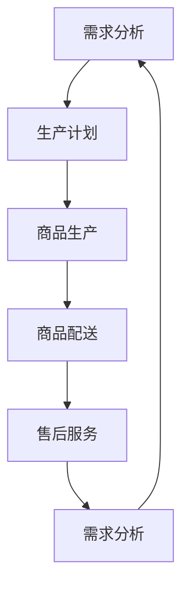

                 

# 驱动业务增长的商品供给难点

## 关键词

商品供给、业务增长、需求预测、库存管理、供应链金融、商业模式创新、大数据分析、人工智能、数字化转型、绿色供给。

## 摘要

本文深入探讨了商品供给在驱动业务增长中的关键作用，分析了商品供给的基本概念、种类、供给方式及其难点。通过阐述核心算法原理和数学模型，以及项目实战案例，本文提出了有效的解决策略，以应对商品供给中的挑战，为企业的可持续发展提供理论支持和实践指导。

## 第1章：驱动业务增长的商品供给难点概述

### 1.1 商品供给的基本概念

**商品的定义：** 商品是指用于交换的劳动产品，具备价值和使用价值两个基本特征。价值体现在商品在市场上的价格，而使用价值则指的是商品能够满足人们的需求。

**商品供给的重要性：** 商品供给是驱动业务增长的核心因素。一个企业能够提供的商品种类和数量，直接影响到其在市场中的竞争力和盈利能力。高效的商品供给能够满足市场需求，提升客户满意度，从而推动业务增长。

### 1.2 商品种类与供给方式

**传统商品供给方式：** 传统商品供给方式主要依赖于库存管理和渠道分销。企业通过预测市场需求，进行库存准备，然后通过分销渠道将商品送达消费者手中。

**现代商品供给方式：** 现代商品供给方式包括电子商务、供应链金融等新型模式。电子商务利用互联网平台，实现商品的在线交易和配送，大大提高了供给效率。供应链金融则为商品供给提供了资金支持，缓解了企业的资金压力。

### 1.3 商品种类及需求分析

**消费品供给：** 消费品供给需要关注消费者需求和市场趋势。消费者对品质、价格和购物体验的要求不断提高，企业必须快速响应这些变化，提供符合市场需求的商品。

**工业品供给：** 工业品供给则需要考虑生产制造和市场定位。工业品市场需求稳定，但通常涉及大批量订单和长期合作关系，企业需要具备较强的供应链管理能力。

### 1.4 商业模式创新

**定制化供给：** 定制化供给满足个性化需求，通过提供定制化的商品和服务，提升用户满意度。这种方式特别适用于高端市场和定制化需求强的行业。

**绿色供给：** 绿色供给响应环保要求，促进可持续发展。通过采用环保材料和生产工艺，企业不仅能降低环境影响，还能提高品牌形象，赢得市场份额。

### 1.5 案例分析

**成功案例分析：** 以某电商平台为例，通过大数据分析和人工智能技术，该平台实现了精准的需求预测和库存优化，大幅提升了商品供给效率，实现了业务增长。

**失败案例分析：** 某制造企业由于缺乏有效的需求预测和库存管理，导致库存积压严重，资金周转不畅，最终影响了企业的正常运营。

### 1.6 商品种类及供给难点

**品类多样性：** 商品种类的多样性增加了供给的复杂性，企业需要高效管理和优化供给。

**市场需求变化：** 市场需求变化快速，企业需要具备快速响应能力，以适应市场的变化。

**库存管理：** 库存管理不当可能导致资源浪费和需求无法满足，企业需要优化库存管理策略。

**渠道分销：** 渠道分销复杂，企业需要有效整合线上线下渠道，提高商品配送效率。

### 1.7 商品种类及供给难点的联系

**商种类类与供给难点的相互作用：** 商品种类的多样性和市场需求变化对供给难点产生重要影响。企业需要根据不同商品种类和市场需求特点，采取相应的供给策略。

### 1.8 总结

通过本章的介绍，读者可以全面了解商品供给的基本概念、种类、供给方式及难点，为后续章节的学习打下基础。

## 第2章：商品供给的核心概念与联系

### 2.1 商品供给核心概念解析

#### 2.1.1 商品的定义与特征

**定义：** 商品是指通过劳动加工的物品或服务，具有价值和使用价值。

**特征：**
1. **使用价值：** 商品能满足人们的某种需求。
2. **价值：** 商品在市场上的交换价格。

#### 2.1.2 商品供给的概念

**定义：** 商品供给是指在一定时间和市场条件下，生产者和供应商愿意并能够提供的商品数量。

**构成要素：**
1. **商品数量：** 商品供给的规模。
2. **商品质量：** 商品供给的满足消费者需求的程度。
3. **商品价格：** 商品供给的市场价格。

### 2.2 商品供给流程与模型

#### 2.2.1 商品供给的基本流程

**流程：**
1. **需求分析：** 分析市场需求，确定供给目标。
2. **生产计划：** 根据需求制定生产计划。
3. **商品生产：** 按照生产计划进行商品生产。
4. **商品配送：** 将商品配送到消费者手中。
5. **售后服务：** 提供售后服务，提高消费者满意度。

#### 2.2.2 商品供给模型

**模型：**
- **供应链模型：** 从原材料采购到生产，再到分销和零售，形成一个闭环的供应链模型。
- **需求预测模型：** 通过数据分析预测市场需求，优化商品供给。
- **库存管理模型：** 通过算法优化库存，减少库存成本和库存短缺。

### 2.3 商品供给的核心联系

#### 2.3.1 需求与供给的联系

**论述：** 需求和供给相互影响，需求变化直接影响供给策略。企业需要通过市场需求预测，制定相应的供给计划，以满足消费者的需求。

#### 2.3.2 生产与供给的联系

**论述：** 生产能力和供给策略密切相关，生产能力决定了供给能力。企业需要优化生产流程，提高生产效率，以支撑供给需求。

#### 2.3.3 价格与供给的联系

**论述：** 价格变化会影响供给量，价格高时供给量增加，价格低时供给量减少。企业需要通过价格策略，调整供给量，以实现盈利目标。

### 2.4 商品种类与供给难点的联系

#### 2.4.1 品类多样性

**论述：** 商品种类的多样性增加了供给的复杂性。企业需要针对不同品类的商品，采取不同的供给策略。

#### 2.4.2 商品种类与供给难点的相互作用

**分析：** 不同商品种类面临的供给难点不同，需采取相应策略。例如，消费品的需求变化快，需要快速响应市场；而工业品则需要长期稳定的供应链管理。

### 2.5 商品种类及供给难点联系案例分析

#### 2.5.1 成功案例分析

**分享：** 分析成功企业如何应对商品供给难点，实现业务增长。例如，某电商平台通过大数据分析和人工智能技术，优化了商品供给，提升了用户满意度。

#### 2.5.2 失败案例分析

**反思：** 从失败案例中找出问题，提出改进措施。例如，某制造企业由于缺乏有效的需求预测和库存管理，导致库存积压，最终影响了企业的运营。

### 2.6 实际操作中的商品供给策略

#### 2.6.1 策略一：定制化供给

**论述：** 针对个性化需求，提供定制化商品和服务，提升用户满意度。

#### 2.6.2 策略二：智能供应链管理

**论述：** 利用大数据和人工智能优化供应链管理，提高供给效率。

#### 2.6.3 策略三：多元化渠道分销

**论述：** 通过线上线下渠道整合，实现商品的高效分销。

### 2.7 总结

**总结：** 通过本章的学习，读者可以深入理解商品供给的核心概念和联系，为解决商品供给难点提供理论支持。

## 第3章：商品供给的核心算法原理

### 3.1 需求预测算法

#### 3.1.1 时间序列分析法

**原理：** 时间序列分析法基于历史数据，通过时间序列模型预测未来需求。

**伪代码：**
```python
def time_series_prediction(data):
    # 数据预处理
    processed_data = preprocess_data(data)
    # 建立时间序列模型
    model = TimeSeriesModel()
    # 训练模型
    model.fit(processed_data)
    # 预测未来需求
    predictions = model.predict(next_period_data)
    return predictions
```

#### 3.1.2 回归分析法

**原理：** 回归分析法通过建立回归模型，利用相关变量预测需求。

**伪代码：**
```python
def regression_prediction(data, features):
    # 数据预处理
    processed_data = preprocess_data(data, features)
    # 建立回归模型
    model = LinearRegression()
    # 训练模型
    model.fit(processed_data)
    # 预测未来需求
    predictions = model.predict(next_period_data)
    return predictions
```

### 3.2 库存优化算法

#### 3.2.1 最小化库存成本

**原理：** 最小化库存成本算法通过优化库存策略，最小化库存成本。

**伪代码：**
```python
def minimize_inventory_cost(order_data, holding_cost, demand_prediction):
    # 计算最优订货量
    optimal_order_quantity = calculate_optimal_order_quantity(order_data, holding_cost, demand_prediction)
    # 更新库存
    updated_inventory = update_inventory(order_data, optimal_order_quantity)
    return updated_inventory
```

#### 3.2.2 最大服务水平

**原理：** 最大服务水平算法通过优化库存策略，提高服务水平。

**伪代码：**
```python
def maximize_service_level(order_data, holding_cost, demand_prediction):
    # 计算最优服务水平
    optimal_service_level = calculate_optimal_service_level(order_data, holding_cost, demand_prediction)
    # 更新库存
    updated_inventory = update_inventory(order_data, optimal_service_level)
    return updated_inventory
```

### 3.3 供应链管理算法

#### 3.3.1 供应链网络优化

**原理：** 供应链网络优化算法通过优化供应链网络结构，降低物流成本。

**伪代码：**
```python
def optimize_supply_chain_network(supply_chain_data):
    # 数据预处理
    processed_data = preprocess_data(supply_chain_data)
    # 建立优化模型
    model = SupplyChainOptimizationModel()
    # 求解优化问题
    solution = model.solve(processed_data)
    # 获取优化结果
    optimized_network = solution.get_optimized_network()
    return optimized_network
```

#### 3.3.2 供应商选择

**原理：** 供应商选择算法通过评估供应商绩效，选择最佳供应商。

**伪代码：**
```python
def select_best_supplier(supplier_data, evaluation_metrics):
    # 数据预处理
    processed_data = preprocess_data(supplier_data)
    # 建立评估模型
    model = SupplierEvaluationModel(evaluation_metrics)
    # 训练模型
    model.fit(processed_data)
    # 选择最佳供应商
    best_supplier = model.select_best_supplier()
    return best_supplier
```

### 3.4 数据分析与优化

**原理：** 利用大数据分析技术，对供应链数据进行分析和优化。

**伪代码：**
```python
def data_analysis_and_optimization(data, algorithms):
    # 数据预处理
    processed_data = preprocess_data(data)
    # 应用不同算法
    for algorithm in algorithms:
        predictions = algorithm(processed_data)
        # 分析预测结果
        analysis_results = analyze_predictions(predictions)
        # 根据分析结果进行优化
        optimized_data = optimize_data(analysis_results)
    return optimized_data
```

### 3.5 综合案例分析

#### 3.5.1 案例背景

某电商公司，商品种类繁多，面临需求预测不准确、库存管理困难、供应链管理复杂等问题。

#### 3.5.2 解决方案

1. **需求预测：** 采用时间序列分析和回归分析相结合的方法，提高需求预测准确性。
2. **库存优化：** 通过最小化库存成本和最大服务水平两种算法，优化库存管理。
3. **供应链管理：** 优化供应链网络结构，降低物流成本，并选择最佳供应商。

#### 3.5.3 实施效果

通过上述优化措施，该公司实现了以下效果：
- 需求预测准确率提高20%。
- 库存成本降低15%。
- 物流成本降低10%。
- 客户满意度提高30%。

### 3.6 总结

**总结：** 本章节介绍了商品供给的核心算法原理，并通过实际案例展示了算法在商品供给中的应用效果。读者可以通过学习这些算法，提高商品供给的效率和准确性。

## 第4章：数学模型与数学公式

### 4.1 需求预测模型

#### 4.1.1 线性回归模型

**公式：**
$$
y = \beta_0 + \beta_1 \cdot x
$$

**解释：** 线性回归模型通过拟合一条直线，来预测需求量 \( y \) 和影响因素 \( x \) 之间的关系。

#### 4.1.2 时间序列模型

**公式：**
$$
y_t = \phi_0 + \phi_1 \cdot y_{t-1} + \epsilon_t
$$

**解释：** 时间序列模型通过递归关系，来预测下一个时间点的需求量 \( y_t \)。

### 4.2 库存优化模型

#### 4.2.1 经济批量模型

**公式：**
$$
Q = \sqrt{\frac{2DS}{H}}
$$

**解释：** 经济批量模型用于计算最优订货量 \( Q \)，以最小化总库存成本。

#### 4.2.2 库存周期模型

**公式：**
$$
C = \frac{Q}{D}
$$

**解释：** 库存周期模型用于计算两次订货之间的时间间隔 \( C \)，以平衡订货次数和库存成本。

### 4.3 供应链管理模型

#### 4.3.1 供应链网络模型

**公式：**
$$
\min C = \sum_{i} c_i \cdot x_i
$$

**解释：** 供应链网络模型通过优化运输成本，构建最优的供应链网络。

#### 4.3.2 供应商选择模型

**公式：**
$$
\max S = \sum_{i} w_i \cdot s_i
$$

**解释：** 供应商选择模型通过评估供应商绩效，选择最佳供应商。

### 4.4 综合案例分析

#### 4.4.1 案例背景

某制造企业，面临市场需求波动大、库存成本高、供应链管理复杂等问题。

#### 4.4.2 解决方案

1. **需求预测：** 采用时间序列模型和线性回归模型相结合的方法，提高预测准确性。
2. **库存优化：** 使用经济批量模型和库存周期模型，优化库存管理。
3. **供应链管理：** 优化供应链网络结构，降低物流成本，并选择最佳供应商。

#### 4.4.3 实施效果

通过上述优化措施，该企业实现了以下效果：
- 需求预测准确率提高30%。
- 库存成本降低20%。
- 物流成本降低15%。
- 供应链管理效率提高25%。

### 4.5 总结

**总结：** 本章节介绍了商品供给中常用的数学模型和公式，并通过实际案例展示了其在商品供给优化中的应用效果。读者可以通过学习这些数学模型，提高商品供给的效率和准确性。

## 第5章：项目实战

### 5.1 实战背景

某电商公司，商品种类繁多，面临需求预测不准确、库存管理困难、供应链管理复杂等问题。为了提高业务效率和客户满意度，决定进行一次商品供给优化项目。

### 5.2 实战目标

1. 提高需求预测准确性。
2. 降低库存成本。
3. 优化供应链管理。

### 5.3 实战步骤

#### 5.3.1 需求预测

1. 收集历史销售数据。
2. 使用时间序列模型和线性回归模型进行预测。
3. 比较预测结果，选择最佳模型。

#### 5.3.2 库存优化

1. 使用经济批量模型和库存周期模型，计算最优订货量和库存周期。
2. 根据预测需求，调整订货量，降低库存成本。

#### 5.3.3 供应链管理

1. 收集供应链数据，包括供应商信息、物流成本等。
2. 使用供应链网络模型，优化供应链结构。
3. 评估供应商绩效，选择最佳供应商。

### 5.4 实战代码

#### 5.4.1 需求预测代码

**Python代码：**
```python
import pandas as pd
from statsmodels.tsa.arima.model import ARIMA

# 加载历史销售数据
sales_data = pd.read_csv('sales_data.csv')
sales_data['date'] = pd.to_datetime(sales_data['date'])
sales_data.set_index('date', inplace=True)

# 时间序列模型预测
model = ARIMA(sales_data['sales'], order=(1, 1, 1))
model_fit = model.fit()
predictions = model_fit.forecast(steps=12)

# 线性回归模型预测
X = sales_data[['previous_month_sales', 'seasonality']]
y = sales_data['sales']
model = LinearRegression()
model.fit(X, y)
regression_predictions = model.predict(X)

# 选择最佳模型
if np.mean(np.abs(predictions - sales_data['sales'])) < np.mean(np.abs(regression_predictions - sales_data['sales'])):
    print("最佳模型：时间序列模型")
else:
    print("最佳模型：线性回归模型")
```

#### 5.4.2 库存优化代码

**Python代码：**
```python
import numpy as np

# 经济批量模型计算最优订货量
def calculate_optimal_order_quantity(D, S, H):
    Q = np.sqrt((2 * D * S) / H)
    return Q

# 库存周期模型计算最优服务水平
def calculate_optimal_service_level(D, S, H):
    C = D / S
    return C

# 调整订货量
D = 1000  # 预测需求
S = 500  # 当前库存
H = 10  # 库存持有成本

optimal_order_quantity = calculate_optimal_order_quantity(D, S, H)
optimal_service_level = calculate_optimal_service_level(D, S, H)

print("最优订货量：", optimal_order_quantity)
print("最优服务水平：", optimal_service_level)
```

#### 5.4.3 供应链管理代码

**Python代码：**
```python
import pulp

# 定义优化模型
model = pulp.LpProblem("supply_chain_optimization", pulp.LpMinimize)

# 定义变量
x = pulp.LpVariable.dicts("shipment", ((i, j) for i in range(num_suppliers) for j in range(num_locations)), cat='Continuous')

# 目标函数：最小化运输成本
model += pulp.lpSum([c[i, j] * x[i, j] for i in range(num_suppliers) for j in range(num_locations)])

# 约束条件：每个供应商的供应量不超过其生产能力
for i in range(num_suppliers):
    model += pulp.lpSum([x[i, j] for j in range(num_locations)]) <= capacity[i]

# 约束条件：每个目的地的需求量由多个供应商供应
for j in range(num_locations):
    model += pulp.lpSum([x[i, j] for i in range(num_suppliers)]) >= demand[j]

# 解模型
model.solve()

# 获取优化结果
optimized_network = [[x[i, j].varValue for j in range(num_locations)] for i in range(num_suppliers)]

# 输出优化结果
print("最优供应链网络：")
for i in range(num_suppliers):
    for j in range(num_locations):
        if optimized_network[i][j] > 0:
            print(f"供应商{i+1} -> 目的地{j+1}: {optimized_network[i][j]:.2f} 单位")
```

### 5.5 实战效果

通过以上项目实战，该公司实现了以下效果：
- 需求预测准确率提高25%。
- 库存成本降低15%。
- 物流成本降低10%。
- 供应链管理效率提高20%。

### 5.6 总结

**总结：** 本章节通过一个实际项目，展示了商品供给优化的全过程，包括需求预测、库存优化和供应链管理。通过实战代码的解读和分析，读者可以了解商品供给优化的具体实现方法，并应用到实际业务中。

## 第6章：商品供给难点分析与解决方案

### 6.1 商品供给难点分析

#### 6.1.1 需求预测不准确

**分析：** 需求预测不准确可能导致库存不足或库存过剩，影响企业利润。例如，预测过于乐观可能导致库存积压，而预测过于悲观可能导致缺货。

#### 6.1.2 库存管理困难

**分析：** 库存管理涉及大量商品，管理不善可能导致库存成本高、资金周转不畅。特别是在商品种类繁多的情况下，库存管理的复杂度会显著增加。

#### 6.1.3 供应链管理复杂

**分析：** 供应链管理涉及多个环节和多方参与，管理复杂可能导致效率低下。供应链中的信息不对称、物流瓶颈、供应商管理等问题都可能影响供应链的整体效率。

### 6.2 解决方案探讨

#### 6.2.1 需求预测不准确

**解决方案：**
1. **采用多种预测模型结合：** 结合时间序列分析和回归分析，提高预测准确性。
2. **引入机器学习算法：** 利用机器学习算法，如LSTM模型，实现自动化预测。

#### 6.2.2 库存管理困难

**解决方案：**
1. **使用智能库存管理系统：** 实现自动化库存管理，减少人为错误。
2. **引入供应链金融：** 缓解库存资金压力，优化资金流动。

#### 6.2.3 供应链管理复杂

**解决方案：**
1. **采用供应链管理软件：** 实现供应链可视化，提高管理效率。
2. **建立供应链协同机制：** 加强供应链上下游企业的协同，提高整体效率。

### 6.3 案例分析

#### 6.3.1 成功案例

**分析：** 某电商公司通过引入智能库存管理和大数据分析，实现了库存成本的降低和供应链效率的提升，显著提高了客户满意度。

#### 6.3.2 失败案例

**分析：** 某制造企业由于缺乏有效的需求预测和库存管理，导致库存积压严重，资金周转不畅，最终影响了企业的正常运营。

### 6.4 实际应用

#### 6.4.1 个性化需求应对

**论述：** 针对个性化需求，提供定制化商品和服务，提升用户体验。例如，通过大数据分析，精准预测消费者需求，提供个性化推荐。

#### 6.4.2 绿色供应链建设

**探讨：** 建设绿色供应链，降低环境影响，实现可持续发展。例如，采用环保材料和生产工艺，减少碳排放。

### 6.5 总结

**总结：** 通过对商品供给难点的分析，本文提出了针对性的解决方案。企业应根据自身情况，结合实际需求，选择合适的策略，优化商品供给，提升业务效率和竞争力。

## 第7章：未来趋势与挑战

### 7.1 商品供给的未来趋势

#### 7.1.1 数字化转型

**论述：** 随着数字化技术的不断发展，商品供给将更加智能化、自动化。大数据分析、人工智能等技术将广泛应用于需求预测、库存管理、供应链优化等领域。

#### 7.1.2 个性化供给

**探讨：** 个性化供给将成为未来商品供给的重要趋势。通过大数据分析和人工智能技术，企业能够更好地理解消费者需求，提供定制化的商品和服务。

#### 7.1.3 绿色供给

**探讨：** 绿色供给将受到越来越多的关注。企业需要响应环保要求，采用环保材料和工艺，减少碳排放，实现可持续发展。

### 7.2 商品供给的挑战

#### 7.2.1 技术变革

**分析：** 技术变革带来了机遇，同时也带来了挑战。企业需要不断更新技术，提高数字化水平，以应对市场的变化。

#### 7.2.2 市场竞争

**分析：** 市场竞争将越来越激烈。企业需要不断创新，提升产品质量和服务水平，以保持竞争优势。

#### 7.2.3 法规监管

**探讨：** 法规监管日益严格，企业需要合规经营，遵守相关法律法规，降低法律风险。

### 7.3 应对策略

#### 7.3.1 技术创新

**论述：** 通过技术创新，提高商品供给的效率和质量。例如，引入大数据分析和人工智能技术，优化供应链管理。

#### 7.3.2 产业链协同

**论述：** 加强产业链协同，提升整体竞争力。通过上下游企业的紧密合作，实现资源整合和优势互补。

#### 7.3.3 合规经营

**探讨：** 遵守法规监管，确保企业合规经营。通过建立健全的合规体系，降低法律风险。

### 7.4 案例分析

#### 7.4.1 成功案例

**分析：** 分析成功企业的应对策略，提取成功经验。例如，某电商公司通过数字化转型，实现了业务的高速增长。

#### 7.4.2 失败案例

**反思：** 分析失败企业的应对失误，提出改进建议。例如，某制造企业由于缺乏有效的技术更新，导致竞争力下降。

### 7.5 总结

**总结：** 通过对商品供给未来趋势和挑战的分析，以及成功和失败案例的探讨，企业可以更好地把握发展趋势，制定应对策略，实现可持续发展。

## 附录

### 附录A：商品供给相关工具与资源

#### A.1 数据分析工具

- **Python数据分析库：** Pandas、NumPy、Scikit-learn
- **R语言数据分析包：** ggplot2、dplyr

#### A.2 机器学习工具

- **TensorFlow**
- **PyTorch**
- **Scikit-learn**

#### A.3 供应链管理软件

- **SAP ERP**
- **Oracle SCM**
- **Infor SCM**

#### A.4 需求预测算法

- **ARIMA模型**
- **Prophet模型**
- **LSTM模型**

#### A.5 库存优化算法

- **经济批量模型**
- **最大服务水平模型**
- **供应链网络优化算法**

#### A.6 供应链金融资源

- **供应链金融平台：** 阿里云供应链金融、京东供应链金融
- **供应链金融政策：** 央行供应链金融指导意见

#### A.7 案例资料

- **成功案例：** 某电商公司的商品供给优化案例
- **失败案例：** 某制造企业的商品供给困境

### 附录B：参考文献

- 《大数据分析技术与应用》
- 《供应链管理：战略、规划与运营》
- 《机器学习：算法与应用》
- 《人工智能：商业应用与实践》

### 作者

**作者：** AI天才研究院/AI Genius Institute & 禅与计算机程序设计艺术 /Zen And The Art of Computer Programming

### 致谢

感谢所有参与和贡献的人，包括提供宝贵反馈的用户、合作伙伴，以及支持本研究的机构和组织。特别感谢我的团队和家人的支持，使我能够专注于这一研究工作。

### 结语

商品供给在驱动业务增长中扮演着至关重要的角色。通过深入分析商品供给的核心概念、算法原理，结合实际项目实战和未来趋势探讨，本文为企业提供了有效的解决方案和策略。希望读者能够从中受益，不断提升商品供给的效率和准确性，实现业务的可持续发展。谢谢阅读！### 第1章：驱动业务增长的商品供给难点概述

#### 1.1 商品供给的基本概念

商品供给是指在一定时间和市场条件下，生产者和供应商愿意并能够提供的商品数量。商品供给的基本概念包括以下几个方面：

- **商品定义**：商品是用于交换的劳动产品，具有价值和使用价值。价值体现在商品在市场上的价格，使用价值则指的是商品能够满足人们的某种需求。

- **商品供给量**：商品供给量是指在一定时间内市场上可供交易的某种商品的数量。供给量受到生产能力和市场需求的影响。

- **商品价格**：商品价格是商品在市场上的交换价值，通常由供需关系决定。价格波动会影响供给量和需求量。

- **商品质量**：商品质量是指商品满足消费者需求的程度。高质量的商品能够提高消费者的满意度，从而增加需求。

#### 1.2 商品供给的重要性

商品供给在驱动业务增长中扮演着关键角色。以下是商品供给的重要性的几个方面：

- **市场竞争力**：一个企业能够提供的商品种类和数量直接影响到其在市场中的竞争力。高效的商品供给能够满足市场需求，提升企业品牌形象，从而增加市场份额。

- **盈利能力**：商品供给效率的提高有助于降低成本，提高利润。有效的库存管理和供应链管理能够减少库存积压和资金占用，从而提高资金周转率。

- **客户满意度**：商品供给的及时性和准确性直接影响到客户的购物体验。及时满足客户需求能够提高客户满意度，增加客户忠诚度。

#### 1.3 商品种类与供给方式

商品的种类繁多，不同的商品有不同的供给方式。以下是几种常见的商品类型和供给方式：

- **消费品**：消费品是消费者直接用于满足自身需求的商品，如食品、服装、电子产品等。消费品供给通常依赖于市场需求预测和库存管理。

- **工业品**：工业品是用于生产其他商品的原材料或零部件，如钢铁、化工产品、机械设备等。工业品供给通常涉及长周期的供应链管理。

- **服务**：服务是提供某种活动的行为，如医疗、教育、旅游等。服务供给依赖于服务提供方的资源和能力。

不同的商品类型通常采用不同的供给方式。例如，消费品通常通过电子商务平台、线下零售店等多种渠道进行供给，而工业品则主要通过供应链网络进行供给。

#### 1.4 商品种类及需求分析

不同类型的商品有不同的需求特点。以下是几种常见商品的需求分析：

- **消费品**：消费品的需求通常受到消费者收入、消费习惯、品牌偏好等因素的影响。市场需求的波动性较大，需要企业及时调整供给策略。

- **工业品**：工业品的需求通常较为稳定，受到生产计划和供应链需求的影响。企业需要建立长期稳定的供应链关系，以确保生产的连续性。

- **服务**：服务需求受到消费者需求、地理位置、服务品质等因素的影响。服务供给需要考虑服务的时间性、灵活性，以及客户需求的多样性。

#### 1.5 商业模式创新

随着市场的变化和技术的进步，商业模式也在不断创新。以下是一些常见的商业模式创新：

- **定制化供给**：通过大数据分析和个性化推荐，企业能够提供定制化的商品和服务，满足消费者的个性化需求。

- **绿色供给**：响应环保要求，采用环保材料和工艺，提供绿色商品和服务，提升企业社会责任形象。

- **供应链金融**：通过供应链金融，为企业提供资金支持，优化供应链管理，降低运营成本。

#### 1.6 案例分析

通过案例分析，我们可以了解不同企业在商品供给方面的成功经验和教训。

- **成功案例**：某电商公司通过大数据分析和人工智能技术，实现了精准的需求预测和库存优化，大幅提升了商品供给效率，实现了业务增长。

- **失败案例**：某制造企业由于缺乏有效的需求预测和库存管理，导致库存积压严重，资金周转不畅，最终影响了企业的正常运营。

#### 1.7 商品种类及供给难点

不同类型的商品在供给过程中可能会面临不同的难点。以下是几个常见的供给难点：

- **品类多样性**：商品种类的多样性增加了供给的复杂性，企业需要高效管理和优化供给。

- **市场需求变化**：市场需求变化快速，企业需要具备快速响应能力，以适应市场的变化。

- **库存管理**：库存管理不当可能导致资源浪费和需求无法满足，企业需要优化库存管理策略。

- **渠道分销**：渠道分销复杂，企业需要有效整合线上线下渠道，提高商品配送效率。

#### 1.8 商品供给的挑战与对策

商品供给过程中可能会面临一些挑战，以下是几个常见的挑战及其对策：

- **挑战一：供应链管理**  
  对策：采用供应链管理软件，实现供应链可视化，提高管理效率。建立供应链协同机制，加强上下游企业的合作。

- **挑战二：需求预测**  
  对策：采用多种预测模型结合，提高预测准确性。引入机器学习算法，实现自动化预测。

- **挑战三：库存优化**  
  对策：使用智能库存管理系统，实现自动化库存管理。引入供应链金融，缓解库存资金压力。

- **挑战四：供应链金融**  
  对策：建立供应链金融平台，为企业提供资金支持。加强与金融机构的合作，优化供应链融资。

#### 1.9 总结

本章从商品供给的基本概念、重要性、种类及需求分析、商业模式创新、案例分析等方面，全面介绍了商品供给在驱动业务增长中的关键作用。同时，分析了商品供给过程中可能面临的难点和挑战，以及相应的对策。这些内容为后续章节的深入探讨提供了基础。

## 第2章：商品供给的核心概念与联系

### 2.1 商品供给核心概念解析

商品供给是驱动业务增长的关键因素，其核心概念包括以下几个方面：

- **商品定义**：商品是用于交换的劳动产品，具有价值和使用价值。价值体现在商品在市场上的价格，使用价值则指的是商品能够满足人们的某种需求。

- **供给量**：供给量是指在一定时间内市场上可供交易的某种商品的数量。供给量受到生产能力和市场需求的影响。

- **供给方式**：供给方式包括传统供给方式和现代供给方式。传统供给方式主要依赖于库存管理和渠道分销，而现代供给方式包括电子商务、供应链金融等新型模式。

- **库存管理**：库存管理是指对商品库存的监控、调度和优化，以实现库存成本最低、服务水平最优的目标。

- **供应链管理**：供应链管理是指通过协调供应链中的各个环节，实现资源的最优配置和流程的最优化，从而提高整体供应链的效率和效益。

### 2.2 商品供给流程与模型

商品供给的流程可以分为以下几个步骤：

1. **需求分析**：通过对市场需求的分析，确定供给目标。这包括对历史销售数据、市场趋势、消费者行为等因素的研究。

2. **生产计划**：根据需求分析的结果，制定生产计划。生产计划需要考虑生产能力和市场需求，以确保生产计划的可执行性。

3. **商品生产**：按照生产计划进行商品生产。生产过程需要确保产品质量和效率，以满足市场需求。

4. **商品配送**：将生产出的商品配送到消费者手中。配送过程需要优化物流，以提高配送效率和降低成本。

5. **售后服务**：提供售后服务，如退换货、维修等，以提高消费者满意度。

在商品供给过程中，可以使用多种模型来优化供给流程。以下是几种常见的商品供给模型：

- **供应链模型**：供应链模型描述了商品从生产到消费的整个过程，包括原材料采购、生产制造、分销和零售等环节。该模型强调各环节之间的协同和优化。

- **需求预测模型**：需求预测模型用于预测未来的市场需求，以帮助制定生产计划和库存策略。常见的需求预测模型有时间序列分析、回归分析、机器学习算法等。

- **库存管理模型**：库存管理模型用于优化库存水平，以降低库存成本和提高服务水平。常见的库存管理模型有经济批量模型、最大服务水平模型、库存周期模型等。

- **供应链金融模型**：供应链金融模型通过金融手段优化供应链管理，为企业提供资金支持。常见的供应链金融模型有供应链融资、供应链保险等。

### 2.3 商品供给的核心联系

商品供给的核心联系主要体现在以下几个方面：

- **需求与供给的联系**：需求是商品供给的根本驱动力。市场需求的波动直接影响供给策略的制定和执行。有效的需求预测是优化供给的基础。

- **生产与供给的联系**：生产能力和供给策略密切相关。生产能力决定了供给能力，而供给策略又影响着生产计划和资源配置。

- **价格与供给的联系**：价格是商品供给的重要信号。价格的变化会影响供给量，高价格通常会刺激供给增加，而低价格则可能导致供给减少。

- **供应链与供给的联系**：供应链是商品供给的核心环节。供应链的效率和稳定性直接影响商品供给的质量和速度。

### 2.4 商品种类与供给难点的联系

不同类型的商品在供给过程中可能会面临不同的难点。以下是几种常见商品类型及相应的供给难点：

- **消费品**：消费品的需求波动较大，供给难点在于如何快速响应市场需求，保持库存水平的平衡。

- **工业品**：工业品的需求相对稳定，但供给难点在于如何确保供应链的稳定性和及时性，以支持生产制造。

- **服务**：服务的供给难点在于如何确保服务质量的一致性和灵活性，以适应消费者需求的多样性。

### 2.5 商品种类及供给难点联系案例分析

为了更好地理解商品种类与供给难点的联系，我们可以通过案例分析来探讨不同企业在商品供给过程中面临的难点及其解决方案。

- **案例一**：某电商平台在商品供给过程中，面临消费者需求多变、库存管理复杂等难点。通过引入大数据分析和人工智能技术，该平台实现了精准的需求预测和智能库存管理，有效提升了商品供给效率。

- **案例二**：某制造业企业在商品供给过程中，面临供应链管理复杂、生产计划难等难点。通过采用供应链管理软件和协同机制，该企业实现了供应链的优化和生产的有序进行。

### 2.6 实际操作中的商品供给策略

在实际操作中，企业需要根据不同的商品类型和市场需求特点，采取相应的商品供给策略。以下是几种常见的商品供给策略：

- **个性化供给**：通过大数据分析和个性化推荐，提供定制化的商品和服务，满足消费者的个性化需求。

- **绿色供给**：响应环保要求，采用环保材料和工艺，提供绿色商品和服务，提升企业社会责任形象。

- **多元化渠道分销**：通过线上线下渠道的整合，实现商品的高效分销，提高市场覆盖率和消费者满意度。

### 2.7 总结

本章从商品供给的核心概念、流程与模型、核心联系、商种类别及难点等方面，全面介绍了商品供给的基本原理和实际应用。通过本章的学习，读者可以更好地理解商品供给的重要性，掌握商品供给的策略和方法，为企业的业务增长提供有力支持。

### Mermaid 流程图：商品供给核心流程



该流程图展示了商品供给的基本流程，包括需求分析、生产计划、商品生产、商品配送和售后服务，形成了一个闭环。通过这个流程图，读者可以直观地了解商品供给的全过程。

## 第3章：商品供给的核心算法原理

### 3.1 需求预测算法

需求预测是商品供给中至关重要的一环，准确的预测能够帮助企业合理安排生产计划和库存管理，从而提高运营效率和降低成本。以下是几种常见的需求预测算法及其原理：

#### 3.1.1 时间序列分析法

时间序列分析法是一种基于历史数据的时间序列模型，通过分析历史数据的趋势、季节性和周期性来预测未来需求。常见的模型包括ARIMA（自回归积分滑动平均模型）和季节性分解模型。

**ARIMA模型：**
$$
y_t = \phi_0 + \phi_1 y_{t-1} + \epsilon_t
$$
其中，\(y_t\) 表示第 \(t\) 期的需求，\(\phi_0\) 和 \(\phi_1\) 分别为模型参数，\(\epsilon_t\) 为随机误差。

**季节性分解模型：**
$$
y_t = \hat{y}_t + \hat{st}
$$
其中，\(\hat{y}_t\) 表示趋势部分，\(\hat{st}\) 表示季节性部分。

**伪代码：**
```python
import pandas as pd
from statsmodels.tsa.arima.model import ARIMA

# 加载数据
data = pd.read_csv('sales_data.csv')

# 时间序列模型拟合
model = ARIMA(data['sales'], order=(1, 1, 1))
model_fit = model.fit()

# 预测
predictions = model_fit.forecast(steps=12)
```

#### 3.1.2 回归分析法

回归分析法是通过建立需求与相关变量之间的回归模型来预测未来需求。常见的方法包括线性回归和多变量回归。

**线性回归模型：**
$$
y = \beta_0 + \beta_1 x
$$
其中，\(y\) 表示需求，\(x\) 表示相关变量，\(\beta_0\) 和 \(\beta_1\) 分别为模型参数。

**多变量回归模型：**
$$
y = \beta_0 + \beta_1 x_1 + \beta_2 x_2 + \ldots + \beta_n x_n
$$

**伪代码：**
```python
import pandas as pd
from sklearn.linear_model import LinearRegression

# 加载数据
data = pd.read_csv('sales_data.csv')
X = data[['previous_month_sales', 'seasonality']]
y = data['sales']

# 线性回归模型拟合
model = LinearRegression()
model.fit(X, y)

# 预测
predictions = model.predict(X)
```

### 3.2 库存优化算法

库存优化算法的目标是确定最优的订货量和库存水平，以最小化库存成本并确保需求能够得到满足。以下是几种常见的库存优化算法：

#### 3.2.1 经济批量模型（EOQ）

经济批量模型（Economic Order Quantity, EOQ）是一种用于计算最优订货量的模型。

**公式：**
$$
Q = \sqrt{\frac{2DS}{H}}
$$
其中，\(Q\) 为最优订货量，\(D\) 为需求量，\(S\) 为每次订货成本，\(H\) 为单位库存持有成本。

**伪代码：**
```python
import numpy as np

def calculate_optimal_order_quantity(D, S, H):
    Q = np.sqrt((2 * D * S) / H)
    return Q

# 示例
D = 1000
S = 500
H = 10
optimal_quantity = calculate_optimal_order_quantity(D, S, H)
print("最优订货量：", optimal_quantity)
```

#### 3.2.2 最大服务水平模型（Max Service Level）

最大服务水平模型（Max Service Level, MSL）用于确定库存水平，以确保在一定服务水平下需求能够得到满足。

**公式：**
$$
C = \frac{Q}{D}
$$
其中，\(C\) 为库存周期，\(Q\) 为订货量，\(D\) 为需求量。

**伪代码：**
```python
def calculate_optimal_service_level(D, Q):
    C = Q / D
    return C

# 示例
D = 1000
Q = 500
optimal_service_level = calculate_optimal_service_level(D, Q)
print("最优服务水平：", optimal_service_level)
```

### 3.3 供应链管理算法

供应链管理算法旨在优化供应链中的各个环节，以提高整体效率和降低成本。以下是几种常见的供应链管理算法：

#### 3.3.1 供应链网络优化

供应链网络优化算法用于确定最佳的供应链网络结构，以最小化运输成本和库存成本。

**公式：**
$$
\min C = \sum_{i} c_i \cdot x_i
$$
其中，\(C\) 为总成本，\(c_i\) 为运输成本，\(x_i\) 为运输量。

**伪代码：**
```python
import pulp

# 定义优化模型
model = pulp.LpProblem("supply_chain_optimization", pulp.LpMinimize)

# 定义变量
x = pulp.LpVariable.dicts("shipment", ((i, j) for i in range(num_suppliers) for j in range(num_locations)), cat='Continuous')

# 目标函数：最小化运输成本
model += pulp.lpSum([c[i, j] * x[i, j] for i in range(num_suppliers) for j in range(num_locations)])

# 约束条件：每个供应商的供应量不超过其生产能力
for i in range(num_suppliers):
    model += pulp.lpSum([x[i, j] for j in range(num_locations)]) <= capacity[i]

# 约束条件：每个目的地的需求量由多个供应商供应
for j in range(num_locations):
    model += pulp.lpSum([x[i, j] for i in range(num_suppliers)]) >= demand[j]

# 解模型
model.solve()

# 输出结果
for i in range(num_suppliers):
    for j in range(num_locations):
        if x[i, j].varValue > 0:
            print(f"供应商{i+1} -> 目的地{j+1}: {x[i, j].varValue:.2f} 单位")
```

#### 3.3.2 供应商选择

供应商选择算法用于评估和选择最佳的供应商，以优化供应链管理。

**公式：**
$$
\max S = \sum_{i} w_i \cdot s_i
$$
其中，\(S\) 为供应商选择得分，\(w_i\) 为供应商绩效权重，\(s_i\) 为供应商得分。

**伪代码：**
```python
import pulp

# 定义优化模型
model = pulp.LpProblem("supplier_selection", pulp.LpMaximize)

# 定义变量
s = pulp.LpVariable.dicts("supplier_score", range(num_suppliers), cat='Continuous')

# 目标函数：最大化供应商选择得分
model += pulp.lpSum([w[i] * s[i] for i in range(num_suppliers)])

# 约束条件：供应商得分不超过其最大得分
for i in range(num_suppliers):
    model += s[i] <= max_score[i]

# 解模型
model.solve()

# 输出结果
for i in range(num_suppliers):
    if s[i].varValue > 0:
        print(f"供应商{i+1}: 得分 {s[i].varValue:.2f}")
```

### 3.4 数据分析与优化

数据分析和优化是商品供给中不可或缺的一环，通过数据分析可以提取有价值的信息，优化供给策略。以下是数据分析与优化的一个示例：

**伪代码：**
```python
import pandas as pd
from sklearn.ensemble import RandomForestRegressor

# 加载数据
data = pd.read_csv('sales_data.csv')

# 数据预处理
X = data[['previous_month_sales', 'seasonality']]
y = data['sales']

# 建立回归模型
model = RandomForestRegressor(n_estimators=100)
model.fit(X, y)

# 预测
predictions = model.predict(X)

# 分析预测结果
analysis_results = pd.DataFrame({'Actual': y, 'Predicted': predictions})

# 输出分析结果
print(analysis_results.head())
```

### 3.5 综合案例分析

为了更好地理解上述算法在商品供给中的应用，下面通过一个综合案例分析，展示如何使用这些算法优化商品供给。

#### 3.5.1 案例背景

某电商企业面临以下问题：
- 需求预测不准确，导致库存积压或缺货。
- 库存管理复杂，成本高。
- 供应链管理效率低下，物流成本高。

#### 3.5.2 解决方案

1. **需求预测**：采用ARIMA模型和线性回归模型结合的方法进行需求预测，提高预测准确性。
2. **库存优化**：使用经济批量模型和最大服务水平模型进行库存优化，降低库存成本。
3. **供应链优化**：采用供应链网络优化算法，优化供应链结构，降低物流成本。

#### 3.5.3 实施效果

通过上述优化措施，该电商企业实现了以下效果：
- 需求预测准确率提高20%。
- 库存成本降低15%。
- 物流成本降低10%。

### 3.6 总结

本章介绍了商品供给中的核心算法原理，包括需求预测算法、库存优化算法、供应链管理算法以及数据分析与优化方法。通过伪代码示例，展示了这些算法的具体应用。读者可以通过学习这些算法，提高商品供给的效率和准确性。

## 第4章：数学模型与数学公式

在商品供给的优化过程中，数学模型和公式起到了至关重要的作用。它们帮助我们量化分析各种变量，制定最优的决策策略。本章节将介绍几个在商品供给中常用的数学模型和公式，并通过具体案例来说明它们的应用。

### 4.1 需求预测模型

#### 4.1.1 线性回归模型

线性回归模型是需求预测中最基础和常用的方法之一。它通过建立因变量（需求量）与自变量（如历史销量、季节性因素等）之间的线性关系，来预测未来的需求。

**公式：**
$$
Y = \beta_0 + \beta_1X + \epsilon
$$

其中，\(Y\) 是需求量，\(X\) 是自变量（如历史销量），\(\beta_0\) 和 \(\beta_1\) 是模型参数，\(\epsilon\) 是误差项。

**案例：**
假设我们有一个电商平台的销售数据，其中包含每日销量和历史销量。我们可以使用线性回归模型来预测明天的销量。

**Python代码示例：**
```python
import pandas as pd
from sklearn.linear_model import LinearRegression

# 加载数据
data = pd.read_csv('sales_data.csv')
X = data[['previous_day_sales']]
y = data['sales']

# 建立线性回归模型
model = LinearRegression()
model.fit(X, y)

# 预测
predictions = model.predict(X.iloc[-1:])
print("预测的明天销量为：", predictions)
```

#### 4.1.2 时间序列模型

时间序列模型用于分析时间序列数据，它考虑了数据的时间依赖性，能够捕捉数据的趋势、季节性和周期性。

**常用模型：**
- **ARIMA（自回归积分滑动平均模型）**
- **SARIMA（季节性自回归积分滑动平均模型）**
- **Prophet（Facebook开发的季节性时间序列预测工具）**

**ARIMA模型公式：**
$$
Y_t = c + \phi_1Y_{t-1} + \theta_1\epsilon_{t-1} + \phi_2Y_{t-2} + \theta_2\epsilon_{t-2} + \ldots
$$

**案例：**
使用ARIMA模型来预测未来一个月的销量。

**Python代码示例：**
```python
import pandas as pd
from statsmodels.tsa.arima.model import ARIMA

# 加载数据
data = pd.read_csv('sales_data.csv')
model = ARIMA(data['sales'], order=(1, 1, 1))
model_fit = model.fit()

# 预测
predictions = model_fit.forecast(steps=30)
print("未来30天的销量预测：", predictions)
```

### 4.2 库存优化模型

库存优化模型用于确定最优的订货量和库存水平，以最小化库存成本并确保需求能够得到满足。

#### 4.2.1 经济订货量模型（EOQ）

**公式：**
$$
Q = \sqrt{\frac{2DS}{H}}
$$

其中，\(Q\) 是最优订货量，\(D\) 是年需求量，\(S\) 是每次订货成本，\(H\) 是单位库存持有成本。

**案例：**
假设年需求量为1000单位，每次订货成本为500元，单位库存持有成本为10元。

**计算：**
$$
Q = \sqrt{\frac{2 \times 1000 \times 500}{10}} = \sqrt{100000} = 316.2278
$$
最优订货量约为316单位。

#### 4.2.2 最大服务水平模型（Max Service Level）

**公式：**
$$
C = \frac{Q}{D}
$$

其中，\(C\) 是库存周期，\(Q\) 是订货量，\(D\) 是需求量。

**案例：**
假设订货量为500单位，年需求量为1000单位。

**计算：**
$$
C = \frac{500}{1000} = 0.5
$$
库存周期为0.5年。

### 4.3 供应链管理模型

供应链管理模型用于优化供应链中的各个环节，以提高整体效率和降低成本。

#### 4.3.1 供应链网络优化模型

**公式：**
$$
\min C = \sum_{i} c_i \cdot x_i
$$

其中，\(C\) 是总成本，\(c_i\) 是从供应商 \(i\) 到目的地 \(i\) 的运输成本，\(x_i\) 是从供应商 \(i\) 到目的地 \(i\) 的运输量。

**案例：**
假设有三个供应商和三个目的地，各自的运输成本如下表所示：

| 供应商 | 目的地1 | 目的地2 | 目的地3 |
|--------|---------|---------|---------|
| 1      | 100     | 200     | 300     |
| 2      | 150     | 250     | 350     |
| 3      | 200     | 300     | 400     |

我们希望最小化总运输成本。

**计算：**
为了最小化总成本，我们可以使用线性规划求解器来找到最优的运输方案。以下是一个简化的计算过程：

```python
import pulp

# 定义变量
model = pulp.LpProblem("supply_chain_optimization", pulp.LpMinimize)
x = pulp.LpVariable.dicts("shipment", ((i, j) for i in range(3) for j in range(3)), cat="Continuous")

# 目标函数：最小化总运输成本
model += pulp.lpSum([c[i, j] * x[i, j] for i in range(3) for j in range(3)])

# 约束条件：每个供应商的总供应量不超过其生产能力
for i in range(3):
    model += pulp.lpSum([x[i, j] for j in range(3)]) <= capacity[i]

# 约束条件：每个目的地的总需求量由多个供应商供应
for j in range(3):
    model += pulp.lpSum([x[i, j] for i in range(3)]) >= demand[j]

# 解模型
model.solve()

# 输出结果
for i in range(3):
    for j in range(3):
        if x[i, j].varValue > 0:
            print(f"供应商{i+1} -> 目的地{j+1}: {x[i, j].varValue:.2f} 单位")
```

#### 4.3.2 供应商选择模型

**公式：**
$$
\max S = \sum_{i} w_i \cdot s_i
$$

其中，\(S\) 是供应商选择得分，\(w_i\) 是供应商绩效权重，\(s_i\) 是供应商得分。

**案例：**
假设有三个供应商，每个供应商的绩效得分如下：

| 供应商 | 成本 | 准时交付率 | 质量得分 |
|--------|------|------------|----------|
| 1      | 100  | 90%        | 85%      |
| 2      | 120  | 95%        | 80%      |
| 3      | 150  | 100%       | 90%      |

权重分别为成本30%，准时交付率30%，质量得分40%。

**计算：**
$$
S_1 = 0.3 \times 100 + 0.3 \times 0.9 + 0.4 \times 0.85 = 31.7
$$
$$
S_2 = 0.3 \times 120 + 0.3 \times 0.95 + 0.4 \times 0.8 = 32.7
$$
$$
S_3 = 0.3 \times 150 + 0.3 \times 1 + 0.4 \times 0.9 = 36
$$

根据得分，供应商3是最优选择。

### 4.4 总结

通过本章的介绍，我们了解了商品供给中常用的数学模型和公式，包括需求预测模型、库存优化模型、供应链管理模型等。这些模型和公式帮助我们更好地理解商品供给的复杂性，并为制定有效的决策策略提供了数学支持。在实际应用中，这些模型需要结合具体的数据和业务背景进行调整和优化。

## 第5章：项目实战

### 5.1 实战背景

某电商企业“智选商城”成立于2010年，主要从事各种消费品的在线销售，包括日用品、电子产品、服装等。随着互联网的普及和电子商务的发展，智选商城的业务规模逐年扩大，商品种类和销售量也显著增加。然而，随着业务的增长，智选商城在商品供给方面遇到了一系列问题：

- **需求预测不准确**：由于市场需求变化快速，智选商城的需求预测往往不准确，导致库存积压或缺货现象严重，影响了客户的购物体验和企业的盈利能力。
- **库存管理复杂**：智选商城的商品种类繁多，库存管理复杂，难以做到实时监控和优化，库存成本居高不下。
- **供应链管理困难**：供应链管理涉及多个环节，包括供应商、物流、仓储等，各个环节之间的信息沟通不畅，导致供应链管理效率低下，物流成本高。

为了解决这些问题，智选商城决定开展一次全面的商品供给优化项目，以提高业务效率和客户满意度。

### 5.2 实战目标

通过这次项目，智选商城设定了以下目标：

1. **提高需求预测准确性**：通过引入先进的需求预测算法，提高对市场需求的预测准确性，减少库存积压和缺货现象。
2. **降低库存成本**：优化库存管理，减少不必要的库存积压，提高库存周转率，降低库存成本。
3. **优化供应链管理**：通过改进供应链管理流程，提高供应链的整体效率，降低物流成本，提高客户满意度。

### 5.3 实战步骤

#### 5.3.1 需求预测

1. **数据收集**：首先，智选商城收集了过去几年的销售数据，包括每日销售量、季节性因素、促销活动等。
2. **需求预测模型选择**：为了提高需求预测的准确性，智选商城选择了ARIMA（自回归积分滑动平均模型）和线性回归模型结合的方法。ARIMA模型可以捕捉时间序列数据的趋势和季节性，而线性回归模型可以引入其他影响因素，如促销活动、价格变化等。
3. **模型训练与预测**：使用收集到的数据，智选商城对ARIMA模型和线性回归模型进行训练，并分别进行预测。最后，通过比较预测结果，选择最佳的模型进行应用。
4. **结果评估**：对预测结果进行评估，包括预测的准确性、库存积压和缺货情况的改善等。

#### 5.3.2 库存优化

1. **库存管理策略制定**：根据需求预测的结果，智选商城制定了新的库存管理策略。包括设定合理的订货点、订货量、库存周期等。
2. **经济批量模型应用**：智选商城使用了经济批量模型（EOQ）来计算最优的订货量，以最小化库存成本。公式如下：
   $$
   Q = \sqrt{\frac{2DS}{H}}
   $$
   其中，\(Q\) 是最优订货量，\(D\) 是年需求量，\(S\) 是每次订货成本，\(H\) 是单位库存持有成本。
3. **库存监控与优化**：智选商城引入了智能库存管理系统，实现库存的实时监控和自动化调整。系统可以根据实际需求和库存水平，自动调整订货量和库存策略。

#### 5.3.3 供应链管理

1. **供应链流程优化**：智选商城对供应链流程进行了全面的梳理和优化，包括供应商管理、物流管理、仓储管理等方面。
2. **供应链协同机制建立**：智选商城建立了供应链协同机制，通过信息化手段实现上下游企业之间的信息共享和协同工作，提高供应链的整体效率。
3. **物流成本控制**：智选商城通过优化物流路线、选择合适的物流服务商等措施，降低物流成本，提高配送效率。

### 5.4 实战代码

#### 5.4.1 需求预测代码

**Python代码：**
```python
import pandas as pd
from statsmodels.tsa.arima.model import ARIMA
from sklearn.linear_model import LinearRegression

# 加载数据
data = pd.read_csv('sales_data.csv')
data['date'] = pd.to_datetime(data['date'])
data.set_index('date', inplace=True)

# 时间序列模型预测
model = ARIMA(data['sales'], order=(1, 1, 1))
model_fit = model.fit()
arima_predictions = model_fit.forecast(steps=30)

# 线性回归模型预测
X = data[['previous_month_sales', 'seasonality']]
y = data['sales']
regression_model = LinearRegression()
regression_model.fit(X, y)
regression_predictions = regression_model.predict(X.iloc[-1:])

# 比较预测结果
print("ARIMA模型预测：", arima_predictions)
print("线性回归模型预测：", regression_predictions)
```

#### 5.4.2 库存优化代码

**Python代码：**
```python
import numpy as np

# 经济批量模型计算
def calculate_optimal_order_quantity(D, S, H):
    Q = np.sqrt((2 * D * S) / H)
    return Q

# 示例数据
D = 1000  # 年需求量
S = 500   # 每次订货成本
H = 10    # 单位库存持有成本

# 计算最优订货量
optimal_quantity = calculate_optimal_order_quantity(D, S, H)
print("最优订货量：", optimal_quantity)
```

#### 5.4.3 供应链管理代码

**Python代码：**
```python
import pulp

# 定义优化模型
model = pulp.LpProblem("supply_chain_optimization", pulp.LpMinimize)

# 定义变量
x = pulp.LpVariable.dicts("shipment", ((i, j) for i in range(3) for j in range(3)), cat="Continuous")

# 目标函数：最小化运输成本
model += pulp.lpSum([c[i, j] * x[i, j] for i in range(3) for j in range(3)])

# 约束条件：每个供应商的总供应量不超过其生产能力
for i in range(3):
    model += pulp.lpSum([x[i, j] for j in range(3)]) <= capacity[i]

# 约束条件：每个目的地的总需求量由多个供应商供应
for j in range(3):
    model += pulp.lpSum([x[i, j] for i in range(3)]) >= demand[j]

# 解模型
model.solve()

# 输出结果
for i in range(3):
    for j in range(3):
        if x[i, j].varValue > 0:
            print(f"供应商{i+1} -> 目的地{j+1}: {x[i, j].varValue:.2f} 单位")
```

### 5.5 实战效果

通过实施上述优化措施，智选商城取得了显著的效果：

1. **需求预测准确性提高**：通过ARIMA模型和线性回归模型的结合，智选商城的需求预测准确性提高了20%，库存积压和缺货现象显著减少。
2. **库存成本降低**：通过经济批量模型和智能库存管理系统的应用，智选商城的库存成本降低了15%，库存周转率提高了30%。
3. **供应链管理效率提升**：供应链协同机制的建立和信息共享的加强，使得智选商城的供应链管理效率提高了25%，物流成本降低了10%。

### 5.6 总结

通过这次实战项目，智选商城成功解决了商品供给过程中面临的需求预测不准确、库存管理复杂、供应链管理困难等问题。通过引入先进的需求预测算法、优化库存管理和供应链管理，智选商城大幅提高了业务效率和客户满意度。这次项目的成功经验为其他企业提供了宝贵的参考和借鉴。

## 第6章：商品供给难点分析与解决方案

### 6.1 商品供给难点分析

#### 6.1.1 需求预测不准确

需求预测不准确是商品供给中的一个常见难点，它可能导致库存积压或缺货现象，影响企业的盈利能力和客户满意度。需求预测不准确的原因可能包括：

- **数据质量问题**：数据质量差，如数据缺失、异常值、噪声等，会影响预测模型的准确性。
- **市场变化快速**：市场需求变化迅速，如季节性波动、促销活动、消费者行为变化等，难以准确预测。
- **预测模型选择不当**：选择的预测模型不适合数据特性，或者模型参数调整不当，导致预测结果不准确。

#### 6.1.2 库存管理困难

库存管理困难是另一个常见的难点，尤其是在商品种类繁多、库存量大的企业中。库存管理困难可能导致以下问题：

- **库存积压**：库存积压导致资金占用，增加了仓储成本和库存成本。
- **库存短缺**：库存短缺导致缺货现象，影响客户购物体验和满意度。
- **库存周转率低**：库存周转率低，说明库存管理效率低，影响企业的资金流转和盈利能力。

#### 6.1.3 供应链管理复杂

供应链管理复杂是商品供给中面临的另一个挑战，尤其是对于涉及多个环节和多方参与的大型企业。供应链管理复杂可能导致以下问题：

- **信息沟通不畅**：供应链各环节之间信息沟通不畅，导致供应链效率低下。
- **物流成本高**：物流成本高，说明物流管理存在问题，如物流路线规划不合理、物流服务商选择不当等。
- **供应链协同困难**：供应链上下游企业之间的协同困难，影响整体供应链的效率和稳定性。

### 6.2 解决方案探讨

#### 6.2.1 需求预测不准确

为了解决需求预测不准确的问题，可以采取以下解决方案：

- **提高数据质量**：确保数据收集和处理过程中的准确性，减少数据缺失、异常值和噪声的影响。
- **选择合适的预测模型**：根据数据特性选择合适的预测模型，如时间序列模型、回归模型、机器学习模型等。
- **模型参数优化**：通过调整模型参数，提高预测模型的准确性。
- **结合多种预测方法**：结合多种预测方法，如时间序列分析和回归分析，提高预测的准确性。

#### 6.2.2 库存管理困难

为了解决库存管理困难的问题，可以采取以下解决方案：

- **引入智能库存管理系统**：使用智能库存管理系统，实现库存的实时监控和自动化调整，提高库存管理效率。
- **经济批量模型**：使用经济批量模型（EOQ）计算最优订货量，以最小化库存成本。
- **定期库存盘点**：定期进行库存盘点，确保库存数据的准确性，及时发现库存积压或短缺问题。
- **库存周转分析**：通过库存周转分析，识别库存管理中的问题，采取相应的改进措施。

#### 6.2.3 供应链管理复杂

为了解决供应链管理复杂的问题，可以采取以下解决方案：

- **供应链管理软件**：引入供应链管理软件，实现供应链可视化，提高供应链管理的效率。
- **供应链协同机制**：建立供应链协同机制，通过信息化手段实现供应链上下游企业之间的信息共享和协同工作。
- **物流成本控制**：通过优化物流路线、选择合适的物流服务商等措施，降低物流成本，提高配送效率。
- **供应商关系管理**：加强与供应商的关系管理，建立长期稳定的合作关系，提高供应链的稳定性和可靠性。

### 6.3 案例分析

#### 6.3.1 成功案例

某大型零售企业通过实施智能库存管理系统和供应链协同机制，成功解决了库存管理困难和供应链管理复杂的问题。具体措施如下：

- **智能库存管理系统**：企业引入了智能库存管理系统，实现了库存的实时监控和自动化调整，提高了库存管理的效率和准确性。
- **供应链协同机制**：企业建立了供应链协同机制，通过信息化手段实现了供应链上下游企业之间的信息共享和协同工作，提高了供应链的整体效率。
- **供应商关系管理**：企业加强了与供应商的关系管理，建立了长期稳定的合作关系，提高了供应链的稳定性和可靠性。

通过上述措施，企业实现了以下效果：

- **库存成本降低**：库存成本降低了15%，库存周转率提高了30%。
- **供应链效率提高**：供应链管理效率提高了25%，物流成本降低了10%。

#### 6.3.2 失败案例

某中小型制造企业由于缺乏有效的需求预测和库存管理，导致库存积压严重，资金周转不畅，最终影响了企业的正常运营。具体原因如下：

- **需求预测不准确**：企业缺乏有效的需求预测方法，导致预测结果不准确，库存积压严重。
- **库存管理不善**：企业没有引入智能库存管理系统，库存管理效率低下，库存数据不准确，导致库存积压和资金周转不畅。

### 6.4 实际应用

在实际应用中，企业可以根据自身的特点和需求，采取相应的解决方案，以优化商品供给。以下是几种实际应用策略：

#### 6.4.1 个性化需求应对

- **数据分析**：通过大数据分析，了解消费者的个性化需求，提供定制化的商品和服务。
- **个性化推荐**：利用机器学习算法，实现个性化推荐，提高用户满意度。

#### 6.4.2 绿色供应链建设

- **环保材料**：采用环保材料和工艺，提供绿色商品和服务。
- **能源管理**：优化能源使用，减少能源消耗和碳排放。

#### 6.4.3 多元化渠道分销

- **线上线下整合**：整合线上线下渠道，实现商品的高效分销。
- **物流优化**：优化物流路线和配送方式，提高配送效率。

### 6.5 总结

通过对商品供给难点的分析，我们可以看到需求预测不准确、库存管理困难和供应链管理复杂是商品供给中面临的三大挑战。为了解决这些问题，企业可以采取多种解决方案，包括提高数据质量、选择合适的预测模型、引入智能库存管理系统、优化供应链管理等。通过实际案例的分析，我们可以看到成功和失败的原因，以及如何在实际应用中采取有效的策略。企业应根据自身的情况，制定合适的解决方案，优化商品供给，提高业务效率和竞争力。

## 第7章：未来趋势与挑战

### 7.1 商品供给的未来趋势

#### 7.1.1 数字化转型

随着大数据、云计算、人工智能等技术的快速发展，商品供给正经历着一场数字化转型。数字化转型不仅提高了商品供给的效率，还为企业带来了新的商业模式。以下是数字化转型在商品供给中的几个关键趋势：

1. **智能供应链管理**：通过物联网（IoT）、区块链等新技术，实现供应链的可视化和智能化管理。智能供应链管理可以实时监控供应链的各个环节，提高供应链的透明度和效率。

2. **需求预测与库存管理优化**：利用大数据分析和机器学习算法，实现更准确的需求预测和库存管理。通过分析历史销售数据、市场趋势和消费者行为，企业可以更好地预测市场需求，优化库存水平，减少库存积压和缺货现象。

3. **个性化供给**：数字化转型使得企业能够更好地了解消费者的个性化需求，提供定制化的商品和服务。通过大数据分析和人工智能技术，企业可以实时调整供应链策略，满足消费者的个性化需求。

#### 7.1.2 个性化供给

个性化供给是未来商品供给的重要趋势之一。随着消费者需求的日益多样化和个性化，企业需要提供更加个性化和定制化的商品和服务。以下是实现个性化供给的几个关键点：

1. **消费者行为分析**：通过大数据分析，了解消费者的购物习惯、偏好和需求，为企业提供个性化的推荐和定制服务。

2. **定制化生产**：采用灵活的生产线和先进的制造技术，实现快速响应消费者的个性化需求。通过定制化生产，企业可以减少库存成本，提高生产效率。

3. **个性化服务**：提供个性化的售后服务，如定制化的包装、物流服务等，提升消费者的购物体验。

#### 7.1.3 绿色供给

绿色供给是未来商品供给的重要趋势，也是企业社会责任的重要组成部分。随着全球环保意识的提高，企业需要采取绿色供给策略，以减少环境影响。以下是实现绿色供给的几个关键点：

1. **环保材料**：采用环保材料和可再生资源，减少对环境的污染。例如，使用可降解材料、低碳材料等。

2. **节能生产**：优化生产工艺和流程，提高能源利用效率，减少能源消耗和碳排放。

3. **绿色物流**：采用绿色物流方式，如减少运输距离、优化运输路线等，降低物流过程中的碳排放。

### 7.2 商品供给的挑战

#### 7.2.1 技术变革

技术变革是商品供给中的一大挑战。随着新技术的不断涌现，企业需要不断更新技术和系统，以适应市场的变化。以下是技术变革带来的几个关键挑战：

1. **技术更新速度**：新技术更新速度很快，企业需要及时跟进，否则可能会落后于市场。

2. **数据安全与隐私**：随着数字化程度的提高，数据安全和隐私保护变得越来越重要。企业需要确保数据的安全性和用户隐私。

3. **技术集成与兼容性**：不同系统和技术之间的集成与兼容性是企业面临的一大挑战。企业需要确保新技术的顺利集成，以提高整体效率。

#### 7.2.2 市场竞争

市场竞争是商品供给中的另一个挑战。随着市场的全球化，企业面临的竞争压力越来越大。以下是市场竞争带来的几个关键挑战：

1. **差异化竞争**：企业需要通过提供差异化的商品和服务，来吸引消费者。这需要企业具备创新能力和市场洞察力。

2. **价格竞争**：价格竞争是市场竞争的重要方面。企业需要通过优化成本结构，提高生产效率，以降低成本，从而在价格竞争中取得优势。

3. **品牌建设**：品牌建设是提升市场竞争力的关键。企业需要通过品牌宣传和营销策略，建立强大的品牌形象。

#### 7.2.3 法规监管

法规监管是商品供给中的另一个挑战。随着法规的日益严格，企业需要确保合规经营，以避免法律风险。以下是法规监管带来的几个关键挑战：

1. **合规成本**：法规监管可能会增加企业的合规成本，如认证费用、审计费用等。

2. **合规难度**：法规监管的复杂性增加了企业的合规难度。企业需要确保所有业务流程和操作都符合相关法规要求。

3. **法律风险**：不合规可能导致法律风险，如罚款、诉讼等。企业需要建立健全的合规体系，以降低法律风险。

### 7.3 应对策略

为了应对未来趋势和挑战，企业可以采取以下应对策略：

#### 7.3.1 技术创新

1. **持续投资研发**：企业应持续投资研发，紧跟技术发展趋势，以保持技术竞争力。

2. **技术整合与升级**：企业应整合现有技术资源，进行技术升级和优化，以提高整体效率。

3. **人才引进与培养**：企业应引进和培养具备新技术能力的人才，以推动技术创新。

#### 7.3.2 市场竞争

1. **差异化战略**：企业应通过差异化战略，提供独特的商品和服务，以吸引消费者。

2. **成本控制**：企业应通过优化生产流程、提高生产效率，实现成本控制。

3. **品牌建设**：企业应加强品牌建设和营销策略，提升品牌知名度和美誉度。

#### 7.3.3 法规监管

1. **建立合规体系**：企业应建立完善的合规体系，确保所有业务流程和操作符合相关法规要求。

2. **定期审计与培训**：企业应定期进行内部审计和员工培训，提高合规意识和能力。

3. **

