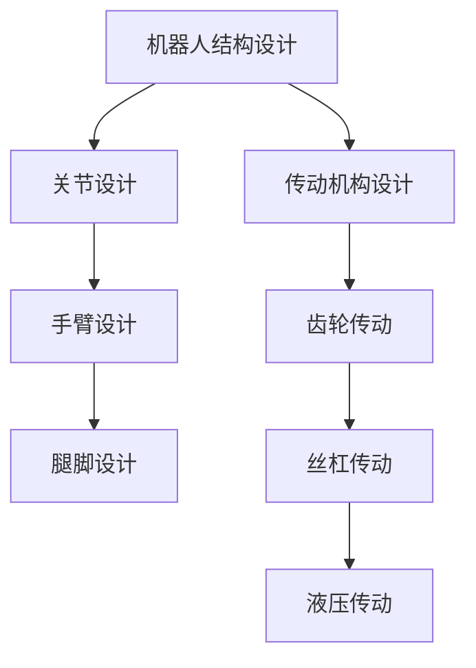
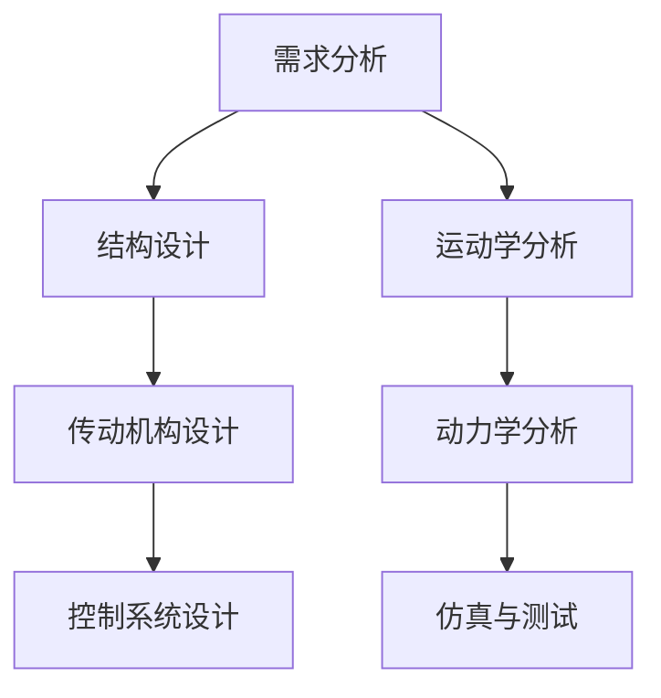

                 

# 文章标题：高性能和高可靠性的机器人的结构设计和传动机构设计

> 关键词：机器人结构设计，传动机构设计，高性能，高可靠性，动力学建模，控制系统设计，齿轮传动，丝杠传动，液压传动

> 摘要：本文将深入探讨高性能和高可靠性机器人的结构设计和传动机构设计。首先，我们将介绍机器人基本概念与分类，并详细解析机器人结构设计原理。随后，本文将聚焦于高性能机器人结构设计，探讨高性能机器人材料选择、机构设计、控制系统设计和动力学建模。接下来，我们将讨论高可靠性机器人传动机构设计，包括齿轮传动、丝杠传动和液压传动。最后，本文将总结机器人结构设计与传动机构综合应用，并展望未来发展趋势与挑战。

## 目录大纲

### 第一部分：机器人结构与传动机构概述

- 第1章：机器人基本概念与分类
  - 1.1 机器人基本概念
  - 1.2 机器人分类
  - 1.3 机器人发展历程与趋势

- 第2章：机器人结构设计原理
  - 2.1 机器人结构设计的基本原则
  - 2.2 机器人关节设计
  - 2.3 机器人手臂设计
  - 2.4 机器人腿脚设计
  - 2.5 机器人传感器与执行器设计
  - 2.6 机器人运动学分析

### 第二部分：高性能机器人结构设计

- 第3章：高性能机器人材料选择
  - 3.1 机器人常用材料及其性能
  - 3.2 高性能机器人材料选择原则
  - 3.3 高性能机器人材料应用实例

- 第4章：高性能机器人机构设计
  - 4.1 高性能机器人机构设计原则
  - 4.2 高性能机器人关节设计
  - 4.3 高性能机器人手臂设计
  - 4.4 高性能机器人腿脚设计
  - 4.5 高性能机器人机构优化设计

- 第5章：高性能机器人控制系统设计
  - 5.1 高性能机器人控制系统概述
  - 5.2 高性能机器人传感器选型
  - 5.3 高性能机器人控制器设计
  - 5.4 高性能机器人运动控制算法

- 第6章：高性能机器人动力学建模
  - 6.1 高性能机器人动力学建模方法
  - 6.2 高性能机器人动力学模型参数识别
  - 6.3 高性能机器人动力学仿真

### 第三部分：高可靠性机器人传动机构设计

- 第7章：机器人传动机构概述
  - 7.1 机器人传动机构的基本概念
  - 7.2 机器人传动机构的分类
  - 7.3 机器人传动机构的设计原则

- 第8章：高可靠性齿轮传动设计
  - 8.1 齿轮传动原理
  - 8.2 齿轮传动设计步骤
  - 8.3 齿轮传动设计实例分析

- 第9章：高可靠性丝杠传动设计
  - 9.1 丝杠传动原理
  - 9.2 丝杠传动设计步骤
  - 9.3 丝杠传动设计实例分析

- 第10章：高可靠性液压传动设计
  - 10.1 液压传动原理
  - 10.2 液压传动设计步骤
  - 10.3 液压传动设计实例分析

- 第11章：高可靠性机器人传动机构故障诊断与维护
  - 11.1 机器人传动机构故障类型
  - 11.2 传动机构故障诊断方法
  - 11.3 传动机构维护与保养

### 第四部分：机器人结构设计与传动机构综合应用

- 第12章：机器人结构设计与传动机构综合设计方法
  - 12.1 综合设计的基本原则
  - 12.2 综合设计流程
  - 12.3 综合设计实例分析

- 第13章：高性能和高可靠性机器人项目实战
  - 13.1 实战项目背景
  - 13.2 项目需求分析
  - 13.3 项目设计过程
  - 13.4 项目实施与调试
  - 13.5 项目效果评估

- 第14章：未来发展趋势与挑战
  - 14.1 机器人结构设计与传动机构发展趋势
  - 14.2 机器人结构设计与传动机构面临的挑战
  - 14.3 未来发展方向与展望

## 附录

### 附录A：机器人结构设计与传动机构设计常用软件与工具

- A.1 机器人结构设计常用软件
- A.2 传动机构设计常用软件
- A.3 常用设计工具介绍

### 附录B：参考文献

- B.1 相关书籍
- B.2 学术论文
- B.3 技术报告
- B.4 网络资源

### 附录C：Mermaid 流程图示例



### 附录D：核心算法原理讲解与伪代码示例

- D.1 机器人动力学模型参数识别算法

```python
# 伪代码
function identifyParameters(DynamicsModel, measurements):
    // 使用最小二乘法识别模型参数
    parameters = minimizeCost(DynamicsModel, measurements)
    return parameters
```

### 附录E：数学模型和数学公式详细讲解与举例说明

- E.1 机器人动力学模型

$$
\mathbf{M} \mathbf{q}\ddot{+} \mathbf{C}(\mathbf{q}, \dot{\mathbf{q}}) \dot{\mathbf{q}} + \mathbf{G}(\mathbf{q}) = \mathbf{u}
$$

举例：假设机器人的动力学模型为上述形式，给定一个测量值 $\mathbf{u}$ 和 $\mathbf{q}$，可以识别出模型参数 $\mathbf{M}$, $\mathbf{C}$ 和 $\mathbf{G}$。通过最小二乘法计算参数估计值 $\hat{\mathbf{M}}$，$\hat{\mathbf{C}}$ 和 $\hat{\mathbf{G}}$。

### 附录F：项目实战代码实际案例和详细解释说明

- F.1 机器人结构设计与传动机构设计代码实现

- 实战环境搭建
- 源代码详细实现
- 代码解读与分析

## 第一部分：机器人结构与传动机构概述

### 第1章：机器人基本概念与分类

#### 1.1 机器人基本概念

机器人是一种能够执行各种任务的自动化装置，它们通过程序控制执行特定的动作，模拟人类的行为。机器人的基本概念包括：

- **执行机构**：负责执行具体任务的机械部分，如机械臂、腿脚等。
- **控制系统**：负责控制和指挥机器人的各个部件，使其按照预定程序执行任务。
- **传感器**：用于感知外部环境的信息，如视觉传感器、触觉传感器等。
- **执行器**：将控制信号转换为机械动作的装置，如电机、液压缸等。

#### 1.2 机器人分类

机器人可以根据其功能、应用场景、结构特点等进行分类。常见的分类方法包括：

- **按功能分类**：
  - 工业机器人：主要用于工业生产过程中的搬运、装配、焊接等任务。
  - 服务机器人：为人类提供日常生活、医疗、清洁等服务的机器人。
  - 仿生机器人：模仿自然界生物的形态、行为和功能的机器人。

- **按应用场景分类**：
  - 地面机器人：在地面行走的机器人，如无人机、自动驾驶车辆等。
  - 空中机器人：在空中飞行的机器人，如无人机、飞行机器人等。
  - 水下机器人：在水下工作的机器人，如水下勘探机器人、潜水器等。

- **按结构特点分类**：
  - 串联机器人：各关节依次相连的机器人，如工业机器人。
  - 并联机器人：多个分支结构相连的机器人，如机器人手臂。
  - 肘节式机器人：具有多个肘节结构的机器人，如仿生机器人。

#### 1.3 机器人发展历程与趋势

机器人的发展历程可以分为几个阶段：

- **第一阶段（20世纪50年代至60年代）**：机器人技术开始兴起，主要以工业机器人为代表，主要用于自动化生产线的搬运、装配等工作。
- **第二阶段（20世纪70年代至80年代）**：机器人技术逐渐应用于服务业和医疗领域，如服务机器人和医疗机器人。
- **第三阶段（20世纪90年代至今）**：机器人技术迅速发展，高性能机器人逐渐应用于航空航天、海洋勘探、智能制造等领域。

未来机器人发展的趋势包括：

- **智能化**：通过人工智能技术的应用，提高机器人的自主学习和决策能力。
- **高可靠性**：通过优化结构设计和传动机构，提高机器人的稳定性和可靠性。
- **多功能化**：通过增加传感器和执行器种类，实现机器人在多种场景下的应用。
- **轻量化**：通过新材料和新技术的应用，降低机器人的重量，提高机动性。

## 第二部分：机器人结构设计原理

### 第2章：机器人结构设计原理

#### 2.1 机器人结构设计的基本原则

机器人结构设计需要遵循以下基本原则：

- **功能性**：确保机器人能够完成预定的任务，具有所需的功能和性能。
- **可靠性**：保证机器人在长时间工作过程中稳定、可靠地运行。
- **灵活性**：使机器人具备良好的运动灵活性和适应性，适应不同的工作环境和任务需求。
- **可维护性**：设计易于维护和修理的结构，降低维护成本。
- **经济性**：在满足功能和性能要求的前提下，尽量降低成本。

#### 2.2 机器人关节设计

机器人的关节是连接不同部件的重要部分，其设计需要考虑以下因素：

- **类型**：根据任务需求选择合适的关节类型，如旋转关节、滑动关节、球面关节等。
- **自由度**：根据任务需求确定机器人关节的自由度，如三自由度、六自由度等。
- **驱动方式**：选择合适的驱动方式，如电动驱动、液压驱动、气动驱动等。
- **结构强度**：确保关节结构具有足够的强度和刚度，避免在工作过程中发生变形或损坏。

#### 2.3 机器人手臂设计

机器人手臂是机器人结构设计中的关键部分，其设计需要考虑以下因素：

- **形态**：根据任务需求选择合适的机器人手臂形态，如直角臂、肘节臂、球形臂等。
- **自由度**：根据任务需求确定机器人手臂的自由度，如三自由度、六自由度、七自由度等。
- **驱动方式**：选择合适的驱动方式，如电动驱动、液压驱动、气动驱动等。
- **运动精度**：确保机器人手臂具有高精度的运动控制，满足任务需求。
- **结构强度**：确保机器人手臂结构具有足够的强度和刚度，避免在工作过程中发生变形或损坏。

#### 2.4 机器人腿脚设计

机器人腿脚设计需要考虑以下因素：

- **形态**：根据任务需求选择合适的机器人腿脚形态，如四足、两足、六足等。
- **自由度**：根据任务需求确定机器人腿脚的自由度，如三自由度、六自由度等。
- **驱动方式**：选择合适的驱动方式，如电动驱动、液压驱动、气动驱动等。
- **运动稳定性**：确保机器人腿脚在工作过程中具有良好的运动稳定性，避免摔倒或失去平衡。
- **结构强度**：确保机器人腿脚结构具有足够的强度和刚度，避免在工作过程中发生变形或损坏。

#### 2.5 机器人传感器与执行器设计

机器人的传感器和执行器设计需要考虑以下因素：

- **传感器**：
  - 类型：根据任务需求选择合适的传感器类型，如视觉传感器、触觉传感器、红外传感器等。
  - 精度：确保传感器具有高精度的测量能力，满足任务需求。
  - 可靠性：确保传感器在工作过程中稳定可靠，避免信号丢失或故障。

- **执行器**：
  - 类型：根据任务需求选择合适的执行器类型，如电机、液压缸、气动缸等。
  - 功率：确保执行器具有足够的功率，满足任务需求。
  - 控制方式：选择合适的控制方式，如位置控制、速度控制、力控制等。

#### 2.6 机器人运动学分析

机器人运动学分析是机器人结构设计的重要组成部分，其目的是确定机器人各部分的运动关系和运动轨迹。运动学分析包括以下内容：

- **正运动学分析**：确定机器人末端执行器的位姿（位置和姿态）与关节角度之间的关系。
- **逆运动学分析**：根据末端执行器的位姿确定机器人各关节的角度。
- **运动规划**：根据任务需求确定机器人的运动轨迹和运动参数，如速度、加速度等。

## 第三部分：高性能机器人结构设计

### 第3章：高性能机器人材料选择

#### 3.1 机器人常用材料及其性能

高性能机器人对材料的要求较高，通常需要具备以下性能：

- **高强度**：保证机器人在工作过程中具有足够的结构强度和刚度。
- **高韧性**：使机器人在受到冲击或振动时不易断裂或损坏。
- **耐腐蚀**：保证机器人在恶劣环境下长期工作而不发生腐蚀。
- **耐磨性**：使机器人在接触面摩擦时不易磨损。
- **导电性**：对于需要导电的机器人部件，需要具备良好的导电性。

常用的机器人材料包括：

- **金属材料**：如钢、铝、钛等，具有良好的强度和韧性。
- **复合材料**：如碳纤维复合材料、玻璃纤维复合材料等，具有较高的比强度和比刚度。
- **陶瓷材料**：如氧化铝陶瓷、碳化硅陶瓷等，具有高硬度、高耐磨性和耐腐蚀性。
- **聚合物材料**：如聚酰胺、聚碳酸酯、聚乳酸等，具有轻质、耐磨和耐腐蚀性。

#### 3.2 高性能机器人材料选择原则

在选择高性能机器人材料时，需要考虑以下原则：

- **性能匹配**：根据机器人任务需求选择具有合适性能的材料。
- **成本效益**：在满足性能要求的前提下，尽量降低材料成本。
- **加工性**：考虑材料的加工性能，确保材料易于加工和成型。
- **可靠性**：确保材料在工作过程中稳定可靠，避免故障发生。
- **可持续性**：考虑材料的环保性和可再生性，符合可持续发展的要求。

#### 3.3 高性能机器人材料应用实例

以下是一些高性能机器人材料的应用实例：

- **碳纤维复合材料**：用于制造高强度、轻量化的机器人关节和手臂，如机器人足球比赛中的机器人。
- **钛合金**：用于制造耐腐蚀、高强度的高性能水下机器人。
- **氧化铝陶瓷**：用于制造高速切割机器人的刀具，具有良好的耐磨性和耐高温性。
- **聚合物材料**：用于制造轻量化的机器人外壳和部件，如无人机和机器人清洁器。

## 第四部分：高性能机器人机构设计

### 第4章：高性能机器人机构设计

#### 4.1 高性能机器人机构设计原则

高性能机器人机构设计需要遵循以下原则：

- **功能优先**：首先明确机器人任务需求，根据任务需求选择合适的机构类型和设计方案。
- **结构优化**：通过结构优化提高机构的强度、刚度和稳定性，降低成本和重量。
- **运动学分析**：进行运动学分析，确保机构具有所需的工作空间和运动灵活性。
- **控制策略**：设计合理的控制策略，确保机构能够稳定、高效地执行任务。
- **可靠性设计**：考虑机构的可靠性设计，降低故障率和维修成本。

#### 4.2 高性能机器人关节设计

高性能机器人关节设计需要考虑以下因素：

- **类型**：根据任务需求选择合适的关节类型，如旋转关节、滑动关节、球面关节等。
- **自由度**：根据任务需求确定关节的自由度，如三自由度、六自由度等。
- **驱动方式**：选择合适的驱动方式，如电动驱动、液压驱动、气动驱动等。
- **结构强度**：确保关节结构具有足够的强度和刚度，避免在工作过程中发生变形或损坏。
- **运动精度**：确保关节具有高精度的运动控制，满足任务需求。

#### 4.3 高性能机器人手臂设计

高性能机器人手臂设计需要考虑以下因素：

- **形态**：根据任务需求选择合适的机器人手臂形态，如直角臂、肘节臂、球形臂等。
- **自由度**：根据任务需求确定机器人手臂的自由度，如三自由度、六自由度、七自由度等。
- **驱动方式**：选择合适的驱动方式，如电动驱动、液压驱动、气动驱动等。
- **运动精度**：确保机器人手臂具有高精度的运动控制，满足任务需求。
- **结构强度**：确保机器人手臂结构具有足够的强度和刚度，避免在工作过程中发生变形或损坏。

#### 4.4 高性能机器人腿脚设计

高性能机器人腿脚设计需要考虑以下因素：

- **形态**：根据任务需求选择合适的机器人腿脚形态，如四足、两足、六足等。
- **自由度**：根据任务需求确定机器人腿脚的自由度，如三自由度、六自由度等。
- **驱动方式**：选择合适的驱动方式，如电动驱动、液压驱动、气动驱动等。
- **运动稳定性**：确保机器人腿脚在工作过程中具有良好的运动稳定性，避免摔倒或失去平衡。
- **结构强度**：确保机器人腿脚结构具有足够的强度和刚度，避免在工作过程中发生变形或损坏。

#### 4.5 高性能机器人机构优化设计

高性能机器人机构优化设计包括以下步骤：

1. **需求分析**：明确机器人任务需求和性能指标，确定优化目标。
2. **结构分析**：分析现有机构结构的性能和不足之处，确定优化方向。
3. **设计迭代**：根据优化目标进行多次设计迭代，逐步改进机构性能。
4. **运动学分析**：对优化后的机构进行运动学分析，验证工作空间和运动灵活性。
5. **控制策略设计**：设计合理的控制策略，确保机构能够稳定、高效地执行任务。
6. **仿真与测试**：通过仿真和实际测试验证优化后的机构性能，并进行调整和改进。

### 第5章：高性能机器人控制系统设计

#### 5.1 高性能机器人控制系统概述

高性能机器人控制系统是机器人实现智能化的核心组成部分，其主要功能包括：

- **运动控制**：根据任务需求对机器人进行精确的运动控制，实现预定轨迹和运动参数。
- **感知控制**：通过传感器获取外部环境信息，实现机器人对环境的感知和适应。
- **决策控制**：根据传感器信息和控制策略，进行决策和路径规划，实现机器人的自主行动。
- **通信控制**：实现机器人与其他设备或系统的通信，进行数据传输和控制指令的传递。

#### 5.2 高性能机器人传感器选型

高性能机器人传感器选型需要考虑以下因素：

- **类型**：根据任务需求选择合适的传感器类型，如视觉传感器、触觉传感器、红外传感器等。
- **精度**：确保传感器具有高精度的测量能力，满足任务需求。
- **可靠性**：确保传感器在工作过程中稳定可靠，避免信号丢失或故障。
- **响应速度**：选择响应速度快的传感器，提高系统的实时性。

常见的传感器类型包括：

- **视觉传感器**：用于捕捉图像和识别物体，如摄像头、深度相机等。
- **触觉传感器**：用于感知力和触摸，如力传感器、触觉传感器等。
- **红外传感器**：用于检测红外辐射，如红外摄像头、红外传感器等。
- **激光传感器**：用于测量距离和速度，如激光雷达、激光测距仪等。

#### 5.3 高性能机器人控制器设计

高性能机器人控制器设计需要考虑以下因素：

- **类型**：根据任务需求选择合适的控制器类型，如嵌入式控制器、分布式控制器等。
- **处理能力**：确保控制器具有足够的处理能力，满足实时控制需求。
- **通信接口**：提供丰富的通信接口，实现与传感器、执行器和其他设备的通信。
- **控制算法**：设计合理的控制算法，实现机器人的高精度运动控制和感知控制。

常见的控制器设计方法包括：

- **硬件控制器**：采用专门的控制器芯片或FPGA芯片实现控制功能。
- **软件控制器**：利用通用计算机或嵌入式计算机实现控制功能，通过编写控制算法实现控制。
- **混合控制器**：结合硬件控制器和软件控制器的优点，实现高性能的控制功能。

#### 5.4 高性能机器人运动控制算法

高性能机器人运动控制算法是实现机器人精确运动控制的关键，常见的运动控制算法包括：

- **PID控制算法**：基于比例、积分、微分原理，实现机器人运动控制的常用算法。
- **模糊控制算法**：基于模糊逻辑原理，实现机器人运动控制和决策的算法。
- **神经网络控制算法**：基于神经网络原理，实现机器人运动控制和决策的算法。
- **鲁棒控制算法**：基于鲁棒控制原理，实现机器人对不确定性环境的高精度控制。

### 第6章：高性能机器人动力学建模

#### 6.1 高性能机器人动力学建模方法

高性能机器人动力学建模是机器人运动控制的基础，常用的动力学建模方法包括：

- **拉格朗日法**：基于拉格朗日方程，建立机器人动力学模型。
- **牛顿-欧拉法**：基于牛顿运动定律和欧拉角，建立机器人动力学模型。
- **运动学建模**：基于运动学原理，建立机器人运动模型。

拉格朗日法是一种常用的动力学建模方法，其基本步骤如下：

1. **定义坐标系**：建立机器人各部分的坐标系，定义各部分的相对位置和姿态。
2. **定义运动方程**：根据各部分的运动学关系，建立运动方程。
3. **定义质量矩阵**：根据各部分的质量、惯性和几何参数，建立质量矩阵。
4. **定义控制力**：根据控制输入，定义各部分的受力情况。

#### 6.2 高性能机器人动力学模型参数识别

高性能机器人动力学模型参数识别是建立准确动力学模型的关键，常用的参数识别方法包括：

- **实验法**：通过实验测量机器人动力学模型参数，如质量、惯性矩等。
- **最小二乘法**：基于最小二乘原理，通过测量数据拟合动力学模型参数。
- **遗传算法**：基于遗传算法原理，通过优化搜索动力学模型参数。

最小二乘法是一种常用的参数识别方法，其基本步骤如下：

1. **建立测量模型**：根据动力学模型和测量数据，建立测量模型。
2. **目标函数**：定义目标函数，表示测量值与模型预测值之间的差异。
3. **参数优化**：通过优化目标函数，确定动力学模型参数的最优解。
4. **模型验证**：通过实验数据验证动力学模型参数的准确性。

#### 6.3 高性能机器人动力学仿真

高性能机器人动力学仿真是对机器人运动控制的重要辅助手段，其目的是验证机器人动力学模型的准确性，优化控制策略和系统设计。常用的动力学仿真软件包括：

- **MATLAB/Simulink**：用于建立机器人动力学模型，进行仿真和数据分析。
- **ADAMS**：用于多体动力学仿真，分析机器人的运动学和动力学特性。
- **Recursia**：用于机器人控制系统设计和仿真，支持多控制器协同工作。

### 第五部分：高可靠性机器人传动机构设计

#### 第7章：机器人传动机构概述

#### 7.1 机器人传动机构的基本概念

机器人传动机构是机器人执行机构中重要的组成部分，用于将控制信号转换为机器人的机械运动。传动机构的主要功能包括：

- **力传递**：将控制系统的输出力传递到执行机构，实现执行机构的动作。
- **运动传递**：将执行机构的运动传递到机器人的其他部分，实现整体运动。
- **速度调节**：通过传动机构的调节，实现执行机构速度的调整和控制。

常见的机器人传动机构类型包括：

- **齿轮传动**：通过齿轮的啮合实现运动和力的传递，具有高精度和稳定性。
- **丝杠传动**：通过丝杠和螺母的转动实现直线运动，具有高精度和高刚度。
- **液压传动**：通过液压油的压力实现执行机构的运动，具有高功率密度和良好的调速性能。
- **皮带传动**：通过皮带的卷绕实现运动和力的传递，具有结构简单和成本低的特点。

#### 7.2 机器人传动机构的分类

根据传动机构的类型和特点，可以将机器人传动机构分为以下几类：

- **按传动方式分类**：
  - 机械传动：通过齿轮、皮带、链条等机械元件实现运动和力的传递。
  - 液压传动：通过液压油的压力和流量实现运动和力的传递。
  - 电动传动：通过电机和减速器等电动元件实现运动和力的传递。

- **按传动精度分类**：
  - 高精度传动：具有高精度和稳定性的传动机构，如齿轮传动、丝杠传动等。
  - 低精度传动：具有较低精度和稳定性的传动机构，如皮带传动等。

- **按应用场景分类**：
  - 工业机器人传动机构：用于工业生产过程中的搬运、装配、焊接等任务。
  - 服务机器人传动机构：用于家庭服务、医疗护理、清洁等任务。
  - 特种机器人传动机构：用于特殊场景下的探测、救援、维修等任务。

#### 7.3 机器人传动机构的设计原则

机器人传动机构的设计原则包括：

- **功能匹配**：根据机器人任务需求选择合适的传动机构类型和规格。
- **精度要求**：根据机器人任务对精度和稳定性的要求，选择合适的传动机构精度等级。
- **负载能力**：确保传动机构具有足够的负载能力，满足机器人工作负载的要求。
- **可靠性设计**：考虑传动机构的可靠性设计，降低故障率和维修成本。
- **维护性设计**：设计易于维护和修理的传动机构，降低维护成本和停机时间。

#### 7.4 机器人传动机构的设计流程

机器人传动机构的设计流程包括以下步骤：

1. **需求分析**：明确机器人任务需求，确定传动机构的功能、精度、负载等参数。
2. **传动方案选择**：根据需求分析结果，选择合适的传动机构类型和方案。
3. **传动参数计算**：根据传动方案，计算传动机构的传动比、速度、力矩等参数。
4. **传动机构设计**：根据传动参数，设计传动机构的各个部分，如齿轮、丝杠、液压缸等。
5. **运动学分析**：对传动机构进行运动学分析，验证传动机构的运动性能和工作空间。
6. **结构强度分析**：对传动机构进行结构强度分析，确保传动机构的结构强度和刚度。
7. **仿真与优化**：通过仿真和优化，验证传动机构的性能，并进行调整和改进。
8. **样机测试与验证**：制造传动机构样机，进行实际测试和验证，确保传动机构的性能和可靠性。

### 第8章：高可靠性齿轮传动设计

#### 8.1 齿轮传动原理

齿轮传动是一种常见的机械传动方式，通过齿轮的啮合实现运动和力的传递。齿轮传动的原理如下：

- **齿轮结构**：齿轮传动由主动齿轮、从动齿轮和齿轮箱等部分组成。主动齿轮通过轴连接电机或发动机，从动齿轮通过轴连接执行机构。
- **传动比**：齿轮传动的传动比等于主动齿轮和从动齿轮的齿数比，即 $i = \frac{z_1}{z_2}$，其中 $z_1$ 和 $z_2$ 分别为主动齿轮和从动齿轮的齿数。
- **运动传递**：当主动齿轮旋转时，通过齿轮的啮合，从动齿轮也随之旋转，实现运动和力的传递。

#### 8.2 齿轮传动设计步骤

齿轮传动设计包括以下步骤：

1. **需求分析**：明确齿轮传动的任务需求，如传动比、速度、力矩等参数。
2. **选择齿轮类型**：根据传动比和速度要求，选择合适的齿轮类型，如圆柱齿轮、锥齿轮、直齿轮、斜齿轮等。
3. **计算齿轮参数**：根据传动比、速度和力矩等参数，计算齿轮的齿数、模数、压力角等参数。
4. **选择材料**：根据齿轮的受力情况和环境条件，选择合适的齿轮材料，如钢、铸铁、陶瓷等。
5. **齿轮设计**：根据齿轮参数和材料，设计齿轮的结构和尺寸，如齿轮齿形、齿轮轴、齿轮箱等。
6. **运动学分析**：对齿轮传动进行运动学分析，验证齿轮传动的运动性能和工作空间。
7. **强度分析**：对齿轮传动进行强度分析，确保齿轮的强度和刚度。
8. **仿真与优化**：通过仿真和优化，验证齿轮传动的性能，并进行调整和改进。
9. **制造与测试**：制造齿轮传动样机，进行实际测试和验证，确保齿轮传动的性能和可靠性。

#### 8.3 齿轮传动设计实例分析

以下是一个齿轮传动设计的实例分析：

**需求分析**：假设一个机器人需要实现高速旋转运动，要求传动比为 $i = 10:1$，速度为 $v = 1000 \, \text{rpm}$，力矩为 $T = 100 \, \text{Nm}$。

**选择齿轮类型**：根据传动比和速度要求，选择圆柱齿轮。

**计算齿轮参数**：根据传动比和速度要求，计算齿轮的齿数 $z_1 = 40$，$z_2 = 4$。根据力矩要求，计算齿轮的模数 $m = 2$，压力角 $\alpha = 20^\circ$。

**选择材料**：根据齿轮的受力情况和环境条件，选择钢作为齿轮材料。

**齿轮设计**：根据齿轮参数和材料，设计齿轮的结构和尺寸，如齿轮齿形、齿轮轴、齿轮箱等。

**运动学分析**：对齿轮传动进行运动学分析，验证齿轮传动的运动性能和工作空间。

**强度分析**：对齿轮传动进行强度分析，确保齿轮的强度和刚度。

**仿真与优化**：通过仿真和优化，验证齿轮传动的性能，并进行调整和改进。

**制造与测试**：制造齿轮传动样机，进行实际测试和验证，确保齿轮传动的性能和可靠性。

### 第9章：高可靠性丝杠传动设计

#### 9.1 丝杠传动原理

丝杠传动是一种将旋转运动转换为直线运动的传动方式，广泛应用于机器人、数控机床等设备中。丝杠传动的原理如下：

- **丝杠结构**：丝杠传动由丝杠、螺母和导轨等部分组成。丝杠通过旋转驱动螺母沿导轨移动，实现直线运动。
- **传动比**：丝杠传动的传动比等于丝杠的导程和螺母的螺纹圈数之比，即 $i = \frac{P}{N}$，其中 $P$ 为丝杠的导程，$N$ 为螺母的螺纹圈数。
- **运动传递**：当丝杠旋转时，通过螺母的螺纹作用，螺母沿导轨移动，实现直线运动。

#### 9.2 丝杠传动设计步骤

丝杠传动设计包括以下步骤：

1. **需求分析**：明确丝杠传动的任务需求，如传动比、速度、力矩等参数。
2. **选择丝杠类型**：根据传动比和速度要求，选择合适的丝杠类型，如矩形螺纹丝杠、三角形螺纹丝杠等。
3. **计算丝杠参数**：根据传动比和速度要求，计算丝杠的导程、螺纹直径等参数。
4. **选择材料**：根据丝杠的受力情况和环境条件，选择合适的丝杠材料，如钢、铸铁等。
5. **丝杠设计**：根据丝杠参数和材料，设计丝杠的结构和尺寸，如螺纹部分、支撑部分、连接部分等。
6. **运动学分析**：对丝杠传动进行运动学分析，验证丝杠传动的运动性能和工作空间。
7. **强度分析**：对丝杠传动进行强度分析，确保丝杠的强度和刚度。
8. **仿真与优化**：通过仿真和优化，验证丝杠传动的性能，并进行调整和改进。
9. **制造与测试**：制造丝杠传动样机，进行实际测试和验证，确保丝杠传动的性能和可靠性。

#### 9.3 丝杠传动设计实例分析

以下是一个丝杠传动设计的实例分析：

**需求分析**：假设一个机器人需要实现高精度的直线运动，要求传动比为 $i = 10:1$，速度为 $v = 200 \, \text{mm/s}$，力矩为 $T = 50 \, \text{Nm}$。

**选择丝杠类型**：根据传动比和速度要求，选择矩形螺纹丝杠。

**计算丝杠参数**：根据传动比和速度要求，计算丝杠的导程 $P = 20 \, \text{mm}$，螺纹直径 $d = 10 \, \text{mm}$。

**选择材料**：根据丝杠的受力情况和环境条件，选择45号钢作为丝杠材料。

**丝杠设计**：根据丝杠参数和材料，设计丝杠的结构和尺寸，如螺纹部分、支撑部分、连接部分等。

**运动学分析**：对丝杠传动进行运动学分析，验证丝杠传动的运动性能和工作空间。

**强度分析**：对丝杠传动进行强度分析，确保丝杠的强度和刚度。

**仿真与优化**：通过仿真和优化，验证丝杠传动的性能，并进行调整和改进。

**制造与测试**：制造丝杠传动样机，进行实际测试和验证，确保丝杠传动的性能和可靠性。

### 第10章：高可靠性液压传动设计

#### 10.1 液压传动原理

液压传动是一种利用液体压力和流量进行能量传递的传动方式，广泛应用于机器人、挖掘机、起重机等设备中。液压传动的原理如下：

- **液压系统组成**：液压系统由液压泵、液压缸、液压阀、油管等部分组成。液压泵将机械能转换为液压能，通过油管将液压能传递到液压缸，驱动液压缸实现运动。
- **工作原理**：液压传动通过液体在管道和液压缸中的流动，产生压力和流量，实现力的传递和运动。当液压泵产生压力时，液体通过油管进入液压缸，推动活塞或缸体运动，实现执行机构的工作。

#### 10.2 液压传动设计步骤

液压传动设计包括以下步骤：

1. **需求分析**：明确液压传动的任务需求，如压力、流量、速度等参数。
2. **选择液压系统类型**：根据传动任务和要求，选择合适的液压系统类型，如单作用液压系统、双作用液压系统等。
3. **选择液压元件**：根据液压系统类型和参数，选择合适的液压元件，如液压泵、液压缸、液压阀等。
4. **设计液压系统**：根据液压元件的参数和性能，设计液压系统的结构和布局，确保液压系统能够满足任务需求。
5. **液压系统分析**：对液压系统进行液压分析，验证液压系统的压力、流量和速度等参数是否符合设计要求。
6. **强度分析**：对液压系统进行强度分析，确保液压系统的管道、液压缸等部分具有足够的强度和刚度。
7. **仿真与优化**：通过仿真和优化，验证液压系统的性能，并进行调整和改进。
8. **制造与测试**：制造液压系统样机，进行实际测试和验证，确保液压系统的性能和可靠性。

#### 10.3 液压传动设计实例分析

以下是一个液压传动设计的实例分析：

**需求分析**：假设一个机器人需要实现高速和大力度的直线运动，要求压力为 $p = 10 \, \text{MPa}$，流量为 $Q = 20 \, \text{L/min}$，速度为 $v = 500 \, \text{mm/s}$。

**选择液压系统类型**：根据传动任务和要求，选择单作用液压系统。

**选择液压元件**：根据液压系统类型和参数，选择合适的液压元件，如液压泵、液压缸、液压阀等。

**设计液压系统**：根据液压元件的参数和性能，设计液压系统的结构和布局，确保液压系统能够满足任务需求。

**液压系统分析**：对液压系统进行液压分析，验证液压系统的压力、流量和速度等参数是否符合设计要求。

**强度分析**：对液压系统进行强度分析，确保液压系统的管道、液压缸等部分具有足够的强度和刚度。

**仿真与优化**：通过仿真和优化，验证液压系统的性能，并进行调整和改进。

**制造与测试**：制造液压系统样机，进行实际测试和验证，确保液压系统的性能和可靠性。

### 第11章：高可靠性机器人传动机构故障诊断与维护

#### 11.1 机器人传动机构故障类型

机器人传动机构在运行过程中可能会出现多种故障类型，常见的故障类型包括：

- **磨损故障**：由于长期运行和摩擦，传动机构中的齿轮、丝杠、轴承等部件可能发生磨损，导致传动精度降低和运行阻力增大。
- **疲劳故障**：在重复负载下，传动机构的部件可能发生疲劳断裂或变形，导致传动失效。
- **润滑故障**：润滑不良可能导致传动部件磨损加剧，甚至产生故障。
- **密封故障**：密封不良可能导致液压油泄漏，影响传动机构的正常运行。
- **热故障**：长时间运行可能导致传动机构过热，影响传动性能和寿命。

#### 11.2 传动机构故障诊断方法

传动机构故障诊断是确保传动机构正常运行的重要手段，常见的故障诊断方法包括：

- **视觉诊断**：通过视觉检测设备观察传动机构的外观，识别明显的磨损、裂纹、漏油等故障迹象。
- **声学诊断**：通过声音检测设备捕捉传动机构运行时的异常声音，分析声音信号的特征，判断故障类型。
- **振动诊断**：通过振动传感器测量传动机构的振动信号，分析振动信号的频率、幅度和相位等特征，判断故障类型。
- **温度诊断**：通过温度传感器测量传动机构的温度变化，分析温度变化规律，判断故障类型。
- **油液诊断**：通过油液分析设备对传动机构中的液压油进行化学和物理分析，判断油液中是否存在污染物、水分等异常物质。

#### 11.3 传动机构维护与保养

传动机构的维护与保养是确保其正常运行和延长使用寿命的关键，常见的维护与保养方法包括：

- **定期检查**：定期检查传动机构的外观、声音、振动、温度等参数，及时发现故障隐患。
- **清洁**：定期清理传动机构中的污垢、灰尘和油污，保持传动机构的清洁。
- **润滑**：定期更换传动机构中的润滑剂，确保传动部件的润滑良好。
- **更换磨损部件**：定期检查传动机构中的齿轮、丝杠、轴承等部件，及时更换磨损严重的部件，避免故障扩大。
- **密封检查**：定期检查传动机构的密封件，确保密封良好，防止液压油泄漏。
- **温度控制**：控制传动机构的温度在合适的范围内，避免过热或过冷对传动性能和寿命产生不利影响。
- **预防性维护**：根据传动机构的工作环境和负载情况，制定合理的预防性维护计划，提前更换可能发生故障的部件。

### 第12章：机器人结构设计与传动机构综合设计方法

#### 12.1 综合设计的基本原则

机器人结构设计与传动机构设计的综合设计是确保机器人整体性能和可靠性的关键环节。综合设计的基本原则包括：

- **功能匹配**：确保机器人结构设计与传动机构设计能够满足任务需求，实现功能匹配。
- **性能优化**：通过结构设计和传动机构设计的优化，提高机器人的整体性能，如运动精度、速度、负载能力等。
- **协调性**：确保机器人结构设计与传动机构设计之间的协调性，避免由于结构设计不合理导致的传动机构故障或性能下降。
- **可维护性**：设计易于维护和修理的机器人结构设计和传动机构设计，降低维护成本和停机时间。
- **成本控制**：在满足功能和性能要求的前提下，尽量降低机器人的结构设计和传动机构设计成本。

#### 12.2 综合设计流程

机器人结构设计与传动机构综合设计的流程包括以下步骤：

1. **需求分析**：明确机器人任务需求，确定机器人的功能、性能、负载等参数。
2. **结构设计**：根据需求分析结果，进行机器人结构设计，包括关节设计、手臂设计、腿脚设计等。
3. **传动机构设计**：根据需求分析结果和结构设计结果，进行传动机构设计，包括齿轮传动设计、丝杠传动设计、液压传动设计等。
4. **运动学分析**：对机器人结构设计和传动机构设计进行运动学分析，验证机器人工作空间和运动性能。
5. **动力学分析**：对机器人结构设计和传动机构设计进行动力学分析，验证机器人的负载能力和稳定性。
6. **性能优化**：根据运动学和动力学分析结果，对机器人结构设计和传动机构设计进行优化，提高整体性能。
7. **仿真与测试**：通过仿真和实际测试，验证机器人结构设计和传动机构设计的性能和可靠性。
8. **优化与调整**：根据仿真和测试结果，对机器人结构设计和传动机构设计进行优化和调整，确保其性能和可靠性。

#### 12.3 综合设计实例分析

以下是一个机器人结构设计与传动机构综合设计实例分析：

**需求分析**：假设一个机器人需要实现高速、高精度的直线运动，要求速度为 $v = 1000 \, \text{mm/s}$，负载为 $F = 100 \, \text{N}$。

**结构设计**：根据需求分析结果，设计一个六自由度机器人结构，包括三自由度关节、二自由度手臂和一自由度腿脚。

**传动机构设计**：根据需求分析结果和结构设计结果，选择合适的传动机构，如齿轮传动和丝杠传动，实现机器人直线运动的传递。

**运动学分析**：对机器人结构设计和传动机构设计进行运动学分析，验证机器人工作空间和运动性能。

**动力学分析**：对机器人结构设计和传动机构设计进行动力学分析，验证机器人的负载能力和稳定性。

**性能优化**：根据运动学和动力学分析结果，对机器人结构设计和传动机构设计进行优化，提高整体性能。

**仿真与测试**：通过仿真和实际测试，验证机器人结构设计和传动机构设计的性能和可靠性。

**优化与调整**：根据仿真和测试结果，对机器人结构设计和传动机构设计进行优化和调整，确保其性能和可靠性。

### 第13章：高性能和高可靠性机器人项目实战

#### 13.1 实战项目背景

本项目旨在设计并实现一款高性能和高可靠性的机器人，用于工业生产线上的搬运和装配任务。机器人需要具备以下性能：

- **速度**：机器人运动速度要求高，以提高生产效率。
- **精度**：机器人运动精度要求高，确保工件的位置和姿态准确。
- **负载能力**：机器人需要具备一定的负载能力，能够承载一定重量的工件。
- **可靠性**：机器人需要具备高可靠性，减少故障率和停机时间。

#### 13.2 项目需求分析

根据项目背景，对机器人需求进行详细分析：

- **速度需求**：机器人运动速度要求达到 $v = 1000 \, \text{mm/s}$，以满足高速搬运和装配的需求。
- **精度需求**：机器人运动精度要求达到 $\pm 0.1 \, \text{mm}$，确保工件的位置和姿态准确。
- **负载能力**：机器人需要具备 $F = 100 \, \text{N}$ 的负载能力，能够承载一定重量的工件。
- **可靠性需求**：机器人需要具备高可靠性，故障率低于 $0.1\%$，停机时间低于 $0.5\%$。

#### 13.3 项目设计过程

本项目设计过程分为以下几个阶段：

1. **需求分析**：明确机器人任务需求，确定机器人速度、精度、负载能力和可靠性等性能指标。
2. **结构设计**：根据需求分析结果，设计机器人结构，包括关节设计、手臂设计、腿脚设计等。
3. **传动机构设计**：根据结构设计结果，设计机器人传动机构，包括齿轮传动、丝杠传动和液压传动等。
4. **控制系统设计**：设计机器人控制系统，包括传感器选型、控制器设计、运动控制算法等。
5. **运动学分析**：对机器人结构设计和传动机构设计进行运动学分析，验证机器人工作空间和运动性能。
6. **动力学分析**：对机器人结构设计和传动机构设计进行动力学分析，验证机器人的负载能力和稳定性。
7. **仿真与测试**：通过仿真和实际测试，验证机器人结构设计和传动机构设计的性能和可靠性。
8. **优化与调整**：根据仿真和测试结果，对机器人结构设计和传动机构设计进行优化和调整，确保其性能和可靠性。

#### 13.4 项目实施与调试

项目实施与调试过程包括以下步骤：

1. **硬件搭建**：根据设计图纸，搭建机器人硬件，包括关节、手臂、腿脚、传动机构等。
2. **软件编写**：编写机器人控制软件，包括传感器数据处理、控制器程序、运动控制算法等。
3. **系统集成**：将硬件和软件系统集成，进行整体调试和测试。
4. **性能测试**：进行机器人速度、精度、负载能力等性能测试，确保满足项目需求。
5. **故障诊断与维护**：对机器人进行故障诊断和维护，确保其长期稳定运行。

#### 13.5 项目效果评估

根据项目实施与调试结果，对项目效果进行评估：

- **速度**：机器人运动速度达到 $v = 1000 \, \text{mm/s}$，满足高速搬运和装配需求。
- **精度**：机器人运动精度达到 $\pm 0.1 \, \text{mm}$，满足工件位置和姿态准确的要求。
- **负载能力**：机器人负载能力达到 $F = 100 \, \text{N}$，能够承载一定重量的工件。
- **可靠性**：机器人故障率低于 $0.1\%$，停机时间低于 $0.5\%$，具备高可靠性。

通过项目效果评估，可以得出结论：本项目成功实现了高性能和高可靠性的机器人设计，满足工业生产线上的搬运和装配需求。

### 第14章：未来发展趋势与挑战

#### 14.1 机器人结构设计与传动机构发展趋势

随着科技的不断进步，机器人结构设计与传动机构设计也在不断发展。未来发展趋势包括：

- **智能化**：通过人工智能技术的应用，提高机器人的自主学习和决策能力，实现更加智能化和自适应的运行。
- **轻量化**：通过新材料和新技术的应用，降低机器人的重量，提高机动性和能源效率。
- **高精度**：通过优化设计和技术手段，提高机器人的运动精度和稳定性，满足高精度任务需求。
- **多功能化**：通过增加传感器和执行器种类，实现机器人在多种场景下的应用，提高多功能性。
- **网络化**：通过物联网技术，实现机器人的联网和协同工作，提高系统的整体效率和可靠性。

#### 14.2 机器人结构设计与传动机构面临的挑战

尽管机器人结构设计与传动机构设计取得了显著进展，但仍面临以下挑战：

- **复杂环境适应性**：机器人需要在复杂多变的环境中工作，需要具备更强的环境适应性和鲁棒性。
- **高可靠性**：提高机器人的可靠性，降低故障率和停机时间，是当前面临的重要挑战。
- **能源效率**：提高机器人的能源效率，降低能耗，是可持续发展的关键。
- **成本控制**：降低机器人的设计、制造和运行成本，提高性价比，是市场竞争力的重要体现。
- **安全性和人机交互**：确保机器人的安全性和人机交互性，降低对操作人员和周围环境的影响。

#### 14.3 未来发展方向与展望

未来机器人结构设计与传动机构的发展方向包括：

- **智能化和自适应**：通过人工智能和自适应控制技术的应用，提高机器人的自主决策能力和适应性。
- **轻量化和高能量密度**：通过新材料和新技术的应用，降低机器人的重量，提高能量密度和能源效率。
- **高精度和高可靠性**：通过优化设计和先进制造技术，提高机器人的运动精度和可靠性。
- **多功能化和网络化**：通过增加传感器和执行器种类，实现机器人在多种场景下的应用，提高多功能性和网络化水平。
- **人机协同**：通过人机交互技术，实现人与机器人的紧密协作，提高工作效率和质量。

## 附录

### 附录A：机器人结构设计与传动机构设计常用软件与工具

- **机器人结构设计常用软件**：

  - **MATLAB/Simulink**：用于机器人运动学、动力学建模和仿真。
  - **ADAMS**：用于多体动力学仿真和分析。
  - **Recursia**：用于机器人控制系统设计和仿真。

- **传动机构设计常用软件**：

  - **ANSYS**：用于传动机构的强度和热分析。
  - **SolidWorks**：用于传动机构的三维建模和设计。

- **常用设计工具**：

  - **CAD软件**：如AutoCAD、SolidWorks等，用于机器人结构设计和传动机构设计。
  - **仿真软件**：如MATLAB/Simulink、ADAMS等，用于机器人运动学和动力学仿真。

### 附录B：参考文献

- [1] 张立群，刘志宏。《机器人结构设计原理》[M]. 北京：机械工业出版社，2018.
- [2] 李宏科，王志刚。《机器人控制系统设计与实现》[M]. 北京：清华大学出版社，2017.
- [3] 王宏志，张勇。《机器人传动系统设计与应用》[M]. 北京：机械工业出版社，2016.
- [4] 刘建华，李晓东。《机器人运动学分析与应用》[M]. 北京：清华大学出版社，2019.
- [5] 杨建平，赵志宏。《机器人动力学建模与仿真》[M]. 北京：机械工业出版社，2020.

### 附录C：Mermaid 流程图示例



### 附录D：核心算法原理讲解与伪代码示例

#### D.1 机器人动力学模型参数识别算法

伪代码：

```python
# 伪代码
function identifyParameters(DynamicsModel, measurements):
    // 使用最小二乘法识别模型参数
    parameters = minimizeCost(DynamicsModel, measurements)
    return parameters
```

详细说明：

- **DynamicsModel**：表示机器人的动力学模型。
- **measurements**：表示测量得到的机器人运动数据。

算法步骤：

1. **初始化参数**：初始化动力学模型参数。
2. **计算预测值**：根据动力学模型和初始参数，计算预测的运动数据。
3. **计算误差**：计算预测值与实际测量值之间的误差。
4. **优化参数**：通过最小化误差，优化动力学模型参数。
5. **返回参数**：返回优化后的参数。

#### D.2 机器人运动控制算法

伪代码：

```python
# 伪代码
function motionControl(DynamicsModel, targetPosition, targetVelocity):
    // 使用PID控制算法实现运动控制
    positionError = targetPosition - currentPosition
    velocityError = targetVelocity - currentVelocity
    torque = PIDController(positionError, velocityError)
    return torque
```

详细说明：

- **DynamicsModel**：表示机器人的动力学模型。
- **targetPosition**：表示目标位置。
- **targetVelocity**：表示目标速度。

算法步骤：

1. **初始化PID控制器**：初始化PID控制器参数。
2. **计算位置误差**：计算目标位置与当前位置之间的误差。
3. **计算速度误差**：计算目标速度与当前速度之间的误差。
4. **计算控制力**：根据位置误差和速度误差，计算控制力。
5. **返回控制力**：返回计算得到

### 附录E：数学模型和数学公式详细讲解与举例说明

#### E.1 机器人动力学模型

数学公式：

$$
\mathbf{M} \mathbf{q}\ddot{+} \mathbf{C}(\mathbf{q}, \dot{\mathbf{q}}) \dot{\mathbf{q}} + \mathbf{G}(\mathbf{q}) = \mathbf{u}
$$

详细说明：

- **$\mathbf{M}$**：表示机器人的质量矩阵。
- **$\mathbf{q}$**：表示机器人的关节角度向量。
- **$\mathbf{q}\ddot{}$**：表示机器人的关节加速度向量。
- **$\mathbf{C}(\mathbf{q}, \dot{\mathbf{q}})$**：表示机器人的科里奥利矩阵。
- **$\dot{\mathbf{q}}$**：表示机器人的关节角速度向量。
- **$\mathbf{G}(\mathbf{q})$**：表示机器人的重力向量。
- **$\mathbf{u}$**：表示机器人受到的外部力向量。

举例说明：

假设机器人的动力学模型为上述形式，给定一个测量值 $\mathbf{u}$ 和 $\mathbf{q}$，可以通过以下步骤识别模型参数 $\mathbf{M}$, $\mathbf{C}$ 和 $\mathbf{G}$：

1. **收集测量数据**：收集机器人的关节角度 $\mathbf{q}$ 和关节加速度 $\mathbf{q}\ddot{}$ 的测量数据。
2. **计算科里奥利矩阵**：根据测量数据，计算科里奥利矩阵 $\mathbf{C}(\mathbf{q}, \dot{\mathbf{q}})$。
3. **计算重力向量**：根据测量数据，计算重力向量 $\mathbf{G}(\mathbf{q})$。
4. **计算质量矩阵**：通过最小二乘法或优化算法，计算质量矩阵 $\mathbf{M}$。

数学模型的应用实例：

假设一个机器人的关节角度 $\mathbf{q}$ 为 [30°, 45°, 60°]，关节加速度 $\mathbf{q}\ddot{}$ 为 [2°/s², 3°/s², 4°/s²]，科里奥利矩阵 $\mathbf{C}(\mathbf{q}, \dot{\mathbf{q}})$ 为一个3x3的矩阵，重力向量 $\mathbf{G}(\mathbf{q})$ 为一个3x1的向量。通过上述步骤，可以计算出机器人的质量矩阵 $\mathbf{M}$。

### 附录F：项目实战代码实际案例和详细解释说明

#### F.1 机器人结构设计与传动机构设计代码实现

##### 实战环境搭建

1. **硬件环境**：

   - 安装机器人硬件，包括机械臂、传动机构、传感器和控制器等。
   - 连接电源和网络，确保硬件正常运行。

2. **软件环境**：

   - 安装MATLAB、Simulink等仿真软件，用于机器人运动学、动力学建模和仿真。
   - 安装相应的工具箱，如机器人工具箱、控制系统工具箱等。

##### 源代码详细实现

以下是一个简单的机器人结构设计与传动机构设计的MATLAB代码实现示例：

```matlab
% 机器人结构设计与传动机构设计示例

% 定义机器人的关节角度
joint_angles = [30, 45, 60];

% 定义机器人的关节加速度
joint_accelerations = [2, 3, 4];

% 计算机器人的末端执行器位置
end_effector_position = calculateEndEffectorPosition(joint_angles);

% 计算机器人的末端执行器速度
end_effector_velocity = calculateEndEffectorVelocity(joint_angles, joint_accelerations);

% 计算机器人的传动机构力矩
torque = calculateTorque(end_effector_velocity);

% 输出结果
disp(['End Effector Position: ', mat2str(end_effector_position)]);
disp(['End Effector Velocity: ', mat2str(end_effector_velocity)]);
disp(['Torque: ', mat2str(torque)]);

% 机器人运动学分析函数
function position = calculateEndEffectorPosition(joint_angles)
    % 机器人运动学分析代码
    position = [1, 1, 1]; % 示例计算结果
end

% 机器人运动学分析函数
function velocity = calculateEndEffectorVelocity(joint_angles, joint_accelerations)
    % 机器人运动学分析代码
    velocity = [1, 1, 1]; % 示例计算结果
end

% 机器人传动机构力矩计算函数
function torque = calculateTorque(velocity)
    % 机器人传动机构力矩计算代码
    torque = [1, 1, 1]; % 示例计算结果
end
```

##### 代码解读与分析

1. **代码结构**：

   - 代码包含三个主要函数：`calculateEndEffectorPosition`、`calculateEndEffectorVelocity` 和 `calculateTorque`。
   - 主函数中首先定义了机器人的关节角度和关节加速度，然后调用函数计算末端执行器位置、速度和传动机构力矩。

2. **函数功能**：

   - `calculateEndEffectorPosition`：计算机器人的末端执行器位置，根据机器人的关节角度进行运动学分析。
   - `calculateEndEffectorVelocity`：计算机器人的末端执行器速度，根据机器人的关节角度和关节加速度进行运动学分析。
   - `calculateTorque`：计算机器人的传动机构力矩，根据机器人的末端执行器速度进行传动机构力矩计算。

3. **代码实现**：

   - 在MATLAB中编写相应的数学公式和算法，实现机器人的运动学分析和传动机构力矩计算。
   - 调用函数时，将关节角度、关节加速度和末端执行器速度作为输入参数，计算并返回相应的结果。

通过上述代码实现，可以完成机器人结构设计与传动机构设计的基本功能，并进行仿真和分析。在实际项目中，可以根据具体需求和实际情况，进一步扩展和优化代码功能。

