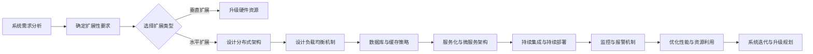

                 

### 文章标题: 高扩展性系统设计的实际案例

> 关键词：高扩展性、系统设计、微服务架构、分布式数据库、缓存策略、性能优化、案例实战

> 摘要：
本文深入探讨高扩展性系统设计的实际案例，包括核心概念、架构设计原则、核心算法原理讲解，以及具体的实战案例分析。文章旨在为读者提供一套系统化的高扩展性系统设计思路和方法，助力解决大型系统在高并发、大数据量环境下的性能和扩展性问题。

### 第一部分：高扩展性系统设计概述

#### 第1章：高扩展性系统设计的核心概念与联系

**1.1 高扩展性系统定义与重要性**

高扩展性系统是指系统能够在满足现有功能和服务质量的前提下，灵活应对用户规模增长、数据量增加等业务需求变化，通过合理的架构设计和优化策略，实现系统性能和资源利用率的提升。

重要性：
- 提高用户体验：确保系统在高负载下仍能保持良好的响应速度和稳定性。
- 支持业务增长：为业务拓展提供强有力的技术支撑，降低扩展成本。
- 提高系统可靠性：通过分布式架构设计，降低单点故障风险。

**1.2 扩展性类型：垂直扩展与水平扩展**

垂直扩展（Scaling Up）：
- 增加硬件资源，如升级CPU、内存、存储等。
- 适用于特定场景，如单机性能瓶颈明显。

水平扩展（Scaling Out）：
- 增加节点数量，通过分布式架构实现负载均衡。
- 适用于大规模分布式系统，如大数据处理、高并发交易等。

**1.3 高扩展性系统架构设计原则**

可伸缩性（Scalability）：
- 系统架构应支持水平扩展，能够根据需求动态增加节点。
- 采用无状态服务设计，确保节点之间独立运行。

可靠性（Reliability）：
- 实现分布式数据一致性，保障系统状态正确。
- 设计容错机制，应对节点故障。

性能（Performance）：
- 采用高效的算法和数据结构，优化系统响应时间。
- 实施负载均衡，提高资源利用率。

可维护性（Maintainability）：
- 模块化设计，降低系统复杂度。
- 实施自动化部署和监控，提高运维效率。

**1.4 Mermaid流程图：高扩展性系统架构设计流程**



#### 第2章：高扩展性系统核心算法原理讲解

**2.1 CAP定理与分布式系统设计**

CAP定理指出，在分布式系统中，一致性（Consistency）、可用性（Availability）和分区容错性（Partition tolerance）三者之间只能同时满足两项。

- 一致性：所有节点在同一时间看到相同的数据。
- 可用性：每个请求都能获得响应，不会无限期阻塞。
- 分区容错性：系统能够在分区网络环境中继续运行。

在实际分布式系统设计中，需要根据业务需求在CAP三者之间进行权衡。

**2.2 分布式一致性算法：Raft与Paxos**

Raft算法是一种简化版的Paxos算法，易于实现和部署。

- Leader选举：通过随机超时机制选举出主节点。
- 日志复制：主节点将日志条目复制到其他节点。
- 一致性保障：通过多数派机制确保一致性。

Paxos算法是一种分布式一致性算法，能够保证在多节点系统中达成一致性协议。

- 准备阶段：提议者提出提案。
- 接收阶段：接受者接收提案并同意。
- 执行阶段：多数派达成一致后执行提案。

**2.3 分布式锁与分布式事务**

分布式锁用于确保分布式系统中的操作顺序正确。

- 基于数据库的分布式锁：通过数据库的唯一索引实现。
- 基于Zookeeper的分布式锁：利用Zookeeper的临时节点特性实现。

分布式事务要求多个分布式操作要么全部成功，要么全部失败。

- 两阶段提交（2PC）: 分为准备阶段和提交阶段，确保事务一致性。
- 三阶段提交（3PC）: 优化2PC的延迟问题，提高系统性能。

**2.4 伪代码：分布式一致性算法实现**

```python
function 分布式一致性算法(){
  // 初始化节点状态
  initialize_node_states()
  
  // 启动选举过程
  start_election()
  
  // 处理日志复制
  handle_log_replication()
  
  // 处理客户端请求
  handle_client_requests()
}
```

**2.5 负载均衡算法：轮询、最少连接、源IP哈希**

负载均衡算法用于分配客户端请求到多个服务器节点。

- 轮询算法：按照顺序将请求分配给服务器。
- 最少连接算法：将请求分配给当前连接数最少的服务器。
- 源IP哈希算法：根据客户端IP地址的哈希值分配请求。

**2.6 缓存一致性机制：MESI协议**

MESI协议是一种用于缓存一致性的协议。

- Modified：缓存行被修改，需要与主内存进行同步。
- Exclusive：缓存行仅存在于缓存中，未修改。
- Shared：缓存行在多个缓存中共享，未被修改。
- Invalid：缓存行无效，需要重新从主内存加载。

**2.7 伪代码：负载均衡算法实现**

```python
function 负载均衡算法(负载均衡策略){
  if(负载均衡策略 == "轮询"){
    return round_robin_load_balancing()
  } else if(负载均衡策略 == "最少连接"){
    return least_connections_load_balancing()
  } else if(负载均衡策略 == "源IP哈希"){
    return source_ip_hash_load_balancing()
  }
}
```

### 第二部分：高扩展性系统设计实战

#### 第3章：高扩展性数据库设计

**3.1 分布式数据库架构设计**

分布式数据库架构分为数据库分片和分布式存储两部分。

- 数据库分片：将数据分散存储在多个节点上，提高查询性能和扩展性。
- 分布式存储：使用分布式文件系统或NoSQL数据库实现数据的存储和访问。

**3.2 数据库分片策略**

- 基于哈希的分片：根据数据的哈希值分配到不同节点。
- 基于范围的分片：根据数据的范围（如时间范围、ID范围）分配到不同节点。
- 基于列表的分片：根据预定义的列表分配到不同节点。

**3.3 分布式事务解决方案**

分布式事务需要解决跨节点数据的一致性问题。

- 二阶段提交：确保分布式操作要么全部成功，要么全部失败。
- 多版本并发控制（MVCC）：允许并发操作，通过版本控制实现数据一致性。

**3.4 伪代码：分布式数据库查询优化**

```python
function 分布式数据库查询优化(查询语句){
  // 分片查询
  shard_queries(查询语句)
  
  // 分布式执行
  distributed_execution(查询结果)
  
  // 合并结果
  merge_results(查询结果)
}
```

#### 第4章：高扩展性缓存策略

**4.1 缓存机制与缓存算法**

缓存机制用于减少数据库访问，提高系统性能。

- 数据缓存：存储常用的数据，减少数据库访问。
- 页面缓存：存储整个页面或页面片段，提高访问速度。

缓存算法包括：

- LRU（Least Recently Used）：最近最少使用算法。
- LFU（Least Frequently Used）：最少使用频率算法。
- FIFO（First In, First Out）：先进先出算法。

**4.2 分布式缓存设计与实现**

分布式缓存系统需要解决数据一致性和负载均衡问题。

- 数据一致性：采用一致性哈希算法分配缓存节点。
- 负载均衡：根据节点负载情况动态调整缓存位置。

**4.3 缓存一致性解决方案**

缓存一致性解决方案包括：

- 基于日志的缓存一致性：通过日志记录修改操作，实现缓存更新。
- 基于版本号的缓存一致性：通过版本号标识数据状态，实现缓存更新。

**4.4 伪代码：分布式缓存更新**

```python
function 分布式缓存更新(缓存键, 缓存值){
  // 检查缓存一致性
  check_cache_consistency(缓存键)
  
  // 更新缓存
  update_cache(缓存键, 缓存值)
  
  // 广播更新消息到其他节点
  broadcast_update_message(缓存键, 缓存值)
}
```

#### 第5章：高扩展性微服务架构设计

**5.1 微服务架构优势与挑战**

微服务架构将系统拆分为多个独立的服务，每个服务负责特定的业务功能。

- 优势：提高系统的可维护性、可扩展性和可复用性。
- 挑战：分布式系统的一致性、服务发现、容错等问题。

**5.2 服务拆分策略**

- 根据业务功能拆分：按照业务需求将系统拆分为多个独立的服务。
- 根据数据访问模式拆分：将具有相同数据访问模式的服务拆分为独立服务。

**5.3 服务发现与注册**

服务发现与注册用于服务之间的动态通信。

- 服务注册：服务启动时向注册中心注册自身信息。
- 服务发现：消费者通过注册中心获取服务实例信息，进行调用。

**5.4 伪代码：微服务调用流程**

```python
function 微服务调用流程(服务名, 参数){
  // 查找服务实例
  service_instance = find_service_instance(服务名)
  
  // 调用服务
  response = call_service(service_instance, 参数)
  
  // 处理响应
  handle_response(response)
}
```

#### 第6章：高扩展性系统性能优化

**6.1 性能分析与监控**

性能分析用于识别系统瓶颈，监控用于实时监测系统性能。

- 性能分析：通过压测工具模拟高并发场景，分析系统性能。
- 监控：采用监控工具实时收集系统指标，如CPU、内存、磁盘使用率等。

**6.2 系统瓶颈识别与优化**

识别系统瓶颈，包括：

- 网络瓶颈：优化网络配置，提高带宽和吞吐量。
- CPU瓶颈：优化代码，减少计算复杂度。
- 内存瓶颈：优化数据结构，减少内存占用。

**6.3 资源调度与负载均衡**

资源调度用于合理分配系统资源，负载均衡用于均衡系统负载。

- 资源调度：采用调度算法，如动态优先级调度，提高资源利用率。
- 负载均衡：采用负载均衡算法，如轮询、最少连接、源IP哈希等，实现流量分配。

**6.4 伪代码：系统性能优化策略**

```python
function 系统性能优化策略(){
  // 性能监控
  monitor_system_performance()
  
  // 瓶颈识别
  identify_system_bottlenecks()
  
  // 调度优化
  optimize_resource_scheduling()
  
  // 负载均衡
  apply_load_balancing()
}
```

#### 第7章：高扩展性系统案例实战

**7.1 案例一：电商系统高扩展性设计**

电商系统需要应对高并发购物车操作、订单处理等场景。

- 架构设计：采用分布式架构，实现服务拆分、数据库分片、缓存策略等。
- 性能优化：采用负载均衡、数据库连接池、缓存预热等技术。

**7.2 案例二：社交网络平台高扩展性设计**

社交网络平台需要处理大规模用户关系、消息推送等场景。

- 架构设计：采用微服务架构，实现服务拆分、分布式存储、缓存策略等。
- 性能优化：采用消息队列、分布式缓存、数据库分片等技术。

**7.3 案例三：游戏平台高扩展性设计**

游戏平台需要处理高并发在线用户、实时数据同步等场景。

- 架构设计：采用分布式架构，实现服务拆分、数据库分片、缓存策略等。
- 性能优化：采用负载均衡、数据库连接池、消息队列等技术。

**7.4 代码实际案例与详细解释说明**

- 案例一：电商系统数据库分片实现

```python
class ECommerceDatabase:
  def shard_key(self, order_id):
    return order_id % 1000
  
  def insert_order(self, order):
    shard_key = self.shard_key(order.order_id)
    # 将订单插入对应的分片数据库
    shard_db.insert(order)
  
  def get_order(self, order_id):
    shard_key = self.shard_key(order_id)
    # 从对应的分片数据库查询订单
    return shard_db.query(order_id)
```

**7.5 开发环境搭建与源代码详细实现**

- 开发环境：搭建分布式数据库、分布式缓存、微服务架构等环境。
- 源代码实现：详细实现分布式数据库分片、分布式缓存一致性、微服务调用流程等。

**7.6 代码解读与分析**

- 代码解读：分析电商系统数据库分片、缓存一致性等实现细节。
- 性能分析：通过性能测试工具分析代码优化效果。

### 附录

#### 附录 A：高扩展性系统设计工具与资源

**A.1 分布式数据库工具对比**

- MongoDB：支持文档存储，易于扩展。
- Cassandra：支持分布式存储，高可用性。
- Redis：支持内存存储，适用于缓存场景。

**A.2 分布式缓存工具对比**

- Memcached：支持分布式缓存，性能高。
- Redis：支持内存存储，功能丰富。
- Hazelcast：支持分布式计算，可扩展性强。

**A.3 微服务框架对比**

- Spring Cloud：基于Spring Boot实现微服务。
- Dubbo：支持RPC调用，适用于服务拆分。
- Kubernetes：支持容器编排，实现自动化部署。

**A.4 性能监控工具对比**

- Prometheus：支持时序数据监控。
- Grafana：支持可视化监控仪表盘。
- Nagios：支持多种监控插件，功能丰富。

**A.5 其他相关工具与资源链接**

- 分布式算法资料：[Raft论文](https://www.cs.ust.hk/~辰峰/raft.pdf)、[Paxos论文](https://www.cs.princeton.edu/courses/archive/spring05/cos518/papers/paxos-sosp.pdf)
- 微服务架构资料：[Spring Cloud官方文档](https://docs.spring.io/spring-cloud/docs/current/reference/html/)
- 分布式数据库资料：[Cassandra官方文档](http://cassandra.apache.org/doc/latest/)

### 作者信息

**作者：AI天才研究院/AI Genius Institute & 禅与计算机程序设计艺术 /Zen And The Art of Computer Programming**

