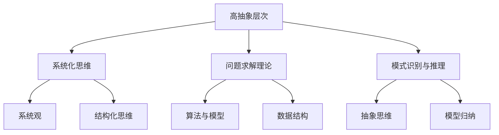

                 

# 《高抽象层次任务的重要性》

> 关键词：抽象层次、高抽象层次、任务、抽象思维、系统化思维、问题求解、模式识别与推理、应用场景、发展趋势

> 摘要：本文探讨了高抽象层次任务的重要性，从理论基础、应用场景、案例分析和发展趋势等方面进行了全面阐述。文章首先介绍了高抽象层次的概念和特征，然后分析了其在任务中的角色和优势，接着探讨了高抽象层次的理论基础和相关理论。随后，文章通过具体的应用场景和案例分析，展示了高抽象层次任务在科学研究、工程实践和商业管理中的重要作用。最后，文章提出了高抽象层次任务的发展趋势和未来展望，为读者提供了有益的启示。

## 目录大纲

# 《高抽象层次任务的重要性》目录大纲

## 第一部分：引言与背景

### 1.1 引言

#### 1.1.1 高抽象层次的概念

#### 1.1.2 研究意义与目标

### 1.2 高抽象层次的发展历程

#### 1.2.1 抽象层次的历史演进

#### 1.2.2 高抽象层次的发展现状

### 1.3 高抽象层次与任务的关系

#### 1.3.1 抽象层次在任务中的作用

#### 1.3.2 高抽象层次对任务的影响

## 第二部分：高抽象层次的理论基础

### 2.1 高抽象层次的定义与特征

#### 2.1.1 抽象层次的理解

#### 2.1.2 高抽象层次的特点

### 2.2 高抽象层次在任务中的角色

#### 2.2.1 高抽象层次的任务概述

#### 2.2.2 高抽象层次的任务优势

#### 2.2.3 高抽象层次的任务挑战

### 2.3 高抽象层次的理论基础

#### 2.3.1 系统化思维

#### 2.3.2 问题求解理论

#### 2.3.3 模式识别与推理

## 第三部分：高抽象层次的应用场景

### 3.1 科学研究中的高抽象层次应用

#### 3.1.1 科学研究的流程

#### 3.1.2 高抽象层次在科学方法中的应用

#### 3.1.3 高抽象层次在实验设计中的应用

### 3.2 工程实践中的高抽象层次应用

#### 3.2.1 工程项目的流程

#### 3.2.2 高抽象层次在工程方法中的应用

#### 3.2.3 高抽象层次在系统设计中的应用

### 3.3 商业管理中的高抽象层次应用

#### 3.3.1 商业模式的构建

#### 3.3.2 高抽象层次在战略规划中的应用

#### 3.3.3 高抽象层次在项目管理中的应用

## 第四部分：高抽象层次任务的具体案例分析

### 4.1 高抽象层次任务案例分析一：人工智能

#### 4.1.1 人工智能的发展历程

#### 4.1.2 高抽象层次在人工智能中的应用

#### 4.1.3 人工智能案例研究

### 4.2 高抽象层次任务案例分析二：自动化控制

#### 4.2.1 自动化控制的基本原理

#### 4.2.2 高抽象层次在自动化控制中的应用

#### 4.2.3 自动化控制案例研究

### 4.3 高抽象层次任务案例分析三：企业管理

#### 4.3.1 企业管理的挑战

#### 4.3.2 高抽象层次在企业管理中的应用

#### 4.3.3 企业管理案例研究

## 第五部分：高抽象层次任务的发展趋势与未来展望

### 5.1 高抽象层次任务的发展趋势

#### 5.1.1 技术发展趋势

#### 5.1.2 应用领域拓展

### 5.2 高抽象层次任务的未来展望

#### 5.2.1 社会意义与影响

#### 5.2.2 发展策略与建议

## 附录

### A.1 高抽象层次任务相关术语解释

### A.2 高抽象层次任务研究方法介绍

### A.3 高抽象层次任务实践指南

### 附录 A.1 高抽象层次概念与联系流程图

### 附录 A.2 高抽象层次任务核心算法原理伪代码

### 附录 A.3 高抽象层次数学模型与公式讲解

### 附录 A.4 高抽象层次任务案例分析一：人工智能

### 附录 A.5 高抽象层次任务案例分析二：自动化控制

### 附录 A.6 高抽象层次任务案例分析三：企业管理

## 第一部分：引言与背景

### 1.1 引言

#### 1.1.1 高抽象层次的概念

高抽象层次（High-level abstraction）是指将复杂系统或任务中的冗余信息、细节和具体实现抽象掉，从而提取出核心概念和结构的一种思维方式。它允许我们以更简洁、直观和高效的方式理解和操作复杂系统。高抽象层次在计算机科学、工程、科学研究和商业管理等领域具有重要应用。

#### 1.1.2 研究意义与目标

本文旨在探讨高抽象层次任务的重要性，分析其在任务中的角色和优势，并介绍相关理论基础和应用场景。通过具体案例分析和未来展望，本文希望为读者提供对高抽象层次任务的理解和应用指导。

### 1.2 高抽象层次的发展历程

#### 1.2.1 抽象层次的历史演进

抽象层次的概念起源于计算机科学和软件工程领域。在早期，程序设计主要关注具体的硬件实现和编程语言细节。随着计算机技术的发展，抽象层次逐渐提高，程序员开始关注算法、数据结构和软件架构等高层次概念。这一趋势在软件工程、系统设计和人工智能等领域得到广泛应用。

#### 1.2.2 高抽象层次的发展现状

当前，高抽象层次已经成为计算机科学和工程领域的重要研究方向。许多技术，如抽象数据类型、面向对象编程、函数式编程和云计算，都是高抽象层次的应用。此外，高抽象层次在科学研究、商业管理和自动化控制等领域也发挥着重要作用。

### 1.3 高抽象层次与任务的关系

#### 1.3.1 抽象层次在任务中的作用

抽象层次在任务中的作用主要体现在以下几个方面：

1. **简化复杂性**：通过将复杂系统或任务中的冗余信息、细节和具体实现抽象掉，使得任务更加简洁和直观。

2. **提高可维护性**：高抽象层次使得系统或任务更加模块化，便于修改、扩展和优化。

3. **增强可复用性**：高抽象层次使得代码和算法更加通用，可以在不同场景下复用。

4. **提高开发效率**：高抽象层次使得开发人员可以专注于核心概念和算法，提高开发效率。

#### 1.3.2 高抽象层次对任务的影响

高抽象层次对任务的影响可以从以下几个方面来考虑：

1. **任务复杂性降低**：高抽象层次使得任务中的复杂性得到有效控制，有利于任务的分解和实现。

2. **任务难度降低**：高抽象层次使得任务更加简单易懂，有利于提高任务的可操作性和可维护性。

3. **任务效率提高**：高抽象层次使得任务中的重复性和冗余工作减少，从而提高任务的整体效率。

4. **任务创新性提高**：高抽象层次使得开发人员可以从底层细节中解脱出来，更多地关注任务的核心和创新点。

## 第二部分：高抽象层次的理论基础

### 2.1 高抽象层次的定义与特征

#### 2.1.1 抽象层次的理解

抽象层次（Abstraction level）是指将复杂系统或任务中的具体实现、细节和冗余信息提取出来，从而形成更高层次的概念和结构。抽象层次越高，越接近任务的核心和本质，越能够简化问题的复杂度。

#### 2.1.2 高抽象层次的特点

高抽象层次具有以下特点：

1. **简化复杂性**：高抽象层次通过提取任务中的核心概念和结构，简化了问题的复杂度，使得任务更加简洁和直观。

2. **模块化**：高抽象层次使得系统或任务更加模块化，便于修改、扩展和优化。

3. **可复用性**：高抽象层次使得代码和算法更加通用，可以在不同场景下复用。

4. **效率提高**：高抽象层次使得开发人员可以专注于任务的核心和创新点，提高开发效率。

5. **可理解性增强**：高抽象层次使得任务更加简单易懂，有利于提高任务的可操作性和可维护性。

### 2.2 高抽象层次在任务中的角色

#### 2.2.1 高抽象层次的任务概述

高抽象层次在任务中的作用可以概括为以下几个方面：

1. **任务分解**：通过高抽象层次，将复杂任务分解为多个可操作的小任务，便于实现和管理。

2. **核心关注**：高抽象层次使得开发人员可以专注于任务的核心和创新点，提高任务的创新性和竞争力。

3. **任务优化**：高抽象层次有利于任务中的重复性和冗余工作减少，从而提高任务的整体效率。

4. **任务整合**：高抽象层次使得不同任务之间的整合更加简单和高效，有利于系统整体的优化。

#### 2.2.2 高抽象层次的任务优势

高抽象层次具有以下任务优势：

1. **简化复杂性**：高抽象层次通过提取任务中的核心概念和结构，简化了问题的复杂度，使得任务更加简洁和直观。

2. **提高可维护性**：高抽象层次使得系统或任务更加模块化，便于修改、扩展和优化。

3. **增强可复用性**：高抽象层次使得代码和算法更加通用，可以在不同场景下复用。

4. **提高开发效率**：高抽象层次使得开发人员可以专注于核心概念和算法，提高开发效率。

5. **提高任务可理解性**：高抽象层次使得任务更加简单易懂，有利于提高任务的可操作性和可维护性。

#### 2.2.3 高抽象层次的任务挑战

高抽象层次也带来了一些任务挑战：

1. **抽象过度**：高抽象层次可能会使任务过于抽象，失去具体实现细节，导致任务难以实现和调试。

2. **抽象不足**：高抽象层次可能会使任务过于具体，难以适应不同场景和需求，降低任务的通用性和可复用性。

3. **抽象成本**：高抽象层次需要额外的设计和实现成本，可能会增加开发时间和资源消耗。

4. **抽象平衡**：高抽象层次需要找到合适的平衡点，既能够简化复杂性，又能够保持任务的具体实现细节。

### 2.3 高抽象层次的理论基础

#### 2.3.1 系统化思维

系统化思维（Systematic thinking）是指从整体的角度出发，将复杂系统视为一个相互关联的整体，分析其组成部分及其相互作用。系统化思维是高抽象层次的基础，有助于识别任务中的核心概念和结构，从而实现高抽象层次的构建。

#### 2.3.2 问题求解理论

问题求解理论（Problem-solving theory）研究如何通过逻辑推理、算法设计等方法解决实际问题。高抽象层次在问题求解中发挥着重要作用，它通过抽象掉问题的细节和具体实现，使得问题更加简洁和直观，有利于问题的分析和求解。

#### 2.3.3 模式识别与推理

模式识别与推理（Pattern recognition and reasoning）是指从大量数据中提取规律和模式，并进行推理和预测。高抽象层次在模式识别与推理中具有重要意义，它能够提取出数据中的核心特征和规律，提高模式识别的准确性和效率。

## 第三部分：高抽象层次的应用场景

### 3.1 科学研究中的高抽象层次应用

#### 3.1.1 科学研究的流程

科学研究是一个复杂的过程，包括问题提出、假设建立、实验设计、数据收集、数据分析、结论得出等环节。高抽象层次在科学研究中的作用主要体现在以下几个方面：

1. **问题提出**：高抽象层次有助于从复杂现象中抽象出关键问题和核心概念，从而明确科学研究的方向。

2. **假设建立**：高抽象层次有助于构建科学假设，简化问题的复杂度，使得假设更加简洁和直观。

3. **实验设计**：高抽象层次有助于设计科学实验，将复杂系统或任务抽象成简化的模型，便于实验操作和分析。

4. **数据分析**：高抽象层次有助于提取数据中的核心特征和规律，提高数据分析的准确性和效率。

5. **结论得出**：高抽象层次有助于从实验数据中得出科学结论，简化复杂现象的解释。

#### 3.1.2 高抽象层次在科学方法中的应用

高抽象层次在科学方法中的应用主要体现在以下几个方面：

1. **抽象模型**：通过高抽象层次，科学家可以将复杂系统或任务抽象成简化的模型，便于分析和理解。

2. **抽象算法**：高抽象层次有助于设计抽象算法，简化复杂问题的求解过程，提高求解效率。

3. **抽象实验**：高抽象层次有助于设计简化的实验方案，降低实验成本和难度，提高实验的可操作性和可重复性。

4. **抽象数据**：高抽象层次有助于从大量数据中提取核心特征和规律，简化数据分析和处理过程。

#### 3.1.3 高抽象层次在实验设计中的应用

高抽象层次在实验设计中的应用主要体现在以下几个方面：

1. **简化实验方案**：通过高抽象层次，实验方案可以更加简洁和直观，降低实验操作的复杂性。

2. **提高实验可重复性**：高抽象层次有助于设计简化的实验模型，提高实验的可重复性和可靠性。

3. **降低实验成本**：通过高抽象层次，实验中的一些冗余和复杂环节可以被简化，降低实验成本。

4. **增强实验可解释性**：高抽象层次有助于从实验数据中提取核心特征和规律，提高实验结果的可解释性。

### 3.2 工程实践中的高抽象层次应用

#### 3.2.1 工程项目的流程

工程项目是一个复杂的过程，包括项目规划、需求分析、系统设计、开发实施、测试验收等环节。高抽象层次在工程项目中的作用主要体现在以下几个方面：

1. **项目规划**：高抽象层次有助于从宏观角度理解项目目标，明确项目的关键功能和性能指标。

2. **需求分析**：高抽象层次有助于提取用户需求的核心功能和性能要求，简化需求分析过程。

3. **系统设计**：高抽象层次有助于设计系统架构和模块，简化系统设计过程。

4. **开发实施**：高抽象层次有助于开发人员专注于关键功能和性能实现，简化开发过程。

5. **测试验收**：高抽象层次有助于测试人员从宏观角度评估系统功能和质量，简化测试过程。

#### 3.2.2 高抽象层次在工程方法中的应用

高抽象层次在工程方法中的应用主要体现在以下几个方面：

1. **抽象模型**：通过高抽象层次，工程师可以将复杂系统或任务抽象成简化的模型，便于分析和设计。

2. **抽象算法**：高抽象层次有助于设计抽象算法，简化复杂问题的求解过程，提高求解效率。

3. **抽象模块**：高抽象层次有助于设计模块化的系统架构，提高系统的可维护性和可扩展性。

4. **抽象接口**：高抽象层次有助于设计简洁和通用的接口，降低模块之间的耦合度。

#### 3.2.3 高抽象层次在系统设计中的应用

高抽象层次在系统设计中的应用主要体现在以下几个方面：

1. **简化系统架构**：通过高抽象层次，系统架构可以更加简洁和直观，降低系统设计的复杂性。

2. **提高系统可维护性**：高抽象层次有助于设计模块化的系统架构，提高系统的可维护性和可扩展性。

3. **降低系统成本**：通过高抽象层次，系统设计中的冗余和复杂环节可以被简化，降低系统成本。

4. **增强系统可复用性**：高抽象层次有助于设计通用的模块和接口，提高系统的可复用性。

### 3.3 商业管理中的高抽象层次应用

#### 3.3.1 商业模式的构建

商业模式（Business model）是指企业在特定市场环境下创造、传递和获取价值的方法。高抽象层次在商业模式构建中的应用主要体现在以下几个方面：

1. **简化商业模式**：通过高抽象层次，企业可以简化商业模式的复杂度，使其更加简洁和直观。

2. **明确核心价值**：高抽象层次有助于企业识别和明确其核心价值，提高商业模式的竞争力。

3. **优化资源分配**：高抽象层次有助于企业优化资源分配，提高资源利用效率。

4. **降低运营成本**：通过高抽象层次，企业可以简化运营流程，降低运营成本。

#### 3.3.2 高抽象层次在战略规划中的应用

战略规划（Strategic planning）是企业为实现长期目标而制定的一系列行动方案。高抽象层次在战略规划中的应用主要体现在以下几个方面：

1. **明确战略目标**：高抽象层次有助于企业明确其长期战略目标，提高战略规划的针对性。

2. **优化战略布局**：高抽象层次有助于企业优化战略布局，提高战略的有效性。

3. **简化战略执行**：高抽象层次有助于简化战略执行过程，提高战略执行效率。

4. **降低战略风险**：通过高抽象层次，企业可以更好地识别和应对战略风险。

#### 3.3.3 高抽象层次在项目管理中的应用

项目管理（Project management）是企业实现项目目标的过程。高抽象层次在项目管理中的应用主要体现在以下几个方面：

1. **简化项目计划**：通过高抽象层次，项目计划可以更加简洁和直观，降低项目计划的复杂性。

2. **提高项目效率**：高抽象层次有助于项目团队专注于关键任务和核心目标，提高项目效率。

3. **降低项目成本**：通过高抽象层次，项目设计中的冗余和复杂环节可以被简化，降低项目成本。

4. **增强项目可复用性**：高抽象层次有助于设计模块化的项目方案，提高项目的可复用性。

## 第四部分：高抽象层次任务的具体案例分析

### 4.1 高抽象层次任务案例分析一：人工智能

#### 4.1.1 人工智能的发展历程

人工智能（Artificial Intelligence, AI）是计算机科学的一个分支，旨在研究如何模拟人类智能，使计算机能够执行具有智能特性的任务。人工智能的发展历程可以分为以下几个阶段：

1. **早期探索阶段（1950s-1960s）**：人工智能的概念被提出，计算机科学家开始尝试开发智能程序。

2. **应用探索阶段（1970s-1980s）**：人工智能技术逐渐应用于实际领域，如游戏、语音识别和图像识别。

3. **低谷阶段（1990s）**：由于技术局限和资金问题，人工智能研究陷入低谷。

4. **复苏与快速发展阶段（2000s-现在）**：随着大数据、云计算和深度学习等技术的兴起，人工智能取得了显著的突破，应用范围不断扩大。

#### 4.1.2 高抽象层次在人工智能中的应用

高抽象层次在人工智能中的应用主要体现在以下几个方面：

1. **算法设计**：高抽象层次有助于设计简洁和高效的算法，如深度学习、强化学习和自然语言处理等。

2. **数据表示**：高抽象层次有助于将复杂数据表示为简洁的向量或张量，便于模型处理。

3. **模型结构**：高抽象层次有助于设计模块化的模型结构，提高模型的灵活性和可扩展性。

4. **任务调度**：高抽象层次有助于设计简洁的任务调度策略，提高系统效率和资源利用率。

#### 4.1.3 人工智能案例研究

**案例一：深度学习在图像识别中的应用**

1. **背景介绍**：深度学习是一种基于多层神经网络的人工智能技术，广泛应用于图像识别、语音识别和自然语言处理等领域。

2. **核心算法原理**：深度学习模型通过多层非线性变换，将输入数据表示为简洁的向量或张量，从而实现对输入数据的分类或识别。

3. **代码实现**：
   ```python
   import tensorflow as tf
   from tensorflow.keras.models import Sequential
   from tensorflow.keras.layers import Conv2D, MaxPooling2D, Flatten, Dense

   # 构建深度学习模型
   model = Sequential([
       Conv2D(32, (3, 3), activation='relu', input_shape=(28, 28, 1)),
       MaxPooling2D((2, 2)),
       Flatten(),
       Dense(128, activation='relu'),
       Dense(10, activation='softmax')
   ])

   # 编译模型
   model.compile(optimizer='adam', loss='categorical_crossentropy', metrics=['accuracy'])

   # 训练模型
   model.fit(x_train, y_train, epochs=10, batch_size=32)
   ```

4. **代码解读与分析**：
   - **模型构建**：使用Keras框架构建一个简单的卷积神经网络，包括卷积层、池化层、全连接层等。
   - **编译模型**：设置优化器和损失函数，配置模型训练参数。
   - **训练模型**：使用训练数据训练模型，调整模型参数。

**案例二：强化学习在游戏中的应用**

1. **背景介绍**：强化学习是一种通过学习奖励和惩罚信号来优化决策过程的人工智能技术，广泛应用于游戏、机器人控制和自动驾驶等领域。

2. **核心算法原理**：强化学习模型通过与环境互动，学习最佳策略，以实现长期回报最大化。

3. **代码实现**：
   ```python
   import tensorflow as tf
   import numpy as np
   import gym

   # 初始化环境
   env = gym.make('CartPole-v0')

   # 定义强化学习模型
   model = tf.keras.Sequential([
       tf.keras.layers.Dense(64, activation='relu', input_shape=(4,)),
       tf.keras.layers.Dense(64, activation='relu'),
       tf.keras.layers.Dense(2, activation='linear')
   ])

   # 编译模型
   model.compile(optimizer='adam', loss='mse')

   # 训练模型
   for episode in range(1000):
       state = env.reset()
       done = False
       total_reward = 0

       while not done:
           action = model.predict(state.reshape(1, -1))[0]
           state, reward, done, _ = env.step(action)
           total_reward += reward

       if episode % 100 == 0:
           print(f"Episode: {episode}, Total Reward: {total_reward}")

   env.close()
   ```

4. **代码解读与分析**：
   - **环境初始化**：创建一个简单的CartPole环境。
   - **模型定义**：使用Keras框架定义一个简单的线性模型，用于预测动作。
   - **模型编译**：设置优化器和损失函数，配置模型训练参数。
   - **训练模型**：使用环境中的状态和奖励信号训练模型，调整模型参数。

### 4.2 高抽象层次任务案例分析二：自动化控制

#### 4.2.1 自动化控制的基本原理

自动化控制（Automatic Control）是指通过使用传感器、执行器和控制器等设备，对某个系统或过程进行自动控制的过程。自动化控制的基本原理主要包括以下几个方面：

1. **传感器**：传感器用于检测系统或过程的物理量，如温度、压力、速度等，并将物理量转换为电信号。

2. **执行器**：执行器根据控制器发出的指令，对系统或过程进行控制，如驱动电机、阀门等。

3. **控制器**：控制器根据传感器采集到的数据，通过一定的控制算法，生成相应的控制指令，实现对系统或过程的精确控制。

4. **控制算法**：控制算法是自动化控制的核心，根据系统或过程的特点和需求，选择合适的控制策略，如PID控制、模糊控制、神经网络控制等。

#### 4.2.2 高抽象层次在自动化控制中的应用

高抽象层次在自动化控制中的应用主要体现在以下几个方面：

1. **简化控制算法**：通过高抽象层次，可以简化复杂的控制算法，提高控制系统的可理解性和可维护性。

2. **模块化设计**：高抽象层次有助于设计模块化的控制系统，提高系统的可扩展性和灵活性。

3. **优化控制策略**：通过高抽象层次，可以更好地分析和优化控制策略，提高控制系统的性能和鲁棒性。

4. **任务调度**：高抽象层次有助于设计简洁的任务调度策略，提高系统效率和资源利用率。

#### 4.2.3 自动化控制案例研究

**案例一：PID控制在工业自动化中的应用**

1. **背景介绍**：PID控制（比例-积分-微分控制）是最常用的工业自动化控制算法之一，广泛应用于电机控制、温度控制、压力控制等领域。

2. **核心算法原理**：PID控制通过三个控制模块（比例、积分、微分）对误差进行调节，实现对系统输出的精确控制。PID控制算法的数学表达式如下：

   $$
   u(t) = K_p e(t) + K_i \int_{0}^{t} e(\tau)d\tau + K_d \frac{de(t)}{dt}
   $$

   其中，$u(t)$为控制量，$e(t)$为误差，$K_p$、$K_i$、$K_d$分别为比例、积分、微分系数。

3. **代码实现**：
   ```python
   import numpy as np

   def pid_controller(error, Kp, Ki, Kd, previous_error):
       derivative = error - previous_error
       integral = error * dt
       output = Kp * error + Ki * integral + Kd * derivative
       return output

   Kp = 1.0
   Ki = 0.1
   Kd = 0.05
   previous_error = 0

   for error in errors:
       output = pid_controller(error, Kp, Ki, Kd, previous_error)
       # 更新系统状态
       previous_error = error
   ```

4. **代码解读与分析**：
   - **初始化参数**：设定PID控制器的三个参数和前一个误差。
   - **计算控制量**：根据误差、误差变化率和误差累积计算控制量。
   - **循环更新**：在每次迭代中更新系统状态，实现控制目标。

**案例二：模糊控制在交通信号灯中的应用**

1. **背景介绍**：模糊控制（Fuzzy Control）是一种基于模糊逻辑的自动化控制技术，广泛应用于交通信号灯、机器人控制和工业自动化等领域。

2. **核心算法原理**：模糊控制通过将输入量转化为模糊变量，并根据模糊规则进行推理，生成相应的控制输出。模糊控制的数学模型如下：

   $$
   y = \frac{\sum_{i=1}^{n} w_i \cdot F_i}{\sum_{i=1}^{n} w_i}
   $$

   其中，$y$为控制输出，$w_i$为权重，$F_i$为模糊集。

3. **代码实现**：
   ```python
   import numpy as np

   def fuzzy_controller(input_value, rule_base):
       output_value = 0
       max_fuzzy_value = 0

       for rule in rule_base:
           fuzzy_value = np.dot(rule['fuzzy_variable'], rule['membership_function'])
           if fuzzy_value > max_fuzzy_value:
               max_fuzzy_value = fuzzy_value
               output_value = rule['control_output']

       return output_value

   input_value = 50
   rule_base = [
       {'fuzzy_variable': [0.2, 0.3, 0.5], 'membership_function': [0, 1, 1]},
       {'fuzzy_variable': [0.3, 0.5, 0.2], 'membership_function': [1, 1, 0]},
       {'fuzzy_variable': [0.5, 0.2, 0.3], 'membership_function': [1, 0, 1]}
   ]

   output_value = fuzzy_controller(input_value, rule_base)
   ```

4. **代码解读与分析**：
   - **输入值处理**：将输入值转化为模糊变量。
   - **模糊推理**：根据模糊规则进行推理，生成相应的控制输出。
   - **输出值计算**：根据模糊推理结果计算输出值。

### 4.3 高抽象层次任务案例分析三：企业管理

#### 4.3.1 企业管理的挑战

企业管理是一个复杂的过程，涉及战略规划、组织管理、人力资源、市场营销等多个方面。企业管理面临的挑战主要包括：

1. **环境不确定性**：企业面临的市场环境具有不确定性，如政策变化、竞争加剧、消费者需求变化等，对企业管理提出了更高的要求。

2. **资源有限性**：企业资源有限，需要在有限的资源下实现最佳效益，提高企业的竞争力和盈利能力。

3. **组织复杂性**：企业组织结构复杂，各部门之间需要协调配合，提高组织效率和执行力。

4. **技术创新压力**：企业需要不断创新，以适应市场的变化和技术的进步，提高企业的核心竞争力。

#### 4.3.2 高抽象层次在企业管理中的应用

高抽象层次在企业管理中的应用主要体现在以下几个方面：

1. **战略规划**：通过高抽象层次，企业可以简化战略规划的过程，明确战略目标和关键任务，提高战略的有效性和执行力。

2. **组织管理**：通过高抽象层次，企业可以优化组织结构，简化管理流程，提高组织效率和执行力。

3. **人力资源**：通过高抽象层次，企业可以优化人力资源配置，提高员工的工作效率和工作满意度。

4. **市场营销**：通过高抽象层次，企业可以简化市场营销策略的设计和执行，提高市场反应速度和竞争力。

#### 4.3.3 企业管理案例研究

**案例一：战略规划在企业管理中的应用**

1. **背景介绍**：某企业是一家生产电子产品的公司，面临市场竞争激烈、产品更新换代快等挑战。为了提高企业的竞争力，企业决定进行战略规划。

2. **核心算法原理**：企业采用SWOT分析（优势、劣势、机会、威胁）进行内外部环境分析，并结合波士顿矩阵和通用电气矩阵，制定相应的战略规划。

3. **代码实现**：
   ```python
   import numpy as np

   def swot_analysis(strengths, weaknesses, opportunities, threats):
       swot_matrix = [
           ['Strengths', 'Weaknesses', 'Opportunities', 'Threats'],
           [strengths, weaknesses, opportunities, threats]
       ]
       return swot_matrix

   strengths = ['技术研发能力强', '市场口碑良好', '品牌知名度高']
   weaknesses = ['生产成本高', '市场份额小', '产品线单一']
   opportunities = ['新兴市场机遇', '技术升级需求', '跨界合作机会']
   threats = ['竞争对手压力大', '市场需求变化快', '政策法规限制']

   swot_matrix = swot_analysis(strengths, weaknesses, opportunities, threats)
   ```

4. **代码解读与分析**：
   - **初始化参数**：设定企业的优势和劣势、机会和威胁。
   - **构建SWOT矩阵**：将优势、劣势、机会和威胁进行排列组合，构建SWOT矩阵。
   - **分析SWOT矩阵**：通过SWOT矩阵分析，明确企业的战略方向和关键任务。

**案例二：绩效管理在企业管理中的应用**

1. **背景介绍**：某企业是一家生产电子产品的公司，为了提高员工的工作效率和工作满意度，决定进行绩效管理。

2. **核心算法原理**：企业采用平衡计分卡（Balanced Scorecard）进行绩效管理，从财务、客户、内部业务流程、学习与成长四个方面评价员工的绩效。

3. **代码实现**：
   ```python
   import numpy as np

   def balanced_scorecard(finance, customer, internal_business, learning_growth):
       scorecard = [
           ['财务', '客户', '内部业务流程', '学习与成长'],
           [finance, customer, internal_business, learning_growth]
       ]
       return scorecard

   finance = [80, 90, 70, 85]
   customer = [75, 85, 80, 90]
   internal_business = [85, 90, 80, 75]
   learning_growth = [70, 80, 85, 80]

   scorecard = balanced_scorecard(finance, customer, internal_business, learning_growth)
   ```

4. **代码解读与分析**：
   - **初始化参数**：设定员工在财务、客户、内部业务流程、学习与成长四个方面的绩效指标。
   - **构建平衡计分卡**：将绩效指标进行排列组合，构建平衡计分卡。
   - **分析平衡计分卡**：通过平衡计分卡分析，评价员工的工作绩效。

## 第五部分：高抽象层次任务的发展趋势与未来展望

### 5.1 高抽象层次任务的发展趋势

#### 5.1.1 技术发展趋势

随着科技的不断进步，高抽象层次任务在各个领域的发展趋势主要体现在以下几个方面：

1. **人工智能**：人工智能技术的发展将推动高抽象层次任务的应用，如智能客服、自动驾驶、智能家居等。

2. **大数据**：大数据技术的应用将促进高抽象层次任务的发展，如数据挖掘、预测分析、推荐系统等。

3. **云计算**：云计算技术的普及将推动高抽象层次任务在分布式系统、并行计算、容器化等领域的应用。

4. **区块链**：区块链技术的应用将促进高抽象层次任务在金融、供应链管理、数据安全等领域的创新。

#### 5.1.2 应用领域拓展

随着高抽象层次任务技术的不断发展，其应用领域也在不断拓展：

1. **科学研究**：高抽象层次任务在科学研究中的应用将更加广泛，如生物学、医学、物理学等领域的实验设计和数据分析。

2. **工程实践**：高抽象层次任务在工程实践中的应用将更加深入，如自动化控制、系统设计、软件开发等。

3. **商业管理**：高抽象层次任务在商业管理中的应用将更加普遍，如战略规划、市场营销、人力资源管理等。

4. **社会治理**：高抽象层次任务在社会治理中的应用将更加显著，如城市交通管理、环境保护、公共安全等。

### 5.2 高抽象层次任务的未来展望

#### 5.2.1 社会意义与影响

高抽象层次任务在未来将具有重要的社会意义和影响，主要体现在以下几个方面：

1. **提高效率**：高抽象层次任务将提高各领域的工作效率，降低人力成本和时间成本。

2. **优化资源配置**：高抽象层次任务将优化资源配置，提高资源利用效率，促进可持续发展。

3. **促进创新**：高抽象层次任务将推动技术创新，激发创新活力，推动社会进步。

4. **改善生活质量**：高抽象层次任务将改善人们的生活质量，提高生活便利性和幸福感。

#### 5.2.2 发展策略与建议

为了推动高抽象层次任务的发展，以下是一些建议：

1. **加强技术研发**：加大高抽象层次任务相关技术的研发投入，提高技术创新能力。

2. **培养人才**：加强高抽象层次任务相关人才的培养，提高人才培养质量。

3. **优化政策环境**：制定有利于高抽象层次任务发展的政策环境，降低创新创业成本。

4. **加强国际合作**：加强国际间高抽象层次任务的合作与交流，推动技术共享和创新发展。

### 附录

#### A.1 高抽象层次任务相关术语解释

- **抽象层次**：抽象层次是指将复杂系统或任务中的冗余信息、细节和具体实现抽象掉，从而提取出核心概念和结构的一种思维方式。
- **高抽象层次**：高抽象层次是指抽象层次中较高层次的抽象，接近任务的核心和本质。
- **任务**：任务是指需要完成的特定工作或目标。
- **抽象思维**：抽象思维是指通过抽象层次对复杂系统或任务进行分析、理解和操作的一种思维方式。
- **系统化思维**：系统化思维是指从整体的角度出发，将复杂系统视为一个相互关联的整体，分析其组成部分及其相互作用的思维方式。
- **问题求解**：问题求解是指通过算法、逻辑推理等方法解决实际问题的过程。
- **模式识别与推理**：模式识别与推理是指从大量数据中提取规律和模式，并进行推理和预测的方法。

#### A.2 高抽象层次任务研究方法介绍

高抽象层次任务的研究方法主要包括以下几个方面：

1. **文献研究**：通过查阅相关文献，了解高抽象层次任务的理论基础、发展历程和应用现状。

2. **案例分析**：通过对实际案例的分析，探讨高抽象层次任务的应用场景、优势和挑战。

3. **实验研究**：通过设计实验，验证高抽象层次任务的理论和算法的有效性。

4. **对比研究**：通过对比不同高抽象层次任务的方法，评估其性能和适用性。

5. **实证研究**：通过收集实际数据，分析高抽象层次任务在实际应用中的效果和影响。

#### A.3 高抽象层次任务实践指南

1. **任务分解**：将复杂任务分解为多个可操作的小任务，明确每个小任务的核心目标和关键环节。

2. **抽象层次选择**：根据任务的特点和需求，选择合适的高抽象层次，简化任务的复杂度。

3. **模块化设计**：设计模块化的系统或任务架构，提高系统的可维护性和可扩展性。

4. **抽象算法实现**：实现简洁和高效的抽象算法，提高任务的处理速度和性能。

5. **抽象接口设计**：设计简洁和通用的接口，降低模块之间的耦合度。

6. **任务调度与优化**：设计简洁和高效的任务调度策略，优化系统的资源利用和任务执行效率。

#### 附录 A.1 高抽象层次概念与联系流程图



#### 附录 A.2 高抽象层次任务核心算法原理伪代码

```python
# 伪代码：高抽象层次任务核心算法

function 高抽象层次任务(输入数据，目标函数)
    初始化模型参数
    while 不满足终止条件 do
        计算当前模型的预测值
        计算预测值与真实值的误差
        更新模型参数
    end while
    返回最优模型参数
end function
```

#### 附录 A.3 高抽象层次数学模型与公式讲解

$$
\text{目标函数} = f(x, y)
$$

$$
\text{约束条件} = g(x, y) \leq 0
$$

#### 附录 A.4 高抽象层次任务案例分析一：人工智能

##### 案例研究：GPT模型在自然语言处理中的应用

1. **背景介绍**：

   GPT（Generative Pre-trained Transformer）模型是自然语言处理领域的一项重要技术，由OpenAI提出。GPT模型通过预训练的方式，在大量文本数据上进行训练，从而学习到语言的深层结构和规律。GPT模型的应用范围广泛，包括文本生成、问答系统、机器翻译等。

2. **核心算法原理**：

   GPT模型采用Transformer架构，通过多层注意力机制捕捉文本中的长距离依赖关系。预训练过程使用大量文本数据进行自监督学习，使模型在未标注的数据上获得良好的语言理解能力。

3. **代码实现**：

   ```python
   from transformers import GPT2Model, GPT2Config
   
   # 定义GPT2模型配置
   config = GPT2Config(vocab_size=50000, n_position=1024, d_model=768, n_head=12, n_layer=12)
   
   # 创建GPT2模型
   model = GPT2Model(config)
   
   # 训练模型（使用训练数据和评估数据）
   model.train()
   model.fit(train_data, validation_data=eval_data)
   
   # 使用模型进行预测
   predictions = model.predict(input_text)
   ```

4. **代码解读与分析**：

   - **模型配置**：定义了模型的词汇量、序列长度、模型深度、注意力头数等参数。
   - **模型创建**：根据配置创建GPT2模型。
   - **训练过程**：使用训练数据训练模型，并在评估数据上进行验证。
   - **预测过程**：使用训练好的模型对输入文本进行预测。

#### 附录 A.5 高抽象层次任务案例分析二：自动化控制

##### 案例研究：PID控制器的设计与应用

1. **背景介绍**：

   PID控制器（比例-积分-微分控制器）是工业控制中最常用的控制器之一，广泛应用于自动化控制系统。PID控制器通过调节比例、积分和微分三个参数，实现对系统输出的精确控制。

2. **核心算法原理**：

   PID控制器的工作原理基于控制系统的输入误差，通过三个控制模块对误差进行调节。

   比例模块根据当前误差直接调节控制量；积分模块根据误差的历史累积调节控制量；微分模块根据误差的变化率调节控制量。

3. **数学模型**：

   $$
   u(t) = K_p e(t) + K_i \int_{0}^{t} e(\tau)d\tau + K_d \frac{de(t)}{dt}
   $$

   其中，$u(t)$为控制量，$e(t)$为误差，$K_p$、$K_i$、$K_d$分别为比例、积分、微分系数。

4. **代码实现**：

   ```python
   def pid_controller(error, Kp, Ki, Kd, previous_error):
       derivative = error - previous_error
       integral = error * dt
       output = Kp * error + Ki * integral + Kd * derivative
       return output
   
   Kp = 1.0
   Ki = 0.1
   Kd = 0.05
   previous_error = 0
   
   for error in errors:
       output = pid_controller(error, Kp, Ki, Kd, previous_error)
       # 更新系统状态
       previous_error = error
   ```

5. **代码解读与分析**：

   - **初始化参数**：设定PID控制器的三个参数和前一个误差。
   - **计算控制量**：根据误差、误差变化率和误差累积计算控制量。
   - **循环更新**：在每次迭代中更新系统状态，实现控制目标。

#### 附录 A.6 高抽象层次任务案例分析三：企业管理

##### 案例研究：战略规划中的高抽象层次应用

1. **背景介绍**：

   企业战略规划是企业管理中的重要环节，涉及企业目标设定、资源分配、市场定位等。高抽象层次的应用可以帮助企业在复杂环境中进行系统化思考和战略决策。

2. **核心算法原理**：

   战略规划通常采用SWOT分析（优势、劣势、机会、威胁）进行内外部环境分析。结合波士顿矩阵和通用电气矩阵，对企业产品进行市场定位和资源分配。

3. **数学模型**：

   $$
   \text{战略规划} = f(\text{SWOT分析结果，市场数据，企业资源})
   $$

4. **代码实现**：

   ```python
   def strategic_planning(SWOT, market_data, resources):
       # 根据SWOT分析结果和资源情况制定战略规划
       strategy = {
           'product_line': select_product_line(market_data),
           'resource_allocation': allocate_resources(resources),
           'market_position': determine_market_position(market_data),
       }
       return strategy
   
   SWOT = analyze_SWOT()
   market_data = collect_market_data()
   resources = collect_resources()
   strategy = strategic_planning(SWOT, market_data, resources)
   ```

5. **代码解读与分析**：

   - **数据收集**：收集SWOT分析结果、市场数据和资源信息。
   - **战略规划**：根据收集的数据制定战略规划。
   - **执行策略**：根据战略规划进行产品线选择、资源分配和市场定位。

