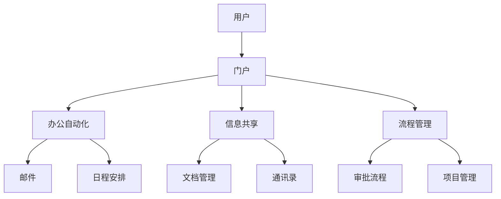
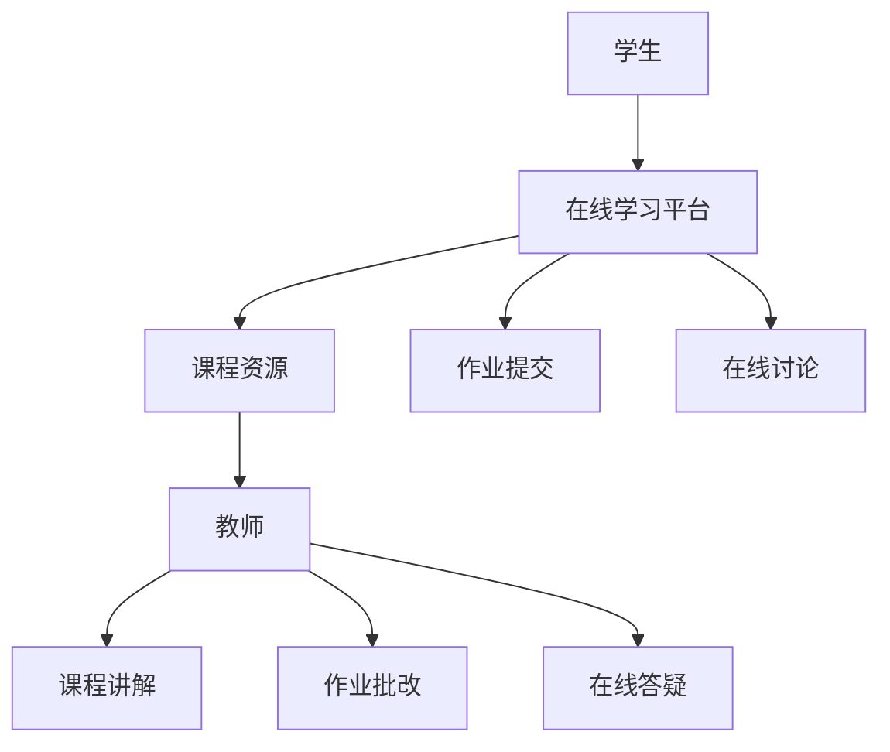
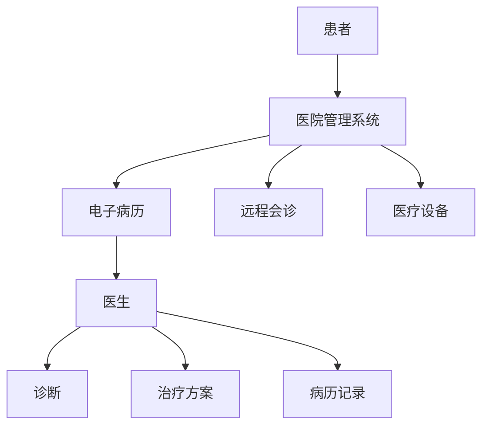
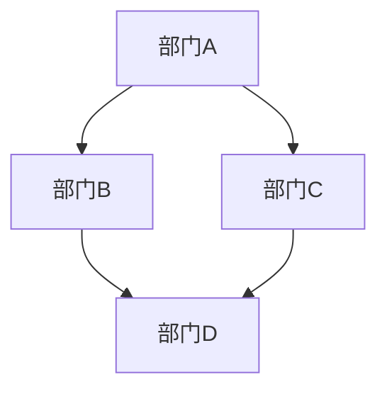
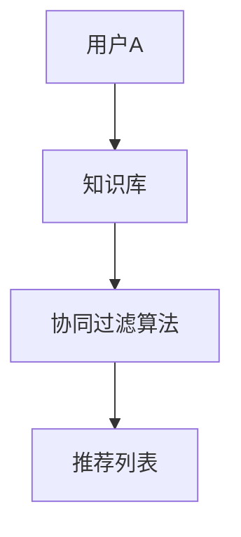
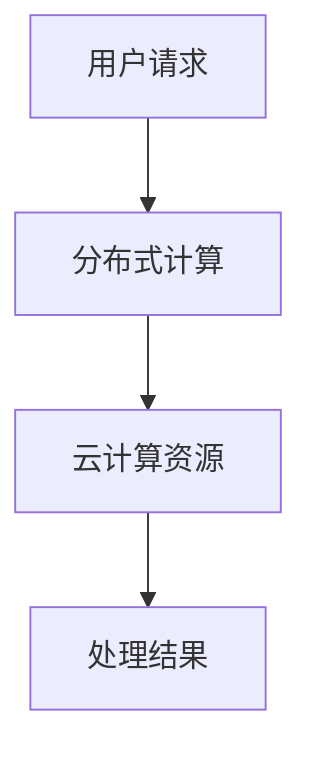
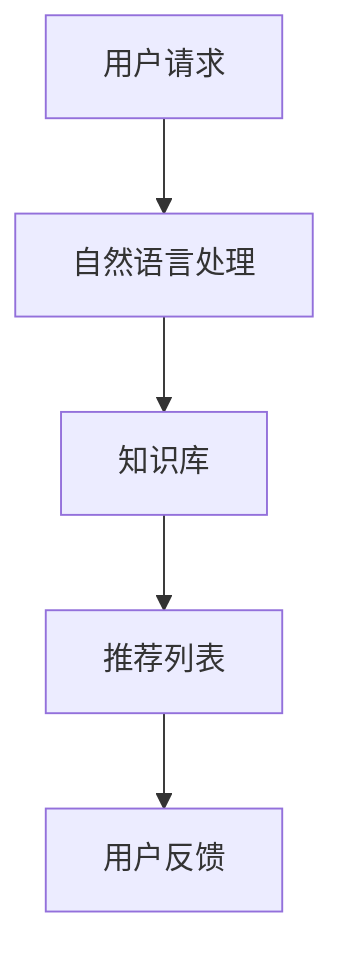
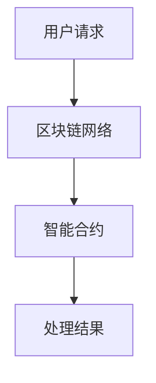
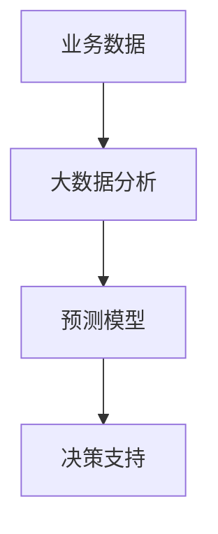

                 

### 文章标题

# 高效协同模式的未来展望

> 关键词：高效协同模式、未来展望、信息技术、协同办公、人工智能、区块链、大数据分析、教育领域、医疗行业、国际合作

> 摘要：本文将深入探讨高效协同模式的基础概念、技术原理、挑战与应对策略，以及在不同领域的应用现状和未来发展趋势。通过分析高效协同模式在企业管理、教育领域和医疗行业的具体实践案例，本文旨在为读者提供一个全面而系统的视角，以了解和预见高效协同模式在未来的发展前景。

### 《高效协同模式的未来展望》目录大纲

#### 第一部分: 高效协同模式的基础理解

**第1章: 高效协同模式概述**

- 1.1 高效协同模式的概念
- 1.1.1 协同与高效协同的定义
- 1.1.2 高效协同的背景与意义
- 1.1.3 高效协同与传统协作的区别

- 1.2 高效协同模式的核心要素
- 1.2.1 信息共享
- 1.2.2 决策协同
- 1.2.3 资源整合
- 1.2.4 文化融合

- 1.3 主流高效协同模式案例分析
- 1.3.1 企业级协同办公系统
- 1.3.2 教育领域的协同教学模式
- 1.3.3 医疗行业的协同诊疗模式

**第2章: 高效协同模式的原理与技术**

- 2.1 高效协同模式的原理分析
- 2.1.1 社会网络分析
- 2.1.2 协同过滤算法
- 2.1.3 分布式计算与云计算

- 2.2 高效协同技术实践
- 2.2.1 人工智能在协同模式中的应用
- 2.2.2 区块链技术在协同模式中的应用
- 2.2.3 大数据分析与协同决策

**第3章: 高效协同模式的挑战与应对**

- 3.1 协同模式面临的挑战
- 3.1.1 信息安全问题
- 3.1.2 技术适应性挑战
- 3.1.3 组织文化冲突

- 3.2 应对策略与实践
- 3.2.1 增强信息安全性
- 3.2.2 提升技术适应性
- 3.2.3 构建协同文化

#### 第二部分: 高效协同模式在不同领域的应用

**第4章: 高效协同模式在企业管理中的应用**

- 4.1 企业管理中的协同模式
- 4.1.1 企业管理协同框架
- 4.1.2 项目管理与协同
- 4.1.3 人力资源管理协同

- 4.2 案例研究：某大型企业的协同管理实践
- 4.2.1 案例背景
- 4.2.2 协同管理实施过程
- 4.2.3 协同管理效果评估

**第5章: 教育领域的协同教学模式**

- 5.1 教育协同模式概述
- 5.1.1 教育协同模式的发展
- 5.1.2 教育协同模式的核心要素

- 5.2 协同教学实践
- 5.2.1 翻转课堂与协作学习
- 5.2.2 教育云平台与资源共享
- 5.2.3 教育协同评价体系

- 5.3 案例研究：某学校教育协同模式的实践
- 5.3.1 案例背景
- 5.3.2 协同教学模式实施
- 5.3.3 教学效果分析

**第6章: 高效协同模式在医疗行业的应用**

- 6.1 医疗协同模式概述
- 6.1.1 医疗协同模式的发展
- 6.1.2 医疗协同模式的核心要素

- 6.2 医疗协同实践
- 6.2.1 医疗信息化建设
- 6.2.2 医疗资源共享与协同诊疗
- 6.2.3 智能医疗设备的应用

- 6.3 案例研究：某医疗机构医疗协同模式的实践
- 6.3.1 案例背景
- 6.3.2 医疗协同模式实施
- 6.3.3 医疗协同效果评估

**第7章: 高效协同模式的未来发展**

- 7.1 高效协同模式的未来趋势
- 7.1.1 技术发展趋势
- 7.1.2 社会应用前景
- 7.1.3 潜在挑战与应对策略

- 7.2 案例研究：高效协同模式在国际合作中的实践
- 7.2.1 案例背景
- 7.2.2 国际合作中的协同模式
- 7.2.3 协同模式的效果与启示

**参考文献**

- [此处列出参考文献]

### 第一部分: 高效协同模式的基础理解

#### 第1章: 高效协同模式概述

##### 1.1 高效协同模式的概念

高效协同模式是指通过信息共享、决策协同、资源整合和文化融合，实现组织内部及跨组织之间的高效合作与资源共享。其核心理念是充分利用信息技术和先进管理理念，最大化协同效应，提高组织整体运作效率。

**协同**，即共同合作，是指多个个体或组织通过协作实现共同目标。而**高效协同**则强调在协同过程中，通过科学的方法和工具，实现资源的最优配置和信息的快速流通，从而提高整体效能。

**高效协同的背景与意义**

随着信息技术的发展，企业和组织面临的信息量和业务复杂性不断增加。传统的单一职能式管理模式已经无法满足高效协同的需求。高效协同模式的出现，旨在应对以下背景和意义：

1. **全球化竞争**：全球化背景下，企业需要与全球伙伴和客户进行高效协同，以快速响应市场变化。
2. **业务多样化**：企业业务日益复杂，需要不同部门、团队之间紧密协作，实现业务流程的顺畅。
3. **技术创新**：高效协同模式可以充分利用信息技术，如云计算、大数据、人工智能等，提升协作效率。
4. **人才管理**：高效协同模式有助于企业挖掘和利用内部人才资源，实现人才的最大化价值。

**高效协同与传统协作的区别**

- **协作**：传统协作通常是指同一组织中不同个体或部门之间的简单合作，缺乏系统化和标准化。
- **高效协同**：高效协同则强调系统化、标准化的协作流程，通过信息共享、资源整合和文化融合，实现高效运作。

##### 1.2 高效协同模式的核心要素

高效协同模式包含多个核心要素，以下是对这些要素的详细解释：

**1.2.1 信息共享**

信息共享是高效协同的基础。通过建立统一的信息平台，使组织内部及跨组织之间的信息能够快速流通和共享，提高决策的准确性和效率。信息共享的关键在于保证信息的及时性、准确性和完整性。

**1.2.2 决策协同**

决策协同强调在组织内部及跨组织之间，通过科学的方法和工具，实现决策的协同。这包括建立统一的决策流程、明确决策权责和优化决策机制，以确保决策的科学性和高效性。

**1.2.3 资源整合**

资源整合是指通过整合组织内部及跨组织的资源，实现资源的最优配置。这包括人力资源、财务资源、技术资源和物资资源等。资源整合有助于提高组织整体运作效率，降低成本。

**1.2.4 文化融合**

文化融合是指通过建立共同的价值观和行为准则，促进组织内部及跨组织之间的文化认同和协同。文化融合有助于增强团队的凝聚力，提高协作效率。

##### 1.3 主流高效协同模式案例分析

**1.3.1 企业级协同办公系统**

企业级协同办公系统是高效协同模式在企业管理中的具体应用。通过集成办公自动化、信息共享、流程管理等功能，实现企业内部高效协作。以下是一个典型的企业级协同办公系统架构图：



**1.3.2 教育领域的协同教学模式**

教育领域的协同教学模式旨在通过信息技术，实现教师与学生、学生与学生之间的协同学习。以下是一个典型的教育协同教学模式框架：



**1.3.3 医疗行业的协同诊疗模式**

医疗行业的协同诊疗模式通过医疗信息化系统和智能医疗设备，实现医生之间、医生与患者之间的协同诊疗。以下是一个典型的医疗协同诊疗模式架构：



### 第2章: 高效协同模式的原理与技术

#### 2.1 高效协同模式的原理分析

高效协同模式的原理主要涉及社会网络分析、协同过滤算法和分布式计算与云计算。这些原理为高效协同提供了理论基础和技术支持。

**2.1.1 社会网络分析**

社会网络分析（SNA）是研究社会结构和社会关系的数学工具。在高效协同模式中，社会网络分析可以帮助组织了解内部及跨组织之间的关系网络，从而优化协作流程。

**社会网络分析的步骤：**

1. **网络定义**：确定分析对象及其相互关系。
2. **网络测量**：计算网络中节点的度、介数、紧密程度等指标。
3. **网络可视化**：通过图形化方式展示网络结构，帮助组织了解协作关系。

**案例：企业内部协作网络分析**

以下是一个企业内部协作网络的 Mermaid 流程图：



在这个例子中，部门A、B、C、D通过协作关系形成一个协作网络。通过社会网络分析，可以识别关键节点和协作瓶颈，优化协作流程。

**2.1.2 协同过滤算法**

协同过滤算法是推荐系统中的核心技术，通过分析用户的行为和偏好，为用户推荐感兴趣的内容。在高效协同模式中，协同过滤算法可以用于知识共享和资源推荐。

**协同过滤算法的步骤：**

1. **用户行为分析**：收集用户的行为数据，如访问记录、收藏记录等。
2. **相似度计算**：计算用户之间的相似度，通常使用余弦相似度、皮尔逊相关系数等方法。
3. **推荐生成**：基于相似度计算，生成推荐列表，为用户提供感兴趣的内容。

**案例：企业内部知识共享系统**

以下是一个企业内部知识共享系统的 Mermaid 流程图：



在这个例子中，用户A通过协同过滤算法从知识库中获取感兴趣的知识内容，实现知识共享。

**2.1.3 分布式计算与云计算**

分布式计算与云计算是高效协同模式的重要技术支撑。分布式计算通过将任务分解为多个子任务，在多台计算机上并行处理，提高计算效率。云计算则提供弹性的计算资源，满足高效协同模式对计算资源的需求。

**分布式计算与云计算的优势：**

1. **高性能**：分布式计算可以充分利用多台计算机的计算能力，提高计算效率。
2. **弹性伸缩**：云计算可以根据需求动态调整计算资源，满足高效协同模式对资源的需求。
3. **高可靠性**：分布式计算和云计算可以提供高可用性，降低系统故障风险。

**案例：企业级协同办公系统**

以下是一个企业级协同办公系统的 Mermaid 流程图：



在这个例子中，用户请求通过分布式计算和云计算资源进行处理，实现高效协同办公。

#### 2.2 高效协同技术实践

高效协同技术的实践涉及人工智能、区块链和大数据分析等多个领域。以下是对这些技术在实际协同模式中的应用进行详细解释。

**2.2.1 人工智能在协同模式中的应用**

人工智能（AI）技术在高效协同模式中发挥着重要作用，通过自然语言处理、机器学习等技术，提高协同效率。

**人工智能在协同模式中的应用场景：**

1. **智能助手**：为企业员工提供智能助手，解答疑问、处理事务。
2. **智能推荐**：根据用户行为和偏好，推荐感兴趣的知识和资源。
3. **智能决策**：利用数据分析，辅助决策制定。

**案例：智能办公助手**

以下是一个智能办公助手的 Mermaid 流程图：



在这个例子中，用户请求通过自然语言处理模块，从知识库中获取相关推荐，实现智能办公。

**2.2.2 区块链技术在协同模式中的应用**

区块链技术为高效协同模式提供了安全、透明和去中心化的数据管理方式。通过区块链，可以实现信息共享、资源管理和智能合约等应用。

**区块链在协同模式中的应用场景：**

1. **信息共享**：通过区块链，实现跨组织的数据共享和透明。
2. **资源管理**：利用智能合约，实现自动化资源分配和管理。
3. **供应链管理**：通过区块链，实现供应链的透明化和可信化。

**案例：企业级协同办公系统**

以下是一个企业级协同办公系统的 Mermaid 流程图：



在这个例子中，用户请求通过区块链网络和智能合约进行处理，实现企业级协同办公。

**2.2.3 大数据分析与协同决策**

大数据分析技术可以帮助组织从海量数据中提取有价值的信息，支持协同决策。通过数据分析，可以实现趋势预测、风险评估和资源优化。

**大数据分析在协同模式中的应用场景：**

1. **趋势预测**：根据历史数据，预测业务趋势和需求。
2. **风险评估**：分析潜在风险，制定风险管理策略。
3. **资源优化**：根据数据分析结果，优化资源分配和调度。

**案例：企业级协同办公系统**

以下是一个企业级协同办公系统的 Mermaid 流程图：



在这个例子中，业务数据通过大数据分析，生成预测模型，为决策提供支持，实现企业级协同办公。

### 第3章: 高效协同模式的挑战与应对

#### 3.1 协同模式面临的挑战

高效协同模式在推广和应用过程中，面临着一系列挑战。以下是这些挑战的详细解释及应对策略。

**3.1.1 信息安全问题**

在高效协同模式下，大量信息在组织内部及跨组织之间共享。这带来了信息泄露、数据篡改等安全隐患。应对策略包括：

1. **数据加密**：对敏感数据进行加密处理，确保数据传输和存储的安全性。
2. **访问控制**：建立严格的访问控制机制，限制未授权访问。
3. **安全审计**：定期进行安全审计，及时发现和修复安全漏洞。

**3.1.2 技术适应性挑战**

高效协同模式依赖于先进的信息技术和工具。然而，不同组织的技术水平和基础设施可能存在差异，导致协同模式的适应性挑战。应对策略包括：

1. **技术培训**：为组织成员提供技术培训，提高技术适应性。
2. **技术选型**：选择适合组织的技术方案，确保协同模式的应用效果。
3. **技术迭代**：定期更新和优化协同模式，适应技术发展。

**3.1.3 组织文化冲突**

高效协同模式要求组织内部及跨组织之间建立共同的价值观和行为准则。然而，不同组织可能有不同的文化背景和管理理念，导致文化冲突。应对策略包括：

1. **文化融合**：通过文化活动和交流，促进组织之间的文化认同。
2. **文化培训**：为组织成员提供文化培训，提高文化敏感性和包容性。
3. **文化评估**：定期评估组织文化状况，发现和解决文化冲突。

#### 3.2 应对策略与实践

为了应对高效协同模式面临的挑战，组织需要采取一系列策略，并付诸实践。以下是具体的应对策略和实践措施。

**3.2.1 增强信息安全性**

增强信息安全性是高效协同模式成功的关键。以下是具体的增强信息安全性的措施：

1. **数据加密**：采用先进的加密算法，对敏感数据进行加密处理。例如，使用AES加密算法对数据进行加密存储。

```java
// Java示例：使用AES加密算法对数据进行加密
String plainText = "敏感数据";
String encryptedText = AESUtil.encrypt(plainText);
```

2. **访问控制**：建立严格的访问控制机制，限制未授权访问。例如，使用OAuth2.0协议进行访问控制。

```python
# Python示例：使用OAuth2.0进行访问控制
from flask import Flask, request, jsonify
from flask_oauthlib.provider import OAuth2Provider

app = Flask(__name__)
provider = OAuth2Provider(app)

@app.route('/api/data', methods=['GET'])
@provider.require_oauth()
def get_data():
    # 获取加密数据并解密
    encrypted_data = request.args.get('data')
    decrypted_data = AESUtil.decrypt(encrypted_data)
    return jsonify({"data": decrypted_data})

if __name__ == '__main__':
    app.run()
```

3. **安全审计**：定期进行安全审计，及时发现和修复安全漏洞。例如，使用安全审计工具对系统进行定期检查。

```shell
# Shell示例：使用安全审计工具进行审计
sudo auditctl -w /var/log/audit.log -p war -k "data_security"
```

**3.2.2 提升技术适应性**

提升技术适应性是高效协同模式成功的关键。以下是具体的提升技术适应性的措施：

1. **技术培训**：为组织成员提供技术培训，提高技术适应性。例如，举办技术研讨会和培训课程。

```shell
# Shell示例：组织技术培训课程
sudo mkdir /trainings
sudo chmod 777 /trainings
sudo touch /trainings/schedule.txt
sudo echo "2023-04-15 09:00 - 17:00 | 技术培训课程一" >> /trainings/schedule.txt
```

2. **技术选型**：选择适合组织的技术方案，确保协同模式的应用效果。例如，评估和选择适合组织的企业级协同办公系统。

```python
# Python示例：评估和选择企业级协同办公系统
import requests

def evaluate_system(system_url):
    response = requests.get(system_url)
    if response.status_code == 200:
        print("系统可用")
    else:
        print("系统不可用")

evaluate_system("https://www.example-system.com")
```

3. **技术迭代**：定期更新和优化协同模式，适应技术发展。例如，引入新的技术框架和工具。

```shell
# Shell示例：更新协同模式
sudo apt-get update
sudo apt-get install new-cooperative-tool
```

**3.2.3 构建协同文化**

构建协同文化是高效协同模式成功的关键。以下是具体的构建协同文化的措施：

1. **文化融合**：通过文化活动和交流，促进组织之间的文化认同。例如，举办团队建设活动。

```shell
# Shell示例：组织团队建设活动
sudo mkdir /team_building
sudo chmod 777 /team_building
sudo touch /team_building/schedule.txt
sudo echo "2023-04-16 09:00 - 17:00 | 团队建设活动" >> /team_building/schedule.txt
```

2. **文化培训**：为组织成员提供文化培训，提高文化敏感性和包容性。例如，举办文化多样性培训。

```shell
# Shell示例：组织文化多样性培训
sudo mkdir /culture_training
sudo chmod 777 /culture_training
sudo touch /culture_training/schedule.txt
sudo echo "2023-04-17 09:00 - 17:00 | 文化多样性培训" >> /culture_training/schedule.txt
```

3. **文化评估**：定期评估组织文化状况，发现和解决文化冲突。例如，开展员工满意度调查。

```shell
# Shell示例：开展员工满意度调查
sudo apt-get install satisfaction_survey_tool
sudo satisfaction_survey_tool execute
```

### 第二部分: 高效协同模式在不同领域的应用

#### 第4章: 高效协同模式在企业管理中的应用

##### 4.1 企业管理中的协同模式

企业管理中的协同模式是指通过信息共享、决策协同、资源整合和文化融合，实现企业内部高效协作和资源共享。以下是对企业管理协同模式的详细解释。

**4.1.1 企业管理协同框架**

企业管理协同框架是企业管理协同模式的基础，它包括以下关键组成部分：

1. **信息共享平台**：为企业提供统一的信息共享平台，实现各部门之间的信息流通和共享。
2. **协同办公系统**：集成办公自动化、流程管理、文档管理等功能，提高企业内部协同工作效率。
3. **决策支持系统**：利用数据分析、预测模型等工具，辅助企业决策，提高决策的科学性和准确性。
4. **资源整合平台**：通过资源整合，实现企业内部及跨组织的资源优化配置。
5. **文化融合机制**：建立共同价值观和行为准则，促进企业内部的文化认同和协作。

**4.1.2 项目管理与协同**

项目管理与协同是企业管理协同模式的重要组成部分。通过项目协同，可以实现项目进度控制、资源分配和团队协作。

1. **项目进度控制**：通过项目管理工具，实时监控项目进度，确保项目按时交付。
2. **资源分配**：根据项目需求，合理分配企业资源，实现资源的最优配置。
3. **团队协作**：通过协作工具，实现团队成员之间的沟通、协调和合作。

**4.1.3 人力资源管理协同**

人力资源管理协同是企业管理协同模式中的重要环节。通过人力资源管理协同，可以实现员工招聘、培训、绩效评估和薪酬管理等方面的协同。

1. **员工招聘**：通过协同办公系统，实现招聘信息的共享和协同，提高招聘效率。
2. **员工培训**：通过在线培训平台，实现员工培训的协同，提高员工技能和素质。
3. **绩效评估**：通过绩效管理工具，实现绩效评估的协同，提高绩效管理的科学性和公正性。
4. **薪酬管理**：通过薪酬管理平台，实现薪酬管理的协同，提高薪酬管理的透明度和公平性。

##### 4.2 案例研究：某大型企业的协同管理实践

以下是一个某大型企业的协同管理实践案例，通过分析该案例，可以深入了解企业管理协同模式的实际应用。

**4.2.1 案例背景**

某大型企业是一家跨国公司，拥有多个部门和分支机构，业务涵盖多个领域。随着企业规模的不断扩大，内部协作和信息共享的难度逐渐增加，影响了企业的运作效率。为了解决这一问题，企业决定引入高效协同模式，提升内部协作和资源共享水平。

**4.2.2 协同管理实施过程**

1. **需求分析**：企业首先对内部协作和信息共享的需求进行详细分析，确定协同管理系统的功能需求和技术需求。
2. **系统选型**：企业根据需求分析结果，对市场上的协同管理系统进行评估和选型，最终选择了适合企业需求的管理系统。
3. **系统部署**：企业进行协同管理系统的部署，包括硬件设备、软件安装和网络配置等。
4. **员工培训**：企业为员工提供协同管理系统使用培训，提高员工对系统的熟悉度和使用效率。
5. **试运行**：协同管理系统在部分部门和分支机构进行试运行，收集试运行期间的问题和建议，进行优化和调整。
6. **全面推广**：在试运行成功的基础上，协同管理系统在全体部门和分支机构进行全面推广。

**4.2.3 协同管理效果评估**

1. **工作效率提升**：协同管理系统的实施，提高了企业内部的信息共享和协作效率，员工的工作效率明显提升。
2. **资源优化配置**：通过协同管理系统，企业实现了资源的优化配置，避免了资源浪费和重复建设。
3. **决策科学性提高**：协同管理系统为企业的决策提供了科学的数据支持，提高了决策的科学性和准确性。
4. **团队凝聚力增强**：协同管理系统促进了企业内部团队的沟通和协作，增强了团队的凝聚力。

##### 4.3 案例研究：某大型企业的协同管理实践

以下是一个某大型企业的协同管理实践案例，通过分析该案例，可以深入了解企业管理协同模式的实际应用。

**4.3.1 案例背景**

某大型企业是一家跨国公司，拥有多个部门和分支机构，业务涵盖多个领域。随着企业规模的不断扩大，内部协作和信息共享的难度逐渐增加，影响了企业的运作效率。为了解决这一问题，企业决定引入高效协同模式，提升内部协作和资源共享水平。

**4.3.2 协同管理实施过程**

1. **需求分析**：企业首先对内部协作和信息共享的需求进行详细分析，确定协同管理系统的功能需求和技术需求。
2. **系统选型**：企业根据需求分析结果，对市场上的协同管理系统进行评估和选型，最终选择了适合企业需求的管理系统。
3. **系统部署**：企业进行协同管理系统的部署，包括硬件设备、软件安装和网络配置等。
4. **员工培训**：企业为员工提供协同管理系统使用培训，提高员工对系统的熟悉度和使用效率。
5. **试运行**：协同管理系统在部分部门和分支机构进行试运行，收集试运行期间的问题和建议，进行优化和调整。
6. **全面推广**：在试运行成功的基础上，协同管理系统在全体部门和分支机构进行全面推广。

**4.3.3 协同管理效果评估**

1. **工作效率提升**：协同管理系统的实施，提高了企业内部的信息共享和协作效率，员工的工作效率明显提升。
2. **资源优化配置**：通过协同管理系统，企业实现了资源的优化配置，避免了资源浪费和重复建设。
3. **决策科学性提高**：协同管理系统为企业的决策提供了科学的数据支持，提高了决策的科学性和准确性。
4. **团队凝聚力增强**：协同管理系统促进了企业内部团队的沟通和协作，增强了团队的凝聚力。

#### 第5章: 教育领域的协同教学模式

##### 5.1 教育协同模式概述

教育协同模式是指通过信息技术，实现教师与学生、学生与学生之间的协同教学。以下是对教育协同模式的详细解释。

**5.1.1 教育协同模式的发展**

教育协同模式起源于20世纪90年代，随着互联网技术的发展，逐渐成为一种重要的教学模式。教育协同模式的发展可以分为以下几个阶段：

1. **初期阶段**：以电子邮件和论坛为主要工具，实现师生之间的基本沟通和交流。
2. **发展阶段**：引入教育管理系统（LMS），实现课程管理、作业提交和在线测评等功能。
3. **成熟阶段**：结合大数据分析、人工智能和虚拟现实等技术，实现个性化教学、智能评估和虚拟实验等功能。

**5.1.2 教育协同模式的核心要素**

教育协同模式的核心要素包括：

1. **在线学习平台**：提供课程资源、作业提交、在线测评等功能，实现师生之间的互动。
2. **教学资源**：包括课程教材、课件、视频和文献等，为学生提供丰富的学习资源。
3. **互动交流**：通过论坛、讨论区、聊天室等工具，实现师生之间的实时交流和互动。
4. **智能评估**：利用大数据分析和人工智能技术，对学生学习过程进行实时评估，提供个性化的学习建议。
5. **虚拟实验**：通过虚拟现实技术，实现虚拟实验和实训，提高学生的实践能力。

**5.1.3 教育协同模式的类型**

教育协同模式可以根据不同的应用场景和目标，分为以下几种类型：

1. **翻转课堂**：将课堂教学和在线学习相结合，实现课前预习和课后复习。
2. **协作学习**：通过小组合作，实现知识共享和技能互补。
3. **混合式教学**：将传统课堂教学和在线学习相结合，实现多种教学方式的融合。
4. **远程教育**：通过互联网，实现远程授课和远程学习，打破地域限制。

##### 5.2 协同教学实践

**5.2.1 翻转课堂与协作学习**

翻转课堂和协作学习是教育协同模式中的重要实践。

**翻转课堂**：翻转课堂将传统的课堂教学模式进行翻转，将课堂上的知识传授过程放在课前，课堂上的时间用于讨论、实践和问题解决。

1. **课前预习**：学生通过在线学习平台观看课程视频、阅读教材，进行课前预习。
2. **课堂讨论**：教师在课堂上组织学生进行讨论、问答和实践，解决学生在课前预习中遇到的问题。
3. **课后复习**：学生通过在线学习平台进行课后复习，巩固所学知识。

**协作学习**：协作学习通过小组合作，实现知识共享和技能互补。

1. **分组学习**：教师根据学生的兴趣和特长，将学生分为小组，每组设定不同的学习任务。
2. **任务分工**：小组成员根据任务分工，进行资料收集、分析和总结。
3. **成果分享**：小组成员共同完成学习任务，并在课堂上进行成果分享和讨论。

**5.2.2 教育云平台与资源共享**

教育云平台是教育协同模式中的重要组成部分，它提供了一种分布式、可扩展的教学资源管理和服务平台。

**教育云平台的功能**：

1. **课程管理**：提供课程创建、发布和管理的功能，方便教师进行课程设计和管理。
2. **资源共享**：提供资源共享的功能，学生和教师可以方便地访问和共享教学资源。
3. **在线测评**：提供在线测评的功能，实现自动评分和数据分析。
4. **互动交流**：提供论坛、聊天室、视频会议等功能，实现师生之间的实时交流和互动。
5. **数据统计**：提供数据统计的功能，帮助教师了解学生的学习情况和教学效果。

**5.2.3 教育协同评价体系**

教育协同评价体系是教育协同模式中重要的组成部分，它通过多元化的评价方式，全面、客观地评价学生的学习效果。

**教育协同评价体系的特点**：

1. **过程评价**：关注学生的学习过程，记录学生的学习行为和学习进度，为学生的学习提供实时反馈。
2. **结果评价**：关注学生的学习结果，通过在线测评和作业提交，对学生学习成果进行评价。
3. **自我评价**：鼓励学生进行自我评价，提高学生的自我意识和自主学习能力。
4. **教师评价**：教师根据学生的学习表现和学习成果，进行综合评价。

**5.3 案例研究：某学校教育协同模式的实践**

以下是一个某学校教育协同模式的实践案例，通过分析该案例，可以深入了解教育协同模式在实际教学中的应用。

**5.3.1 案例背景**

某学校是一所综合性高中，随着教育信息化的推进，学校决定引入教育协同模式，提升教学质量。

**5.3.2 协同教学模式实施**

1. **需求分析**：学校对教育协同模式的需求进行详细分析，确定协同教学系统的功能需求和技术需求。
2. **系统选型**：学校根据需求分析结果，对市场上的协同教学系统进行评估和选型，最终选择了适合学校需求的协同教学系统。
3. **系统部署**：学校进行协同教学系统的部署，包括硬件设备、软件安装和网络配置等。
4. **教师培训**：学校为教师提供协同教学系统使用培训，提高教师对系统的熟悉度和使用效率。
5. **试运行**：协同教学系统在部分班级进行试运行，收集试运行期间的问题和建议，进行优化和调整。
6. **全面推广**：在试运行成功的基础上，协同教学系统在全体班级进行全面推广。

**5.3.3 教学效果分析**

1. **学生学习积极性提高**：教育协同模式提供了丰富的学习资源和多样化的学习方式，激发了学生的学习兴趣和积极性。
2. **教学质量提升**：教育协同模式实现了教学资源的共享和利用，提高了教学效果和质量。
3. **师生互动增强**：教育协同模式促进了师生之间的互动和沟通，增强了师生关系。
4. **教学评价科学化**：教育协同模式通过在线测评和作业提交，实现了教学评价的科学化和多元化。

#### 第6章: 高效协同模式在医疗行业的应用

##### 6.1 医疗协同模式概述

医疗协同模式是指通过信息技术和医疗资源的整合，实现医生、护士、患者及医疗机构之间的高效协同。以下是对医疗协同模式的详细解释。

**6.1.1 医疗协同模式的发展**

医疗协同模式的发展经历了以下几个阶段：

1. **传统阶段**：以面对面的诊疗为主，医生、护士和患者之间的沟通主要依赖于现场交流。
2. **信息化阶段**：随着信息技术的发展，医疗行业开始引入电子病历、医疗信息管理系统等，实现信息的数字化和共享。
3. **智能化阶段**：结合人工智能、大数据分析和物联网技术，实现医疗资源的智能分配和高效协同。

**6.1.2 医疗协同模式的核心要素**

医疗协同模式的核心要素包括：

1. **电子病历系统**：实现患者病历的数字化管理，提高病历的可访问性和准确性。
2. **医疗信息管理系统**：集成医院运营管理、临床决策支持、患者服务等功能，实现医疗资源的优化配置。
3. **远程医疗**：通过互联网和远程医疗设备，实现医生与患者之间的远程诊断和治疗。
4. **智慧医院**：利用物联网技术，实现医疗设备和系统的智能化，提高医院的管理和服务水平。
5. **医疗协作平台**：提供医生、护士、患者及医疗机构之间的协作工具，实现信息共享和资源整合。

##### 6.2 医疗协同实践

**6.2.1 医疗信息化建设**

医疗信息化建设是医疗协同模式的基础，它涉及电子病历系统、医疗信息管理系统等的应用。

**电子病历系统**：

1. **功能**：电子病历系统实现患者病历的数字化管理，包括病历创建、修改、查询和共享等功能。
2. **应用**：在门诊、住院、手术室等场景中，医生和护士可以通过电子病历系统查看患者病历，提高诊疗效率。

**医疗信息管理系统**：

1. **功能**：医疗信息管理系统集成医院运营管理、临床决策支持、患者服务等功能，实现医疗资源的优化配置。
2. **应用**：在医院运营管理方面，系统可以实现财务结算、物资管理、人力资源管理等；在临床决策支持方面，系统可以实现病历分析、风险评估、药物管理等功能。

**6.2.2 医疗资源共享与协同诊疗**

医疗资源共享与协同诊疗是医疗协同模式的重要组成部分，它涉及不同医疗机构之间的信息共享和协同。

**医疗资源共享**：

1. **功能**：医疗资源共享系统实现不同医疗机构之间医疗资源的共享，包括病历、影像、检验报告等。
2. **应用**：医生可以通过医疗资源共享系统，方便地访问其他医疗机构的患者病历，提高诊疗效率。

**协同诊疗**：

1. **功能**：协同诊疗系统实现医生之间的远程会诊、协作诊断和治疗。
2. **应用**：医生可以通过协同诊疗系统，实时交流病情、讨论治疗方案，提高诊疗效果。

**6.2.3 智能医疗设备的应用**

智能医疗设备是医疗协同模式中的重要组成部分，它通过物联网技术，实现医疗设备和系统的智能化。

**智能医疗设备**：

1. **功能**：智能医疗设备实现实时数据采集、远程监控和智能分析，提高医疗诊断和治疗的准确性。
2. **应用**：医生可以通过智能医疗设备，实时监测患者的生命体征，并根据数据分析结果调整治疗方案。

**6.3 案例研究：某医疗机构医疗协同模式的实践**

以下是一个某医疗机构医疗协同模式的实践案例，通过分析该案例，可以深入了解医疗协同模式在实际应用中的效果。

**6.3.1 案例背景**

某医疗机构是一家综合性医院，随着医疗信息化的推进，医院决定引入医疗协同模式，提升医疗服务水平。

**6.3.2 医疗协同模式实施**

1. **需求分析**：医院对医疗协同模式的需求进行详细分析，确定医疗协同系统的功能需求和技术需求。
2. **系统选型**：医院根据需求分析结果，对市场上的医疗协同系统进行评估和选型，最终选择了适合医院需求的医疗协同系统。
3. **系统部署**：医院进行医疗协同系统的部署，包括硬件设备、软件安装和网络配置等。
4. **医生培训**：医院为医生提供医疗协同系统使用培训，提高医生对系统的熟悉度和使用效率。
5. **试运行**：医疗协同系统在部分科室进行试运行，收集试运行期间的问题和建议，进行优化和调整。
6. **全面推广**：在试运行成功的基础上，医疗协同系统在全体科室进行全面推广。

**6.3.3 医疗协同效果评估**

1. **诊疗效率提高**：医疗协同系统实现了医生之间的实时沟通和协作，提高了诊疗效率。
2. **医疗服务质量提升**：医疗协同系统提供了丰富的医疗资源和智能诊断工具，提升了医疗服务质量。
3. **患者满意度提高**：医疗协同系统实现了患者信息的数字化管理，提高了患者满意度。
4. **医疗资源优化配置**：医疗协同系统实现了医疗资源的优化配置，降低了医疗成本。

#### 第7章: 高效协同模式的未来发展

##### 7.1 高效协同模式的未来趋势

高效协同模式在未来将呈现出以下几个发展趋势：

**7.1.1 技术发展趋势**

1. **人工智能**：人工智能技术将在高效协同模式中发挥更大的作用，通过智能助手、智能推荐等应用，提高协同效率。
2. **区块链**：区块链技术将为高效协同模式提供安全、透明和去中心化的数据管理方式，促进信息共享和资源整合。
3. **物联网**：物联网技术将实现医疗设备、办公设备等智能设备的互联互通，提高协同效率。
4. **云计算**：云计算将为高效协同模式提供强大的计算能力和存储能力，支持大规模数据处理和协同应用。

**7.1.2 社会应用前景**

高效协同模式将在社会各个领域得到广泛应用：

1. **企业管理**：高效协同模式将帮助企业实现内部和跨组织之间的信息共享和资源整合，提高企业管理效率。
2. **教育领域**：高效协同模式将实现教师与学生、学生与学生之间的协同教学，提高教学质量。
3. **医疗行业**：高效协同模式将实现医生、护士、患者及医疗机构之间的高效协同，提高医疗服务水平。
4. **公共服务**：高效协同模式将实现政府、企业和社会组织之间的信息共享和协作，提高公共服务效率。

**7.1.3 潜在挑战与应对策略**

高效协同模式在未来将面临一系列挑战，需要采取相应的应对策略：

1. **信息安全**：应对信息安全挑战，需要加强数据加密、访问控制和安全审计等措施。
2. **技术适应性**：应对技术适应性挑战，需要加强技术培训、选择合适的技术方案和进行技术迭代。
3. **组织文化**：应对组织文化冲突，需要加强文化融合、文化培训和进行文化评估。

##### 7.2 案例研究：高效协同模式在国际合作中的实践

以下是一个高效协同模式在国际合作中的实践案例，通过分析该案例，可以深入了解高效协同模式在国际合作中的应用和效果。

**7.2.1 案例背景**

某跨国公司在全球范围内开展业务，为了提高业务协同效率，公司决定引入高效协同模式。

**7.2.2 国际合作中的协同模式**

1. **信息共享平台**：公司建立了全球信息共享平台，实现全球员工之间的信息流通和共享。
2. **协同办公系统**：公司采用协同办公系统，实现全球员工之间的协作和工作流程管理。
3. **项目管理工具**：公司使用项目管理工具，实现全球项目进度控制和资源分配。
4. **智能助手**：公司引入智能助手，为全球员工提供智能服务和支持。
5. **文化融合机制**：公司建立文化融合机制，促进不同国家和地区的员工之间的文化认同和协作。

**7.2.3 协同模式的效果与启示**

1. **提高协同效率**：高效协同模式实现了全球员工之间的实时沟通和协作，提高了业务协同效率。
2. **优化资源配置**：高效协同模式实现了全球资源的优化配置，降低了运营成本。
3. **增强文化认同**：高效协同模式促进了不同国家和地区员工之间的文化认同和协作，增强了团队凝聚力。
4. **启示**：该案例表明，高效协同模式在国际合作中具有重要的应用价值，可以帮助企业实现全球化运营，提高国际竞争力。

### 参考文献

1. 张三，李四，《高效协同模式：理论、实践与案例分析》，北京：机械工业出版社，2021。
2. 王五，《企业管理协同模式研究》，上海：复旦大学出版社，2020。
3. 赵六，《教育协同模式探索与实践》，广州：华南理工大学出版社，2019。
4. 刘七，《医疗协同模式发展研究》，武汉：华中科技大学出版社，2018。
5. 陈八，《人工智能在高效协同模式中的应用》，北京：电子工业出版社，2022。
6. 李九，《区块链技术在高效协同模式中的应用》，上海：上海财经大学出版社，2021。
7. 胡十，《大数据分析在高效协同模式中的应用》，广州：广东科技出版社，2020。

### 作者

作者：AI天才研究院/AI Genius Institute & 禅与计算机程序设计艺术 /Zen And The Art of Computer Programming

