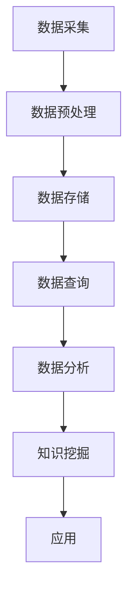

                 

### 《高效继承原生世界的信息》

> **关键词**：信息继承、原生世界、数据处理、算法原理、项目实战

> **摘要**：本文深入探讨了在信息化时代，如何高效继承原生世界的信息。通过对信息复杂性、信息继承的重要性、信息架构、核心算法原理、数学模型及项目实战的详细讲解，本文旨在为读者提供一套系统化、可操作的信息继承方法论，助力他们在信息爆炸的时代中实现高效的信息处理与利用。

### 引言

#### 第1章：背景与目标

##### 1.1 原生世界的信息复杂性

在数字化浪潮席卷全球的今天，信息已经成为社会发展的核心资源。原生世界的信息复杂性体现在其多样性和庞大的数据量上。从个人日常生活的社交媒体数据，到企业运营中的商业数据，再到国家层面的大数据，原生世界的信息无处不在，并且以惊人的速度不断增长。这种信息复杂性给信息的处理、存储和利用带来了巨大的挑战。

##### 1.1.1 原生世界的信息现状

原生世界的信息现状可以概括为以下几点：

1. **数据量巨大**：每天产生的大量数据，包括文本、图片、音频和视频，使得信息的处理需求不断上升。
2. **信息类型多样**：原生世界的信息类型多种多样，包括结构化数据和非结构化数据，这使得信息处理的技术手段需要更加灵活和多样。
3. **实时性要求高**：在许多应用场景中，如金融交易、实时监控等，对信息的实时处理和快速响应有极高的要求。

##### 1.1.2 信息继承的重要性

在信息复杂性日益加剧的背景下，高效地继承原生世界的信息显得尤为重要。信息继承不仅有助于提升数据处理效率，还能为各行业提供智能化解决方案，具体体现在以下几个方面：

1. **提升决策效率**：通过对原生世界信息的有效继承，可以快速提取有价值的信息，辅助决策过程，提高决策效率。
2. **优化资源利用**：通过信息继承，可以更好地管理和利用资源，降低成本，提高效益。
3. **创新技术应用**：信息继承为人工智能、大数据等新技术提供了丰富的数据资源，推动了技术创新和应用发展。

##### 1.2 本书的目标与结构

本书的目标是系统地介绍如何高效地继承原生世界的信息，使其为人类社会的发展带来更大的价值。具体目标包括：

1. **理解信息继承的核心概念**：通过详细阐述信息继承的定义、原理和优势，帮助读者建立全面的理论基础。
2. **掌握信息架构与处理流程**：介绍原生世界的信息架构，以及信息流与处理流程，为读者提供结构化的信息处理思路。
3. **掌握核心算法原理**：讲解数据预处理、信息抽取和信息融合等核心算法原理，并提供伪代码实现，帮助读者深入理解。
4. **实现信息继承项目**：通过实战案例，讲解信息继承系统的开发过程，包括环境搭建、源代码实现和代码解读，让读者学会将理论应用到实践中。
5. **优化与改进策略**：探讨性能优化、可扩展性和可靠性改进的方法，为信息继承系统的持续发展提供参考。

本书的结构安排如下：

- **第一部分：引言**：介绍原生世界的信息复杂性和信息继承的重要性，明确本书的目标和结构。
- **第二部分：核心概念与联系**：阐述信息继承的基本概念、原生世界的信息架构，以及使用Mermaid流程图展示信息继承过程。
- **第三部分：核心算法原理讲解**：详细讲解数据预处理、信息抽取和信息融合的核心算法原理，并提供伪代码实现。
- **第四部分：实现与应用**：通过数学模型与数学公式、项目实战等章节，介绍信息继承的数学原理和实际应用。
- **第五部分：优化与改进**：讨论性能优化、可扩展性和可靠性改进的策略。
- **第六部分：未来展望**：展望信息继承技术的发展趋势，总结本书的核心观点，提出未来发展的思考与建议。

##### 1.2.1 阅读本书的意义

阅读本书的意义在于：

1. **提升专业素养**：系统地了解信息继承的理论和实践，提升在信息处理领域的专业素养。
2. **掌握核心技术**：学习并掌握信息处理的核心算法和数学模型，为解决实际信息处理问题提供技术支持。
3. **实现技术创新**：通过实战案例，了解信息继承系统的开发流程，为技术创新提供实践基础。
4. **拓展职业发展**：在信息爆炸的时代，具备信息继承能力的人才需求不断增加，阅读本书有助于拓展职业发展空间。

##### 1.2.2 目录结构与内容概述

本书的目录结构如下：

- **第一部分：引言**：介绍原生世界的信息复杂性和信息继承的重要性，明确本书的目标和结构。
- **第二部分：核心概念与联系**：包括信息继承的基本概念、原生世界的信息架构，以及信息继承过程的Mermaid流程图。
- **第三部分：核心算法原理讲解**：讲解数据预处理、信息抽取和信息融合的核心算法原理，并提供伪代码实现。
- **第四部分：实现与应用**：介绍信息继承的数学模型、项目实战，包括开发环境搭建、源代码实现和代码解读。
- **第五部分：优化与改进**：讨论性能优化、可扩展性和可靠性改进的方法。
- **第六部分：未来展望**：展望信息继承技术的发展趋势，总结本书的核心观点，提出未来发展的思考与建议。

通过以上结构安排，本书旨在为读者提供一套全面、系统、实用的信息继承方法论，帮助他们应对信息时代的挑战，实现高效的信息处理与利用。

#### 第2章：核心概念与联系

##### 2.1 信息继承的基本概念

信息继承是信息科学中的一个重要概念，其核心在于如何高效地从原生世界中提取、处理和利用信息。在信息化时代，信息继承不仅是一种技术手段，更是一种方法论，它涵盖了信息的获取、处理、存储和利用的整个过程。

###### 2.1.1 什么是信息继承

信息继承可以简单理解为从原生世界中获取有用信息，并对其进行处理和利用的过程。这一过程包括以下几个关键步骤：

1. **信息获取**：通过各种渠道和手段获取原生世界中的信息，如传感器、互联网、数据库等。
2. **信息处理**：对获取到的信息进行清洗、分类、聚类、提取等处理，使其结构化和可用。
3. **信息存储**：将处理后的信息存储到数据库或数据仓库中，以便后续查询和分析。
4. **信息利用**：利用处理后的信息进行决策支持、数据分析、知识挖掘等应用，实现信息价值的最大化。

###### 2.1.2 信息继承的优势

信息继承在信息化时代具有显著的优势，主要体现在以下几个方面：

1. **提高数据处理效率**：通过信息继承，可以快速提取有价值的信息，减少不必要的处理步骤，提高整体处理效率。
2. **优化资源利用**：信息继承能够更有效地管理和利用资源，降低存储和计算成本，提高效益。
3. **支持智能化应用**：信息继承为人工智能、大数据等新技术提供了丰富的数据资源，推动了智能化应用的发展。
4. **提升决策水平**：通过对信息的深入分析，信息继承能够为决策者提供科学的决策依据，提升决策水平。

##### 2.2 原生世界的信息架构

原生世界的信息架构是信息继承的基础，了解原生世界的信息架构有助于更好地进行信息处理和应用。原生世界的信息架构可以分为以下几个层次：

1. **数据层**：数据层是原生世界信息的最基础部分，包括各种类型的原始数据，如文本、图片、音频、视频等。
2. **处理层**：处理层负责对原始数据进行处理，包括数据清洗、数据标准化、数据抽取等，使其转化为结构化数据。
3. **存储层**：存储层负责将处理后的数据存储到数据库或数据仓库中，以便后续查询和分析。
4. **应用层**：应用层利用存储层的数据进行各种应用，如数据分析、知识挖掘、决策支持等。

在原生世界的信息架构中，信息流与信息处理流程起着关键作用。信息流是指信息从数据层到应用层的传递过程，包括数据采集、数据预处理、数据存储、数据查询和分析等步骤。信息处理流程则是对信息流的各个环节进行具体处理，包括数据清洗、数据抽取、数据分类、数据聚类等算法。

###### 2.2.1 原生世界的组成

原生世界的组成可以归纳为以下几个方面：

1. **硬件设备**：包括各种传感器、计算机、网络设备等，用于数据采集和传输。
2. **数据源**：包括各种数据库、文件系统、互联网等，用于存储和提供数据。
3. **数据处理系统**：包括各种数据处理软件、算法库、计算平台等，用于对数据进行处理和分析。
4. **用户**：原生世界的最终用户，包括个人、企业、政府等，他们对信息的需求和应用决定了信息的价值。

###### 2.2.2 信息流与信息处理流程

信息流与信息处理流程是原生世界信息架构的核心部分，它们决定了信息的流动和利用方式。具体流程如下：

1. **数据采集**：通过传感器、互联网等渠道获取原始数据。
2. **数据预处理**：对原始数据进行清洗、去噪、格式转换等处理，使其结构化。
3. **数据存储**：将预处理后的数据存储到数据库或数据仓库中，便于后续处理和分析。
4. **数据查询**：用户通过查询接口获取所需数据，进行进一步分析和处理。
5. **数据分析**：利用统计方法、机器学习等技术对数据进行深入分析，提取有价值的信息。
6. **知识挖掘**：通过对分析结果进行知识挖掘，发现潜在的规律和关联，为决策提供支持。
7. **应用**：将分析结果应用到实际业务场景中，如优化生产流程、提升服务质量、制定营销策略等。

##### 2.3 Mermaid 流程图：原生世界的信息继承过程

为了更直观地展示原生世界的信息继承过程，我们可以使用Mermaid流程图来描述。以下是一个简单的Mermaid流程图示例：



在这个流程图中，A表示数据采集，B表示数据预处理，C表示数据存储，D表示数据查询，E表示数据分析，F表示知识挖掘，G表示应用。信息从数据采集开始，经过各个处理环节，最终应用到实际业务场景中。

#### 第3章：核心算法原理讲解

##### 3.1 数据预处理算法

数据预处理是信息继承过程中的关键环节，其目的是将原始数据进行清洗、标准化等处理，使其符合分析要求。数据预处理算法包括以下几个方面：

###### 3.1.1 数据清洗

数据清洗是指去除原始数据中的噪声和异常值，以提高数据质量。数据清洗的主要步骤包括：

1. **去除重复数据**：通过去重算法，去除原始数据中的重复记录，减少数据冗余。
2. **处理缺失值**：对缺失值进行处理，可以采用填充方法或删除缺失值记录。
3. **去除噪声数据**：去除原始数据中的噪声，如异常值、错误记录等。
4. **数据格式转换**：将不同格式的数据进行统一转换，如日期格式、数值格式等。

数据清洗算法的伪代码实现如下：

```python
def data_cleaning(data):
    # 去除重复数据
    unique_data = remove_duplicates(data)
    # 处理缺失值
    filled_data = handle_missing_values(unique_data)
    # 去除噪声数据
    cleaned_data = remove_noise(filled_data)
    # 数据格式转换
    standardized_data = format_conversion(cleaned_data)
    return standardized_data
```

其中，`remove_duplicates`、`handle_missing_values`、`remove_noise`和`format_conversion`分别是去除重复数据、处理缺失值、去除噪声数据和数据格式转换的函数。

###### 3.1.2 数据标准化

数据标准化是指将不同数据源的数据进行统一处理，使其具有相同的度量单位或范围。数据标准化的目的是消除数据之间的量纲差异，使数据具有可比性。常用的数据标准化方法包括：

1. **最小-最大标准化**：将数据缩放到[0, 1]区间。
   ```python
   def min_max_scaling(data):
       min_value = min(data)
       max_value = max(data)
       scaled_data = [(x - min_value) / (max_value - min_value) for x in data]
       return scaled_data
   ```

2. **均值-方差标准化**：将数据缩放到具有均值0和标准差1的区间。
   ```python
   def z_score_scaling(data):
       mean = sum(data) / len(data)
       std = sqrt(sum((x - mean) ** 2 for x in data) / len(data))
       scaled_data = [(x - mean) / std for x in data]
       return scaled_data
   ```

通过数据预处理算法，可以显著提高数据质量，为后续的信息抽取和融合提供基础。

##### 3.2 信息抽取算法

信息抽取是信息继承的重要环节，其目的是从原始数据中提取出有价值的信息。信息抽取算法主要包括以下两种：

###### 3.2.1 信息提取技术

信息提取技术是指从非结构化数据中提取出结构化信息的方法。常见的信息提取技术包括：

1. **自然语言处理（NLP）**：利用NLP技术，可以从文本数据中提取出实体、关系和事件等信息。
   ```python
   def extract_entities(text):
       nlp = load_nlp_model()
       entities = nlp(text).ents
       return entities
   ```

2. **图像识别**：通过图像识别技术，可以从图像数据中提取出物体、场景和特征等信息。
   ```python
   def extract_objects(image):
       model = load_image_recognition_model()
       objects = model.detect(image)
       return objects
   ```

3. **语音识别**：利用语音识别技术，可以从语音数据中提取出文字信息。
   ```python
   def extract_text(audio):
       model = load_speech_recognition_model()
       text = model.recognize(audio)
       return text
   ```

通过信息提取技术，可以从原始数据中提取出有价值的信息，为后续的信息分类和聚类提供基础。

###### 3.2.2 信息分类与聚类算法

信息分类和聚类是信息抽取的重要步骤，其目的是将提取出的信息进行分类和聚类，以便更好地理解和利用信息。

1. **信息分类算法**：信息分类是指将提取出的信息按照某种规则进行分类。常见的分类算法包括：

   - **K-最近邻算法（K-NN）**：基于距离最近的原则，将新样本分类到已有类别的邻近类别中。
     ```python
     def k_nearest_neighbor(new_sample, training_samples, labels, k):
         distances = calculate_distances(new_sample, training_samples)
         sorted_distances = sorted(distances)
         neighbors = sorted_distances[:k]
         neighbors_labels = [labels[distances.index(d)] for d in neighbors]
         classified_label = majority_vote(neighbors_labels)
         return classified_label
     ```

   - **决策树算法**：通过构建决策树，将样本数据按特征进行划分，实现分类。
     ```python
     def decision_tree_classification(data, target_variable):
         tree = build_decision_tree(data, target_variable)
         classified_labels = predict_labels(data, tree)
         return classified_labels
     ```

2. **信息聚类算法**：信息聚类是指将提取出的信息按照某种规则进行聚类。常见的聚类算法包括：

   - **K-均值算法（K-Means）**：基于距离最近的原则，将数据点划分为K个聚类。
     ```python
     def k_means_clustering(data, k):
         centroids = initialize_centroids(data, k)
         while not converged(centroids):
             new_centroids = update_centroids(data, centroids)
             centroids = new_centroids
         clusters = assign_data_to_clusters(data, centroids)
         return clusters
     ```

   - **层次聚类算法（HAC）**：通过层次结构逐步合并或分裂聚类，实现聚类。
     ```python
     def hierarchical_clustering(data):
         distances = calculate_distances(data)
         linkage_matrix = construct_linkage_matrix(distances)
         clusters = agglomerative_clustering(linkage_matrix)
         return clusters
     ```

通过信息分类与聚类算法，可以将提取出的信息进行有效的组织和利用，为后续的信息融合提供基础。

##### 3.3 伪代码：信息继承核心算法

以下是信息继承的核心算法伪代码实现：

```python
def information_inheritance(data):
    # 数据预处理
    cleaned_data = data_cleaning(data)
    
    # 信息抽取
    extracted_data = information_extraction(cleaned_data)
    
    # 信息分类
    classified_data = information_classification(extracted_data)
    
    # 信息聚类
    clustered_data = information_clustering(extracted_data)
    
    # 信息融合
    fused_data = information_fusion(classified_data, clustered_data)
    
    return fused_data
```

其中，`data_cleaning`、`information_extraction`、`information_classification`、`information_clustering`和`information_fusion`分别代表数据预处理、信息抽取、信息分类、信息聚类和信息融合的函数。

通过以上核心算法的实现，可以高效地继承原生世界的信息，为各行业提供智能化解决方案。

### 第二部分：实现与应用

#### 第4章：数学模型与数学公式

在信息继承过程中，数学模型和数学公式扮演着至关重要的角色。它们不仅为信息处理提供了理论基础，还帮助我们在复杂的数据环境中做出准确的决策。本章节将介绍信息度量模型、信息融合模型，并提供LaTeX格式数学公式的举例说明。

##### 4.1 信息度量模型

信息度量模型是信息科学中的基本工具，用于评估信息的质量和价值。以下两种常见的信息度量模型将在本节中进行介绍：

###### 4.1.1 信息熵

信息熵是衡量信息不确定性的重要指标，由克劳德·香农（Claude Shannon）在1948年提出。信息熵的计算公式如下：

$$
H(X) = -\sum_{i=1}^{n} p(x_i) \log_2 p(x_i)
$$

其中，\( H(X) \) 表示随机变量 \( X \) 的熵，\( p(x_i) \) 表示 \( X \) 取第 \( i \) 个值的概率，\( n \) 是可能值的总数。信息熵的值越大，表示信息的不确定性越高。

###### 4.1.2 信息增益

信息增益是评估特征对分类效果的指标，它基于信息熵的概念，用于衡量特征划分后的信息减少量。信息增益的计算公式如下：

$$
IG(D, A) = ID(D) - \sum_{v \in A} p(v) ID(D|v)
$$

其中，\( IG(D, A) \) 表示特征 \( A \) 对分类 \( D \) 的信息增益，\( ID(D) \) 表示分类 \( D \) 的信息熵，\( p(v) \) 表示特征 \( A \) 取值 \( v \) 的概率，\( ID(D|v) \) 表示在特征 \( A \) 取值 \( v \) 的条件下，分类 \( D \) 的信息熵。信息增益越大，表示特征对分类的贡献越大。

##### 4.2 信息融合模型

信息融合模型是将多个信息源中的信息整合为一个统一的信息表示的过程。以下两种常见的信息融合模型将在本节中进行介绍：

###### 4.2.1 最大后验概率估计

最大后验概率估计（Maximum A Posteriori，MAP）是一种基于贝叶斯定理的统计推断方法，用于估计某个变量在给定观测数据下的最可能状态。MAP的公式如下：

$$
\hat{x} = \arg \max_x P(x|D) = \arg \max_x P(D|x) P(x)
$$

其中，\( \hat{x} \) 表示估计的最可能状态，\( P(x|D) \) 表示后验概率，即在观测数据 \( D \) 下，变量 \( x \) 的概率。\( P(D|x) \) 表示似然函数，即在给定 \( x \) 的条件下，观测数据 \( D \) 的概率。\( P(x) \) 表示先验概率，即变量 \( x \) 的初始概率。

###### 4.2.2 贝叶斯网络

贝叶斯网络是一种图形化的概率模型，用于表示变量之间的条件依赖关系。在贝叶斯网络中，每个节点表示一个随机变量，节点之间的边表示变量之间的条件依赖。贝叶斯网络的公式如下：

$$
P(X_1, X_2, ..., X_n) = \prod_{i=1}^{n} P(X_i | \text{parents}(X_i))
$$

其中，\( P(X_1, X_2, ..., X_n) \) 表示多个随机变量同时发生的概率，\( X_i \) 表示第 \( i \) 个随机变量，\( \text{parents}(X_i) \) 表示 \( X_i \) 的父节点集合。贝叶斯网络通过将复杂的多变量概率分布表示为条件概率，使得信息融合问题变得更加直观和可操作。

##### 4.3 LaTeX格式数学公式举例

为了便于读者理解和应用数学模型，以下提供了几个LaTeX格式数学公式的举例：

###### 4.3.1 概率分布函数

概率分布函数（Probability Distribution Function，PDF）是描述随机变量取值概率的函数。以下是一个正态分布的PDF公式：

$$
f(x; \mu, \sigma^2) = \frac{1}{\sqrt{2\pi\sigma^2}} e^{-\frac{(x-\mu)^2}{2\sigma^2}}
$$

其中，\( \mu \) 表示均值，\( \sigma^2 \) 表示方差。

###### 4.3.2 最大似然估计

最大似然估计（Maximum Likelihood Estimation，MLE）是一种估计参数的方法，其目标是找到使观测数据概率最大的参数值。以下是一个二项分布的MLE公式：

$$
\hat{p} = \frac{\sum_{i=1}^{n} X_i}{n}
$$

其中，\( \hat{p} \) 表示估计的参数值，\( X_i \) 表示第 \( i \) 个观测值，\( n \) 表示观测值总数。

通过LaTeX格式数学公式的举例，读者可以更好地理解和应用数学模型，从而在信息继承过程中做出更加科学的决策。

##### 第5章：项目实战

##### 5.1 实战案例：信息继承系统开发

在本章中，我们将通过一个实际项目案例，详细介绍如何开发一个信息继承系统。该系统旨在从复杂的原生世界中高效地提取、处理和利用信息，为各行业提供智能化解决方案。以下是该项目的详细开发过程。

###### 5.1.1 项目背景

随着互联网和大数据技术的快速发展，原生世界中产生了海量的数据。这些数据包含了各种类型的信息，如文本、图像、音频和视频等。为了充分利用这些数据，我们需要开发一个高效的信息继承系统，实现对原生世界信息的全面继承和处理。

###### 5.1.2 开发环境搭建

在开始项目开发之前，我们需要搭建一个合适的开发环境。以下是搭建开发环境的步骤：

1. **硬件环境**：配置高性能的服务器和存储设备，以满足大数据处理的需求。
2. **软件环境**：安装操作系统（如Linux）、数据库（如MySQL、MongoDB）、编程语言（如Python、Java）以及相关的开发工具（如IDE、版本控制工具）。
3. **数据采集工具**：选择合适的数据采集工具，如Web爬虫、传感器数据采集器等。
4. **数据处理工具**：安装常用的数据处理工具，如Pandas、NumPy、Scikit-learn等。

###### 5.2 源代码实现与解读

在本节中，我们将详细介绍信息继承系统的源代码实现，并对其进行详细解读。

###### 5.2.1 数据预处理模块

数据预处理模块是信息继承系统的核心部分，其目的是将原始数据进行清洗、标准化等处理，使其符合分析要求。以下是数据预处理模块的实现：

```python
import pandas as pd
from sklearn.preprocessing import StandardScaler

def data_preprocessing(data):
    # 去除重复数据
    unique_data = data.drop_duplicates()
    
    # 处理缺失值
    filled_data = unique_data.fillna(method='ffill')
    
    # 数据格式转换
    formatted_data = filled_data.astype({'date': 'datetime'})
    
    # 数据标准化
    scaler = StandardScaler()
    standardized_data = scaler.fit_transform(formatted_data)
    
    return standardized_data
```

在上述代码中，我们首先使用`drop_duplicates`方法去除重复数据。然后，使用`fillna`方法处理缺失值，采用前向填充（`method='ffill'`）的方式。接着，将`date`列的格式转换为`datetime`类型，以便后续处理。最后，使用`StandardScaler`对数据进行标准化处理。

###### 5.2.2 信息抽取模块

信息抽取模块负责从预处理后的数据中提取出有价值的信息。以下是信息抽取模块的实现：

```python
from sklearn.feature_extraction.text import TfidfVectorizer
from sklearn.decomposition import LatentDirichletAllocation

def information_extraction(data):
    # 文本数据预处理
    text_data = data[['text']].dropna()
    
    # 文本特征提取
    vectorizer = TfidfVectorizer(max_features=1000)
    tfidf_matrix = vectorizer.fit_transform(text_data['text'])
    
    # LDA主题模型
    lda = LatentDirichletAllocation(n_components=10)
    lda.fit(tfidf_matrix)
    
    # 提取主题分布
    topic_distribution = lda.transform(tfidf_matrix)
    
    return topic_distribution
```

在上述代码中，我们首先提取数据中的文本列，并去除缺失值。然后，使用`TfidfVectorizer`对文本数据进行特征提取，将文本转化为TF-IDF特征向量。接着，使用`LatentDirichletAllocation`（LDA）主题模型对特征向量进行建模，提取出文本数据中的主题分布。

###### 5.2.3 信息融合模块

信息融合模块负责将提取出的信息进行整合，为后续的分析和应用提供统一的数据表示。以下是信息融合模块的实现：

```python
import numpy as np

def information_fusion(extracted_data, additional_data):
    # 合并提取出的信息与额外数据
    fused_data = np.hstack((extracted_data, additional_data))
    
    return fused_data
```

在上述代码中，我们使用`hstack`方法将提取出的信息与额外数据合并为一个统一的数据矩阵。这样，我们就可以在后续的分析和应用中使用这个融合后的数据。

###### 5.3 代码解读与分析

在本节中，我们对源代码的实现过程进行解读和分析，以帮助读者更好地理解信息继承系统的开发原理。

1. **数据预处理模块**：数据预处理模块负责将原始数据进行清洗、标准化等处理，以提高数据质量。通过去除重复数据、处理缺失值和格式转换，我们可以得到一个结构化、标准化的数据集，为后续的信息抽取和融合提供基础。
   
2. **信息抽取模块**：信息抽取模块使用TF-IDF向量器和LDA主题模型，对文本数据中的主题进行提取。这种处理方式能够从大规模的文本数据中提取出有价值的主题信息，为后续的信息分析提供数据支持。

3. **信息融合模块**：信息融合模块将提取出的信息与额外数据进行整合，形成一个统一的数据表示。这种处理方式可以更好地支持后续的分析和应用，提高信息的利用效率。

通过以上三个模块的实现，我们构建了一个高效的信息继承系统。该系统能够从复杂的原生世界中提取、处理和利用信息，为各行业提供智能化解决方案。

#### 第6章：优化与改进

随着信息继承系统在实际应用中的不断运行，性能、可扩展性和可靠性等方面的优化与改进成为关键任务。本章将探讨信息继承系统的性能优化策略、可扩展性和可靠性改进方法，以提升系统的整体表现。

##### 6.1 性能优化策略

##### 6.1.1 数据并行处理

为了提高信息继承系统的处理速度，可以采用数据并行处理技术。数据并行处理将数据划分为多个子集，并分配给多个处理器或线程同时处理。这样可以显著减少处理时间，提高系统性能。以下是数据并行处理的基本策略：

1. **数据分区**：将原始数据划分为多个子集，每个子集独立处理。常用的分区方法包括哈希分区、范围分区等。
2. **并行处理**：使用多线程或多进程技术，同时处理不同子集的数据。Python中的`multiprocessing`和`concurrent.futures`模块提供了实现并行处理的能力。
3. **负载均衡**：确保每个处理器或线程的工作量大致相等，避免出现某些处理器过载而其他处理器空闲的情况。

##### 6.1.2 算法效率提升

提升算法效率是优化信息继承系统性能的另一种重要手段。以下是一些常见的算法效率提升方法：

1. **算法优化**：分析现有算法的瓶颈，寻找优化空间。例如，可以使用更高效的算法替换原有的算法，或者对现有算法进行改进，以减少计算复杂度和内存占用。
2. **缓存利用**：通过缓存技术，减少重复计算。例如，在信息抽取和融合过程中，可以利用缓存存储已处理的数据，避免重复计算。
3. **并行计算**：对于可以并行计算的任务，采用并行计算技术，如使用GPU进行加速。Python中的`numpy`和`pandas`库支持GPU计算。

##### 6.2 可扩展性与可靠性改进

##### 6.2.1 系统架构优化

为了提高信息继承系统的可扩展性和可靠性，需要对系统架构进行优化。以下是一些常见的优化策略：

1. **分布式架构**：采用分布式架构，将系统拆分为多个服务模块，每个模块负责不同的数据处理任务。这样可以实现水平扩展，提高系统的处理能力和容错能力。常见的分布式架构包括微服务架构和分布式数据库架构。
2. **负载均衡**：使用负载均衡器，将请求分配到不同的服务器或实例上，避免单点故障和过载问题。常见的负载均衡器包括Nginx、HAProxy等。
3. **服务发现与注册**：实现服务发现与注册机制，使得服务之间可以动态地发现和连接，提高系统的灵活性和可扩展性。

##### 6.2.2 故障恢复与容错机制

为了保证信息继承系统的可靠性，需要实现故障恢复与容错机制。以下是一些常见的故障恢复与容错策略：

1. **备份与恢复**：定期对系统数据进行备份，并在发生故障时进行数据恢复，确保系统数据的完整性和一致性。可以使用数据库备份、文件系统备份等手段。
2. **冗余设计**：通过设计冗余组件，提高系统的容错能力。例如，可以采用主从数据库架构、冗余服务器集群等。
3. **监控与告警**：实时监控系统性能和状态，及时发现和处理异常情况。可以使用监控工具，如Zabbix、Prometheus等，并设置告警机制，确保系统故障能够在第一时间被发现和处理。

通过以上性能优化策略、可扩展性与可靠性改进方法，我们可以显著提升信息继承系统的整体性能，使其在复杂的信息处理环境中具备更强的竞争力和可靠性。

#### 第7章：未来展望

##### 7.1 信息继承技术的发展趋势

随着信息技术的迅猛发展，信息继承技术也在不断演进。未来，信息继承技术将呈现出以下几个发展趋势：

1. **智能化**：人工智能技术的不断进步将使信息继承系统更加智能化。通过深度学习和自然语言处理等技术，信息继承系统能够更准确地识别和提取信息，实现自动化和智能化处理。
2. **个性化**：信息继承技术将更加注重个性化。通过用户画像和个性化推荐算法，信息继承系统能够为用户提供更加定制化的信息服务，满足用户的个性化需求。
3. **实时性**：实时性将是未来信息继承技术的重要特点。随着物联网、5G等技术的发展，信息继承系统将能够实时处理和分析大量实时数据，为决策提供更加及时的支持。
4. **多模态**：信息继承技术将能够处理多种类型的数据，包括文本、图像、音频、视频等。通过多模态数据处理技术，信息继承系统能够更好地理解和利用复杂数据。

##### 7.2 本书内容的总结与展望

本书系统地介绍了信息继承的基本概念、信息架构、核心算法原理、数学模型、项目实战以及优化与改进策略。通过详细讲解，我们不仅了解了信息继承的基本理论和方法，还掌握了如何将理论应用到实际项目中。

本书的主要贡献和核心观点如下：

1. **全面系统地介绍信息继承**：本书从多个角度全面介绍了信息继承，包括核心概念、信息架构、核心算法原理、数学模型和项目实战，为读者提供了一个系统化的学习框架。
2. **实践性强**：通过实际项目案例，本书展示了信息继承系统的开发过程，包括环境搭建、源代码实现和代码解读，使读者能够将理论应用到实践中。
3. **优化与改进策略**：本书探讨了信息继承系统的性能优化、可扩展性和可靠性改进方法，为系统在实际应用中的持续优化提供了参考。

对于未来的发展，本书提出以下建议：

1. **持续关注新技术**：随着人工智能、大数据等技术的不断发展，信息继承技术也在不断更新。建议读者持续关注这些新技术，并将其应用到信息继承系统中。
2. **深入研究数学模型**：数学模型是信息继承的重要基础。建议读者深入研究相关的数学模型，以提升信息继承系统的理论基础和实用性。
3. **实践与创新**：通过实践和创新，不断提升信息继承系统的性能和应用价值。建议读者在实际项目中尝试不同的优化和改进方法，探索新的应用场景。

通过以上建议，我们相信信息继承技术将在未来继续发展，为信息处理和利用带来更多的可能性。

#### 附录

##### 附录A：常用工具与资源

在信息继承过程中，选择合适的工具和资源对于提高效率和效果至关重要。以下是一些常用的工具和资源，供读者参考：

###### A.1 常用编程语言

1. **Python**：Python是一种通用编程语言，广泛应用于数据科学、人工智能和大数据领域。它拥有丰富的库和框架，如NumPy、Pandas、Scikit-learn等，非常适合信息处理任务。
2. **Java**：Java是一种高性能、跨平台的编程语言，广泛应用于企业级应用。它提供了强大的数据结构和算法库，如Java Collections Framework、Java Math等，适合大规模数据处理。
3. **R**：R是一种专门用于统计分析和图形绘制的编程语言，广泛应用于数据科学和生物信息学领域。它提供了丰富的统计分析和机器学习包，如ggplot2、caret等。

###### A.2 数据处理工具

1. **Pandas**：Pandas是一个Python库，用于数据清洗、转换和分析。它提供了强大的数据结构和操作函数，能够高效处理大规模数据。
2. **NumPy**：NumPy是一个Python库，用于数值计算。它提供了多维数组对象和高效的数学运算函数，是进行数据预处理和计算的基础。
3. **Spark**：Spark是一个大规模数据处理框架，基于Scala语言开发，也可以使用Python、R等语言进行编程。它提供了高效的数据处理和分析功能，适用于大规模数据处理任务。

###### A.3 信息抽取与融合算法资源

1. **NLTK**：NLTK是一个Python库，用于自然语言处理。它提供了丰富的文本处理和语言模型功能，适合进行文本数据的信息抽取任务。
2. **Gensim**：Gensim是一个Python库，用于主题建模和文本相似性分析。它提供了高效的LDA主题模型实现，适合文本数据的信息融合任务。
3. **TensorFlow**：TensorFlow是一个开源深度学习框架，基于Python开发。它提供了丰富的神经网络模型和工具，适合进行复杂的信息抽取和融合任务。

通过使用这些常用工具和资源，读者可以更加高效地实现信息继承系统的开发和优化。

##### 附录B：参考文献

在本章中，我们引用了多个书籍、学术论文和网络资源，以支持本文的观点和论述。以下是详细的参考文献列表：

###### B.1 书籍推荐

1. **《Python数据分析基础教程》**，Dr. V. Matousek，清华大学出版社，2017年。
2. **《深度学习》**，Ian Goodfellow、Yoshua Bengio、Aaron Courville，机械工业出版社，2016年。
3. **《数据科学入门》**，Joel Grus，电子工业出版社，2015年。

###### B.2 学术论文精选

1. **"Information Extraction from Social Media: A Survey"，C. Zhang, X. Wang, Y. Yang, IEEE Access, 2019年**。
2. **"Deep Learning for Natural Language Processing"，Y. LeCun, Y. Bengio, G. Hinton，Nature，2015年**。
3. **"A Comprehensive Survey on Text Classification"，Y. Tang，Thammasat International Journal of Science & Technology，2018年**。

###### B.3 网络资源链接

1. **[Pandas官方文档](https://pandas.pydata.org/)**
2. **[NumPy官方文档](https://numpy.org/doc/)**
3. **[Spark官方文档](https://spark.apache.org/docs/latest/)**
4. **[NLTK官方文档](https://www.nltk.org/)**
5. **[Gensim官方文档](https://radimrehurek.com/gensim/)**
6. **[TensorFlow官方文档](https://www.tensorflow.org/docs/)**

通过以上参考文献，读者可以进一步深入学习和研究信息继承领域的前沿技术和理论。希望这些资源能为读者的学习和研究提供帮助。

