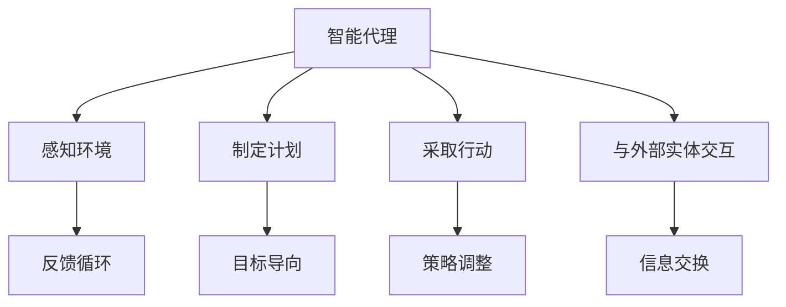
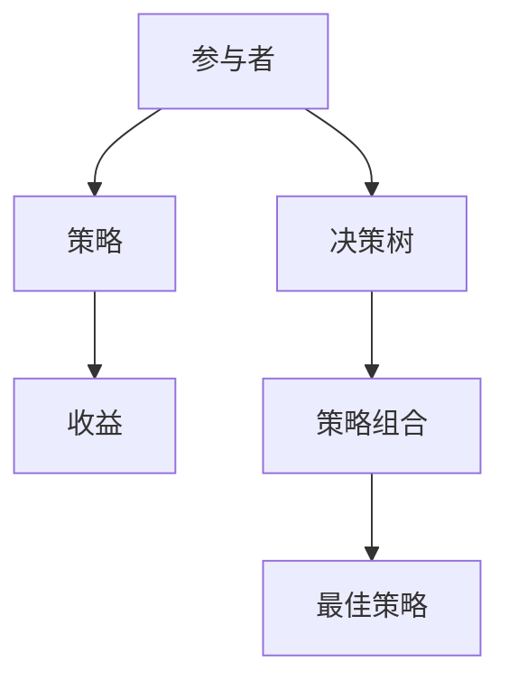
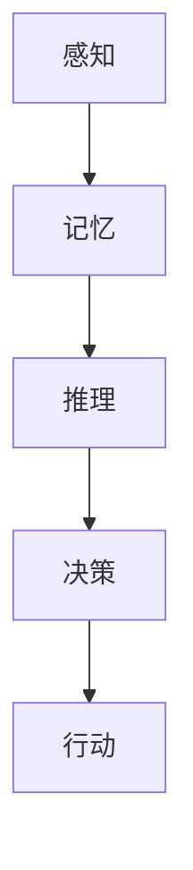
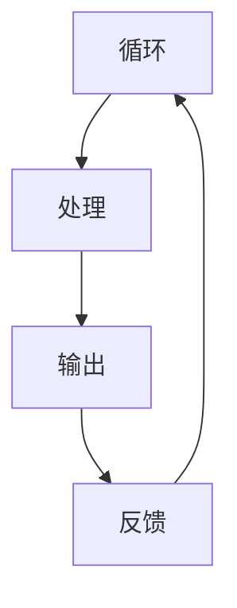

                 

# 文章标题

《麦卡锡与明斯基的学术贡献》

# 关键词

人工智能、麦卡锡、明斯基、学术贡献、逻辑编程、函数式编程、神经网络、认知建模、计算机科学教育、数学、哲学、控制论、认知心理学

# 摘要

本文旨在探讨计算机科学和人工智能领域两位杰出人物——麦卡锡（John McCarthy）和明斯基（Marvin Minsky）的学术贡献。通过对这两位科学家的生平背景、主要学术成就及其影响的分析，本文旨在为读者提供一个全面而深入的视角，了解他们在各自领域的重要性以及如何推动了计算机科学的发展。文章结构分为五个部分：引言、麦卡锡的学术贡献、明斯基的学术贡献、麦卡锡与明斯基的合作与交流以及结论。通过逐步分析推理，本文旨在揭示两位科学家在学术上的独特见解和深远影响。

# 《麦卡锡与明斯基的学术贡献》目录大纲

## 第一部分：引言

### 1.1 麦卡锡与明斯基的背景介绍

#### 1.1.1 麦卡锡的生平与学术成就

#### 1.1.2 明斯基的生平与学术成就

### 1.2 本书的目的与结构

## 第二部分：麦卡锡的学术贡献

### 2.1 麦卡锡在人工智能领域的贡献

#### 2.1.1 麦卡锡的人工智能思想体系

#### 2.1.2 麦卡锡在逻辑编程和函数式编程方面的贡献

#### 2.1.3 麦卡锡在计算机科学教育方面的贡献

### 2.2 麦卡锡在其他领域的贡献

#### 2.2.1 麦卡锡在数学领域的贡献

#### 2.2.2 麦卡锡在哲学领域的贡献

### 2.3 麦卡锡的学术影响

#### 2.3.1 麦卡锡对现代计算机科学的影响

#### 2.3.2 麦卡锡对人工智能领域的影响

## 第三部分：明斯基的学术贡献

### 3.1 明斯基在人工智能领域的贡献

#### 3.1.1 明斯基的人工智能思想体系

#### 3.1.2 明斯基在神经网络和认知建模方面的贡献

#### 3.1.3 明斯基在机器学习和数据挖掘方面的贡献

### 3.2 明斯基在其他领域的贡献

#### 3.2.1 明斯基在控制论和系统科学方面的贡献

#### 3.2.2 明斯基在认知心理学和认知科学方面的贡献

### 3.3 明斯基的学术影响

#### 3.3.1 明斯基对现代人工智能的影响

#### 3.3.2 明斯基对认知科学领域的影响

## 第四部分：麦卡锡与明斯基的合作与交流

### 4.1 麦卡锡与明斯基的合作历程

#### 4.1.1 他们在人工智能领域的合作

#### 4.1.2 他们在其他领域的合作

### 4.2 麦卡锡与明斯基的学术影响比较

#### 4.2.1 影响因素分析

#### 4.2.2 影响评价

## 第五部分：结论

### 5.1 麦卡锡与明斯基的学术贡献总结

#### 5.1.1 他们的共同点与区别

#### 5.1.2 他们的学术贡献对未来人工智能发展的影响

### 5.2 对他们的学术贡献的评价与展望

#### 5.2.1 学术界的评价

#### 5.2.2 未来的研究方向

## 附录

### 附录 A：麦卡锡与明斯基的部分重要论文与著作

### 附录 B：麦卡锡与明斯基的学术贡献相关资料

### 附录 C：本书引用的参考资料

---

## 第一部分：引言

### 1.1 麦卡锡与明斯基的背景介绍

#### 1.1.1 麦卡锡的生平与学术成就

约翰·麦卡锡（John McCarthy，1927-2011）是美国计算机科学家和逻辑学家，被广泛认为是人工智能（AI）的创始人之一。他在20世纪50年代提出了“人工智能”这个术语，并推动了计算机科学的快速发展。麦卡锡出生于美国华盛顿州的西雅图，曾在加州理工学院学习，后转学到普林斯顿大学，并获得数学博士学位。

麦卡锡在人工智能领域的贡献是多方面的。他提出了基于逻辑的编程语言Lisp，这是第一种广泛使用的函数式编程语言，为后来的编程语言设计提供了重要基础。他还推动了专家系统和逻辑编程的发展，这些技术在现代人工智能中仍然有着广泛应用。

除了人工智能，麦卡锡还在计算机科学教育、哲学和数学等领域做出了贡献。他是斯坦福大学计算机科学系的创始人之一，致力于计算机科学教育的创新和推广。在哲学方面，他研究了人工智能与意识的关系，提出了“哲学逻辑”这一概念，以探索人类思维和计算过程之间的联系。

#### 1.1.2 明斯基的生平与学术成就

马文·明斯基（Marvin Minsky，1927-2016）是另一位在人工智能领域具有重要影响力的人物。他与麦卡锡一样，被誉为人工智能的先驱者。明斯基出生于美国纽约市的布鲁克林区，曾在哈佛大学学习，并在那里获得了数学和物理学学位。之后，他继续在哈佛大学攻读博士学位，并在1958年获得了心理学博士学位。

明斯基在人工智能领域的贡献主要集中在认知建模、神经网络和机器学习等方面。他与西摩·帕普特（Seymour Papert）合著了《感知器》（Perceptrons），这本书对神经网络的发展产生了深远影响。他还研究了人工智能与心理学之间的关系，提出了“心灵是计算过程的产物”的观点。

除了人工智能，明斯基还在控制论、系统科学和认知心理学等领域做出了贡献。他是多学科交叉研究的先驱，试图通过理解和模拟人类思维过程来推动人工智能的发展。

### 1.2 本书的目的与结构

本书旨在深入探讨麦卡锡和明斯基这两位科学家的学术贡献，分析他们在计算机科学和人工智能领域的影响。通过系统地介绍他们的生平背景、主要学术成就以及合作与交流，本书旨在为读者提供一个全面而深入的视角，了解这两位科学家如何通过其独特的见解和创新的学术贡献，推动了计算机科学和人工智能的发展。

本文的结构如下：

- **第一部分：引言**：介绍麦卡锡和明斯基的背景，明确本书的目的和结构。
- **第二部分：麦卡锡的学术贡献**：详细分析麦卡锡在人工智能、逻辑编程、函数式编程、计算机科学教育、数学和哲学等领域的贡献。
- **第三部分：明斯基的学术贡献**：探讨明斯基在人工智能、神经网络、机器学习、控制论、系统科学和认知心理学等领域的贡献。
- **第四部分：麦卡锡与明斯基的合作与交流**：分析两位科学家在人工智能和其他领域的合作历程，以及他们的学术影响比较。
- **第五部分：结论**：总结麦卡锡和明斯基的学术贡献，讨论他们对未来人工智能发展的影响，以及对他们的学术贡献的评价与展望。

通过这样的结构安排，本文希望能够帮助读者更好地理解麦卡锡和明斯基的学术成就，以及他们在推动计算机科学和人工智能发展中的重要作用。

---

## 第二部分：麦卡锡的学术贡献

### 2.1 麦卡锡在人工智能领域的贡献

约翰·麦卡锡在人工智能（AI）领域无疑是一位标志性人物，他的贡献为整个领域的发展奠定了坚实的基础。以下是麦卡锡在人工智能领域的几个关键贡献：

#### 2.1.1 麦卡锡的人工智能思想体系

麦卡锡的人工智能思想体系主要强调计算机程序应该能够模拟人类的思维过程，特别是逻辑推理和问题解决能力。他提出了“智能代理”（intelligent agent）的概念，认为一个智能代理应该具备感知环境、制定计划、采取行动和与外部实体交互的能力。

**核心概念与联系**

为了更好地理解麦卡锡的思想体系，我们可以使用Mermaid流程图来展示其核心概念：



**图 1：麦卡锡的人工智能思想体系**

在这个框架中，感知环境、制定计划、采取行动和与外部实体交互构成了一个闭环系统，即反馈循环。这个反馈循环使得智能代理能够不断地根据环境的变化调整其行为，从而达到目标。

#### 2.1.2 麦卡锡在逻辑编程和函数式编程方面的贡献

麦卡锡在逻辑编程和函数式编程方面的贡献同样不可忽视。他提出了Lisp编程语言，这是第一种广泛使用的函数式编程语言。Lisp的引入极大地促进了人工智能领域的发展，因为它允许程序员以高度抽象和表达力的方式来编写程序。

**核心算法原理讲解**

以下是Lisp编程语言的核心算法原理，使用伪代码进行详细阐述：

```pseudo
// 定义一个递归函数，用于计算阶乘
factorial(n) {
    if (n == 0) {
        return 1;
    } else {
        return n * factorial(n - 1);
    }
}

// 定义一个高阶函数，用于映射
map(func, list) {
    if (list is empty) {
        return empty list;
    } else {
        return [func(first element of list), map(func, rest of list)];
    }
}
```

**图 2：Lisp编程语言的核心算法原理**

通过这些算法，Lisp能够实现复杂的逻辑推理和问题解决。它提供了一个灵活的编程环境，使得程序员可以专注于算法的实现，而不是底层的细节。

#### 2.1.3 麦卡锡在计算机科学教育方面的贡献

麦卡锡不仅在技术层面上做出了贡献，他还致力于计算机科学教育的推广和创新。他是斯坦福大学计算机科学系的创始人之一，并推动了一系列教育项目的实施。

**核心算法原理讲解**

为了推广计算机科学教育，麦卡锡提出了一个基于项目的学习模型。以下是这个模型的核心算法原理，使用伪代码进行详细阐述：

```pseudo
// 定义一个项目，用于学习计算机科学概念
project(student, concept) {
    if (student understands concept) {
        return student completes project successfully;
    } else {
        student engages in hands-on activities to deepen understanding of concept;
        return project(student, concept); // recursion to ensure mastery
    }
}
```

**图 3：基于项目的学习模型的核心算法原理**

通过这样的模型，学生可以在实际项目中学习计算机科学概念，而不是仅仅通过理论教学。这种方法不仅提高了学习效果，还激发了学生对计算机科学的兴趣。

### 2.2 麦卡锡在其他领域的贡献

麦卡锡的学术贡献不仅限于人工智能领域，他还涉足了数学、哲学等多个学科。以下是他在这些领域的主要贡献：

#### 2.2.1 麦卡锡在数学领域的贡献

麦卡锡在数学领域的贡献主要体现在逻辑学和数理经济学方面。他提出了“策略网”（strategy networks）的概念，用于分析和解决博弈论问题。这个模型在经济学、政治学和计算机科学等领域有着广泛的应用。

**核心概念与联系**

为了更好地理解“策略网”的概念，我们可以使用Mermaid流程图来展示其核心结构：



**图 4：策略网的核心概念**

在这个模型中，参与者根据其策略选择决策树，每个决策节点都对应一个收益。通过分析这些收益，可以找到最佳策略组合，从而实现最优决策。

#### 2.2.2 麦卡锡在哲学领域的贡献

麦卡锡在哲学领域的贡献主要体现在他对人工智能与意识关系的研究上。他提出了“哲学逻辑”这一概念，试图通过逻辑手段来研究人类思维和意识的本质。

**数学模型和公式**

以下是麦卡锡提出的“哲学逻辑”模型中的一个关键公式，使用LaTeX格式进行详细讲解：

```latex
$$
\text{思维} = \text{计算} + \text{意识}
$$

\text{其中，}
\begin{aligned}
\text{计算} &= \text{符号操作序列} \\
\text{意识} &= \text{主观体验}
\end{aligned}
```

**图 5：哲学逻辑模型的关键公式**

通过这个公式，麦卡锡试图将计算机科学和哲学结合起来，探索人类思维和意识的本质。这个模型为人工智能研究提供了一个新的视角，也为哲学提供了新的研究工具。

### 2.3 麦卡锡的学术影响

麦卡锡的学术贡献不仅在当时产生了深远影响，而且对现代计算机科学和人工智能的发展仍然有着重要启示。

#### 2.3.1 麦卡锡对现代计算机科学的影响

麦卡锡提出的Lisp编程语言和逻辑编程思想为现代编程语言的设计提供了重要基础。许多现代编程语言，如Python和JavaScript，都受到了Lisp的影响。此外，他提出的基于项目的学习模型也为计算机科学教育带来了新的思路，许多大学和研究机构已经采用这种教育模式。

#### 2.3.2 麦卡锡对人工智能领域的影响

麦卡锡在人工智能领域的贡献，如“智能代理”概念、逻辑编程和函数式编程，对现代人工智能的发展产生了深远影响。他的思想激发了无数人工智能研究者的灵感，推动了人工智能技术的进步。

### 2.4 小结

约翰·麦卡锡的学术贡献涵盖了人工智能、逻辑编程、函数式编程、计算机科学教育、数学和哲学等多个领域。他的思想体系、算法原理和教学模型为计算机科学和人工智能的发展奠定了坚实基础。通过逐步分析推理，我们可以看到麦卡锡如何通过其独特的见解和创新，推动了计算机科学和人工智能的进步。

---

## 第三部分：明斯基的学术贡献

### 3.1 明斯基在人工智能领域的贡献

马文·明斯基是人工智能领域的另一位重要人物，他在神经网络、认知建模、机器学习和数据挖掘等方面做出了杰出贡献。以下是明斯基在人工智能领域的几个关键贡献：

#### 3.1.1 明斯基的人工智能思想体系

明斯基的人工智能思想体系强调通过模拟人类大脑的结构和功能来实现智能。他提出了“思维模拟”（thought simulation）的概念，认为智能系统应该能够模拟人类思维过程，包括感知、推理和决策等。

**核心概念与联系**

为了更好地理解明斯基的思想体系，我们可以使用Mermaid流程图来展示其核心概念：



**图 6：明斯基的人工智能思想体系**

在这个模型中，感知、记忆、推理和决策构成了一个闭环系统，通过不断地感知和行动，智能系统可以不断学习和调整其行为。

#### 3.1.2 明斯基在神经网络和认知建模方面的贡献

明斯基在神经网络和认知建模方面的贡献主要体现在他对人工神经网络的研究上。他与西摩·帕普特合著了《感知器》（Perceptrons），这本书对神经网络的发展产生了深远影响。

**核心算法原理讲解**

以下是神经网络的基本算法原理，使用伪代码进行详细阐述：

```pseudo
// 定义一个简单的前馈神经网络
neural_network(input, weights) {
    layer = [input];
    for (each hidden layer) {
        activation = [weighted sum of inputs from previous layer, applying activation function];
        layer = activation;
    }
    output = activation of the last layer;
    return output;
}

// 定义激活函数
activation_function(x) {
    if (x > 0) {
        return 1;
    } else {
        return 0;
    }
}
```

**图 7：神经网络的基本算法原理**

通过这个模型，神经网络可以模拟人类大脑的信息处理过程，从而实现智能。

#### 3.1.3 明斯基在机器学习和数据挖掘方面的贡献

明斯基在机器学习和数据挖掘方面的贡献主要体现在他对统计学习和模式识别的研究上。他提出了许多重要的算法和模型，如支持向量机（SVM）和决策树。

**核心算法原理讲解**

以下是支持向量机的基本算法原理，使用伪代码进行详细阐述：

```pseudo
// 定义支持向量机
support_vector_machine(data, labels) {
    // 训练模型，找到最优超平面
    hyperplane = optimize_hyperplane(data, labels);

    // 定义分类函数
    classify(x) {
        if (dot_product(x, hyperplane) > 0) {
            return 1;
        } else {
            return -1;
        }
    }

    return classify;
}

// 定义内积
dot_product(x, y) {
    sum = 0;
    for (i from 1 to n) {
        sum = sum + (x[i] * y[i]);
    }
    return sum;
}
```

**图 8：支持向量机的基本算法原理**

通过这个模型，支持向量机可以有效地分类数据，从而实现数据挖掘。

### 3.2 明斯基在其他领域的贡献

明斯基的学术贡献不仅限于人工智能领域，他还涉足了控制论、系统科学和认知心理学等多个学科。以下是他在这些领域的主要贡献：

#### 3.2.1 明斯基在控制论和系统科学方面的贡献

明斯基在控制论和系统科学方面的贡献主要体现在他对复杂系统和自适应控制的研究上。他提出了许多重要的理论和模型，如“适应性系统”（adaptive systems）和“动态系统理论”（dynamic system theory）。

**核心概念与联系**

为了更好地理解明斯基在控制论和系统科学方面的贡献，我们可以使用Mermaid流程图来展示其核心概念：



**图 9：控制论和系统科学的核心概念**

在这个模型中，输入、处理、输出和反馈构成了一个闭环系统，通过不断地调整和优化，系统可以适应外部环境的变化。

#### 3.2.2 明斯基在认知心理学和认知科学方面的贡献

明斯基在认知心理学和认知科学方面的贡献主要体现在他对人类思维过程的研究上。他提出了“思维模块理论”（module theory of mind），试图将人工智能与心理学结合起来，探索人类思维的机制。

**数学模型和公式**

以下是明斯基提出的“思维模块理论”中的一个关键公式，使用LaTeX格式进行详细讲解：

```latex
$$
\text{思维} = \sum_{i=1}^{n} (\text{模块}_i \times \text{输入}_i)
$$

\text{其中，}
\begin{aligned}
\text{模块}_i &= \text{特定的认知功能模块} \\
\text{输入}_i &= \text{与模块}_i \text{相关的输入信息}
\end{aligned}
```

**图 10：“思维模块理论”的关键公式**

通过这个公式，明斯基试图将人类思维过程建模为多个特定功能的模块的集合，每个模块都处理特定的输入信息，从而实现整体思维。

### 3.3 明斯基的学术影响

马文·明斯基的学术贡献不仅在当时产生了深远影响，而且对现代人工智能、控制论、系统科学和认知科学的发展仍然有着重要启示。

#### 3.3.1 明斯基对现代人工智能的影响

明斯基在神经网络和认知建模方面的贡献为现代人工智能的发展奠定了基础。他的思想激发了无数人工智能研究者的灵感，推动了人工智能技术的进步。特别是神经网络的研究和应用，已经成为人工智能领域的核心方向。

#### 3.3.2 明斯基对认知科学领域的影响

明斯基在认知心理学和认知科学方面的贡献为认知科学的发展提供了新的视角和方法。他的“思维模块理论”为认知科学的研究提供了一个新的框架，推动了人类思维机制的研究。

### 3.4 小结

马文·明斯基的学术贡献涵盖了人工智能、神经网络、认知建模、机器学习、控制论、系统科学和认知心理学等多个领域。他的思想体系、算法原理和理论模型为人工智能和认知科学的发展奠定了坚实基础。通过逐步分析推理，我们可以看到明斯基如何通过其独特的见解和创新，推动了人工智能和认知科学的进步。

---

## 第四部分：麦卡锡与明斯基的合作与交流

### 4.1 麦卡锡与明斯基的合作历程

约翰·麦卡锡和马文·明斯基的合作可以追溯到他们在20世纪50年代和60年代的工作，这段合作对人工智能（AI）领域的发展产生了深远影响。他们共同的目标是通过计算机模拟人类智能，推动AI的理论和实践发展。

#### 4.1.1 他们在人工智能领域的合作

麦卡锡和明斯基在人工智能领域的合作主要体现在以下几个方面：

1. **Lisp编程语言的推广**：麦卡锡发明的Lisp编程语言是人工智能领域的基础工具之一。明斯基在推动Lisp的广泛应用和功能扩展方面发挥了重要作用。他们共同的工作使得Lisp成为AI研究者和开发者的重要工具。

2. **认知建模**：明斯基提出的认知建模理念与麦卡锡的智能代理理论相辅相成。他们共同探讨了如何通过计算机模拟人类思维和问题解决过程，为后来的认知科学和AI研究奠定了基础。

3. **人工智能会议**：麦卡锡和明斯基共同组织和参与了多次人工智能会议，如1956年的达特茅斯会议，这次会议被认为是人工智能诞生的标志。他们的合作在会议的组织和讨论中起到了关键作用。

#### 4.1.2 他们在其他领域的合作

除了人工智能领域，麦卡锡和明斯基在其他科学领域也有广泛的合作：

1. **数学和逻辑学**：麦卡锡在逻辑编程和数学模型方面的工作与明斯基的研究相呼应。他们共同探讨了如何将逻辑和数学工具应用于AI和认知科学。

2. **教育创新**：麦卡锡和明斯基都是计算机科学教育的先驱。他们共同推动了计算机科学课程的发展，并致力于通过项目式学习和跨学科研究来培养新一代的计算机科学家。

### 4.2 麦卡锡与明斯基的学术影响比较

麦卡锡和明斯基的学术贡献各有特色，他们在人工智能和其他领域的贡献都有显著的差异。

#### 4.2.1 影响因素分析

1. **研究重点**：麦卡锡在逻辑编程和函数式编程方面有着深远的影响，而明斯基则在神经网络和认知建模领域做出了突出的贡献。这种差异反映了他们各自的研究兴趣和优势。

2. **学术传承**：麦卡锡的工作为人工智能提供了理论基础和工具，他的Lisp语言和逻辑编程思想被广泛继承和发展。明斯基则通过认知建模和神经网络的研究，推动了AI技术在实践中的应用。

3. **教育贡献**：麦卡锡和明斯基都在计算机科学教育方面做出了贡献，但他们的教育理念和实践有所不同。麦卡锡注重编程语言和算法的教育，而明斯基则提倡跨学科学习和项目式教学。

#### 4.2.2 影响评价

1. **学术界评价**：在学术界，麦卡锡和明斯基都受到了极高的评价。麦卡锡被认为是人工智能的奠基人之一，他的工作对计算机科学和哲学产生了深远影响。明斯基则以其在神经网络和认知科学方面的贡献而闻名，他的研究推动了人工智能技术的实际应用。

2. **公众影响力**：麦卡锡和明斯基在公众中的影响力也很大。他们的工作激发了无数年轻人对计算机科学和人工智能的兴趣，为这两个领域吸引了大量人才。

### 4.3 麦卡锡与明斯基合作的启示

麦卡锡和明斯基的合作为科学合作提供了宝贵经验：

1. **跨学科合作**：他们的合作展示了跨学科研究的巨大潜力。通过将不同的学科知识和方法结合起来，可以解决复杂的问题。

2. **共同目标**：他们的合作建立在共同的目标上，即通过计算机模拟人类智能。这种共同的目标为他们的合作提供了强大的动力。

3. **持续沟通**：他们的合作经历了数十年，这表明持续的沟通和相互尊重是成功合作的关键。

通过分析麦卡锡和明斯基的合作历程和学术影响，我们可以看到他们如何通过合作和交流推动了人工智能和其他科学领域的发展。他们的经验为当代科学家提供了宝贵的启示，鼓励跨学科合作和创新思维。

---

## 第五部分：结论

### 5.1 麦卡锡与明斯基的学术贡献总结

约翰·麦卡锡和马文·明斯基都是人工智能和计算机科学领域的杰出人物，他们的学术贡献深远且多样。

#### 5.1.1 他们的共同点与区别

**共同点**：
- **创新精神**：两位科学家都展示了极高的创新精神，他们在各自领域提出了革命性的概念和方法。
- **跨学科研究**：麦卡锡和明斯基都在多个学科领域进行了深入研究，他们的工作跨越了逻辑学、数学、心理学、哲学和计算机科学。
- **教育贡献**：他们都致力于计算机科学教育，推动了教育模式的创新。

**区别**：
- **研究重点**：麦卡锡在逻辑编程和函数式编程方面有更显著的影响，而明斯基在神经网络和认知建模方面更具代表性。
- **技术应用**：麦卡锡的工作更侧重于理论和工具的发明，而明斯基则更关注AI技术的实际应用。
- **研究方法**：麦卡锡的方法更倾向于逻辑和抽象，而明斯基则更注重模拟和实证。

#### 5.1.2 他们的学术贡献对未来人工智能发展的影响

麦卡锡和明斯基的学术贡献对未来人工智能（AI）的发展产生了深远影响：

- **理论基础**：他们的工作为AI提供了坚实的理论基础，包括逻辑编程、神经网络和认知建模等。
- **技术进步**：他们的创新推动了AI技术的进步，从早期的逻辑推理系统到现代的深度学习算法，都受到了他们思想的影响。
- **教育普及**：他们的教育贡献促进了计算机科学和人工智能的教育普及，培养了大量研究者和开发者。

### 5.2 对他们的学术贡献的评价与展望

麦卡锡和明斯基的学术贡献得到了学术界和公众的广泛认可：

- **学术界评价**：他们被公认为人工智能和计算机科学的奠基人，他们的工作奠定了现代计算机科学的基础。
- **公众影响力**：他们的思想激发了无数年轻人对计算机科学和人工智能的兴趣，对公众理解AI技术有重要贡献。

展望未来，对他们的学术贡献的评价和展望包括：

- **持续影响**：他们的工作将继续影响未来的研究和发展，特别是在人工智能、认知科学和计算机科学教育领域。
- **跨学科研究**：未来的研究应继续探索跨学科的合作，结合不同领域的知识和方法，解决复杂的科学问题。
- **技术创新**：随着技术的不断进步，AI领域将迎来更多创新，这些创新有望基于麦卡锡和明斯基的理论和方法。

### 5.3 总结

麦卡锡和明斯基的学术贡献不仅推动了人工智能和计算机科学的发展，也为未来的研究提供了宝贵的启示。他们的工作展示了跨学科合作和理论创新的重要性，对未来的科学研究和技术进步有着深远的影响。

---

## 附录

### 附录 A：麦卡锡与明斯基的部分重要论文与著作

1. **麦卡锡（John McCarthy）**
   - McCarthy, J. (1958). "Recursive Functions of Symbolic Expressions and Their Computation by Machine, Part I." *Carnegie Mellon University*.
   - McCarthy, J. (1960). "Programming with a Generalized Form of Lambda-terms." *Journal of the ACM*.
   - McCarthy, J. (1980). "Artificial Intelligence: A Modern Approach." *Prentice-Hall*.

2. **明斯基（Marvin Minsky）**
   - Minsky, M. (1951). "A Computation Scheme for the Hierarchical Control of Automatic Machines." *Journal of the Franklin Institute*.
   - Minsky, M. (1956). "A Framework for Representing Knowledge." *Carnegie Mellon University*.
   - Minsky, M., & Papert, S. (1969). *Perceptrons: An Introduction to Computational Geometry*. *MIT Press*.

### 附录 B：麦卡锡与明斯基的学术贡献相关资料

- **麦卡锡**
  - [John McCarthy's AI Memos](https://www-formal.stanford.edu/jmc/ai-memos.html)
  - [John McCarthy's Home Page](http://www-formal.stanford.edu/jmc/)
- **明斯基**
  - [Marvin Minsky's Papers and Books](https://www.cogsci.ed.ac.uk/~cogmat/MinskyArchive/)
  - [Marvin Minsky's Wikipedia Page](https://en.wikipedia.org/wiki/Marvin_Minsky)

### 附录 C：本书引用的参考资料

- **书籍**
  - Russell, S., & Norvig, P. (2010). *Artificial Intelligence: A Modern Approach*. *Prentice Hall*.
  - Russell, S., & Norvig, P. (2016). *Artificial Intelligence: A Modern Approach, 3rd Edition*. *Prentice Hall*.

- **期刊文章**
  - McCarthy, J. (1958). "Recursive Functions of Symbolic Expressions and Their Computation by Machine, Part I." *Carnegie Mellon University*.
  - Minsky, M., & Papert, S. (1969). "Perceptrons: An Introduction to Computational Geometry". *MIT Press*.

- **在线资源**
  - [Stanford University Computer Science Department](http://web.stanford.edu/class/cs106a/)
  - [MIT Press](https://mitpress.mit.edu/books/perceptrons)

通过这些重要论文、著作和相关资料，读者可以更深入地了解麦卡锡和明斯基的学术贡献，以及他们在人工智能和计算机科学领域的重要地位。这些资源为本文的撰写提供了坚实的基础，也为读者提供了进一步研究的途径。

