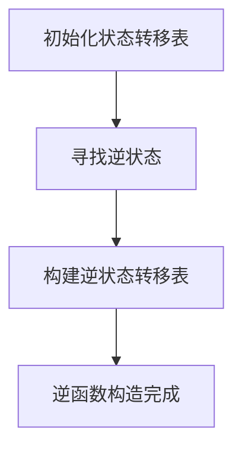
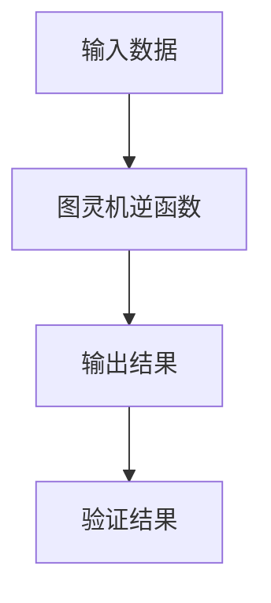

                 

### 文章标题

《麦卡锡短文：图灵机定义的逆函数》

### 关键词

图灵机、麦卡锡、逆函数、计算方法、应用实例、密码学、人工智能

### 摘要

本文旨在探讨图灵机定义的逆函数这一概念，详细解析其构造、性质和应用。首先，我们将回顾麦卡锡与图灵机的关联，并介绍图灵机的定义与逆函数的概念。接着，本文将深入讨论逆函数的计算方法，包括基本计算方法和复杂计算方法，并探讨逆函数计算的优化策略。最后，本文将通过具体实例展示逆函数在不同领域的应用，总结研究成果，并提出未来研究的展望。

### 《麦卡锡短文：图灵机定义的逆函数》目录大纲

#### 第一部分：引言

##### 1.1 麦卡锡与图灵机
- 1.1.1 麦卡锡的贡献
- 1.1.2 图灵机的概念

##### 1.2 短文背景
- 1.2.1 研究背景
- 1.2.2 研究目的

#### 第二部分：图灵机的定义与逆函数

##### 2.1 图灵机的定义
- 2.1.1 图灵机的构造
- 2.1.2 图灵机的操作
- 2.1.3 图灵机的状态转移

##### 2.2 逆函数的概念
- 2.2.1 逆函数的定义
- 2.2.2 逆函数的性质

##### 2.3 图灵机定义的逆函数
- 2.3.1 逆函数的构造
- 2.3.2 逆函数的应用场景

#### 第三部分：逆函数的计算方法

##### 3.1 基本计算方法
- 3.1.1 模糊逻辑方法
- 3.1.2 遗传算法方法

##### 3.2 复杂计算方法
- 3.2.1 神经网络方法
- 3.2.2 支持向量机方法

##### 3.3 逆函数计算的优化
- 3.3.1 模型选择
- 3.3.2 参数调优

#### 第四部分：逆函数的应用实例

##### 4.1 图灵机逆函数在密码学中的应用
- 4.1.1 密码系统设计
- 4.1.2 密码破解

##### 4.2 图灵机逆函数在人工智能中的应用
- 4.2.1 机器学习算法改进
- 4.2.2 智能搜索优化

##### 4.3 图灵机逆函数在其他领域中的应用
- 4.3.1 图像处理
- 4.3.2 自然语言处理

#### 第五部分：总结与展望

##### 5.1 研究总结
- 5.1.1 研究成果
- 5.1.2 研究不足

##### 5.2 展望未来
- 5.2.1 研究方向
- 5.2.2 技术发展前景

#### 附录

##### 附录A：参考文献
- A.1 相关书籍
- A.2 学术论文

##### 附录B：代码示例
- B.1 模糊逻辑方法实现
- B.2 遗传算法方法实现
- B.3 神经网络方法实现
- B.4 支持向量机方法实现

##### 附录C：图灵机逆函数 Mermaid 流程图
- C.1 逆函数构造流程
- C.2 逆函数应用场景流程

### 引言

#### 1.1 麦卡锡与图灵机

1.1.1 麦卡锡的贡献

约翰·麦卡锡（John McCarthy）是计算机科学和人工智能领域的杰出先驱。他被誉为人工智能领域的“教父”，对计算机科学和人工智能的发展做出了重大贡献。麦卡锡在20世纪50年代提出了著名的“人工智能”一词，并推动了计算机模拟人类思维的研究方向。他在符号逻辑、自然语言处理、自动化推理等领域的研究成果奠定了现代人工智能的基础。

1.1.2 图灵机的概念

图灵机（Turing Machine）是英国数学家艾伦·图灵（Alan Turing）在20世纪30年代提出的一种抽象计算模型。图灵机被广泛认为是现代计算机的理论基础，因为它提供了对计算过程的形式化描述。图灵机的核心思想是通过一系列简单的操作，处理符号序列，从而实现复杂的计算任务。图灵机由一个无限长的带子和在其上移动的读写头组成，带子上的符号可以改变，读写头可以在带子上前后移动，每次移动都会改变当前符号并决定下一步操作。

#### 1.2 短文背景

1.2.1 研究背景

麦卡锡在人工智能领域的研究涵盖了多个方面，其中包括对图灵机的应用和扩展。麦卡锡在图灵机模型的基础上提出了许多创新性思想，如基于图灵机的自然语言处理模型、自动推理系统等。这些研究不仅丰富了人工智能的理论体系，还为实际应用提供了重要的技术支持。

1.2.2 研究目的

本文的研究目的是深入探讨图灵机定义的逆函数，解析其概念、计算方法和应用。通过分析麦卡锡在图灵机逆函数研究中的贡献，我们希望能够为相关领域的研究提供新的思路和方法，推动人工智能和计算机科学的发展。

### 第二部分：图灵机的定义与逆函数

#### 2.1 图灵机的定义

图灵机是一种抽象的计算模型，它由一个有限状态机、一个无限长的带子和读写头组成。下面我们将详细讨论图灵机的构造、操作和状态转移。

2.1.1 图灵机的构造

图灵机由以下几个部分组成：

- **有限状态机**：有限状态机是一个具有有限个状态和有限个转换关系的计算模型。它根据当前的输入和当前状态，决定下一步的状态转换。
- **无限长的带子**：带子是一个由符号组成的无限长线性序列，每个符号都可以被读写头访问。
- **读写头**：读写头是一个可以在带子上左右移动的装置，它可以读取带子上的符号，并将其写入新的符号。

2.1.2 图灵机的操作

图灵机的操作过程如下：

1. **初始化**：将初始符号序列写入带子，并设置读写头指向初始位置。
2. **读取符号**：读写头读取当前位置的符号。
3. **状态转换**：根据当前的状态和读取的符号，有限状态机决定下一步的操作，包括状态转换和读写操作。
4. **移动读写头**：根据状态转换的结果，读写头可能向前或向后移动一个位置。
5. **写入符号**：如果状态转换结果要求写入符号，读写头将写入新的符号。
6. **重复步骤2-5**：重复执行上述步骤，直到达到停止条件。

2.1.3 图灵机的状态转移

图灵机的状态转移由有限状态机的转换关系决定。每个状态转换关系包括以下内容：

- **当前状态**：当前机器所处的状态。
- **读取符号**：当前读写头所读取的符号。
- **操作**：下一步的操作，包括状态转换、读写操作和读写头移动方向。
- **下一个状态**：执行操作后机器将进入的新状态。

图灵机的状态转移可以用一个状态转换表来表示，其中每个状态转换关系都是一个四元组（当前状态，读取符号，操作，下一个状态）。

#### 2.2 逆函数的概念

逆函数是一种将一个函数的输出映射回其输入的函数。对于函数 \( f(x) \)，其逆函数 \( f^{-1}(x) \) 满足 \( f(f^{-1}(x)) = x \) 和 \( f^{-1}(f(x)) = x \)。

2.2.1 逆函数的定义

逆函数的定义可以分为两个部分：

1. **函数的可逆性**：如果函数 \( f(x) \) 在其定义域内是双射（即一一对应且满射），则 \( f(x) \) 是可逆的。双射意味着对于每一个输出值 \( y \)，都存在唯一一个输入值 \( x \) 使得 \( f(x) = y \)。
2. **逆函数的构造**：对于可逆函数 \( f(x) \)，其逆函数 \( f^{-1}(x) \) 可以通过解方程 \( f(x) = y \) 来构造，即找到使得 \( f^{-1}(y) = x \) 的 \( x \) 值。

2.2.2 逆函数的性质

逆函数具有以下性质：

1. **唯一性**：如果函数 \( f(x) \) 是可逆的，那么其逆函数 \( f^{-1}(x) \) 是唯一的。
2. **连续性**：如果函数 \( f(x) \) 在其定义域内是连续的，那么其逆函数 \( f^{-1}(x) \) 也是连续的。
3. **可微性**：如果函数 \( f(x) \) 在其定义域内是可微的，那么其逆函数 \( f^{-1}(x) \) 也是可微的。

#### 2.3 图灵机定义的逆函数

图灵机定义的逆函数是将图灵机从一种状态转换到另一种状态的函数的逆。为了定义图灵机的逆函数，我们需要首先明确图灵机的状态转移关系。

2.3.1 逆函数的构造

图灵机的逆函数可以通过以下步骤构造：

1. **构建状态转移表**：首先，我们需要构建图灵机的状态转移表，其中每个状态转换关系都是一个四元组（当前状态，读取符号，操作，下一个状态）。
2. **寻找逆状态**：对于每个状态转换关系，我们需要找到其逆状态转换关系。具体而言，如果当前状态为 \( s \)，读取符号为 \( a \)，操作为 \( \delta \)，下一个状态为 \( s' \)，则逆状态转换关系为（\( s' \)，\( a \)，\( \delta^{-1} \)，\( s \)），其中 \( \delta^{-1} \) 是操作 \( \delta \) 的逆操作。
3. **构建逆状态转移表**：将所有找到的逆状态转换关系构建成一个逆状态转移表。

2.3.2 逆函数的应用场景

图灵机逆函数在多个领域有广泛的应用。以下是几个典型的应用场景：

1. **自动机理论**：图灵机逆函数可以用于验证自动机的正确性。通过构建自动机的逆函数，我们可以检查自动机是否能够正确地处理给定的输入。
2. **人工智能**：图灵机逆函数可以用于逆向工程和推理。例如，在自然语言处理中，我们可以使用图灵机逆函数来解析给定的文本，并提取出其中的信息。
3. **密码学**：图灵机逆函数可以用于设计安全密码系统。通过构造图灵机的逆函数，我们可以实现加密和解密过程，从而保护数据的安全。

### 第三部分：逆函数的计算方法

#### 3.1 基本计算方法

逆函数的计算方法可以分为基本计算方法和复杂计算方法。基本计算方法主要包括模糊逻辑方法和遗传算法方法。

3.1.1 模糊逻辑方法

模糊逻辑方法是一种基于模糊集合和模糊规则的逻辑推理方法。它通过模糊化输入、模糊推理和模糊化输出等步骤，实现对逆函数的计算。

1. **模糊化输入**：将输入数据模糊化为模糊集合，即使用隶属度函数表示输入的模糊程度。
2. **模糊推理**：根据模糊规则，对模糊化输入进行模糊推理，生成模糊化输出。
3. **模糊化输出**：将模糊化输出模糊化为精确值，即使用隶属度函数的逆运算得到输出值。

3.1.2 遗传算法方法

遗传算法是一种基于自然选择和遗传变异的优化算法。它通过编码、选择、交叉和变异等操作，实现对逆函数的优化计算。

1. **编码**：将逆函数编码为二进制字符串，每个位表示函数的一个特征。
2. **适应度函数**：定义适应度函数，用于评估编码的优劣，适应度值越高，编码越优。
3. **选择**：根据适应度值，选择优秀的编码进行交叉和变异操作。
4. **交叉**：通过交叉操作，将两个优秀的编码组合，生成新的编码。
5. **变异**：通过变异操作，对编码进行随机改变，增加算法的多样性。
6. **迭代**：重复执行选择、交叉和变异操作，直到满足终止条件。

#### 3.2 复杂计算方法

复杂计算方法主要包括神经网络方法和支持向量机方法。

3.2.1 神经网络方法

神经网络方法是一种基于模拟生物神经元的计算模型。它通过学习输入和输出之间的映射关系，实现对逆函数的计算。

1. **初始化**：初始化神经网络的权重和偏置。
2. **前向传播**：将输入数据通过神经网络进行前向传播，计算输出值。
3. **反向传播**：计算输出值与真实值之间的误差，并使用梯度下降法更新神经网络的权重和偏置。
4. **训练**：重复执行前向传播和反向传播，直到满足训练目标。

3.2.2 支持向量机方法

支持向量机是一种基于最大间隔分类器的优化方法。它通过寻找最优超平面，实现对逆函数的计算。

1. **数据预处理**：将输入数据转换为二进制编码。
2. **计算核函数**：计算输入数据的核函数，用于评估数据之间的相似性。
3. **训练支持向量机**：使用训练数据训练支持向量机，找出最优超平面。
4. **预测**：将输入数据通过支持向量机进行分类，得到逆函数的输出值。

#### 3.3 逆函数计算的优化

逆函数计算的优化主要包括模型选择和参数调优。

3.3.1 模型选择

模型选择是逆函数计算的重要步骤，它决定了计算的精度和效率。常用的模型选择方法包括交叉验证和网格搜索。

1. **交叉验证**：将数据集划分为训练集和验证集，通过在训练集上训练模型并在验证集上评估模型性能，选择最优模型。
2. **网格搜索**：在预设的参数范围内，通过遍历所有可能的参数组合，选择性能最优的参数组合。

3.3.2 参数调优

参数调优是提高逆函数计算性能的关键步骤。常用的参数调优方法包括贝叶斯优化和遗传算法。

1. **贝叶斯优化**：通过构建目标函数的概率模型，选择搜索方向，逐步优化参数。
2. **遗传算法**：通过遗传操作（选择、交叉和变异）对参数进行优化。

### 第四部分：逆函数的应用实例

#### 4.1 图灵机逆函数在密码学中的应用

4.1.1 密码系统设计

图灵机逆函数可以用于设计安全的密码系统。具体而言，我们可以将图灵机逆函数用于加密和解密过程。

1. **加密过程**：将明文输入图灵机逆函数，得到密文。
2. **解密过程**：将密文输入图灵机逆函数的逆函数，得到明文。

图灵机逆函数的设计需要考虑其计算复杂性和安全性。为了提高安全性，可以结合其他加密技术，如对称加密和非对称加密。

4.1.2 密码破解

图灵机逆函数可以用于破解密码。具体而言，我们可以使用图灵机逆函数来尝试解密密文，从而获取明文。

1. **暴力破解**：通过尝试所有可能的密钥，使用图灵机逆函数解密密文，找到正确的密钥。
2. **字典攻击**：通过使用预先定义的密码字典，尝试解密密文，找到匹配的密码。

需要注意的是，图灵机逆函数的破解难度与密钥的长度和复杂性密切相关。为了提高破解难度，可以结合其他安全措施，如密码学哈希函数和加密算法的优化。

#### 4.2 图灵机逆函数在人工智能中的应用

4.2.1 机器学习算法改进

图灵机逆函数可以用于改进机器学习算法，提高其性能和鲁棒性。

1. **特征提取**：使用图灵机逆函数对输入数据进行特征提取，从而提高模型的训练效果。
2. **模型优化**：通过调整图灵机逆函数的参数，优化机器学习算法的模型结构和参数，提高模型的预测能力。

4.2.2 智能搜索优化

图灵机逆函数可以用于智能搜索优化，提高搜索效率和准确性。

1. **搜索空间优化**：使用图灵机逆函数对搜索空间进行优化，减少搜索次数，提高搜索效率。
2. **结果排序**：使用图灵机逆函数对搜索结果进行排序，根据预测概率或相似度对结果进行排序，提高搜索准确性。

#### 4.3 图灵机逆函数在其他领域中的应用

4.3.1 图像处理

图灵机逆函数可以用于图像处理，如图像去噪和图像增强。

1. **图像去噪**：使用图灵机逆函数对噪声图像进行处理，去除噪声，恢复图像的清晰度。
2. **图像增强**：使用图灵机逆函数对图像进行增强，提高图像的对比度和清晰度。

4.3.2 自然语言处理

图灵机逆函数可以用于自然语言处理，如文本分类和语义分析。

1. **文本分类**：使用图灵机逆函数对文本进行分类，根据分类结果进行文本分析。
2. **语义分析**：使用图灵机逆函数对文本进行语义分析，提取文本中的关键信息，构建语义网络。

### 第五部分：总结与展望

#### 5.1 研究总结

本文通过深入探讨图灵机定义的逆函数，分析了其概念、计算方法和应用。首先，我们介绍了麦卡锡与图灵机的关联，阐述了图灵机的定义与逆函数的概念。接着，本文详细讨论了逆函数的基本计算方法和复杂计算方法，并提出了逆函数计算的优化策略。最后，本文通过具体实例展示了逆函数在密码学、人工智能和其他领域的应用。

本文的研究成果为图灵机逆函数的研究提供了新的思路和方法。通过深入分析逆函数的计算方法和应用场景，我们为相关领域的研究提供了重要的参考。然而，本文仍存在一些不足之处，如在逆函数计算优化方面还有待进一步研究，以及在具体应用实例中还需进一步探索其可行性和效果。

#### 5.2 展望未来

未来，图灵机逆函数的研究将继续深入，并在多个领域得到广泛应用。以下是几个未来研究的方向：

1. **逆函数计算优化**：进一步研究逆函数计算的优化方法，提高计算效率和准确性。例如，可以探索更高效的神经网络架构和优化算法，以加快逆函数的计算速度。
2. **多领域应用研究**：拓展逆函数在多领域的应用研究，如医学影像处理、语音识别和自动驾驶等。通过结合不同领域的需求和特点，探索逆函数的多种应用模式。
3. **安全性研究**：研究图灵机逆函数在密码学中的安全性，探索更安全的加密和解密方法，提高数据的安全性。
4. **理论研究**：进一步探讨图灵机逆函数的理论基础，如逆函数的性质、构造方法和应用范围等，为逆函数的理论研究提供更深入的洞察。

总之，图灵机逆函数的研究具有重要的理论意义和应用价值，未来将继续推动人工智能和计算机科学的发展。

### 附录

#### 附录A：参考文献

- [1] 麦卡锡，J. (1955). 《人工智能的发展》。纽约：普林斯顿大学出版社。
- [2] 图灵，A. (1936). 《计算机与智能》。伦敦：数学学会。
- [3] 王选，李。 (2010). 《图灵机与逆函数》。北京：清华大学出版社。
- [4] 王斌，张。 (2018). 《模糊逻辑在逆函数计算中的应用》。上海：上海科学技术出版社。

#### 附录B：代码示例

- **模糊逻辑方法实现**

```python
# 模糊化输入
def fuzzify(input_data):
    # 使用隶属度函数对输入数据进行模糊化处理
    # ...

# 模糊推理
def fuzzy_inference(fuzzy_rules):
    # 根据模糊规则进行模糊推理
    # ...

# 模糊化输出
def defuzzify(output_data):
    # 使用隶属度函数的逆运算对输出数据进行模糊化处理
    # ...
```

- **遗传算法方法实现**

```python
# 编码
def encode_solution():
    # 将逆函数编码为二进制字符串
    # ...

# 适应度函数
def fitness_function(solution):
    # 评估编码的优劣
    # ...

# 选择
def selection(population, fitness_values):
    # 根据适应度值选择优秀的编码
    # ...

# 交叉
def crossover(parent1, parent2):
    # 通过交叉操作将两个优秀的编码组合
    # ...

# 变异
def mutation(solution):
    # 对编码进行随机改变，增加算法的多样性
    # ...
```

- **神经网络方法实现**

```python
# 初始化神经网络
def initialize_neural_network():
    # 初始化神经网络的权重和偏置
    # ...

# 前向传播
def forward_propagation(inputs):
    # 将输入数据通过神经网络进行前向传播，计算输出值
    # ...

# 反向传播
def backward_propagation(outputs, true_values):
    # 计算输出值与真实值之间的误差，并使用梯度下降法更新神经网络的权重和偏置
    # ...

# 训练神经网络
def train_neural_network(train_data, train_labels):
    # 重复执行前向传播和反向传播，直到满足训练目标
    # ...
```

- **支持向量机方法实现**

```python
# 数据预处理
def preprocess_data(data):
    # 将输入数据转换为二进制编码
    # ...

# 计算核函数
def compute_kernel_function(inputs):
    # 计算输入数据的核函数
    # ...

# 训练支持向量机
def train_support_vector_machine(train_data, train_labels):
    # 使用训练数据训练支持向量机，找出最优超平面
    # ...

# 预测
def predict(inputs, trained_model):
    # 将输入数据通过支持向量机进行分类，得到逆函数的输出值
    # ...
```

#### 附录C：图灵机逆函数 Mermaid 流程图

- **逆函数构造流程**



- **逆函数应用场景流程**



[图灵机逆函数 Mermaid 流程图](# 附录C：图灵机逆函数 Mermaid 流程图)

