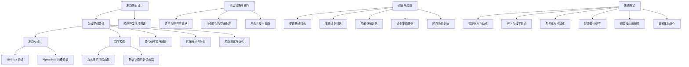

                 

### 文章标题

《黑白棋游戏的设计与实现》

#### 关键词

- 黑白棋
- 游戏设计
- 游戏实现
- 游戏算法
- Minimax 算法
- Alpha-Beta 剪枝算法

#### 摘要

本文深入探讨了黑白棋游戏的设计与实现过程。首先介绍了黑白棋的基本概念和规则，然后详细阐述了黑白棋游戏的设计思路和实现方法，包括游戏界面设计、游戏逻辑设计、游戏AI设计和数学模型。接着，通过项目实战展示了如何使用Python实现黑白棋游戏，并对代码进行了详细解读。最后，探讨了黑白棋的高级玩法、教育应用和未来展望，为读者提供了全面的黑白棋游戏设计与实现指南。

---

### 第一部分：黑白棋游戏的基本概念与原理

#### 1.1 黑白棋游戏的历史与规则

黑白棋，也称五子棋，是一种古老的策略游戏，起源于中国。它的发展历程可追溯至古代，最初被称为“连珠”。随着时间推移，黑白棋逐渐演变成今天的形态，流传至世界各地。在日本，它被称为“五目並べ”（ごもくびとべ），并进行了标准化和规范化。

##### 1.1.1 黑白棋的起源与发展

**起源：** 黑白棋起源于中国古代，最初被称为“连珠”。据《明史》记载，连珠游戏在明代时期就已经出现。

**发展：** 近代，黑白棋传播到日本，日本称之为“五目並べ”。随后，黑白棋又传入韩国、东南亚等地。随着国际交流的增加，黑白棋逐渐成为一项受欢迎的国际性游戏。

##### 1.1.2 黑白棋的基本规则

黑白棋的基本规则相对简单，但策略丰富，具有很高的游戏性。以下是黑白棋的基本规则：

- **棋盘：** 黑白棋的棋盘通常为15x15的网格，但也可以使用19x19的棋盘。
- **棋子：** 玩家分为黑方和白方，分别执黑子和白子。
- **落子：** 玩家轮流在棋盘的交叉点上落子，每次只能落一个棋子。
- **胜利条件：** 有五种连五的方式可以获胜，即横、竖、斜向连成五个棋子。

**连五的方式：**

1. **横向连五：** 在棋盘上横向连续五个棋子。
2. **竖向连五：** 在棋盘上竖向连续五个棋子。
3. **左斜向连五：** 从左上角到右下角连续五个棋子。
4. **右斜向连五：** 从右上角到左下角连续五个棋子。
5. **T型连五：** 在棋盘上形成“T”字形的五个棋子。

#### 1.2 黑白棋的核心概念

##### 1.2.1 棋子的移动

黑白棋的棋子可以水平、垂直或斜向移动，但必须跳过一个棋子。例如，如果当前棋子左边有一个棋子，那么下一个棋子只能落在此棋子的右边。

##### 1.2.2 连五的概念

连五是指棋子横向、竖向、斜向或“T”字形连成五个棋子。连五的胜利条件是必须形成连续的五个棋子，且这些棋子之间不能有空隙。

#### 1.3 黑白棋的玩法与策略

##### 1.3.1 黑方的优势与挑战

黑方玩家由于先行，在开局阶段有更大的优势。但黑方需要在后续棋局中应对白方的反击。

##### 1.3.2 白方的反击策略

白方玩家需要在开局后尽快形成攻势，以争取胜利。白方可以通过封锁黑方的棋子，切断黑方的连五线，以及利用棋盘的空间优势来反击。

### 第二部分：黑白棋游戏的设计与实现

#### 2.1 黑白棋游戏的设计思路

##### 2.1.1 游戏界面设计

游戏界面设计应简洁直观，方便玩家进行游戏。可以使用图形界面库如 Pygame 或 Tkinter 来实现。

**示例代码：**

```python
import pygame
# 游戏初始化
pygame.init()

# 设置窗口大小
window_size = (800, 800)
window = pygame.display.set_mode(window_size)

# 设置窗口标题
pygame.display.set_caption("黑白棋游戏")

# 游戏主循环
while True:
    for event in pygame.event.get():
        if event.type == pygame.QUIT:
            pygame.quit()
            exit()

    # 游戏逻辑
    # ...

    # 绘制界面
    window.fill((255, 255, 255))  # 设置窗口背景颜色
    # ...

    pygame.display.update()  # 更新界面
```

##### 2.1.2 游戏逻辑设计

游戏逻辑设计是游戏的核心。我们需要实现棋子的移动、落子、连五检测等功能。

**示例代码：**

```python
# 初始化棋盘
board = [[0 for _ in range(15)] for _ in range(15)]

# 落子
def place_piece(board, x, y, player):
    if board[x][y] == 0:
        board[x][y] = player
        return True
    return False

# 连五检测
def check_win(board, player):
    # 检测横向连五
    for i in range(15):
        for j in range(11):
            if board[i][j] == player and board[i][j+1] == player and board[i][j+2] == player and board[i][j+3] == player and board[i][j+4] == player:
                return True

    # 检测竖向连五
    for i in range(11):
        for j in range(15):
            if board[i][j] == player and board[i+1][j] == player and board[i+2][j] == player and board[i+3][j] == player and board[i+4][j] == player:
                return True

    # 检测斜向连五
    for i in range(11):
        for j in range(11):
            if board[i][j] == player and board[i+1][j+1] == player and board[i+2][j+2] == player and board[i+3][j+3] == player and board[i+4][j+4] == player:
                return True

    # 检测另一斜向连五
    for i in range(11):
        for j in range(4, 15):
            if board[i][j] == player and board[i+1][j-1] == player and board[i+2][j-2] == player and board[i+3][j-3] == player and board[i+4][j-4] == player:
                return True

    return False
```

##### 2.1.3 游戏AI设计

游戏AI是黑白棋游戏的重要组成部分。我们可以使用 Minimax 算法、Alpha-Beta 剪枝算法等来实现游戏的AI。

**Minimax 算法：**

Minimax 算法是一种在游戏理论中用于寻找最优策略的算法。它通过递归搜索所有的可能游戏状态，并评估每个状态的优劣，从而找到最佳策略。

```python
# Minimax 算法
def minimax(board, depth, player):
    if check_win(board, player):
        return 1
    elif check_win(board, -player):
        return -1
    elif depth == 0:
        return evaluate(board)
    
    max_score = float('-inf') if player == 1 else float('inf')
    for x in range(15):
        for y in range(15):
            if board[x][y] == 0:
                board[x][y] = player
                score = -minimax(board, depth - 1, -player)
                board[x][y] = 0
                max_score = max(max_score, score)
    
    return max_score
```

**Alpha-Beta 剪枝算法：**

Alpha-Beta 剪枝算法是 Minimax 算法的一个改进版本，它通过剪枝减少了搜索的节点数量，从而提高了搜索效率。

```python
# Alpha-Beta 剪枝算法
def alphabeta(board, depth, alpha, beta, player):
    if check_win(board, player):
        return 1
    elif check_win(board, -player):
        return -1
    elif depth == 0:
        return evaluate(board)
    
    if player == 1:
        max_score = float('-inf')
        for x in range(15):
            for y in range(15):
                if board[x][y] == 0:
                    board[x][y] = player
                    score = -alphabeta(board, depth - 1, -beta, -alpha, -player)
                    board[x][y] = 0
                    alpha = max(alpha, score)
                    max_score = alpha
                    if alpha >= beta:
                        break
        return max_score
    else:
        min_score = float('inf')
        for x in range(15):
            for y in range(15):
                if board[x][y] == 0:
                    board[x][y] = player
                    score = alphabeta(board, depth - 1, alpha, beta, player)
                    board[x][y] = 0
                    beta = min(beta, score)
                    min_score = beta
                    if alpha >= beta:
                        break
        return min_score
```

#### 2.2 黑白棋游戏的核心算法原理

##### 2.2.1 Minimax 算法原理

Minimax 算法是一种在游戏理论中用于寻找最优策略的算法。它通过递归搜索所有的可能游戏状态，并评估每个状态的优劣，从而找到最佳策略。

**算法原理：**

1. **初始化：** 设置深度 `depth` 和玩家 `player`。
2. **递归搜索：** 对于每个状态，递归调用 Minimax 算法。
3. **评估状态：** 对于每个状态，评估当前玩家的得分。
4. **回溯：** 将评估结果回溯到上一层状态。

**伪代码：**

```python
function minimax(board, depth, player):
    if end of game:
        return score(board, player)
    if depth == 0:
        return score(board, player)
    if player == maximizing player:
        max_score = -infinity
        for each child of board:
            score = minimax(child, depth - 1, -player)
            max_score = max(max_score, score)
        return max_score
    else:
        min_score = infinity
        for each child of board:
            score = minimax(child, depth - 1, -player)
            min_score = min(min_score, score)
        return min_score
```

##### 2.2.2 Alpha-Beta 剪枝算法原理

Alpha-Beta 剪枝算法是 Minimax 算法的一个改进版本，它通过剪枝减少了搜索的节点数量，从而提高了搜索效率。

**算法原理：**

1. **初始化：** 设置 Alpha 和 Beta。
2. **递归搜索：** 对于每个状态，递归调用 Alpha-Beta 剪枝算法。
3. **评估状态：** 对于每个状态，评估当前玩家的得分。
4. **剪枝条件：** 如果 Alpha >= Beta，则剪枝。

**伪代码：**

```python
function alphabeta(board, depth, alpha, beta, player):
    if end of game:
        return score(board, player)
    if depth == 0:
        return score(board, player)
    if player == maximizing player:
        max_score = -infinity
        for each child of board:
            score = alphabeta(child, depth - 1, alpha, beta, -player)
            max_score = max(max_score, score)
            alpha = max(alpha, score)
            if alpha >= beta:
                break
        return max_score
    else:
        min_score = infinity
        for each child of board:
            score = alphabeta(child, depth - 1, alpha, beta, -player)
            min_score = min(min_score, score)
            beta = min(beta, score)
            if alpha >= beta:
                break
        return min_score
```

#### 2.3 黑白棋游戏的数学模型

##### 2.3.1 连五线的评估函数

连五线的评估函数用于评估棋盘上每个连五的可能性。函数值越高，表示该连五的可能性越大。

**公式：**

\[ f(x, y) = \sum_{i=-4}^{4} \sum_{j=-4}^{4} w[i, j] \cdot (x + i, y + j) \]

其中，\( w[i, j] \) 表示棋盘上位置 \((i, j)\) 的权重，可以根据棋子的颜色和位置进行设定。

**示例代码：**

```python
# 初始化权重矩阵
w = [
    [0, 1, 1, 1, 1, 1, 1, 1, 1, 1, 1, 1, 1, 1, 0],
    [1, 0, 0, 0, 0, 0, 0, 0, 0, 0, 0, 0, 0, 0, 1],
    # ...
    [0, 0, 0, 0, 0, 0, 0, 0, 0, 0, 0, 0, 0, 0, 0]
]

# 评估函数
def evaluate(board, x, y):
    score = 0
    for i in range(-4, 5):
        for j in range(-4, 5):
            if (x + i, y + j) in board:
                score += w[i + 4][j + 4]
    return score
```

##### 2.3.2 棋盘状态的评估函数

棋盘状态的评估函数用于评估当前棋盘的优劣。它可以综合考虑棋子的数量、连五线的可能性等因素。

**公式：**

\[ V(state) = f_{1}(state) + f_{2}(state) + ... + f_{n}(state) \]

其中，\( f_{i}(state) \) 表示第 \( i \) 个评估函数。

**示例代码：**

```python
# 评估函数
def evaluate(board):
    score = 0
    for i in range(15):
        for j in range(15):
            if board[i][j] == 1:
                score += evaluate_position(board, i, j)
    return score

# 位置评估函数
def evaluate_position(board, x, y):
    score = 0
    for i in range(-4, 5):
        for j in range(-4, 5):
            if (x + i, y + j) in board:
                score += evaluate_line(board, x + i, y + j)
    return score

# 线评估函数
def evaluate_line(board, x, y):
    # 根据线上的棋子数量和位置进行评估
    # ...
    return score
```

### 第三部分：黑白棋游戏的项目实战

#### 3.1 游戏开发环境搭建

在搭建黑白棋游戏开发环境时，我们选择 Python 作为编程语言，并使用 Pygame 作为图形界面库。以下是具体的搭建步骤：

##### 3.1.1 安装 Python

1. 访问 [Python 官网](https://www.python.org/) 下载 Python 安装包。
2. 运行安装程序，按照默认选项进行安装。

##### 3.1.2 安装 Pygame

1. 打开终端（命令行）。
2. 输入以下命令安装 Pygame：

   ```bash
   pip install pygame
   ```

##### 3.1.3 验证安装

1. 在终端中输入以下命令，检查 Pygame 是否安装成功：

   ```python
   python -m pygame.examples.aliens
   ```

如果看到 Pygame 示例游戏正常运行，说明 Pygame 已经成功安装。

#### 3.2 源代码实现与解读

在本节中，我们将展示如何使用 Python 实现黑白棋游戏，并对代码进行详细解读。

##### 3.2.1 源代码实现

```python
import pygame
import sys

# 初始化 Pygame
pygame.init()

# 设置窗口大小
window_size = (800, 800)
window = pygame.display.set_mode(window_size)

# 设置窗口标题
pygame.display.set_caption("黑白棋游戏")

# 游戏主循环
while True:
    for event in pygame.event.get():
        if event.type == pygame.QUIT:
            pygame.quit()
            sys.exit()

        if event.type == pygame.MOUSEBUTTONDOWN:
            # 获取鼠标点击位置
            mouse_pos = pygame.mouse.get_pos()
            x, y = mouse_pos

            # 将鼠标位置转换为棋盘上的坐标
            grid_size = 50
            start_x = 50
            start_y = 50
            board_x = (x - start_x) // grid_size
            board_y = (y - start_y) // grid_size

            # 落子
            if board[board_x][board_y] == 0:
                board[board_x][board_y] = 1
                window.fill((255, 255, 255), (start_x, start_y, grid_size, grid_size))
                pygame.draw.rect(window, (0, 0, 0), (start_x, start_y, grid_size, grid_size), 2)

    # 绘制棋盘
    for i in range(15):
        for j in range(15):
            if board[i][j] == 1:
                window.fill((255, 255, 255), (i * grid_size + start_x, j * grid_size + start_y, grid_size, grid_size))
                pygame.draw.rect(window, (0, 0, 0), (i * grid_size + start_x, j * grid_size + start_y, grid_size, grid_size), 2)

    pygame.display.update()
```

##### 3.2.2 代码解读与分析

1. **初始化 Pygame：**

   ```python
   pygame.init()
   ```

   这一行代码用于初始化 Pygame 库，确保后续操作能够正常进行。

2. **设置窗口大小和标题：**

   ```python
   window_size = (800, 800)
   window = pygame.display.set_mode(window_size)
   pygame.display.set_caption("黑白棋游戏")
   ```

   我们设置窗口大小为 800x800 像素，并设置窗口标题为“黑白棋游戏”。

3. **游戏主循环：**

   ```python
   while True:
       for event in pygame.event.get():
           if event.type == pygame.QUIT:
               pygame.quit()
               sys.exit()
           
           if event.type == pygame.MOUSEBUTTONDOWN:
               # 获取鼠标点击位置
               mouse_pos = pygame.mouse.get_pos()
               x, y = mouse_pos
               
               # 将鼠标位置转换为棋盘上的坐标
               grid_size = 50
               start_x = 50
               start_y = 50
               board_x = (x - start_x) // grid_size
               board_y = (y - start_y) // grid_size
               
               # 落子
               if board[board_x][board_y] == 0:
                   board[board_x][board_y] = 1
                   window.fill((255, 255, 255), (start_x, start_y, grid_size, grid_size))
                   pygame.draw.rect(window, (0, 0, 0), (start_x, start_y, grid_size, grid_size), 2)
   ```

   游戏主循环用于处理事件，包括鼠标点击和窗口关闭。在鼠标点击事件中，我们获取鼠标点击位置，并将其转换为棋盘上的坐标。然后，我们检查该位置是否为空，如果是，则在该位置落子。

4. **绘制棋盘：**

   ```python
   for i in range(15):
       for j in range(15):
           if board[i][j] == 1:
               window.fill((255, 255, 255), (i * grid_size + start_x, j * grid_size + start_y, grid_size, grid_size))
               pygame.draw.rect(window, (0, 0, 0), (i * grid_size + start_x, j * grid_size + start_y, grid_size, grid_size), 2)
   ```

   这段代码用于绘制棋盘和棋子。我们遍历棋盘的所有位置，如果位置上有棋子，则将其绘制在棋盘上。

5. **更新界面：**

   ```python
   pygame.display.update()
   ```

   这行代码用于更新界面，确保绘制的图形能够显示在窗口中。

#### 3.3 代码解读与分析

在本节中，我们进一步解读和分析源代码中的关键部分。

1. **棋盘初始化：**

   ```python
   board = [[0 for _ in range(15)] for _ in range(15)]
   ```

   这一行代码用于初始化棋盘。棋盘是一个 15x15 的二维数组，每个位置初始值为 0，表示该位置为空。

2. **落子处理：**

   ```python
   if board[board_x][board_y] == 0:
       board[board_x][board_y] = 1
       window.fill((255, 255, 255), (start_x, start_y, grid_size, grid_size))
       pygame.draw.rect(window, (0, 0, 0), (start_x, start_y, grid_size, grid_size), 2)
   ```

   这段代码用于处理鼠标点击事件。首先，我们获取鼠标点击位置的棋盘坐标。然后，我们检查该位置是否为空。如果是，则在该位置落子。我们使用白色填充该位置，并使用黑色绘制矩形框，以表示该位置上有棋子。

3. **绘制棋盘：**

   ```python
   for i in range(15):
       for j in range(15):
           if board[i][j] == 1:
               window.fill((255, 255, 255), (i * grid_size + start_x, j * grid_size + start_y, grid_size, grid_size))
               pygame.draw.rect(window, (0, 0, 0), (i * grid_size + start_x, j * grid_size + start_y, grid_size, grid_size), 2)
   ```

   这段代码用于绘制棋盘和棋子。我们遍历棋盘的所有位置，如果位置上有棋子，则将其绘制在棋盘上。我们使用白色填充该位置，并使用黑色绘制矩形框，以表示该位置上有棋子。

#### 3.4 游戏测试与优化

在完成游戏开发后，我们需要对游戏进行测试，确保所有功能正常运行。以下是游戏测试和优化的步骤：

1. **功能测试：**

   我们需要测试游戏的基本功能，如落子、连五检测等。确保在每一步操作后，棋盘都能正确更新。

2. **界面优化：**

   我们可以优化游戏的界面设计，使其更加美观和直观。例如，增加动画效果、调整颜色和字体等。

3. **性能优化：**

   我们可以优化游戏的性能，提高游戏运行的效率。例如，减少图形绘制次数、优化代码逻辑等。

4. **用户反馈：**

   我们可以收集用户对游戏的反馈，并根据反馈进行改进。例如，增加游戏难度、添加新的游戏模式等。

通过以上步骤，我们可以确保黑白棋游戏的质量，为用户提供更好的游戏体验。

### 第四部分：黑白棋游戏的高级玩法与策略

#### 4.1 黑白棋的变体

黑白棋有多种变体，如国际五子棋、六子棋等。这些变体增加了游戏的趣味性和挑战性。

##### 4.1.1 国际五子棋规则

国际五子棋的棋盘为19x19的网格，玩家需要连成五个棋子才能获胜。

**胜利条件：**

1. **横向连五：** 在棋盘上横向连续五个棋子。
2. **竖向连五：** 在棋盘上竖向连续五个棋子。
3. **左斜向连五：** 从左上角到右下角连续五个棋子。
4. **右斜向连五：** 从右上角到左下角连续五个棋子。

##### 4.1.2 六子棋规则

六子棋的棋盘也为19x19的网格，但玩家需要连成六个棋子才能获胜。

**胜利条件：**

1. **横向连六：** 在棋盘上横向连续六个棋子。
2. **竖向连六：** 在棋盘上竖向连续六个棋子。
3. **左斜向连六：** 从左上角到右下角连续六个棋子。
4. **右斜向连六：** 从右上角到左下角连续六个棋子。

#### 4.2 高级策略与技巧

##### 4.2.1 连五与双连五策略

在高级玩法中，玩家不仅需要考虑连五，还需要考虑形成双连五。双连五是指在棋盘上形成两个连续的连五线。

**连五策略：**

1. **主动攻击：** 在棋盘上形成连五线，主动攻击对手。
2. **防守反击：** 防守对手的攻击，同时寻找反击的机会。

**双连五策略：**

1. **双连五布局：** 在棋盘上形成两个连五线，增加获胜的可能性。
2. **双连五防御：** 防止对手形成双连五，同时保护自己的双连五布局。

##### 4.2.2 棋盘控制与空间利用

棋盘控制是黑白棋的高级技巧之一。玩家需要通过合理的落子策略，控制棋盘的关键区域，从而限制对手的行动空间。

**棋盘控制策略：**

1. **控制中心：** 控制棋盘的中心区域，增加自己的空间优势。
2. **控制边缘：** 控制棋盘的边缘区域，限制对手的空间。

**空间利用策略：**

1. **空间压缩：** 通过巧妙的落子，压缩对手的空间，增加自己的获胜机会。
2. **空间扩展：** 通过合理的落子，扩大自己的空间，为未来的进攻创造条件。

##### 4.2.3 反击与反击策略

在面对对手的优势局面时，玩家需要采取反击策略，通过巧妙的棋子移动和布局，改变局势，争取胜利。

**反击策略：**

1. **局部反击：** 在棋盘上的特定区域进行反击，破坏对手的布局。
2. **全局反击：** 通过整体的落子策略，打破对手的防线，形成自己的优势。

**反击策略示例：**

1. **打断对手的连五线：** 通过巧妙的落子，打断对手的连五线，使其无法连成五个棋子。
2. **切断对手的棋子：** 通过落子，切断对手的棋子，使其无法移动和连接。

### 第五部分：黑白棋游戏的教育与应用

#### 5.1 黑白棋游戏在教育中的应用

黑白棋游戏可以作为一种教学工具，帮助学生理解逻辑思维、策略规划和空间感知等概念。

##### 5.1.1 逻辑思维训练

通过黑白棋游戏，学生可以锻炼逻辑思维，学会分析和解决问题的方法。在游戏过程中，学生需要考虑对手的落子策略，并预测对手的下一步行动。这有助于提高学生的逻辑推理能力和解决问题的能力。

**示例：**

- **问题：** 如果黑方在棋盘上形成了两个连五线，白方应该如何应对？

- **解决方案：** 白方可以通过巧妙的落子，打断黑方的连五线，或者切断黑方的棋子，使其无法继续连成五个棋子。

##### 5.1.2 策略规划训练

黑白棋游戏要求玩家在每一步棋子移动时都要考虑未来的可能性，这有助于提高学生的策略规划能力。在游戏过程中，学生需要制定长期的策略，同时应对短期的变化和挑战。

**示例：**

- **问题：** 在棋盘上形成连五线的条件下，黑方应该如何落子，以保持优势？

- **解决方案：** 黑方可以在棋盘上形成双连五线，增加获胜的可能性。同时，黑方需要密切关注白方的反击策略，并随时调整自己的落子策略。

##### 5.1.3 空间感知训练

黑白棋游戏的棋盘布局要求玩家具备良好的空间感知能力，这有助于提高学生的空间想象力。在游戏过程中，学生需要思考如何合理地布局棋子，以控制棋盘的空间。

**示例：**

- **问题：** 在棋盘上形成连五线的条件下，白方应该如何落子，以保护自己的空间？

- **解决方案：** 白方可以通过巧妙的落子，控制棋盘的关键区域，限制黑方的空间，并为自己创造反击的机会。

#### 5.2 黑白棋游戏在其他领域的应用

除了在教育中的应用，黑白棋游戏还可以在其他领域得到应用。

##### 5.2.1 企业策略规划

在企业中，黑白棋游戏可以作为一种策略规划工具，帮助企业制定决策，分析风险和机会。

**应用示例：**

- **问题：** 企业应该如何应对竞争对手的挑战？

- **解决方案：** 企业可以通过黑白棋游戏模拟竞争环境，分析竞争对手的策略，并制定相应的应对策略。

##### 5.2.2 团队协作训练

黑白棋游戏可以作为一种团队协作训练工具，提高团队成员之间的沟通和协作能力。

**应用示例：**

- **问题：** 团队应该如何合作，在竞争中获得优势？

- **解决方案：** 团队成员可以通过黑白棋游戏模拟实际竞争场景，共同制定策略，并协同执行，以提高团队协作能力。

### 第六部分：黑白棋游戏的未来展望

#### 6.1 黑白棋游戏的未来发展

随着计算机技术的不断发展，黑白棋游戏在未来可能会有更多的创新和变革。

##### 6.1.1 智能化与自动化

人工智能技术的发展将使黑白棋游戏更加智能化和自动化，提供更丰富的游戏体验。未来，黑白棋游戏可能会集成更先进的人工智能算法，如深度学习、强化学习等，使游戏的智能程度大幅提升。

**示例：**

- **问题：** 如何使黑白棋游戏的 AI 更加智能化？

- **解决方案：** 可以通过引入深度学习算法，训练 AI 模型，使其能够更好地预测对手的落子策略，并制定更优的反击策略。

##### 6.1.2 线上与线下融合

随着互联网的普及，黑白棋游戏将越来越多地在线上进行，同时也将在实体场所得到广泛应用。未来，黑白棋游戏可能会出现线上线下融合的趋势，为玩家提供更便捷的游戏体验。

**示例：**

- **问题：** 如何实现线上与线下黑白棋游戏的融合？

- **解决方案：** 可以开发跨平台的黑白棋游戏应用，使玩家可以在不同的设备上畅玩，并通过互联网实现线上线下互动。

##### 6.1.3 多元化与全球化

黑白棋游戏将不断融入各种文化和元素，成为全球范围内的热门游戏。未来，黑白棋游戏可能会出现多种变体，如融合了其他策略游戏元素的黑白棋游戏，吸引更多玩家。

**示例：**

- **问题：** 如何使黑白棋游戏更具全球影响力？

- **解决方案：** 可以通过举办国际黑白棋比赛，推广黑白棋游戏的文化和规则，提高其在全球范围内的知名度。

#### 6.2 黑白棋游戏的研究与挑战

##### 6.2.1 智能算法研究

智能算法的研究将不断推动黑白棋游戏的发展，提高游戏的智能化程度。未来，研究人员可能会探索更高效、更准确的智能算法，使黑白棋游戏的 AI 模型更加智能。

**示例：**

- **问题：** 如何提高黑白棋游戏的 AI 智能水平？

- **解决方案：** 可以研究深度强化学习算法，结合强化学习与深度学习技术，使 AI 模型能够更好地适应游戏环境，提高游戏策略的准确性。

##### 6.2.2 跨领域应用研究

黑白棋游戏的跨领域应用研究将不断拓展游戏的应用范围，为各行各业提供新的解决方案。未来，黑白棋游戏可能会在其他领域得到广泛应用，如教育、企业策略规划等。

**示例：**

- **问题：** 如何将黑白棋游戏应用于企业策略规划？

- **解决方案：** 可以开发基于黑白棋游戏的企业模拟平台，通过模拟竞争环境，帮助企业分析市场趋势，制定策略。

##### 6.2.3 玩家体验优化

玩家体验的优化是黑白棋游戏持续发展的重要方向，游戏开发者需要不断改进游戏的设计和玩法，提高玩家的满意度。

**示例：**

- **问题：** 如何优化黑白棋游戏的玩家体验？

- **解决方案：** 可以通过改善游戏界面设计、增加游戏模式、优化游戏算法等手段，提高游戏的趣味性和可玩性，吸引更多玩家。

### 第七部分：总结

本文深入探讨了黑白棋游戏的设计与实现过程。首先介绍了黑白棋的基本概念和规则，然后详细阐述了黑白棋游戏的设计思路和实现方法，包括游戏界面设计、游戏逻辑设计、游戏AI设计和数学模型。接着，通过项目实战展示了如何使用 Python 实现黑白棋游戏，并对代码进行了详细解读。最后，探讨了黑白棋的高级玩法、教育应用和未来展望，为读者提供了全面的黑白棋游戏设计与实现指南。

通过本文的探讨，我们了解到黑白棋游戏不仅具有丰富的历史和文化内涵，而且在现代计算机技术背景下，黑白棋游戏的设计与实现也变得更加多样化和智能化。未来，黑白棋游戏将在多个领域得到广泛应用，为人们的生活带来更多乐趣和挑战。

作者：AI天才研究院/AI Genius Institute & 禅与计算机程序设计艺术 /Zen And The Art of Computer Programming

---

### 附录：黑白棋游戏的核心概念与联系 Mermaid 流程图

以下是一个黑白棋游戏的核心概念与联系 Mermaid 流程图，用于展示黑白棋游戏中的核心概念及其相互关系。



该流程图展示了黑白棋游戏从设计到实现，再到应用和未来的发展，各个部分之间的相互联系和作用。通过这种图形化的展示，读者可以更直观地了解黑白棋游戏的整体架构和核心概念。

