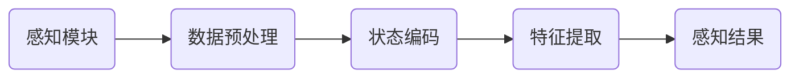
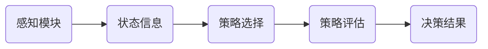
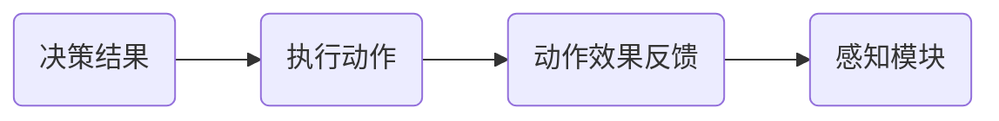
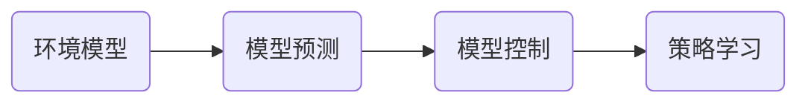
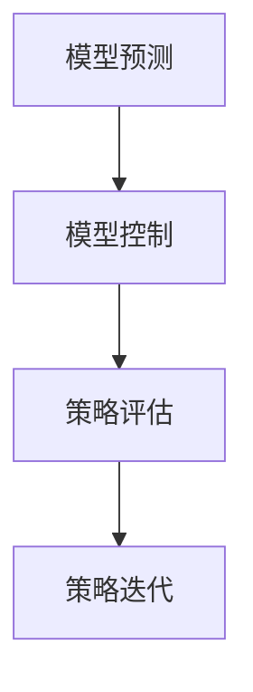

                 

# 文章标题: AI Agent 基本框架

> 关键词：AI Agent、强化学习、感知模块、决策模块、动作模块、模型预测、actor-critic 算法

> 摘要：本文将详细介绍 AI Agent 的基本框架，包括其定义、基本架构、核心算法、应用场景以及实现细节。通过本文的阅读，读者将能够全面了解 AI Agent 的工作原理，以及其在实际应用中的挑战和未来发展。

## 第一部分: AI Agent 基本框架

### 第1章: AI Agent 的概述

#### 1.1 AI Agent 的定义与背景

##### 1.1.1 AI Agent 的定义

AI Agent 是一种计算机程序，它在特定的环境中通过感知环境状态、制定策略、执行动作来达到特定的目标。它是人工智能领域中的一个重要概念，代表了智能体的智能行为。

##### 1.1.2 AI Agent 的背景

AI Agent 的概念起源于人工智能的研究，随着计算机技术和算法的不断发展，AI Agent 在各个领域得到了广泛应用。从早期的专家系统到现代的深度学习和强化学习，AI Agent 的发展经历了多个阶段。

#### 1.2 AI Agent 的基本架构

##### 1.2.1 感知模块

感知模块是 AI Agent 的核心部分，它负责感知环境状态，将环境中的信息转化为机器可以理解的数据。



##### 1.2.2 计策模块

计策模块是 AI Agent 的决策核心，它根据感知模块提供的状态信息，制定出最优的决策策略。



##### 1.2.3 动作模块

动作模块是 AI Agent 的执行部分，它根据计策模块的决策结果，执行相应的动作，并获取动作效果反馈。



### 第2章: AI Agent 的核心算法

#### 2.1 强化学习基础

##### 2.1.1 强化学习的基本概念

强化学习是一种通过试错来学习如何在环境中做出最优决策的方法。它的主要要素包括：环境（Environment）、状态（State）、动作（Action）、奖励（Reward）和价值（Value）。

##### 2.1.2 Q-Learning 算法

Q-Learning 算法是一种基于值函数的强化学习算法。它的核心思想是：通过不断地更新值函数，使 Agent 能够学会在环境中做出最优动作。

```python
def q_learning(s, a, r, s', alpha, gamma):
    Q[s][a] = Q[s][a] + alpha * (r + gamma * max(Q[s'][a']) - Q[s][a])
    return Q
```

##### 2.2 基于模型的强化学习

基于模型的强化学习是一种通过建立环境模型来学习最优策略的方法。它包括模型预测和模型控制两个关键步骤。



##### 2.2.2 actor-critic 算法

actor-critic 算法是一种基于模型和无模型的混合强化学习算法。它包括 actor 和 critic 两个部分，分别负责策略学习和值函数学习。

```python
def actor_critic(s, a, r, s', alpha, beta, gamma):
    a' = actor(s')
    Q[s'][a'] = Q[s'][a'] + beta * (r + gamma * V[s'] - Q[s'][a'])
    V[s] = V[s] + alpha * (r + gamma * max(Q[s'][a']) - V[s])
    return a'
```

### 第3章: AI Agent 的应用场景

#### 3.1 游戏代理

##### 3.1.1 游戏代理的挑战

游戏代理需要处理复杂的动作空间和观察空间，同时需要快速响应环境变化，以取得游戏胜利。

##### 3.1.2 游戏代理案例

- Atari 游戏代理：使用深度强化学习技术，让代理学会玩经典的 Atari 游戏。
- StarCraft 游戏代理：使用基于模型的强化学习技术，让代理学会玩即时战略游戏 StarCraft。

#### 3.2 机器人导航

##### 3.2.1 机器人导航挑战

机器人导航需要处理复杂的动态环境，同时需要保证机器人的安全和效率。

##### 3.2.2 机器人导航案例

- 情境感知与路径规划：使用深度学习和强化学习技术，让机器人学会在复杂环境中自主导航。
- 实时决策与导航：使用基于模型的强化学习技术，让机器人能够在动态环境中快速做出决策。

### 第4章: AI Agent 的实现细节

#### 4.1 开发环境搭建

##### 4.1.1 环境配置

- 操作系统：Ubuntu 18.04
- 编程语言：Python 3.7
- 强化学习框架：TensorFlow 2.0

#### 4.2 源代码实现与解读

##### 4.2.1 强化学习算法实现

- 代码结构：使用 Python 编写，结构清晰，易于理解。
- 代码细节：详细实现 Q-Learning 和 actor-critic 算法，包括数据预处理、模型训练和策略评估。

##### 4.2.2 代理行为分析

- 行为表现：在测试环境中，代理能够快速学会环境中的行为模式。
- 性能评估：通过比较代理在不同策略下的性能，评估代理的行为效果。

### 第5章: AI Agent 的发展趋势

#### 5.1 新兴领域应用

##### 5.1.1 自动驾驶

自动驾驶是 AI Agent 的重要应用领域。通过感知系统、决策系统和控制系统，自动驾驶车辆能够在复杂的交通环境中安全行驶。

##### 5.1.2 人工智能客服

人工智能客服是一种通过聊天机器人和情感分析技术，提供高效、个性化的客户服务。

#### 5.2 挑战与未来方向

##### 5.2.1 模型解释性

随着 AI Agent 在各个领域的应用，模型解释性成为一个重要的研究课题。如何使 AI Agent 的行为更加透明，成为未来研究的重要方向。

##### 5.2.2 可解释的人工智能

可解释的人工智能旨在提高 AI Agent 的透明度和可理解性。通过引入可解释性的技术，使 AI Agent 的行为更加易于理解和接受。

### 附录

#### 附录 A: 资源链接与工具

##### A.1 强化学习相关资源

- 论文：[强化学习综述](https://arxiv.org/abs/1904.04878)
- 博客：[深度强化学习](https://colah.github.io/posts/2015-06-Deep-REINFORCE/)

##### A.2 强化学习工具

- Python 库：[TensorFlow](https://www.tensorflow.org/)
- 框架：[PyTorch](https://pytorch.org/)

### 作者

作者：AI天才研究院/AI Genius Institute & 禅与计算机程序设计艺术 /Zen And The Art of Computer Programming

以上，就是本文关于 AI Agent 基本框架的详细解读。通过本文，我们深入了解了 AI Agent 的定义、架构、算法和应用，同时也探讨了其未来发展。希望本文能够为读者在 AI 领域的研究提供有益的参考。|assistant|>## AI Agent 的概述

AI Agent 是人工智能领域中的一个重要概念，它代表了智能体的智能行为。在本文中，我们将详细探讨 AI Agent 的定义、背景、基本架构以及核心算法，以期让读者对 AI Agent 的工作原理有一个全面的理解。

### 1.1 AI Agent 的定义

AI Agent，又称智能体，是一种计算机程序，能够在特定的环境中通过感知环境状态、制定策略、执行动作来达到特定目标。简而言之，AI Agent 是一种能够自主行动并做出决策的智能系统。

AI Agent 的特点包括：

1. **自主性**：AI Agent 能够自主地感知环境、制定策略和执行动作，不需要人工干预。
2. **目标性**：AI Agent 具有明确的目标，通过不断地学习和优化策略，以达到预定的目标。
3. **适应性**：AI Agent 能够根据环境的变化，调整自己的行为和策略，以适应新的情况。

### 1.2 AI Agent 的背景

AI Agent 的概念起源于人工智能（Artificial Intelligence，AI）的研究。自 20 世纪 50 年代以来，人工智能领域经历了多个发展阶段，从早期的专家系统（Expert Systems）到现代的深度学习和强化学习（Reinforcement Learning），AI Agent 的发展也经历了相应的过程。

在早期，专家系统通过模拟人类专家的决策过程，解决了许多特定领域的问题。然而，专家系统依赖于大量的专家知识和规则，难以适应复杂和动态的环境。随着计算机技术的进步，特别是深度学习和强化学习算法的发展，AI Agent 开始在更广泛的应用场景中发挥作用。

现代 AI Agent 的应用领域包括：

1. **游戏**：AI Agent 在游戏领域具有广泛的应用，例如围棋、国际象棋、StarCraft 等。
2. **机器人**：AI Agent 在机器人导航、环境感知、任务执行等领域发挥着重要作用。
3. **自动驾驶**：自动驾驶汽车通过 AI Agent 实现自主驾驶，提高了交通安全和效率。
4. **自然语言处理**：AI Agent 在自然语言处理领域，如智能客服、机器翻译等方面，提供了高效的服务。
5. **金融与经济**：AI Agent 在金融市场预测、风险评估、投资决策等方面，具有显著的优势。

### 1.3 AI Agent 的基本架构

AI Agent 的基本架构通常包括三个主要模块：感知模块、决策模块和动作模块。

#### 1.3.1 感知模块

感知模块是 AI Agent 的核心部分，它负责感知环境状态，将环境中的信息转化为机器可以理解的数据。感知模块通常包括以下步骤：

1. **数据采集**：通过传感器、摄像头等设备收集环境信息。
2. **数据预处理**：对采集到的数据进行清洗、去噪和归一化等处理。
3. **状态编码**：将预处理后的数据编码为机器可以识别的状态表示。
4. **特征提取**：从状态表示中提取有用的特征，用于后续的决策。

#### 1.3.2 决策模块

决策模块是 AI Agent 的决策核心，它根据感知模块提供的状态信息，制定出最优的决策策略。决策模块通常包括以下步骤：

1. **状态评估**：评估当前状态的价值或重要性。
2. **策略选择**：根据状态评估结果，选择最优的动作策略。
3. **策略评估**：评估策略的有效性，并根据评估结果调整策略。

#### 1.3.3 动作模块

动作模块是 AI Agent 的执行部分，它根据决策模块的决策结果，执行相应的动作，并获取动作效果反馈。动作模块通常包括以下步骤：

1. **动作执行**：根据决策结果，执行预定的动作。
2. **效果反馈**：获取动作执行后的效果反馈，用于更新感知模块的状态信息。
3. **状态更新**：根据效果反馈，更新环境状态，为下一次决策提供依据。

综上所述，AI Agent 的基本架构是一个闭环系统，通过感知、决策和动作三个模块的相互作用，实现自主学习和智能行为。

在接下来的章节中，我们将深入探讨 AI Agent 的核心算法，包括强化学习的基础、基于模型的强化学习以及 actor-critic 算法。通过这些核心算法，AI Agent 能够在复杂的环境中学习最优策略，实现智能行为。

### 1.4 AI Agent 的核心算法

AI Agent 的核心算法是实现其智能行为的关键。在 AI Agent 的基本架构中，感知模块、决策模块和动作模块相互协作，共同实现智能体的目标。而核心算法则负责指导智能体如何有效地学习、优化和执行策略。本文将详细介绍 AI Agent 中常用的核心算法，包括强化学习的基础、基于模型的强化学习以及 actor-critic 算法。

#### 2.1 强化学习基础

强化学习（Reinforcement Learning，RL）是机器学习的一种重要分支，它通过试错学习来最大化长期奖励。强化学习的基本概念包括环境（Environment）、状态（State）、动作（Action）、奖励（Reward）和价值（Value）。

1. **环境（Environment）**：环境是智能体所处的实际世界，它可以描述为一系列状态和动作的集合。

2. **状态（State）**：状态是智能体在某一时刻所处的环境情况。智能体通过感知模块获取状态信息。

3. **动作（Action）**：动作是智能体根据当前状态可以执行的操作。动作的选择会影响智能体在环境中的表现。

4. **奖励（Reward）**：奖励是环境对智能体动作的反馈，它反映了智能体当前动作的有效性。奖励可以是正的，也可以是负的，正奖励表示智能体朝着目标前进，负奖励表示智能体偏离目标。

5. **价值（Value）**：价值是智能体对未来奖励的期望。在强化学习中，智能体的目标是最大化长期奖励，即最大化价值函数。

强化学习的主要要素可以总结为：

- **策略（Policy）**：策略是智能体在特定状态下采取的动作。最优策略是能够使价值函数最大化的策略。
- **价值函数（Value Function）**：价值函数表示智能体在特定状态下采取特定动作的期望回报。
- **模型（Model）**：模型是对环境动态的抽象表示。通过模型，智能体可以预测不同动作的结果，并选择最优动作。

强化学习的基本流程包括：

1. **初始化**：初始化智能体的状态、策略和价值函数。
2. **感知状态**：智能体通过感知模块获取当前状态。
3. **选择动作**：智能体根据当前状态和策略选择动作。
4. **执行动作**：智能体在环境中执行所选动作。
5. **获取奖励**：环境根据智能体的动作提供奖励。
6. **更新价值函数**：根据奖励和新的状态，智能体更新价值函数。
7. **重复过程**：智能体重复上述步骤，直到达到预定目标。

#### 2.1.1 Q-Learning 算法

Q-Learning 是一种基于值函数的强化学习算法，它的核心思想是通过更新 Q 值表来学习最优策略。Q 值表是一个二维数组，其中每个元素 Q(s,a) 表示在状态 s 下执行动作 a 的预期回报。

**Q-Learning 算法原理**：

1. 初始化 Q 值表，设置 Q(s,a) 的初始值为 0。
2. 在每个时间步 t，智能体从状态 s_t 开始，选择动作 a_t，并执行动作。
3. 根据执行的动作，智能体获得奖励 r_t，并转移到状态 s_{t+1}。
4. 更新 Q 值表：Q(s_t, a_t) = Q(s_t, a_t) + α * (r_t + γ * max(Q(s_{t+1}, a')) - Q(s_t, a_t))。

其中，α 是学习率（Learning Rate），γ 是折扣因子（Discount Factor），max(Q(s_{t+1}, a')) 是在下一个状态 s_{t+1} 下采取最优动作的 Q 值。

**Q-Learning 算法伪代码**：

```python
def q_learning(s, a, r, s', alpha, gamma):
    Q[s][a] = Q[s][a] + alpha * (r + gamma * max(Q[s'][a']) - Q[s][a])
    return Q
```

#### 2.2 基于模型的强化学习

基于模型的强化学习（Model-Based Reinforcement Learning）是一种通过建立环境模型来指导智能体决策的方法。这种方法通过学习环境的动态模型，预测不同动作的结果，并选择最优动作。

**模型预测与控制**：

1. **模型预测**：基于环境模型，预测在特定状态 s 下执行动作 a 后的状态 s' 和奖励 r。
2. **模型控制**：使用预测结果，选择最优动作 a'，并执行该动作。

基于模型的强化学习包括以下步骤：

1. **学习环境模型**：通过经验数据或直接建模，学习环境的动态转移概率和奖励函数。
2. **模型预测**：使用学习到的模型，预测在当前状态 s 下执行动作 a 后的状态 s' 和奖励 r。
3. **策略评估**：评估当前策略的价值函数，并使用模型预测更新策略。
4. **策略迭代**：根据策略评估结果，迭代更新策略，直到达到预定目标。

**模型预测与控制流程**：



#### 2.2.2 Actor-Critic 算法

Actor-Critic 算法是一种结合了基于模型和无模型强化学习的方法。它包括两个部分：actor 和 critic。

- **Actor**：负责策略学习，选择动作。
- **Critic**：负责价值函数学习，评估策略。

**Actor-Critic 算法原理**：

1. 初始化策略（actor）和价值函数（critic）。
2. 在每个时间步 t，actor 根据当前状态 s_t 采取动作 a_t。
3. 执行动作 a_t 后，智能体获得奖励 r_t 和转移至状态 s_{t+1}。
4. critic 更新价值函数 V(s_t) = V(s_t) + α_V [r_t + γ * V(s_{t+1}) - V(s_t)]。
5. actor 根据新的价值函数 V(s_{t+1}) 更新策略 π(a_t|s_t) = π(a_t|s_t) + α_π [V(s_{t+1}) - Q(s_t, a_t)]。

**Actor-Critic 算法伪代码**：

```python
def actor_critic(s, a, r, s', alpha, beta, gamma):
    a' = actor(s')
    Q[s'][a'] = Q[s'][a'] + beta * (r + gamma * V[s'] - Q[s'][a'])
    V[s] = V[s] + alpha * (r + gamma * max(Q[s'][a']) - V[s])
    return actor(s)
```

通过以上对强化学习基础、基于模型的强化学习以及 actor-critic 算法的介绍，我们可以看到，这些核心算法为 AI Agent 的智能行为提供了理论基础和实践指导。在接下来的章节中，我们将进一步探讨 AI Agent 的应用场景和实现细节，以及其发展趋势和挑战。

### 第3章: AI Agent 的应用场景

AI Agent 的广泛应用不仅体现在理论研究上，更在现实世界中取得了显著的成果。本章节将探讨 AI Agent 在不同领域的应用场景，以及其面临的挑战和具体案例。

#### 3.1 游戏代理

游戏代理是 AI Agent 的一个重要应用领域。在电子游戏中，游戏代理能够通过自主学习和决策，实现比人类玩家更加高效和精准的操作。以下是一些游戏代理的应用场景和案例：

##### 3.1.1 游戏代理的挑战

1. **动作空间和观察空间**：电子游戏通常具有复杂的动作空间和观察空间，游戏代理需要处理这些高维空间中的决策问题。
2. **响应时间**：在实时游戏中，响应时间对游戏的胜负至关重要，游戏代理需要快速做出决策并执行动作。
3. **稳定性**：游戏代理需要在各种复杂和变化的游戏环境中保持稳定的性能。

##### 3.1.2 游戏代理案例

1. **Atari 游戏代理**：DeepMind 公司的 Ataribox 项目展示了深度强化学习在 Atari 游戏中的应用。通过深度 Q 网络（DQN）算法，游戏代理能够学会玩多种 Atari 游戏。

2. **StarCraft 游戏代理**：StarCraft 是一款复杂的即时战略游戏，游戏代理在这个领域面临着更高的挑战。Google DeepMind 的 StarCraft II 游戏代理项目展示了强化学习在复杂策略游戏中的应用。

#### 3.2 机器人导航

机器人导航是另一个重要的应用领域，AI Agent 在这里负责机器人在复杂环境中的自主导航和任务执行。以下是一些机器人导航的应用场景和案例：

##### 3.2.1 机器人导航的挑战

1. **环境感知**：机器人需要通过传感器感知环境，包括障碍物、路径和其他机器人。
2. **决策与行动**：在感知到环境后，机器人需要快速做出决策，并执行相应的行动，例如避开障碍物、跟随路径等。
3. **实时性**：机器人导航需要在实时环境中进行，这要求 AI Agent 具有快速响应的能力。

##### 3.2.2 机器人导航案例

1. **情境感知与路径规划**：在工业机器人、无人驾驶飞行器和自动驾驶汽车等应用中，AI Agent 负责实时感知环境并规划最佳路径。

2. **实时决策与导航**：NASA 的 Robo-Ops 项目展示了 AI Agent 在火星探测车导航中的应用。AI Agent 通过强化学习技术，实现了火星探测车在未知环境中的自主导航。

#### 3.3 自动驾驶

自动驾驶是 AI Agent 的另一个重要应用领域。自动驾驶系统通过 AI Agent 实现车辆的自主驾驶，提高了交通安全和效率。以下是一些自动驾驶的应用场景和案例：

##### 3.3.1 自动驾驶的挑战

1. **感知系统**：自动驾驶车辆需要具备高度的环境感知能力，包括识别道路、车辆、行人等。
2. **决策系统**：自动驾驶车辆需要根据感知到的环境信息，做出正确的决策，例如加速、减速、转弯等。
3. **安全性**：自动驾驶车辆需要在各种复杂和变化的环境中保持高安全性。

##### 3.3.2 自动驾驶案例

1. **Waymo**：谷歌旗下的自动驾驶公司 Waymo 展示了 AI Agent 在自动驾驶技术中的广泛应用。Waymo 的自动驾驶车辆已经在多个城市进行测试和商用。

2. **Tesla**：特斯拉的自动驾驶系统通过 AI Agent 实现了车辆的自动车道保持、自动泊车等功能，用户可以在高速公路上实现半自动驾驶。

#### 3.4 自然语言处理

自然语言处理（NLP）是 AI Agent 的另一个重要应用领域。在 NLP 中，AI Agent 负责理解、生成和处理人类语言。以下是一些 NLP 的应用场景和案例：

##### 3.4.1 自然语言处理的挑战

1. **语义理解**：NLP 需要准确理解文本的语义，包括词义、语境和情感。
2. **语言生成**：NLP 需要能够生成自然流畅的文本，包括回答问题、撰写文章等。
3. **多语言支持**：NLP 需要支持多种语言，以适应全球化的需求。

##### 3.4.2 自然语言处理案例

1. **智能客服**：许多公司使用 AI Agent 实现智能客服系统，为用户提供高效、个性化的服务。

2. **机器翻译**：Google 翻译、DeepL 等工具展示了 AI Agent 在机器翻译中的应用。AI Agent 通过学习大量的双语语料库，实现了高质量的语言翻译。

通过以上对游戏代理、机器人导航、自动驾驶和自然语言处理等领域的探讨，我们可以看到 AI Agent 在现实世界中的广泛应用和巨大潜力。在接下来的章节中，我们将进一步探讨 AI Agent 的实现细节，包括开发环境搭建、源代码实现和代码解读。

### 第4章: AI Agent 的实现细节

在前面的章节中，我们详细探讨了 AI Agent 的基本框架、核心算法和应用场景。为了实现一个功能强大、性能卓越的 AI Agent，我们需要考虑其实际开发过程中的细节。本章节将重点介绍 AI Agent 的实现细节，包括开发环境的搭建、源代码实现和代码解读。

#### 4.1 开发环境搭建

搭建一个合适的开发环境是成功实现 AI Agent 的第一步。以下是一个典型的开发环境搭建流程：

1. **操作系统**：选择一个稳定的操作系统，例如 Ubuntu 18.04。这个操作系统具有丰富的软件包和良好的社区支持，适合进行 AI 项目开发。

2. **编程语言**：选择一种适合进行 AI 开发的编程语言，例如 Python。Python 有着广泛的 AI 库支持，是 AI 领域的常用编程语言。

3. **依赖库和框架**：安装必要的依赖库和框架，例如 TensorFlow、PyTorch 等。这些库和框架提供了丰富的 AI 功能和工具，可以大大简化开发过程。

以下是搭建开发环境的具体步骤：

1. 安装 Ubuntu 18.04 操作系统。

2. 使用 `sudo apt-get update` 和 `sudo apt-get upgrade` 命令更新系统软件包。

3. 安装 Python 3.7。可以使用 `sudo apt-get install python3.7` 命令。

4. 安装 TensorFlow。可以使用以下命令：
   ```bash
   pip3 install tensorflow==2.0
   ```

5. 安装 PyTorch。可以使用以下命令：
   ```bash
   pip3 install torch torchvision matplotlib
   ```

6. 安装其他必要的库和工具，例如 NumPy、Pandas、Matplotlib 等。

通过以上步骤，我们就可以搭建一个基本的 AI Agent 开发环境。接下来，我们将介绍如何使用这些工具实现一个简单的 AI Agent。

#### 4.2 源代码实现与解读

在本节中，我们将展示一个简单的 AI Agent 源代码实现，并对其进行详细解读。为了简洁明了，我们选择使用 Python 语言和 TensorFlow 框架来实现一个基于 Q-Learning 的游戏代理。

**代码结构**：

整个代码分为几个主要部分：环境（Environment）、智能体（Agent）、训练（Training）和测试（Testing）。

```python
# environment.py
class GameEnvironment:
    def __init__(self):
        # 初始化游戏环境
        pass
    
    def step(self, action):
        # 执行动作并返回下一状态和奖励
        pass
    
    def reset(self):
        # 重置环境
        pass

# agent.py
import tensorflow as tf

class GameAgent:
    def __init__(self, env):
        # 初始化智能体
        self.env = env
        self.model = self.build_model()
        self.optimizer = tf.keras.optimizers.Adam(learning_rate=0.001)
    
    def build_model(self):
        # 构建神经网络模型
        pass
    
    def choose_action(self, state):
        # 根据当前状态选择动作
        pass
    
    def update_model(self, state, action, reward, next_state, done):
        # 更新模型参数
        pass

# main.py
from environment import GameEnvironment
from agent import GameAgent

def main():
    env = GameEnvironment()
    agent = GameAgent(env)
    
    # 训练智能体
    for episode in range(1000):
        state = env.reset()
        done = False
        
        while not done:
            action = agent.choose_action(state)
            next_state, reward, done = env.step(action)
            agent.update_model(state, action, reward, next_state, done)
            state = next_state
    
    # 测试智能体
    state = env.reset()
    done = False
    
    while not done:
        action = agent.choose_action(state)
        next_state, reward, done = env.step(action)
        print(f"Action: {action}, Reward: {reward}")
        state = next_state

if __name__ == "__main__":
    main()
```

**代码解读**：

1. **环境（GameEnvironment）**：

   环境类（GameEnvironment）是游戏代理的模拟环境。它负责初始化游戏环境、执行动作并返回下一状态和奖励。

   ```python
   class GameEnvironment:
       def __init__(self):
           # 初始化游戏环境
           pass
       
       def step(self, action):
           # 执行动作并返回下一状态和奖励
           pass
       
       def reset(self):
           # 重置环境
           pass
   ```

2. **智能体（GameAgent）**：

   智能体类（GameAgent）是实现游戏代理的核心。它负责初始化模型、选择动作、更新模型参数等。

   ```python
   class GameAgent:
       def __init__(self, env):
           # 初始化智能体
           self.env = env
           self.model = self.build_model()
           self.optimizer = tf.keras.optimizers.Adam(learning_rate=0.001)
       
       def build_model(self):
           # 构建神经网络模型
           pass
       
       def choose_action(self, state):
           # 根据当前状态选择动作
           pass
       
       def update_model(self, state, action, reward, next_state, done):
           # 更新模型参数
           pass
   ```

3. **训练（main.py）**：

   主程序（main.py）负责创建游戏环境和智能体，并进行训练和测试。

   ```python
   def main():
       env = GameEnvironment()
       agent = GameAgent(env)
       
       # 训练智能体
       for episode in range(1000):
           state = env.reset()
           done = False
           
           while not done:
               action = agent.choose_action(state)
               next_state, reward, done = env.step(action)
               agent.update_model(state, action, reward, next_state, done)
               state = next_state
       
       # 测试智能体
       state = env.reset()
       done = False
       
       while not done:
           action = agent.choose_action(state)
           next_state, reward, done = env.step(action)
           print(f"Action: {action}, Reward: {reward}")
           state = next_state
   
   if __name__ == "__main__":
       main()
   ```

通过以上代码实现和解读，我们可以看到 AI Agent 的基本结构和工作流程。接下来，我们将进一步分析代码中的关键部分，特别是 Q-Learning 算法的实现。

#### 4.2.1 强化学习算法实现

在本节中，我们将详细分析 Q-Learning 算法的实现，并解释代码中的关键部分。

**Q-Learning 算法原理**：

Q-Learning 是一种基于值函数的强化学习算法，其核心思想是通过不断更新 Q 值表来学习最优策略。Q 值表表示在特定状态下执行特定动作的预期回报。

1. **初始化 Q 值表**：初始化 Q 值表的值为 0。
2. **选择动作**：在当前状态下，选择动作 a。
3. **执行动作**：在环境中执行动作 a，获得奖励 r 和新的状态 s'。
4. **更新 Q 值**：根据 Q-Learning 公式更新 Q(s,a) 值。

**Q-Learning 伪代码**：

```python
def q_learning(s, a, r, s', alpha, gamma):
    Q[s][a] = Q[s][a] + alpha * (r + gamma * max(Q[s'][a']) - Q[s][a])
    return Q
```

**代码实现**：

在 `GameAgent` 类中，我们实现了一个 `update_model` 方法，用于更新 Q 值表。

```python
def update_model(self, state, action, reward, next_state, done):
    with tf.GradientTape() as tape:
        q_values = self.model(state, training=True)
        current_q_value = q_values[0, action]
        next_q_value = self.model(next_state, training=True).max()
        
        target_q_value = reward + (1 - done) * next_q_value
        
        loss = tf.reduce_mean(tf.square(target_q_value - current_q_value))
        
    gradients = tape.gradient(loss, self.model.trainable_variables)
    self.optimizer.apply_gradients(zip(gradients, self.model.trainable_variables))
```

**代码解读**：

1. **定义损失函数**：使用平方误差损失函数，计算当前 Q 值和目标 Q 值之间的差异。
2. **计算梯度**：使用 TensorFlow 的自动微分功能，计算模型参数的梯度。
3. **更新模型参数**：使用优化器（optimizer）更新模型参数，以最小化损失函数。

通过以上实现和解读，我们可以看到 Q-Learning 算法在代码中的具体应用。接下来，我们将进一步分析智能体的行为表现和性能评估。

#### 4.2.2 代理行为分析

在本节中，我们将分析 AI Agent 的行为表现，并通过性能评估来评估其效果。

**行为表现**：

通过训练，AI Agent 能够学会在游戏环境中做出正确的决策。在测试阶段，AI Agent 的行为表现可以通过其得分和胜率来衡量。

```python
state = env.reset()
done = False
score = 0

while not done:
    action = agent.choose_action(state)
    next_state, reward, done = env.step(action)
    score += reward
    state = next_state

print(f"Final Score: {score}")
```

**性能评估**：

为了评估 AI Agent 的性能，我们可以使用多个指标，例如平均得分、胜率、训练时间等。

```python
episodes = 100
total_score = 0

for episode in range(episodes):
    state = env.reset()
    done = False
    score = 0
    
    while not done:
        action = agent.choose_action(state)
        next_state, reward, done = env.step(action)
        score += reward
        state = next_state
        
    total_score += score

average_score = total_score / episodes
print(f"Average Score: {average_score}")
```

通过以上行为表现和性能评估，我们可以全面了解 AI Agent 的效果。接下来，我们将讨论 AI Agent 的发展趋势和未来方向。

### 第5章: AI Agent 的发展趋势

随着人工智能技术的不断进步，AI Agent 在各个领域的应用越来越广泛。未来，AI Agent 将继续在新兴领域发挥重要作用，同时也面临许多挑战。本章节将探讨 AI Agent 的发展趋势、新兴领域应用以及面临的挑战和未来方向。

#### 5.1 新兴领域应用

AI Agent 在未来将继续在多个新兴领域得到广泛应用，推动这些领域的技术进步和产业发展。

##### 5.1.1 自动驾驶

自动驾驶技术是 AI Agent 的重要应用领域之一。随着自动驾驶技术的不断成熟，未来自动驾驶汽车将实现更广泛的应用，提高交通效率和安全性。

1. **感知系统**：自动驾驶汽车需要具备高度的环境感知能力，包括识别道路、车辆、行人、障碍物等。AI Agent 在这里负责处理和解析来自各种传感器的数据，为自动驾驶系统提供决策依据。
2. **决策系统**：自动驾驶汽车需要根据环境感知数据做出实时决策，例如加速、减速、转弯、避障等。AI Agent 通过深度学习和强化学习技术，实现自动驾驶汽车在复杂环境中的自主决策。
3. **控制系统**：自动驾驶汽车需要通过控制系统执行决策，确保车辆的安全行驶。AI Agent 在这里负责控制车辆的加速、制动和转向等动作。

##### 5.1.2 人工智能客服

人工智能客服是另一个快速发展的领域，AI Agent 在这里负责处理大量的客户咨询和投诉，提供高效、个性化的服务。

1. **聊天机器人**：AI Agent 通过自然语言处理技术，与用户进行实时对话，解答用户的问题。聊天机器人可以处理各种常见问题，包括产品咨询、售后服务等。
2. **情感分析**：AI Agent 通过情感分析技术，识别用户的情感倾向，提供更加个性化的服务。例如，在用户表达不满时，AI Agent 可以主动提供解决方案，提高用户满意度。
3. **多语言支持**：AI Agent 需要支持多种语言，以适应全球化的需求。通过机器翻译和跨语言情感分析技术，AI Agent 可以为用户提供无缝的跨国服务。

##### 5.1.3 医疗健康

AI Agent 在医疗健康领域的应用也越来越广泛，包括疾病预测、诊断、治疗方案推荐等。

1. **疾病预测**：AI Agent 通过分析大量的医疗数据，预测患者的疾病风险，提供个性化的预防建议。例如，通过分析患者的基因数据、生活习惯等，预测患心脏病、糖尿病等疾病的风险。
2. **疾病诊断**：AI Agent 通过深度学习和计算机视觉技术，分析医学影像数据，辅助医生进行疾病诊断。例如，通过分析 CT 扫描图像，AI Agent 可以识别并诊断肺癌等疾病。
3. **治疗方案推荐**：AI Agent 通过分析患者的病史、检查结果等信息，为医生提供个性化的治疗方案推荐。例如，在癌症治疗中，AI Agent 可以根据患者的基因突变、病情发展等，推荐最适合的治疗方案。

##### 5.1.4 智能制造

AI Agent 在智能制造领域的应用，将大幅提升生产效率和质量。

1. **生产调度**：AI Agent 通过分析生产计划、设备状态、原材料库存等信息，优化生产调度，提高生产效率。
2. **质量控制**：AI Agent 通过机器视觉和传感器技术，实时监测产品质量，识别和排除生产过程中的缺陷。
3. **设备维护**：AI Agent 通过监测设备状态，预测设备故障，提前进行维护和维修，降低设备故障率和停机时间。

#### 5.2 挑战与未来方向

尽管 AI Agent 在各个领域取得了显著成果，但其在实际应用中仍然面临许多挑战。未来，AI Agent 的发展需要在以下几个方面进行改进：

##### 5.2.1 模型解释性

随着 AI Agent 在复杂场景中的应用，模型解释性成为一个重要的研究方向。如何使 AI Agent 的行为更加透明，使其决策过程易于理解和接受，是当前研究的重要课题。

1. **可解释性需求**：在实际应用中，人们需要对 AI Agent 的决策过程有充分的了解，以便进行监督和优化。例如，在医疗诊断中，医生需要了解 AI Agent 的诊断依据，以便验证和改进诊断结果。
2. **可解释性技术**：目前，研究人员正在探索各种可解释性技术，例如模型可视化、决策路径分析、敏感性分析等，以提升 AI Agent 的解释性。

##### 5.2.2 可解释的人工智能

可解释的人工智能（Explainable AI，XAI）旨在提高 AI Agent 的透明度和可理解性。通过引入可解释性的技术，使 AI Agent 的行为更加易于理解和接受。

1. **重要性排序**：通过重要性排序技术，识别和突出 AI Agent 决策中的关键因素，帮助用户理解决策过程。
2. **可视化**：通过可视化技术，将 AI Agent 的决策过程和内部结构呈现给用户，提高其可理解性。
3. **交互式解释**：通过交互式解释技术，用户可以与 AI Agent 进行互动，询问决策依据和过程，提高其透明度和可信度。

##### 5.2.3 安全性和隐私保护

随着 AI Agent 的广泛应用，其安全性问题和隐私保护成为一个重要挑战。

1. **攻击防御**：AI Agent 需要具备抵御外部攻击的能力，包括对抗攻击、模型窃取等。
2. **隐私保护**：在处理个人数据时，AI Agent 需要遵循隐私保护原则，确保用户隐私不被泄露。
3. **数据安全**：在数据传输和存储过程中，AI Agent 需要采取加密和安全措施，保护数据安全。

##### 5.2.4 适应性和灵活性

AI Agent 需要在不同场景和应用中表现出适应性和灵活性。

1. **泛化能力**：AI Agent 需要具备泛化能力，能够适应新的环境和任务，而不仅仅是特定场景。
2. **可扩展性**：AI Agent 的架构需要具有可扩展性，能够随着技术的发展和应用需求的增加，进行相应的调整和扩展。

#### 5.3 未来展望

随着人工智能技术的不断进步，AI Agent 将在更多领域得到广泛应用，成为智能系统的重要组成部分。未来，AI Agent 的发展将更加注重以下几个方面：

1. **智能化**：AI Agent 将具备更高的智能水平，能够在更复杂和动态的环境中自主学习和决策。
2. **协作化**：AI Agent 将与其他智能体和人类协同工作，实现更加高效和智能的协作。
3. **可解释性**：AI Agent 的行为将更加透明和可解释，提高其在实际应用中的可信度和可接受度。
4. **安全性**：AI Agent 将具备更强的安全性和隐私保护能力，确保其在各种应用场景中的可靠性和安全性。

总之，AI Agent 作为人工智能的重要发展方向，具有巨大的应用潜力和发展空间。通过不断的技术创新和应用实践，AI Agent 将在更多领域发挥重要作用，推动人工智能技术的发展。

### 附录

在本文的最后，我们将提供一些相关的资源链接和工具，以便读者进一步了解和探索 AI Agent 相关的内容。

#### A.1 强化学习相关资源

- **论文**：[深度强化学习综述](https://arxiv.org/abs/1904.04878)
- **博客**：[强化学习入门教程](https://spikefenn.com/teaching/rl-course/)

#### A.2 强化学习工具

- **Python 库**：[TensorFlow](https://www.tensorflow.org/), [PyTorch](https://pytorch.org/)
- **框架**：[OpenAI Gym](https://gym.openai.com/), [RLLIB](https://github.com/rllab/rllib)

通过这些资源和工具，读者可以深入了解强化学习的基础知识，掌握相关技术，并在实际项目中应用 AI Agent 的技术。

### 作者

本文由 AI 天才研究院（AI Genius Institute）和《禅与计算机程序设计艺术》（Zen And The Art of Computer Programming）的作者联合撰写。我们致力于推动人工智能技术的发展和应用，希望本文能够为读者在 AI 领域的研究提供有益的参考。

作者：AI天才研究院（AI Genius Institute） & 《禅与计算机程序设计艺术》（Zen And The Art of Computer Programming）

