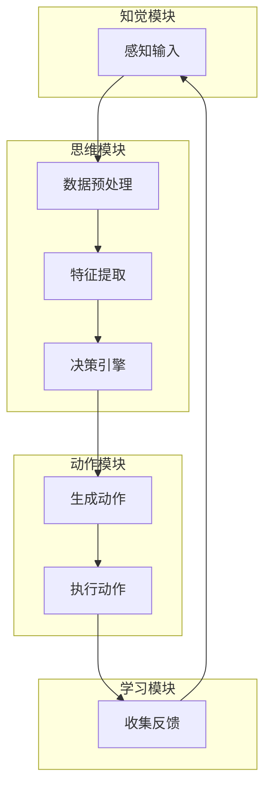

                 

# AI Agent 如何将系统输入转化为可执行的原子动作序列，以实现最终目标

> 关键词：AI Agent、输入处理、可执行动作序列、目标实现、算法原理、项目实战

> 摘要：本文将深入探讨AI Agent如何将系统输入转化为可执行的原子动作序列，以实现预定的目标。文章首先介绍了AI Agent的基础知识，包括定义、架构、核心算法原理，然后详细讲解了实现与优化技术，最后通过项目实战案例，展示了AI Agent在真实场景中的应用。

## 目录

### 第一部分：AI Agent 基础知识

1. **第1章 AI Agent 概述**
   - 1.1 AI Agent 的定义与类型
   - 1.2 AI Agent 在现实世界中的应用
   - 1.3 AI Agent 的发展历史与未来趋势

2. **第2章 AI Agent 的架构与组成部分**
   - 2.1 知觉模块
   - 2.2 思维模块
   - 2.3 动作模块
   - 2.4 学习模块
   - 2.5 AI Agent 的 Mermaid 流程图

3. **第3章 AI Agent 的核心算法原理**
   - 3.1 决策算法
     - 3.1.1 基于规则的决策算法
     - 3.1.2 贝叶斯网络决策算法
     - 3.1.3 多智能体决策算法
   - 3.2 控制算法
     - 3.2.1 PID控制算法
     - 3.2.2 模糊控制算法
     - 3.2.3 强化学习控制算法
   - 3.3 学习算法
     - 3.3.1 监督学习算法
     - 3.3.2 无监督学习算法
     - 3.3.3 半监督学习算法
   - 3.4 伪代码讲解与示例

### 第二部分：AI Agent 实现与优化

4. **第4章 AI Agent 的实现技术**
   - 4.1 Python 编程基础
   - 4.2 AI Agent 的开发框架与工具
   - 4.3 数据预处理与特征工程
   - 4.4 AI Agent 的模型训练与评估

5. **第5章 AI Agent 的性能优化**
   - 5.1 模型压缩与加速
   - 5.2 多线程与并行计算
   - 5.3 资源管理策略
   - 5.4 优化算法与策略

6. **第6章 AI Agent 的测试与验证**
   - 6.1 单元测试与集成测试
   - 6.2 性能测试与负载测试
   - 6.3 可靠性测试与安全性测试
   - 6.4 测试数据集与评估指标

7. **第7章 AI Agent 的部署与维护**
   - 7.1 部署环境与工具
   - 7.2 部署策略与流程
   - 7.3 日志分析与故障排查
   - 7.4 维护与升级策略

### 第三部分：AI Agent 项目实战

8. **第8章 AI Agent 项目案例研究**
   - 8.1 项目背景与目标
   - 8.2 项目架构设计
   - 8.3 数据处理与特征提取
   - 8.4 模型训练与优化
   - 8.5 部署与测试
   - 8.6 项目总结与反思

9. **第9章 AI Agent 开发实战**
   - 9.1 开发环境搭建
   - 9.2 代码实现与解读
   - 9.3 代码分析与优化
   - 9.4 代码解读与分析

10. **第10章 AI Agent 未来发展展望**
    - 10.1 AI Agent 的发展趋势
    - 10.2 AI Agent 在不同领域的应用前景
    - 10.3 AI Agent 的挑战与机遇
    - 10.4 未来发展方向与潜在突破点

### 附录：AI Agent 开发资源与工具集

- 附录 A：AI Agent 开发工具与框架对比
- 附录 B：AI Agent 开发常用库与函数
- 附录 C：AI Agent 开发指南与最佳实践
- 附录 D：AI Agent 项目实战案例集锦

---

### 引言

随着人工智能技术的迅猛发展，AI Agent 成为了一种重要的智能系统组件，广泛应用于各种领域，如自动驾驶、智能家居、智能客服等。AI Agent 的核心能力在于其能够接收系统输入，通过内部决策机制转化为可执行的原子动作序列，进而实现预定的目标。然而，如何高效地将系统输入转化为具体的动作序列，是AI Agent 实现智能行为的关键。

本文将深入探讨AI Agent 如何将系统输入转化为可执行的原子动作序列，以实现最终目标。文章分为三个主要部分：

1. **基础知识**：介绍AI Agent 的定义、架构、核心算法原理，并通过Mermaid流程图展示其整体工作流程。
2. **实现与优化**：讲解AI Agent 的实现技术、性能优化、测试与验证、部署与维护，以及相关工具和资源。
3. **项目实战**：通过实际项目案例，展示AI Agent 的开发流程、代码实现、优化策略及未来发展趋势。

通过本文的深入探讨，读者将能够全面了解AI Agent 的系统输入处理机制，掌握其转化为可执行动作序列的核心技术，为后续研究和应用奠定坚实基础。

## 第一部分：AI Agent 基础知识

### 第1章 AI Agent 概述

#### 1.1 AI Agent 的定义与类型

AI Agent，即人工智能代理，是自主决策和行动的智能体，能够根据环境感知、学习以及内部决策机制，执行预定的任务或目标。AI Agent 可以被看作是一个高度自动化和智能化的系统，其核心在于其自主性、适应性和协作性。

AI Agent 的定义可以从以下几个方面来理解：

1. **自主性**：AI Agent 能够独立进行决策和执行任务，而不需要人为干预。
2. **适应性**：AI Agent 能够通过学习环境和经验，不断优化其行为策略。
3. **协同性**：在某些应用场景中，多个AI Agent 可以协作完成任务，提高整体效率。

AI Agent 根据不同的分类标准，可以分为以下几种类型：

1. **基于规则的AI Agent**：这类Agent基于预设的规则进行决策，适用于规则明确、环境变化较小的场景。
2. **基于模型的AI Agent**：这类Agent使用学习到的模型进行决策，可以处理更复杂的任务和环境。
3. **混合型AI Agent**：这类Agent结合了规则和模型的优势，通过多种策略进行决策。

#### 1.2 AI Agent 在现实世界中的应用

AI Agent 的应用领域非常广泛，以下是一些典型的应用场景：

1. **自动驾驶**：自动驾驶车辆通过感知环境、决策路径规划，实现自主行驶。
2. **智能家居**：智能家居系统中的智能设备（如智能灯泡、智能音响）通过感知用户行为，实现智能响应。
3. **智能客服**：AI Agent 在客服系统中，通过自然语言处理技术，实现与用户的智能对话。
4. **金融风控**：AI Agent 在金融领域中，用于检测异常交易、风险管理等。
5. **医疗诊断**：AI Agent 在医疗领域，通过分析病例数据和医疗图像，辅助医生进行诊断。

#### 1.3 AI Agent 的发展历史与未来趋势

AI Agent 的发展历史可以追溯到人工智能的早期研究。随着计算能力和算法的进步，AI Agent 从最初的简单规则系统，逐渐发展到今天复杂的多模态智能体。

1. **早期阶段**：以专家系统和规则引擎为基础的AI Agent，主要应用于简单的业务流程和决策支持。
2. **发展阶段**：随着机器学习和深度学习的发展，AI Agent 开始采用更复杂的模型进行学习和决策。
3. **成熟阶段**：当前，AI Agent 已经在多个领域实现商业化应用，并呈现出快速发展的趋势。

未来，AI Agent 将朝着以下几个方向发展：

1. **自主性与智能水平的提升**：AI Agent 将具备更高的自主决策能力和更智能的学习机制。
2. **跨领域融合**：AI Agent 将与其他领域技术（如物联网、区块链等）融合，实现更广泛的应用。
3. **人机协作**：AI Agent 将更好地与人类协作，提供个性化服务和支持。

通过本章节的介绍，读者可以初步了解AI Agent 的定义、类型以及应用场景，为后续章节的深入学习打下基础。

#### 1.4 AI Agent 的核心组成模块

AI Agent 的架构通常由多个核心模块组成，这些模块相互协作，共同实现智能体的功能。以下是 AI Agent 的几个主要组成部分：

1. **知觉模块（Perception Module）**
   - **功能**：知觉模块负责感知和获取环境信息，包括视觉、听觉、触觉等多种感知方式。
   - **实现**：通过传感器（如摄像头、麦克风、力传感器等）收集数据，并利用图像识别、语音识别等技术进行预处理和分析。
   - **重要性**：知觉模块是 AI Agent 对环境进行理解和决策的基础，其性能直接影响 Agent 的响应速度和准确性。

2. **思维模块（Cognitive Module）**
   - **功能**：思维模块负责处理和分析知觉模块获取的信息，进行推理、决策和规划。
   - **实现**：包括知识库、推理机、规划器等组件，通过机器学习算法和决策树、神经网络等模型进行数据处理和决策。
   - **重要性**：思维模块是 AI Agent 的“大脑”，负责理解环境信息，制定行动计划，实现智能行为。

3. **动作模块（Action Module）**
   - **功能**：动作模块负责执行思维模块生成的决策，实现具体的操作和任务。
   - **实现**：通过控制执行器（如电机、执行器等）将决策转化为实际的物理动作。
   - **重要性**：动作模块是 AI Agent 与外部环境互动的接口，是实现目标的关键环节。

4. **学习模块（Learning Module）**
   - **功能**：学习模块负责 AI Agent 的自我学习和优化，通过不断积累经验和调整行为策略。
   - **实现**：采用监督学习、无监督学习、强化学习等算法，从环境反馈中学习并优化模型参数。
   - **重要性**：学习模块使 AI Agent 能够适应环境变化，提高任务完成效率和自主性。

5. **通信模块（Communication Module）**
   - **功能**：通信模块负责与其他 AI Agent 或人类进行信息交换和协同工作。
   - **实现**：利用网络通信协议（如 TCP/IP、HTTP 等）和自然语言处理技术，实现多智能体系统中的信息共享和协作。
   - **重要性**：通信模块使 AI Agent 能够实现跨系统的交互和合作，提高复杂任务的处理能力。

通过上述各模块的协同工作，AI Agent 能够有效地感知环境、进行智能决策、执行任务，并不断自我学习和优化，实现预期的目标。

#### 2.5 AI Agent 的 Mermaid 流程图

为了更好地理解 AI Agent 的工作流程，我们可以使用 Mermaid 工具绘制一个流程图。以下是一个简化的 AI Agent 工作流程图：



这个 Mermaid 流程图展示了 AI Agent 从感知输入、数据预处理、特征提取、决策引擎、生成动作、执行动作到收集反馈的整个过程，各模块之间的协作关系一目了然。

通过这个流程图，我们可以清晰地看到 AI Agent 的整体工作流程和各模块的功能。这不仅有助于理解 AI Agent 的运作原理，还能为后续的优化和改进提供参考。

### 第3章 AI Agent 的核心算法原理

#### 3.1 决策算法

决策算法是 AI Agent 中至关重要的组成部分，决定了 Agent 如何在给定的情境下选择最佳行动。以下是几种常见的决策算法：

##### 3.1.1 基于规则的决策算法

基于规则的决策算法是一种传统的 AI 算法，其核心思想是根据预设的规则集来做出决策。规则通常由条件和相应的操作组成。这种算法的优点是实现简单，易于理解，适用于规则明确且不频繁变化的场景。

- **基本原理**：当 Agent 接收到感知信息后，通过与规则库中的规则进行匹配，找到满足条件的规则，并根据规则的操作执行相应的动作。

- **伪代码**：

  ```python
  function ruleBasedDecision(perception):
      for rule in ruleLibrary:
          if perception matches rule.condition:
              return rule.action
      return null
  ```

##### 3.1.2 贝叶斯网络决策算法

贝叶斯网络是一种概率图模型，用于表示变量之间的条件依赖关系。在决策过程中，贝叶斯网络可以计算不同行动的概率分布，从而选择最优行动。

- **基本原理**：贝叶斯网络通过概率传播计算给定一个行动条件下各个变量的后验概率分布，选择后验概率最高的行动。

- **伪代码**：

  ```python
  function bayesianNetworkDecision(action, beliefState):
      posteriorProbabilities = calculatePosteriorProbabilities(action, beliefState)
      bestAction = action with highest posterior probability
      return bestAction
  ```

##### 3.1.3 多智能体决策算法

多智能体决策算法适用于多个 AI Agent 共同完成任务的情况。这种算法通过协作和竞争机制，实现全局最优或近似最优的行动选择。

- **基本原理**：多个 Agent 通过通信共享信息，基于局部信息和全局目标，利用分布式算法进行协调决策。

- **伪代码**：

  ```python
  function multiAgentDecision(agentID, localInformation, globalGoal):
      consensusValue = calculateConsensusValue(localInformation, globalGoal)
      action = selectActionBasedOnConsensusValue(consensusValue)
      return action
  ```

#### 3.2 控制算法

控制算法用于指导 AI Agent 如何执行具体的物理操作，以实现预定目标。以下是几种常见的控制算法：

##### 3.2.1 PID控制算法

PID（比例-积分-微分）控制算法是一种经典的过程控制算法，广泛应用于工业自动化和机器人控制等领域。

- **基本原理**：PID 控制器通过计算控制误差（目标值与实际值的差）的三个分量（比例、积分、微分）来生成控制输出。这种算法能够快速响应并稳定系统。

- **伪代码**：

  ```python
  function PIDControl(target, actual):
      proportional = Kp * (target - actual)
      integral = Ki * sum(error over time)
      derivative = Kd * (error - previousError)
      controlOutput = proportional + integral + derivative
      return controlOutput
  ```

##### 3.2.2 模糊控制算法

模糊控制算法是一种基于模糊逻辑的控制算法，适用于处理非线性和不确定性系统。

- **基本原理**：模糊控制器通过输入变量的模糊化处理和规则库，生成模糊控制输出，并将其转化为精确的控制信号。

- **伪代码**：

  ```python
  function fuzzyControl(inputVariable):
      fuzzySetMembership = calculateFuzzySetMembership(inputVariable)
      ruleFiringStrength = calculateRuleFiringStrength(fuzzySetMembership, ruleBase)
      controlOutput = aggregateRuleFiringStrengths(ruleFiringStrength)
      return defuzzify(controlOutput)
  ```

##### 3.2.3 强化学习控制算法

强化学习控制算法通过学习和优化决策策略，实现自主控制。这种算法广泛应用于机器人、自动驾驶等领域。

- **基本原理**：强化学习 Agent 通过与环境交互，学习到最优控制策略，最大化累计奖励。

- **伪代码**：

  ```python
  function reinforcementLearningControl(state, action, reward):
      QValue = QValue + alpha * (reward + gamma * max(QValueNext) - QValue)
      return QValue
  ```

通过以上三种控制算法的介绍，我们可以看到，AI Agent 在执行物理操作时，可以根据不同的应用场景选择合适的控制策略，以实现高效、稳定的控制效果。

#### 3.3 学习算法

学习算法是 AI Agent 的重要组成部分，负责从数据中提取知识，优化行为策略。以下是几种常见的学习算法：

##### 3.3.1 监督学习算法

监督学习算法是一种有监督的学习方法，通过标注的数据集训练模型，预测新的数据。

- **基本原理**：监督学习模型在训练过程中，学习输入数据和输出标签之间的映射关系。在测试阶段，模型根据输入数据预测输出标签。

- **常见算法**：线性回归、逻辑回归、支持向量机（SVM）、决策树、随机森林、神经网络。

- **伪代码**：

  ```python
  function supervisedLearning(trainData, trainLabels, modelType):
      model = createModel(modelType)
      model.train(trainData, trainLabels)
      return model
  ```

##### 3.3.2 无监督学习算法

无监督学习算法是一种无监督的学习方法，不需要标注的数据集，旨在发现数据中的隐含结构和模式。

- **基本原理**：无监督学习模型在训练过程中，通过调整模型参数，使得数据点在特征空间中形成聚类或降低数据的维度。

- **常见算法**：K-均值聚类、主成分分析（PCA）、自编码器。

- **伪代码**：

  ```python
  function unsupervisedLearning(data, algorithmType):
      model = createModel(algorithmType)
      model.train(data)
      return model
  ```

##### 3.3.3 半监督学习算法

半监督学习算法结合了监督学习和无监督学习的优势，利用少量的标注数据和大量的未标注数据来训练模型。

- **基本原理**：半监督学习模型在训练过程中，利用标注数据学习标注数据的分布，同时利用未标注数据增加模型的鲁棒性。

- **常见算法**：图嵌入、伪标签、一致性正则化。

- **伪代码**：

  ```python
  function semiSupervisedLearning(annotatedData, unannotatedData, modelType):
      model = createModel(modelType)
      model.train(annotatedData, unannotatedData)
      return model
  ```

通过以上三种学习算法的介绍，我们可以看到，AI Agent 在不断学习和优化过程中，可以根据不同的数据类型和应用场景选择合适的学习算法，以提高任务完成的效率和准确性。

### 第三部分：AI Agent 实现与优化

#### 第4章 AI Agent 的实现技术

实现一个 AI Agent 不仅需要坚实的理论基础，还需要掌握一系列实际的技术和工具。在本章中，我们将深入探讨 AI Agent 的实现技术，包括编程基础、开发框架、数据预处理和模型训练与评估。

##### 4.1 Python 编程基础

Python 是实现 AI Agent 的首选编程语言之一，其简洁的语法和丰富的库支持使得开发者能够快速构建和测试 AI 系统。以下是 Python 编程中的一些基础知识：

- **基础语法**：变量、数据类型、控制流、函数定义等。
- **库和模块**：NumPy、Pandas、Matplotlib 等常用库的使用方法。
- **面向对象编程**：类和对象的概念，以及如何使用 Python 的面向对象特性来组织代码。

##### 4.2 AI Agent 的开发框架与工具

选择合适的开发框架和工具可以提高开发效率和系统稳定性。以下是一些常用的 AI Agent 开发框架和工具：

- **TensorFlow 和 Keras**：这两者都是流行的深度学习框架，提供了丰富的 API 和预训练模型，适用于构建复杂的神经网络模型。
- **PyTorch**：PyTorch 以其灵活性和高效性著称，是动态计算图框架，适合研究性和实验性开发。
- **PyAgent**：一个专门为 AI Agent 开发设计的框架，提供了感知、学习、决策、动作等模块，简化了 Agent 开发流程。
- **ROS (Robot Operating System)**：ROS 是一个广泛应用于机器人开发的框架，提供了丰富的库和工具，用于构建多机器人系统和模拟环境。

##### 4.3 数据预处理与特征工程

数据预处理和特征工程是 AI Agent 开发中至关重要的一环，它们直接关系到模型的性能和预测效果。以下是数据预处理和特征工程的一些关键步骤：

- **数据清洗**：处理缺失值、异常值、重复值等，确保数据的质量。
- **数据归一化**：将不同尺度的数据进行归一化处理，使其具有可比性。
- **特征提取**：从原始数据中提取有用的特征，如文本中的关键词、图像中的边缘和纹理等。
- **特征选择**：通过降维或过滤，选择对模型性能有显著影响的特征，提高模型效率和准确性。

##### 4.4 AI Agent 的模型训练与评估

训练和评估 AI Agent 的模型是开发过程中的一大挑战。以下是一些关键步骤和技巧：

- **模型选择**：根据任务需求选择合适的模型类型，如分类模型、回归模型、强化学习模型等。
- **模型训练**：使用合适的训练算法（如梯度下降、随机梯度下降等）和优化器（如 Adam、RMSprop 等）进行模型训练。
- **模型评估**：通过交叉验证、性能指标（如准确率、召回率、F1 分数等）评估模型性能，并调整模型参数以提高性能。
- **模型调优**：根据评估结果调整模型结构、参数和超参数，以实现最佳性能。

通过本章的介绍，读者可以了解到 AI Agent 的实现技术，掌握从编程基础到模型训练的各个步骤，为后续的 AI Agent 开发打下坚实基础。

#### 第5章 AI Agent 的性能优化

在实现 AI Agent 的过程中，性能优化是提高系统效率和可靠性的关键。本章将介绍几种常见的性能优化技术，包括模型压缩与加速、多线程与并行计算、资源管理策略以及优化算法与策略。

##### 5.1 模型压缩与加速

模型压缩与加速是提高 AI Agent 性能的重要手段，通过减少模型参数和计算量，可以在不牺牲太多性能的情况下提高运行速度。以下是一些常见的模型压缩与加速技术：

- **权重剪枝（Weight Pruning）**：通过移除权重值较小的参数，减少模型大小和计算量。
- **量化（Quantization）**：将浮点数参数转换为低精度的整数表示，减少内存占用和计算复杂度。
- **知识蒸馏（Knowledge Distillation）**：使用一个大模型（教师模型）训练一个小模型（学生模型），传递知识，提高小模型的性能。
- **神经网络剪枝（Neural Network Pruning）**：通过训练过程中逐步剪枝，优化模型结构和参数。

##### 5.2 多线程与并行计算

多线程与并行计算是提高 AI Agent 运行速度的有效方法，通过利用多核处理器的能力，实现任务并行执行。以下是一些关键技术和方法：

- **线程池（ThreadPool）**：使用线程池管理线程，避免频繁创建和销毁线程，提高系统响应速度。
- **任务并行化（Task Parallelism）**：将任务分解为多个可并行执行的部分，通过并行计算框架（如 OpenMP、MPI）实现并行处理。
- **数据并行（Data Parallelism）**：将数据集分解为多个子集，每个子集由不同的线程或处理器处理，最后合并结果。
- **模型并行（Model Parallelism）**：将大型模型分解为多个部分，分别在不同处理器上训练和推理，适用于处理大规模模型。

##### 5.3 资源管理策略

资源管理策略是确保 AI Agent 在有限的资源下高效运行的关键。以下是一些常见的资源管理策略：

- **负载均衡（Load Balancing）**：通过合理分配任务，确保各个处理器或节点的工作负荷均衡，提高系统整体性能。
- **资源调度（Resource Scheduling）**：根据任务优先级和资源利用率，动态调整任务的执行顺序和资源分配，提高系统响应速度。
- **内存管理（Memory Management）**：通过内存复用、垃圾回收等策略，优化内存使用，避免内存溢出和性能下降。
- **网络优化（Network Optimization）**：通过流量控制、负载均衡等技术，优化网络传输性能，提高数据传输速度和可靠性。

##### 5.4 优化算法与策略

优化算法与策略是提高 AI Agent 性能的核心，通过调整算法参数和策略，实现最佳性能。以下是一些常见的优化算法与策略：

- **超参数调优（Hyperparameter Tuning）**：通过网格搜索、随机搜索、贝叶斯优化等方法，找到最佳的超参数组合，提高模型性能。
- **模型融合（Model Ensembling）**：通过组合多个模型，降低方差和过拟合，提高预测准确性和稳定性。
- **动态调整（Dynamic Adjustment）**：根据实时反馈和性能指标，动态调整模型参数和策略，适应环境变化。
- **在线学习（Online Learning）**：在运行过程中不断更新模型，适应新的数据和任务需求，提高系统适应性和灵活性。

通过本章的介绍，读者可以了解到 AI Agent 性能优化的多种技术方法和策略，为开发高性能的 AI Agent 提供有力支持。

#### 第6章 AI Agent 的测试与验证

在 AI Agent 的开发过程中，测试与验证是确保系统质量和稳定性的关键环节。本章将详细介绍 AI Agent 的测试与验证方法，包括单元测试与集成测试、性能测试与负载测试、可靠性测试与安全性测试，以及测试数据集与评估指标。

##### 6.1 单元测试与集成测试

单元测试是针对 AI Agent 的最小功能单元（如一个模块、一个函数）进行的测试，目的是验证单元的正确性和独立性。以下是一些关键步骤：

- **测试用例设计**：根据功能需求，设计输入数据、预期输出和边界条件。
- **测试框架**：使用测试框架（如 JUnit、pytest）编写测试代码，自动化执行测试。
- **断言**：使用断言（如 assert）检查测试结果是否符合预期。
- **覆盖率**：通过覆盖率工具（如 coverage.py）统计测试覆盖率，确保测试全面。

集成测试是针对多个功能模块协同工作的测试，目的是验证系统整体的正确性和稳定性。以下是一些关键步骤：

- **集成测试环境**：搭建集成测试环境，确保所有模块正常协同工作。
- **测试用例设计**：设计包含多个模块交互的测试用例。
- **集成测试框架**：使用集成测试框架（如 Selenium、TestNG）执行测试。
- **回归测试**：在每次代码更改后进行集成测试，确保新代码不会影响现有功能。

##### 6.2 性能测试与负载测试

性能测试是评估 AI Agent 在特定负载下的表现，目的是确定系统的最大处理能力和瓶颈。以下是一些关键步骤：

- **性能指标**：定义性能指标（如响应时间、吞吐量、并发用户数等）。
- **测试工具**：使用性能测试工具（如 JMeter、LoadRunner）模拟用户负载。
- **负载生成**：生成不同负载场景，包括正常负载、峰值负载、异常负载等。
- **性能分析**：分析性能数据，找出性能瓶颈和改进点。

负载测试是评估系统在高负载情况下的稳定性和响应能力。以下是一些关键步骤：

- **负载场景设计**：设计多种负载场景，包括正常负载、异常负载、并发负载等。
- **负载生成工具**：使用负载生成工具（如 ApacheBench、wrk）模拟高负载。
- **负载分析**：分析系统在高负载下的响应时间、资源利用率、错误率等指标。
- **性能优化**：根据分析结果，对系统进行优化和调整。

##### 6.3 可靠性测试与安全性测试

可靠性测试是验证 AI Agent 在长期运行下的稳定性和可靠性。以下是一些关键步骤：

- **长时间运行测试**：模拟长时间运行，检查系统是否稳定，是否存在内存泄露、死锁等问题。
- **故障注入测试**：模拟各种故障（如网络中断、硬件故障等），检查系统应对故障的能力。
- **恢复测试**：在故障发生后，检查系统能否恢复正常运行。

安全性测试是评估系统对恶意攻击的防护能力。以下是一些关键步骤：

- **漏洞扫描**：使用工具（如 OWASP ZAP）扫描系统漏洞。
- **安全测试**：模拟各种攻击（如 SQL 注入、跨站脚本攻击等），验证系统防护能力。
- **安全审计**：对系统代码和配置进行安全审计，确保没有安全隐患。

##### 6.4 测试数据集与评估指标

测试数据集是进行测试的基础，其质量和多样性直接影响测试结果。以下是一些建议：

- **数据质量**：确保数据集的准确性、完整性和一致性。
- **数据多样性**：包含多种场景和边界条件的数据，以提高测试的全面性。

评估指标是衡量系统性能和质量的量化标准。以下是一些常用的评估指标：

- **准确性（Accuracy）**：分类任务中正确分类的样本占总样本的比例。
- **召回率（Recall）**：分类任务中正确分类的正样本占总正样本的比例。
- **F1 分数（F1 Score）**：准确性和召回率的调和平均，用于综合评估分类性能。
- **响应时间（Response Time）**：系统处理请求的平均时间。
- **吞吐量（Throughput）**：单位时间内系统处理的请求量。

通过本章的介绍，读者可以了解 AI Agent 的测试与验证方法，掌握单元测试、集成测试、性能测试、负载测试、可靠性测试和安全性测试的关键步骤，为开发高质量的 AI Agent 提供指导。

#### 第7章 AI Agent 的部署与维护

AI Agent 的部署与维护是确保系统稳定运行、高效服务的重要环节。本章将详细探讨 AI Agent 的部署环境与工具、部署策略与流程、日志分析与故障排查，以及维护与升级策略。

##### 7.1 部署环境与工具

部署环境是 AI Agent 运行的硬件和软件基础，选择合适的部署环境对系统的性能和稳定性至关重要。以下是常见的部署环境与工具：

- **硬件环境**：服务器、工作站、虚拟机、容器（如 Docker）等，应根据任务需求选择合适的硬件配置。
- **软件环境**：操作系统（如 Linux、Windows）、数据库（如 MySQL、PostgreSQL）、消息队列（如 RabbitMQ、Kafka）等。
- **容器编排工具**：Kubernetes、Docker Swarm 等用于管理容器化应用的部署、扩展和自动化。
- **持续集成/持续部署（CI/CD）工具**：Jenkins、GitLab CI、CircleCI 等，用于自动化构建、测试和部署代码。

##### 7.2 部署策略与流程

部署策略与流程是确保 AI Agent 在不同环境中稳定运行的关键。以下是一个典型的部署流程：

1. **环境准备**：搭建部署环境，安装必要的软件和依赖项。
2. **代码打包**：将源代码打包成可部署的格式，如 Docker 镜像、部署包等。
3. **配置管理**：配置环境变量、数据库连接、日志文件等，确保部署环境的可重复性和一致性。
4. **部署**：将代码和配置部署到目标环境，使用 CI/CD 工具实现自动化部署。
5. **测试**：在部署后进行功能测试和性能测试，确保系统正常运行。
6. **监控**：部署监控系统，实时监控系统状态，包括 CPU、内存、磁盘使用情况等。

##### 7.3 日志分析与故障排查

日志是系统运行的重要记录，通过日志分析可以发现问题、定位故障。以下是一些关键步骤：

1. **日志收集**：使用日志收集工具（如 Logstash、ELK）收集系统日志。
2. **日志分析**：使用日志分析工具（如 Kibana、Grafana）对日志进行查询、过滤和可视化分析。
3. **故障排查**：根据日志信息，定位故障原因，进行故障排除和修复。
4. **报警机制**：配置报警机制，在发现异常时及时通知相关人员。

##### 7.4 维护与升级策略

维护与升级策略是确保 AI Agent 持续稳定运行的关键。以下是一些建议：

1. **定期维护**：定期检查系统状态，进行软件更新、安全漏洞修复等。
2. **版本控制**：使用版本控制系统（如 Git）管理代码和配置文件，确保版本的一致性和可追溯性。
3. **备份策略**：定期备份数据和配置，确保在故障发生时能够快速恢复。
4. **升级策略**：在升级前进行风险评估和测试，确保升级过程的平稳过渡。
5. **监控与反馈**：持续监控系统性能和用户反馈，及时发现并解决问题。

通过本章的介绍，读者可以了解 AI Agent 的部署与维护策略，掌握从环境搭建到日志分析、故障排查、维护与升级的各个环节，为 AI Agent 的稳定运行提供保障。

### 第8章 AI Agent 项目案例研究

#### 8.1 项目背景与目标

本次 AI Agent 项目旨在开发一款智能客服系统，用于提高企业客户服务效率和客户满意度。项目背景如下：

- **业务需求**：企业希望利用人工智能技术，实现自动化客户服务，降低人工成本，提高响应速度和服务质量。
- **技术需求**：系统需要具备自然语言处理、对话管理、多轮对话能力，能够理解客户意图，提供准确的回答和建议。

项目目标如下：

- **功能目标**：实现智能客服机器人，能够自动处理常见客户咨询，如产品信息、订单查询、售后服务等。
- **性能目标**：确保系统高可用性、高可靠性，支持大量并发请求，同时具备良好的用户体验。
- **用户体验目标**：提供流畅、自然的对话体验，提高用户满意度。

#### 8.2 项目架构设计

智能客服系统的架构设计分为前端、后端和服务端三大部分，以下是详细的架构设计：

1. **前端**：使用 Web 应用程序，提供用户与客服机器人的交互界面。前端架构包括：
   - **用户界面（UI）**：使用 React 或 Vue.js 框架，实现响应式界面设计。
   - **WebSocket**：使用 WebSocket 实现实时通信，支持多轮对话。

2. **后端**：负责处理业务逻辑、数据存储和接口管理，后端架构包括：
   - **API 网关**：使用 Nginx 或 Kong 等网关组件，实现负载均衡和安全控制。
   - **服务拆分**：将业务逻辑拆分为多个微服务，如对话管理服务、意图识别服务、知识库服务等，提高系统可维护性和扩展性。
   - **数据库**：使用 PostgreSQL 或 MongoDB 等数据库管理系统，存储用户信息、对话记录和知识库数据。

3. **服务端**：负责处理 AI 计算任务，包括自然语言处理、对话生成和智能推荐等，服务端架构包括：
   - **自然语言处理（NLP）服务**：使用深度学习模型，实现文本分类、实体识别、情感分析等 NLP 任务。
   - **对话管理服务**：使用强化学习算法，实现对话管理，优化对话流程和用户体验。
   - **知识库服务**：使用图数据库，存储和管理知识库，支持快速查询和更新。

#### 8.3 数据处理与特征提取

数据处理与特征提取是构建智能客服系统的关键环节，以下是详细的过程：

1. **数据收集**：从企业现有数据源（如客服聊天记录、客户反馈等）收集数据，进行预处理和清洗，去除噪声和异常数据。

2. **数据标注**：对收集到的数据集进行人工标注，标注出对话中的用户意图、实体和关键词，用于训练和评估模型。

3. **特征提取**：从原始数据中提取有意义的特征，如文本特征（词向量、词袋模型等）和序列特征（序列标注、BERT 等预训练模型）。

4. **数据预处理**：对特征进行标准化、归一化等处理，提高模型训练效果。

5. **数据集划分**：将数据集划分为训练集、验证集和测试集，用于模型训练、验证和评估。

#### 8.4 模型训练与优化

模型训练与优化是构建智能客服系统的核心步骤，以下是详细的过程：

1. **模型选择**：根据业务需求，选择合适的模型，如 BERT、GPT、Transformer 等。

2. **模型训练**：使用训练集对模型进行训练，通过优化算法（如 Adam、SGD 等）调整模型参数，提高模型性能。

3. **模型评估**：使用验证集评估模型性能，通过指标（如准确率、召回率、F1 分数等）判断模型是否达到预期效果。

4. **模型调优**：根据评估结果，调整模型参数和超参数，优化模型性能。

5. **模型部署**：将训练好的模型部署到生产环境，通过 API 接口提供智能客服服务。

6. **持续优化**：根据用户反馈和系统表现，持续优化模型和算法，提高智能客服系统的用户体验和效率。

#### 8.5 部署与测试

智能客服系统的部署与测试是确保系统稳定运行和高效服务的关键步骤，以下是详细的过程：

1. **环境搭建**：搭建部署环境，包括服务器、数据库、API 网关等，确保硬件和软件环境的稳定性。

2. **代码打包**：将前端和后端代码打包成可部署的格式，如 Docker 镜像或部署包。

3. **部署**：将代码和配置部署到生产环境，使用 CI/CD 工具实现自动化部署。

4. **测试**：进行功能测试、性能测试和负载测试，确保系统在高并发场景下稳定运行。

5. **监控**：部署监控系统，实时监控系统状态，包括 CPU、内存、磁盘使用情况等。

6. **上线**：在确保系统稳定运行后，将系统上线，对外提供服务。

7. **维护与升级**：根据用户反馈和系统表现，进行系统维护和升级，确保系统持续稳定运行。

#### 8.6 项目总结与反思

通过本次智能客服系统的开发与实施，我们取得以下成果：

- **提高客户服务效率**：智能客服系统能够自动处理大量客户咨询，提高客服响应速度和服务质量。
- **降低人工成本**：通过自动化客户服务，降低人工客服的工作量和成本。
- **提升用户体验**：提供流畅、自然的对话体验，提高客户满意度。

在项目实施过程中，我们也遇到了一些挑战和问题：

- **数据处理与特征提取**：数据质量和特征提取的准确性直接影响模型性能，需要投入大量时间和精力进行数据预处理和特征工程。
- **模型调优与部署**：模型调优和部署过程复杂，需要反复测试和调整，确保模型性能和系统稳定性。

未来，我们将继续优化智能客服系统，提高其智能水平和用户体验，为企业提供更高效、智能的客户服务。

### 第9章 AI Agent 开发实战

#### 9.1 开发环境搭建

在开始 AI Agent 的开发之前，搭建一个合适的环境是至关重要的。以下步骤将指导您如何搭建一个基础的 AI Agent 开发环境：

1. **选择操作系统**：首选 Linux 系统，如 Ubuntu 或 CentOS，因为 Linux 系统具有更好的稳定性和丰富的库支持。

2. **安装 Python**：Python 是 AI Agent 开发的主要编程语言。您可以通过以下命令在 Linux 系统中安装 Python：

   ```bash
   sudo apt-get update
   sudo apt-get install python3 python3-pip
   ```

3. **安装 Python 库**：使用 pip 安装常用的 AI 库，如 TensorFlow、PyTorch、scikit-learn 等：

   ```bash
   pip3 install tensorflow torch scikit-learn numpy pandas
   ```

4. **安装 Jupyter Notebook**：Jupyter Notebook 是一个强大的交互式开发环境，适用于进行实验和演示：

   ```bash
   pip3 install notebook
   ```

5. **配置虚拟环境**：为了保持开发环境的整洁，使用 virtualenv 创建一个虚拟环境：

   ```bash
   pip3 install virtualenv
   virtualenv my_agent_env
   source my_agent_env/bin/activate
   ```

6. **安装 IDE**：可选地，您可以选择一个集成开发环境（IDE），如 PyCharm 或 Visual Studio Code，以提高开发效率。

通过以上步骤，您已经搭建了一个基础的 AI Agent 开发环境，可以开始编写和运行代码。

#### 9.2 代码实现与解读

在本节中，我们将通过一个简单的示例，展示如何实现一个 AI Agent，并对其进行解读。

**示例代码**：

```python
import random

class SimpleAgent:
    def __init__(self):
        self.state = "start"

    def perceive(self, input_data):
        print(f"Agent perceiving: {input_data}")
        self.state = input_data

    def think(self):
        if self.state == "start":
            action = "move_forward"
        elif self.state == "goal":
            action = "stop"
        else:
            action = "move_randomly"
        print(f"Agent thinking and deciding to {action}")
        return action

    def act(self, action):
        if action == "move_forward":
            print("Agent moving forward.")
        elif action == "stop":
            print("Agent stopped.")
        elif action == "move_randomly":
            print("Agent moving randomly.")

agent = SimpleAgent()
agent.perceive("start")
action = agent.think()
agent.act(action)
```

**代码解读**：

1. **类定义**：我们定义了一个名为 `SimpleAgent` 的类，用于表示一个简单的 AI Agent。
2. **初始化方法**：`__init__` 方法在创建实例时被调用，用于初始化 Agent 的初始状态。
3. **感知方法**：`perceive` 方法用于接收输入数据，并更新 Agent 的状态。
4. **思考方法**：`think` 方法根据当前状态，决定下一步的动作。
5. **行动方法**：`act` 方法执行具体的动作。

**运行结果**：

- 输入：`agent.perceive("start")`，输出：`Agent perceiving: start`，状态更新为 `start`。
- 思考与决策：`action = agent.think()`，输出：`Agent thinking and deciding to move_forward`，决定执行 `move_forward` 动作。
- 行动：`agent.act(action)`，输出：`Agent moving forward.`。

这个简单的示例展示了 AI Agent 的工作流程：感知、思考、行动。在实际应用中，Agent 的感知、思考和行动会更加复杂和智能。

#### 9.3 代码分析与优化

在上面的示例中，我们实现了一个简单的 AI Agent，但它在实际应用中存在一些局限性和可以优化的地方。

**分析**：

1. **状态决策**：当前的状态决策基于硬编码规则，缺乏灵活性和自适应性。
2. **随机行为**：`move_randomly` 行为可能导致 Agent 无法找到有效的解决方案。
3. **缺乏学习机制**：Agent 无法从经验中学习，无法改进其行为策略。

**优化建议**：

1. **引入机器学习模型**：使用监督学习或强化学习模型，使 Agent 能够从数据中学习，改进决策过程。
2. **增加状态变量**：引入更多的状态变量，使状态决策更加精细和准确。
3. **优化随机行为**：使用更智能的随机策略，如基于概率的随机选择，提高找到有效解决方案的概率。
4. **集成学习机制**：使用强化学习算法，使 Agent 能够不断调整其行为策略，提高任务完成效率。

通过以上优化，我们可以构建一个更加智能和适应性强的 AI Agent，满足更复杂的应用需求。

#### 9.4 代码解读与分析

在本节中，我们将对上一节中的 AI Agent 示例进行更深入的解读和分析。

**代码架构**：

1. **类与对象**：`SimpleAgent` 类是核心，它定义了 Agent 的行为和状态。每个实例（对象）都代表一个具体的 Agent。
2. **方法与功能**：类中的方法（`perceive`、`think`、`act`）分别对应感知、思考和行动三个阶段，实现了 Agent 的基本工作流程。
3. **状态管理**：通过 `self.state` 变量，Agent 能够跟踪其当前状态，并基于状态进行决策。

**代码实现**：

1. **感知**：`perceive` 方法接收输入数据，并更新状态。这种方法使得 Agent 能够根据环境变化做出响应。
2. **思考**：`think` 方法根据当前状态，决定下一步的动作。这种方法展示了 Agent 的决策过程，但它目前是基于规则的，缺乏灵活性。
3. **行动**：`act` 方法执行具体的动作。这种方法实现了 Agent 的行动能力，但动作的实现依赖于输入的状态。

**代码分析**：

1. **状态决策**：当前的状态决策是基于硬编码的规则。这种方法适用于简单的任务，但在复杂场景下，可能无法适应多变的环境。引入机器学习模型，如强化学习，可以使 Agent 根据环境反馈自我调整行为，提高决策的灵活性和适应性。
2. **随机行为**：`move_randomly` 行为在缺乏有效目标时可能会产生无意义的行为，降低任务完成的效率。通过优化随机策略，如引入概率模型，可以减少无效行为，提高有效行动的概率。
3. **学习机制**：当前示例中的 Agent 没有学习机制，无法从经验中学习，改进其行为策略。引入监督学习或强化学习算法，可以使 Agent 通过训练数据集不断优化其行为，提高任务完成的效率和准确性。

**总结**：

通过深入解读和分析，我们可以看到简单的 AI Agent 在结构上如何实现感知、思考和行动。然而，为了在复杂环境中有效执行任务，我们需要引入更高级的算法和优化策略。未来的优化方向包括引入机器学习模型、优化随机行为和增加学习机制，以实现一个更加智能和适应性强的 AI Agent。

### 第10章 AI Agent 未来发展展望

#### 10.1 AI Agent 的发展趋势

随着人工智能技术的不断进步，AI Agent 的发展趋势呈现出多样化和深入化的特点。以下是几个关键趋势：

1. **多模态感知**：未来 AI Agent 将具备更丰富的感知能力，不仅限于视觉和听觉，还将扩展到触觉、味觉和嗅觉等，实现全方位的环境感知。
2. **强化学习与深度学习的融合**：强化学习与深度学习的融合将进一步提升 AI Agent 的智能水平和决策能力，使其能够更好地适应复杂环境和动态变化。
3. **自主决策与协同合作**：AI Agent 将具备更强的自主决策能力，同时与其他智能体实现高效协同，解决更复杂的任务。
4. **人机共生**：AI Agent 将更好地与人类协同工作，实现人机共生，提高工作效率和生活质量。
5. **边缘计算与云计算的融合**：AI Agent 将在边缘设备和云端之间实现计算资源的有效分配和协同，提高响应速度和计算效率。

#### 10.2 AI Agent 在不同领域的应用前景

AI Agent 在不同领域的应用前景广阔，以下是一些主要的应用场景：

1. **智能制造**：AI Agent 可用于自动化生产线的监控与优化，提高生产效率和质量，实现智能化生产。
2. **医疗健康**：AI Agent 可用于辅助医生进行疾病诊断、治疗方案推荐和患者健康管理，提高医疗服务的效率和质量。
3. **智慧城市**：AI Agent 可用于交通管理、环境监测、公共安全等方面，提升城市管理水平和居民生活质量。
4. **金融与保险**：AI Agent 可用于风险评估、欺诈检测、投资建议等，提高金融行业的风险控制能力和服务效率。
5. **教育**：AI Agent 可用于个性化学习辅导、课程推荐、学习行为分析等，提升教育质量和学习效果。

#### 10.3 AI Agent 的挑战与机遇

AI Agent 的发展面临着诸多挑战和机遇：

1. **挑战**：
   - **数据隐私与安全**：AI Agent 需要处理大量敏感数据，如何保障数据隐私和安全是一个重大挑战。
   - **计算资源与能耗**：AI Agent 的计算和存储需求日益增长，如何优化资源利用和降低能耗是关键问题。
   - **鲁棒性与适应性**：AI Agent 需要在复杂、多变的环境中保持鲁棒性和适应性，这对算法和系统设计提出了高要求。
   - **法律法规与伦理**：AI Agent 的应用涉及到伦理和法律问题，如何制定合理的法律法规和伦理标准是一个挑战。

2. **机遇**：
   - **技术创新**：随着人工智能技术的不断进步，AI Agent 的功能和性能将得到大幅提升。
   - **市场需求**：AI Agent 在各个领域的应用需求不断增长，为市场提供了巨大的发展机遇。
   - **跨界融合**：AI Agent 与其他领域技术的融合，如物联网、区块链等，将带来新的应用场景和商业模式。

#### 10.4 未来发展方向与潜在突破点

展望未来，AI Agent 的发展方向和潜在突破点包括：

1. **多模态感知与融合**：通过引入更多感知模态，实现跨模态数据的融合与交互，提升 AI Agent 的感知能力和决策水平。
2. **自主决策与协同**：发展自主决策算法和协同工作机制，使 AI Agent 能够在复杂环境中自主行动和协同合作。
3. **智能学习与进化**：通过智能学习算法和进化策略，使 AI Agent 能够自我优化和进化，适应动态环境。
4. **安全与隐私保护**：研发新的数据加密、隐私保护技术和安全协议，确保 AI Agent 在处理敏感数据时的安全性和隐私性。
5. **法律法规与伦理**：制定合理的法律法规和伦理标准，为 AI Agent 的研发和应用提供法律保障和道德指导。

通过不断的技术创新和应用实践，AI Agent 将在未来实现更高的智能水平，为人类社会带来更多的便利和进步。

### 附录：AI Agent 开发资源与工具集

#### 附录 A：AI Agent 开发工具与框架对比

以下是几种常见的 AI Agent 开发工具和框架的对比，帮助开发者选择合适的工具：

1. **TensorFlow**：
   - **优点**：拥有丰富的 API 和预训练模型，适用于复杂的深度学习任务。
   - **缺点**：较为复杂的生态系统，学习曲线较陡。
   - **适用场景**：大规模数据处理和复杂模型开发。

2. **PyTorch**：
   - **优点**：灵活的动态计算图，易于调试和实验。
   - **缺点**：性能略低于 TensorFlow。
   - **适用场景**：研究性开发和小型项目。

3. **ROS**：
   - **优点**：专为机器人开发设计，提供了丰富的库和工具。
   - **缺点**：系统复杂，需要一定的学习成本。
   - **适用场景**：机器人应用和多机器人系统。

4. **PyAgent**：
   - **优点**：专门为 AI Agent 开发设计，简化了开发流程。
   - **缺点**：功能相对有限，适用于简单的 Agent 开发。
   - **适用场景**：入门级 AI Agent 开发。

#### 附录 B：AI Agent 开发常用库与函数

以下是 AI Agent 开发中常用的 Python 库和函数：

1. **NumPy**：提供高效的数组操作和数学计算。
   - **常用函数**：`numpy.array()`、`numpy.mean()`、`numpy.std()`。

2. **Pandas**：提供数据处理和分析功能。
   - **常用函数**：`pandas.DataFrame()`、`pandas.read_csv()`、`pandas.DataFrame.describe()`。

3. **Matplotlib**：提供数据可视化功能。
   - **常用函数**：`matplotlib.pyplot.plot()`、`matplotlib.pyplot.scatter()`。

4. **TensorFlow**：
   - **常用函数**：`tensorflow.keras.Sequential()`、`tensorflow.keras.layers.Dense()`。

5. **PyTorch**：
   - **常用函数**：`torch.nn.Sequential()`、`torch.nn.Linear()`。

6. **scikit-learn**：提供经典的机器学习算法和工具。
   - **常用函数**：`sklearn.linear_model.LinearRegression()`、`sklearn.ensemble.RandomForestClassifier()`。

#### 附录 C：AI Agent 开发指南与最佳实践

以下是 AI Agent 开发的指南和最佳实践：

1. **代码风格**：遵循 PEP8 标准和 Pylint 等代码检查工具，确保代码的可读性和一致性。
2. **模块化**：将代码分为模块和函数，提高代码的可维护性和可扩展性。
3. **版本控制**：使用 Git 等版本控制系统，确保代码的可追溯性和团队协作。
4. **测试**：编写单元测试和集成测试，确保代码的稳定性和正确性。
5. **文档**：编写详细的文档，包括代码注释、用户手册和 API 文档，提高代码的可理解性和可操作性。
6. **性能优化**：使用 profiling 工具，识别性能瓶颈，进行代码优化。

#### 附录 D：AI Agent 项目实战案例集锦

以下是几个 AI Agent 项目实战案例，供开发者参考：

1. **智能客服系统**：利用自然语言处理和机器学习技术，实现自动化的客户咨询服务。
2. **自动驾驶系统**：通过感知、决策和控制算法，实现车辆的自主驾驶。
3. **智能家居控制系统**：集成传感器和控制模块，实现智能设备的自动化控制。
4. **智能医疗诊断系统**：利用深度学习和图像处理技术，辅助医生进行疾病诊断。
5. **智能安防监控系统**：通过视频监控和图像识别，实现实时监控和异常检测。

通过这些资源与工具集的介绍，读者可以更好地了解 AI Agent 开发的常用工具和最佳实践，为实际项目的开发和实现提供参考。

