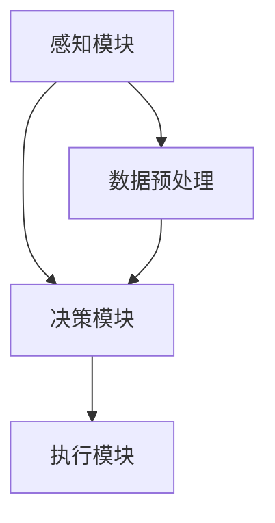
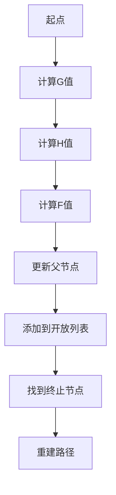
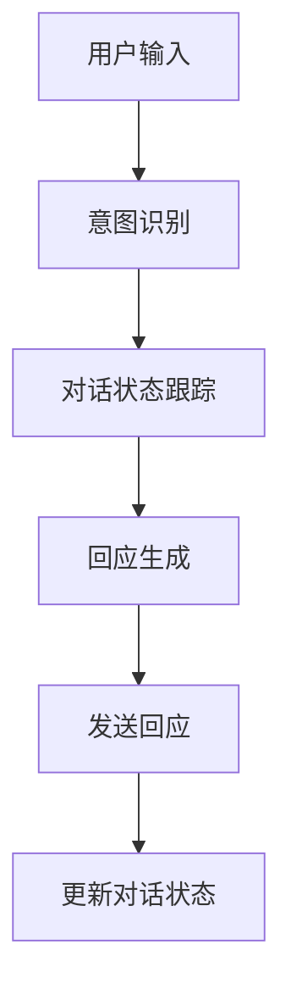

                 


### 文章标题

**AI Agent: AI的下一个风口 Camel.AI：引领自主与交流智能体的未来**

> 关键词：AI Agent、Camel.AI、自主智能体、交流智能体、自然语言处理、虚拟助手、工业自动化、智能家居

> 摘要：本文深入探讨了AI Agent的定义、背景、分类及其核心特点，介绍了Camel.AI这一创新平台，分析了自主智能体与交流智能体的技术原理，并通过实际项目案例展示了AI Agent的应用前景。文章旨在为读者提供一个全面的技术视角，了解AI Agent的未来发展趋势和面临的挑战。

----------------------------------------------------------------

### 目录大纲

- **文章标题: AI Agent: AI的下一个风口 Camel.AI：引领自主与交流智能体的未来**
- **关键词: AI Agent、Camel.AI、自主智能体、交流智能体、自然语言处理、虚拟助手、工业自动化、智能家居**
- **摘要: 本文深入探讨了AI Agent的定义、背景、分类及其核心特点，介绍了Camel.AI这一创新平台，分析了自主智能体与交流智能体的技术原理，并通过实际项目案例展示了AI Agent的应用前景。**

## 第一部分: 引言与概述

### 第1章: AI Agent的定义与背景

#### 1.1 AI Agent的定义

AI Agent，即人工智能代理，是一种能够自主感知环境、制定决策并执行行动的智能系统。AI Agent的设计理念源于自主性与协作性的结合，旨在实现机器与环境的互动，以提供高效、智能的服务。

#### 1.2 AI Agent的发展历程

- **早期探索（1950-1960年代）**：AI Agent的概念最早由约翰·麦卡锡等人提出，标志着人工智能研究的开始。
- **人工智能革命（1970-1980年代）**：基于规则的专家系统成为主流，AI Agent开始应用于实际场景。
- **计算力提升与数据爆炸（1990年代至今）**：随着计算能力和数据资源的提升，AI Agent技术取得了长足的进步，特别是在深度学习和大数据的推动下，自主智能体和交流智能体的研究得到了广泛重视。

#### 1.3 AI Agent的分类

- **基于规则的代理**：通过预定义的规则进行决策。
- **数据驱动代理**：利用机器学习算法进行决策。
- **混合代理**：结合规则和数据驱动方法。

#### 1.4 AI Agent的核心特点

- **自主性**：能够独立完成任务，无需人工干预。
- **适应性**：能够根据环境变化调整行为。
- **协作性**：能够与其他代理或人类协同工作。

## 第二部分: Camel.AI技术架构

### 第2章: Camel.AI平台介绍

#### 2.1 Camel.AI的架构设计

Camel.AI采用模块化设计，包括感知模块、决策模块和执行模块。每个模块相互独立，但又紧密协作，实现自主智能体和交流智能体的功能。

#### 2.2 Camel.AI的核心模块

- **感知模块**：负责感知环境信息，包括图像、声音、文本等多种数据类型。
- **决策模块**：基于感知信息，利用机器学习算法生成决策。
- **执行模块**：根据决策结果执行具体的行动。

#### 2.3 Camel.AI的交互机制

Camel.AI支持多模态交互，包括语音、文本和图像。用户可以通过自然语言与AI Agent进行交流，实现高效、便捷的交互体验。

## 第三部分: AI Agent应用场景

### 第3章: AI Agent的应用场景

#### 2.1 人工智能自主系统的崛起

自主系统在工业自动化、无人驾驶等领域的重要性日益凸显。AI Agent能够实现自主导航、任务规划等功能，提高生产效率和安全性。

#### 2.2 AI Agent在虚拟助手中的应用

虚拟助手在客服、智能家居等场景中广泛应用。通过自然语言处理技术，AI Agent能够理解用户需求，提供个性化服务。

#### 2.3 AI Agent在工业自动化中的应用

通过智能代理实现生产流程的自动化，提高生产效率和产品质量。

#### 2.4 AI Agent在智能家居中的应用

智能家居中的智能代理能够提供便捷的家居控制与管理，实现家庭设备的智能联动。

## 第四部分: AI Agent技术原理

### 第4章: 自主智能体技术

#### 4.1 自主智能体的定义与特点

自主智能体具有自主性、适应性和协作性的特点，能够在复杂环境中自主导航和完成任务。

#### 4.2 自主导航算法

- **A*算法**：基于启发式搜索，能够快速找到最优路径。
- **Dijkstra算法**：基于最短路径搜索，适用于无权图。
- **蚁群算法**：模拟蚂蚁觅食过程，适用于大规模路径规划。

#### 4.3 自主导航算法的优化方法

- **启发式搜索算法**：通过引入启发式函数降低搜索空间。
- **蚁群算法**：通过模拟蚂蚁觅食过程实现路径规划。
- **人工势场算法**：通过建立势场模型引导智能体运动。

### 第5章: 交流智能体技术

#### 5.1 交流智能体的定义与特点

交流智能体具备自然语言理解和生成能力，能够与人类进行自然、流畅的交流。

#### 5.2 自然语言处理技术

- **分词**：将文本分割成有意义的词语。
- **词性标注**：标注词语的词性。
- **命名实体识别**：识别文本中的命名实体。

#### 5.3 对话管理系统

- **对话状态跟踪**：记录对话历史，理解对话内容。
- **意图识别**：识别用户的意图。
- **回应生成**：根据对话内容和用户意图生成合适的回应。

## 第五部分: AI Agent项目实战

### 第6章: Camel.AI项目实战

#### 6.1 Camel.AI项目概述

介绍Camel.AI在某个具体项目中的应用，如智能家居控制系统。

#### 6.2 项目需求分析

分析项目需求，明确目标与功能。

#### 6.3 项目技术架构设计

设计项目的整体技术架构。

#### 6.4 项目开发过程详解

详细描述项目开发过程，包括代码实现和测试。

## 第六部分: AI Agent项目案例研究

### 第7章: AI Agent项目案例研究

#### 7.1 案例一：智能家居控制系统

介绍智能家居控制系统的开发与实现。

#### 7.2 案例二：工业自动化监控

分析工业自动化监控项目的实现方法。

#### 7.3 案例三：虚拟助手开发

讨论虚拟助手的开发过程与技术要点。

## 第七部分: AI Agent未来发展展望

### 第8章: AI Agent未来的发展展望

#### 8.1 AI Agent技术的未来发展趋势

展望AI Agent技术的未来发展趋势。

#### 8.2 AI Agent在各个领域的应用前景

探讨AI Agent在不同领域的应用前景。

#### 8.3 AI Agent面临的挑战与解决方案

分析AI Agent面临的挑战及其解决方案。

## 附录

### 附录A: Camel.AI开发工具与资源

#### A.1 Camel.AI开发工具介绍

介绍用于开发Camel.AI的平台和工具。

#### A.2 Camel.AI开源项目推荐

推荐一些与Camel.AI相关的开源项目。

#### A.3 Camel.AI学习资源推荐

推荐一些学习Camel.AI的资源和资料。

### 附录B: Mermaid流程图示例

#### B.1 AI Agent核心架构流程图

展示AI Agent的核心架构流程。

#### B.2 自主导航算法流程图

展示自主导航算法的流程。

#### B.3 对话管理系统流程图

展示对话管理系统的流程。

### 附录C: 伪代码与数学公式示例

#### C.1 自主导航算法伪代码

展示自主导航算法的伪代码。

#### C.2 自然语言处理算法伪代码

展示自然语言处理算法的伪代码。

#### C.3 数学公式示例

展示数学公式的示例。

（以上仅为示例，并非完整目录）

----------------------------------------------------------------

### 第1章: AI Agent的定义与背景

#### 1.1 AI Agent的定义

AI Agent，即人工智能代理，是一种模拟人类智能行为，能够自主感知环境、制定决策并执行行动的智能系统。AI Agent的设计理念源于自主性与协作性的结合，旨在实现机器与环境的互动，以提供高效、智能的服务。

AI Agent的核心目标是实现自主性、适应性和协作性。自主性使得AI Agent能够独立完成任务，无需人工干预；适应性使得AI Agent能够根据环境变化调整行为；协作性使得AI Agent能够与其他代理或人类协同工作，共同完成任务。

在技术层面上，AI Agent通常由感知模块、决策模块和执行模块组成。感知模块负责获取环境信息，如图像、声音、文本等；决策模块基于感知信息，利用机器学习算法生成决策；执行模块根据决策结果执行具体的行动。这种模块化设计使得AI Agent能够灵活适应不同的应用场景。

#### 1.2 AI Agent的发展历程

AI Agent的概念最早由约翰·麦卡锡等人在1950年代提出。当时，人工智能研究正处于起步阶段，人们开始探索如何让计算机模拟人类的智能行为。早期的AI Agent主要是基于规则的专家系统，这些系统通过预定义的规则进行决策，具有一定的智能性，但局限性较大。

随着计算能力的提升和大数据技术的发展，AI Agent的研究取得了长足的进步。特别是在深度学习和自然语言处理技术的推动下，自主智能体和交流智能体的研究得到了广泛关注。深度学习使得AI Agent能够通过大量数据学习复杂的模式，从而提高决策的准确性；自然语言处理技术使得AI Agent能够理解人类的语言，实现自然、流畅的交流。

目前，AI Agent的应用场景已经涵盖了多个领域，如工业自动化、无人驾驶、智能家居、虚拟助手等。这些应用场景对AI Agent的自主性、适应性和协作性提出了更高的要求，推动了AI Agent技术的不断发展。

#### 1.3 AI Agent的分类

AI Agent可以根据其技术特点和应用场景进行分类。常见的分类方法包括以下几种：

1. **基于规则的代理**：这类代理通过预定义的规则进行决策。当环境发生变化时，代理会根据规则库中的规则进行判断，并执行相应的行动。基于规则的代理的优点是实现简单，易于理解；缺点是灵活性较差，难以应对复杂环境。

2. **数据驱动代理**：这类代理通过机器学习算法进行决策。代理会通过大量数据训练模型，从而学会如何应对不同的环境变化。数据驱动代理的优点是适应性强，能够处理复杂问题；缺点是需要大量的数据和计算资源。

3. **混合代理**：这类代理结合了基于规则的代理和数据驱动代理的优点。混合代理通过将规则和数据驱动方法相结合，以提高决策的准确性和灵活性。

4. **自主智能体**：这类代理具有高度的自主性，能够在复杂环境中自主导航和完成任务。自主智能体通常采用自主导航算法，如A*算法、Dijkstra算法等，以实现自主决策。

5. **交流智能体**：这类代理具备自然语言理解和生成能力，能够与人类进行自然、流畅的交流。交流智能体通常采用自然语言处理技术，如分词、词性标注、命名实体识别等，以实现自然语言理解。

6. **多模态代理**：这类代理能够处理多种类型的数据，如图像、声音、文本等。多模态代理通过融合不同类型的数据，以提高感知和决策的准确性。

#### 1.4 AI Agent的核心特点

AI Agent的核心特点包括自主性、适应性和协作性。

1. **自主性**：自主性是AI Agent的核心特点之一。AI Agent能够在没有人工干预的情况下，自主感知环境、制定决策并执行行动。这种自主性使得AI Agent能够独立完成复杂的任务，提高生产效率和智能化水平。

2. **适应性**：适应性是指AI Agent能够根据环境变化调整行为。在复杂的环境中，环境变化是不可避免的。AI Agent需要能够适应这些变化，并做出合理的决策。适应性使得AI Agent能够应对不同的场景和任务，提高灵活性和可靠性。

3. **协作性**：协作性是指AI Agent能够与其他代理或人类协同工作，共同完成任务。在复杂任务中，单靠一个AI Agent可能无法完成任务。多个AI Agent可以通过协作，实现任务的分解和协同工作。协作性提高了AI Agent的效率和可靠性。

### 第2章: AI Agent的应用场景

AI Agent的应用场景非常广泛，涵盖了工业、医疗、交通、家居等多个领域。以下将介绍一些典型的应用场景：

#### 2.1 人工智能自主系统的崛起

自主系统在工业自动化、无人驾驶等领域的重要性日益凸显。在工业自动化中，AI Agent可以用于生产流程的监控和优化，提高生产效率和产品质量。例如，在制造业中，AI Agent可以监控生产设备的运行状态，预测设备故障，并提出预防性维护措施。

在无人驾驶领域，AI Agent是关键组成部分。无人驾驶汽车通过感知模块获取道路信息，利用自主导航算法实现路径规划，并通过执行模块控制车辆的运动。AI Agent在无人驾驶中的应用极大地提高了交通安全和效率。

#### 2.2 AI Agent在虚拟助手中的应用

虚拟助手在客服、智能家居等场景中广泛应用。虚拟助手可以通过自然语言处理技术理解用户的需求，提供个性化的服务。在客服领域，虚拟助手可以自动处理大量客户咨询，提高客服效率，降低人力成本。

在智能家居中，虚拟助手可以控制家庭设备的开关，如照明、空调、门锁等，提供便捷的家居管理。虚拟助手还可以通过学习用户的生活习惯，提供个性化的建议和服务，如健康提醒、日程安排等。

#### 2.3 AI Agent在工业自动化中的应用

在工业自动化中，AI Agent可以用于生产过程的监控、优化和预测。通过感知模块，AI Agent可以实时获取生产设备的数据，如温度、压力、速度等。利用这些数据，AI Agent可以进行质量检测、故障诊断和预测性维护。

例如，在制造业中，AI Agent可以监控生产线的运行状态，检测产品的质量，并预测设备可能出现的故障。当设备出现故障时，AI Agent可以自动生成维修计划，并将信息通知维护人员。这种应用提高了生产线的可靠性和效率。

#### 2.4 AI Agent在智能家居中的应用

智能家居中的AI Agent可以提供便捷的家居控制与管理。通过感知模块，AI Agent可以实时获取家庭环境的数据，如温度、湿度、光照等。利用这些数据，AI Agent可以自动调节家庭设备的开关，如照明、空调、窗帘等，以提供舒适的家居环境。

例如，在夜间，AI Agent可以自动关闭照明，调节空调的温度，以提供舒适的睡眠环境。当用户离开家时，AI Agent可以自动关闭家庭设备的开关，以节约能源。此外，AI Agent还可以通过学习用户的生活习惯，提供个性化的建议和服务，如健康提醒、日程安排等。

#### 2.5 AI Agent在医疗领域的应用

AI Agent在医疗领域具有广泛的应用前景。通过自然语言处理技术，AI Agent可以辅助医生进行诊断和治疗。例如，AI Agent可以分析大量的病历数据，提取关键信息，帮助医生进行疾病诊断。

在手术机器人领域，AI Agent可以辅助医生进行手术操作。AI Agent通过感知模块获取患者的生理信息，如心率、血压等，并根据这些信息调整手术机器人的操作，以提高手术的精度和安全性。

#### 2.6 AI Agent在交通领域的应用

AI Agent在交通领域可以用于交通管理和自动驾驶。在交通管理中，AI Agent可以实时获取交通流量数据，并根据这些数据优化交通信号控制，以减少拥堵和提高交通效率。

在自动驾驶领域，AI Agent是关键组成部分。自动驾驶汽车通过感知模块获取道路信息，利用自主导航算法实现路径规划，并通过执行模块控制车辆的运动。AI Agent在自动驾驶中的应用极大地提高了交通安全和效率。

### 第3章: Camel.AI平台介绍

Camel.AI是一个创新的平台，旨在构建自主智能体和交流智能体，实现高效的机器与环境的互动。以下将详细介绍Camel.AI的架构设计、核心模块和交互机制。

#### 3.1 Camel.AI的架构设计

Camel.AI采用模块化设计，包括感知模块、决策模块和执行模块。每个模块相互独立，但又紧密协作，实现自主智能体和交流智能体的功能。

- **感知模块**：感知模块负责获取环境信息，如图像、声音、文本等。感知模块通过传感器、摄像头、麦克风等设备获取数据，并对其进行预处理，如滤波、特征提取等。感知模块的核心任务是提供高质量的感知数据，为决策模块提供基础。
- **决策模块**：决策模块基于感知模块提供的数据，利用机器学习算法生成决策。决策模块的核心任务是分析感知数据，识别目标、场景和任务，并根据任务目标生成最优决策。决策模块通常采用深度学习、强化学习等技术，以提高决策的准确性和效率。
- **执行模块**：执行模块根据决策模块生成的决策结果，执行具体的行动。执行模块负责将决策转化为实际操作，如控制机器人运动、发送文本消息等。执行模块的核心任务是确保决策的准确执行，并实时调整行动以适应环境变化。

#### 3.2 Camel.AI的核心模块

Camel.AI的核心模块包括感知模块、决策模块和执行模块，每个模块都有其独特的功能和技术实现。

- **感知模块**：感知模块是Camel.AI的基础，负责获取环境信息。感知模块的核心技术包括图像处理、语音识别、自然语言处理等。例如，图像处理技术用于从摄像头获取的图像中提取特征，语音识别技术用于将语音信号转换为文本，自然语言处理技术用于理解文本内容。
- **决策模块**：决策模块基于感知模块提供的数据，利用机器学习算法生成决策。决策模块的核心技术包括深度学习、强化学习、规划算法等。例如，深度学习技术用于从大量数据中学习复杂的模式，强化学习技术用于在动态环境中进行决策优化，规划算法用于生成最优行动路径。
- **执行模块**：执行模块根据决策模块生成的决策结果，执行具体的行动。执行模块的核心技术包括控制理论、机器人技术、物联网等。例如，控制理论用于实现精准的运动控制，机器人技术用于执行复杂的动作，物联网技术用于实现设备间的通信和协作。

#### 3.3 Camel.AI的交互机制

Camel.AI支持多模态交互，包括语音、文本和图像。用户可以通过自然语言与AI Agent进行交流，实现高效、便捷的交互体验。

- **语音交互**：语音交互是Camel.AI的重要组成部分，用户可以通过语音与AI Agent进行交流。语音交互技术包括语音识别、语音合成、自然语言理解等。语音识别技术将用户的语音转换为文本，语音合成技术将文本转换为语音，自然语言理解技术理解用户的意图和需求。
- **文本交互**：文本交互是Camel.AI的另一种交互方式，用户可以通过文本消息与AI Agent进行交流。文本交互技术包括自然语言处理、对话管理等。自然语言处理技术用于理解用户的文本输入，对话管理技术用于维护对话状态和生成合适的回应。
- **图像交互**：图像交互是Camel.AI的又一重要组成部分，用户可以通过图像与AI Agent进行交流。图像交互技术包括图像识别、图像处理、图像生成等。图像识别技术用于识别图像中的对象和场景，图像处理技术用于对图像进行增强和去噪，图像生成技术用于创建新的图像。

通过感知模块、决策模块和执行模块的协作，Camel.AI能够实现高效的自主决策和执行，为用户带来智能化的交互体验。

### 第4章: 自主智能体技术

自主智能体（Autonomous Intelligent Agent，AIA）是人工智能研究中的重要方向，它能够在没有人类干预的情况下，自主地完成特定任务。自主智能体的核心在于其自主性、适应性和协作性。在本节中，我们将深入探讨自主智能体的定义与特点，以及自主导航算法的原理和应用。

#### 4.1 自主智能体的定义与特点

自主智能体是一种能够独立执行任务，具有高度自主性的智能系统。它可以感知环境，根据环境信息自主制定决策，并执行相应的行动。自主智能体的核心特点包括：

1. **自主性**：自主智能体能够在没有人类干预的情况下，独立完成特定任务。它可以通过感知模块获取环境信息，利用决策模块分析信息，并使用执行模块进行行动。这种自主性使得自主智能体能够适应不同的环境和任务，提高生产效率和智能化水平。

2. **适应性**：自主智能体能够根据环境变化调整行为。在复杂多变的实际环境中，自主智能体需要能够应对各种情况，适应环境变化。这种适应性使得自主智能体能够更好地完成任务，提高可靠性。

3. **协作性**：自主智能体不仅能够独立完成任务，还可以与其他自主智能体或人类进行协作。在复杂任务中，多个自主智能体可以通过协作，实现任务的分解和协同工作。这种协作性提高了任务完成的效率和质量。

#### 4.2 自主导航算法

自主导航算法是自主智能体实现自主性的关键技术。它能够使智能体在复杂环境中自主规划路径，避免障碍物，并到达目标位置。以下介绍几种常用的自主导航算法：

1. **A*算法**：A*（A-star）算法是最常用的路径规划算法之一。它通过评估函数（F值）来寻找最优路径。A*算法的评估函数F是由两个因素组成：G值（当前节点到起点的代价）和H值（当前节点到终点的估计代价）。算法的核心步骤如下：

   - 初始化：设置起始节点和终止节点，创建一个开放列表（包含所有未访问的节点）和一个关闭列表（包含已访问的节点）。
   - 循环：从开放列表中取出F值最小的节点，将其添加到关闭列表；对于该节点的每个邻居节点，计算G值、H值和F值，如果邻居节点已在开放列表中，且新路径的代价更低，则更新该节点的父节点和F值；如果邻居节点不在开放列表中，则将其添加到开放列表。
   - 终止条件：当终止节点被添加到开放列表时，算法结束。

   A*算法的伪代码如下：

   ```
   A*算法伪代码：
   function A*(startNode, endNode):
       openList = {startNode}
       closedList = {}
       while openList is not empty:
           currentNode = openList with the lowest F value
           openList.remove(currentNode)
           closedList.add(currentNode)
           if currentNode == endNode:
               return reconstruct_path(currentNode)
           for each neighbor of currentNode:
               g = g + cost(currentNode, neighbor)
               h = heuristic(neighbor, endNode)
               f = g + h
               if neighbor in openList and f >= neighbor's F value:
                   continue
               neighbor.parent = currentNode
               neighbor.F = f
               if neighbor not in openList:
                   openList.add(neighbor)
       return None
   ```

2. **Dijkstra算法**：Dijkstra算法是另一种常见的路径规划算法，适用于无权图。它的核心思想是从起始节点开始，逐步扩展到其他节点，计算到达每个节点的最短路径。Dijkstra算法的伪代码如下：

   ```
   Dijkstra算法伪代码：
   function Dijkstra(startNode):
       distance[startNode] = 0
       unvisited = {all nodes except startNode}
       while unvisited is not empty:
           currentNode = unvisited with the smallest distance
           unvisited.remove(currentNode)
           for each neighbor of currentNode:
               distance[neighbor] = min(distance[neighbor], distance[currentNode] + cost(currentNode, neighbor))
       return distance
   ```

3. **蚁群算法**：蚁群算法（Ant Colony Optimization，ACO）是一种基于群体智能的路径规划算法。它模拟蚂蚁觅食过程，通过信息素更新和路径选择策略，找到最优路径。蚁群算法的核心步骤如下：

   - 初始化：设置信息素浓度和启发函数。
   - 蚁群搜索：每只蚂蚁从起始节点出发，根据信息素浓度和启发函数选择路径，到达目标节点。
   - 信息素更新：蚂蚁在路径上留下信息素，信息素浓度与路径长度成反比。
   - 路径选择：下一只蚂蚁在选择路径时，考虑信息素浓度和启发函数，进行路径选择。

   蚁群算法的伪代码如下：

   ```
   蚁群算法伪代码：
   function ACO(num_of_ants, num_of_iterations):
       initialize pheromone_matrix and heuristic_function
       for i from 1 to num_of_iterations:
           for each ant in num_of_ants:
               start at startNode
               while not at endNode:
                   choose next node based on pheromone and heuristic
                   move to the chosen node
               deposit pheromone on the path
           update pheromone_matrix based on the number of ants that took each path
       return best_path found
   ```

#### 4.3 自主导航算法的优化方法

自主导航算法在实际应用中面临着计算复杂度高、实时性要求强等挑战。为了提高导航算法的性能，可以采用以下几种优化方法：

1. **启发式搜索算法**：启发式搜索算法通过引入启发式函数降低搜索空间。例如，A*算法中的启发式函数可以估计当前节点到目标节点的距离，从而加速路径搜索。

2. **并行计算**：并行计算可以显著提高导航算法的实时性。通过利用多核处理器或分布式计算资源，可以加快算法的执行速度。

3. **模糊逻辑控制**：模糊逻辑控制可以处理不确定性因素，提高导航算法的鲁棒性。通过将模糊逻辑与导航算法结合，可以更好地应对复杂环境。

4. **多目标优化**：在导航算法中，可以同时考虑多个目标，如路径长度、速度、能耗等。通过多目标优化，可以找到在多个目标之间的最优平衡点。

通过上述方法，可以优化自主导航算法的性能，提高自主智能体的自主性和适应性。

### 第5章: 交流智能体技术

交流智能体（Communicative Intelligent Agent，CIA）是人工智能研究中的一个重要方向，它能够理解人类语言，并以自然、流畅的方式进行交流。交流智能体在虚拟助手、智能客服、人机交互等领域具有广泛的应用。在本节中，我们将介绍交流智能体的定义与特点，以及自然语言处理技术、对话管理系统等内容。

#### 5.1 交流智能体的定义与特点

交流智能体是一种能够与人类进行自然语言交流的智能系统。它通过自然语言处理技术，理解人类的语言输入，并以自然、流畅的方式生成语言回应。交流智能体的核心特点包括：

1. **自然语言理解**：交流智能体能够理解人类语言的语义和句法，提取语言输入中的关键信息。自然语言理解包括分词、词性标注、命名实体识别、语义角色标注等任务。

2. **自然语言生成**：交流智能体能够根据对话内容和用户需求，生成自然、流畅的语言回应。自然语言生成包括文本生成、语音合成、对话生成等任务。

3. **对话管理**：交流智能体能够管理对话流程，维护对话状态，识别用户意图，并生成合适的回应。对话管理包括对话状态跟踪、意图识别、回应生成等任务。

4. **多模态交互**：交流智能体支持多种交互方式，如文本、语音、图像等。多模态交互可以提供更加丰富和自然的交流体验。

5. **自适应性和可扩展性**：交流智能体能够根据用户需求和场景变化，自适应地调整对话策略和生成方式。同时，交流智能体具有较好的可扩展性，可以支持不同领域的应用。

#### 5.2 自然语言处理技术

自然语言处理（Natural Language Processing，NLP）是交流智能体的核心技术之一，它涉及文本处理和理解的各种任务。以下介绍一些关键的NLP技术：

1. **分词**：分词是将一段连续的文本分割成有意义的词语。分词是NLP的基础，对于后续的语言处理任务至关重要。常用的分词方法包括基于词典的分词、基于统计的分词和基于字符级别的分词。

2. **词性标注**：词性标注是为每个词语标注其词性，如名词、动词、形容词等。词性标注有助于理解词语在句子中的角色和功能，是许多NLP任务的基础。

3. **命名实体识别**：命名实体识别（Named Entity Recognition，NER）是识别文本中的命名实体，如人名、地名、组织名等。NER在信息提取、文本分类和知识图谱构建等领域具有重要应用。

4. **语义角色标注**：语义角色标注是为句子中的每个词语标注其在句子中的语义角色，如主语、谓语、宾语等。语义角色标注有助于理解句子的结构和语义，是语义分析的重要基础。

5. **语义分析**：语义分析是对文本的语义内容进行深入理解，包括句法分析、语义角色标注、事件抽取等任务。语义分析有助于生成准确、自然的语言回应。

6. **情感分析**：情感分析是判断文本中的情感倾向，如正面、负面或中性。情感分析在用户情感监测、产品评论分析等领域具有重要应用。

#### 5.3 对话管理系统

对话管理系统（Dialogue Management System，DMS）是交流智能体的核心组成部分，负责管理对话流程，生成合适的语言回应。以下介绍对话管理系统的核心组件和关键技术：

1. **对话状态跟踪**：对话状态跟踪是记录对话历史和当前对话状态的过程。对话状态包括用户意图、对话历史、上下文信息等。对话状态跟踪有助于理解用户的意图和生成合适的回应。

2. **意图识别**：意图识别是识别用户的意图，如查询信息、执行任务、表达情感等。意图识别通常通过机器学习模型进行，如分类器、序列标注模型等。

3. **回应生成**：回应生成是根据对话状态和用户意图生成合适的语言回应。回应生成可以采用模板匹配、生成式模型、对话策略等方法。生成式模型如序列到序列模型（Seq2Seq）和变换器模型（Transformer）在回应生成中具有显著优势。

4. **对话策略**：对话策略是指导对话管理系统的行为和决策。对话策略可以通过规则、学习算法或混合方法实现。常用的对话策略包括基于规则的策略、强化学习策略和混合策略。

5. **多轮对话**：多轮对话是交流智能体与用户进行多轮交互的过程。在多轮对话中，交流智能体需要维护对话状态，理解用户意图，并生成合适的回应。多轮对话可以实现更加自然和深入的交流。

通过自然语言处理技术和对话管理系统，交流智能体能够与人类进行自然、流畅的交流，提供高效、智能的服务。

### 第6章: Camel.AI项目实战

在本章中，我们将通过一个具体的项目——Camel.AI智能家居控制系统，详细介绍项目概述、需求分析、技术架构设计和开发过程。

#### 6.1 Camel.AI项目概述

Camel.AI智能家居控制系统是一个集成了感知模块、决策模块和执行模块的智能系统。该系统旨在实现家庭设备的智能控制，提高家庭生活的便捷性和舒适度。系统的主要功能包括：

1. **环境监测**：通过感知模块，系统可以实时监测家庭环境中的温度、湿度、光照等参数，并将数据传输至决策模块。

2. **设备控制**：系统可以控制家庭设备，如灯光、空调、窗帘、安防系统等，实现远程控制和自动化调节。

3. **用户交互**：系统支持语音交互和文本交互，用户可以通过语音或文本与系统进行沟通，实现智能控制。

4. **数据分析和预测**：系统可以分析用户的行为数据和生活习惯，提供个性化建议和预测，如节能建议、健康提醒等。

#### 6.2 项目需求分析

在项目开始前，我们进行了详细的需求分析，明确了项目的目标、功能和技术要求。主要需求如下：

1. **功能需求**：
   - 实现家庭环境的实时监测和数据分析。
   - 提供家庭设备的远程控制和自动化调节。
   - 支持语音交互和文本交互，实现智能控制。
   - 提供数据分析和预测功能，为用户提供个性化建议。

2. **性能需求**：
   - 系统应具有高可靠性，保证数据传输和设备控制的稳定性。
   - 系统应具有高并发处理能力，支持多个用户同时交互。
   - 系统应具有较好的可扩展性，支持新增设备和功能的接入。

3. **技术要求**：
   - 采用Camel.AI平台，实现感知模块、决策模块和执行模块的集成。
   - 使用深度学习和自然语言处理技术，实现环境监测和用户交互。
   - 使用物联网技术，实现设备控制和数据传输。

#### 6.3 项目技术架构设计

Camel.AI智能家居控制系统采用模块化设计，主要包括感知模块、决策模块和执行模块。以下是系统的技术架构设计：

1. **感知模块**：
   - **传感器**：系统集成了多种传感器，如温度传感器、湿度传感器、光照传感器等，用于监测家庭环境。
   - **数据采集**：传感器采集的数据通过物联网设备传输至感知模块，进行数据预处理和特征提取。

2. **决策模块**：
   - **环境监测**：决策模块对感知模块传输的数据进行实时监测和分析，识别环境变化。
   - **设备控制**：基于环境监测结果，决策模块生成控制指令，调节家庭设备。
   - **用户交互**：决策模块接收用户的语音或文本输入，理解用户意图，并生成回应。

3. **执行模块**：
   - **设备控制**：执行模块根据决策模块生成的控制指令，控制家庭设备的开关、调节等操作。
   - **数据存储**：执行模块将处理后的数据存储在数据库中，供后续分析和预测使用。

#### 6.4 项目开发过程详解

Camel.AI智能家居控制系统的开发过程包括以下步骤：

1. **需求分析**：在项目启动前，我们进行了详细的需求分析，明确了项目的目标、功能和技术要求。这有助于项目团队更好地理解项目需求和制定开发计划。

2. **技术选型**：根据需求分析结果，我们选择了Camel.AI平台作为核心技术，并确定了物联网、深度学习和自然语言处理等技术方向。

3. **系统设计**：在系统设计阶段，我们制定了系统的技术架构和模块划分，明确了各模块的功能和接口。

4. **感知模块开发**：
   - **硬件选型**：选择了合适的传感器，如温度传感器、湿度传感器等，并搭建了传感器采集系统。
   - **数据预处理**：对传感器采集的数据进行预处理，如滤波、归一化等，以去除噪声和异常值。

5. **决策模块开发**：
   - **环境监测**：开发了环境监测算法，对感知模块传输的数据进行实时分析和处理，识别环境变化。
   - **设备控制**：基于环境监测结果，开发了设备控制算法，生成控制指令，调节家庭设备。
   - **用户交互**：开发了自然语言处理算法，理解用户的语音或文本输入，生成合适的回应。

6. **执行模块开发**：
   - **设备控制**：开发了设备控制模块，根据决策模块生成的控制指令，实现家庭设备的远程控制和自动化调节。
   - **数据存储**：开发了数据存储模块，将处理后的数据存储在数据库中，供后续分析和预测使用。

7. **系统集成与测试**：将感知模块、决策模块和执行模块进行集成，并对系统进行功能测试和性能优化。

8. **部署与运维**：将系统部署到实际场景中，并进行运维管理，确保系统的稳定运行。

通过以上步骤，我们成功实现了Camel.AI智能家居控制系统，为用户提供了一个高效、智能的家居控制解决方案。

### 第7章: AI Agent项目案例研究

在本章中，我们将通过三个具体的AI Agent项目案例——智能家居控制系统、工业自动化监控系统和虚拟助手开发，详细介绍项目的背景、需求、实现方法和技术要点。

#### 7.1 案例一：智能家居控制系统

智能家居控制系统是一个利用AI Agent实现家庭设备智能控制的项目。项目的目标是提高家庭生活的便捷性和舒适度，通过AI Agent实现远程控制、自动化调节和个性化建议。

**项目背景**：随着人工智能和物联网技术的发展，智能家居市场日益成熟。用户对于家居设备的智能化需求越来越高，希望实现远程控制和自动化调节，提高生活品质。

**需求分析**：
- 实现家庭设备的远程控制，如灯光、空调、窗帘等。
- 实现设备的自动化调节，根据环境变化和用户习惯自动调整设备状态。
- 提供数据分析和预测功能，为用户提供个性化建议，如节能建议、健康提醒等。

**实现方法**：
1. **感知模块**：集成多种传感器，如温度传感器、湿度传感器、光照传感器等，用于监测家庭环境。
2. **决策模块**：采用机器学习和自然语言处理技术，实现环境监测、设备控制和用户交互。
3. **执行模块**：实现设备控制模块，根据决策模块生成的控制指令，控制家庭设备的开关、调节等操作。
4. **用户交互**：支持语音交互和文本交互，用户可以通过语音或文本与AI Agent进行沟通，实现智能控制。

**技术要点**：
- **传感器数据处理**：对传感器采集的数据进行实时处理，如滤波、归一化等，以提高数据质量和稳定性。
- **机器学习模型**：采用深度学习模型，如卷积神经网络（CNN）和循环神经网络（RNN），实现环境监测和设备控制。
- **自然语言处理**：利用自然语言处理技术，实现用户的语音或文本输入理解和回应生成。

#### 7.2 案例二：工业自动化监控系统

工业自动化监控系统是一个利用AI Agent实现工业生产过程监控和优化管理的项目。项目的目标是提高生产效率和产品质量，通过AI Agent实现生产过程的自动化监控和故障预测。

**项目背景**：随着制造业的自动化和智能化水平不断提高，工业自动化监控系统在提高生产效率和产品质量方面发挥着重要作用。通过AI Agent实现生产过程的自动化监控和故障预测，可以显著提高生产线的运行效率和可靠性。

**需求分析**：
- 实现生产过程的实时监控，如设备运行状态、产品质量等。
- 实现故障预测和预警，提前发现潜在故障，降低设备故障率。
- 提供生产数据分析，支持生产优化和管理决策。

**实现方法**：
1. **感知模块**：集成传感器和监控设备，如温度传感器、压力传感器、摄像头等，用于实时采集生产数据。
2. **决策模块**：采用机器学习和统计分析方法，实现生产数据的实时分析和故障预测。
3. **执行模块**：实现预警和故障处理模块，根据决策模块的预测结果，自动进行设备调节和故障处理。
4. **用户交互**：支持实时数据展示和报警信息推送，用户可以通过终端设备查看生产数据和报警信息。

**技术要点**：
- **实时数据处理**：采用高速数据处理技术，如分布式计算和流处理，实现生产数据的实时分析和处理。
- **故障预测模型**：采用机器学习算法，如随机森林、支持向量机等，建立故障预测模型，提高预测准确性。
- **报警系统**：实现实时报警功能，根据故障预测结果，自动发送报警信息，提醒操作人员处理故障。

#### 7.3 案例三：虚拟助手开发

虚拟助手开发是一个利用AI Agent实现智能客服和个性化服务的项目。项目的目标是提高客户服务效率，提供个性化、智能化的客户体验。

**项目背景**：随着互联网的普及，虚拟助手（Chatbot）在客服领域得到了广泛应用。通过虚拟助手，企业可以提供7x24小时的在线客服，提高客户满意度和服务效率。

**需求分析**：
- 提供智能客服功能，自动回答客户常见问题。
- 实现用户交互，理解用户需求，提供个性化服务。
- 提供数据分析，支持业务优化和决策。

**实现方法**：
1. **感知模块**：集成自然语言处理技术，实现用户的语音或文本输入理解。
2. **决策模块**：采用机器学习和知识图谱技术，实现用户的意图识别和回应生成。
3. **执行模块**：实现任务执行模块，根据决策模块的回应，自动执行相应的任务，如拨打电话、发送邮件等。
4. **用户交互**：提供多模态交互方式，如文本、语音、图像等，用户可以通过多种方式与虚拟助手进行交互。

**技术要点**：
- **自然语言处理**：采用深度学习技术，如循环神经网络（RNN）和变换器模型（Transformer），实现用户的语音或文本输入理解。
- **意图识别和回应生成**：采用机器学习算法，如长短期记忆网络（LSTM）和生成对抗网络（GAN），实现用户的意图识别和回应生成。
- **知识图谱**：构建知识图谱，存储和关联各种信息，提高系统的智能性和灵活性。

通过以上三个案例，我们可以看到AI Agent在智能家居、工业自动化和虚拟助手等领域的广泛应用和重要性。这些案例不仅展示了AI Agent的技术原理和实现方法，也为未来的应用提供了有益的参考和启示。

### 第8章: AI Agent未来的发展展望

随着人工智能技术的不断进步，AI Agent将在未来的各个领域发挥越来越重要的作用。本节将探讨AI Agent的未来发展趋势、在各领域的应用前景以及面临的挑战与解决方案。

#### 8.1 AI Agent技术的未来发展趋势

1. **更强大的自主性**：未来的AI Agent将具有更强大的自主性，能够处理更为复杂和动态的环境。通过深度学习、强化学习和迁移学习等技术，AI Agent将能够自主地学习和适应新的任务和环境。

2. **多模态感知与交互**：AI Agent将能够处理多种类型的数据，如图像、声音、文本等。多模态感知与交互技术将使AI Agent能够更自然地与人类进行交流，提供更加丰富和个性化的服务。

3. **智能决策与规划**：AI Agent将采用更先进的决策与规划算法，如基于图论的路径规划、强化学习等。这些算法将帮助AI Agent在复杂和动态的环境中做出更智能和高效的决策。

4. **大规模协作与协同**：未来的AI Agent将能够在更大规模的分布式系统中协作和协同工作。通过分布式计算和区块链技术，AI Agent将能够实现跨平台的合作，提高系统的整体效率和鲁棒性。

5. **泛在化与嵌入式应用**：AI Agent将逐渐渗透到日常生活中，成为嵌入式设备的重要组成部分。物联网和5G技术的发展将使AI Agent能够更广泛地应用于智能家居、智能城市等领域。

#### 8.2 AI Agent在各个领域的应用前景

1. **工业自动化**：AI Agent将广泛应用于工业自动化领域，实现生产过程的智能化和自动化。通过自主导航和决策，AI Agent可以协助工业机器人完成复杂的生产任务，提高生产效率和产品质量。

2. **智能交通**：在智能交通领域，AI Agent将用于交通管理和自动驾驶。通过感知和决策，AI Agent可以优化交通流量，减少拥堵，提高交通效率。同时，自动驾驶汽车将使交通安全和便利性得到大幅提升。

3. **医疗健康**：AI Agent在医疗健康领域具有巨大的潜力。通过自然语言处理和医学知识图谱，AI Agent可以辅助医生进行诊断和治疗，提高医疗服务的质量和效率。此外，AI Agent还可以用于慢性病管理、健康监测等方面。

4. **智能家居**：智能家居是AI Agent的重要应用场景之一。通过感知模块、决策模块和执行模块的协作，AI Agent可以实现家庭设备的智能控制，提高家庭生活的便捷性和舒适度。

5. **金融服务**：AI Agent在金融服务领域具有广泛的应用前景。通过大数据分析和机器学习技术，AI Agent可以提供个性化的金融产品推荐、风险评估和欺诈检测等服务，提高金融服务的质量和效率。

6. **教育**：AI Agent在教育领域可以提供个性化学习辅导、智能评估和互动教学等服务。通过自然语言处理和知识图谱技术，AI Agent可以更好地理解学生的学习需求和进度，提供针对性的教育资源和指导。

7. **智能城市**：在智能城市中，AI Agent可以用于城市管理、环境监测、能源管理等方面。通过多模态感知和协同决策，AI Agent可以优化城市资源利用，提高城市运行效率和居民生活质量。

#### 8.3 AI Agent面临的挑战与解决方案

尽管AI Agent在各个领域具有广泛的应用前景，但其在发展过程中仍面临一些挑战。

1. **数据隐私和安全**：AI Agent的广泛应用将涉及大量用户数据，数据隐私和安全成为关键问题。未来的解决方案可能包括数据加密、匿名化处理、隐私保护算法等。

2. **算法透明度和可解释性**：深度学习等复杂算法的广泛应用使得AI Agent的决策过程变得不透明。未来的解决方案可能包括算法解释技术、可解释性模型等，以提高算法的透明度和可解释性。

3. **计算资源消耗**：AI Agent的应用需要大量的计算资源和存储资源。未来的解决方案可能包括分布式计算、边缘计算等，以降低计算资源消耗。

4. **伦理和社会问题**：AI Agent的广泛应用可能带来一些伦理和社会问题，如自动化带来的失业、人工智能伦理等。未来的解决方案可能包括制定相关法律法规、建立伦理准则等。

5. **跨领域协作和标准化**：AI Agent在不同领域的应用具有较大的差异，跨领域协作和标准化成为关键问题。未来的解决方案可能包括制定统一的AI Agent标准、建立跨领域的合作机制等。

总之，AI Agent的未来发展前景广阔，但同时也面临诸多挑战。通过持续的技术创新和多方协作，我们可以克服这些挑战，推动AI Agent技术的健康发展，为人类社会带来更多便利和创新。

### 附录A: Camel.AI开发工具与资源

为了更好地理解和应用Camel.AI平台，以下将介绍一些常用的开发工具、开源项目和资源。

#### A.1 Camel.AI开发工具介绍

1. **感知模块开发工具**：
   - **OpenCV**：OpenCV是一个强大的计算机视觉库，用于图像处理和特征提取。
   - **TensorFlow**：TensorFlow是一个开源的机器学习框架，支持多种感知模块的开发。
   - **Keras**：Keras是一个高级神经网络API，可以简化深度学习模型的开发。

2. **决策模块开发工具**：
   - **PyTorch**：PyTorch是一个流行的深度学习框架，适用于决策模块的开发。
   - **Scikit-learn**：Scikit-learn是一个开源的机器学习库，适用于传统机器学习算法的开发。

3. **执行模块开发工具**：
   - **ROS（Robot Operating System）**：ROS是一个开源的机器人操作系统，适用于执行模块的开发。
   - **Raspberry Pi**：Raspberry Pi是一个低成本、高性能的单板计算机，适用于嵌入式设备的应用。

#### A.2 Camel.AI开源项目推荐

1. **感知模块开源项目**：
   - **TensorFlow Object Detection API**：这是一个基于TensorFlow的物体检测库，适用于感知模块的开发。
   - **SpeechRecognition**：这是一个开源的语音识别库，适用于语音感知模块的开发。

2. **决策模块开源项目**：
   - ** reinforcement-learning**：这是一个开源的强化学习库，适用于决策模块的开发。
   - **Chatbots.js**：这是一个开源的聊天机器人库，适用于对话管理系统的开发。

3. **执行模块开源项目**：
   - **Paho MQTT**：这是一个开源的MQTT客户端库，适用于执行模块的数据传输。
   - **Node-RED**：这是一个开源的数据流程编辑器，适用于执行模块的流程设计。

#### A.3 Camel.AI学习资源推荐

1. **在线课程**：
   - **Coursera上的“Deep Learning”**：这是一门由斯坦福大学提供的深度学习课程，适合初学者入门。
   - **Udacity上的“Introduction to Artificial Intelligence”**：这是一门由Udacity提供的入门级人工智能课程，内容涵盖了感知、决策和执行等多个方面。

2. **图书**：
   - **《Deep Learning》**：这是一本由Ian Goodfellow、Yoshua Bengio和Aaron Courville撰写的深度学习经典教材，适合深度学习和决策模块的学习。
   - **《Artificial Intelligence: A Modern Approach》**：这是一本由Stuart J. Russell和Peter Norvig撰写的综合人工智能教材，适合全面了解人工智能的基础知识。

3. **博客和论坛**：
   - **Medium上的AI博客**：Medium上有很多关于人工智能的优质博客，涵盖深度学习、自然语言处理等多个方面。
   - **Stack Overflow**：Stack Overflow是一个技术问答社区，开发者可以在上面提问和解答关于人工智能和编程的问题。

通过使用这些开发工具、开源项目和资源，开发者可以更好地掌握Camel.AI平台，实现自主智能体和交流智能体的应用。

### 附录B: Mermaid流程图示例

在本文的附录部分，我们将使用Mermaid语言绘制三个核心流程图：AI Agent核心架构流程图、自主导航算法流程图和对话管理系统流程图。

#### B.1 AI Agent核心架构流程图



此流程图展示了AI Agent的核心架构，包括感知模块、决策模块和执行模块。感知模块负责获取环境信息，决策模块基于感知信息生成决策，执行模块根据决策执行行动。数据预处理模块位于感知模块和决策模块之间，对感知数据进行分析和特征提取。

#### B.2 自主导航算法流程图



此流程图展示了自主导航算法的基本步骤。从起点开始，计算当前节点的G值和H值，得到F值。根据F值更新节点的父节点，并将其添加到开放列表。当找到终止节点时，算法结束，并重建最优路径。

#### B.3 对话管理系统流程图



此流程图展示了对话管理系统的工作流程。用户输入被传递到意图识别模块，识别用户的意图。对话状态跟踪模块记录对话历史和当前状态。回应生成模块根据意图和对话状态生成合适的回应，并将其发送给用户。最后，对话状态更新，以备后续交互。

通过这些流程图，我们可以更直观地理解AI Agent的核心架构和关键算法，为实际开发提供参考。

### 附录C: 伪代码与数学公式示例

在本文的附录部分，我们将展示一些伪代码示例和数学公式，用于说明自主导航算法和自然语言处理算法的基本原理。

#### C.1 自主导航算法伪代码

```plaintext
// 自主导航算法伪代码

// 初始化
初始化开放列表（openList）和关闭列表（closedList）
设置起始节点（startNode）和终止节点（endNode）

// 主循环
while openList 不为空：
    取出openList中的最小F值节点currentNode
    将currentNode添加到closedList

    // 计算邻居节点的G值、H值和F值
    for each neighbor of currentNode：
        g = g + cost(currentNode, neighbor)
        h = heuristic(neighbor, endNode)
        f = g + h

        // 更新openList
        if neighbor in openList and f >= neighbor's F value：
            continue
        else：
            neighbor.parent = currentNode
            neighbor.F = f
            if neighbor not in openList：
                add neighbor to openList

    // 检查终止节点是否在openList中
    if endNode in openList：
        return reconstruct_path(endNode)

// 返回无解
return None
```

#### C.2 自然语言处理算法伪代码

```plaintext
// 分词算法伪代码

// 初始化
初始化词典（dictionary）

// 输入文本
inputText = "人工智能是一种模拟人类智能的技术"

// 分词过程
initialize tokenList as empty list
while inputText is not empty：
    currentWord = findLongestWordMatching(inputText, dictionary)
    add currentWord to tokenList
    remove currentWord from inputText

// 输出分词结果
return tokenList
```

#### C.3 数学公式示例

$$
\text{G值} = \text{当前节点到邻居节点的代价} \\
\text{H值} = \text{邻居节点到终止节点的估计代价} \\
\text{F值} = \text{G值} + \text{H值}
$$

$$
\text{分词算法的精度} = \frac{\text{正确分词的数量}}{\text{总分词的数量}}
$$

通过这些伪代码和数学公式，我们可以更清晰地理解自主导航算法和自然语言处理算法的基本原理，为实际开发提供参考。

