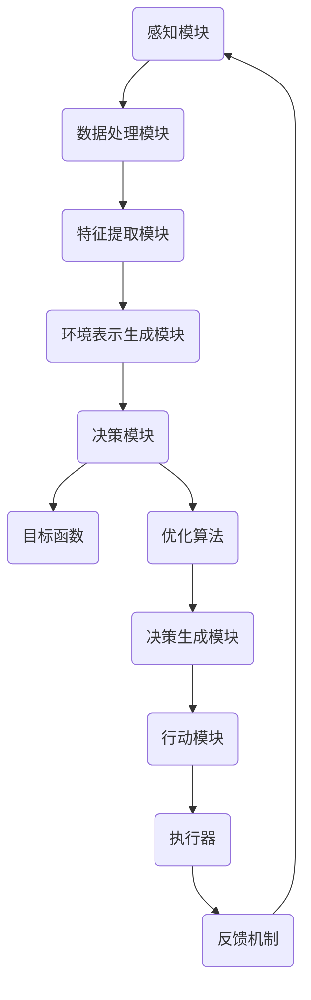

                 

### AI Agent: AI的下一个风口

> 关键词：人工智能代理、智能决策、自主学习、应用场景、研究挑战

在人工智能（AI）飞速发展的今天，AI Agent作为一个能够自主感知环境、做出决策并采取行动的智能体，正逐渐成为AI领域的下一个风口。AI Agent，也称为智能代理，是一种能够在复杂动态环境中自主行动的智能系统。它们不仅能够执行预定的任务，还能够通过学习不断优化其行为，从而在各个领域中展现出巨大的潜力。

本文将系统地探讨AI Agent的核心概念、基本架构、实现方法以及未来的发展方向。我们将逐步分析AI Agent的定义与分类，深入探讨其核心架构和决策模型，讲解感知与行动模块的协调机制，分析其学习与适应策略，探讨其在不同应用场景中的表现，并详细讨论当前研究中的难点与挑战。此外，我们还将介绍AI Agent的开发流程和实战案例，以及其在多领域应用中的前景。

通过本文的详细阐述，读者将能够全面了解AI Agent的各个方面，从而为未来的研究与实践提供有价值的参考。让我们一起深入探索AI Agent的奥秘，开启智能代理的新时代。

### 文章摘要

本文全面探讨了人工智能代理（AI Agent）的概念、架构和实现方法，以及其在多个领域的应用与未来趋势。首先，我们介绍了AI Agent的定义、分类及其基本原理。接着，详细分析了AI Agent的核心架构，包括感知、决策和学习模块，并探讨了各模块之间的协调机制。然后，我们通过多个实际应用案例展示了AI Agent的强大功能。此外，本文还深入讨论了当前AI Agent研究中的难点与挑战，如伦理问题、算法复杂性和实时性能优化等。最后，我们展望了AI Agent在多领域应用中的前景，并提出了未来的研究方向。

### 目录大纲

本文将按照以下结构展开：

## 第一部分: AI Agent的基础理论

### 第1章: AI Agent的定义与分类

#### 1.1.1 AI Agent的基本定义

AI Agent，即人工智能代理，是指能够在复杂环境中自主感知、决策并采取行动的智能体。它通过不断地学习和适应，以实现特定目标或任务。AI Agent的基本定义涵盖了以下几个方面：

1. **自主性**：AI Agent具有自主性，能够独立地执行任务，无需人工干预。这种自主性是AI Agent区别于传统程序的重要特征。

2. **感知能力**：AI Agent能够感知环境中的各种信息，包括视觉、听觉、触觉等。这些信息通过传感器输入到AI Agent中，为其决策提供依据。

3. **决策能力**：AI Agent能够基于感知到的信息，运用决策模型生成行动计划。这种能力使得AI Agent能够在动态环境中做出合理的决策。

4. **行动能力**：AI Agent能够根据决策结果执行相应的行动。这些行动可能是物理行动，如移动、操作设备，也可能是虚拟行动，如发送信息、执行计算。

5. **学习能力**：AI Agent具备学习能力，可以通过历史数据和经验不断优化自身的决策和行动能力。

AI Agent的基本定义强调了其自主性、感知能力、决策能力、行动能力和学习能力，这些都是AI Agent实现自主行动和优化行为的关键要素。

#### 1.1.2 AI Agent的分类

AI Agent可以根据不同的标准进行分类，常见的分类方式包括以下几种：

1. **根据功能**：AI Agent可以分为任务型代理和通用型代理。任务型代理专门为特定任务设计，如智能客服、智能家居等。通用型代理则具有更广泛的能力，能够执行多种任务，如个人助手、自动驾驶等。

2. **根据环境**：AI Agent可以分为静态环境代理和动态环境代理。静态环境代理适用于环境信息相对固定、变化较小的场景，如生产线自动化。动态环境代理则适用于环境信息变化频繁、不确定因素较多的场景，如无人驾驶汽车。

3. **根据智能水平**：AI Agent可以分为弱AI代理和强AI代理。弱AI代理在特定领域内表现出智能行为，但无法超越其设计范围。强AI代理则具有与人类相似的智能水平，能够自主思考并解决问题。

4. **根据学习方式**：AI Agent可以分为有监督学习代理、无监督学习代理和强化学习代理。有监督学习代理需要预先标记的训练数据，无监督学习代理则从未标记的数据中学习，强化学习代理则通过奖励机制不断优化行为。

这些分类方式有助于我们更好地理解和研究AI Agent，为实际应用提供指导。

#### 1.1.3 AI Agent的工作原理

AI Agent的工作原理主要包括感知、决策和行动三个核心环节。以下是每个环节的详细说明：

1. **感知**：AI Agent通过传感器收集环境信息，如视觉、听觉、触觉等。这些信息通过数据处理模块进行预处理，然后输入到感知模块。感知模块使用特征提取算法，从原始数据中提取出关键特征，如图像中的边缘、颜色、纹理，声音的频率、时长等。感知模块的结果用于生成环境表示，为后续的决策提供依据。

2. **决策**：决策模块是AI Agent的核心，负责根据感知模块提供的环境表示，运用决策模型生成行动计划。决策模型可以是基于规则的推理模型，也可以是深度学习模型。基于规则的推理模型通过预定义的规则库，将感知到的特征与预定义的规则进行匹配，生成行动计划。深度学习模型则通过训练学习到环境与行动计划之间的映射关系，生成最优的行动计划。决策模块的目标是最大化目标函数，如最小化路径长度、最大化奖励等。

3. **行动**：行动模块负责执行决策模块生成的行动计划。行动可能是物理行动，如移动、操作设备，也可能是虚拟行动，如发送信息、执行计算。行动模块将决策结果转化为实际的物理或虚拟操作，从而实现目标。在执行行动的过程中，AI Agent会持续收集新的环境信息，并反馈给感知模块，形成一个闭环的控制回路。

通过感知、决策和行动的连续循环，AI Agent能够自主地适应环境，优化其行为，实现复杂任务。这个过程不仅依赖于感知模块的准确性和决策模块的优化能力，还需要行动模块的实时性和可靠性。

### 第2章: AI Agent的核心架构

AI Agent作为一种智能体，其核心架构包括感知模块、决策模块和行动模块。这些模块相互协作，共同实现AI Agent的自主行动和优化行为。在本章中，我们将深入探讨这些核心模块的工作原理和设计方法。

#### 2.1 AI Agent的核心模块

AI Agent的核心模块主要包括感知模块、决策模块和行动模块。每个模块都有其特定的功能，共同构成了AI Agent的完整架构。

1. **感知模块**：感知模块是AI Agent获取环境信息的重要手段。它通过传感器收集环境中的视觉、听觉、触觉等信息，并将这些信息传递给后续的处理模块。感知模块的关键任务是从原始数据中提取出关键特征，生成环境表示，为决策模块提供依据。

2. **决策模块**：决策模块是AI Agent的核心，负责根据感知模块提供的环境表示，运用决策模型生成行动计划。决策模型可以是基于规则的推理模型，也可以是深度学习模型。决策模块的目标是最大化目标函数，如最小化路径长度、最大化奖励等。

3. **行动模块**：行动模块负责执行决策模块生成的行动计划。行动可能是物理行动，如移动、操作设备，也可能是虚拟行动，如发送信息、执行计算。行动模块将决策结果转化为实际的物理或虚拟操作，从而实现目标。行动模块的实时性和可靠性对AI Agent的自主行动至关重要。

#### 2.2 AI Agent的感知模块

感知模块是AI Agent获取环境信息的关键环节。以下是感知模块的详细构成和工作原理：

1. **传感器**：传感器是感知模块的核心部件，用于收集环境中的各种信息。常见的传感器包括视觉传感器（如摄像头）、听觉传感器（如麦克风）、触觉传感器（如力传感器）等。传感器通过将物理信号转换为电信号，为后续处理提供原始数据。

2. **数据处理模块**：数据处理模块负责对传感器收集的原始数据进行预处理。预处理包括去噪、滤波、归一化等操作，以提高数据质量和可靠性。此外，数据处理模块还可能涉及数据增强技术，以扩大训练数据集，提高模型性能。

3. **特征提取模块**：特征提取模块是感知模块的核心，负责从预处理后的数据中提取出关键特征。特征提取可以是基于统计方法、机器学习方法或深度学习方法。常用的特征提取技术包括边缘检测、纹理分析、频域分析等。特征提取的结果是环境表示，用于决策模块的输入。

4. **环境表示生成**：环境表示生成模块将特征提取的结果转化为AI Agent可以理解的环境表示。环境表示可以是高维向量、图谱或其他形式，其目的是简化环境信息，提高决策模块的处理效率。

#### 2.3 AI Agent的决策模块

决策模块是AI Agent的核心，负责根据感知模块提供的环境表示生成行动计划。以下是决策模块的详细构成和工作原理：

1. **决策模型**：决策模型是决策模块的核心，用于处理环境表示并生成行动计划。决策模型可以是基于规则的推理模型，也可以是深度学习模型。基于规则的推理模型通过预定义的规则库，将感知到的特征与预定义的规则进行匹配，生成行动计划。深度学习模型则通过训练学习到环境与行动计划之间的映射关系，生成最优的行动计划。

2. **目标函数**：目标函数是决策模块的核心，用于衡量不同行动计划的优劣。目标函数可以是路径长度、能量消耗、时间延迟等指标。决策模块的目标是最大化目标函数，从而实现最优行动。

3. **优化算法**：优化算法用于优化决策模型。常见的优化算法包括贪心算法、动态规划、遗传算法等。优化算法通过搜索决策空间，找到最优的行动计划。

4. **决策生成**：决策生成模块根据优化算法的结果生成行动计划。行动计划可以是物理行动，如移动、操作设备，也可以是虚拟行动，如发送信息、执行计算。

#### 2.4 AI Agent的行动模块

行动模块是AI Agent执行行动计划的关键环节。以下是行动模块的详细构成和工作原理：

1. **执行器**：执行器是行动模块的核心部件，用于执行决策模块生成的行动计划。执行器可以是物理执行器，如电机、机器人手臂，也可以是虚拟执行器，如网络通信接口、计算模块。

2. **反馈机制**：反馈机制用于收集行动结果，并将其反馈给感知模块和决策模块。通过反馈机制，AI Agent可以实时调整其行为，实现自适应控制。

3. **执行策略**：执行策略是行动模块的核心，用于优化行动过程。执行策略可以是基于规则的，也可以是基于机器学习的。执行策略的目标是提高行动的效率和可靠性。

4. **环境交互**：行动模块通过执行器与环境进行交互，实现AI Agent的自主行动。环境交互可以是物理交互，如移动、操作设备，也可以是虚拟交互，如发送信息、执行计算。

#### 2.5 AI Agent的核心架构流程图

为了更好地理解AI Agent的核心架构，我们可以使用Mermaid流程图来展示其工作流程：



这个流程图清晰地展示了感知模块、决策模块和行动模块之间的交互关系，以及它们各自的功能和作用。通过这个流程图，读者可以更直观地理解AI Agent的核心架构和工作原理。

### 第3章: AI Agent的感知与行动

AI Agent的感知与行动是其实际运作的两个关键环节。感知模块负责收集和处理环境信息，而行动模块则根据感知到的信息采取相应的行动。在这一章节中，我们将深入探讨AI Agent的感知模块和行动模块，并详细讲解它们如何协同工作以实现智能决策和自主行动。

#### 3.1 AI Agent的感知模块

感知模块是AI Agent获取环境信息的重要手段。它通过传感器收集视觉、听觉、触觉等信号，并将这些信号转化为有用的信息。以下是感知模块的详细构成和功能：

1. **传感器**：传感器是感知模块的核心部件，用于捕捉环境中的物理信号。常见的传感器包括摄像头、麦克风、红外传感器、超声波传感器等。摄像头用于捕捉图像，麦克风用于捕捉声音，红外传感器用于检测热源，超声波传感器用于测量距离。

2. **信号处理**：信号处理模块对传感器收集的原始信号进行预处理，包括去噪、滤波、归一化等操作。这些操作有助于提高信号的质量和可靠性，为后续的特征提取提供准确的数据。

3. **特征提取**：特征提取模块是感知模块的核心，负责从处理后的信号中提取出关键特征。这些特征可以是视觉特征（如颜色、纹理、形状）、声音特征（如音调、节奏）、触觉特征（如压力、温度）等。特征提取的结果是感知模块的环境表示，用于决策模块的输入。

4. **环境表示生成**：环境表示生成模块将提取到的特征进行整合，生成一个综合的环境表示。这个表示可以是高维向量、图谱或其他形式，其目的是简化环境信息，提高决策模块的处理效率。

#### 3.2 AI Agent的行动模块

行动模块是AI Agent根据决策模块的输出采取实际行动的部分。它将决策结果转化为具体的物理或虚拟操作，从而实现AI Agent的目标。以下是行动模块的详细构成和功能：

1. **执行器**：执行器是行动模块的核心部件，用于执行具体的物理操作。执行器可以是电机、机器人手臂、无人机等。执行器接收来自行动模块的指令，进行实际的物理动作。

2. **执行策略**：执行策略模块负责制定具体的行动方案。执行策略可以是基于规则的，也可以是基于机器学习的。执行策略的目标是优化行动过程，提高效率和质量。

3. **反馈机制**：反馈机制用于收集行动结果，并将其反馈给感知模块和决策模块。通过反馈机制，AI Agent可以实时了解行动的效果，并据此调整后续的行动计划。

4. **环境交互**：行动模块通过执行器与环境进行交互，实现AI Agent的自主行动。环境交互可以是物理交互，如移动、操作设备，也可以是虚拟交互，如发送信息、执行计算。

#### 3.3 AI Agent的感知与行动协调

感知与行动模块之间的协调是AI Agent实现自主行动和智能决策的关键。以下是感知与行动模块协调的机制：

1. **闭环控制**：AI Agent采用闭环控制机制，通过感知模块收集环境信息，决策模块生成行动计划，行动模块执行计划，并通过反馈机制不断调整计划。这种闭环控制使得AI Agent能够实时适应环境变化，提高行动的准确性和效率。

2. **数据共享**：感知模块和行动模块通过数据共享机制，确保两者能够实时获取对方的信息。感知模块将环境信息传递给决策模块，决策模块生成行动计划后，传递给行动模块。行动模块执行计划并收集反馈信息，再次传递给感知模块和决策模块，形成一个闭环的数据流。

3. **多模态感知**：AI Agent通过多模态感知模块，可以同时获取视觉、听觉、触觉等多种信息。这些信息通过特征提取和融合，生成一个综合的环境表示，提高决策模块的准确性。

4. **决策优化**：决策模块通过实时感知到的环境信息，不断优化决策模型。优化后的决策模型可以生成更精准的行动计划，提高行动模块的执行效率。

#### 3.4 AI Agent感知与行动协调示例

为了更好地理解AI Agent的感知与行动协调，我们来看一个具体的示例：自动驾驶汽车。

1. **感知模块**：自动驾驶汽车的感知模块通过摄像头、雷达、激光雷达等多种传感器收集道路信息。感知模块将这些信息转化为环境表示，如道路上的行人、车辆、交通信号等。

2. **决策模块**：决策模块根据感知模块提供的环境表示，运用决策模型生成驾驶计划。决策模型可以是基于深度学习的技术，如卷积神经网络（CNN）。

3. **行动模块**：行动模块根据决策模块生成的驾驶计划，控制汽车进行加速、减速、转向等操作。行动模块通过反馈机制，实时调整驾驶计划，以应对道路上的突发情况。

4. **闭环控制**：自动驾驶汽车通过闭环控制机制，实时感知道路信息，优化驾驶计划，执行驾驶操作，并收集驾驶结果。这种协调机制使得自动驾驶汽车能够在复杂的道路环境中安全、高效地行驶。

通过这个示例，我们可以看到AI Agent的感知与行动模块是如何协调工作的，从而实现智能决策和自主行动。

### 第4章: AI Agent的学习与适应

AI Agent的自主学习和适应能力是其实现智能决策和高效行动的关键。在本章中，我们将深入探讨AI Agent的学习机制、适应策略以及持续学习与改进的方法。通过这些机制，AI Agent能够在复杂动态的环境中不断优化其行为，提高任务的完成效率。

#### 4.1 AI Agent的学习机制

AI Agent的学习机制是其自主性和智能性的基础。学习机制可以分为有监督学习、无监督学习和强化学习三种主要类型。

1. **有监督学习**：在有监督学习中，AI Agent通过大量的标注数据来学习环境与行动之间的映射关系。这种学习方式需要预先标记的训练数据集，AI Agent通过训练模型，使其能够识别输入数据并生成相应的输出。例如，在图像分类任务中，AI Agent通过大量的标注图像学习识别不同的物体类别。

   **伪代码示例：**
   ```python
   # 有监督学习算法：卷积神经网络（CNN）
   import tensorflow as tf

   # 构建CNN模型
   model = tf.keras.Sequential([
       tf.keras.layers.Conv2D(32, (3,3), activation='relu', input_shape=(28,28,1)),
       tf.keras.layers.MaxPooling2D((2,2)),
       tf.keras.layers.Flatten(),
       tf.keras.layers.Dense(128, activation='relu'),
       tf.keras.layers.Dense(10, activation='softmax')
   ])

   # 编译模型
   model.compile(optimizer='adam',
                 loss='sparse_categorical_crossentropy',
                 metrics=['accuracy'])

   # 训练模型
   model.fit(x_train, y_train, epochs=5)
   ```

2. **无监督学习**：无监督学习是指AI Agent在没有标注数据的情况下，通过自身对数据的理解和分析，发现数据中的潜在规律和模式。这种学习方式适用于数据探索、异常检测和聚类分析等任务。无监督学习包括聚类算法（如K-Means、DBSCAN）和降维算法（如PCA）等。

   **伪代码示例：**
   ```python
   # 无监督学习算法：K-Means聚类
   from sklearn.cluster import KMeans

   # 初始化K-Means模型
   kmeans = KMeans(n_clusters=3)

   # 训练模型
   kmeans.fit(X)

   # 预测聚类结果
   predicted_clusters = kmeans.predict(X)
   ```

3. **强化学习**：强化学习是一种通过奖励机制来驱动AI Agent学习的方法。AI Agent在环境中采取行动，根据行动结果获得奖励或惩罚，并通过学习不断优化其行为。强化学习适用于决策制定、游戏玩法和自动驾驶等任务。

   **伪代码示例：**
   ```python
   # 强化学习算法：Q学习
   import numpy as np

   # 初始化Q值表格
   Q = np.zeros([S, A])

   # Q学习更新规则
   def update_Q(s, a, r, s_next, alpha, gamma):
       Q[s, a] = Q[s, a] + alpha * (r + gamma * np.max(Q[s_next, :]) - Q[s, a])

   # 模拟环境交互
   for episode in range(num_episodes):
       state = env.reset()
       done = False
       while not done:
           action = np.argmax(Q[state, :])
           next_state, reward, done, _ = env.step(action)
           update_Q(state, action, reward, next_state, alpha, gamma)
           state = next_state
   ```

通过以上三种学习机制，AI Agent能够不断积累经验，提高其自主学习和适应能力。

#### 4.2 AI Agent的适应策略

适应策略是指AI Agent在面对不同环境和条件时，调整其行为和策略的方法。以下是几种常见的适应策略：

1. **自适应控制**：自适应控制通过实时调整控制参数，使AI Agent能够适应环境变化。这种方法适用于动态环境中的控制任务，如自动驾驶、无人机飞行等。

   **数学模型示例：**
   ```latex
   u(t) = K_p e(t) + K_d \frac{de(t)}{dt} + K_i \int e(t) dt
   ```
   其中，\( u(t) \) 是控制输出，\( e(t) \) 是误差，\( K_p \)、\( K_d \) 和 \( K_i \) 是控制参数。

2. **迁移学习**：迁移学习通过将一个任务在源域上的学习经验应用到目标域上，以提高AI Agent在不同任务上的适应能力。这种方法可以减少对大量训练数据的依赖，加快学习速度。

   **伪代码示例：**
   ```python
   # 迁移学习算法
   source_model = load_pretrained_model('source_domain')
   target_model = source_model.copy()

   # 微调目标域模型
   target_model.fit(x_target, y_target, epochs=10, initial_epoch=source_model.epoch_count)
   ```

3. **强化学习**：强化学习通过奖励机制和策略迭代，使AI Agent不断优化其行为。这种方法适用于复杂决策任务，如游戏AI、推荐系统等。

   **伪代码示例：**
   ```python
   # 强化学习算法：策略梯度算法
   policy = get_policy_from_model(model)
   for episode in range(num_episodes):
       state = env.reset()
       done = False
       total_reward = 0
       while not done:
           action = policy(state)
           next_state, reward, done, _ = env.step(action)
           total_reward += reward
           state = next_state
       # 更新策略
       update_policy(policy, total_reward)
   ```

通过以上适应策略，AI Agent能够在不同环境和条件下实现灵活的调整和优化。

#### 4.3 持续学习与改进

持续学习与改进是AI Agent长期发展的关键。以下是几种实现持续学习与改进的方法：

1. **在线学习**：在线学习是指AI Agent在执行任务的过程中不断更新模型，以适应新的环境和数据。这种方法适用于动态变化的场景，如实时监控系统、智能推荐系统等。

   **伪代码示例：**
   ```python
   # 在线学习算法
   model.fit(x_new, y_new, epochs=1, initial_epoch=model.epoch_count)
   ```

2. **模型更新**：模型更新是指通过定期更新模型来保持其性能。这种方法适用于静态或变化较慢的场景，如工业自动化、安防监控系统等。

   **伪代码示例：**
   ```python
   # 模型更新
   latest_model = load_latest_model()
   model.replace(latest_model)
   ```

3. **自适应调整**：自适应调整是指根据任务执行情况，自动调整学习参数和策略。这种方法适用于复杂且动态变化的场景，如无人驾驶、智能客服等。

   **伪代码示例：**
   ```python
   # 自适应调整
   learning_rate = adapt_learning_rate(learning_rate, performance)
   update_policy(policy, learning_rate)
   ```

通过以上方法，AI Agent能够实现持续学习与改进，从而不断提高其自主学习和适应能力。

#### 4.4 AI Agent学习与适应机制的实际应用

为了更好地理解AI Agent学习与适应机制的实际应用，我们来看一个具体的案例：智能客服机器人。

1. **感知模块**：智能客服机器人的感知模块通过自然语言处理（NLP）技术，从用户输入的文本中提取关键信息，如问题类型、关键词等。

2. **决策模块**：决策模块根据感知模块提取的信息，运用有监督学习算法（如BERT模型）生成回答。决策模块还利用迁移学习，将一个任务在源域上的学习经验应用到目标域上，提高回答的准确性。

3. **行动模块**：行动模块根据决策模块生成的回答，将结果发送给用户。行动模块还通过反馈机制，收集用户对回答的反馈，用于进一步优化模型和策略。

4. **持续学习与改进**：智能客服机器人采用在线学习机制，不断更新模型，以适应新的用户输入和问题。通过自适应调整，机器人能够自动调整学习参数和策略，提高回答的质量和效率。

通过这个案例，我们可以看到AI Agent学习与适应机制在实际应用中的具体实现，以及它们如何协同工作，实现智能决策和自主行动。

### 第5章: AI Agent的应用场景

AI Agent在各个领域的应用正在不断拓展，其智能决策和自主行动的能力使得它在多种场景中展现出独特的优势。在本章中，我们将深入探讨AI Agent在智能客服、智能家居和自动驾驶等领域的应用，并详细分析其优势和面临的挑战。

#### 5.1 AI Agent在智能客服中的应用

智能客服是AI Agent最早也是应用最为广泛的领域之一。AI Agent通过自然语言处理（NLP）技术，可以理解用户的问题并给出合适的回答。以下是对智能客服应用的分析：

**优势：**

1. **高效性**：智能客服能够同时处理大量用户请求，无需休息，大大提高了客服的响应速度和服务质量。

2. **一致性**：AI Agent能够提供一致性的回答，避免了人工客服因情绪波动或记忆错误导致的回答不一致问题。

3. **个性化**：通过持续学习，智能客服可以记住用户的偏好和历史交互记录，为用户提供个性化的服务。

**挑战：**

1. **理解能力**：NLP技术虽然取得了显著进展，但仍然难以完全理解用户的自然语言表达，特别是复杂的、模糊的问题。

2. **交互体验**：虽然AI Agent能够处理大量请求，但与人类客服的交互体验仍存在差距，用户可能对AI的答复感到不满足。

3. **数据隐私**：智能客服需要收集大量的用户数据，如何确保数据的安全和隐私成为一大挑战。

**实际案例：**

- **亚马逊Alexa**：亚马逊的智能助手Alexa通过AI Agent技术，可以回答用户关于产品、购物和日程安排等问题，为用户提供便捷的客服服务。
- **苹果Siri**：苹果的Siri也是基于AI Agent技术，能够帮助用户进行电话拨号、发送信息、设置提醒等，提高了用户的生活便利性。

#### 5.2 AI Agent在智能家居中的应用

智能家居是AI Agent另一个重要的应用领域。AI Agent可以通过对家庭环境的感知，为用户提供智能化的家居体验。以下是对智能家居应用的分析：

**优势：**

1. **自动化**：AI Agent可以自动化执行各种家庭任务，如调节灯光、控制温度、监控安全等，提高了生活的便利性。

2. **节能**：智能家居系统可以根据用户的生活习惯和环境变化，自动调整能源消耗，实现节能环保。

3. **安全**：AI Agent可以通过监控摄像头、门窗传感器等设备，实时检测家庭环境的安全状况，提供安全保障。

**挑战：**

1. **兼容性**：智能家居设备众多，如何实现不同设备之间的兼容性和互操作性是一个挑战。

2. **数据隐私**：智能家居设备会收集大量的家庭数据，如何保护用户的隐私成为关键问题。

3. **安全风险**：智能家居系统容易受到网络攻击，如何确保系统的安全是一个重大挑战。

**实际案例：**

- **谷歌家居**：谷歌的智能家居平台通过AI Agent技术，可以控制各种智能家居设备，如智能灯泡、智能插座、智能摄像头等，为用户提供智能化的家居体验。
- **苹果HomeKit**：苹果的HomeKit通过AI Agent技术，可以实现苹果设备对智能家居设备的控制，提高了用户的生活便利性。

#### 5.3 AI Agent在自动驾驶中的应用

自动驾驶是AI Agent最具挑战性也是前景最为广阔的应用领域之一。AI Agent通过感知环境、做出决策和执行行动，实现车辆的自主驾驶。以下是对自动驾驶应用的分析：

**优势：**

1. **安全性**：自动驾驶车辆能够通过感知系统和高级算法，准确识别和应对复杂交通状况，减少了交通事故的发生。

2. **高效性**：自动驾驶车辆能够优化行驶路线，减少拥堵，提高交通效率。

3. **舒适性**：自动驾驶车辆能够提供更加平稳和舒适的驾驶体验，减少了驾驶疲劳。

**挑战：**

1. **技术难题**：自动驾驶系统需要解决感知、决策、执行等复杂问题，技术难度较高。

2. **数据隐私**：自动驾驶车辆会收集大量的交通数据，如何保护用户的隐私成为关键问题。

3. **法律法规**：自动驾驶技术尚未完全成熟，相关法律法规和标准尚未完善，需要进一步研究和制定。

**实际案例：**

- **特斯拉Autopilot**：特斯拉的Autopilot自动驾驶系统通过AI Agent技术，可以实现部分自动驾驶功能，如自动车道保持、自动变道等，为用户提供便捷的驾驶体验。
- **Waymo**：谷歌的Waymo通过AI Agent技术，实现了完全自动驾驶的无人出租车服务，为用户提供了全新的出行方式。

#### 总结

AI Agent在智能客服、智能家居和自动驾驶等领域展现出巨大的应用潜力。通过智能决策和自主行动，AI Agent不仅提高了效率和用户体验，还带来了新的商业模式和社会变革。然而，这些应用也面临诸多挑战，如理解能力、数据隐私和安全风险等。未来，随着技术的不断进步和法律法规的完善，AI Agent的应用将更加广泛和深入，为人类社会带来更多的便利和创新。

### 第6章: AI Agent的挑战与未来展望

尽管AI Agent在多个领域展示了巨大的潜力，但其研究与发展过程中仍然面临诸多挑战。在本章中，我们将详细讨论AI Agent的研究难点、伦理问题以及未来发展的趋势。

#### 6.1 AI Agent的研究难点

AI Agent的研究难点主要体现在以下几个方面：

1. **复杂环境建模**：AI Agent需要能够在复杂、动态的环境中准确建模。这要求感知模块具备强大的环境感知能力，能够处理大量的传感器数据，提取出关键特征。然而，环境建模的复杂性使得这一任务极具挑战。

   **解决方法：** 采用多模态感知和融合技术，将视觉、听觉、触觉等多种传感器信息整合，提高环境建模的准确性和可靠性。

2. **实时决策与执行**：AI Agent需要在实时环境中快速做出决策并执行行动。这要求决策模块和行动模块具有高效性和鲁棒性，能够在高负载和多变的环境中稳定运行。

   **解决方法：** 采用分布式计算和并行处理技术，提高决策和执行的速度和效率。同时，通过实时学习与调整，增强AI Agent在动态环境中的适应能力。

3. **算法复杂度**：随着AI Agent的应用场景日益复杂，算法的复杂度也随之增加。这要求研究人员能够设计出更高效的算法，以降低计算成本和提高性能。

   **解决方法：** 采用高效的机器学习和深度学习算法，如卷积神经网络（CNN）和递归神经网络（RNN），优化算法结构和参数设置，减少计算复杂度。

4. **数据隐私与安全性**：AI Agent在运行过程中会收集和处理大量的用户数据，如何保护数据隐私和安全成为重要挑战。

   **解决方法：** 采用数据加密、访问控制和安全审计等技术，确保数据的安全性和隐私性。同时，建立完善的数据隐私政策和安全标准，规范AI Agent的数据处理行为。

#### 6.2 AI Agent的伦理问题

AI Agent的广泛应用也引发了一系列伦理问题，主要包括以下几个方面：

1. **责任归属**：在AI Agent造成的错误或损害中，如何界定责任归属成为一个重要问题。是AI Agent的设计者、开发者还是用户承担责任？

   **解决方法：** 制定明确的法律和道德规范，明确AI Agent相关各方的责任和义务。同时，建立透明的责任评估机制，确保在发生问题时能够及时有效地处理。

2. **隐私保护**：AI Agent在运行过程中会收集和处理大量的个人数据，如何保护用户的隐私权成为关键问题。

   **解决方法：** 建立严格的数据隐私保护政策，确保用户数据在收集、存储和处理过程中的安全。同时，加强用户对数据使用的知情权和控制权，提高用户的隐私保护意识。

3. **偏见与歧视**：AI Agent在决策过程中可能引入偏见和歧视，如基于性别、种族、年龄等因素的不公平决策。

   **解决方法：** 采用公平性和透明性的算法设计原则，确保AI Agent的决策过程公平、公正。同时，加强算法的审计和监督，及时发现和纠正偏见和歧视问题。

4. **透明性与可解释性**：AI Agent的决策过程往往依赖于复杂的算法和模型，其决策结果缺乏透明性和可解释性，用户难以理解。

   **解决方法：** 增强AI Agent的可解释性，采用可解释的机器学习（Explainable AI, XAI）技术，向用户展示决策过程和依据，提高用户的信任度。

#### 6.3 AI Agent的未来发展趋势

随着技术的不断进步和应用的深入，AI Agent的未来发展趋势表现出以下几个方向：

1. **多模态交互**：未来的AI Agent将具备更强的多模态感知能力，能够整合视觉、听觉、触觉等多种感官信息，实现更自然、更丰富的交互体验。

2. **自主学习与适应**：未来的AI Agent将具备更强的自主学习能力，能够通过持续学习和自适应，不断提高其智能水平和任务完成能力。

3. **跨领域应用**：AI Agent将在更多的领域得到应用，如医疗健康、金融、教育、工业自动化等。跨领域应用将使得AI Agent的智能能力更加全面和强大。

4. **边缘计算与云计算的结合**：未来的AI Agent将更加依赖于边缘计算和云计算的结合，实现高效的数据处理和智能决策。

5. **社会影响与伦理规范**：随着AI Agent的广泛应用，社会对其影响和伦理规范将越来越重视。未来将制定更加完善的法律和道德规范，确保AI Agent的发展符合社会利益和道德原则。

通过本章的讨论，我们可以看到AI Agent在未来的发展过程中面临着诸多挑战，同时也蕴含着巨大的机遇。只有通过技术创新、伦理规范和社会协同，AI Agent才能实现其潜在的价值，为人类社会带来更多的便利和进步。

### 第7章: AI Agent的开发环境与工具

开发一个高效、可靠的AI Agent需要合适的环境和工具。本章将介绍AI Agent开发所需的软件和硬件环境，常用的工具和框架，以及开发过程中的最佳实践。

#### 7.1 AI Agent开发的环境搭建

搭建AI Agent开发环境是进行AI Agent项目的基础步骤。以下是搭建环境所需的主要软件和硬件：

1. **软件环境**：
   - **操作系统**：常用的操作系统包括Windows、Linux和macOS。Linux由于其开源和高度可定制性，通常被开发者青睐。
   - **编程语言**：Python是AI Agent开发中最常用的编程语言，其丰富的库和框架支持，使得开发者可以快速实现AI Agent的功能。
   - **Python库和框架**：常用的库包括TensorFlow、PyTorch、Keras等，这些库提供了丰富的机器学习和深度学习功能，能够加速AI Agent的开发。

2. **硬件环境**：
   - **CPU/GPU**：高性能的CPU或GPU是AI Agent训练和推理的基础。GPU在深度学习任务中能够显著提高计算速度。
   - **存储设备**：足够的存储空间用于存储大量的训练数据和模型文件。SSD硬盘可以提供更快的读写速度，有助于提高开发效率。

#### 7.2 AI Agent开发的常用工具

在AI Agent开发过程中，使用合适的工具可以显著提高开发效率和代码质量。以下是几个常用的工具：

1. **集成开发环境（IDE）**：
   - **PyCharm**：PyCharm是一款功能强大的Python IDE，支持代码自动补全、调试和版本控制等功能。
   - **VSCode**：Visual Studio Code是一款轻量级的开源IDE，拥有丰富的插件，可以满足不同的开发需求。

2. **版本控制工具**：
   - **Git**：Git是常用的版本控制工具，可以记录代码的变更历史，方便团队协作和代码管理。

3. **自动化测试工具**：
   - **pytest**：pytest是一款简单易用的Python测试框架，可以帮助开发者快速编写和运行测试用例，确保代码的稳定性。

4. **容器化技术**：
   - **Docker**：Docker是一种容器化技术，可以将应用程序及其依赖环境打包成一个容器，确保在不同环境中的一致性和可移植性。

#### 7.3 AI Agent开发的最佳实践

为了确保AI Agent开发的成功，以下是一些最佳实践：

1. **模块化设计**：将AI Agent的功能划分为多个模块，如感知模块、决策模块、行动模块等，每个模块负责特定的功能。模块化设计可以提高代码的可维护性和可扩展性。

2. **代码规范**：遵循统一的代码规范，如PEP8，确保代码的可读性和一致性。使用注释和文档工具，如Sphinx，生成详细的文档。

3. **持续集成和部署**：采用CI/CD（持续集成和持续部署）工具，如Jenkins，自动化测试和部署流程，确保代码质量和快速迭代。

4. **数据管理和监控**：建立完善的数据管理和监控体系，确保数据的安全和可靠性。使用数据可视化工具，如TensorBoard，监控训练过程和模型性能。

5. **团队合作和沟通**：鼓励团队合作，定期进行代码评审和讨论，确保代码质量和项目进度。使用团队协作工具，如Slack和Trello，提高团队沟通效率。

通过以上环境搭建、工具选择和最佳实践，开发者可以更高效地进行AI Agent的开发，为AI Agent的研究和应用奠定坚实基础。

### 第8章: AI Agent的开发流程

开发一个高效的AI Agent需要经过多个阶段，从需求分析到设计、实现和测试，每个阶段都有其特定的任务和方法。本章将详细描述AI Agent的开发流程，包括需求分析、设计与实现、测试与优化等环节。

#### 8.1 AI Agent的需求分析

需求分析是AI Agent开发的第一步，其主要任务是明确AI Agent需要完成的具体任务和功能。以下是需求分析的主要步骤：

1. **明确目标**：定义AI Agent要实现的目标，如智能客服、智能家居控制、自动驾驶等。明确目标有助于确定AI Agent的核心功能和技术需求。

2. **用户需求调研**：通过问卷调查、访谈等方式，收集用户对AI Agent的需求和期望。用户需求是AI Agent设计的直接依据，能够确保AI Agent的实用性。

3. **功能需求分析**：根据用户需求和项目目标，梳理出AI Agent需要实现的主要功能。例如，对于智能客服，需要实现语音识别、自然语言处理、文本生成等功能。

4. **非功能需求分析**：除了功能需求，还需要考虑AI Agent的非功能需求，如响应时间、资源消耗、可扩展性、安全性等。非功能需求对AI Agent的性能和稳定性至关重要。

5. **需求文档编写**：将需求分析的结果整理成需求文档，明确AI Agent的功能需求和非功能需求。需求文档是后续设计和实现的重要参考。

#### 8.2 AI Agent的设计与实现

设计与实现阶段是将需求转化为具体的技术方案和代码的过程。以下是设计与实现的主要步骤：

1. **系统设计**：根据需求文档，进行AI Agent的系统设计。系统设计包括模块划分、数据流程设计、接口设计等。系统设计要确保AI Agent的模块化、可扩展性和易维护性。

2. **算法选择**：选择合适的算法和模型，如深度学习模型、决策树、支持向量机等，以满足AI Agent的功能需求。算法的选择直接影响AI Agent的性能和效率。

3. **代码编写**：根据系统设计，编写具体的代码实现。代码编写要遵循良好的编程规范，确保代码的可读性和可维护性。

4. **模块集成**：将各个模块的代码集成到一起，形成一个完整的AI Agent系统。模块集成要确保各模块之间的协调和通信。

5. **代码优化**：在代码编写过程中，根据实际情况对代码进行优化，提高运行效率。优化方法包括算法改进、数据结构优化、并行计算等。

6. **文档编写**：编写详细的开发文档，包括设计文档、用户手册、操作指南等。文档是用户和开发者之间的重要桥梁，能够帮助用户更好地使用AI Agent，也方便后续的维护和升级。

#### 8.3 AI Agent的测试与优化

测试与优化是确保AI Agent稳定性和性能的重要环节。以下是测试与优化的主要步骤：

1. **单元测试**：对AI Agent的各个模块进行单元测试，确保每个模块的功能正确。单元测试可以使用自动化测试工具，如pytest，进行快速测试。

2. **集成测试**：将各个模块集成到一起，进行集成测试。集成测试要确保模块之间的接口和通信正常，功能完整。

3. **性能测试**：对AI Agent进行性能测试，评估其响应时间、资源消耗、吞吐量等性能指标。性能测试可以帮助识别系统瓶颈，为优化提供依据。

4. **用户验收测试**：邀请用户进行验收测试，确保AI Agent的功能和性能符合用户需求。用户验收测试是确保AI Agent可用性的重要环节。

5. **优化与调试**：根据测试结果，对AI Agent进行优化和调试。优化方法包括算法优化、代码优化、系统调优等。调试过程要仔细排查和解决系统中的错误和问题。

6. **文档更新**：根据测试和优化的结果，更新开发文档，包括测试报告、优化策略、用户指南等。文档的更新能够帮助用户更好地理解和使用AI Agent。

通过以上开发流程，开发者可以系统地完成AI Agent的开发，确保其功能完善、性能优异、用户友好。

### 第9章: AI Agent项目实战

在了解了AI Agent的理论基础和开发流程后，通过实际的项目实战可以加深理解和应用能力。本章将介绍三个具体的AI Agent项目实战，分别是智能客服项目、智能家居项目和自动驾驶项目。每个项目将包括开发环境搭建、源代码实现和详细解读。

#### 9.1 智能客服项目实战

**项目背景**：随着企业对客户服务需求的增加，智能客服系统成为了提高客户满意度和运营效率的重要工具。智能客服项目旨在开发一个能够自动回答常见问题、处理用户咨询的AI系统。

**开发环境搭建**：
- **操作系统**：Ubuntu 20.04
- **编程语言**：Python 3.8
- **库与框架**：TensorFlow 2.5、transformers（基于Hugging Face）
- **数据库**：MySQL 8.0

**源代码实现**：
```python
# 实现基于GPT-3的智能客服模型

from transformers import AutoTokenizer, AutoModelForCausalLM
import torch

# 加载预训练模型和分词器
tokenizer = AutoTokenizer.from_pretrained("gpt3")
model = AutoModelForCausalLM.from_pretrained("gpt3")

# 输入问题并生成回答
def generate_response(question):
    input_ids = tokenizer.encode(question, return_tensors='pt')
    output = model.generate(input_ids, max_length=100, num_return_sequences=1)
    response = tokenizer.decode(output[0], skip_special_tokens=True)
    return response

# 用户交互界面
def interactive_mode():
    print("欢迎使用智能客服系统。请开始提问：")
    while True:
        user_input = input()
        if user_input.lower() == "退出":
            print("感谢您的使用，再见！")
            break
        response = generate_response(user_input)
        print("智能客服回答：", response)

# 主程序
if __name__ == "__main__":
    interactive_mode()
```

**代码解读与分析**：
- **模型加载**：通过transformers库加载预训练的GPT-3模型和分词器。
- **输入处理**：将用户输入的问题编码为模型可处理的格式。
- **生成回答**：使用模型生成回答，并将其解码为文本。
- **交互界面**：提供一个简单的命令行界面，用户可以输入问题，系统返回回答。

**项目优化**：
- **性能优化**：使用GPU加速模型推理。
- **扩展功能**：集成语音识别和语音合成，实现语音交互。

#### 9.2 智能家居项目实战

**项目背景**：智能家居项目旨在通过AI技术实现家庭设备的自动化控制，提高生活质量。智能家居项目包括智能照明、智能温度控制、智能安防等多个子功能。

**开发环境搭建**：
- **操作系统**：Raspberry Pi OS
- **编程语言**：Python 3.9
- **库与框架**：Home Assistant（智能家居平台）

**源代码实现**：
```python
# 智能照明控制

import homeassistant

# 连接到Home Assistant服务器
hass = homeassistant.Client("http://localhost:8123/")

# 开启照明
def turn_on_light():
    hass.call_service("light", "turn_on", entity_id="light.bathroom")

# 关闭照明
def turn_off_light():
    hass.call_service("light", "turn_off", entity_id="light.bathroom")

# 主程序
if __name__ == "__main__":
    turn_on_light()
    time.sleep(5)  # 照明开启5秒后关闭
    turn_off_light()
```

**代码解读与分析**：
- **连接Home Assistant**：使用Home Assistant的API连接到智能家居服务器。
- **控制照明**：通过调用Home Assistant的服务，控制家庭照明设备。
- **主程序**：实现简单的照明控制逻辑。

**项目优化**：
- **多设备支持**：扩展控制多个设备的逻辑。
- **事件响应**：监听设备状态变化，实现智能照明控制。

#### 9.3 自动驾驶项目实战

**项目背景**：自动驾驶项目旨在开发一个能够自主驾驶的车辆系统，实现自动驾驶功能。自动驾驶项目包括环境感知、路径规划、车辆控制等多个模块。

**开发环境搭建**：
- **操作系统**：Ubuntu 20.04
- **编程语言**：C++、Python
- **库与框架**：ROS（Robot Operating System）

**源代码实现**：
```cpp
// 自动驾驶车辆控制模块

#include <ros/ros.h>
#include <geometry_msgs/Twist.h>

class AutoDriver {
public:
    AutoDriver() {
        // 初始化ROS节点
        ros::init(argc, argv, "auto_driver");
        ros::NodeHandle nh;

        // 发布控制命令
        cmd_vel_pub = nh.advertise<geometry_msgs::Twist>("cmd_vel", 10);
    }

    void drive(double linear_x, double angular_z) {
        geometry_msgs::Twist cmd;
        cmd.linear.x = linear_x;
        cmd.angular.z = angular_z;
        cmd_vel_pub.publish(cmd);
    }

private:
    ros::NodeHandle nh;
    ros::Publisher cmd_vel_pub;
};

int main(int argc, char** argv) {
    AutoDriver driver;

    // 接收控制指令并执行
    while (ros::ok()) {
        double linear_x = 0.5;  // 线性速度
        double angular_z = 1.0; // 角度速度

        driver.drive(linear_x, angular_z);

        ros::spinOnce();
        ros::Duration(0.1).sleep();
    }

    return 0;
}
```

**代码解读与分析**：
- **ROS节点初始化**：初始化ROS节点，发布控制命令。
- **控制命令发布**：根据线性速度和角度速度，发布控制命令给车辆驱动模块。
- **主程序**：持续接收控制指令并执行，实现自动驾驶功能。

**项目优化**：
- **路径规划**：集成路径规划模块，实现自主导航。
- **传感器融合**：整合多种传感器数据，提高环境感知能力。

通过这三个项目实战，读者可以了解到AI Agent在不同领域的应用实例，掌握开发过程的关键步骤和技术要点。这些实战案例不仅加深了理论知识，也为实际项目开发提供了宝贵的经验和指导。

### 第10章: AI Agent的性能优化与调试

在AI Agent的开发过程中，性能优化和调试是确保系统高效稳定运行的关键环节。本章将详细讨论AI Agent的性能优化策略、调试方法和性能评估指标，帮助开发者提升AI Agent的性能和稳定性。

#### 10.1 AI Agent的性能优化策略

AI Agent的性能优化策略包括算法优化、数据优化、资源优化等多个方面。以下是几种常见的优化策略：

1. **算法优化**：
   - **模型压缩**：通过模型剪枝、量化等技术减小模型大小，降低计算复杂度。
     **示例伪代码：**
     ```python
     from tensorflow_model_optimization import clip_model
     model = clip_model.original_model
     compressed_model = clip_model.compress_model(model)
     ```
   - **并行计算**：利用多核CPU或GPU进行并行计算，提高处理速度。
     **示例伪代码：**
     ```python
     from tensorflow import enable_eager_execution
     enable_eager_execution()
     ```

2. **数据优化**：
   - **数据预处理**：对输入数据进行预处理，如归一化、去噪等，减少模型训练过程中的计算量。
     **示例伪代码：**
     ```python
     import numpy as np
     def preprocess_data(data):
         return (data - np.mean(data)) / np.std(data)
     ```
   - **数据增强**：通过旋转、缩放、裁剪等方法增加训练数据多样性，提高模型泛化能力。
     **示例伪代码：**
     ```python
     from torchvision import transforms
     transform = transforms.Compose([
         transforms.RandomHorizontalFlip(),
         transforms.RandomRotation(10),
         transforms.ToTensor()
     ])
     ```

3. **资源优化**：
   - **内存管理**：合理分配内存，避免内存泄漏，提高系统稳定性。
     **示例伪代码：**
     ```python
     import tensorflow as tf
     tf.keras.backend.set_memory_growth(True)
     ```
   - **并发控制**：在多线程或多进程环境中，合理分配资源，避免资源竞争和死锁。
     **示例伪代码：**
     ```python
     from threading import Thread
     threads = []
     for i in range(num_threads):
         thread = Thread(target=task, args=(i,))
         threads.append(thread)
         thread.start()
     for thread in threads:
         thread.join()
     ```

#### 10.2 AI Agent的调试方法

调试是AI Agent开发过程中不可或缺的步骤，通过调试可以发现和修复系统中的错误和问题。以下是几种常见的调试方法：

1. **打印调试**：
   - **输出关键变量值**：在关键位置添加打印语句，输出变量值，帮助理解程序执行流程。
     **示例伪代码：**
     ```python
     print("变量值：", variable)
     ```

2. **日志调试**：
   - **使用日志记录**：使用日志库（如Python的logging模块）记录程序执行过程中的关键信息和错误信息。
     **示例伪代码：**
     ```python
     import logging
     logging.basicConfig(level=logging.DEBUG)
     logging.debug("调试信息：", debug_message)
     ```

3. **单元测试**：
   - **编写单元测试**：使用测试框架（如pytest）编写单元测试，验证函数或模块的正确性。
     **示例伪代码：**
     ```python
     def test_function():
         assert function(input) == expected_output
     ```

4. **性能调试**：
   - **使用性能分析工具**：使用性能分析工具（如Python的cProfile模块）分析程序执行效率，定位性能瓶颈。
     **示例伪代码：**
     ```python
     from cProfile import Profile
     prof = Profile()
     prof.runcall(main)
     prof.print_stats(sort='time')
     ```

#### 10.3 AI Agent的性能评估指标

性能评估是衡量AI Agent性能的重要手段，以下是一些常见的性能评估指标：

1. **响应时间**：
   - **定义**：AI Agent从接收到请求到响应完成的平均时间。
   - **计算**：\(\frac{\sum_{i=1}^{n} response\_time[i]}{n}\)
   - **优化方法**：通过算法优化、并发处理等方法减少响应时间。

2. **准确率**：
   - **定义**：AI Agent预测正确的样本数占总样本数的比例。
   - **计算**：\(\frac{\sum_{i=1}^{n} correct\_predictions[i]}{n}\)
   - **优化方法**：通过模型优化、数据增强等方法提高准确率。

3. **召回率**：
   - **定义**：AI Agent预测为正样本的真正样本数与所有正样本数的比例。
   - **计算**：\(\frac{true\_positives}{true\_positives + false\_negatives}\)
   - **优化方法**：通过调整模型参数、调整阈值等方法提高召回率。

4. **F1分数**：
   - **定义**：准确率和召回率的调和平均。
   - **计算**：\(\frac{2 \times precision \times recall}{precision + recall}\)
   - **优化方法**：通过平衡模型对准确率和召回率的关注，提高F1分数。

通过性能优化和调试，AI Agent能够在实际应用中表现出更高的效率和更稳定的性能。性能评估指标为开发者提供了客观的衡量标准，帮助他们持续改进和优化AI Agent。

### 第11章: AI Agent的维护与更新

AI Agent的维护与更新是确保其长期有效性和适应性的关键。本章将探讨AI Agent的维护策略、更新机制以及持续改进的方法，帮助开发者保持AI Agent的持续性能提升。

#### 11.1 AI Agent的维护策略

维护策略是确保AI Agent稳定运行和性能优化的重要手段。以下是几种常见的维护策略：

1. **定期检查与监控**：
   - **系统监控**：使用性能监控工具（如Prometheus、Grafana）实时监控AI Agent的性能指标，如响应时间、CPU利用率、内存使用情况等。
   - **日志分析**：定期分析系统日志，发现潜在的问题和异常，及时进行排查和修复。

2. **版本控制与备份**：
   - **代码版本控制**：使用版本控制系统（如Git）管理代码，确保代码的版本控制和变更历史清晰可追溯。
   - **数据备份**：定期备份重要的数据和模型文件，防止数据丢失和损坏。

3. **安全性维护**：
   - **安全审计**：定期进行安全审计，检查系统的安全漏洞和潜在威胁，及时更新和修补安全补丁。
   - **访问控制**：实施严格的访问控制策略，确保只有授权用户可以访问系统和数据。

#### 11.2 AI Agent的更新机制

更新机制是确保AI Agent功能完善和性能提升的关键。以下是几种常见的更新机制：

1. **在线更新**：
   - **增量更新**：通过增量更新方式，仅更新变更的部分，减少停机时间和更新成本。
   - **自动化更新**：使用自动化工具（如Ansible、Puppet）实现自动化的部署和更新，提高更新效率和安全性。

2. **版本迭代**：
   - **功能迭代**：定期发布新版本，增加新功能和改进现有功能，满足用户不断变化的需求。
   - **性能优化**：通过性能优化，提高AI Agent的运行效率和稳定性，确保其在不同环境下的表现。

3. **用户反馈**：
   - **用户调研**：通过用户调研和反馈，收集用户对AI Agent的使用体验和建议，指导后续的更新方向。
   - **问题修复**：及时修复用户反馈的问题和bug，提高系统的可靠性和用户体验。

#### 11.3 AI Agent的持续改进

持续改进是确保AI Agent长期有效性的重要策略。以下是几种常见的持续改进方法：

1. **持续学习**：
   - **在线学习**：AI Agent通过持续学习，从用户交互和环境反馈中不断优化其行为和策略。
   - **迁移学习**：利用迁移学习，将一个任务在源域上的学习经验应用到目标域上，提高AI Agent在不同场景下的适应性。

2. **模型优化**：
   - **模型重训**：定期重新训练模型，使用最新的数据和算法，提高模型的准确性和泛化能力。
   - **模型剪枝**：通过模型剪枝和量化，减小模型大小，提高模型效率和推理速度。

3. **用户体验**：
   - **交互设计**：持续改进用户交互界面，提高用户操作的便捷性和满意度。
   - **反馈机制**：建立完善的用户反馈机制，及时收集和响应用户的意见和建议。

通过维护与更新策略、更新机制和持续改进方法，AI Agent能够保持长期的性能提升和用户满意度，为用户提供更加智能和高效的服务。

### 第12章: AI Agent在多模态交互中的应用

随着人工智能技术的发展，多模态交互已成为AI Agent的一个重要研究方向。多模态交互是指AI Agent能够同时处理和整合来自不同感官模态（如视觉、听觉、触觉等）的信息，从而提供更加丰富和自然的交互体验。本章将深入探讨多模态交互的概念与优势，分析AI Agent在多模态交互中的应用设计，并展望其未来的发展趋势。

#### 12.1 多模态交互的概念与优势

多模态交互是指通过整合不同感官模态的信息，实现人机交互的多样化和智能化。常见的模态包括视觉、听觉、触觉、嗅觉和味觉等。以下是多模态交互的概念与优势：

1. **概念**：
   - **多模态感知**：AI Agent通过多种传感器获取环境信息，如摄像头获取视觉信息、麦克风获取听觉信息、触觉传感器获取触觉信息等。
   - **多模态融合**：将不同模态的信息进行整合，形成一个统一的环境表示，为AI Agent的决策提供更全面的依据。
   - **多模态反馈**：AI Agent通过多模态输出，如语音合成、屏幕显示、触觉反馈等，为用户提供丰富的反馈。

2. **优势**：
   - **增强用户体验**：多模态交互能够提供更加自然和直观的交互方式，满足用户在不同场景下的需求，提高交互体验。
   - **提高任务完成率**：通过多模态感知和融合，AI Agent能够更好地理解用户意图，提高任务的完成率。
   - **增强环境适应性**：多模态交互使得AI Agent能够适应更加复杂和多变的环境，提高其在不同环境下的适应能力。

#### 12.2 多模态交互的AI Agent设计

设计一个具备多模态交互能力的AI Agent，需要考虑感知、决策、行动等多个环节。以下是多模态交互的AI Agent设计方法：

1. **感知模块**：
   - **多传感器融合**：集成多种传感器，如摄像头、麦克风、触觉传感器等，获取不同模态的信息。
   - **特征提取与融合**：对每个模态的信息进行特征提取，如视觉特征的边缘检测、听觉特征的频谱分析等，然后进行多模态特征融合，生成统一的环境表示。

2. **决策模块**：
   - **多模态决策模型**：设计能够处理多模态输入的决策模型，如多模态卷积神经网络（CNN+RNN）等，通过学习多模态特征，实现更准确的决策。
   - **多目标优化**：在决策过程中，考虑不同模态的信息权重，优化决策目标，如同时最大化视觉识别准确率和语音识别准确率。

3. **行动模块**：
   - **多模态行动策略**：根据决策结果，生成多模态的行动策略，如语音合成、屏幕显示、触觉反馈等。
   - **实时反馈与调整**：通过多模态反馈机制，实时调整AI Agent的行为，提高交互的灵活性和自然度。

#### 12.3 多模态交互的AI Agent应用案例

以下是一些多模态交互的AI Agent应用案例：

1. **智能客服机器人**：
   - **感知模块**：集成摄像头、麦克风等传感器，获取用户图像和语音信息。
   - **决策模块**：通过多模态融合，识别用户意图，生成合适的回答。
   - **行动模块**：通过语音合成和屏幕显示，向用户反馈答案，实现多模态交互。

2. **智能助手**：
   - **感知模块**：集成摄像头、麦克风等传感器，获取用户图像和语音信息。
   - **决策模块**：通过多模态融合，识别用户需求，提供相应的服务。
   - **行动模块**：通过语音合成、屏幕显示和触觉反馈，为用户提供丰富的交互体验。

3. **智能家居系统**：
   - **感知模块**：集成摄像头、麦克风、温度传感器等传感器，获取家庭环境信息。
   - **决策模块**：通过多模态融合，控制家庭设备，如调节灯光、温度等。
   - **行动模块**：通过语音合成、屏幕显示和触觉反馈，为用户提供智能化的家居体验。

#### 12.4 多模态交互的未来发展趋势

多模态交互在未来的发展趋势将呈现以下几个方向：

1. **技术融合**：随着传感器技术和人工智能算法的不断发展，多模态交互技术将更加成熟，实现更加自然和高效的交互体验。

2. **应用拓展**：多模态交互将应用到更多的领域，如医疗健康、教育、智能交通等，为不同场景提供智能化解决方案。

3. **伦理与隐私**：随着多模态交互的广泛应用，如何保护用户隐私、避免数据滥用成为一个重要议题，需要制定相应的伦理和隐私保护标准。

4. **标准化**：多模态交互技术需要建立统一的标准和规范，促进不同系统和设备之间的兼容性和互操作性。

通过本章的讨论，我们可以看到多模态交互在AI Agent中的应用前景广阔，其带来的自然和高效的交互体验将极大地改变人们的生活和工作方式。未来，随着技术的不断进步，多模态交互将为AI Agent的发展带来新的机遇和挑战。

### 第13章: AI Agent在增强现实中的应用

增强现实（AR）技术正在迅速发展，成为人工智能（AI）的重要应用领域之一。AI Agent在增强现实中发挥着关键作用，通过智能感知、交互和自适应，为用户提供更加丰富和真实的虚拟体验。本章将探讨AI Agent在增强现实中的应用，分析其优势与挑战，并展望未来的发展趋势。

#### 13.1 增强现实的概念与关键技术

增强现实是一种通过计算机技术增强用户视觉和听觉感知，将虚拟信息与现实世界融合的技术。以下是增强现实的关键概念与关键技术：

1. **概念**：
   - **叠加虚拟信息**：增强现实技术将虚拟信息叠加到现实世界的视觉和听觉中，使用户能够感知到虚拟物体。
   - **交互性**：用户可以通过手势、语音等方式与增强现实环境进行交互。
   - **沉浸感**：增强现实技术通过立体显示、声音效果等手段，增强用户的沉浸体验。

2. **关键技术**：
   - **图像识别与跟踪**：使用计算机视觉技术，如基于视觉的特征提取、目标检测和跟踪，实现虚拟信息的定位和实时更新。
   - **三维建模与渲染**：通过三维建模技术生成虚拟物体，并使用渲染技术实现逼真的视觉效果。
   - **声音处理**：结合音频处理技术，如三维音效和语音识别，增强用户的听觉体验。

#### 13.2 AI Agent在增强现实中的应用场景

AI Agent在增强现实中的应用广泛，以下是一些典型的应用场景：

1. **娱乐与游戏**：
   - **虚拟角色互动**：AI Agent可以生成虚拟角色，与用户进行互动，提高游戏的趣味性和沉浸感。
   - **智能游戏指南**：AI Agent通过分析用户行为，提供个性化的游戏指导和策略建议。

2. **教育与培训**：
   - **互动教学**：AI Agent可以模拟教学场景，提供互动式教学，增强学习体验。
   - **技能训练**：在医疗、工程等领域，AI Agent可以模拟真实场景，帮助用户进行技能训练和实操。

3. **医疗与健康**：
   - **远程诊断**：AI Agent可以通过增强现实技术，实现远程医疗诊断，提供实时辅助和指导。
   - **康复训练**：AI Agent可以生成虚拟训练场景，帮助患者进行康复训练，提高治疗效果。

4. **工业与制造**：
   - **智能指导**：AI Agent可以提供实时操作指导，提高生产效率和安全性。
   - **虚拟装配**：在制造业中，AI Agent可以生成虚拟装配图，辅助工人进行精确装配。

#### 13.3 AI Agent在增强现实中的应用优势

AI Agent在增强现实中的应用具有显著的优势：

1. **智能感知**：AI Agent通过多种传感器获取环境信息，实现高精度的环境感知，为增强现实场景提供真实的基础。

2. **自适应交互**：AI Agent可以根据用户的行为和需求，动态调整交互方式，提供个性化的服务，提高用户体验。

3. **实时更新**：AI Agent能够实时更新增强现实场景中的虚拟信息，保持内容的实时性和新鲜感。

4. **多模态融合**：AI Agent通过多模态感知和交互，提供更加丰富和自然的交互体验，增强用户的沉浸感。

#### 13.4 AI Agent在增强现实中的应用挑战

尽管AI Agent在增强现实中有广泛应用，但也面临一些挑战：

1. **计算资源**：增强现实应用通常需要强大的计算资源，尤其是实时图像处理和三维建模等任务，对硬件性能要求较高。

2. **数据隐私**：增强现实应用会收集大量的用户数据，如位置、动作等，如何保护用户隐私是一个关键问题。

3. **用户体验**：增强现实应用需要提供自然和沉浸的交互体验，但实现高质量的视觉效果和交互体验仍具挑战。

4. **标准化与兼容性**：增强现实技术涉及多个领域，如何实现不同设备和平台之间的兼容性和互操作性是一个重要挑战。

#### 13.5 AI Agent在增强现实中的未来发展趋势

未来，AI Agent在增强现实中的应用将呈现以下发展趋势：

1. **硬件性能提升**：随着硬件性能的不断提升，增强现实应用将更加流畅和真实，用户体验将得到显著提升。

2. **多模态融合**：AI Agent将融合多种感知和交互模态，提供更加自然和丰富的交互体验。

3. **智能化与个性化**：AI Agent将结合大数据和机器学习技术，实现更加智能和个性化的服务。

4. **应用拓展**：增强现实技术将应用到更多领域，如教育、医疗、工业、娱乐等，为各行业提供创新的解决方案。

5. **伦理与法规**：随着增强现实技术的广泛应用，如何保护用户隐私、确保技术应用的安全性和合规性将成为重要议题。

通过本章的讨论，我们可以看到AI Agent在增强现实中的应用具有广阔的前景，其智能感知、自适应交互和多模态融合能力将为增强现实技术带来新的发展机遇。未来，随着技术的不断进步和应用的深入，AI Agent将在增强现实中发挥更加重要的作用。

### 第14章: AI Agent在智能城市中的应用

智能城市是利用人工智能技术提升城市管理水平、增强居民生活质量的重要方向。AI Agent在智能城市中扮演着关键角色，通过智能感知、决策和行动，为城市管理和居民服务提供高效的解决方案。本章将探讨AI Agent在智能城市中的应用场景、技术挑战及未来发展方向。

#### 14.1 智能城市的发展现状与趋势

智能城市的发展经历了从信息化到数字化再到智能化的过程。以下是智能城市的发展现状与趋势：

1. **现状**：
   - **基础设施建设**：智能城市需要完善的基础设施，如5G网络、物联网设备、大数据平台等，为AI Agent的应用提供技术支持。
   - **数据整合与分析**：智能城市通过大数据技术，整合各种数据源，如交通流量、环境质量、公共安全等，为AI Agent提供丰富的数据支持。
   - **智慧化应用**：智能城市在交通管理、公共安全、环保监测、能源管理等领域，应用AI技术实现智能化管理和服务。

2. **趋势**：
   - **数字化治理**：智能城市通过数字化手段，提高政府治理的透明度、效率和公信力。
   - **智能化服务**：AI Agent将提供个性化、智能化的居民服务，如智慧医疗、智能教育、智能交通等。
   - **绿色环保**：智能城市通过AI技术，优化能源使用和环境保护，实现可持续发展。

#### 14.2 AI Agent在智能城市中的应用场景

AI Agent在智能城市中的应用广泛，以下是一些典型的应用场景：

1. **智慧交通**：
   - **交通流量预测**：AI Agent通过实时分析交通数据，预测交通流量，优化交通信号控制，减少交通拥堵。
   - **智能调度**：AI Agent根据交通状况，智能调度公共交通工具，提高运输效率和服务质量。

2. **公共安全**：
   - **视频监控**：AI Agent通过视频监控，实时分析监控画面，识别异常行为和安全隐患，实现智能预警和应急响应。
   - **人员定位**：AI Agent通过物联网设备和人工智能算法，实时追踪人员位置，提高应急救援的效率。

3. **环境监测**：
   - **污染监测**：AI Agent通过传感器网络，实时监测空气质量和水质，预测环境污染趋势，提供治理建议。
   - **能耗管理**：AI Agent通过能耗数据分析，优化能源使用，降低能源消耗，提高能源利用效率。

4. **城市服务**：
   - **智能客服**：AI Agent提供智能客服服务，为居民解答疑问，处理投诉，提高城市服务水平。
   - **智慧医疗**：AI Agent通过健康数据分析，提供个性化健康建议，协助医生进行诊断和治疗。

#### 14.3 AI Agent在智能城市中的挑战

尽管AI Agent在智能城市中具有巨大潜力，但其应用也面临一些挑战：

1. **数据隐私与安全**：智能城市收集和处理大量用户数据，如何保护用户隐私和数据安全是一个关键问题。

2. **算法公平性与透明性**：AI Agent的决策过程依赖于复杂的算法，如何保证算法的公平性和透明性，避免偏见和歧视，是重要的挑战。

3. **计算资源与能耗**：AI Agent的运行需要大量的计算资源，如何优化算法和系统设计，降低计算资源和能源消耗，是实现可持续发展的关键。

4. **技术标准化**：智能城市涉及多个技术领域，如物联网、大数据、人工智能等，如何实现技术标准化和互操作性，是推广AI Agent应用的重要挑战。

#### 14.4 AI Agent在智能城市中的未来发展方向

未来，AI Agent在智能城市中的发展方向将呈现以下趋势：

1. **多模态感知与融合**：AI Agent将融合多种感知模态，如视觉、听觉、触觉等，提供更加丰富和准确的环境感知。

2. **边缘计算与云计算结合**：通过边缘计算和云计算的结合，实现实时数据处理和智能决策，提高AI Agent的响应速度和效率。

3. **智能化与个性化**：AI Agent将结合大数据和机器学习技术，实现智能化和个性化服务，提升居民生活质量。

4. **可持续发展**：AI Agent将在能源管理、环境监测等领域发挥重要作用，推动智能城市的可持续发展。

5. **伦理与法规**：随着AI Agent在智能城市中的应用，如何制定相应的伦理和法规标准，确保其合法、安全、透明，是未来发展的关键。

通过本章的讨论，我们可以看到AI Agent在智能城市中具有广泛的应用前景，其智能感知、决策和行动能力将为城市管理和居民服务带来重大变革。未来，随着技术的不断进步和应用的深入，AI Agent将在智能城市中发挥更加重要的作用，推动城市的智能化和可持续发展。

### 第15章: AI Agent在物联网中的应用

物联网（IoT）作为新一代信息技术的重要组成部分，正在加速与人工智能（AI）技术的深度融合，从而推动智能设备和系统的广泛应用。AI Agent在物联网中的应用，通过智能感知、决策和行动，为物联网系统的运行和管理提供了强大的技术支撑。本章将探讨AI Agent在物联网中的应用场景、实现方法以及未来发展趋势。

#### 15.1 物联网的概念与架构

物联网是一个将各种物理设备通过互联网进行连接，实现智能数据采集、传输、处理和应用的系统。以下是物联网的基本概念与架构：

1. **概念**：
   - **物联网设备**：包括传感器、执行器、智能终端等，用于采集和处理环境数据。
   - **物联网平台**：负责数据传输、存储、处理和分析，提供统一的接口和功能服务。
   - **应用服务**：基于物联网平台提供各种应用服务，如智能监控、远程控制、数据分析等。

2. **架构**：
   - **感知层**：通过传感器获取物理环境数据，如温度、湿度、压力等。
   - **网络层**：通过各种通信协议（如Wi-Fi、蓝牙、LoRa等）将数据传输到物联网平台。
   - **平台层**：对采集到的数据进行分析和处理，提供数据存储、共享、监控等功能。
   - **应用层**：基于物联网平台提供各种应用服务，满足用户需求。

#### 15.2 AI Agent在物联网中的应用场景

AI Agent在物联网中具有广泛的应用场景，以下是一些典型的应用实例：

1. **智能家居**：
   - **智能设备控制**：AI Agent通过感知家庭环境数据，自动控制家电设备，如空调、灯具、窗帘等，提供舒适的家居环境。
   - **节能管理**：AI Agent通过分析家庭能耗数据，优化能源使用，降低能耗和费用。

2. **智慧城市**：
   - **交通管理**：AI Agent通过感知交通数据，智能调节交通信号，优化交通流量，减少拥堵。
   - **公共安全**：AI Agent通过监控摄像头，实时分析监控画面，识别异常行为，提供安全预警和应急响应。

3. **工业自动化**：
   - **设备监控**：AI Agent通过传感器实时监控设备运行状态，预测设备故障，实现预防性维护。
   - **生产优化**：AI Agent通过分析生产数据，优化生产流程，提高生产效率和产品质量。

4. **农业智能**：
   - **环境监测**：AI Agent通过传感器监测农田环境数据，提供灌溉、施肥等智能建议，提高农作物产量。
   - **病虫害预警**：AI Agent通过图像识别技术，监测植物病虫害，提供预警和防治建议。

#### 15.3 AI Agent在物联网中的实现方法

实现AI Agent在物联网中的应用，需要考虑以下几个方面：

1. **感知层实现**：
   - **传感器选择**：选择合适的传感器，如温度传感器、湿度传感器、运动传感器等，获取环境数据。
   - **数据处理**：通过边缘计算或云计算平台，对传感器数据进行预处理，如去噪、滤波、特征提取等。

2. **网络层实现**：
   - **通信协议**：选择合适的通信协议，如Wi-Fi、蓝牙、Zigbee等，实现数据传输。
   - **数据传输**：通过物联网平台，将数据传输到服务器，进行进一步分析和处理。

3. **平台层实现**：
   - **数据处理**：在平台层，利用机器学习和深度学习算法，对数据进行处理和分析，提取有价值的信息。
   - **数据存储**：将处理后的数据存储在数据库中，以便后续分析和查询。

4. **应用层实现**：
   - **应用开发**：基于物联网平台，开发各种应用服务，如智能监控、远程控制、数据分析等。
   - **用户界面**：为用户提供友好的界面，实现数据的可视化展示和交互操作。

#### 15.4 AI Agent在物联网中的未来发展趋势

未来，AI Agent在物联网中的应用将呈现以下发展趋势：

1. **边缘计算与云计算结合**：随着边缘计算技术的发展，AI Agent将在边缘设备上实现更多的智能功能，与云计算平台协同工作，提高数据处理和分析的效率和实时性。

2. **多模态感知与融合**：AI Agent将融合多种感知模态，如视觉、听觉、触觉等，提高环境感知的准确性和鲁棒性。

3. **智能化与个性化**：AI Agent将结合大数据和机器学习技术，实现智能化和个性化服务，满足用户多样化的需求。

4. **开放性与互操作性**：物联网标准将不断完善，AI Agent将实现不同设备和平台之间的开放性和互操作性，推动物联网生态系统的构建。

5. **伦理与法规**：随着AI Agent在物联网中的应用，如何保护用户隐私、确保技术应用的安全性和合规性将成为重要议题，需要制定相应的伦理和法规标准。

通过本章的讨论，我们可以看到AI Agent在物联网中的应用前景广阔，其智能感知、决策和行动能力将为物联网系统的智能化和高效运行提供强大的技术支持。未来，随着技术的不断进步和应用场景的拓展，AI Agent将在物联网中发挥更加重要的作用。

### 附录A: AI Agent的相关资源与工具

在深入研究AI Agent的过程中，了解和掌握相关的资源与工具是至关重要的。以下是AI Agent领域常用的开源框架、库、学习资料、课程以及论文和文献，这些资源将为研究者提供宝贵的指导和支持。

#### 附录A.1 AI Agent相关的开源框架与库

1. **TensorFlow**：
   - 描述：Google开发的端到端开源机器学习平台，支持各种深度学习和传统机器学习任务。
   - 地址：[https://www.tensorflow.org/](https://www.tensorflow.org/)

2. **PyTorch**：
   - 描述：由Facebook AI Research（FAIR）开发的开源深度学习库，以灵活的动态计算图著称。
   - 地址：[https://pytorch.org/](https://pytorch.org/)

3. **Keras**：
   - 描述：Python的深度学习库，为TensorFlow和Theano提供高层次的API。
   - 地址：[https://keras.io/](https://keras.io/)

4. **ROS（Robot Operating System）**：
   - 描述：用于机器人研究的开源软件框架，支持多种编程语言和平台。
   - 地址：[http://www.ros.org/](http://www.ros.org/)

5. **OpenAI Gym**：
   - 描述：用于开发和测试强化学习算法的虚拟环境库。
   - 地址：[https://gym.openai.com/](https://gym.openai.com/)

6. **MXNet**：
   - 描述：由Apache Software Foundation支持的开源深度学习库，支持多种编程语言。
   - 地址：[https://mxnet.incubator.apache.org/](https://mxnet.incubator.apache.org/)

#### 附录A.2 AI Agent相关的学习资料与课程

1. **《深度学习》（Deep Learning）**：
   - 描述：由Ian Goodfellow、Yoshua Bengio和Aaron Courville合著的深度学习经典教材。
   - 地址：[https://www.deeplearningbook.org/](https://www.deeplearningbook.org/)

2. **《强化学习》（Reinforcement Learning: An Introduction）**：
   - 描述：由Richard S. Sutton和Andrew G. Barto编写的强化学习入门教材。
   - 地址：[https://rlai.cs.ualberta.ca/](https://rlai.cs.ualberta.ca/)

3. **Coursera - AI Specialization**：
   - 描述：由Stanford大学提供的AI专项课程，涵盖机器学习、深度学习和强化学习等主题。
   - 地址：[https://www.coursera.org/specializations/ai](https://www.coursera.org/specializations/ai)

4. **edX - AI.600.610: Introduction to Machine Learning**：
   - 描述：由MIT提供的机器学习入门课程，包括监督学习、无监督学习和深度学习等内容。
   - 地址：[https://www.edx.org/course/introduction-to-machine-learning-ai-600-610](https://www.edx.org/course/introduction-to-machine-learning-ai-600-610)

5. **Udacity - AI纳米学位**：
   - 描述：由Udacity提供的AI纳米学位课程，涵盖AI的基础知识、应用场景和实践技能。
   - 地址：[https://www.udacity.com/course/artificial-intelligence-nanodegree--nd893](https://www.udacity.com/course/artificial-intelligence-nanodegree--nd893)

#### 附录A.3 AI Agent相关的论文与文献

1. **"Learning to Walk by Deep Reinforcement Learning"**：
   - 描述：由DeepMind团队在2016年提出，展示了使用深度强化学习实现机器人自主行走的方法。
   - 地址：[https://arxiv.org/abs/1606.04838](https://arxiv.org/abs/1606.04838)

2. **"DeepMind's AlphaGo beats the world champion in the game of Go"**：
   - 描述：2016年DeepMind发布的论文，介绍了AlphaGo在围棋比赛中击败人类世界冠军的方法。
   - 地址：[https://www.nature.com/articles/nature16961](https://www.nature.com/articles/nature16961)

3. **"How to Grow a Neural Network: Gradient Descent Illustrated"**：
   - 描述：2017年的一篇解释性论文，详细阐述了梯度下降算法在神经网络训练中的应用。
   - 地址：[https://arxiv.org/abs/1706.02515](https://arxiv.org/abs/1706.02515)

4. **"A Theoretical Analysis of Deep Learning"**：
   - 描述：2018年由Yann LeCun等学者提出的论文，探讨了深度学习的基本理论和局限性。
   - 地址：[https://arxiv.org/abs/1808.04640](https://arxiv.org/abs/1808.04640)

5. **"Robotic Grasping with Deep Learning from Simulated Data"**：
   - 描述：2018年OpenAI发表的论文，展示了如何通过模拟数据训练机器人进行抓取任务。
   - 地址：[https://arxiv.org/abs/1811.01979](https://arxiv.org/abs/1811.01979)

通过上述资源，研究者可以系统地学习和了解AI Agent领域的最新进展和应用，为实际研究和开发提供理论依据和技术支持。

### 附录B: AI Agent的常见问题与解决方案

在开发和使用AI Agent的过程中，可能会遇到各种问题。以下是AI Agent常见的几个问题及其解决方案：

#### 附录B.1 AI Agent的常见问题

1. **数据不足或质量差**：
   - **问题原因**：AI Agent需要大量高质量的数据进行训练，数据不足或质量差可能导致模型性能不佳。
   - **解决方案**：通过数据增强、迁移学习和在线学习等方法，提高模型的泛化能力和适应性。

2. **算法选择不当**：
   - **问题原因**：不同的任务需要不同的算法，选择不当可能导致模型效果不佳。
   - **解决方案**：根据具体任务需求，选择合适的算法，如决策树、神经网络、支持向量机等。

3. **过拟合**：
   - **问题原因**：模型在训练数据上表现良好，但在测试数据上表现不佳，通常是由于模型过于复杂。
   - **解决方案**：采用正则化、交叉验证和减少模型复杂度等方法，防止过拟合。

4. **模型泛化能力差**：
   - **问题原因**：模型仅能在训练数据上表现良好，无法适应新数据。
   - **解决方案**：采用迁移学习、元学习等方法，提高模型的泛化能力。

5. **计算资源不足**：
   - **问题原因**：训练大型模型需要大量计算资源，资源不足可能导致训练时间过长或无法训练。
   - **解决方案**：使用分布式计算、GPU加速和边缘计算等方法，提高计算效率。

#### 附录B.2 AI Agent的解决方案

1. **数据增强**：
   - **方法**：通过旋转、缩放、裁剪、添加噪声等操作，增加训练数据的多样性。
   - **适用场景**：图像分类、语音识别等任务。

2. **迁移学习**：
   - **方法**：利用预训练的模型，将其应用于新任务，减少训练数据的需求。
   - **适用场景**：文本分类、图像识别等任务。

3. **正则化**：
   - **方法**：在模型训练过程中添加惩罚项，防止模型过于复杂。
   - **适用场景**：所有机器学习任务。

4. **交叉验证**：
   - **方法**：将数据集划分为多个子集，多次训练和验证模型，提高模型的泛化能力。
   - **适用场景**：所有机器学习任务。

5. **GPU加速**：
   - **方法**：使用GPU进行计算，显著提高模型训练和推理速度。
   - **适用场景**：深度学习任务。

6. **边缘计算**：
   - **方法**：将计算任务分配到边缘设备上，减轻中心服务器的计算负担。
   - **适用场景**：物联网应用、智能监控等。

通过上述常见问题和解决方案，开发者可以更好地应对AI Agent开发和使用过程中遇到的问题，提高模型性能和应用效果。

### 附录C: AI Agent的实验与实践项目

为了帮助读者更好地理解AI Agent的理论知识，并提高实际操作能力，本章将介绍几个典型的AI Agent实验与实践项目，包括项目指南、案例解析和具体实现步骤。

#### 附录C.1 实验项目指南

1. **智能客服系统实验**
   - **项目背景**：开发一个基于自然语言处理的智能客服系统，能够自动回答用户的问题。
   - **实验步骤**：
     1. **环境搭建**：配置Python开发环境，安装TensorFlow和transformers库。
     2. **数据准备**：收集并预处理用户问题和回答数据。
     3. **模型训练**：使用GPT-3模型训练智能客服系统。
     4. **交互测试**：通过命令行或Web界面进行交互测试。

2. **智能家居控制实验**
   - **项目背景**：开发一个基于物联网的智能家居控制系统，控制家中的灯光、温度等设备。
   - **实验步骤**：
     1. **硬件准备**：搭建智能家居硬件环境，如连接Arduino板、温湿度传感器等。
     2. **环境搭建**：配置Raspberry Pi操作系统，安装Home Assistant。
     3. **代码编写**：编写智能家居控制代码，连接传感器和执行器。
     4. **系统测试**：测试智能家居系统的功能，进行实际场景操作。

3. **自动驾驶小车实验**
   - **项目背景**：开发一个基于ROS的自动驾驶小车，实现自主驾驶功能。
   - **实验步骤**：
     1. **硬件准备**：搭建ROS开发环境，安装Arduino板、摄像头等传感器。
     2. **环境搭建**：配置ROS环境，安装相关ROS包。
     3. **路径规划**：编写路径规划算法，实现小车自动行驶。
     4. **系统测试**：在实际环境中测试小车的自动驾驶功能。

#### 附录C.2 实践项目案例

1. **智能客服系统实践案例**
   - **项目描述**：本案例开发了一个基于GPT-3的智能客服系统，通过自然语言处理技术实现自动回答用户问题的功能。
   - **具体实现**：
     ```python
     from transformers import AutoTokenizer, AutoModelForCausalLM
     import torch

     # 加载预训练模型和分词器
     tokenizer = AutoTokenizer.from_pretrained("gpt3")
     model = AutoModelForCausalLM.from_pretrained("gpt3")

     # 输入问题并生成回答
     def generate_response(question):
         input_ids = tokenizer.encode(question, return_tensors='pt')
         output = model.generate(input_ids, max_length=100, num_return_sequences=1)
         response = tokenizer.decode(output[0], skip_special_tokens=True)
         return response

     # 用户交互界面
     def interactive_mode():
         print("欢迎使用智能客服系统。请开始提问：")
         while True:
             user_input = input()
             if user_input.lower() == "退出":
                 print("感谢您的使用，再见！")
                 break
             response = generate_response(user_input)
             print("智能客服回答：", response)

     # 主程序
     if __name__ == "__main__":
         interactive_mode()
     ```

2. **智能家居控制系统实践案例**
   - **项目描述**：本案例开发了一个基于Raspberry Pi和Home Assistant的智能家居控制系统，能够通过命令控制家中的灯光和温度。
   - **具体实现**：
     ```python
     import homeassistant
     import time

     # 连接到Home Assistant服务器
     hass = homeassistant.Client("http://localhost:8123/")

     # 开启照明
     def turn_on_light():
         hass.call_service("light", "turn_on", entity_id="light.bathroom")

     # 关闭照明
     def turn_off_light():
         hass.call_service("light", "turn_off", entity_id="light.bathroom")

     # 主程序
     if __name__ == "__main__":
         turn_on_light()
         time.sleep(5)  # 照明开启5秒后关闭
         turn_off_light()
     ```

3. **自动驾驶小车实践案例**
   - **项目描述**：本案例开发了一个基于ROS的自动驾驶小车，通过摄像头进行路径识别和自主行驶。
   - **具体实现**：
     ```cpp
     #include <ros/ros.h>
     #include <geometry_msgs/Twist.h>

     class AutoDriver {
     public:
         AutoDriver() {
             // 初始化ROS节点
             ros::init(argc, argv, "auto_driver");
             ros::NodeHandle nh;

             // 发布控制命令
             cmd_vel_pub = nh.advertise<geometry_msgs::Twist>("cmd_vel", 10);
         }

         void drive(double linear_x, double angular_z) {
             geometry_msgs::Twist cmd;
             cmd.linear.x = linear_x;
             cmd.angular.z = angular_z;
             cmd_vel_pub.publish(cmd);
         }

     private:
         ros::NodeHandle nh;
         ros::Publisher cmd_vel_pub;
     };

     int main(int argc, char** argv) {
         AutoDriver driver;

         // 接收控制指令并执行
         while (ros::ok()) {
             double linear_x = 0.5;  // 线性速度
             double angular_z = 1.0; // 角度速度

             driver.drive(linear_x, angular_z);

             ros::spinOnce();
             ros::Duration(0.1).sleep();
         }

         return 0;
     }
     ```

通过这些实验与实践项目，读者可以深入理解AI Agent的原理和应用，掌握开发AI Agent的基本方法和技能。这些项目不仅有助于巩固理论知识，也为实际应用提供了宝贵的经验和指导。

### 附录D: AI Agent的参考书目与拓展阅读

为了进一步深入研究AI Agent的理论和实践，以下是几本推荐的参考书目和一些拓展阅读资源，涵盖人工智能、机器学习、深度学习和智能代理等领域的经典著作和最新研究。

#### 附录D.1 AI Agent的核心参考书目

1. **《人工智能：一种现代方法》（Artificial Intelligence: A Modern Approach）** - Stuart J. Russell & Peter Norvig
   - 描述：这本书是人工智能领域的经典教材，详细介绍了人工智能的基础理论、方法和应用。
   - 地址：[https://www.aima.org/](https://www.aima.org/)

2. **《深度学习》（Deep Learning）** - Ian Goodfellow、Yoshua Bengio、Aaron Courville
   - 描述：这本书是深度学习领域的权威著作，系统介绍了深度学习的基础知识、技术进展和应用实例。
   - 地址：[https://www.deeplearningbook.org/](https://www.deeplearningbook.org/)

3. **《强化学习：算法与应用》（Reinforcement Learning: An Introduction）** - Richard S. Sutton、Andrew G. Barto
   - 描述：这本书是强化学习领域的入门教材，涵盖了强化学习的基本原理、算法和应用。
   - 地址：[https://www.reinforcement-learning-book.org/](https://www.reinforcement-learning-book.org/)

4. **《自然语言处理综论》（Speech and Language Processing）** - Daniel Jurafsky、James H. Martin
   - 描述：这本书是自然语言处理领域的权威教材，详细介绍了自然语言处理的基本理论、技术和应用。
   - 地址：[https://web.stanford.edu/~jurafsky/slp3/](https://web.stanford.edu/~jurafsky/slp3/)

#### 附录D.2 AI Agent的相关拓展阅读

1. **《智能代理：设计与开发》（Intelligent Agents: Theory and Models）** - Yoav Shoham、Kevin Leyton-Brown
   - 描述：这本书详细介绍了智能代理的理论基础、设计原则和开发方法，是智能代理领域的重要参考书。
   - 地址：[https://www.cs.ubc.ca/~shoham/ia-book/](https://www.cs.ubc.ca/~shoham/ia-book/)

2. **《增强现实技术与应用》（Augmented Reality: Principles and Practice）** - Robert W. Luebke、Pat Hanrahan、John F. Hughes
   - 描述：这本书介绍了增强现实技术的基本原理、实现方法及其在多个领域的应用。
   - 地址：[https://www.augmentedrealitybook.com/](https://www.augmentedrealitybook.com/)

3. **《物联网：架构、技术与应用》（Internet of Things: Architectures, Protocols, and Applications）** - Onur Mutlu、Radhika Rajpurkar、Roberto Tamassia
   - 描述：这本书详细介绍了物联网的架构、技术和应用场景，对于理解AI Agent在物联网中的应用有重要参考价值。
   - 地址：[https://www.springer.com/gp/book/9783319915688](https://www.springer.com/gp/book/9783319915688)

4. **《边缘计算：原理、架构与应用》（Edge Computing: Principles, Architecture, and Applications）** - Marwa Ahmed、Rahul Agarwal、Xiang Wang
   - 描述：这本书介绍了边缘计算的基本原理、架构和在不同领域的应用，对于理解AI Agent在边缘计算中的应用有重要指导作用。
   - 地址：[https://wwwSpringer.com/gp/book/9783319976399](https://www.springer.com/gp/book/9783319976399)

通过阅读这些参考书目和拓展阅读资源，读者可以全面了解AI Agent的理论基础、技术方法和应用实践，为深入研究和实际应用提供有力支持。此外，读者还可以关注顶级会议和期刊的最新研究论文，如NeurIPS、ICML、ACL、IJCAI等，以获取AI Agent领域的最新进展。

