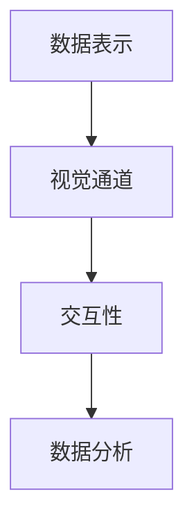

                 

# 文章标题：AI DMP 数据基建：数据可视化与报表

> 关键词：AI DMP、数据基建、数据可视化、报表制作、数据分析、业务场景应用

> 摘要：本文将深入探讨AI DMP（数据管理平台）的数据基建，重点关注数据可视化与报表制作。首先，我们将介绍AI DMP与数据基建的基本概念和重要性。接着，文章将详细解析数据采集、处理、存储与管理的方法。随后，我们将探讨数据可视化的基础理论、工具与实践技巧。文章还将深入数据分析方法与实践，包括报表制作的基础知识和数据分析工具。最后，我们将探讨AI DMP在业务场景中的应用，以及数据基建与AI DMP的未来发展趋势。

## 《AI DMP 数据基建：数据可视化与报表》目录大纲

## 第一部分：数据基建概述

### 第1章：AI DMP与数据基建概述

#### 1.1 AI DMP的定义与作用

#### 1.2 数据基建的重要性

#### 1.3 数据基建的关键组件

### 第2章：数据采集与处理

#### 2.1 数据采集方法与渠道

#### 2.2 数据清洗与预处理

#### 2.3 数据存储与管理系统

## 第二部分：数据可视化

### 第3章：数据可视化基础

#### 3.1 数据可视化原理

#### 3.2 数据可视化工具与平台

#### 3.3 数据可视化实践

### 第4章：数据可视化技巧与案例

#### 4.1 可视化图表类型及应用

#### 4.2 数据可视化设计原则

#### 4.3 实战案例分享

## 第三部分：报表制作与数据分析

### 第5章：报表制作基础

#### 5.1 报表的作用与分类

#### 5.2 报表制作工具与软件

#### 5.3 报表结构设计

### 第6章：数据分析方法与实践

#### 6.1 数据分析原理与方法

#### 6.2 数据分析工具与平台

#### 6.3 数据分析实战

### 第7章：AI DMP在业务场景中的应用

#### 7.1 客户行为分析

#### 7.2 用户画像构建

#### 7.3 营销效果评估

### 第8章：数据基建与AI DMP的发展趋势

#### 8.1 数据基建的挑战与机遇

#### 8.2 AI DMP的未来发展

#### 8.3 数据驱动决策的实践与思考

## 附录

### 附录 A：数据可视化与报表制作工具汇总

### 附录 B：数据分析案例精选

### 附录 C：AI DMP常用算法与模型简介

## 第一部分：数据基建概述

### 第1章：AI DMP与数据基建概述

#### 1.1 AI DMP的定义与作用

AI DMP（Data Management Platform，数据管理平台）是一种集数据收集、存储、处理、分析和应用于一体的技术解决方案，它通过整合多源数据，为企业和组织提供全面、精准的数据分析能力。AI DMP在数字营销、客户关系管理、用户行为分析等多个领域有着广泛的应用。

AI DMP的主要作用包括：

1. **数据收集与整合**：AI DMP可以从多个渠道收集数据，如网站、APP、社交媒体等，并将其整合到统一的数据库中。
2. **用户画像构建**：通过分析用户的行为数据，AI DMP可以构建详细的用户画像，帮助企业和组织更好地了解用户需求。
3. **个性化营销**：基于用户画像，AI DMP可以自动化地推送个性化的营销内容和广告，提高营销效果。
4. **数据分析和决策**：AI DMP提供的分析工具可以帮助企业和组织从海量数据中提取有价值的信息，支持数据驱动的决策。

#### 1.2 数据基建的重要性

数据基建是AI DMP的核心组成部分，它的重要性体现在以下几个方面：

1. **数据质量**：良好的数据基建可以确保数据的准确性、完整性和一致性，这是进行有效数据分析的基础。
2. **数据处理能力**：数据基建提供了高效的数据处理能力，能够快速地对大量数据进行清洗、转换和分析。
3. **数据安全性**：数据基建需要确保数据的安全性，防止数据泄露和滥用。
4. **数据可用性**：数据基建提供了便捷的数据访问方式，使数据能够快速、方便地被各个业务部门使用。

#### 1.3 数据基建的关键组件

数据基建包括以下几个关键组件：

1. **数据采集系统**：负责从各种渠道收集数据，如网站点击流、APP使用数据、社交媒体数据等。
2. **数据存储系统**：负责存储和管理数据，常见的有关系型数据库、NoSQL数据库、数据仓库等。
3. **数据清洗和预处理系统**：负责清洗和预处理数据，包括去除重复数据、填补缺失值、数据格式转换等。
4. **数据分析和处理平台**：提供数据分析和处理工具，如数据挖掘、机器学习、统计分析等。
5. **数据可视化工具**：将分析结果以图表、报表等形式展示，便于理解和决策。

在接下来的章节中，我们将详细探讨数据采集与处理、数据可视化、报表制作与数据分析等内容，帮助读者深入了解AI DMP的数据基建。让我们开始这段技术探索之旅。

## 第二部分：数据采集与处理

### 第2章：数据采集与处理

#### 2.1 数据采集方法与渠道

数据采集是数据基建中的关键环节，它决定了数据的质量和完整性。以下是几种常见的数据采集方法与渠道：

1. **Web端采集**：
   - **网页爬虫**：通过编写爬虫脚本，自动抓取网站上的数据。常见的爬虫工具包括Scrapy、BeautifulSoup等。
   - **API调用**：许多网站和平台提供了API接口，允许开发者通过程序调用获取数据。例如，社交媒体平台如Facebook、Twitter等都提供了API接口。

2. **移动端采集**：
   - **APP内置采集**：通过开发APP时嵌入的数据采集模块，收集用户在使用APP时的行为数据。
   - **SDK集成**：第三方数据采集SDK（Software Development Kit）可以嵌入到APP中，用于收集用户数据。

3. **线下采集**：
   - **问卷调查**：通过设计问卷调查，收集用户的反馈和意见。
   - **实体设备采集**：通过连接传感器、智能设备等，采集环境数据或设备运行状态数据。

4. **公共数据集**：
   - **开源数据集**：许多领域都有公开的数据集可供使用，如Kaggle、UCI机器学习库等。
   - **政府公开数据**：各国政府通常都会公开一些数据，如交通数据、天气数据、经济数据等。

#### 2.2 数据清洗与预处理

数据采集后，通常需要进行清洗与预处理，以确保数据的准确性和一致性。以下是数据清洗与预处理的一些常见步骤：

1. **去重**：去除重复的数据记录，确保数据的唯一性。
2. **填补缺失值**：对于缺失的数据，可以使用多种方法进行填补，如平均值填补、中值填补、插值法等。
3. **格式转换**：将数据格式转换为统一的标准格式，如日期格式、货币格式等。
4. **异常值检测与处理**：检测并处理异常数据，如错误的输入、异常的值等。
5. **数据规范化**：将不同单位、不同范围的数据转换为统一的尺度，如将价格数据标准化为相对值。

#### 2.3 数据存储与管理系统

数据存储与管理是数据基建的核心，它决定了数据的持久性和访问效率。以下是几种常见的数据存储与管理方案：

1. **关系型数据库**：如MySQL、PostgreSQL等，适用于结构化数据存储和查询。
2. **NoSQL数据库**：如MongoDB、Redis等，适用于非结构化或半结构化数据存储。
3. **数据仓库**：如Hadoop、Spark等，适用于大规模数据存储和处理。
4. **数据湖**：如Amazon S3、Google Cloud Storage等，适用于存储大量原始数据。

数据存储与管理系统还需要考虑以下几个方面：

1. **数据安全性**：确保数据的安全存储，如使用加密、访问控制等措施。
2. **数据备份与恢复**：定期备份数据，并确保在数据丢失或损坏时能够快速恢复。
3. **数据访问权限管理**：根据不同的业务需求，设置不同的数据访问权限。

通过合理的数据采集、清洗与预处理，以及高效的数据存储与管理，数据基建可以为AI DMP提供坚实的数据基础，支撑后续的数据分析和应用。接下来，我们将进一步探讨数据可视化与报表制作的重要性，帮助企业和组织更好地理解和利用数据。请继续关注下一章节的内容。

### 第3章：数据可视化基础

#### 3.1 数据可视化原理

数据可视化是将数据以图形、图表、图像等形式展示的过程，其核心目的是将复杂的数据通过视觉化的手段变得更加直观、易懂。数据可视化原理主要包括以下几个方面：

1. **数据表示**：通过图形、图表等方式将数据转换为视觉元素，如条形图、折线图、散点图等。
2. **视觉通道**：利用人类视觉系统对颜色的感知、形状的识别、大小的比较等特性，增强数据的可读性。
3. **交互性**：通过用户与可视化界面的互动，如缩放、过滤、排序等，帮助用户更好地探索数据。

数据可视化不仅是一种技术手段，更是一种思维方式。它帮助我们从海量数据中提炼出有价值的信息，发现数据中的模式和规律。数据可视化原理如图所示：



#### 3.2 数据可视化工具与平台

市面上有许多数据可视化工具和平台，可以根据不同的需求和场景选择合适的工具。以下是一些常见的数据可视化工具和平台：

1. **Tableau**：一款强大的数据可视化工具，支持多种数据源，提供丰富的可视化图表和交互功能。
2. **Power BI**：由微软开发的商业智能工具，易于使用，提供丰富的可视化模板和报表功能。
3. **Google Charts**：Google提供的一系列图表库，支持多种图表类型，易于集成到Web应用中。
4. **D3.js**：一个基于JavaScript的动态数据可视化库，灵活性强，可以创建各种复杂的可视化图表。
5. **ECharts**：一款基于JavaScript的开源可视化库，支持多种图表类型，适用于Web应用和桌面应用。

#### 3.3 数据可视化实践

数据可视化实践包括数据准备、可视化设计、可视化实现等环节。以下是一个简单的数据可视化实践流程：

1. **数据准备**：
   - 确定数据需求：明确需要展示的数据指标和维度。
   - 数据获取：通过API、数据库等方式获取数据。
   - 数据清洗：去除重复数据、处理缺失值等。

2. **可视化设计**：
   - 确定可视化类型：根据数据类型和展示需求选择合适的图表类型。
   - 设计布局：设计图表的布局，包括颜色、字体、标注等。
   - 用户交互：设计交互功能，如过滤、排序、筛选等。

3. **可视化实现**：
   - 开发环境搭建：选择合适的开发工具和平台，如Web应用、桌面应用等。
   - 代码实现：编写可视化代码，将数据转化为图表。
   - 调试优化：测试并优化可视化效果，确保图表的准确性和美观性。

通过数据可视化，我们可以将复杂的数据转化为直观的视觉信息，帮助企业和组织更好地理解和利用数据。在下一章节中，我们将进一步探讨数据可视化技巧与案例，深入讲解如何设计和实现高效的可视化图表。请继续关注下一章节的内容。

### 第4章：数据可视化技巧与案例

#### 4.1 可视化图表类型及应用

数据可视化图表是展示数据的重要工具，根据数据类型和展示需求，可以选择不同类型的图表。以下是几种常见的数据可视化图表及其应用：

1. **条形图**：用于比较不同类别之间的数据，如图表4-1所示。
   ```mermaid
   graph TB
   A[条形图] --> B[柱状图]
   B --> C{分类比较}
   C --> D[销售额对比]
   ```

2. **折线图**：用于展示数据随时间的变化趋势，如图表4-2所示。
   ```mermaid
   graph TB
   A[折线图] --> B[趋势分析]
   B --> C[股票走势]
   ```

3. **散点图**：用于展示两个变量之间的关系，如图表4-3所示。
   ```mermaid
   graph TB
   A[散点图] --> B[相关性分析]
   B --> C[用户分布]
   ```

4. **饼图**：用于展示各部分占整体的比例，如图表4-4所示。
   ```mermaid
   graph TB
   A[饼图] --> B[市场份额]
   B --> C[预算分配]
   ```

5. **地图**：用于展示地理数据的分布情况，如图表4-5所示。
   ```mermaid
   graph TB
   A[地图] --> B[区域销售]
   B --> C[人口分布]
   ```

6. **箱线图**：用于展示数据的分布和离散程度，如图表4-6所示。
   ```mermaid
   graph TB
   A[箱线图] --> B[数据分布]
   B --> C[异常值检测]
   ```

7. **雷达图**：用于展示多个变量之间的关系，如图表4-7所示。
   ```mermaid
   graph TB
   A[雷达图] --> B[多维度分析]
   B --> C[绩效评估]
   ```

#### 4.2 数据可视化设计原则

设计高效的数据可视化图表需要遵循一些基本的设计原则，以下是一些关键原则：

1. **简洁性**：避免冗余信息，保持图表简洁明了，突出主要数据。
2. **一致性**：确保图表的视觉风格、颜色、字体等保持一致，便于用户识别和比较。
3. **对比性**：通过颜色、大小等视觉元素增强数据的对比性，帮助用户快速理解数据差异。
4. **可读性**：图表中的标签、图例、说明等应清晰可见，便于用户理解图表内容。
5. **交互性**：提供交互功能，如过滤、筛选、缩放等，帮助用户深入探索数据。

#### 4.3 实战案例分享

下面我们通过一个实际案例，展示如何设计和实现一个数据可视化项目。

**案例：电商销售数据可视化**

1. **数据准备**：收集电商平台的销售数据，包括销售额、商品类别、销售地区等。

2. **可视化设计**：
   - **销售额对比**：使用条形图展示不同类别的销售额，如图表4-8所示。
   - **销售地区分布**：使用地图展示各地区的销售额，如图表4-9所示。
   - **时间趋势分析**：使用折线图展示销售额随时间的变化趋势，如图表4-10所示。

3. **可视化实现**：
   - 使用D3.js库编写代码，将数据转化为可视化图表。
   - 添加交互功能，如点击商品类别查看详细信息、缩放时间范围查看不同时段的销售额等。

通过以上步骤，我们成功实现了一个电商销售数据可视化项目，帮助企业管理者直观地了解销售数据，优化销售策略。这个案例展示了数据可视化在设计、实现和应用中的实际价值。

在下一章节中，我们将探讨报表制作的基础知识和数据分析方法与实践，帮助读者进一步掌握数据驱动的业务决策。请继续关注下一章节的内容。

### 第5章：报表制作基础

#### 5.1 报表的作用与分类

报表是企业中用于呈现数据和信息的文档，它可以帮助企业管理和决策者直观地了解业务运行状况、分析问题、制定策略。报表的作用主要包括：

1. **数据汇总与呈现**：将分散的数据进行汇总和整理，以图表、表格等形式呈现，便于理解和分析。
2. **监控与预警**：通过定期生成报表，监控业务运行指标，及时发现异常情况，采取措施。
3. **决策支持**：基于报表中的数据和分析结果，为企业决策提供科学依据。
4. **沟通与协作**：报表可以作为内部沟通工具，促进各部门之间的信息共享和协作。

报表根据用途和内容的不同，可以分为以下几类：

1. **定期报表**：如月度报表、季度报表、年度报表等，定期汇总和分析业务数据。
2. **实时报表**：根据业务需求，实时生成和分析数据，如库存报表、销售报表等。
3. **专项报表**：针对特定业务场景或问题，进行专项分析和报告。
4. **分析型报表**：通过深入的数据分析，挖掘数据背后的业务价值和趋势。

#### 5.2 报表制作工具与软件

在报表制作过程中，选择合适的工具和软件至关重要。以下是一些常见的报表制作工具和软件：

1. **Microsoft Excel**：一款功能强大的电子表格软件，支持数据录入、数据处理、图表制作等，适用于简单的报表制作。
2. **Power BI**：由微软开发的商业智能工具，支持数据连接、报表设计、数据可视化等，提供丰富的交互功能。
3. **Tableau**：一款专业的数据可视化工具，支持多种数据源，提供丰富的图表类型和交互功能，适用于复杂的报表制作。
4. **QlikView**：一款高性能的数据可视化工具，支持多维数据分析，提供强大的查询和分析功能。
5. **FineReport**：一款适用于企业报表制作的软件，支持拖拽式报表设计，提供丰富的图表、报表模板。

#### 5.3 报表结构设计

报表结构设计是报表制作的关键步骤，它决定了报表的易用性和可扩展性。以下是报表结构设计的一些基本原则：

1. **逻辑清晰**：确保报表的结构逻辑清晰，便于用户理解和操作。
2. **模块化**：将报表分解为多个模块，每个模块负责不同的数据展示和分析任务。
3. **灵活性**：设计灵活的报表结构，支持动态调整报表内容，适应不同场景的需求。
4. **一致性**：保持报表的视觉风格和布局一致，提高报表的整体美观性和可读性。
5. **可维护性**：设计简洁、易于维护的报表结构，降低后期维护成本。

在报表结构设计中，需要注意以下几点：

1. **数据源**：明确报表所需的数据源，确保数据的准确性和完整性。
2. **数据筛选**：提供灵活的数据筛选功能，支持用户根据需要筛选特定数据。
3. **图表与表格**：选择合适的图表和表格展示数据，提高数据的可读性和可视化效果。
4. **交互功能**：设计交互功能，如过滤、排序、钻取等，帮助用户深入分析数据。

通过合理的设计和制作，报表可以为企业和组织提供准确、直观、全面的数据信息，支持科学决策和业务发展。在下一章节中，我们将深入探讨数据分析方法与实践，帮助读者掌握数据分析的核心技能。请继续关注下一章节的内容。

### 第6章：数据分析方法与实践

#### 6.1 数据分析原理与方法

数据分析是利用统计学、计算机科学和业务知识，从数据中提取有价值的信息和知识的过程。数据分析方法可以分为以下几类：

1. **描述性分析**：通过对数据进行汇总和描述，了解数据的分布、趋势和特征。常见的描述性分析方法包括平均值、中位数、标准差、直方图等。

2. **推断性分析**：通过对样本数据进行分析，推断总体数据的特征和规律。常见的推断性分析方法包括假设检验、置信区间、回归分析等。

3. **预测性分析**：利用历史数据建立预测模型，预测未来数据的趋势和变化。常见的预测性分析方法包括时间序列分析、回归分析、机器学习等。

4. **关联分析**：发现数据之间的关联和依赖关系，揭示潜在的规律和模式。常见的关联分析方法包括关联规则挖掘、聚类分析、社会网络分析等。

5. **文本分析**：对文本数据进行分析，提取关键信息、情感和主题。常见的文本分析方法包括词频分析、情感分析、主题建模等。

#### 6.2 数据分析工具与平台

数据分析工具和平台的选择取决于数据量、分析需求和技术水平。以下是一些常见的数据分析工具和平台：

1. **Python**：一款流行的编程语言，支持多种数据分析库和工具，如Pandas、NumPy、Scikit-learn、TensorFlow等。

2. **R语言**：一款专门用于数据分析和统计的编程语言，拥有丰富的数据分析包和函数库，如ggplot2、dplyr、tidyverse等。

3. **Excel**：一款功能强大的电子表格软件，适用于简单的数据分析任务，支持数据透视表、图表等功能。

4. **Power BI**：一款商业智能工具，支持数据连接、报表设计、数据可视化等，提供丰富的交互功能。

5. **Tableau**：一款专业的数据可视化工具，支持多种数据源，提供丰富的图表类型和交互功能。

6. **QlikView**：一款高性能的数据可视化工具，支持多维数据分析，提供强大的查询和分析功能。

7. **Hadoop和Spark**：大数据处理平台，适用于大规模数据处理和分析，支持MapReduce、Spark等计算框架。

#### 6.3 数据分析实战

以下是一个数据分析实战案例，我们将使用Python和Pandas库进行数据分析。

**案例：销售数据可视化分析**

1. **数据准备**：
   - 加载销售数据，数据包括日期、销售额、产品类别、销售区域等信息。
   ```python
   import pandas as pd
   
   sales_data = pd.read_csv('sales_data.csv')
   ```

2. **描述性分析**：
   - 计算销售额的均值、中位数、标准差等统计量。
   ```python
   sales_stats = sales_data['sales'].describe()
   print(sales_stats)
   ```

3. **趋势分析**：
   - 绘制销售额随时间的变化趋势图。
   ```python
   import matplotlib.pyplot as plt
   
   sales_data['date'] = pd.to_datetime(sales_data['date'])
   sales_data.set_index('date', inplace=True)
   sales_data.plot()
   plt.title('Sales Trend')
   plt.xlabel('Date')
   plt.ylabel('Sales')
   plt.show()
   ```

4. **分类分析**：
   - 绘制销售额按产品类别的分布图。
   ```python
   sales_by_category = sales_data.groupby('category')['sales'].sum()
   sales_by_category.plot(kind='bar')
   plt.title('Sales by Category')
   plt.xlabel('Category')
   plt.ylabel('Sales')
   plt.show()
   ```

5. **关联分析**：
   - 发现销售和天气之间的关联关系。
   ```python
   import seaborn as sns
   
   weather_data = pd.read_csv('weather_data.csv')
   weather_data['date'] = pd.to_datetime(weather_data['date'])
   weather_data.set_index('date', inplace=True)
   sales_data['weather'] = weather_data['temperature']
   
   sns.pairplot(sales_data, hue='weather', height=2)
   plt.title('Sales vs. Weather')
   plt.show()
   ```

通过以上实战案例，我们展示了如何使用Python和Pandas进行销售数据分析，包括描述性分析、趋势分析、分类分析和关联分析等。数据分析不仅可以帮助企业了解业务运行状况，还可以为决策提供科学依据。在下一章节中，我们将探讨AI DMP在业务场景中的应用，帮助读者更好地理解和利用数据。请继续关注下一章节的内容。

### 第7章：AI DMP在业务场景中的应用

#### 7.1 客户行为分析

客户行为分析是AI DMP在业务场景中的一个重要应用，它通过分析客户的行为数据，了解客户的需求和偏好，从而优化产品和营销策略。以下是客户行为分析的几个关键步骤：

1. **数据收集**：通过多种渠道收集客户行为数据，如网站点击流、APP使用数据、社交媒体互动等。

2. **数据整合**：将来自不同渠道的数据进行整合，建立完整的客户行为数据库。

3. **行为建模**：利用机器学习和数据分析技术，对客户行为进行建模，识别客户的特征和偏好。

4. **行为预测**：基于客户行为模型，预测客户未来的行为和需求，如购买行为、访问行为等。

5. **策略优化**：根据客户行为预测结果，优化产品和营销策略，提高客户满意度和转化率。

客户行为分析的一个实际案例是电商平台的个性化推荐系统。通过分析用户的浏览历史、购买记录等数据，系统可以推荐用户可能感兴趣的商品，从而提高购买转化率和客户满意度。

#### 7.2 用户画像构建

用户画像是指通过对用户数据进行分析，构建一个全面、立体的用户形象。用户画像是AI DMP在业务场景中的另一个重要应用，它有助于企业了解目标客户，优化用户体验和服务。以下是用户画像构建的几个关键步骤：

1. **数据收集**：收集用户的个人信息、行为数据、社交数据等。

2. **数据整合**：将来自不同渠道的用户数据进行整合，建立用户画像数据库。

3. **特征提取**：从用户数据中提取关键特征，如年龄、性别、地理位置、兴趣爱好、消费能力等。

4. **模型构建**：利用机器学习和数据分析技术，构建用户画像模型，将用户划分为不同的群体。

5. **应用优化**：根据用户画像，优化产品和服务，提高用户体验和服务质量。

用户画像是许多企业进行精准营销和个性化服务的重要工具。例如，一家电商平台可以根据用户画像，为不同用户群体推荐个性化的商品和促销活动，提高用户的购买意愿和满意度。

#### 7.3 营销效果评估

营销效果评估是AI DMP在业务场景中的另一个重要应用，它通过分析营销活动的数据，评估营销效果，优化营销策略。以下是营销效果评估的几个关键步骤：

1. **数据收集**：收集营销活动的数据，如广告投放数据、邮件营销数据、社交媒体互动数据等。

2. **数据整合**：将来自不同渠道的营销数据进行整合，建立营销效果数据库。

3. **效果分析**：利用数据分析技术，分析营销活动的效果，如点击率、转化率、ROI等。

4. **模型构建**：基于效果分析结果，构建营销效果预测模型，预测未来营销活动的效果。

5. **策略优化**：根据营销效果预测结果，优化营销策略，提高营销活动的效果和投资回报率。

营销效果评估的一个实际案例是电商平台的广告投放优化。通过分析广告投放的数据，平台可以优化广告投放策略，提高广告的点击率和转化率，从而提高广告投资回报率。

通过客户行为分析、用户画像构建和营销效果评估，AI DMP在业务场景中发挥着重要作用，帮助企业更好地了解客户需求、优化产品和营销策略，提高业务效率和竞争力。在下一章节中，我们将探讨数据基建与AI DMP的发展趋势，展望未来的发展方向。请继续关注下一章节的内容。

### 第8章：数据基建与AI DMP的发展趋势

#### 8.1 数据基建的挑战与机遇

数据基建作为AI DMP的核心支撑，正面临一系列挑战与机遇。以下是数据基建的主要挑战和机遇：

**挑战：**

1. **数据隐私与安全**：随着数据规模的扩大，数据隐私和安全问题日益凸显。如何确保数据在采集、存储、处理和分析过程中的安全，成为数据基建的重要挑战。
2. **数据整合与治理**：不同来源、格式和结构的数据需要整合和治理，以确保数据的一致性和准确性。这需要复杂的算法和工具，以及对数据治理的深入理解。
3. **计算资源和存储成本**：随着数据量的激增，数据基建所需的计算资源和存储成本也在不断上升。如何优化资源利用，降低成本，成为数据基建的重要议题。
4. **数据质量和可靠性**：数据质量和可靠性直接影响数据分析的结果。如何确保数据质量，消除数据中的错误和噪声，是数据基建的长期任务。

**机遇：**

1. **大数据技术发展**：随着大数据技术的不断发展，数据采集、存储、处理和分析的效率得到显著提升，为数据基建提供了强大的技术支持。
2. **人工智能应用**：人工智能技术的发展，使得数据基建能够利用深度学习、机器学习等技术，实现更加智能的数据分析和预测。
3. **云计算和边缘计算**：云计算和边缘计算的兴起，为数据基建提供了灵活、高效、可扩展的部署环境，降低了数据处理的成本和复杂度。
4. **数据治理和标准化**：随着数据治理和标准化工作的推进，数据管理和治理的规范和标准逐步完善，为数据基建提供了良好的发展基础。

#### 8.2 AI DMP的未来发展

AI DMP的未来发展将更加智能化、多样化和普及化。以下是AI DMP未来发展的几个趋势：

1. **智能化**：随着人工智能技术的不断进步，AI DMP将实现更加智能的数据分析和预测。例如，通过深度学习和强化学习技术，AI DMP可以自动调整营销策略，实现个性化推荐和精准营销。
2. **多样化**：AI DMP的应用场景将不断扩展，从传统的数字营销、客户关系管理，到供应链管理、生产优化、医疗健康等多个领域。不同领域对数据需求的不同，将推动AI DMP在技术和服务上的多样化发展。
3. **普及化**：随着技术的普及和成本的降低，AI DMP将逐渐被中小企业和应用场景广泛采用。中小企业可以通过AI DMP，实现数据驱动的业务决策，提升竞争力和市场响应速度。
4. **跨平台融合**：AI DMP将与其他技术和平台（如物联网、区块链等）进行深度融合，实现跨平台的数据采集、处理和分析，为企业和组织提供更加全面和高效的数据解决方案。

#### 8.3 数据驱动决策的实践与思考

数据驱动决策已成为企业管理和运营的重要手段。以下是数据驱动决策的实践与思考：

1. **数据驱动决策的流程**：
   - **数据收集**：从各种渠道收集业务数据，如销售数据、客户数据、运营数据等。
   - **数据清洗与处理**：清洗和整合数据，确保数据的质量和一致性。
   - **数据分析**：利用数据分析方法和工具，提取数据中的有价值信息。
   - **数据可视化**：将分析结果通过图表、报表等形式进行可视化展示，便于理解和决策。
   - **决策制定**：基于数据分析结果，制定相应的业务策略和决策。

2. **数据驱动决策的思考**：
   - **数据意识**：培养数据意识，将数据视为企业的重要资产，注重数据质量和数据安全。
   - **数据素养**：提升数据素养，使员工能够理解和利用数据，支持数据驱动决策。
   - **数据文化**：构建数据文化，将数据驱动决策的理念和方法融入企业文化和业务流程中。
   - **数据治理**：建立健全的数据治理体系，确保数据的质量、安全性和可靠性。
   - **持续优化**：不断优化数据驱动决策的流程和方法，提高决策的准确性和效率。

通过数据驱动决策，企业可以更好地应对市场变化，提升业务运营效率，实现持续增长。在未来的发展中，数据基建和AI DMP将继续发挥关键作用，推动企业和组织实现数据驱动的智能化转型。让我们共同期待数据基建与AI DMP的未来，继续探索和创造更多价值。

## 附录

### 附录 A：数据可视化与报表制作工具汇总

以下是一些常用的数据可视化与报表制作工具，它们在不同的场景和需求中具有独特的优势：

1. **Tableau**：
   - **优势**：直观的可视化设计、丰富的图表类型、强大的交互功能。
   - **应用场景**：企业报表、市场分析、销售报告等。

2. **Power BI**：
   - **优势**：易用性高、与Microsoft生态系统紧密集成、实时数据连接。
   - **应用场景**：商业智能、数据分析、财务报告等。

3. **Google Charts**：
   - **优势**：无需编程、支持多种图表类型、易于集成到Web应用中。
   - **应用场景**：Web应用、内部报告、数据展示等。

4. **D3.js**：
   - **优势**：高度灵活、适用于复杂的数据可视化、强大的数据绑定功能。
   - **应用场景**：Web应用、大数据可视化、交互性强的高级可视化需求。

5. **ECharts**：
   - **优势**：性能优越、图表类型丰富、跨平台兼容性好。
   - **应用场景**：Web应用、桌面应用、大数据可视化等。

6. **FineReport**：
   - **优势**：报表制作简便、支持多种报表格式、适用于各类企业报表。
   - **应用场景**：企业报表、财务报告、业务分析等。

7. **QlikView**：
   - **优势**：强大的数据关联分析、灵活的查询功能、支持实时数据分析。
   - **应用场景**：企业数据分析、市场分析、运营监控等。

### 附录 B：数据分析案例精选

以下是一些精选的数据分析案例，涵盖了不同的业务场景和数据类型：

1. **电商销售数据分析**：
   - **目标**：分析销售趋势、优化营销策略。
   - **数据类型**：销售数据、客户数据、促销数据等。
   - **方法**：时间序列分析、聚类分析、回归分析等。

2. **客户行为分析**：
   - **目标**：了解客户需求、提高客户满意度。
   - **数据类型**：网站点击流数据、APP使用数据、社交媒体互动数据等。
   - **方法**：行为路径分析、用户画像构建、A/B测试等。

3. **市场趋势分析**：
   - **目标**：预测市场变化、制定营销策略。
   - **数据类型**：市场数据、竞争对手数据、行业报告等。
   - **方法**：回归分析、趋势分析、竞争分析等。

4. **供应链优化**：
   - **目标**：降低成本、提高效率。
   - **数据类型**：采购数据、库存数据、物流数据等。
   - **方法**：供应链网络优化、库存管理分析、预测性维护等。

5. **医疗数据分析**：
   - **目标**：优化医疗服务、提高医疗质量。
   - **数据类型**：病历数据、患者数据、医疗费用数据等。
   - **方法**：数据挖掘、机器学习、预测性分析等。

6. **金融市场分析**：
   - **目标**：投资决策、风险控制。
   - **数据类型**：股票数据、市场数据、交易数据等。
   - **方法**：时间序列分析、因子分析、风险评估等。

### 附录 C：AI DMP常用算法与模型简介

以下是一些常用的AI DMP算法与模型，它们在数据分析和预测中发挥着重要作用：

1. **协同过滤**：
   - **目标**：推荐相似的用户或物品。
   - **方法**：基于用户评分数据或用户行为数据，利用矩阵分解、KNN等方法进行推荐。

2. **聚类分析**：
   - **目标**：将相似的数据点分组。
   - **方法**：K-means、层次聚类、DBSCAN等。

3. **回归分析**：
   - **目标**：预测因变量的值。
   - **方法**：线性回归、多项式回归、决策树回归等。

4. **决策树**：
   - **目标**：分类或回归。
   - **方法**：ID3、C4.5、CART等。

5. **随机森林**：
   - **目标**：分类或回归。
   - **方法**：基于决策树的集成方法。

6. **支持向量机**：
   - **目标**：分类或回归。
   - **方法**：基于优化理论的方法。

7. **神经网络**：
   - **目标**：分类、回归、聚类等。
   - **方法**：多层感知器、卷积神经网络、递归神经网络等。

8. **深度学习**：
   - **目标**：复杂的数据分析和预测。
   - **方法**：深度神经网络、循环神经网络、卷积神经网络等。

这些算法和模型在AI DMP的数据分析和预测中发挥着重要作用，为企业和组织提供了强大的数据驱动能力。通过不断优化和迭代，AI DMP将继续推动数据分析和预测技术的发展，为企业和组织创造更多价值。

## 作者信息

作者：AI天才研究院/AI Genius Institute & 禅与计算机程序设计艺术 /Zen And The Art of Computer Programming

在本文中，我们深入探讨了AI DMP（数据管理平台）的数据基建，特别是数据可视化与报表制作。首先，我们介绍了AI DMP的定义与作用，以及数据基建的重要性。接着，我们详细解析了数据采集、处理、存储与管理的方法，为数据可视化和报表制作奠定了基础。

在数据可视化部分，我们讲解了数据可视化的基础理论、工具与实践技巧，并通过实战案例展示了数据可视化的应用。报表制作部分，我们探讨了报表的作用与分类，以及报表制作工具与软件的使用，并结合实例展示了报表结构设计和数据分析方法。

通过本文，读者可以全面了解AI DMP的数据基建，掌握数据可视化与报表制作的核心技能，为数据驱动决策奠定基础。未来，随着技术的不断进步，AI DMP将在更多业务场景中发挥重要作用，为企业和组织创造更多价值。让我们一起期待数据基建与AI DMP的未来发展。感谢您的阅读。

