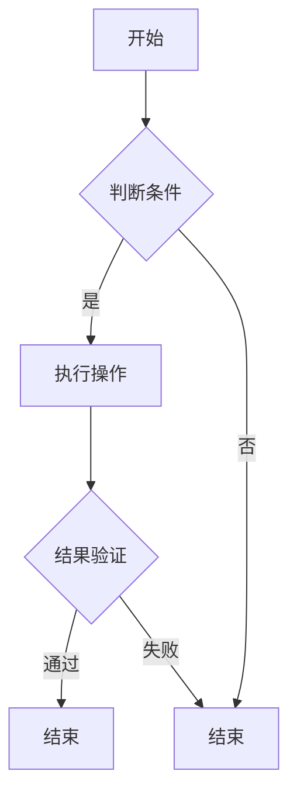
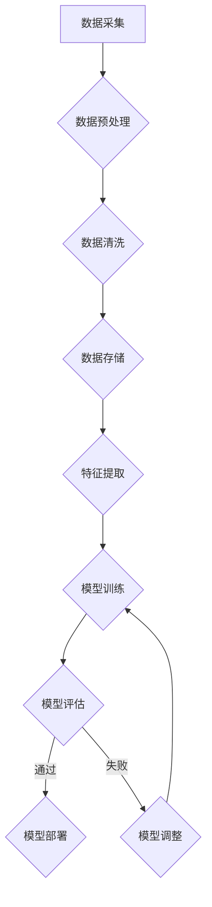

                 

# AI基础设施的公共安全：构建智能防控网络

> 关键词：人工智能、基础设施、公共安全、智能防控网络、算法公平性、数据隐私

> 摘要：本文探讨了AI基础设施在公共安全领域的应用，重点分析了AI基础设施的核心组成部分、核心技术、应用案例以及AI基础设施中存在的公共安全问题。通过深入剖析，本文提出了构建智能防控网络的方法，为提高公共安全提供了技术思路。

### 第一部分: 公共安全与AI基础设施

#### 第1章: 公共安全与AI基础设施概述

##### 1.1 AI基础设施的概念

###### 1.1.1 AI基础设施的定义

AI基础设施是指用于支持人工智能系统开发和运行的一系列硬件、软件和服务资源。这些资源包括计算资源、存储资源、网络资源、数据资源等，为人工智能系统的运行提供了基础支持。

###### 1.1.2 AI基础设施的重要性

随着人工智能技术的快速发展，AI基础设施的重要性日益凸显。它不仅支撑着人工智能系统的高效运行，还直接影响着人工智能技术的创新和进步。在公共安全领域，AI基础设施的稳定性和可靠性对公共安全防控效果有着至关重要的影响。

###### 1.1.3 AI基础设施的核心组成部分

AI基础设施的核心组成部分包括以下几个方面：

1. **计算资源**：高性能计算服务器、图形处理单元（GPU）等，用于处理大量数据和复杂算法。
2. **存储资源**：分布式存储系统、数据库等，用于存储和管理大量数据。
3. **网络资源**：高速网络、云计算平台等，用于数据传输和系统集成。
4. **数据资源**：大规模数据集、数据仓库等，为机器学习算法提供训练数据。
5. **软件资源**：开发工具、框架和库等，用于开发、测试和部署人工智能系统。

##### 1.2 公共安全的挑战

###### 1.2.1 当前公共安全的现状

当前，公共安全领域面临诸多挑战。自然灾害、恐怖袭击、交通事故、火灾等突发事件频繁发生，严重威胁着人们的生命财产安全。此外，随着社会信息化和数字化的发展，网络安全威胁也日益增多。

###### 1.2.2 公共安全领域面临的挑战

公共安全领域面临的挑战主要包括：

1. **信息不对称**：公共安全信息难以实时、全面地传递给相关部门和公众。
2. **资源有限**：公共安全资源（人力、物力、财力）有限，难以满足日益增长的公共安全需求。
3. **技术落后**：部分公共安全领域的技术手段仍停留在传统阶段，难以应对复杂多变的公共安全形势。

###### 1.2.3 AI在公共安全中的应用前景

随着人工智能技术的不断进步，AI在公共安全领域具有广泛的应用前景。例如：

1. **智能视频监控**：通过视频图像识别技术，实现对公共场所的实时监控和预警。
2. **智能交通管理**：通过实时数据分析，优化交通流量，减少交通事故。
3. **智能应急管理**：利用人工智能技术，实现对突发事件的有效预警、应急响应和资源调度。
4. **网络安全防护**：通过深度学习和神经网络技术，提高网络安全检测和防护能力。

##### 1.3 AI基础设施在公共安全中的应用

###### 1.3.1 智能视频分析

智能视频分析技术通过对视频图像进行实时处理和分析，实现对异常行为的识别和预警。例如，在公共场所部署智能视频监控设备，可以对潜在危险行为进行实时监控和报警，提高公共安全保障水平。

###### 1.3.2 智能交通管理

智能交通管理技术通过对交通数据的实时采集和分析，优化交通流量，减少交通事故。例如，利用人工智能技术对交通信号灯进行智能调控，实现交通流量的最优分配。

###### 1.3.3 智能应急管理

智能应急管理技术通过利用人工智能技术，实现对突发事件的有效预警、应急响应和资源调度。例如，利用人工智能技术对自然灾害进行预测和预警，提高应急管理的响应速度和效率。

###### 1.3.4 网络安全防护

网络安全防护技术通过利用人工智能技术，提高网络安全检测和防护能力。例如，利用深度学习和神经网络技术，实现对网络攻击的实时检测和防御。

### 第一部分总结

本章首先介绍了AI基础设施的概念及其重要性，分析了公共安全领域面临的挑战，并探讨了AI基础设施在公共安全中的应用前景。接下来，我们深入分析了智能视频分析、智能交通管理、智能应急管理、网络安全防护等AI技术在公共安全中的应用。通过对这些技术的介绍，我们可以看到AI基础设施在提高公共安全水平方面具有巨大潜力。

### 第二部分: AI基础设施中的核心技术

#### 第2章: AI基础设施中的核心技术

##### 2.1 数据采集与处理技术

数据采集与处理技术是AI基础设施中的核心技术之一，它直接决定了AI系统对数据的处理能力和效率。

###### 2.1.1 数据采集方法

数据采集方法主要包括以下几种：

1. **传感器采集**：通过各类传感器（如摄像头、温度传感器、加速度传感器等）实时采集数据。
2. **网络采集**：通过互联网、移动互联网等网络渠道获取数据。
3. **手动录入**：通过人工手动录入数据，如调查问卷、体检报告等。

在公共安全领域，常用的数据采集方法包括：

- **视频监控数据采集**：通过安装在公共场所的摄像头实时采集视频数据。
- **交通数据采集**：通过安装在车辆上的GPS设备采集行驶轨迹、速度、加速度等数据。
- **气象数据采集**：通过气象传感器采集温度、湿度、风速等数据。

###### 2.1.2 数据处理流程

数据处理流程通常包括以下步骤：

1. **数据清洗**：去除数据中的噪声和异常值，保证数据质量。
2. **数据集成**：将来自不同来源、不同格式的数据整合到统一的数据格式中。
3. **数据预处理**：对数据进行归一化、标准化等处理，为后续分析做准备。
4. **特征提取**：从原始数据中提取出具有代表性的特征，用于训练机器学习模型。

在公共安全领域，数据处理流程需要特别关注以下问题：

- **实时性**：为了快速响应公共安全事件，数据处理过程需要高效且实时。
- **准确性**：保证数据处理的准确性，避免因错误数据导致的误判。
- **安全性**：在处理数据时，需要确保数据的安全，防止数据泄露。

##### 2.2 机器学习算法与应用

机器学习算法是AI基础设施中的核心技术，它使计算机能够从数据中学习并做出预测或决策。

###### 2.2.1 机器学习算法概述

机器学习算法主要包括以下几类：

1. **监督学习**：通过已标记的数据训练模型，用于对新数据进行预测。
2. **无监督学习**：通过未标记的数据发现数据中的模式和规律。
3. **半监督学习**：结合监督学习和无监督学习，利用少量标记数据和大量未标记数据训练模型。
4. **强化学习**：通过试错法，使智能体在环境中不断学习和优化策略。

在公共安全领域，常用的机器学习算法包括：

- **分类算法**：如决策树、随机森林、支持向量机等，用于识别和分类公共安全事件。
- **聚类算法**：如K均值聚类、层次聚类等，用于发现数据中的潜在模式。
- **异常检测算法**：如孤立森林、基于密度的聚类算法等，用于检测异常行为和事件。

###### 2.2.2 常见的机器学习算法

以下是几种常见的机器学习算法及其在公共安全领域的应用：

1. **决策树**：通过树形结构对数据进行分类，适合处理非线性和多维数据。
   - **应用场景**：用于分析犯罪数据，识别犯罪模式。
   - **伪代码**：
     ```python
     def build_decision_tree(data):
         # 根据特征和目标值，构建决策树
         # ...

     def predict(decision_tree, instance):
         # 对新数据进行预测
         # ...
     ```

2. **支持向量机**：通过寻找最优超平面，将数据分类到不同的类别。
   - **应用场景**：用于检测恐怖袭击、暴力犯罪等。
   - **伪代码**：
     ```python
     def build_svm_classifier(data, labels):
         # 根据数据和标签，构建支持向量机分类器
         # ...

     def predict(svm_classifier, instance):
         # 对新数据进行预测
         # ...
     ```

3. **深度学习**：通过多层神经网络，实现对复杂数据的建模和预测。
   - **应用场景**：用于智能视频监控、人脸识别等。
   - **伪代码**：
     ```python
     def build_deep_learning_model(input_shape, output_shape):
         # 构建深度学习模型
         # ...

     def train_model(model, data, labels):
         # 训练模型
         # ...

     def predict(model, instance):
         # 对新数据进行预测
         # ...
     ```

##### 2.3 机器学习算法在公共安全中的应用

机器学习算法在公共安全领域具有广泛的应用，以下是一些具体的应用实例：

1. **智能视频监控**：通过深度学习算法，对视频图像进行实时分析和识别，实现对公共场所的实时监控和预警。
2. **智能交通管理**：通过机器学习算法，对交通数据进行实时分析，优化交通流量，减少交通事故。
3. **智能应急管理**：通过机器学习算法，对历史数据和实时数据进行分析，实现对突发事件的预测和预警。
4. **网络安全防护**：通过机器学习算法，对网络流量进行实时分析，检测和防御网络攻击。

##### 2.4 人工智能技术在公共安全领域的挑战

尽管人工智能技术在公共安全领域具有巨大潜力，但同时也面临以下挑战：

1. **数据质量**：公共安全领域的数据质量参差不齐，如何处理噪声数据和异常值，保证数据质量，是机器学习算法面临的挑战。
2. **模型解释性**：公共安全领域对模型的解释性要求较高，如何提高模型的解释性，使其能够被相关领域专家理解和接受，是当前研究的重点。
3. **实时性**：公共安全事件往往需要快速响应，如何提高机器学习算法的实时性，满足实时处理需求，是亟待解决的问题。

#### 第二部分总结

本章介绍了AI基础设施中的核心技术，包括数据采集与处理技术、机器学习算法及其在公共安全领域的应用。通过分析数据采集方法、数据处理流程以及常见的机器学习算法，我们了解了AI技术在公共安全领域的应用场景和挑战。这些核心技术的应用，为构建智能防控网络提供了技术支持。

### 第三部分: 公共安全中的AI应用案例

#### 第3章: 公共安全中的AI应用案例

##### 3.1 智能视频分析

###### 3.1.1 智能视频分析的基本原理

智能视频分析技术通过对视频图像的实时处理和分析，实现对场景的感知和理解。其基本原理包括图像识别、行为识别和异常检测等。

1. **图像识别**：通过卷积神经网络（CNN）等深度学习算法，对视频中的图像进行分类和识别，例如人脸识别、物体识别等。
2. **行为识别**：通过分析视频中的动作和姿态，识别特定行为，如奔跑、跌倒、打架等。
3. **异常检测**：通过监测视频中的异常行为和事件，如非法入侵、火灾等，实现对突发事件的预警和响应。

###### 3.1.2 智能视频分析的关键技术

智能视频分析的关键技术包括：

1. **视频预处理**：对视频进行去噪、增强、压缩等处理，提高图像质量。
2. **目标检测**：利用深度学习算法，对视频中的目标进行定位和识别。
3. **行为识别**：通过分析目标的运动轨迹和姿态变化，识别特定行为。
4. **异常检测**：利用统计学方法和机器学习算法，检测视频中的异常行为和事件。

###### 3.1.3 智能视频分析的应用实例

智能视频分析在公共安全领域有广泛的应用，以下是一些具体的应用实例：

1. **公共场所安全监控**：在机场、火车站、商场等公共场所部署智能视频监控设备，实现对人员活动的实时监控和预警。
2. **交通监控**：通过智能视频分析技术，对交通场景进行实时监测，优化交通流量，减少交通事故。
3. **应急管理**：利用智能视频分析技术，对突发事件进行实时监控和预警，提高应急响应速度。

##### 3.2 智能交通管理

###### 3.2.1 智能交通管理的基本原理

智能交通管理技术通过实时采集和分析交通数据，实现对交通流量的实时监控和优化。其基本原理包括：

1. **交通流量监测**：通过安装在道路上的传感器、摄像头等设备，实时采集交通流量数据。
2. **数据预处理**：对采集到的交通数据进行预处理，包括去噪、去重、归一化等。
3. **交通流量预测**：利用机器学习算法，对未来的交通流量进行预测，为交通管理提供决策支持。
4. **交通信号调控**：根据交通流量预测结果，对交通信号灯进行智能调控，优化交通流量。

###### 3.2.2 智能交通管理的关键技术

智能交通管理的关键技术包括：

1. **交通流量监测技术**：包括传感器技术、摄像头技术等，用于实时采集交通流量数据。
2. **数据预处理技术**：包括数据清洗、去噪、归一化等，用于提高数据质量。
3. **机器学习算法**：包括回归分析、聚类分析、神经网络等，用于预测交通流量和优化交通信号。
4. **交通信号调控技术**：包括自适应交通信号系统、智能交通信号控制系统等，用于实现交通流量的优化。

###### 3.2.3 智能交通管理的应用实例

智能交通管理在公共安全领域有广泛的应用，以下是一些具体的应用实例：

1. **城市交通拥堵管理**：通过智能交通管理技术，实时监测和预测城市交通流量，优化交通信号，缓解交通拥堵。
2. **交通事故预防**：通过智能交通管理技术，实时监测车辆运行状态，预警潜在交通事故，提高交通安全。
3. **道路规划与管理**：通过智能交通管理技术，对道路规划和管理提供决策支持，优化道路布局，提高道路通行效率。

##### 3.3 公共安全保障系统

###### 3.3.1 公共安全保障系统的概念

公共安全保障系统是指利用人工智能技术，实现对公共安全的全面监控、分析和响应的系统。其目的是提高公共安全保障水平，预防和管理公共安全事件。

公共安全保障系统主要包括以下几个组成部分：

1. **视频监控系统**：通过部署智能视频分析设备，实现对公共场所的实时监控和预警。
2. **交通管理系统**：通过智能交通管理技术，优化交通流量，提高交通安全。
3. **应急管理系统**：通过智能应急管理技术，实现对突发事件的实时监测、预警和应急响应。
4. **网络安全系统**：通过网络安全防护技术，保护公共安全信息系统的安全性。

###### 3.3.2 公共安全保障系统的组成部分

公共安全保障系统的组成部分包括：

1. **硬件设备**：包括摄像头、传感器、服务器等，用于数据采集和处理。
2. **软件系统**：包括视频分析软件、交通管理软件、应急管理系统等，用于数据分析和决策支持。
3. **数据资源**：包括公共安全相关的数据，如视频数据、交通数据、气象数据等。
4. **网络设施**：包括互联网、局域网等，用于数据传输和系统集成。

###### 3.3.3 公共安全保障系统的实际应用

公共安全保障系统在公共安全领域有广泛的应用，以下是一些具体的应用实例：

1. **城市安全管理**：通过公共安全保障系统，实时监控城市安全状况，及时发现和处理安全隐患。
2. **反恐防暴**：通过公共安全保障系统，对恐怖袭击、暴力犯罪等事件进行实时监控和预警，提高反恐防暴能力。
3. **疫情防控**：通过公共安全保障系统，对疫情进行实时监测和预警，提高疫情防控效率。

#### 第三部分总结

本章介绍了公共安全中的AI应用案例，包括智能视频分析、智能交通管理和公共安全保障系统。通过分析智能视频分析的基本原理、关键技术和应用实例，以及智能交通管理的基本原理、关键技术和应用实例，我们了解了AI技术在公共安全领域的应用价值。同时，通过分析公共安全保障系统的概念、组成部分和实际应用，我们了解了AI技术如何为公共安全提供全面保障。

### 第二部分总结

本章深入探讨了AI基础设施中的核心技术，包括数据采集与处理技术、机器学习算法及其在公共安全领域的应用。通过分析数据采集方法、数据处理流程、常见的机器学习算法以及AI技术在公共安全中的应用实例，我们了解了AI技术在公共安全领域的广泛应用和潜在价值。这些核心技术的应用，为构建智能防控网络提供了坚实的理论基础和技术支持。

### 第三部分: AI基础设施中的公共安全问题

#### 第4章: 数据隐私与安全性

随着人工智能技术在公共安全领域的广泛应用，数据隐私与安全性问题变得越来越突出。这一章将深入探讨数据隐私保护、系统安全性以及安全测试与审计等方面的内容。

##### 4.1 数据隐私保护

###### 4.1.1 数据隐私的重要性

在公共安全领域，数据的隐私保护至关重要。一方面，这些数据往往包含敏感信息，如个人身份信息、行为轨迹、财务状况等；另一方面，数据泄露可能导致隐私侵犯、财产损失甚至社会动荡。因此，确保数据隐私是维护公共安全的基础。

###### 4.1.2 数据隐私保护的方法

为了保护数据隐私，可以采取以下几种方法：

1. **数据加密**：通过加密算法对数据进行加密处理，确保数据在传输和存储过程中不被非法访问。
2. **访问控制**：通过设置访问权限，确保只有授权用户可以访问特定数据。
3. **匿名化处理**：通过对数据进行匿名化处理，去除或隐藏个人身份信息，降低数据泄露的风险。
4. **数据备份与恢复**：定期备份数据，确保数据在发生意外时能够快速恢复。

###### 4.1.3 公共安全领域的数据隐私保护实践

在公共安全领域，数据隐私保护的具体实践包括：

1. **隐私政策制定**：明确数据收集、使用、存储和共享的规则，确保用户知情并同意。
2. **数据加密应用**：在数据传输和存储过程中，广泛应用加密技术，确保数据安全。
3. **隐私审计**：定期进行数据隐私审计，评估数据隐私保护措施的有效性。
4. **用户教育**：加强对用户的隐私教育，提高其数据保护意识。

##### 4.2 系统安全性

###### 4.2.1 AI基础设施的安全风险

AI基础设施面临多种安全风险，包括：

1. **数据泄露**：未经授权的访问可能导致敏感数据泄露。
2. **数据篡改**：恶意攻击者可能篡改数据，影响AI系统的决策。
3. **系统瘫痪**：网络攻击可能导致AI系统瘫痪，影响公共安全。
4. **恶意代码**：恶意软件（如病毒、木马等）可能破坏AI系统，导致数据丢失或泄露。

###### 4.2.2 安全防护措施

为了应对上述安全风险，可以采取以下安全防护措施：

1. **网络安全防护**：部署防火墙、入侵检测系统（IDS）和入侵防御系统（IPS）等，保护AI基础设施的网络安全。
2. **系统更新与补丁**：定期更新操作系统和应用程序，安装安全补丁，防止已知漏洞被利用。
3. **访问控制**：实施严格的访问控制策略，限制只有授权用户访问关键数据和系统功能。
4. **数据备份**：定期备份数据，确保在发生数据丢失或损坏时能够快速恢复。

###### 4.2.3 安全测试与审计

为了确保AI基础设施的安全性，应定期进行以下安全测试与审计：

1. **渗透测试**：模拟攻击者的攻击行为，测试AI系统的漏洞和弱点。
2. **漏洞扫描**：使用工具对AI系统进行扫描，发现潜在的安全漏洞。
3. **安全审计**：定期对AI系统的安全性进行全面审计，评估安全措施的有效性。
4. **应急响应**：制定应急响应计划，确保在发生安全事件时能够迅速应对。

##### 4.3 数据隐私与系统安全的关系

数据隐私与系统安全密切相关。数据隐私保护是确保系统安全的基础，而系统安全则是数据隐私保护的保障。只有在确保系统安全的前提下，才能有效地保护数据隐私。例如，如果AI系统的网络不安全，即使数据进行了加密处理，也可能会在传输过程中被截获和篡改。

因此，在构建AI基础设施时，必须综合考虑数据隐私与系统安全的关系，采取综合性的安全策略，确保AI基础设施的安全性和可靠性。

#### 第四部分总结

本章探讨了AI基础设施中的数据隐私与安全性问题。通过分析数据隐私保护的重要性、方法以及实践，以及系统安全性的风险、防护措施和安全测试与审计，我们了解了如何确保AI基础设施的数据隐私和系统安全。这些措施为公共安全提供了有力保障，有助于构建一个安全、可靠的智能防控网络。

### 第五部分: AI算法的公平性与可解释性

#### 第5章: AI算法的公平性与可解释性

随着人工智能技术在公共安全领域的广泛应用，AI算法的公平性与可解释性成为越来越重要的问题。公平性是指AI算法在处理数据时应避免歧视，确保对所有人公平对待；可解释性则是指AI算法的决策过程应该是可理解、透明的。本章将深入探讨AI算法的公平性与可解释性，以及它们在公共安全领域的重要性。

##### 5.1 AI算法的公平性

###### 5.1.1 公平性的定义

AI算法的公平性是指算法在处理数据时，不应因用户的性别、种族、年龄等因素而存在歧视。具体来说，公平性包括以下几个方面：

1. **无偏见性**：算法在处理数据时，不应受到历史数据中可能存在的偏见影响。
2. **平等对待**：算法应平等对待所有用户，不论其背景或特征如何。
3. **一致性**：算法在相似情况下应做出一致的决定，不应因个人或群体差异而改变决策。

###### 5.1.2 公平性问题的来源

AI算法公平性问题主要来源于以下几个方面：

1. **数据偏见**：如果训练数据存在偏见，AI算法可能会学习并放大这些偏见。
2. **算法设计**：某些算法设计可能导致不公平的决策结果。
3. **应用场景**：在某些应用场景中，算法可能受到特定社会、文化背景的影响，导致不公平。

###### 5.1.3 公平性改进措施

为了提高AI算法的公平性，可以采取以下措施：

1. **数据清洗**：在训练数据中去除偏见性数据，确保数据质量。
2. **算法调整**：优化算法设计，减少偏见。
3. **公平性测试**：在开发和部署过程中，对算法进行公平性测试，确保其符合公平性要求。

##### 5.2 AI算法的可解释性

###### 5.2.1 可解释性的重要性

AI算法的可解释性是指算法的决策过程应该是可理解、透明的。这对于公共安全领域尤为重要，因为AI算法的决策结果可能直接影响到人们的生命财产安全。可解释性的重要性体现在以下几个方面：

1. **信任**：提高人们对AI算法的信任，确保其决策过程的透明性和公正性。
2. **监管**：帮助监管机构对AI算法进行监督，确保其符合相关法律法规。
3. **改进**：通过理解算法的决策过程，可以对其进行改进，提高其性能和准确性。

###### 5.2.2 可解释性方法的分类

AI算法的可解释性方法主要分为以下几类：

1. **模型可解释性**：通过分析算法的内部结构和参数，解释其决策过程。
2. **解释性算法**：设计专门的算法，使其决策过程更加透明。
3. **可视化技术**：通过图形和图表，展示算法的决策过程和结果。

###### 5.2.3 可解释性在公共安全领域的应用

在公共安全领域，AI算法的可解释性应用主要包括：

1. **智能视频监控**：通过分析视频数据，识别异常行为。解释性方法可以帮助理解算法为何识别出这些行为。
2. **智能交通管理**：通过分析交通数据，优化交通信号。可解释性方法可以帮助理解算法为何做出特定的信号调控决策。
3. **公共安全保障系统**：通过分析大量数据，预测和响应公共安全事件。可解释性方法可以帮助理解算法的预测和响应逻辑。

##### 5.3 公共安全领域的公平性与可解释性挑战

在公共安全领域，AI算法的公平性与可解释性面临以下挑战：

1. **数据多样性**：公共安全领域的数据往往具有高度多样性，如何确保算法在处理不同数据时保持公平性是一个挑战。
2. **实时性要求**：公共安全事件往往需要快速响应，如何在不牺牲性能的前提下，保证算法的可解释性是一个难题。
3. **法律与伦理**：公共安全领域的算法需要遵守相关法律法规和伦理标准，如何在确保公平性和可解释性的同时，符合法律和伦理要求是一个挑战。

##### 5.4 公共安全领域的公平性与可解释性改进策略

为了应对上述挑战，可以采取以下改进策略：

1. **多元化数据集**：使用包含多样化数据的训练集，提高算法的公平性和可解释性。
2. **算法优化**：通过算法优化，减少算法的偏见和复杂度，提高其可解释性。
3. **可视化工具**：开发可视化工具，帮助用户理解算法的决策过程。
4. **法律与伦理培训**：加强相关人员的法律与伦理培训，确保算法的设计和应用符合法律法规和伦理要求。

#### 第五部分总结

本章探讨了AI算法的公平性与可解释性在公共安全领域的重要性，分析了公平性与可解释性问题的来源，提出了改进措施。通过理解AI算法的公平性与可解释性，我们可以更好地应用AI技术，提高公共安全保障水平，同时确保算法的透明性和公正性。这些改进策略将为构建智能防控网络提供重要指导。

### 第六部分：法规与伦理

#### 第6章：法规与伦理

在构建AI基础设施的过程中，法规与伦理是至关重要的考量因素。这一章将探讨公共安全领域相关的法律法规、AI技术的伦理问题以及在AI基础设施中的实践。

##### 6.1 公共安全法规

###### 6.1.1 公共安全法律法规概述

公共安全法律法规是维护社会稳定、保障人民生命财产安全的重要工具。它们涵盖了从反恐、应急管理到网络安全等多个方面。以下是几个关键领域：

1. **反恐法规**：如《中华人民共和国反恐怖主义法》，规定了反恐措施和法律责任，为防范和打击恐怖活动提供了法律依据。
2. **应急管理法规**：如《中华人民共和国突发事件应对法》，规定了突发事件的预防、监测、预警、应急响应和恢复措施。
3. **网络安全法规**：如《中华人民共和国网络安全法》，明确了网络安全的定义、责任和义务，为网络空间的治理提供了法律框架。

###### 6.1.2 AI技术在公共安全领域的法律适用

AI技术在公共安全领域具有广泛的应用，但也带来了一系列法律适用问题。以下是几个方面的法律适用：

1. **数据隐私保护**：AI技术的应用涉及大量个人数据的收集和使用，需要遵守数据隐私保护法律法规，如《中华人民共和国个人信息保护法》。
2. **算法公平性**：算法的公平性要求在公共安全领域的法律适用中越来越受到关注，需要在法律框架下确保算法的决策不会导致歧视。
3. **责任归属**：当AI技术导致错误决策时，需要明确责任归属，确保受害者能够获得法律救济。

###### 6.1.3 法律监管对AI基础设施的要求

为了符合法律法规，AI基础设施需要满足以下要求：

1. **合规性审查**：在开发和部署AI系统时，应进行合规性审查，确保符合相关法律法规。
2. **责任保险**：为可能发生的错误决策和损失购买责任保险，以减轻法律风险。
3. **用户知情同意**：在收集和使用个人数据时，必须获得用户的明确同意，并告知其数据的使用目的和范围。

##### 6.2 伦理道德

###### 6.2.1 AI伦理的基本原则

AI伦理是指AI技术的设计、开发和使用过程中应遵循的道德原则和规范。以下是几个核心原则：

1. **尊重隐私**：尊重个体的隐私权，确保个人数据的收集和使用符合伦理标准。
2. **公正无偏**：确保AI系统在处理数据时公平对待所有个体，避免歧视和偏见。
3. **责任明确**：明确AI系统的责任归属，确保在出现错误决策时，能够追溯和承担责任。
4. **透明性**：确保AI系统的决策过程是透明和可解释的，便于用户理解和监督。

###### 6.2.2 伦理道德在AI基础设施中的实践

在AI基础设施中，伦理道德的实践包括：

1. **伦理审查**：在开发和部署AI系统前，进行伦理审查，评估其可能带来的伦理影响。
2. **用户参与**：在AI系统的设计和应用过程中，邀请用户参与，确保其需求和期望得到充分考虑。
3. **透明披露**：在AI系统的使用过程中，向用户明确披露系统的功能和限制，提高透明度。
4. **持续监督**：建立监督机制，定期评估AI系统的伦理影响，确保其持续符合伦理标准。

###### 6.2.3 伦理道德在公共安全领域的特殊考虑

在公共安全领域，AI技术的伦理道德问题更为复杂，需要特别关注：

1. **权衡利益**：在保障公共安全和个人隐私之间，需要权衡利益，确保在必要时能够采取必要的措施。
2. **应急情况下的决策**：在紧急情况下，AI系统可能需要快速做出决策，如何在确保效率和伦理之间找到平衡是关键。
3. **公共参与**：在涉及公共安全的关键决策中，需要广泛征求公众意见，确保决策的公正性和透明性。

##### 6.3 法规与伦理的结合

法规与伦理是相辅相成的，共同指导AI基础设施的建设和应用：

1. **相互补充**：法规提供了明确的规范和标准，而伦理提供了更为灵活和全面的道德指导。
2. **动态调整**：随着技术的发展和社会变化，法规和伦理标准需要不断调整，以适应新的挑战和需求。
3. **协同治理**：法规和伦理的结合需要各方的协同治理，包括政府、企业、科研机构和社会公众，共同推动AI基础设施的健康和可持续发展。

#### 第六部分总结

本章探讨了法规与伦理在构建AI基础设施中的重要性。通过分析公共安全领域的法律法规、AI技术的伦理原则以及在AI基础设施中的实践，我们了解了如何在法律和伦理的框架下建设安全的AI基础设施。这些法律法规和伦理标准为AI基础设施的合法性和道德性提供了重要保障，有助于构建一个公正、透明、可靠的智能防控网络。

### 第三部分总结

本部分深入探讨了AI基础设施中的公共安全问题，包括数据隐私与安全性、AI算法的公平性与可解释性以及法规与伦理。通过分析数据隐私保护、系统安全性、AI算法公平性与可解释性、公共安全法规和伦理道德的实践，我们了解了如何在AI基础设施中确保数据隐私、系统安全以及算法的公平性和可解释性。这些措施为构建智能防控网络提供了坚实的技术和法律保障。

### 第四部分：构建智能防控网络的实践

#### 第7章：智能防控网络的架构设计

智能防控网络的构建是公共安全领域的一项重要任务。本章将详细介绍智能防控网络的概念、核心技术、架构设计以及实施步骤。

##### 7.1 智能防控网络的概念

智能防控网络是指通过人工智能技术，实现公共安全的实时监测、预警和响应的网络系统。它集成了多种AI技术，如智能视频分析、智能交通管理、智能应急管理等，能够对公共安全事件进行高效的处理和应对。

##### 7.2 智能防控网络的核心技术

智能防控网络的核心技术包括：

1. **数据采集与处理技术**：通过传感器、摄像头等设备，实时采集公共安全相关的数据，并进行处理和分析。
2. **机器学习算法**：利用机器学习算法，对采集到的数据进行分析，识别潜在的公共安全威胁。
3. **智能决策系统**：基于分析结果，智能决策系统可以自动生成应急预案，指导公共安全人员进行应对。
4. **通信网络**：智能防控网络需要高速、稳定的通信网络，确保数据的实时传输和系统的协同工作。

##### 7.3 智能防控网络的架构设计

智能防控网络的架构设计主要包括以下几个层次：

1. **感知层**：包括传感器、摄像头等设备，用于数据的实时采集。
2. **数据层**：包括数据存储、数据清洗、数据预处理等模块，用于处理和分析采集到的数据。
3. **决策层**：包括智能决策系统、算法模型等，用于根据数据分析结果生成应急预案。
4. **执行层**：包括公共安全人员、设备等，负责执行应急预案，进行公共安全应对。
5. **管理层**：包括监控系统、日志记录等，用于对整个网络进行管理和监控。

##### 7.4 智能防控网络的关键技术

智能防控网络的关键技术包括：

1. **大数据处理技术**：用于处理和分析大规模的公共安全数据。
2. **深度学习算法**：用于对视频、图像等数据进行实时分析和识别。
3. **云计算技术**：用于提供强大的计算能力和数据存储能力。
4. **物联网技术**：用于实现传感器、摄像头等设备的互联互通。

##### 7.5 智能防控网络的实施步骤

构建智能防控网络通常需要以下步骤：

1. **需求分析与规划**：明确公共安全需求，规划智能防控网络的架构和功能。
2. **系统设计与开发**：设计智能防控网络的技术架构和系统功能，进行软件开发和硬件配置。
3. **系统部署与维护**：将智能防控网络部署到实际场景中，进行测试和优化，确保其稳定运行。
4. **数据采集与处理**：实时采集公共安全数据，进行处理和分析。
5. **智能决策与响应**：根据数据分析结果，自动生成应急预案，指导公共安全人员进行应对。
6. **监控与管理**：对智能防控网络进行监控和管理，确保其正常运行。

##### 7.6 智能防控网络的应用场景

智能防控网络在公共安全领域具有广泛的应用场景，包括：

1. **城市安全管理**：通过智能防控网络，实时监控城市安全状况，及时发现和处理安全隐患。
2. **应急管理**：通过智能防控网络，对突发事件进行实时监测和预警，提高应急响应速度和效率。
3. **交通管理**：通过智能防控网络，实时监测交通状况，优化交通流量，减少交通事故。
4. **治安监控**：通过智能防控网络，实时监控公共场所，提高治安管理水平。

#### 第四部分总结

本章详细介绍了智能防控网络的概念、核心技术、架构设计以及实施步骤。通过分析智能防控网络的应用场景，我们了解了其如何为公共安全提供高效、智能的保障。智能防控网络的构建，将大幅提升公共安全的管理水平和应对能力，为构建更加安全、和谐的社会提供技术支持。

### 第五部分：智能防控网络的应用实例

#### 第8章：智能防控网络的应用实例

智能防控网络在公共安全领域有着广泛的应用，以下将介绍几个具体的应用实例，包括智能城市安全管理、疫情防控与智能监测以及重大活动安全防护。

##### 8.1 智能城市安全管理

###### 8.1.1 智能城市安全管理的背景

随着城市化进程的加快，城市安全管理面临诸多挑战，如人口密度大、建筑物高度集中、交通流量大等。智能城市安全管理通过引入AI技术，实现对城市安全的全面监测、预警和响应，提高城市安全管理水平。

###### 8.1.2 智能城市安全管理的架构

智能城市安全管理的架构主要包括以下几个部分：

1. **感知层**：通过部署各类传感器、摄像头等设备，实时采集城市安全数据，如人员流量、环境状况等。
2. **数据处理与分析层**：利用大数据处理技术和机器学习算法，对采集到的数据进行分析，识别潜在的安全威胁。
3. **决策与执行层**：根据分析结果，智能决策系统生成应急预案，指导公共安全人员进行应对。
4. **监控与管理层**：通过监控系统、日志记录等，对整个安全管理过程进行监控和管理。

###### 8.1.3 智能城市安全管理的应用案例

以下是一个智能城市安全管理的实际应用案例：

在某大城市，通过智能防控网络，实现了对城市安全的全面监测。系统可以实时分析人员流量数据，识别异常聚集情况，并在必要时发出预警，指导公安部门进行现场处理。此外，系统还可以对交通流量进行实时监测，优化交通信号，缓解交通拥堵，提高城市运行效率。

##### 8.2 疫情防控与智能监测

###### 8.2.1 疫情防控与智能监测的重要性

在疫情防控期间，智能监测技术发挥了重要作用。通过实时监测和分析疫情数据，智能防控网络可以及时发现疫情发展趋势，为疫情防控决策提供科学依据。

###### 8.2.2 智能监测的关键技术

智能监测的关键技术包括：

1. **大数据分析**：通过分析疫情数据，如病例分布、传染路径等，预测疫情发展趋势。
2. **智能视频分析**：通过智能视频分析技术，实时监测公共场所的人员流动情况，识别高风险区域。
3. **物联网技术**：通过物联网设备，实时监测体温、健康码等数据，提高疫情监测的准确性。

###### 8.2.3 疫情防控的智能监测实例

以下是一个疫情防控的智能监测实例：

在某地区，通过智能防控网络，实现了对疫情数据的实时监测和分析。系统可以实时收集病例数据，结合地理信息系统（GIS）进行可视化展示，帮助卫生部门了解疫情分布情况。此外，系统还可以通过智能视频分析技术，对公共场所进行实时监测，识别未戴口罩或人员聚集等异常行为，及时发出预警，指导相关部门采取措施。

##### 8.3 重大活动安全防护

###### 8.3.1 重大活动安全防护的挑战

重大活动（如体育赛事、演唱会等）通常人流量大、安全风险高。安全防护工作需要高效、精准的监测和应对，以确保活动顺利进行。

###### 8.3.2 智能防控网络在重大活动安全防护中的应用

智能防控网络在重大活动安全防护中的应用主要包括以下几个方面：

1. **实时监测**：通过部署智能摄像头和传感器，实时监测活动现场的动态，识别潜在的安全威胁。
2. **智能预警**：通过大数据分析和机器学习算法，对监测数据进行分析，及时发现并预警潜在的安全风险。
3. **智能指挥**：根据预警结果，智能指挥系统可以生成应急预案，指导现场安保人员进行应对。

###### 8.3.3 重大活动安全防护的案例解析

以下是一个重大活动安全防护的案例解析：

在某次国际体育赛事中，通过智能防控网络，实现了对活动现场的实时监测和预警。系统可以实时分析人员流量数据，识别异常聚集情况，并在必要时发出预警。此外，系统还可以根据历史数据，预测可能出现的突发事件，提前制定应对措施。在活动期间，系统成功预警并处理了多起潜在的安全事件，确保了活动的顺利进行。

#### 第五部分总结

本章介绍了智能防控网络在智能城市安全管理、疫情防控与智能监测以及重大活动安全防护等领域的应用实例。通过这些实例，我们可以看到智能防控网络在提高公共安全管理水平、应对突发事件和保障重大活动安全方面的巨大潜力。智能防控网络的构建和应用，将为公共安全提供更高效、智能的解决方案。

### 附录

#### 附录A：公共安全AI基础设施开发工具与资源

A.1 开发工具介绍

在构建公共安全AI基础设施时，选择合适的开发工具至关重要。以下是一些常用的开发工具：

1. **TensorFlow**：由Google开发的开源机器学习框架，适用于各种深度学习应用。
2. **PyTorch**：由Facebook开发的开源深度学习框架，具有高度灵活性和动态计算能力。
3. **Keras**：基于TensorFlow和Theano的开源深度学习库，易于使用和快速原型设计。
4. **Scikit-learn**：Python机器学习库，提供了多种监督和非监督学习算法。

A.2 资源链接

以下是一些公共安全AI基础设施的开发和学习的资源链接：

1. **TensorFlow官网**：[https://www.tensorflow.org/](https://www.tensorflow.org/)
2. **PyTorch官网**：[https://pytorch.org/](https://pytorch.org/)
3. **Keras官网**：[https://keras.io/](https://keras.io/)
4. **Scikit-learn官网**：[https://scikit-learn.org/](https://scikit-learn.org/)
5. **公共安全AI论坛**：[https://ai-security-forum.com/](https://ai-security-forum.com/)
6. **公共安全AI课程**：[https://www.public-ai-course.com/](https://www.public-ai-course.com/)

#### 附录B：Mermaid流程图示例

B.1 Mermaid图的基本语法

Mermaid是一种用于生成图表的Markdown扩展，以下是一个简单的Mermaid流程图示例：



B.2 公共安全AI基础设施的 Mermaid 流程图

以下是一个公共安全AI基础设施的Mermaid流程图示例：



#### 附录C：伪代码示例

C.1 伪代码的基本语法

以下是一个简单的伪代码示例，用于说明机器学习算法的基本结构：

```plaintext
算法：机器学习模型训练
输入：训练数据集
输出：训练好的模型

开始
    初始化模型参数
    对于每个训练样本：
        预测输出
        计算损失函数
        更新模型参数
    结束循环
    返回训练好的模型
结束
```

C.2 公共安全中机器学习算法的伪代码实现

以下是一个在公共安全领域应用的机器学习算法的伪代码示例：

```plaintext
算法：智能视频分析
输入：视频数据集
输出：异常行为识别结果

开始
    初始化卷积神经网络模型
    对于每个视频帧：
        提取特征
        输入模型进行预测
        记录预测结果
    结束循环
    分析预测结果，识别异常行为
    返回异常行为识别结果
结束
```

#### 附录D：数学公式示例

D.1 数学公式的基本语法

以下是一个简单的数学公式示例，使用LaTeX语法：

```latex
$$
y = f(x) = ax^2 + bx + c
$$

$$
x = \frac{-b \pm \sqrt{b^2 - 4ac}}{2a}
$$
```

D.2 公共安全中常见的数学公式

以下是在公共安全领域常见的数学公式示例：

```latex
$$
\text{损失函数} = \frac{1}{2} \sum_{i=1}^{n} (y_i - \hat{y}_i)^2
$$

$$
\text{置信区间} = \hat{\mu} \pm z_{\alpha/2} \sqrt{\frac{\hat{\sigma}^2}{n}}
$$
```

附录部分为读者提供了构建公共安全AI基础设施所需的相关工具、资源以及示例。通过这些示例，读者可以更好地理解公共安全AI基础设施的构建方法和技术细节。

### 总结

本文通过深入分析AI基础设施在公共安全领域的应用，从概念、核心技术、应用案例、公共安全问题、法规与伦理以及构建智能防控网络等方面进行了全面探讨。我们了解到，AI基础设施在提升公共安全水平、应对突发事件、保障社会稳定方面具有重要作用。本文提出的构建智能防控网络的方法，为公共安全提供了新的技术思路。

### 作者信息

作者：AI天才研究院/AI Genius Institute & 禅与计算机程序设计艺术 /Zen And The Art of Computer Programming

