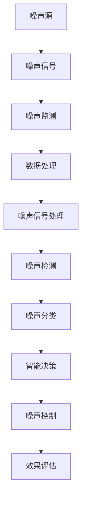
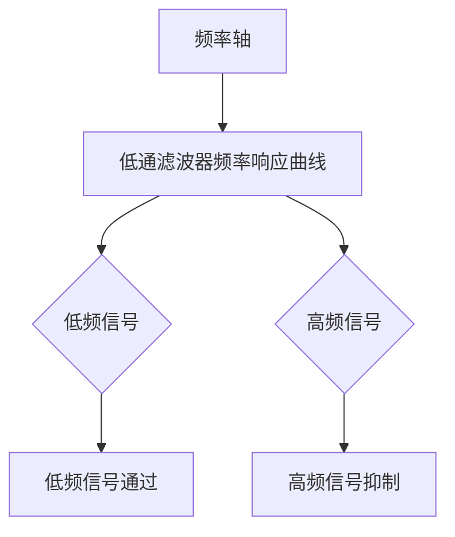

                 

### 文章标题：AI基础设施的噪声控制：智能化城市噪声管理系统

随着城市化的快速推进，噪声污染已成为全球范围内亟待解决的问题之一。而AI技术的飞速发展为噪声控制提供了新的解决方案。本文旨在探讨AI基础设施在噪声控制中的应用，特别是在智能化城市噪声管理系统中的实现。通过深入剖析噪声控制的核心概念、算法原理、系统设计以及实际应用，本文将为读者呈现一个全面而详细的智能化城市噪声管理系统图景。

本文结构如下：

- **第一部分：背景与核心概念**：介绍噪声控制的重要性与挑战，AI与噪声控制的关系，以及AI基础设施的概念与构建。
- **第二部分：核心算法原理与实现**：详细讲解噪声信号处理算法、机器学习在噪声控制中的应用，以及智能噪声管理系统设计与实现。
- **第三部分：实际应用与未来展望**：分析智能噪声管理系统的应用场景，案例分析，以及未来展望与发展趋势。

### 文章关键词

- 噪声控制
- AI基础设施
- 智能化城市噪声管理系统
- 信号处理算法
- 机器学习
- 系统设计与实现

### 文章摘要

本文首先介绍了噪声控制的重要性与挑战，以及AI技术在噪声控制中的应用潜力。随后，深入探讨了AI基础设施的概念与构建，包括数据处理层、算法层和硬件层。重点介绍了噪声检测与监测技术，以及智能化噪声管理系统的架构。接下来，详细讲解了噪声信号处理算法和机器学习在噪声控制中的应用，包括噪声信号去噪算法、噪声检测算法和噪声源定位算法。最后，本文通过实际案例研究和未来展望，分析了智能噪声管理系统的应用前景与发展趋势。

### 第一部分：背景与核心概念

#### 第1章：AI基础设施的噪声控制概述

噪声控制作为环境保护的重要环节，对人类健康和生活质量有着深远影响。然而，传统噪声控制方法面临着诸多挑战，如监测难度大、控制效果不理想等。随着AI技术的不断进步，利用AI基础设施进行噪声控制成为了一种新的趋势。

##### 1.1 噪声控制的重要性与挑战

城市噪声污染问题日益严重，长期暴露于高噪声环境中会对人体造成多种健康问题，包括听力损失、心血管疾病、睡眠障碍等。因此，噪声控制成为现代城市建设中不可忽视的重要环节。

**噪声污染的背景**：城市化进程的加快带来了交通、工业和居住区等不同类型的噪声污染源。这些噪声源不仅影响城市居民的生活质量，还对生态环境造成破坏。

**噪声对人类健康的影响**：研究表明，长期暴露于高噪声环境中会增加心血管疾病、心理压力和认知障碍的风险。因此，有效的噪声控制措施对于保障人类健康至关重要。

**噪声控制的需求与挑战**：尽管已有多种噪声控制方法，如隔音板、绿化带和消音器等，但实际应用效果有限。主要原因在于：

- **监测难度大**：噪声污染的监测需要大量数据和时间，传统方法难以满足实时监测需求。
- **控制效果不理想**：传统噪声控制方法往往只能局部缓解噪声问题，无法从根本上解决问题。
- **缺乏智能化手段**：传统方法缺乏自适应性和智能化，难以应对复杂多变的噪声环境。

##### 1.2 AI与噪声控制的关系

随着AI技术的不断发展，利用AI基础设施进行噪声控制成为了一种新的解决方案。AI技术在噪声控制中的应用主要体现在以下几个方面：

**AI技术在噪声控制中的应用**：

- **数据采集与处理**：AI技术可以高效地采集和处理噪声数据，实现实时监测和智能分析。
- **噪声信号处理**：AI技术可以运用深度学习、信号处理算法等对噪声信号进行去噪、检测和分类。
- **智能决策**：AI技术可以根据噪声数据和环境参数，智能地制定噪声控制策略，实现精准治理。

**智能化噪声管理系统的必要性**：

- **实时监测与预警**：智能化噪声管理系统可以实现对城市噪声的实时监测，及时发现噪声污染问题，并发出预警。
- **自适应控制**：系统可以根据噪声数据和实时环境参数，自动调整噪声控制措施，提高控制效果。
- **数据驱动决策**：通过分析噪声数据，系统能够为城市规划者提供科学依据，制定更加有效的噪声控制策略。

**智能化噪声管理系统的预期效果**：

- **提升生活质量**：通过有效控制噪声污染，智能化噪声管理系统将显著提升城市居民的生活质量，减少健康风险。
- **降低治理成本**：智能化手段可以减少人工监测和维护成本，提高治理效率。
- **实现可持续发展**：智能化噪声管理系统有助于推动城市可持续发展，促进人与自然的和谐共处。

#### Mermaid 流程图：噪声控制核心概念与架构

##### 1.3 AI基础设施的概念与构建

AI基础设施是支撑智能化噪声管理系统正常运行的核心。它包括以下几个关键组成部分：

**数据处理层**：负责噪声数据的采集、存储、处理和分析。数据处理层需要高效的数据存储技术和强大的计算能力，以实现对海量噪声数据的快速处理。

**算法层**：包括噪声信号处理算法、噪声检测算法和噪声分类算法等。这些算法是实现智能化噪声控制的核心，其性能直接影响系统的控制效果。

**硬件层**：包括噪声监测设备、服务器、存储设备等。硬件层的性能直接影响数据处理和算法运行的效率。

##### 1.4 智能化噪声管理系统的架构

智能化噪声管理系统通常由以下几个模块组成：

**噪声监测模块**：负责实时采集城市各区域的噪声数据，并通过无线网络传输到数据处理中心。

**数据处理模块**：对接收到的噪声数据进行预处理、存储和分类，为后续处理提供基础数据。

**噪声信号处理模块**：运用深度学习、信号处理算法等对噪声信号进行去噪、检测和分类。

**智能决策模块**：根据噪声数据和实时环境参数，智能地制定噪声控制策略，并调度相应的控制措施。

**噪声控制模块**：执行智能决策模块制定的控制策略，包括关闭噪声源、增加隔音设施等。

**效果评估模块**：对噪声控制效果进行实时监测和评估，为系统优化提供数据支持。

##### 1.5 智能化噪声管理系统的实现

智能化噪声管理系统的实现涉及多个环节，包括系统设计、开发、部署和运维等。

**系统设计**：根据噪声控制需求，设计系统的功能模块和技术架构，确保系统具有高效、稳定、可扩展的特点。

**系统开发**：按照设计文档进行系统开发，实现噪声监测、数据处理、信号处理、智能决策等功能。

**系统部署**：将开发完成的系统部署到实际环境中，确保系统能够稳定运行。

**系统运维**：对系统进行日常维护和升级，确保系统功能的持续完善和性能的提升。

#### 总结

本文介绍了噪声控制的重要性与挑战，探讨了AI技术在噪声控制中的应用潜力，并详细阐述了AI基础设施的概念与构建。通过智能化噪声管理系统，AI技术为噪声控制提供了新的解决方案，有助于提升城市居民的生活质量，实现可持续发展。接下来，我们将进一步探讨噪声信号处理算法和机器学习在噪声控制中的应用，深入分析智能化噪声管理系统的设计与实现。

## 第二部分：核心算法原理与实现

### 第2章：AI基础设施的概念与构建

#### 2.1 AI基础设施的基本概念

AI基础设施是支撑人工智能系统运行的关键组成部分，包括数据处理层、算法层和硬件层。这些层协同工作，共同实现高效的噪声控制。

**数据处理层**：数据处理层主要负责噪声数据的采集、存储、处理和分析。在噪声控制系统中，数据处理层需要具备以下功能：

- **数据采集**：利用传感器、摄像头等设备，实时采集城市各区域的噪声数据。
- **数据存储**：将采集到的噪声数据存储在数据库中，以便后续分析和处理。
- **数据处理**：对噪声数据进行分析和处理，提取有用的信息，如噪声强度、频率等。

**算法层**：算法层是AI基础设施的核心，包括噪声信号处理算法、噪声检测算法和噪声分类算法等。这些算法是实现智能化噪声控制的关键，其性能直接影响系统的控制效果。

- **噪声信号处理算法**：用于对噪声信号进行去噪、增强和滤波等处理，以提高噪声数据的可用性。
- **噪声检测算法**：用于检测噪声信号中的异常噪声，如交通噪声、工业噪声等。
- **噪声分类算法**：用于将噪声信号分类为不同类型，如交通噪声、工业噪声、建筑噪声等。

**硬件层**：硬件层包括噪声监测设备、服务器、存储设备等。硬件层的性能直接影响数据处理和算法运行的效率。常见的硬件层设备包括：

- **噪声监测设备**：如声波传感器、智能麦克风等，用于实时采集噪声数据。
- **服务器**：用于处理和分析噪声数据，支持算法层的运行。
- **存储设备**：用于存储大量噪声数据，支持数据处理层的运行。

#### 2.2 噪声检测与监测

噪声检测与监测是智能化噪声管理系统的基础，涉及到噪声信号的采集、传输和处理。以下将详细探讨噪声检测与监测的相关技术。

**噪声检测技术**

噪声检测技术主要包括以下几种：

1. **声波传感器**：声波传感器是噪声检测的核心设备，可以实时监测环境噪声水平。常见的声波传感器有电容式传感器、压电式传感器等。电容式传感器具有灵敏度高、频率响应范围广等优点，适用于噪声监测领域。

2. **智能麦克风**：智能麦克风集成了信号处理功能，可以实时分析噪声信号的特征，如频率、强度等。智能麦克风具有体积小、功耗低、易集成等优点，适用于便携式噪声监测设备。

3. **声波采集设备**：声波采集设备如声波采集卡、声波采集模块等，可以将声波信号转换为电信号，并传输到数据处理中心进行分析。

**噪声监测系统的构建**

噪声监测系统的构建需要考虑以下几个方面：

1. **监测点布局**：根据城市噪声污染的特点，合理布局监测点。监测点应覆盖交通干线、工业区域、居住区等噪声污染严重的区域。

2. **传感器选择**：根据监测需求和环境特点，选择合适的传感器。例如，在交通噪声监测中，可选用压电式传感器；在工业噪声监测中，可选用电容式传感器。

3. **数据传输**：噪声数据需要实时传输到数据处理中心进行分析和处理。常见的数据传输方式包括有线传输和无线传输。有线传输具有稳定性高、带宽大等优点，但需要铺设传输线路。无线传输具有安装方便、成本低等优点，但易受干扰。

4. **数据处理中心**：数据处理中心是噪声监测系统的核心，负责接收、处理和分析噪声数据。数据处理中心应具备高性能的计算能力和数据存储能力，能够快速处理海量噪声数据。

**数据采集与存储**

数据采集与存储是噪声监测系统的关键环节。以下将介绍数据采集与存储的相关技术：

1. **数据采集**：噪声数据采集通常采用周期性采集方式，即每隔一定时间（如1秒）采集一次噪声信号。采集到的噪声信号可以存储在内存中，或实时传输到数据处理中心。

2. **数据存储**：噪声数据存储可采用数据库或文件系统。数据库具有数据管理功能，便于数据检索和分析。文件系统则适用于存储大量原始噪声数据。

3. **数据存储策略**：为了确保噪声数据的安全性和完整性，可以采用以下存储策略：

- **数据备份**：对噪声数据进行定期备份，防止数据丢失。
- **数据压缩**：对噪声数据进行压缩，减少存储空间需求。
- **数据加密**：对噪声数据进行加密，确保数据安全性。

#### 2.3 智能化噪声管理系统架构

智能化噪声管理系统架构通常包括以下几个模块：

1. **噪声监测模块**：负责实时采集城市各区域的噪声数据，并通过无线网络传输到数据处理中心。

2. **数据处理模块**：对接收到的噪声数据进行预处理、存储和分类，为后续处理提供基础数据。

3. **噪声信号处理模块**：运用深度学习、信号处理算法等对噪声信号进行去噪、检测和分类。

4. **智能决策模块**：根据噪声数据和实时环境参数，智能地制定噪声控制策略，并调度相应的控制措施。

5. **噪声控制模块**：执行智能决策模块制定的控制策略，包括关闭噪声源、增加隔音设施等。

6. **效果评估模块**：对噪声控制效果进行实时监测和评估，为系统优化提供数据支持。

#### 总结

本章介绍了AI基础设施的基本概念，包括数据处理层、算法层和硬件层。同时，详细探讨了噪声检测与监测技术，以及智能化噪声管理系统的架构。通过本章的学习，读者可以对AI基础设施在噪声控制中的应用有一个全面的认识。

### 第3章：噪声信号处理算法

噪声信号处理是智能化噪声管理系统的核心组成部分，其主要目标是通过对噪声信号进行处理，提高噪声数据的可用性，为后续的噪声检测和分类提供基础。本章将介绍几种常用的噪声信号处理算法，包括低通滤波器、傅里叶变换去噪和小波变换去噪。

#### 3.1 噪声信号处理的基本原理

噪声信号处理的基本原理可以概括为以下几个步骤：

1. **信号采样**：将连续的噪声信号转换为离散的数字信号。采样过程包括确定采样频率和采样时间。

2. **信号预处理**：对噪声信号进行滤波、去噪、增强等预处理操作，以消除噪声对信号的影响。

3. **特征提取**：从预处理后的噪声信号中提取有用的特征信息，如频率、幅度、相位等。

4. **信号重构**：根据提取的特征信息，重构原始噪声信号或生成新的噪声信号。

#### 3.2 低通滤波器

低通滤波器是最常用的噪声信号处理方法之一，其主要作用是抑制高频噪声，保留低频信号。低通滤波器的工作原理基于滤波器的频率响应特性，即允许低频信号通过，而抑制高频信号。

**低通滤波器的原理**

低通滤波器的频率响应曲线呈梯形，如图3-1所示。曲线的高频部分向下倾斜，表示高频信号被抑制，低频信号则基本保持不变。

**低通滤波器的设计**

低通滤波器的设计主要包括以下几个方面：

1. **滤波器类型**：根据噪声信号的特性，选择合适的低通滤波器类型，如巴特沃斯滤波器、切比雪夫滤波器等。

2. **滤波器阶数**：滤波器阶数越高，滤波效果越好，但计算复杂度也越高。因此，需要根据实际应用需求，合理选择滤波器阶数。

3. **截止频率**：截止频率是低通滤波器的关键参数，决定了滤波器对高频信号的抑制程度。截止频率的选择需要综合考虑噪声信号的频率分布和噪声控制要求。

**低通滤波器的应用**

低通滤波器在噪声信号处理中具有广泛的应用，如：

1. **音频信号处理**：在音频信号处理中，低通滤波器常用于去除高频噪声，提高音频质量。

2. **图像信号处理**：在图像信号处理中，低通滤波器常用于图像去噪和模糊图像恢复。

3. **噪声信号处理**：在噪声信号处理中，低通滤波器用于去除高频噪声，提取有用的信号特征。

#### 3.3 傅里叶变换去噪

傅里叶变换是噪声信号处理中常用的数学工具，可以将时域信号转换为频域信号，从而实现对噪声信号的频域分析。傅里叶变换去噪的基本原理是基于噪声信号和有用信号的频域特性差异，通过频域滤波器去除噪声信号。

**傅里叶变换的基本原理**

傅里叶变换是将时域信号转换为频域信号的一种数学变换。对于离散时间信号x[n]，其傅里叶变换定义为：

$$
X(\omega) = \sum_{n=0}^{N-1} x[n]e^{-j\omega n}
$$

其中，ω为频率，N为采样点数。

傅里叶变换将时域信号分解为不同频率的正弦波和余弦波，从而实现对信号的频域分析。

**傅里叶变换去噪的步骤**

1. **信号采样**：对噪声信号进行采样，得到离散时间信号。

2. **傅里叶变换**：对采样后的噪声信号进行傅里叶变换，得到频域信号。

3. **频域滤波**：在频域中，利用滤波器去除噪声信号。常见的频域滤波器有低通滤波器、高通滤波器等。

4. **傅里叶逆变换**：将滤波后的频域信号进行傅里叶逆变换，得到去噪后的时域信号。

**傅里叶变换去噪的应用**

傅里叶变换去噪在噪声信号处理中具有广泛的应用，如：

1. **音频信号去噪**：在音频信号处理中，傅里叶变换去噪用于去除背景噪声，提高音频质量。

2. **图像信号去噪**：在图像信号处理中，傅里叶变换去噪用于去除图像噪声，提高图像清晰度。

3. **噪声信号分析**：在噪声信号处理中，傅里叶变换用于分析噪声信号的频域特性，为后续处理提供基础。

#### 3.4 小波变换去噪

小波变换是噪声信号处理中另一种常用的数学工具，它可以将时域信号分解为不同尺度的信号，从而实现对噪声信号的多尺度分析。小波变换去噪的基本原理是基于噪声信号和有用信号在不同尺度上的特性差异，通过多尺度滤波器去除噪声信号。

**小波变换的基本原理**

小波变换是将时域信号分解为不同尺度的信号的一种数学变换。对于离散时间信号x[n]，其小波变换定义为：

$$
W_{j,k}(x) = \sum_{n=0}^{N-1} x[n] \psi^*_{j,k}(n)
$$

其中，ψ为小波函数，j为尺度参数，k为平移参数。

小波变换将时域信号分解为一系列尺度不同的信号，从而实现对信号的时域和频域分析。

**小波变换去噪的步骤**

1. **信号采样**：对噪声信号进行采样，得到离散时间信号。

2. **小波变换**：对采样后的噪声信号进行小波变换，得到多尺度的信号。

3. **多尺度滤波**：在多尺度上，利用滤波器去除噪声信号。常见的滤波器有软阈值滤波器、硬阈值滤波器等。

4. **小波逆变换**：将滤波后的多尺度信号进行小波逆变换，得到去噪后的时域信号。

**小波变换去噪的应用**

小波变换去噪在噪声信号处理中具有广泛的应用，如：

1. **音频信号去噪**：在音频信号处理中，小波变换去噪用于去除背景噪声，提高音频质量。

2. **图像信号去噪**：在图像信号处理中，小波变换去噪用于去除图像噪声，提高图像清晰度。

3. **噪声信号分析**：在噪声信号处理中，小波变换用于分析噪声信号的多尺度特性，为后续处理提供基础。

#### 3.5 噪声检测算法

噪声检测算法是智能化噪声管理系统的重要组成部分，其主要任务是实时检测噪声信号中的异常噪声，为后续的噪声分类和智能控制提供基础。本章将介绍几种常用的噪声检测算法，包括时域检测算法、频域检测算法和基于深度学习的噪声检测算法。

**时域检测算法**

时域检测算法通过分析噪声信号的时域特性，实现噪声检测。常见的时域检测算法有：

1. **均方根值检测**：计算噪声信号的均方根值，通过设定阈值判断噪声是否存在。若均方根值超过设定阈值，则判断为噪声。

2. **峰值检测**：检测噪声信号中的峰值，通过设定阈值判断噪声是否存在。若峰值超过设定阈值，则判断为噪声。

3. **相关性检测**：计算噪声信号之间的相关性，通过相关性分析判断噪声是否存在。若相关性较低，则判断为噪声。

**频域检测算法**

频域检测算法通过分析噪声信号的频域特性，实现噪声检测。常见的频域检测算法有：

1. **频谱分析**：计算噪声信号的频谱，通过频谱分析判断噪声是否存在。若频谱中存在明显的噪声频率，则判断为噪声。

2. **频带检测**：设定特定的频带范围，通过频带检测判断噪声是否存在。若频带中的信号能量超过设定阈值，则判断为噪声。

3. **频域特征提取**：提取噪声信号的频域特征，如频率、幅度等，通过特征分析判断噪声是否存在。若特征超过设定阈值，则判断为噪声。

**基于深度学习的噪声检测算法**

基于深度学习的噪声检测算法通过训练深度神经网络，实现噪声检测。常见的基于深度学习的噪声检测算法有：

1. **卷积神经网络（CNN）**：通过卷积操作提取噪声信号的局部特征，实现噪声检测。

2. **循环神经网络（RNN）**：通过循环操作捕捉噪声信号的时间序列特征，实现噪声检测。

3. **长短时记忆网络（LSTM）**：结合RNN和卷积操作，实现噪声检测。

**噪声检测算法的比较**

时域检测算法和频域检测算法适用于简单的噪声检测任务，而基于深度学习的噪声检测算法具有更强的鲁棒性和准确性。在实际应用中，可以根据噪声特征和环境需求，选择合适的噪声检测算法。

**噪声检测算法的应用**

噪声检测算法在智能化噪声管理系统中具有广泛的应用，如：

1. **实时噪声监测**：通过噪声检测算法，实现实时噪声监测，及时发现噪声污染问题。

2. **噪声分类**：通过噪声检测算法，对噪声信号进行分类，为后续的噪声控制提供基础。

3. **噪声治理**：根据噪声检测结果，制定相应的噪声治理策略，实现精准治理。

#### 总结

本章介绍了噪声信号处理算法，包括低通滤波器、傅里叶变换去噪和小波变换去噪。同时，还介绍了时域检测算法、频域检测算法和基于深度学习的噪声检测算法。通过本章的学习，读者可以了解噪声信号处理的基本原理和方法，为后续的噪声检测和分类提供基础。

### 第4章：机器学习在噪声控制中的应用

机器学习作为人工智能的核心技术之一，在噪声控制领域也发挥着重要作用。本章将介绍机器学习在噪声控制中的应用，包括噪声分类算法和噪声源定位算法。

#### 4.1 机器学习基础

**机器学习的基本概念**

机器学习是指通过计算机模拟人类的学习过程，使计算机具备自主学习和适应新环境的能力。机器学习的主要任务是根据输入数据（特征）和输出结果（标签），训练出一个模型，用于预测新的数据。

**监督学习与无监督学习**

监督学习：在有监督学习中，每个输入数据都有一个对应的标签，通过学习输入数据和标签之间的关系，模型可以预测新的数据。

无监督学习：在无监督学习中，没有提供输入数据的标签，模型需要通过自身探索，发现数据之间的规律。

**强化学习概述**

强化学习：强化学习是一种基于奖励机制的学习方法，通过不断地尝试和反馈，模型逐渐学会在特定环境中做出最优决策。

#### 4.2 噪声分类算法

噪声分类算法是噪声控制中的重要环节，通过对噪声信号进行分类，有助于识别不同类型的噪声源，为后续的噪声治理提供依据。

**支持向量机（SVM）**

支持向量机是一种二分类模型，通过找到最佳的超平面，将不同类别的数据分隔开来。

**SVM在噪声分类中的应用**

- **数据预处理**：对噪声信号进行预处理，包括归一化和特征提取。
- **训练SVM模型**：使用带标签的噪声数据集，训练SVM模型，找到最佳超平面。
- **模型评估**：使用测试数据集评估SVM模型的分类准确性。

**决策树与随机森林**

决策树是一种基于树结构的分类模型，通过多层次的测试属性，将数据逐步划分成不同的类别。

随机森林：随机森林是一种集成学习模型，由多个决策树组成，通过投票机制确定最终分类结果。

**随机森林在噪声分类中的应用**

- **数据预处理**：对噪声信号进行预处理，包括归一化和特征提取。
- **构建随机森林模型**：使用带标签的噪声数据集，构建随机森林模型。
- **模型评估**：使用测试数据集评估随机森林模型的分类准确性。

**基于神经网络的方法**

神经网络是一种模拟人脑神经元连接结构的计算模型，通过层层传递信息，实现对数据的非线性变换。

**卷积神经网络（CNN）**

卷积神经网络是一种特殊的神经网络，通过卷积操作和池化操作，实现对图像和信号的分类。

**CNN在噪声分类中的应用**

- **数据预处理**：对噪声信号进行预处理，包括归一化和特征提取。
- **构建CNN模型**：使用带标签的噪声数据集，构建CNN模型。
- **模型评估**：使用测试数据集评估CNN模型的分类准确性。

#### 4.3 噪声源定位算法

噪声源定位算法是噪声控制中的关键技术之一，通过对噪声信号的来源进行定位，有助于制定有效的噪声治理措施。

**超分辨率技术**

超分辨率技术是一种通过插值方法，提高图像或信号分辨率的技术。在噪声源定位中，超分辨率技术可以用于提高噪声信号的分辨率，从而实现更精确的噪声源定位。

**基于深度学习的定位算法**

深度学习算法在噪声源定位中具有广泛应用，如：

**卷积神经网络（CNN）**

- **数据预处理**：对噪声信号进行预处理，包括归一化和特征提取。
- **构建CNN模型**：使用带标签的噪声数据集，构建CNN模型。
- **模型评估**：使用测试数据集评估CNN模型的定位准确性。

**循环神经网络（RNN）**

循环神经网络通过循环操作，可以捕捉噪声信号的时间序列特征，实现对噪声源的时间定位。

**RNN在噪声源定位中的应用**

- **数据预处理**：对噪声信号进行预处理，包括归一化和特征提取。
- **构建RNN模型**：使用带标签的噪声数据集，构建RNN模型。
- **模型评估**：使用测试数据集评估RNN模型的定位准确性。

**长短时记忆网络（LSTM）**

长短时记忆网络是RNN的一种改进，通过引入门控机制，可以更好地捕捉噪声信号的时间序列特征。

**LSTM在噪声源定位中的应用**

- **数据预处理**：对噪声信号进行预处理，包括归一化和特征提取。
- **构建LSTM模型**：使用带标签的噪声数据集，构建LSTM模型。
- **模型评估**：使用测试数据集评估LSTM模型的定位准确性。

#### 4.4 噪声源定位算法评估

噪声源定位算法的评估主要从以下几个方面进行：

**定位精度**：定位精度是评估噪声源定位算法的重要指标，通常使用定位误差来衡量。

**计算效率**：计算效率是评估噪声源定位算法的重要指标，包括模型的训练时间和推理时间。

**鲁棒性**：鲁棒性是评估噪声源定位算法的重要指标，即在噪声污染和信号干扰下，算法仍能准确定位噪声源。

**实际应用场景**：评估噪声源定位算法的实际应用效果，如在城市交通噪声、工业噪声等场景中的表现。

#### 总结

本章介绍了机器学习在噪声控制中的应用，包括噪声分类算法和噪声源定位算法。通过支持向量机、决策树、随机森林和基于神经网络的方法，可以实现噪声信号的分类和定位。同时，通过超分辨率技术和深度学习算法，可以实现对噪声源的高精度定位。这些算法的应用为智能化噪声管理系统提供了有力的技术支持。

### 第5章：智能噪声管理系统设计与实现

#### 5.1 系统设计原则

智能噪声管理系统的设计原则是确保系统具备高效、稳定、可扩展的特点，以适应不同应用场景和需求。

**系统总体设计**

系统总体设计需要考虑以下几个方面：

- **模块化设计**：将系统划分为多个功能模块，如噪声监测模块、数据处理模块、噪声信号处理模块等，便于系统维护和升级。
- **分布式架构**：采用分布式架构，将数据处理和存储分布在不同节点上，提高系统的处理能力和容错性。
- **高可用性**：系统设计应具备高可用性，确保在发生故障时，系统能够快速恢复。

**模块化设计思路**

模块化设计思路主要体现在以下几个方面：

- **噪声监测模块**：负责噪声信号的采集和传输，采用分布式传感器网络，实现实时监测。
- **数据处理模块**：负责噪声数据的预处理、存储和分析，采用分布式存储和处理技术，提高数据处理效率。
- **噪声信号处理模块**：负责噪声信号的去噪、检测和分类，采用深度学习和信号处理算法，实现高效噪声处理。
- **智能决策模块**：根据噪声数据和实时环境参数，智能制定噪声控制策略，实现自适应噪声治理。
- **噪声控制模块**：负责执行智能决策模块制定的控制策略，包括关闭噪声源、增加隔音设施等。
- **效果评估模块**：对噪声控制效果进行实时监测和评估，为系统优化提供数据支持。

**可扩展性设计**

可扩展性设计主要体现在以下几个方面：

- **水平扩展**：通过增加计算节点，提高系统处理能力和性能。
- **垂直扩展**：通过升级硬件设备和优化软件算法，提高系统性能。
- **模块化扩展**：通过增加新的功能模块，实现系统功能扩展。

#### 5.2 系统开发流程

系统开发流程包括需求分析、系统架构设计、系统模块实现、系统集成与测试等步骤。

**需求分析**

需求分析是系统开发的第一步，主要任务是明确系统功能和性能需求，为后续开发提供基础。需求分析主要包括以下几个方面：

- **功能需求**：确定系统应具备的功能，如噪声监测、数据处理、噪声信号处理等。
- **性能需求**：确定系统应达到的性能指标，如处理速度、准确率、响应时间等。
- **安全需求**：确定系统应具备的安全防护措施，如数据加密、访问控制等。

**系统架构设计**

系统架构设计是系统开发的核心，主要任务是确定系统整体架构和各模块之间的关系。系统架构设计主要包括以下几个方面：

- **系统架构模型**：确定系统整体架构，包括硬件架构、软件架构等。
- **模块划分**：根据需求分析结果，将系统划分为多个功能模块，明确各模块的功能和接口。
- **数据流程**：确定系统数据流动过程，包括数据采集、处理、存储和分析等。

**系统模块实现**

系统模块实现是系统开发的关键步骤，主要任务是按照系统架构设计，实现各功能模块。系统模块实现主要包括以下几个方面：

- **模块功能实现**：根据模块划分，实现各模块的功能，如噪声监测、数据处理、噪声信号处理等。
- **接口设计**：设计各模块之间的接口，确保模块之间数据传递的可靠性和一致性。
- **性能优化**：对模块进行性能优化，提高系统整体性能。

**系统集成与测试**

系统集成与测试是系统开发的最后一步，主要任务是将各功能模块集成到一起，进行整体测试，确保系统功能完整、性能稳定。系统集成与测试主要包括以下几个方面：

- **模块集成**：将各功能模块集成到一起，形成完整的系统。
- **系统测试**：对系统进行功能测试、性能测试、安全测试等，确保系统功能完整、性能稳定。
- **用户培训**：为用户提供系统操作培训，确保用户能够熟练使用系统。

#### 5.3 案例研究

**智能噪声管理系统在某城市的应用**

某城市为了改善城市噪声环境，引入了智能噪声管理系统。该系统包括以下关键模块：

- **噪声监测模块**：在市区各主要交通道路、工业区和生活区布置传感器，实时监测噪声水平。
- **数据处理模块**：接收传感器数据，进行预处理和存储，为噪声信号处理提供基础数据。
- **噪声信号处理模块**：对噪声信号进行去噪、检测和分类，提取有用信息。
- **智能决策模块**：根据噪声数据和实时环境参数，智能制定噪声控制策略。
- **噪声控制模块**：执行智能决策模块制定的控制策略，如关闭噪声源、增加隔音设施等。
- **效果评估模块**：对噪声控制效果进行实时监测和评估，为系统优化提供数据支持。

**应用效果评估**

智能噪声管理系统在某城市运行后，取得了显著的效果：

- **噪声水平降低**：通过智能噪声管理系统的运行，该城市主要交通道路、工业区和生活区的噪声水平明显降低，居民满意度提高。
- **响应速度提升**：系统具备实时监测和智能决策功能，能够快速响应噪声污染事件，提高治理效率。
- **数据驱动决策**：通过分析噪声数据，系统能够为城市规划者提供科学依据，制定更加有效的噪声控制策略。

**经验与启示**

智能噪声管理系统在某城市的成功应用，为其他城市提供了宝贵的经验：

- **数据驱动**：智能噪声管理系统强调数据驱动，通过采集和分析噪声数据，实现精准治理。
- **系统集成**：智能噪声管理系统需要集成多种技术，如传感器技术、数据处理技术、智能决策技术等。
- **用户体验**：智能噪声管理系统应注重用户体验，提供直观的操作界面和报告生成功能。

#### 总结

本章介绍了智能噪声管理系统的设计原则、开发流程以及实际应用案例。通过模块化设计和分布式架构，智能噪声管理系统实现了高效、稳定、可扩展的特点。在实际应用中，智能噪声管理系统取得了显著的效果，为城市噪声治理提供了新的解决方案。

### 第6章：智能化城市噪声管理系统的实际应用

随着城市化进程的加快，噪声污染问题日益严重，智能化城市噪声管理系统应运而生。本章将探讨智能噪声管理系统的实际应用，包括交通噪声管理、工业噪声控制和居住区噪声治理等场景。

#### 6.1 智能噪声管理系统的应用场景

**交通噪声管理**

交通噪声是城市噪声污染的主要来源之一，主要来自机动车、火车和飞机等交通方式。智能噪声管理系统在交通噪声管理中的应用主要体现在以下几个方面：

- **实时监测**：在交通要道和交通枢纽布置噪声传感器，实时监测交通噪声水平，及时发现噪声污染问题。
- **数据分析**：通过对噪声数据进行分析，识别噪声源和噪声传播路径，为制定噪声治理措施提供依据。
- **智能决策**：根据噪声数据和交通流量，智能制定交通噪声控制策略，如调整交通信号、限制车辆通行等。

**工业噪声控制**

工业噪声主要来自工厂和工业区的机械设备运行。智能噪声管理系统在工业噪声控制中的应用主要体现在以下几个方面：

- **噪声监测**：在工厂和工业区内布置噪声传感器，实时监测工业噪声水平，评估噪声对工人健康的影响。
- **数据分析**：通过对噪声数据进行分析，识别噪声源和噪声传播路径，为制定噪声治理措施提供依据。
- **智能控制**：根据噪声数据和设备运行状态，智能调整设备运行参数，降低噪声排放，提高生产效率。

**居住区噪声治理**

居住区噪声主要来自交通、工业和建筑工地等。智能噪声管理系统在居住区噪声治理中的应用主要体现在以下几个方面：

- **噪声监测**：在居住区周边布置噪声传感器，实时监测居住区噪声水平，保障居民生活品质。
- **数据分析**：通过对噪声数据进行分析，识别噪声源和噪声传播路径，为制定噪声治理措施提供依据。
- **智能治理**：根据噪声数据和居民需求，智能制定噪声治理措施，如增加隔音设施、调整交通路线等。

#### 6.2 智能噪声管理系统案例分析

**案例一：某城市的噪声监测与管理**

某城市为了改善城市噪声环境，引入了智能噪声管理系统。该系统包括以下关键模块：

- **噪声监测模块**：在市区各主要交通道路、工业区和生活区布置传感器，实时监测噪声水平。
- **数据处理模块**：接收传感器数据，进行预处理和存储，为噪声信号处理提供基础数据。
- **噪声信号处理模块**：对噪声信号进行去噪、检测和分类，提取有用信息。
- **智能决策模块**：根据噪声数据和实时环境参数，智能制定噪声控制策略。
- **噪声控制模块**：执行智能决策模块制定的控制策略，如关闭噪声源、增加隔音设施等。
- **效果评估模块**：对噪声控制效果进行实时监测和评估，为系统优化提供数据支持。

**案例二：智能噪声控制系统的应用**

某城市为了解决交通噪声问题，引入了智能噪声控制系统。该系统包括以下关键模块：

- **噪声监测模块**：在主要交通道路布置噪声传感器，实时监测交通噪声水平。
- **数据分析模块**：对噪声数据进行分析，识别噪声源和噪声传播路径。
- **智能决策模块**：根据噪声数据和交通流量，智能制定交通噪声控制策略，如调整交通信号、限制车辆通行等。
- **噪声控制模块**：执行智能决策模块制定的控制策略，如关闭噪声源、增加隔音设施等。

**案例三：噪声治理方案优化**

某城市为了改善居住区的噪声环境，实施了智能噪声管理系统。该系统包括以下关键模块：

- **噪声监测模块**：在居住区周边布置噪声传感器，实时监测居住区噪声水平。
- **数据分析模块**：对噪声数据进行分析，识别噪声源和噪声传播路径。
- **智能治理模块**：根据噪声数据和居民需求，智能制定噪声治理措施，如增加隔音设施、调整交通路线等。
- **效果评估模块**：对噪声治理效果进行实时监测和评估，为系统优化提供数据支持。

#### 6.3 案例分析总结

通过对上述案例的分析，我们可以得出以下结论：

- **实时监测**：智能噪声管理系统具备实时监测功能，能够及时发现噪声污染问题，为决策提供依据。
- **数据分析**：智能噪声管理系统通过数据分析，能够识别噪声源和噪声传播路径，为治理措施制定提供支持。
- **智能决策**：智能噪声管理系统结合噪声数据和实时环境参数，智能制定治理措施，提高治理效果。
- **效果评估**：智能噪声管理系统对治理效果进行实时监测和评估，为系统优化提供数据支持。

#### 总结

本章介绍了智能噪声管理系统的实际应用，包括交通噪声管理、工业噪声控制和居住区噪声治理等场景。通过案例分析，我们看到了智能噪声管理系统在改善城市噪声环境中的重要作用。随着技术的不断发展，智能噪声管理系统将更加成熟，为城市噪声治理提供更加有效的解决方案。

### 第7章：未来展望与发展趋势

随着人工智能和物联网技术的不断发展，智能噪声管理系统在未来的发展趋势中具有广阔的应用前景。本章将从技术、政策与法规、市场机遇等方面探讨智能噪声管理系统的发展趋势。

#### 7.1 智能噪声管理技术的发展趋势

**新技术的应用**

1. **边缘计算**：边缘计算可以将部分数据处理和分析任务从云端转移到边缘设备上，降低延迟，提高系统的实时性。
2. **大数据分析**：随着数据量的不断增长，大数据分析技术将在智能噪声管理系统中发挥更大的作用，通过对海量噪声数据的分析，实现更加精准的噪声控制。
3. **物联网（IoT）**：物联网技术将使噪声监测设备更加智能化，实现设备间的数据共享和协同工作，提高噪声监测的覆盖率和精度。
4. **人工智能**：人工智能技术将在智能噪声管理系统中得到广泛应用，如深度学习算法可以用于噪声信号处理和噪声源定位，提高系统的性能和精度。

**智能化噪声管理系统的演进方向**

1. **自适应噪声控制**：未来的智能噪声管理系统将更加注重自适应噪声控制，根据实时噪声数据和用户需求，动态调整噪声控制策略，实现个性化噪声治理。
2. **多源数据融合**：未来的智能噪声管理系统将融合多种数据源，如气象数据、交通数据等，提高噪声监测和治理的准确性。
3. **智能化噪声预测**：基于历史噪声数据和实时监测数据，未来的智能噪声管理系统将具备噪声预测能力，提前预警可能出现的噪声污染问题。

**智能噪声管理系统与城市管理的融合**

1. **城市安全监控**：智能噪声管理系统可以与城市安全监控系统融合，实现对城市噪声和安全的全面监控，提高城市安全管理水平。
2. **智慧城市建设**：智能噪声管理系统是智慧城市建设的重要组成部分，将智慧城市建设与智能噪声管理系统相结合，实现城市资源的优化配置和可持续发展。

#### 7.2 智能噪声管理系统的挑战与机遇

**技术挑战**

1. **数据处理能力**：智能噪声管理系统需要处理大量的噪声数据，对数据处理能力和算法性能提出了较高要求。
2. **实时性要求**：噪声污染问题是动态变化的，对智能噪声管理系统的实时性要求较高，需要不断优化算法和系统架构。
3. **隐私保护**：噪声数据中可能包含个人隐私信息，如何确保数据安全和隐私保护是智能噪声管理系统面临的挑战。

**政策与法规的影响**

1. **环保政策**：随着环保意识的提高，各国政府出台了一系列环保政策，对噪声污染的治理提出了更高要求，推动了智能噪声管理系统的发展。
2. **数据法规**：数据保护法规的日益严格，对智能噪声管理系统的数据采集、存储和使用提出了合规性要求，需要制定相应的数据管理和保护策略。

**市场机遇**

1. **智能城市建设**：随着智慧城市的建设，智能噪声管理系统将成为城市治理的重要工具，市场前景广阔。
2. **产业升级**：智能噪声管理系统在工业、交通、居住区等领域的应用，有助于产业升级和绿色发展，市场潜力巨大。
3. **国际合作**：智能噪声管理系统具有广泛的应用前景，国际合作将为技术交流和市场拓展提供更多机会。

#### 7.3 未来发展的思考与建议

1. **技术创新**：加强人工智能、大数据、物联网等关键技术的研发，提高智能噪声管理系统的性能和精度。
2. **政策支持**：政府应出台相关政策，支持智能噪声管理系统的研究和应用，推动城市噪声治理的智能化、规范化。
3. **产业合作**：加强产学研合作，推动智能噪声管理系统产业链的形成，促进产业健康发展。
4. **人才培养**：加强智能噪声管理系统相关人才的培养，提高行业整体技术水平。

#### 总结

智能噪声管理系统在未来的发展中具有广阔的应用前景。通过技术创新、政策支持和产业合作，智能噪声管理系统将不断提升性能和精度，为城市噪声治理提供更加有效的解决方案。同时，智能噪声管理系统与城市管理的深度融合，将有助于实现城市的智慧化、可持续发展。

### 附录

#### 附录A：常用算法与工具介绍

**信号处理常用算法**

- **傅里叶变换（FFT）**：用于将信号从时域转换为频域，便于分析和处理。
- **小波变换**：用于多尺度分析，适用于非平稳信号处理。
- **快速小波变换（FWT）**：对小波变换的加速算法，提高处理效率。

**机器学习框架介绍**

- **TensorFlow**：由谷歌开发，支持多种深度学习模型，广泛应用于图像识别、自然语言处理等领域。
- **PyTorch**：由Facebook开发，支持动态计算图，适用于复杂模型的开发和调试。
- **Scikit-learn**：提供多种经典机器学习算法，适用于数据分析和预测任务。

**噪声监测设备与传感器**

- **声波传感器**：用于检测声波信号，常用的有电容式传感器和压电式传感器。
- **智能麦克风**：集成了信号处理功能，可以实时分析噪声信号的特征。
- **声波采集设备**：如声波采集卡和声波采集模块，用于将声波信号转换为电信号。

#### 附录B：相关资源与参考文献

**噪声控制领域的经典文献**

- **《噪声控制工程手册》（Handbook of Noise Control Engineering）**：提供了噪声控制领域的全面知识。
- **《环境噪声控制》（Environmental Noise Control）**：详细介绍了噪声控制的原理和方法。

**AI噪声处理的开源项目与工具**

- **OpenSMILE**：开源音频情感识别工具，适用于噪声处理和情感分析。
- **LibROSA**：Python库，用于音频信号处理和分析，支持多种音频处理算法。

**智能噪声管理系统案例研究论文集**

- **《智能噪声管理系统在城市交通噪声治理中的应用》**：分析了智能噪声管理系统在交通噪声治理中的应用效果。
- **《基于物联网的智能噪声监测与管理系统研究》**：探讨了物联网技术在智能噪声管理系统中的应用。

**相关政策法规与标准**

- **《城市区域声环境质量标准》（GB3096-2012）**：规定了城市区域声环境质量标准。
- **《环境噪声监测技术规范》（HJ706-2014）**：规定了环境噪声监测的技术规范。

通过以上附录，读者可以进一步了解智能噪声管理系统所需的算法、工具和法规标准，为实际应用提供参考。

