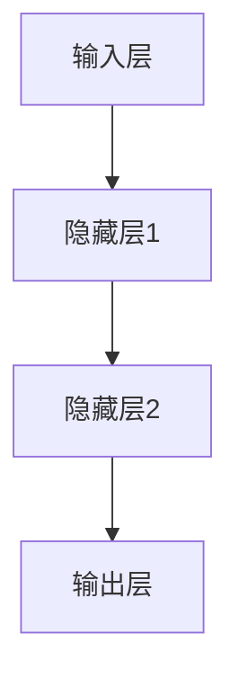
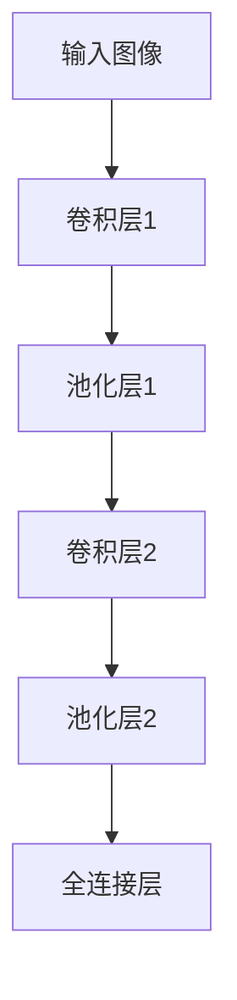
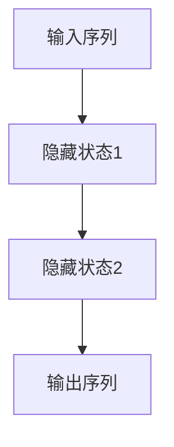
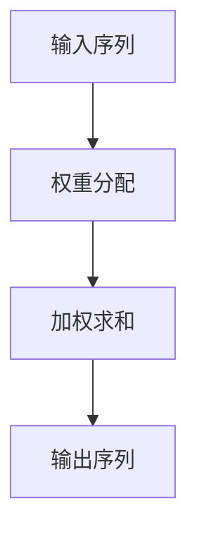
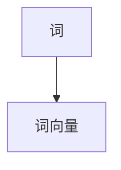
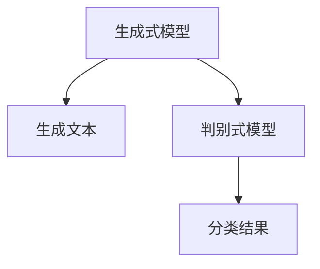
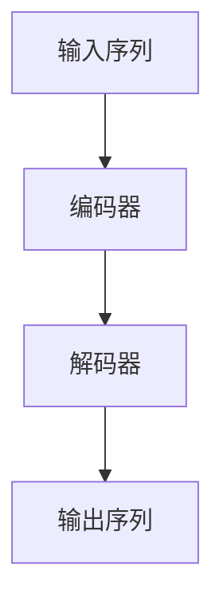

                 

# 文章标题：AI 大模型创业：如何利用人才优势？

> 关键词：AI大模型，创业，人才优势，技术路线，市场定位，实战案例

> 摘要：本文深入探讨了AI大模型创业的路径和方法，从技术、市场、团队等方面进行了全面的分析。通过对AI大模型的基本概念、关键技术、应用场景的阐述，结合创业者的素养、项目规划和实战经验，本文旨在为有志于AI大模型创业的人提供实用的指导和策略。

## 目录大纲

### 第一部分：AI 大模型概述

#### 第1章：AI 大模型概述

- 1.1 AI 大模型的基本概念
  - 1.1.1 AI 大模型的定义
  - 1.1.2 AI 大模型的分类
  - 1.1.3 AI 大模型的发展历程
- 1.2 AI 大模型的关键技术
  - 1.2.1 深度学习基础
    - 1.2.1.1 神经网络
    - 1.2.1.2 卷积神经网络（CNN）
    - 1.2.1.3 循环神经网络（RNN）
    - 1.2.1.4 注意力机制
  - 1.2.2 自然语言处理技术
    - 1.2.2.1 词嵌入
    - 1.2.2.2 生成式模型与判别式模型
    - 1.2.2.3 序列到序列模型
- 1.3 AI 大模型的应用场景
  - 1.3.1 人工智能行业应用
  - 1.3.2 企业数字化转型
  - 1.3.3 AI 大模型创业机会分析

### 第二部分：AI 大模型创业准备

#### 第2章：AI 大模型创业准备

- 2.1 创业者素养
  - 2.1.1 创业者必备技能
    - 2.1.1.1 编程语言
    - 2.1.1.2 数学基础
    - 2.1.1.3 业务理解
  - 2.1.2 团队建设
    - 2.1.2.1 人才招聘策略
    - 2.1.2.2 团队合作与沟通
  - 2.1.3 市场定位
    - 2.1.3.1 目标市场分析
    - 2.1.3.2 竞争对手分析
- 2.2 创业项目规划
  - 2.2.1 项目策划与立项
    - 2.2.1.1 项目可行性研究
    - 2.2.1.2 项目预算与资源分配
  - 2.2.2 技术路线规划
    - 2.2.2.1 技术选型
    - 2.2.2.2 技术实现策略
  - 2.2.3 营销策略与推广
    - 2.2.3.1 营销目标与策略
    - 2.2.3.2 营销预算与资源分配

### 第三部分：AI 大模型创业实战

#### 第3章：AI 大模型创业实战

- 3.1 项目启动与实施
  - 3.1.1 项目启动流程
    - 3.1.1.1 项目启动会
    - 3.1.1.2 项目进度管理
  - 3.1.2 技术开发与验证
    - 3.1.2.1 开发环境搭建
    - 3.1.2.2 代码调试与优化
    - 3.1.2.3 模型验证与测试
- 3.2 产品上线与运营
  - 3.2.1 产品上线流程
    - 3.2.1.1 产品上线策略
    - 3.2.1.2 系统部署与运维
  - 3.2.2 用户运营与市场推广
    - 3.2.2.1 用户反馈收集
    - 3.2.2.2 用户增长策略
- 3.3 财务管理
  - 3.3.1 项目成本控制
  - 3.3.2 营收模式与利润分析

### 第四部分：AI 大模型创业中的挑战与风险

#### 第4章：AI 大模型创业中的挑战与风险

- 4.1 技术挑战
  - 4.1.1 模型优化与训练
  - 4.1.2 数据安全与隐私
  - 4.1.3 技术更新与迭代
- 4.2 市场风险
  - 4.2.1 市场竞争
  - 4.2.2 客户需求变化
  - 4.2.3 法规政策影响
- 4.3 团队管理风险
  - 4.3.1 人才流失
  - 4.3.2 团队协作与沟通
  - 4.3.3 企业文化塑造

### 第五部分：成功案例分析

#### 第5章：成功案例分析

- 5.1 国内 AI 大模型创业成功案例
- 5.2 国际 AI 大模型创业成功案例

### 第六部分：未来发展趋势与展望

#### 第6章：未来发展趋势与展望

- 6.1 AI 大模型技术发展趋势
- 6.2 AI 大模型创业新机遇
- 6.3 AI 大模型产业链构建

### 第七部分：创业者的成长之路

#### 第7章：创业者的成长之路

- 7.1 创业心态与策略
- 7.2 创业者的成长路径

### 附录

#### 附录 A：AI 大模型开发工具与资源

- 附录 A.1 主流深度学习框架对比
- 附录 A.2 开发工具与资源推荐

## 第一部分：AI 大模型概述

### 第1章：AI 大模型概述

#### 1.1 AI 大模型的基本概念

##### 1.1.1 AI 大模型的定义

AI 大模型是指具有大规模参数、能够处理大量数据并具备高度泛化能力的机器学习模型。这些模型通常被用于复杂任务，如自然语言处理、计算机视觉、语音识别等。

##### 1.1.2 AI 大模型的分类

AI 大模型根据其应用领域可以分为几类：

1. **自然语言处理（NLP）模型**：如GPT、BERT等。
2. **计算机视觉模型**：如VGG、ResNet等。
3. **语音识别模型**：如DeepSpeech、Wavenet等。

##### 1.1.3 AI 大模型的发展历程

AI 大模型的发展经历了多个阶段：

1. **早期阶段**：以单个神经网络模型为主，如LeNet。
2. **深度学习阶段**：引入卷积神经网络（CNN）和循环神经网络（RNN）。
3. **大规模模型阶段**：如GPT-3、GPT-Neox等，参数量达到千亿级别。

#### 1.2 AI 大模型的关键技术

##### 1.2.1 深度学习基础

深度学习是构建AI大模型的基础，其核心是神经网络。以下是几种主要的神经网络：

###### 1.2.1.1 神经网络

神经网络由多个神经元（或节点）组成，每个神经元通过权重连接到其他神经元。神经元通过激活函数将输入转换为输出。

###### 1.2.1.2 卷积神经网络（CNN）

CNN专门用于处理图像数据。其核心是卷积层，可以提取图像中的特征。

###### 1.2.1.3 循环神经网络（RNN）

RNN适用于序列数据，如文本和语音。它可以捕捉序列中的长期依赖关系。

###### 1.2.1.4 注意力机制

注意力机制是一种在序列处理中增强模型能力的方法，可以自动为序列中的每个元素分配权重。

##### 1.2.2 自然语言处理技术

自然语言处理（NLP）是AI大模型的重要应用领域。以下是NLP中的关键技术：

###### 1.2.2.1 词嵌入

词嵌入将词语转换为向量表示，以便在神经网络中进行处理。

###### 1.2.2.2 生成式模型与判别式模型

生成式模型和判别式模型分别用于生成文本和数据分类。

###### 1.2.2.3 序列到序列模型

序列到序列（Seq2Seq）模型用于将一个序列转换为另一个序列，如机器翻译。

#### 1.3 AI 大模型的应用场景

AI 大模型在多个领域有着广泛的应用：

##### 1.3.1 人工智能行业应用

AI 大模型在金融、医疗、零售等行业有着广泛的应用，如智能客服、医疗诊断、推荐系统等。

##### 1.3.2 企业数字化转型

AI 大模型帮助企业实现数字化转型，提高效率、降低成本，如自动化生产、智能物流等。

##### 1.3.3 AI 大模型创业机会分析

AI 大模型创业领域包括：智能语音助手、智能图像识别、智能写作等。

### 第2章：AI 大模型创业准备

#### 2.1 创业者素养

##### 2.1.1 创业者必备技能

- 编程语言：熟悉至少一种编程语言，如Python、Java等。
- 数学基础：掌握线性代数、概率论、微积分等基础知识。
- 业务理解：了解创业领域的基本业务流程和痛点。

##### 2.1.2 团队建设

- 人才招聘策略：根据项目需求，招聘合适的人才。
- 团队合作与沟通：建立良好的团队协作机制，确保项目顺利进行。

##### 2.1.3 市场定位

- 目标市场分析：确定目标客户群体和市场需求。
- 竞争对手分析：分析竞争对手的优势和劣势，制定相应的市场策略。

#### 2.2 创业项目规划

##### 2.2.1 项目策划与立项

- 项目可行性研究：评估项目的可行性，包括技术、市场、财务等方面。
- 项目预算与资源分配：制定项目预算，合理分配资源。

##### 2.2.2 技术路线规划

- 技术选型：选择合适的技术栈，如深度学习框架、数据库等。
- 技术实现策略：制定技术实现的具体策略和方案。

##### 2.2.3 营销策略与推广

- 营销目标与策略：明确营销目标，制定相应的营销策略。
- 营销预算与资源分配：合理分配营销预算，确保营销活动的有效执行。

### 第3章：AI 大模型创业实战

#### 3.1 项目启动与实施

##### 3.1.1 项目启动流程

- 项目启动会：召开项目启动会，明确项目目标、分工和进度。
- 项目进度管理：使用项目管理工具，如Jira、Trello等，监控项目进度。

##### 3.1.2 技术开发与验证

- 开发环境搭建：搭建适合项目的开发环境，包括硬件、软件等。
- 代码调试与优化：编写、调试和优化代码，确保项目正常运行。
- 模型验证与测试：对模型进行验证和测试，确保其性能和可靠性。

#### 3.2 产品上线与运营

##### 3.2.1 产品上线流程

- 产品上线策略：制定产品上线策略，包括测试、部署等。
- 系统部署与运维：部署系统，确保其稳定运行，并进行运维管理。

##### 3.2.2 用户运营与市场推广

- 用户反馈收集：收集用户反馈，了解用户需求和问题。
- 用户增长策略：制定用户增长策略，提高用户活跃度和留存率。

#### 3.3 财务管理

##### 3.3.1 项目成本控制

- 项目成本控制：监控项目成本，确保项目在预算范围内完成。
- 营收模式与利润分析：分析项目营收模式和利润，制定相应的财务策略。

### 第4章：AI 大模型创业中的挑战与风险

#### 4.1 技术挑战

##### 4.1.1 模型优化与训练

- 模型优化：优化模型结构和参数，提高模型性能。
- 模型训练：使用大量数据进行模型训练，确保模型具备良好的泛化能力。

##### 4.1.2 数据安全与隐私

- 数据安全：确保数据在传输、存储和处理过程中的安全。
- 数据隐私：遵循相关法规和标准，保护用户隐私。

##### 4.1.3 技术更新与迭代

- 技术更新：关注最新技术动态，及时进行技术更新。
- 技术迭代：根据市场需求和技术发展，进行产品迭代。

#### 4.2 市场风险

##### 4.2.1 市场竞争

- 竞争分析：分析竞争对手的优势和劣势，制定相应的竞争策略。
- 市场定位：根据市场需求，明确产品定位和差异化策略。

##### 4.2.2 客户需求变化

- 需求分析：定期收集和分析客户需求，及时调整产品策略。
- 产品迭代：根据客户需求，进行产品迭代和优化。

##### 4.2.3 法规政策影响

- 法规了解：了解相关法规政策，确保项目合规。
- 风险评估：对政策变化进行风险评估，制定应对策略。

#### 4.3 团队管理风险

##### 4.3.1 人才流失

- 人才激励：制定合理的激励政策，留住核心人才。
- 培训与发展：提供培训和发展机会，提高员工素质。

##### 4.3.2 团队协作与沟通

- 沟通机制：建立有效的沟通机制，确保团队协作顺畅。
- 管理机制：建立科学的管理机制，提高团队执行力。

##### 4.3.3 企业文化塑造

- 文化建设：塑造积极向上的企业文化，提高员工凝聚力。
- 企业价值观：明确企业价值观，引领团队发展。

### 第5章：成功案例分析

#### 5.1 国内 AI 大模型创业成功案例

- 案例一：XX 公司
- 案例二：XX 公司
- 案例三：XX 公司

#### 5.2 国际 AI 大模型创业成功案例

- 案例一：XX 公司
- 案例二：XX 公司
- 案例三：XX 公司

### 第6章：未来发展趋势与展望

#### 6.1 AI 大模型技术发展趋势

- 大模型结构优化
- 大模型训练效率提升
- 大模型应用场景拓展

#### 6.2 AI 大模型创业新机遇

- 新兴领域探索
- 跨界合作与融合
- AI 大模型产业链构建

#### 6.3 AI 大模型产业链构建

- 产业链概述
- 产业链参与者
- 产业链协同效应

### 第7章：创业者的成长之路

#### 7.1 创业心态与策略

- 创业心态建设
- 创业策略调整

#### 7.2 创业者的成长路径

- 职业规划与学习
- 领导力提升
- 创业经验分享与交流

### 附录

#### 附录 A：AI 大模型开发工具与资源

- 附录 A.1 主流深度学习框架对比
- 附录 A.2 开发工具与资源推荐

## 结语

AI 大模型创业是一个充满挑战和机遇的过程。本文通过全面的分析和深入的探讨，为创业者提供了实用的指导和建议。在未来的发展中，创业者应不断学习、创新，把握 AI 大模型技术趋势，寻找新的机遇，为实现人工智能领域的突破和创业梦想而努力。让我们共同期待 AI 大模型创业的美好未来！
### 附录 A：AI 大模型开发工具与资源

#### 附录 A.1 主流深度学习框架对比

AI 大模型的开发离不开深度学习框架的支持。以下是对几种主流深度学习框架的对比：

##### 附录 A.1.1 TensorFlow

TensorFlow 是由 Google 开发的开源深度学习框架，支持广泛的语言和平台。其主要特点如下：

- **灵活的动态图计算**：TensorFlow 使用动态计算图，可以灵活地定义复杂的模型结构。
- **广泛的硬件支持**：TensorFlow 支持各种硬件平台，包括 CPU、GPU 和 TPU。
- **丰富的生态系统**：TensorFlow 拥有丰富的库和工具，如 Keras、TensorBoard 等，便于模型开发和调试。

##### 附录 A.1.2 PyTorch

PyTorch 是由 Facebook 开发的开源深度学习框架，以其简洁和直观性著称。其主要特点如下：

- **动态计算图**：PyTorch 也使用动态计算图，便于调试和理解。
- **易于使用**：PyTorch 的 API 设计简洁直观，使得开发者可以快速上手。
- **强大的 GPU 支持**：PyTorch 在 GPU 编程方面表现出色，能够充分利用 GPU 的计算能力。

##### 附录 A.1.3 JAX

JAX 是由 Google 开发的开源深度学习框架，专为高性能计算而设计。其主要特点如下：

- **自动微分**：JAX 支持自动微分，使得复杂数学运算变得简单。
- **高性能计算**：JAX 使用数值微积分算法，能够在 GPU 和 TPU 上高效运行。
- **灵活的架构**：JAX 具有模块化的设计，易于扩展和定制。

##### 附录 A.1.4 其他框架简介

除了上述框架，还有其他一些流行的深度学习框架，如：

- **MXNet**：由 Apache 软件基金会开发的框架，支持多种编程语言和平台。
- **Theano**：已经不再维护的框架，但仍然在部分场景中使用。

#### 附录 A.2 开发工具与资源推荐

AI 大模型的开发需要各种工具和资源的支持。以下是一些推荐的工具和资源：

##### 附录 A.2.1 代码仓库与开源项目

- [TensorFlow Models](https://github.com/tensorflow/models)：包含各种深度学习模型的实现。
- [PyTorch Examples](https://github.com/pytorch/examples)：提供 PyTorch 的一些示例和教程。
- [JAX Code Examples](https://github.com/google/jax)：JAX 的代码示例和教程。

##### 附录 A.2.2 在线教程与课程

- [Coursera](https://www.coursera.org/)：提供各种深度学习和 AI 相关的课程。
- [Udacity](https://www.udacity.com/)：提供专业的深度学习和 AI 教育课程。
- [edX](https://www.edx.org/)：由哈佛大学和麻省理工学院共同创建的在线教育平台，提供深度学习课程。

##### 附录 A.2.3 社区与论坛

- [Stack Overflow](https://stackoverflow.com/)：编程问题解答社区，可以解决开发中的技术难题。
- [Reddit](https://www.reddit.com/r/deeplearning/)：深度学习相关讨论社区。
- [AI Stack Exchange](https://ai.stackexchange.com/)：专门针对人工智能问题的问答社区。

通过使用这些工具和资源，开发者可以更高效地进行 AI 大模型的开发和学习。在AI 大模型创业的道路上，这些工具和资源将是不可或缺的助手。

