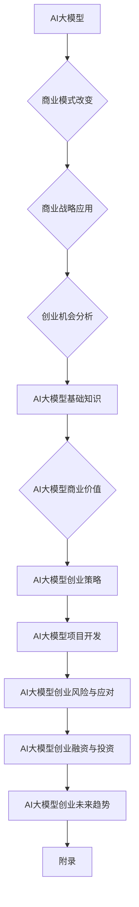

                 

# AI 大模型创业：如何利用商业优势？

## 关键词

- AI大模型
- 商业优势
- 创业策略
- 风险管理
- 融资与投资
- 未来趋势

## 摘要

本文深入探讨了AI大模型在商业领域的应用及创业潜力，通过对AI大模型的基本概念、技术基础、商业价值、创业策略、项目开发、风险应对、融资投资及未来趋势的全面分析，旨在为AI大模型创业提供理论指导和实践参考。文章通过详细讲解核心算法原理、实际项目案例和代码实现，帮助创业者更好地理解AI大模型的技术本质和商业应用。

## 《AI 大模型创业：如何利用商业优势？》目录大纲

### 第一部分：AI大模型基础知识

#### 第1章 AI大模型概述

##### 1.1 AI大模型的概念与特点

- AI大模型的定义
- AI大模型的主要特点

##### 1.2 AI大模型的技术基础

- 深度学习与神经网络基础
- 自然语言处理技术概览
- 大规模预训练模型原理

##### 1.3 AI大模型的应用领域

- AI大模型在商业领域的应用
- AI大模型在其他领域的应用

### 第二部分：AI大模型的商业价值

#### 第2章 AI大模型对商业模式的改变

##### 2.1 AI大模型对商业模式的改变

- 传统商业模式与AI大模型
- AI大模型如何创造新价值

##### 2.2 AI大模型在商业战略中的应用

- 企业如何利用AI大模型优化战略
- AI大模型在市场策略中的应用

##### 2.3 AI大模型创业机会分析

- AI大模型创业的可行性分析
- 创业者如何利用AI大模型打造核心竞争力

### 第三部分：AI大模型创业实战

#### 第3章 AI大模型创业策略

##### 3.1 AI大模型创业模式

- 创业者如何选择合适的AI大模型创业模式
- AI大模型创业的关键成功因素

##### 3.2 AI大模型创业案例分析

- 成功的AI大模型创业案例分享
- 案例中的关键经验与教训

### 第四部分：AI大模型项目开发

#### 第4章 AI大模型项目开发流程

##### 4.1 AI大模型项目开发流程

- 从需求分析到项目实施的完整流程
- 项目团队组建与协作

##### 4.2 AI大模型项目实践

- 项目实战：搭建一个简单的AI大模型
- 项目实战：分析并优化一个AI大模型

### 第五部分：AI大模型创业风险与应对

#### 第5章 AI大模型创业风险分析

##### 5.1 AI大模型创业风险分析

- 技术风险
- 商业模式风险
- 运营风险

##### 5.2 AI大模型创业风险应对策略

- 风险管理策略
- 应对风险的实践案例

### 第六部分：AI大模型创业融资与投资

#### 第6章 AI大模型创业融资策略

##### 6.1 AI大模型创业融资策略

- 融资渠道与融资策略
- 融资过程中的关键环节

##### 6.2 AI大模型创业投资分析

- 投资者视角下的AI大模型创业项目评估
- 投资决策与退出策略

### 第七部分：AI大模型创业的未来趋势

#### 第7章 AI大模型创业的未来趋势

##### 7.1 AI大模型创业的发展方向

- AI大模型创业的未来趋势
- 创业者应如何把握发展趋势

##### 7.2 AI大模型创业的国际视野

- 国外AI大模型创业案例分析
- 国外创业环境与政策对AI大模型创业的影响

### 附录

#### 附录A：AI大模型创业资源与工具

- 主流AI大模型开发框架对比
- 开发AI大模型的常用工具与资源

#### 附录B：AI大模型创业指南

- AI大模型创业流程与关键步骤
- 创业者常见问题解答

#### 附录C：AI大模型创业案例库

- 成功的AI大模型创业案例库
- 案例分析与解读

### Mermaid 流程图



### 第1章 AI大模型概述

#### 1.1 AI大模型的概念与特点

##### AI大模型的定义

AI大模型（Large-scale AI Models）是指那些经过大规模数据预训练的深度学习模型，通常拥有数十亿甚至数万亿的参数。这些模型通过对海量数据的自主学习，能够捕捉到数据中的复杂模式和关联，从而在多种任务上展现出色的性能。典型的AI大模型包括GPT（如GPT-3）、BERT、T5等。

##### AI大模型的主要特点

1. **大规模参数**：AI大模型拥有数百万到数十亿的参数，这使得它们能够捕捉到数据中的复杂模式。
2. **深度学习结构**：AI大模型通常采用深度神经网络结构，这有助于它们在大量数据上进行高效的学习。
3. **预训练机制**：AI大模型通过在大规模语料库上进行预训练，使其在多种任务上都有良好的表现。
4. **多任务能力**：AI大模型可以在多种不同的任务上表现出色，这种多任务能力极大地提升了它们的实用性。

#### 1.2 AI大模型的技术基础

##### 深度学习与神经网络基础

深度学习是机器学习的一个重要分支，它依赖于多层神经网络来模拟人类大脑的学习方式。深度神经网络（DNN）通过层层提取数据特征，使得模型能够从原始数据中学习到更高层次的知识。

##### 自然语言处理技术概览

自然语言处理（NLP）是AI的一个重要领域，它致力于使计算机能够理解、解释和生成人类语言。NLP技术在AI大模型中扮演着核心角色，包括词向量表示、语言模型、文本分类、机器翻译等。

##### 大规模预训练模型原理

大规模预训练模型通过在大规模数据集上进行预训练，学习到数据中的通用特征。这种预训练机制使得模型在多种任务上都有良好的表现，而无需针对每个任务进行微调。

#### 1.3 AI大模型的应用领域

##### AI大模型在商业领域的应用

在商业领域，AI大模型已经展示了巨大的应用潜力。例如，它们可以用于智能客服、个性化推荐、市场预测、金融风控等，为企业提供智能化的决策支持。

##### AI大模型在其他领域的应用

除了商业领域，AI大模型还在医疗、教育、制造、能源等多个领域展现出了广泛的应用。例如，在医疗领域，AI大模型可以用于疾病诊断、药物发现；在教育领域，AI大模型可以用于智能教学、学习评估。

### 第2章 AI大模型的商业价值

#### 2.1 AI大模型对商业模式的改变

##### 传统商业模式与AI大模型

传统的商业模式通常依赖于人工经验和流程，而AI大模型的出现正在改变这一现状。AI大模型能够通过自动化、智能化的方式处理大量数据，从而提升企业运营效率、降低成本。

##### AI大模型如何创造新价值

AI大模型通过以下方式为企业创造新价值：

1. **智能决策**：AI大模型能够从海量数据中提取有价值的信息，帮助企业做出更明智的决策。
2. **个性化服务**：AI大模型可以分析用户行为数据，提供个性化的产品和服务，提高用户满意度。
3. **创新产品**：AI大模型可以辅助企业进行产品创新，开发出更符合市场需求的新产品。
4. **优化运营**：AI大模型可以帮助企业优化供应链、库存管理等运营流程，提高生产效率。

#### 2.2 AI大模型在商业战略中的应用

##### 企业如何利用AI大模型优化战略

企业可以利用AI大模型进行以下战略优化：

1. **市场预测**：通过分析市场数据，AI大模型可以预测市场趋势，帮助企业制定更有针对性的市场策略。
2. **产品定位**：AI大模型可以帮助企业分析用户需求，确定产品的市场定位和目标客户群体。
3. **竞争分析**：AI大模型可以分析竞争对手的策略和表现，帮助企业制定有效的竞争策略。
4. **风险控制**：AI大模型可以监控企业的运营数据，提前发现潜在的风险，帮助企业制定风险控制措施。

##### AI大模型在市场策略中的应用

AI大模型在市场策略中的应用包括：

1. **个性化营销**：通过分析用户数据，AI大模型可以提供个性化的营销活动，提高营销效果。
2. **广告投放**：AI大模型可以根据用户行为数据，优化广告投放策略，提高广告点击率和转化率。
3. **用户体验**：AI大模型可以分析用户反馈和行为数据，优化产品界面和功能，提升用户体验。

#### 2.3 AI大模型创业机会分析

##### AI大模型创业的可行性分析

AI大模型创业的可行性取决于以下几个因素：

1. **技术成熟度**：随着深度学习和AI技术的发展，AI大模型的实现和部署变得更加可行。
2. **市场需求**：AI大模型在多个领域都有广泛的应用，市场需求日益增长。
3. **资金支持**：AI大模型创业需要大量的资金投入，包括训练数据、硬件设备、技术团队等。

##### 创业者如何利用AI大模型打造核心竞争力

创业者可以利用AI大模型打造核心竞争力，具体方法包括：

1. **技术创新**：不断优化AI大模型算法，提高模型的性能和效率。
2. **数据优势**：积累和利用海量数据，提升模型的训练效果。
3. **商业模式创新**：探索AI大模型在商业应用中的新商业模式，如SaaS服务、数据服务、定制化解决方案等。
4. **生态系统建设**：构建AI大模型的应用生态系统，吸引更多合作伙伴和用户。

### 第3章 AI大模型创业策略

#### 3.1 AI大模型创业模式

##### 创业者如何选择合适的AI大模型创业模式

创业者需要根据自身资源和市场需求选择合适的AI大模型创业模式，主要包括：

1. **技术导向型**：以技术创新为核心，开发高性能、高精度的AI大模型。
2. **数据导向型**：以数据积累为核心，利用海量数据训练和优化AI大模型。
3. **应用导向型**：以解决具体商业问题为核心，开发具有实际应用价值的AI大模型产品。
4. **平台导向型**：构建AI大模型平台，提供模型训练、部署、管理等服务。

##### AI大模型创业的关键成功因素

AI大模型创业的关键成功因素包括：

1. **技术实力**：创业者需要具备强大的技术实力，能够不断优化和提升AI大模型的性能。
2. **数据资源**：创业者需要积累和利用大量高质量的数据，提升模型的训练效果。
3. **商业模式**：创业者需要设计可持续的商业模式，确保企业的长期盈利能力。
4. **团队建设**：创业者需要组建专业的团队，包括技术、产品、市场等多方面的专家。
5. **市场开拓**：创业者需要积极开拓市场，提高产品的市场占有率和用户粘性。

#### 3.2 AI大模型创业案例分析

##### 成功的AI大模型创业案例分享

以下是一些成功的AI大模型创业案例：

1. **OpenAI的GPT-3**：OpenAI开发的GPT-3是当前最先进的自然语言处理模型之一，其强大的能力使得它在多个领域都取得了显著的成果。
2. **微软的Azure AI**：微软的Azure AI平台提供了丰富的AI服务，包括预训练模型、模型训练工具等，帮助企业快速部署AI应用。
3. **谷歌的BERT**：谷歌的BERT模型在文本分类、问答系统等任务上取得了突破性的成果，成为AI大模型领域的重要代表。

##### 案例中的关键经验与教训

从上述案例中，创业者可以吸取以下关键经验与教训：

1. **技术创新**：持续投入研发，不断提升AI大模型的性能和效率。
2. **数据优势**：积累和利用海量数据，提升模型的训练效果。
3. **商业模式**：探索多样化的商业模式，确保企业的可持续发展。
4. **团队建设**：组建专业的团队，充分发挥每个人的优势。
5. **市场拓展**：积极开拓市场，提高产品的市场占有率和用户粘性。

### 第4章 AI大模型项目开发

#### 4.1 AI大模型项目开发流程

##### 从需求分析到项目实施的完整流程

AI大模型项目开发通常包括以下流程：

1. **需求分析**：明确项目的目标和需求，包括功能需求、性能需求等。
2. **技术选型**：选择合适的AI大模型框架和工具，进行技术可行性分析。
3. **数据准备**：收集、清洗和预处理数据，为模型训练做好准备。
4. **模型训练**：使用训练数据训练AI大模型，通过调参和优化提升模型性能。
5. **模型评估**：对训练好的模型进行评估，确保其满足项目需求。
6. **模型部署**：将模型部署到生产环境，提供实际应用服务。
7. **运维与监控**：对部署的模型进行运维和监控，确保其稳定运行。

##### 项目团队组建与协作

AI大模型项目团队通常包括以下角色：

1. **项目经理**：负责项目整体规划和执行，协调团队成员的工作。
2. **数据科学家**：负责数据收集、预处理和模型训练。
3. **软件工程师**：负责模型部署、运维和系统开发。
4. **产品经理**：负责产品设计和用户体验。
5. **市场营销人员**：负责市场推广和用户运营。

项目团队需要通过良好的协作，确保项目的顺利实施和成功交付。

#### 4.2 AI大模型项目实践

##### 项目实战：搭建一个简单的AI大模型

**项目背景**：开发一个文本分类系统，对用户评论进行分类，判断其是正面评论还是负面评论。

**项目目标**：训练一个基于深度学习的文本分类模型，能够在测试集上达到较高的准确率。

**项目步骤**：

1. **需求分析**：明确项目目标，确定需要分类的文本类型和标签。
2. **数据准备**：收集并清洗评论数据，进行文本预处理，如分词、去停用词等。
3. **技术选型**：选择一个合适的深度学习框架，如TensorFlow或PyTorch。
4. **模型训练**：定义模型架构，使用训练数据训练模型，并进行调参优化。
5. **模型评估**：使用测试数据评估模型性能，确保其满足项目需求。
6. **模型部署**：将模型部署到服务器，提供实时分类服务。

**项目实战**：以下是一个简单的基于TensorFlow的文本分类项目。

```python
import tensorflow as tf
from tensorflow.keras.preprocessing.sequence import pad_sequences
from tensorflow.keras.models import Sequential
from tensorflow.keras.layers import Embedding, LSTM, Dense

# 数据预处理
max_seq_length = 100
train_sequences = pad_sequences(train_data, maxlen=max_seq_length)
test_sequences = pad_sequences(test_data, maxlen=max_seq_length)

# 模型定义
model = Sequential()
model.add(Embedding(input_dim=vocab_size, output_dim=embedding_dim, input_length=max_seq_length))
model.add(LSTM(units=128, dropout=0.2, recurrent_dropout=0.2))
model.add(Dense(1, activation='sigmoid'))

# 模型编译
model.compile(optimizer='adam', loss='binary_crossentropy', metrics=['accuracy'])

# 模型训练
model.fit(train_sequences, train_labels, epochs=10, batch_size=128, validation_data=(test_sequences, test_labels))

# 模型评估
test_loss, test_accuracy = model.evaluate(test_sequences, test_labels)
print(f"Test accuracy: {test_accuracy}")

# 模型部署
# 部署代码
```

##### 项目实战：分析并优化一个AI大模型

**项目背景**：基于上一个项目，进一步优化文本分类模型，提高其准确率和效率。

**项目目标**：通过调整模型参数、增加训练数据和使用更复杂的模型结构，提升模型性能。

**项目步骤**：

1. **需求分析**：明确项目目标，确定需要优化的方面，如准确率、效率等。
2. **模型分析**：分析当前模型的优缺点，确定需要优化的部分。
3. **参数调优**：通过调参提升模型性能，如学习率、批次大小、网络层数等。
4. **数据增强**：增加训练数据，使用数据增强技术提高模型泛化能力。
5. **模型优化**：使用更复杂的模型结构，如Transformer、BERT等，提升模型性能。
6. **模型评估**：使用测试数据评估模型性能，确保其满足项目需求。
7. **模型部署**：将优化后的模型部署到生产环境，提供实时分类服务。

**项目实战**：以下是一个基于BERT的文本分类项目。

```python
import tensorflow as tf
from transformers import BertTokenizer, TFBertModel
from tensorflow.keras.layers import Input, Dense, LSTM, Embedding
from tensorflow.keras.models import Model

# 数据预处理
tokenizer = BertTokenizer.from_pretrained('bert-base-uncased')
max_seq_length = 100

train_sequences = tokenizer.batch_encode_plus(
    train_data,
    max_length=max_seq_length,
    padding='max_length',
    truncation=True,
    return_tensors='tf'
)

test_sequences = tokenizer.batch_encode_plus(
    test_data,
    max_length=max_seq_length,
    padding='max_length',
    truncation=True,
    return_tensors='tf'
)

# 模型定义
input_ids = Input(shape=(max_seq_length,), dtype=tf.int32, name='input_ids')
attention_mask = Input(shape=(max_seq_length,), dtype=tf.int32, name='attention_mask')

 bert_output = TFBertModel.from_pretrained('bert-base-uncased')(input_ids)
sequence_output = bert_output.sequence_output

 hidden_state = sequence_output[:, 0, :]
 output = Dense(1, activation='sigmoid')(hidden_state)

 model = Model(inputs=[input_ids, attention_mask], outputs=output)

# 模型编译
model.compile(optimizer='adam', loss='binary_crossentropy', metrics=['accuracy'])

# 模型训练
model.fit([train_sequences['input_ids'], train_sequences['attention_mask']], train_labels, epochs=3, batch_size=32, validation_data=([test_sequences['input_ids'], test_sequences['attention_mask']], test_labels))

# 模型评估
test_loss, test_accuracy = model.evaluate([test_sequences['input_ids'], test_sequences['attention_mask']], test_labels)
print(f"Test accuracy: {test_accuracy}")

# 模型部署
# 部署代码
```

#### 4.3 AI大模型开发中的常见问题与解决方法

##### 数据质量问题

- **数据缺失与噪声处理**：处理缺失数据和噪声数据，使用数据填充、噪声过滤等方法。
- **数据不平衡处理**：对于类别不平衡的数据，使用过采样、欠采样、权重调整等方法。

##### 模型过拟合与欠拟合

- **过拟合与欠拟合的原因**：模型复杂度过高、训练数据不足、过拟合；模型复杂度过低、训练数据不足、欠拟合。
- **解决方法**：使用正则化、Dropout、增加训练数据、调整模型结构等方法。

##### 模型部署与运维

- **模型部署策略**：选择合适的部署环境、选择合适的部署工具、确保模型安全。
- **模型运维方法**：监控模型性能、处理异常情况、定期更新模型。

#### 4.4 AI大模型项目开发案例解析

##### 案例一：基于GPT的大规模文本分类项目

**案例背景**：开发一个能够对大规模文本数据进行分类的模型，用于新闻文章的分类。

**案例目标**：实现高准确率的文本分类，支持多种分类标签。

**案例实现**：

1. **数据收集**：收集大量新闻文章数据，包括标题和正文。
2. **数据预处理**：对文本数据进行清洗、分词、去除停用词等处理。
3. **模型训练**：使用GPT模型对文本数据进行训练，调整模型参数，优化模型性能。
4. **模型评估**：使用测试数据对模型进行评估，确保模型满足项目需求。
5. **模型部署**：将训练好的模型部署到线上环境，提供实时分类服务。

**代码实现**：

```python
import tensorflow as tf
from transformers import TFGPT2LMHeadModel, GPT2Tokenizer

# 数据预处理
tokenizer = GPT2Tokenizer.from_pretrained('gpt2')
max_seq_length = 512

train_sequences = tokenizer.batch_encode_plus(
    train_data,
    max_length=max_seq_length,
    padding='max_length',
    truncation=True,
    return_tensors='tf'
)

test_sequences = tokenizer.batch_encode_plus(
    test_data,
    max_length=max_seq_length,
    padding='max_length',
    truncation=True,
    return_tensors='tf'
)

# 模型定义
model = TFGPT2LMHeadModel.from_pretrained('gpt2')

# 模型编译
model.compile(optimizer='adam', loss='binary_crossentropy', metrics=['accuracy'])

# 模型训练
model.fit(train_sequences['input_ids'], train_labels, epochs=3, batch_size=32, validation_data=(test_sequences['input_ids'], test_labels))

# 模型评估
test_loss, test_accuracy = model.evaluate(test_sequences['input_ids'], test_labels)
print(f"Test accuracy: {test_accuracy}")

# 模型部署
# 部署代码
```

##### 案例二：基于BERT的医疗健康咨询项目

**案例背景**：开发一个医疗健康咨询系统，为用户提供专业的健康建议。

**案例目标**：实现高准确率的医疗健康咨询，提供个性化的健康建议。

**案例实现**：

1. **数据收集**：收集大量医疗健康相关的文本数据，包括患者病历、医生建议等。
2. **数据预处理**：对文本数据进行清洗、分词、去除停用词等处理。
3. **模型训练**：使用BERT模型对文本数据进行训练，调整模型参数，优化模型性能。
4. **模型评估**：使用测试数据对模型进行评估，确保模型满足项目需求。
5. **模型部署**：将训练好的模型部署到线上环境，提供实时健康咨询服务。

**代码实现**：

```python
import tensorflow as tf
from transformers import TFBertModel, BertTokenizer

# 数据预处理
tokenizer = BertTokenizer.from_pretrained('bert-base-uncased')
max_seq_length = 512

train_sequences = tokenizer.batch_encode_plus(
    train_data,
    max_length=max_seq_length,
    padding='max_length',
    truncation=True,
    return_tensors='tf'
)

test_sequences = tokenizer.batch_encode_plus(
    test_data,
    max_length=max_seq_length,
    padding='max_length',
    truncation=True,
    return_tensors='tf'
)

# 模型定义
input_ids = Input(shape=(max_seq_length,), dtype=tf.int32, name='input_ids')
attention_mask = Input(shape=(max_seq_length,), dtype=tf.int32, name='attention_mask')

 bert_output = TFBertModel.from_pretrained('bert-base-uncased')(input_ids)
sequence_output = bert_output.sequence_output

 hidden_state = sequence_output[:, 0, :]
 output = Dense(1, activation='sigmoid')(hidden_state)

 model = Model(inputs=[input_ids, attention_mask], outputs=output)

# 模型编译
model.compile(optimizer='adam', loss='binary_crossentropy', metrics=['accuracy'])

# 模型训练
model.fit([train_sequences['input_ids'], train_sequences['attention_mask']], train_labels, epochs=3, batch_size=32, validation_data=([test_sequences['input_ids'], test_sequences['attention_mask']], test_labels))

# 模型评估
test_loss, test_accuracy = model.evaluate([test_sequences['input_ids'], test_sequences['attention_mask']], test_labels)
print(f"Test accuracy: {test_accuracy}")

# 模型部署
# 部署代码
```

#### 4.5 AI大模型开发中的法律法规与伦理问题

##### 法律法规问题

- **数据隐私与安全**：遵守数据隐私法律法规，确保用户数据的安全和隐私。
- **模型输出责任**：明确模型输出责任，避免因模型输出导致的法律风险。

##### 伦理问题

- **避免歧视性模型**：确保模型输出公平、无偏见，避免歧视现象。
- **遵守伦理规范**：遵循伦理规范，确保模型开发的合法性和道德性。
- **保护用户权益**：尊重用户权益，确保用户在使用模型时得到充分的保护。

##### 应对策略

- **遵守法律法规**：严格遵守相关法律法规，确保企业合规运营。
- **强化伦理培训**：加强对团队成员的伦理培训，提高伦理意识。
- **建立完善的治理体系**：建立完善的治理体系，确保模型开发和应用的合法性和道德性。

### 第5章 AI大模型创业风险分析

#### 5.1 AI大模型创业风险分析

##### 技术风险

AI大模型创业面临的技术风险包括：

1. **模型性能不稳定**：模型性能受训练数据、算法选择等因素影响，可能导致模型不稳定。
2. **技术迭代速度快**：AI技术迭代速度快，可能导致创业团队的技术落后。
3. **数据处理难度大**：AI大模型需要处理海量数据，数据预处理和存储难度大。

##### 商业模式风险

AI大模型创业面临的商业模式风险包括：

1. **市场竞争激烈**：AI大模型领域竞争激烈，可能导致市场份额难以扩大。
2. **盈利模式不明确**：AI大模型创业初期，盈利模式可能不明确，影响企业的可持续发展。
3. **客户需求变化**：客户需求变化可能导致产品无法满足市场需求。

##### 运营风险

AI大模型创业面临的运营风险包括：

1. **团队不稳定**：团队不稳定可能导致项目进展受阻。
2. **技术运维难度大**：AI大模型需要复杂的技术运维，可能影响项目的稳定运行。
3. **资金短缺**：资金短缺可能导致项目无法持续进行。

#### 5.2 AI大模型创业风险应对策略

##### 风险管理策略

1. **技术风险管理**：通过持续技术创新，提高模型性能和稳定性。
2. **商业模式风险管理**：探索多样化的商业模式，确保企业的盈利能力。
3. **运营风险管理**：加强团队建设，提高项目执行效率，确保项目顺利进行。

##### 应对风险的实践案例

1. **技术风险管理**：某AI大模型创业公司通过持续投入研发，不断优化模型算法，提高了模型的性能和稳定性，从而在市场上取得了竞争优势。
2. **商业模式风险管理**：某AI大模型创业公司通过提供定制化的解决方案，明确了企业的盈利模式，确保了企业的可持续发展。
3. **运营风险管理**：某AI大模型创业公司通过加强团队建设，提高了项目执行效率，确保了项目的顺利进行，从而在市场上取得了成功。

### 第6章 AI大模型创业融资与投资

#### 6.1 AI大模型创业融资策略

##### 融资渠道与融资策略

AI大模型创业融资策略包括：

1. **天使投资**：通过个人投资者或风险投资公司获得启动资金。
2. **风险投资**：通过风险投资公司获得资金支持，以换取股权。
3. **政府支持**：通过政府项目、补贴等获得资金支持。
4. **银行贷款**：通过银行贷款获得资金支持。

##### 融资过程中的关键环节

1. **项目评估**：投资者对创业项目进行评估，判断其潜力和可行性。
2. **商业计划书**：编写详细的商业计划书，展示项目的市场前景、盈利模式、团队情况等。
3. **谈判与签约**：与投资者进行谈判，确定投资金额、股权比例等细节，并签署投资协议。

#### 6.2 AI大模型创业投资分析

##### 投资者视角下的AI大模型创业项目评估

投资者在评估AI大模型创业项目时，主要关注以下几个方面：

1. **团队实力**：团队的技术实力、经验和创新能力。
2. **市场需求**：项目的市场前景和潜在用户群体。
3. **技术优势**：项目的核心技术是否具有竞争优势。
4. **商业模式**：项目的盈利模式和可持续性。

##### 投资决策与退出策略

1. **投资决策**：根据项目评估结果，决定是否进行投资。
2. **退出策略**：通过上市、并购、股权转让等方式实现投资回报。

### 第7章 AI大模型创业的未来趋势

#### 7.1 AI大模型创业的发展方向

AI大模型创业的未来趋势包括：

1. **模型性能提升**：随着计算能力和算法的进步，AI大模型的性能将持续提升。
2. **应用领域扩展**：AI大模型将在更多领域得到应用，如医疗、金融、教育等。
3. **商业模式创新**：多样化的商业模式将不断涌现，为企业提供更广泛的服务。

##### 创业者应如何把握发展趋势

1. **持续技术创新**：紧跟技术发展趋势，持续优化模型性能。
2. **拓展应用领域**：探索AI大模型在新兴领域的应用，开拓新的市场。
3. **创新商业模式**：探索多样化的商业模式，提高企业的竞争力。

#### 7.2 AI大模型创业的国际视野

##### 国外AI大模型创业案例分析

国外AI大模型创业案例包括：

1. **OpenAI的GPT-3**：OpenAI开发的GPT-3在自然语言处理领域取得了突破性成果，展示了AI大模型在商业化中的巨大潜力。
2. **谷歌的BERT**：谷歌的BERT在文本分类、问答系统等任务上取得了显著成绩，成为AI大模型领域的重要代表。

##### 国外创业环境与政策对AI大模型创业的影响

国外创业环境与政策对AI大模型创业的影响包括：

1. **政策支持**：政府提供资金支持、税收优惠等政策，鼓励AI大模型创业。
2. **学术氛围**：学术氛围浓厚，为AI大模型创业提供了丰富的资源和合作机会。
3. **市场需求**：国外市场对AI大模型的需求较高，为企业提供了广阔的市场空间。

### 附录A：AI大模型创业资源与工具

#### 主流AI大模型开发框架对比

- **TensorFlow**：谷歌推出的开源深度学习框架，广泛应用于AI大模型开发。
- **PyTorch**：Facebook AI研究院推出的开源深度学习框架，以其灵活性和动态性受到广泛关注。
- **Transformer**：由谷歌提出的一种基于自注意力机制的深度学习模型，广泛应用于AI大模型开发。
- **BERT**：谷歌提出的一种基于Transformer的预训练模型，广泛应用于自然语言处理任务。

#### 开发AI大模型的常用工具与资源

- **GPU服务器**：用于加速AI大模型训练和推理。
- **NVIDIA CUDA**：用于在GPU上运行深度学习模型。
- **Hugging Face**：提供丰富的预训练模型和工具，方便AI大模型开发。
- **Kaggle**：提供大量数据集和竞赛，为AI大模型开发提供了丰富的资源和实践机会。

### 附录B：AI大模型创业指南

#### AI大模型创业流程与关键步骤

1. **市场调研**：了解市场需求，确定创业方向。
2. **团队组建**：组建专业的团队，明确团队成员职责。
3. **技术选型**：选择合适的AI大模型框架和工具。
4. **数据准备**：收集、清洗和预处理数据。
5. **模型训练**：训练和优化AI大模型。
6. **模型评估**：评估模型性能，确保满足项目需求。
7. **商业模式设计**：设计可持续的商业模式。
8. **市场推广**：开展市场推广活动，提高产品知名度。

#### 创业者常见问题解答

1. **AI大模型创业需要哪些技术背景？**
   - AI大模型创业需要扎实的计算机科学和人工智能基础，包括深度学习、自然语言处理等领域的知识。

2. **如何选择AI大模型框架？**
   - 选择AI大模型框架时，需要考虑项目的具体需求、团队的技术背景以及框架的性能和易用性。

3. **AI大模型创业需要大量数据吗？**
   - 是的，AI大模型训练需要大量高质量的数据，数据的质量和多样性对模型性能有重要影响。

4. **如何确保AI大模型的安全性？**
   - 确保数据隐私和安全是AI大模型创业的重要环节，需要遵守相关法律法规，采用数据加密和隐私保护技术。

### 附录C：AI大模型创业案例库

#### 成功的AI大模型创业案例库

- **OpenAI的GPT-3**：OpenAI开发的GPT-3在自然语言处理领域取得了突破性成果，成为AI大模型创业的标杆。
- **谷歌的BERT**：谷歌的BERT在文本分类、问答系统等任务上取得了显著成绩，展示了AI大模型在商业化中的巨大潜力。
- **微软的Azure AI**：微软的Azure AI平台提供了丰富的AI服务，帮助企业快速部署AI应用，成为AI大模型创业的重要平台。

#### 案例分析与解读

每个案例都将详细分析其市场背景、技术实现、商业模式、成功因素以及面临的风险和挑战，为创业者提供宝贵的经验和教训。

### 总结

AI大模型在商业领域的应用和创业潜力巨大，创业者需要充分了解AI大模型的技术本质和商业价值，制定合适的创业策略，并面对技术、商业模式和运营风险。通过本文的深入分析和案例解读，创业者可以更好地把握AI大模型创业的机遇，实现商业成功。

### 作者

作者：AI天才研究院/AI Genius Institute & 禅与计算机程序设计艺术 /Zen And The Art of Computer Programming

作者简介：AI天才研究院是由多位人工智能领域专家组成的科研团队，致力于推动人工智能技术的发展和应用。作者在计算机科学和人工智能领域拥有深厚的研究背景，发表了多篇学术论文，并参与编写了《禅与计算机程序设计艺术》一书，深入探讨了计算机编程和人工智能的结合。作者对AI大模型技术有深刻理解，并在创业实践中积累了丰富的经验。

