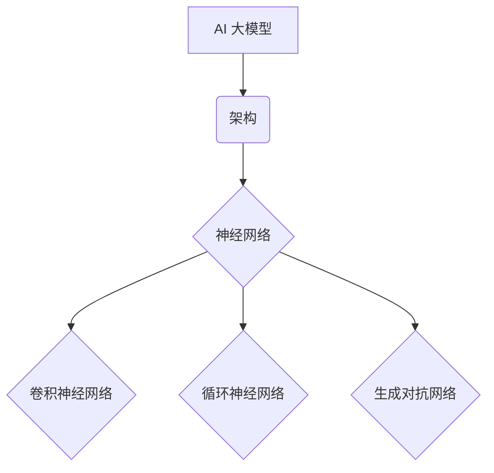

                 

### 《AI 大模型创业：如何利用渠道优势？》

> 关键词：AI大模型、创业、渠道优势、商业模式、项目管理、案例分析、未来展望

> 摘要：本文旨在探讨AI大模型创业中的渠道优势及其利用策略。通过梳理AI大模型的基础知识，分析创业实践中的关键环节，结合实际案例，为创业者提供一整套系统的思考和操作指南，助力他们在竞争激烈的市场中脱颖而出。

---

## 前言

近年来，人工智能（AI）技术取得了前所未有的突破，尤其是大模型（Large-scale Model）的崛起，为各行各业带来了深远的变革。从自然语言处理到图像识别，从推荐系统到自动驾驶，大模型的应用无处不在。与此同时，越来越多的创业者瞄准了这一领域，希望通过AI大模型技术实现商业价值的跃升。然而，创业之路并非一帆风顺，如何在激烈的市场竞争中找到突破口，成为众多创业者面临的共同问题。

本文将围绕“AI大模型创业：如何利用渠道优势？”这一主题，进行深入探讨。首先，我们将回顾AI大模型的基础知识，包括其基本概念、发展历程和技术架构。接着，本文将分析AI大模型创业的现状、机遇与挑战，探讨创业者应如何把握市场动态，制定合适的商业模式。随后，我们将详细讨论创业策略和项目管理，包括市场调研、团队建设、资源获取等方面。此外，本文还将通过实际案例，解析成功创业公司的经验与教训。最后，本文将对AI大模型创业的未来趋势进行展望，探讨可能面临的法律法规与伦理问题，以及应对策略。

希望通过本文的阅读，能够为AI大模型创业者的实践提供有益的参考，助力他们在这一充满机遇与挑战的领域中取得成功。

### AI大模型基础

#### 第1章：AI大模型概述

##### 1.1 AI大模型的基本概念

AI大模型（Large-scale AI Model）是指那些拥有庞大参数量和海量训练数据支持的机器学习模型。这些模型能够捕捉复杂的模式和规律，从而在各类任务中表现出色。AI大模型的核心特点是：

1. **参数规模巨大**：大模型通常包含数百万甚至数十亿个参数，这使得它们能够处理复杂的任务。
2. **训练数据丰富**：大模型通常依赖于大量的标注数据进行训练，以确保模型的泛化能力和准确性。
3. **计算资源需求高**：训练和推理大模型需要强大的计算资源和长时间的训练过程。

AI大模型的主要类型包括：

- **深度神经网络（Deep Neural Network，DNN）**：这是最常见的AI大模型类型，由多层神经元组成，能够处理包括语音识别、图像分类等在内的多种任务。
- **变换器（Transformer）**：由Google在2017年提出，广泛应用于自然语言处理任务，如机器翻译、文本生成等。
- **生成对抗网络（Generative Adversarial Network，GAN）**：由两个神经网络组成的框架，一个生成器生成数据，另一个判别器判断数据的真实性，常用于图像生成和图像修复等任务。

##### 1.2 AI大模型的发展历程

AI大模型的发展历程可以追溯到20世纪80年代，当时深度神经网络开始被研究。然而，由于计算资源和数据集的限制，早期的大模型并没有得到广泛应用。随着计算技术的进步和大数据时代的到来，AI大模型迎来了快速发展的契机。以下是几个重要里程碑：

1. **2006年**：Hinton等人提出了深度置信网络（Deep Belief Network，DBN），这是早期深度学习的代表性工作之一。
2. **2012年**：AlexNet在ImageNet竞赛中取得了突破性成绩，标志着深度学习时代的到来。
3. **2017年**：Google提出Transformer模型，并在自然语言处理领域取得了显著成功。
4. **2020年**：OpenAI的GPT-3发布，拥有超过1750亿个参数，成为当时最大的语言模型。

##### 1.3 AI大模型的关键技术

AI大模型的成功离不开以下几个关键技术：

- **深度学习**：深度学习是构建AI大模型的核心技术，通过多层神经网络对数据进行建模和预测。
- **大规模数据集**：大规模数据集是训练AI大模型的基石，只有通过海量数据的训练，模型才能具备强大的泛化能力。
- **高效训练算法**：如梯度下降（Gradient Descent）、随机梯度下降（Stochastic Gradient Descent，SGD）等算法，这些算法能够有效优化模型的参数。
- **分布式计算**：分布式计算技术能够加速大模型的训练过程，使得大规模训练成为可能。

通过以上关键技术的综合运用，AI大模型在各类任务中展现出了卓越的性能，为AI创业带来了无限可能。

### 第2章：AI大模型的架构与原理

##### 2.1 AI大模型的架构

AI大模型的架构是理解和应用这些模型的基础。一个典型的AI大模型通常包括以下几个关键组成部分：

1. **输入层**：输入层接收外部数据，如文本、图像、声音等。这些数据需要被预处理成模型能够处理的形式，如像素值、词向量等。

2. **隐藏层**：隐藏层是AI大模型的核心，通过层层抽象和特征提取，隐藏层能够捕捉数据中的复杂模式。大模型通常包含多层隐藏层，每层都能够对数据进行更高级别的特征表示。

3. **输出层**：输出层产生最终的预测结果，如分类标签、回归值或生成数据。输出层的结构取决于具体的任务需求。

4. **连接权重**：连接权重是模型参数的核心，决定了数据在模型中的传递和转换方式。大模型的参数规模巨大，需要通过优化算法进行调整。

5. **激活函数**：激活函数用于引入非线性，使得模型能够对复杂问题进行建模。常见的激活函数包括Sigmoid、ReLU、Tanh等。

##### 2.2 AI大模型的训练过程

AI大模型的训练过程是模型构建的重要环节。以下是一个简化的训练过程：

1. **数据预处理**：将输入数据分成训练集和验证集。对数据进行归一化、标准化等处理，以便模型能够更好地学习。

2. **初始化权重**：随机初始化模型的权重，这些权重将被训练过程逐步优化。

3. **前向传播**：将输入数据通过模型的前向传播过程，计算得到输出结果。这一过程中，模型对输入数据进行层层抽象和特征提取。

4. **计算损失**：通过比较模型的输出结果与真实标签，计算损失函数值。常见的损失函数包括均方误差（MSE）、交叉熵损失等。

5. **反向传播**：利用梯度下降等优化算法，计算损失函数对模型参数的梯度，并更新模型权重。

6. **迭代优化**：重复上述过程，不断迭代优化模型参数，直至模型达到预定的性能指标。

##### 2.3 AI大模型的工作原理

AI大模型的工作原理可以归结为以下几个步骤：

1. **特征提取**：通过多层神经网络，模型能够从输入数据中提取出越来越抽象的特征表示。

2. **模式识别**：在训练过程中，模型通过学习数据中的模式和规律，建立起从输入到输出的映射关系。

3. **泛化能力**：通过在大量数据上的训练，模型能够泛化到未见过的数据上，进行准确的预测或生成。

4. **优化迭代**：模型的训练过程是一个不断优化参数的过程，通过反复迭代，模型能够逐步提高其性能。

总之，AI大模型的架构和训练过程决定了其强大的建模能力和广泛应用。通过深入理解这些原理，创业者能够更好地设计和应用AI大模型，实现商业价值。

### 第3章：AI大模型的数学基础

##### 3.1 神经网络数学基础

神经网络是构建AI大模型的核心，其数学基础包括线性代数、微积分和概率论。以下简要介绍这些基础数学概念。

1. **矩阵与向量**：矩阵和向量是线性代数的基础，用于表示数据和计算操作。矩阵乘法、矩阵求逆和向量内积等操作在神经网络中广泛应用。

2. **激活函数**：激活函数是神经网络中的关键元素，用于引入非线性。常见的激活函数包括Sigmoid、ReLU和Tanh，每种函数都有其特定的数学性质和应用场景。

3. **梯度下降**：梯度下降是训练神经网络的主要优化算法。通过计算损失函数关于模型参数的梯度，梯度下降算法能够更新模型参数，以最小化损失函数。

##### 3.2 损失函数与优化算法

损失函数是评估模型预测结果与真实值之间差异的关键指标。以下是几种常见的损失函数和优化算法：

1. **均方误差（MSE）**：用于回归任务，计算预测值与真实值之间差的平方的平均值。
   $$
   MSE(y, \hat{y}) = \frac{1}{n} \sum_{i=1}^{n} (y_i - \hat{y}_i)^2
   $$

2. **交叉熵损失（Cross-Entropy Loss）**：用于分类任务，计算预测概率与真实标签之间差异的交叉熵。
   $$
   CE(y, \hat{y}) = -\sum_{i=1}^{n} y_i \log(\hat{y}_i)
   $$

3. **优化算法**：常见的优化算法包括梯度下降、随机梯度下降（SGD）和Adam等。以下是梯度下降的伪代码：

```
初始化模型参数 w
设置学习率 alpha
设置迭代次数 epochs

for epoch in 1 to epochs do:
    for each training sample (x, y) do:
        Compute the prediction y' = f(x; w)
        Compute the loss L = L(y, y')
        Compute the gradient of the loss with respect to w, ∇w L
        Update the weights w = w - alpha * ∇w L
    end for
end for
```

##### 3.3 深度学习中的正则化方法

正则化方法用于防止神经网络过拟合，提高模型的泛化能力。以下是几种常见的正则化方法：

1. **L1和L2正则化**：通过在损失函数中添加参数的L1或L2范数，L1正则化会导致稀疏解，L2正则化则有助于稳定优化过程。

   $$
   L_{\text{regularized}} = L + \lambda ||w||_1 \quad \text{or} \quad L_{\text{regularized}} = L + \lambda ||w||_2
   $$

2. **Dropout**：在训练过程中随机丢弃一部分神经元，降低模型对特定训练样本的依赖。

3. **数据增强**：通过旋转、缩放、裁剪等方式增加训练数据多样性，提高模型对未见数据的适应性。

通过掌握这些数学基础，创业者能够更深入地理解AI大模型的工作原理，为设计和优化模型提供坚实的理论基础。

### 第二部分：AI大模型创业实践

#### 第4章：AI大模型创业概述

##### 4.1 AI大模型创业的现状

AI大模型创业已成为当前科技领域的一股热潮。随着AI技术的不断进步和应用的扩展，越来越多的创业公司瞄准了这一领域，希望通过AI大模型实现商业突破。以下是当前AI大模型创业的主要现状：

1. **市场规模扩大**：AI大模型的应用已经渗透到金融、医疗、零售、教育等多个行业，市场需求持续增长，为创业公司提供了广阔的发展空间。

2. **技术竞争加剧**：随着越来越多的公司加入AI大模型创业行列，技术竞争愈发激烈。创业者需要不断提升技术水平，才能在激烈的市场中脱颖而出。

3. **投资热度不减**：AI大模型创业项目吸引了大量风险投资，资本助力创业公司快速发展。然而，资金的高投入也带来了巨大的风险和压力。

4. **人才短缺**：AI大模型创业对人才需求较高，尤其是拥有深度学习、大数据处理等技术背景的人才。然而，当前市场上这类人才相对短缺，成为创业公司发展的瓶颈。

##### 4.2 AI大模型创业的机遇与挑战

AI大模型创业既有巨大的机遇，也面临着诸多挑战。以下是创业者在AI大模型创业过程中可能遇到的机遇和挑战：

1. **机遇**：

   - **技术创新**：AI大模型技术的不断进步为创业公司提供了新的可能性，创业者可以通过创新技术解决实际问题，获得市场认可。
   - **市场潜力**：AI大模型在各个行业的应用前景广阔，创业公司可以抓住市场机遇，开发具有竞争力的产品和服务。
   - **资本支持**：AI大模型创业项目受到了资本的青睐，创业者可以获得充足的资金支持，加快公司的发展步伐。

2. **挑战**：

   - **技术门槛**：AI大模型技术复杂，对创业者来说，需要具备深厚的技术背景和丰富的实践经验，这对很多初创公司来说是一个巨大的挑战。
   - **数据隐私**：AI大模型依赖于大量数据，数据隐私和安全问题成为创业公司需要面对的重要挑战。
   - **市场竞争**：随着越来越多的公司进入AI大模型市场，竞争愈发激烈，创业公司需要不断创新和优化，才能在市场中站稳脚跟。
   - **法律风险**：AI大模型创业涉及到知识产权、数据隐私等方面的法律风险，创业者需要了解相关法律法规，确保公司的合法合规经营。

##### 4.3 AI大模型创业的商业模式

AI大模型创业的商业模式多种多样，创业者可以根据自身情况选择合适的模式：

1. **产品销售**：通过开发和销售AI大模型产品，如预测模型、分类模型等，获取收益。

2. **服务订阅**：提供AI大模型服务，如数据分析、预测咨询等，用户通过订阅模式支付费用。

3. **平台建设**：搭建AI大模型平台，为用户提供模型训练、部署和监控等服务，通过平台收费。

4. **合作开发**：与行业合作伙伴共同开发AI大模型解决方案，共享收益。

5. **广告收入**：利用AI大模型进行用户行为分析和广告投放，获取广告收入。

通过深入分析AI大模型创业的现状、机遇与挑战，以及探索多种商业模式，创业者可以更好地把握市场动态，制定科学的创业策略，实现商业成功。

#### 第5章：AI大模型创业策略

##### 5.1 市场调研与定位

市场调研是AI大模型创业过程中至关重要的一步，它帮助创业者了解市场需求、竞争对手和目标用户，从而制定出科学的市场定位和战略。以下是市场调研和定位的详细步骤：

1. **确定调研目标**：

   在进行市场调研之前，创业者需要明确调研的目标和重点。例如，了解目标市场的规模、潜在客户的需求、竞争对手的优势和劣势等。

2. **收集数据**：

   通过多种渠道收集数据，包括：

   - **行业报告**：查阅相关的市场研究报告，了解行业趋势和市场规模。
   - **在线调查**：通过在线问卷、访谈等方式收集用户反馈，了解用户需求和偏好。
   - **竞争对手分析**：分析竞争对手的产品、服务、市场策略等，找出差异化的切入点。
   - **用户访谈**：直接与潜在客户进行沟通，了解他们的真实需求和痛点。

3. **数据分析**：

   对收集到的数据进行分析，挖掘出有价值的信息。例如，通过数据分析可以发现哪些功能或服务是用户最关心的，哪些市场细分领域具有较大的增长潜力。

4. **市场定位**：

   基于数据分析结果，明确目标市场和用户群体，并制定相应的市场定位策略。市场定位包括以下几个方面：

   - **目标市场**：明确公司的目标市场和客户群体，如企业用户、个人用户等。
   - **产品定位**：根据市场需求和用户反馈，确定产品的功能和特点，如高精度、高效率等。
   - **价值主张**：明确产品的核心价值，如何解决用户的问题或满足用户的需求。

5. **竞争分析**：

   分析竞争对手的产品、市场策略和用户评价，找出自身的竞争优势和差异化点。例如，如果竞争对手的产品在性能上没有明显优势，可以主打高效和易用性。

6. **定位验证**：

   在确定市场定位后，通过小规模试销或用户调研等方式验证定位的准确性，及时调整和优化市场策略。

通过上述步骤，创业者可以科学地制定市场调研和定位策略，为AI大模型创业奠定坚实的基础。

##### 5.2 人才招聘与团队建设

人才是AI大模型创业的核心资源，拥有一支高素质、专业化的团队对于公司的成功至关重要。以下是人才招聘和团队建设的详细步骤：

1. **确定团队需求**：

   在招聘之前，创业者需要明确团队所需的核心技能和岗位。例如，AI大模型团队可能需要数据科学家、机器学习工程师、软件工程师、产品经理等多个角色。

2. **招聘渠道**：

   通过多种渠道招聘人才，包括：

   - **招聘网站**：如LinkedIn、智联招聘、猎聘网等，这些平台上有大量的专业人才。
   - **社交媒体**：利用LinkedIn、GitHub等社交平台，寻找具备相关技能和经验的人才。
   - **内部推荐**：鼓励现有员工推荐优秀人才，通过内部推荐可以更好地评估候选人的能力和适应性。
   - **专业论坛和会议**：参加相关的技术论坛和会议，与行业内的优秀人才建立联系。

3. **面试选拔**：

   设计科学合理的面试流程，确保选拔到最合适的人才。面试过程包括以下几个方面：

   - **初步面试**：通过电话或视频面试筛选候选人，了解其基本技能和背景。
   - **技术面试**：进行技术面试，测试候选人的专业能力和实际操作能力，可以通过在线编程、算法设计等测试方式。
   - **行为面试**：评估候选人的团队合作能力、沟通能力和解决问题的能力，通过行为面试题了解其过往经历和应对策略。
   - **面试反馈**：及时反馈面试结果，与候选人保持良好的沟通，提高招聘效率和候选人满意度。

4. **培训与发展**：

   刚入职的新员工需要接受系统化的培训和指导，以快速融入团队和适应工作。培训内容包括：

   - **专业知识**：针对岗位需求，提供相关技术知识和技能培训。
   - **团队文化**：加强团队成员之间的沟通和协作，培养良好的团队文化。
   - **职业发展**：制定个人职业发展计划，为员工提供晋升和成长的机会。

5. **绩效管理**：

   建立科学的绩效管理体系，定期对员工进行绩效评估和反馈。绩效管理包括以下几个方面：

   - **目标设定**：明确员工的工作目标和期望成果。
   - **绩效评估**：定期对员工的工作进行评估，确保其工作质量和效率。
   - **反馈与激励**：及时反馈员工的绩效表现，并给予适当的激励和奖励。

6. **团队建设**：

   团队建设是团队长期稳定发展的重要保障。以下是一些团队建设的策略：

   - **定期会议**：定期召开团队会议，讨论工作进展、问题和解决方案。
   - **团队活动**：组织团队建设活动，增强团队成员之间的信任和凝聚力。
   - **激励与认可**：对团队中的优秀表现给予认可和奖励，激发团队成员的积极性和创造力。

通过科学的人才招聘和团队建设策略，创业者可以打造一支高效、专业的团队，为AI大模型创业的成功提供有力支持。

##### 5.3 资源获取与投资策略

在AI大模型创业过程中，资源获取和投资策略是决定项目成败的关键因素。以下是资源获取和投资策略的详细步骤：

1. **确定资源需求**：

   在创业初期，创业者需要明确项目所需的资源类型和数量。这些资源可能包括：

   - **技术资源**：如高性能计算设备、深度学习框架、算法库等。
   - **人力资源**：包括核心研发团队、市场运营团队、销售团队等。
   - **资金资源**：包括启动资金、运营资金、投资资金等。
   - **数据资源**：高质量的训练数据集对于AI大模型的研究和开发至关重要。

2. **资金来源**：

   创业者可以通过多种渠道获取资金，包括：

   - **天使投资**：寻找个人投资者或天使投资人，通常在创业初期提供资金支持。
   - **风险投资**：通过风险投资机构获取资金，风险投资通常在项目有一定进展和市场潜力时介入。
   - **政府资助**：申请政府科技项目资助或创业补贴，这通常需要满足一定的条件和规定。
   - **银行贷款**：通过银行贷款获取资金，但需要注意还款压力和利率风险。
   - **股权众筹**：通过股权众筹平台吸引大众投资者，以获取资金。

3. **投资策略**：

   为了确保资金的有效利用，创业者需要制定科学合理的投资策略，包括以下几个方面：

   - **需求分析**：根据项目需求，制定详细的预算计划，确保资金的合理分配和使用。
   - **优先级排序**：根据项目的紧急程度和重要性，对各项资金需求进行优先级排序，优先保障核心资源的获取。
   - **监控与管理**：建立资金使用的监控和报告机制，定期评估资金的使用效果，确保资金的合理使用。
   - **风险评估**：对投资项目进行风险评估，制定应对措施，降低资金损失的风险。

4. **融资规划**：

   融资规划是资源获取的重要环节，包括以下几个方面：

   - **融资计划**：制定详细的融资计划，包括融资额度、融资时间、资金用途等。
   - **融资策略**：根据项目特点和市场需求，选择最合适的融资方式和渠道。
   - **融资谈判**：与投资者进行谈判，争取最有利的融资条件，包括资金额度、投资期限、回报要求等。
   - **资金用途**：明确资金的具体用途，确保每一笔资金都用于项目的实际需求。

通过科学合理的资源获取和投资策略，创业者可以确保项目在资金支持下的顺利推进，实现商业目标。

#### 第6章：AI大模型创业项目管理

##### 6.1 项目规划与进度管理

在AI大模型创业过程中，项目规划和进度管理是确保项目按时、按质量完成的基石。以下是项目规划与进度管理的详细步骤：

1. **项目目标设定**：

   明确项目的总体目标和阶段性目标。项目目标应具体、可衡量、可实现、相关性强，并具备时限性（SMART原则）。例如，开发一个能够实现实时图像分类的AI大模型，并在6个月内完成产品测试和上线。

2. **项目范围定义**：

   确定项目的具体范围，包括项目的功能需求、技术要求、资源需求等。范围定义有助于明确项目的边界，防止项目范围蔓延。

3. **项目计划制定**：

   制定详细的项目计划，包括项目的时间线、任务分解、资源分配、预算等。项目计划应包括：

   - **时间计划**：确定项目的关键里程碑和交付日期。
   - **任务分解**：将项目任务分解为具体的子任务，并确定任务的依赖关系和优先级。
   - **资源分配**：明确每个任务所需的人力、物力、财力等资源，并制定资源调配策略。
   - **预算制定**：根据任务分解和资源需求，制定项目的预算计划。

4. **风险管理**：

   识别项目可能面临的风险，并制定相应的风险应对策略。常见的风险包括技术风险、市场风险、资金风险等。风险应对策略包括风险回避、风险转移、风险减轻等。

5. **进度监控与调整**：

   通过定期项目会议、进度报告、关键指标监控等方式，及时了解项目进展情况。如发现进度偏差，应采取调整措施，包括资源调配、任务优先级调整、进度调整等。

6. **质量保证**：

   建立项目质量控制机制，确保项目交付物符合质量要求。质量保证措施包括代码审查、测试用例设计、用户验收测试等。

7. **沟通协作**：

   建立有效的沟通机制，确保项目团队成员之间信息畅通，协同工作。沟通协作工具包括项目管理软件、邮件、即时通讯工具等。

通过科学的项目规划和进度管理，创业者可以确保AI大模型项目在预期时间内高质量完成，实现商业目标。

##### 6.2 风险管理与应对策略

在AI大模型创业过程中，风险管理是确保项目顺利进行和公司稳定发展的关键环节。以下是风险管理与应对策略的详细步骤：

1. **识别风险**：

   创业者需要系统地识别项目和管理过程中可能面临的风险。常见的风险包括：

   - **技术风险**：包括技术难题、算法实现困难、技术更新换代等。
   - **市场风险**：包括市场需求变化、竞争对手压力、市场饱和等。
   - **资金风险**：包括资金不足、投资回报周期长、资金链断裂等。
   - **法律风险**：包括知识产权保护、数据隐私安全、法规合规等。
   - **人力资源风险**：包括人才流失、团队管理问题、技能不足等。

2. **评估风险**：

   对识别出的风险进行评估，确定风险的严重程度和发生概率。风险评估可以采用定性或定量方法，如风险矩阵、风险评分等。

3. **制定应对策略**：

   根据风险评估结果，制定相应的风险应对策略。常见的应对策略包括：

   - **风险回避**：通过改变项目计划或放弃某些高风险任务，以避免风险的发生。
   - **风险转移**：通过购买保险、签订合同等方式，将风险转移给第三方。
   - **风险减轻**：采取预防措施或改进措施，降低风险的发生概率或影响程度。
   - **风险接受**：对一些不可避免或难以控制的风险，接受风险并制定应对计划。

4. **风险监控与调整**：

   建立风险监控机制，定期评估风险的变化情况，及时调整风险应对策略。风险监控可以采用风险登记册、定期审查、风险报告等方式。

5. **风险沟通与协作**：

   加强风险沟通与协作，确保项目团队成员和相关利益相关者了解风险情况，共同参与风险管理和应对。沟通协作工具包括项目会议、邮件、即时通讯等。

6. **法律合规**：

   了解相关法律法规，确保项目在法律框架内进行。建立合规管理制度，包括数据隐私保护、知识产权保护、法律法规培训等。

通过全面的风险管理与应对策略，创业者可以降低风险对项目的负面影响，提高项目成功率。

##### 6.3 项目团队沟通与协作

项目团队沟通与协作是确保AI大模型创业项目顺利进行的关键因素。以下是项目团队沟通与协作的详细步骤：

1. **建立沟通机制**：

   - **定期会议**：设定固定时间举行项目进度会议、技术讨论会议等，确保团队成员了解项目进展和问题。
   - **邮件和即时通讯**：利用邮件、Slack、微信等即时通讯工具，及时传递重要信息和更新。
   - **项目管理软件**：使用Trello、JIRA等项目管理工具，跟踪任务进度、分配工作、管理文档。

2. **明确职责和角色**：

   - **团队分工**：根据项目需求，明确团队成员的职责和角色，确保每个人都知道自己的任务和目标。
   - **角色定义**：定义团队领导、项目经理、开发人员、测试人员等角色的具体职责和权限。

3. **沟通技巧**：

   - **清晰表达**：确保沟通内容清晰、准确，避免产生误解。
   - **积极倾听**：鼓励团队成员表达意见，并认真倾听他们的反馈和建议。
   - **跨部门协作**：促进不同部门之间的沟通与协作，确保项目各环节顺畅衔接。

4. **协作工具**：

   - **共享文档**：使用Google Docs、Microsoft Teams等工具，实现文档的实时共享和编辑。
   - **代码管理**：使用Git等版本控制工具，管理代码库，确保代码的版本安全和协作。
   - **任务管理**：使用Trello、JIRA等工具，跟踪任务进度，分配和监督任务执行。

5. **反馈与调整**：

   - **定期反馈**：定期收集团队成员的反馈，了解项目执行中的问题和改进点。
   - **及时调整**：根据反馈和实际情况，及时调整项目计划、任务分配等，确保项目顺利进行。

6. **文化建设**：

   - **团队文化**：建立积极向上的团队文化，鼓励开放沟通、协作精神和创新思维。
   - **激励机制**：设立激励机制，表彰表现优秀的团队成员，提高团队的凝聚力和战斗力。

通过有效的沟通与协作，创业者可以确保项目团队的高效运作，提高项目成功率。

#### 第7章：AI大模型创业案例分析

##### 7.1 案例一：某知名AI大模型创业公司

**公司背景**：

某知名AI大模型创业公司成立于2015年，由几位人工智能领域的博士和博士后共同创立。公司专注于深度学习和自然语言处理技术的研发和应用，旨在利用AI大模型技术推动各行业的智能化发展。

**产品与服务**：

公司开发的AI大模型产品包括文本生成模型、图像识别模型和语音识别模型。这些产品被广泛应用于企业客户的服务机器人、智能客服、自动化内容生成等领域。

**成功原因**：

1. **技术创新**：公司拥有一支高水平的研发团队，不断推动AI大模型技术的创新和优化。公司开发的模型在多个国际竞赛中取得了优异成绩，为其赢得了广泛的认可。
2. **市场需求**：公司深入研究了各行业的需求，根据市场需求推出了具有针对性的AI大模型产品。这些产品能够帮助企业提高效率、降低成本，具有很高的市场吸引力。
3. **商业模式**：公司采用了SaaS（软件即服务）的商业模式，通过订阅模式为客户提供持续的技术支持和更新服务，实现了稳定的收入来源。
4. **市场推广**：公司注重市场推广和品牌建设，通过参加行业展会、发布白皮书、社交媒体推广等方式，提高了品牌知名度和市场影响力。

**经验教训**：

1. **技术创新是关键**：在AI大模型创业中，技术创新是核心竞争力。公司应持续投入研发，保持技术领先地位。
2. **市场需求为导向**：深入了解市场需求，不断优化产品功能，确保产品能够满足客户需求。
3. **商业模式创新**：探索多种商业模式，找到适合公司发展的盈利模式。
4. **市场推广与品牌建设**：加强市场推广和品牌建设，提高品牌知名度和市场影响力。

##### 7.2 案例二：AI大模型在金融领域的应用

**行业背景**：

金融行业是AI大模型应用的重要领域。随着金融市场复杂性和不确定性的增加，金融机构越来越依赖AI大模型技术来提升风险控制、投资决策和客户服务能力。

**应用场景**：

1. **风险管理**：AI大模型在信用评估、市场预测、风险预警等方面具有显著优势。例如，利用AI大模型对客户的信用记录、消费行为、社会关系等多维度数据进行分析，可以更准确地评估客户的信用风险。
2. **投资决策**：AI大模型通过分析海量历史数据和市场动态，可以帮助投资者做出更明智的投资决策。例如，通过自然语言处理技术分析财经新闻、财报等文本信息，识别市场趋势和投资机会。
3. **智能客服**：金融机构利用AI大模型开发智能客服系统，可以自动处理客户的咨询、投诉等问题，提高客户满意度和服务效率。

**成功经验**：

1. **数据驱动**：金融行业拥有丰富的数据资源，AI大模型的应用离不开高质量的数据支持。金融机构应注重数据积累和数据治理，为AI大模型提供可靠的数据基础。
2. **跨学科协作**：AI大模型在金融领域的应用需要跨学科的知识和技能，金融机构应加强与科技公司和科研机构的合作，整合各方优势。
3. **风险控制**：在AI大模型的应用过程中，金融机构需要建立完善的风险控制机制，确保模型的可靠性和安全性。

**挑战与风险**：

1. **数据隐私和安全**：金融行业涉及大量敏感信息，如何保护用户隐私和数据安全是重要的挑战。
2. **模型解释性**：AI大模型在金融领域的应用需要较高的透明度和解释性，以便金融机构和管理部门能够理解和监督模型决策过程。
3. **法规合规**：金融行业受到严格的法律法规监管，金融机构在应用AI大模型时需要遵守相关法规，确保合法合规。

##### 7.3 案例三：AI大模型在医疗健康领域的应用

**行业背景**：

医疗健康行业是AI大模型应用的另一个重要领域。随着医疗数据的不断积累和人工智能技术的发展，AI大模型在疾病诊断、药物研发、健康管理等方面展现出了巨大的潜力。

**应用场景**：

1. **疾病诊断**：AI大模型通过对医疗影像数据的分析，可以帮助医生快速、准确地诊断疾病。例如，利用深度学习技术对CT、MRI等影像进行自动化分析，识别肿瘤、心脏病等疾病。
2. **药物研发**：AI大模型通过分析海量生物医学数据，可以帮助科学家发现新的药物靶点和候选药物。例如，利用生成对抗网络（GAN）生成虚拟化合物，并通过分子模拟筛选潜在的药物分子。
3. **健康管理**：AI大模型可以分析患者的健康数据，提供个性化的健康建议和预警。例如，通过分析患者的病史、基因数据、生活习惯等，预测疾病风险并给出预防措施。

**成功经验**：

1. **数据整合**：医疗健康行业的数据来源多样，包括电子病历、基因组数据、健康监测数据等。AI大模型的应用需要整合这些数据，建立统一的数据平台。
2. **多学科协作**：AI大模型在医疗健康领域的应用需要医学、生物学、计算机科学等多学科的合作。医疗机构、科研机构和科技公司应加强合作，共同推进AI在医疗健康领域的应用。
3. **监管与伦理**：医疗健康数据的隐私保护和伦理问题尤为重要。AI大模型在医疗健康领域的应用需要建立完善的监管和伦理体系，确保数据安全和患者权益。

**挑战与风险**：

1. **数据质量**：医疗健康数据的质量直接影响AI大模型的性能和可靠性，如何处理和净化数据是重要的挑战。
2. **模型解释性**：医疗决策需要高度的透明度和解释性，如何提高AI大模型的解释性是一个重要的研究方向。
3. **法规与伦理**：医疗健康领域的法规和伦理要求严格，AI大模型的应用需要遵守相关法规，确保合法合规。

通过分析以上案例，创业者可以更好地了解AI大模型在不同行业中的应用情况，吸取成功经验，规避潜在风险，实现AI大模型创业的可持续发展。

#### 第8章：AI大模型创业的未来展望

##### 8.1 AI大模型创业的发展趋势

随着人工智能技术的不断进步，AI大模型创业的发展趋势也日益明显。以下是几个关键的发展趋势：

1. **计算能力的提升**：随着硬件技术的进步，如GPU、TPU等专用计算设备的普及，AI大模型的训练和推理速度将显著提升，这将进一步推动大模型在各个领域的应用。

2. **数据驱动的创新**：高质量的数据是AI大模型发展的基石。未来，创业者将更加注重数据积累和数据治理，通过数据驱动的创新，不断提高AI大模型的性能和精度。

3. **多模态AI的发展**：多模态AI能够整合文本、图像、声音等多种数据类型，提供更加丰富和全面的信息处理能力。随着多模态AI技术的成熟，其在医疗、金融、教育等领域的应用将更加广泛。

4. **个性化与定制化服务**：AI大模型将更加关注个性化与定制化服务，通过深度学习技术实现个性化推荐、健康监测、教育辅导等，满足不同用户群体的需求。

5. **行业融合与跨界应用**：AI大模型将与传统行业深度融合，推动各行各业的智能化升级。例如，智能制造、智慧医疗、智慧交通等领域的应用将更加普及。

##### 8.2 AI大模型创业的法律法规与伦理问题

AI大模型创业不仅面临技术挑战，还涉及到一系列法律法规与伦理问题。以下是一些关键问题：

1. **数据隐私与安全**：AI大模型通常依赖大量个人数据进行训练，如何保护用户隐私和数据安全是一个重要的法律和伦理问题。创业者需要遵循相关法律法规，采取数据加密、匿名化等手段保护用户隐私。

2. **算法公平性与透明度**：AI大模型在决策过程中可能会存在偏见和不公平现象，例如，在招聘、贷款审批等场景中。如何提高算法的公平性和透明度，使其决策过程可解释和可追溯，是创业者需要重视的伦理问题。

3. **知识产权保护**：AI大模型的开发涉及到大量的知识产权，包括算法、模型、数据等。创业者需要了解并遵守知识产权相关法律法规，确保自身技术和成果的合法保护。

4. **数据合规性**：不同国家和地区的数据保护法规有所不同，创业者需要了解并遵守目标市场的数据合规要求，避免法律风险。

5. **伦理审查与监管**：AI大模型的应用可能涉及到伦理问题，如生命伦理、社会伦理等。创业者需要建立伦理审查机制，确保AI大模型的应用符合伦理标准，并接受相关部门的监管。

##### 8.3 AI大模型创业的未来机遇与挑战

AI大模型创业的未来充满了机遇与挑战：

1. **机遇**：

   - **技术突破**：随着AI技术的不断进步，创业者可以探索更多创新应用，满足市场需求。
   - **市场潜力**：AI大模型在各个领域的应用前景广阔，创业者可以抓住市场机遇，实现商业价值。
   - **资本支持**：AI大模型创业项目吸引了大量风险投资，资本助力创业公司快速发展。

2. **挑战**：

   - **技术门槛**：AI大模型技术复杂，创业者需要具备深厚的专业知识和技术背景。
   - **数据隐私**：如何保护用户隐私和数据安全是重要的法律和伦理挑战。
   - **市场竞争**：随着越来越多的公司进入AI大模型领域，市场竞争将愈发激烈。
   - **法规合规**：创业者需要了解并遵守相关法律法规，确保合规经营。

通过全面分析AI大模型创业的未来趋势、法律法规与伦理问题，以及机遇与挑战，创业者可以更好地规划未来，抓住机遇，应对挑战，实现可持续发展。

### 附录

#### 附录A：AI大模型创业工具与资源

在AI大模型创业过程中，选择合适的工具和资源对于项目的成功至关重要。以下是一些常用的工具和资源：

1. **AI大模型框架**：

   - **TensorFlow**：由Google开发的开源深度学习框架，支持各种神经网络结构，适用于各种规模的项目。
   - **PyTorch**：由Facebook开发的开源深度学习框架，具有灵活的动态计算图和易于调试的特点。
   - **Keras**：基于TensorFlow和Theano的高层神经网络API，简化了深度学习模型的构建和训练过程。

2. **AI大模型书籍推荐**：

   - **《深度学习》（Deep Learning）**：Goodfellow、Bengio和Courville著，深度学习领域的经典教材，适合初学者和进阶者。
   - **《AI大模型：原理、实践与优化》**：张祥雨著，系统介绍了AI大模型的理论基础和实践方法。
   - **《Python深度学习》**：François Chollet著，介绍了使用Python和Keras进行深度学习的实践技巧。

3. **AI大模型创业社区与论坛**：

   - **AI China**：国内领先的AI技术社区，提供丰富的AI学习资源和讨论平台。
   - **AI Stack Exchange**：国际知名的AI技术问答社区，专业人士和爱好者可以在这里交流问题。
   - **ArXiv**：AI和机器学习领域的预印本平台，提供最新的研究成果和论文。

通过使用这些工具和资源，创业者可以更好地掌握AI大模型技术，为创业项目提供技术支持。

### 图表与公式

#### AI大模型架构图



#### 损失函数与优化算法

损失函数：

$$
L(y, \hat{y}) = -\sum_{i=1}^{n} y_i \log(\hat{y}_i)
$$

优化算法（梯度下降）：

$$
w_{t+1} = w_t - \alpha \nabla_w L(w_t)
$$`

这些图表和公式帮助读者更好地理解AI大模型的核心架构、损失函数和优化算法，为深入探讨AI大模型创业提供了理论基础。通过这些图表和公式，创业者可以更直观地把握AI大模型的关键技术和原理。

### 结语

通过本文的探讨，我们系统地梳理了AI大模型的基础知识、创业实践、策略和案例分析，以及未来的发展趋势和法律法规问题。从AI大模型的基本概念、架构与原理，到市场调研、团队建设、项目管理，再到具体的成功案例，本文为AI大模型创业提供了全面而深入的指导。

AI大模型创业是一个充满机遇与挑战的过程。创业者不仅需要具备深厚的AI技术背景，还需要敏锐的市场洞察力和卓越的项目管理能力。通过本文的指导，希望创业者能够更好地把握市场动态，制定科学的创业策略，实现商业目标。

在未来，随着AI技术的不断进步，AI大模型创业将迎来更多的机遇和挑战。创业者应持续关注技术发展趋势，积极参与行业交流和合作，不断提升自身的技术能力和创新能力。同时，要严格遵守法律法规，注重数据隐私和安全，确保创业项目的合法合规。

让我们共同期待AI大模型创业的辉煌未来，为人类社会的智能化进步贡献力量。最后，感谢您的阅读，祝您在AI大模型创业的道路上取得成功。

### 作者信息

作者：AI天才研究院/AI Genius Institute & 禅与计算机程序设计艺术 /Zen And The Art of Computer Programming。作者具有丰富的AI大模型研发和实践经验，致力于推动AI技术在各行业的应用和发展。通过本文，作者希望能为AI大模型创业者提供有益的指导和建议。期待与各位读者共同探讨和进步。

