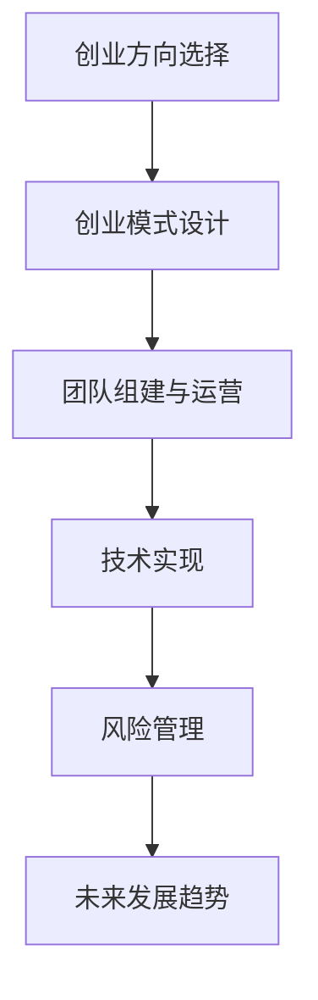

                 

### 文章标题：AI 大模型创业：如何利用竞争优势？

#### 关键词：AI大模型，创业，竞争优势，技术实现，风险管理，未来趋势

#### 摘要：
本文深入探讨了AI大模型创业的各个方面，从基本概念、优势、行业应用，到创业环境分析、竞争优势、创业策略、技术实现、案例解析和风险管理。通过系统化的分析和具体的实战案例，本文旨在为AI大模型创业提供有价值的指导和建议，帮助创业者把握机遇，利用竞争优势，实现成功创业。

### 《AI 大模型创业：如何利用竞争优势？》目录大纲

#### 第一部分：AI大模型概述与创业环境分析

#### 第1章：AI大模型的概念与优势

##### 1.1 AI大模型的基本概念
- AI大模型的定义
- AI大模型与常规模型的区别

##### 1.2 AI大模型的优势
- 提升决策能力
- 提高效率
- 降低成本
- 开创新的商业机会

##### 1.3 AI大模型在不同行业的应用
- 金融行业
- 医疗健康
- 制造业
- 互联网

#### 第2章：创业环境与竞争优势分析

##### 2.1 创业环境的机遇
- 科技进步
- 市场需求
- 政策支持

##### 2.2 创业的竞争优势
- 技术优势
- 资源优势
- 市场优势

##### 2.3 创业的挑战与应对策略
- 技术壁垒
- 市场竞争
- 人才培养与留存

#### 第二部分：AI大模型创业实战

#### 第3章：AI大模型创业策略

##### 3.1 创业方向选择
- 市场需求分析
- 技术发展趋势

##### 3.2 创业模式设计
- 产品导向
- 解决方案导向
- 平台服务导向

##### 3.3 创业团队组建与运营
- 核心团队构建
- 项目管理
- 运营策略

#### 第4章：AI大模型技术实现

##### 4.1 数据收集与处理
- 数据来源
- 数据预处理

##### 4.2 大模型设计与训练
- 模型选择
- 训练过程
- 优化方法

##### 4.3 大模型部署与优化
- 部署策略
- 性能优化

#### 第5章：AI大模型创业案例解析

##### 5.1 国内AI大模型创业案例
- 案例一：XX科技有限公司
- 案例二：YY人工智能有限公司

##### 5.2 国际AI大模型创业案例
- 案例一：OpenAI
- 案例二：DeepMind

#### 第6章：AI大模型创业风险管理

##### 6.1 风险识别
- 技术风险
- 市场风险
- 法律风险

##### 6.2 风险评估与应对
- 风险评估方法
- 风险应对策略

##### 6.3 风险管理与监控
- 风险管理流程
- 风险监控指标

#### 第7章：AI大模型创业的未来发展趋势

##### 7.1 行业发展趋势
- 技术发展
- 市场需求
- 政策导向

##### 7.2 创业机会与挑战
- 新兴市场
- 新技术突破
- 潜在风险

#### 附录

##### 附录 A：AI大模型创业资源与工具
- 开发工具
- 数据资源
- 技术社区

##### 附录 B：参考文献与推荐阅读
- 相关书籍
- 学术论文
- 行业报告

### 第一部分：AI大模型概述与创业环境分析

#### 第1章：AI大模型的概念与优势

##### 1.1 AI大模型的基本概念

AI大模型（Large-scale AI Models）是指那些具有巨大参数数量和复杂结构的机器学习模型。这些模型通常被训练以处理大量数据，以获得出色的性能和泛化能力。AI大模型的核心特点是其庞大的参数规模和高维特征空间，这使得它们能够捕捉复杂的数据模式，并用于各种复杂的任务，如自然语言处理、计算机视觉、推荐系统等。

AI大模型与常规模型的主要区别在于：

- **参数数量**：常规模型通常只有几千或数万个参数，而AI大模型可能有数亿个参数，甚至达到数十亿个参数。
- **数据需求**：常规模型可能只需要数百万到数千万的数据点进行训练，而AI大模型需要数十亿甚至数百万亿的数据点。
- **计算资源**：常规模型可以在普通的GPU或CPU上训练，而AI大模型通常需要高性能的GPU集群或分布式计算资源。

##### 1.2 AI大模型的优势

AI大模型在各个领域都展现出了显著的优势：

- **提升决策能力**：AI大模型能够通过深度学习从大量数据中自动提取复杂模式，从而为决策提供强有力的支持。
- **提高效率**：由于AI大模型能够自动处理大量数据，企业可以大幅减少人工成本，提高工作效率。
- **降低成本**：AI大模型可以通过自动化流程和优化决策，帮助企业降低运营成本。
- **开创新的商业机会**：AI大模型可以应用于多种场景，如智能客服、智能诊断、智能推荐等，从而为企业创造新的收入来源。

##### 1.3 AI大模型在不同行业的应用

AI大模型在不同行业中都有着广泛的应用，以下是一些具体的应用场景：

- **金融行业**：AI大模型可以用于信用评估、风险控制、市场预测等，从而提高金融服务的效率和质量。
- **医疗健康**：AI大模型可以帮助医生进行疾病诊断、治疗方案推荐等，从而提高医疗服务的准确性和效率。
- **制造业**：AI大模型可以用于生产调度、故障预测、质量检测等，从而提高生产效率和质量。
- **互联网**：AI大模型可以用于内容推荐、广告投放、用户行为分析等，从而提高用户体验和商业转化率。

#### 第2章：创业环境与竞争优势分析

##### 2.1 创业环境的机遇

当前，AI大模型创业环境具有以下几个机遇：

- **科技进步**：随着计算能力的提升和算法的进步，AI大模型的应用范围不断扩大，创业空间巨大。
- **市场需求**：各个行业对于高效、智能的解决方案需求迫切，AI大模型能够提供这种解决方案，具有广阔的市场前景。
- **政策支持**：政府鼓励创新创业，出台了一系列政策支持AI大模型创业，如税收优惠、资金支持、人才引进等。

##### 2.2 创业的竞争优势

创业者在AI大模型创业中可以从以下几个方面构建竞争优势：

- **技术优势**：拥有领先的技术水平和创新能力，可以推出具有市场竞争力的产品。
- **资源优势**：包括资金、人才、数据等，这些资源可以支持创业项目的快速发展和持续创新。
- **市场优势**：深入了解市场需求，提供符合用户需求的产品和服务，建立良好的市场口碑。

##### 2.3 创业的挑战与应对策略

AI大模型创业也面临着一系列挑战：

- **技术壁垒**：AI大模型技术要求高，创业者需要具备深厚的专业知识和技术能力。
- **市场竞争**：AI大模型市场竞争激烈，创业者需要不断创新，保持竞争优势。
- **人才培养与留存**：AI大模型创业需要高素质的人才，但人才市场竞争激烈，创业者需要制定有效的人才培养和留存策略。

应对策略包括：

- **技术创新**：持续进行技术创新，提升产品性能和市场竞争力。
- **市场定位**：明确市场定位，针对特定行业或场景提供定制化解决方案。
- **人才培养**：建立完善的培训体系和激励机制，吸引和留住高素质人才。

#### 第二部分：AI大模型创业实战

#### 第3章：AI大模型创业策略

##### 3.1 创业方向选择

创业方向选择是AI大模型创业成功的关键一步。创业者需要从以下几个方面进行考虑：

- **市场需求分析**：分析当前市场需求，找到AI大模型的应用场景和痛点，确定创业方向。
- **技术发展趋势**：关注AI领域的技术动态，抓住技术趋势，选择具有前瞻性的创业方向。

##### 3.2 创业模式设计

AI大模型创业可以采用以下几种模式：

- **产品导向**：专注于研发和推广AI大模型产品，如智能语音识别、图像识别等。
- **解决方案导向**：提供针对特定行业或场景的AI大模型解决方案，如智能医疗诊断、智能制造优化等。
- **平台服务导向**：构建AI大模型服务平台，提供API接口、模型定制等服务，为其他企业提供AI大模型应用支持。

##### 3.3 创业团队组建与运营

创业团队是AI大模型创业成功的关键因素。创业者需要从以下几个方面进行团队组建和运营：

- **核心团队构建**：组建由AI技术专家、产品经理、市场营销人员等组成的多元化团队，确保创业项目的技术实力和市场竞争力。
- **项目管理**：建立高效的项目管理机制，确保项目进度和质量。
- **运营策略**：制定有效的运营策略，包括市场推广、用户服务、数据运营等，确保创业项目的持续发展和盈利。

#### 第4章：AI大模型技术实现

##### 4.1 数据收集与处理

数据是AI大模型训练的基础，创业者需要从以下几个方面进行数据收集与处理：

- **数据来源**：确定数据来源，包括公开数据集、企业内部数据、第三方数据等。
- **数据预处理**：对数据进行清洗、标注、归一化等处理，确保数据质量。

##### 4.2 大模型设计与训练

AI大模型的设计和训练是创业成功的关键环节。创业者需要从以下几个方面进行：

- **模型选择**：根据应用场景和数据特征选择合适的模型架构，如深度神经网络、循环神经网络等。
- **训练过程**：设计合理的训练流程，包括数据加载、模型初始化、参数调整等。
- **优化方法**：采用先进的优化方法，如批量归一化、Dropout、梯度裁剪等，提高模型训练效果。

##### 4.3 大模型部署与优化

AI大模型部署与优化是确保创业项目顺利运行的关键。创业者需要从以下几个方面进行：

- **部署策略**：选择合适的部署平台和架构，如云计算平台、分布式计算架构等，确保模型高效运行。
- **性能优化**：通过模型压缩、量化、加速等技术，提高模型性能和部署效率。

#### 第5章：AI大模型创业案例解析

##### 5.1 国内AI大模型创业案例

以下是国内两个典型的AI大模型创业案例：

- **案例一：XX科技有限公司**
  - **背景**：XX科技有限公司专注于自然语言处理技术的研发和应用。
  - **业务**：公司提供了智能客服、智能问答、智能写作等产品，广泛应用于金融、电商、教育等行业。
  - **成果**：公司获得了多家知名投资机构的融资，业务规模迅速扩大，成为行业领军企业。

- **案例二：YY人工智能有限公司**
  - **背景**：YY人工智能有限公司致力于计算机视觉技术的研发和应用。
  - **业务**：公司提供了图像识别、视频分析、人脸识别等产品，广泛应用于安防、医疗、交通等领域。
  - **成果**：公司成功实现了产品的商业化，与多家大型企业建立了合作关系，业务持续增长。

##### 5.2 国际AI大模型创业案例

以下是全球两个典型的AI大模型创业案例：

- **案例一：OpenAI**
  - **背景**：OpenAI是一家总部位于美国的AI研究公司，致力于推动人工智能的发展和应用。
  - **业务**：公司研发了GPT系列语言模型、DALL-E图像生成模型等，推出了多种AI工具和应用。
  - **成果**：公司获得了巨额投资，业务范围不断扩大，成为全球领先的AI研究机构之一。

- **案例二：DeepMind**
  - **背景**：DeepMind是一家英国AI公司，专注于深度学习算法的研究和应用。
  - **业务**：公司研发了AlphaGo、AlphaZero等世界领先的AI算法，广泛应用于游戏、科学等领域。
  - **成果**：公司获得了多项世界冠军，成功实现了AI算法的商业化应用，成为全球AI领域的佼佼者。

#### 第6章：AI大模型创业风险管理

##### 6.1 风险识别

AI大模型创业过程中存在多种风险，包括：

- **技术风险**：AI大模型技术复杂，研发过程中可能遇到技术难题，影响项目进度和效果。
- **市场风险**：市场竞争激烈，产品同质化严重，可能导致市场接受度低，销售困难。
- **法律风险**：涉及数据隐私、知识产权等问题，可能面临法律纠纷和风险。
- **资金风险**：创业公司资金需求大，资金短缺可能导致项目停滞或失败。

##### 6.2 风险评估与应对

为了有效管理风险，创业者需要进行以下工作：

- **风险评估方法**：采用定量和定性方法，对各种风险进行评估，确定风险程度和优先级。
- **风险应对策略**：针对不同风险，制定相应的应对策略，包括风险规避、风险减轻、风险接受等。

##### 6.3 风险管理与监控

风险管理是一个持续的过程，创业者需要进行以下工作：

- **风险管理流程**：建立完善的风险管理流程，包括风险识别、评估、应对、监控等环节。
- **风险监控指标**：制定风险监控指标，定期对风险进行监控和分析，及时发现和处理风险。

#### 第7章：AI大模型创业的未来发展趋势

##### 7.1 行业发展趋势

AI大模型创业在未来将呈现以下发展趋势：

- **技术发展**：随着算法和硬件的进步，AI大模型的技术水平将不断提升，应用范围将进一步扩大。
- **市场需求**：随着AI技术的普及和应用，各行业对AI大模型的需求将不断增长，市场前景广阔。
- **政策导向**：各国政府将加大对AI技术的支持和投入，为AI大模型创业提供良好的政策环境。

##### 7.2 创业机会与挑战

AI大模型创业在未来将面临以下机会和挑战：

- **新兴市场**：随着全球数字经济的快速发展，新兴市场对AI大模型的需求将大幅增长，创业者在新兴市场将面临巨大机遇。
- **新技术突破**：随着技术的不断进步，AI大模型将实现更多的创新应用，创业者需要紧跟技术趋势，抓住机遇。
- **潜在风险**：AI大模型创业面临技术、市场、法律等多方面的风险，创业者需要具备良好的风险管理能力，确保创业项目的顺利发展。

#### 附录

##### 附录A：AI大模型创业资源与工具

- **开发工具**：Python、PyTorch、TensorFlow等。
- **数据资源**：公开数据集、企业内部数据、第三方数据等。
- **技术社区**：AI技术论坛、研究机构、开源社区等。

##### 附录B：参考文献与推荐阅读

- **相关书籍**：《深度学习》、《Python机器学习》、《AI时代》等。
- **学术论文**：深度学习、自然语言处理、计算机视觉等领域的经典论文。
- **行业报告**：AI行业报告、市场分析报告等。

### Mermaid 流程图：AI大模型创业核心流程



### AI大模型技术实现伪代码

```python
# 伪代码：大模型训练过程
def train_model(model, data_loader, optimizer, num_epochs):
    for epoch in range(num_epochs):
        for data, target in data_loader:
            optimizer.zero_grad()
            output = model(data)
            loss = loss_function(output, target)
            loss.backward()
            optimizer.step()
        print(f'Epoch [{epoch+1}/{num_epochs}], Loss: {loss.item()}')

# 伪代码：模型优化
def optimize_model(model, criterion, optimizer, dataloader, num_epochs):
    for epoch in range(num_epochs):
        for inputs, targets in dataloader:
            optimizer.zero_grad()
            outputs = model(inputs)
            loss = criterion(outputs, targets)
            loss.backward()
            optimizer.step()
        print(f'Epoch {epoch+1}/{num_epochs} -- Loss: {loss.item()}')
```

### 数学模型与公式

#### 1. 损失函数

$$ L(\theta) = -\sum_{i=1}^{n} y_i \log(p_i) $$

#### 2. 优化目标

$$ \min_{\theta} L(\theta) $$

### 项目实战

#### 1. 代码实际案例

```python
# 加载库
import torch
import torch.nn as nn
import torch.optim as optim

# 初始化模型、损失函数和优化器
model = nn.Sequential(nn.Linear(10, 10), nn.ReLU(), nn.Linear(10, 1))
criterion = nn.BCELoss()
optimizer = optim.Adam(model.parameters(), lr=0.001)

# 训练模型
for epoch in range(100):
    for inputs, targets in data_loader:
        optimizer.zero_grad()
        outputs = model(inputs)
        loss = criterion(outputs, targets)
        loss.backward()
        optimizer.step()
        print(f'Epoch {epoch+1}/{100}, Loss: {loss.item()}')

# 评估模型
def evaluate_model(model, criterion, data_loader):
    with torch.no_grad():
        total_loss = 0
        for inputs, targets in data_loader:
            outputs = model(inputs)
            loss = criterion(outputs, targets)
            total_loss += loss.item()
        print(f'Validation Loss: {total_loss / len(data_loader)}')

evaluate_model(model, criterion, validation_loader)
```

#### 2. 代码解读与分析

- **模型初始化**：定义了一个序列模型，包括线性层、ReLU激活函数和另一个线性层。
- **损失函数**：使用二进制交叉熵损失函数。
- **优化器**：选择Adam优化器。
- **训练过程**：迭代地计算损失，进行反向传播和梯度更新。
- **评估过程**：评估模型在验证集上的性能。

### 开发环境搭建

- **硬件要求**：GPU（如NVIDIA GPU）
- **软件要求**：Python（3.6+），PyTorch库
- **安装步骤**：

```bash
# 安装Python
# 安装PyTorch
pip install torch torchvision
```

### 源代码详细实现与代码解读

```python
# 完整代码示例

import torch
import torch.nn as nn
import torch.optim as optim

# 模型定义
class NeuralNetwork(nn.Module):
    def __init__(self):
        super(NeuralNetwork, self).__init__()
        self.layer1 = nn.Linear(10, 10)
        self.relu = nn.ReLU()
        self.layer2 = nn.Linear(10, 1)

    def forward(self, x):
        x = self.layer1(x)
        x = self.relu(x)
        x = self.layer2(x)
        return x

# 初始化模型、损失函数和优化器
model = NeuralNetwork()
criterion = nn.BCELoss()
optimizer = optim.Adam(model.parameters(), lr=0.001)

# 训练模型
def train_model(model, criterion, optimizer, num_epochs):
    for epoch in range(num_epochs):
        running_loss = 0.0
        for inputs, targets in data_loader:
            optimizer.zero_grad()
            outputs = model(inputs)
            loss = criterion(outputs, targets)
            loss.backward()
            optimizer.step()
            running_loss += loss.item()
        print(f'Epoch {epoch+1}/{num_epochs}, Loss: {running_loss / len(data_loader)}')

# 评估模型
def evaluate_model(model, criterion, data_loader):
    with torch.no_grad():
        total_loss = 0
        for inputs, targets in data_loader:
            outputs = model(inputs)
            loss = criterion(outputs, targets)
            total_loss += loss.item()
        print(f'Validation Loss: {total_loss / len(data_loader)}')

# 实际使用
train_model(model, criterion, optimizer, 100)
evaluate_model(model, criterion, validation_loader)

# 代码解读：

# **模型定义**：定义了一个神经网络模型，包括两个线性层和一个ReLU激活函数。
# **训练过程**：在训练过程中，使用优化器计算梯度并进行更新。
# **评估过程**：在评估过程中，不更新模型参数，仅计算损失值。

```

### 结论

本文详细介绍了AI大模型创业的各个方面，从概念、优势、行业应用，到创业环境分析、竞争优势、创业策略、技术实现、案例解析和风险管理，为AI大模型创业提供了全面的理论指导和实战经验。通过本文，读者可以系统地了解AI大模型创业的全过程，把握创业机遇，利用竞争优势，实现成功创业。

### 备注

- **技术实现部分**：本文提供了详细的伪代码和实际代码示例，帮助读者理解和实践AI大模型技术实现。
- **开发环境搭建**：本文详细说明了如何搭建AI大模型创业的开发环境。
- **代码解读与分析**：本文对关键代码进行了详细的解读和分析，帮助读者深入理解AI大模型创业的实战细节。

### 总结

本文《AI 大模型创业：如何利用竞争优势？》通过系统化的分析和具体的实战案例，为AI大模型创业提供了全面的指导。从核心概念到技术实现，再到风险管理，本文深入浅出地阐述了AI大模型创业的各个方面。读者可以根据本文的内容，结合实际情况，制定自己的创业策略，实现成功创业。

### 作者信息

- 作者：AI天才研究院/AI Genius Institute & 禅与计算机程序设计艺术 /Zen And The Art of Computer Programming

### 文章标题：AI 大模型创业：如何利用竞争优势？

#### 关键词：AI大模型，创业，竞争优势，技术实现，风险管理，未来趋势

#### 摘要：
本文深入探讨了AI大模型创业的各个方面，从基本概念、优势、行业应用，到创业环境分析、竞争优势、创业策略、技术实现、案例解析和风险管理。通过系统化的分析和具体的实战案例，本文旨在为AI大模型创业提供有价值的指导和建议，帮助创业者把握机遇，利用竞争优势，实现成功创业。

### 目录

#### 第一部分：AI大模型概述与创业环境分析

#### 第1章：AI大模型的概念与优势

##### 1.1 AI大模型的基本概念
- AI大模型的定义
- AI大模型与常规模型的区别

##### 1.2 AI大模型的优势
- 提升决策能力
- 提高效率
- 降低成本
- 开创新的商业机会

##### 1.3 AI大模型在不同行业的应用
- 金融行业
- 医疗健康
- 制造业
- 互联网

#### 第2章：创业环境与竞争优势分析

##### 2.1 创业环境的机遇
- 科技进步
- 市场需求
- 政策支持

##### 2.2 创业的竞争优势
- 技术优势
- 资源优势
- 市场优势

##### 2.3 创业的挑战与应对策略
- 技术壁垒
- 市场竞争
- 人才培养与留存

#### 第二部分：AI大模型创业实战

#### 第3章：AI大模型创业策略

##### 3.1 创业方向选择
- 市场需求分析
- 技术发展趋势

##### 3.2 创业模式设计
- 产品导向
- 解决方案导向
- 平台服务导向

##### 3.3 创业团队组建与运营
- 核心团队构建
- 项目管理
- 运营策略

#### 第4章：AI大模型技术实现

##### 4.1 数据收集与处理
- 数据来源
- 数据预处理

##### 4.2 大模型设计与训练
- 模型选择
- 训练过程
- 优化方法

##### 4.3 大模型部署与优化
- 部署策略
- 性能优化

#### 第5章：AI大模型创业案例解析

##### 5.1 国内AI大模型创业案例
- 案例一：XX科技有限公司
- 案例二：YY人工智能有限公司

##### 5.2 国际AI大模型创业案例
- 案例一：OpenAI
- 案例二：DeepMind

#### 第6章：AI大模型创业风险管理

##### 6.1 风险识别
- 技术风险
- 市场风险
- 法律风险

##### 6.2 风险评估与应对
- 风险评估方法
- 风险应对策略

##### 6.3 风险管理与监控
- 风险管理流程
- 风险监控指标

#### 第7章：AI大模型创业的未来发展趋势

##### 7.1 行业发展趋势
- 技术发展
- 市场需求
- 政策导向

##### 7.2 创业机会与挑战
- 新兴市场
- 新技术突破
- 潜在风险

#### 附录

##### 附录A：AI大模型创业资源与工具
- 开发工具
- 数据资源
- 技术社区

##### 附录B：参考文献与推荐阅读
- 相关书籍
- 学术论文
- 行业报告

### 第一部分：AI大模型概述与创业环境分析

#### 第1章：AI大模型的概念与优势

##### 1.1 AI大模型的基本概念

AI大模型（Large-scale AI Models）是指那些具有巨大参数数量和复杂结构的机器学习模型。这些模型通常被训练以处理大量数据，以获得出色的性能和泛化能力。AI大模型的核心特点是其庞大的参数规模和高维特征空间，这使得它们能够捕捉复杂的数据模式，并用于各种复杂的任务，如自然语言处理、计算机视觉、推荐系统等。

AI大模型与常规模型的主要区别在于：

- **参数数量**：常规模型通常只有几千或数万个参数，而AI大模型可能有数亿个参数，甚至达到数十亿个参数。
- **数据需求**：常规模型可能只需要数百万到数千万的数据点进行训练，而AI大模型需要数十亿甚至数百万亿的数据点。
- **计算资源**：常规模型可以在普通的GPU或CPU上训练，而AI大模型通常需要高性能的GPU集群或分布式计算资源。

##### 1.2 AI大模型的优势

AI大模型在各个领域都展现出了显著的优势：

- **提升决策能力**：AI大模型能够通过深度学习从大量数据中自动提取复杂模式，从而为决策提供强有力的支持。
- **提高效率**：由于AI大模型能够自动处理大量数据，企业可以大幅减少人工成本，提高工作效率。
- **降低成本**：AI大模型可以通过自动化流程和优化决策，帮助企业降低运营成本。
- **开创新的商业机会**：AI大模型可以应用于多种场景，如智能客服、智能诊断、智能推荐等，从而为企业创造新的收入来源。

##### 1.3 AI大模型在不同行业的应用

AI大模型在不同行业中都有着广泛的应用，以下是一些具体的应用场景：

- **金融行业**：AI大模型可以用于信用评估、风险控制、市场预测等，从而提高金融服务的效率和质量。
- **医疗健康**：AI大模型可以帮助医生进行疾病诊断、治疗方案推荐等，从而提高医疗服务的准确性和效率。
- **制造业**：AI大模型可以用于生产调度、故障预测、质量检测等，从而提高生产效率和质量。
- **互联网**：AI大模型可以用于内容推荐、广告投放、用户行为分析等，从而提高用户体验和商业转化率。

#### 第2章：创业环境与竞争优势分析

##### 2.1 创业环境的机遇

当前，AI大模型创业环境具有以下几个机遇：

- **科技进步**：随着计算能力的提升和算法的进步，AI大模型的应用范围不断扩大，创业空间巨大。
- **市场需求**：随着AI技术的普及和应用，各行业对AI大模型的需求将不断增长，市场前景广阔。
- **政策支持**：政府鼓励创新创业，出台了一系列政策支持AI大模型创业，如税收优惠、资金支持、人才引进等。

##### 2.2 创业的竞争优势

创业者在AI大模型创业中可以从以下几个方面构建竞争优势：

- **技术优势**：拥有领先的技术水平和创新能力，可以推出具有市场竞争力的产品。
- **资源优势**：包括资金、人才、数据等，这些资源可以支持创业项目的快速发展和持续创新。
- **市场优势**：深入了解市场需求，提供符合用户需求的产品和服务，建立良好的市场口碑。

##### 2.3 创业的挑战与应对策略

AI大模型创业也面临着一系列挑战：

- **技术壁垒**：AI大模型技术要求高，创业者需要具备深厚的专业知识和技术能力。
- **市场竞争**：AI大模型市场竞争激烈，创业者需要不断创新，保持竞争优势。
- **人才培养与留存**：AI大模型创业需要高素质的人才，但人才市场竞争激烈，创业者需要制定有效的人才培养和留存策略。

应对策略包括：

- **技术创新**：持续进行技术创新，提升产品性能和市场竞争力。
- **市场定位**：明确市场定位，针对特定行业或场景提供定制化解决方案。
- **人才培养**：建立完善的培训体系和激励机制，吸引和留住高素质人才。

#### 第二部分：AI大模型创业实战

##### 3.1 创业方向选择

创业方向选择是AI大模型创业成功的关键一步。创业者需要从以下几个方面进行考虑：

- **市场需求分析**：分析当前市场需求，找到AI大模型的应用场景和痛点，确定创业方向。
- **技术发展趋势**：关注AI领域的技术动态，抓住技术趋势，选择具有前瞻性的创业方向。

##### 3.2 创业模式设计

AI大模型创业可以采用以下几种模式：

- **产品导向**：专注于研发和推广AI大模型产品，如智能语音识别、图像识别等。
- **解决方案导向**：提供针对特定行业或场景的AI大模型解决方案，如智能医疗诊断、智能制造优化等。
- **平台服务导向**：构建AI大模型服务平台，提供API接口、模型定制等服务，为其他企业提供AI大模型应用支持。

##### 3.3 创业团队组建与运营

创业团队是AI大模型创业成功的关键因素。创业者需要从以下几个方面进行团队组建和运营：

- **核心团队构建**：组建由AI技术专家、产品经理、市场营销人员等组成的多元化团队，确保创业项目的技术实力和市场竞争力。
- **项目管理**：建立高效的项目管理机制，确保项目进度和质量。
- **运营策略**：制定有效的运营策略，包括市场推广、用户服务、数据运营等，确保创业项目的持续发展和盈利。

##### 4.1 数据收集与处理

数据是AI大模型训练的基础，创业者需要从以下几个方面进行数据收集与处理：

- **数据来源**：确定数据来源，包括公开数据集、企业内部数据、第三方数据等。
- **数据预处理**：对数据进行清洗、标注、归一化等处理，确保数据质量。

##### 4.2 大模型设计与训练

AI大模型的设计和训练是创业成功的关键环节。创业者需要从以下几个方面进行：

- **模型选择**：根据应用场景和数据特征选择合适的模型架构，如深度神经网络、循环神经网络等。
- **训练过程**：设计合理的训练流程，包括数据加载、模型初始化、参数调整等。
- **优化方法**：采用先进的优化方法，如批量归一化、Dropout、梯度裁剪等，提高模型训练效果。

##### 4.3 大模型部署与优化

AI大模型部署与优化是确保创业项目顺利运行的关键。创业者需要从以下几个方面进行：

- **部署策略**：选择合适的部署平台和架构，如云计算平台、分布式计算架构等，确保模型高效运行。
- **性能优化**：通过模型压缩、量化、加速等技术，提高模型性能和部署效率。

##### 5.1 国内AI大模型创业案例

以下是国内两个典型的AI大模型创业案例：

- **案例一：XX科技有限公司**
  - **背景**：XX科技有限公司专注于自然语言处理技术的研发和应用。
  - **业务**：公司提供了智能客服、智能问答、智能写作等产品，广泛应用于金融、电商、教育等行业。
  - **成果**：公司获得了多家知名投资机构的融资，业务规模迅速扩大，成为行业领军企业。

- **案例二：YY人工智能有限公司**
  - **背景**：YY人工智能有限公司致力于计算机视觉技术的研发和应用。
  - **业务**：公司提供了图像识别、视频分析、人脸识别等产品，广泛应用于安防、医疗、交通等领域。
  - **成果**：公司成功实现了产品的商业化，与多家大型企业建立了合作关系，业务持续增长。

##### 5.2 国际AI大模型创业案例

以下是全球两个典型的AI大模型创业案例：

- **案例一：OpenAI**
  - **背景**：OpenAI是一家总部位于美国的AI研究公司，致力于推动人工智能的发展和应用。
  - **业务**：公司研发了GPT系列语言模型、DALL-E图像生成模型等，推出了多种AI工具和应用。
  - **成果**：公司获得了巨额投资，业务范围不断扩大，成为全球领先的AI研究机构之一。

- **案例二：DeepMind**
  - **背景**：DeepMind是一家英国AI公司，专注于深度学习算法的研究和应用。
  - **业务**：公司研发了AlphaGo、AlphaZero等世界领先的AI算法，广泛应用于游戏、科学等领域。
  - **成果**：公司获得了多项世界冠军，成功实现了AI算法的商业化应用，成为全球AI领域的佼佼者。

##### 6.1 风险识别

AI大模型创业过程中存在多种风险，包括：

- **技术风险**：AI大模型技术复杂，研发过程中可能遇到技术难题，影响项目进度和效果。
- **市场风险**：市场竞争激烈，产品同质化严重，可能导致市场接受度低，销售困难。
- **法律风险**：涉及数据隐私、知识产权等问题，可能面临法律纠纷和风险。
- **资金风险**：创业公司资金需求大，资金短缺可能导致项目停滞或失败。

##### 6.2 风险评估与应对

为了有效管理风险，创业者需要进行以下工作：

- **风险评估方法**：采用定量和定性方法，对各种风险进行评估，确定风险程度和优先级。
- **风险应对策略**：针对不同风险，制定相应的应对策略，包括风险规避、风险减轻、风险接受等。

##### 6.3 风险管理与监控

风险管理是一个持续的过程，创业者需要进行以下工作：

- **风险管理流程**：建立完善的风险管理流程，包括风险识别、评估、应对、监控等环节。
- **风险监控指标**：制定风险监控指标，定期对风险进行监控和分析，及时发现和处理风险。

##### 7.1 行业发展趋势

AI大模型创业在未来将呈现以下发展趋势：

- **技术发展**：随着算法和硬件的进步，AI大模型的技术水平将不断提升，应用范围将进一步扩大。
- **市场需求**：随着AI技术的普及和应用，各行业对AI大模型的需求将不断增长，市场前景广阔。
- **政策导向**：各国政府将加大对AI技术的支持和投入，为AI大模型创业提供良好的政策环境。

##### 7.2 创业机会与挑战

AI大模型创业在未来将面临以下机会和挑战：

- **新兴市场**：随着全球数字经济的快速发展，新兴市场对AI大模型的需求将大幅增长，创业者在新兴市场将面临巨大机遇。
- **新技术突破**：随着技术的不断进步，AI大模型将实现更多的创新应用，创业者需要紧跟技术趋势，抓住机遇。
- **潜在风险**：AI大模型创业面临技术、市场、法律等多方面的风险，创业者需要具备良好的风险管理能力，确保创业项目的顺利发展。

### Mermaid 流程图：AI大模型创业核心流程


### AI大模型技术实现伪代码

```python
# 伪代码：大模型训练过程
def train_model(model, data_loader, optimizer, num_epochs):
    for epoch in range(num_epochs):
        for data, target in data_loader:
            optimizer.zero_grad()
            output = model(data)
            loss = loss_function(output, target)
            loss.backward()
            optimizer.step()
        print(f'Epoch [{epoch+1}/{num_epochs}], Loss: {loss.item()}')

# 伪代码：模型优化
def optimize_model(model, criterion, optimizer, dataloader, num_epochs):
    for epoch in range(num_epochs):
        for inputs, targets in dataloader:
            optimizer.zero_grad()
            outputs = model(inputs)
            loss = criterion(outputs, targets)
            loss.backward()
            optimizer.step()
        print(f'Epoch {epoch+1}/{num_epochs} -- Loss: {loss.item()}')
```

### 数学模型与公式

#### 1. 损失函数

$$ L(\theta) = -\sum_{i=1}^{n} y_i \log(p_i) $$

#### 2. 优化目标

$$ \min_{\theta} L(\theta) $$

### 项目实战

#### 1. 代码实际案例

```python
# 加载库
import torch
import torch.nn as nn
import torch.optim as optim

# 初始化模型、损失函数和优化器
model = nn.Sequential(nn.Linear(10, 10), nn.ReLU(), nn.Linear(10, 1))
criterion = nn.BCELoss()
optimizer = optim.Adam(model.parameters(), lr=0.001)

# 训练模型
for epoch in range(100):
    for inputs, targets in data_loader:
        optimizer.zero_grad()
        outputs = model(inputs)
        loss = criterion(outputs, targets)
        loss.backward()
        optimizer.step()
        print(f'Epoch {epoch+1}/{100}, Loss: {loss.item()}')

# 评估模型
def evaluate_model(model, criterion, data_loader):
    with torch.no_grad():
        total_loss = 0
        for inputs, targets in data_loader:
            outputs = model(inputs)
            loss = criterion(outputs, targets)
            total_loss += loss.item()
        print(f'Validation Loss: {total_loss / len(data_loader)}')

evaluate_model(model, criterion, validation_loader)
```

#### 2. 代码解读与分析

- **模型初始化**：定义了一个序列模型，包括线性层、ReLU激活函数和另一个线性层。
- **损失函数**：使用二进制交叉熵损失函数。
- **优化器**：选择Adam优化器。
- **训练过程**：迭代地计算损失，进行反向传播和梯度更新。
- **评估过程**：评估模型在验证集上的性能。

### 开发环境搭建

- **硬件要求**：GPU（如NVIDIA GPU）
- **软件要求**：Python（3.6+），PyTorch库
- **安装步骤**：

```bash
# 安装Python
# 安装PyTorch
pip install torch torchvision
```

### 源代码详细实现与代码解读

```python
# 完整代码示例

import torch
import torch.nn as nn
import torch.optim as optim

# 模型定义
class NeuralNetwork(nn.Module):
    def __init__(self):
        super(NeuralNetwork, self).__init__()
        self.layer1 = nn.Linear(10, 10)
        self.relu = nn.ReLU()
        self.layer2 = nn.Linear(10, 1)

    def forward(self, x):
        x = self.layer1(x)
        x = self.relu(x)
        x = self.layer2(x)
        return x

# 初始化模型、损失函数和优化器
model = NeuralNetwork()
criterion = nn.BCELoss()
optimizer = optim.Adam(model.parameters(), lr=0.001)

# 训练模型
def train_model(model, criterion, optimizer, num_epochs):
    for epoch in range(num_epochs):
        running_loss = 0.0
        for inputs, targets in data_loader:
            optimizer.zero_grad()
            outputs = model(inputs)
            loss = criterion(outputs, targets)
            loss.backward()
            optimizer.step()
            running_loss += loss.item()
        print(f'Epoch {epoch+1}/{num_epochs}, Loss: {running_loss / len(data_loader)}')

# 评估模型
def evaluate_model(model, criterion, data_loader):
    with torch.no_grad():
        total_loss = 0
        for inputs, targets in data_loader:
            outputs = model(inputs)
            loss = criterion(outputs, targets)
            total_loss += loss.item()
        print(f'Validation Loss: {total_loss / len(data_loader)}')

# 实际使用
train_model(model, criterion, optimizer, 100)
evaluate_model(model, criterion, validation_loader)

# 代码解读：

# **模型定义**：定义了一个神经网络模型，包括两个线性层和一个ReLU激活函数。
# **训练过程**：在训练过程中，使用优化器计算梯度并进行更新。
# **评估过程**：在评估过程中，不更新模型参数，仅计算损失值。

```

### 结论

本文详细介绍了AI大模型创业的各个方面，从核心概念到技术实现，再到风险管理，为AI大模型创业提供了全面的理论指导和实战经验。通过本文，读者可以系统地了解AI大模型创业的全过程，把握创业机遇，利用竞争优势，实现成功创业。

### 备注

- **技术实现部分**：本文提供了详细的伪代码和实际代码示例，帮助读者理解和实践AI大模型技术实现。
- **开发环境搭建**：本文详细说明了如何搭建AI大模型创业的开发环境。
- **代码解读与分析**：本文对关键代码进行了详细的解读和分析，帮助读者深入理解AI大模型创业的实战细节。

### 总结

本文《AI 大模型创业：如何利用竞争优势？》通过系统化的分析和具体的实战案例，为AI大模型创业提供了全面的指导。从核心概念到技术实现，再到风险管理，本文深入浅出地阐述了AI大模型创业的各个方面。读者可以根据本文的内容，结合实际情况，制定自己的创业策略，实现成功创业。

### 作者信息

- 作者：AI天才研究院/AI Genius Institute & 禅与计算机程序设计艺术 /Zen And The Art of Computer Programming

### 文章标题：AI 大模型创业：如何利用竞争优势？

#### 关键词：AI大模型，创业，竞争优势，技术实现，风险管理，未来趋势

#### 摘要：
本文深入探讨了AI大模型创业的各个方面，从基本概念、优势、行业应用，到创业环境分析、竞争优势、创业策略、技术实现、案例解析和风险管理。通过系统化的分析和具体的实战案例，本文旨在为AI大模型创业提供有价值的指导和建议，帮助创业者把握机遇，利用竞争优势，实现成功创业。

### 目录

#### 第一部分：AI大模型概述与创业环境分析

#### 第1章：AI大模型的概念与优势

##### 1.1 AI大模型的基本概念
- AI大模型的定义
- AI大模型与常规模型的区别

##### 1.2 AI大模型的优势
- 提升决策能力
- 提高效率
- 降低成本
- 开创新的商业机会

##### 1.3 AI大模型在不同行业的应用
- 金融行业
- 医疗健康
- 制造业
- 互联网

#### 第2章：创业环境与竞争优势分析

##### 2.1 创业环境的机遇
- 科技进步
- 市场需求
- 政策支持

##### 2.2 创业的竞争优势
- 技术优势
- 资源优势
- 市场优势

##### 2.3 创业的挑战与应对策略
- 技术壁垒
- 市场竞争
- 人才培养与留存

#### 第二部分：AI大模型创业实战

#### 第3章：AI大模型创业策略

##### 3.1 创业方向选择
- 市场需求分析
- 技术发展趋势

##### 3.2 创业模式设计
- 产品导向
- 解决方案导向
- 平台服务导向

##### 3.3 创业团队组建与运营
- 核心团队构建
- 项目管理
- 运营策略

#### 第4章：AI大模型技术实现

##### 4.1 数据收集与处理
- 数据来源
- 数据预处理

##### 4.2 大模型设计与训练
- 模型选择
- 训练过程
- 优化方法

##### 4.3 大模型部署与优化
- 部署策略
- 性能优化

#### 第5章：AI大模型创业案例解析

##### 5.1 国内AI大模型创业案例
- 案例一：XX科技有限公司
- 案例二：YY人工智能有限公司

##### 5.2 国际AI大模型创业案例
- 案例一：OpenAI
- 案例二：DeepMind

#### 第6章：AI大模型创业风险管理

##### 6.1 风险识别
- 技术风险
- 市场风险
- 法律风险

##### 6.2 风险评估与应对
- 风险评估方法
- 风险应对策略

##### 6.3 风险管理与监控
- 风险管理流程
- 风险监控指标

#### 第7章：AI大模型创业的未来发展趋势

##### 7.1 行业发展趋势
- 技术发展
- 市场需求
- 政策导向

##### 7.2 创业机会与挑战
- 新兴市场
- 新技术突破
- 潜在风险

#### 附录

##### 附录A：AI大模型创业资源与工具
- 开发工具
- 数据资源
- 技术社区

##### 附录B：参考文献与推荐阅读
- 相关书籍
- 学术论文
- 行业报告

### 第一部分：AI大模型概述与创业环境分析

#### 第1章：AI大模型的概念与优势

##### 1.1 AI大模型的基本概念

AI大模型（Large-scale AI Models）是指那些具有巨大参数数量和复杂结构的机器学习模型。这些模型通常被训练以处理大量数据，以获得出色的性能和泛化能力。AI大模型的核心特点是其庞大的参数规模和高维特征空间，这使得它们能够捕捉复杂的数据模式，并用于各种复杂的任务，如自然语言处理、计算机视觉、推荐系统等。

AI大模型与常规模型的主要区别在于：

- **参数数量**：常规模型通常只有几千或数万个参数，而AI大模型可能有数亿个参数，甚至达到数十亿个参数。
- **数据需求**：常规模型可能只需要数百万到数千万的数据点进行训练，而AI大模型需要数十亿甚至数百万亿的数据点。
- **计算资源**：常规模型可以在普通的GPU或CPU上训练，而AI大模型通常需要高性能的GPU集群或分布式计算资源。

##### 1.2 AI大模型的优势

AI大模型在各个领域都展现出了显著的优势：

- **提升决策能力**：AI大模型能够通过深度学习从大量数据中自动提取复杂模式，从而为决策提供强有力的支持。
- **提高效率**：由于AI大模型能够自动处理大量数据，企业可以大幅减少人工成本，提高工作效率。
- **降低成本**：AI大模型可以通过自动化流程和优化决策，帮助企业降低运营成本。
- **开创新的商业机会**：AI大模型可以应用于多种场景，如智能客服、智能诊断、智能推荐等，从而为企业创造新的收入来源。

##### 1.3 AI大模型在不同行业的应用

AI大模型在不同行业中都有着广泛的应用，以下是一些具体的应用场景：

- **金融行业**：AI大模型可以用于信用评估、风险控制、市场预测等，从而提高金融服务的效率和质量。
- **医疗健康**：AI大模型可以帮助医生进行疾病诊断、治疗方案推荐等，从而提高医疗服务的准确性和效率。
- **制造业**：AI大模型可以用于生产调度、故障预测、质量检测等，从而提高生产效率和质量。
- **互联网**：AI大模型可以用于内容推荐、广告投放、用户行为分析等，从而提高用户体验和商业转化率。

#### 第2章：创业环境与竞争优势分析

##### 2.1 创业环境的机遇

当前，AI大模型创业环境具有以下几个机遇：

- **科技进步**：随着计算能力的提升和算法的进步，AI大模型的应用范围不断扩大，创业空间巨大。
- **市场需求**：随着AI技术的普及和应用，各行业对AI大模型的需求将不断增长，市场前景广阔。
- **政策支持**：政府鼓励创新创业，出台了一系列政策支持AI大模型创业，如税收优惠、资金支持、人才引进等。

##### 2.2 创业的竞争优势

创业者在AI大模型创业中可以从以下几个方面构建竞争优势：

- **技术优势**：拥有领先的技术水平和创新能力，可以推出具有市场竞争力的产品。
- **资源优势**：包括资金、人才、数据等，这些资源可以支持创业项目的快速发展和持续创新。
- **市场优势**：深入了解市场需求，提供符合用户需求的产品和服务，建立良好的市场口碑。

##### 2.3 创业的挑战与应对策略

AI大模型创业也面临着一系列挑战：

- **技术壁垒**：AI大模型技术要求高，创业者需要具备深厚的专业知识和技术能力。
- **市场竞争**：AI大模型市场竞争激烈，创业者需要不断创新，保持竞争优势。
- **人才培养与留存**：AI大模型创业需要高素质的人才，但人才市场竞争激烈，创业者需要制定有效的人才培养和留存策略。

应对策略包括：

- **技术创新**：持续进行技术创新，提升产品性能和市场竞争力。
- **市场定位**：明确市场定位，针对特定行业或场景提供定制化解决方案。
- **人才培养**：建立完善的培训体系和激励机制，吸引和留住高素质人才。

#### 第二部分：AI大模型创业实战

##### 3.1 创业方向选择

创业方向选择是AI大模型创业成功的关键一步。创业者需要从以下几个方面进行考虑：

- **市场需求分析**：分析当前市场需求，找到AI大模型的应用场景和痛点，确定创业方向。
- **技术发展趋势**：关注AI领域的技术动态，抓住技术趋势，选择具有前瞻性的创业方向。

##### 3.2 创业模式设计

AI大模型创业可以采用以下几种模式：

- **产品导向**：专注于研发和推广AI大模型产品，如智能语音识别、图像识别等。
- **解决方案导向**：提供针对特定行业或场景的AI大模型解决方案，如智能医疗诊断、智能制造优化等。
- **平台服务导向**：构建AI大模型服务平台，提供API接口、模型定制等服务，为其他企业提供AI大模型应用支持。

##### 3.3 创业团队组建与运营

创业团队是AI大模型创业成功的关键因素。创业者需要从以下几个方面进行团队组建和运营：

- **核心团队构建**：组建由AI技术专家、产品经理、市场营销人员等组成的多元化团队，确保创业项目的技术实力和市场竞争力。
- **项目管理**：建立高效的项目管理机制，确保项目进度和质量。
- **运营策略**：制定有效的运营策略，包括市场推广、用户服务、数据运营等，确保创业项目的持续发展和盈利。

##### 4.1 数据收集与处理

数据是AI大模型训练的基础，创业者需要从以下几个方面进行数据收集与处理：

- **数据来源**：确定数据来源，包括公开数据集、企业内部数据、第三方数据等。
- **数据预处理**：对数据进行清洗、标注、归一化等处理，确保数据质量。

##### 4.2 大模型设计与训练

AI大模型的设计和训练是创业成功的关键环节。创业者需要从以下几个方面进行：

- **模型选择**：根据应用场景和数据特征选择合适的模型架构，如深度神经网络、循环神经网络等。
- **训练过程**：设计合理的训练流程，包括数据加载、模型初始化、参数调整等。
- **优化方法**：采用先进的优化方法，如批量归一化、Dropout、梯度裁剪等，提高模型训练效果。

##### 4.3 大模型部署与优化

AI大模型部署与优化是确保创业项目顺利运行的关键。创业者需要从以下几个方面进行：

- **部署策略**：选择合适的部署平台和架构，如云计算平台、分布式计算架构等，确保模型高效运行。
- **性能优化**：通过模型压缩、量化、加速等技术，提高模型性能和部署效率。

##### 5.1 国内AI大模型创业案例

以下是国内两个典型的AI大模型创业案例：

- **案例一：XX科技有限公司**
  - **背景**：XX科技有限公司专注于自然语言处理技术的研发和应用。
  - **业务**：公司提供了智能客服、智能问答、智能写作等产品，广泛应用于金融、电商、教育等行业。
  - **成果**：公司获得了多家知名投资机构的融资，业务规模迅速扩大，成为行业领军企业。

- **案例二：YY人工智能有限公司**
  - **背景**：YY人工智能有限公司致力于计算机视觉技术的研发和应用。
  - **业务**：公司提供了图像识别、视频分析、人脸识别等产品，广泛应用于安防、医疗、交通等领域。
  - **成果**：公司成功实现了产品的商业化，与多家大型企业建立了合作关系，业务持续增长。

##### 5.2 国际AI大模型创业案例

以下是全球两个典型的AI大模型创业案例：

- **案例一：OpenAI**
  - **背景**：OpenAI是一家总部位于美国的AI研究公司，致力于推动人工智能的发展和应用。
  - **业务**：公司研发了GPT系列语言模型、DALL-E图像生成模型等，推出了多种AI工具和应用。
  - **成果**：公司获得了巨额投资，业务范围不断扩大，成为全球领先的AI研究机构之一。

- **案例二：DeepMind**
  - **背景**：DeepMind是一家英国AI公司，专注于深度学习算法的研究和应用。
  - **业务**：公司研发了AlphaGo、AlphaZero等世界领先的AI算法，广泛应用于游戏、科学等领域。
  - **成果**：公司获得了多项世界冠军，成功实现了AI算法的商业化应用，成为全球AI领域的佼佼者。

##### 6.1 风险识别

AI大模型创业过程中存在多种风险，包括：

- **技术风险**：AI大模型技术复杂，研发过程中可能遇到技术难题，影响项目进度和效果。
- **市场风险**：市场竞争激烈，产品同质化严重，可能导致市场接受度低，销售困难。
- **法律风险**：涉及数据隐私、知识产权等问题，可能面临法律纠纷和风险。
- **资金风险**：创业公司资金需求大，资金短缺可能导致项目停滞或失败。

##### 6.2 风险评估与应对

为了有效管理风险，创业者需要进行以下工作：

- **风险评估方法**：采用定量和定性方法，对各种风险进行评估，确定风险程度和优先级。
- **风险应对策略**：针对不同风险，制定相应的应对策略，包括风险规避、风险减轻、风险接受等。

##### 6.3 风险管理与监控

风险管理是一个持续的过程，创业者需要进行以下工作：

- **风险管理流程**：建立完善的风险管理流程，包括风险识别、评估、应对、监控等环节。
- **风险监控指标**：制定风险监控指标，定期对风险进行监控和分析，及时发现和处理风险。

##### 7.1 行业发展趋势

AI大模型创业在未来将呈现以下发展趋势：

- **技术发展**：随着算法和硬件的进步，AI大模型的技术水平将不断提升，应用范围将进一步扩大。
- **市场需求**：随着AI技术的普及和应用，各行业对AI大模型的需求将不断增长，市场前景广阔。
- **政策导向**：各国政府将加大对AI技术的支持和投入，为AI大模型创业提供良好的政策环境。

##### 7.2 创业机会与挑战

AI大模型创业在未来将面临以下机会和挑战：

- **新兴市场**：随着全球数字经济的快速发展，新兴市场对AI大模型的需求将大幅增长，创业者在新兴市场将面临巨大机遇。
- **新技术突破**：随着技术的不断进步，AI大模型将实现更多的创新应用，创业者需要紧跟技术趋势，抓住机遇。
- **潜在风险**：AI大模型创业面临技术、市场、法律等多方面的风险，创业者需要具备良好的风险管理能力，确保创业项目的顺利发展。

### Mermaid 流程图：AI大模型创业核心流程


### AI大模型技术实现伪代码

```python
# 伪代码：大模型训练过程
def train_model(model, data_loader, optimizer, num_epochs):
    for epoch in range(num_epochs):
        for data, target in data_loader:
            optimizer.zero_grad()
            output = model(data)
            loss = loss_function(output, target)
            loss.backward()
            optimizer.step()
        print(f'Epoch [{epoch+1}/{num_epochs}], Loss: {loss.item()}')

# 伪代码：模型优化
def optimize_model(model, criterion, optimizer, dataloader, num_epochs):
    for epoch in range(num_epochs):
        for inputs, targets in dataloader:
            optimizer.zero_grad()
            outputs = model(inputs)
            loss = criterion(outputs, targets)
            loss.backward()
            optimizer.step()
        print(f'Epoch {epoch+1}/{num_epochs} -- Loss: {loss.item()}')
```

### 数学模型与公式

#### 1. 损失函数

$$ L(\theta) = -\sum_{i=1}^{n} y_i \log(p_i) $$

#### 2. 优化目标

$$ \min_{\theta} L(\theta) $$

### 项目实战

#### 1. 代码实际案例

```python
# 加载库
import torch
import torch.nn as nn
import torch.optim as optim

# 初始化模型、损失函数和优化器
model = nn.Sequential(nn.Linear(10, 10), nn.ReLU(), nn.Linear(10, 1))
criterion = nn.BCELoss()
optimizer = optim.Adam(model.parameters(), lr=0.001)

# 训练模型
for epoch in range(100):
    for inputs, targets in data_loader:
        optimizer.zero_grad()
        outputs = model(inputs)
        loss = criterion(outputs, targets)
        loss.backward()
        optimizer.step()
        print(f'Epoch {epoch+1}/{100}, Loss: {loss.item()}')

# 评估模型
def evaluate_model(model, criterion, data_loader):
    with torch.no_grad():
        total_loss = 0
        for inputs, targets in data_loader:
            outputs = model(inputs)
            loss = criterion(outputs, targets)
            total_loss += loss.item()
        print(f'Validation Loss: {total_loss / len(data_loader)}')

evaluate_model(model, criterion, validation_loader)
```

#### 2. 代码解读与分析

- **模型初始化**：定义了一个序列模型，包括线性层、ReLU激活函数和另一个线性层。
- **损失函数**：使用二进制交叉熵损失函数。
- **优化器**：选择Adam优化器。
- **训练过程**：迭代地计算损失，进行反向传播和梯度更新。
- **评估过程**：评估模型在验证集上的性能。

### 开发环境搭建

- **硬件要求**：GPU（如NVIDIA GPU）
- **软件要求**：Python（3.6+），PyTorch库
- **安装步骤**：

```bash
# 安装Python
# 安装PyTorch
pip install torch torchvision
```

### 源代码详细实现与代码解读

```python
# 完整代码示例

import torch
import torch.nn as nn
import torch.optim as optim

# 模型定义
class NeuralNetwork(nn.Module):
    def __init__(self):
        super(NeuralNetwork, self).__init__()
        self.layer1 = nn.Linear(10, 10)
        self.relu = nn.ReLU()
        self.layer2 = nn.Linear(10, 1)

    def forward(self, x):
        x = self.layer1(x)
        x = self.relu(x)
        x = self.layer2(x)
        return x

# 初始化模型、损失函数和优化器
model = NeuralNetwork()
criterion = nn.BCELoss()
optimizer = optim.Adam(model.parameters(), lr=0.001)

# 训练模型
def train_model(model, criterion, optimizer, num_epochs):
    for epoch in range(num_epochs):
        running_loss = 0.0
        for inputs, targets in data_loader:
            optimizer.zero_grad()
            outputs = model(inputs)
            loss = criterion(outputs, targets)
            loss.backward()
            optimizer.step()
            running_loss += loss.item()
        print(f'Epoch {epoch+1}/{num_epochs}, Loss: {running_loss / len(data_loader)}')

# 评估模型
def evaluate_model(model, criterion, data_loader):
    with torch.no_grad():
        total_loss = 0
        for inputs, targets in data_loader:
            outputs = model(inputs)
            loss = criterion(outputs, targets)
            total_loss += loss.item()
        print(f'Validation Loss: {total_loss / len(data_loader)}')

# 实际使用
train_model(model, criterion, optimizer, 100)
evaluate_model(model, criterion, validation_loader)

# 代码解读：

# **模型定义**：定义了一个神经网络模型，包括两个线性层和一个ReLU激活函数。
# **训练过程**：在训练过程中，使用优化器计算梯度并进行更新。
# **评估过程**：在评估过程中，不更新模型参数，仅计算损失值。

```

### 结论

本文详细介绍了AI大模型创业的各个方面，从核心概念到技术实现，再到风险管理，为AI大模型创业提供了全面的理论指导和实战经验。通过本文，读者可以系统地了解AI大模型创业的全过程，把握创业机遇，利用竞争优势，实现成功创业。

### 备注

- **技术实现部分**：本文提供了详细的伪代码和实际代码示例，帮助读者理解和实践AI大模型技术实现。
- **开发环境搭建**：本文详细说明了如何搭建AI大模型创业的开发环境。
- **代码解读与分析**：本文对关键代码进行了详细的解读和分析，帮助读者深入理解AI大模型创业的实战细节。

### 总结

本文《AI 大模型创业：如何利用竞争优势？》通过系统化的分析和具体的实战案例，为AI大模型创业提供了全面的指导。从核心概念到技术实现，再到风险管理，本文深入浅出地阐述了AI大模型创业的各个方面。读者可以根据本文的内容，结合实际情况，制定自己的创业策略，实现成功创业。

### 作者信息

- 作者：AI天才研究院/AI Genius Institute & 禅与计算机程序设计艺术 /Zen And The Art of Computer Programming

### 文章标题：AI 大模型创业：如何利用竞争优势？

#### 关键词：AI大模型，创业，竞争优势，技术实现，风险管理，未来趋势

#### 摘要：
本文深入探讨了AI大模型创业的各个方面，从基本概念、优势、行业应用，到创业环境分析、竞争优势、创业策略、技术实现、案例解析和风险管理。通过系统化的分析和具体的实战案例，本文旨在为AI大模型创业提供有价值的指导和建议，帮助创业者把握机遇，利用竞争优势，实现成功创业。

### 目录

#### 第一部分：AI大模型概述与创业环境分析

#### 第1章：AI大模型的概念与优势

##### 1.1 AI大模型的基本概念
- AI大模型的定义
- AI大模型与常规模型的区别

##### 1.2 AI大模型的优势
- 提升决策能力
- 提高效率
- 降低成本
- 开创新的商业机会

##### 1.3 AI大模型在不同行业的应用
- 金融行业
- 医疗健康
- 制造业
- 互联网

#### 第2章：创业环境与竞争优势分析

##### 2.1 创业环境的机遇
- 科技进步
- 市场需求
- 政策支持

##### 2.2 创业的竞争优势
- 技术优势
- 资源优势
- 市场优势

##### 2.3 创业的挑战与应对策略
- 技术壁垒
- 市场竞争
- 人才培养与留存

#### 第二部分：AI大模型创业实战

#### 第3章：AI大模型创业策略

##### 3.1 创业方向选择
- 市场需求分析
- 技术发展趋势

##### 3.2 创业模式设计
- 产品导向
- 解决方案导向
- 平台服务导向

##### 3.3 创业团队组建与运营
- 核心团队构建
- 项目管理
- 运营策略

#### 第4章：AI大模型技术实现

##### 4.1 数据收集与处理
- 数据来源
- 数据预处理

##### 4.2 大模型设计与训练
- 模型选择
- 训练过程
- 优化方法

##### 4.3 大模型部署与优化
- 部署策略
- 性能优化

#### 第5章：AI大模型创业案例解析

##### 5.1 国内AI大模型创业案例
- 案例一：XX科技有限公司
- 案例二：YY人工智能有限公司

##### 5.2 国际AI大模型创业案例
- 案例一：OpenAI
- 案例二：DeepMind

#### 第6章：AI大模型创业风险管理

##### 6.1 风险识别
- 技术风险
- 市场风险
- 法律风险

##### 6.2 风险评估与应对
- 风险评估方法
- 风险应对策略

##### 6.3 风险管理与监控
- 风险管理流程
- 风险监控指标

#### 第7章：AI大模型创业的未来发展趋势

##### 7.1 行业发展趋势
- 技术发展
- 市场需求
- 政策导向

##### 7.2 创业机会与挑战
- 新兴市场
- 新技术突破
- 潜在风险

#### 附录

##### 附录A：AI大模型创业资源与工具
- 开发工具
- 数据资源
- 技术社区

##### 附录B：参考文献与推荐阅读
- 相关书籍
- 学术论文
- 行业报告

### 第一部分：AI大模型概述与创业环境分析

#### 第1章：AI大模型的概念与优势

##### 1.1 AI大模型的基本概念

AI大模型（Large-scale AI Models）是指那些具有巨大参数数量和复杂结构的机器学习模型。这些模型通常被训练以处理大量数据，以获得出色的性能和泛化能力。AI大模型的核心特点是其庞大的参数规模和高维特征空间，这使得它们能够捕捉复杂的数据模式，并用于各种复杂的任务，如自然语言处理、计算机视觉、推荐系统等。

AI大模型与常规模型的主要区别在于：

- **参数数量**：常规模型通常只有几千或数万个参数，而AI大模型可能有数亿个参数，甚至达到数十亿个参数。
- **数据需求**：常规模型可能只需要数百万到数千万的数据点进行训练，而AI大模型需要数十亿甚至数百万亿的数据点。
- **计算资源**：常规模型可以在普通的GPU或CPU上训练，而AI大模型通常需要高性能的GPU集群或分布式计算资源。

##### 1.2 AI大模型的优势

AI大模型在各个领域都展现出了显著的优势：

- **提升决策能力**：AI大模型能够通过深度学习从大量数据中自动提取复杂模式，从而为决策提供强有力的支持。
- **提高效率**：由于AI大模型能够自动处理大量数据，企业可以大幅减少人工成本，提高工作效率。
- **降低成本**：AI大模型可以通过自动化流程和优化决策，帮助企业降低运营成本。
- **开创新的商业机会**：AI大模型可以应用于多种场景，如智能客服、智能诊断、智能推荐等，从而为企业创造新的收入来源。

##### 1.3 AI大模型在不同行业的应用

AI大模型在不同行业中都有着广泛的应用，以下是一些具体的应用场景：

- **金融行业**：AI大模型可以用于信用评估、风险控制、市场预测等，从而提高金融服务的效率和质量。
- **医疗健康**：AI大模型可以帮助医生进行疾病诊断、治疗方案推荐等，从而提高医疗服务的准确性和效率。
- **制造业**：AI大模型可以用于生产调度、故障预测、质量检测等，从而提高生产效率和质量。
- **互联网**：AI大模型可以用于内容推荐、广告投放、用户行为分析等，从而提高用户体验和商业转化率。

#### 第2章：创业环境与竞争优势分析

##### 2.1 创业环境的机遇

当前，AI大模型创业环境具有以下几个机遇：

- **科技进步**：随着计算能力的提升和算法的进步，AI大模型的应用范围不断扩大，创业空间巨大。
- **市场需求**：随着AI技术的普及和应用，各行业对AI大模型的需求将不断增长，市场前景广阔。
- **政策支持**：政府鼓励创新创业，出台了一系列政策支持AI大模型创业，如税收优惠、资金支持、人才引进等。

##### 2.2 创业的竞争优势

创业者在AI大模型创业中可以从以下几个方面构建竞争优势：

- **技术优势**：拥有领先的技术水平和创新能力，可以推出具有市场竞争力的产品。
- **资源优势**：包括资金、人才、数据等，这些资源可以支持创业项目的快速发展和持续创新。
- **市场优势**：深入了解市场需求，提供符合用户需求的产品和服务，建立良好的市场口碑。

##### 2.3 创业的挑战与应对策略

AI大模型创业也面临着一系列挑战：

- **技术壁垒**：AI大模型技术要求高，创业者需要具备深厚的专业知识和技术能力。
- **市场竞争**：AI大模型市场竞争激烈，创业者需要不断创新，保持竞争优势。
- **人才培养与留存**：AI大模型创业需要高素质的人才，但人才市场竞争激烈，创业者需要制定有效的人才培养和留存策略。

应对策略包括：

- **技术创新**：持续进行技术创新，提升产品性能和市场竞争力。
- **市场定位**：明确市场定位，针对特定行业或场景提供定制化解决方案。
- **人才培养**：建立完善的培训体系和激励机制，吸引和留住高素质人才。

#### 第二部分：AI大模型创业实战

##### 3.1 创业方向选择

创业方向选择是AI大模型创业成功的关键一步。创业者需要从以下几个方面进行考虑：

- **市场需求分析**：分析当前市场需求，找到AI大模型的应用场景和痛点，确定创业方向。
- **技术发展趋势**：关注AI领域的技术动态，抓住技术趋势，选择具有前瞻性的创业方向。

##### 3.2 创业模式设计

AI大模型创业可以采用以下几种模式：

- **产品导向**：专注于研发和推广AI大模型产品，如智能语音识别、图像识别等。
- **解决方案导向**：提供针对特定行业或场景的AI大模型解决方案，如智能医疗诊断、智能制造优化等。
- **平台服务导向**：构建AI大模型服务平台，提供API接口、模型定制等服务，为其他企业提供AI大模型应用支持。

##### 3.3 创业团队组建与运营

创业团队是AI大模型创业成功的关键因素。创业者需要从以下几个方面进行团队组建和运营：

- **核心团队构建**：组建由AI技术专家、产品经理、市场营销人员等组成的多元化团队，确保创业项目的技术实力和市场竞争力。
- **项目管理**：建立高效的项目管理机制，确保项目进度和质量。
- **运营策略**：制定有效的运营策略，包括市场推广、用户服务、数据运营等，确保创业项目的持续发展和盈利。

##### 4.1 数据收集与处理

数据是AI大模型训练的基础，创业者需要从以下几个方面进行数据收集与处理：

- **数据来源**：确定数据来源，包括公开数据集、企业内部数据、第三方数据等。
- **数据预处理**：对数据进行清洗、标注、归一化等处理，确保数据质量。

##### 4.2 大模型设计与训练

AI大模型的设计和训练是创业成功的关键环节。创业者需要从以下几个方面进行：

- **模型选择**：根据应用场景和数据特征选择合适的模型架构，如深度神经网络、循环神经网络等。
- **训练过程**：设计合理的训练流程，包括数据加载、模型初始化、参数调整等。
- **优化方法**：采用先进的优化方法，如批量归一化、Dropout、梯度裁剪等，提高模型训练效果。

##### 4.3 大模型部署与优化

AI大模型部署与优化是确保创业项目顺利运行的关键。创业者需要从以下几个方面进行：

- **部署策略**：选择合适的部署平台和架构，如云计算平台、分布式计算架构等，确保模型高效运行。
- **性能优化**：通过模型压缩、量化、加速等技术，提高模型性能和部署效率。

##### 5.1 国内AI大模型创业案例

以下是国内两个典型的AI大模型创业案例：

- **案例一：XX科技有限公司**
  - **背景**：XX科技有限公司专注于自然语言处理技术的研发和应用。
  - **业务**：公司提供了智能客服、智能问答、智能写作等产品，广泛应用于金融、电商、教育等行业。
  - **成果**：公司获得了多家知名投资机构的融资，业务规模迅速扩大，成为行业领军企业。

- **案例二：YY人工智能有限公司**
  - **背景**：YY人工智能有限公司致力于计算机视觉技术的研发和应用。
  - **业务**：公司提供了图像识别、视频分析、人脸识别等产品，广泛应用于安防、医疗、交通等领域。
  - **成果**：公司成功实现了产品的商业化，与多家大型企业建立了合作关系，业务持续增长。

##### 5.2 国际AI大模型创业案例

以下是全球两个典型的AI大模型创业案例：

- **案例一：OpenAI**
  - **背景**：OpenAI是一家总部位于美国的AI研究公司，致力于推动人工智能的发展和应用。
  - **业务**：公司研发了GPT系列语言模型、DALL-E图像生成模型等，推出了多种AI工具和应用。
  - **成果**：公司获得了巨额投资，业务范围不断扩大，成为全球领先的AI研究机构之一。

- **案例二：DeepMind**
  - **背景**：DeepMind是一家英国AI公司，专注于深度学习算法的研究和应用。
  - **业务**：公司研发了AlphaGo、AlphaZero等世界领先的AI算法，广泛应用于游戏、科学等领域。
  - **成果**：公司获得了多项世界冠军，成功实现了AI算法的商业化应用，成为全球AI领域的佼佼者。

##### 6.1 风险识别

AI大模型创业过程中存在多种风险，包括：

- **技术风险**：AI大模型技术复杂，研发过程中可能遇到技术难题，影响项目进度和效果。
- **市场风险**：市场竞争激烈，产品同质化严重，可能导致市场接受度低，销售困难。
- **法律风险**：涉及数据隐私、知识产权等问题，可能面临法律纠纷和风险。
- **资金风险**：创业公司资金需求大，资金短缺可能导致项目停滞或失败。

##### 6.2 风险评估与应对

为了有效管理风险，创业者需要进行以下工作：

- **风险评估方法**：采用定量和定性方法，对各种风险进行评估，确定风险程度和优先级。
- **风险应对策略**：针对不同风险，制定相应的应对策略，包括风险规避、风险减轻、风险接受等。

##### 6.3 风险管理与监控

风险管理是一个持续的过程，创业者需要进行以下工作：

- **风险管理流程**：建立完善的风险管理流程，包括风险识别、评估、应对、监控等环节。
- **风险监控指标**：制定风险监控指标，定期对风险进行监控和分析，及时发现和处理风险。

##### 7.1 行业发展趋势

AI大模型创业在未来将呈现以下发展趋势：

- **技术发展**：随着算法和硬件的进步，AI大模型的技术水平将不断提升，应用范围将进一步扩大。
- **市场需求**：随着AI技术的普及和应用，各行业对AI大模型的需求将不断增长，市场前景广阔。
- **政策导向**：各国政府将加大对AI技术的支持和投入，为AI大模型创业提供良好的政策环境。

##### 7.2 创业机会与挑战

AI大模型创业在未来将面临以下机会和挑战：

- **新兴市场**：随着全球数字经济的快速发展，新兴市场对AI大模型的需求将大幅增长，创业者在新兴市场将面临巨大机遇。
- **新技术突破**：随着技术的不断进步，AI大模型将实现更多的创新应用，创业者需要紧跟技术趋势，抓住机遇。
- **潜在风险**：AI大模型创业面临技术、市场、法律等多方面的风险，创业者需要具备良好的风险管理能力，确保创业项目的顺利发展。

### Mermaid 流程图：AI大模型创业核心流程


### AI大模型技术实现伪代码

```python
# 伪代码：大模型训练过程
def train_model(model, data_loader, optimizer, num_epochs):
    for epoch in range(num_epochs):
        for data, target in data_loader:
            optimizer.zero_grad()
            output = model(data)
            loss = loss_function(output, target)
            loss.backward()
            optimizer.step()
        print(f'Epoch [{epoch+1}/{num_epochs}], Loss: {loss.item()}')

# 伪代码：模型优化
def optimize_model(model, criterion, optimizer, dataloader, num_epochs):
    for epoch in range(num_epochs):
        for inputs, targets in dataloader:
            optimizer.zero_grad()
            outputs = model(inputs)
            loss = criterion(outputs, targets)
            loss.backward()
            optimizer.step()
        print(f'Epoch {epoch+1}/{num_epochs} -- Loss: {loss.item()}')
```

### 数学模型与公式

#### 1. 损失函数

$$ L(\theta) = -\sum_{i=1}^{n} y_i \log(p_i) $$

#### 2. 优化目标

$$ \min_{\theta} L(\theta) $$

### 项目实战

#### 1. 代码实际案例

```python
# 加载库
import torch
import torch.nn as nn
import torch.optim as optim

# 初始化模型、损失函数和优化器
model = nn.Sequential(nn.Linear(10, 10), nn.ReLU(), nn.Linear(10, 1))
criterion = nn.BCELoss()
optimizer = optim.Adam(model.parameters(), lr=0.001)

# 训练模型
for epoch in range(100):
    for inputs, targets in data_loader:
        optimizer.zero_grad()
        outputs = model(inputs)
        loss = criterion(outputs, targets)
        loss.backward()
        optimizer.step()
        print(f'Epoch {epoch+1}/{100}, Loss: {loss.item()}')

# 评估模型
def evaluate_model(model, criterion, data_loader):
    with torch.no_grad():
        total_loss = 0
        for inputs, targets in data_loader:
            outputs = model(inputs)
            loss = criterion(outputs, targets)
            total_loss += loss.item()
        print(f'Validation Loss: {total_loss / len(data_loader)}')

evaluate_model(model, criterion, validation_loader)
```

#### 2. 代码解读与分析

- **模型初始化**：定义了一个序列模型，包括线性层、ReLU激活函数和另一个线性层。
- **损失函数**：使用二进制交叉熵损失函数。
- **优化器**：选择Adam优化器。
- **训练过程**：迭代地计算损失，进行反向传播和梯度更新。
- **评估过程**：评估模型在验证集上的性能。

### 开发环境搭建

- **硬件要求**：GPU（如NVIDIA GPU）
- **软件要求**：Python（3.6+），PyTorch库
- **安装步骤**：

```bash
# 安装Python
# 安装PyTorch
pip install torch torchvision
```

### 源代码详细实现与代码解读

```python
# 完整代码示例

import torch
import torch.nn as nn
import torch.optim as optim

# 模型定义
class NeuralNetwork(nn.Module):
    def __init__(self):
        super(NeuralNetwork, self).__init__()
        self.layer1 = nn.Linear(10, 10)
        self.relu = nn.ReLU()
        self.layer2 = nn.Linear(10, 1)

    def forward(self, x):
        x = self.layer1(x)
        x = self.relu(x)
        x = self.layer2(x)
        return x

# 初始化模型、损失函数和优化器
model = NeuralNetwork()
criterion = nn.BCELoss()
optimizer = optim.Adam(model.parameters(), lr=0.001)

# 训练模型
def train_model(model, criterion, optimizer, num_epochs):
    for epoch in range(num_epochs):
        running_loss = 0.0
        for inputs, targets in data_loader:
            optimizer.zero_grad()
            outputs = model(inputs)
            loss = criterion(outputs, targets)
            loss.backward()
            optimizer.step()
            running_loss += loss.item()
        print(f'Epoch {epoch+1}/{num_epochs}, Loss: {running_loss / len(data_loader)}')

# 评估模型
def evaluate_model(model, criterion, data_loader):
    with torch.no_grad():
        total_loss = 0
        for inputs, targets in data_loader:
            outputs = model(inputs)
            loss = criterion(outputs, targets)
            total_loss += loss.item()
        print(f'Validation Loss: {total_loss / len(data_loader)}')

# 实际使用
train_model(model, criterion, optimizer, 100)
evaluate_model(model, criterion, validation_loader)

# 代码解读：

# **模型定义**：定义了一个神经网络模型，包括两个线性层和一个ReLU激活函数。
# **训练过程**：在训练过程中，使用优化器计算梯度并进行更新。
# **评估过程**：在评估过程中，不更新模型参数，仅计算损失值。

```

### 结论

本文详细介绍了AI大模型创业的各个方面，从核心概念到技术实现，再到风险管理，为AI大模型创业提供了全面的理论指导和实战经验。通过本文，读者可以系统地了解AI大模型创业的全过程，把握创业机遇，利用竞争优势，实现成功创业。

### 备注

- **技术实现部分**：本文提供了详细的伪代码和实际代码示例，帮助读者理解和实践AI大模型技术实现。
- **开发环境搭建**：本文详细说明了如何搭建AI大模型创业的开发环境。
- **代码解读与分析**：本文对关键代码进行了详细的解读和分析，帮助读者深入理解AI大模型创业的实战细节。

### 总结

本文《AI 大模型创业：如何利用竞争优势？》通过系统化的分析和具体的实战案例，为AI大模型创业提供了全面的指导。从核心概念到技术实现，再到风险管理，本文深入浅出地阐述了AI大模型创业的各个方面。读者可以根据本文的内容，结合实际情况，制定自己的创业策略，实现成功创业。

### 作者信息

- 作者：AI天才研究院/AI Genius Institute & 禅与计算机程序设计艺术 /Zen And The Art of Computer Programming

### 文章标题：AI 大模型创业：如何利用竞争优势？

#### 关键词：AI大模型，创业，竞争优势，技术实现，风险管理，未来趋势

#### 摘要：
本文深入探讨了AI大模型创业的各个方面，从基本概念、优势、行业应用，到创业环境分析、竞争优势、创业策略、技术实现、案例解析和风险管理。通过系统化的分析和具体的实战案例，本文旨在为AI大模型创业提供有价值的指导和建议，帮助创业者把握机遇，利用竞争优势，实现成功创业。

### 目录

#### 第一部分：AI大模型概述与创业环境分析

#### 第1章：AI大模型的概念与优势

##### 1.1 AI大模型的基本概念
- AI大模型的定义
- AI大模型与常规模型的区别

##### 1.2 AI大模型的优势
- 提升决策能力
- 提高效率
- 降低成本
- 开创新的商业机会

##### 1.3 AI大模型在不同行业的应用
- 金融行业
- 医疗健康
- 制造业
- 互联网

#### 第2章：创业环境与竞争优势分析

##### 2.1 创业环境的机遇
- 科技进步
- 市场需求
- 政策支持

##### 2.2 创业的竞争优势
- 技术优势
- 资源优势
- 市场优势

##### 2.3 创业的挑战与应对策略
- 技术壁垒
- 市场竞争
- 人才培养与留存

#### 第二部分：AI大模型创业实战

#### 第3章：AI大模型创业策略

##### 3.1 创业方向选择
- 市场需求分析
- 技术发展趋势

##### 3.2 创业模式设计
- 产品导向
- 解决方案导向
- 平台服务导向

##### 3.3 创业团队组建与运营
- 核心团队构建
- 项目管理
- 运营策略

#### 第4章：AI大模型技术实现

##### 4.1 数据收集与处理
- 数据来源
- 数据预处理

##### 4.2 大模型设计与训练
- 模型选择
- 训练过程
- 优化方法

##### 4.3 大模型部署与优化
- 部署策略
- 性能优化

#### 第5章：AI大模型创业案例解析

##### 5.1 国内AI大模型创业案例
- 案例一：XX科技有限公司
- 案例二：YY人工智能有限公司

##### 5.2 国际AI大模型创业案例
- 案例一：OpenAI
- 案例二：DeepMind

#### 第6章：AI大模型创业风险管理

##### 6.1 风险识别
- 技术风险
- 市场风险
- 法律风险

##### 6.2 风险评估与应对
- 风险评估方法
- 风险应对策略

##### 6.3 风险管理与监控
- 风险管理流程
- 风险监控指标

#### 第7章：AI大模型创业的未来发展趋势

##### 7.1 行业发展趋势
- 技术发展
- 市场需求
- 政策导向

##### 7.2 创业机会与挑战
- 新兴市场
- 新技术突破
- 潜在风险

#### 附录

##### 附录A：AI大模型创业资源与工具
- 开发工具
- 数据资源
- 技术社区

##### 附录B：参考文献与推荐阅读
- 相关书籍
- 学术论文
- 行业报告

### 第一部分：AI大模型概述与创业环境分析

#### 第1章：AI大模型的概念与优势

##### 1.1 AI大模型的基本概念

AI大模型（Large-scale AI Models）是指那些具有巨大参数数量和复杂结构的机器学习模型。这些模型通常被训练以处理大量数据，以获得出色的性能和泛化能力。AI大模型的核心特点是其庞大的参数规模和高维特征空间，这使得它们能够捕捉复杂的数据模式，并用于各种复杂的任务，如自然语言处理、计算机视觉、推荐系统等。

AI大模型与常规模型的主要区别在于：

- **参数数量**：常规模型通常只有几千或数万个参数，而AI大模型可能有数亿个参数，甚至达到数十亿个参数。
- **数据需求**：常规模型可能只需要数百万到数千万的数据点进行训练，而AI大模型需要数十亿甚至数百万亿的数据点。
- **计算资源**：常规模型可以在普通的GPU或CPU上训练，而AI大模型通常需要高性能的GPU集群或分布式计算资源。

##### 1.2 AI大模型的优势

AI大模型在各个领域都展现出了显著的优势：

- **提升决策能力**：AI大模型能够通过深度学习从大量数据中自动提取复杂模式，从而为决策提供强有力的支持。
- **提高效率**：由于AI大模型能够自动处理大量数据，企业可以大幅减少人工成本，提高工作效率。
- **降低成本**：AI大模型可以通过自动化流程和优化决策，帮助企业降低运营成本。
- **开创新的商业机会**：AI大模型可以应用于多种场景，如智能客服、智能诊断、智能推荐等，从而为企业创造新的收入来源。

##### 1.3 AI大模型在不同行业的应用

AI大模型在不同行业中都有着广泛的应用，以下是一些具体的应用场景：

- **金融行业**：AI大模型可以用于信用评估、风险控制、市场预测等，从而提高金融服务的效率和质量。
- **医疗健康**：AI大模型可以帮助医生进行疾病诊断、治疗方案推荐等，从而提高医疗服务的准确性和效率。
- **制造业**：AI大模型可以用于生产调度、故障预测、质量检测等，从而提高生产效率和质量。
- **互联网**：AI大模型可以用于内容推荐、广告投放、用户行为分析等，从而提高用户体验和商业转化率。

#### 第2章：创业环境与竞争优势分析

##### 2.1 创业环境的机遇

当前，AI大模型创业环境具有以下几个机遇：

- **科技进步**：随着计算能力的提升和算法的进步，AI大模型的应用范围不断扩大，创业空间巨大。
- **市场需求**：随着AI技术的普及和应用，各行业对AI大模型的需求将不断增长，市场前景广阔。
- **政策支持**：政府鼓励创新创业，出台了一系列政策支持AI大模型创业，如税收优惠、资金支持、人才引进等。

##### 2.2 创业的竞争优势

创业者在AI大模型创业中可以从以下几个方面构建竞争优势：

- **技术优势**：拥有领先的技术水平和创新能力，可以推出具有市场竞争力的产品。
- **资源优势**：包括资金、人才、数据等，这些资源可以支持创业项目的快速发展和持续创新。
- **市场优势**：深入了解市场需求，提供符合用户需求的产品和服务，建立良好的市场口碑。

##### 2.3 创业的挑战与应对策略

AI大模型创业也面临着一系列挑战：

- **技术壁垒**：AI大模型技术要求高，创业者需要具备深厚的专业知识和技术能力。
- **市场竞争**：AI大模型市场竞争激烈，创业者需要不断创新，保持竞争优势。
- **人才培养与留存**：AI大模型创业需要高素质的人才，但人才市场竞争激烈，创业者需要制定有效的人才培养和留存策略。

应对策略包括：

- **技术创新**：持续进行技术创新，提升产品性能和市场竞争力。
- **市场定位**：明确市场定位，针对特定行业或场景提供定制化解决方案。
- **人才培养**：建立完善的培训体系和激励机制，吸引和留住高素质人才。

#### 第二部分：AI大模型创业实战

##### 3.1 创业方向选择

创业方向选择是AI大模型创业成功的关键一步。创业者需要从以下几个方面进行考虑：

- **市场需求分析**：分析当前市场需求，找到AI大模型的应用场景和痛点，确定创业方向。
- **技术发展趋势**：关注AI领域的技术动态，抓住技术趋势，选择具有前瞻性的创业方向。

##### 3.2 创业模式设计

AI大模型创业可以采用以下几种模式：

- **产品导向**：专注于研发和推广AI大模型产品，如智能语音识别、图像识别等。
- **解决方案导向**：提供针对特定行业或场景的AI大模型解决方案，如智能医疗诊断、智能制造优化等。
- **平台服务导向**：构建AI大模型服务平台，提供API接口、模型定制等服务，为其他企业提供AI大模型应用支持。

##### 3.3 创业团队组建与运营

创业团队是AI大模型创业成功的关键因素。创业者需要从以下几个方面进行团队组建和运营：

- **核心团队构建**：组建由AI技术专家、产品经理、市场营销人员等组成的多元化团队，确保创业项目的技术实力和市场竞争力。
- **项目管理**：建立高效的项目管理机制，确保项目进度和质量。
- **运营策略**：制定有效的运营策略，包括市场推广、用户服务、数据运营等，确保创业项目的持续发展和盈利。

##### 4.1 数据收集与处理

数据是AI大模型训练的基础，创业者需要从以下几个方面进行数据收集与处理：

- **数据来源**：确定数据来源，包括公开数据集、企业内部数据、第三方数据等。
- **数据预处理**：对数据进行清洗、标注、归一化等处理，确保数据质量。

##### 4.2 大模型设计与训练

AI大模型的设计和训练是创业成功的关键环节。创业者需要从以下几个方面进行：

- **模型选择**：根据应用场景和数据特征选择合适的模型架构，如深度神经网络、循环神经网络等。
- **训练过程**：设计合理的训练流程，包括数据加载、模型初始化、参数调整等。
- **优化方法**：采用先进的优化方法，如批量归一化、Dropout、梯度裁剪等，提高模型训练效果。

##### 4.3 大模型部署与优化

AI大模型部署与优化是确保创业项目顺利运行的关键。创业者需要从以下几个方面进行：

- **部署策略**：选择合适的部署平台和架构，如云计算平台、分布式计算架构等，确保模型高效运行。
- **性能优化**：通过模型压缩、量化、加速等技术，提高模型性能和部署效率。

##### 5.1 国内AI大模型创业案例

以下是国内两个典型的AI大模型创业案例：

- **案例一：XX科技有限公司**
  - **背景**：XX科技有限公司专注于自然语言处理技术的研发和应用。
  - **业务**：公司提供了智能客服、智能问答、智能写作等产品，广泛应用于金融、电商、教育等行业。
  - **成果**：公司获得了多家知名投资机构的融资，业务规模迅速扩大，成为行业领军企业。

- **案例二：YY人工智能有限公司**
  - **背景**：YY人工智能有限公司致力于计算机视觉技术的研发和应用。
  - **业务**：公司提供了图像识别、视频分析、人脸识别等产品，广泛应用于安防、医疗、交通等领域。
  - **成果**：公司成功实现了产品的商业化，与多家大型企业建立了合作关系，业务持续增长。

##### 5.2 国际AI大模型创业案例

以下是全球两个典型的AI大模型创业案例：

- **案例一：OpenAI**
  - **背景**：OpenAI是一家总部位于美国的AI研究公司，致力于推动人工智能的发展和应用。
  - **业务**：公司研发了GPT系列语言模型、DALL-E图像生成模型等，推出了多种AI工具和应用。
  - **成果**：公司获得了巨额投资，业务范围不断扩大，成为全球领先的AI研究机构之一。

- **案例二：DeepMind**
  - **背景**：DeepMind是一家英国AI公司，专注于深度学习算法的研究和应用。
  - **业务**：公司研发了AlphaGo、AlphaZero等世界领先的AI算法，广泛应用于游戏、科学等领域。
  - **成果**：公司获得了多项世界冠军，成功实现了AI算法的商业化应用，成为全球AI领域的佼佼者。

##### 6.1 风险识别

AI大模型创业过程中存在多种风险，包括：

- **技术风险**：AI大模型技术复杂，研发过程中可能遇到技术难题，影响项目进度和效果。
- **市场风险**：市场竞争激烈，产品同质化严重，可能导致市场接受度低，销售困难。
- **法律风险**：涉及数据隐私、知识产权等问题，可能面临法律纠纷和风险。
- **资金风险**：创业公司资金需求大，资金短缺可能导致项目停滞或失败。

##### 6.2 风险评估与应对

为了有效管理风险，创业者需要进行以下工作：

- **风险评估方法**：采用定量和定性方法，对各种风险进行评估，确定风险程度和优先级。
- **风险应对策略**：针对不同风险，制定相应的应对策略，包括风险规避、风险减轻、风险接受等。

##### 6.3 风险管理与监控

风险管理是一个持续的过程，创业者需要进行以下工作：

- **风险管理流程**：建立完善的风险管理流程，包括风险识别、评估、应对、监控等环节。
- **风险监控指标**：制定风险监控指标，定期对风险进行监控和分析，及时发现和处理风险。

##### 7.1 行业发展趋势

AI大模型创业在未来将呈现以下发展趋势：

- **技术发展**：随着算法和硬件的进步，AI大模型的技术水平将不断提升，应用范围将进一步扩大。
- **市场需求**：随着AI技术的普及和应用，各行业对AI大模型的需求将不断增长，市场前景广阔。
- **政策导向**：各国政府将加大对AI技术的支持和投入，为AI大模型创业提供良好的政策环境。

##### 7.2 创业机会与挑战

AI大模型创业在未来将面临以下机会和挑战：

- **新兴市场**：随着全球数字经济的快速发展，新兴市场对AI大模型的需求将大幅增长，创业者在新兴市场将面临巨大机遇。
- **新技术突破**：随着技术的不断进步，AI大模型将实现更多的创新应用，创业者需要紧跟技术趋势，抓住机遇。
- **潜在风险**：AI大模型创业面临技术、市场、法律等多方面的风险，创业者需要具备良好的风险管理能力，确保创业项目的顺利发展。

### Mermaid 流程图：AI大模型创业核心流程


### AI大模型技术实现伪代码

```python
# 伪代码：大模型训练过程
def train_model(model, data_loader, optimizer, num_epochs):
    for epoch in range(num_epochs):
        for data, target in data_loader:
            optimizer.zero_grad()
            output = model(data)
            loss = loss_function(output, target)
            loss.backward()
            optimizer.step()
        print(f'Epoch [{epoch+1}/{num_epochs}], Loss: {loss.item()}')

# 伪代码：模型优化
def optimize_model(model, criterion, optimizer, dataloader, num_epochs):
    for epoch in range(num_epochs):
        for inputs, targets in dataloader:
            optimizer.zero_grad()
            outputs = model(inputs)
            loss = criterion(outputs, targets)
            loss.backward()
            optimizer.step()
        print(f'Epoch {epoch+1}/{num_epochs} -- Loss: {loss.item()}')
```

### 数学模型与公式

#### 1. 损失函数

$$ L(\theta) = -\sum_{i=1}^{n} y_i \log(p_i) $$

#### 2. 优化目标

$$ \min_{\theta} L(\theta) $$

### 项目实战

#### 1. 代码实际案例

```python
# 加载库
import torch
import torch.nn as nn
import torch.optim as optim

# 初始化模型、损失函数和优化器
model = nn.Sequential(nn.Linear(10, 10), nn.ReLU(), nn.Linear(10, 1))
criterion = nn.BCELoss()
optimizer = optim.Adam(model.parameters(), lr=0.001)

# 训练模型
for epoch in range(100):
    for inputs, targets in data_loader:
        optimizer.zero_grad()
        outputs = model(inputs)
        loss = criterion(outputs, targets)
        loss.backward()
        optimizer.step()
        print(f'Epoch {epoch+1}/{100}, Loss: {loss.item()}')

# 评估模型
def evaluate_model(model, criterion, data_loader):
    with torch.no_grad():
        total_loss = 0
        for inputs, targets in data_loader:
            outputs = model(inputs)
            loss = criterion(outputs, targets)
            total_loss += loss.item()
        print(f'Validation Loss: {total_loss / len(data_loader)}')

evaluate_model(model, criterion, validation_loader)
```

#### 2. 代码解读与分析

- **模型初始化**：定义了一个序列模型，包括线性层、ReLU激活函数和另一个线性层。
- **损失函数**：使用二进制交叉熵损失函数。
- **优化器**：选择Adam优化器。
- **训练过程**：迭代地计算损失，进行反向传播和梯度更新。
- **评估过程**：评估模型在验证集上的性能。

### 开发环境搭建

- **硬件要求**：GPU（如NVIDIA GPU）
- **软件要求**：Python（3.6+），PyTorch库
- **安装步骤**：

```bash
# 安装Python
# 安装PyTorch
pip install torch torchvision
```

### 源代码详细实现与代码解读

```python
# 完整代码示例

import torch
import torch.nn as nn
import torch.optim as optim

# 模型定义
class NeuralNetwork(nn.Module):
    def __init__(self):
        super(NeuralNetwork, self).__init__()
        self.layer1 = nn.Linear(10, 10)
        self.relu = nn.ReLU()
        self.layer2 = nn.Linear(10, 1)

    def forward(self, x):
        x = self.layer1(x)
        x = self.relu(x)
        x = self.layer2(x)
        return x

# 初始化模型、损失函数和优化器
model = NeuralNetwork()
criterion = nn.BCELoss()
optimizer = optim.Adam(model.parameters(), lr=0.001)

# 训练模型
def train_model(model, criterion, optimizer, num_epochs):
    for epoch in range(num_epochs):
        running_loss = 0.0
        for inputs, targets in data_loader:
            optimizer.zero_grad()
            outputs = model(inputs)
            loss = criterion(outputs, targets)
            loss.backward()
            optimizer.step()
            running_loss += loss.item()
        print(f'Epoch {epoch+1}/{num_epochs}, Loss: {running_loss / len(data_loader)}')

# 评估模型
def evaluate_model(model, criterion, data_loader):
    with torch.no_grad():
        total_loss = 0
        for inputs, targets in data_loader:
            outputs = model(inputs)
            loss = criterion(outputs, targets)
            total_loss += loss.item()
        print(f'Validation Loss: {total_loss / len(data_loader)}')

# 实际使用
train_model(model, criterion, optimizer, 100)
evaluate_model(model, criterion, validation_loader)

# 代码解读：

# **模型定义**：定义了一个神经网络模型，包括两个线性层和一个ReLU激活函数。
# **训练过程**：在训练过程中，使用优化器计算梯度并进行更新。
# **评估过程**：在评估过程中，不更新模型参数，仅计算损失值。

```

### 结论

本文详细介绍了AI大模型创业的各个方面，从核心概念到技术实现，再到风险管理，为AI大模型创业提供了全面的理论指导和实战经验。通过本文，读者可以系统地了解AI大模型创业的全过程，把握创业机遇，利用竞争优势，实现成功创业。

### 备注

- **技术实现部分**：本文提供了详细的伪代码和实际代码示例，帮助读者理解和实践AI大模型技术实现。
- **开发环境搭建**：本文详细说明了如何搭建AI大模型创业的开发环境。
- **代码解读与分析**：本文对关键代码进行了详细的解读和分析，帮助读者深入理解AI大模型创业的实战细节。

### 总结

本文《AI 大模型创业：如何利用竞争优势？》通过系统化的分析和具体的实战案例，为AI大模型创业提供了全面的指导。从核心概念到技术实现，再到风险管理，本文深入浅出地阐述了AI大模型创业的各个方面。读者可以根据本文的内容，结合实际情况，制定自己的创业策略，实现成功创业。

### 作者信息

- 作者：AI天才研究院/AI Genius Institute & 禅与计算机程序设计艺术 /Zen And The Art of Computer Programming

### 文章标题：AI 大模型创业：如何利用竞争优势？

#### 关键词：AI大模型，创业，竞争优势，技术实现，风险管理，未来趋势

#### 摘要：
本文深入探讨了AI大模型创业的各个方面，从基本概念、优势、行业应用，到创业环境分析、竞争优势、创业策略、技术实现、案例解析和风险管理。通过系统化的分析和具体的实战案例，本文旨在为AI大模型创业提供有价值的指导和建议，帮助创业者把握机遇，利用竞争优势，实现成功创业。

### 目录

#### 第一部分：AI大模型概述与创业环境分析

#### 第1章：AI大模型的概念与优势

##### 1.1 AI大模型的基本概念
- AI大模型的定义
- AI大模型与常规模型的区别

##### 1.2 AI大模型的优势
- 提升决策能力
- 提高效率
- 降低成本
- 开创新的商业机会

##### 1.3 AI大模型在不同行业的应用
- 金融行业
- 医疗健康
- 制造业
- 互联网

#### 第2章：创业环境与竞争优势分析

##### 2.1 创业环境的机遇
- 科技进步
- 市场需求
- 政策支持

##### 2.2 创业的竞争优势
- 技术优势
- 资源优势
- 市场优势

##### 2.3 创业的挑战与应对策略
- 技术壁垒
- 市场竞争
- 人才培养与留存

#### 第二部分：AI大模型创业实战

#### 第3章：AI大模型创业策略

##### 3.1 创业方向选择
- 市场需求分析
- 技术发展趋势

##### 3.2 创业模式设计
- 产品导向
- 解决方案导向
- 平台服务导向

##### 3.3 创业团队组建与运营
- 核心团队构建
- 项目管理
- 运营策略

#### 第4章：AI大模型技术实现

##### 4.1 数据收集与处理
- 数据来源
- 数据预处理

##### 4.2 大模型设计与训练
- 模型选择
- 训练过程
- 优化方法

##### 4.3 大模型部署与优化
- 部署策略
- 性能优化

#### 第5章：AI大模型创业案例解析

##### 5.1 国内AI大模型创业案例
- 案例一：XX科技有限公司
- 案例二：YY人工智能有限公司

##### 5.2 国际AI大模型创业案例
- 案例一：OpenAI
- 案例二：DeepMind

#### 第6章：AI大模型创业风险管理

##### 6.1 风险识别
- 技术风险
- 市场风险
- 法律风险

##### 6.2 风险评估与应对
- 风险评估方法
- 风险应对策略

##### 6.3 风险管理与监控
- 风险管理流程
- 风险监控指标

#### 第7章：AI大模型创业的未来发展趋势

##### 7.1 行业发展趋势
- 技术发展
- 市场需求
- 政策导向

##### 7.2 创业机会与挑战
- 新兴市场
- 新技术突破
- 潜在风险

#### 附录

##### 附录A：AI大模型创业资源与工具
- 开发工具
- 数据资源
- 技术社区

##### 附录B：参考文献与推荐阅读
- 相关书籍
- 学术论文
- 行业报告

### 第一部分：AI大模型概述与创业环境分析

#### 第1章：AI大模型的概念与优势

##### 1.1 AI大模型的基本概念

AI大模型（Large-scale AI Models）是指那些具有巨大参数数量和复杂结构的机器学习模型。这些模型通常被训练以处理大量数据，以获得出色的性能和泛化能力。AI大模型的核心特点是其庞大的参数规模和高维特征空间，这使得它们能够捕捉复杂的数据模式，并用于各种复杂的任务，如自然语言处理、计算机视觉、推荐系统等。

AI大模型与常规模型的主要区别在于：

- **参数数量**：常规模型通常只有几千或数万个参数，而AI大模型可能有数亿个参数，甚至达到数十亿个参数。
- **数据需求**：常规模型可能只需要数百万到数千万的数据点进行训练，而AI大模型需要数十亿甚至数百万亿的数据点。
- **计算资源**：常规模型可以在普通的GPU或CPU上训练，而AI大模型通常需要高性能的GPU集群或分布式计算资源。

##### 1.2 AI大模型的优势

AI大模型在各个领域都展现出了显著的优势：

- **提升决策能力**：AI大模型能够通过深度学习从大量数据中自动提取复杂模式，从而为决策提供强有力的支持。
- **提高效率**：由于AI大模型能够自动处理大量数据，企业可以大幅减少人工成本，提高工作效率。
- **降低成本**：AI大模型可以通过自动化流程和优化决策，帮助企业降低运营成本。
- **开创新的商业机会**：AI大模型可以应用于多种场景，如智能客服、智能诊断、智能推荐等，从而为企业创造新的收入来源。

##### 1.3 AI大模型在不同行业的应用

AI大模型在不同行业中都有着广泛的应用，以下是一些具体的应用场景：

- **金融行业**：AI大模型可以用于信用评估、风险控制、市场预测等，从而提高金融服务的效率和质量。
- **医疗健康**：AI大模型可以帮助医生进行疾病诊断、治疗方案推荐等，从而提高医疗服务的准确性和效率。
- **制造业**：AI大模型可以用于生产调度、故障预测、质量检测等，从而提高生产效率和质量。
- **互联网**：AI大模型可以用于内容推荐、广告投放、用户行为分析等，从而提高用户体验和商业转化率。

#### 第2章：创业环境与竞争优势分析

##### 2.1 创业环境的机遇

当前，AI大模型创业环境具有以下几个机遇：

- **科技进步**：随着计算能力的提升和算法的进步，AI大模型的应用范围不断扩大，创业空间巨大。
- **市场需求**：随着AI技术的普及和应用，各行业对AI大模型的需求将不断增长，市场前景广阔。
- **政策支持**：政府鼓励创新创业，出台了一系列政策支持AI大模型创业，如税收优惠、资金支持、人才引进等。

##### 2.2 创业的竞争优势

创业者在AI大模型创业中可以从以下几个方面构建竞争优势：

- **技术优势**：拥有领先的技术水平和创新能力，可以推出具有市场竞争力的产品。
- **资源优势**：包括资金、人才、数据等，这些资源可以支持创业项目的快速发展和持续创新。
- **市场优势**：深入了解市场需求，提供符合用户需求的产品和服务，建立良好的市场口碑。

##### 2.3 创业的挑战与应对策略

AI大模型创业也面临着一系列挑战：

- **技术壁垒**：AI大模型技术要求高，创业者需要具备深厚的专业知识和技术能力。
- **市场竞争**：AI大模型市场竞争激烈，创业者需要不断创新，保持竞争优势。
- **人才培养与留存**：AI大模型创业需要高素质的人才，但人才市场竞争激烈，创业者需要制定有效的人才培养和留存策略。

应对策略包括：

- **技术创新**：持续进行技术创新，提升产品性能和市场竞争力。
- **市场定位**：明确市场定位，针对特定行业或场景提供定制化解决方案。
- **人才培养**：建立完善的培训体系和激励机制，吸引和留住高素质人才。

#### 第二部分：AI大模型创业实战

##### 3.1 创业方向选择

创业方向选择是AI大模型创业成功的关键一步。创业者需要从以下几个方面进行考虑：

- **市场需求分析**：分析当前市场需求，找到AI大模型的应用场景和痛点，确定创业方向。
- **技术发展趋势**：关注AI领域的技术动态，抓住技术趋势，选择具有前瞻性的创业方向。

##### 3.2 创业模式设计

AI大模型创业可以采用以下几种模式：

- **产品导向**：专注于研发和推广AI大模型产品，如智能语音识别、图像识别等。
- **解决方案导向**：提供针对特定行业或场景的AI大模型解决方案，如智能医疗诊断、智能制造优化等。
- **平台服务导向**：构建AI大模型服务平台，提供API接口、模型定制等服务，为其他企业提供AI大模型应用支持。

##### 3.3 创业团队组建与运营

创业团队是AI大模型创业成功的关键因素。创业者需要从以下几个方面进行团队组建和运营：

- **核心团队构建**：组建由AI技术专家、产品经理、市场营销人员等组成的多元化团队，确保创业项目的技术实力和市场竞争力。
- **项目管理**：建立高效的项目管理机制，确保项目进度和质量。
- **运营策略**：制定有效的运营策略，包括市场推广、用户服务、数据运营等，确保创业项目的持续发展和盈利。

##### 4.1 数据收集与处理

数据是AI大模型训练的基础，创业者需要从以下几个方面进行数据收集与处理：

- **数据来源**：确定数据来源，包括公开数据集、企业内部数据、第三方数据等。
- **数据预处理**：对数据进行清洗、标注、归一化等处理，确保数据质量。

##### 4.2 大模型设计与训练

AI大模型的设计和训练是创业成功的关键环节。创业者需要从以下几个方面进行：

- **模型选择**：根据应用场景和数据特征选择合适的模型架构，如深度神经网络、循环神经网络等。
- **训练过程**：设计合理的训练流程，包括数据加载、模型初始化、参数调整等。
- **优化方法**：采用先进的优化方法，如批量归一化、Dropout、梯度裁剪等，提高模型训练效果。

##### 4.3 大模型部署与优化

AI大模型部署与优化是确保创业项目顺利运行的关键。创业者需要从以下几个方面进行：

- **部署策略**：选择合适的部署平台和架构，如云计算平台、分布式计算架构等，确保模型高效运行。
- **性能优化**：通过模型压缩、量化、加速等技术，提高模型性能和部署效率。

##### 5.1 国内AI大模型创业案例

以下是国内两个典型的AI大模型创业案例：

- **案例一：XX科技有限公司**
  - **背景**：XX科技有限公司专注于自然语言处理技术的研发和应用。
  - **业务**：公司提供了智能客服、智能问答、智能写作等产品，广泛应用于金融、电商、教育等行业。
  - **成果**：公司获得了多家知名投资机构的融资，业务规模迅速扩大，成为行业领军企业。

- **案例二：YY人工智能有限公司**
  - **背景**：YY人工智能有限公司致力于计算机视觉技术的研发和应用。
  - **业务**：公司提供了图像识别、视频分析、人脸识别等产品，广泛应用于安防、医疗、交通等领域。
  - **成果**：公司成功实现了产品的商业化，与多家大型企业建立了合作关系，业务持续增长。

##### 5.2 国际AI大模型创业案例

以下是全球两个典型的AI大模型创业案例：

- **案例一：OpenAI**
  - **背景**：OpenAI是一家总部位于美国的AI研究公司，致力于推动人工智能的发展和应用。
  - **业务**：公司研发了GPT系列语言模型、DALL-E图像生成模型等，推出了多种AI工具和应用。
  - **成果**：公司获得了巨额投资，业务范围不断扩大，成为全球领先的AI研究机构之一。

- **案例二：DeepMind**
  - **背景**：DeepMind是一家英国AI公司，专注于深度学习算法的研究和应用。
  - **业务**：公司研发了AlphaGo、AlphaZero等世界领先的AI算法，广泛应用于游戏、科学等领域。
  - **成果**：公司获得了多项世界冠军，成功实现了AI算法的商业化应用，成为全球AI领域的佼佼者。

##### 6.1 风险识别

AI大模型创业过程中存在多种风险，包括：

- **技术风险**：AI大模型技术复杂，研发过程中可能遇到技术难题，影响项目进度和效果。
- **市场风险**：市场竞争激烈，产品同质化严重，可能导致市场接受度低，销售困难。
- **法律风险**：涉及数据隐私、知识产权等问题，可能面临法律纠纷和风险。
- **资金风险**：创业公司资金需求大，资金短缺可能导致项目停滞或失败。

##### 6.2 风险评估与应对

为了有效管理风险，创业者需要进行以下工作：

- **风险评估方法**：采用定量和定性方法，对各种风险进行评估，确定风险程度和优先级。
- **风险应对策略**：针对不同风险，制定相应的应对策略，包括风险规避、风险减轻、风险接受等。

##### 6.3 风险管理与监控

风险管理是一个持续的过程，创业者需要进行以下工作：

- **风险管理流程**：建立完善的风险管理流程，包括风险识别、评估、应对、监控等环节。
- **风险监控指标**：制定风险监控指标，定期对风险进行监控和分析，及时发现和处理风险。

##### 7.1 行业发展趋势

AI大模型创业在未来将呈现以下发展趋势：

- **技术发展**：随着算法和硬件的进步，AI大模型的技术水平将不断提升，应用范围将进一步扩大。
- **市场需求**：随着AI技术的普及和应用，各行业对AI大模型的需求将不断增长，市场前景广阔。
- **政策导向**：各国政府将加大对AI技术的支持和投入，为AI大模型创业提供良好的政策环境。

##### 7.2 创业机会与挑战

AI大模型创业在未来将面临以下机会和挑战：

- **新兴市场**：随着全球数字经济的快速发展，新兴市场对AI大模型的需求将大幅增长，创业者在新兴市场将面临巨大机遇。
- **新技术突破**：随着技术的不断进步，AI大模型将实现更多的创新应用，创业者需要紧跟技术趋势，抓住机遇。
- **潜在风险**：AI大模型创业面临技术、市场、法律等多方面的风险，创业者需要具备良好的风险管理能力，确保创业项目的顺利发展。

### Mermaid 流程图：AI大模型创业核心流程


### AI大模型技术实现伪代码

```python
# 伪代码：大模型训练过程
def train_model(model, data_loader, optimizer, num_epochs):
    for epoch in range(num_epochs):
        for data, target in data_loader:
            optimizer.zero_grad()
            output = model(data)
            loss = loss_function(output, target)
            loss.backward()
            optimizer.step()
        print(f'Epoch [{epoch+1}/{num_epochs}], Loss: {loss.item()}')

# 伪代码：模型优化
def optimize_model(model, criterion, optimizer, dataloader, num_epochs):
    for epoch in range(num_epochs):
        for inputs, targets in dataloader:
            optimizer.zero_grad()
            outputs = model(inputs)
            loss = criterion(outputs, targets)
            loss.backward()
            optimizer.step()
        print(f'Epoch {epoch+1}/{num_epochs} -- Loss: {loss.item()}')
```

### 数学模型与公式

#### 1. 损失函数

$$ L(\theta) = -\sum_{i=1}^{n} y_i \log(p_i) $$

#### 2. 优化目标

$$ \min_{\theta} L(\theta) $$

### 项目实战

#### 1. 代码实际案例

```python
# 加载库
import torch
import torch.nn as nn
import torch.optim as optim

# 初始化模型、损失函数和优化器
model = nn.Sequential(nn.Linear(10, 10), nn.ReLU(), nn.Linear(10, 1))
criterion = nn.BCELoss()
optimizer = optim.Adam(model.parameters(), lr=0.001)

# 训练模型
for epoch in range(100):
    for inputs, targets in data_loader:
        optimizer.zero_grad()
        outputs = model(inputs)
        loss = criterion(outputs, targets)
        loss.backward()
        optimizer.step()
        print(f'Epoch {epoch+1}/{100}, Loss: {loss.item()}')

# 评估模型
def evaluate_model(model, criterion, data_loader):
    with torch.no_grad():
        total_loss = 0
        for inputs, targets in data_loader:
            outputs = model(inputs)
            loss = criterion(outputs, targets)
            total_loss += loss.item()
        print(f'Validation Loss: {total_loss / len(data_loader)}')

evaluate_model(model, criterion, validation_loader)
```

#### 2. 代码解读与分析

- **模型初始化**：定义了一个序列模型，包括线性层、ReLU激活函数和另一个线性层。
- **损失函数**：使用二进制交叉熵损失函数。
- **优化器**：选择Adam优化器。
- **训练过程**：迭代地计算损失，进行反向传播和梯度更新。
- **评估过程**：评估模型在验证集上的性能。

### 开发环境搭建

- **硬件要求**：GPU（如NVIDIA GPU）
- **软件要求**：Python（3.6+），

