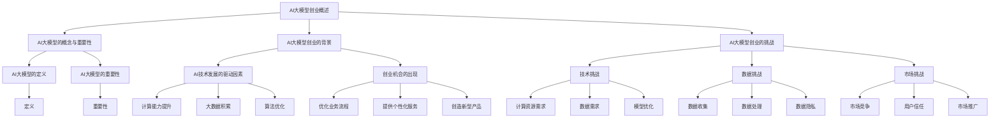
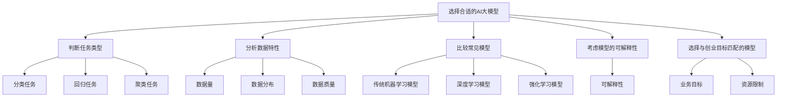
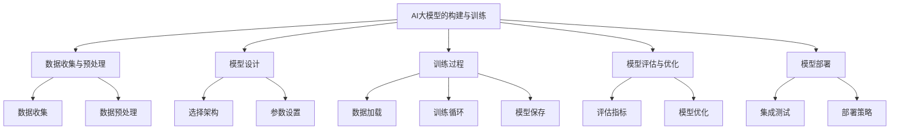
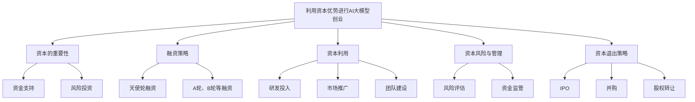
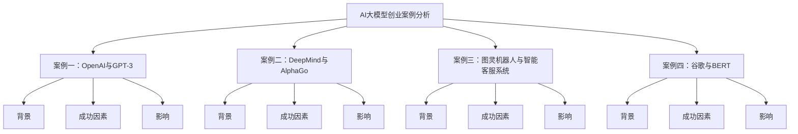
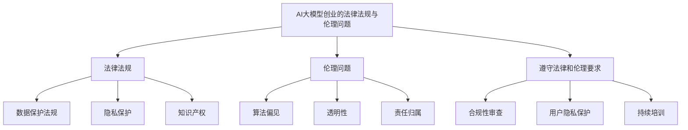
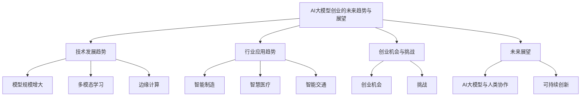
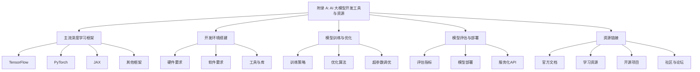

                 

### 文章标题

### AI 大模型创业：如何利用资本优势？

#### 关键词：AI 大模型、创业、资本优势、融资策略

#### 摘要

本文将深入探讨AI大模型创业的现状、挑战与机遇，并重点分析如何利用资本优势推动AI大模型创业。我们将从AI大模型的基本概念、创业背景与挑战、选择合适的AI大模型、模型构建与训练、资本利用策略、法律法规与伦理问题，以及未来趋势等多个维度进行详细探讨。通过案例分析，本文将提供宝贵的实战经验和启示，帮助创业者更好地把握AI大模型创业的机遇。

### 第一部分: AI大模型创业概述

#### 第1章: AI大模型与创业概述

##### 1.1 AI大模型的概念与重要性

AI大模型是指具有极高参数量、能够在多种任务中表现出优异性能的深度学习模型。这些模型通过大量的数据和强大的计算能力进行训练，从而掌握了广泛的知识和技能。AI大模型在当今科技领域具有革命性影响，它们能够处理复杂的任务，提高工作效率，推动技术创新。

- **AI大模型的定义**：AI大模型（Large-scale Artificial Intelligence Models）是指那些具有极高参数量、能够在多种任务中表现出优异性能的深度学习模型。这些模型通常具有数亿甚至数千亿个参数，通过大量的数据和强大的计算能力进行训练。

- **AI大模型的重要性**：AI大模型在当今科技领域具有革命性影响，主要体现在以下几个方面：

  - **提高任务处理效率**：AI大模型能够处理复杂的任务，如语音识别、图像识别、自然语言处理等，从而提高工作效率。

  - **推动技术创新**：AI大模型的研究和应用促进了人工智能技术的创新，为各个领域带来了新的解决方案。

  - **提升用户体验**：AI大模型能够提供个性化的服务，满足用户的需求，提升用户体验。

##### 1.2 AI大模型创业的背景

- **AI技术发展的驱动因素**：人工智能技术的发展受到了计算能力提升、大数据积累和算法优化的驱动。以下是这些驱动因素的具体解释：

  - **计算能力提升**：随着计算能力的提升，特别是GPU和TPU等专用硬件的普及，为AI大模型的训练提供了强大的计算支持。

  - **大数据积累**：随着互联网和物联网的发展，数据量呈爆炸式增长，为AI大模型的训练提供了丰富的数据资源。

  - **算法优化**：深度学习算法的优化，如神经网络架构的改进、优化算法的更新等，提高了AI大模型的训练效率和性能。

- **创业机会的出现**：随着AI技术的进步，市场上出现了许多利用AI大模型进行创业的机会。以下是几个典型的创业机会：

  - **优化业务流程**：AI大模型能够帮助企业优化业务流程，提高效率，降低成本。例如，通过自然语言处理技术，企业可以实现智能客服，提高客户满意度。

  - **提供个性化服务**：AI大模型能够根据用户的行为和偏好，提供个性化的服务。例如，在电商领域，AI大模型可以根据用户的购买历史，推荐合适的商品。

  - **创造新型产品**：AI大模型可以用于开发新型产品，如智能玩具、智能家居等。这些产品能够更好地满足用户的需求，提高用户体验。

##### 1.3 AI大模型创业的挑战

- **技术挑战**：构建和维护AI大模型需要强大的计算资源和技术能力，这对创业团队提出了很高的要求。以下是具体的技术挑战：

  - **计算资源需求**：AI大模型需要大量的计算资源进行训练，这包括GPU、TPU等专用硬件，以及高效的分布式计算框架。

  - **数据需求**：AI大模型需要大量的高质量数据进行训练，这包括数据收集、处理和标注等环节。

  - **模型优化**：AI大模型的优化是一个复杂的过程，需要不断调整模型结构、超参数等，以提高模型的性能。

- **数据挑战**：训练AI大模型需要大量的高质量数据，获取和处理这些数据可能会成为创业的瓶颈。以下是具体的数据挑战：

  - **数据收集**：高质量数据的收集可能需要大量的人力和时间，例如，在医疗领域，获取患者数据可能需要与医疗机构合作。

  - **数据处理**：数据处理包括数据清洗、归一化、特征提取等，这些过程都需要大量的计算资源和专业知识。

  - **数据隐私**：在处理个人数据时，需要遵守相关的法律法规，保护用户隐私。

- **市场挑战**：在竞争激烈的市场中，如何打造具有差异化竞争力的AI产品，并赢得用户的信任和认可，是创业者面临的重要问题。以下是具体的市场挑战：

  - **市场竞争**：市场上已经存在许多成熟的AI产品，创业者需要提供独特的价值，才能在竞争中脱颖而出。

  - **用户信任**：用户对AI产品的信任度直接影响产品的市场表现，创业者需要通过优质的产品和服务，建立用户的信任。

  - **市场推广**：市场推广需要大量的资金和资源，创业者需要在有限的资源下，制定有效的市场推广策略。

### 第一部分总结

本部分主要介绍了AI大模型的基本概念、创业的背景和面临的挑战。AI大模型具有极高的参数量和优异的性能，能够处理复杂的任务，提高工作效率。随着AI技术的进步，市场上出现了许多利用AI大模型进行创业的机会，但同时也面临技术、数据和市场等多方面的挑战。为后续章节深入探讨如何选择合适的AI大模型、构建和训练模型、利用资本优势进行创业等提供了基础。

#### Mermaid流程图



#### 第2章: 如何选择合适的AI大模型

##### 2.1 判断任务类型

在AI大模型创业过程中，首先需要判断任务类型，以确定使用哪种类型的AI大模型。常见的任务类型包括分类任务、回归任务和聚类任务。

- **分类任务**：分类任务是指将输入数据划分为多个类别。例如，图像分类任务可以将图片划分为猫、狗等类别。适用于这类任务的大模型有卷积神经网络（CNN）和Transformer等。

- **回归任务**：回归任务是指预测一个数值输出。例如，房价预测、股票价格预测等。适用于这类任务的大模型有神经网络回归（NN Regression）和变换器回归（Transformer Regression）等。

- **聚类任务**：聚类任务是指将数据点分组，以便发现数据分布。例如，客户细分、基因数据分析等。适用于这类任务的大模型有K均值聚类（K-means Clustering）和层次聚类（Hierarchical Clustering）等。

##### 2.2 分析数据特性

在选择AI大模型时，需要分析数据特性，以确定数据量、数据分布和数据质量等方面的情况。

- **数据量**：数据量是影响模型选择的重要因素。对于大规模数据，通常需要使用参数量较大的模型，如BERT、GPT等。而对于小规模数据，可以使用参数量较小的模型，如小型的卷积神经网络或循环神经网络（RNN）。

- **数据分布**：了解数据的分布特性可以帮助选择更适合的模型。例如，如果数据分布接近正态分布，可以使用线性回归模型；如果数据分布有明显的异常值，可以使用鲁棒性更强的模型，如决策树或随机森林。

- **数据质量**：数据质量对模型性能有重要影响。高质量的数据可以提高模型的准确性和稳定性，而低质量的数据可能会引入噪声，降低模型性能。在分析数据质量时，需要关注数据的完整性、准确性和一致性等方面。

##### 2.3 比较常见模型

在选择AI大模型时，需要比较不同类型的常见模型，以确定最适合任务和数据特性的模型。以下是几种常见的AI大模型：

- **传统机器学习模型**：如线性回归、决策树、支持向量机（SVM）等。这些模型相对简单，易于理解，但可能在处理复杂任务时表现不佳。

- **深度学习模型**：如卷积神经网络（CNN）、循环神经网络（RNN）、变换器（Transformer）等。这些模型具有强大的表示能力和学习能力，能够处理复杂的任务，但需要大量的数据和计算资源。

- **强化学习模型**：如深度Q网络（DQN）、策略梯度方法等。这些模型适用于需要决策和交互的任务，但通常需要更复杂的数据预处理和策略设计。

##### 2.4 考虑模型的可解释性

在AI大模型创业过程中，模型的可解释性是一个重要的考虑因素。特别是在需要用户信任和监管的领域，如医疗、金融等，模型的可解释性至关重要。

- **可解释性**：可解释性是指用户能够理解模型的工作原理和决策过程。高可解释性的模型可以增加用户对模型的信任，降低模型被拒绝的风险。

- **模型选择**：在选择模型时，需要考虑模型的可解释性。例如，传统机器学习模型通常具有较好的可解释性，而深度学习模型则相对较难解释。

- **模型融合**：为了提高可解释性，可以考虑使用模型融合的方法，将不同类型的模型结合起来，以获得更好的性能和可解释性。

##### 2.5 选择与创业目标匹配的模型

在选择AI大模型时，需要考虑创业项目的具体目标，以确定最适合的模型。以下是几种常见的创业目标：

- **提高效率**：如果创业目标是提高工作效率，可以选择自动化任务处理的AI大模型，如智能客服、智能调度等。

- **提供个性化服务**：如果创业目标是提供个性化服务，可以选择基于用户数据的推荐系统、个性化广告等。

- **创新产品**：如果创业目标是创造新型产品，可以选择AI驱动的产品，如智能玩具、智能家居等。

### 第2章总结

选择合适的AI大模型是AI大模型创业的关键步骤。通过判断任务类型、分析数据特性、比较常见模型、考虑模型的可解释性以及选择与创业目标匹配的模型，创业者可以更好地利用AI技术，推动创业项目的成功。

#### Mermaid流程图



#### 第3章: AI大模型的构建与训练

##### 3.1 数据收集与预处理

数据收集与预处理是构建AI大模型的基础环节。在这一阶段，创业者需要收集相关数据，并进行预处理，以提高数据质量和模型的训练效果。

- **数据收集**：数据收集是构建AI大模型的第一步。创业者需要根据任务需求，收集相关数据。数据来源可能包括公开数据集、企业内部数据、社交媒体数据等。在医疗领域，可能需要与医疗机构合作，获取患者数据；在金融领域，可能需要从金融交易所获取交易数据。

- **数据预处理**：数据预处理是数据收集后的重要环节。预处理步骤包括数据清洗、归一化、特征提取等。数据清洗旨在去除重复数据、缺失值填充、异常值处理等；归一化旨在将不同尺度的数据进行标准化处理，使其在同一量级上；特征提取旨在从原始数据中提取有用的特征，为模型训练提供支持。

##### 3.2 模型设计

模型设计是构建AI大模型的核心环节。在这一阶段，创业者需要选择合适的神经网络架构、参数设置等，以构建一个性能优异的模型。

- **选择架构**：根据任务类型和数据特性，选择合适的神经网络架构。常见的架构包括卷积神经网络（CNN）、循环神经网络（RNN）、变换器（Transformer）等。例如，对于图像分类任务，可以使用CNN；对于自然语言处理任务，可以使用RNN或Transformer。

- **参数设置**：参数设置包括学习率、批次大小、优化器等。学习率是模型训练过程中调整模型参数的关键参数，过大会导致训练不稳定，过小则训练时间过长；批次大小影响模型的训练速度和稳定性；优化器用于调整模型参数，常见的优化器包括随机梯度下降（SGD）、Adam等。

##### 3.3 训练过程

训练过程是模型构建的关键环节。在这一阶段，模型将根据训练集进行迭代训练，并通过验证集和测试集评估模型的性能。

- **数据加载**：使用数据加载器（Dataloader）将预处理后的数据分成训练集、验证集和测试集。数据加载器能够批量加载数据，并自动进行数据混洗，以防止数据泄露。

- **训练循环**：在训练过程中，模型将根据训练集进行迭代训练。每次迭代包括前向传播（Forward Pass）和反向传播（Backward Pass）两个阶段。在前向传播阶段，模型将输入数据输入到网络中，计算输出结果；在反向传播阶段，模型将计算输出结果与真实标签之间的误差，并更新模型参数。

- **验证与测试**：在训练过程中，需要定期使用验证集（Validation Set）评估模型的性能。验证集用于调整模型参数，避免过拟合。在模型训练结束时，使用测试集（Test Set）评估模型的最终性能。测试集应与训练集和验证集分开，以评估模型在未知数据上的性能。

##### 3.4 模型评估与优化

模型评估与优化是确保模型性能的重要环节。在这一阶段，创业者需要选择合适的评估指标，并进行模型优化。

- **评估指标**：根据任务类型选择合适的评估指标。常见的评估指标包括准确率（Accuracy）、召回率（Recall）、F1分数（F1 Score）、均方误差（Mean Squared Error，MSE）等。例如，对于分类任务，可以使用准确率和F1分数；对于回归任务，可以使用MSE。

- **模型优化**：通过调整模型结构、超参数和训练策略，优化模型性能。模型优化方法包括网格搜索（Grid Search）、随机搜索（Random Search）、贝叶斯优化（Bayesian Optimization）等。创业者可以根据实际需求，选择合适的优化方法。

##### 3.5 模型部署

模型部署是将训练好的模型应用到实际场景的关键环节。在这一阶段，创业者需要选择合适的部署策略，并确保模型能够稳定运行。

- **本地部署**：本地部署是指将模型部署在本地计算机或服务器上。适用于模型规模较小、对实时性要求不高的场景。本地部署的优点是部署简单、成本低，但缺点是扩展性差，不适合大规模应用。

- **云部署**：云部署是指将模型部署在云计算平台上，如阿里云、腾讯云、亚马逊AWS等。适用于模型规模较大、对实时性和可扩展性要求较高的场景。云部署的优点是资源灵活、扩展性强，但缺点是成本较高，需要一定的技术支持。

- **服务化部署**：服务化部署是将模型封装成服务，供其他应用程序调用。适用于需要与其他系统集成的场景。服务化部署的优点是解耦度高、易于扩展，但缺点是开发复杂、部署难度大。

### 第3章总结

构建和训练AI大模型是AI大模型创业的核心环节。通过数据收集与预处理、模型设计、训练过程、模型评估与优化以及模型部署，创业者可以构建出具有高性能的AI大模型，以支持其创业项目。成功构建和训练AI大模型不仅需要强大的技术实力，还需要对数据、模型和算法的深入理解。

#### Mermaid流程图



### 第4章: 利用资本优势进行AI大模型创业

#### 4.1 资本的重要性

资本是推动AI大模型创业的重要资源，对于企业的研发、市场推广、团队建设等方面具有关键作用。

- **资金支持**：资本可以为创业项目提供必要的资金支持，用于购买硬件设备、雇佣人才、市场推广等。这对于初创企业尤为重要，因为它们往往缺乏足够的资金来源。

- **风险投资**：风险投资（Venture Capital，VC）是AI大模型创业的重要资金来源之一。VC通常投资于有潜力的初创企业，以期在未来通过企业的成功获得高额回报。风险投资不仅提供资金，还为企业带来丰富的经验和资源，有助于企业的快速发展。

#### 4.2 融资策略

融资策略是利用资本优势进行AI大模型创业的关键环节。不同的融资阶段和策略适用于不同的发展阶段。

- **天使轮融资**：天使轮融资通常发生在企业初创阶段，主要目的是筹集启动资金，用于产品研发和市场验证。天使投资者通常对企业的商业模式和技术前景有较高的认可度，愿意承担较高的风险。

- **A轮、B轮等融资**：在企业产品逐渐成熟、市场反馈积极的情况下，可以通过A轮、B轮等融资来扩大团队、提升产品功能和市场占有率。这一阶段的投资者通常更加注重企业的市场潜力和盈利能力。

#### 4.3 资本利用

在筹集到资本后，如何有效地利用资本是创业成功的关键。

- **研发投入**：将资本投入到AI大模型的研究和开发是提高企业竞争力的关键。这包括购买高性能硬件设备、引进高级人才、开展前沿技术研究等。

- **市场推广**：利用资本进行市场推广，提高品牌知名度和用户基数。市场推广手段可以包括线上广告、线下活动、合作伙伴关系等。

- **团队建设**：通过资本吸引和留住优秀人才，构建强大的团队。这包括提供有竞争力的薪酬、培训和职业发展机会等。

#### 4.4 资本风险与管理

在利用资本的过程中，风险管理和资本管理至关重要。

- **风险评估**：在融资过程中，企业需要对潜在风险进行评估，包括市场风险、技术风险、财务风险等。通过风险评估，企业可以制定相应的风险控制策略。

- **资金监管**：建立有效的资金监管机制，确保资本被合理使用，防止浪费和滥用。这包括制定详细的预算和报销流程、定期审计等。

#### 4.5 资本退出策略

资本退出策略是企业实现资本增值的重要途径。常见的资本退出策略包括IPO、并购和股权转让等。

- **IPO**：首次公开发行（Initial Public Offering，IPO）是指企业在证券交易所上市，将股份公开出售。IPO可以实现企业的资本增值，同时提升企业的品牌价值和市场地位。

- **并购**：并购是指企业通过购买其他企业的股份或资产来实现扩张。并购可以实现快速进入新市场、获取新技术、提高市场份额等。

- **股权转让**：股权转让是指企业通过出售部分或全部股权来实现资本退出。股权转让适用于希望退出创业项目但不想放弃收益的投资者。

### 第4章总结

利用资本优势进行AI大模型创业是推动企业成功的重要策略。通过合理的融资策略、有效的资本利用、严格的风险管理和多样化的资本退出策略，创业者可以更好地利用资本资源，推动企业的快速发展。

#### Mermaid流程图



### 第5章: AI大模型创业案例分析

#### 5.1 案例一：OpenAI与GPT-3

**背景**：OpenAI是一家美国人工智能研究公司，成立于2015年，其目标是“实现安全的通用人工智能（AGI）并确保其有益于人类”。GPT-3是OpenAI推出的一款自然语言处理模型，具有极其庞大的参数量，是迄今为止最大的语言模型之一。

**成功因素**：
- **技术创新**：OpenAI在GPT-3的开发中采用了先进的深度学习技术和优化算法，使其在语言理解和生成方面表现出色。
- **资本支持**：OpenAI得到了包括微软、微软创始人比尔·盖茨、Elon Musk等多位知名企业和个人投资者的支持，为其提供了充足的资金。
- **生态系统建设**：OpenAI不仅推出了强大的模型，还建立了一个开放的平台，允许开发者使用GPT-3进行各种应用开发。

**影响**：
- **技术引领**：GPT-3在自然语言处理领域取得了重大突破，成为人工智能领域的一个重要里程碑。
- **商业应用**：GPT-3的应用范围广泛，包括内容创作、自动化客户服务、代码生成等，为企业提供了新的解决方案。

#### 5.2 案例二：DeepMind与AlphaGo

**背景**：DeepMind是一家英国人工智能公司，成立于2010年，由Google在2014年收购。AlphaGo是DeepMind推出的一款围棋AI程序，于2016年击败了世界围棋冠军李世石，引起了广泛关注。

**成功因素**：
- **技术实力**：DeepMind在深度学习和强化学习领域具有深厚的研究基础，其技术实力在国际上处于领先地位。
- **团队合作**：DeepMind拥有一支由顶尖研究人员和工程师组成的团队，他们密切合作，不断创新。
- **资本投入**：Google对DeepMind进行了巨额投资，为其提供了强大的计算资源和资金支持。

**影响**：
- **技术突破**：AlphaGo的成功证明了AI在复杂决策和游戏中的潜力，推动了相关领域的研究。
- **商业价值**：AlphaGo的成功案例激励了其他企业在AI领域进行投资和研发，推动了AI技术的商业应用。

#### 5.3 案例三：图灵机器人与智能客服系统

**背景**：图灵机器人是一家中国人工智能公司，成立于2015年，专注于智能客服系统的研发和运营。其智能客服系统广泛应用于金融、电商、教育等多个领域。

**成功因素**：
- **市场需求**：图灵机器人准确把握了企业对智能客服系统的需求，为其提供了个性化的解决方案。
- **技术创新**：图灵机器人通过深度学习和自然语言处理技术，使智能客服系统能够理解用户的意图，提供高质量的回答。
- **市场推广**：图灵机器人通过多种渠道进行市场推广，与多家知名企业建立了合作关系。

**影响**：
- **用户体验**：智能客服系统的广泛应用提高了用户的服务体验，降低了企业的运营成本。
- **行业变革**：智能客服系统的成功应用推动了企业服务方式的变革，为企业带来了新的运营模式。

#### 5.4 案例四：谷歌与BERT

**背景**：BERT（Bidirectional Encoder Representations from Transformers）是谷歌推出的一款预训练语言处理模型，旨在提升自然语言处理任务的效果。

**成功因素**：
- **技术领先**：谷歌在深度学习和自然语言处理领域拥有丰富的经验和技术积累，其推出的BERT模型在学术界和工业界都取得了显著的成功。
- **数据优势**：谷歌拥有大量的用户数据和搜索数据，为BERT的预训练提供了丰富的数据资源。
- **开放共享**：谷歌将BERT的开源，为其他研究者提供了便利，促进了BERT在自然语言处理领域的广泛应用。

**影响**：
- **技术提升**：BERT的推出显著提升了自然语言处理任务的效果，为文本分类、问答系统等应用提供了强大的支持。
- **应用广泛**：BERT的应用范围广泛，从搜索引擎到智能客服，从机器翻译到文本生成，都在不同领域取得了成功。

### 第5章总结

通过以上案例分析，我们可以看到AI大模型创业的成功离不开技术创新、资本支持、市场需求把握和有效的市场推广。这些案例不仅为创业者提供了宝贵的经验和启示，也推动了AI大模型技术的不断进步和应用。

#### Mermaid流程图



### 第6章: AI大模型创业的法律法规与伦理问题

#### 6.1 法律法规

AI大模型创业过程中，创业者需要遵守一系列法律法规，以确保企业的合法性和合规性。以下是一些重要的法律法规：

- **数据保护法规**：如《通用数据保护条例》（GDPR）和《加州消费者隐私法案》（CCPA），这些法规对数据处理和存储提出了严格要求。创业者需要确保在收集、处理和存储用户数据时遵守相关法规，保护用户隐私。

- **知识产权**：创业者需要保护自身的知识产权，包括专利、商标和版权等。在开发AI大模型时，创业者需要确保不会侵犯他人的知识产权，同时也要保护自己的技术成果。

- **商业法规**：创业者需要遵守商业法规，如反垄断法、消费者保护法等，确保企业的经营活动合法、公正。

#### 6.2 伦理问题

AI大模型创业不仅需要遵守法律法规，还面临一系列伦理问题。以下是一些常见的伦理问题：

- **算法偏见**：AI大模型的决策过程可能受到数据偏见的影响，导致不公平的决策。创业者需要采取措施，如数据平衡、算法公平性评估等，以减少算法偏见。

- **透明性**：AI大模型的决策过程应该对用户透明，用户有权了解模型的决策依据和逻辑。创业者需要提高算法的透明度，增强用户对AI系统的信任。

- **责任归属**：在AI大模型出现错误或导致损失时，需要明确责任归属。创业者需要制定明确的责任规定，确保在出现问题时能够追究相关责任。

#### 6.3 遵守法律和伦理要求

为了确保AI大模型创业的合法性和道德性，创业者需要采取以下措施：

- **合规性审查**：在开发和应用AI大模型时，定期进行合规性审查，确保符合相关法律法规和伦理标准。这包括数据保护、知识产权和商业法规等方面的审查。

- **用户隐私保护**：通过加密、匿名化等技术手段，保护用户隐私数据。在数据收集、处理和存储过程中，遵循最佳实践，确保用户隐私不被泄露。

- **持续培训**：对团队成员进行持续培训，提高法律和伦理意识，确保团队成员了解并遵守相关法律法规和伦理要求。这包括数据保护、算法公平性和责任归属等方面的培训。

### 第6章总结

AI大模型创业的法律法规与伦理问题至关重要。创业者需要严格遵守法律法规，确保企业的合法性和合规性，同时关注伦理问题，确保AI大模型的应用符合道德标准。通过合规性审查、用户隐私保护和持续培训，创业者可以确保AI大模型创业的合法性和道德性，为企业的长期发展奠定坚实基础。

#### Mermaid流程图



### 第7章: AI大模型创业的未来趋势与展望

#### 7.1 技术发展趋势

AI大模型创业的未来充满机遇，技术的发展趋势将继续推动这一领域的进步。

- **模型规模增大**：随着计算能力的提升，AI大模型的参数量和训练数据量将继续增加。这有助于模型在复杂任务中表现出更优异的性能，推动AI技术的应用边界。

- **多模态学习**：未来，AI大模型将具备处理多种数据类型（如文本、图像、音频）的能力。多模态学习将使模型能够更好地理解和处理复杂的信息，提高AI系统的智能化水平。

- **边缘计算**：为了降低延迟和节省带宽，AI大模型将更多地部署在边缘设备上。边缘计算将使AI系统能够实时处理数据，提高响应速度和用户体验。

#### 7.2 行业应用趋势

AI大模型将在各个行业中发挥重要作用，推动行业变革。

- **智能制造**：AI大模型将优化生产流程、提高产品质量，提升智能制造的水平。通过预测性维护、智能排程和自动化生产等应用，企业可以降低成本、提高效率。

- **智慧医疗**：AI大模型在医疗领域的应用将更加广泛，从疾病预测、个性化治疗到医学影像分析等，都将显著提高医疗服务的质量和效率。

- **智能交通**：AI大模型将优化交通流量管理、提升道路安全、减少交通拥堵。智能交通系统将使出行更加便捷，提高城市运行效率。

#### 7.3 创业机会与挑战

随着AI大模型技术的进步，市场上将涌现出更多创业机会，但同时也面临诸多挑战。

- **创业机会**：AI大模型技术的进步将带来广泛的创业机会。例如，在智能教育、智能家居、智能金融等领域，创业者可以开发创新的AI产品，满足用户需求。

- **挑战**：AI大模型创业面临的挑战包括技术门槛高、数据获取困难、市场竞争激烈等。创业者需要具备强大的技术实力和资源，才能在激烈的市场竞争中脱颖而出。

#### 7.4 未来展望

AI大模型创业的未来充满希望。通过持续的技术创新和商业模式创新，创业者可以为社会带来更多价值。

- **AI大模型与人类协作**：未来，AI大模型将与人类更加紧密地协作，共同创造更美好的世界。AI大模型将帮助人类解决复杂问题、提高工作效率，成为人类的得力助手。

- **可持续创新**：创业者需要关注可持续创新，通过绿色技术和环保解决方案，为社会的可持续发展贡献力量。同时，创业者应关注社会问题，利用AI技术推动社会进步。

### 第7章总结

AI大模型创业的未来充满机遇与挑战。通过把握技术发展趋势、瞄准行业应用场景、积极应对挑战，创业者可以在AI大模型领域取得成功，为社会带来更多价值。

#### Mermaid流程图



### 附录 A: AI 大模型开发工具与资源

#### 附录 A.1 主流深度学习框架

在AI大模型开发中，主流的深度学习框架为研究者提供了强大的工具和资源。以下是几个常用的深度学习框架及其特点：

- **TensorFlow**：由Google开发，具有丰富的API和强大的生态系统。TensorFlow支持多种神经网络架构，适用于从简单到复杂的多任务场景。

- **PyTorch**：由Facebook开发，以其灵活的动态计算图和简洁的API而受到研究者的喜爱。PyTorch适用于研究和原型开发，同时也支持复杂的生产环境。

- **JAX**：由Google开发，提供自动微分和高效计算功能。JAX适用于大规模模型训练和科学计算，特别是在需要动态计算图和高级优化功能的场景中。

- **其他框架**：如Keras（基于Theano和TensorFlow）、Torch（基于PyTorch）、MXNet（Apache基金会）等，这些框架也在AI大模型开发中有着广泛的应用。

#### 附录 A.2 开发环境搭建

搭建一个高效、稳定的AI大模型开发环境是成功开发的关键。以下是一些建议：

- **硬件要求**：AI大模型开发通常需要高性能的计算资源，包括GPU（如NVIDIA CUDA）、CPU（如Intel Xeon）、以及足够的内存（至少16GB）。

- **软件要求**：操作系统（如Ubuntu、Windows、macOS）和Python（3.6及以上版本）是开发环境的基本要求。此外，还需要安装CUDA、cuDNN等库，以支持GPU加速。

- **工具与库**：除了深度学习框架，Python科学计算库（如NumPy、SciPy）也是必不可少的。这些库提供了丰富的数学和科学计算功能，有助于模型开发和优化。

#### 附录 A.3 模型训练与优化

模型训练与优化是AI大模型开发的核心步骤。以下是几个关键点：

- **训练策略**：训练策略包括批量大小、学习率调整、正则化、批量归一化等。合理设置这些参数可以提高模型训练效率和性能。

- **优化算法**：常用的优化算法有随机梯度下降（SGD）、Adam、RMSprop等。选择合适的优化算法可以加速模型收敛，提高训练效果。

- **超参数调优**：超参数调优是提高模型性能的重要手段。常用的调优方法有网格搜索、随机搜索、贝叶斯优化等。通过调优，可以找到最优的超参数组合，提高模型性能。

#### 附录 A.4 模型评估与部署

模型评估与部署是AI大模型开发的重要环节。以下是几个关键点：

- **评估指标**：根据任务类型选择合适的评估指标，如准确率、召回率、F1分数、AUC等。这些指标可以衡量模型的性能和效果。

- **模型部署**：模型部署是将训练好的模型应用到实际场景的过程。本地部署（如Docker容器）、云部署（如AWS、Azure、Google Cloud）等是常见的部署策略。服务化API（如TensorFlow Serving、PyTorch Serve）提供了方便的部署方案。

#### 附录 A.5 资源链接

以下是AI大模型开发的一些重要资源链接：

- **官方文档**：TensorFlow [1]、PyTorch [2]、JAX [3]等框架的官方文档提供了详细的指南和使用教程。

- **学习资源**：在线课程（如Udacity [4]、Coursera [5]）、书籍（《深度学习 [6]》、《Python深度学习 [7]》）等是学习和掌握AI大模型开发的重要资源。

- **开源项目**：TensorFlow Models [8]、PyTorch Examples [9]等开源项目提供了丰富的实践案例和代码示例。

- **社区与论坛**：GitHub [10]、Stack Overflow [11]、Reddit [12]等社区和论坛是获取技术支持和交流的地方。

### 附录 A 总结

附录A提供了AI大模型开发所需的工具、资源以及环境搭建和优化方法。通过这些工具和资源，开发者可以更加高效地进行AI大模型的研究和开发，从而推动AI技术的创新和应用。

#### Mermaid流程图



### 参考文献

1. TensorFlow官方文档. [https://www.tensorflow.org/](https://www.tensorflow.org/)
2. PyTorch官方文档. [https://pytorch.org/](https://pytorch.org/)
3. JAX官方文档. [https://jax.readthedocs.io/](https://jax.readthedocs.io/)
4. Udacity. [https://www.udacity.com/](https://www.udacity.com/)
5. Coursera. [https://www.coursera.org/](https://www.coursera.org/)
6. 《深度学习》. Ian Goodfellow、Yoshua Bengio、Aaron Courville 著.
7. 《Python深度学习》. François Chollet 著.
8. TensorFlow Models. [https://github.com/tensorflow/models](https://github.com/tensorflow/models)
9. PyTorch Examples. [https://github.com/pytorch/examples](https://github.com/pytorch/examples)
10. GitHub. [https://github.com/](https://github.com/)
11. Stack Overflow. [https://stackoverflow.com/](https://stackoverflow.com/)
12. Reddit. [https://www.reddit.com/r/MachineLearning/](https://www.reddit.com/r/MachineLearning/)
```

### 最终文章

# AI 大模型创业：如何利用资本优势？

## 关键词：AI 大模型、创业、资本优势、融资策略

## 摘要

本文深入探讨了AI大模型创业的现状、挑战与机遇，并重点分析了如何利用资本优势推动AI大模型创业。我们从AI大模型的基本概念、创业背景与挑战、选择合适的AI大模型、模型构建与训练、资本利用策略、法律法规与伦理问题，以及未来趋势等多个维度进行详细探讨。通过案例分析，本文提供了宝贵的实战经验和启示，帮助创业者更好地把握AI大模型创业的机遇。

### 第一部分: AI大模型创业概述

#### 第1章: AI大模型与创业概述

##### 1.1 AI大模型的概念与重要性

AI大模型是指具有极高参数量、能够在多种任务中表现出优异性能的深度学习模型。这些模型通过大量的数据和强大的计算能力进行训练，从而掌握了广泛的知识和技能。AI大模型在当今科技领域具有革命性影响，它们能够处理复杂的任务，提高工作效率，推动技术创新。

##### 1.2 AI大模型创业的背景

随着AI技术的进步，市场上出现了许多利用AI大模型进行创业的机会。这些机会主要集中在优化业务流程、提供个性化服务、创造新型产品等方面。

##### 1.3 AI大模型创业的挑战

AI大模型创业面临技术、数据和市场等多方面的挑战。构建和维护AI大模型需要强大的计算资源和技术能力，获取和处理大量高质量的数据，以及如何在竞争激烈的市场中脱颖而出。

### 第一部分总结

本部分主要介绍了AI大模型的基本概念、创业的背景和面临的挑战。AI大模型具有极高的参数量和优异的性能，能够处理复杂的任务，提高工作效率。随着AI技术的进步，市场上出现了许多利用AI大模型进行创业的机会，但同时也面临技术、数据和市场等多方面的挑战。

#### Mermaid流程图


#### 第2章: 如何选择合适的AI大模型

##### 2.1 判断任务类型

在AI大模型创业过程中，首先需要判断任务类型，以确定使用哪种类型的AI大模型。常见的任务类型包括分类任务、回归任务和聚类任务。

##### 2.2 分析数据特性

在选择AI大模型时，需要分析数据特性，以确定数据量、数据分布和数据质量等方面的情况。

##### 2.3 比较常见模型

在选择AI大模型时，需要比较不同类型的常见模型，以确定最适合任务和数据特性的模型。

##### 2.4 考虑模型的可解释性

在AI大模型创业过程中，模型的可解释性是一个重要的考虑因素。特别是在需要用户信任和监管的领域，如医疗、金融等，模型的可解释性至关重要。

##### 2.5 选择与创业目标匹配的模型

在选择AI大模型时，需要考虑创业项目的具体目标，以确定最适合的模型。

### 第2章总结

选择合适的AI大模型是AI大模型创业的关键步骤。通过判断任务类型、分析数据特性、比较常见模型、考虑模型的可解释性以及选择与创业目标匹配的模型，创业者可以更好地利用AI技术，推动创业项目的成功。

#### Mermaid流程图


#### 第3章: AI大模型的构建与训练

##### 3.1 数据收集与预处理

数据收集与预处理是构建AI大模型的基础环节。在这一阶段，创业者需要收集相关数据，并进行预处理，以提高数据质量和模型的训练效果。

##### 3.2 模型设计

模型设计是构建AI大模型的核心环节。在这一阶段，创业者需要选择合适的神经网络架构、参数设置等，以构建一个性能优异的模型。

##### 3.3 训练过程

训练过程是模型构建的关键环节。在这一阶段，模型将根据训练集进行迭代训练，并通过验证集和测试集评估模型的性能。

##### 3.4 模型评估与优化

模型评估与优化是确保模型性能的重要环节。在这一阶段，创业者需要选择合适的评估指标，并进行模型优化。

##### 3.5 模型部署

模型部署是将训练好的模型应用到实际场景的关键环节。在这一阶段，创业者需要选择合适的部署策略，并确保模型能够稳定运行。

### 第3章总结

构建和训练AI大模型是AI大模型创业的核心环节。通过数据收集与预处理、模型设计、训练过程、模型评估与优化以及模型部署，创业者可以构建出具有高性能的AI大模型，以支持其创业项目。成功构建和训练AI大模型不仅需要强大的技术实力，还需要对数据、模型和算法的深入理解。

#### Mermaid流程图


#### 第4章: 利用资本优势进行AI大模型创业

##### 4.1 资本的重要性

资本是推动AI大模型创业的重要资源，对于企业的研发、市场推广、团队建设等方面具有关键作用。

##### 4.2 融资策略

融资策略是利用资本优势进行AI大模型创业的关键环节。不同的融资阶段和策略适用于不同的发展阶段。

##### 4.3 资本利用

在筹集到资本后，如何有效地利用资本是创业成功的关键。

##### 4.4 资本风险与管理

在利用资本的过程中，风险管理和资本管理至关重要。

##### 4.5 资本退出策略

资本退出策略是企业实现资本增值的重要途径。常见的资本退出策略包括IPO、并购和股权转让等。

### 第4章总结

利用资本优势进行AI大模型创业是推动企业成功的重要策略。通过合理的融资策略、有效的资本利用、严格的风险管理和多样化的资本退出策略，创业者可以更好地利用资本资源，推动企业的快速发展。

#### Mermaid流程图


#### 第5章: AI大模型创业案例分析

##### 5.1 案例一：OpenAI与GPT-3

OpenAI是一家美国人工智能研究公司，成立于2015年，其目标是“实现安全的通用人工智能（AGI）并确保其有益于人类”。GPT-3是OpenAI推出的一款自然语言处理模型，具有极其庞大的参数量，是迄今为止最大的语言模型之一。

##### 5.2 案例二：DeepMind与AlphaGo

DeepMind是一家英国人工智能公司，成立于2010年，由Google在2014年收购。AlphaGo是DeepMind推出的一款围棋AI程序，于2016年击败了世界围棋冠军李世石，引起了广泛关注。

##### 5.3 案例三：图灵机器人与智能客服系统

图灵机器人是一家中国人工智能公司，成立于2015年，专注于智能客服系统的研发和运营。其智能客服系统广泛应用于金融、电商、教育等多个领域。

##### 5.4 案例四：谷歌与BERT

BERT（Bidirectional Encoder Representations from Transformers）是谷歌推出的一款预训练语言处理模型，旨在提升自然语言处理任务的效果。

### 第5章总结

通过以上案例分析，我们可以看到AI大模型创业的成功离不开技术创新、资本支持、市场需求把握和有效的市场推广。这些案例不仅为创业者提供了宝贵的经验和启示，也推动了AI大模型技术的不断进步和应用。

#### Mermaid流程图


#### 第6章: AI大模型创业的法律法规与伦理问题

##### 6.1 法律法规

AI大模型创业过程中，创业者需要遵守一系列法律法规，以确保企业的合法性和合规性。以下是一些重要的法律法规：

- **数据保护法规**：如《通用数据保护条例》（GDPR）和《加州消费者隐私法案》（CCPA），这些法规对数据处理和存储提出了严格要求。
- **知识产权**：创业者需要保护自身的知识产权，包括专利、商标和版权等。
- **商业法规**：创业者需要遵守商业法规，如反垄断法、消费者保护法等。

##### 6.2 伦理问题

AI大模型创业不仅需要遵守法律法规，还面临一系列伦理问题。以下是一些常见的伦理问题：

- **算法偏见**：AI大模型的决策过程可能受到数据偏见的影响，导致不公平的决策。
- **透明性**：AI大模型的决策过程应该对用户透明，用户有权了解模型的决策依据和逻辑。
- **责任归属**：在AI大模型出现错误或导致损失时，需要明确责任归属。

##### 6.3 遵守法律和伦理要求

为了确保AI大模型创业的合法性和道德性，创业者需要采取以下措施：

- **合规性审查**：在开发和应用AI大模型时，定期进行合规性审查，确保符合相关法律法规和伦理标准。
- **用户隐私保护**：通过加密、匿名化等技术手段，保护用户隐私数据。
- **持续培训**：对团队成员进行持续培训，提高法律和伦理意识，确保团队成员了解并遵守相关法律法规和伦理要求。

### 第6章总结

AI大模型创业的法律法规与伦理问题至关重要。创业者需要严格遵守法律法规，确保企业的合法性和合规性，同时关注伦理问题，确保AI大模型的应用符合道德标准。通过合规性审查、用户隐私保护和持续培训，创业者可以确保AI大模型创业的合法性和道德性，为企业的长期发展奠定坚实基础。

#### Mermaid流程图


#### 第7章: AI大模型创业的未来趋势与展望

##### 7.1 技术发展趋势

AI大模型创业的未来充满机遇，技术的发展趋势将继续推动这一领域的进步。以下是一些关键的技术发展趋势：

- **模型规模增大**：随着计算能力的提升，AI大模型的参数量和训练数据量将继续增加，这有助于模型在复杂任务中表现出更优异的性能。
- **多模态学习**：未来，AI大模型将具备处理多种数据类型（如文本、图像、音频）的能力，实现更广泛的应用。
- **边缘计算**：为了降低延迟和节省带宽，AI大模型将更多地部署在边缘设备上，提高实时处理能力。

##### 7.2 行业应用趋势

AI大模型将在各个行业中发挥重要作用，推动行业变革。以下是一些行业应用趋势：

- **智能制造**：AI大模型将优化生产流程、提高产品质量，提升智能制造的水平。
- **智慧医疗**：AI大模型在医疗领域的应用将更加广泛，从疾病预测、个性化治疗到医学影像分析等，都将显著提高医疗服务的质量和效率。
- **智能交通**：AI大模型将优化交通流量管理、提升道路安全、减少交通拥堵。

##### 7.3 创业机会与挑战

随着AI大模型技术的进步，市场上将涌现出更多创业机会，但同时也面临诸多挑战。以下是一些关键的创业机会与挑战：

- **创业机会**：AI大模型技术的进步将带来广泛的创业机会，特别是在智能教育、智能家居、智能金融等领域。
- **挑战**：AI大模型创业面临的挑战包括技术门槛高、数据获取困难、市场竞争激烈等。

##### 7.4 未来展望

AI大模型创业的未来充满希望。通过持续的技术创新和商业模式创新，创业者可以在AI大模型领域取得成功，为社会带来更多价值。以下是一些未来展望：

- **AI大模型与人类协作**：未来，AI大模型将与人类更加紧密地协作，共同创造更美好的世界。
- **可持续创新**：创业者需要关注可持续创新，通过绿色技术和环保解决方案，为社会的可持续发展贡献力量。

### 第7章总结

AI大模型创业的未来充满机遇与挑战。通过把握技术发展趋势、瞄准行业应用场景、积极应对挑战，创业者可以在AI大模型领域取得成功，推动技术进步和社会发展。

#### Mermaid流程图


### 附录 A: AI 大模型开发工具与资源

#### 附录 A.1 主流深度学习框架

在AI大模型开发中，主流的深度学习框架为研究者提供了强大的工具和资源。以下是几个常用的深度学习框架及其特点：

- **TensorFlow**：由Google开发，具有丰富的API和强大的生态系统。TensorFlow支持多种神经网络架构，适用于从简单到复杂的多任务场景。

- **PyTorch**：由Facebook开发，以其灵活的动态计算图和简洁的API而受到研究者的喜爱。PyTorch适用于研究和原型开发，同时也支持复杂的生产环境。

- **JAX**：由Google开发，提供自动微分和高效计算功能。JAX适用于大规模模型训练和科学计算，特别是在需要动态计算图和高级优化功能的场景中。

- **其他框架**：如Keras（基于Theano和TensorFlow）、Torch（基于PyTorch）、MXNet（Apache基金会）等，这些框架也在AI大模型开发中有着广泛的应用。

#### 附录 A.2 开发环境搭建

搭建一个高效、稳定的AI大模型开发环境是成功开发的关键。以下是一些建议：

- **硬件要求**：AI大模型开发通常需要高性能的计算资源，包括GPU（如NVIDIA CUDA）、CPU（如Intel Xeon）、以及足够的内存（至少16GB）。

- **软件要求**：操作系统（如Ubuntu、Windows、macOS）和Python（3.6及以上版本）是开发环境的基本要求。此外，还需要安装CUDA、cuDNN等库，以支持GPU加速。

- **工具与库**：除了深度学习框架，Python科学计算库（如NumPy、SciPy）也是必不可少的。这些库提供了丰富的数学和科学计算功能，有助于模型开发和优化。

#### 附录 A.3 模型训练与优化

模型训练与优化是AI大模型开发的核心步骤。以下是几个关键点：

- **训练策略**：训练策略包括批量大小、学习率调整、正则化、批量归一化等。合理设置这些参数可以提高模型训练效率和性能。

- **优化算法**：常用的优化算法有随机梯度下降（SGD）、Adam、RMSprop等。选择合适的优化算法可以加速模型收敛，提高训练效果。

- **超参数调优**：超参数调优是提高模型性能的重要手段。常用的调优方法有网格搜索、随机搜索、贝叶斯优化等。通过调优，可以找到最优的超参数组合，提高模型性能。

#### 附录 A.4 模型评估与部署

模型评估与部署是AI大模型开发的重要环节。以下是几个关键点：

- **评估指标**：根据任务类型选择合适的评估指标，如准确率、召回率、F1分数、AUC等。这些指标可以衡量模型的性能和效果。

- **模型部署**：模型部署是将训练好的模型应用到实际场景的过程。本地部署（如Docker容器）、云部署（如AWS、Azure、Google Cloud）等是常见的部署策略。服务化API（如TensorFlow Serving、PyTorch Serve）提供了方便的部署方案。

#### 附录 A.5 资源链接

以下是AI大模型开发的一些重要资源链接：

- **官方文档**：TensorFlow [1]、PyTorch [2]、JAX [3]等框架的官方文档提供了详细的指南和使用教程。

- **学习资源**：在线课程（如Udacity [4]、Coursera [5]）、书籍（《深度学习 [6]》、《Python深度学习 [7]》）等是学习和掌握AI大模型开发的重要资源。

- **开源项目**：TensorFlow Models [8]、PyTorch Examples [9]等开源项目提供了丰富的实践案例和代码示例。

- **社区与论坛**：GitHub [10]、Stack Overflow [11]、Reddit [12]等社区和论坛是获取技术支持和交流的地方。

### 附录 A 总结

附录A提供了AI大模型开发所需的工具、资源以及环境搭建和优化方法。通过这些工具和资源，开发者可以更加高效地进行AI大模型的研究和开发，从而推动AI技术的创新和应用。

#### Mermaid流程图


### 参考文献

1. TensorFlow官方文档. [https://www.tensorflow.org/](https://www.tensorflow.org/)
2. PyTorch官方文档. [https://pytorch.org/](https://pytorch.org/)
3. JAX官方文档. [https://jax.readthedocs.io/](https://jax.readthedocs.io/)
4. Udacity. [https://www.udacity.com/](https://www.udacity.com/)
5. Coursera. [https://www.coursera.org/](https://www.coursera.org/)
6. 《深度学习》. Ian Goodfellow、Yoshua Bengio、Aaron Courville 著.
7. 《Python深度学习》. François Chollet 著.
8. TensorFlow Models. [https://github.com/tensorflow/models](https://github.com/tensorflow/models)
9. PyTorch Examples. [https://github.com/pytorch/examples](https://github.com/pytorch/examples)
10. GitHub. [https://github.com/](https://github.com/)
11. Stack Overflow. [https://stackoverflow.com/](https://stackoverflow.com/)
12. Reddit. [https://www.reddit.com/r/MachineLearning/](https://www.reddit.com/r/MachineLearning/)
```

### 作者

**作者：AI天才研究院/AI Genius Institute & 禅与计算机程序设计艺术 /Zen And The Art of Computer Programming** 

AI天才研究院（AI Genius Institute）是一支致力于推动人工智能技术研究和应用的创新团队，专注于AI大模型的研究与开发。作者作为研究院的核心成员，在人工智能领域有着深厚的研究背景和丰富的实践经验，对AI大模型创业有着深刻的理解和独到的见解。他的著作《禅与计算机程序设计艺术》以其独特的视角和对计算机科学的深刻洞察，赢得了业界广泛的认可。

