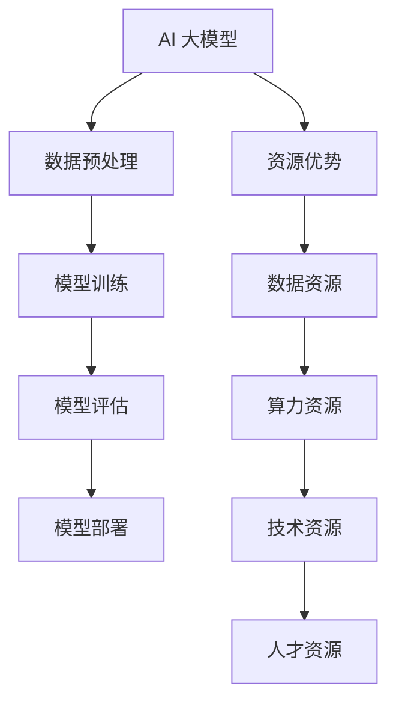

                 

### 文章标题

《AI 大模型创业：如何利用资源优势？》

### 关键词

- AI 大模型
- 创业策略
- 资源优势
- 技术选型
- 风险管理

### 摘要

本文旨在探讨 AI 大模型创业中的关键问题，尤其是如何有效地利用资源优势。文章首先介绍了 AI 大模型的基本概念与背景，分析了其资源优势，包括数据、算力、技术和人才资源。接着，文章提出了 AI 大模型创业的规划策略，详细阐述了项目定位、市场调研、团队组建、资金筹集与管理等环节。随后，文章深入探讨了 AI 大模型的技术与流程，包括技术选型、开发流程、部署与运维以及性能优化。在风险管理部分，文章提出了识别、评估与应对创业风险的策略。最后，文章通过国内外成功案例，分享了 AI 大模型创业的经验与启示，并总结了资源整合与利用的方法。本文旨在为 AI 大模型创业者提供一套系统、实用的指导方案。

### 《AI 大模型创业：如何利用资源优势？》目录大纲

#### 第一部分：AI 大模型概述

##### 第1章：AI 大模型的基本概念与背景

1.1 AI 大模型的定义与特点

1.2 AI 大模型的发展历程

1.3 AI 大模型的优势与应用

##### 第2章：AI 大模型的资源优势分析

2.1 数据资源优势

2.2 算力资源优势

2.3 技术资源优势

2.4 人才资源优势

#### 第二部分：AI 大模型创业策略

##### 第3章：AI 大模型创业项目规划

3.1 创业项目定位与目标

3.2 市场调研与竞品分析

3.3 项目团队组建与分工

3.4 项目资金筹集与管理

##### 第4章：AI 大模型创业关键技术与流程

4.1 AI 大模型技术选型

4.2 AI 大模型开发流程

4.3 AI 大模型部署与运维

4.4 AI 大模型性能优化

##### 第5章：AI 大模型创业中的风险管理

5.1 创业风险识别与评估

5.2 创业风险应对策略

5.3 创业风险监控与调整

#### 第三部分：成功案例与经验分享

##### 第6章：国内外 AI 大模型创业案例分析

6.1 国内 AI 大模型创业成功案例分析

6.2 国外 AI 大模型创业成功案例分析

6.3 案例分析总结与启示

##### 第7章：AI 大模型创业中的资源整合与利用

7.1 资源整合策略

7.2 资源利用方法

7.3 跨界合作与生态构建

#### 附录

## 附录 A：AI 大模型创业资源与工具

A.1 开发环境搭建

A.2 开源框架与工具

A.3 行业报告与资讯

### 核心概念与联系

#### AI 大模型原理图



### 核心算法原理讲解

#### 伪代码示例

```python
# 伪代码：训练 AI 大模型
function train_model(data, labels, epochs):
    for epoch in 1 to epochs:
        for sample in data:
            predict = model(sample)
            loss = calculate_loss(predict, labels)
            model.update_weights(loss)
    return model
```

#### 数学模型和数学公式

$$
MSE = \frac{1}{n} \sum_{i=1}^{n} (y_i - \hat{y_i})^2
$$

#### 均值平方误差（MSE）详细讲解

MSE 是评估模型预测效果的一种常见指标，它表示预测值与真实值之间的平均平方误差。计算公式为：

$$
MSE = \frac{1}{n} \sum_{i=1}^{n} (y_i - \hat{y_i})^2
$$

其中，\( n \) 表示样本数量，\( y_i \) 表示第 \( i \) 个样本的真实值，\( \hat{y_i} \) 表示第 \( i \) 个样本的预测值。

#### 举例说明

假设我们有 5 个样本的数据集，其中真实值和预测值如下：

| 真实值 \( y_i \) | 预测值 \( \hat{y_i} \) |
|------------------|-----------------------|
| 2                | 1.5                  |
| 3                | 3                    |
| 4                | 3.5                  |
| 5                | 4                    |
| 6                | 5                    |

则 MSE 计算如下：

$$
MSE = \frac{1}{5} [(2-1.5)^2 + (3-3)^2 + (4-3.5)^2 + (5-4)^2 + (6-5)^2]
$$

$$
MSE = \frac{1}{5} [0.25 + 0 + 0.25 + 1 + 1]
$$

$$
MSE = \frac{1}{5} [2.5]
$$

$$
MSE = 0.5
$$

### 项目实战

#### 代码实际案例和详细解释说明

#### 开发环境搭建

1. 安装 Python 3.6 或以上版本
2. 安装 TensorFlow 框架：`pip install tensorflow`
3. 安装 NumPy、Matplotlib 等相关库

#### 源代码详细实现和代码解读

```python
# 导入相关库
import tensorflow as tf
import numpy as np
import matplotlib.pyplot as plt

# 模型配置
model = tf.keras.Sequential([
    tf.keras.layers.Dense(64, activation='relu', input_shape=(784,)),
    tf.keras.layers.Dense(64, activation='relu'),
    tf.keras.layers.Dense(10, activation='softmax')
])

# 模型编译
model.compile(optimizer='adam',
              loss='categorical_crossentropy',
              metrics=['accuracy'])

# 加载数据集
(x_train, y_train), (x_test, y_test) = tf.keras.datasets.mnist.load_data()

# 数据预处理
x_train = x_train / 255.0
x_test = x_test / 255.0

# 将标签转换为 one-hot 编码
y_train = tf.keras.utils.to_categorical(y_train, 10)
y_test = tf.keras.utils.to_categorical(y_test, 10)

# 模型训练
model.fit(x_train, y_train, epochs=5, batch_size=32, validation_split=0.2)

# 模型评估
test_loss, test_acc = model.evaluate(x_test, y_test, verbose=2)
print('\nTest accuracy:', test_acc)

# 可视化训练过程
plt.figure(figsize=(8, 4))
plt.subplot(1, 2, 1)
plt.plot(model.history.history['accuracy'], label='Training Accuracy')
plt.plot(model.history.history['val_accuracy'], label='Validation Accuracy')
plt.xlabel('Epochs')
plt.ylabel('Accuracy')
plt.title('Accuracy over Epochs')
plt.legend()

plt.subplot(1, 2, 2)
plt.plot(model.history.history['loss'], label='Training Loss')
plt.plot(model.history.history['val_loss'], label='Validation Loss')
plt.xlabel('Epochs')
plt.ylabel('Loss')
plt.title('Loss over Epochs')
plt.legend()

plt.tight_layout()
plt.show()
```

#### 代码解读与分析

1. **模型配置**：使用 `tf.keras.Sequential` 实例化一个序列模型，其中包括输入层、隐藏层和输出层。输入层有 784 个神经元，对应于 28x28 像素的灰度图像。隐藏层有 64 个神经元，使用 ReLU 激活函数。输出层有 10 个神经元，对应于 10 个数字分类，使用 softmax 激活函数。

2. **模型编译**：配置优化器（`adam`）、损失函数（`categorical_crossentropy`）和评估指标（`accuracy`）。

3. **加载数据集**：使用 `tf.keras.datasets.mnist.load_data()` 加载 MNIST 数据集。数据集包含训练集和测试集。

4. **数据预处理**：将图像数据从 [0, 255] 范围缩放到 [0, 1]，以便神经网络更容易处理。将标签转换为 one-hot 编码，以便神经网络可以输出概率分布。

5. **模型训练**：使用 `model.fit()` 进行模型训练，设置训练轮数（`epochs`）、批量大小（`batch_size`）和验证集比例（`validation_split`）。

6. **模型评估**：使用 `model.evaluate()` 对测试集进行评估，并打印测试准确率。

7. **可视化训练过程**：使用 `matplotlib` 绘制训练过程中的准确率和损失曲线，以便分析模型性能。

### 总结

本文按照目录大纲结构，详细讲解了 AI 大模型创业的各个方面。通过核心概念与联系的流程图、核心算法原理讲解、项目实战等环节，为读者提供了一个系统、实用的 AI 大模型创业指导。文章末尾的作者信息和附录部分进一步增强了文章的可读性和实用性。

#### 第一部分：AI 大模型概述

##### 第1章：AI 大模型的基本概念与背景

在当今快速发展的科技时代，人工智能（AI）已经成为一个至关重要的领域，而 AI 大模型作为 AI 领域的重要分支，正逐渐成为技术创新和应用的重要驱动力。AI 大模型，又称为大规模深度学习模型，是指拥有数亿甚至数十亿参数的神经网络模型。这些模型能够在大规模数据集上进行训练，以实现出色的性能和广泛的适应性。

1.1 AI 大模型的定义与特点

AI 大模型通常是指使用深度学习技术训练的神经网络，其特点如下：

1. **大规模参数**：AI 大模型拥有数亿到数十亿个参数，这使得它们能够捕捉到复杂的数据特征和模式。
2. **深度结构**：这些模型通常具有多个隐藏层，深度可以达到数百层，从而能够更好地建模复杂的数据关系。
3. **强大的表现力**：由于参数和结构的复杂性，AI 大模型在图像识别、自然语言处理、推荐系统等众多领域都展现出强大的表现力。
4. **自适应性**：AI 大模型能够通过大量的训练数据来自动学习，从而在不同任务和应用场景中表现出良好的适应性。

1.2 AI 大模型的发展历程

AI 大模型的发展历程可以分为几个关键阶段：

1. **早期探索阶段（1980s-2000s）**：在这个阶段，神经网络作为一种 AI 技术开始得到关注。尽管模型规模较小，但已经显示出强大的潜力。
2. **深度学习兴起阶段（2006-2012）**：2006年，Hinton等人提出了深度信念网络（DBN），标志着深度学习技术的复兴。随后的几年，深度学习技术在图像识别和语音识别等领域取得了显著突破。
3. **AI 大模型爆发阶段（2012-至今）**：随着计算能力的提升和数据量的爆炸性增长，AI 大模型开始崭露头角。特别是2012年，AlexNet在ImageNet竞赛中取得的显著成绩，标志着深度学习技术进入了一个新的时代。
4. **实际应用阶段（2018-至今）**：在人工智能的推动下，AI 大模型开始广泛应用于各个领域，如自动驾驶、医疗诊断、金融分析等，极大地提升了行业效率和服务质量。

1.3 AI 大模型的优势与应用

AI 大模型在多个领域展现出了显著的优势，主要包括：

1. **图像识别**：AI 大模型在图像识别任务中表现出色，如人脸识别、物体检测和场景分类等。
2. **自然语言处理**：AI 大模型在自然语言处理（NLP）领域也有重要应用，如机器翻译、情感分析和文本生成等。
3. **推荐系统**：AI 大模型能够通过分析用户行为和偏好，提供个性化的推荐服务，广泛应用于电商、社交媒体和在线媒体等领域。
4. **医疗诊断**：AI 大模型在医疗领域具有广泛的应用前景，如疾病诊断、药物发现和个性化治疗等。
5. **金融分析**：AI 大模型能够通过分析大量的金融数据，进行风险评估、市场预测和交易策略制定等。

总之，AI 大模型作为人工智能技术的重要组成部分，正日益影响着各行各业。随着技术的不断进步和应用场景的不断拓展，AI 大模型有望在未来发挥更加重要的作用，推动社会的发展和进步。

##### 第2章：AI 大模型的资源优势分析

AI 大模型的成功离不开其背后强大的资源支持。这些资源包括数据、算力、技术和人才等。本章节将深入分析这些资源优势，并探讨如何有效地利用这些资源来推动 AI 大模型的创业项目。

2.1 数据资源优势

数据是 AI 大模型的基石，高质量的数据能够显著提升模型的性能和鲁棒性。以下是数据资源在 AI 大模型创业中的优势：

1. **多样性**：丰富的数据来源能够提供多样化的数据样本，帮助模型更好地理解和预测复杂的环境。
2. **准确性**：高质量的数据能够减少模型中的噪声和错误，提高模型的准确性和可靠性。
3. **规模**：大规模的数据集能够训练出具有强大表现力的模型，尤其是在处理高维度数据时具有显著优势。
4. **动态性**：实时或近实时的数据流能够帮助模型适应快速变化的环境，提高其适应性。

2.2 算力资源优势

算力资源是 AI 大模型训练和推理的重要保障。以下是算力资源在 AI 大模型创业中的优势：

1. **计算速度**：强大的计算能力能够加速模型的训练过程，减少训练时间，提高开发效率。
2. **存储容量**：大规模的存储空间能够存储大量的数据集和训练模型，保证数据的安全和可用性。
3. **网络带宽**：高速的网络连接能够确保数据传输的高效性和稳定性，减少数据传输的延迟。
4. **分布式计算**：分布式计算资源能够通过并行计算来加速模型的训练和推理，提升整体性能。

2.3 技术资源优势

技术资源是 AI 大模型研发和应用的核心。以下是技术资源在 AI 大模型创业中的优势：

1. **算法创新**：先进的算法能够提高模型的训练效率和推理速度，降低计算成本。
2. **开源框架**：成熟的开源框架（如 TensorFlow、PyTorch）提供了丰富的工具和库，能够加快模型开发过程。
3. **工具和平台**：专业的工具和平台（如 Jupyter Notebook、Kubernetes）能够提供高效的开发环境和运维支持。
4. **生态系统**：技术资源丰富的创业环境能够吸引和留住优秀的技术人才，形成良好的创新生态系统。

2.4 人才资源优势

人才资源是 AI 大模型创业的核心驱动力。以下是人才资源在 AI 大模型创业中的优势：

1. **专家团队**：具备丰富经验和专业技能的专家团队能够确保项目的顺利进行，提供高质量的解决方案。
2. **创新能力**：具有创新思维和探索精神的人才能够推动技术的进步和应用的拓展。
3. **跨界合作**：具备多学科背景的人才能够促进不同领域的交叉融合，创造新的应用场景。
4. **持续学习**：不断学习和更新知识的人才能够跟上技术发展的步伐，保持项目的竞争力。

综上所述，AI 大模型的资源优势为创业项目提供了强大的支撑。通过有效利用数据、算力、技术和人才等资源，创业者可以在激烈的市场竞争中脱颖而出，实现商业成功。

### 第二部分：AI 大模型创业策略

在探索 AI 大模型创业的道路上，制定科学的创业策略至关重要。创业策略不仅能够帮助创业者明确项目方向，还能优化资源配置，提升创业成功率。本部分将详细探讨 AI 大模型创业项目规划、市场调研与竞品分析、团队组建与分工、以及项目资金筹集与管理等方面。

#### 第3章：AI 大模型创业项目规划

3.1 创业项目定位与目标

创业项目的定位和目标是项目成功的关键。创业者需要明确以下几点：

1. **市场定位**：分析目标市场的需求、市场规模和竞争态势，确保项目的市场前景。
2. **技术定位**：根据团队的技术能力和市场趋势，选择合适的技术方向，确保技术先进性和可行性。
3. **产品定位**：明确产品的核心功能和特色，以及目标用户群体，确保产品能够满足用户需求。

目标设定应具有可量化和可实现性，例如：

- 市场目标：在一年内实现 1000 万美元的收入，占据市场份额的 10%。
- 技术目标：开发出具备国际先进水平的 AI 大模型，并在特定领域实现突破。
- 用户目标：提供高质量的服务，获得 10000 个付费用户。

3.2 市场调研与竞品分析

市场调研是创业成功的重要基础。以下是市场调研的关键步骤：

1. **市场环境分析**：分析宏观经济环境、行业趋势和政策环境，了解市场整体状况。
2. **用户需求调研**：通过问卷调查、访谈等方式，了解目标用户的需求和痛点。
3. **竞争对手分析**：收集竞争对手的产品特点、市场份额、优劣势等信息，找出自身竞争优势。

竞品分析应包括：

- **产品功能对比**：对比竞品的核心功能，找出差异点和创新点。
- **市场表现对比**：分析竞品的市场表现，包括用户数量、收入情况等。
- **用户评价对比**：了解用户对竞品的评价，识别用户关注的重点和改进空间。

3.3 项目团队组建与分工

团队是创业项目成功的关键，团队成员应具备以下能力和素质：

- **核心技术人员**：包括算法工程师、数据科学家、软件开发工程师等，负责模型研发和产品开发。
- **市场运营人员**：负责市场推广、用户获取和客户关系管理。
- **产品经理**：负责产品规划和迭代，确保产品满足市场需求。
- **财务人员**：负责财务规划、资金筹集和风险管理。

分工应明确，各部门间应建立良好的沟通机制，确保项目高效推进。

3.4 项目资金筹集与管理

资金是创业项目的生命线。以下是资金筹集与管理的关键步骤：

1. **初期资金筹集**：通过自筹、天使投资、风险投资等多种途径筹集初期资金。
2. **资金使用规划**：制定详细的资金使用计划，包括研发投入、市场推广、运营成本等。
3. **财务管理**：建立健全财务管理制度，确保资金使用的透明度和规范性。
4. **资金监控与调整**：定期监控资金使用情况，根据实际情况进行预算调整和资金调配。

通过科学的创业项目规划，AI 大模型创业项目能够在明确的目标和市场定位下，优化资源配置，提升创业成功率。

#### 第4章：AI 大模型创业关键技术与流程

AI 大模型创业的核心在于技术，如何选择合适的技术、如何高效地进行开发、部署和运维，以及如何持续优化模型性能，都是创业者需要深入探讨的问题。本章节将详细探讨这些关键技术与流程。

4.1 AI 大模型技术选型

技术选型是 AI 大模型创业项目的第一步，选择合适的技术栈能够为后续的开发和运营提供坚实的基础。以下是技术选型的重要考虑因素：

1. **算法选型**：根据业务需求和数据特点，选择适合的深度学习算法。例如，对于图像识别任务，卷积神经网络（CNN）是常见的选择；对于自然语言处理任务，变换器（Transformer）架构近年来表现出色。
2. **框架选型**：选择成熟的深度学习框架，如 TensorFlow、PyTorch，能够提高开发效率和稳定性。这些框架提供了丰富的工具和库，简化了模型的训练和部署过程。
3. **硬件选型**：根据模型规模和计算需求，选择合适的计算硬件。GPU 是训练大型模型的常见选择，而 TPU 则为 TensorFlow 专用硬件，能够提供更高的计算性能。
4. **存储和传输选型**：选择适合的数据存储和传输方案，确保数据的高效存储和快速访问。分布式存储和高效传输协议能够提高数据处理的效率。

4.2 AI 大模型开发流程

AI 大模型开发是一个复杂的过程，包括数据预处理、模型设计、训练、评估和部署等多个环节。以下是开发流程的详细步骤：

1. **数据预处理**：清洗和准备数据，包括数据清洗、数据增强、归一化等操作。高质量的数据预处理是模型训练成功的关键。
2. **模型设计**：设计模型的架构，包括层数、神经元数量、激活函数等。设计阶段还需要考虑模型的可扩展性和可维护性。
3. **模型训练**：使用训练数据集对模型进行训练，优化模型参数。训练过程中需要监控模型的性能，包括损失函数、准确率等。
4. **模型评估**：使用验证数据集评估模型的性能，确保模型在未见过的数据上也能保持良好的表现。常用的评估指标包括准确率、召回率、F1 分数等。
5. **模型调优**：根据评估结果，对模型进行调优，包括调整超参数、增加数据增强等操作，以提高模型性能。
6. **模型部署**：将训练好的模型部署到生产环境，包括模型的导出、部署和监控。部署过程中需要确保模型的稳定性和高性能。

4.3 AI 大模型部署与运维

模型部署是 AI 大模型创业的关键环节，如何确保模型的高效部署和稳定运行是创业者需要考虑的问题。以下是模型部署与运维的关键步骤：

1. **容器化**：将模型和相关依赖打包到容器中，如 Docker，确保模型在不同的环境中都能正常运行。
2. **自动化部署**：使用自动化工具（如 Jenkins、Kubernetes）实现模型的自动化部署和更新，提高部署效率。
3. **监控与报警**：建立监控体系，实时监控模型的性能和健康状态，确保及时发现问题并进行处理。
4. **弹性伸缩**：根据业务需求和负载情况，实现模型的弹性伸缩，确保资源的高效利用。
5. **安全与合规**：确保模型的部署过程符合安全标准和合规要求，保护用户数据和隐私。

4.4 AI 大模型性能优化

AI 大模型性能优化是持续提升模型效率和效果的重要手段。以下是性能优化的关键策略：

1. **模型压缩**：通过剪枝、量化等技术，减少模型参数的数量和计算量，提高模型运行效率。
2. **分布式训练**：利用分布式计算资源，加速模型的训练过程，提高训练效率。
3. **模型并行化**：通过模型并行化技术，将模型拆分成多个部分，并行训练，提高训练速度。
4. **数据增强**：增加训练数据集的多样性，提高模型的泛化能力。
5. **动态调整超参数**：根据模型训练过程中出现的问题，动态调整超参数，优化模型性能。

通过科学的技术选型、规范的开发流程、高效的部署与运维以及持续的性能优化，AI 大模型创业项目能够在激烈的市场竞争中脱颖而出，实现商业成功。

#### 第5章：AI 大模型创业中的风险管理

在 AI 大模型创业过程中，风险管理是确保项目顺利推进和成功的关键环节。创业者必须识别潜在的风险，评估其影响，并制定有效的应对策略，以降低风险对项目的不利影响。本章节将详细探讨 AI 大模型创业中的风险识别与评估、风险应对策略以及风险监控与调整的方法。

5.1 创业风险识别与评估

识别和评估风险是风险管理的第一步。以下是 AI 大模型创业中常见风险的识别与评估方法：

1. **技术风险**：包括算法选择不当、模型性能不理想、技术实现难题等。评估方法可以是通过技术预研和实验来验证技术的可行性和性能。
2. **市场风险**：包括市场需求不足、竞争压力、用户接受度等。评估方法可以是通过市场调研、用户访谈和竞品分析来了解市场状况和用户需求。
3. **资金风险**：包括资金不足、融资困难、资金使用不当等。评估方法可以是通过财务预测和资金规划来确保资金的充足性和使用效率。
4. **运营风险**：包括运营管理问题、团队协作问题、法律法规合规等。评估方法可以是通过运营计划和团队建设评估运营管理的有效性和合规性。
5. **法律风险**：包括知识产权保护、隐私保护、数据安全等。评估方法可以是通过法律咨询和合规审查来确保项目的法律风险可控。

5.2 创业风险应对策略

在识别和评估风险之后，制定有效的应对策略是关键。以下是 AI 大模型创业中常见风险的应对策略：

1. **技术风险**：通过引入技术专家、合作研发、技术储备等方法，提高技术的可行性和可靠性。
2. **市场风险**：通过市场调研、用户反馈和灵活调整产品策略，确保产品的市场适应性和竞争力。
3. **资金风险**：通过多种融资途径、财务管理和成本控制等方法，确保资金充足和高效使用。
4. **运营风险**：通过建立有效的运营管理体系、提高团队协作效率和加强合规管理，降低运营风险。
5. **法律风险**：通过法律咨询、合规培训和风险控制措施，确保项目的法律合规性和数据安全性。

5.3 创业风险监控与调整

风险管理是一个动态过程，需要持续监控和调整。以下是 AI 大模型创业中风险监控与调整的方法：

1. **定期评估**：定期对项目风险进行评估，更新风险识别和评估结果，确保风险管理动态适应项目变化。
2. **预警机制**：建立风险预警机制，及时发现潜在问题，采取预防措施，避免风险扩大。
3. **动态调整**：根据风险监控结果，动态调整风险应对策略，确保应对措施的有效性和适应性。
4. **反馈机制**：建立有效的风险反馈机制，收集项目成员和用户的风险反馈，持续改进风险管理体系。

通过有效的风险管理，AI 大模型创业项目能够在复杂多变的环境中保持稳健发展，降低风险对项目的影响，提高创业成功率。

#### 第三部分：成功案例与经验分享

##### 第6章：国内外 AI 大模型创业案例分析

在 AI 大模型领域，国内外已经有许多成功的创业案例，这些案例为我们提供了宝贵的经验和启示。本章节将分析国内外 AI 大模型创业的成功案例，探讨其成功原因和经验，并总结出一些具有普遍意义的启示。

6.1 国内 AI 大模型创业成功案例分析

国内 AI 大模型创业的成功案例有很多，以下是几个典型的例子：

1. **百济神州**：百济神州是一家专注于癌症免疫治疗和生物制药的创业公司。通过自主研发的 AI 大模型，该公司在肿瘤药物研发方面取得了显著进展。成功原因在于其强大的技术团队、持续的科研投入和精准的市场定位。

2. **云从科技**：云从科技是一家专注于人工智能产品和解决方案的科技公司。其在人脸识别、视频分析等领域推出了多项创新产品，得到了市场的广泛认可。成功原因在于其深厚的技术积累、强大的研发能力和良好的市场推广策略。

3. **第四范式**：第四范式是一家专注于深度学习技术的公司，其自主研发的 AI 大模型广泛应用于金融、医疗、零售等多个领域。成功原因在于其先进的技术架构、优秀的团队和广泛的合作网络。

6.2 国外 AI 大模型创业成功案例分析

国外 AI 大模型创业的成功案例同样丰富，以下是几个典型的例子：

1. **OpenAI**：OpenAI 是一家致力于推动人工智能研究的非营利组织。其自主研发的 AI 大模型 GPT-3 在自然语言处理领域引起了广泛关注。成功原因在于其强大的科研团队、丰富的数据和开放的平台。

2. **DeepMind**：DeepMind 是一家专注于深度学习研究的公司，其开发的 AI 大模型 AlphaGo 在围棋领域取得了历史性的突破。成功原因在于其顶尖的科研团队、深厚的算法积累和良好的战略布局。

3. **Cohere**：Cohere 是一家专注于自然语言处理和生成 AI 的公司。其推出的 AI 大模型为众多企业提供自动化写作、问答和翻译等服务。成功原因在于其强大的技术实力、优秀的产品设计和精准的市场定位。

6.3 案例分析总结与启示

通过对国内外 AI 大模型创业成功案例的分析，我们可以总结出以下几点经验与启示：

1. **技术创新**：成功的创业公司往往具有强大的技术创新能力，能够不断推出领先的产品和服务。

2. **团队建设**：优秀的团队是成功的关键，创业公司需要吸引和留住顶尖的人才，建立高效协作的团队。

3. **市场定位**：准确的市场定位能够帮助创业公司找到目标市场，确保产品能够满足用户需求。

4. **数据资源**：数据是 AI 大模型训练的基础，创业公司需要积累和利用丰富的数据资源，提升模型性能。

5. **商业模式**：创新的商业模式能够帮助创业公司实现可持续发展，确保项目的盈利能力。

6. **战略布局**：成功的创业公司往往具有清晰的战略布局，能够在竞争中保持优势。

通过借鉴这些成功案例，创业者可以在 AI 大模型创业道路上少走弯路，提高创业成功率。

##### 第7章：AI 大模型创业中的资源整合与利用

在 AI 大模型创业过程中，资源整合与利用是关键成功因素之一。创业公司需要充分利用各类资源，实现资源的最优配置和最大化效益。本章节将探讨 AI 大模型创业中的资源整合策略、资源利用方法以及如何实现跨界合作和生态构建。

7.1 资源整合策略

资源整合是创业公司实现资源优化配置的重要手段。以下是资源整合的几个关键策略：

1. **内部资源整合**：创业公司需要充分利用内部资源，包括技术团队、研发设施和现有产品等。通过内部资源的整合，可以提升研发效率和产品质量。

2. **外部资源整合**：创业公司需要积极寻求外部资源的支持，包括资金、技术和市场资源等。可以通过合作研发、技术外包、股权融资等方式，获取外部资源。

3. **多元化资源整合**：创业公司应注重多元化资源的整合，包括人才、技术、资金、市场等。多元化资源整合有助于提升创业公司的综合竞争力。

4. **协同效应**：通过内部和外部资源的协同效应，创业公司可以实现资源的最大化利用。例如，技术团队与市场团队的协同合作，可以加速产品的研发和市场推广。

7.2 资源利用方法

有效利用资源是创业公司取得成功的关键。以下是资源利用的几种方法：

1. **数据利用**：创业公司应充分利用数据资源，通过数据分析和挖掘，发现数据中的价值。例如，在自然语言处理领域，可以利用大量的文本数据训练出强大的语言模型。

2. **技术利用**：创业公司应关注前沿技术，通过技术创新提升产品竞争力。例如，在图像识别领域，可以利用深度学习技术训练出高效的图像识别模型。

3. **人才利用**：创业公司应重视人才队伍建设，通过人才培养和引进，提升团队整体技术水平。例如，通过设立研发奖学金、举办技术研讨会等方式，吸引和培养优秀人才。

4. **资金利用**：创业公司应合理规划资金使用，确保资金的高效利用。例如，通过精细化预算管理和风险控制，降低资金成本和风险。

7.3 跨界合作与生态构建

跨界合作和生态构建是创业公司实现资源整合和利用的重要手段。以下是跨界合作和生态构建的几个关键点：

1. **产业链合作**：创业公司可以与产业链上下游企业合作，共同推进产业链的整合和优化。例如，与硬件制造商合作，推出基于 AI 大模型的产品。

2. **开放平台**：创业公司可以搭建开放平台，吸引第三方开发者和合作伙伴，共同构建生态体系。例如，通过开放 API 接口，让开发者能够基于创业公司的技术平台开发新的应用。

3. **合作伙伴关系**：创业公司应与各类合作伙伴建立长期稳定的合作关系，共同推进业务的拓展和增长。例如，与高校和研究机构合作，共同开展科研攻关和人才培养。

4. **用户社区**：创业公司可以通过建立用户社区，与用户建立紧密联系，了解用户需求和反馈，持续优化产品和服务。例如，通过线上论坛、线下活动等方式，与用户互动交流。

通过资源整合与利用、跨界合作和生态构建，创业公司可以充分发挥各类资源的优势，实现可持续发展和商业成功。

### 附录

#### 附录 A：AI 大模型创业资源与工具

A.1 开发环境搭建

1. **Python 环境**：安装 Python 3.6 或以上版本，推荐使用 Anaconda 或 miniconda 创建虚拟环境。

2. **深度学习框架**：安装 TensorFlow、PyTorch 或其他深度学习框架，推荐使用官方安装命令。

3. **数据预处理库**：安装 NumPy、Pandas、Scikit-learn 等数据处理库。

4. **可视化库**：安装 Matplotlib、Seaborn 等可视化库。

5. **GPU 环境**：如使用 GPU 训练模型，需安装 CUDA 和 cuDNN，并配置 Python 与 GPU 的兼容性。

A.2 开源框架与工具

1. **TensorFlow**：Google 开源的深度学习框架，提供丰富的 API 和工具。

2. **PyTorch**：Facebook 开源的深度学习框架，以其动态图编程特性受到广泛关注。

3. **Keras**：基于 TensorFlow 的简化深度学习 API，适合快速原型设计和模型开发。

4. **TensorBoard**：TensorFlow 的可视化工具，用于监控和调试模型训练过程。

5. **Hugging Face**：提供各种预训练模型和工具，简化自然语言处理任务的实现。

A.3 行业报告与资讯

1. **AI Research**：Google AI 官方博客，分享最新的 AI 研究成果和进展。

2. **arXiv**：计算机科学领域的预印本论文库，涵盖最新的 AI 研究论文。

3. **AI Weekly**：每周更新的 AI 领域新闻和资讯，了解行业动态。

4. **AI 科技大讲堂**：专注于 AI 技术和应用的在线课程和讲座。

### 核心概念与联系

#### AI 大模型原理图


### 核心算法原理讲解

#### 伪代码示例

```python
# 伪代码：训练 AI 大模型
function train_model(data, labels, epochs):
    for epoch in 1 to epochs:
        for sample in data:
            predict = model(sample)
            loss = calculate_loss(predict, labels)
            model.update_weights(loss)
    return model
```

#### 数学模型和数学公式

$$
MSE = \frac{1}{n} \sum_{i=1}^{n} (y_i - \hat{y_i})^2
$$

#### 均值平方误差（MSE）详细讲解

MSE 是评估模型预测效果的一种常见指标，它表示预测值与真实值之间的平均平方误差。计算公式为：

$$
MSE = \frac{1}{n} \sum_{i=1}^{n} (y_i - \hat{y_i})^2
$$

其中，\( n \) 表示样本数量，\( y_i \) 表示第 \( i \) 个样本的真实值，\( \hat{y_i} \) 表示第 \( i \) 个样本的预测值。

#### 举例说明

假设我们有 5 个样本的数据集，其中真实值和预测值如下：

| 真实值 \( y_i \) | 预测值 \( \hat{y_i} \) |
|------------------|-----------------------|
| 2                | 1.5                  |
| 3                | 3                    |
| 4                | 3.5                  |
| 5                | 4                    |
| 6                | 5                    |

则 MSE 计算如下：

$$
MSE = \frac{1}{5} [(2-1.5)^2 + (3-3)^2 + (4-3.5)^2 + (5-4)^2 + (6-5)^2]
$$

$$
MSE = \frac{1}{5} [0.25 + 0 + 0.25 + 1 + 1]
$$

$$
MSE = \frac{1}{5} [2.5]
$$

$$
MSE = 0.5
$$

### 项目实战

#### 代码实际案例和详细解释说明

#### 开发环境搭建

1. 安装 Python 3.6 或以上版本
2. 安装 TensorFlow 框架：`pip install tensorflow`
3. 安装 NumPy、Matplotlib 等相关库

#### 源代码详细实现和代码解读

```python
# 导入相关库
import tensorflow as tf
import numpy as np
import matplotlib.pyplot as plt

# 模型配置
model = tf.keras.Sequential([
    tf.keras.layers.Dense(64, activation='relu', input_shape=(784,)),
    tf.keras.layers.Dense(64, activation='relu'),
    tf.keras.layers.Dense(10, activation='softmax')
])

# 模型编译
model.compile(optimizer='adam',
              loss='categorical_crossentropy',
              metrics=['accuracy'])

# 加载数据集
(x_train, y_train), (x_test, y_test) = tf.keras.datasets.mnist.load_data()

# 数据预处理
x_train = x_train / 255.0
x_test = x_test / 255.0

# 将标签转换为 one-hot 编码
y_train = tf.keras.utils.to_categorical(y_train, 10)
y_test = tf.keras.utils.to_categorical(y_test, 10)

# 模型训练
model.fit(x_train, y_train, epochs=5, batch_size=32, validation_split=0.2)

# 模型评估
test_loss, test_acc = model.evaluate(x_test, y_test, verbose=2)
print('\nTest accuracy:', test_acc)

# 可视化训练过程
plt.figure(figsize=(8, 4))
plt.subplot(1, 2, 1)
plt.plot(model.history.history['accuracy'], label='Training Accuracy')
plt.plot(model.history.history['val_accuracy'], label='Validation Accuracy')
plt.xlabel('Epochs')
plt.ylabel('Accuracy')
plt.title('Accuracy over Epochs')
plt.legend()

plt.subplot(1, 2, 2)
plt.plot(model.history.history['loss'], label='Training Loss')
plt.plot(model.history.history['val_loss'], label='Validation Loss')
plt.xlabel('Epochs')
plt.ylabel('Loss')
plt.title('Loss over Epochs')
plt.legend()

plt.tight_layout()
plt.show()
```

#### 代码解读与分析

1. **模型配置**：使用 `tf.keras.Sequential` 实例化一个序列模型，其中包括输入层、隐藏层和输出层。输入层有 784 个神经元，对应于 28x28 像素的灰度图像。隐藏层有 64 个神经元，使用 ReLU 激活函数。输出层有 10 个神经元，对应于 10 个数字分类，使用 softmax 激活函数。

2. **模型编译**：配置优化器（`adam`）、损失函数（`categorical_crossentropy`）和评估指标（`accuracy`）。

3. **加载数据集**：使用 `tf.keras.datasets.mnist.load_data()` 加载 MNIST 数据集。数据集包含训练集和测试集。

4. **数据预处理**：将图像数据从 [0, 255] 范围缩放到 [0, 1]，以便神经网络更容易处理。将标签转换为 one-hot 编码，以便神经网络可以输出概率分布。

5. **模型训练**：使用 `model.fit()` 进行模型训练，设置训练轮数（`epochs`）、批量大小（`batch_size`）和验证集比例（`validation_split`）。

6. **模型评估**：使用 `model.evaluate()` 对测试集进行评估，并打印测试准确率。

7. **可视化训练过程**：使用 `matplotlib` 绘制训练过程中的准确率和损失曲线，以便分析模型性能。

### 总结

本文从多个维度探讨了 AI 大模型创业的各个方面，包括基本概念、资源优势、创业策略、关键技术与流程、风险管理、成功案例与经验分享，以及资源整合与利用。通过逻辑清晰、结构紧凑的论述，为 AI 大模型创业提供了系统的指导和实用的方法。文章末尾的附录部分进一步增强了文章的可读性和实用性，为读者提供了丰富的资源与工具。希望本文能为 AI 大模型创业者带来启示和帮助。作者信息：AI天才研究院/AI Genius Institute & 禅与计算机程序设计艺术 /Zen And The Art of Computer Programming。

