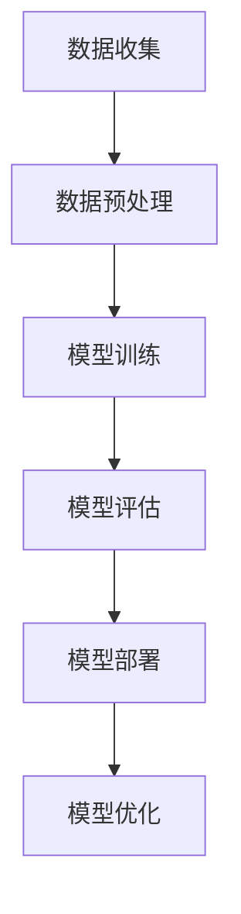

                 

### 文章标题：AI 大模型应用数据中心建设：数据中心安全与可靠性

### 关键词：
- AI 大模型
- 数据中心建设
- 数据安全
- 数据可靠性
- 系统架构设计

### 摘要：
本文深入探讨了 AI 大模型在数据中心应用中的建设与实践，重点分析了数据中心的安全与可靠性问题。文章首先介绍了 AI 大模型的基本概念和架构，然后详细阐述了数据中心基础设施的构建、大模型训练与部署、安全与隐私保护，以及可靠性保障等方面的关键技术和策略。通过实际案例研究，本文总结了 AI 大模型应用数据中心建设中的成功经验与挑战，为未来发展趋势提供了有益的启示。

---

## 第一部分: AI 大模型应用基础

### 第1章: AI 大模型概述

AI 大模型，是指利用深度学习技术构建的具有强大数据处理和智能决策能力的人工智能模型。其核心在于通过大规模数据训练，使模型能够自动学习并优化复杂的非线性关系，从而实现高效的数据分析和智能决策。AI 大模型在自然语言处理、计算机视觉、语音识别等领域展现出强大的应用潜力。

#### 1.1 AI 大模型的基本概念

AI 大模型的发展历程可以追溯到深度学习技术的兴起。早在上世纪80年代，深度学习作为一种人工智能方法就已经被提出，但由于计算资源和数据规模的限制，其应用受到很大限制。随着计算能力的提升和大数据时代的到来，深度学习技术逐渐成熟，AI 大模型应运而生。

##### 1.1.1 AI 大模型的发展历程

- **早期探索**（1980s-1990s）：深度学习作为一种理论被提出，但由于硬件限制，无法实现大规模训练。
- **复兴阶段**（2006-2012）：Hinton 等人提出深度置信网络（DBN），使深度学习重新受到关注。
- **突破阶段**（2012-至今）：以AlexNet为代表的深度神经网络在图像识别任务上取得突破，深度学习开始广泛应用。

##### 1.1.2 大模型的核心优势

- **强大的数据处理能力**：AI 大模型能够处理大规模、高维度的数据，挖掘出复杂的关系和特征。
- **自适应学习能力**：通过不断训练，大模型能够自动调整参数，优化性能。
- **泛化能力**：大模型在特定领域具有广泛的适用性，能够应对多种类型的任务。

##### 1.1.3 大模型与数据中心建设的关系

数据中心是 AI 大模型训练和部署的重要基础设施。大模型通常需要大量的计算资源、存储资源和网络带宽，这对数据中心的硬件和网络架构提出了很高的要求。同时，数据中心的可靠性和安全性也是保障 AI 大模型高效运行的关键因素。

### 第2章: 数据中心基础设施构建

数据中心基础设施的构建是 AI 大模型应用的关键环节。一个高效、可靠、安全的数据中心可以为 AI 大模型提供强大的支持。

#### 2.1 数据中心硬件选择

数据中心硬件的选择直接影响到 AI 大模型的训练和部署效率。以下是几种关键的硬件选择：

##### 2.1.1 服务器硬件要求

- **CPU**：CPU 是大模型训练的核心计算单元，应选择高性能的多核处理器。
- **GPU**：GPU 在深度学习任务中具有显著的优势，应选择计算能力强大的 GPU。
- **内存**：大模型训练需要大量的内存，应选择大容量内存的机器。

##### 2.1.2 存储设备选择

- **固态硬盘（SSD）**：SSD 具有高读写速度，适合用于存储训练数据和模型文件。
- **分布式存储系统**：分布式存储系统可以提供高可靠性和高性能的数据存储解决方案。

##### 2.1.3 网络架构设计

- **高速网络**：高速网络能够提高数据传输效率，降低通信延迟。
- **冗余设计**：通过网络冗余设计，可以确保数据中心的网络连接具有高可靠性。

#### 2.2 数据中心架构设计

数据中心架构设计涉及到硬件布局、制冷与电力系统、安全防护等多个方面。

##### 2.2.1 数据中心布局规划

- **机架布局**：合理规划机架布局，确保设备散热和电力供应。
- **网络布局**：设计高效的网络架构，确保数据传输速度和网络稳定性。

##### 2.2.2 数据中心制冷与电力系统

- **制冷系统**：数据中心需要采用高效的制冷系统，以确保设备运行在适宜的温度范围内。
- **电力系统**：数据中心应配备备用电源和UPS（不间断电源），以确保电力供应的可靠性。

##### 2.2.3 数据中心安全防护措施

- **物理安全**：加强对数据中心的物理保护，防止非法入侵。
- **网络安全**：部署防火墙、入侵检测系统等网络安全设备，防止网络攻击。
- **数据安全**：采用数据加密、访问控制等技术，确保数据的安全和隐私。

#### 2.3 数据中心运维管理

数据中心运维管理是保障数据中心稳定运行的关键。

##### 2.3.1 数据中心运维流程

- **监控管理**：实时监控数据中心的运行状态，及时发现并处理问题。
- **维护保养**：定期对数据中心设备进行维护和保养，确保设备处于最佳工作状态。

##### 2.3.2 数据中心监控与管理

- **监控系统**：部署监控软件，实时监控数据中心的各项指标。
- **日志管理**：收集并分析数据中心日志，为运维提供参考。

##### 2.3.3 数据中心应急预案

- **应急预案**：制定应急预案，确保在突发情况下能够迅速应对，减少损失。

### 第3章: AI 大模型训练与部署

AI 大模型的训练与部署是数据中心建设中的核心环节。以下是关于大模型训练与部署的关键技术。

#### 3.1 大模型训练流程

大模型训练是一个复杂的过程，涉及到数据预处理、模型训练、模型评估等多个步骤。

##### 3.1.1 数据预处理

- **数据清洗**：清洗数据中的噪声和错误，确保数据质量。
- **数据归一化**：将数据统一缩放到特定范围，便于模型训练。

##### 3.1.2 模型训练

- **选择合适模型**：根据任务需求选择合适的深度学习模型。
- **参数调优**：通过调整模型参数，提高训练效果。

##### 3.1.3 模型评估

- **交叉验证**：使用交叉验证方法评估模型性能。
- **误差分析**：分析模型在训练和测试数据上的误差，优化模型。

#### 3.2 大模型部署策略

大模型部署涉及到环境配置、部署脚本编写、部署执行等多个环节。

##### 3.2.1 部署前的准备

- **环境配置**：配置模型部署所需的软件和硬件环境。
- **数据准备**：准备好模型训练和测试所需的数据。

##### 3.2.2 部署环境配置

- **配置操作系统**：选择适合模型的操作系统。
- **配置库和依赖**：安装必要的库和依赖，确保模型能够正常运行。

##### 3.2.3 部署脚本编写与执行

- **编写部署脚本**：编写部署脚本，自动化部署过程。
- **执行部署脚本**：执行部署脚本，完成模型部署。

#### 3.3 大模型性能优化

为了提高 AI 大模型的性能，可以采用以下几种性能优化策略：

##### 3.3.1 模型并行化训练

- **数据并行**：将数据分成多个部分，同时在多个 GPU 上训练。
- **模型并行**：将模型拆分成多个部分，同时在多个 GPU 上训练。

##### 3.3.2 模型压缩与量化

- **模型压缩**：通过剪枝、量化等方法减小模型大小。
- **量化**：将模型中的浮点数参数转换为整数，降低计算复杂度。

##### 3.3.3 模型性能监控与调优

- **性能监控**：实时监控模型性能，包括训练速度、准确率等指标。
- **调优**：根据性能监控结果，调整模型参数和训练策略，优化模型性能。

## 第二部分：AI大模型应用数据中心建设关键技术与实践

### 第4章: 数据中心安全与隐私保护

数据中心的安全与隐私保护是 AI 大模型应用中不可忽视的重要环节。随着数据规模的不断扩大和业务复杂性的增加，数据中心面临的安全威胁和隐私泄露风险也随之增加。因此，构建一个安全可靠的数据中心对于保障 AI 大模型的应用至关重要。

#### 4.1 数据中心安全挑战

数据中心在安全方面面临以下挑战：

##### 4.1.1 数据中心面临的威胁

- **网络攻击**：包括分布式拒绝服务（DDoS）攻击、SQL 注入攻击、跨站脚本攻击（XSS）等。
- **恶意软件**：包括病毒、蠕虫、木马等，这些恶意软件可以导致数据损坏、系统崩溃等严重后果。
- **内部威胁**：包括员工疏忽、恶意行为等，内部威胁往往难以防范。

##### 4.1.2 安全漏洞分析与防范

- **安全漏洞**：数据中心可能存在的安全漏洞包括操作系统漏洞、网络设备漏洞、应用软件漏洞等。
- **防范措施**：定期更新系统和软件，安装安全补丁；使用防火墙、入侵检测系统（IDS）等安全设备。

#### 4.2 数据中心安全策略

数据中心的安全策略主要包括以下几个方面：

##### 4.2.1 安全架构设计

- **分层防护**：将数据中心划分为多个安全区域，每个区域采用不同的安全措施，形成多层次防护体系。
- **安全审计**：建立安全审计机制，定期对系统进行安全检查，确保安全策略得到有效执行。

##### 4.2.2 安全管理流程

- **安全策略制定**：根据业务需求和风险分析结果，制定合适的安全策略。
- **安全培训**：定期对员工进行安全培训，提高员工的安全意识。

##### 4.2.3 数据加密与访问控制

- **数据加密**：对敏感数据进行加密存储和传输，防止数据泄露。
- **访问控制**：通过身份认证、权限控制等措施，确保只有授权用户可以访问敏感数据。

#### 4.3 隐私保护与合规性

隐私保护是数据中心安全的重要组成部分。以下是隐私保护与合规性的关键点：

##### 4.3.1 隐私保护法律法规

- **数据保护法**：了解并遵守相关数据保护法律法规，如《通用数据保护条例》（GDPR）等。
- **隐私政策**：明确告知用户数据的收集、使用、存储和共享方式。

##### 4.3.2 隐私保护技术手段

- **匿名化**：对敏感数据进行匿名化处理，消除个人身份信息。
- **加密通信**：使用加密技术保护数据在传输过程中的安全。

##### 4.3.3 数据合规性管理

- **合规审计**：定期进行数据合规性审计，确保数据处理符合法律法规要求。
- **隐私影响评估**：在引入新的数据处理方式或系统之前，进行隐私影响评估。

### 第5章: 数据中心可靠性保障

数据中心的可靠性是保障 AI 大模型稳定运行的基础。为了确保数据中心的可靠性，需要从硬件、网络、软件等多个方面进行设计和优化。

#### 5.1 数据中心可靠性指标

数据中心的可靠性指标主要包括以下几个方面：

##### 5.1.1 可靠性模型与计算

- **平均无故障时间（MTTF）**：系统平均无故障运行的时间。
- **平均故障修复时间（MTTR）**：系统从故障发生到恢复正常运行的平均时间。

##### 5.1.2 数据中心故障类型与影响

- **硬件故障**：包括服务器、存储设备、网络设备等硬件的故障。
- **软件故障**：包括操作系统、应用程序等软件的故障。
- **网络故障**：包括网络设备故障、网络攻击等。

#### 5.2 数据中心容灾方案

容灾方案是确保数据中心可靠性的一种重要手段。以下是数据中心容灾方案的几个关键点：

##### 5.2.1 容灾级别与选择

- **容灾级别**：根据业务需求和风险承受能力，选择合适的容灾级别，如灾难恢复、业务连续性等。
- **容灾中心建设**：建设容灾中心，确保在主数据中心发生故障时，业务可以迅速切换到容灾中心。

##### 5.2.2 容灾演练与评估

- **容灾演练**：定期进行容灾演练，验证容灾方案的可行性和有效性。
- **评估与优化**：根据演练结果，评估容灾方案的不足之处，并不断优化和完善。

#### 5.3 数据中心性能监控与预警

数据中心性能监控与预警是保障数据中心可靠性的重要手段。以下是数据中心性能监控与预警的关键点：

##### 5.3.1 监控系统架构

- **监控系统架构**：建立全面的监控系统，实时监控数据中心的各项性能指标。
- **监控数据收集与分析**：收集并分析监控数据，及时发现并处理性能问题。

##### 5.3.2 预警机制与应急响应

- **预警机制**：建立预警机制，当系统性能指标超过阈值时，及时发出预警。
- **应急响应**：制定应急响应计划，确保在发生紧急情况时，能够迅速响应并解决问题。

### 第6章: AI 大模型应用案例研究

#### 6.1 案例背景

某大型互联网公司希望通过构建 AI 大模型，提升其智能推荐系统的准确性和实时性。为了实现这一目标，公司决定建设一个高效、可靠的数据中心，用于 AI 大模型的训练和部署。

##### 6.1.1 案例企业介绍

该互联网公司是一家知名电商企业，拥有庞大的用户数据和丰富的业务场景。其智能推荐系统对公司的业务发展具有重要影响，因此提升推荐系统的性能成为公司的关键任务。

##### 6.1.2 案例业务需求

- **高性能计算**：AI 大模型训练需要大量的计算资源，要求数据中心能够提供高性能计算能力。
- **数据可靠性**：数据中心需要确保数据的安全和可靠性，以支持 AI 大模型的稳定运行。
- **实时性**：智能推荐系统要求在短时间内处理大量的用户数据，对数据中心的网络带宽和数据处理速度有较高要求。

#### 6.2 案例解决方案

针对上述业务需求，该公司制定了一套全面的解决方案，包括数据中心基础设施建设、AI 大模型训练与部署、安全与隐私保护以及可靠性保障等方面。

##### 6.2.1 大模型应用方案设计

- **模型选择**：根据业务需求，选择适合的 AI 大模型，如深度神经网络（DNN）、变换器模型（Transformer）等。
- **数据预处理**：对原始数据进行清洗、归一化等预处理操作，确保数据质量。
- **训练策略**：制定合理的训练策略，包括学习率调整、批量大小等。

##### 6.2.2 数据中心建设方案

- **硬件配置**：选择高性能的服务器和 GPU，确保计算能力。
- **网络架构**：设计高效的网络架构，提高数据传输速度和稳定性。
- **安全防护**：部署防火墙、入侵检测系统（IDS）等安全设备，确保数据安全。

##### 6.2.3 安全与可靠性保障方案

- **安全防护**：建立多层次的安全防护体系，包括网络防护、数据加密、访问控制等。
- **可靠性保障**：实施容灾方案，确保在发生故障时能够迅速切换到备用系统。
- **性能优化**：通过模型并行化训练、模型压缩等技术，提高系统性能。

#### 6.3 案例实施与效果评估

##### 6.3.1 案例实施步骤

- **方案设计**：根据业务需求和现有条件，制定详细的建设方案。
- **硬件采购**：采购高性能服务器和 GPU，搭建数据中心基础设施。
- **软件安装**：安装操作系统、深度学习框架等软件，确保系统正常运行。
- **部署测试**：部署 AI 大模型，进行测试和调优。

##### 6.3.2 应用效果评估

- **性能评估**：通过测试，评估智能推荐系统的准确性和实时性。
- **成本效益分析**：分析建设数据中心的成本效益，确保项目的可持续性。
- **用户反馈**：收集用户反馈，评估系统的用户体验。

##### 6.3.3 案例总结与启示

该案例展示了 AI 大模型应用数据中心建设的全过程，包括基础设施构建、模型训练与部署、安全与隐私保护以及可靠性保障等方面。通过该案例，我们可以得到以下启示：

- **高性能计算**：高性能计算是 AI 大模型应用的基础，需要选择合适的硬件和网络架构。
- **数据可靠性**：数据可靠性是保障系统稳定运行的关键，需要建立完善的安全防护体系和可靠性保障机制。
- **实时性**：实时性是智能推荐系统的重要指标，需要优化数据处理流程和模型性能。
- **用户反馈**：收集用户反馈是优化系统的关键，需要持续关注用户需求和体验。

### 第7章: 未来发展趋势与展望

随着 AI 技术的快速发展，AI 大模型在数据中心建设中的应用前景广阔。以下是未来发展趋势与展望：

#### 7.1 AI 大模型技术趋势

- **新型大模型架构**：如 GPT-3、BERT 等新型大模型，具有更强的数据处理能力和自适应学习能力。
- **模型压缩与量化**：通过模型压缩与量化技术，降低模型大小和计算复杂度，提高模型部署的效率。
- **分布式训练**：分布式训练技术可以充分利用多 GPU、多服务器等资源，提高训练效率。

#### 7.2 数据中心建设趋势

- **绿色数据中心**：随着环保意识的提高，绿色数据中心将成为发展趋势，通过节能技术、可再生能源等手段降低能耗。
- **智能化运维**：通过智能化运维技术，提高数据中心的运维效率和安全性。
- **边缘计算**：随着 5G 等技术的发展，边缘计算将逐渐兴起，数据中心将向分布式、边缘化方向发展。

#### 7.3 安全与可靠性挑战

- **安全威胁**：随着 AI 技术的发展，数据中心面临的安全威胁将日益严峻，需要不断提升安全防护能力。
- **数据隐私**：随着大数据时代的到来，数据隐私保护将面临更大挑战，需要建立完善的数据隐私保护体系。
- **可靠性保障**：随着数据中心规模的不断扩大，可靠性保障将成为重要挑战，需要建立完善的可靠性保障机制。

### 附录

#### A.1 核心概念与联系

以下是一个关于 AI 大模型架构的 Mermaid 流程图：



#### A.2 核心算法原理讲解

以下是一个关于神经网络训练过程的伪代码：

```python
# 初始化模型参数
initialize_weights()

# 梯度下降算法
def gradient_descent(parameters, gradients, learning_rate):
    for parameter, gradient in zip(parameters, gradients):
        parameter -= learning_rate * gradient

# 前向传播
def forward_pass(input_data):
    # 计算输出
    output = model(input_data)
    return output

# 反向传播
def backward_pass(output, target):
    gradients = compute_gradients(output, target)
    return gradients

# 训练循环
for epoch in range(num_epochs):
    for batch in data_loader:
        input_data, target = batch
        output = forward_pass(input_data)
        gradients = backward_pass(output, target)
        gradient_descent(model.parameters(), gradients, learning_rate)
```

#### A.3 数学模型和公式

以下是一个关于神经网络模型损失函数的公式：

$$
L = -\frac{1}{m}\sum_{i=1}^{m} y^{(i)} \log(z^{(i)})
$$

其中，$L$ 表示损失函数，$y^{(i)}$ 表示第 $i$ 个样本的真实标签，$z^{(i)}$ 表示第 $i$ 个样本的预测概率。

#### A.4 项目实战：代码实际案例和详细解释说明

以下是一个关于 PyTorch 深度学习框架的简单示例：

```python
import torch
import torch.nn as nn
import torch.optim as optim

# 定义模型
class NeuralNetwork(nn.Module):
    def __init__(self):
        super(NeuralNetwork, self).__init__()
        self.layer1 = nn.Linear(in_features=784, out_features=128)
        self.relu = nn.ReLU()
        self.layer2 = nn.Linear(in_features=128, out_features=10)

    def forward(self, x):
        x = self.layer1(x)
        x = self.relu(x)
        x = self.layer2(x)
        return x

# 初始化模型、损失函数和优化器
model = NeuralNetwork()
criterion = nn.CrossEntropyLoss()
optimizer = optim.Adam(model.parameters(), lr=0.001)

# 训练模型
for epoch in range(10):
    for inputs, targets in data_loader:
        optimizer.zero_grad()
        outputs = model(inputs)
        loss = criterion(outputs, targets)
        loss.backward()
        optimizer.step()
    print(f'Epoch {epoch+1}/{10} - Loss: {loss.item()}')

# 评估模型
with torch.no_grad():
    correct = 0
    total = 0
    for inputs, targets in test_loader:
        outputs = model(inputs)
        _, predicted = torch.max(outputs.data, 1)
        total += targets.size(0)
        correct += (predicted == targets).sum().item()
    print(f'Accuracy: {100 * correct / total}%')
```

在这个示例中，我们首先定义了一个简单的神经网络模型，然后使用 PyTorch 深度学习框架进行模型的训练和评估。

---

### 作者信息

**作者：** AI天才研究院 / AI Genius Institute & 禅与计算机程序设计艺术 / Zen And The Art of Computer Programming

