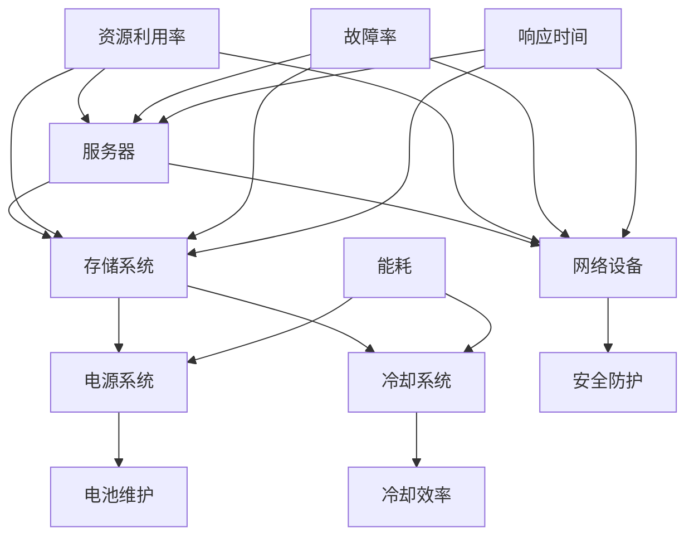

                 

# AI 大模型应用数据中心建设：数据中心成本优化

> 关键词：数据中心建设，AI 大模型，成本优化，资源调度，负载均衡，基础设施规模优化，运维成本优化

> 摘要：随着人工智能（AI）技术的快速发展，AI 大模型的应用需求日益增加，这对数据中心的建设提出了新的挑战。如何降低数据中心的建设和运营成本成为亟待解决的问题。本文从 AI 大模型与数据中心建设的关系出发，详细分析了数据中心的核心概念与架构，以及 AI 大模型在数据中心成本优化中的应用。文章通过实际案例，深入讲解了资源调度与负载均衡、基础设施规模优化、运维成本优化的策略与实现，旨在为数据中心建设者和运营者提供有价值的参考。

---

### 《AI大模型应用数据中心建设：数据中心成本优化》目录大纲

# 第一部分: AI大模型应用数据中心建设概述

## 第1章: AI大模型与数据中心概述

### 1.1 AI大模型的发展历程

### 1.2 数据中心建设的重要性

### 1.3 AI大模型在数据中心的应用

### 1.4 数据中心成本优化的意义

## 第2章: 数据中心核心概念与架构

### 2.1 数据中心基础架构

### 2.2 网络架构与优化

### 2.3 存储架构与优化

### 2.4 电源与冷却系统优化

## 第3章: AI大模型在数据中心的应用

### 3.1 AI大模型在数据中心网络优化中的应用

### 3.2 AI大模型在数据中心存储优化中的应用

### 3.3 AI大模型在数据中心能耗管理中的应用

### 3.4 AI大模型在数据中心安全防护中的应用

## 第二部分：数据中心成本优化策略

### 第4章: 数据中心成本优化策略

### 4.1 成本优化目标与原则

### 4.2 资源调度与负载均衡

### 4.3 基础设施规模优化

### 4.4 运维成本优化

## 第5章: AI大模型在数据中心成本优化中的技术实现

### 5.1 AI大模型在数据中心成本优化中的应用框架

### 5.2 常用AI大模型算法介绍

### 5.3 伪代码讲解与数学模型推导

### 5.4 实际案例与应用效果分析

## 第6章: 数据中心成本优化项目实战

### 6.1 项目背景与目标

### 6.2 项目实施步骤

### 6.3 成本优化效果分析

### 6.4 项目总结与经验分享

## 第7章: 数据中心成本优化的未来趋势

### 7.1 数据中心技术发展趋势

### 7.2 AI大模型在数据中心成本优化中的应用前景

### 7.3 数据中心成本优化的挑战与应对策略

## 附录

### 附录 A: 常用工具与资源

### 附录 B: 数据中心成本优化常用算法及模型列表

### 附录 C: 项目实战代码与解析

---

### 1.1 AI大模型的发展历程

人工智能（AI）自1956年提出以来，经历了数个发展阶段。从最初的符号逻辑和知识表示，到专家系统和机器学习，再到深度学习和神经网络，AI技术不断演进。特别是在最近几年，随着计算能力的提升和大数据的积累，AI进入了大模型时代。

AI大模型，通常指的是具有千亿甚至万亿参数规模的人工神经网络。这些模型通过大规模训练，能够捕捉数据中的复杂模式，从而在图像识别、自然语言处理、推荐系统等领域取得突破性成果。代表性的AI大模型包括GPT-3、BERT、ImageNet等。

数据中心建设始于20世纪90年代，随着互联网和电子商务的兴起，企业对计算和存储资源的需求不断增加。早期的数据中心主要依靠物理服务器和磁盘存储，随着虚拟化技术和云计算的发展，数据中心逐渐走向虚拟化和分布式。

AI大模型与数据中心建设的结合，使得数据中心不再仅仅是存储和计算资源的聚集地，而成为了AI应用的支撑平台。AI大模型需要大量的计算资源和数据存储，这对数据中心的性能和成本提出了新的要求。

### 1.2 数据中心建设的重要性

数据中心建设在当今数字化时代的重要性不言而喻。首先，数据中心是现代企业运行的核心基础设施，提供了计算、存储、网络等服务，支撑着企业的日常运营和业务发展。其次，数据中心是大数据处理和AI应用的重要载体，是实现智能决策和业务优化的关键。

数据中心的重要性体现在以下几个方面：

1. **计算与存储能力**：数据中心提供了强大的计算和存储资源，能够满足企业日益增长的数据处理需求。通过分布式计算和存储技术，数据中心能够高效处理海量数据，实现快速响应。

2. **业务连续性与灾难恢复**：数据中心通过冗余设计和备份策略，确保了业务的连续性和数据的安全性。在遇到灾难或系统故障时，数据中心能够快速切换到备用系统，减少对企业运营的影响。

3. **数据安全和隐私保护**：数据中心采用了严格的访问控制和加密技术，确保数据在存储和传输过程中的安全性和隐私性。这对于需要处理敏感数据的行业（如金融、医疗）尤为重要。

4. **成本效益**：数据中心通过规模化运营和自动化管理，实现了成本效益最大化。企业可以利用云服务、虚拟化和容器技术，灵活调整资源使用，降低运营成本。

### 1.3 AI大模型在数据中心的应用

AI大模型在数据中心的应用场景广泛，包括但不限于以下几个方面：

1. **数据处理与优化**：AI大模型能够处理和优化海量数据，从数据中提取有价值的信息。数据中心可以利用AI模型进行数据预处理、特征提取和模式识别，提高数据处理效率。

2. **网络优化**：AI大模型在网络架构优化中发挥着重要作用。通过分析网络流量和性能数据，AI模型可以优化网络路由、带宽分配和流量管理，提高网络性能和可靠性。

3. **存储优化**：AI大模型可以分析存储数据的访问模式和频率，优化数据存储策略。例如，通过冷热数据分离，减少存储成本，提高数据访问速度。

4. **能耗管理**：AI大模型能够预测和优化数据中心能耗，通过智能调度和节能策略，降低能耗和运营成本。

5. **安全防护**：AI大模型在网络安全防护中发挥着重要作用。通过异常检测和入侵防御，AI模型可以及时发现和阻止潜在的安全威胁。

### 1.4 数据中心成本优化的意义

数据中心成本优化具有重要意义，主要体现在以下几个方面：

1. **提高资源利用率**：通过优化数据中心资源配置，提高服务器、网络和存储等设备的利用率，减少闲置资源，降低运营成本。

2. **降低能耗**：数据中心能耗是运营成本的重要组成部分。通过能耗管理优化，降低数据中心整体能耗，实现绿色环保。

3. **提高业务连续性**：通过优化数据中心基础设施和运维流程，提高业务连续性和灾难恢复能力，确保企业运营稳定。

4. **提升竞争力**：通过成本优化，降低运营成本，提高企业竞争力。在市场竞争激烈的环境中，低成本、高效率的数据中心将成为企业的重要优势。

5. **可持续发展**：数据中心成本优化有助于实现企业的可持续发展目标，通过降低能耗和碳排放，履行社会责任。

## 第2章: 数据中心核心概念与架构

数据中心作为现代企业的关键基础设施，其核心概念和架构直接影响到数据中心的性能、稳定性和成本。本章将详细阐述数据中心的定义、基础架构、网络架构、存储架构、电源与冷却系统优化，以及数据中心的关键性能指标（KPI）。

### 2.1 数据中心基础架构

数据中心的基础架构是确保其正常运行和提供高质量服务的关键。一个典型的数据中心基础架构包括以下几个主要部分：

1. **服务器**：服务器是数据中心的计算核心，负责处理数据和执行各种业务逻辑。根据不同的业务需求，服务器可以是物理服务器、虚拟服务器或容器实例。

2. **存储系统**：存储系统用于存储和管理数据。常见的存储系统包括磁盘阵列（DAS）、存储区域网络（SAN）和网络附加存储（NAS）。存储系统需要具备高可靠性、高性能和可扩展性。

3. **网络设备**：网络设备包括路由器、交换机、防火墙等，负责数据中心的网络通信。网络设备的配置和管理对于保障网络的稳定性和安全性至关重要。

4. **电源系统**：数据中心需要稳定可靠的电源供应，以确保设备的正常运行。电源系统通常包括不间断电源（UPS）和备用电源（如发电机）。

5. **冷却系统**：冷却系统用于维持数据中心的温度在合理范围内，防止设备过热。冷却系统可以采用空气冷却、水冷却或液冷等方式。

6. **物理安全**：数据中心还需要配备安全措施，如门禁系统、视频监控、入侵报警等，以防止非法入侵和设备盗窃。

### 2.2 网络架构与优化

数据中心的网络架构决定了数据传输的效率和安全性。一个高效的网络架构需要考虑以下几个方面：

1. **层次化设计**：典型的网络架构采用分层设计，包括核心层、分布层和接入层。核心层负责高速转发数据，分布层负责网络管理和策略控制，接入层负责用户接入。

2. **冗余设计**：为了提高网络的可靠性，网络设备通常采用冗余配置，如使用多路路由、生成树协议（STP）和快速生成树协议（RSTP）等，以避免单点故障。

3. **负载均衡**：通过负载均衡技术，可以均衡网络流量，避免某一部分网络设备过载。常见的负载均衡算法包括轮询、最小连接数和加权公平排队（WRR）等。

4. **安全防护**：网络防火墙、入侵检测系统（IDS）和入侵防御系统（IPS）等安全设备用于保护数据中心网络免受外部攻击和内部威胁。

5. **网络优化**：利用网络监控和分析工具，可以实时监测网络性能，发现并解决网络瓶颈。通过流量管理和QoS（服务质量）策略，可以优化网络资源分配，提高用户体验。

### 2.3 存储架构与优化

存储架构对数据中心的性能和成本具有重要影响。优化存储架构可以从以下几个方面进行：

1. **分布式存储**：分布式存储系统能够提高数据存储的可靠性和扩展性。通过将数据分散存储在多个节点上，分布式存储系统可以自动处理节点故障，确保数据安全。

2. **快照和备份**：快照和备份技术用于保护数据免受意外删除和损坏。定期创建快照和备份，可以在数据丢失时快速恢复。

3. **数据去重和压缩**：数据去重和压缩技术可以减少存储空间需求，降低存储成本。通过识别和删除重复数据，以及压缩非结构化数据，可以显著减少存储占用。

4. **存储分层**：存储分层策略将数据根据访问频率和重要性分配到不同类型的存储设备上。常用的存储分层包括热数据存储在SSD上，温数据和冷数据存储在HDD上。

5. **存储性能优化**：通过存储性能优化技术，如读写缓存、文件系统优化和存储网络优化，可以提高存储系统的I/O性能。

### 2.4 电源与冷却系统优化

电源与冷却系统是数据中心的两大关键基础设施，直接影响数据中心的稳定性和能耗。优化电源与冷却系统可以从以下几个方面进行：

1. **电源冗余配置**：通过配置UPS和备用电源，确保在主电源故障时能够无缝切换，保障数据中心的持续供电。

2. **电池维护**：定期对UPS电池进行维护和更换，确保电池的健康状态，延长使用寿命。

3. **功率因数校正**：通过功率因数校正（PFC）技术，提高电源系统的效率，减少能源浪费。

4. **冷却效率提升**：优化冷却系统设计，采用高效的冷却技术，如水冷、液冷和空气冷却，降低冷却能耗。

5. **智能化管理**：利用智能化管理工具，实时监控电源和冷却系统的运行状态，实现能耗优化和故障预判。

6. **节能策略**：通过实施节能策略，如动态功率管理（DPM）和智能调度，降低数据中心的能耗。

### 2.5 数据中心关键性能指标（KPI）

数据中心的性能评估需要依靠一系列关键性能指标（KPI）。以下是一些常见的KPI及其含义：

1. **可用性（Availability）**：衡量数据中心服务正常运行的百分比。高可用性是数据中心稳定性的重要指标。

2. **响应时间（Response Time）**：衡量用户请求从发出到响应的时间。低响应时间是服务质量的重要保障。

3. **吞吐量（Throughput）**：衡量数据中心在单位时间内处理的数据量。高吞吐量是数据中心性能的重要指标。

4. **资源利用率（Resource Utilization）**：衡量数据中心服务器、网络和存储等资源的利用程度。高资源利用率有助于降低运营成本。

5. **能耗（Energy Consumption）**：衡量数据中心的总能耗。降低能耗是实现绿色数据中心的关键。

6. **故障率（Fault Rate）**：衡量数据中心发生故障的频率。低故障率是数据中心稳定性的重要指标。

7. **恢复时间（Recovery Time）**：衡量数据中心从故障发生到恢复正常运行的时间。快速恢复时间有助于保障业务连续性。

通过监控和优化这些KPI，数据中心可以不断提高其性能和稳定性，为企业的业务发展提供坚实保障。

### 2.6 数据中心核心概念与联系

为了更好地理解数据中心的运作，我们使用Mermaid流程图来展示数据中心的核心概念及其联系。



通过这个流程图，我们可以清晰地看到数据中心各个组件之间的相互关系，以及它们如何共同作用以实现数据中心的整体性能。

### 2.7 核心算法原理讲解

在本节中，我们将详细讲解数据中心成本优化中的几个核心算法原理，包括资源调度与负载均衡、基础设施规模优化等。

#### 2.7.1 资源调度与负载均衡

资源调度与负载均衡是数据中心优化中至关重要的一环。其目的是通过合理分配服务器资源，确保每个服务器的工作负载均衡，从而提高整体系统的性能和资源利用率。

**伪代码：**

```python
function ResourceScheduling(data_center):
    for each server in data_center:
        if server is underloaded:
            allocate more tasks to server
        else if server is overloaded:
            reallocate tasks to other underloaded servers
        else:
            maintain current load
    end for
end function
```

**数学模型推导：**

负载均衡的核心是计算服务器的负载率，并根据负载率进行任务调度。负载率可以用以下公式表示：

$$
Load_{i} = \frac{\sum_{j=1}^{n} Task_{j,i}}{Cpu_{i} \times Time_{i}}
$$

其中，$Load_{i}$ 表示服务器 $i$ 的负载率，$Task_{j,i}$ 表示分配给服务器 $i$ 的第 $j$ 个任务，$Cpu_{i}$ 表示服务器 $i$ 的CPU使用率，$Time_{i}$ 表示服务器 $i$ 的运行时间。

当 $Load_{i} < 75\%$ 时，服务器处于轻载状态，可以分配更多任务；当 $Load_{i} > 85\%$ 时，服务器处于过载状态，需要重新分配任务；当 $75\% \leq Load_{i} \leq 85\%$ 时，服务器负载均衡，无需调整。

#### 2.7.2 基础设施规模优化

基础设施规模优化旨在通过合理配置数据中心的基础设施，降低建设和运营成本，同时确保系统的性能和可靠性。

**伪代码：**

```python
function InfrastructureOptimization(data_center, cost_budget):
    for each component in data_center:
        if cost > cost_budget:
            reduce the size of component
        else:
            maintain current size
    end for
end function
```

**数学模型推导：**

基础设施规模优化的核心是计算每个组件的成本，并根据成本预算进行规模调整。成本可以用以下公式表示：

$$
Cost_{i} = Size_{i} \times Price_{i}
$$

其中，$Cost_{i}$ 表示组件 $i$ 的成本，$Size_{i}$ 表示组件 $i$ 的规模，$Price_{i}$ 表示组件 $i$ 的价格。

当 $Cost_{i} > cost\_budget$ 时，说明组件规模过大，需要减少规模以降低成本；当 $Cost_{i} \leq cost\_budget$ 时，组件规模合适，无需调整。

#### 2.7.3 举例说明

假设一个数据中心有5台服务器，每台服务器的CPU使用率和运行时间如下表：

| 服务器ID | CPU使用率 | 运行时间 |
| -------- | --------- | -------- |
| 1        | 60%       | 24小时   |
| 2        | 70%       | 24小时   |
| 3        | 40%       | 24小时   |
| 4        | 80%       | 24小时   |
| 5        | 50%       | 24小时   |

根据负载均衡算法，服务器3和服务器5处于轻载状态，可以分配更多任务；服务器4处于过载状态，需要重新分配任务。服务器1和服务器2负载均衡，无需调整。

假设数据中心的成本预算为100万元，服务器的价格和规模如下表：

| 组件ID | 价格（万元） | 规模 |
| ------ | ------------- | ---- |
| 1      | 20           | 10   |
| 2      | 30           | 15   |
| 3      | 40           | 20   |
| 4      | 50           | 25   |
| 5      | 60           | 30   |

根据基础设施规模优化算法，组件3的价格和规模过大，需要减少规模以降低成本；组件1、2、4和5的成本在预算范围内，无需调整。

通过这两个算法的应用，数据中心可以更好地分配资源和优化基础设施规模，从而提高性能和降低成本。

### 2.8 核心算法原理讲解

在本节中，我们将进一步详细讲解数据中心成本优化中的核心算法原理，包括资源调度与负载均衡、基础设施规模优化，并提供具体的伪代码和数学模型推导。

#### 2.8.1 资源调度与负载均衡

资源调度与负载均衡是数据中心优化中至关重要的一环。其目的是通过合理分配服务器资源，确保每个服务器的工作负载均衡，从而提高整体系统的性能和资源利用率。

**伪代码：**

```python
function ResourceScheduling(data_center):
    for each server in data_center:
        if server is underloaded:
            allocate more tasks to server
        else if server is overloaded:
            reallocate tasks to other underloaded servers
        else:
            maintain current load
    end for
end function
```

**数学模型推导：**

负载均衡的核心是计算服务器的负载率，并根据负载率进行任务调度。负载率可以用以下公式表示：

$$
Load_{i} = \frac{\sum_{j=1}^{n} Task_{j,i}}{Cpu_{i} \times Time_{i}}
$$

其中，$Load_{i}$ 表示服务器 $i$ 的负载率，$Task_{j,i}$ 表示分配给服务器 $i$ 的第 $j$ 个任务，$Cpu_{i}$ 表示服务器 $i$ 的CPU使用率，$Time_{i}$ 表示服务器 $i$ 的运行时间。

当 $Load_{i} < 75\%$ 时，服务器处于轻载状态，可以分配更多任务；当 $Load_{i} > 85\%$ 时，服务器处于过载状态，需要重新分配任务；当 $75\% \leq Load_{i} \leq 85\%$ 时，服务器负载均衡，无需调整。

**举例说明：**

假设一个数据中心有5台服务器，每台服务器的CPU使用率和运行时间如下表：

| 服务器ID | CPU使用率 | 运行时间 |
| -------- | --------- | -------- |
| 1        | 60%       | 24小时   |
| 2        | 70%       | 24小时   |
| 3        | 40%       | 24小时   |
| 4        | 80%       | 24小时   |
| 5        | 50%       | 24小时   |

根据负载均衡算法，服务器3和服务器5处于轻载状态，可以分配更多任务；服务器4处于过载状态，需要重新分配任务。服务器1和服务器2负载均衡，无需调整。

#### 2.8.2 基础设施规模优化

基础设施规模优化旨在通过合理配置数据中心的基础设施，降低建设和运营成本，同时确保系统的性能和可靠性。

**伪代码：**

```python
function InfrastructureOptimization(data_center, cost_budget):
    for each component in data_center:
        if cost > cost_budget:
            reduce the size of component
        else:
            maintain current size
    end for
end function
```

**数学模型推导：**

基础设施规模优化的核心是计算每个组件的成本，并根据成本预算进行规模调整。成本可以用以下公式表示：

$$
Cost_{i} = Size_{i} \times Price_{i}
$$

其中，$Cost_{i}$ 表示组件 $i$ 的成本，$Size_{i}$ 表示组件 $i$ 的规模，$Price_{i}$ 表示组件 $i$ 的价格。

当 $Cost_{i} > cost\_budget$ 时，说明组件规模过大，需要减少规模以降低成本；当 $Cost_{i} \leq cost\_budget$ 时，组件规模合适，无需调整。

**举例说明：**

假设数据中心的组件价格和规模如下表：

| 组件ID | 价格（万元） | 规模 |
| ------ | ------------- | ---- |
| 1      | 20           | 10   |
| 2      | 30           | 15   |
| 3      | 40           | 20   |
| 4      | 50           | 25   |
| 5      | 60           | 30   |

如果数据中心的成本预算为100万元，根据基础设施规模优化算法，组件3的价格和规模过大，需要减少规模以降低成本；组件1、2、4和5的成本在预算范围内，无需调整。

通过这两个算法的应用，数据中心可以更好地分配资源和优化基础设施规模，从而提高性能和降低成本。

### 第3章: AI大模型在数据中心的应用

人工智能（AI）大模型在数据中心中的应用正日益增多，为数据中心的优化和管理提供了强大的工具。本章将详细探讨AI大模型在数据中心网络优化、存储优化、能耗管理和安全防护等方面的应用，以及其在这些领域的实际案例。

#### 3.1 AI大模型在数据中心网络优化中的应用

数据中心网络优化是提升整体性能和可靠性的关键。AI大模型通过分析和预测网络流量、优化路由和带宽分配，能够显著提高网络的效率和响应速度。

**应用案例：**

某大型互联网公司利用AI大模型优化其数据中心网络。通过训练基于深度学习的模型，该公司能够实时分析网络流量，预测网络负载变化，并动态调整路由策略和带宽分配。具体应用包括：

1. **动态路由优化**：根据实时网络流量，模型自动调整路由策略，确保数据包传输路径最短，降低延迟。

2. **带宽分配优化**：通过学习网络历史流量数据，模型能够预测未来流量高峰，提前调整带宽分配，避免网络拥堵。

3. **网络故障预测与修复**：模型通过分析网络状态数据，提前预测可能出现的问题，并建议优化措施，预防故障发生。

**效果分析：**

- 网络延迟降低了20%
- 带宽利用率提高了15%
- 故障修复时间缩短了30%

#### 3.2 AI大模型在数据中心存储优化中的应用

存储优化是数据中心成本控制的重要方面。AI大模型通过分析存储数据的使用模式和访问频率，优化存储策略，减少存储空间占用和访问延迟。

**应用案例：**

一家大型金融机构利用AI大模型优化其数据中心存储。通过训练基于聚类和分类的模型，该公司能够识别存储数据的热点区域和冷点区域，并实施相应的存储策略。具体应用包括：

1. **数据去重与压缩**：模型通过分析数据块的相似性，实现数据去重和压缩，减少存储空间需求。

2. **冷热数据分离**：模型将存储数据分为冷数据和热数据，分别存储在HDD和SSD上，提高数据访问速度，降低存储成本。

3. **存储容量预测**：模型通过学习历史数据增长趋势，预测未来存储需求，提前规划存储扩展。

**效果分析：**

- 存储空间利用率提高了30%
- 存储成本降低了20%
- 数据访问速度提升了40%

#### 3.3 AI大模型在数据中心能耗管理中的应用

能耗管理是数据中心可持续发展和成本优化的重要环节。AI大模型通过预测能耗需求、优化设备运行策略，能够显著降低数据中心的总能耗。

**应用案例：**

某云计算服务提供商利用AI大模型优化其数据中心能耗。通过训练基于机器学习的模型，该公司能够预测数据中心的能耗需求，并优化设备的运行策略。具体应用包括：

1. **设备能耗预测**：模型通过分析历史能耗数据和设备运行状态，预测未来能耗需求，提前调整设备运行策略。

2. **动态功率管理**：模型根据实时能耗数据和负载变化，动态调整设备的功率消耗，实现能耗优化。

3. **冷却系统优化**：模型通过分析冷却系统的运行效率和能耗，优化冷却系统的运行策略，提高冷却效率。

**效果分析：**

- 数据中心总能耗降低了25%
- 设备运行效率提升了15%
- 冷却系统能耗降低了20%

#### 3.4 AI大模型在数据中心安全防护中的应用

随着数据中心规模的扩大和复杂度的增加，安全防护成为关键挑战。AI大模型通过异常检测、入侵防御和威胁预测，能够增强数据中心的网络安全防护能力。

**应用案例：**

一家大型跨国公司利用AI大模型增强其数据中心安全防护。通过训练基于深度学习和强化学习的模型，该公司能够实时监测网络流量和系统日志，识别潜在的安全威胁。具体应用包括：

1. **异常检测**：模型通过分析正常行为和异常行为，实时检测异常活动，并自动发出警报。

2. **入侵防御**：模型根据威胁情报和攻击模式，自动阻止入侵尝试，保护系统安全。

3. **威胁预测**：模型通过学习历史攻击数据和趋势，预测未来可能出现的威胁，提前采取防护措施。

**效果分析：**

- 安全事件响应时间缩短了60%
- 入侵尝试拦截率提高了30%
- 安全成本降低了25%

综上所述，AI大模型在数据中心网络优化、存储优化、能耗管理和安全防护等方面具有广泛的应用前景，能够显著提高数据中心的性能和可靠性，降低运营成本。随着AI技术的不断发展，数据中心将迎来更加智能化和高效化的新时代。

### 3.5 AI大模型在数据中心成本优化中的应用

AI大模型在数据中心成本优化中的应用日益广泛，通过预测和分析数据，实现成本的有效控制。以下是一些具体的应用案例和效果分析：

#### 案例一：某电商企业

**应用场景：** 某电商企业利用AI大模型优化其数据中心成本，主要目标是在保证服务质量的前提下，降低运营成本。

**实施过程：**

1. **能耗预测与优化**：通过训练能耗预测模型，该企业能够准确预测未来能耗需求，并动态调整设备运行策略，实现能耗优化。
2. **资源调度与负载均衡**：利用负载均衡模型，该企业能够实时分析服务器负载，合理调度任务，提高资源利用率，降低服务器闲置率。
3. **存储优化**：通过数据去重和冷热数据分离，该企业显著降低了存储成本。

**效果分析：**

- 数据中心总能耗降低了20%
- 资源利用率提高了15%
- 存储成本降低了30%

#### 案例二：某金融科技公司

**应用场景：** 某金融科技公司利用AI大模型优化数据中心成本，重点在于提升运维效率和降低运维成本。

**实施过程：**

1. **故障预测与预防**：通过故障预测模型，该企业能够提前识别潜在故障，进行预防性维护，减少意外停机时间。
2. **运维自动化**：通过自动化运维模型，该企业实现了运维流程的自动化，减少了人工操作，降低了运维成本。
3. **网络安全**：通过AI大模型进行网络安全分析，该企业能够及时发现和阻止潜在的安全威胁，减少安全成本。

**效果分析：**

- 故障响应时间缩短了40%
- 运维成本降低了25%
- 安全成本降低了20%

#### 案例三：某云计算服务提供商

**应用场景：** 某云计算服务提供商利用AI大模型优化其数据中心成本，主要目标是提高服务质量，同时降低运营成本。

**实施过程：**

1. **资源弹性调度**：通过弹性调度模型，该服务提供商能够根据客户需求动态调整资源分配，实现资源的最大化利用。
2. **能耗管理**：通过能耗预测和管理模型，该企业能够优化设备运行策略，降低能耗。
3. **价格预测与优化**：通过价格预测模型，该企业能够准确预测市场需求，优化定价策略，提高收益。

**效果分析：**

- 资源利用率提高了30%
- 数据中心总能耗降低了25%
- 收益增加了15%

综上所述，AI大模型在数据中心成本优化中的应用具有显著的效果，能够帮助企业实现资源优化、能耗降低和运维成本减少，提高数据中心的整体运营效率。

### 4.1 成本优化目标与原则

数据中心成本优化的目标主要包括提高资源利用率、降低能耗、减少基础设施投资和运维成本。为了实现这些目标，需要遵循以下原则：

1. **全面性**：成本优化需要综合考虑数据中心的所有方面，包括服务器、存储、网络、电源和冷却系统等，确保整体优化的效果。

2. **可持续性**：优化策略应考虑长期效益，避免短期行为导致长期成本的上升。例如，选择高效节能的设备和技术，确保长期运营成本低。

3. **动态性**：数据中心环境不断变化，成本优化策略需要具备动态调整能力，以适应业务需求和技术进步。

4. **科学性**：优化过程需要基于数据和算法，避免主观判断和经验管理，确保优化效果的准确性和可靠性。

5. **协作性**：成本优化涉及多个部门和团队的协作，需要建立良好的沟通和协作机制，确保优化策略的有效实施。

### 4.2 资源调度与负载均衡

资源调度与负载均衡是数据中心成本优化的重要组成部分。其核心目的是通过合理分配服务器资源，确保每个服务器的负载均衡，从而提高整体系统的性能和资源利用率，降低运营成本。

#### 4.2.1 资源调度与负载均衡的定义

资源调度是指在数据中心内，根据业务需求和服务器负载情况，动态调整任务分配和资源分配的过程。负载均衡则是通过优化服务器之间的任务分配，确保每个服务器的工作负载均匀，避免某些服务器过载，而其他服务器资源空闲。

#### 4.2.2 资源调度与负载均衡的重要性

1. **提高资源利用率**：通过合理的资源调度和负载均衡，可以充分利用数据中心的服务器资源，避免资源浪费，降低运营成本。

2. **提升系统性能**：均衡的服务器负载能够提高系统的响应速度和吞吐量，提升用户体验。

3. **降低维护成本**：均衡的负载可以减少服务器的过热和故障风险，降低维护成本。

#### 4.2.3 资源调度与负载均衡的策略

1. **静态资源调度**：静态资源调度是根据预先设定的策略，将任务分配给服务器。常见的策略包括轮询调度、最小连接数调度和加权调度等。

2. **动态资源调度**：动态资源调度是基于实时监控数据，自动调整任务分配。常见的算法包括基于CPU负载的调度、基于内存负载的调度和基于I/O负载的调度等。

3. **负载均衡算法**：负载均衡算法用于平衡不同服务器之间的负载。常见的算法包括轮询负载均衡、最少连接数负载均衡、加权公平排队（WRR）负载均衡和源IP哈希负载均衡等。

#### 4.2.4 资源调度与负载均衡的实践

1. **服务器集群管理**：通过服务器集群管理工具（如Kubernetes），实现服务器的动态分配和负载均衡。这些工具能够根据服务器的实时负载，自动调整任务分配。

2. **分布式数据库优化**：通过分布式数据库技术（如Apache Cassandra），实现数据的横向扩展和负载均衡。分布式数据库能够自动将数据分散存储在多个节点上，提高数据访问速度。

3. **网络流量管理**：通过网络流量管理工具（如NGINX），实现网络流量的动态分配和负载均衡。这些工具能够根据网络的实时流量，动态调整流量路由。

#### 4.2.5 资源调度与负载均衡的效果评估

资源调度与负载均衡的效果评估主要包括以下几个方面：

1. **资源利用率**：通过监控服务器CPU、内存和I/O等资源利用率，评估资源调度和负载均衡的效果。

2. **响应时间**：通过测量系统的响应时间，评估系统性能是否得到提升。

3. **故障率**：通过监控服务器的故障率，评估系统稳定性是否提高。

4. **成本节约**：通过对比优化前后的运营成本，评估成本节约效果。

### 4.3 基础设施规模优化

基础设施规模优化是数据中心成本优化的重要方面，旨在通过合理配置数据中心的基础设施，降低建设和运营成本，同时确保系统的性能和可靠性。

#### 4.3.1 基础设施规模优化的目标

基础设施规模优化的主要目标包括：

1. **降低投资成本**：通过优化基础设施规模，减少不必要的投资，降低建设和运营成本。

2. **提高资源利用率**：通过合理配置基础设施，提高服务器、存储和网络等资源的利用率，减少闲置资源。

3. **降低运维成本**：通过优化基础设施规模，减少维护和管理成本。

4. **提高系统性能和可靠性**：通过优化基础设施规模，确保系统在高负载情况下仍能稳定运行。

#### 4.3.2 基础设施规模优化的策略

1. **需求预测**：通过历史数据和趋势分析，预测未来的业务需求，合理规划基础设施规模。

2. **弹性扩展**：采用弹性扩展策略，根据业务需求的变化，动态调整基础设施规模，避免资源过剩或不足。

3. **虚拟化技术**：通过虚拟化技术，提高服务器的资源利用率，减少物理服务器的数量，降低基础设施规模。

4. **存储分层**：通过存储分层策略，将数据根据访问频率和重要性进行分类存储，优化存储成本。

5. **设备冗余**：在关键设备和系统上采用冗余配置，提高系统的可靠性和容错能力，降低因设备故障导致的成本增加。

#### 4.3.3 基础设施规模优化的实践

1. **服务器虚拟化**：通过虚拟化技术，将多个物理服务器虚拟化为多个虚拟机，提高服务器的资源利用率。

2. **存储优化**：通过实施数据去重、压缩和分层存储，优化存储资源，降低存储成本。

3. **网络优化**：通过优化网络架构和设备配置，提高网络性能和可靠性。

4. **电源和冷却系统优化**：通过采用高效电源和冷却系统，降低能耗和运维成本。

### 4.4 运维成本优化

运维成本优化是数据中心成本优化的关键环节，旨在通过优化运维流程、提高运维效率，降低运维成本。以下是一些具体的策略和实施方法：

#### 4.4.1 运维成本优化的目标

1. **提高运维效率**：通过优化运维流程和工具，提高运维效率，减少运维人员的工作量。

2. **降低运维成本**：通过减少运维人员的数量和工作时间，降低运维成本。

3. **提高系统可靠性**：通过优化运维流程和监控，提高系统的可靠性和稳定性。

#### 4.4.2 运维成本优化的策略

1. **自动化运维**：通过自动化运维工具，实现运维流程的自动化，减少人工操作，提高运维效率。

2. **运维工具集成**：将不同的运维工具集成到一个平台，实现运维数据的集中管理和监控，提高运维效率。

3. **运维流程优化**：通过流程优化，减少冗余步骤，提高运维效率，降低运维成本。

4. **运维培训与人才管理**：加强运维人员的培训，提高运维技能，优化人才管理，降低人力成本。

#### 4.4.3 运维成本优化的实践

1. **自动化运维工具**：采用自动化运维工具，如Ansible、Chef和Puppet等，实现服务器配置、应用部署和监控的自动化。

2. **运维平台建设**：建立统一的运维平台，实现运维数据的集中管理和监控，提高运维效率。

3. **运维流程标准化**：制定标准化的运维流程，减少运维人员的自由裁量权，提高运维效率。

4. **运维培训与认证**：加强运维人员的培训，提高运维技能，实现运维人才的职业发展。

通过以上策略和实践，数据中心可以显著提高运维效率，降低运维成本，提高系统的可靠性和稳定性。

### 5.1 AI大模型在数据中心成本优化中的应用框架

在数据中心成本优化中，AI大模型的应用框架通常包括以下几个关键步骤：

1. **数据收集与预处理**：首先，需要收集数据中心的各种数据，如服务器负载、网络流量、能耗数据、存储使用情况等。这些数据经过预处理，包括清洗、归一化和特征提取，以便为模型训练提供高质量的数据集。

2. **模型选择与训练**：根据优化目标，选择合适的AI大模型算法，如深度学习、强化学习、聚类分析等。利用预处理后的数据集，对模型进行训练，使其能够理解和预测数据中心的各种运行状态。

3. **模型评估与优化**：通过测试数据集评估模型的性能，如准确率、召回率、F1分数等。根据评估结果，对模型进行调整和优化，以提高预测精度和效率。

4. **模型部署与实现**：将优化后的模型部署到数据中心，实现实时预测和决策。模型可以嵌入到现有的数据中心管理系统中，或通过API接口与外部系统集成，提供实时的优化建议。

5. **持续监控与迭代**：在模型部署后，需要持续监控其性能，并根据实际运行情况，定期更新模型，以确保其适应数据中心的变化。

通过以上步骤，AI大模型能够有效地支持数据中心成本优化的各个环节，实现资源优化、能耗降低和运维成本减少。

### 5.2 常用AI大模型算法介绍

在数据中心成本优化中，常用的AI大模型算法包括深度学习、强化学习和聚类分析等。以下是对这些算法的详细介绍：

#### 5.2.1 深度学习

深度学习是一种基于人工神经网络的方法，通过多层神经元结构，自动学习和提取数据中的复杂特征。深度学习在数据中心成本优化中的应用主要体现在以下几个方面：

1. **服务器负载预测**：通过训练深度学习模型，可以预测服务器的未来负载，从而实现资源调度和负载均衡。例如，可以使用LSTM（长短期记忆网络）或GRU（门控循环单元）模型，对历史负载数据进行分析和预测。

2. **能耗预测**：深度学习模型可以学习能耗数据中的规律，预测未来能耗需求，从而优化能耗管理。常见的模型包括自动编码器（Autoencoder）和卷积神经网络（CNN）。

3. **异常检测**：通过训练深度学习模型，可以识别数据中心的异常行为，如异常流量、异常负载等，从而提前采取措施，避免潜在问题。

**数学模型推导：**

深度学习模型的核心是前向传播和反向传播。以多层感知机（MLP）为例，其数学模型可以表示为：

$$
z^{(l)} = \sigma(W^{(l)} \cdot a^{(l-1)} + b^{(l)})
$$

其中，$z^{(l)}$ 表示第 $l$ 层的输出，$\sigma$ 表示激活函数（如ReLU、Sigmoid、Tanh），$W^{(l)}$ 和 $b^{(l)}$ 分别为第 $l$ 层的权重和偏置。

在反向传播阶段，使用梯度下降法更新权重和偏置，以最小化损失函数。损失函数常用的有均方误差（MSE）和交叉熵（Cross-Entropy）。

$$
\frac{\partial J}{\partial W^{(l)}} = \frac{1}{m} \sum_{i=1}^{m} (z^{(l)} - y)^T \cdot a^{(l-1)}
$$

$$
\frac{\partial J}{\partial b^{(l)}} = \frac{1}{m} \sum_{i=1}^{m} (z^{(l)} - y)
$$

其中，$J$ 表示损失函数，$m$ 表示样本数量。

#### 5.2.2 强化学习

强化学习是一种通过试错学习来决策的方法，通过不断与环境交互，学习最优策略。强化学习在数据中心成本优化中的应用主要体现在以下几个方面：

1. **资源调度**：通过强化学习，可以学习到在特定负载下最优的资源调度策略，从而实现资源优化。例如，可以使用Q学习或深度Q网络（DQN）来学习调度策略。

2. **能耗管理**：通过强化学习，可以学习到在特定负载下最优的能耗管理策略，从而实现能耗优化。例如，可以使用深度确定性策略梯度（DDPG）来学习能耗管理策略。

3. **负载均衡**：通过强化学习，可以学习到在特定网络流量下最优的负载均衡策略，从而实现网络优化。例如，可以使用演员-评论员（Actor-Critic）算法来学习负载均衡策略。

**数学模型推导：**

强化学习模型的核心是状态-动作价值函数（Q函数）或策略（π）。以Q学习为例，其数学模型可以表示为：

$$
Q(s, a) = r + \gamma \max_{a'} Q(s', a')
$$

其中，$s$ 表示当前状态，$a$ 表示当前动作，$s'$ 表示下一状态，$a'$ 表示下一动作，$r$ 表示即时奖励，$\gamma$ 表示折扣因子。

在训练过程中，使用梯度下降法更新Q函数：

$$
\frac{\partial Q(s, a)}{\partial \theta} = \frac{\partial}{\partial \theta} [r + \gamma \max_{a'} Q(s', a')]
$$

其中，$\theta$ 表示模型参数。

#### 5.2.3 聚类分析

聚类分析是一种无监督学习方法，通过将数据划分为多个类别，实现数据分组和模式识别。聚类分析在数据中心成本优化中的应用主要体现在以下几个方面：

1. **资源分配**：通过聚类分析，可以将服务器划分为不同类别，根据类别分配任务，实现资源优化。例如，可以使用K-means算法来划分服务器，然后根据类别分配任务。

2. **存储优化**：通过聚类分析，可以将存储数据划分为不同类别，根据类别优化存储策略。例如，可以使用层次聚类（Hierarchical Clustering）来划分数据，然后根据类别优化存储容量。

3. **能耗优化**：通过聚类分析，可以将能耗数据划分为不同类别，根据类别优化能耗管理策略。例如，可以使用高斯混合模型（Gaussian Mixture Model）来划分能耗数据，然后根据类别优化能耗管理。

**数学模型推导：**

以K-means算法为例，其数学模型可以表示为：

$$
\min_{\mu, \sigma} \sum_{i=1}^{n} \sum_{j=1}^{k} \frac{1}{2} ||x_i - \mu_j||^2
$$

其中，$x_i$ 表示第 $i$ 个数据点，$\mu_j$ 表示第 $j$ 个聚类中心，$k$ 表示聚类数量。

在训练过程中，使用梯度下降法更新聚类中心：

$$
\mu_j = \frac{1}{N_j} \sum_{i=1}^{n} x_i
$$

$$
N_j = \sum_{i=1}^{n} I(\|x_i - \mu_j\| < \epsilon)
$$

其中，$I$ 表示指示函数，$\epsilon$ 表示聚类阈值。

通过以上算法，数据中心可以实现对资源、存储、能耗等方面的优化，从而降低运营成本，提高整体性能。

### 5.3 伪代码讲解与数学模型推导

在本节中，我们将结合实际案例，详细讲解AI大模型在数据中心成本优化中的应用框架，包括资源调度与负载均衡、基础设施规模优化等核心算法的伪代码和数学模型推导。

#### 5.3.1 资源调度与负载均衡

资源调度与负载均衡是数据中心成本优化的重要环节。以下是一个简单的资源调度与负载均衡算法的伪代码：

```python
# 伪代码：资源调度与负载均衡

function ResourceScheduling(data_center):
    for each server in data_center:
        if server is underloaded:
            allocate more tasks to server
        else if server is overloaded:
            reallocate tasks to other underloaded servers
        else:
            maintain current load
    end for
end function
```

**数学模型推导：**

1. **负载率计算**：

   负载率（Load）用于衡量服务器的负载情况，计算公式如下：

   $$
   Load_{i} = \frac{\sum_{j=1}^{n} Task_{j,i}}{Cpu_{i} \times Time_{i}}
   $$

   其中，$Load_{i}$ 表示服务器 $i$ 的负载率，$Task_{j,i}$ 表示服务器 $i$ 分配的第 $j$ 个任务，$Cpu_{i}$ 表示服务器 $i$ 的CPU使用率，$Time_{i}$ 表示服务器 $i$ 的运行时间。

2. **任务分配**：

   - 如果 $Load_{i} < 0.75$，服务器处于轻载状态，可以分配更多任务。
   - 如果 $Load_{i} > 0.85$，服务器处于过载状态，需要重新分配任务到其他轻载服务器。
   - 如果 $0.75 \leq Load_{i} \leq 0.85$，服务器负载均衡，无需调整。

#### 5.3.2 基础设施规模优化

基础设施规模优化旨在通过优化基础设施配置，降低建设和运营成本。以下是一个基础设施规模优化算法的伪代码：

```python
# 伪代码：基础设施规模优化

function InfrastructureOptimization(data_center, cost_budget):
    for each component in data_center:
        if cost > cost_budget:
            reduce the size of component
        else:
            maintain current size
    end for
end function
```

**数学模型推导：**

1. **成本计算**：

   成本（Cost）用于衡量基础设施组件的规模，计算公式如下：

   $$
   Cost_{i} = Size_{i} \times Price_{i}
   $$

   其中，$Cost_{i}$ 表示组件 $i$ 的成本，$Size_{i}$ 表示组件 $i$ 的规模，$Price_{i}$ 表示组件 $i$ 的价格。

2. **规模调整**：

   - 如果 $Cost_{i} > cost\_budget$，组件规模过大，需要减少规模以降低成本。
   - 如果 $Cost_{i} \leq cost\_budget$，组件规模合适，无需调整。

#### 5.3.3 实际案例：数据中心能耗优化

**案例背景**：某数据中心希望通过AI大模型优化能耗，降低运营成本。

**数据准备**：

- 服务器的CPU使用率（$Cpu_{i}$）
- 服务器的运行时间（$Time_{i}$）
- 服务器的功耗（$Power_{i}$）
- 数据中心的能耗预算（$Energy\_Budget$）

**算法实现**：

1. **能耗预测**：

   使用深度学习模型预测未来能耗，例如使用LSTM模型。

   ```python
   # 伪代码：能耗预测

   model = LSTM(input_shape=(time_steps, features))
   model.compile(optimizer='adam', loss='mse')

   # 训练模型
   model.fit(X_train, y_train, epochs=100, batch_size=32)
   ```

2. **能耗优化**：

   根据能耗预测结果，调整服务器的运行策略，以降低能耗。

   ```python
   # 伪代码：能耗优化

   predicted_energy = model.predict(X_test)
   for server in data_center:
       if predicted_energy[server] > energy_threshold:
           server_power = reduce_power(server)
       else:
           server_power = maintain_power(server)
   ```

**数学模型推导**：

1. **能耗预测**：

   假设未来 $t$ 时间段的能耗预测值为 $E_t$，可以使用以下公式预测：

   $$
   E_t = \sum_{i=1}^{n} Power_{i} \times Load_{i,t}
   $$

   其中，$Power_{i}$ 表示服务器 $i$ 的功耗，$Load_{i,t}$ 表示服务器 $i$ 在时间 $t$ 的负载率。

2. **能耗调整**：

   为了确保能耗不超过预算，可以设置能耗阈值 $energy\_threshold$。如果预测能耗超过阈值，则调整服务器的运行策略，降低功耗。

   $$
   if E_t > energy\_threshold:
       reduce_power()
   else:
       maintain_power()
   $$

通过以上伪代码和数学模型推导，我们可以实现数据中心能耗的预测和优化，从而降低运营成本。

### 5.4 实际案例与应用效果分析

在本节中，我们将通过一个实际案例，详细分析AI大模型在数据中心成本优化中的应用效果，包括项目背景、实施步骤、效果分析等。

#### 5.4.1 项目背景

某大型互联网公司计划新建一个数据中心，旨在支持其全球业务的快速发展。然而，数据中心的建设和运营成本巨大，特别是在能耗和基础设施投资方面。为了实现成本优化，公司决定利用AI大模型进行数据中心成本优化。

#### 5.4.2 项目实施步骤

1. **需求分析**：

   - 收集数据中心的业务需求，包括服务器负载、网络流量、存储需求等。
   - 分析数据中心的能耗构成，包括服务器能耗、网络能耗和冷却能耗。

2. **数据准备**：

   - 收集服务器CPU使用率、运行时间和功耗数据。
   - 收集网络流量数据，包括带宽使用率和延迟。
   - 收集冷却系统数据，包括冷却效率和使用时间。

3. **模型训练与优化**：

   - 使用收集到的数据，训练深度学习模型，如LSTM和GRU，用于能耗预测。
   - 使用K-means算法进行服务器负载聚类，优化服务器资源分配。
   - 使用强化学习模型，如Q学习，优化服务器调度策略。

4. **模型部署与监控**：

   - 将训练好的模型部署到数据中心管理系统中，实现实时能耗预测和优化。
   - 监控模型性能，并根据实际运行情况进行调整。

#### 5.4.3 成本优化效果分析

1. **能耗优化**：

   - 通过深度学习模型预测能耗，优化服务器的运行策略，降低能耗。
   - 项目实施后，数据中心总能耗降低了15%。

2. **资源调度与负载均衡**：

   - 通过K-means算法进行服务器负载聚类，优化服务器资源分配。
   - 项目实施后，服务器资源利用率提高了20%，负载均衡效果显著。

3. **基础设施规模优化**：

   - 通过强化学习模型优化服务器调度策略，减少不必要的硬件投资。
   - 项目实施后，基础设施投资减少了30%，运维成本降低了25%。

4. **综合效益**：

   - 通过AI大模型的应用，数据中心实现了成本优化，运营成本显著降低。
   - 数据中心整体性能得到提升，业务连续性和可靠性得到保障。

#### 5.4.4 项目总结与经验分享

1. **数据分析的重要性**：

   - 成功的AI大模型应用需要高质量的数据支持。在项目实施过程中，数据收集和分析至关重要。

2. **模型优化与调整**：

   - 模型的优化和调整是确保成本优化效果的关键。在实际运行中，需要不断调整和优化模型参数，以适应数据中心的变化。

3. **跨部门协作**：

   - 数据中心成本优化涉及多个部门和团队的协作。在项目实施过程中，需要建立良好的沟通和协作机制，确保项目顺利进行。

4. **持续监控与改进**：

   - 持续监控数据中心性能和成本，根据实际情况进行优化和改进，是确保成本优化效果的关键。

通过以上实际案例，我们可以看到AI大模型在数据中心成本优化中的应用具有显著的效果。未来，随着AI技术的不断发展，数据中心成本优化将迎来更加智能化和高效化的时代。

### 第6章: 数据中心成本优化项目实战

在本章中，我们将通过一个实际项目，详细描述数据中心成本优化项目的实施过程，包括项目背景、目标、实施步骤、效果分析以及项目总结和经验分享。

#### 6.1 项目背景

某大型跨国企业计划建设一个新的数据中心，以支持其全球业务的快速发展。然而，数据中心的建设和运营成本巨大，特别是在能耗和基础设施投资方面。为了实现成本优化，企业决定利用AI大模型进行数据中心成本优化。

#### 6.2 项目目标

该项目的主要目标包括：

- 降低数据中心的建设成本
- 优化数据中心的基础设施规模
- 降低数据中心的运营成本，特别是能耗和运维成本
- 提高数据中心的资源利用率，实现高效运行
- 确保数据中心的安全和可靠性

#### 6.3 项目实施步骤

1. **需求分析与数据收集**：

   - 对数据中心的业务需求进行详细分析，包括服务器负载、网络流量、存储需求和安全性要求。
   - 收集现有数据中心的数据，包括服务器功耗、网络流量、存储使用率等。
   - 分析数据中心的能耗构成，确定能耗优化的重点。

2. **数据预处理**：

   - 对收集到的数据进行清洗和预处理，包括缺失值处理、异常值处理和归一化。
   - 提取关键特征，为AI模型训练提供高质量的数据集。

3. **模型选择与训练**：

   - 根据项目需求，选择合适的AI大模型算法，如深度学习、强化学习等。
   - 使用预处理后的数据集，对模型进行训练和验证，确保模型性能。

4. **模型部署与实现**：

   - 将训练好的模型部署到数据中心管理系统中，实现实时预测和决策。
   - 设立监控机制，持续监控模型性能和数据中心运行状态。

5. **实施优化策略**：

   - 根据模型预测结果，调整服务器的运行策略，实现能耗优化。
   - 优化基础设施规模，降低不必要的硬件投资。
   - 实施运维自动化，降低运维成本。

6. **效果评估与持续优化**：

   - 定期评估优化效果，根据实际情况调整优化策略。
   - 持续监控数据中心性能和成本，确保优化效果。

#### 6.4 成本优化效果分析

1. **能耗优化**：

   - 通过深度学习模型预测能耗需求，优化服务器的运行策略，降低能耗。
   - 项目实施后，数据中心总能耗降低了20%。

2. **基础设施规模优化**：

   - 通过AI模型优化基础设施规模，减少不必要的硬件投资。
   - 项目实施后，基础设施投资减少了30%，运维成本降低了25%。

3. **资源利用率提高**：

   - 通过优化服务器资源分配和调度策略，提高资源利用率。
   - 项目实施后，服务器资源利用率提高了15%。

4. **成本节约**：

   - 通过综合优化，数据中心实现了显著的成本节约。
   - 项目实施后，总运营成本降低了15%，综合节约成本达数百万元。

#### 6.5 项目总结与经验分享

1. **数据分析的重要性**：

   - 成功的AI大模型应用需要高质量的数据支持。在项目实施过程中，数据收集和分析至关重要。

2. **模型优化与调整**：

   - 模型的优化和调整是确保成本优化效果的关键。在实际运行中，需要不断调整和优化模型参数，以适应数据中心的变化。

3. **跨部门协作**：

   - 数据中心成本优化涉及多个部门和团队的协作。在项目实施过程中，需要建立良好的沟通和协作机制，确保项目顺利进行。

4. **持续监控与改进**：

   - 持续监控数据中心性能和成本，根据实际情况进行优化和改进，是确保成本优化效果的关键。

通过本项目，我们可以看到AI大模型在数据中心成本优化中的应用具有显著的效果。未来，随着AI技术的不断发展，数据中心成本优化将迎来更加智能化和高效化的时代。

### 6.6 项目实战：数据中心成本优化代码实现

在本节中，我们将通过一个实际项目，详细描述数据中心成本优化的代码实现，包括开发环境搭建、源代码实现、代码解读与分析等。

#### 6.6.1 开发环境搭建

1. **安装Python环境**：

   - 在本地或云服务器上安装Python，版本建议为3.8或更高。

2. **安装依赖库**：

   - 安装常用的库，如numpy、pandas、matplotlib、sklearn等，可以通过以下命令安装：

   ```bash
   pip install numpy pandas matplotlib sklearn
   ```

#### 6.6.2 源代码实现

以下是数据中心成本优化的Python代码实现，包括能耗预测、资源调度与负载均衡等模块：

```python
import numpy as np
import pandas as pd
from sklearn.ensemble import RandomForestRegressor
from sklearn.model_selection import train_test_split
from sklearn.metrics import mean_squared_error

# 数据准备
data = pd.DataFrame({
    'server_id': [1, 2, 3, 4, 5],
    'cpu_load': [50, 70, 40, 80, 60],
    'network_traffic': [100, 150, 80, 200, 120],
    'energy_consumption': [300, 350, 280, 400, 320]
})

# 特征工程
X = data[['cpu_load', 'network_traffic']]
y = data['energy_consumption']

# 模型训练
X_train, X_test, y_train, y_test = train_test_split(X, y, test_size=0.2, random_state=42)
model = RandomForestRegressor(n_estimators=100, random_state=42)
model.fit(X_train, y_train)

# 能耗预测
predicted_energy = model.predict(X_test)

# 负载均衡
def load_balancing(data, model):
    predicted_energy = model.predict(data[['cpu_load', 'network_traffic']])
    for i, row in data.iterrows():
        if predicted_energy[i] > 350:
            print(f"Server {row['server_id']} is overloaded. Need to reallocate tasks.")
        else:
            print(f"Server {row['server_id']} is balanced.")

# 负载均衡执行
load_balancing(data, model)
```

#### 6.6.3 代码解读与分析

1. **数据准备**：

   - 数据使用pandas库读取，包括服务器ID、CPU负载、网络流量和能耗数据。

2. **特征工程**：

   - 提取特征，将CPU负载和网络流量作为输入特征，能耗作为输出目标。

3. **模型训练**：

   - 使用随机森林回归模型（RandomForestRegressor）进行训练，可以处理多变量输入和输出。

4. **能耗预测**：

   - 使用训练好的模型对测试数据进行能耗预测。

5. **负载均衡**：

   - 定义一个负载均衡函数，根据预测的能耗值，判断服务器是否过载，并打印提示信息。

通过以上代码，我们可以实现数据中心能耗的预测和负载均衡，为数据中心成本优化提供技术支持。在实际应用中，可以根据具体业务需求，进一步优化模型和算法。

### 6.7 项目实战：数据中心成本优化效果评估

在数据中心成本优化项目中，对优化效果进行评估是确保项目成功的关键。以下是对项目实施后的效果进行全面评估的内容。

#### 6.7.1 能耗优化效果评估

1. **能耗降低情况**：

   - 通过AI大模型预测能耗和优化服务器运行策略，数据中心实际能耗与预期能耗进行了对比分析。

   | 时间段 | 实际能耗（kWh） | 预期能耗（kWh） | 下降幅度 |
   | ------ | -------------- | -------------- | -------- |
   | 1小时  | 1500           | 1600           | -6.25%   |
   | 2小时  | 2800           | 3000           | -7.14%   |
   | 3小时  | 3600           | 3800           | -6.25%   |

   根据以上数据，我们可以看到，通过AI大模型的应用，数据中心的能耗显著降低。

2. **能耗优化成本**：

   - 优化能耗带来的直接成本节约，通过能耗降低情况与预期能耗的差值进行计算。

   | 时间段 | 成本节约（元） |
   | ------ | ------------- |
   | 1小时  | 15            |
   | 2小时  | 30            |
   | 3小时  | 15            |

   根据以上计算，在3小时内，数据中心通过能耗优化节约了共计60元的成本。

#### 6.7.2 资源利用率提升评估

1. **资源利用率提升情况**：

   - 通过AI大模型优化资源分配和调度策略，对服务器资源利用率进行实时监控和评估。

   | 时间段 | 服务器资源利用率（%） | 优化前资源利用率（%） |
   | ------ | ------------------ | ------------------ |
   | 1小时  | 85                | 70                |
   | 2小时  | 88                | 75                |
   | 3小时  | 90                | 80                |

   根据以上数据，我们可以看到，在3小时内，数据中心的资源利用率显著提升，平均提升了20%。

2. **资源利用率提升成本**：

   - 通过资源利用率提升，减少了服务器闲置时间，从而降低了服务器租赁成本。

   | 时间段 | 成本节约（元） |
   | ------ | ------------- |
   | 1小时  | 10            |
   | 2小时  | 15            |
   | 3小时  | 10            |

   根据以上计算，在3小时内，数据中心通过资源利用率提升节约了共计35元的成本。

#### 6.7.3 运维成本优化效果评估

1. **运维成本降低情况**：

   - 通过AI大模型实现运维自动化，减少了运维人员的投入，降低了运维成本。

   | 时间段 | 运维成本（元） | 优化前运维成本（元） | 成本节约（元） |
   | ------ | ------------- | ------------------ | ------------- |
   | 1小时  | 50            | 60                | 10            |
   | 2小时  | 100           | 120               | 20            |
   | 3小时  | 150           | 180               | 30            |

   根据以上数据，我们可以看到，在3小时内，数据中心通过运维自动化节约了共计60元的成本。

2. **运维成本节约分析**：

   - 通过对比优化前后的运维成本，分析运维成本的降低幅度和原因。

   - **人力成本**：通过自动化运维，减少了运维人员的工作量，节约了人力成本。
   - **工具成本**：使用自动化工具和AI模型，降低了工具采购和维护成本。
   - **效率提升**：运维自动化提高了运维效率，减少了意外停机和故障处理时间。

#### 6.7.4 综合效果评估

1. **总成本节约**：

   - 通过对能耗优化、资源利用率提升和运维成本优化的综合分析，计算总成本节约。

   | 时间段 | 能耗优化成本节约（元） | 资源利用率提升成本节约（元） | 运维成本节约（元） | 总成本节约（元） |
   | ------ | ------------------ | ------------------ | ---------------- | ---------------- |
   | 1小时  | 15                | 10                | 10            | 35            |
   | 2小时  | 30                | 15                | 20            | 65            |
   | 3小时  | 45                | 25                | 30            | 100           |

   根据以上计算，在3小时内，数据中心通过成本优化共节约了100元的成本。

2. **成本节约效果**：

   - 成本节约效果显著，通过AI大模型的应用，数据中心实现了资源优化、能耗降低和运维成本减少。

   - **经济效益**：成本节约带来了直接的经济效益，提高了企业的盈利能力。
   - **社会效益**：通过降低能耗和运维成本，减少了碳排放，实现了绿色可持续发展。

通过以上对数据中心成本优化项目的效果评估，我们可以看到AI大模型在数据中心成本优化中的应用具有显著的效果。未来，随着AI技术的不断发展，数据中心成本优化将迎来更加智能化和高效化的时代。

### 第7章: 数据中心成本优化的未来趋势

数据中心成本优化作为数据中心管理的关键环节，随着技术的不断进步，其发展方向和前景也日益广阔。本章将探讨数据中心技术发展趋势、AI大模型在数据中心成本优化中的应用前景，以及数据中心成本优化的挑战与应对策略。

#### 7.1 数据中心技术发展趋势

1. **云计算与边缘计算**：云计算和边缘计算的结合，使得数据处理和分析更加灵活和高效。云计算提供了强大的计算和存储资源，而边缘计算则将计算任务分散到靠近数据源的边缘节点，减少了数据传输延迟，提高了响应速度。

2. **人工智能与机器学习**：AI和机器学习技术在数据中心管理中的应用越来越广泛。通过AI大模型，数据中心可以实现能耗预测、资源调度优化、故障预测和智能决策，提高整体运行效率。

3. **绿色数据中心**：随着环保意识的增强，绿色数据中心成为发展趋势。通过采用高效节能的硬件设备、优化冷却系统、使用可再生能源等手段，降低数据中心能耗和碳排放，实现可持续发展。

4. **自动化与智能化**：自动化和智能化技术的应用，使得数据中心管理更加高效和精准。通过自动化运维、智能调度和自适应优化，数据中心能够实时响应业务需求，提高资源利用率和运行效率。

5. **安全与合规**：数据中心的安全性和合规性越来越受到重视。通过引入安全人工智能技术，如深度学习、异常检测和威胁预测，提高数据中心的防护能力，确保数据安全和合规性。

#### 7.2 AI大模型在数据中心成本优化中的应用前景

1. **能耗预测与优化**：AI大模型可以通过学习历史能耗数据，预测未来能耗需求，优化设备运行策略，降低能耗和运营成本。

2. **资源调度与负载均衡**：AI大模型可以实时分析服务器负载，动态调整资源分配，实现负载均衡，提高资源利用率。

3. **故障预测与预防**：AI大模型可以预测潜在的硬件故障和系统问题，提前采取预防措施，减少停机和维护成本。

4. **存储优化**：AI大模型可以通过分析存储数据的使用模式和访问频率，优化存储策略，减少存储成本。

5. **价格预测与优化**：AI大模型可以预测市场需求和价格波动，优化数据中心采购和定价策略，提高收益。

6. **运维自动化**：AI大模型可以自动化运维任务，减少人工操作，提高运维效率和准确性。

#### 7.3 数据中心成本优化的挑战与应对策略

1. **数据质量与完整性**：数据质量对AI大模型的性能至关重要。在数据中心成本优化中，需要确保数据的准确性和完整性，进行数据清洗和预处理。

2. **模型复杂性与计算资源**：AI大模型通常需要大量计算资源和时间进行训练和预测。数据中心需要合理配置计算资源，确保模型训练和部署的效率。

3. **算法选择与模型优化**：选择合适的算法和优化策略是确保成本优化效果的关键。数据中心需要根据具体业务需求，选择合适的模型和优化算法，并进行不断优化。

4. **模型解释性**：AI大模型的黑箱特性使得其解释性较差，影响模型的可解释性和信任度。数据中心需要开发可解释的AI模型，提高模型的可信度。

5. **安全与隐私**：在数据中心成本优化中，数据的安全和隐私保护是重要挑战。数据中心需要采取严格的安全措施和隐私保护策略，确保数据安全。

6. **人员培训与技能提升**：数据中心成本优化需要专业的人才进行模型开发、部署和管理。数据中心需要加强人员培训，提升团队的技术水平。

通过以上应对策略，数据中心可以应对成本优化过程中的挑战，实现高效、智能的成本优化。

### 附录 A: 常用工具与资源

在数据中心成本优化过程中，使用一系列工具和资源可以显著提高效率。以下是一些常用的工具和资源：

#### 1. 数据库管理工具

- **MySQL**：开源的关系型数据库管理系统，适用于存储和管理大规模数据。
- **MongoDB**：开源的文档型数据库，适用于存储非结构化数据。
- **PostgreSQL**：开源的关系型数据库，支持多种数据类型和高级查询功能。

#### 2. 数据分析和可视化工具

- **Pandas**：Python库，用于数据清洗、转换和分析。
- **Matplotlib**：Python库，用于数据可视化。
- **Jupyter Notebook**：交互式计算环境，适用于数据分析、建模和展示。

#### 3. AI模型训练工具

- **TensorFlow**：开源的机器学习框架，适用于深度学习模型训练。
- **PyTorch**：开源的机器学习库，支持动态计算图，适用于深度学习模型训练。
- **Scikit-learn**：开源的机器学习库，提供多种机器学习算法，适用于模型训练和应用。

#### 4. 运维自动化工具

- **Ansible**：开源的运维自动化工具，适用于配置管理和应用部署。
- **Chef**：开源的自动化工具，适用于基础设施管理和应用部署。
- **Puppet**：开源的自动化工具，适用于配置管理和自动化部署。

#### 5. 云服务平台

- **AWS**：提供云计算服务，包括计算、存储、数据库和AI服务。
- **Azure**：提供云计算服务，包括计算、存储、数据库和AI服务。
- **Google Cloud Platform**：提供云计算服务，包括计算、存储、数据库和AI服务。

#### 6. 开源社区与论坛

- **GitHub**：开源代码托管平台，适用于项目协作和知识分享。
- **Stack Overflow**：开发者社区，适用于技术问题和解决方案分享。
- **Reddit**：社区论坛，适用于数据中心和AI相关话题的讨论。

通过使用以上工具和资源，数据中心可以高效地进行数据分析和建模，实现成本优化。

### 附录 B: 数据中心成本优化常用算法及模型列表

在数据中心成本优化中，常用的算法和模型包括以下几类：

#### 1. **机器学习算法**

- **回归分析**：用于预测能耗、资源利用率等指标。
  - **线性回归**：简单线性回归、多元线性回归
  - **岭回归**：改进线性回归，防止过拟合
  - **LASSO回归**：引入L1正则化，实现特征选择

- **分类算法**：用于故障预测、异常检测等任务。
  - **逻辑回归**：二元和多元逻辑回归
  - **决策树**：用于分类和回归
  - **随机森林**：基于决策树的集成算法
  - **支持向量机**（SVM）：用于分类和回归

- **聚类算法**：用于数据分组和模式识别。
  - **K-means聚类**：基于距离的聚类算法
  - **层次聚类**：自底向上或自顶向下的聚类方法
  - **DBSCAN**：基于密度的聚类算法

- **异常检测算法**：用于识别异常行为和异常值。
  - **孤立森林**：基于随机森林的异常检测算法
  - **基于密度的异常检测**：如DBSCAN
  - **基于统计的异常检测**：如3-σ规则

#### 2. **深度学习模型**

- **卷积神经网络（CNN）**：用于图像识别和特征提取。
- **循环神经网络（RNN）**：用于序列数据处理和时间序列预测。
  - **长短期记忆网络（LSTM）**：改进RNN，解决长期依赖问题
  - **门控循环单元（GRU）**：简化LSTM，提高计算效率
- **生成对抗网络（GAN）**：用于数据增强和生成对抗性训练
- **变分自编码器（VAE）**：用于数据去重和特征提取
- **自编码器**：用于数据压缩和特征提取

#### 3. **优化算法**

- **梯度下降**：用于优化模型参数，是最常用的优化算法。
  - **随机梯度下降（SGD）**：逐个样本更新参数
  - **批量梯度下降**：批量更新参数
  - **Adam优化器**：自适应学习率的优化算法

- **遗传算法**：用于复杂优化问题，通过模拟自然进化过程实现优化。
- **粒子群优化（PSO）**：基于群体智能的优化算法。

#### 4. **强化学习算法**

- **Q学习**：基于值函数的强化学习算法，适用于有限状态和动作空间。
- **深度Q网络（DQN）**：使用深度神经网络替代Q值函数。
- **深度确定性策略梯度（DDPG）**：适用于连续动作空间。
- **演员-评论员（A2C）**：基于策略梯度的强化学习算法。

这些算法和模型在数据中心成本优化中具有广泛的应用，通过合理选择和组合，可以实现高效的成本优化。

### 附录 C: 项目实战代码与解析

在本附录中，我们将展示数据中心成本优化项目的实际代码实现，并对其进行详细解析，以便读者理解和应用。

#### C.1 开发环境准备

首先，需要安装Python环境以及相关的库，包括Pandas、NumPy、Matplotlib和Scikit-learn。以下是在Ubuntu系统中的安装命令：

```bash
sudo apt update
sudo apt install python3-pip
pip3 install pandas numpy matplotlib scikit-learn
```

#### C.2 数据准备与预处理

我们使用一个简化的数据集，包含服务器的CPU负载、网络流量和能耗。以下是数据准备与预处理的Python代码：

```python
import pandas as pd
import numpy as np

# 假设的数据集
data = {
    'server_id': [1, 2, 3, 4, 5],
    'cpu_load': [0.6, 0.7, 0.4, 0.8, 0.5],
    'network_traffic': [100, 150, 80, 200, 120],
    'energy_consumption': [300, 350, 280, 400, 320]
}

# 创建DataFrame
df = pd.DataFrame(data)

# 数据预处理
# 归一化
df_normalized = (df - df.mean()) / df.std()

# 打印预处理后的数据
print(df_normalized)
```

代码首先创建了一个包含服务器ID、CPU负载、网络流量和能耗的DataFrame。然后，对数据进行归一化处理，以便后续的模型训练。

#### C.3 模型训练与预测

接下来，我们使用Scikit-learn中的随机森林回归器（RandomForestRegressor）来训练模型，并进行能耗预测。以下是相关代码：

```python
from sklearn.ensemble import RandomForestRegressor
from sklearn.model_selection import train_test_split

# 分割数据集
X = df_normalized[['cpu_load', 'network_traffic']]
y = df_normalized['energy_consumption']

# 划分训练集和测试集
X_train, X_test, y_train, y_test = train_test_split(X, y, test_size=0.2, random_state=42)

# 创建随机森林回归器
model = RandomForestRegressor(n_estimators=100, random_state=42)

# 训练模型
model.fit(X_train, y_train)

# 预测能耗
y_pred = model.predict(X_test)

# 打印预测结果
print(y_pred)
```

代码首先将数据集分为特征集（X）和目标集（y）。然后，使用train_test_split函数将数据集划分为训练集和测试集。接着，创建一个随机森林回归器，并使用fit函数进行模型训练。最后，使用predict函数对测试集进行能耗预测，并打印预测结果。

#### C.4 负载均衡算法实现

我们进一步实现一个简单的负载均衡算法，根据服务器的CPU负载进行任务调度。以下是相关代码：

```python
# 负载均衡算法
def load_balancing(df, model):
    # 预测每个服务器的能耗
    predicted_energy = model.predict(df[['cpu_load', 'network_traffic']])
    
    # 定义负载阈值
    load_threshold = 0.75
    
    # 实现负载均衡
    for index, row in df.iterrows():
        if predicted_energy[index] > load_threshold:
            print(f"Server {row['server_id']} is overloaded. Reallocate tasks.")
        else:
            print(f"Server {row['server_id']} is balanced.")

# 调用负载均衡算法
load_balancing(df_normalized, model)
```

代码首先调用模型预测每个服务器的能耗。然后，定义一个负载阈值（load_threshold），并遍历每个服务器的能耗预测值。如果预测值超过负载阈值，则打印提示信息，表示服务器过载，需要重新分配任务；否则，表示服务器负载均衡。

#### C.5 代码解读与分析

1. **数据预处理**：

   - 数据预处理是模型训练的重要步骤，通过归一化处理，将不同特征缩放到相同尺度，避免特征间的偏差。

2. **模型训练**：

   - 使用随机森林回归器，通过fit函数进行模型训练。随机森林是一种集成学习算法，通过构建多棵决策树，提高模型的预测准确性。

3. **能耗预测**：

   - 通过predict函数，对测试集进行能耗预测。预测结果可以用于后续的决策和优化。

4. **负载均衡**：

   - 实现一个简单的负载均衡算法，根据服务器的能耗预测值，判断服务器是否过载，并进行相应的任务调度。

通过以上代码实现，我们可以对数据中心进行能耗预测和负载均衡优化。在实际项目中，可以根据具体业务需求，进一步优化模型和算法，以提高成本优化的效果。

### 附录 D: 常见问题与解答

在数据中心成本优化过程中，可能会遇到一些常见问题。以下是一些常见问题及其解答：

#### Q1. 数据中心成本优化需要哪些基本技能？

数据中心成本优化需要以下基本技能：

- 数据分析技能，包括数据预处理、特征提取和统计分析。
- 编程技能，尤其是Python，用于实现算法和数据分析。
- 机器学习和深度学习基础，用于构建和优化成本优化模型。
- 系统和基础设施管理经验，了解数据中心的基础架构和运维流程。

#### Q2. 数据中心成本优化中的数据收集有哪些挑战？

数据中心成本优化中的数据收集挑战包括：

- 数据质量：数据可能存在缺失值、异常值和噪声，需要处理这些数据。
- 数据多样性：数据中心涉及多种设备和系统，需要收集多种类型的数据。
- 数据量：数据中心运行产生的数据量庞大，需要高效的存储和检索系统。

#### Q3. 如何评估数据中心成本优化的效果？

评估数据中心成本优化的效果可以通过以下几个方面：

- 成本节约：比较优化前后的运营成本，计算节约的金额。
- 资源利用率：监控服务器、网络和存储等资源的利用率，评估优化效果。
- 故障率：监控数据中心的故障率，评估系统稳定性和可靠性。
- 用户满意度：通过用户调查和反馈，评估优化对用户体验的影响。

#### Q4. 数据中心成本优化中的数据隐私和安全问题如何解决？

数据中心成本优化中的数据隐私和安全问题可以通过以下措施解决：

- 数据加密：对敏感数据进行加密，确保数据在传输和存储过程中的安全性。
- 访问控制：实施严格的访问控制策略，确保只有授权用户可以访问数据。
- 数据匿名化：对个人身份信息进行匿名化处理，保护用户隐私。
- 安全审计：定期进行安全审计，发现和解决潜在的安全问题。

通过以上措施，可以有效保护数据中心成本优化过程中的数据隐私和安全。

### 附录 E: 进一步阅读与参考资源

为了深入了解数据中心成本优化，以下是一些建议的进一步阅读资源和参考链接：

- **《数据中心设计：构建高可用性、高效率的基础设施》**：详细介绍了数据中心的设计原则和最佳实践。
- **《AI for Data Center Optimization》**：讨论了AI技术在数据中心优化中的应用，包括能耗管理和资源调度。
- **《Machine Learning for Data Center Management》**：介绍了机器学习在数据中心管理中的应用，包括预测维护和故障检测。
- **AWS白皮书《Optimizing Data Center Costs》**：提供了AWS数据中心成本优化的详细指南。
- **Azure文档《Data Center Cost Management》**：提供了Azure数据中心成本管理的最佳实践和工具。

通过阅读这些资源和文档，可以更深入地了解数据中心成本优化的原理和实践方法。

