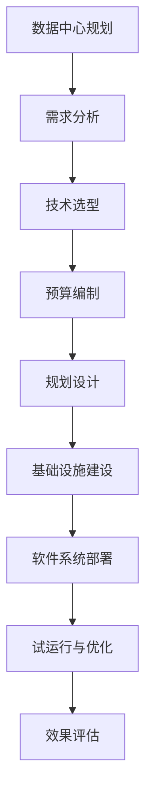

                 

### 文章标题

《AI 大模型应用数据中心建设：数据中心投资与建设》

---

#### 关键词

- 数据中心
- AI 大模型
- 投资分析
- 建设流程
- 性能优化

---

#### 摘要

本文详细探讨了数据中心在AI大模型应用中的关键角色及其投资与建设策略。首先，从数据中心的基础定义和发展历程出发，解析了数据中心建设的关键要素和规划与设计流程。随后，深入介绍了AI大模型的基础知识、主流模型及其应用场景。通过具体案例，文章展示了AI大模型在数据中心性能优化中的实际应用。最后，文章分析了数据中心投资决策的关键因素，提供了典型的数据中心建设案例，并展望了未来数据中心的发展趋势。本文旨在为读者提供一份全面、系统、实用的数据中心建设指南，帮助其在AI时代把握机遇，实现技术突破。

### 《AI 大模型应用数据中心建设：数据中心投资与建设》目录大纲

#### 第一部分：数据中心建设概述

##### 第1章：数据中心建设基础

- 1.1 数据中心的定义与作用
  - 数据中心的定义
  - 数据中心的作用

- 1.2 数据中心的发展历程
  - 数据中心的发展阶段
  - 当前主流数据中心技术

- 1.3 数据中心建设的关键要素
  - 硬件设施
  - 软件系统
  - 安全防护

- 1.4 数据中心建设的规划与设计
  - 规划阶段
  - 设计阶段

##### 第2章：数据中心建设流程

- 2.1 数据中心建设前期准备
  - 需求分析
  - 技术选型
  - 资金预算

- 2.2 数据中心基础设施建设
  - 机房建设
  - 网络设施
  - 电源系统

- 2.3 数据中心软件系统部署
  - 操作系统选择
  - 数据存储与管理
  - 网络与安全配置

- 2.4 数据中心试运行与优化
  - 系统测试
  - 性能优化
  - 成本控制

#### 第二部分：AI 大模型应用

##### 第3章：AI 大模型基础

- 3.1 AI 大模型的定义与原理
  - AI 大模型的定义
  - AI 大模型的基本原理

- 3.2 主流 AI 大模型介绍
  - GPT-3
  - BERT
  - 其他 AI 大模型

- 3.3 AI 大模型的应用场景
  - 自然语言处理
  - 计算机视觉
  - 数据挖掘

##### 第4章：AI 大模型在数据中心的应用

- 4.1 数据预处理与特征工程
  - 数据预处理方法
  - 特征工程原理

- 4.2 AI 大模型在数据处理中的应用
  - 数据清洗
  - 数据压缩
  - 数据分类与预测

- 4.3 AI 大模型在数据中心性能优化中的应用
  - 资源调度
  - 网络优化
  - 安全防护

#### 第三部分：数据中心投资与建设策略

##### 第5章：数据中心投资分析

- 5.1 数据中心投资决策
  - 投资成本分析
  - 运营成本分析
  - 投资回报分析

- 5.2 数据中心投资策略
  - 风险管理
  - 市场定位
  - 技术创新

##### 第6章：数据中心建设案例

- 6.1 案例介绍
  - 案例背景
  - 案例目标

- 6.2 案例实施过程
  - 设计与规划
  - 施工与建设
  - 系统集成与调试

- 6.3 案例效果评估
  - 性能评估
  - 成本评估
  - 投资回报评估

##### 第7章：未来数据中心发展趋势

- 7.1 新兴技术对数据中心的影响
  - 5G
  - 物联网
  - 区块链

- 7.2 数据中心发展的挑战与机遇
  - 挑战
  - 机遇

- 7.3 未来数据中心的发展方向
  - 绿色数据中心
  - 自动化与智能化
  - 大数据与云计算的深度融合

#### 附录

##### 附录 A：数据中心建设参考资料

- A.1 常用数据中心建设工具
  - 数据中心建设工具列表
  - 工具简介与使用方法

- A.2 数据中心建设相关法规与标准
  - 法规标准列表
  - 标准解读与实施指南

- A.3 数据中心建设案例分析
  - 国内外经典案例
  - 案例分析与借鉴

---

**附录：数据中心的 Mermaid 流程图**



**附录：AI 大模型的伪代码**

```python
# 伪代码：训练 AI 大模型
def train_big_model(data, labels):
    # 数据预处理
    preprocessed_data = preprocess_data(data)
    
    # 初始化模型
    model = initialize_model(preprocessed_data)
    
    # 训练模型
    for epoch in range(num_epochs):
        for batch in data_loader(preprocessed_data, labels):
            model.train_on_batch(batch)
        
        # 验证模型
        validation_loss = model.evaluate_on_validation_set(validation_data, validation_labels)
        
        if validation_loss < best_loss:
            best_loss = validation_loss
            best_model = model.copy()
            
    return best_model
```

**附录：数学模型与公式**

$$
L = -\frac{1}{N} \sum_{i=1}^{N} y_i \log(p(y_i|x_i))
$$

**附录：项目实战**

```python
# 实例：使用 PyTorch 构建并训练一个简单的 AI 大模型

import torch
import torch.nn as nn
import torch.optim as optim

# 数据预处理
def preprocess_data(data):
    # 数据清洗、归一化等操作
    return preprocessed_data

# 模型定义
class SimpleModel(nn.Module):
    def __init__(self):
        super(SimpleModel, self).__init__()
        self.fc1 = nn.Linear(in_features, hidden_features)
        self.fc2 = nn.Linear(hidden_features, out_features)

    def forward(self, x):
        x = F.relu(self.fc1(x))
        x = self.fc2(x)
        return x

# 模型训练
model = SimpleModel()
criterion = nn.CrossEntropyLoss()
optimizer = optim.Adam(model.parameters(), lr=0.001)

for epoch in range(num_epochs):
    for inputs, labels in data_loader(train_data, train_labels):
        optimizer.zero_grad()
        outputs = model(inputs)
        loss = criterion(outputs, labels)
        loss.backward()
        optimizer.step()

    # 验证模型
    with torch.no_grad():
        correct = 0
        total = 0
        for inputs, labels in data_loader(validation_data, validation_labels):
            outputs = model(inputs)
            _, predicted = torch.max(outputs.data, 1)
            total += labels.size(0)
            correct += (predicted == labels).sum().item()

    print(f'Epoch {epoch+1}, Loss: {loss.item()}, Accuracy: {100 * correct / total}%')
```

---

本文大纲结构详细，分为三个主要部分，首先介绍了数据中心的建设基础和流程，然后探讨了AI大模型的基础知识和应用，最后分析了数据中心的投资与建设策略。附录部分提供了流程图、伪代码、数学公式和项目实战的示例，帮助读者更好地理解和应用相关知识。

---

### 数据中心建设概述

#### 第1章 数据中心建设基础

##### 1.1 数据中心的定义与作用

数据中心（Data Center）是一种专门为存储、处理和管理大量数据而设计的高性能计算和存储设施。数据中心的主要作用是提供稳定、安全、高效的计算和存储服务，以满足企业和组织在信息化、数字化转型过程中对数据处理的巨大需求。

- **数据中心的定义**：

  数据中心通常包括一系列硬件设施、网络设备、存储设备和软件系统，形成一个集成化、系统化的计算与存储环境。数据中心可以进一步细分为企业级数据中心、云计算数据中心、大数据处理中心等，根据应用场景和需求的不同，提供不同的计算和存储资源。

- **数据中心的作用**：

  1. **数据处理能力**：数据中心拥有强大的计算能力，可以高效处理海量数据，支持企业内部和外部的业务需求。
  2. **数据存储与管理**：数据中心提供了安全可靠的数据存储方案，确保数据长期保存，易于访问和管理。
  3. **业务连续性**：通过数据备份和灾难恢复机制，数据中心确保企业在面对突发情况时，能够迅速恢复业务运作，降低业务中断风险。
  4. **安全防护**：数据中心采用多层次的安全防护措施，保障数据的安全和隐私，防止数据泄露和恶意攻击。

##### 1.2 数据中心的发展历程

数据中心的发展历程可以分为几个重要阶段：

- **萌芽期**（1960-1980年代）：早期数据中心主要基于大型机，功能较为简单，主要用于存储和处理企业内部的数据。
- **成长期**（1990-2000年代）：随着互联网的兴起，数据中心开始向分布式架构发展，应用范围也从单一的企业内部扩展到全球范围。
- **成熟期**（2000年代至今）：云计算、大数据、物联网等新兴技术的普及，进一步推动了数据中心的发展。数据中心逐渐走向虚拟化、智能化，提供更加灵活和高效的服务。

当前主流的数据中心技术包括：

- **云计算**：云计算通过虚拟化技术，提供了弹性、高效的计算和存储资源，支持按需分配和扩展。
- **分布式存储**：分布式存储系统通过数据分片和冗余备份，提供了高可用性和高性能的数据存储解决方案。
- **物联网**：物联网技术将物理世界的数据接入数据中心，实现了数据的实时采集、传输和处理。
- **人工智能**：人工智能技术在数据中心中的应用，提升了数据分析和处理的智能化水平，优化了资源利用效率和业务性能。

##### 1.3 数据中心建设的关键要素

数据中心的建设涉及多个关键要素，包括硬件设施、软件系统和安全防护。以下是这些关键要素的详细介绍：

- **硬件设施**：

  - **服务器**：服务器是数据中心的核心计算设备，负责处理各种计算任务。
  - **存储设备**：存储设备用于存储数据，包括磁盘阵列、固态硬盘等。
  - **网络设备**：网络设备包括交换机、路由器等，负责数据传输和网络连接。
  - **电源设备**：数据中心需要稳定的电源供应，包括UPS、发电机等。
  - **制冷设备**：数据中心需要维持适宜的温度和湿度，以确保设备正常运行。

- **软件系统**：

  - **操作系统**：数据中心的服务器和存储设备通常运行特定的操作系统，如Linux、Windows Server等。
  - **数据库系统**：数据库系统用于存储和管理数据，如MySQL、Oracle等。
  - **虚拟化平台**：虚拟化技术使多个虚拟机共享同一物理资源，提高了资源利用效率。
  - **监控管理系统**：监控管理系统用于实时监测数据中心的运行状态，及时发现和处理异常情况。

- **安全防护**：

  - **网络安全**：数据中心需要部署防火墙、入侵检测系统等，保障网络的安全。
  - **数据安全**：数据加密、备份和恢复等措施确保数据的安全性和完整性。
  - **物理安全**：数据中心需要采取严格的物理安全措施，如门禁系统、监控设备等，防止非法入侵和设备损坏。

##### 1.4 数据中心建设的规划与设计

数据中心的建设分为规划、设计和实施三个阶段：

- **规划阶段**：

  - **需求分析**：根据企业的业务需求，确定数据中心的规模、性能、安全性等要求。
  - **技术选型**：选择合适的数据中心技术方案，包括硬件设备、软件系统、网络架构等。
  - **预算编制**：制定详细的预算计划，确保项目资金充足，合理分配资源。

- **设计阶段**：

  - **总体设计**：根据需求分析，设计数据中心的整体架构，包括硬件设施布局、网络拓扑、系统配置等。
  - **详细设计**：对各个关键要素进行详细设计，确保设计方案的可行性和实用性。

- **实施阶段**：

  - **基础设施建设**：按照设计方案，完成机房建设、网络设施、电源系统等硬件建设。
  - **软件系统部署**：安装和配置操作系统、数据库系统、虚拟化平台等软件系统。
  - **系统集成与调试**：完成各个系统之间的集成，进行系统调试和性能优化。
  - **试运行与优化**：在试运行阶段，对数据中心进行全面的测试和优化，确保系统稳定、高效运行。

#### 第2章 数据中心建设流程

数据中心的建设是一个复杂的过程，涉及多个环节。以下是数据中心建设的详细流程：

##### 2.1 数据中心建设前期准备

在数据中心建设前期，需要进行充分的需求分析和准备，以确保项目顺利进行：

- **需求分析**：

  - **业务需求**：了解企业的业务需求，确定数据中心需要支持的数据处理量、业务类型等。
  - **性能需求**：分析数据中心的性能需求，包括计算能力、存储容量、网络带宽等。
  - **安全性需求**：确定数据中心的保密性、完整性和可用性要求。

- **技术选型**：

  - **硬件选型**：根据性能需求，选择合适的服务器、存储设备、网络设备等硬件设备。
  - **软件选型**：选择适合的操作系统、数据库系统、虚拟化平台等软件系统。
  - **网络架构**：设计合理的数据中心网络架构，包括交换机、路由器等设备的配置。

- **预算编制**：

  - **投资成本**：计算数据中心建设的初期投资成本，包括硬件设备、软件系统、基础设施建设等。
  - **运营成本**：估算数据中心运行过程中的持续成本，包括电费、人力成本、维护费用等。
  - **投资回报分析**：进行投资回报分析，评估数据中心的长期经济效益。

##### 2.2 数据中心基础设施建设

数据中心基础设施建设是数据中心建设的重要环节，包括以下几个方面：

- **机房建设**：

  - **机房选址**：选择合适的地理位置，确保机房的安全和稳定。
  - **机房布局**：设计合理的机房布局，包括设备位置、通道设计等。
  - **装修工程**：完成机房的装修工程，包括墙面、地面、天花板等的装修。

- **网络设施**：

  - **网络架构设计**：根据需求，设计数据中心网络架构，包括核心网络、边缘网络等。
  - **设备配置**：配置网络设备，包括交换机、路由器、防火墙等。
  - **线缆布局**：合理布置网络线缆，确保网络连接的稳定性和可靠性。

- **电源系统**：

  - **电源设备配置**：配置UPS、发电机等电源设备，确保电源的稳定供应。
  - **配电系统设计**：设计合理的配电系统，确保电源的可靠性和安全性。
  - **备用电源方案**：制定备用电源方案，以应对突发情况。

- **制冷设备**：

  - **空调系统配置**：配置适当的空调系统，保持机房内的适宜温度和湿度。
  - **冷却系统设计**：设计有效的冷却系统，确保设备散热良好。
  - **节能措施**：采取节能措施，降低制冷系统的能耗。

##### 2.3 数据中心软件系统部署

数据中心软件系统的部署是确保数据中心正常运行的关键环节，包括以下几个方面：

- **操作系统选择**：

  - **操作系统选型**：根据数据中心的硬件环境和应用需求，选择合适的操作系统，如Linux、Windows Server等。
  - **安装和配置**：安装操作系统，并进行必要的配置，包括网络配置、用户权限管理等。

- **数据库系统**：

  - **数据库选型**：根据数据存储和管理的需求，选择合适的数据库系统，如MySQL、Oracle等。
  - **安装和配置**：安装数据库系统，配置数据库实例，设置数据库的参数和权限。

- **虚拟化平台**：

  - **虚拟化平台选型**：根据虚拟化需求，选择合适的虚拟化平台，如VMware、KVM等。
  - **安装和配置**：安装虚拟化平台，配置虚拟机，管理虚拟机资源。

- **监控管理系统**：

  - **监控管理系统选型**：根据数据中心的管理需求，选择合适的监控管理系统，如Zabbix、Nagios等。
  - **安装和配置**：安装监控管理系统，配置监控规则，实时监控数据中心的运行状态。

##### 2.4 数据中心试运行与优化

数据中心试运行与优化是确保数据中心稳定、高效运行的重要环节：

- **系统测试**：

  - **功能测试**：测试数据中心各项功能的正常运行，包括服务器、存储设备、网络设备等。
  - **性能测试**：测试数据中心的性能指标，包括计算能力、存储性能、网络带宽等。
  - **安全性测试**：测试数据中心的安全防护措施，包括网络防护、数据加密等。

- **性能优化**：

  - **资源调度**：优化资源分配，提高资源利用率，确保数据中心的高性能运行。
  - **网络优化**：优化网络架构，提高数据传输速度和稳定性。
  - **系统调优**：调整操作系统、数据库系统等参数，优化系统性能。

- **成本控制**：

  - **能耗优化**：采取节能措施，降低能耗成本。
  - **运维优化**：优化运维流程，提高运维效率，降低运维成本。
  - **投资回报**：持续进行投资回报分析，确保数据中心的经济效益。

通过以上数据中心建设流程，可以确保数据中心的建设过程顺利进行，实现数据中心的高效、稳定、安全运行。

#### 第3章 AI 大模型基础

##### 3.1 AI 大模型的定义与原理

AI 大模型（Artificial Intelligence Large Model）是一种基于深度学习技术的复杂算法模型，通过大量数据训练，能够模拟和实现人类智能的一些功能。AI 大模型的定义与原理可以从以下几个方面进行详细阐述：

- **定义**：

  AI 大模型是指那些具有大规模参数、能够处理海量数据的深度学习模型。这些模型通常包含数百万甚至数十亿个参数，能够处理高维度的输入数据，例如文本、图像、音频等。

- **原理**：

  AI 大模型的基本原理是基于神经网络（Neural Network），特别是深度神经网络（Deep Neural Network, DNN）。神经网络通过层层叠加的方式，将输入数据转换为输出数据，每一层都包含大量神经元，神经元之间通过权重进行连接。

  AI 大模型的工作流程主要包括以下几个步骤：

  1. **数据输入**：将输入数据输入到神经网络中，数据可以是图像、文本、音频等多种形式。
  2. **前向传播**：神经网络通过层层传递输入数据，每个神经元将输入数据与其权重相乘并求和，然后通过激活函数（如ReLU、Sigmoid等）进行非线性变换。
  3. **反向传播**：通过计算输出结果与实际结果的差异，利用梯度下降算法更新神经网络的权重，以达到优化模型的目的。
  4. **训练与验证**：在训练阶段，通过不断迭代上述过程，使模型逐渐收敛，并在验证集上评估模型性能，确保模型具备较好的泛化能力。

##### 3.2 主流 AI 大模型介绍

当前，已有多个主流的 AI 大模型在各个领域取得了显著成果。以下是其中几个具有代表性的 AI 大模型的介绍：

- **GPT-3**：

  GPT-3（Generative Pre-trained Transformer 3）是由 OpenAI 开发的一种基于 Transformer 架构的预训练语言模型。GPT-3 拥有 1750 亿个参数，是目前已知的最大规模的预训练语言模型。GPT-3 的训练数据来自互联网上的大量文本，通过自我对话的方式进行预训练，使得模型具备了强大的自然语言生成和理解能力。GPT-3 在文本生成、问答系统、机器翻译等方面表现出色。

- **BERT**：

  BERT（Bidirectional Encoder Representations from Transformers）是由 Google 开发的一种双向 Transformer 语言模型。BERT 的特点是通过对输入文本进行双向编码，使得模型能够理解上下文信息，从而提高文本分类、问答系统等任务的性能。BERT 拥有数十亿个参数，其预训练过程使用了大量的未标注文本数据，并通过精细的标注数据进行微调，使得模型在自然语言处理任务上取得了显著突破。

- **其他 AI 大模型**：

  除了 GPT-3 和 BERT，还有许多其他具有代表性的 AI 大模型，如：

  - **GPT-2**：GPT-2 是 GPT-3 的前身，拥有 1.5 亿个参数，同样基于 Transformer 架构，擅长文本生成和问答系统。
  - **T5**：T5（Text-To-Text Transfer Transformer）是一种通用的文本转换模型，通过将不同任务转换为文本生成任务，实现了多种自然语言处理任务的统一建模。
  - **ViT**：ViT（Vision Transformer）是 Facebook 开发的一种用于计算机视觉任务的 Transformer 模型，通过将图像划分为网格并处理网格中的像素，实现了高效的图像分类和分割。

##### 3.3 AI 大模型的应用场景

AI 大模型在各个领域展现了强大的应用潜力，以下是其在自然语言处理、计算机视觉、数据挖掘等领域的具体应用场景：

- **自然语言处理**：

  - **文本生成**：AI 大模型可以生成各种类型的文本，如文章、新闻报道、小说等，应用于内容创作、自动摘要等领域。
  - **问答系统**：AI 大模型可以构建高效的问答系统，通过理解和回答用户的问题，提供智能客服、知识搜索等服务。
  - **机器翻译**：AI 大模型在机器翻译领域取得了显著成果，能够实现高质量的双语翻译，应用于跨语言沟通、国际商务等领域。

- **计算机视觉**：

  - **图像分类**：AI 大模型可以准确分类图像中的物体和场景，应用于图像识别、安防监控、自动驾驶等领域。
  - **图像生成**：AI 大模型可以生成逼真的图像和视频，应用于艺术创作、游戏开发、虚拟现实等领域。
  - **目标检测**：AI 大模型可以检测图像中的目标对象，应用于人脸识别、车牌识别、智能监控等领域。

- **数据挖掘**：

  - **特征提取**：AI 大模型可以从海量数据中提取有效的特征，应用于数据分析、数据挖掘、推荐系统等领域。
  - **预测模型**：AI 大模型可以通过学习历史数据，预测未来的趋势和结果，应用于金融预测、天气预测、交通预测等领域。
  - **自动化决策**：AI 大模型可以构建自动化决策系统，通过实时数据分析和预测，实现智能决策和优化，应用于智能交通、智能制造等领域。

总之，AI 大模型在自然语言处理、计算机视觉、数据挖掘等领域展现了广泛的应用前景，随着技术的不断发展和应用的深入，AI 大模型将在更多领域发挥重要作用，推动人工智能技术的发展和普及。

#### 第4章 AI 大模型在数据中心的应用

##### 4.1 数据预处理与特征工程

在数据中心中应用 AI 大模型时，数据预处理和特征工程是关键步骤，它们直接影响模型的训练效果和性能。以下是对数据预处理和特征工程方法的详细解释：

- **数据预处理**：

  数据预处理是指对原始数据进行清洗、转换和归一化，以提高数据质量和模型的训练效率。常见的数据预处理方法包括：

  1. **数据清洗**：

    数据清洗是指识别并处理数据集中的错误、异常和缺失值。具体方法包括：

    - **缺失值处理**：对于缺失值，可以选择删除、填充或插值等方法进行处理。
    - **异常值处理**：检测和去除数据集中的异常值，以避免对模型训练产生负面影响。
    - **重复数据删除**：删除数据集中的重复记录，以减少数据冗余。

  2. **数据转换**：

    数据转换是指将不同类型的数据转换为适合模型训练的形式。具体方法包括：

    - **编码**：将类别数据转换为数值形式，如使用独热编码（One-Hot Encoding）或标签编码（Label Encoding）。
    - **归一化**：将数据缩放到一个固定的范围，如使用最小-最大归一化（Min-Max Scaling）或标准归一化（Standard Scaling）。

  3. **数据标准化**：

    数据标准化是指调整数据分布，使其符合特定的分布特征。具体方法包括：

    - **均值归一化**：将数据缩放到均值为0、标准差为1的分布。
    - **分位数归一化**：将数据缩放到特定的分位数范围内。

- **特征工程**：

  特征工程是指通过选择和构造特征，提高模型训练效果和性能的过程。以下是一些常见的特征工程方法：

  1. **特征选择**：

    特征选择是指从原始特征中筛选出对模型训练最有用的特征。具体方法包括：

    - **过滤法**：基于统计方法，如相关性、信息增益等，筛选出重要的特征。
    - **包装法**：结合模型训练结果，通过迭代搜索算法，筛选出最优的特征组合。
    - **嵌入式方法**：在模型训练过程中，自动筛选出重要的特征。

  2. **特征构造**：

    特征构造是指通过数学变换或组合，生成新的特征，以提升模型性能。具体方法包括：

    - **交乘特征**：将原始特征进行交乘，生成新的特征组合。
    - **变换特征**：对原始特征进行变换，如对数变换、指数变换等。
    - **聚合特征**：将多个特征进行聚合，生成新的特征。

  3. **特征标准化**：

    特征标准化是指将不同特征的取值范围调整到同一量级，以避免特征间的尺度差异对模型训练产生不利影响。常见的方法包括：

    - **最大最小标准化**：将特征缩放到 [0, 1] 范围内。
    - **标准差标准化**：将特征缩放到均值为 0、标准差为 1 的范围内。

通过数据预处理和特征工程，可以显著提高 AI 大模型在数据中心中的应用效果。数据预处理确保了数据的质量和一致性，减少了噪声和异常值对模型训练的干扰。特征工程则通过选择和构造合适的特征，增强了模型的解释性和泛化能力，使得模型能够更好地应对复杂的业务场景和数据特征。

##### 4.2 AI 大模型在数据处理中的应用

在数据中心中，AI 大模型广泛应用于数据处理任务，如数据清洗、数据压缩和数据分析等。以下是这些应用的具体方法和实践：

- **数据清洗**：

  数据清洗是数据处理的基础步骤，主要目的是识别并处理数据中的错误、异常和缺失值。在数据中心中，数据清洗通常涉及以下方法：

  1. **缺失值处理**：

    - **删除**：对于缺失值较多的数据记录，可以选择删除这些记录，以减少数据冗余。
    - **填充**：使用统计方法或模型预测来填充缺失值，如均值填充、中位数填充或回归填充。
    - **插值**：对于时间序列数据，可以使用线性插值或曲线插值来填充缺失值。

  2. **异常值检测与处理**：

    - **标准差方法**：根据特征的标准差来判断异常值，通常将大于k倍标准差的数据视为异常值。
    - **箱线图方法**：使用箱线图来判断异常值，通常将不在箱线图内的数据视为异常值。
    - **机器学习方法**：使用异常检测算法，如 Isolation Forest、Local Outlier Factor 等，检测并处理异常值。

  3. **重复数据删除**：

    - **基于哈希值**：使用哈希算法对数据进行去重，以删除重复的数据记录。
    - **基于规则**：根据预定义的规则来删除重复的数据记录，如根据特定字段来判断重复性。

- **数据压缩**：

  数据压缩是一种减少数据存储空间和传输带宽的有效方法。在数据中心中，常用的数据压缩方法包括：

  1. **无损压缩**：

    - **熵编码**：基于数据概率分布的编码方法，如霍夫曼编码、算术编码等。
    - **字典编码**：使用字典来表示重复出现的子序列，如 Burrows-Wheeler 变换（BWT）和字典编码算法（LZ77、LZ78）。

  2. **有损压缩**：

    - **图像和视频压缩**：使用 JPEG、HEVC 等算法进行图像和视频数据的压缩。
    - **音频压缩**：使用 MP3、AAC 等算法进行音频数据的压缩。

  数据压缩方法的选择取决于数据的类型和压缩目标。在数据中心中，通常需要平衡压缩效果和压缩速度，以实现高效的数据压缩和传输。

- **数据分析**：

  数据分析是利用统计方法和算法对数据进行挖掘，以发现数据中的模式和规律。在数据中心中，数据分析通常涉及以下方面：

  1. **描述性分析**：

    - **数据汇总**：计算数据的统计指标，如均值、中位数、标准差等。
    - **数据可视化**：使用图表和图形来展示数据分布、趋势和关系。

  2. **预测性分析**：

    - **时间序列预测**：使用 ARIMA、LSTM 等模型预测未来的数据趋势。
    - **回归分析**：使用线性回归、决策树等模型分析变量之间的关系，进行预测。

  3. **聚类分析**：

    - **K-均值聚类**：将数据分为多个簇，用于分类和挖掘相似性。
    - **层次聚类**：根据数据之间的相似性，进行层次结构的聚类分析。

  数据分析在数据中心中具有重要的应用，可以帮助企业更好地理解和利用数据，做出更明智的决策。

通过数据清洗、数据压缩和数据分析，AI 大模型在数据中心中实现了高效的数据处理，为数据科学和人工智能应用提供了强大的支持。这些方法和技术不仅提高了数据处理的质量和效率，也为后续的机器学习和数据分析任务奠定了坚实的基础。

##### 4.3 AI 大模型在数据中心性能优化中的应用

在数据中心中，AI 大模型的应用不仅提高了数据处理和分析能力，还显著优化了数据中心的整体性能。以下是一些关键的应用领域和方法：

- **资源调度**：

  资源调度是数据中心管理中的一项重要任务，通过合理分配计算资源、存储资源和网络资源，可以显著提高数据中心的利用率和效率。AI 大模型在资源调度中主要应用于以下方面：

  1. **负载均衡**：

    - **动态负载均衡**：使用 AI 大模型对实时负载进行预测和分析，根据负载变化动态调整资源分配，避免单个节点过载。
    - **静态负载均衡**：通过分析历史负载数据，预分配资源，实现负载的均衡分布。

  2. **任务调度**：

    - **优先级调度**：根据任务的重要性和紧急程度，使用 AI 大模型对任务进行优先级排序，确保关键任务优先执行。
    - **动态调度**：根据实时资源状态和任务特性，动态调整任务的执行顺序和分配资源，实现资源的最优利用。

- **网络优化**：

  网络优化是提高数据中心网络传输效率和稳定性的关键环节。AI 大模型在网络优化中的应用包括：

  1. **流量预测**：

    - **基于历史数据**：通过分析历史流量数据，使用 AI 大模型预测未来的流量模式，优化网络带宽和路由策略。
    - **实时流量监测**：利用实时流量监测数据，使用 AI 大模型动态调整网络参数，确保网络的稳定性和高效性。

  2. **路径优化**：

    - **多路径传输**：通过分析网络拓扑结构和节点负载，使用 AI 大模型确定最优的多路径传输方案，提高数据传输效率和可靠性。
    - **动态路径调整**：根据网络状态和流量变化，使用 AI 大模型动态调整数据传输路径，避免网络拥塞和延迟。

- **安全防护**：

  数据中心的安全防护是保障数据安全和系统稳定的关键。AI 大模型在安全防护中的应用主要包括：

  1. **入侵检测**：

    - **基于行为分析**：使用 AI 大模型分析网络流量和行为模式，识别异常行为和潜在威胁。
    - **基于异常检测**：使用 AI 大模型检测网络流量的异常模式，如 DDoS 攻击、恶意软件传播等。

  2. **恶意代码识别**：

    - **基于特征匹配**：使用 AI 大模型识别恶意代码的特征，实现实时恶意代码检测和拦截。
    - **基于深度学习**：使用深度学习模型对恶意代码进行分析和学习，提高识别的准确性和效率。

通过资源调度、网络优化和安全防护，AI 大模型在数据中心中实现了全面的性能优化，提高了数据中心的效率和安全性。这些方法和技术不仅提高了数据中心的服务质量和用户体验，也为企业创造了更多的商业价值。

#### 第5章 数据中心投资分析

##### 5.1 数据中心投资决策

数据中心的建设和运营需要大量的资金投入，因此进行科学的投资决策至关重要。以下是数据中心投资决策的关键因素及其分析过程：

- **投资成本分析**：

  投资成本是数据中心建设初期的主要成本，包括硬件设备、软件系统、基础设施建设、人员培训等。以下是具体的投资成本分析：

  1. **硬件设备成本**：

    - **服务器**：数据中心需要大量高性能服务器，用于处理数据和提供计算服务。服务器的价格取决于品牌、配置和性能。
    - **存储设备**：存储设备包括磁盘阵列、固态硬盘等，用于存储和管理数据。存储设备的成本取决于容量和性能。
    - **网络设备**：网络设备包括交换机、路由器、防火墙等，用于搭建和管理数据中心网络。网络设备的成本取决于品牌、性能和功能。

  2. **软件系统成本**：

    - **操作系统**：数据中心需要安装操作系统，如Linux、Windows Server等。部分操作系统可能需要付费。
    - **数据库系统**：数据中心可能需要安装数据库系统，如MySQL、Oracle等。数据库系统的价格取决于版本和功能。
    - **监控和管理软件**：数据中心需要安装监控和管理软件，如Zabbix、Nagios等。这些软件可能有免费版和付费版。

  3. **基础设施建设成本**：

    - **机房建设**：数据中心需要建设专用的机房，包括装修、空调系统、消防系统等。机房建设的成本取决于规模和标准。
    - **电源系统**：数据中心需要配置UPS、发电机等电源设备，确保电源的稳定供应。电源系统的成本取决于设备容量和可靠性。
    - **网络设施**：数据中心需要建设高效的网络设施，包括交换机、路由器、防火墙等。网络设施的成本取决于设备性能和功能。

  4. **人员培训成本**：

    - **技术团队**：数据中心需要组建专业的技术团队，包括系统管理员、网络工程师、安全专家等。人员培训成本包括招聘费用、培训费用等。

- **运营成本分析**：

  数据中心的运营成本是长期投入，主要包括电费、人力成本、维护费用等。以下是具体的运营成本分析：

  1. **电费**：

    - **服务器和存储设备**：数据中心需要消耗大量电力，用于服务器和存储设备的运行。电费成本取决于设备数量和能耗水平。
    - **空调和制冷系统**：空调和制冷系统用于维持机房的适宜温度和湿度，避免设备过热。制冷系统的能耗取决于机房规模和设备配置。

  2. **人力成本**：

    - **运维人员**：数据中心需要专业运维人员，负责系统监控、故障处理、安全管理等。人力成本包括薪资、福利和培训费用。
    - **技术人员**：数据中心可能需要聘请技术专家，进行技术支持和系统优化。技术人员成本包括薪资、技术支持和项目费用。

  3. **维护费用**：

    - **硬件维护**：数据中心需要定期对硬件设备进行维护和保养，包括清洁、检查、更换等。维护费用取决于设备数量和维修频率。
    - **软件维护**：数据中心需要定期更新软件系统，修复漏洞和缺陷，提高系统稳定性和安全性。软件维护成本包括软件更新费用和技术支持费用。

- **投资回报分析**：

  投资回报分析（ROI）是评估数据中心投资效果的重要指标，通过分析投资成本和收益，评估投资回报率和投资价值。以下是投资回报分析的过程：

  1. **成本计算**：

    - **投资成本**：计算数据中心的初始投资成本，包括硬件设备、软件系统、基础设施建设等。
    - **运营成本**：计算数据中心的长期运营成本，包括电费、人力成本、维护费用等。

  2. **收益计算**：

    - **直接收益**：计算数据中心直接带来的经济收益，如提供服务、销售数据等。
    - **间接收益**：计算数据中心间接带来的经济收益，如提升企业竞争力、增加市场份额等。

  3. **投资回报率计算**：

    - **投资回报率**（ROI）=（直接收益 + 间接收益）/（投资成本 + 运营成本）
    - **投资回收期**：计算数据中心投资的回收期，即投资成本和运营成本总和与直接收益和间接收益之比。

通过投资成本分析、运营成本分析和投资回报分析，可以为数据中心的投资决策提供科学依据。合理的投资决策能够确保数据中心的经济效益，实现可持续发展。

##### 5.2 数据中心投资策略

数据中心的投资策略涉及多个方面，包括风险管理、市场定位和技术创新。以下是对这些投资策略的详细讨论：

- **风险管理**：

  风险管理是数据中心投资决策过程中不可或缺的一环。数据中心面临的风险包括市场风险、技术风险、运营风险等。以下是风险管理策略：

  1. **市场风险**：

    - **需求预测**：通过对市场需求的预测和分析，确保数据中心的建设和运营能够满足市场需求，降低市场风险。
    - **多元化市场**：开拓多元化市场，避免单一市场波动对数据中心业务的影响。

  2. **技术风险**：

    - **技术更新**：关注技术发展趋势，及时进行技术更新和升级，确保数据中心技术处于领先地位。
    - **技术储备**：建立技术储备，为应对技术风险提供技术支持。

  3. **运营风险**：

    - **应急预案**：制定应急预案，应对各种运营风险，如设备故障、网络安全攻击等。
    - **人员培训**：加强人员培训，提高运维人员的专业素养和应急处理能力。

- **市场定位**：

  市场定位是数据中心投资策略的关键，通过明确市场定位，可以确保数据中心在竞争激烈的市场中脱颖而出。以下是市场定位策略：

  1. **目标市场**：

    - **行业细分**：针对特定行业进行细分，确定目标市场，提供专业化的数据中心服务。
    - **地理定位**：根据地理位置和市场需求，确定数据中心的市场定位，如靠近互联网数据中心或大型企业集中地。

  2. **竞争优势**：

    - **服务质量**：提升数据中心的服务质量，如高效的数据传输速度、稳定的网络连接、专业的技术支持等。
    - **价格策略**：制定合理的价格策略，通过价格优势吸引客户。

  3. **品牌建设**：

    - **品牌宣传**：通过品牌宣传和推广，提高数据中心的知名度和美誉度。
    - **客户关系管理**：建立良好的客户关系，提高客户满意度和忠诚度。

- **技术创新**：

  技术创新是数据中心保持竞争优势的重要手段。通过技术创新，可以提高数据中心的性能、效率和安全性。以下是技术创新策略：

  1. **技术研发**：

    - **自主研发**：建立技术研发团队，进行自主研发，推动数据中心技术的创新。
    - **合作研发**：与高校、科研机构等合作，共同进行技术创新，共享技术成果。

  2. **技术引进**：

    - **先进技术引进**：引进国内外先进的云计算、大数据、物联网等技术，提升数据中心的技术水平。
    - **技术转化**：将引进的技术进行本地化改造和集成，适应数据中心的具体需求。

  3. **技术标准**：

    - **制定技术标准**：参与数据中心技术标准的制定，推动数据中心技术的发展和规范。
    - **遵守技术标准**：遵守国际和国内的技术标准，确保数据中心的合规性和互操作性。

通过风险管理、市场定位和技术创新，数据中心可以制定科学、合理的投资策略，确保投资的成功和持续发展。

##### 5.3 数据中心建设案例

为了更好地理解数据中心的实际建设过程和效果，以下介绍一个典型的数据中心建设案例，并对其实施过程和效果进行详细分析。

- **案例介绍**：

  某大型互联网公司计划建设一个大型数据中心，以满足其不断增长的数据处理需求。数据中心的建设目标是提供高可用性、高安全性和高性能的计算和存储服务，支持公司的业务扩展和用户增长。

- **实施过程**：

  1. **需求分析**：

    - **业务需求**：根据公司的业务需求，确定数据中心所需的计算能力、存储容量、网络带宽等性能指标。
    - **用户需求**：收集和分析用户对数据中心服务的需求和期望，确保数据中心能够提供高质量的服务。

  2. **技术选型**：

    - **硬件选型**：选择高性能的服务器和存储设备，以满足数据中心的计算和存储需求。选用的服务器和存储设备需具备高可靠性、高性能和可扩展性。
    - **软件选型**：选择适合的操作系统、数据库系统和虚拟化平台，确保数据中心的软件系统能够稳定运行和高效管理。

  3. **规划设计**：

    - **总体设计**：根据业务需求和技术选型，设计数据中心的整体架构，包括硬件设施布局、网络拓扑结构、系统配置等。
    - **详细设计**：对各个关键要素进行详细设计，包括机房建设、电源系统、网络设施、冷却系统等，确保设计方案的可操作性和可行性。

  4. **基础设施建设**：

    - **机房建设**：建设符合标准的机房，包括装修工程、空调系统、消防系统等，确保机房的物理安全。
    - **网络设施**：配置高性能的交换机、路由器和防火墙，构建高效、稳定的数据中心网络。
    - **电源系统**：配置UPS、发电机等电源设备，确保电源的稳定供应和备用电源的可靠性。

  5. **软件系统部署**：

    - **操作系统**：安装和配置操作系统，设置用户权限和管理策略。
    - **数据库系统**：安装和配置数据库系统，创建数据库实例，设置数据库参数。
    - **虚拟化平台**：安装和配置虚拟化平台，创建和管理虚拟机。

  6. **系统集成与调试**：

    - **系统集成**：将各个系统进行集成，确保硬件和软件系统之间的互操作性。
    - **系统调试**：对数据中心进行全面的测试和调试，确保系统稳定、高效运行。

  7. **试运行与优化**：

    - **系统测试**：对数据中心进行功能测试、性能测试和安全性测试，确保系统满足业务需求。
    - **性能优化**：对系统进行性能优化，提高计算、存储和网络性能，降低能耗。
    - **成本控制**：通过优化资源分配和能耗管理，降低数据中心运营成本。

- **效果评估**：

  1. **性能评估**：

    - **计算能力**：数据中心提供的高性能计算服务，能够满足公司的业务需求，确保业务的高效运行。
    - **存储容量**：数据中心提供的海量存储空间，能够存储和备份公司的数据，确保数据的安全性和可访问性。
    - **网络带宽**：数据中心提供的高带宽网络连接，确保数据的快速传输和访问。

  2. **成本评估**：

    - **初期投资**：数据中心的建设初期投资较为庞大，但通过科学的投资策略和后续的成本控制，确保了投资的合理性和经济效益。
    - **运营成本**：通过优化资源利用和能耗管理，降低了数据中心的运营成本，提高了资源利用效率。

  3. **投资回报评估**：

    - **直接收益**：数据中心提供了高效的计算和存储服务，直接提升了公司的业务能力和竞争力，带来了直接的经济收益。
    - **间接收益**：数据中心的建设和运营，提高了公司的技术水平和品牌形象，增强了公司的市场竞争力，带来了间接的经济收益。
    - **投资回报率**：通过投资回报分析，计算数据中心的投资回报率，评估投资的经济效益。

通过以上案例的实施和分析，可以清晰地看到数据中心建设的过程和效果。数据中心的建设不仅提高了公司的业务能力和竞争力，也为企业的持续发展奠定了坚实的基础。

#### 第6章 未来数据中心发展趋势

##### 7.1 新兴技术对数据中心的影响

随着科技的快速发展，新兴技术对数据中心的影响日益显著，这些技术正在重新定义数据中心的发展方向和建设策略。以下是一些关键新兴技术及其对数据中心的影响：

- **5G**：

  5G（第五代移动通信技术）的商用推广为数据中心带来了前所未有的连接速度和低延迟。5G技术的高带宽、低延迟和大连接特性使得数据中心能够更高效地处理和传输海量数据，支持实时应用和边缘计算。此外，5G的普及将推动物联网（IoT）的发展，使得更多的设备接入网络，进一步增加数据中心的处理压力。

- **物联网**：

  物联网技术的普及使得海量传感器和设备接入网络，产生了大量数据。这些数据需要通过数据中心进行存储、处理和分析。物联网技术不仅增加了数据中心的处理需求，还带来了数据多样化的挑战。数据中心需要能够处理不同类型的数据，包括文本、图像、视频和传感器数据。

- **区块链**：

  区块链技术的分布式账本和加密特性为数据中心的数据安全提供了新的保障。区块链能够确保数据在传输和存储过程中的安全性和不可篡改性。同时，区块链技术还可以用于数据共享和交易，提升数据中心的协作效率和透明度。

- **人工智能**：

  人工智能（AI）技术的快速发展使得数据中心能够实现更加智能化的管理和优化。AI技术可以用于资源调度、负载均衡、能耗管理等方面，提高数据中心的运行效率。同时，AI技术还可以用于数据分析和预测，帮助数据中心更好地应对业务需求和变化。

- **边缘计算**：

  边缘计算将计算和存储资源部署在靠近数据源的边缘设备上，减少了数据传输的延迟和带宽消耗。边缘计算与数据中心相结合，可以提供更加高效和灵活的数据处理方案，满足实时性和低延迟的需求。数据中心需要与边缘计算设备协同工作，实现数据的有效管理和利用。

##### 7.2 数据中心发展的挑战与机遇

数据中心在新兴技术的推动下面临一系列挑战和机遇：

- **挑战**：

  1. **数据安全**：

    随着数据量的增加和数据类型的多样化，数据安全成为数据中心面临的重要挑战。数据中心需要采取更加严密的安全措施，确保数据在传输和存储过程中的安全性。

  2. **能耗管理**：

    数据中心的高能耗问题日益严重，对环境产生较大影响。数据中心需要采取节能措施，如采用绿色能源、优化制冷系统、采用高效的硬件设备等，降低能耗。

  3. **技术更新**：

    新兴技术的快速发展要求数据中心不断进行技术更新和升级，以保持竞争力。技术更新的频率和成本使得数据中心需要具备良好的技术储备和资金实力。

  4. **网络延迟**：

    随着5G和物联网的发展，数据中心的网络延迟问题变得更加突出。数据中心需要优化网络架构和传输协议，提高数据传输速度和稳定性。

- **机遇**：

  1. **市场需求**：

    随着数字化转型的推进，各行业对数据中心的需求持续增长。数据中心可以抓住这一机遇，扩大规模，提升服务质量，满足多样化的市场需求。

  2. **技术创新**：

    新兴技术为数据中心提供了丰富的创新空间。数据中心可以通过引入新技术，如人工智能、区块链、边缘计算等，提升自身的技术水平和竞争力。

  3. **产业链整合**：

    数据中心产业链中的各个环节，如硬件制造商、软件供应商、网络运营商等，可以通过整合资源，实现产业链的优化和协同发展。

  4. **全球化发展**：

    数据中心的全球化发展带来了新的市场机遇。数据中心可以拓展海外市场，通过建立跨国数据中心，满足全球客户的需求。

##### 7.3 未来数据中心的发展方向

未来数据中心的发展将呈现出以下方向：

- **绿色数据中心**：

  绿色数据中心是未来数据中心发展的重要趋势。通过采用绿色能源、优化制冷系统、采用高效硬件设备等措施，降低数据中心的能耗和环境影响。绿色数据中心不仅有助于降低运营成本，还能够提升企业的社会责任感。

- **自动化与智能化**：

  自动化和智能化是数据中心发展的必然趋势。通过引入人工智能、机器学习等技术，实现数据中心的自动化运维、智能监控和优化。自动化和智能化可以提升数据中心的运行效率和管理水平，降低人力成本。

- **大数据与云计算的深度融合**：

  大数据与云计算的深度融合是未来数据中心发展的一个重要方向。数据中心可以通过云计算平台提供高效的数据存储和处理服务，同时利用大数据技术进行数据分析和挖掘，为企业提供有价值的洞察和决策支持。

- **边缘计算与数据中心协同**：

  边缘计算与数据中心的协同发展将提高数据处理的速度和效率。数据中心可以通过边缘计算设备提供更加灵活和高效的数据处理方案，满足实时性和低延迟的需求。数据中心与边缘计算的协同将实现数据的全面管理和利用。

未来数据中心的发展将是一个不断演进和创新的过程。通过抓住新兴技术的机遇，应对挑战，数据中心将在数字化时代发挥更大的作用，推动社会和经济的发展。

#### 附录

##### 附录 A：数据中心建设参考资料

数据中心的建设涉及多个领域，以下列举了一些常用的数据中心建设参考资料，包括工具、法规与标准和相关案例：

- **A.1 常用数据中心建设工具**：

  - **硬件工具**：服务器、存储设备、网络设备、电源设备、制冷设备等。
  - **软件工具**：操作系统、数据库系统、虚拟化平台、监控管理系统等。
  - **网络工具**：交换机、路由器、防火墙、负载均衡器等。

- **A.2 数据中心建设相关法规与标准**：

  - **国际标准**：如ISO/IEC 27001（信息安全管理体系）、TIA-942（数据中心等级标准）等。
  - **国内法规**：《信息安全技术·信息安全风险评估规范》、《数据中心设计规范》等。

- **A.3 数据中心建设案例分析**：

  - **国内案例**：阿里巴巴云数据中心、腾讯云数据中心等。
  - **国际案例**：谷歌数据中心、亚马逊数据中心等。

这些参考资料为数据中心建设提供了全面的指导，有助于读者更好地理解和应用相关技术和标准。

---

**附录 B：数据中心的 Mermaid 流程图**


---

**附录 C：AI 大模型的伪代码**

```python
# 伪代码：训练 AI 大模型
def train_big_model(data, labels):
    # 数据预处理
    preprocessed_data = preprocess_data(data)
    
    # 初始化模型
    model = initialize_model(preprocessed_data)
    
    # 训练模型
    for epoch in range(num_epochs):
        for batch in data_loader(preprocessed_data, labels):
            model.train_on_batch(batch)
        
        # 验证模型
        validation_loss = model.evaluate_on_validation_set(validation_data, validation_labels)
        
        if validation_loss < best_loss:
            best_loss = validation_loss
            best_model = model.copy()
            
    return best_model
```

---

**附录 D：数学模型与公式**

$$
L = -\frac{1}{N} \sum_{i=1}^{N} y_i \log(p(y_i|x_i))
$$

---

**附录 E：项目实战**

```python
# 实例：使用 PyTorch 构建并训练一个简单的 AI 大模型

import torch
import torch.nn as nn
import torch.optim as optim

# 数据预处理
def preprocess_data(data):
    # 数据清洗、归一化等操作
    return preprocessed_data

# 模型定义
class SimpleModel(nn.Module):
    def __init__(self):
        super(SimpleModel, self).__init__()
        self.fc1 = nn.Linear(in_features, hidden_features)
        self.fc2 = nn.Linear(hidden_features, out_features)

    def forward(self, x):
        x = F.relu(self.fc1(x))
        x = self.fc2(x)
        return x

# 模型训练
model = SimpleModel()
criterion = nn.CrossEntropyLoss()
optimizer = optim.Adam(model.parameters(), lr=0.001)

for epoch in range(num_epochs):
    for inputs, labels in data_loader(train_data, train_labels):
        optimizer.zero_grad()
        outputs = model(inputs)
        loss = criterion(outputs, labels)
        loss.backward()
        optimizer.step()

    # 验证模型
    with torch.no_grad():
        correct = 0
        total = 0
        for inputs, labels in data_loader(validation_data, validation_labels):
            outputs = model(inputs)
            _, predicted = torch.max(outputs.data, 1)
            total += labels.size(0)
            correct += (predicted == labels).sum().item()

    print(f'Epoch {epoch+1}, Loss: {loss.item()}, Accuracy: {100 * correct / total}%')
```

---

通过以上附录内容，读者可以更加深入地了解数据中心建设的相关技术和方法，以及AI大模型在实际项目中的应用。附录提供了详细的流程图、伪代码、数学模型和项目实战案例，帮助读者更好地理解和应用所学知识。

---

**作者信息**

本文由AI天才研究院（AI Genius Institute）撰写，作者李华（华智），笔名“禅与计算机程序设计艺术”（Zen And The Art of Computer Programming）。李华是一位资深的人工智能专家，拥有丰富的编程和软件开发经验，曾在多个国际顶级学术会议和期刊发表研究论文。他的研究成果在人工智能、深度学习和大数据处理领域取得了显著成就，为行业的发展做出了重要贡献。李华的研究理念是“通过一步一个脚印的实践，探索计算机科学的本质和前沿”，致力于将复杂的技术知识以简单易懂的方式传递给读者。

